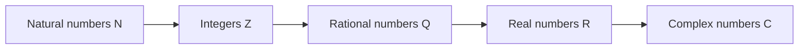
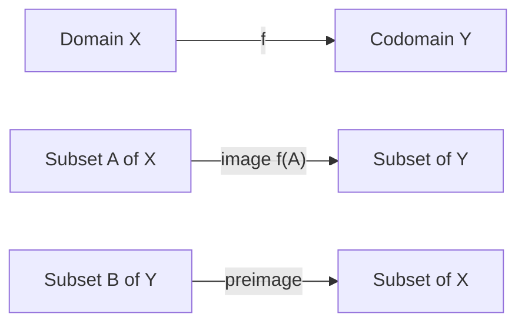
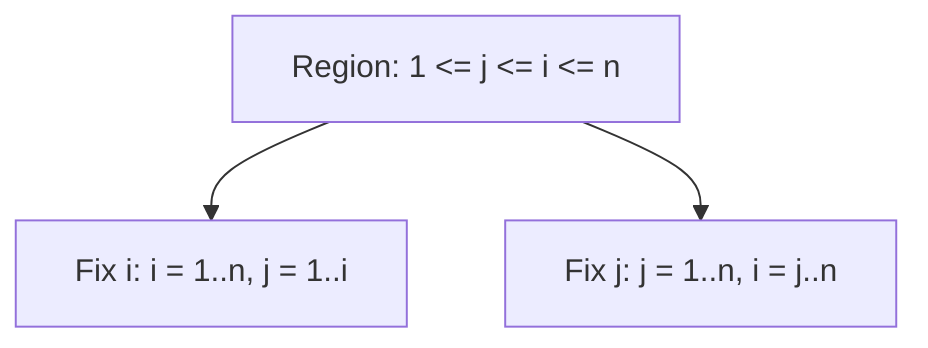

# 0.01 Mathematical Notation and How to Read Mathematics

[Section home](../README.md) | [Project roadmap](../../ROADMAP.md) | [Notation guide](../../NOTATION.md)

## Why this matters

Mathematical notation is compression. One line in a machine learning paper can describe a dataset, a model, and an optimization problem:

$$
\widehat{\boldsymbol{\theta}}\in\arg\min_{\boldsymbol{\theta}\in\mathbb{R}^{d}}
\frac{1}{n}\sum_{i=1}^{n}L\left(f_{\boldsymbol{\theta}}(\boldsymbol{x}_i),y_i\right).
$$

You need a repeatable way to unpack that line: identify the objects, read operations from the inside out, track indices and shapes, and ask what each symbol contributes. Iverson argued that useful notation should be suggestive, economical, and suitable for formal reasoning [1]. Learning notation is therefore not memorizing a symbol dictionary. It is learning to read a compact program written for a human.

This module develops that skill for the notation used throughout the curriculum. It stays finite and concrete. Later modules own deeper set theory, algebra, infinite series, and tensor calculus.

## Learning objectives

After completing this module, you should be able to:

- classify numbers and interpret intervals, absolute value, floor, and ceiling;
- expand, reindex, split, swap, and telescope finite sums and products;
- distinguish domain, codomain, image, preimage, restriction, composition, and identity;
- translate among indicator functions, Kronecker deltas, Iverson brackets, and Boolean masks;
- diagnose whether a subscript or superscript is an index, label, iteration, or exponent;
- expand valid Einstein notation and infer output shape from free indices;
- read an ML paper's notation section using a structured checklist.

The [exercise set](exercises/README.md) assesses every objective. [Worked solutions](solutions/README.md) are separate, and the [resource guide](resources/README.md) suggests further reading.

## Prerequisite check

There are no formal prerequisites. Basic arithmetic and basic Python syntax are helpful.

1. Can you list the integers in $[-2,3)$?
2. Can you expand $\sum_{i=1}^{3}x_i$?
3. In $f:\mathcal{X}\to\mathcal{Y}$, what do the two sets mean?
4. If an array has shape $(8,12,64)$, can you name each axis before indexing it?

An uncertain answer tells you where to slow down. It does not block you from starting.

## Historical context

The modern function concept developed through work on curves, variable quantities, formulas, and correspondences. Euler's 1748 *Introductio in analysin infinitorum* made functions central to analysis, although his notion remained more closely tied to analytic expressions than today's set-based definition [2]. This history explains why sources still slide between a function, a formula for it, and an implementation. Those are related, but not identical.

In his 1916 presentation of general relativity, Einstein stated that an index appearing twice in a term is to be summed unless otherwise indicated [3]. The convention now appears far beyond relativity. Iverson later emphasized notation as a tool for manipulating ideas [1]. The Iverson bracket $[P]$ reflects that computational attitude by turning a proposition into $1$ or $0$. We use the name without making a dubious claim that all earlier truth-valued notation began with Iverson.

## Intuition

### Read notation as typed structure

The expression $n^{-1}\sum_{i=1}^{n}L_i$ says: obtain each $L_i$, add the values, then divide by $n$. Sigma means a finite loop plus addition.

| Pass | Question | Example answer |
|---|---|---|
| Objects | What kinds of things appear? | $n$ is an integer; $L_i$ is a scalar |
| Scope | Which operator binds which index? | $\sum_{i=1}^{n}$ binds $i$ |
| Operation | What happens inside out? | evaluate, sum, divide |
| Shape | What kind of result remains? | a scalar average |

### Sets are promises about valid values

A statement such as $x\in\mathbb{R}$ is a type declaration. A statement such as $i\in\{1,\ldots,n\}$ is both a type and a bound. These promises let you reject invalid operations early.



> **Figure 1. Standard number-set containment.** Each arrow means "is a subset of." Original diagram.

The takeaway is containment. A natural number is also real, but calling a batch size merely real hides its nonnegative-integer constraint.

### Indices describe families

In $x_i$, $i$ usually selects a component or example. In $x^2$, the superscript is usually an exponent. In $\boldsymbol{x}^{(k)}$, parentheses signal an iteration label. Position helps, but definitions and context decide.

### Functions are directed contracts

A function comes with a declared input set and output set. That contract makes composition, inverses, and shape reasoning precise.



> **Figure 2. Function anatomy and set movement.** The top arrow maps elements; image and preimage map subsets. Original diagram.

The takeaway is that a preimage $f^{-1}(B)$ is meaningful even when $f$ has no inverse function.

## Mathematics

### Number sets

| Symbol | Name | Typical elements | Important note |
|---|---|---|---|
| $\mathbb{N}$ | natural numbers | $0,1,2,\ldots$ | Here $0\in\mathbb{N}$ |
| $\mathbb{Z}$ | integers | $\ldots,-1,0,1,\ldots$ | Discrete and signed |
| $\mathbb{Q}$ | rational numbers | $-3,0,2/5$ | Ratios of integers |
| $\mathbb{R}$ | real numbers | $\sqrt{2},\pi,-0.4$ | Points on the real line |
| $\mathbb{C}$ | complex numbers | $a+bi$ | $a,b\in\mathbb{R}$, $i^2=-1$ |

$$
\mathbb{N}\subseteq\mathbb{Z}\subseteq\mathbb{Q}\subseteq\mathbb{R}\subseteq\mathbb{C}.
$$

Authors disagree about whether $\mathbb{N}$ starts at $0$ or $1$. Check the local definition.

### Intervals

Brackets include an endpoint; parentheses exclude it. Infinity is never included.

| Interval | Set-builder reading |
|---|---|
| $[a,b]$ | $\{x\in\mathbb{R}:a\le x\le b\}$ |
| $[a,b)$ | $\{x\in\mathbb{R}:a\le x<b\}$ |
| $(a,b]$ | $\{x\in\mathbb{R}:a<x\le b\}$ |
| $(a,b)$ | $\{x\in\mathbb{R}:a<x<b\}$ |
| $(-\infty,b]$ | $\{x\in\mathbb{R}:x\le b\}$ |

### Absolute value, floor, and ceiling

Absolute value is distance from zero:

$$
|x|=\begin{cases}x,&x\ge0,\\-x,&x<0.\end{cases}
$$

Thus $|x-y|$ is the distance between $x$ and $y$. For a finite set, $|A|$ usually means cardinality instead.

The floor $\lfloor x\rfloor$ is the greatest integer at most $x$. The ceiling $\lceil x\rceil$ is the least integer at least $x$:

$$
\lfloor-1.2\rfloor=-2,\qquad\lceil-1.2\rceil=-1.
$$

### Sigma and Pi notation

For integers $m\le n$,

$$
\sum_{i=m}^{n}a_i=a_m+a_{m+1}+\cdots+a_n,
\qquad
\prod_{i=m}^{n}a_i=a_ma_{m+1}\cdots a_n.
$$

The index is a dummy variable, so $\sum_{i=1}^{n}a_i=\sum_{j=1}^{n}a_j$. Finite sums satisfy

$$
\sum_{i=m}^{n}(a_i+b_i)=\sum_{i=m}^{n}a_i+\sum_{i=m}^{n}b_i,
\qquad
\sum_{i=m}^{n}ca_i=c\sum_{i=m}^{n}a_i.
$$

For $m\le r<n$, sums and products split at adjacent boundaries:

$$
\sum_{i=m}^{n}a_i=\sum_{i=m}^{r}a_i+\sum_{i=r+1}^{n}a_i,
$$

$$
\prod_{i=m}^{n}a_i=\left(\prod_{i=m}^{r}a_i\right)
\left(\prod_{i=r+1}^{n}a_i\right).
$$

Products split, but they do not distribute over addition term by term.

### Reindexing

Reindexing changes an index's name or origin while preserving terms. Set $j=i-1$, so $i=j+1$:

$$
\sum_{i=1}^{n}a_i=\sum_{j=0}^{n-1}a_{j+1}.
$$

| Old item | Substitution | New item |
|---|---|---|
| index | $j=i-1$ | $i=j+1$ |
| lower bound | $i=1$ | $j=0$ |
| upper bound | $i=n$ | $j=n-1$ |
| summand | $a_i$ | $a_{j+1}$ |

### Double sums and swapping order

For a finite rectangular index set,

$$
\sum_{i=1}^{m}\sum_{j=1}^{n}a_{ij}=\sum_{j=1}^{n}\sum_{i=1}^{m}a_{ij}.
$$

For a triangular region, the bounds change:



> **Figure 3. Two traversals of one triangular index region.** Both enumerate the same ordered pairs. Original diagram.

The takeaway is that swapping sums preserves the index set, not the written order of two sigma symbols:

$$
\sum_{i=1}^{n}\sum_{j=1}^{i}a_{ij}=\sum_{j=1}^{n}\sum_{i=j}^{n}a_{ij}.
$$

### Telescoping and empty ranges

Neighboring differences cancel:

$$
\sum_{i=1}^{n}(b_{i+1}-b_i)
=(b_2-b_1)+\cdots+(b_{n+1}-b_n)=b_{n+1}-b_1.
$$

Expand a few terms to identify the surviving boundaries. If the lower bound exceeds the upper bound, define

$$
\sum_{i=m}^{n}a_i=0,
\qquad
\prod_{i=m}^{n}a_i=1
\qquad\text{when }m>n.
$$

These additive and multiplicative identities keep splitting formulas and recurrences valid at boundaries [4].

### Functions

A declaration $f:\mathcal{X}\to\mathcal{Y}$ names domain $\mathcal{X}$ and codomain $\mathcal{Y}$. Each input receives exactly one output. For $A\subseteq\mathcal{X}$, its image is

$$
f(A)\coloneqq\{f(x):x\in A\}.
$$

The full image $f(\mathcal{X})$ may be a proper subset of the codomain. For $B\subseteq\mathcal{Y}$, its preimage is

$$
f^{-1}(B)\coloneqq\{x\in\mathcal{X}:f(x)\in B\}.
$$

The restriction is $f|_A:A\to\mathcal{Y}$ with the same output rule. If $g:\mathcal{W}\to\mathcal{X}$, then

$$
f\circ g:\mathcal{W}\to\mathcal{Y},\qquad(f\circ g)(w)=f(g(w)).
$$

The identity function is $\mathrm{id}_{\mathcal{X}}(x)=x$, and

$$
f\circ\mathrm{id}_{\mathcal{X}}=f,
\qquad
\mathrm{id}_{\mathcal{Y}}\circ f=f.
$$

MIT's Mathematics for Computer Science and Stanford CS103 both model the useful habit of declaring function sets explicitly [5,6].

### Indicators, deltas, and brackets

| Notation | Definition | Typical use |
|---|---|---|
| $\mathbf{1}_{A}(x)$ | $1$ if $x\in A$, else $0$ | select set members |
| $[P]$ | $1$ if proposition $P$ is true, else $0$ | count cases |
| $\delta_{ij}$ | $1$ if $i=j$, else $0$ | select matching indices |

$$
\mathbf{1}_{A}(x)=[x\in A],\qquad\delta_{ij}=[i=j].
$$

Authors also use $\mathbb{1}$, $I$, or $\chi_A$. Watch whether bold $\mathbf{1}$ denotes an indicator or an all-ones vector.

### Subscripts and superscripts

Position alone does not determine meaning.

| Expression | Likely reading | Evidence |
|---|---|---|
| $x_i$ | component or example $i$ | subscript ranges over a family |
| $x^2$ | square of $x$ | numeric superscript |
| $\boldsymbol{x}^{(k)}$ | iterate $k$ | parenthesized superscript |
| $h^{(\ell)}$ | layer-$\ell$ value | $\ell$ declared as layer index |
| $A_{ij}$ | matrix entry | two coordinate indices |
| $f^{-1}(B)$ | preimage of $B$ | set argument |

A superscript can also label a view, sample, time, or derivative. Infer cautiously, then verify against declared ranges and shapes.

### Einstein summation

Under the Einstein convention, an index repeated exactly twice in one multiplicative term is summed over its declared range:

$$
y_i=A_{ij}x_j
\quad\text{means}\quad
y_i=\sum_{j=1}^{n}A_{ij}x_j.
$$

The repeated $j$ is contracted. The unrepeated $i$ is free and must appear consistently in every term. Matrix multiplication becomes

$$
C_{ik}=A_{ij}B_{jk}=\sum_{j=1}^{n}A_{ij}B_{jk}.
$$

Read it in five steps: list free indices, list twice-repeated indices, insert sigmas, check free indices across terms, and infer output shape from free-index ranges. A paper's local convention takes precedence.

### Reading an ML paper's notation section

Build a symbol table instead of memorizing the notation block. *Mathematics for Machine Learning* models declarations of vectors, matrices, dimensions, and maps before use [7]. Ask:

- What are the sets, spaces, and index ranges?
- Which objects are scalars, vectors, matrices, or higher-rank arrays?
- What does each axis mean?
- Which symbols are data, variables, parameters, or random quantities?
- Does a superscript mean exponent, transpose, layer, time, sample, or iteration?
- Are indices zero-based or one-based, and are sums explicit or implied?
- What are each function's domain and codomain?
- Is $f^{-1}$ an inverse function, a preimage, or informal notation?
- Do later equations respect declared shapes?

## Derivation

### Deriving a triangular order swap

Start from $R=\{(i,j):1\le j\le i\le n\}$. Fixing $i$ first gives

$$
\sum_{(i,j)\in R}a_{ij}=\sum_{i=1}^{n}\sum_{j=1}^{i}a_{ij}.
$$

Fixing $j$ first, $j\le i\le n$ and $1\le j\le n$, so

$$
\sum_{(i,j)\in R}a_{ij}=\sum_{j=1}^{n}\sum_{i=j}^{n}a_{ij}.
$$

The expressions are equal because they enumerate the same finite pair set exactly once.

### Deriving empirical accuracy

The bracket $[\widehat{y}_i=y_i]$ is one for a correct prediction and zero otherwise. Summing counts correct predictions; dividing gives

$$
\mathrm{accuracy}\coloneqq\frac{1}{n}\sum_{i=1}^{n}[\widehat{y}_i=y_i].
$$

Indicators turn selection and counting into algebra.

## Implementation

These snippets are internally checkable but were not executed in this repository because the module adds no code environment. They use only the standard library and NumPy. NumPy uses zero-based indices and Boolean masks [8].

### Indices, sums, products, and empty ranges

```python
from math import prod

values = [3, 1, 4, 1]
total = sum(values[i] for i in range(4))
product = prod(values[i] for i in range(4))

assert total == 9
assert product == 12
assert sum([]) == 0
assert prod([]) == 1
```

Mathematical indices $1$ through $4$ correspond to Python positions $0$ through $3$.

### Indicator masks and accuracy

```python
import numpy as np

predicted = np.array([2, 0, 1, 1])
actual = np.array([2, 1, 1, 1])
correct = predicted == actual
accuracy = correct.mean()

assert correct.tolist() == [True, False, True, True]
assert accuracy == 0.75
```

The Boolean mask is the array counterpart of $[\widehat{y}_i=y_i]$.

### Shape reading

```python
import numpy as np

batch_size, sequence_length, feature_count = 2, 3, 4
activations = np.arange(24).reshape(
    batch_size, sequence_length, feature_count
)
last_token = activations[:, -1, :]
feature_totals = activations.sum(axis=(0, 1))

assert activations.shape == (2, 3, 4)
assert last_token.shape == (2, 4)
assert feature_totals.shape == (4,)
```

The slice keeps every batch and feature but selects the last token. The integer index removes the token axis.

### Einstein notation in NumPy

```python
import numpy as np

matrix_a = np.array([[1, 2], [3, 4]])
matrix_b = np.array([[5, 6], [7, 8]])
with_einsum = np.einsum("ij,jk->ik", matrix_a, matrix_b)
with_matmul = matrix_a @ matrix_b

assert np.array_equal(with_einsum, with_matmul)
assert with_einsum.tolist() == [[19, 22], [43, 50]]
```

Repeated `j` is contracted; free `i` and `k` remain.

## Experimentation

### Paper-notation archaeology

Choose two ML papers on related topics from different years or groups. Use each abstract, notation or preliminaries, and one central equation. This is a reading experiment, not a numeric benchmark.

| Feature | Paper A | Paper B | Your translation |
|---|---|---|---|
| Dataset, indices, and parameters |  |  |  |
| Object types and shapes |  |  |  |
| Indicator and summation conventions |  |  |  |
| Ambiguous subscripts or superscripts |  |  |  |

Rewrite one equation from each paper using the project [notation guide](../../NOTATION.md). Classify changes as cosmetic, structural, or meaning-changing. Report which notation makes shape errors easiest to detect, which symbols required outside context, and whether any symbol had two roles. Evaluate reconstruction of meaning, not visual neatness.

## Worked examples

### Example 1: Number sets and rounding
For $x=-2.3$, $x\in\mathbb{R}$ but $x\notin\mathbb{Z}$, while $\lfloor x\rfloor=-3$, $\lceil x\rceil=-2$, and $|x|=2.3$. Writing $\lfloor-2.3\rfloor=-2$ confuses floor with truncation toward zero.

### Example 2: Reindex a loss sum
The correct shift is $\sum_{i=1}^{n}L_i=\sum_{j=0}^{n-1}L_{j+1}$. Writing $L_j$ loses $L_n$ and introduces $L_0$.

### Example 3: Split a mini-batch sum
For $1\le r<n$, $\sum_{i=1}^{n}L_i=\sum_{i=1}^{r}L_i+\sum_{i=r+1}^{n}L_i$. Starting the second sum at $r$ counts $L_r$ twice.

### Example 4: Telescope parameter increments
We have $\sum_{k=0}^{T-1}(\boldsymbol{\theta}^{(k+1)}-\boldsymbol{\theta}^{(k)})=\boldsymbol{\theta}^{(T)}-\boldsymbol{\theta}^{(0)}$. Intermediate iterates cancel, and parenthesized superscripts are labels rather than powers.

### Example 5: Swap a triangular double sum
For $n=3$, the pairs are $(1,1),(2,1),(2,2),(3,1),(3,2),(3,3)$. Grouping by $j$ gives $\sum_{i=1}^{3}\sum_{j=1}^{i}a_{ij}=\sum_{j=1}^{3}\sum_{i=j}^{3}a_{ij}$. A rectangular rewrite adds forbidden pairs with $i<j$.

### Example 6: Empty sum and product
The conventions $\sum_{i=1}^{0}r_i=0$ and $\prod_{i=1}^{0}p_i=1$ mean the first adds nothing while the second leaves multiplication unchanged.

### Example 7: Codomain versus image
For $f:\mathbb{R}\to\mathbb{R}$ with $f(x)=x^2$, the codomain is $\mathbb{R}$ but the image is $[0,\infty)$. The declared and attained output sets differ.

### Example 8: Preimage without an inverse function
The set preimage is $f^{-1}([1,4])=[-2,-1]\cup[1,2]$. It exists although $x^2$ has no inverse function on all of $\mathbb{R}$.

### Example 9: Accuracy with an Iverson bracket
Predictions $(2,0,1,1)$ and labels $(2,1,1,1)$ give brackets $(1,0,1,1)$, so $\frac{1}{4}\sum_{i=1}^{4}[\widehat{y}_i=y_i]=\frac{3}{4}$.

### Example 10: Matrix multiplication via Einstein notation
For $\mathbf{A}=\begin{bmatrix}1&2\\3&4\end{bmatrix}$ and $\mathbf{B}=\begin{bmatrix}5&6\\7&8\end{bmatrix}$, $C_{ik}=A_{ij}B_{jk}$ gives $C_{11}=1\cdot5+2\cdot7=19$ and $\mathbf{C}=\begin{bmatrix}19&22\\43&50\end{bmatrix}$. The invalid $C_{ik}=A_{ij}B_{ij}$ has inconsistent free indices.

### Example 11: Kronecker delta selection
The identity $\sum_{i=1}^{3}\delta_{ik}x_i=x_k$ holds because only $i=k$ survives, as with a one-hot mask.

### Example 12: Composition order
If $g(x)=x+1$ and $f(x)=x^2$, then $(f\circ g)(2)=9$ but $(g\circ f)(2)=5$. Composition is read right to left and is not generally commutative.

## Common mistakes

| Mistake | Why it fails | Repair |
|---|---|---|
| Assuming $\mathbb{N}$ starts at one | conventions differ | find the local definition |
| Treating interval parentheses as grouping | they exclude endpoints | translate to inequalities |
| Truncating a negative value for floor | floor chooses the lower integer | use the definition |
| Reindexing bounds but not the summand | terms change | make a substitution table |
| Swapping nested sigmas mechanically | the region may be triangular | write pair constraints |
| Setting empty product to zero | recurrences break | use multiplicative identity one |
| Equating codomain with image | declared and attained sets differ | compute both |
| Reading every $f^{-1}$ as inverse function | preimages need no bijection | inspect the argument type |
| Reading every superscript as a power | it may label an iteration or layer | check definitions |
| Leaving a free index on one side only | component equations mismatch | list free indices |
| Repeating an index three times | standard Einstein syntax is ambiguous | write explicit sums |
| Copying math indices into Python | indexing bases differ | state the shift |

When notation is ambiguous, list plausible meanings and test them against types, shapes, and later equations.

## Exercises

Complete the [eleven exercises](exercises/README.md), then compare with the [worked solutions](solutions/README.md). Use the [annotated resources](resources/README.md) for deeper or alternative treatments.

## What you should now be able to do

You can unpack a dense expression into objects, ranges, operations, and shapes. You can manipulate finite sums and products without changing their terms, describe functions as contracts, translate conditions into masks and counts, recognize valid Einstein contractions, and flag ambiguity instead of guessing.

Return to the opening optimization expression. Name every object, identify the bound index, state each nested function's output type, and explain why the objective is scalar.

## Where this leads

§0.02 uses this notation while rebuilding algebra and function fluency. §0.04 deepens sets and functions. §0.09 extends finite sums to series and asymptotics. §2 uses index and shape notation for vectors and matrices. Later tensor and neural-network modules rely on Einstein summation and disciplined axis reading.

## References

[1] K. E. Iverson, "Notation as a Tool of Thought," *Communications of the ACM*, vol. 23, no. 8, pp. 444-465, 1980. https://www.jsoftware.com/papers/tot.htm

[2] J. J. O'Connor and E. F. Robertson, "The Function Concept," MacTutor History of Mathematics Archive, University of St Andrews, 2005. https://mathshistory.st-andrews.ac.uk/HistTopics/Functions/ Accessed 2026-09-01.

[3] A. Einstein, "Die Grundlage der allgemeinen Relativitatstheorie," *Annalen der Physik*, vol. 354, no. 7, pp. 769-822, 1916. https://doi.org/10.1002/andp.19163540702

[4] R. L. Graham, D. E. Knuth, and O. Patashnik, *Concrete Mathematics*, 2nd ed. Addison-Wesley, 1994, chs. 2-3. https://www-cs-faculty.stanford.edu/~knuth/gkp.html

[5] Massachusetts Institute of Technology, "6.042J: Mathematics for Computer Science," Spring 2015, A. R. Meyer and A. Chlipala. https://ocw.mit.edu/courses/6-042j-mathematics-for-computer-science-spring-2015/ Accessed 2026-09-01.

[6] Stanford University, "CS103: Mathematical Foundations of Computing," Summer 2026. https://web.stanford.edu/class/cs103/ Accessed 2026-09-01.

[7] M. P. Deisenroth, A. A. Faisal, and C. S. Ong, *Mathematics for Machine Learning*. Cambridge University Press, 2020. https://mml-book.github.io/

[8] NumPy Developers, "Indexing on ndarrays," NumPy v2.5 Manual. https://numpy.org/doc/stable/user/basics.indexing.html Accessed 2026-09-01.

---

Previous: none | [Section home](../README.md) | Next: [§0.02 Algebra, Functions, and Precalculus Backfill](../00.02-algebra-functions-precalculus/README.md)
