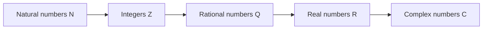
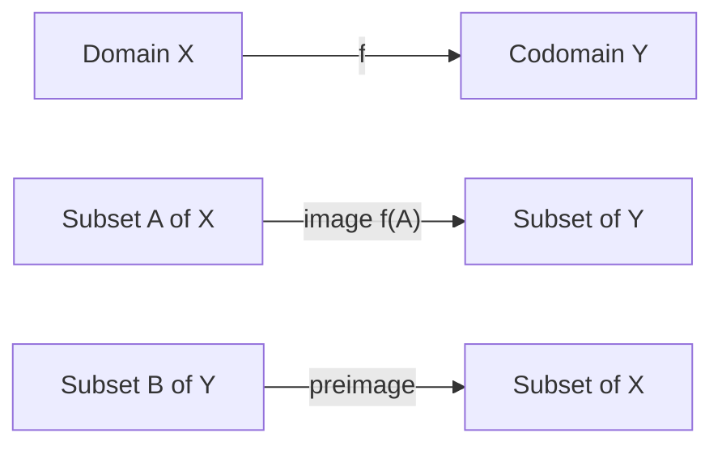
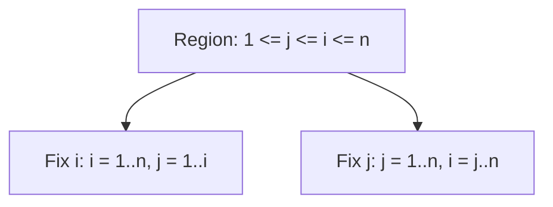

# 0.01 Mathematical Notation and How to Read Mathematics

[Section home](../README.md) | [Project roadmap](../../ROADMAP.md) | [Notation guide](../../NOTATION.md)

Learn to unpack mathematical expressions into objects, ranges, operations, and shapes, manipulate finite sums and products, and reconstruct notation in an ML paper. This is a finite, concrete reference; deeper set theory, algebra, infinite series, and tensor calculus belong to later modules.

No formal prerequisites are needed. Basic arithmetic and basic Python syntax are helpful for the computational examples.

**Contents**

- [Check your starting point](#check-your-starting-point) · [Notation as compression](#notation-as-compression)
- [Historical context](#historical-context) · [Reading objects, indices, and shapes](#reading-objects-indices-and-shapes)
- [Number sets, sums, and functions](#number-sets-sums-and-functions) · [From index regions to counts](#from-index-regions-to-counts)
- [Worked examples](#worked-examples) · [Implementation](#implementation)
- [Paper-reading experiment](#paper-reading-experiment) · [Common mistakes](#common-mistakes)
- [Check your understanding](#check-your-understanding) · [Where this leads](#where-this-leads)
- [Practice](#practice) · [References](#references)

## Check your starting point

1. Can you list the integers in $`[-2,3)`$?
2. Can you expand $`\sum_{i=1}^{3}x_i`$?
3. In $`f:\mathcal{X}\to\mathcal{Y}`$, what do the two sets mean?
4. If an array has shape $`(8,12,64)`$, can you name each axis before indexing it?

An uncertain answer tells you where to slow down. It does not block you from starting.

## Notation as compression

Mathematical notation is compression. One line in a machine learning paper can describe a dataset, a model, and an optimization problem:

$$
\widehat{\boldsymbol{\theta}}\in\arg\min_{\boldsymbol{\theta}\in\mathbb{R}^{d}}
\frac{1}{n}\sum_{i=1}^{n}L\left(f_{\boldsymbol{\theta}}(\boldsymbol{x}_i),y_i\right).
$$

You need a repeatable way to unpack that line: identify the objects, read operations from the inside out, track indices and shapes, and ask what each symbol contributes. Iverson argued that useful notation should be suggestive, economical, and suitable for formal reasoning [1]. Learning notation is therefore not memorizing a symbol dictionary. It is learning to read a compact program written for a human.

## Historical context

The modern function concept developed through work on curves, variable quantities, formulas, and correspondences. Euler's 1748 *Introductio in analysin infinitorum* made functions central to analysis, although his notion remained more closely tied to analytic expressions than today's set-based definition [2]. This history explains why sources still slide between a function, a formula for it, and an implementation. Those are related, but not identical.

In his 1916 presentation of general relativity, Einstein stated that an index appearing twice in a term is to be summed unless otherwise indicated [3]. The convention now appears far beyond relativity. Iverson later emphasized notation as a tool for manipulating ideas [1]. The Iverson bracket $`[P]`$ reflects that computational attitude by turning a proposition into $`1`$ or $`0`$. We use the name without making a dubious claim that all earlier truth-valued notation began with Iverson.

## Reading objects, indices, and shapes

### Read notation as typed structure

The expression $`n^{-1}\sum_{i=1}^{n}L_i`$ says: obtain each $`L_i`$, add the values, then divide by $`n`$. Sigma means a finite loop plus addition.

| Pass | Question | Example answer |
|---|---|---|
| Objects | What kinds of things appear? | $`n`$ is an integer; $`L_i`$ is a scalar |
| Scope | Which operator binds which index? | $`\sum_{i=1}^{n}`$ binds $`i`$ |
| Operation | What happens inside out? | evaluate, sum, divide |
| Shape | What kind of result remains? | a scalar average |

### Sets are promises about valid values

A statement such as $`x\in\mathbb{R}`$ is a type declaration. A statement such as $`i\in\lbrace 1,\ldots,n\rbrace`$ is both a type and a bound. These promises let you reject invalid operations early.



> **Figure 1. Standard number-set containment.** Each arrow means "is a subset of." Original diagram.

The takeaway is containment. A natural number is also real, but calling a batch size merely real hides its nonnegative-integer constraint.

### Indices describe families

In $`x_i`$, $`i`$ usually selects a component or example. In $`x^2`$, the superscript is usually an exponent. In $`\boldsymbol{x}^{(k)}`$, parentheses signal an iteration label. Position helps, but definitions and context decide.

### Functions are directed contracts

A function comes with a declared input set and output set. That contract makes composition, inverses, and shape reasoning precise.



> **Figure 2. Function anatomy and set movement.** The top arrow maps elements; image and preimage map subsets. Original diagram.

The takeaway is that a preimage $`f^{-1}(B)`$ is meaningful even when $`f`$ has no inverse function.

## Number sets, sums, and functions

### Number sets

| Symbol | Name | Typical elements | Important note |
|---|---|---|---|
| $`\mathbb{N}`$ | natural numbers | $`0,1,2,\ldots`$ | Here $`0\in\mathbb{N}`$ |
| $`\mathbb{Z}`$ | integers | $`\ldots,-1,0,1,\ldots`$ | Discrete and signed |
| $`\mathbb{Q}`$ | rational numbers | $`-3,0,2/5`$ | Ratios of integers |
| $`\mathbb{R}`$ | real numbers | $`\sqrt{2},\pi,-0.4`$ | Points on the real line |
| $`\mathbb{C}`$ | complex numbers | $`a+bi`$ | $`a,b\in\mathbb{R}`$, $`i^2=-1`$ |

$$
\mathbb{N}\subseteq\mathbb{Z}\subseteq\mathbb{Q}\subseteq\mathbb{R}\subseteq\mathbb{C}.
$$

Authors disagree about whether $`\mathbb{N}`$ starts at $`0`$ or $`1`$. Check the local definition.

### Intervals

Brackets include an endpoint; parentheses exclude it. Infinity is never included.

| Interval | Set-builder reading |
|---|---|
| $`[a,b]`$ | $`\lbrace x\in\mathbb{R}:a\le x\le b\rbrace`$ |
| $`[a,b)`$ | $`\lbrace x\in\mathbb{R}:a\le x<b\rbrace`$ |
| $`(a,b]`$ | $`\lbrace x\in\mathbb{R}:a<x\le b\rbrace`$ |
| $`(a,b)`$ | $`\lbrace x\in\mathbb{R}:a<x<b\rbrace`$ |
| $`(-\infty,b]`$ | $`\lbrace x\in\mathbb{R}:x\le b\rbrace`$ |

### Absolute value, floor, and ceiling

Absolute value is distance from zero:

$$
|x|=\begin{cases}x,&x\ge0,\\\\-x,&x<0.\end{cases}
$$

Thus $`|x-y|`$ is the distance between $`x`$ and $`y`$. For a finite set, $`|A|`$ usually means cardinality instead.

The floor $`\lfloor x\rfloor`$ is the greatest integer at most $`x`$. The ceiling $`\lceil x\rceil`$ is the least integer at least $`x`$:

$$
\lfloor-1.2\rfloor=-2,\qquad\lceil-1.2\rceil=-1.
$$

### Sigma and Pi notation

For integers $`m\le n`$,

$$
\sum_{i=m}^{n}a_i=a_m+a_{m+1}+\cdots+a_n,
\qquad
\prod_{i=m}^{n}a_i=a_ma_{m+1}\cdots a_n.
$$

The index is a dummy variable, so $`\sum_{i=1}^{n}a_i=\sum_{j=1}^{n}a_j`$. Finite sums satisfy

$$
\sum_{i=m}^{n}(a_i+b_i)=\sum_{i=m}^{n}a_i+\sum_{i=m}^{n}b_i,
\qquad
\sum_{i=m}^{n}ca_i=c\sum_{i=m}^{n}a_i.
$$

For $`m\le r<n`$, sums and products split at adjacent boundaries:

$$
\sum_{i=m}^{n}a_i=\sum_{i=m}^{r}a_i+\sum_{i=r+1}^{n}a_i,
$$

$$
\prod_{i=m}^{n}a_i=\left(\prod_{i=m}^{r}a_i\right)
\left(\prod_{i=r+1}^{n}a_i\right).
$$

Products split, but they do not distribute over addition term by term.

### Reindexing

Reindexing changes an index's name or origin while preserving terms. Set $`j=i-1`$, so $`i=j+1`$:

$$
\sum_{i=1}^{n}a_i=\sum_{j=0}^{n-1}a_{j+1}.
$$

| Old item | Substitution | New item |
|---|---|---|
| index | $`j=i-1`$ | $`i=j+1`$ |
| lower bound | $`i=1`$ | $`j=0`$ |
| upper bound | $`i=n`$ | $`j=n-1`$ |
| summand | $`a_i`$ | $`a_{j+1}`$ |

### Double sums and swapping order

For a finite rectangular index set,

$$
\sum_{i=1}^{m}\sum_{j=1}^{n}a_{ij}=\sum_{j=1}^{n}\sum_{i=1}^{m}a_{ij}.
$$

For a triangular region, the bounds change:



> **Figure 3. Two traversals of one triangular index region.** Both enumerate the same ordered pairs. Original diagram.

The takeaway is that swapping sums preserves the index set, not the written order of two sigma symbols:

$$
\sum_{i=1}^{n}\sum_{j=1}^{i}a_{ij}=\sum_{j=1}^{n}\sum_{i=j}^{n}a_{ij}.
$$

### Telescoping and empty ranges

Neighboring differences cancel:

$$
\sum_{i=1}^{n}(b_{i+1}-b_i)
=(b_2-b_1)+\cdots+(b_{n+1}-b_n)=b_{n+1}-b_1.
$$

Expand a few terms to identify the surviving boundaries. If the lower bound exceeds the upper bound, define

$$
\sum_{i=m}^{n}a_i=0,
\qquad
\prod_{i=m}^{n}a_i=1
\qquad\text{when }m>n.
$$

These additive and multiplicative identities keep splitting formulas and recurrences valid at boundaries [4].

### Functions

A declaration $`f:\mathcal{X}\to\mathcal{Y}`$ names domain $`\mathcal{X}`$ and codomain $`\mathcal{Y}`$. Each input receives exactly one output. For $`A\subseteq\mathcal{X}`$, its image is

$$
f(A)\coloneqq\lbrace f(x):x\in A\rbrace.
$$

The full image $`f(\mathcal{X})`$ may be a proper subset of the codomain. For $`B\subseteq\mathcal{Y}`$, its preimage is

$$
f^{-1}(B)\coloneqq\lbrace x\in\mathcal{X}:f(x)\in B\rbrace.
$$

The restriction is $`f|_A:A\to\mathcal{Y}`$ with the same output rule. If $`g:\mathcal{W}\to\mathcal{X}`$, then

$$
f\circ g:\mathcal{W}\to\mathcal{Y},\qquad(f\circ g)(w)=f(g(w)).
$$

The identity function is $`\mathrm{id}_{\mathcal{X}}(x)=x`$, and

$$
f\circ\mathrm{id}_{\mathcal{X}}=f,
\qquad
\mathrm{id}_{\mathcal{Y}}\circ f=f.
$$

MIT's Mathematics for Computer Science and Stanford CS103 both model the useful habit of declaring function sets explicitly [5,6].

### Indicators, deltas, and brackets

| Notation | Definition | Typical use |
|---|---|---|
| $`\mathbf{1}_{A}(x)`$ | $`1`$ if $`x\in A`$, else $`0`$ | select set members |
| $`[P]`$ | $`1`$ if proposition $`P`$ is true, else $`0`$ | count cases |
| $`\delta_{ij}`$ | $`1`$ if $`i=j`$, else $`0`$ | select matching indices |

$$
\mathbf{1}_{A}(x)=[x\in A],\qquad\delta_{ij}=[i=j].
$$

Authors also use $`\mathbb{1}`$, $`I`$, or $`\chi_A`$. Watch whether bold $`\mathbf{1}`$ denotes an indicator or an all-ones vector.

### Subscripts and superscripts

Position alone does not determine meaning.

| Expression | Likely reading | Evidence |
|---|---|---|
| $`x_i`$ | component or example $`i`$ | subscript ranges over a family |
| $`x^2`$ | square of $`x`$ | numeric superscript |
| $`\boldsymbol{x}^{(k)}`$ | iterate $`k`$ | parenthesized superscript |
| $`h^{(\ell)}`$ | layer-$`\ell`$ value | $`\ell`$ declared as layer index |
| $`A_{ij}`$ | matrix entry | two coordinate indices |
| $`f^{-1}(B)`$ | preimage of $`B`$ | set argument |

A superscript can also label a view, sample, time, or derivative. Infer cautiously, then verify against declared ranges and shapes.

### Einstein summation

Under the Einstein convention, an index repeated exactly twice in one multiplicative term is summed over its declared range:

$$
y_i=A_{ij}x_j
\quad\text{means}\quad
y_i=\sum_{j=1}^{n}A_{ij}x_j.
$$

The repeated $`j`$ is contracted. The unrepeated $`i`$ is free and must appear consistently in every term. Matrix multiplication becomes

$$
C_{ik}=A_{ij}B_{jk}=\sum_{j=1}^{n}A_{ij}B_{jk}.
$$

Read it in five steps: list free indices, list twice-repeated indices, insert sigmas, check free indices across terms, and infer output shape from free-index ranges. A paper's local convention takes precedence.

### Reading an ML paper's notation section

Build a symbol table instead of memorizing the notation block. *Mathematics for Machine Learning* models declarations of vectors, matrices, dimensions, and maps before use [7]. Ask:

- What are the sets, spaces, and index ranges?
- Which objects are scalars, vectors, matrices, or higher-rank arrays?
- What does each axis mean?
- Which symbols are data, variables, parameters, or random quantities?
- Does a superscript mean exponent, transpose, layer, time, sample, or iteration?
- Are indices zero-based or one-based, and are sums explicit or implied?
- What are each function's domain and codomain?
- Is $`f^{-1}`$ an inverse function, a preimage, or informal notation?
- Do later equations respect declared shapes?

## From index regions to counts

### Deriving a triangular order swap

Start from $`R=\lbrace (i,j):1\le j\le i\le n\rbrace`$. Fixing $`i`$ first gives

$$
\sum_{(i,j)\in R}a_{ij}=\sum_{i=1}^{n}\sum_{j=1}^{i}a_{ij}.
$$

Fixing $`j`$ first, $`j\le i\le n`$ and $`1\le j\le n`$, so

$$
\sum_{(i,j)\in R}a_{ij}=\sum_{j=1}^{n}\sum_{i=j}^{n}a_{ij}.
$$

The expressions are equal because they enumerate the same finite pair set exactly once.

### Deriving empirical accuracy

The bracket $`[\widehat{y}_i=y_i]`$ is one for a correct prediction and zero otherwise. Summing counts correct predictions; dividing gives

$$
\mathrm{accuracy}\coloneqq\frac{1}{n}\sum_{i=1}^{n}[\widehat{y}_i=y_i].
$$

Indicators turn selection and counting into algebra.

## Worked examples

### Example 1: Number sets and rounding
For $`x=-2.3`$, $`x\in\mathbb{R}`$ but $`x\notin\mathbb{Z}`$, while $`\lfloor x\rfloor=-3`$, $`\lceil x\rceil=-2`$, and $`|x|=2.3`$. Writing $`\lfloor-2.3\rfloor=-2`$ confuses floor with truncation toward zero.

### Example 2: Reindex a loss sum
The correct shift is $`\sum_{i=1}^{n}L_i=\sum_{j=0}^{n-1}L_{j+1}`$. Writing $`L_j`$ loses $`L_n`$ and introduces $`L_0`$.

### Example 3: Split a mini-batch sum
For $`1\le r<n`$, $`\sum_{i=1}^{n}L_i=\sum_{i=1}^{r}L_i+\sum_{i=r+1}^{n}L_i`$. Starting the second sum at $`r`$ counts $`L_r`$ twice.

### Example 4: Telescope parameter increments
We have $`\sum_{k=0}^{T-1}(\boldsymbol{\theta}^{(k+1)}-\boldsymbol{\theta}^{(k)})=\boldsymbol{\theta}^{(T)}-\boldsymbol{\theta}^{(0)}`$. Intermediate iterates cancel, and parenthesized superscripts are labels rather than powers.

### Example 5: Swap a triangular double sum
For $`n=3`$, the pairs are $`(1,1),(2,1),(2,2),(3,1),(3,2),(3,3)`$. Grouping by $`j`$ gives $`\sum_{i=1}^{3}\sum_{j=1}^{i}a_{ij}=\sum_{j=1}^{3}\sum_{i=j}^{3}a_{ij}`$. A rectangular rewrite adds forbidden pairs with $`i<j`$.

### Example 6: Empty sum and product
The conventions $`\sum_{i=1}^{0}r_i=0`$ and $`\prod_{i=1}^{0}p_i=1`$ mean the first adds nothing while the second leaves multiplication unchanged.

### Example 7: Codomain versus image
For $`f:\mathbb{R}\to\mathbb{R}`$ with $`f(x)=x^2`$, the codomain is $`\mathbb{R}`$ but the image is $`[0,\infty)`$. The declared and attained output sets differ.

### Example 8: Preimage without an inverse function
The set preimage is $`f^{-1}([1,4])=[-2,-1]\cup[1,2]`$. It exists although $`x^2`$ has no inverse function on all of $`\mathbb{R}`$.

### Example 9: Accuracy with an Iverson bracket
Predictions $`(2,0,1,1)`$ and labels $`(2,1,1,1)`$ give brackets $`(1,0,1,1)`$, so $`\frac{1}{4}\sum_{i=1}^{4}[\widehat{y}_i=y_i]=\frac{3}{4}`$.

### Example 10: Matrix multiplication via Einstein notation
For $`\mathbf{A}=\begin{bmatrix}1&2\\3&4\end{bmatrix}`$ and $`\mathbf{B}=\begin{bmatrix}5&6\\7&8\end{bmatrix}`$, $`C_{ik}=A_{ij}B_{jk}`$ gives $`C_{11}=1\cdot5+2\cdot7=19`$ and $`\mathbf{C}=\begin{bmatrix}19&22\\43&50\end{bmatrix}`$. The invalid $`C_{ik}=A_{ij}B_{ij}`$ has inconsistent free indices.

### Example 11: Kronecker delta selection
The identity $`\sum_{i=1}^{3}\delta_{ik}x_i=x_k`$ holds because only $`i=k`$ survives, as with a one-hot mask.

### Example 12: Composition order
If $`g(x)=x+1`$ and $`f(x)=x^2`$, then $`(f\circ g)(2)=9`$ but $`(g\circ f)(2)=5`$. Composition is read right to left and is not generally commutative.

## Implementation

These snippets use Python 3, its standard library, and NumPy. Run them in a Python session or notebook from any working directory; no local data files are required. NumPy uses zero-based indices and Boolean masks [8].

### Indices, sums, products, and empty ranges

```python
from math import prod

values = [3, 1, 4, 1]
total = sum(values[i] for i in range(4))
product = prod(values[i] for i in range(4))

assert total == 9
assert product == 12
assert sum([]) == 0
assert prod([]) == 1
```

Mathematical indices $`1`$ through $`4`$ correspond to Python positions $`0`$ through $`3`$.

### Indicator masks and accuracy

```python
import numpy as np

predicted = np.array([2, 0, 1, 1])
actual = np.array([2, 1, 1, 1])
correct = predicted == actual
accuracy = correct.mean()

assert correct.tolist() == [True, False, True, True]
assert accuracy == 0.75
```

The Boolean mask is the array counterpart of $`[\widehat{y}_i=y_i]`$.

### Shape reading

```python
import numpy as np

batch_size, sequence_length, feature_count = 2, 3, 4
activations = np.arange(24).reshape(
    batch_size, sequence_length, feature_count
)
last_token = activations[:, -1, :]
feature_totals = activations.sum(axis=(0, 1))

assert activations.shape == (2, 3, 4)
assert last_token.shape == (2, 4)
assert feature_totals.shape == (4,)
```

The slice keeps every batch and feature but selects the last token. The integer index removes the token axis.

### Einstein notation in NumPy

```python
import numpy as np

matrix_a = np.array([[1, 2], [3, 4]])
matrix_b = np.array([[5, 6], [7, 8]])
with_einsum = np.einsum("ij,jk->ik", matrix_a, matrix_b)
with_matmul = matrix_a @ matrix_b

assert np.array_equal(with_einsum, with_matmul)
assert with_einsum.tolist() == [[19, 22], [43, 50]]
```

Repeated `j` is contracted; free `i` and `k` remain.

## Paper-reading experiment

### Paper-notation archaeology

Choose two ML papers on related topics from different years or groups. Use each abstract, notation or preliminaries, and one central equation. This is a reading experiment, not a numeric benchmark.

| Feature | Paper A | Paper B | Your translation |
|---|---|---|---|
| Dataset, indices, and parameters |  |  |  |
| Object types and shapes |  |  |  |
| Indicator and summation conventions |  |  |  |
| Ambiguous subscripts or superscripts |  |  |  |

Rewrite one equation from each paper using the project [notation guide](../../NOTATION.md). Classify changes as cosmetic, structural, or meaning-changing. Report which notation makes shape errors easiest to detect, which symbols required outside context, and whether any symbol had two roles. Evaluate reconstruction of meaning, not visual neatness.

## Common mistakes

| Mistake | Why it fails | Repair |
|---|---|---|
| Assuming $`\mathbb{N}`$ starts at one | conventions differ | find the local definition |
| Treating interval parentheses as grouping | they exclude endpoints | translate to inequalities |
| Truncating a negative value for floor | floor chooses the lower integer | use the definition |
| Reindexing bounds but not the summand | terms change | make a substitution table |
| Swapping nested sigmas mechanically | the region may be triangular | write pair constraints |
| Setting empty product to zero | recurrences break | use multiplicative identity one |
| Equating codomain with image | declared and attained sets differ | compute both |
| Reading every $`f^{-1}`$ as inverse function | preimages need no bijection | inspect the argument type |
| Reading every superscript as a power | it may label an iteration or layer | check definitions |
| Leaving a free index on one side only | component equations mismatch | list free indices |
| Repeating an index three times | standard Einstein syntax is ambiguous | write explicit sums |
| Copying math indices into Python | indexing bases differ | state the shift |

When notation is ambiguous, list plausible meanings and test them against types, shapes, and later equations.

## Check your understanding

Return to the opening optimization expression. Name every object, identify the bound index, state each nested function's output type, and explain why the objective is scalar.

## Where this leads

§0.02 uses this notation while rebuilding algebra and function fluency. §0.04 deepens sets and functions. §0.09 extends finite sums to series and asymptotics. §2 uses index and shape notation for vectors and matrices. Later tensor and neural-network modules rely on Einstein summation and disciplined axis reading.

## Practice

Choose problems that target the skills you want to strengthen. Attempt each prompt before expanding its worked solution; hints become progressively more specific.

A correct route may use different words or intermediate steps, but it should preserve the same sets, terms, bounds, and shapes.

### E0.01.01 Parse the symbols

- **Allowed tools:** Notes and a number line; no calculator needed.

For each item, state the requested set or value and give one sentence of reasoning.
Use the module convention $`0\in\mathbb{N}`$.

1. List every integer in $`[-3,2)`$.
2. For each of $`-4`$, $`0`$, $`3/5`$, $`\sqrt{2}`$, and $`2+3i`$, name the smallest set among $`\mathbb{N},\mathbb{Z},\mathbb{Q},\mathbb{R},\mathbb{C}`$ that contains it.
3. Evaluate $`|-2.7|`$, $`\lfloor-2.7\rfloor`$, and $`\lceil-2.7\rceil`$.
4. Rewrite $`|x-3|<2`$ as an open interval condition on $`x`$.

<details>
<summary>Hint 1</summary>

Translate interval brackets into inequalities before listing integers.
</details>

<details>
<summary>Hint 2</summary>

For the last part, read absolute value as distance from $`3`$.
</details>

<details>
<summary>Worked solution</summary>

#### Solution E0.01.01

**Key idea.**

Translate each symbol into a set constraint or number-line operation before calculating.

**Reasoning.**

1. The interval $`[-3,2)`$ includes $`-3`$ and excludes $`2`$.
   Its integers are
   $$
   \lbrace -3,-2,-1,0,1\rbrace.
   $$

2. Using the smallest listed set:

   | Number | Smallest set | Reason |
   |---|---|---|
   | $`-4`$ | $`\mathbb{Z}`$ | integer but not natural |
   | $`0`$ | $`\mathbb{N}`$ | module convention includes zero |
   | $`3/5`$ | $`\mathbb{Q}`$ | ratio of integers, not an integer |
   | $`\sqrt{2}`$ | $`\mathbb{R}`$ | real and irrational |
   | $`2+3i`$ | $`\mathbb{C}`$ | nonreal complex number |

3. Distance from zero gives $`|-2.7|=2.7`$.
   The greatest integer at most $`-2.7`$ is $`-3`$, and the least integer at least $`-2.7`$ is $`-2`$:
   $$
   \lfloor-2.7\rfloor=-3,
   \qquad
   \lceil-2.7\rceil=-2.
   $$

4. The condition means that $`x`$ is less than two units from $`3`$:
   $$
   -2<x-3<2
   \iff
   1<x<5.
   $$
   Thus $`x\in(1,5)`$.

**Verification.**

Every listed integer satisfies $`-3\le x<2`$.
The floor and ceiling satisfy
$`\lfloor x\rfloor\le x\le\lceil x\rceil`$.
The endpoints $`1`$ and $`5`$ each have distance exactly $`2`$ from $`3`$, so the strict inequality excludes them.

**Common wrong turn.**

Do not "remove the decimal" to compute floor.
For negative values, truncation toward zero and floor are different operations.

</details>

### E0.01.02 Reindex without changing terms

- **Allowed tools:** Pencil and paper.

Let

$$
S=\sum_{i=2}^{n+1}(i-1)x_i.
$$

1. Reindex the sum using $`j=i-1`$.
2. Expand the first three and final terms before and after reindexing to verify that they match.
3. Explain exactly why $`\sum_{j=1}^{n}j x_j`$ is not equivalent to $`S`$.

<details>
<summary>Hint 1</summary>

Build a four-row table for old index, substitution, new bounds, and new summand.
</details>

<details>
<summary>Hint 2</summary>

After substituting, every occurrence of $`i`$ must be expressed in terms of $`j`$.
</details>

<details>
<summary>Worked solution</summary>

#### Solution E0.01.02

**Key idea.**

Change bounds and every occurrence of the index with the same substitution.

**Reasoning.**

Set $`j=i-1`$, so $`i=j+1`$.
The old lower bound $`i=2`$ gives $`j=1`$, and $`i=n+1`$ gives $`j=n`$.
The summand becomes

$$
(i-1)x_i=jx_{j+1}.
$$

Therefore

$$
S=\sum_{j=1}^{n}j x_{j+1}.
$$

Before reindexing, the terms begin and end as

$$
1x_2+2x_3+3x_4+\cdots+nx_{n+1}.
$$

After reindexing they are

$$
1x_{1+1}+2x_{2+1}+3x_{3+1}+\cdots+nx_{n+1}.
$$

They match term for term.
The proposed $`\sum_{j=1}^{n}jx_j`$ instead begins with $`x_1`$ and ends with $`nx_n`$.
It shifts the data values while keeping the coefficients, so it is a different sum.

**Verification.**

Take $`n=2`$.
The original is $`x_2+2x_3`$, and the corrected reindexing is also $`x_2+2x_3`$.
The incorrect proposal is $`x_1+2x_2`$.

**Common wrong turn.**

Renaming a dummy index is free, but shifting an index is not mere renaming.
A shift changes the bounds and the subscripted object.

</details>

### E0.01.03 Split and telescope

- **Allowed tools:** Pencil and paper.

For a sequence $`a_0,a_1,\ldots,a_T`$ and an integer $`r`$ with $`0<r<T`$:

1. Split $`\sum_{k=0}^{T-1}(a_{k+1}-a_k)`$ into ranges ending at $`r-1`$ and beginning at $`r`$.
2. Evaluate each part by telescoping.
3. Combine the results and verify that the artificial boundary value cancels.
4. State the off-by-one error produced if the second range begins at $`r+1`$.

<details>
<summary>Hint</summary>

Expand two terms at the beginning and end of each piece.
</details>

<details>
<summary>Worked solution</summary>

#### Solution E0.01.03

**Key idea.**

A split partitions one index range into two disjoint adjacent ranges.

**Reasoning.**

The requested split is

$$
\sum_{k=0}^{T-1}(a_{k+1}-a_k) =
\sum_{k=0}^{r-1}(a_{k+1}-a_k)
+
\sum_{k=r}^{T-1}(a_{k+1}-a_k).
$$

The first part telescopes to $`a_r-a_0`$.
The second telescopes to $`a_T-a_r`$.
Combining gives

$$
(a_r-a_0)+(a_T-a_r)=a_T-a_0.
$$

The artificial boundary $`a_r`$ appears once with each sign and cancels.
If the second range began at $`r+1`$, the term with $`k=r`$ would be missing.
That omitted term is $`a_{r+1}-a_r`$.

**Verification.**

The original range has $`T`$ indices: $`0`$ through $`T-1`$.
The two correct pieces contain $`r`$ and $`T-r`$ indices, totaling $`T`$.

**Common wrong turn.**

Do not split both pieces at $`r`$ inclusively.
That would count the $`k=r`$ term twice if the first upper bound were also $`r`$.

</details>

### E0.01.04 Reverse a triangular sum

- **Allowed tools:** Pencil and paper; a small grid is encouraged.

Consider

$$
S_n=\sum_{i=1}^{n}\sum_{j=0}^{i-1}a_{ij}.
$$

1. Describe the index region as inequalities involving $`i`$, $`j`$, and $`n`$.
2. List all index pairs for $`n=4`$.
3. Rewrite $`S_n`$ with $`j`$ as the outer index.
4. Verify the new bounds by grouping your $`n=4`$ pairs by $`j`$.
5. Explain why replacing both upper bounds by $`n`$ changes the sum.

<details>
<summary>Hint 1</summary>

Determine the smallest and largest possible values of $`j`$ across the whole region.
</details>

<details>
<summary>Hint 2</summary>

Once $`j`$ is fixed, solve $`j\le i-1`$ for the smallest possible $`i`$.
</details>

<details>
<summary>Worked solution</summary>

#### Solution E0.01.04

**Key idea.**

Rewrite the set of index pairs, then describe that same set in the opposite order.

**Reasoning.**

The original bounds say

$$
1\le i\le n,
\qquad
0\le j\le i-1.
$$

Equivalently,

$$
0\le j<i\le n.
$$

For $`n=4`$, the pairs are

$$
(1,0),
(2,0),(2,1),
(3,0),(3,1),(3,2),
(4,0),(4,1),(4,2),(4,3).
$$

Across the region, $`j`$ ranges from $`0`$ through $`n-1`$.
For fixed $`j`$, the inequality $`j<i`$ makes the smallest $`i`$ equal to $`j+1`$, while the largest remains $`n`$.
Thus

$$
S_n =
\sum_{j=0}^{n-1}\sum_{i=j+1}^{n}a_{ij}.
$$

For $`n=4`$, grouping by $`j`$ gives:

- $`j=0`$: $`i=1,2,3,4`$;
- $`j=1`$: $`i=2,3,4`$;
- $`j=2`$: $`i=3,4`$;
- $`j=3`$: $`i=4`$.

A rectangular rewrite includes pairs such as $`(1,1)`$ and $`(1,4)`$ that violate $`j<i`$.

**Verification.**

Both forms contain

$$
1+2+\cdots+n=\frac{n(n+1)}{2}
$$

terms, and the explicit $`n=4`$ lists match.

**Common wrong turn.**

Swapping sigma symbols without recomputing dependent bounds changes a triangular region into a different region.

**Alternate route.**

Draw rows indexed by $`i`$ and columns by $`j`$.
Mark cells below the strict diagonal $`j=i`$.
Reading marked cells by columns gives the reversed bounds directly.

</details>

### E0.01.05 Empty boundaries

- **Allowed tools:** Pencil and paper.

Define

$$
S_n=\sum_{i=1}^{n}x_i,
\qquad
P_n=\prod_{i=1}^{n}x_i.
$$

1. Evaluate $`S_0`$ and $`P_0`$ under the standard conventions.
2. Check the recurrences $`S_n=S_{n-1}+x_n`$ and $`P_n=P_{n-1}x_n`$ at $`n=1`$.
3. Explain which recurrence fails if an empty product is defined as zero.
4. Let a layer apply zero multiplicative gates. Explain what the empty product convention says its combined neutral multiplier should be.

<details>
<summary>Hint</summary>

Ask which identity leaves a number unchanged under addition and which leaves it unchanged under multiplication.
</details>

<details>
<summary>Worked solution</summary>

#### Solution E0.01.05

**Key idea.**

Use the identity element of the operation when there are no terms.

**Reasoning.**

The standard values are

$$
S_0=0,
\qquad
P_0=1.
$$

At $`n=1`$,

$$
S_1=S_0+x_1=0+x_1=x_1,
$$

and

$$
P_1=P_0x_1=1\cdot x_1=x_1.
$$

If $`P_0`$ were zero, the recurrence would give $`P_1=0\cdot x_1=0`$, which is wrong for general $`x_1`$.
Zero gates should have combined neutral multiplier $`1`$ because no gate changes the incoming value.

**Verification.**

The empty values preserve the same recurrences used for all positive $`n`$.
That uniformity is the point of the convention.

**Common wrong turn.**

"There is nothing, so the answer is zero" fits addition but not multiplication.
Always ask for the operation's identity.

</details>

### E0.01.06 Function anatomy

- **Allowed tools:** Notes.

Let

$$
f:\mathbb{R}\to\mathbb{R},\quad f(x)=x^2-1,
\qquad
g:[0,\infty)\to\mathbb{R},\quad g(x)=\sqrt{x}+2.
$$

1. State the domain, codomain, and image of $`f`$.
2. Compute $`f^{-1}([0,3])`$ as a preimage.
3. Give a restriction of $`f`$ that is one-to-one and has image $`[-1,\infty)`$.
4. Determine whether $`f\circ g`$ and $`g\circ f`$ are defined on all of their stated first-function domains. If not, state a valid domain restriction.
5. Write both identity laws that apply to $`f`$ with explicit identity-function subscripts.

<details>
<summary>Hint 1</summary>

For a preimage, solve the compound inequality $`0\le x^2-1\le3`$.
</details>

<details>
<summary>Hint 2</summary>

A composition is valid only when outputs of the inner function lie in the domain of the outer function.
</details>

<details>
<summary>Worked solution</summary>

#### Solution E0.01.06

**Key idea.**

Keep declarations, attained outputs, set preimages, and composition compatibility separate.

**Reasoning.**

1. For $`f:\mathbb{R}\to\mathbb{R}`$, the domain and codomain are both $`\mathbb{R}`$.
   Since $`x^2\ge0`$,
   $$
   f(x)=x^2-1\ge-1.
   $$
   Every value at least $`-1`$ is attained, so the image is $`[-1,\infty)`$.

2. The preimage condition is
   $$
   0\le x^2-1\le3.
   $$
   Adding one gives $`1\le x^2\le4`$, so
   $$
   f^{-1}([0,3])=[-2,-1]\cup[1,2].
   $$

3. One valid restriction is
   $$
   f|_{[0,\infty)}:[0,\infty)\to\mathbb{R}.
   $$
   It is one-to-one and has image $`[-1,\infty)`$.
   Restricting to $`(-\infty,0]`$ also works.

4. The inner function in $`f\circ g`$ is $`g`$, whose outputs are real and therefore valid inputs to $`f`$.
   So $`f\circ g`$ is defined on all $`[0,\infty)`$.
   For $`g\circ f`$, $`g`$ requires a nonnegative input, so we need
   $$
   f(x)=x^2-1\ge0.
   $$
   A valid domain is $`(-\infty,-1]\cup[1,\infty)`$.

5. The identity laws are
   $$
   f\circ\mathrm{id}_{\mathbb{R}}=f,
   \qquad
   \mathrm{id}_{\mathbb{R}}\circ f=f.
   $$

**Verification.**

For the preimage endpoints, $`f(\pm1)=0`$ and $`f(\pm2)=3`$.
For $`g\circ f`$, an excluded point such as $`x=0`$ would require $`g(-1)`$, which is outside $`g`$'s real domain.

**Common wrong turn.**

The arrow's right side is the codomain, not a promise that every codomain value is attained.

</details>

### E0.01.07 Accuracy as algebra

- **Allowed tools:** Pencil and paper or a Python REPL.

A classifier produces predictions $`(1,0,2,2,1,0)`$ for labels $`(1,2,2,0,1,0)`$.

1. Write empirical accuracy using an Iverson bracket.
2. Evaluate each bracket and compute the accuracy.
3. Express the number of predictions equal to class $`2`$ using an indicator function for a set.
4. Express the same class-$`2`$ count using a Kronecker delta.
5. Explain the difference between counting correct predictions and selecting the correctly predicted examples.

<details>
<summary>Hint</summary>

All three notations produce zero or one; what differs is the condition they emphasize.
</details>

<details>
<summary>Worked solution</summary>

#### Solution E0.01.07

**Key idea.**

A zero-one condition can be summed to count and averaged to form a rate.

**Reasoning.**

Let the six predictions and labels be $`\widehat{y}_i`$ and $`y_i`$.
Accuracy is

$$
\frac{1}{6}\sum_{i=1}^{6}[\widehat{y}_i=y_i].
$$

The comparison values are

$$
(1,0,1,0,1,1).
$$

Their sum is $`4`$, so accuracy is

$$
\frac{4}{6}=\frac{2}{3}.
$$

Let $`A=\lbrace 2\rbrace`$.
The number of predictions equal to class $`2`$ is

$$
\sum_{i=1}^{6}\mathbf{1}_{A}(\widehat{y}_i).
$$

Using a Kronecker delta, the same count is

$$
\sum_{i=1}^{6}\delta_{\widehat{y}_i,2}.
$$

Both evaluate to $`2`$.
Counting correct predictions produces a scalar.
Selecting correctly predicted examples uses the same condition as a mask and returns the corresponding examples or indices.

**Verification.**

The correct positions are $`1,3,5,6`$ under one-based indexing.
The predicted class $`2`$ occurs at positions $`3`$ and $`4`$.

**Common wrong turn.**

Do not divide a class count by $`n`$ unless the requested quantity is a class frequency rather than a count.

</details>

### E0.01.08 Expand Einstein notation

- **Allowed tools:** Pencil and paper; calculator optional.

Let $`A_{ij}`$ have shape $`2\times3`$, $`B_{jk}`$ have shape $`3\times2`$, and $`x_j`$ have length $`3`$.

1. Expand $`y_i=A_{ij}x_j`$ with explicit sigma notation and state the shape of $`\boldsymbol{y}`$.
2. Expand $`C_{ik}=A_{ij}B_{jk}`$ and state the shape of $`\mathbf{C}`$.
3. Let
   $`\mathbf{A}=\begin{bmatrix}1&0&2\\-1&3&1\end{bmatrix}`$ and
   $`\boldsymbol{x}=\begin{bmatrix}2\\1\\-1\end{bmatrix}`$.
   Compute $`\boldsymbol{y}`$.
4. Diagnose each expression: $`z=A_{ij}x_j`$, $`D_{ij}=A_{ik}B_{kj}+x_i`$, and $`q_i=A_{ij}x_jx_j`$.

<details>
<summary>Hint 1</summary>

Free indices determine the output coordinates. Repeated indices are summed away.
</details>

<details>
<summary>Hint 2</summary>

Under the standard convention, an index appearing three times in one term is not a valid unambiguous contraction.
</details>

<details>
<summary>Worked solution</summary>

#### Solution E0.01.08

**Key idea.**

Repeated indices are contracted; free indices remain as output coordinates.

**Reasoning.**

1. Since $`j`$ ranges over three columns,
   $$
   y_i=A_{ij}x_j
   =\sum_{j=1}^{3}A_{ij}x_j,
   \qquad i\in\lbrace 1,2\rbrace.
   $$
   Thus $`\boldsymbol{y}`$ has shape $`(2,)`$.

2. Matrix multiplication expands as
   $$
   C_{ik}=A_{ij}B_{jk}
   =\sum_{j=1}^{3}A_{ij}B_{jk},
   $$
   with $`i\in\lbrace 1,2\rbrace`$ and $`k\in\lbrace 1,2\rbrace`$.
   Therefore $`\mathbf{C}`$ has shape $`2\times2`$.

3. Compute the components:
   $$
   y_1=1(2)+0(1)+2(-1)=0,
   $$
   $$
   y_2=-1(2)+3(1)+1(-1)=0.
   $$
   Hence
   $$
   \boldsymbol{y}=\begin{bmatrix}0\\\\0\end{bmatrix}.
   $$

4. Diagnoses:

   - $`z=A_{ij}x_j`$ is invalid as a scalar equation because $`i`$ is free on the right but absent on the left. It could be repaired as $`z_i=A_{ij}x_j`$.
   - $`D_{ij}=A_{ik}B_{kj}+x_i`$ is shape-inconsistent unless $`x_i`$ is intended to broadcast across $`j`$ and that convention is stated. In strict component notation, use a term carrying both free indices, such as $`x_i\mathbf{1}_j`$, with the all-ones object defined.
   - $`q_i=A_{ij}x_jx_j`$ has $`j`$ three times in one term and is ambiguous under standard Einstein notation. Use explicit sums or distinct indices according to the intended operation.

**Verification.**

The free-index sets agree on both sides of the two valid equations.
The numerical result also equals ordinary matrix-vector multiplication.

**Common wrong turn.**

Do not treat every repeated-looking letter as automatically legal.
Count occurrences per multiplicative term.

</details>

### E0.01.09 Translate math and code

- **Allowed tools:** Python standard library and NumPy; execution is optional.

Translate each expression into a short, internally checkable Python snippet with at least one `assert`.

1. $`\sum_{i=1}^{n}i^2`$ for $`n=5`$ using a generator expression.
2. $`\prod_{i=1}^{n}p_i`$ for `probabilities = [0.5, 0.25, 0.8]` using `math.prod`.
3. $`n^{-1}\sum_{i=1}^{n}[\widehat{y}_i=y_i]`$ using NumPy arrays.
4. For $`\mathsf{X}\in\mathbb{R}^{b\times T\times d}`$ represented by an array with shape `(2, 3, 4)`, select the final time step for every batch and feature.
5. Explain the one-based to zero-based shift in parts 1 and 4.

<details>
<summary>Hint 1</summary>

Python's `range(1, n + 1)` includes the mathematical indices $`1`$ through $`n`$.
</details>

<details>
<summary>Hint 2</summary>

A Boolean NumPy array can be averaged directly after comparison.
</details>

<details>
<summary>Worked solution</summary>

#### Solution E0.01.09

**Key idea.**

Make the mathematical range and resulting shape explicit in code, then assert a hand-computed result.

**Reasoning.**

1. Sum of squares:

```python
n = 5
square_sum = sum(i**2 for i in range(1, n + 1))
assert square_sum == 55
```

2. Product:

```python
from math import prod

probabilities = [0.5, 0.25, 0.8]
probability_product = prod(probabilities)
assert probability_product == 0.1
```

3. Accuracy:

```python
import numpy as np

predicted = np.array([1, 0, 2, 2, 1, 0])
actual = np.array([1, 2, 2, 0, 1, 0])
accuracy = (predicted == actual).mean()
assert np.isclose(accuracy, 2 / 3)
```

4. Final time step:

```python
import numpy as np

array = np.arange(24).reshape(2, 3, 4)
final_step = array[:, -1, :]
assert final_step.shape == (2, 4)
assert final_step.tolist() == [[8, 9, 10, 11], [20, 21, 22, 23]]
```

5. In part 1, Python must be told to include $`n`$ because the stop value is excluded.
   In part 4, `-1` selects the final zero-based position without needing to translate $`T`$ into `T - 1` explicitly.
   The integer index removes the time axis.

**Verification.**

The sum is $`1+4+9+16+25=55`$.
The product is $`0.5\cdot0.25\cdot0.8=0.1`$.
The final-step values are the last four entries in each batch block.

**Common wrong turn.**

`range(1, n)` stops at $`n-1`$ and omits the final mathematical term.
Also, `array[:, -1]` is valid here, but writing the final colon makes the retained feature axis explicit.

</details>

### E0.01.10 Repair ambiguous notation

- **Allowed tools:** Module notation guide.

A draft paper states:

> Let $`x^t_i`$ be token $`i`$ at layer $`t`$. We update $`x^t_i=W^t_{ij}x^t_j`$, where $`t`$ is also the training step. The loss is $`L^2=\sum_i[y_i=f^{-1}(x_i)]`$.

Identify at least six ambiguities or errors.
Then rewrite the passage using project conventions so that:

- token position uses $`t`$;
- layer uses $`\ell`$;
- optimization iteration uses $`k`$;
- vectors and matrices have declared shapes;
- the contraction is explicit or valid Einstein notation;
- the bracket condition and meaning of $`f^{-1}`$ are unambiguous;
- the loss is named without suggesting it is squared unless squaring is intended.

<details>
<summary>Hint 1</summary>

List every role assigned to each index before rewriting anything.
</details>

<details>
<summary>Hint 2</summary>

Ask whether the argument to $`f^{-1}`$ is a set, whether $`f`$ is bijective, and whether an inverse is actually intended.
</details>

<details>
<summary>Worked solution</summary>

#### Solution E0.01.10

**Key idea.**

Give each semantic axis one symbol, state shapes, and reserve superscript parentheses for labels such as layers and iterations.

**Reasoning.**

Problems in the draft include:

1. $`t`$ means both layer and training step.
2. The phrase "token $`i`$" conflicts with the required token-position convention $`t`$.
3. $`x_i^t`$ does not reveal whether $`x`$ is a scalar or vector.
4. $`W^t_{ij}`$ overloads $`t`$ and does not state matrix shape.
5. The update uses $`x^t`$ on both sides without distinguishing old and new values.
6. $`L^2`$ looks like a squared loss rather than a loss label.
7. The range of $`\sum_i`$ is absent.
8. $`f^{-1}(x_i)`$ could mean inverse function or preimage, but $`x_i`$ appears to be an element rather than a set.
9. The bracket compares a label $`y_i`$ with an object of undeclared type.
10. The contraction ranges and output shape are unstated.

One valid rewrite is:

> Let $`\boldsymbol{h}_{t}^{(\ell,k)}\in\mathbb{R}^{d}`$ denote the representation at token position $`t\in\lbrace 1,\ldots,T\rbrace`$, layer $`\ell\in\lbrace 0,\ldots,L\rbrace`$, and optimization iteration $`k`$. Let $`\mathbf{W}^{(\ell,k)}\in\mathbb{R}^{d\times d}`$. A linear layer update is
> $$
> h_{t,i}^{(\ell+1,k)} =
> \sum_{j=1}^{d}W_{ij}^{(\ell,k)}h_{t,j}^{(\ell,k)}.
> $$
> If $`c:\mathbb{R}^{d}\to\lbrace 1,\ldots,C\rbrace`$ is a classifier and $`y_t`$ is the target label, define the error count
> $$
> L_{\mathrm{count}}
> \coloneqq
> \sum_{t=1}^{T}
> [y_t\ne c(\boldsymbol{h}_{t}^{(L,k)})].
> $$

This version avoids $`f^{-1}`$ because classification, not inversion or preimage, is the intended operation.
Einstein notation could replace the explicit sum if the local convention were stated.

**Verification.**

On the update's right side, $`j`$ is contracted and the free indices $`t,i,\ell,k`$ correspond to the left side after accounting for the layer increment.
The classifier consumes a vector in $`\mathbb{R}^{d}`$ and returns a label comparable with $`y_t`$.
The bracket returns a scalar zero or one, so the sum is scalar.

**Common wrong turn.**

Changing fonts without separating semantic roles does not resolve ambiguity.
The repair must make types, ranges, and state transitions reconstructible.

**Alternate route.**

If the intended objective is mean error rather than count, define

$$
L_{\mathrm{error}}
\coloneqq
\frac{1}{T}\sum_{t=1}^{T}
[y_t\ne c(\boldsymbol{h}_{t}^{(L,k)})].
$$

That change is semantic, not cosmetic, and should be stated.

</details>

### E0.01.11 Paper-notation archaeology

- **Allowed tools:** Two publicly accessible ML papers, their supplements, and the project notation guide. No generative summary tools.

Choose two papers on related ML topics from different research groups or publication years.
For each paper, inspect the abstract, notation or preliminaries, and one central method equation.

Submit:

1. bibliographic links to both papers;
2. a symbol table containing at least eight entries per paper;
3. declared or inferred shapes for every vector, matrix, and higher-rank array in the chosen equation;
4. a line-by-line translation of each equation into this project's notation;
5. a comparison of indexing base, indicator style, transpose convention, superscript meanings, and explicit versus implicit summation;
6. two ambiguities you resolved from context, or a reason you found none;
7. a 150 to 250 word judgment about which notation makes reconstruction easier and why.

Do not evaluate the papers' scientific conclusions.
This activity evaluates notation as an interface for reading.

<details>
<summary>Hint 1</summary>

Start with nouns: dataset, example, label, parameter, layer, token, feature, and output.
Then map each noun to symbols.
</details>

<details>
<summary>Hint 2</summary>

Classify each translation change as cosmetic, structural, or meaning-changing.
A missing shape declaration can be more consequential than a different font.
</details>

<details>
<summary>Worked solution</summary>

#### Solution E0.01.11

**Key idea.**

There is no single fixed answer.
A strong submission proves that the reader can reconstruct each paper's objects and equations without silently inventing meanings.

**Reasoning.**

A complete response should contain:

- two stable bibliographic links to publicly accessible papers;
- at least eight symbol entries per paper with type, role, range, and shape where applicable;
- one central equation from each paper decomposed into inputs, operations, bound indices, free indices, and output;
- a translation that follows this project's scalar, vector, matrix, array, and iteration conventions;
- explicit notes on every inferred fact not stated by the authors;
- a comparison that separates visual preference from error-detection value.

A useful symbol-table row looks like this:

| Original symbol | Paper meaning | Type or shape | Project translation | Evidence |
|---|---|---|---|---|
| $`X`$ | token representations | $`T\times d`$ matrix | $`\mathbf{X}`$ | equation dimensions and prose |

A useful translation log distinguishes:

- **Cosmetic:** replacing an unbolded vector $`x`$ with $`\boldsymbol{x}`$.
- **Structural:** adding explicit bounds to $`\sum_i`$.
- **Meaning-changing:** discovering that a superscript thought to be a power actually denotes a layer.

The final judgment should cite concrete consequences.
For example, "Paper A was easier" is weak.
"Paper A declared $`\mathbf{X}\in\mathbb{R}^{T\times d}`$ before attention, so every matrix product could be shape-checked; Paper B required inferring whether examples occupied rows or columns" is evaluable.

**Verification.**

A reviewer should be able to use the submitted symbol tables to reconstruct both chosen equations without reopening the papers.
Every inferred shape should satisfy the operations in its equation.
Every source link should resolve to the claimed paper.

**Common wrong turn.**

Do not summarize the papers' methods or results instead of analyzing notation.
The activity is about the interface between symbols and meaning.

**Alternate route.**

If neither paper has a named notation section, use the first pages on which symbols are introduced.
Document that choice and keep the same deliverables.

</details>

### Completion check

Before comparing your answers, confirm that your work includes:

- explicit bounds after every reindexing or sum swap;
- domains and codomains for every function you introduce;
- free and contracted indices for every Einstein expression;
- expected shapes in every code translation;
- citations and URLs for the paper-archaeology activity.

## References

Numbered entries support the lesson; the reading notes explain where to go deeper and retain each source's access and reuse boundaries.

### Notation as a Tool of Thought

[1] K. E. Iverson, "Notation as a Tool of Thought," *Communications of the ACM*, vol. 23, no. 8, pp. 444-465, 1980. https://www.jsoftware.com/papers/tot.htm

- **Why use it:** Read it to examine a serious argument that notation should be judged by what it lets you express, infer, and verify. The APL symbols are unfamiliar, which makes the reading itself a useful notation exercise.
- **Level:** Intermediate; accessible in argument, unusual in syntax.
- **Access:** Public HTML transcription of the 1980 ACM Turing Award lecture.

### The function concept

[2] J. J. O'Connor and E. F. Robertson, "The Function Concept," MacTutor History of Mathematics Archive, University of St Andrews, 2005. https://mathshistory.st-andrews.ac.uk/HistTopics/Functions/ Accessed 2026-09-01.

- **Why use it:** It shows how "function" moved from geometric and analytic dependence toward a general correspondence. This helps explain why modern sources sometimes mix a mapping with its formula.
- **Level:** General mathematical history.
- **Access:** Free public article.

### Einstein's 1916 relativity paper

[3] A. Einstein, "Die Grundlage der allgemeinen Relativitatstheorie," *Annalen der Physik*, vol. 354, no. 7, pp. 769-822, 1916. https://doi.org/10.1002/andp.19163540702

- **Why use it:** This is a primary historical anchor for the repeated-index summation convention. Read the notation declaration, not the full physics, unless you have the necessary background.
- **Level:** Historical primary source; technical content is advanced.
- **Access:** DOI landing page provides publication metadata; full-text access may depend on institution.

### Concrete Mathematics

[4] R. L. Graham, D. E. Knuth, and O. Patashnik, *Concrete Mathematics*, 2nd ed. Addison-Wesley, 1994, chs. 2-3. https://www-cs-faculty.stanford.edu/~knuth/gkp.html

- **Why use it:** Chapters 2 and 3 give a sustained treatment of finite sums, reindexing, perturbing bounds, products, floors, ceilings, and Iverson-style brackets. It is where notation manipulation becomes a working craft.
- **Level:** Intermediate undergraduate; denser than this module.
- **Access:** Commercial book. The authors' public page provides bibliographic details and sample exams.

### Mathematics for Computer Science

[5] Massachusetts Institute of Technology, "6.042J: Mathematics for Computer Science," Spring 2015, A. R. Meyer and A. Chlipala. https://ocw.mit.edu/courses/6-042j-mathematics-for-computer-science-spring-2015/ Accessed 2026-09-01.

- **Why use it:** The open textbook and course materials develop definitions, sets, functions, sums, and mathematical reading in a computer-science setting. Use it when you want the next rigorous step after this module.
- **Level:** Undergraduate, introductory but proof-oriented.
- **Access:** Free online course, open textbook, videos, and problem sets.

### Stanford CS103 materials

[6] Stanford University, "CS103: Mathematical Foundations of Computing," Summer 2026. https://web.stanford.edu/class/cs103/ Accessed 2026-09-01.

- **Why use it:** Course handouts and proof-writing guidance provide practice turning definitions and notation into precise prose. Functions, sets, and logical parsing are especially relevant.
- **Level:** Undergraduate introductory discrete mathematics.
- **Access:** Many course pages and handouts are publicly accessible; some class systems require Stanford access.

### Mathematics for Machine Learning

[7] M. P. Deisenroth, A. A. Faisal, and C. S. Ong, *Mathematics for Machine Learning*. Cambridge University Press, 2020. https://mml-book.github.io/

- **Why use it:** Its early chapters repeatedly connect declared dimensions and mathematical maps to ML objects. Read the notation and linear algebra openings to practice shape-aware reading.
- **Level:** Undergraduate; assumes basic algebra.
- **Access:** Author-hosted PDF is freely accessible; print edition is commercial.

### NumPy indexing guide

[8] NumPy Developers, "Indexing on ndarrays," NumPy v2.5 Manual. https://numpy.org/doc/stable/user/basics.indexing.html Accessed 2026-09-01.

- **Why use it:** It is the authoritative reference for zero-based array indices, slicing, Boolean masks, and the shape effects of basic and advanced indexing. Use it to check a math-to-code translation rather than relying on memory.
- **Level:** Beginner to intermediate Python and NumPy.
- **Access:** Free official documentation.

### Further reading

#### Project notation guide

- **Resource:** [Intelligence, Assembled notation guide](../../NOTATION.md).
- **Why use it:** This is the local contract for typography, indices, shapes, functions, calculus, probability, and optimization. Keep it open while translating papers or writing solutions.
- **Level:** Reference for all levels.
- **Access:** Free in this repository.

#### A paper-reading drill

- **Resource:** The module's [paper-notation archaeology exercise](#e00111-paper-notation-archaeology).
- **Why use it:** It turns passive reading into a concrete reconstruction task: build symbol tables, infer shapes, and translate equations while marking uncertainty.
- **Level:** Adjustable from introductory to advanced, depending on the papers chosen.
- **Access:** Free; use publicly accessible papers.

### Suggested sequence

1. Keep the project notation guide beside you while completing the exercises.
2. Use MIT 6.042J for a fuller treatment of functions and finite mathematics.
3. Read selected *Concrete Mathematics* sections when reindexing and bounds need more practice.
4. Use the NumPy guide while translating notation into arrays.
5. Finish with Iverson and the paper-archaeology activity to examine notation as a design choice.

---

Previous: none | [Section home](../README.md) | Next: [§0.02 Algebra, Functions, and Precalculus Backfill](../00.02-algebra-functions-precalculus/README.md)
