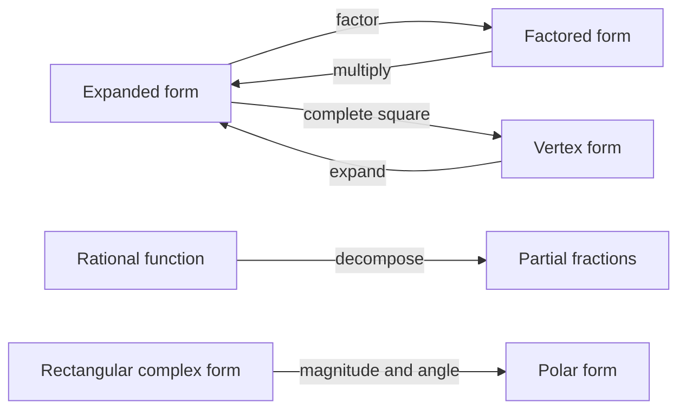
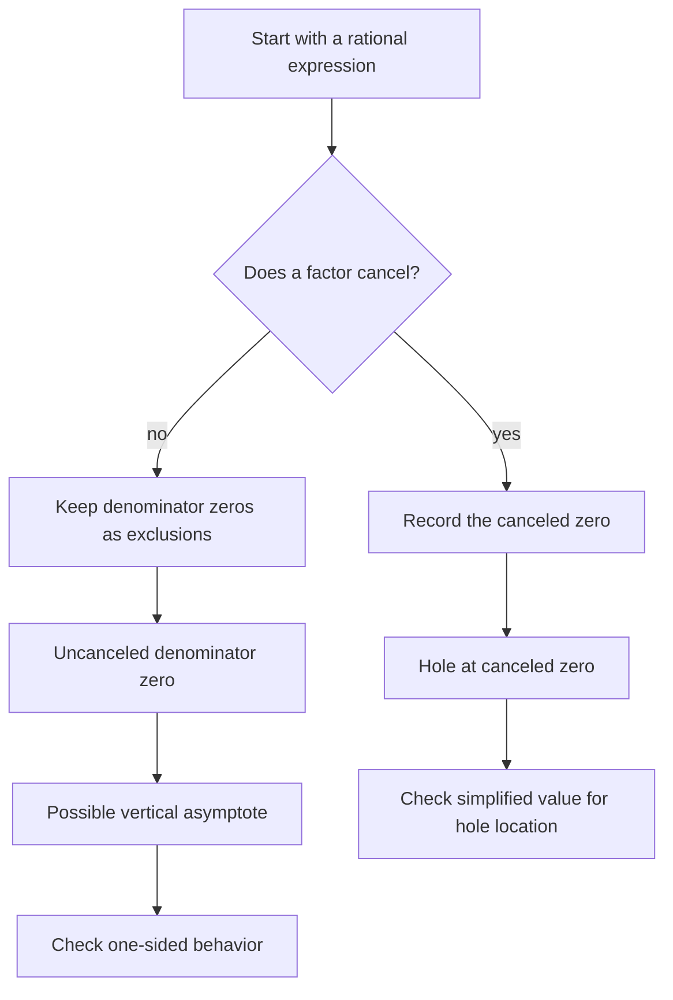
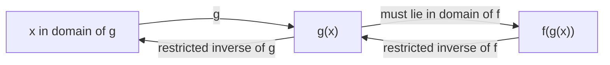
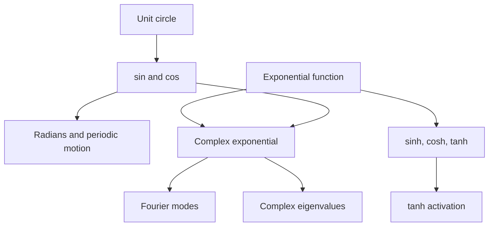

# 0.02 Algebra, Functions, and Precalculus Backfill

[Section home](../README.md) | Previous: [§0.01 Mathematical Notation](../00.01-mathematical-notation/README.md) | [Project guides](../../STYLE_GUIDE.md) | [Notation guide](../../NOTATION.md)

## Why this matters

A large part of later mathematics consists of changing an expression without changing what it means. You factor a polynomial to expose its roots, complete a square to expose its center, decompose a rational function to make it integrable, or move a complex number into polar form to make multiplication geometric.

That fluency matters before calculus, linear algebra, probability, Fourier analysis, or machine learning. A derivative can be correct and still look wrong until two expressions are simplified to the same form. An eigenvalue calculation can leave the real numbers. A sigmoid output belongs to an interval, and its inverse only makes sense on that interval. Trigonometric functions encode periodic structure, while hyperbolic tangent becomes a saturating activation.

This module is a focused backfill, not a compressed high-school textbook. OpenStax's full precalculus sequence proceeds from functions through trigonometry and into calculus [1]. Here we select the algebraic moves and function habits that carry the most downstream weight.

### Scope and non-goals

We will cover expression manipulation, expansion, factoring, simplification, completing the square, rational functions, partial fractions, polynomials, roots, domains, ranges, transformations, composition, inverses, graph behavior, trigonometry, hyperbolic functions, and complex numbers.

This module is explicitly **not**:

- a full high-school algebra course;
- an introduction to abstract algebra;
- a course in complex analysis;
- an exhaustive catalog of trigonometric identities;
- a treatment of numerical root-finding.

Those boundaries let us develop transferable structure instead of collecting disconnected tricks.

## Learning objectives

After completing this module, you should be able to:

- expand, factor, simplify, and complete the square while stating domain restrictions;
- analyze polynomial and rational functions using roots, multiplicity, holes, asymptotes, and end behavior;
- determine domains and ranges and construct transformations, compositions, and restricted inverses;
- compute with radians, core trigonometric functions, inverse trigonometric functions, and hyperbolic functions;
- convert complex numbers among rectangular and polar forms and use Euler's formula to multiply, divide, and find roots of unity;
- implement and verify transformed functions, complex arithmetic, and polynomial-root checks with appropriate numerical tolerances.

The [exercise set](exercises/README.md) assesses every objective. Full [worked solutions](solutions/README.md) are separate, and the [resource guide](resources/README.md) offers longer treatments and practice.

## Prerequisite check

Required: [§0.01 Mathematical Notation](../00.01-mathematical-notation/README.md). Recommended alongside this module: §0.03 Exponents and Logarithms.

Before starting, try these without looking anything up:

1. Expand $(x+2)(x-3)$.
2. State why $1/(x-4)$ is not defined at $x=4$.
3. In $(f\circ g)(x)$, which function acts first?
4. Convert half a turn into radians.
5. State what $i^2$ equals.

If several answers are uncertain, continue anyway. Each item is rebuilt below. If the notation itself is hard to parse, review §0.01 first.

## Historical context

Algebraic notation and complex numbers did not arrive as one finished system. Work on polynomial equations gradually forced mathematicians to manipulate quantities outside the real line. Bombelli published systematic rules for such calculations in 1572. Later geometric interpretations associated multiplication by $i$ with a quarter-turn in the plane. The history of the fundamental theorem of algebra (FTA) is similarly distributed: d'Alembert, Euler, Lagrange, Laplace, Gauss, Argand, and others contributed claims, proof attempts, corrections, and improved standards [2].

Gauss's 1799 dissertation is often called the first proof of the FTA, but it contained gaps by modern standards. He later supplied other proofs, and Argand published a different proof in 1814 [2]. This is a useful warning about mathematical history: a theorem may have a first claim, first serious attempt, first broadly accepted proof, and first proof meeting later standards. Those are not automatically the same event.

The modern identity

$$
e^{i\theta}=\cos\theta+i\sin\theta
$$

is commonly called Euler's formula. We use the established name without turning it into a single-inventor story. The NIST Digital Library of Mathematical Functions records this relation together with the corresponding definitions of sine and cosine [3].

## Intuition

### One object, several useful forms

An expression's best form depends on the question.

| Form | Reveals | Example |
|---|---|---|
| expanded | coefficients and term-by-term behavior | $x^2-5x+6$ |
| factored | roots and sign changes | $(x-2)(x-3)$ |
| completed square | center and minimum or maximum | $(x-5/2)^2-1/4$ |
| partial fractions | simpler rational pieces | $2/(x-1)-1/(x+1)$ |
| polar complex | magnitude and angle | $2e^{i\pi/3}$ |



> **Figure 1. Representation changes expose different structure.** Every arrow preserves the represented object on the domain where both forms are defined. Original diagram.

The main habit is to ask, "What do I want to see?" Do not expand automatically. Do not factor automatically. Choose a representation that exposes the next step.

### Equality includes a domain

The simplification

$$
\frac{x^2-1}{x-1}=x+1
$$

is valid only for $x\ne1$. The original expression is undefined at $1$, even though the simplified formula has a value there. Algebra can preserve output values on a domain while accidentally hiding which inputs were allowed.



> **Figure 2. Rational-function discontinuity checklist.** Cancellation suggests a hole; a remaining zero may produce a vertical asymptote. Original diagram.

### Functions are machines with constrained ports

Composition connects machines. The output of the inner function must be a valid input to the outer function. An inverse reverses a machine only after the original mapping is one-to-one on its chosen domain.



> **Figure 3. Composition and inversion are domain-sensitive.** Reading left to right gives $f\circ g$; reversing arrows requires valid restricted inverses. Original diagram.


> **Figure 4. Function transformations from one parent graph.** Horizontal changes act inside the input; vertical changes act outside the function. Original figure.

### Circular, hyperbolic, and complex views meet

Trigonometric functions come from the unit circle. Hyperbolic functions have related algebraic identities but arise from exponential combinations and the unit hyperbola. Complex exponentials join magnitude and angle.



> **Figure 5. Three views of elementary functions.** Shared formulas create connections, but circular and hyperbolic geometry are not interchangeable. Original diagram.

## Mathematics

### Algebraic expressions and legal moves

An expression combines numbers, variables, and operations. An identity is an equality valid for every input in a stated domain. An equation asks which inputs make two expressions equal.

The distributive law is the engine behind expansion and factoring:

$$
a(b+c)=ab+ac.
$$

Useful identities include

$$
(a+b)^2=a^2+2ab+b^2,
$$

$$
(a-b)^2=a^2-2ab+b^2,
$$

$$
a^2-b^2=(a-b)(a+b).
$$

For nonzero denominators,

$$
\frac{a}{b}+\frac{c}{d}=\frac{ad+bc}{bd}.
$$

The restrictions $b\ne0$ and $d\ne0$ are part of the statement.

### Expand, factor, and simplify

Expansion removes products of sums, as in $(2x-3)(x+4)=2x^2+5x-12$. Factoring reverses that move. First remove a common factor, then look for an identity, grouping, a known root, or a coefficient comparison.

Simplification should reduce structural complexity without discarding domain information. For example,

$$
\frac{2x^2-8}{x^2+x-6} =
\frac{2(x-2)(x+2)}{(x+3)(x-2)} =
\frac{2(x+2)}{x+3},
$$

but the original domain excludes both $x=2$ and $x=-3$.

### Completing the square

For $a\ne0$,

$$ax^2+bx+c=a\left(x+\frac{b}{2a}\right)^2+\left(c-\frac{b^2}{4a}\right).$$

This form exposes the vertex of a parabola and prepares quadratic expressions for integration, Gaussian densities, and optimization. MIT's single-variable calculus materials show how this algebra becomes routine preparation for differentiation and integration [4]. It also derives the quadratic formula rather than asking you to memorize it.

### Polynomials, roots, and multiplicity

A polynomial is $p(x)=a_nx^n+\cdots+a_1x+a_0$ with $a_n\ne0$ and degree $n$. A number $r$ is a root when $p(r)=0$. The factor theorem says $p(r)=0$ exactly when $(x-r)$ is a factor of $p(x)$.

If $(x-r)^m$ divides $p(x)$ but $(x-r)^{m+1}$ does not, then $r$ has multiplicity $m$. A real graph usually crosses the axis at a root of odd multiplicity and touches without crossing at a root of even multiplicity.

**Fundamental theorem of algebra.** Every nonconstant polynomial of degree $n\ge1$ with complex coefficients has exactly $n$ complex roots when counted with algebraic multiplicity [2]. Equivalently, $p(z)=a_n\prod_{k=1}^{n}(z-r_k)$.

This is an existence and counting statement. It does not provide a stable numerical algorithm for finding the roots. Numerical root-finding belongs elsewhere.

For real coefficients, nonreal roots occur in conjugate pairs. If $a+bi$ is a root, then $a-bi$ is also a root.

### Graphs and end behavior

For $p(x)=a_nx^n+\cdots+a_0$, the leading term governs large $|x|$: $p(x)\sim a_nx^n$ as $|x|\to\infty$.

| Degree parity | Sign of $a_n$ | Left end | Right end |
|---|---:|---|---|
| even | positive | up | up |
| even | negative | down | down |
| odd | positive | down | up |
| odd | negative | up | down |

Roots, multiplicities, the vertical intercept $p(0)$, and end behavior give a useful first sketch. They do not reveal every local turn.

### Rational functions

A rational function is $r(x)=p(x)/q(x)$, where $p$ and $q$ are polynomials and $q(x)\ne0$.

- A canceled denominator factor leaves a removable discontinuity, usually called a hole.
- An uncanceled denominator zero may produce a vertical asymptote.
- Degree comparison gives horizontal or polynomial asymptotic behavior.

For horizontal behavior:

| Degree comparison | End behavior |
|---|---|
| $\deg p<\deg q$ | horizontal asymptote $y=0$ |
| $\deg p=\deg q$ | ratio of leading coefficients |
| $\deg p=\deg q+1$ | slant asymptote from division |
| larger difference | polynomial asymptote from division |

### Partial fractions

Partial fractions reverse addition of rational expressions. For distinct linear factors,

$$\frac{P(x)}{(x-a)(x-b)}=\frac{A}{x-a}+\frac{B}{x-b}.$$

Repeated linear factors require every power, such as $A/(x-a)+B/(x-a)^2$. An irreducible real quadratic needs a linear numerator $(Ax+B)/(x^2+px+q)$. Divide an improper rational function first. The simpler pieces are easier to integrate and also appear in inverse transforms and linear-system analysis.

### Domains and ranges

The **domain** contains allowed inputs. The **range** or image contains attained outputs. Use constraints, not visual guesswork alone.

Common real-domain restrictions are:

| Feature | Restriction |
|---|---|
| denominator $q(x)$ | $q(x)\ne0$ |
| even root $\sqrt{g(x)}$ | $g(x)\ge0$ |
| logarithm $\log g(x)$ | $g(x)>0$ |
| inverse trig | input must lie in the function's stated domain |

To find a range, set $y=f(x)$ and ask which $y$ values admit at least one allowed $x$. Completing the square, monotonicity, or a known parent-function range often helps.

### Function transformations

Starting from $y=f(x)$:

| Transformation | Formula | Effect |
|---|---|---|
| vertical shift | $f(x)+k$ | up by $k$ |
| horizontal shift | $f(x-h)$ | right by $h$ |
| vertical scale | $af(x)$ | scale outputs by $\lvert a\rvert$; reflect if $a<0$ |
| horizontal scale | $f(bx)$ | scale inputs by $1/\lvert b\rvert$; reflect if $b<0$ |

The horizontal rules feel reversed because the change occurs before $f$ receives its input. To make $f$ see the old input $u$, solve $bx=u$, so the new coordinate is $x=u/b$.

### Composition

For $g:\mathcal{X}\to\mathcal{Y}$ and $f:\mathcal{Y}\to\mathcal{Z}$, $(f\circ g)(x)=f(g(x))$. The rightmost function acts first. Its natural domain is $\{x\in\mathrm{dom}(g):g(x)\in\mathrm{dom}(f)\}$.

Composition is generally not commutative. This order becomes crucial in matrix products, computational graphs, and the chain rule.

### Inverse functions and restrictions

A function has an inverse only when it is one-to-one onto its codomain, or when its domain and codomain are restricted to make it so. On the relevant domains, $f^{-1}(f(x))=x$ and $f(f^{-1}(y))=y$.

The squaring function on $\mathbb{R}$ is not one-to-one. Restricted to $[0,\infty)$,

$$
f:[0,\infty)\to[0,\infty),\qquad f(x)=x^2
$$

has inverse $f^{-1}(y)=\sqrt{y}$. The square-root symbol selects the nonnegative root.

### Trigonometry and radians

An angle of $\theta$ radians subtends arc length $s=r\theta$ on a circle of radius $r$. One full turn has arc length $2\pi r$, so it measures $2\pi$ radians.

On the unit circle, the point at angle $\theta$ is $(\cos\theta,\sin\theta)$. Therefore $\sin^2\theta+\cos^2\theta=1$ and $\tan\theta=\sin\theta/\cos\theta$ when $\cos\theta\ne0$. For every $k\in\mathbb{Z}$, sine and cosine repeat after $2\pi k$ [3].

| Angle | $0$ | $\pi/6$ | $\pi/4$ | $\pi/3$ | $\pi/2$ |
|---|---:|---:|---:|---:|---:|
| $\sin\theta$ | $0$ | $1/2$ | $\sqrt{2}/2$ | $\sqrt{3}/2$ | $1$ |
| $\cos\theta$ | $1$ | $\sqrt{3}/2$ | $\sqrt{2}/2$ | $1/2$ | $0$ |

The addition identities are

$$
\sin(\alpha+\beta)=\sin\alpha\cos\beta+\cos\alpha\sin\beta,\qquad
\cos(\alpha+\beta)=\cos\alpha\cos\beta-\sin\alpha\sin\beta.
$$

We stop there. Exhaustive identity manipulation is outside this module.

### Inverse trigonometric functions

Periodic functions are not one-to-one on all of $\mathbb{R}$, so inverse trig functions use principal restrictions.

| Function | Restricted input of original | Range of inverse |
|---|---|---|
| $\arcsin x$ | sine on $[-\pi/2,\pi/2]$ | $[-\pi/2,\pi/2]$ |
| $\arccos x$ | cosine on $[0,\pi]$ | $[0,\pi]$ |
| $\arctan x$ | tangent on $(-\pi/2,\pi/2)$ | $(-\pi/2,\pi/2)$ |

Thus $\arcsin(\sin\theta)$ need not equal $\theta$ outside the principal interval. For example,

$$
\arcsin(\sin(5\pi/6))=\arcsin(1/2)=\pi/6.
$$

### Hyperbolic functions

Define

$$
\sinh x=\frac{e^x-e^{-x}}{2},\qquad
\cosh x=\frac{e^x+e^{-x}}{2},\qquad
\tanh x=\frac{e^x-e^{-x}}{e^x+e^{-x}}.
$$

NIST records these definitions and their complex-variable relations to trigonometric functions [3]. Direct expansion gives

$$
\cosh^2x-\sinh^2x=1.
$$

The sign differs from the circular identity. For real $x$, $\tanh x\in(-1,1)$, approaching $1$ as $x\to\infty$ and $-1$ as $x\to-\infty$.

This bounded range explains the phrase **saturating activation**. It does not by itself explain every optimization effect in a neural network.

### Sigmoid and logit preview

The logistic sigmoid is $\mathrm{sigmoid}(x)=1/(1+e^{-x})$. It maps real inputs into $(0,1)$. Solving $p=1/(1+e^{-x})$ gives $\mathrm{logit}(p)=\log(p/(1-p))$ for $0<p<1$.

The logarithm is developed in §0.03. Here the key point is domain and range: sigmoid maps $\mathbb{R}$ to $(0,1)$, and logit maps $(0,1)$ back to $\mathbb{R}$.

The exact relation

$$
\mathrm{sigmoid}(x)=\frac{1+\tanh(x/2)}{2}
$$

shows that these S-shaped functions are affinely related after an input rescaling. That identity does not make their output interpretations interchangeable.

### Complex arithmetic

A complex number has rectangular form $z=a+bi$, where $a,b\in\mathbb{R}$ and $i^2=-1$.

Addition is componentwise. Multiplication uses distributivity and $i^2=-1$:

$$
(a+bi)(c+di)=(ac-bd)+(ad+bc)i.
$$

The conjugate is $\overline{z}=a-bi$, the modulus is $|z|=\sqrt{a^2+b^2}$, and $z\overline{z}=|z|^2$.

For $z\ne0$, division uses the conjugate:

$$
\frac{a+bi}{c+di} =
\frac{(a+bi)(c-di)}{c^2+d^2}.
$$

### Polar form and Euler's formula

For $z\ne0$, let $r=|z|$ and let $\theta$ be an argument. Then $z=r(\cos\theta+i\sin\theta)=re^{i\theta}$.

The angle is not unique because adding $2\pi k$ gives the same point. A computational library must therefore choose a principal phase convention.

Multiplication becomes $r_1e^{i\theta_1}r_2e^{i\theta_2}=r_1r_2e^{i(\theta_1+\theta_2)}$.

Magnitudes multiply and angles add.


> **Figure 6. Complex multiplication as scale and rotation.** Multiplying by $2e^{i\pi/3}$ doubles a modulus and adds $\pi/3$ to the argument. Original figure.

A real planar rotation by $\theta$ is represented by

$$
\mathbf{R}_{\theta} =
\begin{bmatrix}
\cos\theta&-\sin\theta\\\\
\sin\theta&\cos\theta
\end{bmatrix}.
$$

Over $\mathbb{C}$, its eigenvalues are $e^{i\theta}$ and $e^{-i\theta}$. Complex numbers encode rotation even when the original matrix and plane are real. MIT's linear algebra course treats eigenvalues as a central tool for matrix behavior [5]. *Mathematics for Machine Learning* develops the same linear-algebra foundation before applying it to learning problems [6].

### Roots of unity

The $n$th roots of unity solve $z^n=1=e^{i2\pi m}$ for integers $m$. Distinct angles modulo $2\pi$ give $\omega_k=e^{i2\pi k/n}$ for $k=0,1,\ldots,n-1$.

They are equally spaced around the unit circle.


> **Figure 7. The sixth roots of unity.** Equal angle steps produce a regular hexagon, and raising any marked point to the sixth power returns $1$. Original figure.

Roots of unity later organize the discrete Fourier transform. That is a precise algebraic connection: Fourier basis entries are powers of a root of unity. It is not merely a visual analogy.

## Derivation

### Completing the square and deriving the quadratic formula

Start with $ax^2+bx+c=0$, where $a\ne0$. Divide by $a$, move the constant, and add the square of half the linear coefficient:

$$
x^2+\frac{b}{a}x+\frac{b^2}{4a^2} =
\frac{b^2-4ac}{4a^2}.
$$

The left side is $(x+b/(2a))^2$. Taking both square roots and isolating $x$ gives $x=(-b\pm\sqrt{b^2-4ac})/(2a)$.

The discriminant $b^2-4ac$ tells whether a real quadratic has two distinct real roots, one repeated real root, or a conjugate pair of nonreal roots.

### Deriving a partial-fraction decomposition

Suppose $(x+3)/((x-1)(x+2))=A/(x-1)+B/(x+2)$.

Multiply by $(x-1)(x+2)$ on the shared domain:

$$
x+3=A(x+2)+B(x-1).
$$

Set $x=1$ to obtain $A=4/3$ and $x=-2$ to obtain $B=-1/3$. Therefore $(x+3)/((x-1)(x+2))=4/(3(x-1))-1/(3(x+2))$.

The excluded inputs remain $x=1,-2$.

### Deriving complex multiplication in polar form

Write $z_1=r_1(\cos\alpha+i\sin\alpha)$ and $z_2=r_2(\cos\beta+i\sin\beta)$.

Multiplying and grouping real and imaginary parts gives

$$
z_1z_2=r_1r_2[
(\cos\alpha\cos\beta-\sin\alpha\sin\beta)
+i(\sin\alpha\cos\beta+\cos\alpha\sin\beta)].
$$

The angle-addition identities reduce this to $z_1z_2=r_1r_2[\cos(\alpha+\beta)+i\sin(\alpha+\beta)]$. This is why multiplication scales and rotates.

## Implementation

The snippets below were designed to be executable with the Python standard library and NumPy. They are checked later in this module's validation report only if actually run. Python stores complex numbers in rectangular form, while `cmath.polar` and `cmath.rect` convert between rectangular and polar coordinates [7].

### Evaluate a transformed function

```python
from math import isclose


def parent(x):
    return x * x


def transform(function, x, *, horizontal_shift=0.0,
              horizontal_scale=1.0, vertical_scale=1.0,
              vertical_shift=0.0):
    inner = horizontal_scale * (x - horizontal_shift)
    return vertical_scale * function(inner) + vertical_shift


value = transform(parent, 3.0, horizontal_shift=1.0,
                  vertical_scale=-2.0, vertical_shift=5.0)
assert isclose(value, -3.0)
```

The implementation represents

$$
g(x)=a f(b(x-h))+k.
$$

Naming each parameter makes the inside-versus-outside distinction visible.

### Compute and verify complex polar multiplication

```python
from cmath import isclose, polar, rect
from math import pi

z1 = rect(2.0, pi / 6)
z2 = rect(3.0, pi / 4)
product_rectangular = z1 * z2
product_polar = rect(2.0 * 3.0, pi / 6 + pi / 4)

assert isclose(product_rectangular, product_polar, abs_tol=1e-12)
radius, angle = polar(product_rectangular)
assert abs(radius - 6.0) < 1e-12
assert abs(angle - 5 * pi / 12) < 1e-12
```

Floating-point trigonometric values should be compared with a tolerance, not exact equality.

### Verify polynomial roots

```python
import numpy as np

coefficients = np.array([1.0, 0.0, 0.0, -1.0])  # z**3 - 1
roots = np.roots(coefficients)
residuals = np.polyval(coefficients, roots)

assert np.allclose(residuals, 0.0, rtol=0.0, atol=1e-12)
assert np.allclose(np.abs(roots), 1.0, rtol=0.0, atol=1e-12)
```

`numpy.roots` computes companion-matrix eigenvalues and belongs to NumPy's older polynomial API [8]. We use it here to verify roots, not to teach numerical root-finding. Residuals check $p(r_k)\approx0$; they do not prove that every computed root is accurate for every polynomial.

## Experimentation

### Transformation laboratory

Choose one parent function from $x^2$, $|x|$, $\sin x$, or $\tanh x$. Investigate $g(x)=a f(b(x-h))+k$.

Use a plotting tool or a carefully drawn coordinate grid. Vary exactly one parameter at a time, then test these observations:

1. Changing $h$ moves recognizable features horizontally by $h$.
2. Changing $k$ adds $k$ to every output.
3. Replacing $a$ by $-a$ reflects outputs across the horizontal axis.
4. Doubling $|b|$ halves horizontal distances between corresponding features.
5. For a bounded parent, vertical scaling and shifting transform its range endpoints.

Record the parent, parameter table, plotted input interval, and at least four landmark points. State one observation that failed or needed qualification. For example, a constant function cannot reveal horizontal scaling, and a periodic graph can make several shifts look equivalent.

### Roots-of-unity investigation

For $n\in\{3,4,5,6,8\}$, compute $\omega_k=e^{i2\pi k/n}$.

Test rather than assume:

- $|\omega_k|\approx1$;
- $\omega_k^n\approx1$;
- adjacent arguments differ by $2\pi/n$ modulo a full turn;
- $\sum_{k=0}^{n-1}\omega_k\approx0$ for $n>1$;
- multiplying every root by $\omega_1$ permutes the set.

Use absolute tolerance $10^{-12}$ for these small examples and report the largest observed residual. The geometric pattern suggests the claims; the calculations test them.

## Worked examples

### Example 1: Expand, factor, and choose a form

Expanding gives $(x-2)(x+5)=x^2+3x-10$. The expanded form exposes coefficients; the factored form exposes roots $2$ and $-5$. Neither is universally simpler.

### Example 2: Complete the square

We have $2x^2-12x+11=2(x^2-6x)+11=2[(x-3)^2-9]+11=2(x-3)^2-7$. The parabola has minimum value $-7$ at $x=3$.

### Example 3: Root multiplicity and graph behavior

For $p(x)=(x+1)^2(x-2)^3$, $-1$ has multiplicity $2$ and $2$ has multiplicity $3$. The graph touches at $-1$ and crosses at $2$. Its positive odd-degree leading term sends the left end down and right end up.

### Example 4: A hole versus a vertical asymptote

For $r(x)=(x-2)(x+1)/((x-2)(x-3))$, the domain excludes $2$ and $3$. Canceling gives $(x+1)/(x-3)$ only there. The graph has a hole at $(2,-3)$ and a vertical asymptote at $x=3$.

### Example 5: Partial fractions

Write $(3x+5)/((x-1)(x+1))=A/(x-1)+B/(x+1)$. Then $3x+5=A(x+1)+B(x-1)$. Substituting $x=1$ and $x=-1$ gives $A=4$ and $B=-1$, so $(3x+5)/(x^2-1)=4/(x-1)-1/(x+1)$ for $x\ne\pm1$.

### Example 6: Transformation order

Let $f(x)=x^2$ and $g(x)=-2f(x-1)+3$. This shifts right by $1$, stretches vertically by $2$, reflects across the horizontal axis, then shifts up by $3$. Its maximum is $3$ at $x=1$, and its range is $(-\infty,3]$.

### Example 7: Composition order and domain

Let $f(x)=\sqrt{x}$ and $g(x)=x-4$. Then $(f\circ g)(x)=\sqrt{x-4}$ has domain $[4,\infty)$, while $(g\circ f)(x)=\sqrt{x}-4$ has domain $[0,\infty)$. The formulas, domains, and outputs differ.

### Example 8: Restrict before inverting

For $f(x)=(x-2)^2+1$ on all real numbers, outputs above $1$ usually have two inputs. Restrict to $[2,\infty)$ and solve $y=(x-2)^2+1$. Since $x-2\ge0$, $f^{-1}(y)=2+\sqrt{y-1}$ for $y\in[1,\infty)$. A $\pm$ sign would produce a relation, not an inverse function.

### Example 9: Radians and inverse trig

A quarter-turn is $\pi/2$ radians. Since $5\pi/6$ lies outside arcsine's principal range, $\arcsin(\sin(5\pi/6))=\arcsin(1/2)=\pi/6$, not $5\pi/6$.

### Example 10: Sigmoid range and logit preview

We have $\mathrm{sigmoid}(0)=1/2$ and $\mathrm{logit}(0.8)=\log(0.8/0.2)=\log4$. Finite real inputs never attain sigmoid outputs $0$ or $1$, so logit requires $0<p<1$.

### Example 11: Tanh saturation

We have $\tanh(0)=0$, while $\tanh(3)\approx0.995$ and $\tanh(-3)\approx-0.995$. Large magnitude inputs produce outputs close to the range boundaries. Saying the function saturates describes this flattening; it does not mean the output ever equals $1$ or $-1$ for finite real input.

### Example 12: Complex multiplication and rotation

For $z_1=2e^{i\pi/6}$ and $z_2=3e^{i\pi/3}$, $z_1z_2=6e^{i\pi/2}=6i$. The modulus becomes $6$ and the argument becomes $\pi/2$.

### Example 13: Rotation-matrix eigenvalues

For a quarter-turn, $\mathbf{R}_{\pi/2}=\begin{bmatrix}0&-1\\\\1&0\end{bmatrix}$. Its characteristic equation is $\lambda^2+1=0$, so $\lambda=\pm i$. No nonzero real vector stays on its own line, but complex eigenvectors make the rotation diagonalizable over $\mathbb{C}$.

### Example 14: Roots of unity

The fourth roots are $e^{i2\pi k/4}\in\{1,i,-1,-i\}$. Each fourth power equals $1$, their sum is $0$, and multiplication by $i$ permutes the set by a quarter-turn.

## Common mistakes

| Mistake | Why it fails | Repair |
|---|---|---|
| Expanding every expression | useful structure disappears | choose form for the next question |
| Canceling terms across addition | cancellation applies to factors | factor numerator and denominator first |
| Forgetting excluded inputs after cancellation | a hole is silently filled | preserve the original domain |
| Treating every denominator zero as an asymptote | canceled factors make holes | simplify and classify each zero |
| Omitting powers in repeated-factor partial fractions | proposed pieces cannot span the numerator | include every denominator power |
| Saying degree $n$ means $n$ distinct roots | multiplicity may repeat a root | count roots with multiplicity |
| Claiming FTA finds roots numerically | it is an existence theorem | separate theorem from algorithm |
| Moving $f(x-h)$ left by $h$ | input changes act oppositely | solve for the landmark input |
| Assuming $f\circ g=g\circ f$ | composition order matters | evaluate both from right to left |
| Writing an inverse for a many-to-one function | one output maps back to several inputs | restrict the domain first |
| Mixing degrees and radians | formulas receive the wrong scale | state units and convert |
| Assuming $\arcsin(\sin x)=x$ always | arcsine returns a principal value | check the principal interval |
| Replacing $\cosh^2-\sinh^2$ by a plus | circular and hyperbolic identities differ | derive from exponentials |
| Claiming tanh reaches $\pm1$ | those are limiting values | state the open range $(-1,1)$ |
| Dividing complex numbers componentwise | complex multiplication couples components | multiply by the conjugate |
| Treating a complex argument as unique | angles differ by $2\pi k$ | state a principal branch when needed |
| Using exact equality for computed roots | floating-point results carry error | evaluate residuals with tolerances |

## Exercises

Complete the [twelve exercises](exercises/README.md), then compare your work with the [full solutions](solutions/README.md). The set mixes calculation, explanation, implementation, experimentation, and misconception critique. The [resources](resources/README.md) provide longer practice sequences.

## What you should now be able to do

You can change algebraic form while preserving meaning and domain, classify polynomial and rational behavior, reason about functions as domain-sensitive mappings, and move among circular, hyperbolic, and complex representations. You can also test small computations instead of trusting a symbolic or numerical result on appearance alone.

As a final check, take

$$
h(x)=\frac{(x^2-1)}{x-1}.
$$

Explain its original domain, simplified rule, hole, end behavior, and why its graph is not exactly the same function as $x+1$ on all real inputs.

## Where this leads

§0.03 develops exponentials and logarithms, including the logit expression used here. §1 uses algebraic forms, trig functions, and partial fractions throughout calculus. §2 uses polynomial roots and complex numbers for eigenvalues, including real rotation matrices with complex spectra. §2.14 uses roots of unity and complex exponentials for Fourier analysis. Later neural-network modules revisit sigmoid and tanh as activation functions, with derivatives and optimization behavior added there.

These are exact mathematical dependencies, not claims that every algebraic manipulation is secretly an AI algorithm. The value is more practical: later ideas become readable because their component operations are already familiar.

## References

[1] J. Abramson et al., *Precalculus 2e*. OpenStax, Rice University, 2021. https://openstax.org/details/books/precalculus-2e Accessed 2026-09-01.

[2] J. J. O'Connor and E. F. Robertson, "The Fundamental Theorem of Algebra," MacTutor History of Mathematics Archive, University of St Andrews, 1996. https://mathshistory.st-andrews.ac.uk/HistTopics/Fund_theorem_of_algebra/ Accessed 2026-09-01.

[3] F. W. J. Olver et al., eds., *NIST Digital Library of Mathematical Functions*, Version 1.2.7, ch. 4, "Elementary Functions." National Institute of Standards and Technology, 2026. https://dlmf.nist.gov/4 Accessed 2026-09-01.

[4] Massachusetts Institute of Technology, "18.01SC: Single Variable Calculus," Fall 2010, D. Jerison. https://ocw.mit.edu/courses/18-01sc-single-variable-calculus-fall-2010/ Accessed 2026-09-01.

[5] Massachusetts Institute of Technology, "18.06: Linear Algebra," Spring 2010, G. Strang. https://ocw.mit.edu/courses/18-06-linear-algebra-spring-2010/ Accessed 2026-09-01.

[6] M. P. Deisenroth, A. A. Faisal, and C. S. Ong, *Mathematics for Machine Learning*. Cambridge University Press, 2020. https://mml-book.github.io/

[7] Python Software Foundation, "cmath: Mathematical functions for complex numbers," Python 3.14. https://docs.python.org/3/library/cmath.html Accessed 2026-09-01.

[8] NumPy Developers, "numpy.roots" and "numpy.allclose," NumPy v2.5 Manual. https://numpy.org/doc/stable/reference/generated/numpy.roots.html and https://numpy.org/doc/stable/reference/generated/numpy.allclose.html Accessed 2026-09-01.

---

Previous: [§0.01 Mathematical Notation](../00.01-mathematical-notation/README.md) | [Section home](../README.md) | Next: [§0.03 Exponents and Logarithms](../00.03-exponents-logarithms/README.md)
