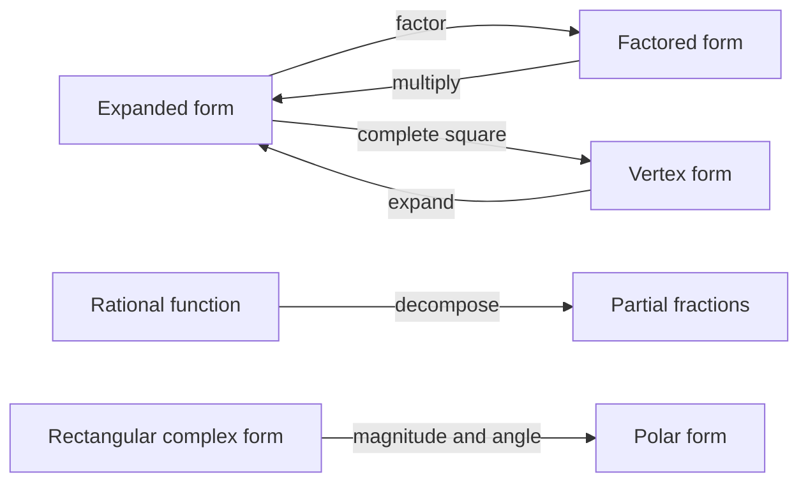
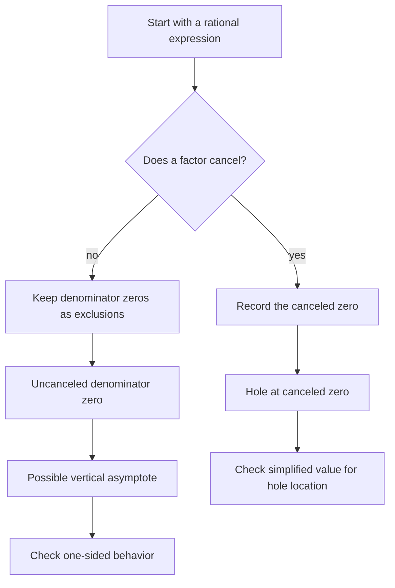
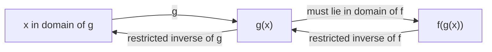
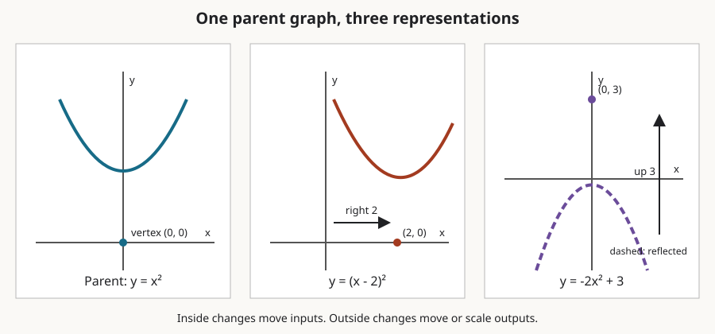
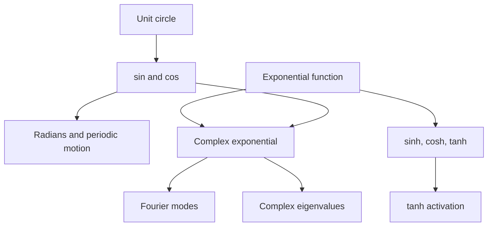
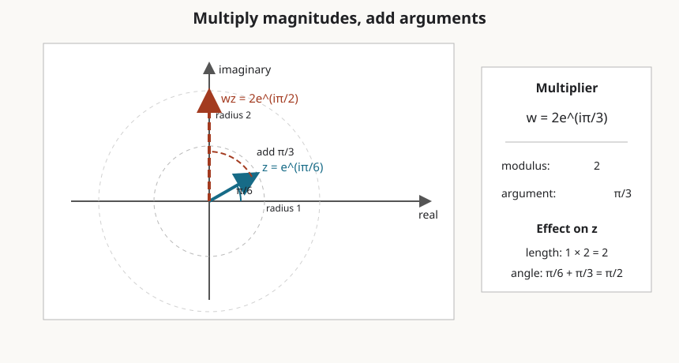
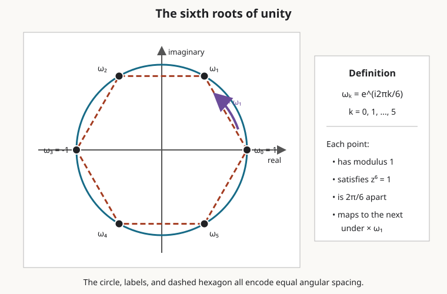

# 0.02 Algebra, Functions, and Precalculus Backfill

[Section home](../README.md) | Previous: [§0.01 Mathematical Notation](../00.01-mathematical-notation/README.md) | [Project guides](../../CONTRIBUTING.md#module-file-structure) | [Notation guide](../../NOTATION.md)

Build algebra and function fluency for calculus and linear algebra: preserve domains while changing forms, analyze roots and graphs, compose and invert functions, and connect trigonometric, hyperbolic, and complex representations. You will also verify small computations with explicit tolerances.

Start with [§0.01 Mathematical Notation](../00.01-mathematical-notation/README.md). Read [§0.03 Exponents and Logarithms](../00.03-exponents-logarithms/README.md) alongside the exponential and logit previews.

**Contents**

- [Check your starting point](#check-your-starting-point) · [Choosing a useful representation](#choosing-a-useful-representation)
- [Historical context](#historical-context) · [Forms, domains, and geometry](#forms-domains-and-geometry)
- [Algebra and elementary functions](#algebra-and-elementary-functions) · [Deriving algebraic and geometric identities](#deriving-algebraic-and-geometric-identities)
- [Worked examples](#worked-examples) · [Implementation](#implementation)
- [Transformation and roots-of-unity experiments](#transformation-and-roots-of-unity-experiments) · [Common mistakes](#common-mistakes)
- [Check your understanding](#check-your-understanding) · [Where this leads](#where-this-leads)
- [Practice](#practice) · [References](#references)

## Check your starting point

Before starting, try these without looking anything up:

1. Expand $`(x+2)(x-3)`$.
2. State why $`1/(x-4)`$ is not defined at $`x=4`$.
3. In $`(f\circ g)(x)`$, which function acts first?
4. Convert half a turn into radians.
5. State what $`i^2`$ equals.

If several answers are uncertain, continue anyway. Each item is rebuilt below. If the notation itself is hard to parse, review §0.01 first.

## Choosing a useful representation

A large part of later mathematics consists of changing an expression without changing what it means. You factor a polynomial to expose its roots, complete a square to expose its center, decompose a rational function to make it integrable, or move a complex number into polar form to make multiplication geometric.

That fluency matters before calculus, linear algebra, probability, Fourier analysis, or machine learning. A derivative can be correct and still look wrong until two expressions are simplified to the same form. An eigenvalue calculation can leave the real numbers. A sigmoid output belongs to an interval, and its inverse only makes sense on that interval. Trigonometric functions encode periodic structure, while hyperbolic tangent becomes a saturating activation.

This module is a focused backfill, not a compressed high-school textbook. OpenStax's full precalculus sequence proceeds from functions through trigonometry and into calculus [1]. Here we select the algebraic moves and function habits that carry the most downstream weight.

### Scope and non-goals

We will cover expression manipulation, expansion, factoring, simplification, completing the square, rational functions, partial fractions, polynomials, roots, domains, ranges, transformations, composition, inverses, graph behavior, trigonometry, hyperbolic functions, and complex numbers.

This module is explicitly **not**:

- a full high-school algebra course;
- an introduction to abstract algebra;
- a course in complex analysis;
- an exhaustive catalog of trigonometric identities;
- a treatment of numerical root-finding.

Those boundaries let us develop transferable structure instead of collecting disconnected tricks.

## Historical context

Algebraic notation and complex numbers did not arrive as one finished system. Work on polynomial equations gradually forced mathematicians to manipulate quantities outside the real line. Bombelli published systematic rules for such calculations in 1572. Later geometric interpretations associated multiplication by $`i`$ with a quarter-turn in the plane. The history of the fundamental theorem of algebra (FTA) is similarly distributed: d'Alembert, Euler, Lagrange, Laplace, Gauss, Argand, and others contributed claims, proof attempts, corrections, and improved standards [2].

Gauss's 1799 dissertation is often called the first proof of the FTA, but it contained gaps by modern standards. He later supplied other proofs, and Argand published a different proof in 1814 [2]. This is a useful warning about mathematical history: a theorem may have a first claim, first serious attempt, first broadly accepted proof, and first proof meeting later standards. Those are not automatically the same event.

The modern identity

$$
e^{i\theta}=\cos\theta+i\sin\theta
$$

is commonly called Euler's formula. We use the established name without turning it into a single-inventor story. The NIST Digital Library of Mathematical Functions records this relation together with the corresponding definitions of sine and cosine [3].

## Forms, domains, and geometry

### One object, several useful forms

An expression's best form depends on the question.

| Form | Reveals | Example |
|---|---|---|
| expanded | coefficients and term-by-term behavior | $`x^2-5x+6`$ |
| factored | roots and sign changes | $`(x-2)(x-3)`$ |
| completed square | center and minimum or maximum | $`(x-5/2)^2-1/4`$ |
| partial fractions | simpler rational pieces | $`2/(x-1)-1/(x+1)`$ |
| polar complex | magnitude and angle | $`2e^{i\pi/3}`$ |



> **Figure 1. Representation changes expose different structure.** Every arrow preserves the represented object on the domain where both forms are defined. Original diagram.

The main habit is to ask, "What do I want to see?" Do not expand automatically. Do not factor automatically. Choose a representation that exposes the next step.

### Equality includes a domain

The simplification

$$
\frac{x^2-1}{x-1}=x+1
$$

is valid only for $`x\ne1`$. The original expression is undefined at $`1`$, even though the simplified formula has a value there. Algebra can preserve output values on a domain while accidentally hiding which inputs were allowed.



> **Figure 2. Rational-function discontinuity checklist.** Cancellation suggests a hole; a remaining zero may produce a vertical asymptote. Original diagram.

### Functions are machines with constrained ports

Composition connects machines. The output of the inner function must be a valid input to the outer function. An inverse reverses a machine only after the original mapping is one-to-one on its chosen domain.



> **Figure 3. Composition and inversion are domain-sensitive.** Reading left to right gives $`f\circ g`$; reversing arrows requires valid restricted inverses. Original diagram.



> **Figure 4. Function transformations from one parent graph.** Horizontal changes act inside the input; vertical changes act outside the function. Original figure.

### Circular, hyperbolic, and complex views meet

Trigonometric functions come from the unit circle. Hyperbolic functions have related algebraic identities but arise from exponential combinations and the unit hyperbola. Complex exponentials join magnitude and angle.



> **Figure 5. Three views of elementary functions.** Shared formulas create connections, but circular and hyperbolic geometry are not interchangeable. Original diagram.

## Algebra and elementary functions

### Algebraic expressions and legal moves

An expression combines numbers, variables, and operations. An identity is an equality valid for every input in a stated domain. An equation asks which inputs make two expressions equal.

The distributive law is the engine behind expansion and factoring:

$$
a(b+c)=ab+ac.
$$

Useful identities include

$$
(a+b)^2=a^2+2ab+b^2,
$$

$$
(a-b)^2=a^2-2ab+b^2,
$$

$$
a^2-b^2=(a-b)(a+b).
$$

For nonzero denominators,

$$
\frac{a}{b}+\frac{c}{d}=\frac{ad+bc}{bd}.
$$

The restrictions $`b\ne0`$ and $`d\ne0`$ are part of the statement.

### Expand, factor, and simplify

Expansion removes products of sums, as in $`(2x-3)(x+4)=2x^2+5x-12`$. Factoring reverses that move. First remove a common factor, then look for an identity, grouping, a known root, or a coefficient comparison.

Simplification should reduce structural complexity without discarding domain information. For example,

$$
\frac{2x^2-8}{x^2+x-6} =
\frac{2(x-2)(x+2)}{(x+3)(x-2)} =
\frac{2(x+2)}{x+3},
$$

but the original domain excludes both $`x=2`$ and $`x=-3`$.

### Completing the square

For $`a\ne0`$,

$$ax^2+bx+c=a\left(x+\frac{b}{2a}\right)^2+\left(c-\frac{b^2}{4a}\right).$$

This form exposes the vertex of a parabola and prepares quadratic expressions for integration, Gaussian densities, and optimization. MIT's single-variable calculus materials show how this algebra becomes routine preparation for differentiation and integration [4]. It also derives the quadratic formula rather than asking you to memorize it.

### Polynomials, roots, and multiplicity

A polynomial is $`p(x)=a_nx^n+\cdots+a_1x+a_0`$ with $`a_n\ne0`$ and degree $`n`$. A number $`r`$ is a root when $`p(r)=0`$. The factor theorem says $`p(r)=0`$ exactly when $`(x-r)`$ is a factor of $`p(x)`$.

If $`(x-r)^m`$ divides $`p(x)`$ but $`(x-r)^{m+1}`$ does not, then $`r`$ has multiplicity $`m`$. A real graph usually crosses the axis at a root of odd multiplicity and touches without crossing at a root of even multiplicity.

**Fundamental theorem of algebra.** Every nonconstant polynomial of degree $`n\ge1`$ with complex coefficients has exactly $`n`$ complex roots when counted with algebraic multiplicity [2]. Equivalently, $`p(z)=a_n\prod_{k=1}^{n}(z-r_k)`$.

This is an existence and counting statement. It does not provide a stable numerical algorithm for finding the roots. Numerical root-finding belongs elsewhere.

For real coefficients, nonreal roots occur in conjugate pairs. If $`a+bi`$ is a root, then $`a-bi`$ is also a root.

### Graphs and end behavior

For $`p(x)=a_nx^n+\cdots+a_0`$, the leading term governs large $`|x|`$: $`p(x)\sim a_nx^n`$ as $`|x|\to\infty`$.

| Degree parity | Sign of $`a_n`$ | Left end | Right end |
|---|---:|---|---|
| even | positive | up | up |
| even | negative | down | down |
| odd | positive | down | up |
| odd | negative | up | down |

Roots, multiplicities, the vertical intercept $`p(0)`$, and end behavior give a useful first sketch. They do not reveal every local turn.

### Rational functions

A rational function is $`r(x)=p(x)/q(x)`$, where $`p`$ and $`q`$ are polynomials and $`q(x)\ne0`$.

- A canceled denominator factor leaves a removable discontinuity, usually called a hole.
- An uncanceled denominator zero may produce a vertical asymptote.
- Degree comparison gives horizontal or polynomial asymptotic behavior.

For horizontal behavior:

| Degree comparison | End behavior |
|---|---|
| $`\deg p<\deg q`$ | horizontal asymptote $`y=0`$ |
| $`\deg p=\deg q`$ | ratio of leading coefficients |
| $`\deg p=\deg q+1`$ | slant asymptote from division |
| larger difference | polynomial asymptote from division |

### Partial fractions

Partial fractions reverse addition of rational expressions. For distinct linear factors,

$$\frac{P(x)}{(x-a)(x-b)}=\frac{A}{x-a}+\frac{B}{x-b}.$$

Repeated linear factors require every power, such as $`A/(x-a)+B/(x-a)^2`$. An irreducible real quadratic needs a linear numerator $`(Ax+B)/(x^2+px+q)`$. Divide an improper rational function first. The simpler pieces are easier to integrate and also appear in inverse transforms and linear-system analysis.

### Domains and ranges

The **domain** contains allowed inputs. The **range** or image contains attained outputs. Use constraints, not visual guesswork alone.

Common real-domain restrictions are:

| Feature | Restriction |
|---|---|
| denominator $`q(x)`$ | $`q(x)\ne0`$ |
| even root $`\sqrt{g(x)}`$ | $`g(x)\ge0`$ |
| logarithm $`\log g(x)`$ | $`g(x)>0`$ |
| inverse trig | input must lie in the function's stated domain |

To find a range, set $`y=f(x)`$ and ask which $`y`$ values admit at least one allowed $`x`$. Completing the square, monotonicity, or a known parent-function range often helps.

### Function transformations

Starting from $`y=f(x)`$:

| Transformation | Formula | Effect |
|---|---|---|
| vertical shift | $`f(x)+k`$ | up by $`k`$ |
| horizontal shift | $`f(x-h)`$ | right by $`h`$ |
| vertical scale | $`af(x)`$ | scale outputs by $`\lvert a\rvert`$; reflect if $`a<0`$ |
| horizontal scale | $`f(bx)`$ | scale inputs by $`1/\lvert b\rvert`$; reflect if $`b<0`$ |

The horizontal rules feel reversed because the change occurs before $`f`$ receives its input. To make $`f`$ see the old input $`u`$, solve $`bx=u`$, so the new coordinate is $`x=u/b`$.

### Composition

For $`g:\mathcal{X}\to\mathcal{Y}`$ and $`f:\mathcal{Y}\to\mathcal{Z}`$, $`(f\circ g)(x)=f(g(x))`$. The rightmost function acts first. Its natural domain is $`\lbrace x\in\mathrm{dom}(g):g(x)\in\mathrm{dom}(f)\rbrace`$.

Composition is generally not commutative. This order becomes crucial in matrix products, computational graphs, and the chain rule.

### Inverse functions and restrictions

A function has an inverse only when it is one-to-one onto its codomain, or when its domain and codomain are restricted to make it so. On the relevant domains, $`f^{-1}(f(x))=x`$ and $`f(f^{-1}(y))=y`$.

The squaring function on $`\mathbb{R}`$ is not one-to-one. Restricted to $`[0,\infty)`$,

$$
f:[0,\infty)\to[0,\infty),\qquad f(x)=x^2
$$

has inverse $`f^{-1}(y)=\sqrt{y}`$. The square-root symbol selects the nonnegative root.

### Trigonometry and radians

An angle of $`\theta`$ radians subtends arc length $`s=r\theta`$ on a circle of radius $`r`$. One full turn has arc length $`2\pi r`$, so it measures $`2\pi`$ radians.

On the unit circle, the point at angle $`\theta`$ is $`(\cos\theta,\sin\theta)`$. Therefore $`\sin^2\theta+\cos^2\theta=1`$ and $`\tan\theta=\sin\theta/\cos\theta`$ when $`\cos\theta\ne0`$. For every $`k\in\mathbb{Z}`$, sine and cosine repeat after $`2\pi k`$ [3].

| Angle | $`0`$ | $`\pi/6`$ | $`\pi/4`$ | $`\pi/3`$ | $`\pi/2`$ |
|---|---:|---:|---:|---:|---:|
| $`\sin\theta`$ | $`0`$ | $`1/2`$ | $`\sqrt{2}/2`$ | $`\sqrt{3}/2`$ | $`1`$ |
| $`\cos\theta`$ | $`1`$ | $`\sqrt{3}/2`$ | $`\sqrt{2}/2`$ | $`1/2`$ | $`0`$ |

The addition identities are

$$
\sin(\alpha+\beta)=\sin\alpha\cos\beta+\cos\alpha\sin\beta,\qquad
\cos(\alpha+\beta)=\cos\alpha\cos\beta-\sin\alpha\sin\beta.
$$

We stop there. Exhaustive identity manipulation is outside this module.

### Inverse trigonometric functions

Periodic functions are not one-to-one on all of $`\mathbb{R}`$, so inverse trig functions use principal restrictions.

| Function | Restricted input of original | Range of inverse |
|---|---|---|
| $`\arcsin x`$ | sine on $`[-\pi/2,\pi/2]`$ | $`[-\pi/2,\pi/2]`$ |
| $`\arccos x`$ | cosine on $`[0,\pi]`$ | $`[0,\pi]`$ |
| $`\arctan x`$ | tangent on $`(-\pi/2,\pi/2)`$ | $`(-\pi/2,\pi/2)`$ |

Thus $`\arcsin(\sin\theta)`$ need not equal $`\theta`$ outside the principal interval. For example,

$$
\arcsin(\sin(5\pi/6))=\arcsin(1/2)=\pi/6.
$$

### Hyperbolic functions

Define

$$
\sinh x=\frac{e^x-e^{-x}}{2},\qquad
\cosh x=\frac{e^x+e^{-x}}{2},\qquad
\tanh x=\frac{e^x-e^{-x}}{e^x+e^{-x}}.
$$

NIST records these definitions and their complex-variable relations to trigonometric functions [3]. Direct expansion gives

$$
\cosh^2x-\sinh^2x=1.
$$

The sign differs from the circular identity. For real $`x`$, $`\tanh x\in(-1,1)`$, approaching $`1`$ as $`x\to\infty`$ and $`-1`$ as $`x\to-\infty`$.

This bounded range explains the phrase **saturating activation**. It does not by itself explain every optimization effect in a neural network.

### Sigmoid and logit preview

The logistic sigmoid is $`\mathrm{sigmoid}(x)=1/(1+e^{-x})`$. It maps real inputs into $`(0,1)`$. Solving $`p=1/(1+e^{-x})`$ gives $`\mathrm{logit}(p)=\log(p/(1-p))`$ for $`0<p<1`$.

The logarithm is developed in §0.03. Here the key point is domain and range: sigmoid maps $`\mathbb{R}`$ to $`(0,1)`$, and logit maps $`(0,1)`$ back to $`\mathbb{R}`$.

The exact relation

$$
\mathrm{sigmoid}(x)=\frac{1+\tanh(x/2)}{2}
$$

shows that these S-shaped functions are affinely related after an input rescaling. That identity does not make their output interpretations interchangeable.

### Complex arithmetic

A complex number has rectangular form $`z=a+bi`$, where $`a,b\in\mathbb{R}`$ and $`i^2=-1`$.

Addition is componentwise. Multiplication uses distributivity and $`i^2=-1`$:

$$
(a+bi)(c+di)=(ac-bd)+(ad+bc)i.
$$

The conjugate is $`\overline{z}=a-bi`$, the modulus is $`|z|=\sqrt{a^2+b^2}`$, and $`z\overline{z}=|z|^2`$.

For $`z\ne0`$, division uses the conjugate:

$$
\frac{a+bi}{c+di} =
\frac{(a+bi)(c-di)}{c^2+d^2}.
$$

### Polar form and Euler's formula

For $`z\ne0`$, let $`r=|z|`$ and let $`\theta`$ be an argument. Then $`z=r(\cos\theta+i\sin\theta)=re^{i\theta}`$.

The angle is not unique because adding $`2\pi k`$ gives the same point. A computational library must therefore choose a principal phase convention.

Multiplication becomes $`r_1e^{i\theta_1}r_2e^{i\theta_2}=r_1r_2e^{i(\theta_1+\theta_2)}`$.

Magnitudes multiply and angles add.



> **Figure 6. Complex multiplication as scale and rotation.** Multiplying by $`2e^{i\pi/3}`$ doubles a modulus and adds $`\pi/3`$ to the argument. Original figure.

A real planar rotation by $`\theta`$ is represented by

$$
\mathbf{R}_{\theta} =
\begin{bmatrix}
\cos\theta&-\sin\theta\\\\
\sin\theta&\cos\theta
\end{bmatrix}.
$$

Over $`\mathbb{C}`$, its eigenvalues are $`e^{i\theta}`$ and $`e^{-i\theta}`$. Complex numbers encode rotation even when the original matrix and plane are real. MIT's linear algebra course treats eigenvalues as a central tool for matrix behavior [5]. *Mathematics for Machine Learning* develops the same linear-algebra foundation before applying it to learning problems [6].

### Roots of unity

The $`n`$th roots of unity solve $`z^n=1=e^{i2\pi m}`$ for integers $`m`$. Distinct angles modulo $`2\pi`$ give $`\omega_k=e^{i2\pi k/n}`$ for $`k=0,1,\ldots,n-1`$.

They are equally spaced around the unit circle.



> **Figure 7. The sixth roots of unity.** Equal angle steps produce a regular hexagon, and raising any marked point to the sixth power returns $`1`$. Original figure.

Roots of unity later organize the discrete Fourier transform. That is a precise algebraic connection: Fourier basis entries are powers of a root of unity. It is not merely a visual analogy.

## Deriving algebraic and geometric identities

### Completing the square and deriving the quadratic formula

Start with $`ax^2+bx+c=0`$, where $`a\ne0`$. Divide by $`a`$, move the constant, and add the square of half the linear coefficient:

$$
x^2+\frac{b}{a}x+\frac{b^2}{4a^2} =
\frac{b^2-4ac}{4a^2}.
$$

The left side is $`(x+b/(2a))^2`$. Taking both square roots and isolating $`x`$ gives $`x=(-b\pm\sqrt{b^2-4ac})/(2a)`$.

The discriminant $`b^2-4ac`$ tells whether a real quadratic has two distinct real roots, one repeated real root, or a conjugate pair of nonreal roots.

### Deriving a partial-fraction decomposition

Suppose $`(x+3)/((x-1)(x+2))=A/(x-1)+B/(x+2)`$.

Multiply by $`(x-1)(x+2)`$ on the shared domain:

$$
x+3=A(x+2)+B(x-1).
$$

Set $`x=1`$ to obtain $`A=4/3`$ and $`x=-2`$ to obtain $`B=-1/3`$. Therefore $`(x+3)/((x-1)(x+2))=4/(3(x-1))-1/(3(x+2))`$.

The excluded inputs remain $`x=1,-2`$.

### Deriving complex multiplication in polar form

Write $`z_1=r_1(\cos\alpha+i\sin\alpha)`$ and $`z_2=r_2(\cos\beta+i\sin\beta)`$.

Multiplying and grouping real and imaginary parts gives

$$
z_1z_2=r_1r_2[
(\cos\alpha\cos\beta-\sin\alpha\sin\beta)
+i(\sin\alpha\cos\beta+\cos\alpha\sin\beta)].
$$

The angle-addition identities reduce this to $`z_1z_2=r_1r_2[\cos(\alpha+\beta)+i\sin(\alpha+\beta)]`$. This is why multiplication scales and rotates.

## Worked examples

### Example 1: Expand, factor, and choose a form

Expanding gives $`(x-2)(x+5)=x^2+3x-10`$. The expanded form exposes coefficients; the factored form exposes roots $`2`$ and $`-5`$. Neither is universally simpler.

### Example 2: Complete the square

We have $`2x^2-12x+11=2(x^2-6x)+11=2[(x-3)^2-9]+11=2(x-3)^2-7`$. The parabola has minimum value $`-7`$ at $`x=3`$.

### Example 3: Root multiplicity and graph behavior

For $`p(x)=(x+1)^2(x-2)^3`$, $`-1`$ has multiplicity $`2`$ and $`2`$ has multiplicity $`3`$. The graph touches at $`-1`$ and crosses at $`2`$. Its positive odd-degree leading term sends the left end down and right end up.

### Example 4: A hole versus a vertical asymptote

For $`r(x)=(x-2)(x+1)/((x-2)(x-3))`$, the domain excludes $`2`$ and $`3`$. Canceling gives $`(x+1)/(x-3)`$ only there. The graph has a hole at $`(2,-3)`$ and a vertical asymptote at $`x=3`$.

### Example 5: Partial fractions

Write $`(3x+5)/((x-1)(x+1))=A/(x-1)+B/(x+1)`$. Then $`3x+5=A(x+1)+B(x-1)`$. Substituting $`x=1`$ and $`x=-1`$ gives $`A=4`$ and $`B=-1`$, so $`(3x+5)/(x^2-1)=4/(x-1)-1/(x+1)`$ for $`x\ne\pm1`$.

### Example 6: Transformation order

Let $`f(x)=x^2`$ and $`g(x)=-2f(x-1)+3`$. This shifts right by $`1`$, stretches vertically by $`2`$, reflects across the horizontal axis, then shifts up by $`3`$. Its maximum is $`3`$ at $`x=1`$, and its range is $`(-\infty,3]`$.

### Example 7: Composition order and domain

Let $`f(x)=\sqrt{x}`$ and $`g(x)=x-4`$. Then $`(f\circ g)(x)=\sqrt{x-4}`$ has domain $`[4,\infty)`$, while $`(g\circ f)(x)=\sqrt{x}-4`$ has domain $`[0,\infty)`$. The formulas, domains, and outputs differ.

### Example 8: Restrict before inverting

For $`f(x)=(x-2)^2+1`$ on all real numbers, outputs above $`1`$ usually have two inputs. Restrict to $`[2,\infty)`$ and solve $`y=(x-2)^2+1`$. Since $`x-2\ge0`$, $`f^{-1}(y)=2+\sqrt{y-1}`$ for $`y\in[1,\infty)`$. A $`\pm`$ sign would produce a relation, not an inverse function.

### Example 9: Radians and inverse trig

A quarter-turn is $`\pi/2`$ radians. Since $`5\pi/6`$ lies outside arcsine's principal range, $`\arcsin(\sin(5\pi/6))=\arcsin(1/2)=\pi/6`$, not $`5\pi/6`$.

### Example 10: Sigmoid range and logit preview

We have $`\mathrm{sigmoid}(0)=1/2`$ and $`\mathrm{logit}(0.8)=\log(0.8/0.2)=\log4`$. Finite real inputs never attain sigmoid outputs $`0`$ or $`1`$, so logit requires $`0<p<1`$.

### Example 11: Tanh saturation

We have $`\tanh(0)=0`$, while $`\tanh(3)\approx0.995`$ and $`\tanh(-3)\approx-0.995`$. Large magnitude inputs produce outputs close to the range boundaries. Saying the function saturates describes this flattening; it does not mean the output ever equals $`1`$ or $`-1`$ for finite real input.

### Example 12: Complex multiplication and rotation

For $`z_1=2e^{i\pi/6}`$ and $`z_2=3e^{i\pi/3}`$, $`z_1z_2=6e^{i\pi/2}=6i`$. The modulus becomes $`6`$ and the argument becomes $`\pi/2`$.

### Example 13: Rotation-matrix eigenvalues

For a quarter-turn, $`\mathbf{R}_{\pi/2}=\begin{bmatrix}0&-1\\1&0\end{bmatrix}`$. Its characteristic equation is $`\lambda^2+1=0`$, so $`\lambda=\pm i`$. No nonzero real vector stays on its own line, but complex eigenvectors make the rotation diagonalizable over $`\mathbb{C}`$.

### Example 14: Roots of unity

The fourth roots are $`e^{i2\pi k/4}\in\lbrace 1,i,-1,-i\rbrace`$. Each fourth power equals $`1`$, their sum is $`0`$, and multiplication by $`i`$ permutes the set by a quarter-turn.

## Implementation

These snippets use Python 3, its standard library, and NumPy. Run them in a Python session or notebook from any working directory; no local data files are required. Python stores complex numbers in rectangular form, while `cmath.polar` and `cmath.rect` convert between rectangular and polar coordinates [7].

### Evaluate a transformed function

```python
from math import isclose


def parent(x):
    return x * x


def transform(function, x, *, horizontal_shift=0.0,
              horizontal_scale=1.0, vertical_scale=1.0,
              vertical_shift=0.0):
    inner = horizontal_scale * (x - horizontal_shift)
    return vertical_scale * function(inner) + vertical_shift


value = transform(parent, 3.0, horizontal_shift=1.0,
                  vertical_scale=-2.0, vertical_shift=5.0)
assert isclose(value, -3.0)
```

The implementation represents

$$
g(x)=a f(b(x-h))+k.
$$

Naming each parameter makes the inside-versus-outside distinction visible.

### Compute and verify complex polar multiplication

```python
from cmath import isclose, polar, rect
from math import pi

z1 = rect(2.0, pi / 6)
z2 = rect(3.0, pi / 4)
product_rectangular = z1 * z2
product_polar = rect(2.0 * 3.0, pi / 6 + pi / 4)

assert isclose(product_rectangular, product_polar, abs_tol=1e-12)
radius, angle = polar(product_rectangular)
assert abs(radius - 6.0) < 1e-12
assert abs(angle - 5 * pi / 12) < 1e-12
```

Floating-point trigonometric values should be compared with a tolerance, not exact equality.

### Verify polynomial roots

```python
import numpy as np

coefficients = np.array([1.0, 0.0, 0.0, -1.0])  # z**3 - 1
roots = np.roots(coefficients)
residuals = np.polyval(coefficients, roots)

assert np.allclose(residuals, 0.0, rtol=0.0, atol=1e-12)
assert np.allclose(np.abs(roots), 1.0, rtol=0.0, atol=1e-12)
```

`numpy.roots` computes companion-matrix eigenvalues and belongs to NumPy's older polynomial API [8]. We use it here to verify roots, not to teach numerical root-finding. Residuals check $`p(r_k)\approx0`$; they do not prove that every computed root is accurate for every polynomial.

## Transformation and roots-of-unity experiments

### Transformation laboratory

Choose one parent function from $`x^2`$, $`|x|`$, $`\sin x`$, or $`\tanh x`$. Investigate $`g(x)=a f(b(x-h))+k`$.

Use a plotting tool or a carefully drawn coordinate grid. Vary exactly one parameter at a time, then test these observations:

1. Changing $`h`$ moves recognizable features horizontally by $`h`$.
2. Changing $`k`$ adds $`k`$ to every output.
3. Replacing $`a`$ by $`-a`$ reflects outputs across the horizontal axis.
4. Doubling $`|b|`$ halves horizontal distances between corresponding features.
5. For a bounded parent, vertical scaling and shifting transform its range endpoints.

Record the parent, parameter table, plotted input interval, and at least four landmark points. State one observation that failed or needed qualification. For example, a constant function cannot reveal horizontal scaling, and a periodic graph can make several shifts look equivalent.

### Roots-of-unity investigation

For $`n\in\lbrace 3,4,5,6,8\rbrace`$, compute $`\omega_k=e^{i2\pi k/n}`$.

Test rather than assume:

- $`|\omega_k|\approx1`$;
- $`\omega_k^n\approx1`$;
- adjacent arguments differ by $`2\pi/n`$ modulo a full turn;
- $`\sum_{k=0}^{n-1}\omega_k\approx0`$ for $`n>1`$;
- multiplying every root by $`\omega_1`$ permutes the set.

Use absolute tolerance $`10^{-12}`$ for these small examples and report the largest observed residual. The geometric pattern suggests the claims; the calculations test them.

## Common mistakes

| Mistake | Why it fails | Repair |
|---|---|---|
| Expanding every expression | useful structure disappears | choose form for the next question |
| Canceling terms across addition | cancellation applies to factors | factor numerator and denominator first |
| Forgetting excluded inputs after cancellation | a hole is silently filled | preserve the original domain |
| Treating every denominator zero as an asymptote | canceled factors make holes | simplify and classify each zero |
| Omitting powers in repeated-factor partial fractions | proposed pieces cannot span the numerator | include every denominator power |
| Saying degree $`n`$ means $`n`$ distinct roots | multiplicity may repeat a root | count roots with multiplicity |
| Claiming FTA finds roots numerically | it is an existence theorem | separate theorem from algorithm |
| Moving $`f(x-h)`$ left by $`h`$ | input changes act oppositely | solve for the landmark input |
| Assuming $`f\circ g=g\circ f`$ | composition order matters | evaluate both from right to left |
| Writing an inverse for a many-to-one function | one output maps back to several inputs | restrict the domain first |
| Mixing degrees and radians | formulas receive the wrong scale | state units and convert |
| Assuming $`\arcsin(\sin x)=x`$ always | arcsine returns a principal value | check the principal interval |
| Replacing $`\cosh^2-\sinh^2`$ by a plus | circular and hyperbolic identities differ | derive from exponentials |
| Claiming tanh reaches $`\pm1`$ | those are limiting values | state the open range $`(-1,1)`$ |
| Dividing complex numbers componentwise | complex multiplication couples components | multiply by the conjugate |
| Treating a complex argument as unique | angles differ by $`2\pi k`$ | state a principal branch when needed |
| Using exact equality for computed roots | floating-point results carry error | evaluate residuals with tolerances |

## Check your understanding

As a final check, take

$$
h(x)=\frac{(x^2-1)}{x-1}.
$$

Explain its original domain, simplified rule, hole, end behavior, and why its graph is not exactly the same function as $`x+1`$ on all real inputs.

## Where this leads

§0.03 develops exponentials and logarithms, including the logit expression used here. §1 uses algebraic forms, trig functions, and partial fractions throughout calculus. §2 uses polynomial roots and complex numbers for eigenvalues, including real rotation matrices with complex spectra. §2.14 uses roots of unity and complex exponentials for Fourier analysis. Later neural-network modules revisit sigmoid and tanh as activation functions, with derivatives and optimization behavior added there.

These are exact mathematical dependencies, not claims that every algebraic manipulation is secretly an AI algorithm. The value is more practical: later ideas become readable because their component operations are already familiar.

## Practice

Choose problems that target the skills you want to strengthen. Attempt each prompt before expanding its worked solution; hints become progressively more specific.

A correct solution may choose different intermediate forms, but it must preserve domains, principal ranges, multiplicities, and numerical tolerances.

### E0.02.01 Change form without changing meaning

- **Allowed tools:** Pencil and paper; calculator optional.
- **Assumptions:** Work over the real numbers.

For each expression, produce the requested form and state any input restrictions.

1. Expand $`(2x-5)(x+3)`$ and verify the constant and linear coefficients separately.
2. Factor $`6x^2-x-2`$ completely over the integers.
3. Simplify
   $$
   \frac{x^2-5x+6}{x^2-4}
   $$
   as far as possible, while preserving the original domain.
4. Explain which form in parts 1 through 3 makes roots easiest to see and which makes coefficients easiest to see.

**Deliverable:** Three transformed expressions, a domain statement for part 3, and a two-sentence representation comparison.

<details>
<summary>Hint 1</summary>

For part 2, seek two numbers whose product is $`6(-2)`$ and whose sum is $`-1`$.
</details>

<details>
<summary>Hint 2</summary>

Factor the numerator and denominator in part 3 before canceling. Record every denominator zero before changing the formula.
</details>

<details>
<summary>Worked solution</summary>

#### Solution E0.02.01

**Key idea.**

Expansion, factoring, and cancellation preserve values only where every original operation is defined.

**Reasoning.**

1. Distribute each term:
   $$
   (2x-5)(x+3)=2x^2+6x-5x-15=2x^2+x-15.
   $$
   The constant is $`(-5)(3)=-15`$, and the linear coefficient is $`6-5=1`$.

2. Split the middle term:
   $$
   6x^2-x-2=6x^2+3x-4x-2
   =3x(2x+1)-2(2x+1)
   =(3x-2)(2x+1).
   $$

3. Record denominator zeros first: $`x^2-4=(x-2)(x+2)`$ vanishes at $`x=2,-2`$. Then
   $$
   \frac{x^2-5x+6}{x^2-4}
   =\frac{(x-2)(x-3)}{(x-2)(x+2)}
   =\frac{x-3}{x+2},
   \qquad x\ne2,-2.
   $$

4. Factored form exposes roots and canceled factors. Expanded form exposes coefficients.

**Verification.**

Re-expanding $`(3x-2)(2x+1)`$ gives $`6x^2-x-2`$. At $`x=0`$, the original rational expression and simplified rule both equal $`-3/2`$. The simplified formula has a value at $`x=2`$, but the original does not, confirming why the restriction remains.

**Common wrong turn.**

Canceling the terms $`x^2`$ in a sum is invalid. Cancellation applies to common multiplicative factors after factoring.

</details>

### E0.02.02 Roots, holes, and asymptotes

- **Allowed tools:** Pencil and paper; graphing software only for the final verification.
- **Assumptions:** All graph statements concern real inputs and outputs.

Let

$$
p(x)=-2(x+2)^2(x-1)^3
$$

and

$$
r(x)=\frac{(x+2)(x-1)}{(x+2)(x-3)^2}.
$$

1. List every real root of $`p`$, with multiplicity.
2. Predict whether the graph of $`p`$ crosses or touches the horizontal axis at each root.
3. State the left and right end behavior of $`p`$.
4. State the original domain of $`r`$.
5. Classify each excluded input of $`r`$ as a hole or a vertical asymptote. Give the hole's coordinate when one exists.
6. State the horizontal asymptote of $`r`$.
7. Use a graph only after completing the analysis. Report whether it agrees and identify one feature a coarse plotting window could hide.

**Deliverable:** A compact sign and behavior table plus the graph-verification note.

<details>
<summary>Hint 1</summary>

Use multiplicity parity for $`p`$. For end behavior, multiply the degrees and leading coefficients of the factors.
</details>

<details>
<summary>Hint 2</summary>

For $`r`$, cancel only after recording the original excluded inputs. A canceled zero and a remaining denominator zero behave differently.
</details>

<details>
<summary>Worked solution</summary>

#### Solution E0.02.02

**Key idea.**

Multiplicity describes local root behavior, the leading term describes polynomial ends, and factor cancellation classifies rational discontinuities.

**Reasoning.**

For $`p(x)=-2(x+2)^2(x-1)^3`$:

| Root | Multiplicity | Local behavior |
|---|---:|---|
| $`-2`$ | 2 | touches the axis |
| $`1`$ | 3 | crosses the axis |

The degree is $`2+3=5`$, and the leading coefficient is $`-2`$. Thus

$$
\lim_{x\to-\infty}p(x)=\infty,
\qquad
\lim_{x\to\infty}p(x)=-\infty.
$$

For

$$
r(x)=\frac{(x+2)(x-1)}{(x+2)(x-3)^2},
$$

the original domain is $`\mathbb{R}\setminus\lbrace -2,3\rbrace`$. On that domain,

$$
r(x)=\frac{x-1}{(x-3)^2}.
$$

The canceled factor creates a hole. Its missing output is

$$
\frac{-2-1}{(-2-3)^2}=-\frac{3}{25},
$$

so the hole is $`(-2,-3/25)`$. The factor $`(x-3)^2`$ remains, making $`x=3`$ a vertical asymptote. Since the numerator degree is less than the denominator degree, $`y=0`$ is the horizontal asymptote.

A graph should show a touch at $`-2`$ and a crossing at $`1`$ for $`p`$, plus the hole and asymptotes for $`r`$. A coarse plot may connect points across $`x=3`$ or fail to render the small hole marker.

**Verification.**

Near $`x=3`$, $`(x-3)^2`$ is positive and small while $`x-1`$ is positive, so $`r(x)\to+\infty`$ from both sides. For large $`|x|`$, $`r(x)`$ behaves like $`x/x^2=1/x`$, confirming the horizontal asymptote.

**Common wrong turn.**

Do not call both excluded inputs vertical asymptotes. Cancellation changes the local behavior at $`x=-2`$ but does not restore the original function's value there.

</details>

### E0.02.03 Complete the square and find the range

- **Allowed tools:** Pencil and paper.
- **Assumptions:** Work over the real numbers until asked about complex roots.

Consider

$$
f(x)=-3x^2+12x-7.
$$

1. Complete the square, showing what you add and subtract inside the expression.
2. State the vertex, axis of symmetry, and real range.
3. Solve $`f(x)=0`$ from the completed-square form.
4. Compute the discriminant from the expanded form and reconcile it with your number of real roots.
5. Replace the constant term $`-7`$ by $`-13`$. Without repeating every step, determine whether the new quadratic has two, one, or no real roots, then state its complex roots if needed.

**Deliverable:** A derivation, geometric interpretation, and discriminant cross-check.

<details>
<summary>Hint 1</summary>

Factor $`-3`$ from the quadratic and linear terms before completing the square.
</details>

<details>
<summary>Hint 2</summary>

After writing vertex form, set it equal to zero. The sign of the remaining squared quantity decides whether real roots exist.
</details>

<details>
<summary>Worked solution</summary>

#### Solution E0.02.03

**Key idea.**

Vertex form exposes the range, and the discriminant independently checks the root count.

**Reasoning.**

Factor the leading coefficient from the first two terms:

$$
\begin{aligned}
f(x)
&=-3(x^2-4x)-7\\\\
&=-3[(x-2)^2-4]-7\\\\
&=-3(x-2)^2+5.
\end{aligned}
$$

The vertex is $`(2,5)`$, the axis is $`x=2`$, and the negative coefficient makes $`5`$ a maximum. Therefore the range is $`(-\infty,5]`$.

Set $`f(x)=0`$:

$$
-3(x-2)^2+5=0
\iff
(x-2)^2=\frac{5}{3}.
$$

Hence

$$
x=2\pm\sqrt{\frac{5}{3}}=2\pm\frac{\sqrt{15}}{3}.
$$

From the expanded form, $`a=-3`$, $`b=12`$, and $`c=-7`$, so

$$
\Delta=b^2-4ac=144-84=60>0.
$$

That agrees with two distinct real roots.

Replacing $`-7`$ by $`-13`$ gives

$$
-3x^2+12x-13=-3(x-2)^2-1.
$$

It is always negative, so there are no real roots. Over $`\mathbb{C}`$,

$$
(x-2)^2=-\frac{1}{3}
\quad\Longrightarrow\quad
x=2\pm\frac{\sqrt{3}}{3}i.
$$

**Verification.**

The two real roots of the original are symmetric around $`x=2`$. Substituting either makes $`(x-2)^2=5/3`$, so $`f(x)=0`$. For the modified quadratic, the discriminant is $`144-156=-12`$, and the quadratic formula gives the same conjugate pair.

**Common wrong turn.**

When factoring out $`-3`$, divide both the quadratic and linear coefficients by $`-3`$. Losing the sign changes the vertex and the range.

</details>

### E0.02.04 Transform a parent function

- **Allowed tools:** Graph paper or plotting software.
- **Assumptions:** Use $`f(x)=|x|`$ as the parent function.

Define

$$
g(x)=-\frac{1}{2}f(2(x-3))+4.
$$

1. Describe every transformation from $`f`$ to $`g`$, distinguishing input changes from output changes.
2. Transform the parent landmarks $`(-2,2)`$, $`(0,0)`$, and $`(2,2)`$ into landmarks of $`g`$.
3. State the domain and range of $`g`$.
4. Sketch both functions on the same labeled axes. Use a solid line for $`f`$ and a dashed line for $`g`$ so the distinction does not depend on color.
5. A classmate says the factor $`2`$ makes the graph twice as wide. Diagnose the error using one landmark.

**Deliverable:** Transformation sequence, landmark table, domain and range, and accessible sketch.

<details>
<summary>Hint 1</summary>

To transform a parent point $`(u,f(u))`$, solve $`2(x-3)=u`$ for the new horizontal coordinate.
</details>

<details>
<summary>Hint 2</summary>

The outside factor acts on the old output; the final $`+4`$ then shifts that output.
</details>

<details>
<summary>Worked solution</summary>

#### Solution E0.02.04

**Key idea.**

Map a parent point by solving the inside equation for the new input, then apply outside changes to its output.

**Reasoning.**

With $`f(x)=|x|`$,

$$
g(x)=-\frac{1}{2}f(2(x-3))+4.
$$

The graph shifts right $`3`$, is horizontally compressed by factor $`1/2`$, vertically scaled by $`1/2`$, reflected across the horizontal axis, and shifted up $`4`$. For this parent, the two scale factors cancel algebraically:

$$
g(x)=-\frac{1}{2}|2(x-3)|+4=-|x-3|+4.
$$

For a parent point $`(u,f(u))`$, solve $`2(x-3)=u`$, giving $`x=u/2+3`$, and transform the output to $`-f(u)/2+4`$.

| Parent point | New input | New output | Transformed point |
|---|---:|---:|---|
| $`(-2,2)`$ | $`2`$ | $`3`$ | $`(2,3)`$ |
| $`(0,0)`$ | $`3`$ | $`4`$ | $`(3,4)`$ |
| $`(2,2)`$ | $`4`$ | $`3`$ | $`(4,3)`$ |

The domain is $`\mathbb{R}`$ and the range is $`(-\infty,4]`$. The transformed graph is an upside-down V with vertex $`(3,4)`$.

The classmate's claim is reversed. The parent points at horizontal distance $`2`$ from the vertex become points at distance $`1`$, so the graph is compressed, not widened.

**Verification.**

Direct substitution gives $`g(2)=3`$, $`g(3)=4`$, and $`g(4)=3`$. These values match the landmark table and the simplified formula.

**Common wrong turn.**

Reading the inside factor as a vertical scale confuses inputs with outputs. Solve the inside equation instead of relying on a memorized phrase.

</details>

### E0.02.05 Compose, restrict, and invert

- **Allowed tools:** Pencil and paper.
- **Assumptions:** Functions are real-valued.

Let

$$
f(x)=(x-1)^2,
\qquad
g(x)=\sqrt{x+2}.
$$

1. Find formulas and natural domains for $`f\circ g`$ and $`g\circ f`$.
2. Give one input that lies in one composition domain but not the other, or prove that no such input exists in one direction.
3. Explain why $`f`$ has no inverse function on all of $`\mathbb{R}`$.
4. Restrict $`f`$ to $`[1,\infty)`$, choose a codomain that makes it bijective, and derive its inverse.
5. Repeat part 4 using the restriction $`(-\infty,1]`$.
6. Verify both inverse formulas by composing in both orders on their stated domains.

**Deliverable:** Two composition analyses and two fully declared restricted inverses.

<details>
<summary>Hint 1</summary>

In each composition, write the outer function's input constraint after substituting the inner formula.
</details>

<details>
<summary>Hint 2</summary>

When solving $`y=(x-1)^2`$, the sign of $`x-1`$ is fixed by the chosen domain restriction.
</details>

<details>
<summary>Worked solution</summary>

#### Solution E0.02.05

**Key idea.**

Composition domains come from the inner function plus the outer function's input constraint. An inverse branch is selected by a domain restriction.

**Reasoning.**

First,

$$
(f\circ g)(x)=(\sqrt{x+2}-1)^2.
$$

The square root requires $`x+2\ge0`$, so the domain is $`[-2,\infty)`$.

In the other order,

$$
(g\circ f)(x)=\sqrt{(x-1)^2+2}.
$$

The radicand is at least $`2`$, so the domain is all of $`\mathbb{R}`$. Thus $`x=-3`$ lies in the second domain but not the first. Every input in the first domain also lies in the second.

The function $`f(x)=(x-1)^2`$ is not one-to-one on $`\mathbb{R}`$ because, for example, $`f(0)=f(2)=1`$.

Restricting to the right branch gives

$$
f_+:[1,\infty)\to[0,\infty),
\qquad
f_+(x)=(x-1)^2.
$$

Solving $`y=(x-1)^2`$ with $`x-1\ge0`$ gives

$$
f_+^{-1}(y)=1+\sqrt{y}.
$$

On the left branch,

$$
f_-:(-\infty,1]\to[0,\infty)
$$

has inverse

$$
f_-^{-1}(y)=1-\sqrt{y}.
$$

**Verification.**

For $`x\ge1`$,

$$
f_+^{-1}(f_+(x))=1+\sqrt{(x-1)^2}=1+(x-1)=x.
$$

For $`y\ge0`$, $`f_+(f_+^{-1}(y))=(\sqrt{y})^2=y`$. On the left branch, $`\sqrt{(x-1)^2}=|x-1|=1-x`$, which similarly returns $`x`$ with the minus branch.

**Common wrong turn.**

Writing $`1\pm\sqrt{y}`$ as one inverse fails the function test. It gives two outputs for most positive $`y`$.

</details>

### E0.02.06 Decompose a rational function

- **Allowed tools:** Pencil and paper; symbolic software only for verification.
- **Assumptions:** Work over the real numbers and preserve the original domain.

Decompose

$$
\frac{2x^2+3x+5}{(x-1)^2(x+2)}
$$

into partial fractions.

1. Write the complete proposed form before solving coefficients.
2. Clear denominators and solve for every coefficient. Use substitutions and coefficient comparison as appropriate.
3. Recombine your result over a common denominator.
4. Verify the numerator term by term.
5. State the excluded inputs and explain why decomposition does not remove them.
6. Name one later calculus operation that becomes easier after this decomposition.

**Deliverable:** Coefficient derivation, recombination verification, and domain statement.

<details>
<summary>Hint 1</summary>

A repeated factor $`(x-1)^2`$ requires terms for both $`(x-1)`$ and $`(x-1)^2`$.
</details>

<details>
<summary>Hint 2</summary>

After clearing denominators, substituting each distinct denominator zero isolates some coefficients. Use one more convenient input or compare coefficients for the rest.
</details>

<details>
<summary>Worked solution</summary>

#### Solution E0.02.06

**Key idea.**

A repeated denominator factor requires one term for each power through its multiplicity.

**Reasoning.**

Write

$$
\frac{2x^2+3x+5}{(x-1)^2(x+2)} =
\frac{A}{x-1}+\frac{B}{(x-1)^2}+\frac{C}{x+2}.
$$

Clearing denominators gives

$$
2x^2+3x+5=A(x-1)(x+2)+B(x+2)+C(x-1)^2.
$$

Set $`x=1`$:

$$
10=3B\quad\Longrightarrow\quad B=\frac{10}{3}.
$$

Set $`x=-2`$:

$$
7=9C\quad\Longrightarrow\quad C=\frac{7}{9}.
$$

The $`x^2`$ coefficient is $`A+C=2`$, so $`A=11/9`$. Therefore

$$
\frac{2x^2+3x+5}{(x-1)^2(x+2)} =
\frac{11}{9(x-1)}
+\frac{10}{3(x-1)^2}
+\frac{7}{9(x+2)}.
$$

The original domain excludes $`x=1,-2`$. Decomposition does not define either value because each remains a denominator zero. Integration becomes easier because the result separates into standard reciprocal and reciprocal-square forms.

**Verification.**

Recombining the numerators gives

$$
\frac{11}{9}(x^2+x-2)
+\frac{10}{3}(x+2)
+\frac{7}{9}(x^2-2x+1).
$$

Its coefficients are $`2`$ for $`x^2`$, $`3`$ for $`x`$, and $`5`$ for the constant, exactly matching the original numerator.

**Common wrong turn.**

Using only $`A/(x-1)^2+C/(x+2)`$ omits a necessary degree of freedom and generally cannot reproduce the numerator.

</details>

### E0.02.07 Radians and inverse trigonometry

- **Allowed tools:** Unit-circle table; no calculator needed.
- **Assumptions:** Angles are in radians unless explicitly labeled otherwise.

1. Convert $`150`$ degrees and $`-45`$ degrees to radians.
2. Convert $`7\pi/6`$ radians to degrees.
3. Evaluate exactly:
   $$
   \sin(5\pi/6),\qquad
   \cos(5\pi/6),\qquad
   \tan(5\pi/6).
   $$
4. Evaluate exactly:
   $$
   \arcsin(\sin(5\pi/6)),
   \qquad
   \arccos(\cos(5\pi/6)),
   \qquad
   \arctan(\tan(5\pi/6)).
   $$
5. Explain why the three outer inverse functions do not all return the original angle.
6. Verify the cosine value using an addition identity rather than a memorized unit-circle coordinate.

**Deliverable:** Exact values and a principal-range explanation.

<details>
<summary>Hint 1</summary>

Use $`180`$ degrees $`=\pi`$ radians and identify the reference angle for $`5\pi/6`$.
</details>

<details>
<summary>Hint 2</summary>

Before applying an inverse, write its principal output interval. Find the coterminal or reflected angle in that interval.
</details>

<details>
<summary>Worked solution</summary>

#### Solution E0.02.07

**Key idea.**

Convert units first, then force inverse-trig outputs into their principal intervals.

**Reasoning.**

Using $`180`$ degrees $`=\pi`$ radians:

$$
150^\circ=\frac{5\pi}{6},
\qquad
-45^\circ=-\frac{\pi}{4},
\qquad
\frac{7\pi}{6}=210^\circ.
$$

The reference angle for $`5\pi/6`$ is $`\pi/6`$, and the point lies in quadrant II. Therefore

$$
\sin(5\pi/6)=\frac12,
\quad
\cos(5\pi/6)=-\frac{\sqrt3}{2},
\quad
\tan(5\pi/6)=-\frac{1}{\sqrt3}.
$$

Principal values give

$$
\arcsin(\sin(5\pi/6))=\frac{\pi}{6},
$$

$$
\arccos(\cos(5\pi/6))=\frac{5\pi}{6},
$$

$$
\arctan(\tan(5\pi/6))=-\frac{\pi}{6}.
$$

Arcsine returns a value in $`[-\pi/2,\pi/2]`$, arccosine in $`[0,\pi]`$, and arctangent in $`(-\pi/2,\pi/2)`$. Only the arccosine interval contains the original angle.

For an addition-identity check,

$$
\cos(\pi-\pi/6)
=\cos\pi\cos(\pi/6)+\sin\pi\sin(\pi/6)
=-\frac{\sqrt3}{2}.
$$

**Verification.**

Squaring and adding the sine and cosine values gives $`1/4+3/4=1`$. Dividing sine by cosine gives the stated tangent.

**Common wrong turn.**

An inverse trig function does not recover an arbitrary original angle. It returns the unique representative in its principal range.

</details>

### E0.02.08 Multiply in the complex plane

- **Allowed tools:** Pencil and paper; calculator for decimal checking only.
- **Assumptions:** Principal arguments may be stated in $`(-\pi,\pi]`$.

Let $`z=1+\sqrt{3}i`$ and $`w=-1+i`$.

1. Compute $`\overline{z}`$, $`|z|`$, and $`z\overline{z}`$.
2. Convert $`z`$ and $`w`$ to polar form with exact moduli and arguments.
3. Compute $`zw`$ in polar form, then convert it to rectangular form.
4. Compute $`z/w`$ by multiplying numerator and denominator by $`\overline{w}`$.
5. Compute $`z/w`$ again in polar form and reconcile the two forms.
6. Describe the scale and rotation applied when any complex number is multiplied by $`z`$.

**Deliverable:** Exact rectangular and polar calculations plus a geometric interpretation.

<details>
<summary>Hint 1</summary>

Plot each point by quadrant before choosing an argument. The tangent ratio alone does not identify a quadrant.
</details>

<details>
<summary>Hint 2</summary>

In polar form, multiplication adds arguments and division subtracts them. Normalize an argument by adding or subtracting $`2\pi`$ when useful.
</details>

<details>
<summary>Worked solution</summary>

#### Solution E0.02.08

**Key idea.**

Rectangular form supports addition and conjugate division; polar form exposes scale and rotation.

**Reasoning.**

For $`z=1+\sqrt3 i`$,

$$
\overline{z}=1-\sqrt3 i,
\qquad
|z|=\sqrt{1+3}=2,
\qquad
z\overline{z}=4.
$$

The point $`z`$ has argument $`\pi/3`$, so $`z=2e^{i\pi/3}`$. The point $`w=-1+i`$ lies in quadrant II with modulus $`\sqrt2`$ and argument $`3\pi/4`$, so $`w=\sqrt2e^{i3\pi/4}`$.

Multiplication gives

$$
zw=2\sqrt2e^{i13\pi/12}=2\sqrt2e^{-i11\pi/12}.
$$

Direct rectangular multiplication gives

$$
zw=-(1+\sqrt3)+(1-\sqrt3)i.
$$

For division by conjugation,

$$
\frac{z}{w}
=\frac{(1+\sqrt3 i)(-1-i)}{(-1+i)(-1-i)}
=\frac{\sqrt3-1}{2}-\frac{1+\sqrt3}{2}i.
$$

Polar division gives

$$
\frac{z}{w}
=\sqrt2e^{i(\pi/3-3\pi/4)}
=\sqrt2e^{-i5\pi/12},
$$

which converts to the same rectangular components.

Multiplication by $`z`$ scales every modulus by $`2`$ and rotates every argument by $`\pi/3`$ modulo $`2\pi`$.

**Verification.**

The product modulus should be $`2\sqrt2`$. Squaring the rectangular components' magnitudes produces $`8`$. The quotient modulus should be $`2/\sqrt2=\sqrt2`$, which also follows from its rectangular components.

**Common wrong turn.**

Using $`\arctan(b/a)`$ without checking the quadrant gives the wrong argument for $`w`$ because its real part is negative.

</details>

### E0.02.09 Investigate roots of unity

- **Allowed tools:** Pencil and paper; a short standard-library or NumPy check is optional.
- **Assumptions:** Use Euler's formula and exact symbolic values where practical.

Work with the sixth roots of unity.

1. Derive the general formula from $`z^6=1`$ in polar form.
2. List all six roots in exponential form.
3. Convert them to rectangular form.
4. Verify directly that the root with argument $`\pi/3`$ has sixth power $`1`$.
5. Show that multiplication by that root permutes the six-root set.
6. Show that the sum of all six roots is zero using either geometry or a finite geometric sum. State why your method is valid.
7. Explain, in one precise sentence, how roots of unity connect to Fourier analysis without claiming that the picture alone proves Fourier theory.

**Deliverable:** Derivation, exact root list, two algebraic verifications, and the connection sentence.

<details>
<summary>Hint 1</summary>

Write $`1=e^{i2\pi m}`$, divide every possible argument by $`6`$, and reduce modulo $`2\pi`$.
</details>

<details>
<summary>Hint 2</summary>

For the sum, let $`\omega=e^{i2\pi/6}`$ and use $`1+\omega+\cdots+\omega^5`$ together with $`\omega^6=1`$ and $`\omega\ne1`$.
</details>

<details>
<summary>Worked solution</summary>

#### Solution E0.02.09

**Key idea.**

All representations of $`1`$ have arguments $`2\pi m`$; dividing those arguments by six produces every sixth root.

**Reasoning.**

Write $`z=re^{i\theta}`$. From $`z^6=1=e^{i2\pi m}`$, we get $`r^6=1`$, so $`r=1`$, and

$$
6\theta=2\pi m
\quad\Longrightarrow\quad
\theta=\frac{2\pi m}{6}.
$$

Distinct values modulo $`2\pi`$ occur for $`m=0,1,\ldots,5`$:

$$
1,
e^{i\pi/3},
e^{i2\pi/3},
e^{i\pi},
e^{i4\pi/3},
e^{i5\pi/3}.
$$

In rectangular form they are

$$
1,
\frac12+\frac{\sqrt3}{2}i,
-\frac12+\frac{\sqrt3}{2}i,
-1,
-\frac12-\frac{\sqrt3}{2}i,
\frac12-\frac{\sqrt3}{2}i.
$$

Let $`\omega=e^{i\pi/3}`$. Then $`\omega^6=e^{i2\pi}=1`$. Multiplying $`\omega^k`$ by $`\omega`$ gives $`\omega^{k+1}`$, with exponents interpreted modulo $`6`$, so multiplication permutes the set.

For the sum,

$$
1+\omega+\cdots+\omega^5
=\frac{1-\omega^6}{1-\omega}=0.
$$

The denominator is nonzero because $`\omega\ne1`$.

A precise Fourier connection is: entries of the discrete Fourier transform matrix are integer powers of a primitive root of unity, so their algebra organizes sampled oscillations.

**Verification.**

Conjugate pairs in the rectangular list cancel their imaginary parts; opposite points cancel entirely. The explicit sum is therefore also zero geometrically.

**Common wrong turn.**

Taking only the principal argument of $`1`$ gives $`\theta=0`$ and misses five roots. Use all coterminal arguments $`2\pi m`$ before dividing.

</details>

### E0.02.10 Compare tanh and sigmoid

- **Allowed tools:** Algebra and a calculator or plotting tool for verification.
- **Assumptions:** You may use the exponential definitions from the module.

Let

$$
s(x)=\frac{1}{1+e^{-x}},
\qquad
h(x)=\tanh x.
$$

1. Prove from the formulas that $`s(x)\in(0,1)`$ and $`h(x)\in(-1,1)`$ for every real $`x`$.
2. Derive $`s(x)=(1+h(x/2))/2`$ using algebra only.
3. State the limits of both functions as $`x\to\infty`$ and $`x\to-\infty`$.
4. Evaluate $`s(0)`$ and $`h(0)`$ and compare the centers of their ranges.
5. Solve $`p=s(x)`$ for $`x`$ and state the domain of the inverse expression.
6. Make a value table at $`x\in\lbrace -4,-2,0,2,4\rbrace`$ to three decimal places. Identify where each function appears saturated.
7. Critique: "Tanh and sigmoid are the same activation because one can be rescaled into the other." State what is mathematically exact and what practical distinctions remain.

**Deliverable:** Algebraic derivation, range and limit analysis, value table, and a careful critique.

<details>
<summary>Hint 1</summary>

For the ranges, note that $`e^x`$ is positive. Compare numerator and denominator rather than relying on a graph.
</details>

<details>
<summary>Hint 2</summary>

To derive the relation, rewrite tanh using $`e^x`$ after substituting $`x/2`$, then simplify $`(1+\tanh(x/2))/2`$.
</details>

<details>
<summary>Worked solution</summary>

#### Solution E0.02.10

**Key idea.**

Positive exponentials establish the ranges, and direct algebra establishes the exact rescaling relation.

**Reasoning.**

Because $`e^{-x}>0`$, the sigmoid denominator is greater than $`1`$, so $`0<s(x)<1`$. For tanh, let $`u=e^x>0`$:

$$
h(x)=\frac{u-u^{-1}}{u+u^{-1}}=\frac{u^2-1}{u^2+1}.
$$

Since $`|u^2-1|<u^2+1`$, we have $`-1<h(x)<1`$.

Now

$$
\begin{aligned}
\frac{1+h(x/2)}{2}
&=\frac12\left(1+\frac{e^{x/2}-e^{-x/2}}{e^{x/2}+e^{-x/2}}\right)\\\\
&=\frac{e^{x/2}}{e^{x/2}+e^{-x/2}}\\\\
&=\frac{1}{1+e^{-x}}=s(x).
\end{aligned}
$$

The limits are

| Limit | $`s(x)`$ | $`h(x)`$ |
|---|---:|---:|
| $`x\to\infty`$ | $`1`$ | $`1`$ |
| $`x\to-\infty`$ | $`0`$ | $`-1`$ |

Also, $`s(0)=1/2`$ and $`h(0)=0`$, the centers of their respective ranges.

Solving $`p=s(x)`$ gives

$$
x=\log\frac{p}{1-p},
\qquad 0<p<1.
$$

A three-decimal table is

| $`x`$ | $`s(x)`$ | $`h(x)`$ |
|---:|---:|---:|
| $`-4`$ | 0.018 | -0.999 |
| $`-2`$ | 0.119 | -0.964 |
| $`0`$ | 0.500 | 0.000 |
| $`2`$ | 0.881 | 0.964 |
| $`4`$ | 0.982 | 0.999 |

Both flatten near their range boundaries. The algebraic rescaling identity is exact, but the raw outputs have different ranges and centers. In models, parameterization, downstream interpretation, and derivative scaling can therefore differ even when one function can be transformed into the other.

**Verification.**

Substituting $`p=1/2`$ into the logit gives $`\log1=0`$, which inverts $`s(0)=1/2`$. The table respects all proved ranges and the symmetry $`h(-x)=-h(x)`$.

**Common wrong turn.**

A limiting value is not necessarily attained. Neither function reaches its open range boundary at a finite real input.

</details>

### E0.02.11 Build a transformation laboratory

- **Allowed tools:** Python standard library; NumPy and a plotting library are allowed.
- **Assumptions:** If plotting is unavailable, submit sampled tables and an ASCII or hand-drawn graph. State package versions if you execute code.

Implement

$$
g(x)=a f(b(x-h))+k
$$

for a supplied scalar function `f`.

1. Write a function with named parameters for $`a`$, $`b`$, $`h`$, and $`k`$.
2. Test it with $`f(x)=x^2`$ at three hand-computed inputs.
3. Generate comparable samples for the parent and at least four transformations, changing one parameter at a time.
4. Visualize or tabulate the samples over a stated interval.
5. Test these hypotheses:
   - changing $`h`$ translates identifiable landmarks by $`h`$;
   - changing $`k`$ adds $`k`$ to every sampled output;
   - replacing $`a`$ by $`-a`$ reflects outputs;
   - doubling $`|b|`$ halves horizontal distances between corresponding landmarks.
6. Repeat one test with $`f(x)=\sin x`$ or $`f(x)=\tanh x`$. Explain one ambiguity caused by periodicity or saturation.
7. Include assertions, labels, and a short conclusion separating observed evidence from a general proof.

**Deliverable:** Executable snippet, assertions, visual or table, parameter record, observations, and limitations.

<details>
<summary>Hint 1</summary>

Compute `inner = b * (x - h)` before calling `f`; then apply the outside scale and shift.
</details>

<details>
<summary>Hint 2</summary>

Landmarks are more reliable than comparing arbitrary pixels. For $`x^2`$, use the vertex and points at a fixed height. For sine, use zeros and peaks.
</details>

<details>
<summary>Worked solution</summary>

#### Solution E0.02.11

**Key idea.**

Turn each transformation claim into an assertion about hand-computed landmarks before interpreting a plot.

**Reasoning.**

This standard-library implementation evaluates the transformation and prints a sample table:

```python
from math import isclose, sin


def transform(function, x, *, a=1.0, b=1.0, h=0.0, k=0.0):
    return a * function(b * (x - h)) + k


def square(x):
    return x * x


assert isclose(transform(square, 0.0), 0.0)
assert isclose(transform(square, 2.0, h=2.0), 0.0)
assert isclose(transform(square, 3.0, a=-2.0, h=2.0, k=5.0), 3.0)

inputs = [-2.0, -1.0, 0.0, 1.0, 2.0]
cases = {
    "parent": {},
    "right 1": {"h": 1.0},
    "up 2": {"k": 2.0},
    "reflect": {"a": -1.0},
    "compress": {"b": 2.0},
}

for name, parameters in cases.items():
    outputs = [transform(square, x, **parameters) for x in inputs]
    print(name, list(zip(inputs, outputs)))

for x in inputs:
    parent_value = transform(square, x)
    assert isclose(transform(square, x, k=2.0), parent_value + 2.0)
    assert isclose(transform(square, x, a=-1.0), -parent_value)

assert isclose(transform(square, 1.5, b=2.0), square(3.0))
assert isclose(transform(sin, 0.0, h=2.0), sin(-2.0))
```

The square's vertex moves from $`(0,0)`$ to $`(1,0)`$ when $`h=1`$. The points where the parent reaches height $`1`$ are one unit from the vertex. With $`b=2`$, corresponding points are half a unit from the vertex, confirming horizontal compression.

For sine, shifting by a full period can make two sampled graphs coincide. Sparse samples can also miss peaks. For tanh, large inputs may all look nearly equal because the output is saturated. Those observations limit what a plot alone can establish.

**Verification.**

The first three assertions match hand calculations. The loop verifies the vertical shift and reflection at every sampled input. The landmark check for $`b=2`$ directly tests the inside-input rule.

**Common wrong turn.**

A visually similar plot is not a proof, especially with periodic functions or a poorly chosen window. Preserve parameters, landmark assertions, and sample values.

**Alternate route.**

A NumPy implementation can vectorize the same scalar formula, and a plotting library can draw solid, dashed, and dotted lines. The mathematical test should remain independent of pixel appearance.

</details>

### E0.02.12 Critique a chain of misconceptions

- **Allowed tools:** Module notes; no computer required.
- **Assumptions:** Interpret all unqualified functions as real-valued.

A draft solution claims:

> Since $`(x^2-1)/(x-1)=x+1`$, the two functions have the same domain. Every cubic has three distinct real roots by the fundamental theorem of algebra. Also, $`f(x-2)`$ shifts a graph left by two. Because squaring has inverse $`\sqrt{x}`$, $`\sqrt{x^2}=x`$ for every real $`x`$. Angles have no units, so $`\sin(90)=1`$ in ordinary mathematical software. Since $`\arcsin`$ undoes sine, $`\arcsin(\sin(3\pi/4))=3\pi/4`$. Hyperbolic functions describe circles with a different parameter, and $`\tanh x`$ reaches $`1`$ once $`x`$ is large enough. Finally, $`i`$ was invented by Descartes, every complex number has one unique argument, and multiplying by $`i`$ reflects a point across the imaginary axis.

1. Identify at least ten distinct errors or unsupported claims.
2. Correct each one in a numbered table with columns `Claim`, `Diagnosis`, and `Repair`.
3. Supply a counterexample or domain statement for at least six repairs.
4. Rewrite the paragraph as accurate prose of at most 180 words.
5. Mark which corrected statements are algebraic facts, convention-sensitive statements, or historical claims requiring a source.

**Deliverable:** Diagnosis table, evidence, and corrected paragraph.

<details>
<summary>Hint 1</summary>

Check domains, multiplicity, coefficient fields, transformation direction, principal inverse ranges, angle units, limiting values, and argument periodicity separately.
</details>

<details>
<summary>Hint 2</summary>

For the historical sentence, correction may mean removing an unsupported priority claim and replacing it with a source-backed distributed history.
</details>

<details>
<summary>Worked solution</summary>

#### Solution E0.02.12

**Key idea.**

Separate algebraic facts, domain conditions, notation conventions, and historical claims before correcting them.

**Reasoning.**

| Claim | Diagnosis | Repair |
|---|---|---|
| The rational expressions have the same domain | cancellation hid $`x=1`$ | the original excludes $`1`$ and has a hole |
| Every cubic has three distinct real roots | FTA counts complex roots with multiplicity | a cubic has three complex roots counted with multiplicity |
| $`f(x-2)`$ shifts left | horizontal direction is reversed | it shifts recognizable features right by $`2`$ |
| squaring has an inverse on $`\mathbb{R}`$ | squaring is not one-to-one | restrict to a branch before inverting |
| $`\sqrt{x^2}=x`$ for all real $`x`$ | principal square root is nonnegative | $`\sqrt{x^2}=\lvert x\rvert`$ |
| angles have no units | numeric inputs require a convention | standard mathematical software uses radians unless documented otherwise |
| $`\sin(90)=1`$ in ordinary software | $`90`$ is read as radians | $`\sin(\pi/2)=1`$, or convert degrees explicitly |
| arcsine always undoes sine | arcsine returns a principal value | $`\arcsin(\sin(3\pi/4))=\pi/4`$ |
| hyperbolic functions describe circles | their core identity has a minus sign | $`\cosh^2x-\sinh^2x=1`$ describes a hyperbola branch |
| tanh reaches $`1`$ | $`1`$ is a limit, not a finite output | $`\tanh x<1`$ for finite real $`x`$ |
| Descartes invented $`i`$ | unsupported single-person attribution | use a sourced, distributed history of complex notation |
| every complex number has one argument | arguments repeat by full turns | if $`\theta`$ is an argument, so is $`\theta+2\pi k`$ |
| multiplying by $`i`$ is a reflection | multiplication adds $`\pi/2`$ | it rotates counterclockwise by a quarter-turn |

Counterexamples include:

- $`(x^2-1)/(x-1)`$ is undefined at $`x=1`$, while $`x+1`$ is defined there.
- $`x^3+1=(x+1)(x^2-x+1)`$ has only one real root.
- If $`f(x)=x^2`$, the vertex of $`f(x-2)`$ is at $`x=2`$.
- For $`x=-3`$, $`\sqrt{x^2}=3\ne-3`$.
- $`3\pi/4`$ lies outside arcsine's principal range.
- The complex number $`1`$ has arguments $`2\pi k`$ for every integer $`k`$.

A corrected paragraph under 180 words is:

> Canceling $`(x-1)`$ shows that $`(x^2-1)/(x-1)`$ agrees with $`x+1`$ only when $`x\ne1`$; the original has a hole. The fundamental theorem of algebra counts complex roots with multiplicity, so a cubic need not have three distinct real roots. The graph of $`f(x-2)`$ shifts right. Squaring becomes invertible only after a domain restriction, and $`\sqrt{x^2}=|x|`$. Trigonometric software normally expects radians, and inverse trig functions return principal values. Hyperbolic functions satisfy $`\cosh^2x-\sinh^2x=1`$, while $`\tanh x`$ approaches but never reaches $`1`$ at finite real inputs. Complex notation developed across many contributors, so a single-person invention claim needs strong historical evidence. A nonzero complex number has arguments differing by $`2\pi k`$, and multiplication by $`i`$ rotates the plane counterclockwise by $`\pi/2`$.

The domain, root, shift, square-root, inverse-trig, hyperbolic, and rotation corrections are mathematical facts. Radian input is a software convention that documentation must confirm. The invention claim is historical and requires a reliable source such as the module's [FTA history reference](#references).

**Verification.**

Every correction has either a counterexample, a declared range or domain, or a defining identity. The rewritten paragraph contains no unsupported priority claim.

**Common wrong turn.**

Correcting only the numerical examples leaves the structural errors intact. State the general domain, range, multiplicity, or convention that explains each example.

</details>

### Completion check

Before comparing your answers, confirm that your work includes:

- every original domain restriction after simplification;
- multiplicities rather than only distinct roots;
- principal ranges for inverse trigonometric functions;
- declared domains and codomains for inverse functions;
- both rectangular and polar checks for complex arithmetic;
- tolerances and residuals for any floating-point verification;
- labeled, non-color-dependent visual distinctions;
- a distinction between evidence, theorem, and analogy.

## References

Numbered entries support the lesson; the reading notes explain where to go deeper and retain each source's access and reuse boundaries.

### OpenStax Precalculus 2e

[1] J. Abramson et al., *Precalculus 2e*. OpenStax, Rice University, 2021. https://openstax.org/details/books/precalculus-2e Accessed 2026-09-01.

- **What it covers:** Functions, domain and range, composition, transformations, polynomial and rational functions, trigonometry, and later precalculus topics in a conventional full-course sequence.
- **Why it is included:** Use it when this module moves too quickly or when you need a larger bank of examples and exercises. Chapters 1 through 5 align most closely with this module.
- **Assumed level:** Introductory undergraduate or advanced secondary mathematics.
- **Access:** Free web text and downloadable PDF from OpenStax; print copies are commercial. The web version states a CC BY-NC-SA 4.0 license.

#### OpenStax chapter exercises

- **What it covers:** Short skill practice, mixed review, graph interpretation, and longer applications.
- **Why it is included:** The module's twelve exercises emphasize synthesis. Use OpenStax for additional repetitions of factoring, unit-circle values, transformations, and rational-function analysis.
- **Assumed level:** Introductory.
- **Access:** Free with the web textbook. Start at the chapter outline and select the relevant section. https://openstax.org/books/precalculus-2e/pages/1-introduction-to-functions

### The fundamental theorem of algebra history

[2] J. J. O'Connor and E. F. Robertson, "The Fundamental Theorem of Algebra," MacTutor History of Mathematics Archive, University of St Andrews, 1996. https://mathshistory.st-andrews.ac.uk/HistTopics/Fund_theorem_of_algebra/ Accessed 2026-09-01.

- **What it covers:** The long development from polynomial equations and complex arithmetic through attempts by d'Alembert, Euler, Lagrange, Laplace, Gauss, Argand, and others.
- **Why it is included:** It prevents the flattened story that one person stated and proved the modern theorem in one step. It also distinguishes a claimed proof from one that meets later standards.
- **Assumed level:** General mathematical history; some proof discussion is easier after calculus.
- **Access:** Free article from the University of St Andrews.

### NIST Digital Library of Mathematical Functions, Chapter 4

[3] F. W. J. Olver et al., eds., *NIST Digital Library of Mathematical Functions*, Version 1.2.7, ch. 4, "Elementary Functions." National Institute of Standards and Technology, 2026. https://dlmf.nist.gov/4 Accessed 2026-09-01.

- **What it covers:** Authoritative definitions, identities, periodicity, branches, and references for exponential, logarithmic, trigonometric, inverse trigonometric, and hyperbolic functions over real and complex inputs.
- **Why it is included:** Use it to check a formula or domain convention after learning the idea from a more conversational source. Sections 4.14, 4.23, and 4.28 are especially relevant.
- **Assumed level:** Reference work; concise notation can feel advanced.
- **Access:** Free official NIST website, versioned and maintained.

### MIT 18.01SC Single Variable Calculus

[4] Massachusetts Institute of Technology, "18.01SC: Single Variable Calculus," Fall 2010, D. Jerison. https://ocw.mit.edu/courses/18-01sc-single-variable-calculus-fall-2010/ Accessed 2026-09-01.

- **What it covers:** Functions, graph behavior, trigonometry, differentiation, integration, techniques including algebraic preparation, and infinite series.
- **Why it is included:** Use it to see exactly where the algebra in this module becomes the working language of calculus. The self-study design includes notes, videos, problems, and solutions.
- **Assumed level:** Undergraduate calculus; this module is preparation.
- **Access:** Free MIT OpenCourseWare materials under the site terms and stated Creative Commons license.

### MIT 18.06 Linear Algebra

[5] Massachusetts Institute of Technology, "18.06: Linear Algebra," Spring 2010, G. Strang. https://ocw.mit.edu/courses/18-06-linear-algebra-spring-2010/ Accessed 2026-09-01.

- **What it covers:** Systems, vector spaces, determinants, eigenvalues, similarity, and positive definite matrices.
- **Why it is included:** Follow this after the complex-number and polynomial sections to see why real matrices can require complex eigenvalues. Rotation matrices provide the cleanest bridge.
- **Assumed level:** Undergraduate linear algebra.
- **Access:** Free lectures, problem sets, exams, and solutions through MIT OpenCourseWare.

### Mathematics for Machine Learning

[6] M. P. Deisenroth, A. A. Faisal, and C. S. Ong, *Mathematics for Machine Learning*. Cambridge University Press, 2020. https://mml-book.github.io/

- **What it covers:** Linear algebra, analytic geometry, matrix decompositions, vector calculus, probability, optimization, and selected machine learning problems.
- **Why it is included:** It shows how function and algebra fluency supports later machine learning mathematics without claiming that every precalculus identity is itself an ML method.
- **Assumed level:** Undergraduate; basic algebra and programming help.
- **Access:** The authors provide a free, updated PDF; the Cambridge print edition is commercial.

### Python cmath documentation

[7] Python Software Foundation, "cmath: Mathematical functions for complex numbers," Python 3.14. https://docs.python.org/3/library/cmath.html Accessed 2026-09-01.

- **What it covers:** Rectangular complex representation, modulus, phase, polar conversion, rectangular conversion, elementary complex functions, branch cuts, and tolerant comparison.
- **Why it is included:** It is the source of truth for how Python represents and converts complex numbers. Read the branch-cut notes as a preview of issues deliberately outside this module.
- **Assumed level:** Basic Python.
- **Access:** Free official documentation.

### NumPy polynomial and tolerance documentation

[8] NumPy Developers, "numpy.roots" and "numpy.allclose," NumPy v2.5 Manual. https://numpy.org/doc/stable/reference/generated/numpy.roots.html and https://numpy.org/doc/stable/reference/generated/numpy.allclose.html Accessed 2026-09-01.

- **What it covers:** Coefficient ordering, computed polynomial roots, companion-matrix behavior, and elementwise tolerance checks.
- **Why it is included:** Use it to verify small hand-derived roots and to choose explicit tolerances. Note that `numpy.roots` is in the older polynomial API and is not a reason to skip residual checks.
- **Assumed level:** Basic NumPy arrays.
- **Access:** Free official NumPy documentation. and

### Further reading

#### Project notation and contribution guides

- **Resource:** [Notation guide](../../NOTATION.md) and [contribution guide](../../CONTRIBUTING.md#module-file-structure).
- **What it covers:** Local conventions for functions, inverses, complex values, vectors, matrices, code, sources, and educational presentation.
- **Why it is included:** Keep the notation guide open while solving composition and inverse problems or translating code. The contribution guide explains what a complete derivation, visual, and experiment should report.
- **Assumed level:** Reference for all levels.
- **Access:** Free in this repository.

#### Module transformation laboratory

- **Resource:** [E0.02.11 Build a transformation laboratory](#e00211-build-a-transformation-laboratory).
- **What it covers:** Function evaluation, landmark-based assertions, visual comparison, periodicity, saturation, and evidence limits.
- **Why it is included:** It turns transformation vocabulary into testable observations and requires you to separate a plotted pattern from a general proof.
- **Assumed level:** Basic Python or careful table construction.
- **Access:** Free in this repository; no data or external service is required.

### Suggested sequence

1. Read this module and use OpenStax only where a step needs more examples.
2. Check trig, inverse trig, hyperbolic, and complex identities against NIST DLMF.
3. Complete the module exercises before using the extra OpenStax practice sets.
4. Use Python `cmath` and NumPy documentation while verifying complex and polynomial calculations.
5. Continue to MIT 18.01SC for calculus or MIT 18.06 for eigenvalues and rotations.
6. Read the FTA history after the mathematics so you can distinguish theorem statements from proof-history claims.

---

Previous: [§0.01 Mathematical Notation](../00.01-mathematical-notation/README.md) | [Section home](../README.md) | Next: [§0.03 Exponents and Logarithms](../00.03-exponents-logarithms/README.md)
