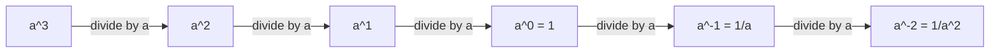
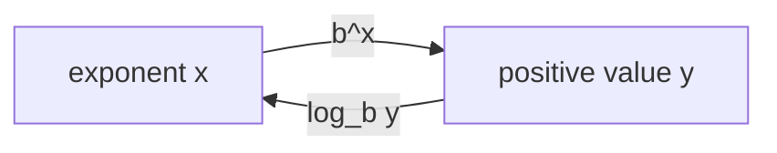
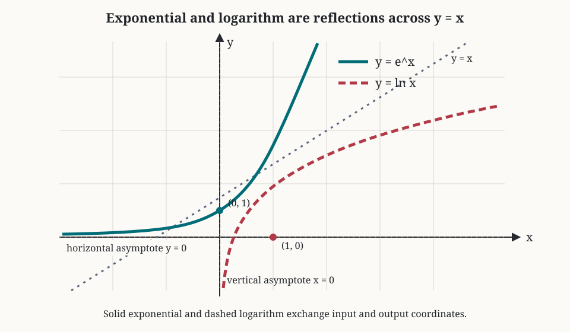
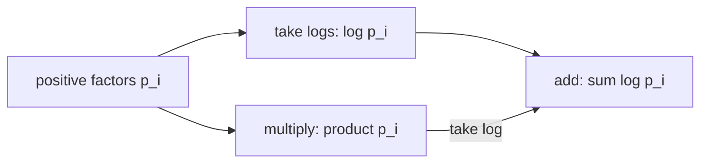
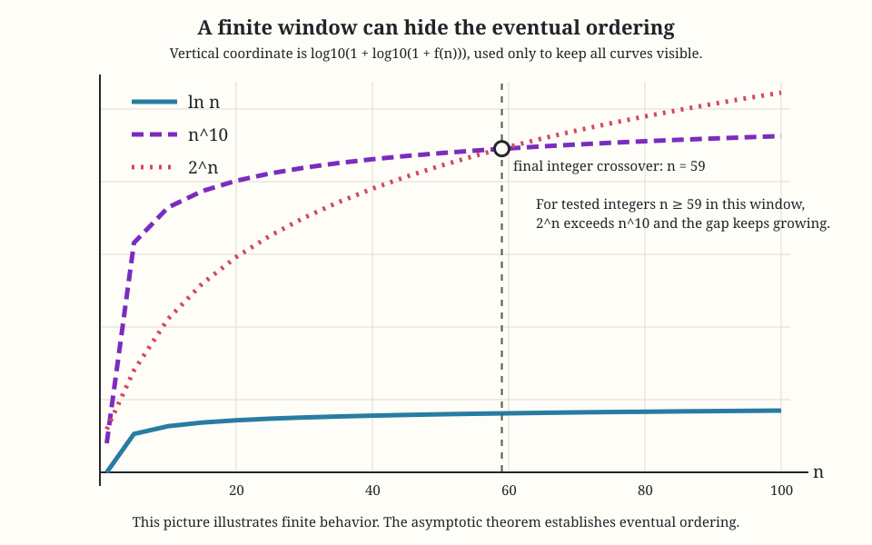
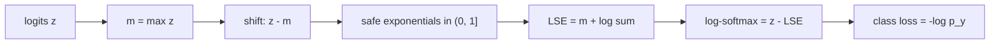
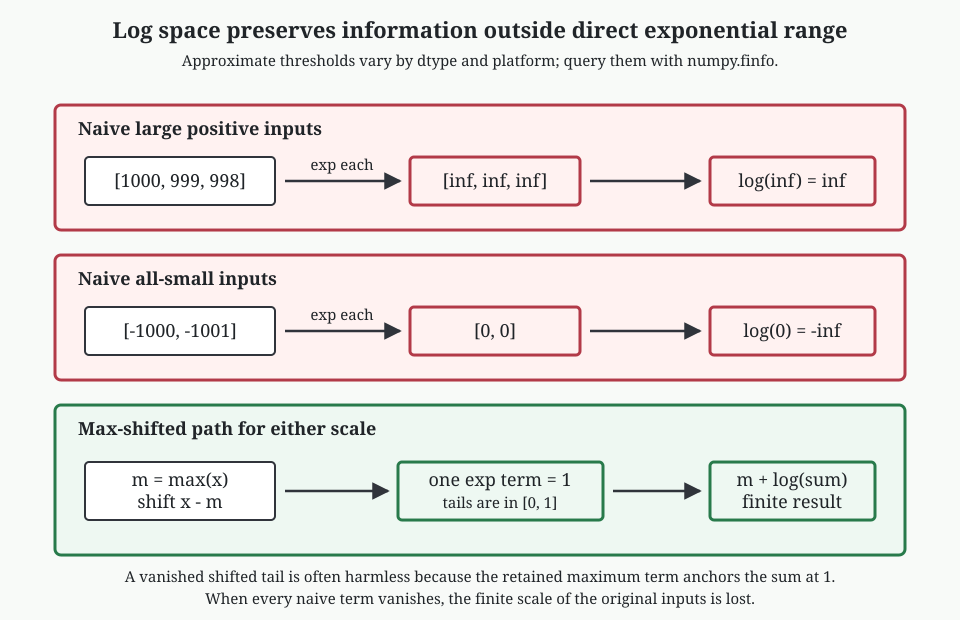

# 0.03 Exponentials and Logarithms

[Section home](../README.md) | Previous: [§0.02 Algebra, Functions, and Precalculus Backfill](../00.02-algebra-functions-precalculus/README.md) | [Project guides](../../STYLE_GUIDE.md) | [Notation guide](../../NOTATION.md)

## Why this matters

Exponentials describe repeated multiplication and growth whose rate scales with what is already present. Logarithms reverse exponentials and turn multiplication into addition. Those two ideas connect compound interest, population growth, decay, algorithmic scale, probabilities, and the numerical core of classification models.

The computational point is especially important. A product of many ordinary probabilities can become too small for a floating-point number to represent, even when every factor is valid. A naive exponential can overflow before a ratio cancels it. Moving to log space does not merely make an equation shorter. It can make the difference between a finite answer and a meaningless zero, infinity, or `nan`.

This module builds the algebra first and then follows it into machine learning. We will derive log-likelihood, negative log-likelihood, log-sum-exp, stable log-softmax, and the single-example class loss

$$
-z_y+\operatorname{LSE}(\boldsymbol{z}).
$$

The probability and information-theory interpretations remain previews. Their full foundations belong to later sections.

### Scope and non-goals

We will cover:

- integer, zero, negative, rational, and real exponents over the real numbers;
- exponent laws together with the conditions that make them valid;
- exponential functions, logarithms as inverses, graphs, domains, and ranges;
- log laws, false log laws, change of base, and notation conventions;
- exponential and logarithmic equations with domain checks;
- $e$ as the limit of repeated compounding, continuous growth, doubling time, and half-life;
- eventual comparisons among logarithmic, polynomial, and exponential growth;
- products, log probabilities, likelihood, negative log-likelihood, logits, softmax, log-softmax, and log-sum-exp;
- numerical range, underflow, overflow, `log1p`, `expm1`, and log-domain addition.

This module is explicitly **not**:

- a real-analysis construction of exponentials or logarithms;
- a calculus treatment of their derivatives, integrals, or rigorous limit proofs;
- a treatment of complex logarithms or branch cuts;
- an exhaustive catalog of population, financial, or physical growth models;
- a full probability or information-theory module;
- a framework training tutorial.

## Learning objectives

After completing this module, you should be able to:

- interpret real exponent notation and enforce the domain conditions behind exponent laws;
- move between exponential and logarithmic forms, solve equations, and reject extraneous values;
- derive continuous-growth, doubling-time, and half-life formulas from a stated model;
- compare logarithmic, polynomial, and exponential growth with an eventual rather than finite-window claim;
- convert products of positive quantities into log sums and explain what this preserves and changes;
- derive and implement stable log-sum-exp, log-softmax, and class-index negative log-likelihood;
- diagnose overflow, harmful underflow, harmless shifted-term underflow, and cancellation near zero;
- design numerical experiments across floating-point types and report hypotheses, controls, observations, and limits.

The [exercise set](exercises/README.md) assesses every objective. Full [worked solutions](solutions/README.md) are separate, and the [resource guide](resources/README.md) offers longer treatments and implementation references.

## Prerequisite check

Required: [§0.02 Algebra, Functions, and Precalculus Backfill](../00.02-algebra-functions-precalculus/README.md).

Before starting, try these questions:

1. What restriction is hidden when $x^2/x$ is simplified to $x$?
2. Why does an inverse function require a one-to-one original function?
3. Can you solve $3x+2=11$ while preserving equivalent equations?
4. What does $\prod_{i=1}^{n}p_i$ mean?
5. Why should computed floating-point values usually be checked with a tolerance?

Review §0.02 if domains, inverses, or algebraic rearrangement feel uncertain. Review [§0.01](../00.01-mathematical-notation/README.md) if products, indices, or vector notation are the obstacle.

## Historical context

John Napier published *Mirifici logarithmorum canonis descriptio* in 1614. His stated goal was practical: replace difficult multiplications, divisions, and root extractions with simpler operations. His construction used moving points and a scale tied to contemporary sine tables. It was not simply the modern natural logarithm written with old notation, and describing it as a logarithm to base $1/e$ is at best a modern approximation to the construction [1].

Henry Briggs read Napier's work, taught the new method, corresponded with him, and visited him in 1615 and 1616. Their discussions led toward tables with $\log 1=0$ and, in modern terms, base $10$. Briggs then performed and organized much of the table construction that made logarithms widely useful [2]. It is fair to associate Napier with the 1614 publication and Briggs with common logarithm tables. It is not fair to compress the development into a lone inventor discovering every modern base convention at once.

The original use case still explains the central identity:

$$
\log_b(xy)=\log_b x+\log_b y.
$$

Before electronic calculators, a table lookup, addition, and inverse lookup could replace a long multiplication. Modern computers multiply quickly, but the same identity now protects calculations whose products fall outside floating-point range.

## Intuition

### Exponents count multiplicative steps

For a positive integer $n$, $a^n$ means multiply $n$ copies of $a$. Zero and negative powers extend the pattern so moving one step downward in the exponent divides by $a$:

| Exponent | Meaning for suitable real $a$ |
|---:|---|
| $3$ | $a^3=a\cdot a\cdot a$ |
| $1$ | $a^1=a$ |
| $0$ | $a^0=1$ when $a\ne0$ |
| $-1$ | $a^{-1}=1/a$ when $a\ne0$ |
| $-3$ | $a^{-3}=1/a^3$ when $a\ne0$ |



> **Figure 1. Extending integer powers by preserving the step pattern.** The extension requires $a\ne0$ once division appears. Original diagram.

Rational exponents connect powers and roots. Real exponents complete the picture for positive bases. The conditions matter because a notation that works for $a>0$ may stop being real-valued for $a<0$.

### Logarithms ask for the exponent

The statement

$$
2^3=8
$$

can be read backward as

$$
\log_2 8=3.
$$

A logarithm does not create a new relationship. It names the exponent already present.



> **Figure 2. Exponential and logarithm as inverse functions.** For $b>0$ and $b\ne1$, the exponential maps all real inputs to positive outputs, and the logarithm reverses that map. Original diagram.



> **Figure 3. Exponential and logarithmic inverse graphs.** Reflection across $y=x$ swaps domain and range. The exponential has horizontal asymptote $y=0$; the logarithm has vertical asymptote $x=0$. Original figure.

### Products become sums

For positive $p_i$,

$$
\log\left(\prod_{i=1}^{n}p_i\right)
=
\sum_{i=1}^{n}\log p_i.
$$

This is the bridge from probability products to log-likelihood sums.



> **Figure 4. Two routes to a log product.** In exact arithmetic they agree. In floating-point arithmetic, the lower route can remain finite after the direct product has underflowed. Original diagram.

### Growth comparisons need a horizon

On a small plotting window, a polynomial can exceed an exponential. For example, $n^{10}$ is larger than $2^n$ for many ordinary values of $n$. The eventual claim is different: for every fixed positive power $k$ and every base $a>1$, $a^n$ eventually exceeds $n^k$, while $n^k$ eventually exceeds $\log n$.



> **Figure 5. Finite-window crossings do not contradict eventual ordering.** The plot uses a transformed vertical scale so all three curves remain visible; labels and line styles identify each family without relying on color. Original figure.

## Mathematics

### Integer, zero, and negative exponents

For $a\in\mathbb{R}$ and $n\in\mathbb{N}$ with $n>0$,

$$
a^n\coloneqq\underbrace{a\cdot a\cdots a}_{n\text{ factors}}.
$$

For $a\ne0$, define

$$
a^0\coloneqq1,
\qquad
a^{-n}\coloneqq\frac{1}{a^n}.
$$

The condition $a\ne0$ is load-bearing. The real expression $0^{-2}$ would require division by zero. The symbol $0^0$ is left undefined in elementary real exponentiation, although some discrete formulas and programming APIs adopt a value by convention. Always check the local context.

### Rational exponents and real-domain caveats

For positive $a$ and integers $m$ and $n>0$,

$$
a^{m/n}\coloneqq\sqrt[n]{a^m}=(\sqrt[n]{a})^m.
$$

For negative bases, reduced denominators decide whether a real root exists. For example,

$$
(-8)^{1/3}=-2,
$$

but $(-8)^{1/2}$ is not real. Reduce the fraction first: $(-8)^{2/6}$ should be interpreted through $1/3$, not through an unreduced even denominator.

Even with an odd denominator, familiar exponent laws need care if intermediate expressions leave the real domain. A blanket implementation of $a^x=\exp(x\log a)$ works over the reals only for $a>0$, since real $\log a$ requires a positive argument.

For positive $a$, real powers $a^x$ can be defined by extending rational powers continuously. This module uses that fact but does not construct it from completeness or prove its uniqueness. NIST DLMF gives authoritative definitions and identities for powers, exponentials, and logarithms, including the extra branch issues that appear over complex inputs [3].

### Exponent laws and their conditions

For real $a>0$, $b>0$, and real $x,y$, the standard laws are

$$
a^x a^y=a^{x+y},
\qquad
\frac{a^x}{a^y}=a^{x-y},
$$

$$
(a^x)^y=a^{xy},
\qquad
(ab)^x=a^x b^x.
$$

Some laws remain valid under broader conditions, such as integer exponents with negative bases. The positive-base assumptions are a dependable real-valued default for arbitrary real exponents.

| Expression | Safe real-valued conditions | Failure to watch |
|---|---|---|
| $a^{-n}$ | $a\ne0$, $n>0$ integer | division by zero |
| $a^{m/n}$ | $a>0$, or reduced odd $n$ for $a<0$ | even root of a negative number |
| $a^x a^y=a^{x+y}$ | $a>0$ for arbitrary real $x,y$ | undefined intermediate powers |
| $(ab)^x=a^x b^x$ | $a,b>0$ for arbitrary real $x$ | negative factors and fractional powers |
| $(a^x)^y=a^{xy}$ | $a>0$ for arbitrary real $x,y$ | principal-root ambiguity outside this domain |

### Exponential functions

For a base $b>0$, $b\ne1$, define

$$
f(x)=b^x.
$$

Its domain is $\mathbb{R}$ and range is $(0,\infty)$. It passes through $(0,1)$.

- If $b>1$, the function is strictly increasing and models growth.
- If $0<b<1$, it is strictly decreasing and models decay.
- In both cases, $y=0$ is a horizontal asymptote, but the function never reaches zero at a finite real input.

Since $(1/b)^x=b^{-x}$, exponential decay is a reflected growth curve.

### Logarithms as inverse functions

For $b>0$ and $b\ne1$, $y=\log_b x$ means

$$
b^y=x.
$$

The logarithm's domain is $(0,\infty)$ and range is $\mathbb{R}$. It passes through $(1,0)$ because $b^0=1$.

The inverse identities are

$$
\log_b(b^x)=x
\quad\text{for every }x\in\mathbb{R},
$$

$$
b^{\log_b x}=x
\quad\text{for }x>0.
$$

For $b>1$, $\log_b x$ is strictly increasing. For $0<b<1$, it is strictly decreasing.

### Log laws and false laws

For $x>0$, $y>0$, and real $r$,

$$
\log_b(xy)=\log_b x+\log_b y,
$$

$$
\log_b\left(\frac{x}{y}\right)=\log_b x-\log_b y,
$$

$$
\log_b(x^r)=r\log_b x,
$$

provided $x^r$ is interpreted in the stated positive real domain.

Logarithms do not distribute over addition or subtraction:

$$
\log_b(x+y)\ne\log_b x+\log_b y,
$$

$$
\log_b(x-y)\ne\log_b x-\log_b y.
$$

A quick counterexample is $\log_{10}(10+10)=\log_{10}20$, while $\log_{10}10+\log_{10}10=2$.

| Valid transformation | Invalid look-alike |
|---|---|
| $\log(xy)=\log x+\log y$ | $\log(x+y)=\log x+\log y$ |
| $\log(x/y)=\log x-\log y$ | $\log(x-y)=\log x-\log y$ |
| $\log(x^r)=r\log x$ | $(\log x)^r=r\log x$ |
| $\exp(x+y)=\exp x\exp y$ | $\exp(xy)=\exp x\exp y$ |

### Change of base and notation conventions

For valid bases $a$ and $b$ and $x>0$,

$$
\log_b x=\frac{\log_a x}{\log_a b}.
$$

Taking $a=e$ gives $\log_b x=\ln x/\ln b$.

This curriculum follows the machine-learning convention

$$
\log x\equiv\ln x,
$$

so an unqualified `log` in mathematics means the natural logarithm. We write $\log_2$ explicitly for base $2$ and $\log_{10}$ explicitly for base $10$. Other fields may use `log` for base $10$ or base $2$, so inspect the source.

Library behavior is another convention. Python's `math.log(x)` is natural log, `math.log(x, base)` computes a change-of-base quotient, and dedicated `log2` and `log10` functions are documented as usually more accurate for those bases [4]. JavaScript's `Math.log` is also natural log, while some calculators label base $10$ as `log`. Never infer a library's base from typography alone.

### Solving exponential equations

If both sides can be written with one valid base, use one-to-one behavior:

$$
3^{2x-1}=27=3^3
\quad\Longrightarrow\quad
2x-1=3
\quad\Longrightarrow\quad
x=2.
$$

Otherwise take logarithms after confirming both sides are positive:

$$
5e^{0.4t}=17
\quad\Longrightarrow\quad
0.4t=\ln(17/5)
\quad\Longrightarrow\quad
t=\frac{\ln(17/5)}{0.4}.
$$

Taking logarithms is reversible here because both sides are positive and $\log$ is one-to-one on $(0,\infty)$.

### Solving logarithmic equations

Start with domain restrictions. For

$$
\log_2(x-1)+\log_2(x-3)=3,
$$

we need $x>3$. Combine the logs:

$$
\log_2((x-1)(x-3))=3
\iff
(x-1)(x-3)=8.
$$

The resulting quadratic may produce candidates outside $x>3$. Algebraic candidates are not solutions until checked in the original equation.

### The number $e$ from repeated compounding

Suppose one unit grows by $100\%$ over one time unit, split into $n$ equal compounding periods. Each period multiplies by $1+1/n$, so the final amount is

$$
\left(1+\frac{1}{n}\right)^n.
$$

As compounding becomes more frequent, these values approach a finite limit:

$$
e\coloneqq\lim_{n\to\infty}\left(1+\frac{1}{n}\right)^n.
$$

This statement defines $e$ through one particular limit. A rigorous proof that the limit exists belongs to analysis. Numerically,

| $n$ | $(1+1/n)^n$ |
|---:|---:|
| $1$ | $2.000000$ |
| $2$ | $2.250000$ |
| $12$ | $2.613035$ |
| $365$ | $2.714567$ |
| $10{,}000$ | $2.718146$ |

For principal amount $P$, annual rate $r$, time $t$, and $n$ compounds per time unit,

$$
A_n(t)=P\left(1+\frac{r}{n}\right)^{nt}.
$$

Holding $P,r,t$ fixed and taking the continuous-compounding limit gives

$$
A(t)=Pe^{rt}.
$$

This is a mathematical idealization of a stated compounding model, not a claim that every real process compounds continuously.

### Continuous growth, doubling time, and half-life

A general continuous growth or decay model is

$$
Q(t)=Q_0e^{kt},
$$

where $Q_0>0$ is the initial amount and $k$ is a constant rate parameter.

For growth, $k>0$. The doubling time $T_2$ satisfies

$$
2Q_0=Q_0e^{kT_2}
\quad\Longrightarrow\quad
T_2=\frac{\ln2}{k}.
$$

For decay, write $Q(t)=Q_0e^{-\lambda t}$ with $\lambda>0$. The half-life $T_{1/2}$ is

$$
\frac{Q_0}{2}=Q_0e^{-\lambda T_{1/2}}
\quad\Longrightarrow\quad
T_{1/2}=\frac{\ln2}{\lambda}.
$$

Units matter. If $t$ is measured in hours, then $k$ or $\lambda$ has units of inverse hours.

### Logarithmic, polynomial, and exponential growth

For constants $a>1$ and $k>0$, the eventual ordering is

$$
\log n=o(n^k),
\qquad
n^k=o(a^n)
\quad\text{as }n\to\infty.
$$

The notation $f(n)=o(g(n))$ means $f(n)/g(n)\to0$. A proof uses calculus or series tools developed later. Here we use the result as an asymptotic statement and test finite behavior numerically.

"Exponential beats polynomial" does not name a useful crossover. The crossover depends strongly on $a$, $k$, coefficients, and the range inspected. An algorithm with exponential complexity may appear faster on tiny inputs because constants and implementation details dominate there.

### Products, probabilities, and log-likelihood

Suppose positive factors $p_i$ are multiplied:

$$
P=\prod_{i=1}^{n}p_i.
$$

Then

$$
\log P=\sum_{i=1}^{n}\log p_i.
$$

In a later probability module, factors may be conditional probabilities. Here we only need $0<p_i\le1$, so each $\log p_i\le0$ and long sums can become very negative while remaining representable.

For fixed data $\mathcal{D}$ and parameters $\boldsymbol{\theta}$, define likelihood

$$
\mathcal{L}(\boldsymbol{\theta};\mathcal{D})
\coloneqq
p(\mathcal{D}\mid\boldsymbol{\theta})>0.
$$

The log-likelihood is

$$
\ell(\boldsymbol{\theta};\mathcal{D})
\coloneqq
\log\mathcal{L}(\boldsymbol{\theta};\mathcal{D}).
$$

Because $\log$ is strictly increasing,

$$
\arg\max_{\boldsymbol{\theta}}\mathcal{L}(\boldsymbol{\theta};\mathcal{D})
=
\arg\max_{\boldsymbol{\theta}}\ell(\boldsymbol{\theta};\mathcal{D}),
$$

when the likelihood is positive on the compared domain. Taking logs preserves the optimizer but changes objective values, scale, and curvature. An optimization algorithm does not generally take identical steps on $\mathcal{L}$ and $\log\mathcal{L}$.

The negative log-likelihood (NLL) is

$$
-\ell(\boldsymbol{\theta};\mathcal{D}),
$$

which converts maximization into minimization. This is a preview, not a full treatment of statistical estimation.

### Logits, softmax, and class loss

Let $\boldsymbol{z}\in\mathbb{R}^{C}$ contain one real **logit** per class. Logits are unnormalized scores. They need not be positive and need not sum to one.

Softmax converts them to positive normalized values:

$$
p_c
\coloneqq
\operatorname{softmax}(\boldsymbol{z})_c
=
\frac{e^{z_c}}{\sum_{j=1}^{C}e^{z_j}}.
$$

For a target class index $y\in\{1,\ldots,C\}$, the one-hot target has value $1$ at $y$ and $0$ elsewhere. Its cross-entropy expression reduces to the negative log probability of the target class:

$$
-\sum_{c=1}^{C}[c=y]\log p_c=-\log p_y.
$$

At this stage, treat "class-index cross-entropy" as this NLL identity. Later probability and information-theory modules explain expectations, entropy, calibration, and distributional targets.

### Log-sum-exp

For $\boldsymbol{x}\in\mathbb{R}^{n}$, define

$$
\operatorname{LSE}(\boldsymbol{x})
\coloneqq
\log\left(\sum_{i=1}^{n}e^{x_i}\right).
$$

Let $m=\max_i x_i$. Since at least one term equals $e^m$,

$$
\sum_i e^{x_i}\ge e^m
\quad\Longrightarrow\quad
\operatorname{LSE}(\boldsymbol{x})\ge m.
$$

Since every term is at most $e^m$,

$$
\sum_i e^{x_i}\le ne^m
\quad\Longrightarrow\quad
\operatorname{LSE}(\boldsymbol{x})\le m+\log n.
$$

Therefore

$$
\max_i x_i
\le
\operatorname{LSE}(\boldsymbol{x})
\le
\max_i x_i+\log n.
$$

LSE is a smooth aggregate near the maximum, but it is not equal to the maximum except in a limiting or degenerate sense.

## Derivation

### Max-shifted log-sum-exp

Direct evaluation can overflow if some $x_i$ is large. Factor out $e^m$:

$$
\begin{aligned}
\operatorname{LSE}(\boldsymbol{x})
&=\log\left(\sum_i e^{x_i}\right)\\
&=\log\left(e^m\sum_i e^{x_i-m}\right)\\
&=m+\log\left(\sum_i e^{x_i-m}\right).
\end{aligned}
$$

Every shifted exponent satisfies $x_i-m\le0$, so every exponential lies in $(0,1]$, and at least one equals $1$. Overflow is impossible in the shifted exponentials.

The distinction between two kinds of underflow matters:

- **Harmful all-term underflow:** Naively evaluating very negative $x_i$ can turn every $e^{x_i}$ into zero. The sum becomes zero and its log becomes $-\infty$, although the exact LSE is finite.
- **Usually harmless shifted-term underflow:** After subtracting $m$, a term far below the maximum may round to zero. The maximum term is still exactly $1$, and the lost term was negligible relative to it.

Finite floating-point formats have bounded range and precision. Python documents the usual binary64 representation [5], and NumPy exposes dtype-specific limits [6]. Blanchard, D. J. Higham, and N. J. Higham analyze LSE and softmax algorithms across floating-point formats. They show why max shifting avoids overflow and harmful all-term underflow, while shifted formulas retain accuracy in practical use [7]. SciPy's documented `scipy.special.logsumexp` computes the same quantity with a numerically stable implementation, but SciPy is not required by this module [8].

### Log-softmax and the class-index loss

Take the log of softmax:

$$
\begin{aligned}
\log p_c
&=\log\left(\frac{e^{z_c}}{\sum_j e^{z_j}}\right)\\
&=z_c-\log\left(\sum_j e^{z_j}\right)\\
&=z_c-\operatorname{LSE}(\boldsymbol{z}).
\end{aligned}
$$

Thus

$$
\operatorname{logsoftmax}(\boldsymbol{z})_c
=z_c-\operatorname{LSE}(\boldsymbol{z}).
$$

For target class $y$,

$$
-\log p_y
=-z_y+\operatorname{LSE}(\boldsymbol{z}).
$$

Use the shifted LSE and never form a huge exponential merely to take its log afterward.



> **Figure 6. Stable path from logits to a class-index loss.** The max shift controls numerical range without changing softmax or LSE after the shift is restored. Original diagram.

PyTorch documents `CrossEntropyLoss` as accepting unnormalized logits and, for class-index targets, as equivalent to `LogSoftmax` followed by `NLLLoss` [9]. That API confirmation supports the algebra; this module does not teach model training.

## Implementation

The snippets use Python 3 and NumPy. Python floating-point values are usually IEEE 754 binary64, and most decimal fractions are approximations to binary fractions [5]. NumPy's `finfo`, `logaddexp`, `log1p`, and `expm1` APIs expose range information and stable elementary operations [6].

Goodfellow, Bengio, and Courville place underflow, overflow, conditioning, and stable reformulation within the broader numerical foundation of machine learning [10].

### Products and log sums

```python
from math import fsum, log, prod

probabilities = [0.01] * 400
naive_product = prod(probabilities)
log_product = fsum(log(value) for value in probabilities)

assert naive_product == 0.0
assert log_product == 400 * log(0.01)
```

The zero is not the mathematical product. It is an underflowed representation. The log sum remains finite.

### Stable log-sum-exp

```python
from math import exp, fsum, log


def logsumexp(values):
    maximum = max(values)
    shifted_sum = fsum(exp(value - maximum) for value in values)
    return maximum + log(shifted_sum)


values = [1000.0, 999.0, 998.0]
result = logsumexp(values)
assert 1000.0 <= result <= 1000.0 + log(3.0)
```

Calling `exp(1000.0)` directly raises `OverflowError` in Python's `math` module, but every shifted exponential here is at most one.

### Stable log-softmax and NLL

```python
import numpy as np


def stable_logsumexp(values, axis=-1, keepdims=False):
    maximum = np.max(values, axis=axis, keepdims=True)
    shifted = values - maximum
    result = maximum + np.log(np.sum(np.exp(shifted), axis=axis, keepdims=True))
    if keepdims:
        return result
    return np.squeeze(result, axis=axis)


def log_softmax(logits):
    return logits - stable_logsumexp(logits, axis=-1, keepdims=True)


def class_nll(logits, targets):
    log_probabilities = log_softmax(logits)
    rows = np.arange(logits.shape[0])
    return -log_probabilities[rows, targets]


logits = np.array([[1000.0, 999.0, 998.0], [-1000.0, -999.0, -998.0]])
targets = np.array([0, 2])
losses = class_nll(logits, targets)
probability_sums = np.exp(log_softmax(logits)).sum(axis=1)

assert np.allclose(probability_sums, 1.0)
assert np.allclose(losses[0], losses[1])
```

Adding the same constant to every logit does not change softmax. The two rows differ by a constant and therefore have equal class losses for corresponding relative positions.

### `log1p` and `expm1` near zero

```python
from math import exp, expm1, log, log1p

small = 1e-16
naive_log = log(1.0 + small)
stable_log = log1p(small)

assert naive_log == 0.0
assert stable_log > 0.0

moderate_small = 1e-12
naive_exp_difference = exp(moderate_small) - 1.0
stable_exp_difference = expm1(moderate_small)

assert stable_exp_difference != 0.0
assert abs(stable_exp_difference - moderate_small) < abs(
    naive_exp_difference - moderate_small
)
```

The formulas are mathematically equal. Their floating-point evaluations differ because forming $1+x$ or subtracting $1$ can erase low-order information. The Python docs explicitly provide `log1p` and `expm1` for accuracy near zero [4].

### Add probabilities in log space

If $a=\log p$ and $b=\log q$, then

$$
\log(p+q)=\log(e^a+e^b)=\operatorname{LSE}(a,b).
$$

NumPy provides this binary operation as `logaddexp`:

```python
import numpy as np

log_p = np.log(1e-300)
log_q = np.log(2e-300)
log_total = np.logaddexp(log_p, log_q)

assert np.isfinite(log_total)
assert np.isclose(np.exp(log_total) / 1e-300, 3.0)
```

Do not add log probabilities directly. $\log p+\log q$ is $\log(pq)$, not $\log(p+q)$.

### Growth crossover experiment

```python
from math import log


def first_sustained_crossover(power, base, search_limit):
    log_base = log(base)
    last_failure = None
    for n in range(1, search_limit + 1):
        exponential_wins = n * log_base > power * log(n)
        if not exponential_wins:
            last_failure = n
    return None if last_failure == search_limit else (last_failure or 0) + 1


crossover = first_sustained_crossover(power=10, base=2.0, search_limit=10000)
assert crossover is not None
assert crossover > 1
```

Comparing logarithms avoids computing either $2^n$ or $n^{10}$. The returned point is sustained only relative to the finite search range. The asymptotic theorem, not the experiment, establishes eventual dominance beyond every finite range.

## Experimentation

### Numerical range laboratory

**Question.** When do products and exponentials fail in `float32` and `float64`, and which log-space rewrites remain informative?

**Hypotheses.** `float32` will overflow and underflow at less extreme exponents than `float64`. Direct products of repeated probabilities will reach zero earlier in `float32`. Max-shifted LSE will remain finite when naive LSE does not.

**Controls.** Use the same generated exponents and probabilities for both dtypes. Record NumPy version, platform, dtype, `finfo.max`, `finfo.smallest_normal`, and `finfo.smallest_subnormal`. Separate normal from subnormal values. Suppress warnings only inside a block that records whether overflow or underflow occurred.

```python
import numpy as np

for dtype in (np.float32, np.float64):
    info = np.finfo(dtype)
    log_max = np.log(dtype(info.max))
    log_smallest = np.log(dtype(info.smallest_subnormal))
    factors = np.full(1000, dtype(0.01), dtype=dtype)
    direct_product = np.prod(factors, dtype=dtype)
    log_product = np.sum(np.log(factors), dtype=dtype)

    print(
        dtype.__name__,
        "log(max)=", float(log_max),
        "log(smallest_subnormal)=", float(log_smallest),
        "product=", float(direct_product),
        "log_product=", float(log_product),
    )
```

Then test vectors such as `[100, 99, 98]`, `[1000, 999, 998]`, `[-100, -101]`, and `[-1000, -1001]` with naive and shifted LSE in each dtype.

**Observations to record.** Identify the first tested exponent that overflows, the first product length that becomes zero, whether results pass through a subnormal range first, and whether shifted nonmaximum terms underflow. Explain why a zero shifted tail can be harmless while a zero sum of all naive terms is harmful.



> **Figure 7. Numerical range failures and log-space repairs.** The key distinction is whether all information disappears or only terms negligible relative to a retained maximum disappear. Original figure.

**Limitations.** Thresholds depend on dtype and implementation details. This lab observes floating-point behavior; it does not prove the mathematical identities or a universal error bound.

### Growth crossover investigation

**Question.** How misleading can a finite plotting window be when comparing $\log n$, $n^k$, and $a^n$?

**Hypotheses.** Raising $k$ delays exponential dominance. Moving $a$ closer to $1$ also delays it. A plot ending before the last crossing can suggest the wrong eventual order.

**Controls.** Compare positive functions using their natural logs, keep coefficients fixed within each run, and define a crossover criterion before searching. Search the same integer range for every pair. Distinguish "first win" from "wins at every later tested point."

Investigate at least:

| Polynomial | Exponential | Suggested search |
|---|---|---:|
| $n^2$ | $2^n$ | $1\le n\le100$ |
| $n^{10}$ | $2^n$ | $1\le n\le10{,}000$ |
| $100n^3$ | $1.1^n$ | $1\le n\le100{,}000$ |

Report every crossing found, the final tested ordering, and one window that would support a false visual story. Then connect the observations to the asymptotic statement without claiming the finite search proves it.

## Worked examples

### Example 1: Negative and rational exponent domain trap

We have $16^{-3/4}=1/16^{3/4}=1/(\sqrt[4]{16})^3=1/8$. For $(-16)^{3/4}$, the reduced denominator is even, so no real fourth root exists. Rewriting it as $\exp((3/4)\log(-16))$ also fails over the reals because $\log(-16)$ is undefined there.

### Example 2: Apply exponent laws with conditions

For $x>0$, $x^{1/2}x^{3/2}=x^2$. If $x=-1$, neither real factor on the left is defined, even though $x^2=1$ is. An algebraic identity does not retroactively define an invalid intermediate expression.

### Example 3: Change base

To compute $\log_2 10$ using natural logs,

$$
\log_2 10=\frac{\ln10}{\ln2}\approx3.32193.
$$

The check $2^{3.32193}\approx10$ verifies the direction of the quotient.

### Example 4: Solve an exponential equation

Solve $7^{x-1}=20$:

$$
(x-1)\ln7=\ln20
\quad\Longrightarrow\quad
x=1+\frac{\ln20}{\ln7}\approx2.539.
$$

Both sides are positive, so taking logs preserves equivalence.

### Example 5: Solve a logarithmic equation and reject an extraneous root

Solve $\log_2(x-1)+\log_2(x-3)=3$. The domain is $x>3$. Combining and exponentiating gives

$$
(x-1)(x-3)=8
\iff
x^2-4x-5=0
\iff
x\in\{5,-1\}.
$$

Only $x=5$ lies in the original domain. Substitution gives $\log_2 4+\log_2 2=3$.

### Example 6: Compound to continuous growth

For $P=1000$, rate $r=0.06$, and $t=5$ years,

$$
A_n=1000\left(1+\frac{0.06}{n}\right)^{5n}.
$$

As $n\to\infty$, $A_n\to1000e^{0.3}\approx1349.86$. Monthly compounding gives approximately $1348.85$, close but not equal to the continuous model.

### Example 7: Half-life

A quantity follows $Q(t)=80e^{-0.12t}$. Its half-life is

$$
T_{1/2}=\frac{\ln2}{0.12}\approx5.776.
$$

At that time, $Q(T_{1/2})=80e^{-\ln2}=40$.

### Example 8: Finite versus eventual growth

At $n=10$, $n^{10}=10^{10}$ while $2^n=1024$, so the polynomial is larger. This does not refute $n^{10}=o(2^n)$. It shows only that the eventual regime has not arrived by $n=10$.

### Example 9: Product underflow

The exact product of four hundred factors of $0.01$ is $10^{-800}$. A binary64 float cannot represent it as a positive number, so direct multiplication returns zero. The log product is $400\ln(0.01)\approx-1842.07$, which is finite and still comparable with other log products.

### Example 10: Log-likelihood preserves the optimizer

Suppose two parameter choices have likelihoods $10^{-200}$ and $10^{-220}$. The first is larger. Their natural logs are approximately $-460.52$ and $-506.57$, so the first remains larger. The argmax is preserved, but the difference changes from a tiny absolute probability scale to about $46.05$ log units.

### Example 11: Naive versus stable LSE

For $\boldsymbol{x}=(1000,999,998)$, naive exponentiation overflows. With $m=1000$,

$$
\operatorname{LSE}(\boldsymbol{x})
=1000+\log(1+e^{-1}+e^{-2})
\approx1000.4076.
$$

The bounds predict $1000\le\operatorname{LSE}\le1000+\ln3$, which the result satisfies.

### Example 12: Stable log-softmax and class NLL

For logits $\boldsymbol{z}=(1000,999,998)$ and target $y=1$ under one-based class indexing,

$$
-\log p_1=-z_1+\operatorname{LSE}(\boldsymbol{z})
\approx0.4076.
$$

No $e^{1000}$ is formed. In Python, the corresponding target index is `0` because arrays are zero-indexed.

### Example 13: `log1p` and `expm1` precision

For $x=10^{-16}$ in binary64, `1.0 + x` rounds to `1.0`, so `log(1.0 + x)` returns zero. `log1p(x)` retains a value close to $10^{-16}$. For small $x$, `expm1(x)` similarly avoids the cancellation in `exp(x) - 1`.

### Example 14: Log-domain addition

If $\log p=-1000$ and $\log q=-1001$, direct exponentiation underflows in binary64. Instead,

$$
\log(p+q)
=-1000+\log(1+e^{-1})
\approx-999.6867.
$$

This is what a stable two-term `logaddexp` computes.

## Common mistakes

| Mistake | Why it fails | Repair |
|---|---|---|
| Treating $a^0=1$ as permission to divide by zero | the extension assumes $a\ne0$ | state the base condition |
| Using $a^x=e^{x\log a}$ for negative real $a$ | real $\log a$ is undefined | handle valid rational cases separately |
| Applying exponent laws through undefined intermediates | the endpoint may exist while a step does not | check every expression's domain |
| Forgetting to reduce a rational exponent | denominator parity may be misread | reduce $m/n$ first |
| Allowing base $1$ in a logarithm | $1^x$ is not one-to-one | require $b>0$, $b\ne1$ |
| Taking $\log$ of a nonpositive expression | real logarithms require positive inputs | write domain constraints first |
| Distributing log over addition | logs convert products, not sums | use LSE or leave the sum intact |
| Assuming `log` has one universal base | fields and libraries differ | state and verify the convention |
| Keeping every quadratic candidate from a log equation | algebra may introduce invalid values | substitute into the original equation |
| Calling a finite plot an asymptotic proof | crossings may lie outside the window | qualify claims with "eventually" |
| Multiplying many probabilities directly | the product can underflow | sum logs |
| Saying logs leave optimization unchanged | argmax may match, but scale and curvature change | state exactly what is preserved |
| Computing `log(sum(exp(x)))` literally | exponentials may overflow or all underflow | subtract the maximum first |
| Treating every shifted underflow as catastrophic | negligible tail terms may vanish harmlessly | check whether a maximum term remains |
| Adding log probabilities with `a + b` | that represents a product | use `logaddexp(a, b)` |
| Computing `log(1+x)` near zero | forming $1+x$ may erase $x$ | use `log1p(x)` |
| Computing `exp(x)-1` near zero | subtraction may cancel meaningful digits | use `expm1(x)` |
| Applying softmax before a stable class loss | huge logits can overflow | use log-softmax or fused loss algebra |

## Exercises

Complete the [twelve exercises](exercises/README.md), then compare your work with the [full solutions](solutions/README.md). The set mixes domain critique, equations, compounding, asymptotic experiments, likelihood, stable LSE, log-softmax, precision tools, implementation, and source criticism. The [resources](resources/README.md) provide deeper reading and official API references.

## What you should now be able to do

You can interpret exponent notation without losing its real-domain conditions, reverse exponentials with logarithms, solve growth and decay problems, and make eventual growth claims without overreading a finite plot. You can also use logarithms as a computational representation: products become sums, likelihood optimization stays ordered, and stable LSE keeps softmax-related calculations in range.

As a final check, explain why

$$
\log\left(e^{-1000}+e^{-1001}\right)
$$

is finite, why a naive program may report $-\infty$, and why subtracting the maximum repairs the computation without changing the exact result.

## Where this leads

§1 develops limits, continuity, and derivatives, making the growth statements and continuous models more rigorous. §3 develops probability and likelihood. §6 develops entropy and cross-entropy. §8 uses log-likelihood in estimation and classification. §§10-13 repeatedly use logits, softmax, log-softmax, cross-entropy, and stable log-domain computations.

The computational lesson appears everywhere: algebraically equivalent formulas need not be numerically equivalent. Derive the identity, then choose the representation that preserves useful information on the machine you actually have.

## References

[1] J. J. O'Connor and E. F. Robertson, "John Napier," *MacTutor History of Mathematics Archive*, University of St Andrews, 1998. https://mathshistory.st-andrews.ac.uk/Biographies/Napier/ Accessed 2026-09-01.

[2] J. J. O'Connor and E. F. Robertson, "Henry Briggs," *MacTutor History of Mathematics Archive*, University of St Andrews, 1999. https://mathshistory.st-andrews.ac.uk/Biographies/Briggs/ Accessed 2026-09-01.

[3] R. Roy and F. W. J. Olver, *NIST Digital Library of Mathematical Functions*, Version 1.2.7, ch. 4, "Elementary Functions." National Institute of Standards and Technology, 2026. https://dlmf.nist.gov/4 Accessed 2026-09-01.

[4] Python Software Foundation, "math: Mathematical functions," Python 3.14 documentation. https://docs.python.org/3/library/math.html Accessed 2026-09-01.

[5] Python Software Foundation, "Floating-Point Arithmetic: Issues and Limitations," Python 3.14 tutorial. https://docs.python.org/3/tutorial/floatingpoint.html Accessed 2026-09-01.

[6] NumPy Developers, "numpy.finfo, numpy.logaddexp, numpy.log1p, and numpy.expm1," NumPy v2.5 Manual. https://numpy.org/doc/stable/reference/generated/numpy.finfo.html, https://numpy.org/doc/stable/reference/generated/numpy.logaddexp.html, https://numpy.org/doc/stable/reference/generated/numpy.log1p.html, and https://numpy.org/doc/stable/reference/generated/numpy.expm1.html. Accessed 2026-09-01.

[7] P. Blanchard, D. J. Higham, and N. J. Higham, "Accurately computing the log-sum-exp and softmax functions," *IMA Journal of Numerical Analysis*, vol. 41, no. 4, pp. 2311-2330, 2021. https://doi.org/10.1093/imanum/draa038

[8] SciPy Community, "scipy.special.logsumexp," SciPy v1.18.0 Manual. https://docs.scipy.org/doc/scipy/reference/generated/scipy.special.logsumexp.html Accessed 2026-09-01.

[9] PyTorch Contributors, "CrossEntropyLoss," PyTorch v2.13 documentation. https://docs.pytorch.org/docs/2.13/generated/torch.nn.CrossEntropyLoss.html Accessed 2026-09-01.

[10] I. Goodfellow, Y. Bengio, and A. Courville, *Deep Learning*. MIT Press, 2016, ch. 4, "Numerical Computation." https://www.deeplearningbook.org/contents/numerical.html

---

Previous: [§0.02 Algebra, Functions, and Precalculus Backfill](../00.02-algebra-functions-precalculus/README.md) | [Section home](../README.md) | Next: [§0.04 Sets, Relations, and Functions](../00.04-sets-relations-functions/README.md)
