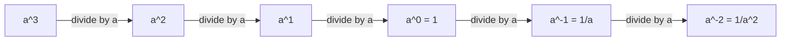
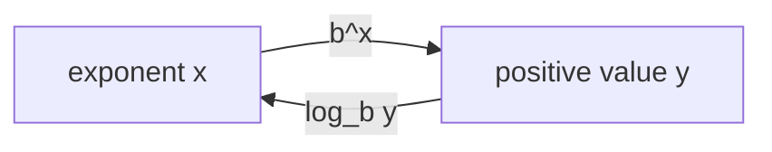
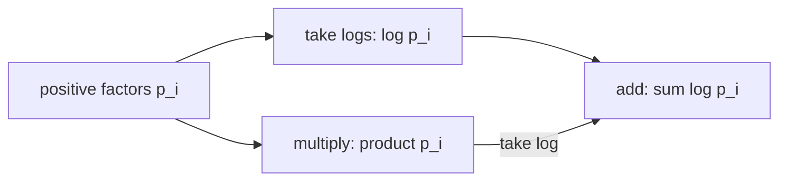
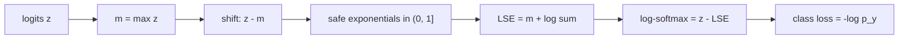

# 0.03 Exponentials and Logarithms

[Section home](../README.md) | Previous: [§0.02 Algebra, Functions, and Precalculus Backfill](../00.02-algebra-functions-precalculus/README.md) | [Project guides](../../CONTRIBUTING.md#module-file-structure) | [Notation guide](../../NOTATION.md)

Use exponent and logarithm laws with their real-domain conditions, solve growth and decay models, distinguish finite from eventual growth, and turn probability products and class losses into stable log-space computations. Probability and information-theory interpretations remain previews.

Start with [§0.02 Algebra, Functions, and Precalculus Backfill](../00.02-algebra-functions-precalculus/README.md). Limits and continuity (§1.01), probability (§3.01), and information theory (§6.01) are useful companion topics, not requirements for the algebra here.

**Contents**

- [Check your starting point](#check-your-starting-point) · [From multiplicative growth to log-space computation](#from-multiplicative-growth-to-log-space-computation)
- [Historical context](#historical-context) · [Multiplicative steps and inverse scales](#multiplicative-steps-and-inverse-scales)
- [Exponents, logarithms, and growth](#exponents-logarithms-and-growth) · [Stable log-sum-exp and class loss](#stable-log-sum-exp-and-class-loss)
- [Worked examples](#worked-examples) · [Implementation](#implementation)
- [Numerical range and growth experiments](#numerical-range-and-growth-experiments) · [Common mistakes](#common-mistakes)
- [Check your understanding](#check-your-understanding) · [Where this leads](#where-this-leads)
- [Practice](#practice) · [References](#references)

## Check your starting point

Before starting, try these questions:

1. What restriction is hidden when $`x^2/x`$ is simplified to $`x`$?
2. Why does an inverse function require a one-to-one original function?
3. Can you solve $`3x+2=11`$ while preserving equivalent equations?
4. What does $`\prod_{i=1}^{n}p_i`$ mean?
5. Why should computed floating-point values usually be checked with a tolerance?

Review §0.02 if domains, inverses, or algebraic rearrangement feel uncertain. Review [§0.01](../00.01-mathematical-notation/README.md) if products, indices, or vector notation are the obstacle.

## From multiplicative growth to log-space computation

Exponentials describe repeated multiplication and growth whose rate scales with what is already present. Logarithms reverse exponentials and turn multiplication into addition. Those two ideas connect compound interest, population growth, decay, algorithmic scale, probabilities, and the numerical core of classification models.

The computational point is especially important. A product of many ordinary probabilities can become too small for a floating-point number to represent, even when every factor is valid. A naive exponential can overflow before a ratio cancels it. Moving to log space does not merely make an equation shorter. It can make the difference between a finite answer and a meaningless zero, infinity, or `nan`.

This module builds the algebra first and then follows it into machine learning. We will derive log-likelihood, negative log-likelihood, log-sum-exp, stable log-softmax, and the single-example class loss

$$
-z_y+\mathrm{LSE}(\boldsymbol{z}).
$$

The probability and information-theory interpretations remain previews. Their full foundations belong to later sections.

### Scope and non-goals

We will cover:

- integer, zero, negative, rational, and real exponents over the real numbers;
- exponent laws together with the conditions that make them valid;
- exponential functions, logarithms as inverses, graphs, domains, and ranges;
- log laws, false log laws, change of base, and notation conventions;
- exponential and logarithmic equations with domain checks;
- $`e`$ as the limit of repeated compounding, continuous growth, doubling time, and half-life;
- eventual comparisons among logarithmic, polynomial, and exponential growth;
- products, log probabilities, likelihood, negative log-likelihood, logits, softmax, log-softmax, and log-sum-exp;
- numerical range, underflow, overflow, `log1p`, `expm1`, and log-domain addition.

This module is explicitly **not**:

- a real-analysis construction of exponentials or logarithms;
- a calculus treatment of their derivatives, integrals, or rigorous limit proofs;
- a treatment of complex logarithms or branch cuts;
- an exhaustive catalog of population, financial, or physical growth models;
- a full probability or information-theory module;
- a framework training tutorial.

## Historical context

John Napier published *Mirifici logarithmorum canonis descriptio* in 1614. His stated goal was practical: replace difficult multiplications, divisions, and root extractions with simpler operations. His construction used moving points and a scale tied to contemporary sine tables. It was not simply the modern natural logarithm written with old notation, and describing it as a logarithm to base $`1/e`$ is at best a modern approximation to the construction [1].

Henry Briggs read Napier's work, taught the new method, corresponded with him, and visited him in 1615 and 1616. Their discussions led toward tables with $`\log 1=0`$ and, in modern terms, base $`10`$. Briggs then performed and organized much of the table construction that made logarithms widely useful [2]. It is fair to associate Napier with the 1614 publication and Briggs with common logarithm tables. It is not fair to compress the development into a lone inventor discovering every modern base convention at once.

The original use case still explains the central identity:

$$
\log_b(xy)=\log_b x+\log_b y.
$$

Before electronic calculators, a table lookup, addition, and inverse lookup could replace a long multiplication. Modern computers multiply quickly, but the same identity now protects calculations whose products fall outside floating-point range.

## Multiplicative steps and inverse scales

### Exponents count multiplicative steps

For a positive integer $`n`$, $`a^n`$ means multiply $`n`$ copies of $`a`$. Zero and negative powers extend the pattern so moving one step downward in the exponent divides by $`a`$:

| Exponent | Meaning for suitable real $`a`$ |
|---:|---|
| $`3`$ | $`a^3=a\cdot a\cdot a`$ |
| $`1`$ | $`a^1=a`$ |
| $`0`$ | $`a^0=1`$ when $`a\ne0`$ |
| $`-1`$ | $`a^{-1}=1/a`$ when $`a\ne0`$ |
| $`-3`$ | $`a^{-3}=1/a^3`$ when $`a\ne0`$ |



> **Figure 1. Extending integer powers by preserving the step pattern.** The extension requires $`a\ne0`$ once division appears. Original diagram.

Rational exponents connect powers and roots. Real exponents complete the picture for positive bases. The conditions matter because a notation that works for $`a>0`$ may stop being real-valued for $`a<0`$.

### Logarithms ask for the exponent

The statement

$$
2^3=8
$$

can be read backward as

$$
\log_2 8=3.
$$

A logarithm does not create a new relationship. It names the exponent already present.



> **Figure 2. Exponential and logarithm as inverse functions.** For $`b>0`$ and $`b\ne1`$, the exponential maps all real inputs to positive outputs, and the logarithm reverses that map. Original diagram.


> **Figure 3. Exponential and logarithmic inverse graphs.** Reflection across $`y=x`$ swaps domain and range. The exponential has horizontal asymptote $`y=0`$; the logarithm has vertical asymptote $`x=0`$. Original figure.

### Products become sums

For positive $`p_i`$,

$$
\log\left(\prod_{i=1}^{n}p_i\right) =
\sum_{i=1}^{n}\log p_i.
$$

This is the bridge from probability products to log-likelihood sums.



> **Figure 4. Two routes to a log product.** In exact arithmetic they agree. In floating-point arithmetic, the lower route can remain finite after the direct product has underflowed. Original diagram.

### Growth comparisons need a horizon

On a small plotting window, a polynomial can exceed an exponential. For example, $`n^{10}`$ is larger than $`2^n`$ for many ordinary values of $`n`$. The eventual claim is different: for every fixed positive power $`k`$ and every base $`a>1`$, $`a^n`$ eventually exceeds $`n^k`$, while $`n^k`$ eventually exceeds $`\log n`$.


> **Figure 5. Finite-window crossings do not contradict eventual ordering.** The plot uses a transformed vertical scale so all three curves remain visible; labels and line styles identify each family without relying on color. Original figure.

## Exponents, logarithms, and growth

### Integer, zero, and negative exponents

For $`a\in\mathbb{R}`$ and $`n\in\mathbb{N}`$ with $`n>0`$,

$$
a^n\coloneqq\underbrace{a\cdot a\cdots a}_{n\text{ factors}}.
$$

For $`a\ne0`$, define

$$
a^0\coloneqq1,
\qquad
a^{-n}\coloneqq\frac{1}{a^n}.
$$

The condition $`a\ne0`$ is load-bearing. The real expression $`0^{-2}`$ would require division by zero. The symbol $`0^0`$ is left undefined in elementary real exponentiation, although some discrete formulas and programming APIs adopt a value by convention. Always check the local context.

### Rational exponents and real-domain caveats

For positive $`a`$ and integers $`m`$ and $`n>0`$,

$$
a^{m/n}\coloneqq\sqrt[n]{a^m}=(\sqrt[n]{a})^m.
$$

For negative bases, reduced denominators decide whether a real root exists. For example,

$$
(-8)^{1/3}=-2,
$$

but $`(-8)^{1/2}`$ is not real. Reduce the fraction first: $`(-8)^{2/6}`$ should be interpreted through $`1/3`$, not through an unreduced even denominator.

Even with an odd denominator, familiar exponent laws need care if intermediate expressions leave the real domain. A blanket implementation of $`a^x=\exp(x\log a)`$ works over the reals only for $`a>0`$, since real $`\log a`$ requires a positive argument.

For positive $`a`$, real powers $`a^x`$ can be defined by extending rational powers continuously. This module uses that fact but does not construct it from completeness or prove its uniqueness. NIST DLMF gives authoritative definitions and identities for powers, exponentials, and logarithms, including the extra branch issues that appear over complex inputs [3].

### Exponent laws and their conditions

For real $`a>0`$, $`b>0`$, and real $`x,y`$, the standard laws are

$$
a^x a^y=a^{x+y},
\qquad
\frac{a^x}{a^y}=a^{x-y},
$$

$$
(a^x)^y=a^{xy},
\qquad
(ab)^x=a^x b^x.
$$

Some laws remain valid under broader conditions, such as integer exponents with negative bases. The positive-base assumptions are a dependable real-valued default for arbitrary real exponents.

| Expression | Safe real-valued conditions | Failure to watch |
|---|---|---|
| $`a^{-n}`$ | $`a\ne0`$, $`n>0`$ integer | division by zero |
| $`a^{m/n}`$ | $`a>0`$, or reduced odd $`n`$ for $`a<0`$ | even root of a negative number |
| $`a^x a^y=a^{x+y}`$ | $`a>0`$ for arbitrary real $`x,y`$ | undefined intermediate powers |
| $`(ab)^x=a^x b^x`$ | $`a,b>0`$ for arbitrary real $`x`$ | negative factors and fractional powers |
| $`(a^x)^y=a^{xy}`$ | $`a>0`$ for arbitrary real $`x,y`$ | principal-root ambiguity outside this domain |

### Exponential functions

For a base $`b>0`$, $`b\ne1`$, define

$$
f(x)=b^x.
$$

Its domain is $`\mathbb{R}`$ and range is $`(0,\infty)`$. It passes through $`(0,1)`$.

- If $`b>1`$, the function is strictly increasing and models growth.
- If $`0<b<1`$, it is strictly decreasing and models decay.
- In both cases, $`y=0`$ is a horizontal asymptote, but the function never reaches zero at a finite real input.

Since $`(1/b)^x=b^{-x}`$, exponential decay is a reflected growth curve.

### Logarithms as inverse functions

For $`b>0`$ and $`b\ne1`$, $`y=\log_b x`$ means

$$
b^y=x.
$$

The logarithm's domain is $`(0,\infty)`$ and range is $`\mathbb{R}`$. It passes through $`(1,0)`$ because $`b^0=1`$.

The inverse identities are

$$
\log_b(b^x)=x
\quad\text{for every }x\in\mathbb{R},
$$

$$
b^{\log_b x}=x
\quad\text{for }x>0.
$$

For $`b>1`$, $`\log_b x`$ is strictly increasing. For $`0<b<1`$, it is strictly decreasing.

### Log laws and false laws

For $`x>0`$, $`y>0`$, and real $`r`$,

$$
\log_b(xy)=\log_b x+\log_b y,
$$

$$
\log_b\left(\frac{x}{y}\right)=\log_b x-\log_b y,
$$

$$
\log_b(x^r)=r\log_b x,
$$

provided $`x^r`$ is interpreted in the stated positive real domain.

Logarithms do not distribute over addition or subtraction:

$$
\log_b(x+y)\ne\log_b x+\log_b y,
$$

$$
\log_b(x-y)\ne\log_b x-\log_b y.
$$

A quick counterexample is $`\log_{10}(10+10)=\log_{10}20`$, while $`\log_{10}10+\log_{10}10=2`$.

| Valid transformation | Invalid look-alike |
|---|---|
| $`\log(xy)=\log x+\log y`$ | $`\log(x+y)=\log x+\log y`$ |
| $`\log(x/y)=\log x-\log y`$ | $`\log(x-y)=\log x-\log y`$ |
| $`\log(x^r)=r\log x`$ | $`(\log x)^r=r\log x`$ |
| $`\exp(x+y)=\exp x\exp y`$ | $`\exp(xy)=\exp x\exp y`$ |

### Change of base and notation conventions

For valid bases $`a`$ and $`b`$ and $`x>0`$,

$$
\log_b x=\frac{\log_a x}{\log_a b}.
$$

Taking $`a=e`$ gives $`\log_b x=\ln x/\ln b`$.

This curriculum follows the machine-learning convention

$$
\log x\equiv\ln x,
$$

so an unqualified `log` in mathematics means the natural logarithm. We write $`\log_2`$ explicitly for base $`2`$ and $`\log_{10}`$ explicitly for base $`10`$. Other fields may use `log` for base $`10`$ or base $`2`$, so inspect the source.

Library behavior is another convention. Python's `math.log(x)` is natural log, `math.log(x, base)` computes a change-of-base quotient, and dedicated `log2` and `log10` functions are documented as usually more accurate for those bases [4]. JavaScript's `Math.log` is also natural log, while some calculators label base $`10`$ as `log`. Never infer a library's base from typography alone.

### Solving exponential equations

If both sides can be written with one valid base, use one-to-one behavior:

$$
3^{2x-1}=27=3^3
\quad\Longrightarrow\quad
2x-1=3
\quad\Longrightarrow\quad
x=2.
$$

Otherwise take logarithms after confirming both sides are positive:

$$
5e^{0.4t}=17
\quad\Longrightarrow\quad
0.4t=\ln(17/5)
\quad\Longrightarrow\quad
t=\frac{\ln(17/5)}{0.4}.
$$

Taking logarithms is reversible here because both sides are positive and $`\log`$ is one-to-one on $`(0,\infty)`$.

### Solving logarithmic equations

Start with domain restrictions. For

$$
\log_2(x-1)+\log_2(x-3)=3,
$$

we need $`x>3`$. Combine the logs:

$$
\log_2((x-1)(x-3))=3
\iff
(x-1)(x-3)=8.
$$

The resulting quadratic may produce candidates outside $`x>3`$. Algebraic candidates are not solutions until checked in the original equation.

### The number $`e`$ from repeated compounding

Suppose one unit grows by $`100\%`$ over one time unit, split into $`n`$ equal compounding periods. Each period multiplies by $`1+1/n`$, so the final amount is

$$
\left(1+\frac{1}{n}\right)^n.
$$

As compounding becomes more frequent, these values approach a finite limit:

$$
e\coloneqq\lim_{n\to\infty}\left(1+\frac{1}{n}\right)^n.
$$

This statement defines $`e`$ through one particular limit. A rigorous proof that the limit exists belongs to analysis. Numerically,

| $`n`$ | $`(1+1/n)^n`$ |
|---:|---:|
| $`1`$ | $`2.000000`$ |
| $`2`$ | $`2.250000`$ |
| $`12`$ | $`2.613035`$ |
| $`365`$ | $`2.714567`$ |
| $`10{,}000`$ | $`2.718146`$ |

For principal amount $`P`$, annual rate $`r`$, time $`t`$, and $`n`$ compounds per time unit,

$$
A_n(t)=P\left(1+\frac{r}{n}\right)^{nt}.
$$

Holding $`P,r,t`$ fixed and taking the continuous-compounding limit gives

$$
A(t)=Pe^{rt}.
$$

This is a mathematical idealization of a stated compounding model, not a claim that every real process compounds continuously.

### Continuous growth, doubling time, and half-life

A general continuous growth or decay model is

$$
Q(t)=Q_0e^{kt},
$$

where $`Q_0>0`$ is the initial amount and $`k`$ is a constant rate parameter.

For growth, $`k>0`$. The doubling time $`T_2`$ satisfies

$$
2Q_0=Q_0e^{kT_2}
\quad\Longrightarrow\quad
T_2=\frac{\ln2}{k}.
$$

For decay, write $`Q(t)=Q_0e^{-\lambda t}`$ with $`\lambda>0`$. The half-life $`T_{1/2}`$ is

$$
\frac{Q_0}{2}=Q_0e^{-\lambda T_{1/2}}
\quad\Longrightarrow\quad
T_{1/2}=\frac{\ln2}{\lambda}.
$$

Units matter. If $`t`$ is measured in hours, then $`k`$ or $`\lambda`$ has units of inverse hours.

### Logarithmic, polynomial, and exponential growth

For constants $`a>1`$ and $`k>0`$, the eventual ordering is

$$
\log n=o(n^k),
\qquad
n^k=o(a^n)
\quad\text{as }n\to\infty.
$$

The notation $`f(n)=o(g(n))`$ means $`f(n)/g(n)\to0`$. A proof uses calculus or series tools developed later. Here we use the result as an asymptotic statement and test finite behavior numerically.

"Exponential beats polynomial" does not name a useful crossover. The crossover depends strongly on $`a`$, $`k`$, coefficients, and the range inspected. An algorithm with exponential complexity may appear faster on tiny inputs because constants and implementation details dominate there.

### Products, probabilities, and log-likelihood

Suppose positive factors $`p_i`$ are multiplied:

$$
P=\prod_{i=1}^{n}p_i.
$$

Then

$$
\log P=\sum_{i=1}^{n}\log p_i.
$$

In a later probability module, factors may be conditional probabilities. Here we only need $`0<p_i\le1`$, so each $`\log p_i\le0`$ and long sums can become very negative while remaining representable.

For fixed data $`\mathcal{D}`$ and parameters $`\boldsymbol{\theta}`$, define likelihood

$$
\mathcal{L}(\boldsymbol{\theta};\mathcal{D})
\coloneqq
p(\mathcal{D}\mid\boldsymbol{\theta})>0.
$$

The log-likelihood is

$$
\ell(\boldsymbol{\theta};\mathcal{D})
\coloneqq
\log\mathcal{L}(\boldsymbol{\theta};\mathcal{D}).
$$

Because $`\log`$ is strictly increasing,

$$
\arg\max_{\boldsymbol{\theta}}\mathcal{L}(\boldsymbol{\theta};\mathcal{D}) =
\arg\max_{\boldsymbol{\theta}}\ell(\boldsymbol{\theta};\mathcal{D}),
$$

when the likelihood is positive on the compared domain. Taking logs preserves the optimizer but changes objective values, scale, and curvature. An optimization algorithm does not generally take identical steps on $`\mathcal{L}`$ and $`\log\mathcal{L}`$.

The negative log-likelihood (NLL) is

$$
-\ell(\boldsymbol{\theta};\mathcal{D}),
$$

which converts maximization into minimization. This is a preview, not a full treatment of statistical estimation.

### Logits, softmax, and class loss

Let $`\boldsymbol{z}\in\mathbb{R}^{C}`$ contain one real **logit** per class. Logits are unnormalized scores. They need not be positive and need not sum to one.

Softmax converts them to positive normalized values:

$$
p_c
\coloneqq
\mathrm{softmax}(\boldsymbol{z})_c =
\frac{e^{z_c}}{\sum_{j=1}^{C}e^{z_j}}.
$$

For a target class index $`y\in\lbrace 1,\ldots,C\rbrace`$, the one-hot target has value $`1`$ at $`y`$ and $`0`$ elsewhere. Its cross-entropy expression reduces to the negative log probability of the target class:

$$
-\sum_{c=1}^{C}[c=y]\log p_c=-\log p_y.
$$

At this stage, treat "class-index cross-entropy" as this NLL identity. Later probability and information-theory modules explain expectations, entropy, calibration, and distributional targets.

### Log-sum-exp

For $`\boldsymbol{x}\in\mathbb{R}^{n}`$, define

$$
\mathrm{LSE}(\boldsymbol{x})
\coloneqq
\log\left(\sum_{i=1}^{n}e^{x_i}\right).
$$

Let $`m=\max_i x_i`$. Since at least one term equals $`e^m`$,

$$
\sum_i e^{x_i}\ge e^m
\quad\Longrightarrow\quad
\mathrm{LSE}(\boldsymbol{x})\ge m.
$$

Since every term is at most $`e^m`$,

$$
\sum_i e^{x_i}\le ne^m
\quad\Longrightarrow\quad
\mathrm{LSE}(\boldsymbol{x})\le m+\log n.
$$

Therefore

$$
\max_i x_i
\le
\mathrm{LSE}(\boldsymbol{x})
\le
\max_i x_i+\log n.
$$

LSE is a smooth aggregate near the maximum, but it is not equal to the maximum except in a limiting or degenerate sense.

## Stable log-sum-exp and class loss

### Max-shifted log-sum-exp

Direct evaluation can overflow if some $`x_i`$ is large. Factor out $`e^m`$:

$$
\begin{aligned}
\mathrm{LSE}(\boldsymbol{x})
&=\log\left(\sum_i e^{x_i}\right)\\\\
&=\log\left(e^m\sum_i e^{x_i-m}\right)\\\\
&=m+\log\left(\sum_i e^{x_i-m}\right).
\end{aligned}
$$

Every shifted exponent satisfies $`x_i-m\le0`$, so every exponential lies in $`(0,1]`$, and at least one equals $`1`$. Overflow is impossible in the shifted exponentials.

The distinction between two kinds of underflow matters:

- **Harmful all-term underflow:** Naively evaluating very negative $`x_i`$ can turn every $`e^{x_i}`$ into zero. The sum becomes zero and its log becomes $`-\infty`$, although the exact LSE is finite.
- **Usually harmless shifted-term underflow:** After subtracting $`m`$, a term far below the maximum may round to zero. The maximum term is still exactly $`1`$, and the lost term was negligible relative to it.

Finite floating-point formats have bounded range and precision. Python documents the usual binary64 representation [5], and NumPy exposes dtype-specific limits [6]. Blanchard, D. J. Higham, and N. J. Higham analyze LSE and softmax algorithms across floating-point formats. They show why max shifting avoids overflow and harmful all-term underflow, while shifted formulas retain accuracy in practical use [7]. SciPy's documented `scipy.special.logsumexp` computes the same quantity with a numerically stable implementation, but SciPy is not required by this module [8].

### Log-softmax and the class-index loss

Take the log of softmax:

$$
\begin{aligned}
\log p_c
&=\log\left(\frac{e^{z_c}}{\sum_j e^{z_j}}\right)\\\\
&=z_c-\log\left(\sum_j e^{z_j}\right)\\\\
&=z_c-\mathrm{LSE}(\boldsymbol{z}).
\end{aligned}
$$

Thus

$$
\mathrm{logsoftmax}(\boldsymbol{z})_c
=z_c-\mathrm{LSE}(\boldsymbol{z}).
$$

For target class $`y`$,

$$
-\log p_y
=-z_y+\mathrm{LSE}(\boldsymbol{z}).
$$

Use the shifted LSE and never form a huge exponential merely to take its log afterward.



> **Figure 6. Stable path from logits to a class-index loss.** The max shift controls numerical range without changing softmax or LSE after the shift is restored. Original diagram.

PyTorch documents `CrossEntropyLoss` as accepting unnormalized logits and, for class-index targets, as equivalent to `LogSoftmax` followed by `NLLLoss` [9]. That API confirmation supports the algebra; this module does not teach model training.

## Worked examples

### Example 1: Negative and rational exponent domain trap

We have $`16^{-3/4}=1/16^{3/4}=1/(\sqrt[4]{16})^3=1/8`$. For $`(-16)^{3/4}`$, the reduced denominator is even, so no real fourth root exists. Rewriting it as $`\exp((3/4)\log(-16))`$ also fails over the reals because $`\log(-16)`$ is undefined there.

### Example 2: Apply exponent laws with conditions

For $`x>0`$, $`x^{1/2}x^{3/2}=x^2`$. If $`x=-1`$, neither real factor on the left is defined, even though $`x^2=1`$ is. An algebraic identity does not retroactively define an invalid intermediate expression.

### Example 3: Change base

To compute $`\log_2 10`$ using natural logs,

$$
\log_2 10=\frac{\ln10}{\ln2}\approx3.32193.
$$

The check $`2^{3.32193}\approx10`$ verifies the direction of the quotient.

### Example 4: Solve an exponential equation

Solve $`7^{x-1}=20`$:

$$
(x-1)\ln7=\ln20
\quad\Longrightarrow\quad
x=1+\frac{\ln20}{\ln7}\approx2.539.
$$

Both sides are positive, so taking logs preserves equivalence.

### Example 5: Solve a logarithmic equation and reject an extraneous root

Solve $`\log_2(x-1)+\log_2(x-3)=3`$. The domain is $`x>3`$. Combining and exponentiating gives

$$
(x-1)(x-3)=8
\iff
x^2-4x-5=0
\iff
x\in\lbrace 5,-1\rbrace.
$$

Only $`x=5`$ lies in the original domain. Substitution gives $`\log_2 4+\log_2 2=3`$.

### Example 6: Compound to continuous growth

For $`P=1000`$, rate $`r=0.06`$, and $`t=5`$ years,

$$
A_n=1000\left(1+\frac{0.06}{n}\right)^{5n}.
$$

As $`n\to\infty`$, $`A_n\to1000e^{0.3}\approx1349.86`$. Monthly compounding gives approximately $`1348.85`$, close but not equal to the continuous model.

### Example 7: Half-life

A quantity follows $`Q(t)=80e^{-0.12t}`$. Its half-life is

$$
T_{1/2}=\frac{\ln2}{0.12}\approx5.776.
$$

At that time, $`Q(T_{1/2})=80e^{-\ln2}=40`$.

### Example 8: Finite versus eventual growth

At $`n=10`$, $`n^{10}=10^{10}`$ while $`2^n=1024`$, so the polynomial is larger. This does not refute $`n^{10}=o(2^n)`$. It shows only that the eventual regime has not arrived by $`n=10`$.

### Example 9: Product underflow

The exact product of four hundred factors of $`0.01`$ is $`10^{-800}`$. A binary64 float cannot represent it as a positive number, so direct multiplication returns zero. The log product is $`400\ln(0.01)\approx-1842.07`$, which is finite and still comparable with other log products.

### Example 10: Log-likelihood preserves the optimizer

Suppose two parameter choices have likelihoods $`10^{-200}`$ and $`10^{-220}`$. The first is larger. Their natural logs are approximately $`-460.52`$ and $`-506.57`$, so the first remains larger. The argmax is preserved, but the difference changes from a tiny absolute probability scale to about $`46.05`$ log units.

### Example 11: Naive versus stable LSE

For $`\boldsymbol{x}=(1000,999,998)`$, naive exponentiation overflows. With $`m=1000`$,

$$
\mathrm{LSE}(\boldsymbol{x})
=1000+\log(1+e^{-1}+e^{-2})
\approx1000.4076.
$$

The bounds predict $`1000\le\mathrm{LSE}\le1000+\ln3`$, which the result satisfies.

### Example 12: Stable log-softmax and class NLL

For logits $`\boldsymbol{z}=(1000,999,998)`$ and target $`y=1`$ under one-based class indexing,

$$
-\log p_1=-z_1+\mathrm{LSE}(\boldsymbol{z})
\approx0.4076.
$$

No $`e^{1000}`$ is formed. In Python, the corresponding target index is `0` because arrays are zero-indexed.

### Example 13: `log1p` and `expm1` precision

For $`x=10^{-16}`$ in binary64, `1.0 + x` rounds to `1.0`, so `log(1.0 + x)` returns zero. `log1p(x)` retains a value close to $`10^{-16}`$. For small $`x`$, `expm1(x)` similarly avoids the cancellation in `exp(x) - 1`.

### Example 14: Log-domain addition

If $`\log p=-1000`$ and $`\log q=-1001`$, direct exponentiation underflows in binary64. Instead,

$$
\log(p+q)
=-1000+\log(1+e^{-1})
\approx-999.6867.
$$

This is what a stable two-term `logaddexp` computes.

## Implementation

The snippets use Python 3 and NumPy. Run consecutive blocks within each example or worked solution in the same Python session or notebook, from any working directory; no local data files are required. SciPy comparisons are optional and require no installation for this lesson. Python floating-point values are usually IEEE 754 binary64, and most decimal fractions are approximations to binary fractions [5]. NumPy's `finfo`, `logaddexp`, `log1p`, and `expm1` APIs expose range information and stable elementary operations [6].

Goodfellow, Bengio, and Courville place underflow, overflow, conditioning, and stable reformulation within the broader numerical foundation of machine learning [10].

### Products and log sums

```python
from math import fsum, log, prod

probabilities = [0.01] * 400
naive_product = prod(probabilities)
log_product = fsum(log(value) for value in probabilities)

assert naive_product == 0.0
assert log_product == 400 * log(0.01)
```

The zero is not the mathematical product. It is an underflowed representation. The log sum remains finite.

### Stable log-sum-exp

```python
from math import exp, fsum, log


def logsumexp(values):
    maximum = max(values)
    shifted_sum = fsum(exp(value - maximum) for value in values)
    return maximum + log(shifted_sum)


values = [1000.0, 999.0, 998.0]
result = logsumexp(values)
assert 1000.0 <= result <= 1000.0 + log(3.0)
```

Calling `exp(1000.0)` directly raises `OverflowError` in Python's `math` module, but every shifted exponential here is at most one.

### Stable log-softmax and NLL

```python
import numpy as np


def stable_logsumexp(values, axis=-1, keepdims=False):
    maximum = np.max(values, axis=axis, keepdims=True)
    shifted = values - maximum
    result = maximum + np.log(np.sum(np.exp(shifted), axis=axis, keepdims=True))
    if keepdims:
        return result
    return np.squeeze(result, axis=axis)


def log_softmax(logits):
    return logits - stable_logsumexp(logits, axis=-1, keepdims=True)


def class_nll(logits, targets):
    log_probabilities = log_softmax(logits)
    rows = np.arange(logits.shape[0])
    return -log_probabilities[rows, targets]


logits = np.array([[1000.0, 999.0, 998.0], [-1000.0, -999.0, -998.0]])
targets = np.array([0, 2])
losses = class_nll(logits, targets)
probability_sums = np.exp(log_softmax(logits)).sum(axis=1)

assert np.allclose(probability_sums, 1.0)
assert np.allclose(losses[0], losses[1])
```

Adding the same constant to every logit does not change softmax. The two rows differ by a constant and therefore have equal class losses for corresponding relative positions.

### `log1p` and `expm1` near zero

```python
from math import exp, expm1, log, log1p

small = 1e-16
naive_log = log(1.0 + small)
stable_log = log1p(small)

assert naive_log == 0.0
assert stable_log > 0.0

moderate_small = 1e-12
naive_exp_difference = exp(moderate_small) - 1.0
stable_exp_difference = expm1(moderate_small)

assert stable_exp_difference != 0.0
assert abs(stable_exp_difference - moderate_small) < abs(
    naive_exp_difference - moderate_small
)
```

The formulas are mathematically equal. Their floating-point evaluations differ because forming $`1+x`$ or subtracting $`1`$ can erase low-order information. The Python docs explicitly provide `log1p` and `expm1` for accuracy near zero [4].

### Add probabilities in log space

If $`a=\log p`$ and $`b=\log q`$, then

$$
\log(p+q)=\log(e^a+e^b)=\mathrm{LSE}(a,b).
$$

NumPy provides this binary operation as `logaddexp`:

```python
import numpy as np

log_p = np.log(1e-300)
log_q = np.log(2e-300)
log_total = np.logaddexp(log_p, log_q)

assert np.isfinite(log_total)
assert np.isclose(np.exp(log_total) / 1e-300, 3.0)
```

Do not add log probabilities directly. $`\log p+\log q`$ is $`\log(pq)`$, not $`\log(p+q)`$.

### Growth crossover experiment

```python
from math import log


def first_sustained_crossover(power, base, search_limit):
    log_base = log(base)
    last_failure = None
    for n in range(1, search_limit + 1):
        exponential_wins = n * log_base > power * log(n)
        if not exponential_wins:
            last_failure = n
    return None if last_failure == search_limit else (last_failure or 0) + 1


crossover = first_sustained_crossover(power=10, base=2.0, search_limit=10000)
assert crossover is not None
assert crossover > 1
```

Comparing logarithms avoids computing either $`2^n`$ or $`n^{10}`$. The returned point is sustained only relative to the finite search range. The asymptotic theorem, not the experiment, establishes eventual dominance beyond every finite range.

## Numerical range and growth experiments

### Numerical range laboratory

**Question.** When do products and exponentials fail in `float32` and `float64`, and which log-space rewrites remain informative?

**Hypotheses.** `float32` will overflow and underflow at less extreme exponents than `float64`. Direct products of repeated probabilities will reach zero earlier in `float32`. Max-shifted LSE will remain finite when naive LSE does not.

**Controls.** Use the same generated exponents and probabilities for both dtypes. Record NumPy version, platform, dtype, `finfo.max`, `finfo.smallest_normal`, and `finfo.smallest_subnormal`. Separate normal from subnormal values. Suppress warnings only inside a block that records whether overflow or underflow occurred.

```python
import numpy as np

for dtype in (np.float32, np.float64):
    info = np.finfo(dtype)
    log_max = np.log(dtype(info.max))
    log_smallest = np.log(dtype(info.smallest_subnormal))
    factors = np.full(1000, dtype(0.01), dtype=dtype)
    direct_product = np.prod(factors, dtype=dtype)
    log_product = np.sum(np.log(factors), dtype=dtype)

    print(
        dtype.__name__,
        "log(max)=", float(log_max),
        "log(smallest_subnormal)=", float(log_smallest),
        "product=", float(direct_product),
        "log_product=", float(log_product),
    )
```

Then test vectors such as `[100, 99, 98]`, `[1000, 999, 998]`, `[-100, -101]`, and `[-1000, -1001]` with naive and shifted LSE in each dtype.

**Observations to record.** Identify the first tested exponent that overflows, the first product length that becomes zero, whether results pass through a subnormal range first, and whether shifted nonmaximum terms underflow. Explain why a zero shifted tail can be harmless while a zero sum of all naive terms is harmful.


> **Figure 7. Numerical range failures and log-space repairs.** The key distinction is whether all information disappears or only terms negligible relative to a retained maximum disappear. Original figure.

**Limitations.** Thresholds depend on dtype and implementation details. This lab observes floating-point behavior; it does not prove the mathematical identities or a universal error bound.

### Growth crossover investigation

**Question.** How misleading can a finite plotting window be when comparing $`\log n`$, $`n^k`$, and $`a^n`$?

**Hypotheses.** Raising $`k`$ delays exponential dominance. Moving $`a`$ closer to $`1`$ also delays it. A plot ending before the last crossing can suggest the wrong eventual order.

**Controls.** Compare positive functions using their natural logs, keep coefficients fixed within each run, and define a crossover criterion before searching. Search the same integer range for every pair. Distinguish "first win" from "wins at every later tested point."

Investigate at least:

| Polynomial | Exponential | Suggested search |
|---|---|---:|
| $`n^2`$ | $`2^n`$ | $`1\le n\le100`$ |
| $`n^{10}`$ | $`2^n`$ | $`1\le n\le10{,}000`$ |
| $`100n^3`$ | $`1.1^n`$ | $`1\le n\le100{,}000`$ |

Report every crossing found, the final tested ordering, and one window that would support a false visual story. Then connect the observations to the asymptotic statement without claiming the finite search proves it.

## Common mistakes

| Mistake | Why it fails | Repair |
|---|---|---|
| Treating $`a^0=1`$ as permission to divide by zero | the extension assumes $`a\ne0`$ | state the base condition |
| Using $`a^x=e^{x\log a}`$ for negative real $`a`$ | real $`\log a`$ is undefined | handle valid rational cases separately |
| Applying exponent laws through undefined intermediates | the endpoint may exist while a step does not | check every expression's domain |
| Forgetting to reduce a rational exponent | denominator parity may be misread | reduce $`m/n`$ first |
| Allowing base $`1`$ in a logarithm | $`1^x`$ is not one-to-one | require $`b>0`$, $`b\ne1`$ |
| Taking $`\log`$ of a nonpositive expression | real logarithms require positive inputs | write domain constraints first |
| Distributing log over addition | logs convert products, not sums | use LSE or leave the sum intact |
| Assuming `log` has one universal base | fields and libraries differ | state and verify the convention |
| Keeping every quadratic candidate from a log equation | algebra may introduce invalid values | substitute into the original equation |
| Calling a finite plot an asymptotic proof | crossings may lie outside the window | qualify claims with "eventually" |
| Multiplying many probabilities directly | the product can underflow | sum logs |
| Saying logs leave optimization unchanged | argmax may match, but scale and curvature change | state exactly what is preserved |
| Computing `log(sum(exp(x)))` literally | exponentials may overflow or all underflow | subtract the maximum first |
| Treating every shifted underflow as catastrophic | negligible tail terms may vanish harmlessly | check whether a maximum term remains |
| Adding log probabilities with `a + b` | that represents a product | use `logaddexp(a, b)` |
| Computing `log(1+x)` near zero | forming $`1+x`$ may erase $`x`$ | use `log1p(x)` |
| Computing `exp(x)-1` near zero | subtraction may cancel meaningful digits | use `expm1(x)` |
| Applying softmax before a stable class loss | huge logits can overflow | use log-softmax or fused loss algebra |

## Check your understanding

As a final check, explain why

$$
\log\left(e^{-1000}+e^{-1001}\right)
$$

is finite, why a naive program may report $`-\infty`$, and why subtracting the maximum repairs the computation without changing the exact result.

## Where this leads

§1 develops limits, continuity, and derivatives, making the growth statements and continuous models more rigorous. §3 develops probability and likelihood. §6 develops entropy and cross-entropy. §8 uses log-likelihood in estimation and classification. §§10-13 repeatedly use logits, softmax, log-softmax, cross-entropy, and stable log-domain computations.

The computational lesson appears everywhere: algebraically equivalent formulas need not be numerically equivalent. Derive the identity, then choose the representation that preserves useful information on the machine you actually have.

## Practice

Choose problems that target the skills you want to strengthen. Attempt each prompt before expanding its worked solution; hints become progressively more specific.

Numerical thresholds can vary with platform and dtype implementation, so experimental answers must report their environment and distinguish observations from mathematical conclusions.

### E0.03.01 Audit exponent laws and domains

- **Allowed tools:** Pencil and paper; no calculator needed.
- **Assumptions:** Work over the real numbers. Reduce rational exponents before classifying their domains.

A classmate writes:

$$
(-16)^{3/4}=((-16)^3)^{1/4}=-8,
$$

$$
(-8)^{2/6}=\sqrt[6]{64}=2,
$$

$$
0^{-2}=0,
\qquad
x^{1/2}x^{3/2}=x^2\text{ for every real }x,
$$

and

$$
(a^x)^y=a^{xy}\text{ for all real }a,x,y.
$$

1. Classify each claim as valid, invalid, or valid only under added conditions.
2. For every invalid claim, identify the first expression that leaves the real domain or violates a definition.
3. Repair each statement with the weakest simple conditions you can justify.
4. Evaluate $`27^{-2/3}`$ and $`(-27)^{-2/3}`$ over the reals, showing the reciprocal and root steps.
5. Explain why $`a^x=\exp(x\log a)`$ is a dependable real-valued definition for $`a>0`$ but not a universal repair for $`a<0`$.

**Deliverable:** A five-row audit table, two exact evaluations, and a short explanation of the positive-base restriction.

<details>
<summary>Hint 1</summary>

Ask whether each root and denominator exists before applying an exponent law.
</details>

<details>
<summary>Hint 2</summary>

Reduce $`2/6`$ before interpreting the root. For negative integer powers, take the reciprocal only after evaluating the corresponding positive power.
</details>

<details>
<summary>Worked solution</summary>

#### Solution E0.03.01

**Key idea.**

An exponent law is usable only when every intermediate expression is defined in the stated number system.

**Reasoning.**

| Claim | Diagnosis | Repair |
|---|---|---|
| $`(-16)^{3/4}=-8`$ | invalid over the reals; the reduced denominator is even | no real value exists |
| $`(-8)^{2/6}=2`$ | invalid result; $`2/6=1/3`$ before interpretation | $`(-8)^{1/3}=-2`$ |
| $`0^{-2}=0`$ | invalid; negative power requires a reciprocal | $`a^{-2}=1/a^2`$ for $`a\ne0`$ |
| $`x^{1/2}x^{3/2}=x^2`$ for every real $`x`$ | left side is real only for $`x\ge0`$ | state $`x\ge0`$, or use positive bases as a general default |
| $`(a^x)^y=a^{xy}`$ for all real values | invalid through undefined or branch-sensitive intermediates | it is safe for arbitrary real $`x,y`$ when $`a>0`$ |

For the first claim, $`(-16)^3`$ is real and negative, but its fourth root is not real. The proposed value $`-8`$ also fails the simplest check because $`(-8)^4`$ is positive and far larger than $`(-16)^3`$ in magnitude.

For the exact evaluations,

$$
27^{-2/3} =
\frac{1}{27^{2/3}} =
\frac{1}{(\sqrt[3]{27})^2} =
\frac{1}{9}.
$$

The odd root permits the negative-base case:

$$
(-27)^{-2/3} =
\frac{1}{(-27)^{2/3}} =
\frac{1}{(\sqrt[3]{-27})^2} =
\frac{1}{(-3)^2} =
\frac{1}{9}.
$$

For $`a>0`$, $`\log a`$ is real, so $`\exp(x\log a)`$ defines a positive real value for every real $`x`$. If $`a<0`$, real $`\log a`$ does not exist. Some rational exponents of negative bases remain real, but the logarithmic formula cannot represent them within real arithmetic.

**Verification.**

Cubing $`-2`$ returns $`-8`$. Raising either evaluated negative power to the reciprocal operation gives the expected base relation. The expression $`x^{1/2}x^{3/2}`$ at $`x=-1`$ is not real, while the claimed right side equals $`1`$, which disproves the unrestricted identity.

**Common wrong turn.**

Do not choose a root from the numerator and denominator of an unreduced rational exponent independently. Reduce the fraction first, then inspect denominator parity.

**Alternate route.**

For rational powers of a negative base, write the exponent in lowest terms $`m/n`$. A real value can exist when $`n`$ is odd, with reciprocal restrictions added when $`m<0`$.

</details>

### E0.03.02 Solve exponential and logarithmic equations

- **Allowed tools:** Pencil and paper; calculator for final decimals.
- **Assumptions:** All logarithms are real. Unqualified $`\log`$ means natural logarithm.

Solve each equation. State restrictions before transformations, give exact answers, and verify in the original equation.

1. $`4^{2x-1}=32`$.
2. $`7e^{0.3t}=19`$.
3. $`\log_3(x-2)=4`$.
4. $`\log_2(x-1)+\log_2(x-5)=4`$.
5. $`\log(x+1)-\log(x-1)=\log 3`$.
6. Use change of base to approximate $`\log_7 50`$ to five decimal places, then check by exponentiation.

For parts 4 and 5, identify every algebraic candidate that is rejected by the original domain.

**Deliverable:** Exact solutions, decimal checks where requested, and an explicit domain check for every logarithmic equation.

<details>
<summary>Hint 1</summary>

Write each log argument inequality before combining logarithms.
</details>

<details>
<summary>Hint 2</summary>

After combining logs, exponentiate to obtain an algebraic equation. Keep its roots as candidates until substitution into the original equation.
</details>

<details>
<summary>Worked solution</summary>

#### Solution E0.03.02

**Key idea.**

Use one-to-one exponential or logarithmic behavior only on valid domains, and treat algebraic roots from log equations as candidates.

**Reasoning.**

1. Since $`4=2^2`$ and $`32=2^5`$,

   $$
   4^{2x-1}=2^{4x-2}=2^5
   \iff
   4x-2=5
   \iff
   x=\frac{7}{4}.
   $$

2. Both sides are positive:

   $$
   7e^{0.3t}=19
   \iff
   0.3t=\ln(19/7)
   \iff
   t=\frac{\ln(19/7)}{0.3}\approx3.32843.
   $$

3. The domain is $`x>2`$. Exponential form gives

   $$
   x-2=3^4=81,
   $$

   so $`x=83`$, which satisfies the domain.

4. The log arguments require $`x>5`$. Then

   $$
   \log_2((x-1)(x-5))=4
   $$

   gives

   $$
   (x-1)(x-5)=16
   \iff
   x^2-6x-11=0.
   $$

   The candidates are

   $$
   x=3\pm2\sqrt5.
   $$

   Only $`x=3+2\sqrt5`$ exceeds $`5`$. The other root is rejected.

5. The domain is $`x>1`$. Combine logs:

   $$
   \log\left(\frac{x+1}{x-1}\right)=\log3.
   $$

   Since log is one-to-one,

   $$
   \frac{x+1}{x-1}=3
   \iff
   x+1=3x-3
   \iff
   x=2.
   $$

6. Change of base gives

   $$
   \log_7 50=\frac{\ln50}{\ln7}\approx2.01038.
   $$

**Verification.**

Substituting $`x=7/4`$ gives exponent $`2x-1=5/2`$, and $`4^{5/2}=32`$. For part 4, the valid root makes $`(x-1)(x-5)=16`$, so the two base-2 logs sum to $`4`$. In part 5, $`(2+1)/(2-1)=3`$. Finally, $`7^{2.01038}`$ is approximately $`50`$.

**Common wrong turn.**

Combining logs before writing the domain makes it easy to accept a quadratic root whose original log argument is nonpositive.

</details>

### E0.03.03 Move from compound to continuous growth

- **Allowed tools:** Pencil and paper; calculator or Python standard library for numerical checks.
- **Assumptions:** The rate is constant within each stated model. Rates and time units are compatible.

An initial amount $`P=2500`$ grows at nominal annual rate $`r=0.048`$ for $`t=12`$ years.

1. Derive the amount after $`nt`$ equal compounding periods when there are $`n`$ compounds per year.
2. Compute the annual, monthly, daily using 365 days, and continuous-compounding amounts.
3. Starting from the finite formula, identify the substitution that turns its limit into the defining limit for $`e`$.
4. For the continuous model, derive the doubling time and evaluate it numerically.
5. A separate quantity decays as $`Q(t)=600e^{-0.18t}`$. Derive and compute its half-life.
6. State one modeling assumption not justified by the algebra alone.
7. Verify that every exponent is dimensionless and label the time units of both characteristic times.

**Deliverable:** Derivations, a comparison table, unit checks, and a modeling limitation.

<details>
<summary>Hint 1</summary>

The per-period multiplier is $`1+r/n`$, and the number of periods is $`nt`$.
</details>

<details>
<summary>Hint 2</summary>

For the limit, set $`m=n/r`$ informally when $`r>0`$, or rewrite $`(1+r/n)^n`$ as a power of an expression approaching the standard $`e`$ limit. Keep the outer exponent $`rt`$ visible.
</details>

<details>
<summary>Worked solution</summary>

#### Solution E0.03.03

**Key idea.**

Count periods and use the per-period multiplier first. The continuous formula is a limit of that stated model, not a separate magic rule.

**Reasoning.**

With $`n`$ compounds per year, each period has rate $`r/n`$ and there are $`nt`$ periods. Therefore

$$
A_n(t)=P\left(1+\frac{r}{n}\right)^{nt}.
$$

For $`P=2500`$, $`r=0.048`$, and $`t=12`$:

| Compounding | Formula | Amount, approximately |
|---|---|---:|
| annual | $`2500(1.048)^{12}`$ | $`4388.09`$ |
| monthly | $`2500(1+0.048/12)^{144}`$ | $`4442.16`$ |
| daily | $`2500(1+0.048/365)^{4380}`$ | $`4447.10`$ |
| continuous | $`2500e^{0.576}`$ | $`4447.27`$ |

To expose the defining limit, set $`m=n/r`$ when considering positive $`r`$ along a compatible sequence. Then $`r/n=1/m`$ and $`nt=mrt`$, so

$$
\left(1+\frac{r}{n}\right)^{nt} =
\left[\left(1+\frac{1}{m}\right)^m\right]^{rt}
\longrightarrow e^{rt}.
$$

Thus $`A(t)=Pe^{rt}`$.

The doubling time satisfies $`2=e^{rT_2}`$, so

$$
T_2=\frac{\ln2}{0.048}\approx14.4406\text{ years}.
$$

For $`Q(t)=600e^{-0.18t}`$,

$$
\frac12=e^{-0.18T_{1/2}}
\quad\Longrightarrow\quad
T_{1/2}=\frac{\ln2}{0.18}\approx3.8508
$$

in the time unit used by $`t`$.

The algebra does not establish that a real account holds a constant nominal rate, that deposits and fees are absent, or that a physical decay law remains valid forever.

The products $`rt`$, $`rT_2`$, and $`0.18T_{1/2}`$ are dimensionless. Therefore $`r`$ and $`0.18`$ carry inverse-time units.

**Verification.**

Substituting $`T_2`$ gives $`e^{rT_2}=e^{\ln2}=2`$. Substituting the half-life gives $`e^{-0.18T_{1/2}}=e^{-\ln2}=1/2`$. The finite amounts approach the continuous amount as compounding frequency increases.

**Common wrong turn.**

Do not use $`n`$ both for compounds per year and total periods. The exponent is $`nt`$, not merely $`n`$.

**Alternate route.**

Take logs of $`A_n/P`$ and use the later calculus fact $`\log(1+u)/u\to1`$ as $`u\to0`$. That route is shorter after limits are developed in §1.

</details>

### E0.03.04 Compare finite and eventual growth

- **Allowed tools:** Pencil and paper; a short computation is optional.
- **Assumptions:** $`n`$ is a positive integer and all compared functions are positive.

Compare

$$
f(n)=1000\log n,
\qquad
g(n)=n^6,
\qquad
h(n)=1.2^n.
$$

1. Compare all three values at $`n=10`$, $`100`$, and $`1000`$ without overflowing. You may compare natural logarithms of the values.
2. State the eventual ordering using little-$`o`$ notation.
3. Explain why your three-point table cannot prove that ordering.
4. Show how to compare $`n^6`$ and $`1.2^n`$ by comparing $`6\log n`$ with $`n\log1.2`$.
5. Define both a **first-win crossover** and a **sustained-through-limit crossover** for a finite search ending at $`N`$.
6. Give an example of a plotting window that could support a false verbal claim about the eventual ordering.
7. Critique the sentence "exponential algorithms are slower than polynomial algorithms" and rewrite it with the required asymptotic and implementation qualifications.

**Deliverable:** A value or log-value table, two crossover definitions, and a qualified conclusion.

<details>
<summary>Hint 1</summary>

The asymptotic statement fixes the polynomial degree and exponential base before sending $`n`$ to infinity.
</details>

<details>
<summary>Hint 2</summary>

A finite search can show that one function wins on tested inputs. It cannot exclude another crossing beyond $`N`$.
</details>

<details>
<summary>Worked solution</summary>

#### Solution E0.03.04

**Key idea.**

Log values support safe finite comparison, while little-$`o`$ states a limit beyond every fixed finite window.

**Reasoning.**

Compare natural logs of the positive values:

| $`n`$ | $`\log f(n)`$ | $`\log g(n)`$ | $`\log h(n)`$ | Finite ordering |
|---:|---:|---:|---:|---|
| $`10`$ | $`7.7418`$ | $`13.8155`$ | $`1.8232`$ | $`g>f>h`$ |
| $`100`$ | $`8.4349`$ | $`27.6310`$ | $`18.2322`$ | $`g>h>f`$ |
| $`1000`$ | $`8.8407`$ | $`41.4465`$ | $`182.3216`$ | $`h>g>f`$ |

The eventual ordering is

$$
1000\log n=o(n^6),
\qquad
n^6=o(1.2^n).
$$

Three points cannot prove a limit. They leave infinitely many untested inputs and cannot rule out a later crossing.

For polynomial versus exponential,

$$
n^6<1.2^n
\iff
6\log n<n\log1.2,
$$

because log is increasing. This comparison avoids forming either large value.

For a finite search $`1\le n\le N`$:

- A **first-win crossover** is the smallest $`n`$ at which the chosen winner first exceeds the other function.
- A **sustained-through-$`N`$ crossover** is the smallest $`n`$ after which it wins at every tested integer through $`N`$.

A plot ending at $`n=100`$ suggests that $`n^6`$ dominates $`1.2^n`$. Extending to $`n=1000`$ reverses that finite conclusion and aligns with the eventual order.

A repaired algorithm statement is: "For fixed coefficients, degree, and exponential base greater than one, exponential growth eventually exceeds polynomial growth, but runtime on practical inputs also depends on constants, implementation, hardware, and the input range reached."

**Verification.**

The log comparisons preserve each ordering because natural log is strictly increasing. At $`n=1000`$, the gap $`n\log1.2-6\log n`$ is strongly positive, confirming the table without overflow.

**Common wrong turn.**

Do not replace "eventually" with "always." Even $`2^n`$ and $`n^2`$ exchange order on small positive integers.

</details>

### E0.03.05 Turn a product into a log-likelihood

- **Allowed tools:** Pencil and paper; calculator optional.
- **Assumptions:** Treat the supplied factors as positive likelihood contributions. No probability independence claim is required.

Two parameter settings produce per-observation factors

$$
\boldsymbol{p}^{(A)}=(0.8,0.7,0.4,0.9,0.6),
$$

$$
\boldsymbol{p}^{(B)}=(0.75,0.75,0.5,0.8,0.65).
$$

1. Compute each product likelihood.
2. Compute each natural log-likelihood as a sum of logs.
3. Verify that both representations rank $`A`$ and $`B`$ in the same order.
4. Write each negative log-likelihood and state the resulting minimization order.
5. Prove in one paragraph that a strictly increasing logarithm preserves an argmax over positive likelihoods.
6. Explain why this does not mean an optimizer follows identical steps on likelihood and log-likelihood.
7. Extend each vector by repeating its five factors 400 times. Predict what happens to direct binary64 products and what happens to log sums.

**Deliverable:** Product and log tables, the argmax argument, and a numerical-range prediction.

<details>
<summary>Hint 1</summary>

Use $`\log\prod_i p_i=\sum_i\log p_i`$. Multiplying an objective by $`-1`$ reverses maximization to minimization.
</details>

<details>
<summary>Hint 2</summary>

Monotonicity preserves ordering of objective values. Scale, differences, derivatives, and curvature are different questions.
</details>

<details>
<summary>Worked solution</summary>

#### Solution E0.03.05

**Key idea.**

Strict monotonicity preserves ranking, while log space changes numerical scale and optimization geometry.

**Reasoning.**

The products are

$$
\mathcal{L}_A=0.8\cdot0.7\cdot0.4\cdot0.9\cdot0.6=0.12096,
$$

$$
\mathcal{L}_B=0.75\cdot0.75\cdot0.5\cdot0.8\cdot0.65=0.14625.
$$

Their log-likelihoods are

$$
\ell_A=\sum_i\log p_i^{(A)}=\log(0.12096)\approx-2.11230,
$$

$$
\ell_B=\sum_i\log p_i^{(B)}=\log(0.14625)\approx-1.92244.
$$

Both representations rank $`B`$ above $`A`$. The NLL values are approximately $`2.11230`$ and $`1.92244`$, so minimizing NLL also selects $`B`$.

For any positive likelihood values $`u`$ and $`v`$, $`u>v`$ if and only if $`\log u>\log v`$ because log is strictly increasing. Thus every maximizer of the positive likelihood is a maximizer of log-likelihood and conversely, including ties.

The transformed objective does not have the same differences, slopes, or curvature. For differentiable positive $`\mathcal{L}`$,

$$
\nabla\log\mathcal{L}=\frac{\nabla\mathcal{L}}{\mathcal{L}},
$$

so an iterative optimizer can take different steps even though the final argmax set agrees.

Repeating each five-factor block 400 times gives product likelihoods $`\mathcal{L}_A^{400}`$ and $`\mathcal{L}_B^{400}`$, which underflow to zero in ordinary binary64 arithmetic. Their log-likelihoods remain finite at approximately $`-844.92`$ and $`-768.98`$.

**Verification.**

Since $`0.14625>0.12096`$, $`B`$ wins directly. Since $`-1.92244>-2.11230`$, it also wins after logging. Negation reverses the inequality, making $`B`$ the NLL minimizer.

**Common wrong turn.**

Do not say the optimization problems are identical. Their optimizer sets agree under the positivity condition, but their objective surfaces are differently scaled.

</details>

### E0.03.06 Find floating-point range failures

- **Allowed tools:** Python 3 and NumPy. Do not install additional packages.
- **Assumptions:** Record Python, NumPy, platform, and dtype information. Warning suppression must be local and documented.

Design and run a numerical range laboratory for `numpy.float32` and `numpy.float64`.

1. Record `finfo.max`, `finfo.smallest_normal`, `finfo.smallest_subnormal`, and their natural logs for both dtypes.
2. Find the first tested integer $`x`$ for which `exp(x)` becomes infinite and the last for which it remains finite.
3. Find the first tested negative integer whose exponential becomes zero. Record whether subnormal values appear first.
4. For repeated factors $`0.1`$, $`0.01`$, and $`0.9`$, find the first tested product length that becomes zero in each dtype.
5. Compare naive and max-shifted LSE on at least four vectors that include large positive, all-small negative, and widely separated values.
6. Construct one shifted case in which a nonmaximum exponential becomes zero while the final LSE remains accurate to a float64 reference.
7. Explain why part 6 is usually harmless but all-term underflow in naive LSE is harmful.
8. Repeat enough trials to distinguish a threshold from a one-off observation.

**Deliverable:** Executable code with assertions, a compact result table, observations, and limitations.

<details>
<summary>Hint 1</summary>

Use `np.errstate(over="ignore", under="ignore", divide="ignore")` around only the operations expected to cross range boundaries.
</details>

<details>
<summary>Hint 2</summary>

After max shifting, one exponent is exactly zero before `exp`, so one exponential is exactly one. A distant tail can vanish without making the whole sum zero.
</details>

<details>
<summary>Worked solution</summary>

#### Solution E0.03.06

**Key idea.**

Measure each dtype's limits directly, then separate catastrophic loss of every term from loss of a negligible shifted tail.

**Reasoning.**

A suitable reference implementation is:

```python
import platform
import sys

import numpy as np


def shifted_lse(values, dtype):
    array = np.asarray(values, dtype=dtype)
    maximum = np.max(array)
    return maximum + np.log(np.sum(np.exp(array - maximum), dtype=dtype))


print(sys.version)
print(platform.platform())
print(np.__version__)

for dtype in (np.float32, np.float64):
    info = np.finfo(dtype)
    print(dtype.__name__, info.max, info.smallest_normal, info.smallest_subnormal)
    print(np.log(info.max), np.log(info.smallest_subnormal))

    with np.errstate(over="ignore", under="ignore", divide="ignore"):
        positive = np.arange(0, 1000, dtype=dtype)
        positive_exp = np.exp(positive)
        finite_indices = np.flatnonzero(np.isfinite(positive_exp))
        first_overflow = int(finite_indices[-1]) + 1

        negative = -np.arange(0, 1200, dtype=dtype)
        negative_exp = np.exp(negative)
        zero_indices = np.flatnonzero(negative_exp == 0)
        first_zero = int(-negative[zero_indices[0]])

    print("first_overflow", first_overflow, "first_zero_magnitude", first_zero)
```

On a typical NumPy IEEE implementation, the first positive integer overflow is near $`89`$ for `float32` and $`710`$ for `float64`. Exponentials become zero near magnitudes $`104`$ and $`746`$, respectively. Exact transition details should come from the submitted run, not from these representative values.

For products, loop over lengths and record the first exact zero for each factor and dtype. Preserve the operation dtype explicitly. A product may become stuck at a positive subnormal before becoming zero because repeated rounding can change the expected mathematical descent.

Test LSE as follows:

```python
cases = [
    [100.0, 99.0, 98.0],
    [1000.0, 999.0, 998.0],
    [-100.0, -101.0],
    [-1000.0, -1001.0],
    [0.0, -1000.0],
]

for values in cases:
    reference = shifted_lse(values, np.float64)
    for dtype in (np.float32, np.float64):
        stable = shifted_lse(values, dtype)
        assert np.isfinite(stable)
        assert np.isclose(stable, reference, rtol=1e-6, atol=1e-6)
```

For `[0.0, -1000.0]`, the shifted tail exponential can be zero while the maximum term remains $`1`$. The exact result is $`\log(1+e^{-1000})`$, indistinguishable from zero at binary64 precision. Losing that tail is harmless at the requested accuracy. In naive LSE for `[-1000, -1001]`, both terms become zero, so `log(0)` loses the finite scale near $`-1000`$. That is harmful.

**Verification.**

A valid report checks thresholds against `log(finfo.max)` and `log(finfo.smallest_subnormal)`. Stable LSE must satisfy the mathematical bounds for every finite test vector. At least one shifted exponential must equal one.

**Common wrong turn.**

Do not describe every underflow flag as equally damaging. The effect depends on whether the lost term could materially change the final rounded result.

**Alternate route.**

Use binary search around thresholds after a coarse integer scan. Report both the method and whether the threshold is for integer test inputs or arbitrary floating-point inputs.

</details>

### E0.03.07 Derive stable log-sum-exp

- **Allowed tools:** Pencil and paper; Python or NumPy only for verification.
- **Assumptions:** Let $`\boldsymbol{x}\in\mathbb{R}^{n}`$ with $`n\ge1`$ and $`m=\max_i x_i`$.

1. Starting from the definition, prove
   $$
   m\le\mathrm{LSE}(\boldsymbol{x})\le m+\log n.
   $$
2. Derive
   $$
   \mathrm{LSE}(\boldsymbol{x})
   =m+\log\sum_i e^{x_i-m}.
   $$
3. Explain separately why the shift prevents overflow and why it prevents all terms from underflowing.
4. For two values $`a`$ and $`b`$, derive a formula involving $`\max(a,b)`$ and $`\log(1+e^{-|a-b|})`$.
5. Identify where `log1p` improves that two-term formula.
6. Evaluate the stable formula for $`(1000,999,998)`$ to four decimal places and check the bounds.
7. Evaluate it for $`(-1000,-1001)`$ and explain why the answer is greater than $`-1000`$.
8. State what the bounds say when all $`x_i`$ are equal.

**Deliverable:** Complete derivation, two numerical checks, and an overflow/underflow explanation.

<details>
<summary>Hint 1</summary>

At least one exponential equals $`e^m`$, and every exponential is at most $`e^m`$.
</details>

<details>
<summary>Hint 2</summary>

For two terms, factor out the larger exponential. The smaller shifted exponent is the negative absolute difference.
</details>

<details>
<summary>Worked solution</summary>

#### Solution E0.03.07

**Key idea.**

Bounding by the maximum produces both the core inequality and the numerically stable factorization.

**Reasoning.**

Since some $`x_k=m`$,

$$
\sum_i e^{x_i}\ge e^m.
$$

Taking logs gives $`\mathrm{LSE}(\boldsymbol{x})\ge m`$. Also, every $`e^{x_i}\le e^m`$, so

$$
\sum_i e^{x_i}\le ne^m,
$$

and therefore

$$
\mathrm{LSE}(\boldsymbol{x})\le\log(ne^m)=m+\log n.
$$

Factor the maximum:

$$
\mathrm{LSE}(\boldsymbol{x})
=\log\left(e^m\sum_i e^{x_i-m}\right)
=m+\log\sum_i e^{x_i-m}.
$$

Every shifted argument is nonpositive, so no shifted exponential exceeds one. At least one shifted argument is zero, so at least one exponential equals one. This prevents both exponential overflow and all-term underflow.

For two values, let $`m=\max(a,b)`$. The other value is $`m-|a-b|`$, hence

$$
\log(e^a+e^b)
=m+\log(1+e^{-|a-b|}).
$$

A stable implementation uses

$$
m+\mathrm{log1p}(e^{-|a-b|}),
$$

especially when the second term is tiny.

For $`(1000,999,998)`$,

$$
1000+\log(1+e^{-1}+e^{-2})\approx1000.4076.
$$

It satisfies $`1000\le\mathrm{LSE}\le1000+\log3`$.

For $`(-1000,-1001)`$,

$$
-1000+\log(1+e^{-1})\approx-999.6867.
$$

The result exceeds $`-1000`$ because adding a second positive exponential makes the sum larger than $`e^{-1000}`$ before taking the log.

If all $`x_i=x`$, then

$$
\mathrm{LSE}(\boldsymbol{x})=\log(ne^x)=x+\log n,
$$

so the upper bound is attained.

**Verification.**

The stable formulas use exponentials only at $`0`$, $`-1`$, and $`-2`$ in the examples. Direct high-precision evaluation or a trusted library gives the same rounded values.

**Common wrong turn.**

Subtracting the maximum without adding it back changes LSE by $`m`$. Softmax cancels a common shift, but LSE itself shifts by that constant.

</details>

### E0.03.08 Derive log-softmax and class NLL

- **Allowed tools:** Pencil and paper; NumPy for verification.
- **Assumptions:** $`\boldsymbol{z}\in\mathbb{R}^{C}`$, target $`y\in\lbrace 1,\ldots,C\rbrace`$ in mathematics, and no class weighting or label smoothing.

1. Define softmax and prove its components are positive and sum to one.
2. Derive
   $$
   \log\mathrm{softmax}(\boldsymbol{z})_c
   =z_c-\mathrm{LSE}(\boldsymbol{z}).
   $$
3. Using a one-hot target, reduce
   $$
   -\sum_c[c=y]\log p_c
   $$
   to a class-index NLL.
4. Derive the stable class loss
   $$
   -z_y+\mathrm{LSE}(\boldsymbol{z}).
   $$
5. Prove that adding the same constant to every logit changes neither softmax nor the class loss.
6. Compute log-softmax and the loss for $`\boldsymbol{z}=(1000,999,998)`$ with target class $`1`$.
7. Translate the target to Python indexing and state the input and output shapes for a batch of $`B`$ examples and $`C`$ classes.
8. Explain why this exercise is an NLL preview rather than a complete information-theory treatment of cross-entropy.

**Deliverable:** Derivation, invariance proof, hand calculation, and shape/index translation.

<details>
<summary>Hint 1</summary>

Take the logarithm of a quotient and recognize the denominator's log as LSE.
</details>

<details>
<summary>Hint 2</summary>

In a one-hot sum, every term except the target class is multiplied by zero. For shift invariance, factor $`e^k`$ from numerator and denominator.
</details>

<details>
<summary>Worked solution</summary>

#### Solution E0.03.08

**Key idea.**

Keep normalization in log space and let a one-hot target select exactly one class log-probability.

**Reasoning.**

Define

$$
p_c=\frac{e^{z_c}}{\sum_{j=1}^{C}e^{z_j}}.
$$

Each numerator is positive and the denominator is a sum of positive terms, so $`p_c>0`$. Summing gives

$$
\sum_c p_c
=\frac{\sum_c e^{z_c}}{\sum_j e^{z_j}}=1.
$$

Taking logs,

$$
\log p_c
=z_c-\log\sum_j e^{z_j}
=z_c-\mathrm{LSE}(\boldsymbol{z}).
$$

For a one-hot target,

$$
-\sum_c[c=y]\log p_c=-\log p_y.
$$

Substituting log-softmax yields

$$
-\log p_y=-z_y+\mathrm{LSE}(\boldsymbol{z}).
$$

For shift invariance, replace every logit by $`z_c+k`$:

$$
\frac{e^{z_c+k}}{\sum_j e^{z_j+k}} =
\frac{e^ke^{z_c}}{e^k\sum_j e^{z_j}}
=p_c.
$$

Also $`\mathrm{LSE}(\boldsymbol{z}+k\boldsymbol{1})=k+\mathrm{LSE}(\boldsymbol{z})`$, so the $`k`$ terms cancel in the class loss.

For $`\boldsymbol{z}=(1000,999,998)`$,

$$
\mathrm{LSE}(\boldsymbol{z})\approx1000.407606.
$$

Thus log-softmax is approximately

$$
(-0.407606,-1.407606,-2.407606),
$$

and target class $`1`$ has loss $`0.407606`$.

In Python, mathematical class $`1`$ is target index `0`. For batch logits with shape `(B, C)`, targets have shape `(B,)`, log-softmax has shape `(B, C)`, and unreduced class NLL has shape `(B,)`.

This is a cross-entropy identity for a one-hot or class-index target. It does not yet develop entropy, expected code length, distributional targets, or divergence.

**Verification.**

Exponentiating the three log-probabilities gives values summing to one. Adding any constant, such as $`-1000`$, produces logits $`(0,-1,-2)`$ and the same probabilities and loss.

**Common wrong turn.**

Do not exponentiate logits first and then take a log of the selected probability. The stable formula combines those operations before large intermediate values are formed.

</details>

### E0.03.09 Preserve small changes with log1p and expm1

- **Allowed tools:** Python 3 standard library and NumPy.
- **Assumptions:** Compare against algebraic expectations and, where useful, Python's `decimal` module with a stated precision.

Investigate

$$
\log(1+x)
\quad\text{and}\quad
e^x-1
$$

for $`x\in\lbrace 10^{-4},10^{-8},10^{-12},10^{-16},-10^{-12}\rbrace`$.

1. Compare `log(1 + x)` with `log1p(x)`.
2. Compare `exp(x) - 1` with `expm1(x)`.
3. Report absolute and relative error against a high-precision or series-based reference.
4. Identify the first listed positive $`x`$ for which forming `1 + x` loses all of $`x`$ in binary64.
5. Explain the cancellation mechanism in each naive expression.
6. Verify the local expectations $`\log(1+x)\approx x`$ and $`e^x-1\approx x`$ without claiming they are exact.
7. State the real domain of `log1p(x)` and test one invalid input deliberately, recording the library response.

**Deliverable:** Executable comparison table, error interpretation, and domain note.

<details>
<summary>Hint 1</summary>

Print more than the default number of digits and inspect whether `1.0 + x == 1.0`.
</details>

<details>
<summary>Hint 2</summary>

For a short independent reference, use the first few alternating terms of $`\log(1+x)`$ and positive terms of $`e^x-1`$, or use `decimal` consistently.
</details>

<details>
<summary>Worked solution</summary>

#### Solution E0.03.09

**Key idea.**

The elementary function may be accurate while the surrounding addition or subtraction destroys the small quantity.

**Reasoning.**

One suitable experiment is:

```python
from math import exp, expm1, log, log1p

values = [1e-4, 1e-8, 1e-12, 1e-16, -1e-12]

for value in values:
    naive_log = log(1.0 + value)
    stable_log = log1p(value)
    naive_exp = exp(value) - 1.0
    stable_exp = expm1(value)
    print(
        f"{value:.1e}",
        f"log error={naive_log - stable_log:.3e}",
        f"exp error={naive_exp - stable_exp:.3e}",
        f"1+x==1: {1.0 + value == 1.0}",
    )
```

Representative binary64 behavior is:

| $`x`$ | `log(1+x)` behavior | `log1p(x)` behavior | `exp(x)-1` versus `expm1(x)` |
|---:|---|---|---|
| $`10^{-4}`$ | close | close | both close |
| $`10^{-8}`$ | visible relative error | accurate | naive loses digits |
| $`10^{-12}`$ | visible relative error | accurate | naive loses more digits |
| $`10^{-16}`$ | returns $`0`$ | retains about $`10^{-16}`$ | naive may retain a rounded ulp or zero |
| $`-10^{-12}`$ | visible relative error | accurate | naive loses digits |

At $`x=10^{-16}`$ on standard binary64, `1.0 + x == 1.0`, so the naive log receives exactly one and returns zero. In `exp(x) - 1`, two nearly equal numbers are subtracted, causing cancellation. `expm1` evaluates the combined expression without first rounding away the small difference.

The approximations

$$
\log(1+x)\approx x,
\qquad
e^x-1\approx x
$$

hold for small $`|x|`$; higher-order terms explain the remaining difference. They are not exact except at $`x=0`$ in the limiting sense.

The real domain of $`\log(1+x)`$ is $`x>-1`$. Python's `math.log1p(-1.0)` raises `ValueError`; NumPy typically returns `-inf` with a divide warning. The report must name which API was tested.

**Verification.**

A high-precision `decimal` calculation or a sufficiently long series confirms the stable values. The sign and leading magnitude should agree with $`x`$ for all listed small inputs.

**Common wrong turn.**

Comparing two floating-point methods to each other does not identify which is accurate. Include an independent high-precision or analytic reference.

</details>

### E0.03.10 Implement a log-domain toolkit

- **Allowed tools:** Python 3 and NumPy. SciPy may be used only as an optional comparison if already installed.
- **Assumptions:** Inputs to `log_product` are strictly positive. Reject empty inputs or define and document their behavior.

Implement:

1. `log_product(values)` returning $`\sum_i\log v_i`$.
2. `logaddexp_pair(a, b)` using a max shift and `log1p`.
3. `logsumexp(values, axis=None, keepdims=False)` for NumPy arrays.
4. `log_softmax(logits, axis=-1)`.
5. `class_nll(logits, targets)` for a two-dimensional `(batch, classes)` array and zero-based class-index targets.

Your tests must include:

- hand-computed ordinary inputs;
- logits near $`1000`$ and $`-1000`$;
- shift invariance after adding a constant to every class in a row;
- LSE bounds for at least three vectors;
- agreement between `logaddexp_pair` and `numpy.logaddexp`;
- probabilities reconstructed from log-softmax summing to one;
- expected errors for an invalid target and a nonpositive product factor;
- dtype and shape checks.

If SciPy is installed, compare against `scipy.special.logsumexp` but do not make SciPy a requirement.

**Deliverable:** Executable implementation, assertions, API assumptions, and a concise test report.

<details>
<summary>Hint 1</summary>

For array LSE, compute the maximum with `keepdims=True`, perform the shifted reduction, then squeeze only if the public argument requests it.
</details>

<details>
<summary>Hint 2</summary>

For a pair, let $`m=\max(a,b)`$ and use $`m+\log(1+e^{-|a-b|})`$. For class NLL, gather one log-probability from each row.
</details>

<details>
<summary>Worked solution</summary>

#### Solution E0.03.10

**Key idea.**

Build every operation around a max shift, preserve reduction axes, and test mathematical invariants rather than only example outputs.

**Reasoning.**

A complete NumPy implementation is:

```python
from math import fsum, log, log1p

import numpy as np


def log_product(values):
    values = list(values)
    if not values:
        raise ValueError("values must be nonempty")
    if any(value <= 0 for value in values):
        raise ValueError("all factors must be positive")
    return fsum(log(value) for value in values)


def logaddexp_pair(a, b):
    maximum = max(a, b)
    return maximum + log1p(np.exp(-abs(a - b)))


def logsumexp(values, axis=None, keepdims=False):
    array = np.asarray(values)
    if array.size == 0:
        raise ValueError("values must be nonempty")
    maximum = np.max(array, axis=axis, keepdims=True)
    shifted_sum = np.sum(np.exp(array - maximum), axis=axis, keepdims=True)
    result = maximum + np.log(shifted_sum)
    if keepdims:
        return result
    if axis is None:
        return np.squeeze(result)
    return np.squeeze(result, axis=axis)


def log_softmax(logits, axis=-1):
    array = np.asarray(logits)
    return array - logsumexp(array, axis=axis, keepdims=True)


def class_nll(logits, targets):
    array = np.asarray(logits)
    target_array = np.asarray(targets)
    if array.ndim != 2:
        raise ValueError("logits must have shape (batch, classes)")
    if target_array.shape != (array.shape[0],):
        raise ValueError("targets must have shape (batch,)")
    if np.any((target_array < 0) | (target_array >= array.shape[1])):
        raise ValueError("target index out of range")
    rows = np.arange(array.shape[0])
    return -log_softmax(array, axis=1)[rows, target_array]
```

Representative tests are:

```python
assert np.isclose(log_product([0.5, 0.2]), log(0.1))

for a, b in [(0.0, 0.0), (1000.0, 999.0), (-1000.0, -1001.0)]:
    assert np.isclose(logaddexp_pair(a, b), np.logaddexp(a, b))

vectors = [
    np.array([1.0, 2.0, 3.0]),
    np.array([1000.0, 999.0]),
    np.array([-1000.0, -1001.0]),
]
for vector in vectors:
    result = logsumexp(vector)
    maximum = vector.max()
    assert maximum <= result <= maximum + np.log(vector.size)

logits = np.array([[1000.0, 999.0, 998.0], [-1000.0, -999.0, -998.0]])
targets = np.array([0, 2])
logs = log_softmax(logits)
losses = class_nll(logits, targets)

assert logs.shape == logits.shape
assert losses.shape == (2,)
assert np.allclose(np.exp(logs).sum(axis=1), 1.0)
assert np.allclose(log_softmax(logits + 5000.0), logs)

try:
    log_product([0.5, 0.0])
    raise AssertionError("expected ValueError")
except ValueError:
    pass

try:
    class_nll(logits, np.array([0, 3]))
    raise AssertionError("expected ValueError")
except ValueError:
    pass
```

The pair implementation uses `np.exp` for one scalar. A pure standard-library version can use `math.exp` instead.

**Verification.**

The tests cover hand values, extreme finite logits, mathematical LSE bounds, shift invariance, shape, normalization, agreement with `numpy.logaddexp`, and two invalid-input paths. A SciPy comparison is optional and should be skipped explicitly if unavailable.

**Common wrong turn.**

Computing a maximum without `keepdims=True` can break broadcasting or shift along the wrong axis. State shapes before reduction.

**Alternate route.**

For production code, prefer a trusted library implementation that handles special values, multiple axes, weights, and backend details. The first-principles version exists to make the algebra and tests inspectable.

</details>

### E0.03.11 Investigate growth crossovers visually

- **Allowed tools:** Python standard library; NumPy and a plotting library if already installed. A carefully labeled table is acceptable when plotting is unavailable.
- **Assumptions:** Every plot must label axes, transformations, function formulas, and the inspected range. Use line styles or markers in addition to color.

Investigate the families $`\log n`$, $`n^k`$, and $`a^n`$.

1. Choose at least three $`(k,a)`$ pairs, including $`(2,2)`$, $`(10,2)`$, and one base $`a`$ between $`1`$ and $`1.2`$.
2. Before computing, predict which pair will have the latest apparent exponential crossover and explain why.
3. Search using log values so neither $`n^k`$ nor $`a^n`$ must be formed.
4. Report every crossing in the tested range, not only the first.
5. Plot either raw values where safe or a clearly labeled transformed vertical coordinate. Mark crossings and the search boundary.
6. Produce two windows for one pair: one that suggests polynomial dominance and one that reveals later exponential dominance.
7. Vary one control at a time to test the effect of $`k`$, $`a`$, and a multiplicative coefficient.
8. Write a conclusion with separate `Observation`, `Asymptotic result`, and `Limitation` paragraphs.

**Deliverable:** Hypotheses, controlled comparison table, accessible visual, code, observations, and limitations.

<details>
<summary>Hint 1</summary>

Compare $`k\log n+\log c`$ with $`n\log a`$ for $`cn^k`$ versus $`a^n`$.
</details>

<details>
<summary>Hint 2</summary>

A crossing occurs where the sign of the log difference changes. A first win need not be the final crossing.
</details>

<details>
<summary>Worked solution</summary>

#### Solution E0.03.11

**Key idea.**

Search on log values, record all sign changes, and label the boundary between observed behavior and asymptotic theorem.

**Reasoning.**

A reusable search core is:

```python
from math import log


def log_difference(n, *, coefficient, power, base):
    return n * log(base) - (log(coefficient) + power * log(n))


def crossings(*, coefficient, power, base, limit):
    found = []
    previous_sign = None
    for n in range(1, limit + 1):
        difference = log_difference(
            n, coefficient=coefficient, power=power, base=base
        )
        sign = difference > 0
        if previous_sign is not None and sign != previous_sign:
            found.append(n)
        previous_sign = sign
    return found
```

A sound investigation predicts that $`(10,2)`$ crosses later than $`(2,2)`$ because the higher polynomial degree raises the polynomial log value $`k\log n`$. A base near $`1`$, such as $`1.1`$, can delay exponential dominance much further because $`n\log a`$ grows with a small coefficient.

A complete result table should include:

| Coefficient | $`k`$ | $`a`$ | Search limit | Crossings | Winner at limit |
|---:|---:|---:|---:|---|---|
| chosen | $`2`$ | $`2`$ | stated | measured | measured |
| chosen | $`10`$ | $`2`$ | stated | measured | measured |
| chosen | chosen | $`1.1`$ | stated | measured | measured |

A visual should plot either raw values within range or the clearly labeled log values

$$
\log(cn^k)=\log c+k\log n,
\qquad
\log(a^n)=n\log a.
$$

Use a vertical marker at each measured crossing and another at the search limit. For $`(10,2)`$, one narrow early window can show polynomial dominance, while a sufficiently extended window reveals the exponential's later sustained lead.

A strong conclusion has this form:

**Observation.** Within the stated ranges, increasing $`k`$, decreasing $`a`$ toward one, or increasing $`c`$ delayed the final observed exponential crossover.

**Asymptotic result.** For every fixed $`c>0`$, $`k>0`$, and $`a>1`$, $`cn^k=o(a^n)`$ as $`n\to\infty`$.

**Limitation.** The finite search illustrates crossings but does not prove there are no later crossings. The theorem supplies the eventual claim.

**Verification.**

At every reported crossing, inspect the log difference on both sides. The visual and table must be generated from the same parameters and ranges. Increasing the search limit without changing parameters should preserve earlier reported sign changes.

**Common wrong turn.**

A chart with an unlabeled logarithmic vertical axis can visually misrepresent distance. Name the transformation and interpret ordering, not apparent slope alone.

**Alternate route.**

Instead of plotting, provide a dense table of log differences and an accessible text description of every sign change. This still satisfies the mathematical investigation when plotting software is unavailable.

</details>

### E0.03.12 Critique logarithm claims and sources

- **Allowed tools:** Module references, official documentation, and source pages linked in the reading notes. Open every source used.
- **Assumptions:** Do not use search-result snippets or generated summaries as evidence.

A draft lesson claims:

> Napier invented modern natural logarithms by himself in 1614, and Briggs later changed them to base 10 without Napier's involvement. Since logs turn every operation into addition, $`\log(x+y)=\log x+\log y`$. Taking a log leaves an optimization problem unchanged. A finite plot proves that $`2^n`$ is always larger than $`n^{10}`$. Python, calculators, and machine learning all use base-10 `log`. Softmax first exponentiates logits, so overflow is unavoidable. Max shifting is exact on a computer, and any shifted exponential that underflows makes the result invalid. Cross-entropy is always a different quantity from negative log-likelihood.

1. Identify at least twelve distinct errors, missing conditions, or unsupported claims.
2. Correct them in a table with columns `Claim`, `Diagnosis`, `Repair`, and `Evidence type`.
3. Support the historical correction using both the Napier and Briggs biographies.
4. Explain what the historical sources do and do not establish about modern base language.
5. Support at least two software-behavior corrections with official documentation.
6. Distinguish exact algebraic equivalence from floating-point behavior for max shifting.
7. Rewrite the paragraph accurately in at most 220 words.
8. List every opened URL and state which sentence it supports.

**Deliverable:** Diagnosis table, source ledger, and corrected paragraph.

<details>
<summary>Hint 1</summary>

Separate invention, publication, collaboration, table construction, and modern reinterpretation. Then separate algebra, asymptotics, objective ordering, numerical range, and API convention.
</details>

<details>
<summary>Hint 2</summary>

Taking logs preserves an argmax for positive likelihood because log is increasing. It does not preserve objective values, derivatives, or every optimizer step. A one-hot class target makes cross-entropy reduce to NLL for that target.
</details>

<details>
<summary>Worked solution</summary>

#### Solution E0.03.12

**Key idea.**

Separate historical priority, mathematical identity, asymptotic qualification, optimizer equivalence, floating-point implementation, and naming convention before assigning evidence.

**Reasoning.**

At least twelve repairs are available:

| Claim | Diagnosis | Repair | Evidence type |
|---|---|---|---|
| Napier invented modern natural logs | conflates a historical construction with modern $`\ln`$ | Napier published a logarithm construction in 1614 that was not simply modern natural log | historical source |
| Napier worked entirely alone | ignores later collaboration in conventions and tables | distinguish Napier's publication from discussions with Briggs | historical source |
| Briggs changed to base 10 without Napier | contradicts documented discussions | base-10-style tables and $`\log1=0`$ emerged through their exchanges, with Briggs constructing tables | historical source |
| logs turn every operation into addition | overgeneralization | logs turn products into sums and quotients into differences | algebra |
| $`\log(x+y)=\log x+\log y`$ | false law | no such distribution; use LSE for sums of exponentials | counterexample |
| taking logs leaves optimization unchanged | too broad | positive likelihood and log-likelihood have the same argmax, but different values and geometry | monotonicity and calculus preview |
| $`2^n`$ is always larger than $`n^{10}`$ | false finite claim | $`2^n`$ eventually dominates, but $`n^{10}`$ is larger for many finite $`n`$ | calculation and asymptotics |
| a finite plot proves eventual growth | evidence mismatch | a finite plot illustrates only the inspected range | logic |
| Python `log` is base 10 | false API claim | `math.log(x)` is natural log | official docs |
| calculators all use one convention | unsupported generalization | inspect each interface; many calculators label base 10 as `log` | device docs |
| machine learning uses base 10 by default | conflicts with common notation | natural logs and nats are the project default; state alternatives explicitly | notation contract and texts |
| softmax overflow is unavoidable | ignores algebraic reformulation | subtract the maximum before exponentiating | derivation and numerical analysis |
| max shifting is exact on a computer | confuses exact algebra with floating point | formulas are algebraically equal; rounding still occurs | numerical analysis |
| any shifted underflow invalidates LSE | ignores relative significance | a negligible nonmaximum tail may vanish harmlessly while a maximum term remains one | error analysis |
| cross-entropy is always different from NLL | false for class-index targets | one-hot or class-index cross-entropy reduces to target-class NLL | algebra and framework docs |

The Napier biography supports the 1614 publication, dynamical construction, and warning that a modern base description is potentially misleading. The Briggs biography supports his response to the 1614 text, meetings with Napier, their discussion of $`\log1=0`$ and base-10-style tables, and Briggs's table construction. These biographies do not turn seventeenth-century terminology into modern formal base definitions.

Official Python documentation supports the natural-log behavior of `math.log` and the special near-zero functions. NumPy documentation supports `logaddexp`, `log1p`, `expm1`, and `finfo`. PyTorch documentation supports the class-index CrossEntropyLoss equivalence to LogSoftmax plus NLLLoss.

In exact real arithmetic,

$$
\log\sum_i e^{x_i}
=m+\log\sum_i e^{x_i-m}.
$$

In floating-point arithmetic, subtraction, exponentiation, summation, and log each round. The reformulation controls range and usually improves reliability, but "exact on a computer" is not a defensible blanket claim.

A corrected paragraph under 220 words is:

> Napier published his logarithm construction in 1614 to simplify difficult calculations. His logarithms were not simply modern natural logs. After reading the work, Briggs corresponded and met with Napier; their discussions shaped more convenient base-10-style tables with $`\log1=0`$, and Briggs carried out major table construction. Modern logs turn products into sums, not arbitrary operations, so $`\log(x+y)`$ does not split. For a positive likelihood, taking logs preserves the argmax because log is increasing, but it changes objective scale and curvature. An exponential with base greater than one eventually exceeds any fixed polynomial, although finite inputs and plots can show the opposite ordering. Log notation depends on context: Python's `math.log` and this curriculum use natural log, while some calculators use `log` for base 10. Stable softmax and LSE subtract the largest logit before exponentiating. This identity is exact algebraically, while its computer evaluation still rounds. A tiny shifted tail may underflow harmlessly because a maximum term remains one. For a one-hot or class-index target, cross-entropy reduces to the negative log-likelihood of the target class.

A source ledger should include at least:

| URL | Supported sentence |
|---|---|
| Napier MacTutor biography | 1614 publication, construction, nonmodern base caveat |
| Briggs MacTutor biography | collaboration, visits, and table construction |
| Python `math` docs | `log`, `log1p`, and `expm1` behavior |
| NumPy API docs | `finfo` and log-domain operations |
| Blanchard et al. DOI or publisher page | shifted LSE and softmax numerical analysis |
| PyTorch CrossEntropyLoss docs | class-index LogSoftmax plus NLLLoss equivalence |

**Verification.**

Every row identifies whether its support is algebraic, computational, historical, or documentary. The corrected paragraph avoids a single-inventor story, false log laws, universal base claims, and an overstatement about floating-point exactness.

**Common wrong turn.**

A source that mentions a person or API is not automatically evidence for every nearby claim. Record the exact sentence or behavior each source supports.

**Alternate route.**

Use Napier's translated preface as a primary source for his computational motivation, then retain a scholarly history for interpreting how his construction differs from modern logarithms.

</details>

### Completion check

Before comparing your answers, confirm that your work includes:

- real-domain conditions for every fractional or negative exponent;
- original-domain substitution checks for logarithmic equations;
- units and model assumptions in growth calculations;
- the word `eventually` or equivalent asymptotic qualification in growth claims;
- a distinction between preserved argmax and changed objective geometry;
- dtype, shape, and range records for numerical experiments;
- LSE bounds and a max-shift derivation;
- zero-based target translation in code;
- error evidence for `log1p` and `expm1`;
- direct source inspection for every historical or API claim.

## References

Numbered entries support the lesson; the reading notes explain where to go deeper and retain each source's access and reuse boundaries.

### John Napier biography

[1] J. J. O'Connor and E. F. Robertson, "John Napier," *MacTutor History of Mathematics Archive*, University of St Andrews, 1998. https://mathshistory.st-andrews.ac.uk/Biographies/Napier/ Accessed 2026-09-01.

- **What it covers:** Napier's 1614 publication, computational motivation, moving-point construction, scale choices, and interactions with Briggs.
- **Why it is included:** It prevents the common error of describing Napier's original logarithms as though they were exactly modern natural logs. It also connects products-to-sums with the calculation problem the method was designed to solve.
- **Assumed level:** General mathematical history.
- **Access:** Free public article from the University of St Andrews.

### Henry Briggs biography

[2] J. J. O'Connor and E. F. Robertson, "Henry Briggs," *MacTutor History of Mathematics Archive*, University of St Andrews, 1999. https://mathshistory.st-andrews.ac.uk/Biographies/Briggs/ Accessed 2026-09-01.

- **What it covers:** Briggs's reaction to Napier's work, correspondence and visits, discussions about more convenient logarithms, and construction and publication of tables.
- **Why it is included:** Read it alongside the Napier biography to distinguish publication, collaboration, convention changes, table construction, and popularization. The pair resists a simplistic single-inventor narrative.
- **Assumed level:** General mathematical history.
- **Access:** Free public article from the University of St Andrews.

### NIST Digital Library of Mathematical Functions, Chapter 4

[3] R. Roy and F. W. J. Olver, *NIST Digital Library of Mathematical Functions*, Version 1.2.7, ch. 4, "Elementary Functions." National Institute of Standards and Technology, 2026. https://dlmf.nist.gov/4 Accessed 2026-09-01.

- **What it covers:** Definitions, identities, limits, inequalities, computation, and references for powers, exponentials, logarithms, trigonometric functions, and hyperbolic functions.
- **Why it is included:** Use it as the authoritative formula and convention reference after the module's conversational explanation. Sections 4.2 through 4.8 are the most relevant here.
- **Assumed level:** Undergraduate reference; terse notation can feel more advanced than the underlying facts.
- **Access:** Free official NIST site, versioned and maintained.

### Python math documentation

[4] Python Software Foundation, "math: Mathematical functions," Python 3.14 documentation. https://docs.python.org/3/library/math.html Accessed 2026-09-01.

- **What it covers:** `exp`, `expm1`, `log`, `log1p`, `log2`, `log10`, `prod`, `fsum`, exception behavior, and floating-point constants.
- **Why it is included:** This is the source of truth for standard-library naming and behavior. Use it to verify that `math.log` is natural log, understand why `log1p` and `expm1` exist, and check whether an invalid input raises an exception.
- **Assumed level:** Basic Python.
- **Access:** Free official documentation. The `/3/` URL tracks the current Python 3 documentation; record your interpreter version in experiments.

### Python floating-point tutorial

[5] Python Software Foundation, "Floating-Point Arithmetic: Issues and Limitations," Python 3.14 tutorial. https://docs.python.org/3/tutorial/floatingpoint.html Accessed 2026-09-01.

- **What it covers:** Binary fractions, representation error, precision, display, exact stored values, tolerant comparison, and more accurate summation.
- **Why it is included:** Read it before interpreting an experiment as a failure of algebra. It explains why decimal input is usually represented approximately and why printed output can hide the stored value.
- **Assumed level:** Basic Python and arithmetic.
- **Access:** Free official tutorial.

### NumPy floating-point limits

[6] NumPy Developers, "numpy.finfo, numpy.logaddexp, numpy.log1p, and numpy.expm1," NumPy v2.5 Manual. https://numpy.org/doc/stable/reference/generated/numpy.finfo.html, https://numpy.org/doc/stable/reference/generated/numpy.logaddexp.html, https://numpy.org/doc/stable/reference/generated/numpy.log1p.html, and https://numpy.org/doc/stable/reference/generated/numpy.expm1.html. Accessed 2026-09-01.

- **What it covers:** Maximum finite values, epsilon, smallest normal values, smallest subnormal values, precision, and dtype-specific limits.
- **Why it is included:** Use it in the numerical range laboratory instead of hard-coding folklore thresholds. The distinction between `smallest_normal` and `smallest_subnormal` is essential when classifying underflow.
- **Assumed level:** Basic NumPy arrays and dtypes.
- **Access:** Free official NumPy v2.5 documentation.

#### NumPy log-domain addition

- **What it covers:** Stable evaluation of $`\log(e^a+e^b)`$ for arrays, broadcasting, and a probability-in-log-space example.
- **Why it is included:** Use it to verify a two-term implementation and to add probabilities represented by their logs. It is not a replacement for understanding reduction axes or general LSE.
- **Assumed level:** Basic NumPy.
- **Access:** Free official documentation.

#### NumPy near-zero functions

- **What it covers:** Elementwise stable evaluation of $`\log(1+x)`$ and $`e^x-1`$, broadcasting, real and complex behavior, and examples showing precision near zero.
- **Why it is included:** Use these pages while completing E0.03.09. They show concrete cases where the naive composite expression loses information even though the specialized operation retains it.
- **Assumed level:** Basic NumPy and floating-point awareness.
- **Access:** Free official documentation. and

### Accurately computing log-sum-exp and softmax

[7] P. Blanchard, D. J. Higham, and N. J. Higham, "Accurately computing the log-sum-exp and softmax functions," *IMA Journal of Numerical Analysis*, vol. 41, no. 4, pp. 2311-2330, 2021. https://doi.org/10.1093/imanum/draa038

- **What it covers:** Conditioning, rounding-error analysis, basic and shifted algorithms, overflow, harmful and harmless underflow, and experiments across low-precision formats.
- **Why it is included:** This is the deepest source behind the module's stability treatment. Read the introduction and shifted-algorithm section first. Continue into the error bounds when you have calculus and numerical-analysis background.
- **Assumed level:** Advanced undergraduate or graduate numerical analysis.
- **Access:** Open-access journal article under CC BY 4.0. The DOI is stable.

### SciPy logsumexp documentation

[8] SciPy Community, "scipy.special.logsumexp," SciPy v1.18.0 Manual. https://docs.scipy.org/doc/scipy/reference/generated/scipy.special.logsumexp.html Accessed 2026-09-01.

- **What it covers:** Stable LSE reduction across axes, optional weights, retained dimensions, sign return, backend notes, and comparison with NumPy's two-argument operations.
- **Why it is included:** Use it as an optional trusted comparison after implementing LSE from first principles. The module has no SciPy dependency and does not require installation.
- **Assumed level:** Intermediate NumPy.
- **Access:** Free official SciPy documentation.

### PyTorch CrossEntropyLoss documentation

[9] PyTorch Contributors, "CrossEntropyLoss," PyTorch v2.13 documentation. https://docs.pytorch.org/docs/2.13/generated/torch.nn.CrossEntropyLoss.html Accessed 2026-09-01.

- **What it covers:** Accepted logit and target shapes, class-index and class-probability targets, reductions, weighting, label smoothing, and the class-index equivalence to LogSoftmax followed by NLLLoss.
- **Why it is included:** Use it to check how the derived class loss maps to a real framework API without turning this module into a training tutorial. Pay attention to zero-based class indices and to features deliberately omitted from the lesson.
- **Assumed level:** Basic array programming and introductory machine learning.
- **Access:** Free official documentation for a versioned API.

### Deep Learning, Chapter 4

[10] I. Goodfellow, Y. Bengio, and A. Courville, *Deep Learning*. MIT Press, 2016, ch. 4, "Numerical Computation." https://www.deeplearningbook.org/contents/numerical.html

- **What it covers:** Underflow, overflow, conditioning, stability, gradient-based optimization context, and numerical issues that arise in machine learning.
- **Why it is included:** Use it after the module to place log-space calculations inside a broader numerical-computation discipline. It explains why evaluating a mathematically valid expression can still be a computational problem.
- **Assumed level:** Intermediate undergraduate to graduate; calculus and linear algebra help.
- **Access:** Free author-hosted web version; print edition is commercial.

### Further reading

#### OpenStax Precalculus 2e

- **Resource:** Abramson and contributors, *Precalculus 2e*.
- **What it covers:** Exponential functions, logarithmic functions, equations, applications, and a large bank of worked examples and exercises in a full precalculus sequence.
- **Why it is included:** Use it when you need more repetition with laws, graphs, change of base, or equation solving than this focused module provides. It is also a useful bridge for readers backfilling a conventional course.
- **Assumed level:** Introductory undergraduate or advanced secondary mathematics.
- **Access:** Free web text and downloadable PDF from OpenStax; print copies are commercial. Use the verified book landing page rather than an unverified section URL. https://openstax.org/details/books/precalculus-2e

#### Project notation and learning-route guides

- **Resource:** [Notation guide](../../NOTATION.md) and [learning routes](../../ROADMAP.md#readiness-and-learning-routes).
- **What it covers:** The local natural-log convention, likelihood notation, logits, losses, vectors, and the route from this module into calculus, probability, and information theory.
- **Why it is included:** Keep the notation guide open when translating sources that use `log` differently. Use the roadmap learning routes to decide whether to continue into §1, §3, or §6 next.
- **Assumed level:** Reference for all levels.
- **Access:** Free in this repository.

#### Module numerical range laboratory

- **Resource:** [E0.03.06 Find floating-point range failures](#e00306-find-floating-point-range-failures).
- **What it covers:** `float32` versus `float64`, normal and subnormal values, product underflow, exponential overflow, and shifted LSE.
- **Why it is included:** It turns numerical-stability vocabulary into measurements on your actual interpreter and hardware. The deliverable requires environment records and distinguishes harmful from harmless underflow.
- **Assumed level:** Basic Python and NumPy.
- **Access:** Free in this repository; no external data or service required.

#### Module log-domain toolkit

- **Resource:** [E0.03.10 Implement a log-domain toolkit](#e00310-implement-a-log-domain-toolkit).
- **What it covers:** Stable product representation, pairwise log addition, LSE, log-softmax, class-index NLL, axes, shapes, invariance, and invalid inputs.
- **Why it is included:** It consolidates the computational spine into a small API whose tests directly mirror the derivations. Complete it before relying on a framework loss function.
- **Assumed level:** Comfortable Python functions and NumPy arrays.
- **Access:** Free in this repository; SciPy comparison is optional.

#### Module growth crossover investigation

- **Resource:** [E0.03.11 Investigate growth crossovers visually](#e00311-investigate-growth-crossovers-visually).
- **What it covers:** Log-domain comparisons, multiple crossings, plotting windows, controlled parameter changes, and evidence limits.
- **Why it is included:** It trains the habit of separating a finite computational observation from an asymptotic theorem. This distinction matters later in algorithm analysis and scaling arguments.
- **Assumed level:** Basic loops and plotting or table construction.
- **Access:** Free in this repository; a plotting library is optional.

### Suggested sequence

1. Use OpenStax for extra algebra practice while reading the main lesson.
2. Check definitions and identities against NIST DLMF.
3. Read the Napier and Briggs biographies together, not as competing single-person stories.
4. Complete the equation, compounding, and growth exercises.
5. Read Python's floating-point tutorial before the numerical range laboratory.
6. Keep the NumPy API pages open while implementing the log-domain toolkit.
7. Read Blanchard, Higham, and Higham after deriving max shifting yourself.
8. Check the PyTorch documentation only after deriving the class-index NLL formula.
9. Use Goodfellow, Bengio, and Courville to continue into broader numerical computation.

### Access notes

- All web resources above were directly checked on 2026-09-01.
- OpenStax section-level URLs previously attempted during source research returned errors, so these reading notes use the verified book landing page.
- The Oxford article is open access and has a stable DOI; publication metadata distinguish online publication in 2020 from the 2021 journal issue.
- Python, NumPy, SciPy, and PyTorch documentation changes over time. Record versions when reproducing API behavior.
- No source here is evidence that Stanford CS109 explicitly teaches underflow. This module makes no such claim.

---

Previous: [§0.02 Algebra, Functions, and Precalculus Backfill](../00.02-algebra-functions-precalculus/README.md) | [Section home](../README.md) | Next: [§0.04 Sets, Relations, and Functions](../00.04-sets-relations-functions/README.md)
