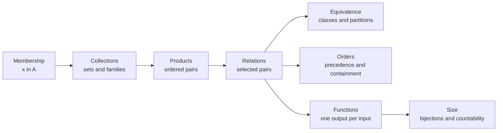
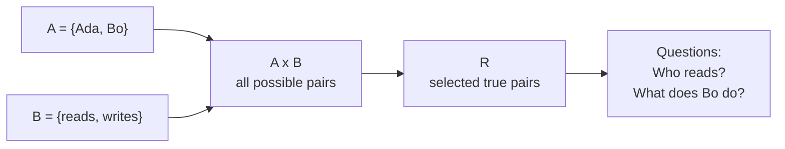
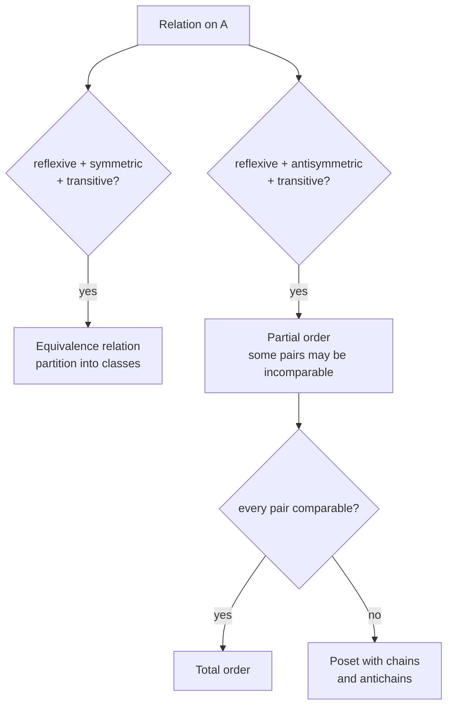
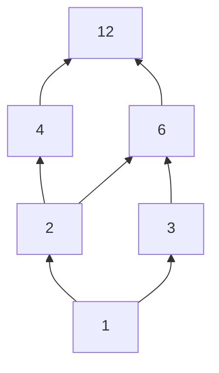
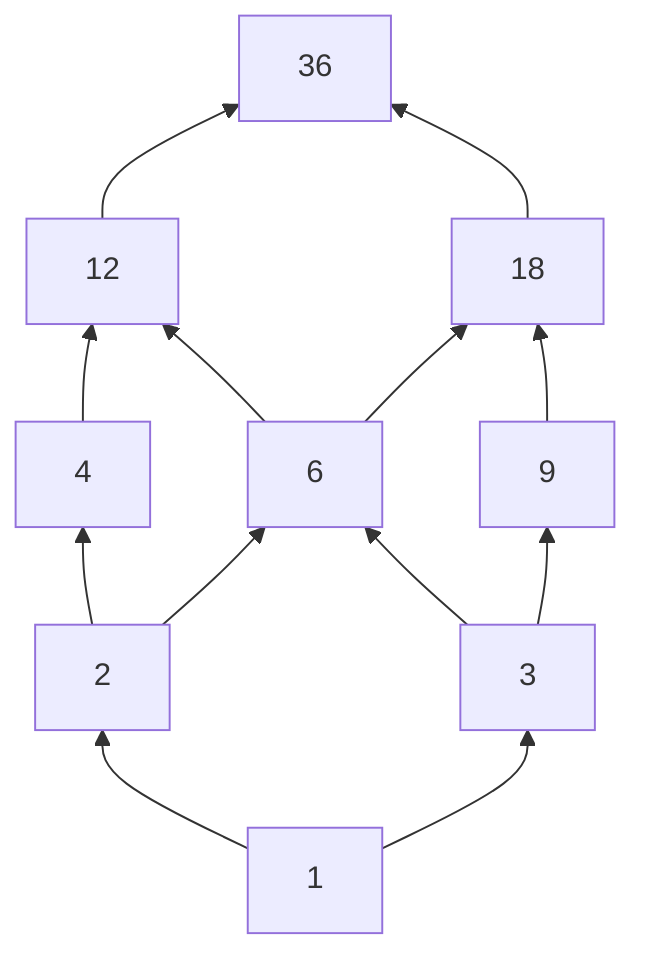

# 0.04 Sets, Relations, and Functions

[Section home](../README.md) | Previous: [§0.03 Exponentials and Logarithms](../00.03-exponents-logarithms/README.md) | [Project guides](../../CONTRIBUTING.md#module-file-structure) | [Notation guide](../../NOTATION.md)

Build sets, relations, orders, and functions from membership, then use bijections and diagonal arguments to distinguish finite, countable, and uncountable collections. You will prove the defining laws and use finite Python checks without confusing computation with an infinite proof.

Start with [§0.01 Mathematical Notation](../00.01-mathematical-notation/README.md). Algebra from §0.02 helps; §§0.05-0.06 are recommended companions for logic and proof methods.

## In this module

- [From membership to mathematical structure](#from-membership-to-mathematical-structure)
- [Membership, structure, and size](#membership-structure-and-size)
- [Sets and set constructions](#sets-and-set-constructions)
- [Relations, equivalence, and orders](#relations-equivalence-and-orders)
- [Functions and mapping laws](#functions-and-mapping-laws)
- [Cardinality, countability, and diagonalization](#cardinality-countability-and-diagonalization)
- [Proofs of set and mapping laws](#proofs-of-set-and-mapping-laws)
- [Implementation](#implementation)
- [Finite structure experiments](#finite-structure-experiments)
- [Worked examples](#worked-examples)
- [Common mistakes](#common-mistakes)
- [Practice](#practice)
- [Where this leads](#where-this-leads)
- [References](#references)

**Topic shortcuts:** [Relation properties](#properties-of-relations-on-one-set) · [Image and preimage laws](#exact-image-and-preimage-laws) · [Cantor's theorem](#cantors-theorem) · [Real uncountability](#why-the-real-numbers-are-uncountable) · [Russell's paradox](#russells-paradox-and-the-boundary-of-set-builder-notation)

## From membership to mathematical structure

A set records which objects belong to a collection. That one decision, membership or nonmembership, is enough to build much of the structure used later in mathematics and computing.

Take two collections and form ordered pairs. A selected set of those pairs is a relation. Some relations group objects into interchangeable classes. Others order objects by precedence or containment. A function is a relation constrained to give each allowed input exactly one output. A bijection pairs two sets without leftovers and gives a definition of equal size that still works for infinite sets.

This chain is the module's organizing idea:



> **Figure 1. Membership creates progressively richer structures.** The arrows show construction and specialization, not a claim that every relation is an order or function. Original diagram.

Database tables are finite relations. Type declarations specify sets of permitted values and mappings between them. A clustering label induces a partition only when each item receives exactly one label. Dependency scheduling uses a partial order when some tasks are incomparable. A computational graph consists of functions connected by shared values. Countability determines whether an outcome space can be listed and often separates sums from integrals in probability and analysis.

MIT's *Mathematics for Computer Science* develops sets, functions, and relations as fundamental concepts for computer science [1]. This module keeps that computational orientation while building the definitions carefully.

## Prerequisite check

Try these before starting:

1. What does $`x\in A`$ claim about $`x`$ and $`A`$?
2. Can you read $`\lbrace x\in\mathbb{Z}:x^2<10\rbrace`$ aloud?
3. In $`f:\mathcal{X}\to\mathcal{Y}`$, which set is the domain?
4. Can you expand $`\sum_{i=0}^{3}2^i`$?
5. Can you distinguish a finite computation from a proof about every natural number?

Review §0.01 if notation, function declarations, or indexed families are the obstacle. Algebra from §0.02 is helpful but not required. Logic and proof methods from §§0.05-0.06 are recommended companions, so proof sketches here explain their own steps.

## Historical context

Set theory emerged from nineteenth-century work on analysis and infinity. Cantor's comparison of infinite collections by one-to-one correspondence led to the result that the real line is not countable and opened the study of different infinite sizes. The modern subject was not produced by one theorem or one person, and later axiomatization changed what counted as a legitimate set [2].

Around 1901, Bertrand Russell found a contradiction in principles that allowed every condition to determine a set. Related arguments and anticipations involved Cantor, Burali-Forti, Zermelo, and others. Russell communicated his version to Frege in 1902. The Stanford Encyclopedia of Philosophy's 2026 revision carefully separates these strands and the many responses, including type restrictions, bounded separation, set-class distinctions, and alternative logics [3].

The lesson for this module is narrow but important. The bounded expression

$$
\lbrace x\in U:P(x)\rbrace
$$

selects elements from an already declared set $`U`$. It is not the unrestricted claim that every property $`P`$ creates a set of all objects satisfying it. Russell's paradox challenges the unrestricted principle, not ordinary bounded notation used with an ambient universe.

## Membership, structure, and size

### A set is determined by membership

Order and repetition do not matter in a set:

$$
\lbrace 1,2,2,3\rbrace=\lbrace 3,2,1\rbrace.
$$

Both sides have exactly the same members. This principle is **extensionality**.

The most important reading distinction is between an object and a collection of objects:

$$
x\in A
\qquad\text{versus}\qquad
B\subseteq A.
$$

The first asks whether one object is a member. The second asks whether every member of one set is also a member of another.


> **Figure 2. Membership and subset are different relations.** A dot can be an element of a set, while a boundary represents a set whose every member may lie inside another set. Original figure.

A useful trap is

$$
x\in A\iff\lbrace x\rbrace\subseteq A.
$$

This equivalence relates membership to the singleton containing $`x`$. It does **not** say $`x\subseteq A`$ unless $`x`$ is itself a set and all of its members lie in $`A`$.

### Products make positions meaningful

A set forgets order, but an ordered pair remembers it:

$$
(a,b)=(c,d)\iff a=c\text{ and }b=d.
$$

Therefore $`A\times B`$ provides slots: first choose from $`A`$, then choose from $`B`$. A binary relation is any selected subset of those possible pairs.



> **Figure 3. A relation selects true rows from a Cartesian product.** This is the mathematical structure behind a finite two-column database relation. Original diagram.

### Special relation properties create structure

A relation may connect an object to itself, connect both directions, or propagate through intermediate objects. Different combinations produce different structures.



> **Figure 4. Relation properties determine familiar structures.** Symmetry and antisymmetry are not negations of each other. Original diagram.

### Functions constrain relation graphs

A function $`f:A\to B`$ is a relation whose graph contains exactly one pair $`(a,b)`$ for each $`a\in A`$. It may send several inputs to the same output. It may miss codomain values. The one rule it cannot break is giving one declared input two different outputs.

### Bijections compare size without counting numerals

Two sets have the same cardinality when a bijection pairs their elements exactly. This agrees with ordinary counting for finite sets, but it also handles infinite sets. The even natural numbers and all natural numbers have the same cardinality through $`n\mapsto2n`$, even though the evens form a proper subset.

## Sets and set constructions

### Local notation

| Symbol | Meaning |
|---|---|
| $`x\in A`$ | $`x`$ is a member of $`A`$ |
| $`A\subseteq B`$ | every member of $`A`$ is a member of $`B`$ |
| $`A\subsetneq B`$ | $`A\subseteq B`$ and $`A\ne B`$ |
| $`\varnothing`$ | empty set |
| $`\mathcal{P}(A)`$ | power set of $`A`$ |
| $`A\mathbin{\triangle}B`$ | symmetric difference |
| $`A\times B`$ | Cartesian product |
| $`aRb`$ | $`(a,b)\in R`$ |
| $`[a]_R`$ | equivalence class of $`a`$ under $`R`$ |
| $`A/R`$ | quotient set of equivalence classes |
| $`f(A_0)`$ | image of $`A_0`$ under $`f`$ |
| $`f^{-1}(B_0)`$ | preimage of $`B_0`$ under $`f`$ |
| $`\lvert A\rvert`$ | cardinality of $`A`$ |

We use ordinary uppercase letters such as $`A,B,U`$ for sets in this module because the same letters appear throughout standard discrete mathematics. Calligraphic letters remain useful for spaces and datasets elsewhere in the curriculum.

### Extensionality, roster notation, and set-builder notation

**Extensionality.** Sets $`A`$ and $`B`$ are equal exactly when they have the same members:

$$
A=B\iff\forall x\,(x\in A\iff x\in B).
$$

In this module, the quantified objects always come from a declared ambient domain even when the notation suppresses it. Extensionality gives the standard method for proving set equality: prove both membership directions.

**Roster notation** lists members:

$$
A=\lbrace 2,3,5,7\rbrace.
$$

**Set-builder notation** selects members satisfying a condition:

$$
A=\lbrace n\in\mathbb{N}:n<10\text{ and }n\text{ is prime}\rbrace.
$$

The ambient domain matters. Compare

$$
\lbrace x\in\mathbb{R}:x^2=2\rbrace=\lbrace -\sqrt2,\sqrt2\rbrace
$$

with

$$
\lbrace x\in\mathbb{Q}:x^2=2\rbrace=\varnothing.
$$

The same predicate produces different sets when the domain changes.

A **singleton** $`\lbrace x\rbrace`$ has one member. The empty set $`\varnothing`$ has no members. There is exactly one empty set by extensionality: any two sets with no members have the same members.

### Membership versus subset

The definition of subset is

$$
A\subseteq B\iff\forall x\,(x\in A\implies x\in B).
$$

A proper subset additionally excludes equality:

$$
A\subsetneq B\iff A\subseteq B\text{ and }A\ne B.
$$

Three facts should become automatic:

1. $`\varnothing\subseteq A`$ for every set $`A`$ because there is no empty-set member that violates the condition.
2. $`A\subseteq A`$ for every set $`A`$.
3. $`\varnothing\in A`$ only when the empty set itself is listed or selected as a member.

For example, let

$$
A=\lbrace 1,\lbrace 1\rbrace,\varnothing\rbrace.
$$

Then

$$
1\in A,
\qquad
\lbrace 1\rbrace\in A,
\qquad
\lbrace 1\rbrace\subseteq A,
\qquad
\varnothing\in A,
\qquad
\varnothing\subseteq A.
$$

The claim $`1\subseteq A`$ is not an ordinary elementary-set claim because $`1`$ is being used as a number, not as a declared set of members.

### Set operations

Let $`A,B\subseteq U`$, where $`U`$ is the ambient universe.

| Operation | Definition by membership | Reading |
|---|---|---|
| union $`A\cup B`$ | $`x\in A`$ or $`x\in B`$ | in at least one |
| intersection $`A\cap B`$ | $`x\in A`$ and $`x\in B`$ | in both |
| difference $`A\setminus B`$ | $`x\in A`$ and $`x\notin B`$ | in $`A`$ only |
| symmetric difference $`A\mathbin{\triangle}B`$ | in exactly one of $`A,B`$ | disagreement |
| complement $`A^c`$ | $`x\in U`$ and $`x\notin A`$ | outside $`A`$, within $`U`$ |

Complement is never absolute here. It is relative to the declared $`U`$.

Symmetric difference has two useful forms:

$$
A\mathbin{\triangle}B
=(A\setminus B)\cup(B\setminus A)
=(A\cup B)\setminus(A\cap B).
$$

Common algebraic laws include

$$
A\cup B=B\cup A,
\qquad
A\cap B=B\cap A,
$$

$$
A\cup(B\cup C)=(A\cup B)\cup C,
$$

$$
A\cap(B\cap C)=(A\cap B)\cap C,
$$

$$
A\cap(B\cup C)=(A\cap B)\cup(A\cap C),
$$

$$
A\cup(B\cap C)=(A\cup B)\cap(A\cup C).
$$

De Morgan's laws exchange union and intersection under complement:

$$
(A\cup B)^c=A^c\cap B^c,
$$

$$
(A\cap B)^c=A^c\cup B^c.
$$

These are elementwise statements. For example,

$$
x\in(A\cup B)^c
\iff x\notin A\cup B
\iff x\notin A\text{ and }x\notin B
\iff x\in A^c\cap B^c.
$$

Mathematics in Lean exposes the same discipline: set equalities are proved by reducing them to membership statements, and Chapter 4 formalizes unions, intersections, differences, images, preimages, and extensionality in this way [4].

### Finite and indexed families

For sets $`A_1,\ldots,A_n`$,

$$
\bigcup_{i=1}^{n}A_i
=\lbrace x:\text{there exists }i\in\lbrace 1,\ldots,n\rbrace\text{ with }x\in A_i\rbrace,
$$

$$
\bigcap_{i=1}^{n}A_i
=\lbrace x:\text{for every }i\in\lbrace 1,\ldots,n\rbrace,\ x\in A_i\rbrace.
$$

More generally, an indexed family $`(A_i)_{i\in I}`$ is a function assigning a set to each index $`i\in I`$. Then

$$
x\in\bigcup_{i\in I}A_i\iff\exists i\in I\text{ such that }x\in A_i,
$$

$$
x\in\bigcap_{i\in I}A_i\iff\forall i\in I,\ x\in A_i.
$$

For nonempty $`I`$, indexed De Morgan laws are

$$
\left(\bigcup_{i\in I}A_i\right)^c
=\bigcap_{i\in I}A_i^c,
$$

$$
\left(\bigcap_{i\in I}A_i\right)^c
=\bigcup_{i\in I}A_i^c.
$$

Empty indexed families require conventions tied to the universe:

$$
\bigcup_{i\in\varnothing}A_i=\varnothing,
\qquad
\bigcap_{i\in\varnothing}A_i=U.
$$

The first contains elements appearing somewhere in an empty family, so none. The second contains elements appearing in every set of an empty family, so every ambient element satisfies the vacuous condition.

### Power sets

The **power set** contains every subset:

$$
\mathcal{P}(A)\coloneqq\lbrace B:B\subseteq A\rbrace.
$$

If $`A=\lbrace a,b\rbrace`$, then

$$
\mathcal{P}(A)=\lbrace \varnothing,\lbrace a\rbrace,\lbrace b\rbrace,\lbrace a,b\rbrace\rbrace.
$$

Notice the levels:

$$
a\in A,
\qquad
\lbrace a\rbrace\in\mathcal{P}(A),
\qquad
\lbrace a\rbrace\subseteq A.
$$

If $`A`$ has $`n`$ members, then

$$
|\mathcal{P}(A)|=2^n.
$$

Each subset corresponds to a length-$`n`$ binary decision string: include or exclude each member. This finite counting result is the first appearance of a connection that becomes deeper in Cantor's theorem.

### Cartesian products, ordered tuples, and sequences

The Cartesian product is

$$
A\times B\coloneqq\lbrace (a,b):a\in A,\ b\in B\rbrace.
$$

If $`A`$ and $`B`$ are finite, then

$$
|A\times B|=|A||B|.
$$

Order matters both within pairs and between factors. Usually

$$
(a,b)\ne(b,a)
\quad\text{and}\quad
A\times B\ne B\times A.
$$

An $`n`$-tuple $`(a_1,\ldots,a_n)`$ has $`n`$ ordered coordinates. The product

$$
A_1\times\cdots\times A_n
$$

contains tuples whose $`i`$th coordinate lies in $`A_i`$.

A sequence in $`A`$ is a function from an index set into $`A`$. An infinite sequence is commonly written

$$
a:\mathbb{N}\to A,
\qquad
n\mapsto a_n.
$$

A finite sequence of length $`n`$ can be treated as a function from $`\lbrace 0,\ldots,n-1\rbrace`$ or $`\lbrace 1,\ldots,n\rbrace`$, with the convention stated. This function view makes repetition and order explicit, unlike ordinary sets.

### Ordinary and tagged unions

The ordinary union $`A\cup B`$ may merge equal-looking members. If

$$
A=\lbrace 1,2\rbrace,
\qquad
B=\lbrace 2,3\rbrace,
$$

then $`A\cup B=\lbrace 1,2,3\rbrace`$ and the two occurrences of $`2`$ do not survive as separate objects.

A **tagged disjoint union** preserves source identity:

$$
A\sqcup B
\coloneqq
(A\times\lbrace 0\rbrace)\cup(B\times\lbrace 1\rbrace).
$$

Even if $`a\in A\cap B`$, the tagged values $`(a,0)`$ and $`(a,1)`$ are distinct. The tags are structural, not decorative.

This construction appears in type systems as a sum type: a value carries both payload and variant tag. It also prevents two datasets with overlapping identifiers from silently merging records when provenance matters.

## Relations, equivalence, and orders

### Binary relations

A binary relation from $`A`$ to $`B`$ is any subset

$$
R\subseteq A\times B.
$$

Write $`aRb`$ as shorthand for $`(a,b)\in R`$. A relation **on** $`A`$ is a subset of $`A\times A`$.

Its domain and range are

$$
\mathrm{dom}(R)
=\lbrace a\in A:\exists b\in B,\ (a,b)\in R\rbrace,
$$

$$
\mathrm{ran}(R)
=\lbrace b\in B:\exists a\in A,\ (a,b)\in R\rbrace.
$$

The inverse relation reverses every pair:

$$
R^{-1}=\lbrace (b,a):(a,b)\in R\rbrace.
$$

If $`R\subseteq A\times B`$ and $`S\subseteq B\times C`$, define composition by

$$
S\circ R
=\lbrace (a,c):\exists b\in B,\ (a,b)\in R\text{ and }(b,c)\in S\rbrace.
$$

The rightmost relation acts first, matching function composition.

The Open Logic Project publishes a directly inspectable set-functions-relations text with sections on relations as sets, special properties, equivalence relations, orders, inverse relations, and composition [5].

### Properties of relations on one set

Let $`R\subseteq A\times A`$.

| Property | Definition |
|---|---|
| reflexive | for every $`a\in A`$, $`aRa`$ |
| irreflexive | for every $`a\in A`$, not $`aRa`$ |
| symmetric | $`aRb`$ implies $`bRa`$ |
| antisymmetric | $`aRb`$ and $`bRa`$ imply $`a=b`$ |
| asymmetric | $`aRb`$ implies not $`bRa`$ |
| transitive | $`aRb`$ and $`bRc`$ imply $`aRc`$ |

These properties are independent enough that examples matter.

| Relation | Set | Reflexive | Irreflexive | Symmetric | Antisymmetric | Asymmetric | Transitive |
|---|---|---:|---:|---:|---:|---:|---:|
| equality $`=`$ | any set | yes | no | yes | yes | no | yes |
| inequality $`\ne`$ | a set with at least two members | no | yes | yes | no | no | usually no |
| strict less than $`<`$ | $`\mathbb{R}`$ | no | yes | no | yes | yes | yes |
| less than or equal $`\le`$ | $`\mathbb{R}`$ | yes | no | no | yes | no | yes |
| "shares a divisor $`>1`$" | positive integers | no for $`1`$ | no | yes | no | no | no |
| "is a sibling of" | people under an ordinary model | usually no | usually yes | yes | no | no | not generally |

**Antisymmetric does not mean "not symmetric."** Equality is both symmetric and antisymmetric. Antisymmetry allows both directions when the elements are equal. Asymmetry forbids both directions entirely and therefore implies irreflexivity.

Also, an irreflexive relation can be antisymmetric vacuously. The strict order $`<`$ is both asymmetric and antisymmetric, although antisymmetry is usually emphasized for non-strict orders.

### Equivalence relations and classes

An **equivalence relation** is reflexive, symmetric, and transitive.

For $`a\in A`$, its equivalence class is

$$
[a]_R\coloneqq\lbrace x\in A:xRa\rbrace.
$$

The quotient set is the set of all distinct classes:

$$
A/R\coloneqq\lbrace [a]_R:a\in A\rbrace.
$$

For an integer $`m\ge2`$, congruence modulo $`m`$ is

$$
a\equiv b\pmod m
\iff
m\text{ divides }a-b.
$$

It partitions $`\mathbb{Z}`$ into $`m`$ residue classes. For $`m=3`$,

$$
[0]=\lbrace \ldots,-3,0,3,6,\ldots\rbrace,
$$

$$
[1]=\lbrace \ldots,-2,1,4,7,\ldots\rbrace,
$$

$$
[2]=\lbrace \ldots,-1,2,5,8,\ldots\rbrace.
$$


> **Figure 5. Equivalence classes form a partition.** Every element belongs to one class, classes do not overlap, and their union is the whole set. Original figure.

A **partition** $`\Pi`$ of $`A`$ is a collection of nonempty subsets called blocks such that:

1. every $`a\in A`$ belongs to some block;
2. distinct blocks are disjoint.

Equivalently,

$$
\bigcup_{C\in\Pi}C=A
$$

and any two blocks are equal or disjoint.

#### From an equivalence relation to a partition

The set of equivalence classes $`A/R`$ partitions $`A`$.

- Reflexivity gives $`a\in[a]_R`$, so every element belongs to a class.
- Suppose $`[a]_R`$ and $`[b]_R`$ overlap at $`x`$. Then $`xRa`$ and $`xRb`$. Symmetry gives $`aRx`$, and transitivity gives $`aRb`$.
- If $`y\in[a]_R`$, then $`yRa`$, and with $`aRb`$, transitivity gives $`yRb`$. Thus $`[a]_R\subseteq[b]_R`$.
- The symmetric argument gives the reverse inclusion, so the classes are equal.

Therefore classes either coincide or are disjoint.

#### From a partition to an equivalence relation

Given a partition $`\Pi`$, define

$$
a\sim_\Pi b
\iff
\text{$a$ and $b$ belong to the same block of $\Pi$}.
$$

This is reflexive because each element belongs to a block, symmetric because "same block" has no direction, and transitive because if $`a,b`$ share one block and $`b,c`$ share another, the two blocks overlap at $`b`$ and therefore must be the same block.

These constructions reverse one another. Equivalence relations and partitions are two views of the same structure: pairwise sameness and grouped blocks.

A clustering assignment $`c:A\to\lbrace 1,\ldots,k\rbrace`$ induces $`a\sim b`$ when $`c(a)=c(b)`$. This is an equivalence relation only for a hard assignment with one label per item. Overlapping or soft clusters require a different model.

### Partial and total orders

A **partial order** $`\preceq`$ on $`A`$ is reflexive, antisymmetric, and transitive. The pair $`(A,\preceq)`$ is a partially ordered set, or **poset**.

A **total order** is a partial order in which every pair is comparable:

$$
\forall a,b\in A,
\quad
a\preceq b\text{ or }b\preceq a.
$$

In a partial order, some elements may be incomparable.

The strict relation associated with $`\preceq`$ is

$$
a\prec b\iff a\preceq b\text{ and }a\ne b.
$$

Conversely, an irreflexive transitive strict order can generate a non-strict order by adding equality. State which version you use.

Common examples are:

| Poset | Order | Total? |
|---|---|---:|
| integers | $`\le`$ | yes |
| subsets of $`U`$ | $`\subseteq`$ | no when incomparable subsets exist |
| positive divisors of $`n`$ | divisibility $`\mid`$ | usually no |
| tasks in a dependency graph | "must precede or equal" | usually no |

### Hasse diagrams

A finite Hasse diagram draws the cover relations of a poset. Place larger elements higher. Omit self-loops, arrowheads, and edges implied by transitivity.

For divisors of $`12`$ ordered by divisibility:



> **Figure 6. Hasse diagram for positive divisors of $`12`$.** An upward path means divisibility; transitive edges such as $`1\mid12`$ are omitted. Original diagram.

A **chain** is a subset whose elements are pairwise comparable. For example, $`\lbrace 1,2,4,12\rbrace`$ is a chain.

An **antichain** is a subset whose distinct elements are pairwise incomparable. For example, $`\lbrace 3,4\rbrace`$ is an antichain.

### Least, minimal, greatest, and maximal

Let $`S`$ be a subset of a poset.

- A **least** element $`\ell`$ satisfies $`\ell\preceq x`$ for every $`x\in S`$.
- A **minimal** element $`m`$ has no distinct $`x\in S`$ with $`x\preceq m`$.
- A **greatest** element $`g`$ satisfies $`x\preceq g`$ for every $`x\in S`$.
- A **maximal** element $`m`$ has no distinct $`x\in S`$ with $`m\preceq x`$.

A least element, if it exists, is unique and minimal. A poset can have several minimal elements and no least element.

Consider

$$
S=\lbrace \lbrace 1\rbrace,\lbrace 2\rbrace,\lbrace 1,2\rbrace\rbrace
$$

ordered by $`\subseteq`$. Both $`\lbrace 1\rbrace`$ and $`\lbrace 2\rbrace`$ are minimal. Neither is least because they are incomparable. The set $`\lbrace 1,2\rbrace`$ is greatest and therefore the unique maximal element.

If we remove $`\lbrace 1,2\rbrace`$, both remaining elements are maximal as well as minimal, but there is neither a greatest nor a least element.

## Functions and mapping laws

### Functions as special relations

A function declaration

$$
f:A\to B
$$

includes a domain $`A`$, codomain $`B`$, and assignment rule. Its graph is

$$
\mathrm{graph}(f)
=\lbrace (a,f(a)):a\in A\rbrace
\subseteq A\times B.
$$

A relation $`R\subseteq A\times B`$ is the graph of a total function exactly when every $`a\in A`$ occurs as a first coordinate paired with one and only one $`b\in B`$.

A **partial function** may be undefined on some elements of its declared source set. It can be represented as a function from a smaller domain $`D\subseteq A`$, or as a relation with at most one output per $`a\in A`$.

This module uses "function" to mean total function unless "partial" is explicit.

The range or full image is

$$
f(A)=\lbrace f(a):a\in A\rbrace\subseteq B.
$$

The codomain is declared. The image is attained. They need not be equal.

### Images, preimages, and restrictions

For $`S\subseteq A`$, the image is

$$
f(S)\coloneqq\lbrace f(x):x\in S\rbrace.
$$

For $`T\subseteq B`$, the preimage is

$$
f^{-1}(T)\coloneqq\lbrace x\in A:f(x)\in T\rbrace.
$$

The restriction to $`S`$ is

$$
f|_S:S\to B,
\qquad
f|_S(x)=f(x).
$$

The preimage notation $`f^{-1}(T)`$ does not require an inverse function. Its argument is a set in the codomain. An inverse function $`f^{-1}:B\to A`$ requires $`f`$ to be bijective, or requires a suitable restriction.

### Injective, surjective, and bijective

A function $`f:A\to B`$ is:

- **injective** if $`f(a_1)=f(a_2)`$ implies $`a_1=a_2`$;
- **surjective** if every $`b\in B`$ equals $`f(a)`$ for some $`a\in A`$;
- **bijective** if it is both injective and surjective.

| Property | Graph behavior |
|---|---|
| function | exactly one outgoing value from each domain element |
| injective | at most one domain element reaches each codomain element |
| surjective | every codomain element is reached |
| bijective | exactly one domain element reaches each codomain element |

If $`f`$ is bijective, its inverse function is defined by

$$
f^{-1}(b)=\text{the unique }a\in A\text{ such that }f(a)=b.
$$

Then

$$
f^{-1}\circ f=\mathrm{id}_A,
\qquad
f\circ f^{-1}=\mathrm{id}_B.
$$

### Exact image and preimage laws

Let $`f:A\to B`$, let $`S_1,S_2\subseteq A`$, and let $`T_1,T_2\subseteq B`$.

Preimages preserve the principal Boolean set operations exactly:

$$
f^{-1}(T_1\cup T_2)
=f^{-1}(T_1)\cup f^{-1}(T_2),
$$

$$
f^{-1}(T_1\cap T_2)
=f^{-1}(T_1)\cap f^{-1}(T_2),
$$

$$
f^{-1}(B\setminus T_1)
=A\setminus f^{-1}(T_1).
$$

They also preserve indexed unions and intersections:

$$
f^{-1}\left(\bigcup_{i\in I}T_i\right)
=\bigcup_{i\in I}f^{-1}(T_i),
$$

$$
f^{-1}\left(\bigcap_{i\in I}T_i\right)
=\bigcap_{i\in I}f^{-1}(T_i).
$$

Images preserve unions exactly:

$$
f(S_1\cup S_2)=f(S_1)\cup f(S_2),
$$

and similarly for indexed unions.

For intersections, only one inclusion is automatic:

$$
f(S_1\cap S_2)
\subseteq
f(S_1)\cap f(S_2).
$$

Equality holds if $`f`$ is injective. Without injectivity, the inclusion can be strict.

Let $`f:\lbrace -1,0,1\rbrace\to\lbrace 0,1\rbrace`$ be $`f(x)=x^2`$, with

$$
S_1=\lbrace -1,0\rbrace,
\qquad
S_2=\lbrace 0,1\rbrace.
$$

Then

$$
f(S_1\cap S_2)=f(\lbrace 0\rbrace)=\lbrace 0\rbrace,
$$

but

$$
f(S_1)\cap f(S_2)=\lbrace 0,1\rbrace\cap\lbrace 0,1\rbrace=\lbrace 0,1\rbrace.
$$

The output $`1`$ is produced by different inputs from the two sets. Injectivity would force those inputs to be equal and therefore in the intersection.

Chapter 4 of *Mathematics in Lean* states these exact laws and formalizes the injective reverse inclusion for image intersections [4].

## Cardinality, countability, and diagonalization

### Cardinality by bijection

Finite cardinality $`|A|=n`$ means there is a bijection from $`\lbrace 0,\ldots,n-1\rbrace`$ to $`A`$. More generally,

$$
|A|=|B|
$$

means there exists a bijection $`A\to B`$.

A set is **finite** if it has cardinality $`n`$ for some $`n\in\mathbb{N}`$. It is **infinite** if it is not finite.

Terminology varies across books. In this module:

- **countable** means finite or countably infinite, also called *at most countable*;
- **countably infinite** means bijective with $`\mathbb{N}`$;
- **uncountable** means not countable.

Always check another source's convention. Some authors use "countable" to mean only countably infinite.

Oscar Levin's open discrete mathematics text provides an undergraduate treatment of sets and functions with inquiry-based exercises and is licensed CC BY-SA 4.0 [6]. Stanford CS103 likewise places sets, functions, discrete structures, and proof writing at the beginning of mathematical foundations for computing [7].

### Enumerating $`\mathbb{N}\times\mathbb{N}`$

This curriculum uses $`0\in\mathbb{N}`$. List pairs by diagonals of constant sum:

$$
(0,0),
$$

$$
(1,0),(0,1),
$$

$$
(2,0),(1,1),(0,2),
$$

$$
(3,0),(2,1),(1,2),(0,3),\ldots
$$

Every pair $`(a,b)`$ appears on diagonal $`a+b`$, and each diagonal is finite. One explicit bijection is the Cantor pairing function

$$
\pi(a,b)
=\frac{(a+b)(a+b+1)}{2}+b.
$$

Thus $`\mathbb{N}\times\mathbb{N}`$ is countably infinite. An infinite grid is listable when we traverse finite diagonals, but not if we try to finish an infinite row before moving to the next.

### Enumerating the integers

A simple list is

$$
0,-1,1,-2,2,-3,3,\ldots
$$

One bijection $`z:\mathbb{N}\to\mathbb{Z}`$ is

$$
z(n)=
\begin{cases}
 n/2,&n\text{ even},\\\\
 -(n+1)/2,&n\text{ odd}.
\end{cases}
$$

Therefore $`\mathbb{Z}`$ is countably infinite.

### Enumerating the rationals without duplicates

Writing all fractions $`p/q`$ with $`p\in\mathbb{Z}`$ and positive $`q`$ covers $`\mathbb{Q}`$, but it repeats values:

$$
\frac12=\frac24=\frac36=\cdots.
$$

To obtain one representative per rational, require

$$
q>0,
\qquad
\gcd(|p|,q)=1.
$$

Enumerate integer pairs $`(p,q)`$ by increasing height $`|p|+q`$. On each finite height, emit only reduced pairs. Every rational has exactly one reduced representation with positive denominator, so it appears once.

For example, the first heights produce values such as

$$
0,\ 1,\ -1,\ \frac12,\ -\frac12,\ 2,\ -2,\ \frac13,\ -\frac13,\ldots
$$

The exact within-height order does not matter if it is deterministic. What matters is coverage and duplicate control. Therefore $`\mathbb{Q}`$ is countably infinite.

Python's `Fraction(p, q)` normalizes to lowest terms with a positive denominator, while built-in sets remove equal duplicates. The official standard-library documentation specifies both behaviors [8].

### Cantor's theorem

**Theorem.** For every set $`A`$,

$$
|A|<|\mathcal{P}(A)|.
$$

There is an injection $`A\to\mathcal{P}(A)`$ given by $`a\mapsto\lbrace a\rbrace`$. The hard part is proving that no function $`f:A\to\mathcal{P}(A)`$ is surjective.

Given any such $`f`$, define the diagonal set

$$
D\coloneqq\lbrace a\in A:a\notin f(a)\rbrace.
$$

Since $`D\subseteq A`$, we have $`D\in\mathcal{P}(A)`$. If $`f`$ were surjective, some $`d\in A`$ would satisfy $`f(d)=D`$. Then

$$
d\in D
\iff
d\notin f(d)
\iff
d\notin D,
$$

which is impossible. Therefore $`D`$ is missing from the range of every proposed $`f`$, so no surjection exists.


> **Figure 7. Cantor's diagonal construction for binary sequences.** The constructed row differs from row $`n`$ at coordinate $`n`$, so it cannot occur anywhere in the proposed list. Original figure.

### Binary sequences and subsets of natural numbers

Every subset $`S\subseteq\mathbb{N}`$ has an indicator sequence

$$
\chi_S(n)=
\begin{cases}
1,&n\in S,\\\\
0,&n\notin S.
\end{cases}
$$

Conversely, each binary sequence determines the subset where its entries equal $`1`$. Therefore

$$
\lbrace 0,1\rbrace^{\mathbb{N}}
\longleftrightarrow
\mathcal{P}(\mathbb{N})
$$

is a bijection. Cantor's theorem shows this set of sequences is uncountable.

A direct diagonal proof reaches the same result. Suppose binary sequences were listed as $`s_0,s_1,s_2,\ldots`$. Define

$$
t(n)=1-s_n(n).
$$

Then $`t`$ differs from $`s_n`$ at coordinate $`n`$, so it is absent from the list.

A finite table can illustrate the construction, but a finite prefix does not prove uncountability. The proof uses the rule for every natural-numbered row.

### Why the real numbers are uncountable

It is tempting to identify binary sequences with real numbers in $`[0,1]`$ by binary expansion. That map needs care because some real numbers have two binary expansions, such as

$$
0.1000\ldots_2=0.0111\ldots_2.
$$

Ignoring this ambiguity invalidates a claimed bijection.

A robust route uses ternary digits $`0`$ and $`2`$. For a binary sequence $`s\in\lbrace 0,1\rbrace^{\mathbb{N}}`$, define

$$
\Phi(s)
=\sum_{n=0}^{\infty}\frac{2s(n)}{3^{n+1}}.
$$

This value lies in $`[0,1]`$. If $`s`$ and $`t`$ first differ at index $`k`$, the leading difference has magnitude $`2/3^{k+1}`$. Even if all later terms oppose it, their total magnitude is at most

$$
\sum_{n=k+1}^{\infty}\frac{2}{3^{n+1}}
=\frac{1}{3^{k+1}}.
$$

The leading difference is larger, so $`\Phi(s)\ne\Phi(t)`$. Thus $`\Phi`$ is injective.

Since the binary sequence set is uncountable and injects into $`[0,1]`$, the interval $`[0,1]`$, and therefore $`\mathbb{R}`$, is uncountable.

This argument does not claim that every real number has a ternary expansion using only $`0`$ and $`2`$. The image is the Cantor set, a particular uncountable subset of $`[0,1]`$. It also avoids claiming that ordinary binary expansions are unique.

### Russell's paradox and the boundary of set-builder notation

Unrestricted comprehension would assert that every condition $`P(x)`$ determines a set

$$
\lbrace x:P(x)\rbrace.
$$

Choose $`P(x)`$ to mean $`x\notin x`$, and suppose

$$
R=\lbrace x:x\notin x\rbrace
$$

is a set. Asking whether $`R\in R`$ gives

$$
R\in R\iff R\notin R.
$$

The contradiction shows that unrestricted comprehension cannot be accepted as stated.

A bounded separation principle instead starts from an existing set $`U`$:

$$
\lbrace x\in U:P(x)\rbrace.
$$

For the Russell condition, this produces

$$
R_U=\lbrace x\in U:x\notin x\rbrace.
$$

The diagonal reasoning shows $`R_U\notin U`$ rather than producing a universal set contradiction. The construction selects from $`U`$ but is not forced to be a member of $`U`$.

Historically and mathematically, there are several responses. Zermelo-style separation is one. Russell's type theories are another. Set-class theories and other axiomatic systems take different routes. ZF is important, but it is not the only response and this module does not choose among foundations [2,3].

## Proofs of set and mapping laws

### Proving a set identity by extensionality

We prove

$$
A\setminus(B\cup C)
=(A\setminus B)\cap(A\setminus C).
$$

Take an arbitrary $`x`$ in the ambient universe. Then

$$
\begin{aligned}
x\in A\setminus(B\cup C)
&\iff x\in A\text{ and }x\notin B\cup C\\\\
&\iff x\in A\text{ and }x\notin B\text{ and }x\notin C\\\\
&\iff (x\in A\text{ and }x\notin B)
      \text{ and }(x\in A\text{ and }x\notin C)\\\\
&\iff x\in(A\setminus B)\cap(A\setminus C).
\end{aligned}
$$

Since membership agrees for every $`x`$, extensionality gives equality. The repeated $`x\in A`$ is harmless because a condition conjoined with itself has the same truth value.

### Deriving the equivalence-partition correspondence

The two directions above rely on one central lemma:

$$
[a]_R\cap[b]_R\ne\varnothing
\implies
[a]_R=[b]_R.
$$

For an equivalence relation, any shared member links the representatives by symmetry and transitivity. For a partition, any shared member forces two blocks to be the same because distinct blocks are disjoint. The constructions therefore retain exactly the same grouping information.

This is why a quotient set has classes as members rather than original elements. It replaces every group of equivalent elements by one block.

### Deriving the image-intersection condition

Suppose

$$
y\in f(S_1\cap S_2).
$$

Then some $`x\in S_1\cap S_2`$ satisfies $`f(x)=y`$. The same $`x`$ lies in each set, so $`y\in f(S_1)`$ and $`y\in f(S_2)`$. Therefore

$$
f(S_1\cap S_2)\subseteq f(S_1)\cap f(S_2).
$$

For the reverse direction, take $`y\in f(S_1)\cap f(S_2)`$. There exist $`x_1\in S_1`$ and $`x_2\in S_2`$ with

$$
f(x_1)=y=f(x_2).
$$

Without injectivity, $`x_1`$ and $`x_2`$ may differ, so neither must lie in the intersection. If $`f`$ is injective, equality of outputs forces $`x_1=x_2`$, producing one input in both sets and proving equality.

### Deriving the preimage laws

Preimages are exact because one input $`x`$ is tested against a codomain condition. For intersection,

$$
\begin{aligned}
x\in f^{-1}(T_1\cap T_2)
&\iff f(x)\in T_1\cap T_2\\\\
&\iff f(x)\in T_1\text{ and }f(x)\in T_2\\\\
&\iff x\in f^{-1}(T_1)\cap f^{-1}(T_2).
\end{aligned}
$$

No injectivity or surjectivity is needed.

### Deriving Cantor's finite and infinite power-set results

For finite $`A=\lbrace a_1,\ldots,a_n\rbrace`$, a subset is determined by $`n`$ independent yes-or-no membership choices, giving $`2^n`$ subsets.

For arbitrary $`A`$, the diagonal set proves more than "power sets are large." It supplies, for every proposed list $`f`$, a specific subset $`D`$ absent from that list. The singleton map proves $`A`$ injects into its power set, while the diagonal proves no surjection goes back. Together these justify the strict cardinal comparison.

## Implementation

Use Python 3 with the standard library. No package installation or data files are needed. From any working directory, start `python3` and execute the Python blocks in lesson order in one session, or copy them in that order into a scratch `.py` file and run `python3 /path/to/your/script.py`. Run the implementation setup before experiments or solution excerpts that reuse its helpers.

Python's built-in `set` is an unordered collection of distinct hashable objects. It implements membership, subset, proper-subset, union, intersection, difference, and symmetric difference. `frozenset` is the immutable hashable form needed when a set itself must be a set member [8].

### Set operations, products, and tagged unions

```python
from itertools import product

universe = set(range(1, 7))
set_a = {1, 2, 3, 4}
set_b = {3, 4, 5}

assert set_a | set_b == {1, 2, 3, 4, 5}
assert set_a & set_b == {3, 4}
assert set_a - set_b == {1, 2}
assert set_a ^ set_b == {1, 2, 5}
assert universe - (set_a | set_b) == {6}
assert universe - (set_a | set_b) == (
    (universe - set_a) & (universe - set_b)
)

product_ab = set(product({"a", "b"}, {0, 1}))
assert product_ab == {("a", 0), ("a", 1), ("b", 0), ("b", 1)}

left = {1, 2}
right = {2, 3}
tagged_union = {(value, "L") for value in left} | {
    (value, "R") for value in right
}
assert len(left | right) == 3
assert len(tagged_union) == 4
assert (2, "L") != (2, "R")
```

The ordinary union merges the shared value $`2`$. The tagged union preserves two source-specific values.

### A finite relation-property checker

```python
from itertools import product


def relation_properties(base_set, relation):
    pairs = set(product(base_set, repeat=2))
    if not relation <= pairs:
        raise ValueError("relation must be a subset of base_set x base_set")

    reflexive = all((value, value) in relation for value in base_set)
    irreflexive = all((value, value) not in relation for value in base_set)
    symmetric = all((right, left) in relation for left, right in relation)
    antisymmetric = all(
        left == right or (right, left) not in relation
        for left, right in relation
    )
    asymmetric = all((right, left) not in relation for left, right in relation)
    transitive = all(
        (left, end) in relation
        for left, middle in relation
        for next_middle, end in relation
        if middle == next_middle
    )
    return {
        "reflexive": reflexive,
        "irreflexive": irreflexive,
        "symmetric": symmetric,
        "antisymmetric": antisymmetric,
        "asymmetric": asymmetric,
        "transitive": transitive,
    }


base_set = {1, 2, 3, 6}
divides = {
    (left, right)
    for left, right in product(base_set, repeat=2)
    if right % left == 0
}
properties = relation_properties(base_set, divides)
assert properties["reflexive"]
assert properties["antisymmetric"]
assert properties["transitive"]
assert not properties["symmetric"]
assert not properties["asymmetric"]
```

This exhaustive checker proves each property for the supplied finite relation because it inspects every relevant pair or triple. Testing longer finite prefixes does not prove a property for an infinite relation.

### A finite function-property checker

```python

def function_properties(domain, codomain, graph):
    if not graph <= {(x, y) for x in domain for y in codomain}:
        raise ValueError("graph must lie in domain x codomain")

    outputs = {
        x: {y for graph_x, y in graph if graph_x == x}
        for x in domain
    }
    is_function = all(len(values) == 1 for values in outputs.values())
    if not is_function:
        return {"function": False, "injective": False, "surjective": False}

    attained = {next(iter(values)) for values in outputs.values()}
    return {
        "function": True,
        "injective": len(attained) == len(domain),
        "surjective": attained == codomain,
    }


domain = {-2, -1, 0, 1, 2}
codomain = {0, 1, 4}
square_graph = {(value, value * value) for value in domain}
result = function_properties(domain, codomain, square_graph)
assert result == {"function": True, "injective": False, "surjective": True}
```

Surjectivity depends on the declared codomain. The same graph declared into a larger codomain would not be surjective.

### Rational enumeration by expanding diagonals

```python
from fractions import Fraction
from math import gcd


def rationals_by_height(maximum_height):
    values = []
    for height in range(1, maximum_height + 1):
        for denominator in range(1, height + 1):
            absolute_numerator = height - denominator
            numerators = (
                [0] if absolute_numerator == 0
                else [absolute_numerator, -absolute_numerator]
            )
            for numerator in numerators:
                if gcd(abs(numerator), denominator) == 1:
                    values.append(Fraction(numerator, denominator))
    return values


rationals = rationals_by_height(8)
assert len(rationals) == len(set(rationals))
assert Fraction(0, 1) in rationals
assert Fraction(1, 2) in rationals
assert Fraction(-2, 3) in rationals
assert all(value.denominator > 0 for value in rationals)
```

Filtering by greatest common divisor prevents aliases such as $`1/2`$ and $`2/4`$ from both being emitted. `Fraction` provides an independent normalization check.

### A finite diagonal-prefix experiment

```python

def missing_diagonal_prefix(rows):
    size = len(rows)
    if any(len(row) < size for row in rows):
        raise ValueError("each row must cover the inspected diagonal")
    return tuple(1 - rows[index][index] for index in range(size))


rows = [
    (0, 0, 1, 1),
    (1, 0, 1, 0),
    (1, 1, 0, 0),
    (0, 1, 0, 1),
]
diagonal = missing_diagonal_prefix(rows)
assert diagonal == (1, 1, 1, 0)
assert all(diagonal[index] != rows[index][index] for index in range(4))
```

The result differs from each listed row somewhere in the inspected prefix. This finite assertion illustrates the infinite proof pattern. It does not establish uncountability, because a finite binary table has only finitely many rows and columns.

## Finite structure experiments

### Experiment 1: Reduced rationals on expanding diagonals

**Question.** Does reduced-pair filtering remove duplicates while preserving every rational whose canonical height is within the search boundary?

**Hypotheses.** Naively emitting every $`p/q`$ with $`|p|+q\le H`$ will contain duplicates. Requiring $`q>0`$ and $`\gcd(|p|,q)=1`$ will remove duplicates. Increasing $`H`$ will retain all earlier canonical values and add only values of greater canonical height.

**Controls.** Use the same height traversal and sign order for filtered and unfiltered runs. Normalize both through `Fraction` only for checking, not for deciding which pairs to emit. Test heights $`H\in\lbrace 4,8,16,32\rbrace`$.

Record:

| Height | raw pair count | distinct rational count | reduced output count | duplicates removed |
|---:|---:|---:|---:|---:|
| 4 | 16 | 11 | 11 | 5 |
| 8 | 64 | 43 | 43 | 21 |
| 16 | 256 | 159 | 159 | 97 |
| 32 | 1,024 | 647 | 647 | 377 |

Verify these invariants:

1. reduced output has no duplicate `Fraction` values;
2. every reduced output has positive denominator;
3. every raw value appears in reduced form by the height of its canonical pair;
4. the reduced output at height $`H`$ is a prefix-subset of the output at height $`H+1`$.

**Interpretation.** Duplicate filtering repairs a flawed enumeration, but a finite run does not prove that every rational eventually appears. The proof uses the existence and uniqueness of a reduced representation and the fact that each pair has finite height.

**Observed result.** At every tested height, the reduced output count equaled the number of distinct normalized rational values. The filtered outputs were duplicate-free, had positive denominators, and were nested as height increased.

**Limitations.** Timing and counts describe this implementation, not the optimal enumeration algorithm. The experiment does not address density of $`\mathbb{Q}`$ in $`\mathbb{R}`$.

### Experiment 2: Relation property laboratory

**Question.** Which property failures are independent, and what minimal pair or triple witnesses each failure?

Build finite relations on $`A=\lbrace 0,1,2,3\rbrace`$. Include equality, $`<`$, $`\le`$, congruence modulo $`2`$, divisibility restricted to positive elements, and at least two generated relations.

**Hypotheses.** Equality will be both symmetric and antisymmetric. Strict less-than will be asymmetric and transitive. Congruence modulo $`2`$ will be an equivalence relation but not antisymmetric. Removing one transitive edge from $`\le`$ can preserve reflexivity and antisymmetry while breaking transitivity.

**Controls.** Keep the base set fixed. Check every pair and triple. When a property fails, return one witness:

- reflexive failure: an $`a`$ with $`(a,a)\notin R`$;
- symmetric failure: $`(a,b)\in R`$ but $`(b,a)\notin R`$;
- antisymmetric failure: distinct $`a,b`$ related both ways;
- transitive failure: $`aRb`$ and $`bRc`$ but not $`aRc`$.

Compare checker results with predictions made before execution. Report any mismatch as either a mistaken prediction or an implementation defect, then distinguish the two with a hand check.

**Limitations.** Exhaustive finite checking proves the property only for the exact finite relation supplied. It can falsify a universal conjecture by finding a counterexample, but passing many finite cases does not prove an infinite theorem.

### Experiment 3: Search for strict image-intersection inclusion

Enumerate every function $`f:A\to B`$ for $`A=\lbrace 0,1,2\rbrace`$ and $`B=\lbrace 0,1\rbrace`$, together with every pair of subsets $`S_1,S_2\subseteq A`$. Search for

$$
f(S_1\cap S_2)\subsetneq f(S_1)\cap f(S_2).
$$

**Hypotheses.** A strict example exists exactly when the searched function is noninjective and the chosen subsets separate two distinct inputs with the same output. No strict example will occur for an injective function.

Use exhaustive enumeration as the control, report the first witness under a declared ordering, and verify it by hand. This finite search can prove the finite statement because it covers all functions and subset pairs in the declared finite spaces. It does not replace the general proof that injectivity is sufficient for equality.

## Worked examples

### Example 1: The membership-subset trap

Let $`A=\lbrace 1,\lbrace 1\rbrace,\varnothing\rbrace`$. Then $`1\in A`$ and $`\lbrace 1\rbrace\in A`$. Also $`\lbrace 1\rbrace\subseteq A`$ because its only member, $`1`$, lies in $`A`$. The claim $`\lbrace \lbrace 1\rbrace\rbrace\subseteq A`$ is also true because $`\lbrace 1\rbrace\in A`$. Levels matter.

### Example 2: Empty set membership versus containment

For $`B=\lbrace 1,2\rbrace`$, $`\varnothing\subseteq B`$ but $`\varnothing\notin B`$. For $`C=\lbrace \varnothing,1,2\rbrace`$, both $`\varnothing\subseteq C`$ and $`\varnothing\in C`$. The subset claim is universal; the membership claim inspects the listed objects.

### Example 3: De Morgan relative to a universe

Let $`U=\lbrace 1,2,3,4,5,6\rbrace`$, $`A=\lbrace 1,2,3,4\rbrace`$, and $`B=\lbrace 3,4,5\rbrace`$. Then

$$
(A\cup B)^c=\lbrace 6\rbrace.
$$

Also $`A^c=\lbrace 5,6\rbrace`$ and $`B^c=\lbrace 1,2,6\rbrace`$, so

$$
A^c\cap B^c=\lbrace 6\rbrace.
$$

Changing $`U`$ changes all three complements but not the law.

### Example 4: A power set

For $`A=\lbrace x,y,z\rbrace`$,

$$
\mathcal{P}(A)=
\lbrace \varnothing,\lbrace x\rbrace,\lbrace y\rbrace,\lbrace z\rbrace,\lbrace x,y\rbrace,\lbrace x,z\rbrace,\lbrace y,z\rbrace,A\rbrace.
$$

There are $`2^3=8`$ subsets. The members of $`\mathcal{P}(A)`$ are sets, not the bare elements $`x,y,z`$.

### Example 5: A Cartesian product is directional

If $`A=\lbrace 1,2\rbrace`$ and $`B=\lbrace a,b,c\rbrace`$, then $`|A\times B|=6`$. The pair $`(1,a)`$ belongs to $`A\times B`$, while $`(a,1)`$ belongs to $`B\times A`$. Unless symbols happen to overlap in special ways, the products are different sets.

### Example 6: Tagged union preserves provenance

Let training labels and test labels both use $`\lbrace 0,1\rbrace`$. Their ordinary union has two members. The tagged union

$$
(\lbrace 0,1\rbrace\times\lbrace \text{train}\rbrace)
\cup
(\lbrace 0,1\rbrace\times\lbrace \text{test}\rbrace)
$$

has four. The value $`(1,\text{train})`$ is distinct from $`(1,\text{test})`$ even though the payloads match.

### Example 7: Classify relation properties

On $`A=\lbrace 1,2,3\rbrace`$, let $`R=\lbrace (1,1),(2,2),(3,3),(1,2),(2,1)\rbrace`$. It is reflexive and symmetric. It is not antisymmetric because $`1R2`$ and $`2R1`$ with $`1\ne2`$. It is transitive: the only nontrivial linked block is $`\lbrace 1,2\rbrace`$, and all required pairs within that block are present. Thus $`R`$ is an equivalence relation.

### Example 8: Antisymmetric is not asymmetric

Equality on $`A`$ is symmetric because $`a=b`$ implies $`b=a`$. It is antisymmetric because $`a=b`$ and $`b=a`$ imply $`a=b`$. It is not asymmetric because $`a=a`$ holds, while asymmetry would forbid the reverse of every related pair, including itself.

### Example 9: Modular equivalence classes

Under congruence modulo $`4`$, $`7`$ belongs to $`[3]`$ because $`7-3=4`$ is divisible by $`4`$. Also $`-1\in[3]`$ because $`-1-3=-4`$. The quotient $`\mathbb{Z}/4\mathbb{Z}`$ has the four classes $`[0],[1],[2],[3]`$, not four individual integers.

### Example 10: Divisibility as a poset

On the positive divisors of $`12`$, divisibility is reflexive, antisymmetric, and transitive. The elements $`3`$ and $`4`$ are incomparable because neither divides the other. Thus the order is partial, not total. The Hasse diagram retains the cover edges and omits $`1\to12`$ because paths already encode transitivity.

### Example 11: Minimal does not mean least

In $`S=\lbrace \lbrace 1\rbrace,\lbrace 2\rbrace\rbrace`$ ordered by inclusion, both members are minimal because neither contains a smaller member of $`S`$. Neither is least because neither is contained in the other. There are two minimal elements and no least element.

### Example 12: A relation that is not a function

Let $`R=\lbrace (1,a),(1,b),(2,b)\rbrace\subseteq\lbrace 1,2\rbrace\times\lbrace a,b\rbrace`$. It is not a function because input $`1`$ has two outputs. Removing either $`(1,a)`$ or $`(1,b)`$ produces a total function. Removing $`(2,b)`$ instead produces a partial function relation, because input $`2`$ has no output.

### Example 13: Image intersection can be strict

For $`f(x)=x^2`$, $`S_1=\lbrace -1,0\rbrace`$, and $`S_2=\lbrace 0,1\rbrace`$,

$$
f(S_1\cap S_2)=\lbrace 0\rbrace
\subsetneq
\lbrace 0,1\rbrace=f(S_1)\cap f(S_2).
$$

The collision $`f(-1)=f(1)`$ creates the extra shared output.

### Example 14: Inverse relation, inverse function, and preimage

For $`f:\mathbb{R}\to\mathbb{R}`$, $`f(x)=x^2`$, the inverse relation contains both $`(4,2)`$ and $`(4,-2)`$. There is no inverse function on all of $`\mathbb{R}`$. The preimage

$$
f^{-1}(\lbrace 4\rbrace)=\lbrace -2,2\rbrace
$$

is nevertheless valid. Restricting $`f`$ to $`[0,\infty)`$ with codomain $`[0,\infty)`$ gives the inverse function $`f^{-1}(y)=\sqrt y`$.

### Example 15: A bijection establishes equal size

The map $`f:\mathbb{N}\to2\mathbb{N}`$ given by $`f(n)=2n`$ is injective because $`2m=2n`$ implies $`m=n`$. It is surjective onto the even naturals because every $`2k`$ is $`f(k)`$. Therefore the proper subset $`2\mathbb{N}\subsetneq\mathbb{N}`$ has the same cardinality as $`\mathbb{N}`$.

### Example 16: Enumerate $`\mathbb{N}\times\mathbb{N}`$

Diagonal sums list $`(0,0)`$ first, then $`(1,0),(0,1)`$, then $`(2,0),(1,1),(0,2)`$. The pair $`(17,9)`$ appears on finite diagonal $`26`$, so it is eventually reached. Row-by-row traversal would never leave the first infinite row.

### Example 17: Enumerate $`\mathbb{Q}`$ without aliases

The raw pairs $`(1,2)`$, $`(2,4)`$, and $`(3,6)`$ all denote $`1/2`$. Requiring positive denominator and greatest common divisor $`1`$ retains only $`(1,2)`$. Every rational has one such canonical pair, so filtering removes duplicates without losing values.

### Example 18: Cantor's missing binary sequence

Suppose row $`0`$ begins $`001\ldots`$, row $`1`$ begins $`101\ldots`$, and row $`2`$ begins $`110\ldots`$. Complementing diagonal entries gives a new prefix beginning $`111\ldots`$. Regardless of later digits, the complete constructed sequence differs from row $`n`$ at position $`n`$ for every $`n`$. The infinite universal statement, not the three-row picture, establishes absence from the list.

### Example 19: Russell's boundary

The bounded set

$$
R_U=\lbrace x\in U:x\notin x\rbrace
$$

is selected from an existing $`U`$. If $`R_U`$ were in $`U`$, the membership question would contradict its definition, so $`R_U\notin U`$. This does not license an unrestricted universal set $`R=\lbrace x:x\notin x\rbrace`$; it shows why the bounding set cannot contain every object.

## Common mistakes

| Mistake | Why it fails | Repair |
|---|---|---|
| Reading $`x\in A`$ as $`x\subseteq A`$ | membership and containment compare different levels | use $`x\in A\iff\lbrace x\rbrace\subseteq A`$ |
| Assuming $`\varnothing\in A`$ | empty is always a subset, not always a member | inspect the members of $`A`$ |
| Treating braces as ordered | sets ignore order and repetition | use tuples or sequences when position matters |
| Omitting the ambient universe for complements | complement changes with $`U`$ | declare $`A\subseteq U`$ |
| Assuming ordinary union is disjoint | shared members merge | use tags in $`A\sqcup B`$ |
| Treating antisymmetric as "not symmetric" | equality is both | apply the quantified definition |
| Equating antisymmetric and asymmetric | asymmetry forbids all reverse pairs | check diagonal pairs and distinct pairs separately |
| Drawing every transitive edge in a Hasse diagram | the diagram becomes a relation graph | keep cover relations only |
| Calling every minimal element the least | minimal elements may be incomparable | test against every element for leastness |
| Calling every maximal element the maximum | several maximal elements may exist | test comparability with all elements |
| Omitting a function's codomain | surjectivity becomes undefined | declare $`f:A\to B`$ |
| Reading every $`f^{-1}`$ as an inverse function | preimages need no bijection | inspect whether the argument is a set |
| Assuming images preserve intersection exactly | different inputs can collide | use inclusion, or add injectivity |
| Weakening a preimage equality to inclusion | preimages preserve Boolean operations exactly | unfold membership |
| Listing fractions without duplicate control | many pairs represent one rational | use reduced form and positive denominator |
| Inferring an infinite proof from finite tests | prefixes leave infinitely many cases | separate illustration from theorem |
| Treating binary expansions as unique | dyadic rationals have two forms | use canonical expansions or an injective ternary encoding |
| Saying Russell invalidates set-builder notation | the paradox targets unrestricted comprehension | use a declared bounding set |
| Claiming ZF is the only response | several foundational systems block the paradox differently | state the local bounded convention only |

## Practice

Attempt each problem before opening its worked solution. Hints become progressively more specific. A correct solution may use different examples or ordering, but it must preserve the same definitions, domains, witnesses, and evidence boundaries.

### E0.04.01 Separate members from subsets

- **Allowed tools:** Pencil and paper; module notation table.
- **Assumptions:** Treat numerals as ordinary numbers, not von Neumann set encodings.

Let

$$
A=\lbrace 1,\lbrace 1\rbrace,\lbrace 1,2\rbrace,\varnothing\rbrace,
\qquad
B=\lbrace 1,2\rbrace.
$$

1. Classify each statement as true or false:
   $$
   1\in A,
   \quad
   1\subseteq A,
   \quad
   \lbrace 1\rbrace\in A,
   \quad
   \lbrace 1\rbrace\subseteq A,
   $$
   $$
   B\in A,
   \quad
   B\subseteq A,
   \quad
   \varnothing\in A,
   \quad
   \varnothing\subseteq B.
   $$
2. State whether $`\lbrace \varnothing\rbrace\subseteq A`$ and whether $`\lbrace \varnothing\rbrace\in A`$.
3. List every member of $`\mathcal{P}(B)`$ and classify $`1\in\mathcal{P}(B)`$ versus $`\lbrace 1\rbrace\in\mathcal{P}(B)`$.
4. Prove from the definition that $`x\in S`$ if and only if $`\lbrace x\rbrace\subseteq S`$.
5. Give one set $`C`$ for which $`\varnothing\subseteq C`$ but $`\varnothing\notin C`$, and one for which both statements are true.

**Deliverable:** A truth table with a one-sentence justification per row, the power set, and the short equivalence proof.

<details>
<summary>Hint 1</summary>

For $`X\subseteq A`$, inspect every member of $`X`$. For $`X\in A`$, inspect the objects listed directly inside $`A`$.
</details>

<details>
<summary>Hint 2</summary>

The only member of $`\lbrace x\rbrace`$ is $`x`$. The empty set has no member that can violate a subset condition.
</details>

<details><summary>Worked solution</summary>

#### Solution E0.04.01

**Key idea**

Membership inspects objects directly inside a set. Subset checks every member of one set against another set.

**Reasoning**

For

$$
A=\lbrace 1,\lbrace 1\rbrace,\lbrace 1,2\rbrace,\varnothing\rbrace,
\qquad
B=\lbrace 1,2\rbrace,
$$

we have:

| Statement | Value | Reason |
|---|---:|---|
| $`1\in A`$ | true | $`1`$ is directly listed |
| $`1\subseteq A`$ | not a valid claim here | $`1`$ is an ordinary number, not a declared set |
| $`\lbrace 1\rbrace\in A`$ | true | the singleton is directly listed |
| $`\lbrace 1\rbrace\subseteq A`$ | true | its only member $`1`$ lies in $`A`$ |
| $`B\in A`$ | true | $`B=\lbrace 1,2\rbrace`$ is directly listed |
| $`B\subseteq A`$ | false | $`2\notin A`$ |
| $`\varnothing\in A`$ | true | the empty set is directly listed |
| $`\varnothing\subseteq B`$ | true | no member violates containment |

The claim $`\lbrace \varnothing\rbrace\subseteq A`$ is true because its only member $`\varnothing`$ lies in $`A`$. The claim $`\lbrace \varnothing\rbrace\in A`$ is false because that singleton is not directly listed.

The power set is

$$
\mathcal{P}(B)=\lbrace \varnothing,\lbrace 1\rbrace,\lbrace 2\rbrace,\lbrace 1,2\rbrace\rbrace.
$$

Thus $`1\notin\mathcal{P}(B)`$, while $`\lbrace 1\rbrace\in\mathcal{P}(B)`$.

For the equivalence, if $`x\in S`$, then every member of $`\lbrace x\rbrace`$, namely $`x`$, lies in $`S`$, so $`\lbrace x\rbrace\subseteq S`$. Conversely, if $`\lbrace x\rbrace\subseteq S`$, its member $`x`$ must lie in $`S`$.

Take $`C=\lbrace 1\rbrace`$. Then $`\varnothing\subseteq C`$ but $`\varnothing\notin C`$. Take $`D=\lbrace \varnothing\rbrace`$. Then $`\varnothing\subseteq D`$ and $`\varnothing\in D`$.

**Verification**

Every subset classification was checked by listing members of the left set. The power set has $`2^2=4`$ members, as expected.

**Common wrong turn**

Do not count braces visually. Track whether an expression denotes an object, a set containing that object, or a set containing that set.

</details>

### E0.04.02 Prove identities by membership

- **Allowed tools:** Pencil and paper; no truth-table software.
- **Assumptions:** Let $`A,B,C\subseteq U`$. Complements are relative to $`U`$.

Prove each identity by taking an arbitrary $`x\in U`$ and writing a chain of membership equivalences.

1. $`(A\cap B)^c=A^c\cup B^c`$.
2. $`A\setminus(B\cap C)=(A\setminus B)\cup(A\setminus C)`$.
3. $`A\mathbin{\triangle}B=(A\cup B)\setminus(A\cap B)`$.
4. For an indexed family $`(A_i)_{i\in I}`$,
   $$
   \left(\bigcup_{i\in I}A_i\right)^c
   =\bigcap_{i\in I}A_i^c.
   $$
5. Explain why the indexed proof still works when $`I=\varnothing`$ under
   $$
   \bigcup_{i\in\varnothing}A_i=\varnothing,
   \qquad
   \bigcap_{i\in\varnothing}A_i=U.
   $$
6. Find a counterexample to the false identity $`A\setminus(B\cup C)=(A\setminus B)\cup(A\setminus C)`$.

**Deliverable:** Four extensional proofs, an empty-index explanation, and one explicit finite counterexample.

<details>
<summary>Hint 1</summary>

Translate union to "or," intersection to "and," complement to "not," and difference to "in the first and not in the second."
</details>

<details>
<summary>Hint 2</summary>

For the indexed identity, "not in any $`A_i`$" means "for every $`i`$, not in $`A_i`$." For the counterexample, try one element that belongs to $`B`$ but not $`C`$.
</details>

<details><summary>Worked solution</summary>

#### Solution E0.04.02

**Key idea**

By extensionality, two sets are equal when an arbitrary ambient element belongs to both under exactly the same condition.

**Reasoning**

For De Morgan's law,

$$
\begin{aligned}
x\in(A\cap B)^c
&\iff x\notin A\cap B\\\\
&\iff x\notin A\text{ or }x\notin B\\\\
&\iff x\in A^c\cup B^c.
\end{aligned}
$$

For difference over intersection,

$$
\begin{aligned}
x\in A\setminus(B\cap C)
&\iff x\in A\text{ and not }(x\in B\text{ and }x\in C)\\\\
&\iff x\in A\text{ and }(x\notin B\text{ or }x\notin C)\\\\
&\iff (x\in A\text{ and }x\notin B)
       \text{ or }(x\in A\text{ and }x\notin C)\\\\
&\iff x\in(A\setminus B)\cup(A\setminus C).
\end{aligned}
$$

For symmetric difference,

$$
\begin{aligned}
x\in A\mathbin{\triangle}B
&\iff (x\in A\text{ and }x\notin B)
       \text{ or }(x\in B\text{ and }x\notin A)\\\\
&\iff (x\in A\text{ or }x\in B)
       \text{ and not }(x\in A\text{ and }x\in B)\\\\
&\iff x\in(A\cup B)\setminus(A\cap B).
\end{aligned}
$$

For the indexed law,

$$
\begin{aligned}
x\in\left(\bigcup_{i\in I}A_i\right)^c
&\iff x\notin\bigcup_{i\in I}A_i\\\\
&\iff \text{there is no }i\in I\text{ with }x\in A_i\\\\
&\iff \text{for every }i\in I,\ x\notin A_i\\\\
&\iff x\in\bigcap_{i\in I}A_i^c.
\end{aligned}
$$

When $`I=\varnothing`$, the left side is $`\varnothing^c=U`$. The right side is the empty indexed intersection, also $`U`$. The universal condition has no counterexample index.

For the false identity, take $`U=\lbrace x\rbrace`$, $`A=\lbrace x\rbrace`$, $`B=\lbrace x\rbrace`$, and $`C=\varnothing`$. Then

$$
A\setminus(B\cup C)=\varnothing,
$$

while

$$
(A\setminus B)\cup(A\setminus C)
=\varnothing\cup\lbrace x\rbrace=\lbrace x\rbrace.
$$

**Verification**

Each equivalence begins and ends with membership of the same arbitrary $`x`$. The counterexample evaluates both sides explicitly and gives different sets.

**Common wrong turn**

Negating "in $`B`$ or $`C`$" produces "not in $`B`$ and not in $`C`$." Negating "in both" produces an "or."

</details>

### E0.04.03 Build products, power sets, and tagged unions

- **Allowed tools:** Pencil and paper; Python standard library for verification only.
- **Assumptions:** Ordered pairs and tags are compared componentwise.

Let $`A=\lbrace a,b\rbrace`$ and $`B=\lbrace b,c,d\rbrace`$.

1. List $`A\times B`$ and $`B\times A`$. State their cardinalities and whether they are equal.
2. List $`\mathcal{P}(A)`$ and $`\mathcal{P}(A\times\lbrace 0\rbrace)`$.
3. Compute $`A\cup B`$ and explain which source information is lost.
4. Construct
   $$
   A\sqcup B=(A\times\lbrace 0\rbrace)\cup(B\times\lbrace 1\rbrace)
   $$
   and list all members.
5. Compare $`|A\cup B|`$ with $`|A\sqcup B|`$ and explain the difference.
6. List every length-$`2`$ sequence in $`A`$ by treating it as a function from $`\lbrace 0,1\rbrace`$ to $`A`$. Compare this set with $`\mathcal{P}(A)`$.
7. Prove for finite $`X,Y`$ that $`|X\sqcup Y|=|X|+|Y|`$, even when $`X\cap Y\ne\varnothing`$.

**Deliverable:** Explicit rosters, cardinalities, and a short injective-tag argument.

<details>
<summary>Hint 1</summary>

A product records coordinate order. A power set contains subsets. A length-$`2`$ sequence permits repetition.
</details>

<details>
<summary>Hint 2</summary>

In the tagged union, the left and right parts are disjoint because no ordered pair can have both tag $`0`$ and tag $`1`$.
</details>

<details><summary>Worked solution</summary>

#### Solution E0.04.03

**Key idea**

Products use ordered coordinates, power sets change the member level, and tags force source copies to be disjoint.

**Reasoning**

The products are

$$
A\times B=\lbrace (a,b),(a,c),(a,d),(b,b),(b,c),(b,d)\rbrace,
$$

$$
B\times A=\lbrace (b,a),(b,b),(c,a),(c,b),(d,a),(d,b)\rbrace.
$$

Both have $`2\cdot3=6`$ members, but they are not equal. For example, $`(a,c)\in A\times B`$ and $`(a,c)\notin B\times A`$.

We have

$$
\mathcal{P}(A)=\lbrace \varnothing,\lbrace a\rbrace,\lbrace b\rbrace,\lbrace a,b\rbrace\rbrace.
$$

Since $`A\times\lbrace 0\rbrace=\lbrace (a,0),(b,0)\rbrace`$,

$$
\mathcal{P}(A\times\lbrace 0\rbrace) =
\lbrace \varnothing,\lbrace (a,0)\rbrace,\lbrace (b,0)\rbrace,\lbrace (a,0),(b,0)\rbrace\rbrace.
$$

The ordinary union is $`A\cup B=\lbrace a,b,c,d\rbrace`$. It does not preserve whether the shared payload $`b`$ came from $`A`$, $`B`$, or both.

The tagged union is

$$
A\sqcup B=
\lbrace (a,0),(b,0),(b,1),(c,1),(d,1)\rbrace.
$$

Therefore $`|A\cup B|=4`$, while $`|A\sqcup B|=5=|A|+|B|`$.

The length-$`2`$ sequences in $`A`$ are

$$
(a,a),(a,b),(b,a),(b,b).
$$

There are four, as there are four subsets of $`A`$, but these are different sets of objects. Sequences preserve order and allow repetition; subsets do neither.

For finite $`X,Y`$, the maps $`x\mapsto(x,0)`$ and $`y\mapsto(y,1)`$ are injective. Their images are disjoint because tags differ. The tagged union therefore has $`|X|+|Y|`$ members even if payloads overlap.

**Verification**

Every roster has the predicted product or power-set cardinality. The two tagged copies of $`b`$ are distinct ordered pairs.

**Common wrong turn**

Equal cardinality does not imply equal sets. Length-$`2`$ binary sequences and subsets of a two-element set both number four, but their members have different types.

</details>

### E0.04.04 Classify finite relations

- **Allowed tools:** Pencil and paper; code only after hand classification.
- **Assumptions:** Every relation is on the explicitly stated base set.

Let $`A=\lbrace 1,2,3\rbrace`$. Classify each relation for all six properties.

$$
R_1=\lbrace (1,1),(2,2),(3,3)\rbrace,
$$

$$
R_2=\lbrace (1,2),(2,1)\rbrace,
$$

$$
R_3=\lbrace (1,2),(2,3),(1,3)\rbrace,
$$

$$
R_4=\lbrace (1,1),(2,2),(3,3),(1,2),(2,1)\rbrace,
$$

$$
R_5=\lbrace (1,2),(2,3)\rbrace.
$$

1. Produce one row per relation and one column per property.
2. For every failed property, provide a specific missing pair, reverse pair, diagonal pair, or triple witness.
3. Identify every equivalence relation and every partial order.
4. Explain why $`R_1`$ is both symmetric and antisymmetric but not asymmetric.
5. Explain why $`R_3`$ is asymmetric and also antisymmetric.
6. Add the fewest pairs to $`R_5`$ to make it transitive, then separately add the fewest pairs to make it reflexive and transitive.

**Deliverable:** Classification table, witness ledger, and both repaired versions of $`R_5`$.

<details>
<summary>Hint 1</summary>

Reflexivity checks all three diagonal pairs. Transitivity checks only composable pairs whose middle coordinates agree.
</details>

<details>
<summary>Hint 2</summary>

For antisymmetry, seek distinct elements related in both directions. For asymmetry, even a diagonal pair causes failure.
</details>

<details><summary>Worked solution</summary>

#### Solution E0.04.04

**Key idea**

A failed property needs one witness. A passed property requires checking every relevant pair or composable pair.

**Reasoning**

| Relation | Reflexive | Irreflexive | Symmetric | Antisymmetric | Asymmetric | Transitive |
|---|---:|---:|---:|---:|---:|---:|
| $`R_1`$ | yes | no | yes | yes | no | yes |
| $`R_2`$ | no | yes | yes | no | no | no |
| $`R_3`$ | no | yes | no | yes | yes | yes |
| $`R_4`$ | yes | no | yes | no | no | yes |
| $`R_5`$ | no | yes | no | yes | yes | no |

Witnesses include:

- $`R_1`$ is not irreflexive or asymmetric because $`(1,1)\in R_1`$.
- $`R_2`$ is not reflexive because $`(1,1)`$ is missing. It is not antisymmetric because $`(1,2)`$ and $`(2,1)`$ occur with $`1\ne2`$. It is not transitive because $`1R_2 2`$ and $`2R_2 1`$, but $`(1,1)`$ is missing.
- $`R_3`$ is not symmetric because $`(1,2)`$ occurs while $`(2,1)`$ does not.
- $`R_4`$ is not antisymmetric because $`1`$ and $`2`$ are related both ways. It is transitive because it contains every pair within blocks $`\lbrace 1,2\rbrace`$ and $`\lbrace 3\rbrace`$.
- $`R_5`$ is not symmetric because $`(1,2)`$ lacks its reverse. It is not transitive because $`(1,2),(2,3)`$ occur while $`(1,3)`$ is missing.

The equivalence relations are $`R_1`$ and $`R_4`$. The partial order is $`R_1`$. Relation $`R_3`$ is a strict order, not a reflexive partial order under the module convention.

Equality $`R_1`$ is symmetric because reversing $`(a,a)`$ changes nothing, and antisymmetric because any two-way equality already has equal endpoints. It is not asymmetric because self-pairs exist.

Relation $`R_3`$ is asymmetric because every listed forward pair lacks its reverse. Asymmetry implies antisymmetry: no distinct two-way pair exists.

The fewest-pair transitive repair of $`R_5`$ is

$$
R_5\cup\lbrace (1,3)\rbrace.
$$

To make it reflexive and transitive, add

$$
(1,1),(2,2),(3,3),(1,3).
$$

**Verification**

For the repaired relation, every composable chain is closed. Adding only diagonal pairs does not repair the chain $`1R2R3`$.

**Common wrong turn**

Do not infer transitivity from a directional drawing. Search for every length-two path and verify its shortcut pair.

</details>

### E0.04.05 Move between equivalence relations and partitions

- **Allowed tools:** Pencil and paper.
- **Assumptions:** $`A`$ is nonempty. A partition contains nonempty blocks whose union is $`A`$ and whose distinct blocks are disjoint.

Let $`A=\lbrace 0,1,2,3,4,5,6,7\rbrace`$ and define $`aRb`$ when $`a\equiv b\pmod 3`$.

1. Prove that $`R`$ is an equivalence relation on $`A`$.
2. Compute every distinct equivalence class and write $`A/R`$.
3. Verify directly that the classes form a partition.
4. Prove in general that if $`R`$ is an equivalence relation, then two classes $`[a]_R`$ and $`[b]_R`$ are equal or disjoint.
5. Starting with an arbitrary partition $`\Pi`$ of a set $`X`$, define $`x\sim_\Pi y`$ by shared block and prove reflexivity, symmetry, and transitivity.
6. Show that applying both constructions to the concrete modulo-$`3`$ example returns the original partition and relation.
7. Explain why overlapping community labels do not define a partition, while a single hard cluster label per item does.

**Deliverable:** Concrete quotient, two general proofs, and a precise clustering interpretation.

<details>
<summary>Hint 1</summary>

For transitivity of congruence, write $`3\mid(a-b)`$ and $`3\mid(b-c)`$ and add the differences.
</details>

<details>
<summary>Hint 2</summary>

If two equivalence classes share $`z`$, use symmetry and transitivity to relate their representatives. If two partition blocks share $`y`$, disjointness forces them to be the same block.
</details>

<details><summary>Worked solution</summary>

#### Solution E0.04.05

**Key idea**

Congruence preserves remainder classes. In general, equivalence classes overlap only when they are the same class.

**Reasoning**

Modulo-$`3`$ congruence is reflexive because $`3\mid(a-a)=0`$. It is symmetric because $`3\mid(a-b)`$ implies $`3\mid-(a-b)=b-a`$. It is transitive because if $`3\mid(a-b)`$ and $`3\mid(b-c)`$, then $`3`$ divides their sum $`a-c`$.

The classes within $`A`$ are

$$
[0]=\lbrace 0,3,6\rbrace,
\qquad
[1]=\lbrace 1,4,7\rbrace,
\qquad
[2]=\lbrace 2,5\rbrace.
$$

Thus

$$
A/R=\lbrace \lbrace 0,3,6\rbrace,\lbrace 1,4,7\rbrace,\lbrace 2,5\rbrace\rbrace.
$$

The blocks are nonempty, their union is $`A`$, and no integer has two distinct remainders modulo $`3`$, so they are pairwise disjoint.

For the general result, suppose $`z\in[a]_R\cap[b]_R`$. Then $`zRa`$ and $`zRb`$. Symmetry gives $`aRz`$, and transitivity gives $`aRb`$. If $`y\in[a]_R`$, then $`yRa`$ and $`aRb`$ imply $`yRb`$, so $`[a]_R\subseteq[b]_R`$. By symmetry of the argument, the reverse inclusion holds. Therefore the classes are equal. If no shared $`z`$ exists, they are disjoint.

Given a partition $`\Pi`$, each $`x`$ lies in some block, so $`x\sim_\Pi x`$. If $`x,y`$ share a block, then $`y,x`$ share it, proving symmetry. If $`x,y`$ share block $`C`$ and $`y,z`$ share block $`D`$, then $`y\in C\cap D`$. Distinct blocks are disjoint, so $`C=D`$ and $`x,z`$ share one block. This proves transitivity.

For the concrete partition, shared block means equal remainder modulo $`3`$, which is exactly the original relation. Re-forming classes returns the same three blocks.

A hard cluster function assigns each item exactly one label, so equal labels define disjoint fibers covering the dataset. Overlapping community labels can place one item in multiple blocks, violating partition disjointness.

**Verification**

The class sizes $`3+3+2=8`$ account for every member of $`A`$ exactly once.

**Common wrong turn**

Do not put repeated copies of an equivalence class into the quotient. $`[0]=[3]=[6]`$ is one quotient member.

</details>

### E0.04.06 Read a divisibility poset

- **Allowed tools:** Pencil and paper or Mermaid for the diagram; no graph-layout library.
- **Assumptions:** Let $`D`$ be the positive divisors of $`36`$, ordered by divisibility.

1. List $`D`$ and prove that divisibility is a partial order on it.
2. Determine whether the order is total and provide an incomparable pair if not.
3. Draw the Hasse diagram. Use upward paths for divisibility and omit reflexive and transitive edges.
4. Give one chain containing at least four elements.
5. Give one antichain containing at least three elements, or prove that no such antichain exists.
6. Identify the least, greatest, minimal, and maximal elements of $`D`$.
7. Repeat the extremal analysis for
   $$
   S=\lbrace 2,3,4,6,9,12,18\rbrace\subseteq D.
   $$
8. Explain why a minimal element of $`S`$ need not be least and why a maximal element need not be greatest.
9. Interpret a Hasse edge as an immediate dependency and state why transitive edges should be omitted from the drawing but not from the order.

**Deliverable:** Accessible Hasse diagram, proofs, chain and antichain, and two extremal-element tables.

<details>
<summary>Hint 1</summary>

The divisors are $`1,2,3,4,6,9,12,18,36`$. A cover $`a\prec b`$ has no listed divisor strictly between them.
</details>

<details>
<summary>Hint 2</summary>

For $`S`$, inspect which elements have no smaller or larger comparable member inside $`S`$. Then test whether any one candidate compares in the required direction with every element.
</details>

<details><summary>Worked solution</summary>

#### Solution E0.04.06

**Key idea**

Divisibility is a partial order, and Hasse edges record covers rather than every comparable pair.

**Reasoning**

The positive divisors are

$$
D=\lbrace 1,2,3,4,6,9,12,18,36\rbrace.
$$

Divisibility is reflexive because $`a=a\cdot1`$. If $`a\mid b`$ and $`b\mid a`$ for positive integers, then $`a=b`$, proving antisymmetry. If $`a\mid b`$ and $`b\mid c`$, write $`b=ak`$ and $`c=b\ell`$ to obtain $`c=a(k\ell)`$, proving transitivity.

It is not total because $`4`$ and $`6`$ are incomparable.

A Hasse diagram is:



One chain is $`\lbrace 1,2,4,12,36\rbrace`$. One antichain is $`\lbrace 4,6,9\rbrace`$.

For all of $`D`$:

| Kind | Elements |
|---|---|
| least | $`1`$ |
| minimal | $`1`$ |
| greatest | $`36`$ |
| maximal | $`36`$ |

For $`S=\lbrace 2,3,4,6,9,12,18\rbrace`$:

| Kind | Elements |
|---|---|
| least | none |
| minimal | $`2,3`$ |
| greatest | none |
| maximal | $`12,18`$ |

Neither $`2`$ nor $`3`$ divides the other, so neither minimal element is least. Neither $`12`$ nor $`18`$ divides the other, so neither maximal element is greatest.

A Hasse edge means one dependency immediately precedes another with no selected intermediate task. Transitive edges are omitted from the drawing because upward paths already encode them, but they remain part of the order relation.

**Verification**

Every omitted comparable pair has an upward path. In the antichain, none of $`4,6,9`$ divides another.

**Common wrong turn**

Minimal means "nothing strictly below it inside the selected subset," not "numerically smallest."

</details>

### E0.04.07 Audit images and preimages

- **Allowed tools:** Pencil and paper; a finite exhaustive search for verification.
- **Assumptions:** Let $`f:A\to B`$, $`S_1,S_2\subseteq A`$, and $`T_1,T_2\subseteq B`$.

1. Prove
   $$
   f^{-1}(T_1\cup T_2)=f^{-1}(T_1)\cup f^{-1}(T_2).
   $$
2. Prove
   $$
   f^{-1}(T_1\cap T_2)=f^{-1}(T_1)\cap f^{-1}(T_2).
   $$
3. Prove the relative-complement law
   $$
   f^{-1}(B\setminus T_1)=A\setminus f^{-1}(T_1).
   $$
4. Prove $`f(S_1\cup S_2)=f(S_1)\cup f(S_2)`$.
5. Prove only the always-valid direction
   $$
   f(S_1\cap S_2)\subseteq f(S_1)\cap f(S_2).
   $$
6. Construct the smallest finite counterexample you can to equality in part 5.
7. Prove equality in part 5 under the additional assumption that $`f`$ is injective.
8. For $`f:\mathbb{Z}\to\mathbb{Z}`$, $`f(n)=n^2`$, compute
   $$
   f^{-1}(\lbrace 0,1,4\rbrace),
   \qquad
   f(\lbrace -2,-1,0\rbrace),
   $$
   and explain why the first expression is not an inverse function call.

**Deliverable:** Six membership proofs or inclusions, one minimal counterexample, and the concrete computations.

<details>
<summary>Hint 1</summary>

For preimages, begin with one input $`x`$ and unfold $`f(x)\in T`$. For images, membership introduces an input witness.
</details>

<details>
<summary>Hint 2</summary>

Strict image intersection needs two distinct inputs with the same output, with one input placed only in each source subset.
</details>

<details><summary>Worked solution</summary>

#### Solution E0.04.07

**Key idea**

Preimages test one input against a codomain condition, so Boolean operations are exact. Image intersections can combine outputs produced by different inputs.

**Reasoning**

For union,

$$
\begin{aligned}
x\in f^{-1}(T_1\cup T_2)
&\iff f(x)\in T_1\cup T_2\\\\
&\iff f(x)\in T_1\text{ or }f(x)\in T_2\\\\
&\iff x\in f^{-1}(T_1)\cup f^{-1}(T_2).
\end{aligned}
$$

Replacing "or" by "and" proves the intersection law.

For relative complement,

$$
\begin{aligned}
x\in f^{-1}(B\setminus T_1)
&\iff f(x)\in B\text{ and }f(x)\notin T_1\\\\
&\iff x\in A\text{ and }x\notin f^{-1}(T_1)\\\\
&\iff x\in A\setminus f^{-1}(T_1).
\end{aligned}
$$

For image union, if $`y\in f(S_1\cup S_2)`$, some $`x\in S_1\cup S_2`$ has $`f(x)=y`$. The witness lies in one source set, so $`y`$ lies in one image. Conversely, a witness from either source is a witness from the union.

If $`y\in f(S_1\cap S_2)`$, one witness $`x`$ lies in both source sets, so $`y`$ lies in both images. This proves

$$
f(S_1\cap S_2)\subseteq f(S_1)\cap f(S_2).
$$

A minimal counterexample uses two domain elements. Let $`A=\lbrace a,b\rbrace`$, $`B=\lbrace z\rbrace`$, $`f(a)=f(b)=z`$, $`S_1=\lbrace a\rbrace`$, and $`S_2=\lbrace b\rbrace`$. Then the source intersection is empty, so its image is empty, but both individual images are $`\lbrace z\rbrace`$.

If $`f`$ is injective and $`y`$ lies in both images, choose $`x_1\in S_1`$ and $`x_2\in S_2`$ with $`f(x_1)=y=f(x_2)`$. Injectivity gives $`x_1=x_2`$, so one witness lies in both source sets. This proves the reverse inclusion.

For $`f(n)=n^2`$,

$$
f^{-1}(\lbrace 0,1,4\rbrace)=\lbrace -2,-1,0,1,2\rbrace,
$$

and

$$
f(\lbrace -2,-1,0\rbrace)=\lbrace 0,1,4\rbrace.
$$

The first $`f^{-1}`$ accepts a subset of the codomain and returns all inputs mapping into it. It does not assert that $`f`$ has an inverse function.

**Verification**

The counterexample uses the smallest possible domain with a collision. Direct squaring verifies the concrete image and preimage.

**Common wrong turn**

For image intersection, the two image memberships may have different witnesses. Treating them as one input silently assumes injectivity.

</details>

### E0.04.08 Design and invert functions

- **Allowed tools:** Pencil and paper.
- **Assumptions:** Function properties are evaluated relative to declared domains and codomains.

For each declaration, classify injectivity and surjectivity. If bijective, derive the inverse. If not bijective, state the smallest natural restriction or codomain change that makes an inverse possible.

1. $`f:\mathbb{Z}\to\mathbb{Z}`$, $`f(n)=n+3`$.
2. $`g:\mathbb{R}\to\mathbb{R}`$, $`g(x)=x^2`$.
3. $`h:[0,\infty)\to[0,\infty)`$, $`h(x)=x^2`$.
4. $`p:\mathbb{Z}\to\lbrace 0,1,2\rbrace`$, $`p(n)`$ is the remainder modulo $`3`$.
5. $`q:\lbrace 0,1,2\rbrace\to\mathbb{Z}`$, $`q(n)=n^2`$.

Then answer:

6. Let $`R=\lbrace (0,a),(1,b),(2,b)\rbrace`$. Give a domain and codomain making $`R`$ a function graph, then classify it.
7. Add one pair to make $`R`$ fail the function condition, and remove one pair to make it represent a partial but not total function on the same domain.
8. Write the inverse relation $`R^{-1}`$ and explain whether it is a function graph.
9. Distinguish $`h^{-1}(\lbrace 1,4\rbrace)`$ as a preimage from $`h^{-1}(4)`$ as inverse-function evaluation.

**Deliverable:** Classification table, inverse derivations, and graph-relation analysis.

<details>
<summary>Hint 1</summary>

Surjectivity asks whether every declared codomain value is attained. The same assignment rule can change classification when the codomain changes.
</details>

<details>
<summary>Hint 2</summary>

The inverse relation is a function exactly when the original function is injective. It is total on the original codomain exactly when the original is surjective.
</details>

<details><summary>Worked solution</summary>

#### Solution E0.04.08

**Key idea**

Injectivity and surjectivity belong to a declared mapping, not a formula in isolation.

**Reasoning**

| Function | Injective | Surjective | Repair or inverse |
|---|---:|---:|---|
| $`f:\mathbb{Z}\to\mathbb{Z}`$, $`n+3`$ | yes | yes | $`f^{-1}(m)=m-3`$ |
| $`g:\mathbb{R}\to\mathbb{R}`$, $`x^2`$ | no | no | restrict domain and codomain to $`[0,\infty)`$ |
| $`h:[0,\infty)\to[0,\infty)`$, $`x^2`$ | yes | yes | $`h^{-1}(y)=\sqrt y`$ |
| $`p:\mathbb{Z}\to\lbrace 0,1,2\rbrace`$ | no | yes | no inverse without choosing representatives or restricting domain |
| $`q:\lbrace 0,1,2\rbrace\to\mathbb{Z}`$, $`n^2`$ | yes | no | change codomain to $`\lbrace 0,1,4\rbrace`$ |

For $`g`$, negative real codomain values are missed and $`g(x)=g(-x)`$. Restricting to $`[0,\infty)\to[0,\infty)`$ resolves both failures. For $`q`$ with codomain $`\lbrace 0,1,4\rbrace`$, the inverse sends $`0\mapsto0`$, $`1\mapsto1`$, and $`4\mapsto2`$.

The relation

$$
R=\lbrace (0,a),(1,b),(2,b)\rbrace
$$

is a function graph from $`\lbrace 0,1,2\rbrace`$ to $`\lbrace a,b\rbrace`$. It is total and surjective but not injective because $`1`$ and $`2`$ share output $`b`$.

Adding $`(0,b)`$ makes input $`0`$ have two outputs, so the result is not a function. Removing $`(2,b)`$ makes a partial function on the same source set because input $`2`$ has no output.

The inverse relation is

$$
R^{-1}=\lbrace (a,0),(b,1),(b,2)\rbrace.
$$

It is not a function graph from $`\lbrace a,b\rbrace`$ because input $`b`$ has two outputs. This reflects failure of injectivity in $`R`$.

Finally,

$$
h^{-1}(\lbrace 1,4\rbrace)=\lbrace 1,2\rbrace
$$

is a set preimage, while

$$
h^{-1}(4)=2
$$

uses the inverse function. The argument type disambiguates the notation.

**Verification**

Composing $`n+3`$ with $`m-3`$ gives the appropriate identity on each integer. Composing $`x^2`$ and $`\sqrt{x}`$ on nonnegative domains gives both identities.

**Common wrong turn**

Changing only the codomain of $`x^2`$ removes the surjectivity failure but not the collision between $`x`$ and $`-x`$.

</details>

### E0.04.09 Implement a relation-property checker

- **Allowed tools:** Python 3 standard library only.
- **Assumptions:** Base sets are finite and contain hashable values. A relation is represented by a set of ordered pairs.

Implement

```python
analyze_relation(base_set, relation)
```

returning for each property both a Boolean and either `None` or a witness.

Required properties:

- reflexive;
- irreflexive;
- symmetric;
- antisymmetric;
- asymmetric;
- transitive.

Required behavior:

1. Reject a relation containing a pair outside `base_set x base_set`.
2. For reflexivity failure, return a missing diagonal element.
3. For symmetry or asymmetry failure, return a pair and its reverse status.
4. For antisymmetry failure, return distinct elements related both ways.
5. For transitivity failure, return `(a, b, c)` with `aRb` and `bRc` but not `aRc`.
6. Test equality, strict less-than, non-strict less-than, congruence modulo $`2`$, and at least three hand-built relations on a base set with four elements.
7. Include assertions for every known trap: equality is symmetric and antisymmetric; $`<`$ is asymmetric; $`\le`$ is antisymmetric but not asymmetric; congruence is symmetric but not antisymmetric on a suitable set.
8. Compare predictions made before execution with output after execution.
9. State exactly what the finite exhaustive test proves and what it cannot prove about corresponding infinite relations.

**Deliverable:** Executable implementation, assertions, prediction table, witness report, and limitations.

<details>
<summary>Hint 1</summary>

Use `itertools.product(base_set, repeat=2)` for pairs and `repeat=3` for triples. A direct triple scan is acceptable for this small finite lab.
</details>

<details>
<summary>Hint 2</summary>

Return the first witness under a deterministic sorted order so failed tests are reproducible. Keep the witness separate from the Boolean result.
</details>

<details><summary>Worked solution</summary>

#### Solution E0.04.09

**Key idea**

Enumerate the finite base set deterministically and return the first concrete witness for each failed universal property.

**Reasoning**

One standard-library implementation is:

```python
from itertools import product


def analyze_relation(base_set, relation):
    base = tuple(sorted(base_set))
    relation = set(relation)
    allowed = set(product(base, repeat=2))
    if not relation <= allowed:
        raise ValueError("relation must be a subset of base_set x base_set")

    reflexive_witness = next(
        (value for value in base if (value, value) not in relation), None
    )
    irreflexive_witness = next(
        (value for value in base if (value, value) in relation), None
    )
    symmetric_witness = next(
        (
            (left, right)
            for left, right in sorted(relation)
            if (right, left) not in relation
        ),
        None,
    )
    antisymmetric_witness = next(
        (
            (left, right)
            for left, right in sorted(relation)
            if left != right and (right, left) in relation
        ),
        None,
    )
    asymmetric_witness = next(
        (
            (left, right)
            for left, right in sorted(relation)
            if (right, left) in relation
        ),
        None,
    )
    transitive_witness = next(
        (
            (left, middle, right)
            for left, middle, right in product(base, repeat=3)
            if (left, middle) in relation
            and (middle, right) in relation
            and (left, right) not in relation
        ),
        None,
    )

    return {
        "reflexive": (reflexive_witness is None, reflexive_witness),
        "irreflexive": (irreflexive_witness is None, irreflexive_witness),
        "symmetric": (symmetric_witness is None, symmetric_witness),
        "antisymmetric": (
            antisymmetric_witness is None,
            antisymmetric_witness,
        ),
        "asymmetric": (asymmetric_witness is None, asymmetric_witness),
        "transitive": (transitive_witness is None, transitive_witness),
    }


base = {0, 1, 2, 3}
equality = {(a, b) for a, b in product(base, repeat=2) if a == b}
less_than = {(a, b) for a, b in product(base, repeat=2) if a < b}
less_equal = {(a, b) for a, b in product(base, repeat=2) if a <= b}
same_parity = {
    (a, b) for a, b in product(base, repeat=2) if a % 2 == b % 2
}

assert analyze_relation(base, equality)["symmetric"][0]
assert analyze_relation(base, equality)["antisymmetric"][0]
assert not analyze_relation(base, equality)["asymmetric"][0]
assert analyze_relation(base, less_than)["asymmetric"][0]
assert analyze_relation(base, less_than)["transitive"][0]
assert analyze_relation(base, less_equal)["antisymmetric"][0]
assert not analyze_relation(base, less_equal)["asymmetric"][0]
assert analyze_relation(base, same_parity)["symmetric"][0]
assert not analyze_relation(base, same_parity)["antisymmetric"][0]

broken = {(0, 1), (1, 2)}
result = analyze_relation(base, broken)
assert result["transitive"] == (False, (0, 1, 2))

try:
    analyze_relation(base, {(0, 4)})
    raise AssertionError("expected ValueError")
except ValueError:
    pass
```

Three additional hand-built relations can include the empty relation, the universal relation, and the broken chain above. On a nonempty base, the empty relation is irreflexive, symmetric, antisymmetric, asymmetric, and transitive, but not reflexive. The universal relation is reflexive, symmetric, and transitive, but not antisymmetric or asymmetric when the base has distinct members.

A prediction table should be written before execution. Any mismatch should be resolved with the returned witness and a hand check.

**Verification**

The loops cover every base element, related pair, and base triple. Therefore the result proves each property for the exact finite relation supplied.

**Common wrong turn**

Passing tests on finite restrictions of $`<`$ or congruence does not prove the corresponding property over all integers. The general theorem needs symbolic reasoning.

</details>

### E0.04.10 Enumerate rationals without duplicates

- **Allowed tools:** Python 3 standard library only, including `fractions.Fraction` and `math.gcd`.
- **Assumptions:** Canonical pairs have positive denominator and coprime numerator magnitude and denominator.

Design an enumeration by increasing height $`|p|+q`$, where $`p\in\mathbb{Z}`$ and $`q\in\mathbb{N}_{>0}`$.

1. Before coding, explain why raw pairs contain duplicates and why every diagonal of fixed height is finite.
2. Specify a deterministic within-height order, including how signs are ordered.
3. Emit only pairs satisfying $`\gcd(|p|,q)=1`$ and $`q>0`$.
4. Generate results through heights $`4,8,16,32`$.
5. At each height, report raw pair count, distinct `Fraction` count, emitted reduced count, and duplicates removed.
6. Assert that emitted values contain no duplicates and all denominators are positive.
7. Assert that outputs are nested as height increases.
8. For every raw pair through height $`16`$, verify that its normalized `Fraction` appears by the height of its reduced canonical pair.
9. State the proof that every rational appears exactly once in the infinite process.
10. Explain why the finite experiment illustrates but does not prove countability.
11. Compare filtering raw pairs with relying on a set of `Fraction` objects. State which approach makes the mathematical reason for uniqueness visible.

**Deliverable:** Hypothesis, method, executable assertions, result table, proof, controls, and limitations.

<details>
<summary>Hint 1</summary>

At height $`H`$, choose $`q\in\lbrace 1,\ldots,H\rbrace`$ and set $`|p|=H-q`$. Emit zero once and nonzero numerators with both signs.
</details>

<details>
<summary>Hint 2</summary>

Every rational has a unique reduced representation $`p/q`$ with $`q>0`$. Its finite canonical height tells you when it appears.
</details>

<details><summary>Worked solution</summary>

#### Solution E0.04.10

**Key idea**

Enumerate finite height diagonals and emit only the unique reduced pair with positive denominator for each rational.

**Reasoning**

Raw pairs repeat values because scaling numerator and denominator by the same nonzero integer preserves a ratio. Each height is finite because $`q`$ ranges from $`1`$ through the height and then $`|p|`$ is fixed.

Choose positive numerator before negative numerator within each height. One implementation is:

```python
from fractions import Fraction
from math import gcd


def raw_pairs(maximum_height):
    pairs = []
    for height in range(1, maximum_height + 1):
        for denominator in range(1, height + 1):
            absolute_numerator = height - denominator
            numerators = (
                [0]
                if absolute_numerator == 0
                else [absolute_numerator, -absolute_numerator]
            )
            for numerator in numerators:
                pairs.append((numerator, denominator))
    return pairs


def reduced_pairs(maximum_height):
    return [
        (numerator, denominator)
        for numerator, denominator in raw_pairs(maximum_height)
        if gcd(abs(numerator), denominator) == 1
    ]


previous = set()
for height in (4, 8, 16, 32):
    raw = raw_pairs(height)
    reduced = reduced_pairs(height)
    raw_values = [Fraction(p, q) for p, q in raw]
    reduced_values = [Fraction(p, q) for p, q in reduced]

    assert len(reduced_values) == len(set(reduced_values))
    assert all(value.denominator > 0 for value in reduced_values)
    assert previous <= set(reduced_values)
    previous = set(reduced_values)

    print(
        height,
        len(raw),
        len(set(raw_values)),
        len(reduced_values),
        len(raw) - len(set(raw_values)),
    )

for numerator, denominator in raw_pairs(16):
    value = Fraction(numerator, denominator)
    canonical_height = abs(value.numerator) + value.denominator
    canonical_values = {
        Fraction(p, q) for p, q in reduced_pairs(canonical_height)
    }
    assert value in canonical_values
```

The exact count table is produced by execution. Its invariant is more important than memorizing the counts: the distinct raw `Fraction` count equals the reduced output count at each height.

Every rational $`r`$ has a unique reduced representation $`p/q`$ with $`q>0`$. The finite number $`|p|+q`$ is its canonical height, so the process emits $`r`$ by that stage. The gcd condition and positive denominator prevent any other pair from emitting the same value. Hence every rational appears exactly once.

A finite run checks only bounded heights. The proof establishes the infinite coverage and uniqueness.

Relying on a set of `Fraction` objects removes duplicates computationally, but filtering by gcd displays the mathematical canonical-form argument and makes the enumeration itself one-to-one.

**Verification**

`Fraction` independently normalizes each raw pair. The assertions compare canonical coverage, uniqueness, denominator sign, and nesting across heights.

**Common wrong turn**

Enumerating all numerator-denominator pairs proves at most a surjection onto the rationals. Calling it a bijective enumeration without filtering ignores aliases.

</details>

### E0.04.11 Diagonalize a proposed enumeration

- **Allowed tools:** Pencil and paper; a finite Python prefix check for illustration only.
- **Assumptions:** Natural numbers begin at $`0`$. Infinite sequences are functions $`\mathbb{N}\to\lbrace 0,1\rbrace`$.

1. Suppose $`s_0,s_1,s_2,\ldots`$ is claimed to list every binary sequence. Define a sequence $`t`$ that differs from row $`n`$ at coordinate $`n`$ and prove $`t`$ is absent.
2. Explain why changing only one fixed coordinate would not suffice.
3. Prove that $`\mathcal{P}(\mathbb{N})`$ is bijective with $`\lbrace 0,1\rbrace^{\mathbb{N}}`$.
4. For an arbitrary set $`A`$ and function $`f:A\to\mathcal{P}(A)`$, define
   $$
   D=\lbrace a\in A:a\notin f(a)\rbrace
   $$
   and prove $`D`$ is not in the range of $`f`$.
5. Give the singleton injection $`A\to\mathcal{P}(A)`$ and combine it with part 4 to state Cantor's theorem.
6. Explain the ambiguity in mapping binary sequences to $`[0,1]`$ by ordinary binary expansions. Give a concrete number with two expansions.
7. Define
   $$
   \Phi(s)=\sum_{n=0}^{\infty}\frac{2s(n)}{3^{n+1}}
   $$
   and prove injectivity by bounding the tail after the first differing digit.
8. Conclude that $`[0,1]`$ and $`\mathbb{R}`$ are uncountable without claiming that $`\Phi`$ is onto $`[0,1]`$.
9. Implement a $`6\times6`$ finite-prefix diagonal demonstration and explain why it is not the proof.

**Deliverable:** Three linked proofs, the representation warning, finite illustration, and limitations.

<details>
<summary>Hint 1</summary>

Set $`t(n)=1-s_n(n)`$. If $`t`$ were row $`k`$, compare the two sequences at coordinate $`k`$.
</details>

<details>
<summary>Hint 2</summary>

At the first ternary digit where two encoded sequences differ, the leading gap is $`2/3^{k+1}`$. The largest possible opposing tail is $`1/3^{k+1}`$.
</details>

<details><summary>Worked solution</summary>

#### Solution E0.04.11

**Key idea**

Construct an object whose $`n`$th coordinate deliberately disagrees with the $`n`$th listed object.

**Reasoning**

Given a proposed list $`s_0,s_1,\ldots`$, define

$$
t(n)=1-s_n(n).
$$

If $`t=s_k`$, then at coordinate $`k`$ we would have

$$
t(k)=s_k(k)
$$

and, by definition,

$$
t(k)=1-s_k(k),
$$

which is impossible for a binary value. Therefore $`t`$ is not any row.

Changing one fixed coordinate would distinguish the construction only from rows having the opposite value there. Many other rows could match the modified sequence. The diagonal uses a different guaranteed disagreement for every row.

Map each $`S\subseteq\mathbb{N}`$ to its indicator sequence $`\chi_S`$. Map each binary sequence $`s`$ back to $`\lbrace n:s(n)=1\rbrace`$. These maps compose to the appropriate identities, so they form a bijection.

For arbitrary $`f:A\to\mathcal{P}(A)`$, let

$$
D=\lbrace a\in A:a\notin f(a)\rbrace.
$$

If $`D=f(d)`$ for some $`d`$, then

$$
d\in D\iff d\notin f(d)\iff d\notin D,
$$

an impossibility. Thus $`D`$ is not in the range and $`f`$ is not surjective.

The singleton map $`a\mapsto\lbrace a\rbrace`$ is injective from $`A`$ into $`\mathcal{P}(A)`$. Combined with the absence of any surjection from $`A`$ onto its power set, this states

$$
|A|<|\mathcal{P}(A)|.
$$

Ordinary binary expansions are not unique at dyadic rationals. For example,

$$
0.1000\ldots_2=0.0111\ldots_2=\frac12.
$$

For the ternary map

$$
\Phi(s)=\sum_{n=0}^{\infty}\frac{2s(n)}{3^{n+1}},
$$

suppose $`s,t`$ first differ at $`k`$. Their leading encoded difference has magnitude $`2/3^{k+1}`$. The greatest possible opposing tail is

$$
\sum_{n=k+1}^{\infty}\frac{2}{3^{n+1}}
=\frac{1}{3^{k+1}}.
$$

The leading gap is larger than the tail, so $`\Phi(s)\ne\Phi(t)`$. Therefore $`\Phi`$ injects an uncountable set into $`[0,1]`$, making $`[0,1]`$ and $`\mathbb{R}`$ uncountable. The map is not claimed to cover every real in the interval.

A finite illustration is:

```python
rows = [
    (0, 0, 1, 1, 0, 1),
    (1, 0, 1, 0, 1, 0),
    (1, 1, 0, 0, 0, 1),
    (0, 1, 0, 1, 1, 1),
    (1, 0, 0, 1, 0, 0),
    (0, 1, 1, 0, 1, 1),
]
missing_prefix = tuple(1 - rows[index][index] for index in range(6))
assert all(
    missing_prefix[index] != rows[index][index] for index in range(6)
)
```

**Verification**

The symbolic contradiction addresses arbitrary row $`k`$. The ternary tail is a geometric series with ratio $`1/3`$. The finite code checks only six rows and is therefore an illustration, not the theorem.

**Common wrong turn**

Do not say the new sequence differs from every row in every coordinate. It is guaranteed to differ from row $`n`$ at coordinate $`n`$, which is exactly enough.

</details>

### E0.04.12 Audit Russell's paradox and its sources

- **Allowed tools:** The module references, the Stanford Encyclopedia of Philosophy entries, and the Open Logic Project pages. Open every source used. No generated summaries as evidence.
- **Assumptions:** Use only historical claims directly supported by an inspected source.

Audit this draft paragraph:

> Russell single-handedly discovered all set-theoretic paradoxes in 1901 and proved that sets do not exist. His paradox says ordinary notation $`\lbrace x\in U:P(x)\rbrace`$ is inconsistent. Zermelo fixed everything by declaring $`R=\lbrace x:x\notin x\rbrace`$ empty, and ZF is the only coherent foundation. Cantor's diagonal proof is unrelated because it concerns real decimals, whose representations are always unique. Since Python sets reject mutable sets as members, Python has implemented ZF and cannot express the paradox.

1. Identify at least twelve mathematical, historical, or software errors and unsupported claims.
2. Correct them in a table with columns `Claim`, `Diagnosis`, `Repair`, and `Evidence`.
3. Derive the contradiction from unrestricted $`R=\lbrace x:x\notin x\rbrace`$ in both directions.
4. Explain why $`R_U=\lbrace x\in U:x\notin x\rbrace`$ leads to $`R_U\notin U`$ rather than the same unrestricted contradiction.
5. Compare the logical shape of Russell's set with Cantor's diagonal set $`D=\lbrace a\in A:a\notin f(a)\rbrace`$.
6. Use the 2026 SEP Russell entry to describe at least three historically distinct responses without declaring one the only response.
7. Use the SEP set theory entry or Open Logic Project to explain bounded separation at preview level.
8. Use official Python documentation to explain what `set` and `frozenset` do, and why implementation restrictions are not an axiomatization of mathematical foundations.
9. Rewrite the paragraph accurately in at most 220 words.
10. Submit a source ledger listing every opened URL and the exact sentence or claim it supports.

**Deliverable:** Diagnosis table, two derivations, corrected paragraph, and source ledger.

<details>
<summary>Hint 1</summary>

Separate discovery from anticipation, one paradox from related paradoxes, unrestricted comprehension from bounded selection, and mathematical foundations from a programming container API.
</details>

<details>
<summary>Hint 2</summary>

The SEP entry discusses Zermelo-style separation, Russell's type approaches, set-class approaches, and alternatives. Python hashability protects container invariants, not consistency of set theory.
</details>

<details><summary>Worked solution</summary>

#### Solution E0.04.12

**Key idea**

The paradox targets unrestricted comprehension. Historical priority, mathematical diagnosis, and programming-container behavior require different evidence.

**Reasoning**

A diagnosis table can include:

| Claim | Diagnosis | Repair | Evidence |
|---|---|---|---|
| Russell discovered all set paradoxes | false priority claim | related antinomies and anticipations involved Cantor, Burali-Forti, Zermelo, and others | SEP Russell entry |
| the date is simply 1901 | broadly right but overprecise | Russell reported differing months; discovery was around spring 1901 | SEP Russell entry |
| he proved sets do not exist | false conclusion | he exposed inconsistency in unrestricted comprehension | paradox derivation |
| bounded set-builder notation is inconsistent | confuses two principles | selecting from an existing set is bounded separation | SEP and Open Logic |
| every condition forms a set | unrestricted assumption | modern systems restrict set formation | SEP set theory |
| Zermelo declared $`R`$ empty | false | separation requires an existing bounding set and blocks a universal set | SEP Russell entry |
| Zermelo fixed everything | historical and mathematical overstatement | axiomatization was one influential response with later development | SEP set theory |
| ZF is the only foundation | false exclusivity | type theories, set-class theories, and alternatives also respond | SEP Russell entry |
| Cantor diagonalization is unrelated | false | both construct an object by disagreement along membership diagonals | SEP Russell entry and derivation |
| diagonalization concerns only decimals | false | it applies to sets, functions, and binary sequences | Cantor proof |
| real expansions are always unique | false | some binary and decimal expansions have dual forms | explicit counterexample |
| Python set restrictions implement ZF | category error | hashability is a container API rule | Python docs |
| Python cannot model the argument | false | finite encodings can illustrate self-reference and diagonal patterns | implementation distinction |
| rejecting mutable set members ensures consistency | false | it protects stable hashing, not foundations | Python docs |

For unrestricted $`R=\lbrace x:x\notin x\rbrace`$:

- If $`R\in R`$, then the defining property says $`R\notin R`$.
- If $`R\notin R`$, then $`R`$ satisfies the defining property, so $`R\in R`$.

For bounded

$$
R_U=\lbrace x\in U:x\notin x\rbrace,
$$

assuming $`R_U\in U`$ would again force $`R_U\in R_U`$ exactly when $`R_U\notin R_U`$. Therefore $`R_U\notin U`$. The conclusion is that each bounding set omits its diagonal subset, not that one unrestricted universal set exists.

Cantor's $`D=\lbrace a\in A:a\notin f(a)\rbrace`$ similarly disagrees with $`f(a)`$ at member $`a`$. Russell's pattern results when the diagonal construction is applied to a supposed all-inclusive setting closely tied to identity. They are related patterns but support different immediate conclusions.

The 2026 SEP Russell entry discusses Russell's type approaches, Zermelo-style bounded separation, set-class approaches associated with von Neumann and later systems, Quinean stratification, and nonclassical proposals. Listing several does not assert they are equivalent or equally standard.

Python `set` stores distinct hashable objects; mutable sets are unhashable, while `frozenset` is immutable and hashable. These are engineering choices about equality and stable hashing. They neither state axioms of mathematical set existence nor establish consistency.

A corrected paragraph is:

> Russell identified his paradox around 1901 during a period when several related antinomies and anticipations were also being studied. The contradiction targets unrestricted comprehension, the assumption that every condition determines a set. It does not invalidate bounded notation such as $`\lbrace x\in U:P(x)\rbrace`$, which selects from an existing set. Zermelo-style separation is one response; Russell's type theories, set-class systems, and other foundations take different approaches. Cantor's diagonal argument is closely related in form: it constructs a subset that disagrees with every proposed image at a corresponding member. Diagonalization can use sets or binary sequences and does not depend on decimal notation. When real expansions are used, dual representations must be handled. Python's `set` and `frozenset` implement finite container APIs governed by hashability. Their restrictions support reliable computation but do not constitute ZF or any other axiomatic foundation.

A source ledger should connect each URL to a specific claim:

| URL | Supported claim |
|---|---|
| `https://plato.stanford.edu/entries/russell-paradox/` | history, unrestricted comprehension, diagonal connection, multiple responses |
| `https://plato.stanford.edu/entries/set-theory/` | Cantor origins, extensionality, separation, ZF and alternatives |
| `https://builds.openlogicproject.org/` | open sections on Russell, separation, relations, and size |
| `https://docs.python.org/3/library/stdtypes.html#set-types-set-frozenset` | hashability, `set`, and `frozenset` behavior |

**Verification**

Every historical statement is narrower than the inspected source. Every mathematical correction follows from a definition or explicit counterexample. The software claims use official documentation.

**Common wrong turn**

Do not cite one general source at the end of a paragraph containing history, formal mathematics, and API behavior. Record which source supports which claim.

</details>

### Completion check

Before comparing your work with the solutions above, confirm that it includes:

- a type or level check for every membership and subset statement;
- an ambient universe for every complement;
- explicit witnesses for failed relation properties;
- exact distinctions among antisymmetric, asymmetric, minimal, and least;
- declared domains and codomains for every function;
- image inclusion versus preimage equality handled correctly;
- duplicate filtering in rational enumeration;
- a diagonal proof that handles every listed row;
- an explicit response to binary representation ambiguity;
- direct source inspection for historical and software claims;
- limitations separating finite experiments from infinite proofs.


## What you should now be able to do

You can read set notation without collapsing members into subsets, prove set equalities element by element, and build products, relations, partitions, orders, and functions from declared domains. You can distinguish relation properties that sound deceptively similar, and you can keep minimal versus least and inverse relation versus inverse function separate.

You can also compare finite and infinite sizes by bijection. You can explain how diagonalization defeats a proposed enumeration, why reduced rational pairs avoid duplicates, why binary expansion ambiguity needs handling, and why bounded set-builder notation does not invoke unrestricted comprehension.

As a final check, explain every level in

$$
n\in S,
\qquad
\lbrace n\rbrace\subseteq S,
\qquad
\lbrace n\rbrace\in\mathcal{P}(S),
\qquad
\chi_S\in\lbrace 0,1\rbrace^{\mathbb{N}}.
$$

## Where this leads

§0.05 Logic and Quantifiers supplies the formal language used inside definitions such as subset, relation properties, and surjectivity. §0.06 Proof Techniques turns the proof sketches here into reusable methods. §0.08 uses products, bijections, and power sets for counting. §0.11 models networks as relations on vertices. §0.14 uses partial orders for dependency scheduling and topological algorithms.

The downstream AI connections are structural and exact:

- a database relation is a set of tuples, while keys and functional dependencies add constraints;
- a type system controls which values inhabit a type and which mappings are legal;
- hard cluster labels induce equivalence classes, while overlapping and probabilistic clusters do not form ordinary partitions;
- dependency constraints form a partial order when they are acyclic after reflexive closure;
- a computational graph composes functions and tracks intermediate values;
- discrete probability often sums over countable outcome spaces, while continuous models require the analytic machinery deferred to probability and measure theory.

These foundations do not make a model intelligent by themselves. They make later claims precise enough to test.

### Scope and non-goals

We will cover:

- extensionality, roster notation, and bounded set-builder notation;
- membership, subsets, proper subsets, empty sets, and singletons;
- set operations, De Morgan's laws, and indexed families;
- power sets, Cartesian products, tuples, sequences, and tagged unions;
- binary relations and their principal properties;
- equivalence relations, quotient sets, and partitions;
- partial and total orders, Hasse diagrams, chains, and antichains;
- functions as special relations, images, preimages, restrictions, and inverses;
- cardinality by bijection, countability, diagonalization, and Cantor's theorem;
- Russell's paradox as a warning about unrestricted comprehension.

This module is explicitly **not**:

- an axiomatic set theory course;
- a treatment of ordinal or cardinal arithmetic;
- a survey of order-theory theorems;
- a replacement for §0.05 on formal logic or §0.06 on proof methods;
- measure theory;
- category theory.

We use ordinary mathematical sets inside an ambient domain and preview why foundations require care. We do not develop ZF, ZFC, type theory, proper-class theories, or alternative foundations.

## References

### Mathematics for Computer Science

[1] E. Lehman, F. T. Leighton, and A. R. Meyer, *Mathematics for Computer Science*. MIT OpenCourseWare, Spring 2015. https://ocw.mit.edu/courses/6-042j-mathematics-for-computer-science-spring-2015/ Accessed 2026-09-01.

- **What it covers:** Definitions, sets, functions, relations, proofs, partial orders, equivalence relations, and later discrete mathematics in a computer-science setting.
- **Why it is included:** This is the broadest course-aligned continuation of the module. Use it when you want more proof practice and connections to graphs, state machines, counting, and probability.
- **Assumed level:** Introductory undergraduate, proof-oriented.
- **Access:** Free MIT OpenCourseWare course page, open textbook, lectures, problems, and exams. MIT OCW states a CC BY-NC-SA 4.0 site license.

### Set Theory

[2] J. Bagaria, "Set Theory," *Stanford Encyclopedia of Philosophy*, substantive revision 2023. https://plato.stanford.edu/entries/set-theory/ Accessed 2026-09-01.

- **What it covers:** Cantor's cardinal comparison, early paradoxes, extensionality, power sets, products, separation, ZF and ZFC, alternatives, and the later theory of ordinals and cardinals.
- **Why it is included:** Read Sections 1 and 2 for a careful preview of why axioms are needed. Stop before the advanced cardinal and forcing material unless that is your independent goal.
- **Assumed level:** The opening is accessible after this module; later sections are advanced.
- **Access:** Free scholarly encyclopedia entry, substantive revision 2023.

### Russell's Paradox

[3] H. Deutsch, O. Marshall, and A. D. Irvine, "Russell's Paradox," *Stanford Encyclopedia of Philosophy*, substantive revision 2026. https://plato.stanford.edu/entries/russell-paradox/ Accessed 2026-09-01.

- **What it covers:** The unrestricted comprehension principle, the paradox, historical anticipations and attribution, Cantor diagonalization, Russell's work, Zermelo-style separation, type approaches, set-class approaches, and other responses.
- **Why it is included:** Use it to check any historical statement about discovery or any claim that one foundational response is uniquely forced. Sections 1, 2.1-2.2, and 4 are the most relevant to this module.
- **Assumed level:** General mathematical logic; later sections are philosophically and technically denser.
- **Access:** Free scholarly encyclopedia entry, substantively revised March 13, 2026.

### Mathematics in Lean, Chapter 4

[4] J. Avigad and P. Massot, *Mathematics in Lean*, ch. 4, "Sets and Functions," 2020-2025. Text licensed CC BY 4.0. https://leanprover-community.github.io/mathematics_in_lean/C04_Sets_and_Functions.html Accessed 2026-09-01.

- **What it covers:** Extensionality, set-builder notation, unions, intersections, differences, indexed families, images, preimages, injectivity, surjectivity, inverse construction, Cantor's theorem, and Schröder-Bernstein formalization.
- **Why it is included:** This is the best resource here for seeing exactly which assumptions each image or preimage law needs. The formal proofs expose witness handling that informal notation can hide.
- **Assumed level:** Undergraduate mathematics plus willingness to read Lean. Prior Lean experience helps but is not required for the prose.
- **Access:** Free web text and source. Text licensed CC BY 4.0.

### Open Logic Project: Sets, Functions, Relations

[5] Open Logic Project, "Open Logic Project Builds," build revision `9620cc7`, 2026. https://builds.openlogicproject.org/ Accessed 2026-09-01. The inspected index links the complete *Sets, Functions, Relations* PDF and its component sections.

- **What it covers:** Set basics, subsets, products, Russell's paradox, relation properties, equivalence relations, orders, functions, inverses, composition, and set size.
- **Why it is included:** Its section structure closely matches this module, but it extends further into logic and foundations. Use the small component PDFs when one definition needs a second treatment.
- **Assumed level:** Undergraduate logic or discrete mathematics.
- **Access:** Free generated PDFs and source files. The inspected build index records revision `9620cc7` from 2026-07-12 and links the complete text plus component PDFs.

### Discrete Mathematics: An Open Introduction

[6] O. Levin, *Discrete Mathematics: An Open Introduction*, 3rd ed., 2023. Licensed CC BY-SA 4.0. https://discrete.openmathbooks.org/dmoi3.html Accessed 2026-09-01.

- **What it covers:** An introductory chapter on mathematical statements, sets, and functions, followed by counting, sequences, logic, graph theory, proof methods, and number theory.
- **Why it is included:** The book uses a friendly inquiry-based style and offers many exercises with hints or solutions. Use it for additional practice after the module's synthesis-heavy problems.
- **Assumed level:** First or second year undergraduate mathematics or computer science.
- **Access:** Free online and PDF editions. Licensed CC BY-SA 4.0. A fourth edition is available, while the stable third-edition page remains public.

### Stanford CS103

[7] Stanford University, "CS103: Mathematical Foundations of Computing," Summer 2026, R. Reiss. https://web.stanford.edu/class/cs103/ Accessed 2026-09-01.

- **What it covers:** Mathematical logic, proof writing, sets, functions, graphs, computability, and complexity.
- **Why it is included:** Use the public schedule and handouts for another computer-science route from sets into proof and computation. The course is especially useful alongside §§0.05-0.06.
- **Assumed level:** Undergraduate computer science discrete mathematics.
- **Access:** Public course overview and selected materials; some systems require Stanford access. Current page checked for Summer 2026.

### Python set, itertools, and fractions documentation

[8] Python Software Foundation, "Set Types," "itertools.product," and "fractions: Rational numbers," Python 3.14 documentation. https://docs.python.org/3/library/stdtypes.html#set-types-set-frozenset, https://docs.python.org/3/library/itertools.html#itertools.product, and https://docs.python.org/3/library/fractions.html Accessed 2026-09-01.

- **What it covers:** Membership and mathematical set operations, hashability, Cartesian-product iteration, and normalized rational representations.
- **Why it is included:** These pages are the source of truth for the module's standard-library examples. Read them when container behavior, iteration order, or rational normalization affects an experiment.
- **Assumed level:** Basic Python.
- **Access:** Free official Python 3.14 documentation.

### Further reading

#### Set Theory: An Open Introduction

- **Resource:** Open Logic Project, *Set Theory: An Open Introduction*.
- **What it covers:** The motivation for set theory, reduction of mathematical objects to sets, the cumulative conception, and possible justification of ZFC axioms.
- **Why it is included:** This is the natural next source for readers who want the foundations that this module explicitly defers. It asks why axioms are adopted rather than presenting them as arbitrary rules.
- **Assumed level:** Intermediate undergraduate logic or philosophy of mathematics.
- **Access:** Free screen and print PDFs with source available. https://st.openlogicproject.org/

### Suggested sequence

1. Complete the module's notation and relation exercises before adding formal machinery.
2. Use MIT 6.042J or Levin for more discrete-mathematics practice.
3. Read *Mathematics in Lean* beside E0.04.07 and E0.04.11 to inspect exact assumptions.
4. Read the SEP Russell entry before making historical or foundational claims.
5. Continue to the Open Logic set theory text only if you want the axiomatic material deliberately deferred here.
6. Keep the Python documentation open during the relation and rational-enumeration experiments.

### Access notes

- Every cited landing or index URL above was opened and substantively inspected on 2026-09-01.
- Direct extraction of the MIT textbook resource was blocked by the client, and direct extraction of the Open Logic PDF returned no meaningful text. The inspected MIT course page and Open Logic build index expose the relevant coverage, so this module makes no page-specific claims from either PDF.
- The VCU *Book of Proof* landing page was considered but could not be meaningfully extracted during source verification, so it is not cited here.
- The MIT course page and Open Logic build index exposed their relevant contents; no unverified PDF page claims are made.
- Stanford course materials are copyrighted and are linked for reading only. No exercise or figure here is adapted from them.
- All prose, examples, exercises, solutions, Mermaid diagrams, and SVG figures in this module are original.

---

Previous: [§0.03 Exponentials and Logarithms](../00.03-exponents-logarithms/README.md) | [Section home](../README.md) | Next: [§0.05 Logic and Quantifiers](../00.05-logic-quantifiers/README.md)
