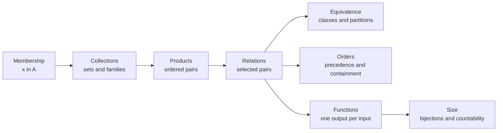
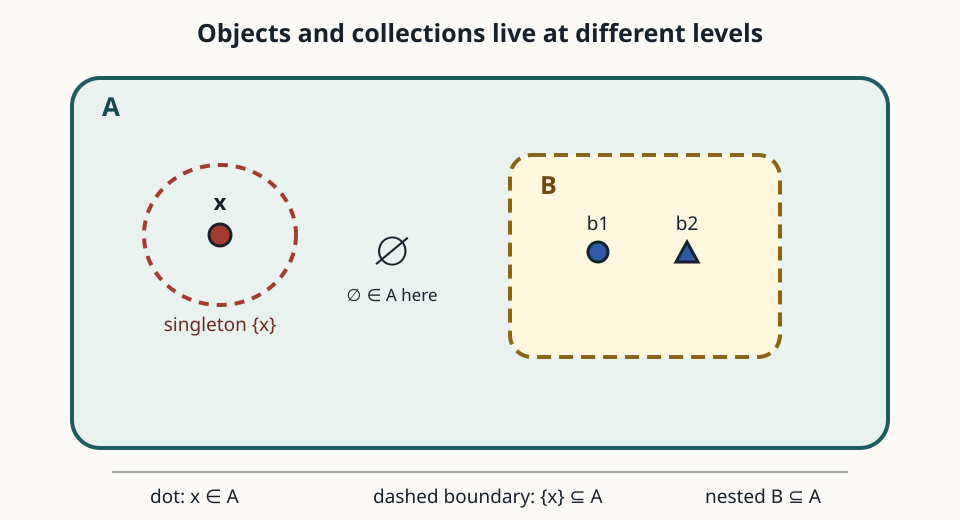
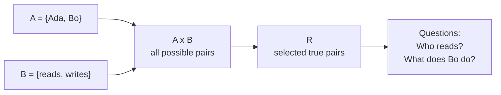
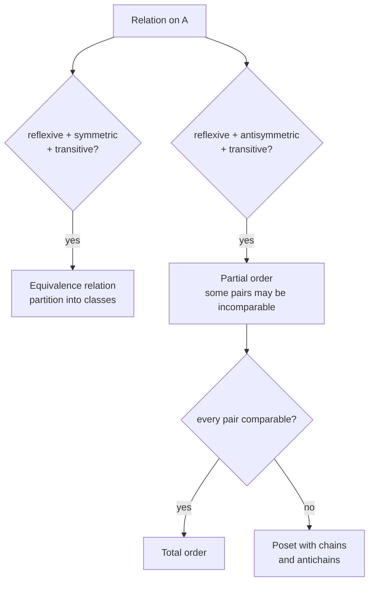
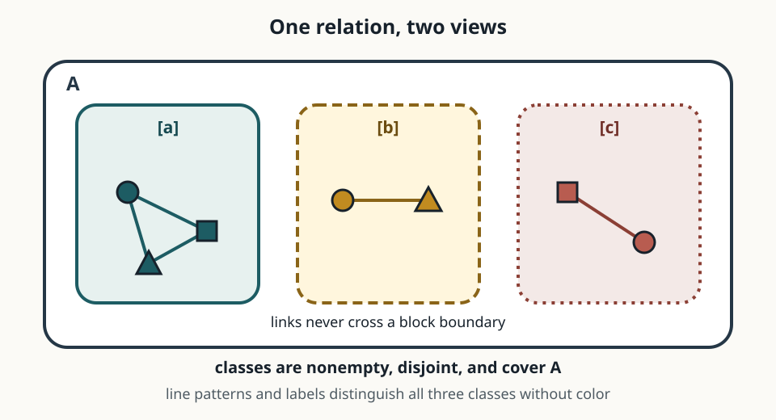
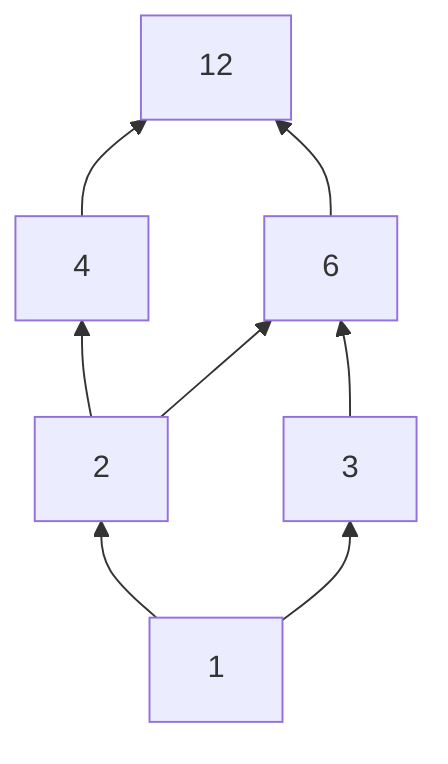
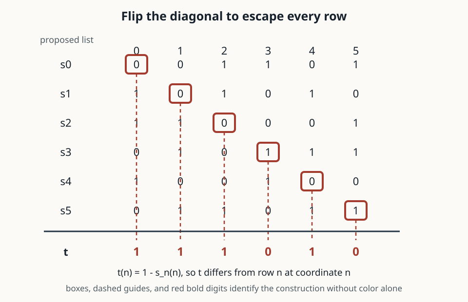

# 0.04 Sets, Relations, and Functions

[Section home](../README.md) | Previous: [§0.03 Exponentials and Logarithms](../00.03-exponents-logarithms/README.md) | [Project guides](../../STYLE_GUIDE.md) | [Notation guide](../../NOTATION.md)

## Why this matters

A set records which objects belong to a collection. That one decision, membership or nonmembership, is enough to build much of the structure used later in mathematics and computing.

Take two collections and form ordered pairs. A selected set of those pairs is a relation. Some relations group objects into interchangeable classes. Others order objects by precedence or containment. A function is a relation constrained to give each allowed input exactly one output. A bijection pairs two sets without leftovers and gives a definition of equal size that still works for infinite sets.

This chain is the module's organizing idea:



> **Figure 1. Membership creates progressively richer structures.** The arrows show construction and specialization, not a claim that every relation is an order or function. Original diagram.

Database tables are finite relations. Type declarations specify sets of permitted values and mappings between them. A clustering label induces a partition only when each item receives exactly one label. Dependency scheduling uses a partial order when some tasks are incomparable. A computational graph consists of functions connected by shared values. Countability determines whether an outcome space can be listed and often separates sums from integrals in probability and analysis.

MIT's *Mathematics for Computer Science* develops sets, functions, and relations as fundamental concepts for computer science [1]. This module keeps that computational orientation while building the definitions carefully.

### Scope and non-goals

We will cover:

- extensionality, roster notation, and bounded set-builder notation;
- membership, subsets, proper subsets, empty sets, and singletons;
- set operations, De Morgan's laws, and indexed families;
- power sets, Cartesian products, tuples, sequences, and tagged unions;
- binary relations and their principal properties;
- equivalence relations, quotient sets, and partitions;
- partial and total orders, Hasse diagrams, chains, and antichains;
- functions as special relations, images, preimages, restrictions, and inverses;
- cardinality by bijection, countability, diagonalization, and Cantor's theorem;
- Russell's paradox as a warning about unrestricted comprehension.

This module is explicitly **not**:

- an axiomatic set theory course;
- a treatment of ordinal or cardinal arithmetic;
- a survey of order-theory theorems;
- a replacement for §0.05 on formal logic or §0.06 on proof methods;
- measure theory;
- category theory.

We use ordinary mathematical sets inside an ambient domain and preview why foundations require care. We do not develop ZF, ZFC, type theory, proper-class theories, or alternative foundations.

## Learning objectives

After completing this module, you should be able to:

- distinguish membership from subset claims and prove set equalities by extensionality;
- compute finite and indexed set operations, products, power sets, and tagged unions;
- classify finite relations and construct equivalence classes, partitions, and partial orders;
- distinguish least from minimal and greatest from maximal elements in a poset;
- treat functions as declared mappings and derive exact image and preimage laws;
- compare cardinalities by bijection and explain why rational numbers are countable while real numbers are not;
- reproduce Cantor's power-set diagonal argument and diagnose the unrestricted-comprehension step in Russell's paradox;
- implement finite set, relation, function, and enumeration checks using the Python standard library.

The [exercise set](exercises/README.md) assesses every objective. Full [worked solutions](solutions/README.md) are separate, and the [resource guide](resources/README.md) offers deeper treatments.

## Prerequisite check

Required: [§0.01 Mathematical Notation](../00.01-mathematical-notation/README.md).

Try these before starting:

1. What does $x\in A$ claim about $x$ and $A$?
2. Can you read $\{x\in\mathbb{Z}:x^2<10\}$ aloud?
3. In $f:\mathcal{X}\to\mathcal{Y}$, which set is the domain?
4. Can you expand $\sum_{i=0}^{3}2^i$?
5. Can you distinguish a finite computation from a proof about every natural number?

Review §0.01 if notation, function declarations, or indexed families are the obstacle. Algebra from §0.02 is helpful but not required. Logic and proof methods from §§0.05-0.06 are recommended companions, so proof sketches here explain their own steps.

## Historical context

Set theory emerged from nineteenth-century work on analysis and infinity. Cantor's comparison of infinite collections by one-to-one correspondence led to the result that the real line is not countable and opened the study of different infinite sizes. The modern subject was not produced by one theorem or one person, and later axiomatization changed what counted as a legitimate set [2].

Around 1901, Bertrand Russell found a contradiction in principles that allowed every condition to determine a set. Related arguments and anticipations involved Cantor, Burali-Forti, Zermelo, and others. Russell communicated his version to Frege in 1902. The Stanford Encyclopedia of Philosophy's 2026 revision carefully separates these strands and the many responses, including type restrictions, bounded separation, set-class distinctions, and alternative logics [3].

The lesson for this module is narrow but important. The bounded expression

$$
\{x\in U:P(x)\}
$$

selects elements from an already declared set $U$. It is not the unrestricted claim that every property $P$ creates a set of all objects satisfying it. Russell's paradox challenges the unrestricted principle, not ordinary bounded notation used with an ambient universe.

## Intuition

### A set is determined by membership

Order and repetition do not matter in a set:

$$
\{1,2,2,3\}=\{3,2,1\}.
$$

Both sides have exactly the same members. This principle is **extensionality**.

The most important reading distinction is between an object and a collection of objects:

$$
x\in A
\qquad\text{versus}\qquad
B\subseteq A.
$$

The first asks whether one object is a member. The second asks whether every member of one set is also a member of another.



> **Figure 2. Membership and subset are different relations.** A dot can be an element of a set, while a boundary represents a set whose every member may lie inside another set. Original figure.

A useful trap is

$$
x\in A\iff\{x\}\subseteq A.
$$

This equivalence relates membership to the singleton containing $x$. It does **not** say $x\subseteq A$ unless $x$ is itself a set and all of its members lie in $A$.

### Products make positions meaningful

A set forgets order, but an ordered pair remembers it:

$$
(a,b)=(c,d)\iff a=c\text{ and }b=d.
$$

Therefore $A\times B$ provides slots: first choose from $A$, then choose from $B$. A binary relation is any selected subset of those possible pairs.



> **Figure 3. A relation selects true rows from a Cartesian product.** This is the mathematical structure behind a finite two-column database relation. Original diagram.

### Special relation properties create structure

A relation may connect an object to itself, connect both directions, or propagate through intermediate objects. Different combinations produce different structures.



> **Figure 4. Relation properties determine familiar structures.** Symmetry and antisymmetry are not negations of each other. Original diagram.

### Functions constrain relation graphs

A function $f:A\to B$ is a relation whose graph contains exactly one pair $(a,b)$ for each $a\in A$. It may send several inputs to the same output. It may miss codomain values. The one rule it cannot break is giving one declared input two different outputs.

### Bijections compare size without counting numerals

Two sets have the same cardinality when a bijection pairs their elements exactly. This agrees with ordinary counting for finite sets, but it also handles infinite sets. The even natural numbers and all natural numbers have the same cardinality through $n\mapsto2n$, even though the evens form a proper subset.

## Mathematics

### Local notation

| Symbol | Meaning |
|---|---|
| $x\in A$ | $x$ is a member of $A$ |
| $A\subseteq B$ | every member of $A$ is a member of $B$ |
| $A\subsetneq B$ | $A\subseteq B$ and $A\ne B$ |
| $\varnothing$ | empty set |
| $\mathcal{P}(A)$ | power set of $A$ |
| $A\mathbin{\triangle}B$ | symmetric difference |
| $A\times B$ | Cartesian product |
| $aRb$ | $(a,b)\in R$ |
| $[a]_R$ | equivalence class of $a$ under $R$ |
| $A/R$ | quotient set of equivalence classes |
| $f(A_0)$ | image of $A_0$ under $f$ |
| $f^{-1}(B_0)$ | preimage of $B_0$ under $f$ |
| $\lvert A\rvert$ | cardinality of $A$ |

We use ordinary uppercase letters such as $A,B,U$ for sets in this module because the same letters appear throughout standard discrete mathematics. Calligraphic letters remain useful for spaces and datasets elsewhere in the curriculum.

### Extensionality, roster notation, and set-builder notation

**Extensionality.** Sets $A$ and $B$ are equal exactly when they have the same members:

$$
A=B\iff\forall x\,(x\in A\iff x\in B).
$$

In this module, the quantified objects always come from a declared ambient domain even when the notation suppresses it. Extensionality gives the standard method for proving set equality: prove both membership directions.

**Roster notation** lists members:

$$
A=\{2,3,5,7\}.
$$

**Set-builder notation** selects members satisfying a condition:

$$
A=\{n\in\mathbb{N}:n<10\text{ and }n\text{ is prime}\}.
$$

The ambient domain matters. Compare

$$
\{x\in\mathbb{R}:x^2=2\}=\{-\sqrt2,\sqrt2\}
$$

with

$$
\{x\in\mathbb{Q}:x^2=2\}=\varnothing.
$$

The same predicate produces different sets when the domain changes.

A **singleton** $\{x\}$ has one member. The empty set $\varnothing$ has no members. There is exactly one empty set by extensionality: any two sets with no members have the same members.

### Membership versus subset

The definition of subset is

$$
A\subseteq B\iff\forall x\,(x\in A\implies x\in B).
$$

A proper subset additionally excludes equality:

$$
A\subsetneq B\iff A\subseteq B\text{ and }A\ne B.
$$

Three facts should become automatic:

1. $\varnothing\subseteq A$ for every set $A$ because there is no empty-set member that violates the condition.
2. $A\subseteq A$ for every set $A$.
3. $\varnothing\in A$ only when the empty set itself is listed or selected as a member.

For example, let

$$
A=\{1,\{1\},\varnothing\}.
$$

Then

$$
1\in A,
\qquad
\{1\}\in A,
\qquad
\{1\}\subseteq A,
\qquad
\varnothing\in A,
\qquad
\varnothing\subseteq A.
$$

The claim $1\subseteq A$ is not an ordinary elementary-set claim because $1$ is being used as a number, not as a declared set of members.

### Set operations

Let $A,B\subseteq U$, where $U$ is the ambient universe.

| Operation | Definition by membership | Reading |
|---|---|---|
| union $A\cup B$ | $x\in A$ or $x\in B$ | in at least one |
| intersection $A\cap B$ | $x\in A$ and $x\in B$ | in both |
| difference $A\setminus B$ | $x\in A$ and $x\notin B$ | in $A$ only |
| symmetric difference $A\mathbin{\triangle}B$ | in exactly one of $A,B$ | disagreement |
| complement $A^c$ | $x\in U$ and $x\notin A$ | outside $A$, within $U$ |

Complement is never absolute here. It is relative to the declared $U$.

Symmetric difference has two useful forms:

$$
A\mathbin{\triangle}B
=(A\setminus B)\cup(B\setminus A)
=(A\cup B)\setminus(A\cap B).
$$

Common algebraic laws include

$$
A\cup B=B\cup A,
\qquad
A\cap B=B\cap A,
$$

$$
A\cup(B\cup C)=(A\cup B)\cup C,
$$

$$
A\cap(B\cap C)=(A\cap B)\cap C,
$$

$$
A\cap(B\cup C)=(A\cap B)\cup(A\cap C),
$$

$$
A\cup(B\cap C)=(A\cup B)\cap(A\cup C).
$$

De Morgan's laws exchange union and intersection under complement:

$$
(A\cup B)^c=A^c\cap B^c,
$$

$$
(A\cap B)^c=A^c\cup B^c.
$$

These are elementwise statements. For example,

$$
x\in(A\cup B)^c
\iff x\notin A\cup B
\iff x\notin A\text{ and }x\notin B
\iff x\in A^c\cap B^c.
$$

Mathematics in Lean exposes the same discipline: set equalities are proved by reducing them to membership statements, and Chapter 4 formalizes unions, intersections, differences, images, preimages, and extensionality in this way [4].

### Finite and indexed families

For sets $A_1,\ldots,A_n$,

$$
\bigcup_{i=1}^{n}A_i
=\{x:\text{there exists }i\in\{1,\ldots,n\}\text{ with }x\in A_i\},
$$

$$
\bigcap_{i=1}^{n}A_i
=\{x:\text{for every }i\in\{1,\ldots,n\},\ x\in A_i\}.
$$

More generally, an indexed family $(A_i)_{i\in I}$ is a function assigning a set to each index $i\in I$. Then

$$
x\in\bigcup_{i\in I}A_i\iff\exists i\in I\text{ such that }x\in A_i,
$$

$$
x\in\bigcap_{i\in I}A_i\iff\forall i\in I,\ x\in A_i.
$$

For nonempty $I$, indexed De Morgan laws are

$$
\left(\bigcup_{i\in I}A_i\right)^c
=\bigcap_{i\in I}A_i^c,
$$

$$
\left(\bigcap_{i\in I}A_i\right)^c
=\bigcup_{i\in I}A_i^c.
$$

Empty indexed families require conventions tied to the universe:

$$
\bigcup_{i\in\varnothing}A_i=\varnothing,
\qquad
\bigcap_{i\in\varnothing}A_i=U.
$$

The first contains elements appearing somewhere in an empty family, so none. The second contains elements appearing in every set of an empty family, so every ambient element satisfies the vacuous condition.

### Power sets

The **power set** contains every subset:

$$
\mathcal{P}(A)\coloneqq\{B:B\subseteq A\}.
$$

If $A=\{a,b\}$, then

$$
\mathcal{P}(A)=\{\varnothing,\{a\},\{b\},\{a,b\}\}.
$$

Notice the levels:

$$
a\in A,
\qquad
\{a\}\in\mathcal{P}(A),
\qquad
\{a\}\subseteq A.
$$

If $A$ has $n$ members, then

$$
|\mathcal{P}(A)|=2^n.
$$

Each subset corresponds to a length-$n$ binary decision string: include or exclude each member. This finite counting result is the first appearance of a connection that becomes deeper in Cantor's theorem.

### Cartesian products, ordered tuples, and sequences

The Cartesian product is

$$
A\times B\coloneqq\{(a,b):a\in A,\ b\in B\}.
$$

If $A$ and $B$ are finite, then

$$
|A\times B|=|A||B|.
$$

Order matters both within pairs and between factors. Usually

$$
(a,b)\ne(b,a)
\quad\text{and}\quad
A\times B\ne B\times A.
$$

An $n$-tuple $(a_1,\ldots,a_n)$ has $n$ ordered coordinates. The product

$$
A_1\times\cdots\times A_n
$$

contains tuples whose $i$th coordinate lies in $A_i$.

A sequence in $A$ is a function from an index set into $A$. An infinite sequence is commonly written

$$
a:\mathbb{N}\to A,
\qquad
n\mapsto a_n.
$$

A finite sequence of length $n$ can be treated as a function from $\{0,\ldots,n-1\}$ or $\{1,\ldots,n\}$, with the convention stated. This function view makes repetition and order explicit, unlike ordinary sets.

### Ordinary and tagged unions

The ordinary union $A\cup B$ may merge equal-looking members. If

$$
A=\{1,2\},
\qquad
B=\{2,3\},
$$

then $A\cup B=\{1,2,3\}$ and the two occurrences of $2$ do not survive as separate objects.

A **tagged disjoint union** preserves source identity:

$$
A\sqcup B
\coloneqq
(A\times\{0\})\cup(B\times\{1\}).
$$

Even if $a\in A\cap B$, the tagged values $(a,0)$ and $(a,1)$ are distinct. The tags are structural, not decorative.

This construction appears in type systems as a sum type: a value carries both payload and variant tag. It also prevents two datasets with overlapping identifiers from silently merging records when provenance matters.

### Binary relations

A binary relation from $A$ to $B$ is any subset

$$
R\subseteq A\times B.
$$

Write $aRb$ as shorthand for $(a,b)\in R$. A relation **on** $A$ is a subset of $A\times A$.

Its domain and range are

$$
\mathrm{dom}(R)
=\{a\in A:\exists b\in B,\ (a,b)\in R\},
$$

$$
\mathrm{ran}(R)
=\{b\in B:\exists a\in A,\ (a,b)\in R\}.
$$

The inverse relation reverses every pair:

$$
R^{-1}=\{(b,a):(a,b)\in R\}.
$$

If $R\subseteq A\times B$ and $S\subseteq B\times C$, define composition by

$$
S\circ R
=\{(a,c):\exists b\in B,\ (a,b)\in R\text{ and }(b,c)\in S\}.
$$

The rightmost relation acts first, matching function composition.

The Open Logic Project publishes a directly inspectable set-functions-relations text with sections on relations as sets, special properties, equivalence relations, orders, inverse relations, and composition [5].

### Properties of relations on one set

Let $R\subseteq A\times A$.

| Property | Definition |
|---|---|
| reflexive | for every $a\in A$, $aRa$ |
| irreflexive | for every $a\in A$, not $aRa$ |
| symmetric | $aRb$ implies $bRa$ |
| antisymmetric | $aRb$ and $bRa$ imply $a=b$ |
| asymmetric | $aRb$ implies not $bRa$ |
| transitive | $aRb$ and $bRc$ imply $aRc$ |

These properties are independent enough that examples matter.

| Relation | Set | Reflexive | Irreflexive | Symmetric | Antisymmetric | Asymmetric | Transitive |
|---|---|---:|---:|---:|---:|---:|---:|
| equality $=$ | any set | yes | no | yes | yes | no | yes |
| inequality $\ne$ | a set with at least two members | no | yes | yes | no | no | usually no |
| strict less than $<$ | $\mathbb{R}$ | no | yes | no | yes | yes | yes |
| less than or equal $\le$ | $\mathbb{R}$ | yes | no | no | yes | no | yes |
| "shares a divisor $>1$" | positive integers | no for $1$ | no | yes | no | no | no |
| "is a sibling of" | people under an ordinary model | usually no | usually yes | yes | no | no | not generally |

**Antisymmetric does not mean "not symmetric."** Equality is both symmetric and antisymmetric. Antisymmetry allows both directions when the elements are equal. Asymmetry forbids both directions entirely and therefore implies irreflexivity.

Also, an irreflexive relation can be antisymmetric vacuously. The strict order $<$ is both asymmetric and antisymmetric, although antisymmetry is usually emphasized for non-strict orders.

### Equivalence relations and classes

An **equivalence relation** is reflexive, symmetric, and transitive.

For $a\in A$, its equivalence class is

$$
[a]_R\coloneqq\{x\in A:xRa\}.
$$

The quotient set is the set of all distinct classes:

$$
A/R\coloneqq\{[a]_R:a\in A\}.
$$

For an integer $m\ge2$, congruence modulo $m$ is

$$
a\equiv b\pmod m
\iff
m\text{ divides }a-b.
$$

It partitions $\mathbb{Z}$ into $m$ residue classes. For $m=3$,

$$
[0]=\{\ldots,-3,0,3,6,\ldots\},
$$

$$
[1]=\{\ldots,-2,1,4,7,\ldots\},
$$

$$
[2]=\{\ldots,-1,2,5,8,\ldots\}.
$$



> **Figure 5. Equivalence classes form a partition.** Every element belongs to one class, classes do not overlap, and their union is the whole set. Original figure.

A **partition** $\Pi$ of $A$ is a collection of nonempty subsets called blocks such that:

1. every $a\in A$ belongs to some block;
2. distinct blocks are disjoint.

Equivalently,

$$
\bigcup_{C\in\Pi}C=A
$$

and any two blocks are equal or disjoint.

#### From an equivalence relation to a partition

The set of equivalence classes $A/R$ partitions $A$.

- Reflexivity gives $a\in[a]_R$, so every element belongs to a class.
- Suppose $[a]_R$ and $[b]_R$ overlap at $x$. Then $xRa$ and $xRb$. Symmetry gives $aRx$, and transitivity gives $aRb$.
- If $y\in[a]_R$, then $yRa$, and with $aRb$, transitivity gives $yRb$. Thus $[a]_R\subseteq[b]_R$.
- The symmetric argument gives the reverse inclusion, so the classes are equal.

Therefore classes either coincide or are disjoint.

#### From a partition to an equivalence relation

Given a partition $\Pi$, define

$$
a\sim_\Pi b
\iff
\text{$a$ and $b$ belong to the same block of $\Pi$}.
$$

This is reflexive because each element belongs to a block, symmetric because "same block" has no direction, and transitive because if $a,b$ share one block and $b,c$ share another, the two blocks overlap at $b$ and therefore must be the same block.

These constructions reverse one another. Equivalence relations and partitions are two views of the same structure: pairwise sameness and grouped blocks.

A clustering assignment $c:A\to\{1,\ldots,k\}$ induces $a\sim b$ when $c(a)=c(b)$. This is an equivalence relation only for a hard assignment with one label per item. Overlapping or soft clusters require a different model.

### Partial and total orders

A **partial order** $\preceq$ on $A$ is reflexive, antisymmetric, and transitive. The pair $(A,\preceq)$ is a partially ordered set, or **poset**.

A **total order** is a partial order in which every pair is comparable:

$$
\forall a,b\in A,
\quad
a\preceq b\text{ or }b\preceq a.
$$

In a partial order, some elements may be incomparable.

The strict relation associated with $\preceq$ is

$$
a\prec b\iff a\preceq b\text{ and }a\ne b.
$$

Conversely, an irreflexive transitive strict order can generate a non-strict order by adding equality. State which version you use.

Common examples are:

| Poset | Order | Total? |
|---|---|---:|
| integers | $\le$ | yes |
| subsets of $U$ | $\subseteq$ | no when incomparable subsets exist |
| positive divisors of $n$ | divisibility $\mid$ | usually no |
| tasks in a dependency graph | "must precede or equal" | usually no |

### Hasse diagrams

A finite Hasse diagram draws the cover relations of a poset. Place larger elements higher. Omit self-loops, arrowheads, and edges implied by transitivity.

For divisors of $12$ ordered by divisibility:



> **Figure 6. Hasse diagram for positive divisors of $12$.** An upward path means divisibility; transitive edges such as $1\mid12$ are omitted. Original diagram.

A **chain** is a subset whose elements are pairwise comparable. For example, $\{1,2,4,12\}$ is a chain.

An **antichain** is a subset whose distinct elements are pairwise incomparable. For example, $\{3,4\}$ is an antichain.

### Least, minimal, greatest, and maximal

Let $S$ be a subset of a poset.

- A **least** element $\ell$ satisfies $\ell\preceq x$ for every $x\in S$.
- A **minimal** element $m$ has no distinct $x\in S$ with $x\preceq m$.
- A **greatest** element $g$ satisfies $x\preceq g$ for every $x\in S$.
- A **maximal** element $m$ has no distinct $x\in S$ with $m\preceq x$.

A least element, if it exists, is unique and minimal. A poset can have several minimal elements and no least element.

Consider

$$
S=\{\{1\},\{2\},\{1,2\}\}
$$

ordered by $\subseteq$. Both $\{1\}$ and $\{2\}$ are minimal. Neither is least because they are incomparable. The set $\{1,2\}$ is greatest and therefore the unique maximal element.

If we remove $\{1,2\}$, both remaining elements are maximal as well as minimal, but there is neither a greatest nor a least element.

### Functions as special relations

A function declaration

$$
f:A\to B
$$

includes a domain $A$, codomain $B$, and assignment rule. Its graph is

$$
\mathrm{graph}(f)
=\{(a,f(a)):a\in A\}
\subseteq A\times B.
$$

A relation $R\subseteq A\times B$ is the graph of a total function exactly when every $a\in A$ occurs as a first coordinate paired with one and only one $b\in B$.

A **partial function** may be undefined on some elements of its declared source set. It can be represented as a function from a smaller domain $D\subseteq A$, or as a relation with at most one output per $a\in A$.

This module uses "function" to mean total function unless "partial" is explicit.

The range or full image is

$$
f(A)=\{f(a):a\in A\}\subseteq B.
$$

The codomain is declared. The image is attained. They need not be equal.

### Images, preimages, and restrictions

For $S\subseteq A$, the image is

$$
f(S)\coloneqq\{f(x):x\in S\}.
$$

For $T\subseteq B$, the preimage is

$$
f^{-1}(T)\coloneqq\{x\in A:f(x)\in T\}.
$$

The restriction to $S$ is

$$
f|_S:S\to B,
\qquad
f|_S(x)=f(x).
$$

The preimage notation $f^{-1}(T)$ does not require an inverse function. Its argument is a set in the codomain. An inverse function $f^{-1}:B\to A$ requires $f$ to be bijective, or requires a suitable restriction.

### Injective, surjective, and bijective

A function $f:A\to B$ is:

- **injective** if $f(a_1)=f(a_2)$ implies $a_1=a_2$;
- **surjective** if every $b\in B$ equals $f(a)$ for some $a\in A$;
- **bijective** if it is both injective and surjective.

| Property | Graph behavior |
|---|---|
| function | exactly one outgoing value from each domain element |
| injective | at most one domain element reaches each codomain element |
| surjective | every codomain element is reached |
| bijective | exactly one domain element reaches each codomain element |

If $f$ is bijective, its inverse function is defined by

$$
f^{-1}(b)=\text{the unique }a\in A\text{ such that }f(a)=b.
$$

Then

$$
f^{-1}\circ f=\mathrm{id}_A,
\qquad
f\circ f^{-1}=\mathrm{id}_B.
$$

### Exact image and preimage laws

Let $f:A\to B$, let $S_1,S_2\subseteq A$, and let $T_1,T_2\subseteq B$.

Preimages preserve the principal Boolean set operations exactly:

$$
f^{-1}(T_1\cup T_2)
=f^{-1}(T_1)\cup f^{-1}(T_2),
$$

$$
f^{-1}(T_1\cap T_2)
=f^{-1}(T_1)\cap f^{-1}(T_2),
$$

$$
f^{-1}(B\setminus T_1)
=A\setminus f^{-1}(T_1).
$$

They also preserve indexed unions and intersections:

$$
f^{-1}\left(\bigcup_{i\in I}T_i\right)
=\bigcup_{i\in I}f^{-1}(T_i),
$$

$$
f^{-1}\left(\bigcap_{i\in I}T_i\right)
=\bigcap_{i\in I}f^{-1}(T_i).
$$

Images preserve unions exactly:

$$
f(S_1\cup S_2)=f(S_1)\cup f(S_2),
$$

and similarly for indexed unions.

For intersections, only one inclusion is automatic:

$$
f(S_1\cap S_2)
\subseteq
f(S_1)\cap f(S_2).
$$

Equality holds if $f$ is injective. Without injectivity, the inclusion can be strict.

Let $f:\{-1,0,1\}\to\{0,1\}$ be $f(x)=x^2$, with

$$
S_1=\{-1,0\},
\qquad
S_2=\{0,1\}.
$$

Then

$$
f(S_1\cap S_2)=f(\{0\})=\{0\},
$$

but

$$
f(S_1)\cap f(S_2)=\{0,1\}\cap\{0,1\}=\{0,1\}.
$$

The output $1$ is produced by different inputs from the two sets. Injectivity would force those inputs to be equal and therefore in the intersection.

Chapter 4 of *Mathematics in Lean* states these exact laws and formalizes the injective reverse inclusion for image intersections [4].

### Cardinality by bijection

Finite cardinality $|A|=n$ means there is a bijection from $\{0,\ldots,n-1\}$ to $A$. More generally,

$$
|A|=|B|
$$

means there exists a bijection $A\to B$.

A set is **finite** if it has cardinality $n$ for some $n\in\mathbb{N}$. It is **infinite** if it is not finite.

Terminology varies across books. In this module:

- **countable** means finite or countably infinite, also called *at most countable*;
- **countably infinite** means bijective with $\mathbb{N}$;
- **uncountable** means not countable.

Always check another source's convention. Some authors use "countable" to mean only countably infinite.

Oscar Levin's open discrete mathematics text provides an undergraduate treatment of sets and functions with inquiry-based exercises and is licensed CC BY-SA 4.0 [6]. Stanford CS103 likewise places sets, functions, discrete structures, and proof writing at the beginning of mathematical foundations for computing [7].

### Enumerating $\mathbb{N}\times\mathbb{N}$

This curriculum uses $0\in\mathbb{N}$. List pairs by diagonals of constant sum:

$$
(0,0),
$$

$$
(1,0),(0,1),
$$

$$
(2,0),(1,1),(0,2),
$$

$$
(3,0),(2,1),(1,2),(0,3),\ldots
$$

Every pair $(a,b)$ appears on diagonal $a+b$, and each diagonal is finite. One explicit bijection is the Cantor pairing function

$$
\pi(a,b)
=\frac{(a+b)(a+b+1)}{2}+b.
$$

Thus $\mathbb{N}\times\mathbb{N}$ is countably infinite. An infinite grid is listable when we traverse finite diagonals, but not if we try to finish an infinite row before moving to the next.

### Enumerating the integers

A simple list is

$$
0,-1,1,-2,2,-3,3,\ldots
$$

One bijection $z:\mathbb{N}\to\mathbb{Z}$ is

$$
z(n)=
\begin{cases}
 n/2,&n\text{ even},\\
 -(n+1)/2,&n\text{ odd}.
\end{cases}
$$

Therefore $\mathbb{Z}$ is countably infinite.

### Enumerating the rationals without duplicates

Writing all fractions $p/q$ with $p\in\mathbb{Z}$ and positive $q$ covers $\mathbb{Q}$, but it repeats values:

$$
\frac12=\frac24=\frac36=\cdots.
$$

To obtain one representative per rational, require

$$
q>0,
\qquad
\gcd(|p|,q)=1.
$$

Enumerate integer pairs $(p,q)$ by increasing height $|p|+q$. On each finite height, emit only reduced pairs. Every rational has exactly one reduced representation with positive denominator, so it appears once.

For example, the first heights produce values such as

$$
0,\ 1,\ -1,\ \frac12,\ -\frac12,\ 2,\ -2,\ \frac13,\ -\frac13,\ldots
$$

The exact within-height order does not matter if it is deterministic. What matters is coverage and duplicate control. Therefore $\mathbb{Q}$ is countably infinite.

Python's `Fraction(p, q)` normalizes to lowest terms with a positive denominator, while built-in sets remove equal duplicates. The official standard-library documentation specifies both behaviors [8].

### Cantor's theorem

**Theorem.** For every set $A$,

$$
|A|<|\mathcal{P}(A)|.
$$

There is an injection $A\to\mathcal{P}(A)$ given by $a\mapsto\{a\}$. The hard part is proving that no function $f:A\to\mathcal{P}(A)$ is surjective.

Given any such $f$, define the diagonal set

$$
D\coloneqq\{a\in A:a\notin f(a)\}.
$$

Since $D\subseteq A$, we have $D\in\mathcal{P}(A)$. If $f$ were surjective, some $d\in A$ would satisfy $f(d)=D$. Then

$$
d\in D
\iff
d\notin f(d)
\iff
d\notin D,
$$

which is impossible. Therefore $D$ is missing from the range of every proposed $f$, so no surjection exists.



> **Figure 7. Cantor's diagonal construction for binary sequences.** The constructed row differs from row $n$ at coordinate $n$, so it cannot occur anywhere in the proposed list. Original figure.

### Binary sequences and subsets of natural numbers

Every subset $S\subseteq\mathbb{N}$ has an indicator sequence

$$
\chi_S(n)=
\begin{cases}
1,&n\in S,\\
0,&n\notin S.
\end{cases}
$$

Conversely, each binary sequence determines the subset where its entries equal $1$. Therefore

$$
\{0,1\}^{\mathbb{N}}
\longleftrightarrow
\mathcal{P}(\mathbb{N})
$$

is a bijection. Cantor's theorem shows this set of sequences is uncountable.

A direct diagonal proof reaches the same result. Suppose binary sequences were listed as $s_0,s_1,s_2,\ldots$. Define

$$
t(n)=1-s_n(n).
$$

Then $t$ differs from $s_n$ at coordinate $n$, so it is absent from the list.

A finite table can illustrate the construction, but a finite prefix does not prove uncountability. The proof uses the rule for every natural-numbered row.

### Why the real numbers are uncountable

It is tempting to identify binary sequences with real numbers in $[0,1]$ by binary expansion. That map needs care because some real numbers have two binary expansions, such as

$$
0.1000\ldots_2=0.0111\ldots_2.
$$

Ignoring this ambiguity invalidates a claimed bijection.

A robust route uses ternary digits $0$ and $2$. For a binary sequence $s\in\{0,1\}^{\mathbb{N}}$, define

$$
\Phi(s)
=\sum_{n=0}^{\infty}\frac{2s(n)}{3^{n+1}}.
$$

This value lies in $[0,1]$. If $s$ and $t$ first differ at index $k$, the leading difference has magnitude $2/3^{k+1}$. Even if all later terms oppose it, their total magnitude is at most

$$
\sum_{n=k+1}^{\infty}\frac{2}{3^{n+1}}
=\frac{1}{3^{k+1}}.
$$

The leading difference is larger, so $\Phi(s)\ne\Phi(t)$. Thus $\Phi$ is injective.

Since the binary sequence set is uncountable and injects into $[0,1]$, the interval $[0,1]$, and therefore $\mathbb{R}$, is uncountable.

This argument does not claim that every real number has a ternary expansion using only $0$ and $2$. The image is the Cantor set, a particular uncountable subset of $[0,1]$. It also avoids claiming that ordinary binary expansions are unique.

### Russell's paradox and the boundary of set-builder notation

Unrestricted comprehension would assert that every condition $P(x)$ determines a set

$$
\{x:P(x)\}.
$$

Choose $P(x)$ to mean $x\notin x$, and suppose

$$
R=\{x:x\notin x\}
$$

is a set. Asking whether $R\in R$ gives

$$
R\in R\iff R\notin R.
$$

The contradiction shows that unrestricted comprehension cannot be accepted as stated.

A bounded separation principle instead starts from an existing set $U$:

$$
\{x\in U:P(x)\}.
$$

For the Russell condition, this produces

$$
R_U=\{x\in U:x\notin x\}.
$$

The diagonal reasoning shows $R_U\notin U$ rather than producing a universal set contradiction. The construction selects from $U$ but is not forced to be a member of $U$.

Historically and mathematically, there are several responses. Zermelo-style separation is one. Russell's type theories are another. Set-class theories and other axiomatic systems take different routes. ZF is important, but it is not the only response and this module does not choose among foundations [2,3].

## Derivation

### Proving a set identity by extensionality

We prove

$$
A\setminus(B\cup C)
=(A\setminus B)\cap(A\setminus C).
$$

Take an arbitrary $x$ in the ambient universe. Then

$$
\begin{aligned}
x\in A\setminus(B\cup C)
&\iff x\in A\text{ and }x\notin B\cup C\\
&\iff x\in A\text{ and }x\notin B\text{ and }x\notin C\\
&\iff (x\in A\text{ and }x\notin B)
      \text{ and }(x\in A\text{ and }x\notin C)\\
&\iff x\in(A\setminus B)\cap(A\setminus C).
\end{aligned}
$$

Since membership agrees for every $x$, extensionality gives equality. The repeated $x\in A$ is harmless because a condition conjoined with itself has the same truth value.

### Deriving the equivalence-partition correspondence

The two directions above rely on one central lemma:

$$
[a]_R\cap[b]_R\ne\varnothing
\implies
[a]_R=[b]_R.
$$

For an equivalence relation, any shared member links the representatives by symmetry and transitivity. For a partition, any shared member forces two blocks to be the same because distinct blocks are disjoint. The constructions therefore retain exactly the same grouping information.

This is why a quotient set has classes as members rather than original elements. It replaces every group of equivalent elements by one block.

### Deriving the image-intersection condition

Suppose

$$
y\in f(S_1\cap S_2).
$$

Then some $x\in S_1\cap S_2$ satisfies $f(x)=y$. The same $x$ lies in each set, so $y\in f(S_1)$ and $y\in f(S_2)$. Therefore

$$
f(S_1\cap S_2)\subseteq f(S_1)\cap f(S_2).
$$

For the reverse direction, take $y\in f(S_1)\cap f(S_2)$. There exist $x_1\in S_1$ and $x_2\in S_2$ with

$$
f(x_1)=y=f(x_2).
$$

Without injectivity, $x_1$ and $x_2$ may differ, so neither must lie in the intersection. If $f$ is injective, equality of outputs forces $x_1=x_2$, producing one input in both sets and proving equality.

### Deriving the preimage laws

Preimages are exact because one input $x$ is tested against a codomain condition. For intersection,

$$
\begin{aligned}
x\in f^{-1}(T_1\cap T_2)
&\iff f(x)\in T_1\cap T_2\\
&\iff f(x)\in T_1\text{ and }f(x)\in T_2\\
&\iff x\in f^{-1}(T_1)\cap f^{-1}(T_2).
\end{aligned}
$$

No injectivity or surjectivity is needed.

### Deriving Cantor's finite and infinite power-set results

For finite $A=\{a_1,\ldots,a_n\}$, a subset is determined by $n$ independent yes-or-no membership choices, giving $2^n$ subsets.

For arbitrary $A$, the diagonal set proves more than "power sets are large." It supplies, for every proposed list $f$, a specific subset $D$ absent from that list. The singleton map proves $A$ injects into its power set, while the diagonal proves no surjection goes back. Together these justify the strict cardinal comparison.

## Implementation

Python's built-in `set` is an unordered collection of distinct hashable objects. It implements membership, subset, proper-subset, union, intersection, difference, and symmetric difference. `frozenset` is the immutable hashable form needed when a set itself must be a set member [8].

### Set operations, products, and tagged unions

```python
from itertools import product

universe = set(range(1, 7))
set_a = {1, 2, 3, 4}
set_b = {3, 4, 5}

assert set_a | set_b == {1, 2, 3, 4, 5}
assert set_a & set_b == {3, 4}
assert set_a - set_b == {1, 2}
assert set_a ^ set_b == {1, 2, 5}
assert universe - (set_a | set_b) == {6}
assert universe - (set_a | set_b) == (
    (universe - set_a) & (universe - set_b)
)

product_ab = set(product({"a", "b"}, {0, 1}))
assert product_ab == {("a", 0), ("a", 1), ("b", 0), ("b", 1)}

left = {1, 2}
right = {2, 3}
tagged_union = {(value, "L") for value in left} | {
    (value, "R") for value in right
}
assert len(left | right) == 3
assert len(tagged_union) == 4
assert (2, "L") != (2, "R")
```

The ordinary union merges the shared value $2$. The tagged union preserves two source-specific values.

### A finite relation-property checker

```python
from itertools import product


def relation_properties(base_set, relation):
    pairs = set(product(base_set, repeat=2))
    if not relation <= pairs:
        raise ValueError("relation must be a subset of base_set x base_set")

    reflexive = all((value, value) in relation for value in base_set)
    irreflexive = all((value, value) not in relation for value in base_set)
    symmetric = all((right, left) in relation for left, right in relation)
    antisymmetric = all(
        left == right or (right, left) not in relation
        for left, right in relation
    )
    asymmetric = all((right, left) not in relation for left, right in relation)
    transitive = all(
        (left, end) in relation
        for left, middle in relation
        for next_middle, end in relation
        if middle == next_middle
    )
    return {
        "reflexive": reflexive,
        "irreflexive": irreflexive,
        "symmetric": symmetric,
        "antisymmetric": antisymmetric,
        "asymmetric": asymmetric,
        "transitive": transitive,
    }


base_set = {1, 2, 3, 6}
divides = {
    (left, right)
    for left, right in product(base_set, repeat=2)
    if right % left == 0
}
properties = relation_properties(base_set, divides)
assert properties["reflexive"]
assert properties["antisymmetric"]
assert properties["transitive"]
assert not properties["symmetric"]
assert not properties["asymmetric"]
```

This exhaustive checker proves each property for the supplied finite relation because it inspects every relevant pair or triple. Testing longer finite prefixes does not prove a property for an infinite relation.

### A finite function-property checker

```python

def function_properties(domain, codomain, graph):
    if not graph <= {(x, y) for x in domain for y in codomain}:
        raise ValueError("graph must lie in domain x codomain")

    outputs = {
        x: {y for graph_x, y in graph if graph_x == x}
        for x in domain
    }
    is_function = all(len(values) == 1 for values in outputs.values())
    if not is_function:
        return {"function": False, "injective": False, "surjective": False}

    attained = {next(iter(values)) for values in outputs.values()}
    return {
        "function": True,
        "injective": len(attained) == len(domain),
        "surjective": attained == codomain,
    }


domain = {-2, -1, 0, 1, 2}
codomain = {0, 1, 4}
square_graph = {(value, value * value) for value in domain}
result = function_properties(domain, codomain, square_graph)
assert result == {"function": True, "injective": False, "surjective": True}
```

Surjectivity depends on the declared codomain. The same graph declared into a larger codomain would not be surjective.

### Rational enumeration by expanding diagonals

```python
from fractions import Fraction
from math import gcd


def rationals_by_height(maximum_height):
    values = []
    for height in range(1, maximum_height + 1):
        for denominator in range(1, height + 1):
            absolute_numerator = height - denominator
            numerators = (
                [0] if absolute_numerator == 0
                else [absolute_numerator, -absolute_numerator]
            )
            for numerator in numerators:
                if gcd(abs(numerator), denominator) == 1:
                    values.append(Fraction(numerator, denominator))
    return values


rationals = rationals_by_height(8)
assert len(rationals) == len(set(rationals))
assert Fraction(0, 1) in rationals
assert Fraction(1, 2) in rationals
assert Fraction(-2, 3) in rationals
assert all(value.denominator > 0 for value in rationals)
```

Filtering by greatest common divisor prevents aliases such as $1/2$ and $2/4$ from both being emitted. `Fraction` provides an independent normalization check.

### A finite diagonal-prefix experiment

```python

def missing_diagonal_prefix(rows):
    size = len(rows)
    if any(len(row) < size for row in rows):
        raise ValueError("each row must cover the inspected diagonal")
    return tuple(1 - rows[index][index] for index in range(size))


rows = [
    (0, 0, 1, 1),
    (1, 0, 1, 0),
    (1, 1, 0, 0),
    (0, 1, 0, 1),
]
diagonal = missing_diagonal_prefix(rows)
assert diagonal == (1, 1, 1, 0)
assert all(diagonal[index] != rows[index][index] for index in range(4))
```

The result differs from each listed row somewhere in the inspected prefix. This finite assertion illustrates the infinite proof pattern. It does not establish uncountability, because a finite binary table has only finitely many rows and columns.

## Experimentation

### Experiment 1: Reduced rationals on expanding diagonals

**Question.** Does reduced-pair filtering remove duplicates while preserving every rational whose canonical height is within the search boundary?

**Hypotheses.** Naively emitting every $p/q$ with $|p|+q\le H$ will contain duplicates. Requiring $q>0$ and $\gcd(|p|,q)=1$ will remove duplicates. Increasing $H$ will retain all earlier canonical values and add only values of greater canonical height.

**Controls.** Use the same height traversal and sign order for filtered and unfiltered runs. Normalize both through `Fraction` only for checking, not for deciding which pairs to emit. Test heights $H\in\{4,8,16,32\}$.

Record:

| Height | raw pair count | distinct rational count | reduced output count | duplicates removed |
|---:|---:|---:|---:|---:|
| 4 | 16 | 11 | 11 | 5 |
| 8 | 64 | 43 | 43 | 21 |
| 16 | 256 | 159 | 159 | 97 |
| 32 | 1,024 | 647 | 647 | 377 |

Verify these invariants:

1. reduced output has no duplicate `Fraction` values;
2. every reduced output has positive denominator;
3. every raw value appears in reduced form by the height of its canonical pair;
4. the reduced output at height $H$ is a prefix-subset of the output at height $H+1$.

**Interpretation.** Duplicate filtering repairs a flawed enumeration, but a finite run does not prove that every rational eventually appears. The proof uses the existence and uniqueness of a reduced representation and the fact that each pair has finite height.

**Observed result.** At every tested height, the reduced output count equaled the number of distinct normalized rational values. The filtered outputs were duplicate-free, had positive denominators, and were nested as height increased.

**Limitations.** Timing and counts describe this implementation, not the optimal enumeration algorithm. The experiment does not address density of $\mathbb{Q}$ in $\mathbb{R}$.

### Experiment 2: Relation property laboratory

**Question.** Which property failures are independent, and what minimal pair or triple witnesses each failure?

Build finite relations on $A=\{0,1,2,3\}$. Include equality, $<$, $\le$, congruence modulo $2$, divisibility restricted to positive elements, and at least two generated relations.

**Hypotheses.** Equality will be both symmetric and antisymmetric. Strict less-than will be asymmetric and transitive. Congruence modulo $2$ will be an equivalence relation but not antisymmetric. Removing one transitive edge from $\le$ can preserve reflexivity and antisymmetry while breaking transitivity.

**Controls.** Keep the base set fixed. Check every pair and triple. When a property fails, return one witness:

- reflexive failure: an $a$ with $(a,a)\notin R$;
- symmetric failure: $(a,b)\in R$ but $(b,a)\notin R$;
- antisymmetric failure: distinct $a,b$ related both ways;
- transitive failure: $aRb$ and $bRc$ but not $aRc$.

Compare checker results with predictions made before execution. Report any mismatch as either a mistaken prediction or an implementation defect, then distinguish the two with a hand check.

**Limitations.** Exhaustive finite checking proves the property only for the exact finite relation supplied. It can falsify a universal conjecture by finding a counterexample, but passing many finite cases does not prove an infinite theorem.

### Experiment 3: Search for strict image-intersection inclusion

Enumerate every function $f:A\to B$ for $A=\{0,1,2\}$ and $B=\{0,1\}$, together with every pair of subsets $S_1,S_2\subseteq A$. Search for

$$
f(S_1\cap S_2)\subsetneq f(S_1)\cap f(S_2).
$$

**Hypotheses.** A strict example exists exactly when the searched function is noninjective and the chosen subsets separate two distinct inputs with the same output. No strict example will occur for an injective function.

Use exhaustive enumeration as the control, report the first witness under a declared ordering, and verify it by hand. This finite search can prove the finite statement because it covers all functions and subset pairs in the declared finite spaces. It does not replace the general proof that injectivity is sufficient for equality.

## Worked examples

### Example 1: The membership-subset trap

Let $A=\{1,\{1\},\varnothing\}$. Then $1\in A$ and $\{1\}\in A$. Also $\{1\}\subseteq A$ because its only member, $1$, lies in $A$. The claim $\{\{1\}\}\subseteq A$ is also true because $\{1\}\in A$. Levels matter.

### Example 2: Empty set membership versus containment

For $B=\{1,2\}$, $\varnothing\subseteq B$ but $\varnothing\notin B$. For $C=\{\varnothing,1,2\}$, both $\varnothing\subseteq C$ and $\varnothing\in C$. The subset claim is universal; the membership claim inspects the listed objects.

### Example 3: De Morgan relative to a universe

Let $U=\{1,2,3,4,5,6\}$, $A=\{1,2,3,4\}$, and $B=\{3,4,5\}$. Then

$$
(A\cup B)^c=\{6\}.
$$

Also $A^c=\{5,6\}$ and $B^c=\{1,2,6\}$, so

$$
A^c\cap B^c=\{6\}.
$$

Changing $U$ changes all three complements but not the law.

### Example 4: A power set

For $A=\{x,y,z\}$,

$$
\mathcal{P}(A)=
\{\varnothing,\{x\},\{y\},\{z\},\{x,y\},\{x,z\},\{y,z\},A\}.
$$

There are $2^3=8$ subsets. The members of $\mathcal{P}(A)$ are sets, not the bare elements $x,y,z$.

### Example 5: A Cartesian product is directional

If $A=\{1,2\}$ and $B=\{a,b,c\}$, then $|A\times B|=6$. The pair $(1,a)$ belongs to $A\times B$, while $(a,1)$ belongs to $B\times A$. Unless symbols happen to overlap in special ways, the products are different sets.

### Example 6: Tagged union preserves provenance

Let training labels and test labels both use $\{0,1\}$. Their ordinary union has two members. The tagged union

$$
(\{0,1\}\times\{\text{train}\})
\cup
(\{0,1\}\times\{\text{test}\})
$$

has four. The value $(1,\text{train})$ is distinct from $(1,\text{test})$ even though the payloads match.

### Example 7: Classify relation properties

On $A=\{1,2,3\}$, let $R=\{(1,1),(2,2),(3,3),(1,2),(2,1)\}$. It is reflexive and symmetric. It is not antisymmetric because $1R2$ and $2R1$ with $1\ne2$. It is transitive: the only nontrivial linked block is $\{1,2\}$, and all required pairs within that block are present. Thus $R$ is an equivalence relation.

### Example 8: Antisymmetric is not asymmetric

Equality on $A$ is symmetric because $a=b$ implies $b=a$. It is antisymmetric because $a=b$ and $b=a$ imply $a=b$. It is not asymmetric because $a=a$ holds, while asymmetry would forbid the reverse of every related pair, including itself.

### Example 9: Modular equivalence classes

Under congruence modulo $4$, $7$ belongs to $[3]$ because $7-3=4$ is divisible by $4$. Also $-1\in[3]$ because $-1-3=-4$. The quotient $\mathbb{Z}/4\mathbb{Z}$ has the four classes $[0],[1],[2],[3]$, not four individual integers.

### Example 10: Divisibility as a poset

On the positive divisors of $12$, divisibility is reflexive, antisymmetric, and transitive. The elements $3$ and $4$ are incomparable because neither divides the other. Thus the order is partial, not total. The Hasse diagram retains the cover edges and omits $1\to12$ because paths already encode transitivity.

### Example 11: Minimal does not mean least

In $S=\{\{1\},\{2\}\}$ ordered by inclusion, both members are minimal because neither contains a smaller member of $S$. Neither is least because neither is contained in the other. There are two minimal elements and no least element.

### Example 12: A relation that is not a function

Let $R=\{(1,a),(1,b),(2,b)\}\subseteq\{1,2\}\times\{a,b\}$. It is not a function because input $1$ has two outputs. Removing either $(1,a)$ or $(1,b)$ produces a total function. Removing $(2,b)$ instead produces a partial function relation, because input $2$ has no output.

### Example 13: Image intersection can be strict

For $f(x)=x^2$, $S_1=\{-1,0\}$, and $S_2=\{0,1\}$,

$$
f(S_1\cap S_2)=\{0\}
\subsetneq
\{0,1\}=f(S_1)\cap f(S_2).
$$

The collision $f(-1)=f(1)$ creates the extra shared output.

### Example 14: Inverse relation, inverse function, and preimage

For $f:\mathbb{R}\to\mathbb{R}$, $f(x)=x^2$, the inverse relation contains both $(4,2)$ and $(4,-2)$. There is no inverse function on all of $\mathbb{R}$. The preimage

$$
f^{-1}(\{4\})=\{-2,2\}
$$

is nevertheless valid. Restricting $f$ to $[0,\infty)$ with codomain $[0,\infty)$ gives the inverse function $f^{-1}(y)=\sqrt y$.

### Example 15: A bijection establishes equal size

The map $f:\mathbb{N}\to2\mathbb{N}$ given by $f(n)=2n$ is injective because $2m=2n$ implies $m=n$. It is surjective onto the even naturals because every $2k$ is $f(k)$. Therefore the proper subset $2\mathbb{N}\subsetneq\mathbb{N}$ has the same cardinality as $\mathbb{N}$.

### Example 16: Enumerate $\mathbb{N}\times\mathbb{N}$

Diagonal sums list $(0,0)$ first, then $(1,0),(0,1)$, then $(2,0),(1,1),(0,2)$. The pair $(17,9)$ appears on finite diagonal $26$, so it is eventually reached. Row-by-row traversal would never leave the first infinite row.

### Example 17: Enumerate $\mathbb{Q}$ without aliases

The raw pairs $(1,2)$, $(2,4)$, and $(3,6)$ all denote $1/2$. Requiring positive denominator and greatest common divisor $1$ retains only $(1,2)$. Every rational has one such canonical pair, so filtering removes duplicates without losing values.

### Example 18: Cantor's missing binary sequence

Suppose row $0$ begins $001\ldots$, row $1$ begins $101\ldots$, and row $2$ begins $110\ldots$. Complementing diagonal entries gives a new prefix beginning $111\ldots$. Regardless of later digits, the complete constructed sequence differs from row $n$ at position $n$ for every $n$. The infinite universal statement, not the three-row picture, establishes absence from the list.

### Example 19: Russell's boundary

The bounded set

$$
R_U=\{x\in U:x\notin x\}
$$

is selected from an existing $U$. If $R_U$ were in $U$, the membership question would contradict its definition, so $R_U\notin U$. This does not license an unrestricted universal set $R=\{x:x\notin x\}$; it shows why the bounding set cannot contain every object.

## Common mistakes

| Mistake | Why it fails | Repair |
|---|---|---|
| Reading $x\in A$ as $x\subseteq A$ | membership and containment compare different levels | use $x\in A\iff\{x\}\subseteq A$ |
| Assuming $\varnothing\in A$ | empty is always a subset, not always a member | inspect the members of $A$ |
| Treating braces as ordered | sets ignore order and repetition | use tuples or sequences when position matters |
| Omitting the ambient universe for complements | complement changes with $U$ | declare $A\subseteq U$ |
| Assuming ordinary union is disjoint | shared members merge | use tags in $A\sqcup B$ |
| Treating antisymmetric as "not symmetric" | equality is both | apply the quantified definition |
| Equating antisymmetric and asymmetric | asymmetry forbids all reverse pairs | check diagonal pairs and distinct pairs separately |
| Drawing every transitive edge in a Hasse diagram | the diagram becomes a relation graph | keep cover relations only |
| Calling every minimal element the least | minimal elements may be incomparable | test against every element for leastness |
| Calling every maximal element the maximum | several maximal elements may exist | test comparability with all elements |
| Omitting a function's codomain | surjectivity becomes undefined | declare $f:A\to B$ |
| Reading every $f^{-1}$ as an inverse function | preimages need no bijection | inspect whether the argument is a set |
| Assuming images preserve intersection exactly | different inputs can collide | use inclusion, or add injectivity |
| Weakening a preimage equality to inclusion | preimages preserve Boolean operations exactly | unfold membership |
| Listing fractions without duplicate control | many pairs represent one rational | use reduced form and positive denominator |
| Inferring an infinite proof from finite tests | prefixes leave infinitely many cases | separate illustration from theorem |
| Treating binary expansions as unique | dyadic rationals have two forms | use canonical expansions or an injective ternary encoding |
| Saying Russell invalidates set-builder notation | the paradox targets unrestricted comprehension | use a declared bounding set |
| Claiming ZF is the only response | several foundational systems block the paradox differently | state the local bounded convention only |

## Exercises

Complete the [twelve exercises](exercises/README.md), then compare your work with the [full solutions](solutions/README.md). The set mixes notation, identities, products, relation classification, partitions, posets, functions, implementation, enumeration, diagonalization, and source critique. The [resources](resources/README.md) provide longer treatments and formalization paths.

## What you should now be able to do

You can read set notation without collapsing members into subsets, prove set equalities element by element, and build products, relations, partitions, orders, and functions from declared domains. You can distinguish relation properties that sound deceptively similar, and you can keep minimal versus least and inverse relation versus inverse function separate.

You can also compare finite and infinite sizes by bijection. You can explain how diagonalization defeats a proposed enumeration, why reduced rational pairs avoid duplicates, why binary expansion ambiguity needs handling, and why bounded set-builder notation does not invoke unrestricted comprehension.

As a final check, explain every level in

$$
n\in S,
\qquad
\{n\}\subseteq S,
\qquad
\{n\}\in\mathcal{P}(S),
\qquad
\chi_S\in\{0,1\}^{\mathbb{N}}.
$$

## Where this leads

§0.05 Logic and Quantifiers supplies the formal language used inside definitions such as subset, relation properties, and surjectivity. §0.06 Proof Techniques turns the proof sketches here into reusable methods. §0.08 uses products, bijections, and power sets for counting. §0.11 models networks as relations on vertices. §0.14 uses partial orders for dependency scheduling and topological algorithms.

The downstream AI connections are structural and exact:

- a database relation is a set of tuples, while keys and functional dependencies add constraints;
- a type system controls which values inhabit a type and which mappings are legal;
- hard cluster labels induce equivalence classes, while overlapping and probabilistic clusters do not form ordinary partitions;
- dependency constraints form a partial order when they are acyclic after reflexive closure;
- a computational graph composes functions and tracks intermediate values;
- discrete probability often sums over countable outcome spaces, while continuous models require the analytic machinery deferred to probability and measure theory.

These foundations do not make a model intelligent by themselves. They make later claims precise enough to test.

## References

[1] E. Lehman, F. T. Leighton, and A. R. Meyer, *Mathematics for Computer Science*. MIT OpenCourseWare, Spring 2015. https://ocw.mit.edu/courses/6-042j-mathematics-for-computer-science-spring-2015/ Accessed 2026-09-01.

[2] J. Bagaria, "Set Theory," *Stanford Encyclopedia of Philosophy*, substantive revision 2023. https://plato.stanford.edu/entries/set-theory/ Accessed 2026-09-01.

[3] H. Deutsch, O. Marshall, and A. D. Irvine, "Russell's Paradox," *Stanford Encyclopedia of Philosophy*, substantive revision 2026. https://plato.stanford.edu/entries/russell-paradox/ Accessed 2026-09-01.

[4] J. Avigad and P. Massot, *Mathematics in Lean*, ch. 4, "Sets and Functions," 2020-2025. Text licensed CC BY 4.0. https://leanprover-community.github.io/mathematics_in_lean/C04_Sets_and_Functions.html Accessed 2026-09-01.

[5] Open Logic Project, "Open Logic Project Builds," build revision `9620cc7`, 2026. https://builds.openlogicproject.org/ Accessed 2026-09-01. The inspected index links the complete *Sets, Functions, Relations* PDF and its component sections.

[6] O. Levin, *Discrete Mathematics: An Open Introduction*, 3rd ed., 2023. Licensed CC BY-SA 4.0. https://discrete.openmathbooks.org/dmoi3.html Accessed 2026-09-01.

[7] Stanford University, "CS103: Mathematical Foundations of Computing," Summer 2026, R. Reiss. https://web.stanford.edu/class/cs103/ Accessed 2026-09-01.

[8] Python Software Foundation, "Set Types," "itertools.product," and "fractions: Rational numbers," Python 3.14 documentation. https://docs.python.org/3/library/stdtypes.html#set-types-set-frozenset, https://docs.python.org/3/library/itertools.html#itertools.product, and https://docs.python.org/3/library/fractions.html Accessed 2026-09-01.

---

Previous: [§0.03 Exponentials and Logarithms](../00.03-exponents-logarithms/README.md) | [Section home](../README.md) | Next: [§0.05 Logic and Quantifiers](../00.05-logic-quantifiers/README.md)
