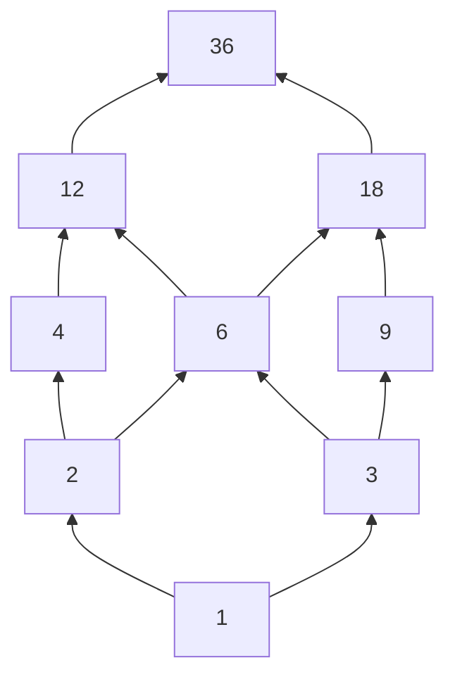

# Solutions for §0.04 Sets, Relations, and Functions

[Back to module](../README.md) | [Exercise set](../exercises/README.md) | [Resources](../resources/README.md)

These are full worked solutions. A correct solution may use different examples or ordering, but it must preserve the same definitions, domains, witnesses, and evidence boundaries.

## E0.04.01 Separate members from subsets

### Key idea

Membership inspects objects directly inside a set. Subset checks every member of one set against another set.

### Reasoning

For

$$
A=\{1,\{1\},\{1,2\},\varnothing\},
\qquad
B=\{1,2\},
$$

we have:

| Statement | Value | Reason |
|---|---:|---|
| $1\in A$ | true | $1$ is directly listed |
| $1\subseteq A$ | not a valid claim here | $1$ is an ordinary number, not a declared set |
| $\{1\}\in A$ | true | the singleton is directly listed |
| $\{1\}\subseteq A$ | true | its only member $1$ lies in $A$ |
| $B\in A$ | true | $B=\{1,2\}$ is directly listed |
| $B\subseteq A$ | false | $2\notin A$ |
| $\varnothing\in A$ | true | the empty set is directly listed |
| $\varnothing\subseteq B$ | true | no member violates containment |

The claim $\{\varnothing\}\subseteq A$ is true because its only member $\varnothing$ lies in $A$. The claim $\{\varnothing\}\in A$ is false because that singleton is not directly listed.

The power set is

$$
\mathcal{P}(B)=\{\varnothing,\{1\},\{2\},\{1,2\}\}.
$$

Thus $1\notin\mathcal{P}(B)$, while $\{1\}\in\mathcal{P}(B)$.

For the equivalence, if $x\in S$, then every member of $\{x\}$, namely $x$, lies in $S$, so $\{x\}\subseteq S$. Conversely, if $\{x\}\subseteq S$, its member $x$ must lie in $S$.

Take $C=\{1\}$. Then $\varnothing\subseteq C$ but $\varnothing\notin C$. Take $D=\{\varnothing\}$. Then $\varnothing\subseteq D$ and $\varnothing\in D$.

### Verification

Every subset classification was checked by listing members of the left set. The power set has $2^2=4$ members, as expected.

### Common wrong turn

Do not count braces visually. Track whether an expression denotes an object, a set containing that object, or a set containing that set.

## E0.04.02 Prove identities by membership

### Key idea

By extensionality, two sets are equal when an arbitrary ambient element belongs to both under exactly the same condition.

### Reasoning

For De Morgan's law,

$$
\begin{aligned}
x\in(A\cap B)^c
&\iff x\notin A\cap B\\\\
&\iff x\notin A\text{ or }x\notin B\\\\
&\iff x\in A^c\cup B^c.
\end{aligned}
$$

For difference over intersection,

$$
\begin{aligned}
x\in A\setminus(B\cap C)
&\iff x\in A\text{ and not }(x\in B\text{ and }x\in C)\\\\
&\iff x\in A\text{ and }(x\notin B\text{ or }x\notin C)\\\\
&\iff (x\in A\text{ and }x\notin B)
       \text{ or }(x\in A\text{ and }x\notin C)\\\\
&\iff x\in(A\setminus B)\cup(A\setminus C).
\end{aligned}
$$

For symmetric difference,

$$
\begin{aligned}
x\in A\mathbin{\triangle}B
&\iff (x\in A\text{ and }x\notin B)
       \text{ or }(x\in B\text{ and }x\notin A)\\\\
&\iff (x\in A\text{ or }x\in B)
       \text{ and not }(x\in A\text{ and }x\in B)\\\\
&\iff x\in(A\cup B)\setminus(A\cap B).
\end{aligned}
$$

For the indexed law,

$$
\begin{aligned}
x\in\left(\bigcup_{i\in I}A_i\right)^c
&\iff x\notin\bigcup_{i\in I}A_i\\\\
&\iff \text{there is no }i\in I\text{ with }x\in A_i\\\\
&\iff \text{for every }i\in I,\ x\notin A_i\\\\
&\iff x\in\bigcap_{i\in I}A_i^c.
\end{aligned}
$$

When $I=\varnothing$, the left side is $\varnothing^c=U$. The right side is the empty indexed intersection, also $U$. The universal condition has no counterexample index.

For the false identity, take $U=\{x\}$, $A=\{x\}$, $B=\{x\}$, and $C=\varnothing$. Then

$$
A\setminus(B\cup C)=\varnothing,
$$

while

$$
(A\setminus B)\cup(A\setminus C)
=\varnothing\cup\{x\}=\{x\}.
$$

### Verification

Each equivalence begins and ends with membership of the same arbitrary $x$. The counterexample evaluates both sides explicitly and gives different sets.

### Common wrong turn

Negating "in $B$ or $C$" produces "not in $B$ and not in $C$." Negating "in both" produces an "or."

## E0.04.03 Build products, power sets, and tagged unions

### Key idea

Products use ordered coordinates, power sets change the member level, and tags force source copies to be disjoint.

### Reasoning

The products are

$$
A\times B=\{(a,b),(a,c),(a,d),(b,b),(b,c),(b,d)\},
$$

$$
B\times A=\{(b,a),(b,b),(c,a),(c,b),(d,a),(d,b)\}.
$$

Both have $2\cdot3=6$ members, but they are not equal. For example, $(a,c)\in A\times B$ and $(a,c)\notin B\times A$.

We have

$$
\mathcal{P}(A)=\{\varnothing,\{a\},\{b\},\{a,b\}\}.
$$

Since $A\times\{0\}=\{(a,0),(b,0)\}$,

$$
\mathcal{P}(A\times\{0\}) =
\{\varnothing,\{(a,0)\},\{(b,0)\},\{(a,0),(b,0)\}\}.
$$

The ordinary union is $A\cup B=\{a,b,c,d\}$. It does not preserve whether the shared payload $b$ came from $A$, $B$, or both.

The tagged union is

$$
A\sqcup B=
\{(a,0),(b,0),(b,1),(c,1),(d,1)\}.
$$

Therefore $|A\cup B|=4$, while $|A\sqcup B|=5=|A|+|B|$.

The length-$2$ sequences in $A$ are

$$
(a,a),(a,b),(b,a),(b,b).
$$

There are four, as there are four subsets of $A$, but these are different sets of objects. Sequences preserve order and allow repetition; subsets do neither.

For finite $X,Y$, the maps $x\mapsto(x,0)$ and $y\mapsto(y,1)$ are injective. Their images are disjoint because tags differ. The tagged union therefore has $|X|+|Y|$ members even if payloads overlap.

### Verification

Every roster has the predicted product or power-set cardinality. The two tagged copies of $b$ are distinct ordered pairs.

### Common wrong turn

Equal cardinality does not imply equal sets. Length-$2$ binary sequences and subsets of a two-element set both number four, but their members have different types.

## E0.04.04 Classify finite relations

### Key idea

A failed property needs one witness. A passed property requires checking every relevant pair or composable pair.

### Reasoning

| Relation | Reflexive | Irreflexive | Symmetric | Antisymmetric | Asymmetric | Transitive |
|---|---:|---:|---:|---:|---:|---:|
| $R_1$ | yes | no | yes | yes | no | yes |
| $R_2$ | no | yes | yes | no | no | no |
| $R_3$ | no | yes | no | yes | yes | yes |
| $R_4$ | yes | no | yes | no | no | yes |
| $R_5$ | no | yes | no | yes | yes | no |

Witnesses include:

- $R_1$ is not irreflexive or asymmetric because $(1,1)\in R_1$.
- $R_2$ is not reflexive because $(1,1)$ is missing. It is not antisymmetric because $(1,2)$ and $(2,1)$ occur with $1\ne2$. It is not transitive because $1R_2 2$ and $2R_2 1$, but $(1,1)$ is missing.
- $R_3$ is not symmetric because $(1,2)$ occurs while $(2,1)$ does not.
- $R_4$ is not antisymmetric because $1$ and $2$ are related both ways. It is transitive because it contains every pair within blocks $\{1,2\}$ and $\{3\}$.
- $R_5$ is not symmetric because $(1,2)$ lacks its reverse. It is not transitive because $(1,2),(2,3)$ occur while $(1,3)$ is missing.

The equivalence relations are $R_1$ and $R_4$. The partial order is $R_1$. Relation $R_3$ is a strict order, not a reflexive partial order under the module convention.

Equality $R_1$ is symmetric because reversing $(a,a)$ changes nothing, and antisymmetric because any two-way equality already has equal endpoints. It is not asymmetric because self-pairs exist.

Relation $R_3$ is asymmetric because every listed forward pair lacks its reverse. Asymmetry implies antisymmetry: no distinct two-way pair exists.

The fewest-pair transitive repair of $R_5$ is

$$
R_5\cup\{(1,3)\}.
$$

To make it reflexive and transitive, add

$$
(1,1),(2,2),(3,3),(1,3).
$$

### Verification

For the repaired relation, every composable chain is closed. Adding only diagonal pairs does not repair the chain $1R2R3$.

### Common wrong turn

Do not infer transitivity from a directional drawing. Search for every length-two path and verify its shortcut pair.

## E0.04.05 Move between equivalence relations and partitions

### Key idea

Congruence preserves remainder classes. In general, equivalence classes overlap only when they are the same class.

### Reasoning

Modulo-$3$ congruence is reflexive because $3\mid(a-a)=0$. It is symmetric because $3\mid(a-b)$ implies $3\mid-(a-b)=b-a$. It is transitive because if $3\mid(a-b)$ and $3\mid(b-c)$, then $3$ divides their sum $a-c$.

The classes within $A$ are

$$
[0]=\{0,3,6\},
\qquad
[1]=\{1,4,7\},
\qquad
[2]=\{2,5\}.
$$

Thus

$$
A/R=\{\{0,3,6\},\{1,4,7\},\{2,5\}\}.
$$

The blocks are nonempty, their union is $A$, and no integer has two distinct remainders modulo $3$, so they are pairwise disjoint.

For the general result, suppose $z\in[a]_R\cap[b]_R$. Then $zRa$ and $zRb$. Symmetry gives $aRz$, and transitivity gives $aRb$. If $y\in[a]_R$, then $yRa$ and $aRb$ imply $yRb$, so $[a]_R\subseteq[b]_R$. By symmetry of the argument, the reverse inclusion holds. Therefore the classes are equal. If no shared $z$ exists, they are disjoint.

Given a partition $\Pi$, each $x$ lies in some block, so $x\sim_\Pi x$. If $x,y$ share a block, then $y,x$ share it, proving symmetry. If $x,y$ share block $C$ and $y,z$ share block $D$, then $y\in C\cap D$. Distinct blocks are disjoint, so $C=D$ and $x,z$ share one block. This proves transitivity.

For the concrete partition, shared block means equal remainder modulo $3$, which is exactly the original relation. Re-forming classes returns the same three blocks.

A hard cluster function assigns each item exactly one label, so equal labels define disjoint fibers covering the dataset. Overlapping community labels can place one item in multiple blocks, violating partition disjointness.

### Verification

The class sizes $3+3+2=8$ account for every member of $A$ exactly once.

### Common wrong turn

Do not put repeated copies of an equivalence class into the quotient. $[0]=[3]=[6]$ is one quotient member.

## E0.04.06 Read a divisibility poset

### Key idea

Divisibility is a partial order, and Hasse edges record covers rather than every comparable pair.

### Reasoning

The positive divisors are

$$
D=\{1,2,3,4,6,9,12,18,36\}.
$$

Divisibility is reflexive because $a=a\cdot1$. If $a\mid b$ and $b\mid a$ for positive integers, then $a=b$, proving antisymmetry. If $a\mid b$ and $b\mid c$, write $b=ak$ and $c=b\ell$ to obtain $c=a(k\ell)$, proving transitivity.

It is not total because $4$ and $6$ are incomparable.

A Hasse diagram is:



One chain is $\{1,2,4,12,36\}$. One antichain is $\{4,6,9\}$.

For all of $D$:

| Kind | Elements |
|---|---|
| least | $1$ |
| minimal | $1$ |
| greatest | $36$ |
| maximal | $36$ |

For $S=\{2,3,4,6,9,12,18\}$:

| Kind | Elements |
|---|---|
| least | none |
| minimal | $2,3$ |
| greatest | none |
| maximal | $12,18$ |

Neither $2$ nor $3$ divides the other, so neither minimal element is least. Neither $12$ nor $18$ divides the other, so neither maximal element is greatest.

A Hasse edge means one dependency immediately precedes another with no selected intermediate task. Transitive edges are omitted from the drawing because upward paths already encode them, but they remain part of the order relation.

### Verification

Every omitted comparable pair has an upward path. In the antichain, none of $4,6,9$ divides another.

### Common wrong turn

Minimal means "nothing strictly below it inside the selected subset," not "numerically smallest."

## E0.04.07 Audit images and preimages

### Key idea

Preimages test one input against a codomain condition, so Boolean operations are exact. Image intersections can combine outputs produced by different inputs.

### Reasoning

For union,

$$
\begin{aligned}
x\in f^{-1}(T_1\cup T_2)
&\iff f(x)\in T_1\cup T_2\\\\
&\iff f(x)\in T_1\text{ or }f(x)\in T_2\\\\
&\iff x\in f^{-1}(T_1)\cup f^{-1}(T_2).
\end{aligned}
$$

Replacing "or" by "and" proves the intersection law.

For relative complement,

$$
\begin{aligned}
x\in f^{-1}(B\setminus T_1)
&\iff f(x)\in B\text{ and }f(x)\notin T_1\\\\
&\iff x\in A\text{ and }x\notin f^{-1}(T_1)\\\\
&\iff x\in A\setminus f^{-1}(T_1).
\end{aligned}
$$

For image union, if $y\in f(S_1\cup S_2)$, some $x\in S_1\cup S_2$ has $f(x)=y$. The witness lies in one source set, so $y$ lies in one image. Conversely, a witness from either source is a witness from the union.

If $y\in f(S_1\cap S_2)$, one witness $x$ lies in both source sets, so $y$ lies in both images. This proves

$$
f(S_1\cap S_2)\subseteq f(S_1)\cap f(S_2).
$$

A minimal counterexample uses two domain elements. Let $A=\{a,b\}$, $B=\{z\}$, $f(a)=f(b)=z$, $S_1=\{a\}$, and $S_2=\{b\}$. Then the source intersection is empty, so its image is empty, but both individual images are $\{z\}$.

If $f$ is injective and $y$ lies in both images, choose $x_1\in S_1$ and $x_2\in S_2$ with $f(x_1)=y=f(x_2)$. Injectivity gives $x_1=x_2$, so one witness lies in both source sets. This proves the reverse inclusion.

For $f(n)=n^2$,

$$
f^{-1}(\{0,1,4\})=\{-2,-1,0,1,2\},
$$

and

$$
f(\{-2,-1,0\})=\{0,1,4\}.
$$

The first $f^{-1}$ accepts a subset of the codomain and returns all inputs mapping into it. It does not assert that $f$ has an inverse function.

### Verification

The counterexample uses the smallest possible domain with a collision. Direct squaring verifies the concrete image and preimage.

### Common wrong turn

For image intersection, the two image memberships may have different witnesses. Treating them as one input silently assumes injectivity.

## E0.04.08 Design and invert functions

### Key idea

Injectivity and surjectivity belong to a declared mapping, not a formula in isolation.

### Reasoning

| Function | Injective | Surjective | Repair or inverse |
|---|---:|---:|---|
| $f:\mathbb{Z}\to\mathbb{Z}$, $n+3$ | yes | yes | $f^{-1}(m)=m-3$ |
| $g:\mathbb{R}\to\mathbb{R}$, $x^2$ | no | no | restrict domain and codomain to $[0,\infty)$ |
| $h:[0,\infty)\to[0,\infty)$, $x^2$ | yes | yes | $h^{-1}(y)=\sqrt y$ |
| $p:\mathbb{Z}\to\{0,1,2\}$ | no | yes | no inverse without choosing representatives or restricting domain |
| $q:\{0,1,2\}\to\mathbb{Z}$, $n^2$ | yes | no | change codomain to $\{0,1,4\}$ |

For $g$, negative real codomain values are missed and $g(x)=g(-x)$. Restricting to $[0,\infty)\to[0,\infty)$ resolves both failures. For $q$ with codomain $\{0,1,4\}$, the inverse sends $0\mapsto0$, $1\mapsto1$, and $4\mapsto2$.

The relation

$$
R=\{(0,a),(1,b),(2,b)\}
$$

is a function graph from $\{0,1,2\}$ to $\{a,b\}$. It is total and surjective but not injective because $1$ and $2$ share output $b$.

Adding $(0,b)$ makes input $0$ have two outputs, so the result is not a function. Removing $(2,b)$ makes a partial function on the same source set because input $2$ has no output.

The inverse relation is

$$
R^{-1}=\{(a,0),(b,1),(b,2)\}.
$$

It is not a function graph from $\{a,b\}$ because input $b$ has two outputs. This reflects failure of injectivity in $R$.

Finally,

$$
h^{-1}(\{1,4\})=\{1,2\}
$$

is a set preimage, while

$$
h^{-1}(4)=2
$$

uses the inverse function. The argument type disambiguates the notation.

### Verification

Composing $n+3$ with $m-3$ gives the appropriate identity on each integer. Composing $x^2$ and $\sqrt{x}$ on nonnegative domains gives both identities.

### Common wrong turn

Changing only the codomain of $x^2$ removes the surjectivity failure but not the collision between $x$ and $-x$.

## E0.04.09 Implement a relation-property checker

### Key idea

Enumerate the finite base set deterministically and return the first concrete witness for each failed universal property.

### Reasoning

One standard-library implementation is:

```python
from itertools import product


def analyze_relation(base_set, relation):
    base = tuple(sorted(base_set))
    relation = set(relation)
    allowed = set(product(base, repeat=2))
    if not relation <= allowed:
        raise ValueError("relation must be a subset of base_set x base_set")

    reflexive_witness = next(
        (value for value in base if (value, value) not in relation), None
    )
    irreflexive_witness = next(
        (value for value in base if (value, value) in relation), None
    )
    symmetric_witness = next(
        (
            (left, right)
            for left, right in sorted(relation)
            if (right, left) not in relation
        ),
        None,
    )
    antisymmetric_witness = next(
        (
            (left, right)
            for left, right in sorted(relation)
            if left != right and (right, left) in relation
        ),
        None,
    )
    asymmetric_witness = next(
        (
            (left, right)
            for left, right in sorted(relation)
            if (right, left) in relation
        ),
        None,
    )
    transitive_witness = next(
        (
            (left, middle, right)
            for left, middle, right in product(base, repeat=3)
            if (left, middle) in relation
            and (middle, right) in relation
            and (left, right) not in relation
        ),
        None,
    )

    return {
        "reflexive": (reflexive_witness is None, reflexive_witness),
        "irreflexive": (irreflexive_witness is None, irreflexive_witness),
        "symmetric": (symmetric_witness is None, symmetric_witness),
        "antisymmetric": (
            antisymmetric_witness is None,
            antisymmetric_witness,
        ),
        "asymmetric": (asymmetric_witness is None, asymmetric_witness),
        "transitive": (transitive_witness is None, transitive_witness),
    }


base = {0, 1, 2, 3}
equality = {(a, b) for a, b in product(base, repeat=2) if a == b}
less_than = {(a, b) for a, b in product(base, repeat=2) if a < b}
less_equal = {(a, b) for a, b in product(base, repeat=2) if a <= b}
same_parity = {
    (a, b) for a, b in product(base, repeat=2) if a % 2 == b % 2
}

assert analyze_relation(base, equality)["symmetric"][0]
assert analyze_relation(base, equality)["antisymmetric"][0]
assert not analyze_relation(base, equality)["asymmetric"][0]
assert analyze_relation(base, less_than)["asymmetric"][0]
assert analyze_relation(base, less_than)["transitive"][0]
assert analyze_relation(base, less_equal)["antisymmetric"][0]
assert not analyze_relation(base, less_equal)["asymmetric"][0]
assert analyze_relation(base, same_parity)["symmetric"][0]
assert not analyze_relation(base, same_parity)["antisymmetric"][0]

broken = {(0, 1), (1, 2)}
result = analyze_relation(base, broken)
assert result["transitive"] == (False, (0, 1, 2))

try:
    analyze_relation(base, {(0, 4)})
    raise AssertionError("expected ValueError")
except ValueError:
    pass
```

Three additional hand-built relations can include the empty relation, the universal relation, and the broken chain above. On a nonempty base, the empty relation is irreflexive, symmetric, antisymmetric, asymmetric, and transitive, but not reflexive. The universal relation is reflexive, symmetric, and transitive, but not antisymmetric or asymmetric when the base has distinct members.

A prediction table should be written before execution. Any mismatch should be resolved with the returned witness and a hand check.

### Verification

The loops cover every base element, related pair, and base triple. Therefore the result proves each property for the exact finite relation supplied.

### Common wrong turn

Passing tests on finite restrictions of $<$ or congruence does not prove the corresponding property over all integers. The general theorem needs symbolic reasoning.

## E0.04.10 Enumerate rationals without duplicates

### Key idea

Enumerate finite height diagonals and emit only the unique reduced pair with positive denominator for each rational.

### Reasoning

Raw pairs repeat values because scaling numerator and denominator by the same nonzero integer preserves a ratio. Each height is finite because $q$ ranges from $1$ through the height and then $|p|$ is fixed.

Choose positive numerator before negative numerator within each height. One implementation is:

```python
from fractions import Fraction
from math import gcd


def raw_pairs(maximum_height):
    pairs = []
    for height in range(1, maximum_height + 1):
        for denominator in range(1, height + 1):
            absolute_numerator = height - denominator
            numerators = (
                [0]
                if absolute_numerator == 0
                else [absolute_numerator, -absolute_numerator]
            )
            for numerator in numerators:
                pairs.append((numerator, denominator))
    return pairs


def reduced_pairs(maximum_height):
    return [
        (numerator, denominator)
        for numerator, denominator in raw_pairs(maximum_height)
        if gcd(abs(numerator), denominator) == 1
    ]


previous = set()
for height in (4, 8, 16, 32):
    raw = raw_pairs(height)
    reduced = reduced_pairs(height)
    raw_values = [Fraction(p, q) for p, q in raw]
    reduced_values = [Fraction(p, q) for p, q in reduced]

    assert len(reduced_values) == len(set(reduced_values))
    assert all(value.denominator > 0 for value in reduced_values)
    assert previous <= set(reduced_values)
    previous = set(reduced_values)

    print(
        height,
        len(raw),
        len(set(raw_values)),
        len(reduced_values),
        len(raw) - len(set(raw_values)),
    )

for numerator, denominator in raw_pairs(16):
    value = Fraction(numerator, denominator)
    canonical_height = abs(value.numerator) + value.denominator
    canonical_values = {
        Fraction(p, q) for p, q in reduced_pairs(canonical_height)
    }
    assert value in canonical_values
```

The exact count table is produced by execution. Its invariant is more important than memorizing the counts: the distinct raw `Fraction` count equals the reduced output count at each height.

Every rational $r$ has a unique reduced representation $p/q$ with $q>0$. The finite number $|p|+q$ is its canonical height, so the process emits $r$ by that stage. The gcd condition and positive denominator prevent any other pair from emitting the same value. Hence every rational appears exactly once.

A finite run checks only bounded heights. The proof establishes the infinite coverage and uniqueness.

Relying on a set of `Fraction` objects removes duplicates computationally, but filtering by gcd displays the mathematical canonical-form argument and makes the enumeration itself one-to-one.

### Verification

`Fraction` independently normalizes each raw pair. The assertions compare canonical coverage, uniqueness, denominator sign, and nesting across heights.

### Common wrong turn

Enumerating all numerator-denominator pairs proves at most a surjection onto the rationals. Calling it a bijective enumeration without filtering ignores aliases.

## E0.04.11 Diagonalize a proposed enumeration

### Key idea

Construct an object whose $n$th coordinate deliberately disagrees with the $n$th listed object.

### Reasoning

Given a proposed list $s_0,s_1,\ldots$, define

$$
t(n)=1-s_n(n).
$$

If $t=s_k$, then at coordinate $k$ we would have

$$
t(k)=s_k(k)
$$

and, by definition,

$$
t(k)=1-s_k(k),
$$

which is impossible for a binary value. Therefore $t$ is not any row.

Changing one fixed coordinate would distinguish the construction only from rows having the opposite value there. Many other rows could match the modified sequence. The diagonal uses a different guaranteed disagreement for every row.

Map each $S\subseteq\mathbb{N}$ to its indicator sequence $\chi_S$. Map each binary sequence $s$ back to $\{n:s(n)=1\}$. These maps compose to the appropriate identities, so they form a bijection.

For arbitrary $f:A\to\mathcal{P}(A)$, let

$$
D=\{a\in A:a\notin f(a)\}.
$$

If $D=f(d)$ for some $d$, then

$$
d\in D\iff d\notin f(d)\iff d\notin D,
$$

an impossibility. Thus $D$ is not in the range and $f$ is not surjective.

The singleton map $a\mapsto\{a\}$ is injective from $A$ into $\mathcal{P}(A)$. Combined with the absence of any surjection from $A$ onto its power set, this states

$$
|A|<|\mathcal{P}(A)|.
$$

Ordinary binary expansions are not unique at dyadic rationals. For example,

$$
0.1000\ldots_2=0.0111\ldots_2=\frac12.
$$

For the ternary map

$$
\Phi(s)=\sum_{n=0}^{\infty}\frac{2s(n)}{3^{n+1}},
$$

suppose $s,t$ first differ at $k$. Their leading encoded difference has magnitude $2/3^{k+1}$. The greatest possible opposing tail is

$$
\sum_{n=k+1}^{\infty}\frac{2}{3^{n+1}}
=\frac{1}{3^{k+1}}.
$$

The leading gap is larger than the tail, so $\Phi(s)\ne\Phi(t)$. Therefore $\Phi$ injects an uncountable set into $[0,1]$, making $[0,1]$ and $\mathbb{R}$ uncountable. The map is not claimed to cover every real in the interval.

A finite illustration is:

```python
rows = [
    (0, 0, 1, 1, 0, 1),
    (1, 0, 1, 0, 1, 0),
    (1, 1, 0, 0, 0, 1),
    (0, 1, 0, 1, 1, 1),
    (1, 0, 0, 1, 0, 0),
    (0, 1, 1, 0, 1, 1),
]
missing_prefix = tuple(1 - rows[index][index] for index in range(6))
assert all(
    missing_prefix[index] != rows[index][index] for index in range(6)
)
```

### Verification

The symbolic contradiction addresses arbitrary row $k$. The ternary tail is a geometric series with ratio $1/3$. The finite code checks only six rows and is therefore an illustration, not the theorem.

### Common wrong turn

Do not say the new sequence differs from every row in every coordinate. It is guaranteed to differ from row $n$ at coordinate $n$, which is exactly enough.

## E0.04.12 Audit Russell's paradox and its sources

### Key idea

The paradox targets unrestricted comprehension. Historical priority, mathematical diagnosis, and programming-container behavior require different evidence.

### Reasoning

A diagnosis table can include:

| Claim | Diagnosis | Repair | Evidence |
|---|---|---|---|
| Russell discovered all set paradoxes | false priority claim | related antinomies and anticipations involved Cantor, Burali-Forti, Zermelo, and others | SEP Russell entry |
| the date is simply 1901 | broadly right but overprecise | Russell reported differing months; discovery was around spring 1901 | SEP Russell entry |
| he proved sets do not exist | false conclusion | he exposed inconsistency in unrestricted comprehension | paradox derivation |
| bounded set-builder notation is inconsistent | confuses two principles | selecting from an existing set is bounded separation | SEP and Open Logic |
| every condition forms a set | unrestricted assumption | modern systems restrict set formation | SEP set theory |
| Zermelo declared $R$ empty | false | separation requires an existing bounding set and blocks a universal set | SEP Russell entry |
| Zermelo fixed everything | historical and mathematical overstatement | axiomatization was one influential response with later development | SEP set theory |
| ZF is the only foundation | false exclusivity | type theories, set-class theories, and alternatives also respond | SEP Russell entry |
| Cantor diagonalization is unrelated | false | both construct an object by disagreement along membership diagonals | SEP Russell entry and derivation |
| diagonalization concerns only decimals | false | it applies to sets, functions, and binary sequences | Cantor proof |
| real expansions are always unique | false | some binary and decimal expansions have dual forms | explicit counterexample |
| Python set restrictions implement ZF | category error | hashability is a container API rule | Python docs |
| Python cannot model the argument | false | finite encodings can illustrate self-reference and diagonal patterns | implementation distinction |
| rejecting mutable set members ensures consistency | false | it protects stable hashing, not foundations | Python docs |

For unrestricted $R=\{x:x\notin x\}$:

- If $R\in R$, then the defining property says $R\notin R$.
- If $R\notin R$, then $R$ satisfies the defining property, so $R\in R$.

For bounded

$$
R_U=\{x\in U:x\notin x\},
$$

assuming $R_U\in U$ would again force $R_U\in R_U$ exactly when $R_U\notin R_U$. Therefore $R_U\notin U$. The conclusion is that each bounding set omits its diagonal subset, not that one unrestricted universal set exists.

Cantor's $D=\{a\in A:a\notin f(a)\}$ similarly disagrees with $f(a)$ at member $a$. Russell's pattern results when the diagonal construction is applied to a supposed all-inclusive setting closely tied to identity. They are related patterns but support different immediate conclusions.

The 2026 SEP Russell entry discusses Russell's type approaches, Zermelo-style bounded separation, set-class approaches associated with von Neumann and later systems, Quinean stratification, and nonclassical proposals. Listing several does not assert they are equivalent or equally standard.

Python `set` stores distinct hashable objects; mutable sets are unhashable, while `frozenset` is immutable and hashable. These are engineering choices about equality and stable hashing. They neither state axioms of mathematical set existence nor establish consistency.

A corrected paragraph is:

> Russell identified his paradox around 1901 during a period when several related antinomies and anticipations were also being studied. The contradiction targets unrestricted comprehension, the assumption that every condition determines a set. It does not invalidate bounded notation such as $\{x\in U:P(x)\}$, which selects from an existing set. Zermelo-style separation is one response; Russell's type theories, set-class systems, and other foundations take different approaches. Cantor's diagonal argument is closely related in form: it constructs a subset that disagrees with every proposed image at a corresponding member. Diagonalization can use sets or binary sequences and does not depend on decimal notation. When real expansions are used, dual representations must be handled. Python's `set` and `frozenset` implement finite container APIs governed by hashability. Their restrictions support reliable computation but do not constitute ZF or any other axiomatic foundation.

A source ledger should connect each URL to a specific claim:

| URL | Supported claim |
|---|---|
| `https://plato.stanford.edu/entries/russell-paradox/` | history, unrestricted comprehension, diagonal connection, multiple responses |
| `https://plato.stanford.edu/entries/set-theory/` | Cantor origins, extensionality, separation, ZF and alternatives |
| `https://builds.openlogicproject.org/` | open sections on Russell, separation, relations, and size |
| `https://docs.python.org/3/library/stdtypes.html#set-types-set-frozenset` | hashability, `set`, and `frozenset` behavior |

### Verification

Every historical statement is narrower than the inspected source. Every mathematical correction follows from a definition or explicit counterexample. The software claims use official documentation.

### Common wrong turn

Do not cite one general source at the end of a paragraph containing history, formal mathematics, and API behavior. Record which source supports which claim.

## Solution-set check

All exercise IDs and titles mirror the [exercise index](../exercises/README.md):

- E0.04.01 Separate members from subsets
- E0.04.02 Prove identities by membership
- E0.04.03 Build products, power sets, and tagged unions
- E0.04.04 Classify finite relations
- E0.04.05 Move between equivalence relations and partitions
- E0.04.06 Read a divisibility poset
- E0.04.07 Audit images and preimages
- E0.04.08 Design and invert functions
- E0.04.09 Implement a relation-property checker
- E0.04.10 Enumerate rationals without duplicates
- E0.04.11 Diagonalize a proposed enumeration
- E0.04.12 Audit Russell's paradox and its sources

[Back to module](../README.md) | [Exercise set](../exercises/README.md)
