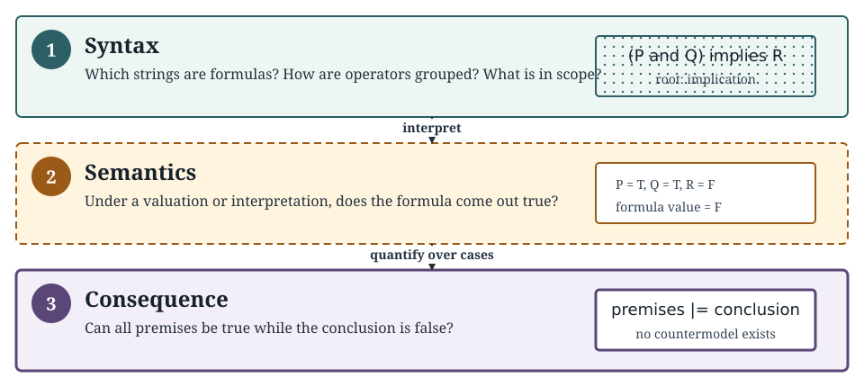
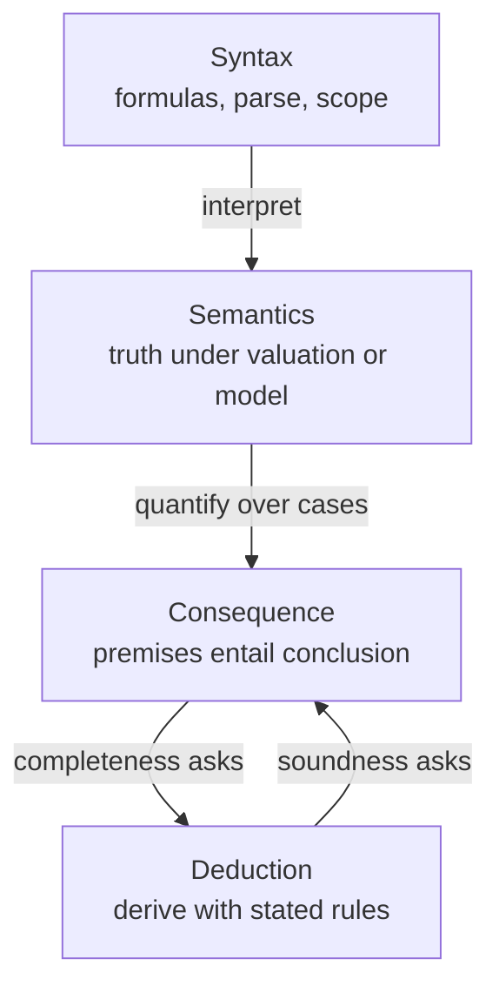
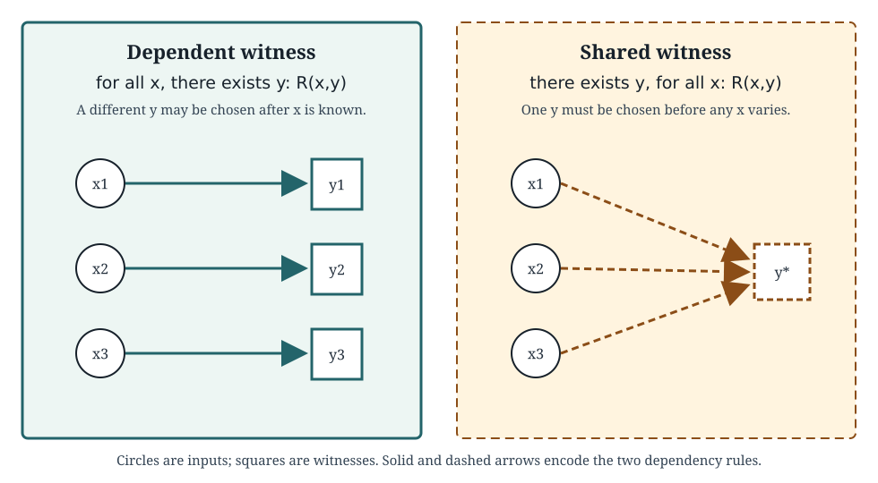
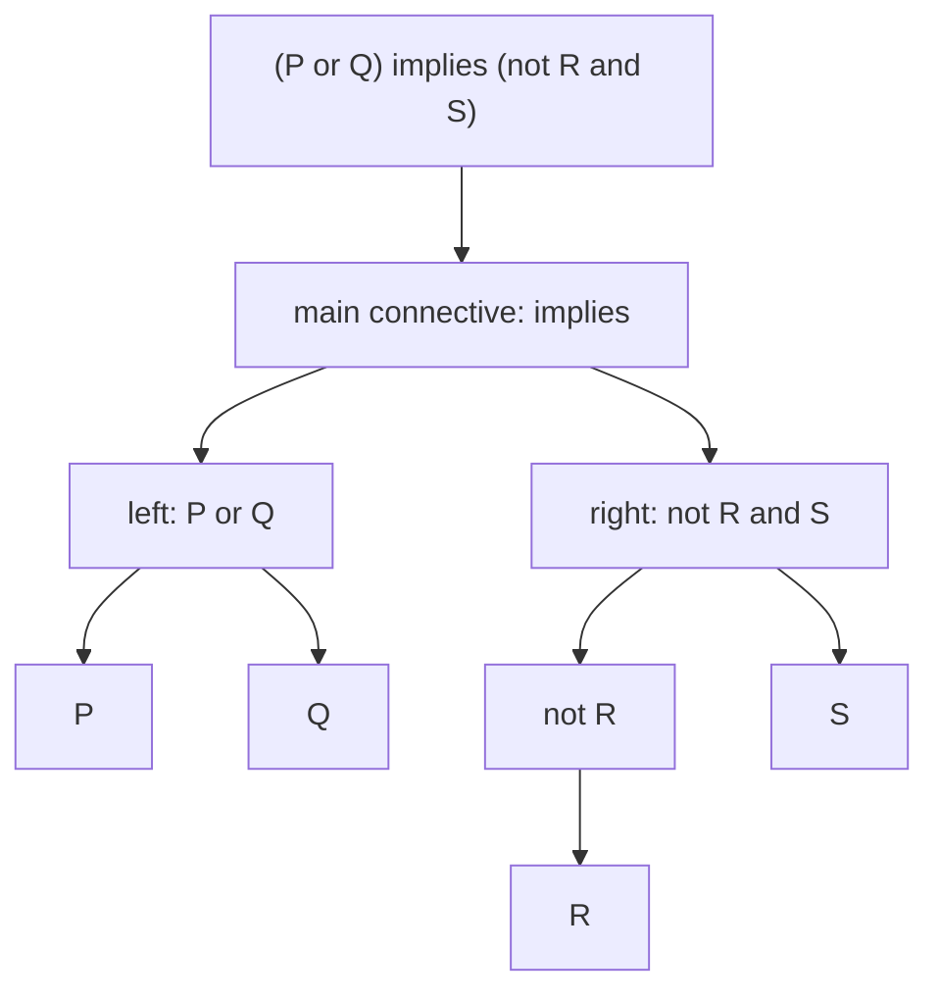
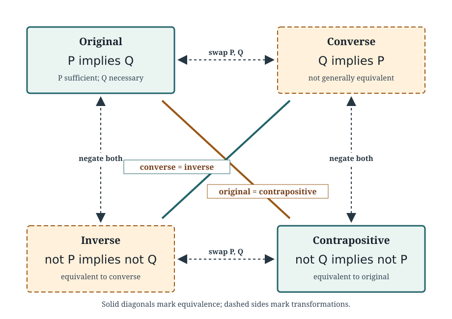
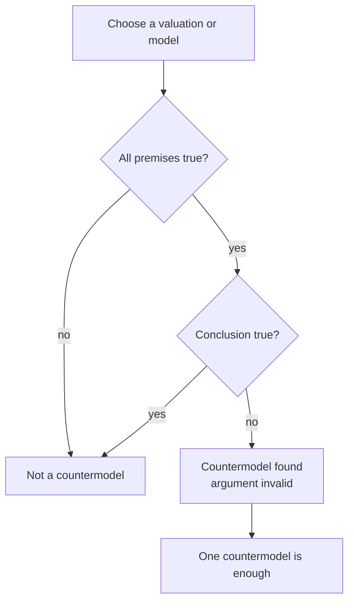
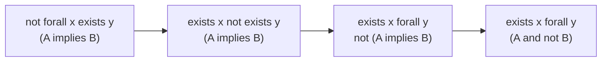

# 0.05 Logic and Quantifiers

[Section home](../README.md) | Previous: [§0.04 Sets, Relations, and Functions](../00.04-sets-relations-functions/README.md) | [Project guides](../../CONTRIBUTING.md#module-file-structure) | [Notation guide](../../NOTATION.md)

Parse and evaluate classical formulas, translate and negate quantified statements, and test consequence with countermodels. Keep truth, validity, ordinary argument soundness, and deductive-system soundness distinct while tracking domains, scope, and witness dependencies.

Start with [§0.01 Mathematical Notation](../00.01-mathematical-notation/README.md) and [§0.04 Sets, Relations, and Functions](../00.04-sets-relations-functions/README.md). Continue to §0.06 for proof techniques; it is recommended after this module, not required before it.

## In this module

- [Syntax, semantics, and consequence](#syntax-semantics-and-consequence)
- [Formulas, interpretations, and witnesses](#formulas-interpretations-and-witnesses)
- [Propositional syntax and truth](#propositional-syntax-and-truth)
- [Validity, inference, and soundness](#validity-inference-and-soundness)
- [First-order language and quantifiers](#first-order-language-and-quantifiers)
- [Deriving equivalences and normal forms](#deriving-equivalences-and-normal-forms)
- [Implementation](#implementation)
- [Formula and finite-model experiments](#formula-and-finite-model-experiments)
- [Worked examples](#worked-examples)
- [Common mistakes](#common-mistakes)
- [Practice](#practice)
- [Where this leads](#where-this-leads)
- [References](#references)

**Topic shortcuts:** [Normal forms](#literals-clauses-terms-cnf-and-dnf) · [Argument soundness](#arguments-and-semantic-validity) · [Quantifier order](#quantifier-order) · [Negation](#negating-quantified-statements-mechanically) · [System soundness](#semantic-truth-satisfiability-validity-and-consequence)

## Syntax, semantics, and consequence

Logic lets us separate three questions that ordinary language often mixes together:

1. **Syntax:** Is this a well-formed formula, and how is it parsed?
2. **Semantics:** Under a valuation or interpretation, is the formula true?
3. **Consequence:** Is it possible for all the premises to be true while the conclusion is false?



> **Figure 1. Syntax, semantics, and consequence answer different questions.** A formula receives truth only after a valuation or interpretation is supplied; an argument is valid only when every premise-satisfying case also satisfies its conclusion. Original figure.

This separation prevents several common errors. A true conclusion does not make an argument valid. A valid argument may have false premises. A satisfiable formula need not be a tautology. A proof rule can look plausible while failing to preserve truth.



> **Figure 2. The module's three layers and the proof-system preview.** Syntax builds expressions, semantics evaluates them, and consequence compares all relevant evaluations. Soundness and completeness connect derivability to semantic consequence, but their proofs belong later. Original diagram.

This structure matters in computing. Boolean conditions control tests and programs. SAT, constraint satisfaction, and model checking search for assignments or states satisfying formulas. Database queries express universal and existential conditions. Specifications and invariants say what every permitted execution must preserve. Rule systems and verification tools distinguish facts from consequences. Quantifier order appears in robust optimization, minimax reasoning, privacy requirements, and fairness specifications.

None of that means neural networks perform classical deduction. A learned model may approximate patterns that resemble reasoning, call a symbolic tool, or be trained on proofs. Those facts do not identify its internal computation with the formal consequence relation taught here.

The Stanford Encyclopedia of Philosophy's 2026 revision presents classical logic through formal language, deduction, model-theoretic semantics, and metatheory, then explicitly discusses alternatives [1]. We use the same separation at an introductory scale.

## Prerequisite check

Try these before starting:

1. Can you distinguish $`x\in A`$ from $`A\subseteq B`$?
2. Can you read $`f:A\to B`$ and $`R\subseteq A\times B`$?
3. Can you explain what an arbitrary element and a counterexample are?
4. Can you enumerate all pairs in $`\lbrace 0,1\rbrace\times\lbrace 0,1\rbrace`$?
5. Can you distinguish a function rule from the values it takes on a chosen domain?

Review §0.01 for notation and §0.04 for sets, relations, functions, and Cartesian products. §0.06 is recommended after this module, not required before it.

## Historical context

Modern classical logic was assembled through many developments rather than invented in one step. Nineteenth-century work by Boole, Frege, Peirce, and others helped turn patterns of reasoning into formal objects. Twentieth-century proof theory and model theory then made syntax, derivation, interpretation, validity, soundness, and completeness mathematically precise. The SEP treatment is a careful guide to these distinctions and to the fact that classical first-order logic is influential without being the only logic studied [1].

The practical lesson is not a priority story. Formal languages remove structural ambiguity, model-theoretic semantics says when formulas are satisfied, and deductive systems specify permitted inference steps. Keeping those jobs separate is what lets us ask whether a proof system is sound or complete.

*Mathematics in Lean* shows another useful perspective: implication and quantifiers are not punctuation around mathematics but structures that determine what evidence a proof must supply. Its logic chapter develops implication, universal and existential quantification, negation, conjunction, biconditionals, and disjunction in executable formal proofs [2].

## Formulas, interpretations, and witnesses

### Propositions and predicates are different kinds of expression

A **proposition** is a declarative claim with a truth value in the intended context:

- $`P`$: "The test passed."
- $`Q`$: "$`7`$ is prime."

A **predicate** expresses a property or relation with open places:

- $`E(x)`$: "$`x`$ is even."
- $`L(x,y)`$: "$`x`$ is less than $`y`$."

The open formula $`E(x)`$ does not have a standalone truth value until an assignment supplies a value for $`x`$, or a quantifier binds $`x`$. By contrast, $`E(4)`$ and $`\forall x\,E(x)`$ are sentences whose truth can be evaluated under an interpretation.

An **atomic formula** has no logical connective as a proper part. Propositional letters such as $`P`$ and predicate applications such as $`E(x)`$ are atomic. Compound formulas are built from atoms with connectives and quantifiers.

### Form, truth, and consequence

Consider:

1. Every cached item is fresh.
2. Record $`r`$ is cached.
3. Therefore record $`r`$ is fresh.

Its form is

$$
\forall x\,(C(x)\implies F(x)),
\qquad
C(r),
\qquad
\therefore F(r).
$$

The argument is valid: no interpretation makes both premises true and the conclusion false. Whether the premises are actually true of a deployed cache is a separate factual question. If they are, the ordinary argument is **sound**. If the cache policy is false, the argument remains valid but is not sound in that ordinary sense.

### A counterexample defeats a universal claim

A universal statement promises that every relevant object works. One violating object is enough to refute it. An existential statement promises at least one witness. To establish it, one suitable object is enough.

This asymmetry drives both proof and testing:

| Claim | To support it | To refute it |
|---|---|---|
| $`\forall x\,P(x)`$ | show $`P`$ for arbitrary $`x`$ | find $`a`$ with $`\neg P(a)`$ |
| $`\exists x\,P(x)`$ | exhibit $`a`$ with $`P(a)`$ | show $`\neg P`$ for every $`x`$ |
| $`\Gamma\models\varphi`$ | rule out every countermodel | find one countermodel |

### Quantifier order controls witness dependency

Compare:

$$
\forall x\,\exists y\,R(x,y)
$$

with

$$
\exists y\,\forall x\,R(x,y).
$$

In the first, $`y`$ may depend on $`x`$. In the second, one fixed $`y`$ must work for every $`x`$.



> **Figure 3. Quantifier order changes who may depend on whom.** The left panel permits a different witness for each input. The right panel demands one shared witness. Arrow pattern and labels carry the distinction without relying on color. Original figure.

This is the logical core of many specifications. "Every request has some authorized handler" is weaker than "one handler is authorized for every request." In robust optimization, "$`\forall`$ perturbation, $`\exists`$ response" permits adaptation; "$`\exists`$ response, $`\forall`$ perturbation" demands one robust choice.

## Propositional syntax and truth

### Local notation

| Symbol | Reading | Layer |
|---|---|---|
| $`\neg P`$ | not $`P`$ | syntax, then semantics |
| $`P\land Q`$ | $`P`$ and $`Q`$ | syntax, then semantics |
| $`P\lor Q`$ | inclusive $`P`$ or $`Q`$ | syntax, then semantics |
| $`P\oplus Q`$ | exactly one of $`P,Q`$ | syntax, then semantics |
| $`P\implies Q`$ | if $`P`$, then $`Q`$ | syntax, then semantics |
| $`P\iff Q`$ | $`P`$ if and only if $`Q`$ | syntax, then semantics |
| $`v\models\varphi`$ | valuation $`v`$ satisfies $`\varphi`$ | semantics |
| $`\mathcal{M},s\models\varphi`$ | model $`\mathcal{M}`$ under assignment $`s`$ satisfies $`\varphi`$ | semantics |
| $`\Gamma\models\varphi`$ | $`\varphi`$ is a semantic consequence of $`\Gamma`$ | consequence |
| $`\Gamma\vdash_D\varphi`$ | $`\varphi`$ is derivable from $`\Gamma`$ in system $`D`$ | deduction |
| $`\forall x`$ | for every $`x`$ | quantification |
| $`\exists x`$ | there exists an $`x`$ | quantification |
| $`\exists!x`$ | there exists exactly one $`x`$ | abbreviation |

The turnstile $`\vdash`$ always names a deductive system, at least implicitly. The double turnstile $`\models`$ is semantic. Do not swap them merely because a sound and complete proof system later connects them.

### Parsing, scope, and precedence

A well-formed formula has a unique parse once the grammar and abbreviation rules are fixed. Fully parenthesized notation makes structure explicit:

$$
(P\land Q)\implies R
$$

is not the same formula as

$$
P\land(Q\implies R).
$$

A common local precedence convention is:

1. $`\neg`$ and quantifiers bind most tightly;
2. $`\land`$;
3. $`\lor`$ and $`\oplus`$;
4. $`\implies`$;
5. $`\iff`$.

Conventions differ, especially for XOR and chains of implication. Parenthesize whenever the grouping carries real work. This module treats $`P\implies Q\implies R`$ as unsafe shorthand rather than silently choosing an association.



> **Figure 4. A parse tree identifies the main connective and each operator's scope.** The root operation is evaluated after its subformulas. Original diagram.

The **scope** of an operator is the subformula it governs. In

$$
\forall x\,(A(x)\implies\exists y\,R(x,y)),
$$

$`\forall x`$ governs the whole parenthesized formula, while $`\exists y`$ governs only $`R(x,y)`$.

### Classical truth values and connectives

A **valuation** $`v`$ assigns each propositional atom either true ($`T`$) or false ($`F`$). The valuation extends recursively to compound formulas.

Negation reverses truth:

| $`P`$ | $`\neg P`$ |
|---:|---:|
| T | F |
| F | T |

The binary connectives are exact functions of two truth values:

| $`P`$ | $`Q`$ | $`P\land Q`$ | $`P\lor Q`$ | $`P\oplus Q`$ | $`P\implies Q`$ | $`P\iff Q`$ |
|---:|---:|---:|---:|---:|---:|---:|
| T | T | T | T | F | T | T |
| T | F | F | T | T | F | F |
| F | T | F | T | T | T | F |
| F | F | F | F | F | T | T |

Here $`\lor`$ is **inclusive disjunction**: it is true when one or both inputs are true. XOR, written $`\oplus`$, is true when exactly one input is true.

### Material implication

In $`P\implies Q`$:

- $`P`$ is the **antecedent** or hypothesis;
- $`Q`$ is the **consequent** or conclusion.

Material implication is false in exactly one case: $`P`$ true and $`Q`$ false. Equivalently,

$$
P\implies Q
\equiv
\neg P\lor Q.
$$

When $`P`$ is false, the implication is true regardless of $`Q`$. This is **vacuous truth**. It does not establish $`Q`$ and does not claim a causal connection.

For a declared domain $`D`$,

$$
\forall x\in D\,(A(x)\implies B(x))
$$

says there is no $`A`$ in $`D`$ that fails to be a $`B`$. If no object in $`D`$ is an $`A`$, the statement is true.

### Necessary and sufficient conditions

$`P\implies Q`$ says:

- $`P`$ is **sufficient** for $`Q`$;
- $`Q`$ is **necessary** for $`P`$;
- "$`P`$ only if $`Q`$";
- "$`Q`$ if $`P`$."

The phrase "$`P`$ if $`Q`$" reverses the order:

$$
Q\implies P.
$$

"$`P`$ if and only if $`Q`$" means both directions:

$$
P\iff Q
\equiv
(P\implies Q)\land(Q\implies P).
$$

### Converse, inverse, and contrapositive

Starting from $`P\implies Q`$:

| Name | Formula | Equivalent to original? |
|---|---|---:|
| original | $`P\implies Q`$ | yes |
| converse | $`Q\implies P`$ | not generally |
| inverse | $`\neg P\implies\neg Q`$ | not generally |
| contrapositive | $`\neg Q\implies\neg P`$ | yes |



> **Figure 5. Contraposition crosses the implication square.** Opposite corners are equivalent; horizontal reflection forms the converse, and vertical negation forms the inverse. Line style and labels encode each relation. Original figure.

The converse and inverse are equivalent to each other, but neither is generally equivalent to the original. The contrapositive is always equivalent to the original in classical logic.

### Equivalence and semantic classification

Formulas $`\varphi`$ and $`\psi`$ are **logically equivalent**, written

$$
\varphi\equiv\psi,
$$

when every valuation gives them the same truth value. Equivalently, $`\varphi\iff\psi`$ is a tautology.

A propositional formula is:

- a **tautology** if true under every valuation;
- a **contradiction** or **unsatisfiable** if false under every valuation;
- **contingent** if true under some valuations and false under others;
- **satisfiable** if true under at least one valuation.

Every tautology is satisfiable. A satisfiable formula need not be a tautology.

A set of formulas $`\Gamma`$ is satisfiable when **one shared valuation** makes every formula in $`\Gamma`$ true. It is not enough for each formula to be satisfiable under a different valuation. For example,

$$
\lbrace P,\neg P\rbrace
$$

contains two individually satisfiable formulas but is jointly unsatisfiable.

### Core logical equivalences

The following equivalences are classical:

$$
\neg\neg P\equiv P,
$$

$$
\neg(P\land Q)\equiv\neg P\lor\neg Q,
$$

$$
\neg(P\lor Q)\equiv\neg P\land\neg Q,
$$

$$
P\implies Q\equiv\neg P\lor Q,
$$

$$
P\iff Q
\equiv
(P\implies Q)\land(Q\implies P),
$$

$$
P\iff Q
\equiv
(P\land Q)\lor(\neg P\land\neg Q).
$$

The negation of an implication deserves its own line:

$$
\neg(P\implies Q)
\equiv
\neg(\neg P\lor Q)
\equiv
P\land\neg Q.
$$

It says the promised sufficient condition occurred and the necessary result failed.

### Literals, clauses, terms, CNF, and DNF

A **literal** is an atom or its negation. A **clause** is a disjunction of literals. A **term** is a conjunction of literals.

A formula is in **conjunctive normal form** (CNF) when it is a conjunction of clauses:

$$
(P\lor\neg Q)\land(R\lor S\lor\neg T).
$$

A formula is in **disjunctive normal form** (DNF) when it is a disjunction of terms:

$$
(P\land Q)\lor(\neg P\land R).
$$

For a finite propositional formula, truth tables give canonical constructions:

- For each true row, form a term that selects exactly that row. OR the terms to get DNF.
- For each false row, form a clause that excludes exactly that row. AND the clauses to get CNF.

For a row where $`P=T,Q=F`$, the selecting DNF term is $`P\land\neg Q`$. The excluding CNF clause is $`\neg P\lor Q`$.

These canonical forms can be much larger than the original formula. Practical SAT systems exploit structure rather than blindly expanding every formula. Their algorithms are beyond this module.

## Validity, inference, and soundness

### Arguments and semantic validity

Let $`\Gamma`$ be a set of premises and $`\varphi`$ a conclusion. We write

$$
\Gamma\models\varphi
$$

when every valuation or model satisfying all premises also satisfies the conclusion. Equivalently, there is no **countermodel** in which every premise is true and the conclusion is false.



> **Figure 6. Semantic validity is a countermodel search.** Cases with a false premise do not challenge validity; the decisive case makes all premises true and the conclusion false. Original diagram.

For finite propositional arguments,

$$
\Gamma\models\varphi
$$

exactly when

$$
\left(\bigwedge_{\gamma\in\Gamma}\gamma\right)\implies\varphi
$$

is a tautology, or equivalently when

$$
\Gamma\cup\lbrace \neg\varphi\rbrace
$$

is unsatisfiable.

Validity is independent of the premises' actual truth. Compare:

- **true statement:** true in a selected intended interpretation;
- **valid formula:** true in every interpretation of the relevant kind;
- **valid argument:** no model makes premises true and conclusion false;
- **sound ordinary argument:** valid, with premises actually true in the intended setting;
- **sound deductive system:** every derivable consequence is semantically valid.

The last two uses of "sound" concern different objects. Do not infer that an argument with true premises is valid, or that a valid argument has true premises.

### Propositional inference rules and fallacies

These valid patterns preserve truth:

| Rule | Premises | Conclusion |
|---|---|---|
| modus ponens | $`P\implies Q`$, $`P`$ | $`Q`$ |
| modus tollens | $`P\implies Q`$, $`\neg Q`$ | $`\neg P`$ |
| hypothetical syllogism | $`P\implies Q`$, $`Q\implies R`$ | $`P\implies R`$ |
| disjunctive syllogism | $`P\lor Q`$, $`\neg P`$ | $`Q`$ |

Two tempting patterns are invalid:

| Fallacy | Premises | Invalid conclusion |
|---|---|---|
| affirming the consequent | $`P\implies Q`$, $`Q`$ | $`P`$ |
| denying the antecedent | $`P\implies Q`$, $`\neg P`$ | $`\neg Q`$ |

Each fallacy confuses an implication with its converse or inverse.

## First-order language and quantifiers

### First-order language

Propositional logic treats each atom as indivisible. First-order logic exposes objects, properties, and relations.

A basic first-order language contains:

- variables such as $`x,y,z`$;
- constants naming objects, when needed;
- predicate symbols such as $`A(x)`$ and $`R(x,y)`$;
- equality, when included;
- connectives and quantifiers;
- function symbols and complex terms in fuller languages, though we use them only when an example needs them.

An **interpretation** $`\mathcal{M}`$ supplies:

1. a nonempty domain $`D`$;
2. an object in $`D`$ for each constant;
3. a subset of $`D^n`$ for each $`n`$-place predicate;
4. a function $`D^n\to D`$ for each $`n`$-place function symbol.

A variable assignment $`s`$ maps free variables to domain objects. An atomic formula $`R(t_1,\ldots,t_n)`$ is true when the denoted tuple belongs to the relation assigned to $`R`$.

The standard first-order convention used here requires a **nonempty domain**. If empty domains were allowed, every universal sentence would be vacuously true and every existential sentence false there. Some systems study empty domains explicitly, but that is not our convention.

The Open Logic Project build index exposes separate current components for propositional syntax and semantics, first-order formulas, assignments, satisfaction, semantic notions, proof systems, soundness, and completeness [3]. Its component PDFs are available, but this module makes no page-specific claim from an unextracted PDF.

### Free and bound variables

In

$$
P(x)\land\exists y\,R(x,y),
$$

$`x`$ is free and $`y`$ is bound. The formula is open because $`x`$ remains free.

In

$$
\forall x\,(P(x)\land\exists y\,R(x,y)),
$$

both variables are bound, so the formula is a **sentence**.

A sentence has truth in an interpretation independently of an external variable assignment. An open formula generally needs an assignment before it has a truth value.

Avoid variable shadowing such as

$$
\forall x\,(P(x)\lor\exists x\,Q(x)).
$$

The inner $`\exists x`$ binds a new occurrence unrelated to the outer one. Rename it:

$$
\forall x\,(P(x)\lor\exists y\,Q(y)).
$$

### Restricted English translation

Suppose the domain is all objects, with predicates $`A(x)`$ and $`B(x)`$.

| English | Formula |
|---|---|
| all $`A`$ are $`B`$ | $`\forall x\,(A(x)\implies B(x))`$ |
| some $`A`$ are $`B`$ | $`\exists x\,(A(x)\land B(x))`$ |
| no $`A`$ are $`B`$ | $`\forall x\,(A(x)\implies\neg B(x))`$ |
| no $`A`$ are $`B`$ | $`\neg\exists x\,(A(x)\land B(x))`$ |
| some $`A`$ are not $`B`$ | $`\exists x\,(A(x)\land\neg B(x))`$ |

Universal restriction uses implication. Existential restriction uses conjunction.

The incorrect translation

$$
\forall x\,(A(x)\land B(x))
$$

says every object in the entire domain is both an $`A`$ and a $`B`$.

The incorrect translation

$$
\exists x\,(A(x)\implies B(x))
$$

can be satisfied by any object that is not an $`A`$, because the implication is then vacuously true.

If the domain is already the set of all $`A`$ objects, the restrictions may be omitted:

$$
\forall x\,B(x)
$$

then means all $`A`$ are $`B`$. Translation is domain-sensitive.

MIT's *Mathematics for Computer Science* places definitions, proofs, sets, functions, and relations in its fundamental-concepts block and develops them for computer science [4]. Stanford CS103 likewise treats logic, proofs, and discrete structures as foundations for computability and complexity [5].

Stanford CS103 provides a public truth-table generator for independently checking propositional columns [6]. Oscar Levin's open discrete-mathematics text develops the same connective tables, equivalences, deduction patterns, and quantifier-order warning at an introductory level [7]. Compute small tables by hand first, then use a tool to audit the result.

One implementation caution matters here. Python's `and` and `or` are not themselves a formal two-valued semantics. They short-circuit and return one of their operands, which may be a non-Boolean object [8]. We use explicit Boolean results in the implementation below.

### Quantifier order

Adjacent quantifiers of the same type commute:

$$
\forall x\,\forall y\,P(x,y)
\equiv
\forall y\,\forall x\,P(x,y),
$$

$$
\exists x\,\exists y\,P(x,y)
\equiv
\exists y\,\exists x\,P(x,y).
$$

Mixed quantifiers generally do not:

$$
\forall x\,\exists y\,P(x,y)
\not\equiv
\exists y\,\forall x\,P(x,y).
$$

The second implies the first in ordinary nonempty-domain first-order semantics, because a shared witness can be reused. The reverse fails when witnesses must depend on inputs.

For students $`D=\lbrace a,b,c\rbrace`$ and resources $`R=\lbrace 1,2,3\rbrace`$, let access be

$$
\lbrace (a,1),(b,2),(c,3)\rbrace.
$$

Every student can access some resource, but there is no one resource accessible to every student.

### Negating quantified statements mechanically

Push negation inward one operator at a time:

$$
\neg\forall x\,P(x)
\equiv
\exists x\,\neg P(x),
$$

$$
\neg\exists x\,P(x)
\equiv
\forall x\,\neg P(x).
$$

For connectives:

$$
\neg(P\land Q)\equiv\neg P\lor\neg Q,
$$

$$
\neg(P\lor Q)\equiv\neg P\land\neg Q,
$$

$$
\neg(P\implies Q)\equiv P\land\neg Q.
$$



> **Figure 7. Negation moves inward mechanically.** Crossing a quantifier flips it; crossing implication replaces it with antecedent and negated consequent. Original diagram.

The result says there is an $`x`$ such that every $`y`$ makes $`A(x,y)`$ true and $`B(x,y)`$ false. Do not negate the English paraphrase by intuition alone. Transform the formula, then translate back.

The same classical transformations appear in *Mathematics in Lean*, including the fact that $`\neg\forall x\,P(x)\implies\exists x\,\neg P(x)`$ uses classical reasoning [2].

### Unique existence

The abbreviation

$$
\exists!x\,P(x)
$$

means there is exactly one object satisfying $`P`$. One expansion is

$$
\exists x\left(P(x)\land\forall y\,(P(y)\implies y=x)\right).
$$

Other equivalent formulations are common, such as

$$
\left(\exists x\,P(x)\right)
\land
\forall y\,\forall z\,((P(y)\land P(z))\implies y=z).
$$

Both separate existence from uniqueness. A sentence proving at most one witness does not prove that a witness exists.

### Quantifier inference rules and side conditions

The following names vary across textbooks. The side conditions do not.

**Universal instantiation (UI).** From

$$
\forall x\,P(x)
$$

infer $`P(t)`$ for an admissible term $`t`$.

**Universal generalization (UG).** After proving $`P(a)`$ for an **arbitrary** object $`a`$, infer

$$
\forall x\,P(x).
$$

You may not generalize from a specially chosen object or from an assumption that depends on it.

**Existential generalization (EG).** From $`P(t)`$ infer

$$
\exists x\,P(x).
$$

The known object supplies the witness.

**Existential instantiation or elimination (EI/EE).** From

$$
\exists x\,P(x),
$$

reason temporarily with a **fresh** name $`c`$ satisfying $`P(c)`$. A final conclusion may not depend on which witness $`c`$ was chosen, and $`c`$ must not leak into that conclusion.

The SEP deductive system states freshness conditions for universal introduction and existential elimination precisely because otherwise an apparently general conclusion can depend on a special object [1].

### Semantic truth, satisfiability, validity, and consequence

For first-order logic:

- $`\mathcal{M},s\models\varphi`$ means $`\varphi`$ is true in model $`\mathcal{M}`$ under assignment $`s`$;
- $`\mathcal{M}\models\varphi`$ for a sentence means $`\mathcal{M}`$ is a model of $`\varphi`$;
- $`\varphi`$ is satisfiable if some model satisfies it;
- $`\varphi`$ is logically valid if every model satisfies it;
- $`\Gamma\models\varphi`$ if every model of all formulas in $`\Gamma`$ satisfies $`\varphi`$.

These semantic definitions quantify over interpretations. A finite model checker examines only the declared finite structures it generates or receives. It can find a genuine countermodel to a universal semantic claim. Passing a bounded search does not prove general first-order validity.

If we also choose a proof system $`D`$, then

$$
\Gamma\vdash_D\varphi
$$

means a derivation exists under its formal rules. **Soundness** of $`D`$ means

$$
\Gamma\vdash_D\varphi
\implies
\Gamma\models\varphi.
$$

**Completeness** means the converse. Classical first-order systems can be designed to be both sound and complete [1]. That is a metatheoretic preview, not a proof and not a license to blur $`\vdash`$ with $`\models`$.

## Deriving equivalences and normal forms

### Deriving implication elimination

Starting with the truth condition,

$$
P\implies Q\equiv\neg P\lor Q.
$$

If $`P`$ is true and $`P\implies Q`$ is true, then $`\neg P`$ is false. The disjunction $`\neg P\lor Q`$ can remain true only if $`Q`$ is true. This is modus ponens.

### Deriving contraposition

Eliminate implication and apply commutativity:

$$
\begin{aligned}
P\implies Q
&\equiv \neg P\lor Q\\\\
&\equiv Q\lor\neg P\\\\
&\equiv \neg Q\implies\neg P.
\end{aligned}
$$

The second line uses commutativity of inclusive OR. No corresponding derivation turns $`P\implies Q`$ into $`Q\implies P`$.

### Deriving De Morgan with a truth condition

$`\neg(P\land Q)`$ is true exactly when it is not the case that both $`P`$ and $`Q`$ are true. That occurs exactly when at least one is false:

$$
\neg(P\land Q)
\equiv
\neg P\lor\neg Q.
$$

The OR is inclusive. If both are false, the negated conjunction is still true.

### Constructing canonical DNF and CNF

Let

$$
\varphi=(P\oplus Q)\implies R.
$$

It is false exactly when $`P\oplus Q`$ is true and $`R`$ is false, which happens on rows

$$
(P,Q,R)=(T,F,F)
\quad\text{or}\quad
(F,T,F).
$$

Canonical CNF excludes each false row. The excluding clauses are

$$
\neg P\lor Q\lor R
$$

and

$$
P\lor\neg Q\lor R.
$$

Therefore

$$
\varphi
\equiv
(\neg P\lor Q\lor R)
\land
(P\lor\neg Q\lor R).
$$

Canonical DNF would use one selecting term for each of the six true rows. It is valid but less compact. Normal form is not synonymous with shortest form.

### Validity through unsatisfiability

Consider premises $`P\implies Q`$, $`Q\implies R`$, and conclusion $`P\implies R`$. A countermodel would satisfy

$$
(P\implies Q)
\land
(Q\implies R)
\land
\neg(P\implies R).
$$

The final conjunct becomes $`P\land\neg R`$. Then the first premise and $`P`$ force $`Q`$, while the second premise and $`Q`$ force $`R`$, contradicting $`\neg R`$. No countermodel exists, so the argument is valid.

### Negating a specification

Suppose the domain contains requests and handlers, and

$$
\forall r\,(Request(r)\implies\exists h\,(Handler(h)\land CanServe(h,r)))
$$

says every request has a handler that can serve it. Negate mechanically:

$$
\begin{aligned}
&\neg\forall r\,(Request(r)\implies\exists h\,(Handler(h)\land CanServe(h,r)))\\\\
&\equiv
\exists r\,\neg(Request(r)\implies\exists h\,(Handler(h)\land CanServe(h,r)))\\\\
&\equiv
\exists r\,(Request(r)\land\neg\exists h\,(Handler(h)\land CanServe(h,r)))\\\\
&\equiv
\exists r\,(Request(r)\land\forall h\,\neg(Handler(h)\land CanServe(h,r)))\\\\
&\equiv
\exists r\,(Request(r)\land\forall h\,(\neg Handler(h)\lor\neg CanServe(h,r))).
\end{aligned}
$$

The negation asks for one failing request and says every object is either not a handler or cannot serve it.

## Implementation

Use Python 3 with the standard library. No package installation or data files are needed. From any working directory, start `python3` and execute the Python blocks in lesson order in one session, or copy them in that order into a scratch `.py` file and run `python3 /path/to/your/script.py`. Run the implementation setup before experiments or solution excerpts that reuse its helpers.

We can represent formulas as a small abstract syntax tree (AST) made of tuples. No call to `eval` is needed. Each node has an explicit tag, so syntax and semantics remain visible.

```python
from itertools import product


def Not(formula):
    return ("not", formula)


def And(left, right):
    return ("and", left, right)


def Or(left, right):
    return ("or", left, right)


def Xor(left, right):
    return ("xor", left, right)


def Implies(left, right):
    return ("implies", left, right)


def Iff(left, right):
    return ("iff", left, right)


def atoms(formula):
    if isinstance(formula, str):
        return {formula}
    if formula[0] == "not":
        return atoms(formula[1])
    return atoms(formula[1]) | atoms(formula[2])


def evaluate(formula, valuation):
    if isinstance(formula, str):
        return bool(valuation[formula])

    operator = formula[0]
    if operator == "not":
        return not evaluate(formula[1], valuation)

    left = evaluate(formula[1], valuation)
    right = evaluate(formula[2], valuation)
    operations = {
        "and": left and right,
        "or": left or right,
        "xor": left != right,
        "implies": (not left) or right,
        "iff": left == right,
    }
    if operator not in operations:
        raise ValueError(f"unknown operator: {operator}")
    return bool(operations[operator])


def valuations(formulas):
    names = sorted(set().union(*(atoms(formula) for formula in formulas)))
    for values in product((False, True), repeat=len(names)):
        yield dict(zip(names, values))


def truth_rows(formula):
    return [
        (valuation, evaluate(formula, valuation))
        for valuation in valuations([formula])
    ]


def classify(formula):
    results = [result for _, result in truth_rows(formula)]
    if all(results):
        return "tautology"
    if not any(results):
        return "contradiction"
    return "contingent"


def satisfiable(formulas):
    return next(
        (
            valuation
            for valuation in valuations(formulas)
            if all(evaluate(formula, valuation) for formula in formulas)
        ),
        None,
    )


def equivalent(left, right):
    return all(
        evaluate(left, valuation) == evaluate(right, valuation)
        for valuation in valuations([left, right])
    )


def countermodel(premises, conclusion):
    return next(
        (
            valuation
            for valuation in valuations([*premises, conclusion])
            if all(evaluate(premise, valuation) for premise in premises)
            and not evaluate(conclusion, valuation)
        ),
        None,
    )


def valid(premises, conclusion):
    return countermodel(premises, conclusion) is None


P, Q, R = "P", "Q", "R"
assert classify(Or(P, Not(P))) == "tautology"
assert classify(And(P, Not(P))) == "contradiction"
assert classify(Implies(P, Q)) == "contingent"
assert equivalent(Implies(P, Q), Or(Not(P), Q))
assert equivalent(Not(Implies(P, Q)), And(P, Not(Q)))
assert satisfiable([P, Not(P)]) is None
assert valid([Implies(P, Q), P], Q)
assert valid([Implies(P, Q), Not(Q)], Not(P))
assert valid([Implies(P, Q), Implies(Q, R)], Implies(P, R))
assert countermodel([Implies(P, Q), Q], P) == {"P": False, "Q": True}
```

Python documents `itertools.product` as a Cartesian-product iterator equivalent to nested loops, with `repeat` for repeated factors [8]. That is exactly the finite valuation space $`\lbrace F,T\rbrace^n`$.

The evaluator proves its classifications only for the finite propositional formulas it exhaustively evaluates. Because every valuation of the listed atoms is visited, its propositional results are exact. It is not a general first-order validity procedure.

### Finite quantifier helpers

Python's built-in `all` and `any` mirror universal and existential quantification over an explicitly finite iterable:

```python
def forall(domain, predicate):
    return all(predicate(value) for value in domain)


def exists(domain, predicate):
    return any(predicate(value) for value in domain)


students = ("Ada", "Bo", "Cy")
resources = (1, 2, 3)
access = {("Ada", 1), ("Bo", 2), ("Cy", 3)}

per_student_witness = forall(
    students,
    lambda student: exists(
        resources,
        lambda resource: (student, resource) in access,
    ),
)
shared_witness = exists(
    resources,
    lambda resource: forall(
        students,
        lambda student: (student, resource) in access,
    ),
)

assert per_student_witness
assert not shared_witness
assert forall((), lambda value: False)
assert not exists((), lambda value: True)
```

The last two assertions display vacuous behavior over an empty Python iterable. Standard first-order models in this module still require a nonempty domain.

## Formula and finite-model experiments

### Experiment 1: Formula census and CNF comparison

**Question.** How do different formulas over three atoms distribute across tautology, contradiction, and contingency, and when does canonical CNF expand sharply?

**Hypothesis.** Most small nondegenerate formulas will be contingent. Canonical CNF will use one clause per false row, so formulas true on few rows will have large CNF descriptions.

**Method.** Build a controlled collection from $`P,Q,R`$ using each connective. For every formula, enumerate all eight valuations, count true rows, classify it, and construct canonical CNF from false rows. Compare the evaluator's column with the CNF column under every valuation.

**Controls.** Deduplicate formulas by their complete truth columns rather than by printed syntax. Include a tautology, contradiction, implication, XOR, and at least two syntactically different equivalent formulas. Record formula size and clause count separately.

**Interpretation.** Equal truth columns establish propositional equivalence. They do not establish that the formulas have the same syntax, explanation, or computational cost in another representation.

### Experiment 2: Quantifier-order finite relation lab

**Question.** When does $`\forall x\exists y\,R(x,y)`$ hold while $`\exists y\forall x\,R(x,y)`$ fails?

**Hypothesis.** A relation with at least one outgoing edge from every left object but no right object connected from every left object separates the formulas.

**Method.** Enumerate every relation $`R\subseteq X\times Y`$ for $`X=\lbrace 0,1,2\rbrace`$ and $`Y=\lbrace a,b\rbrace`$. Classify each relation under both quantifier orders. For separating relations, record a witness function choosing a suitable $`y`$ for each $`x`$, then show why no shared $`y`$ works.

**Controls.** Include the empty relation, universal relation, a relation with one shared right neighbor, and a diagonal-like relation. Keep domains fixed and nonempty.

**Limitation.** Exhausting all relations on these finite domains proves the comparison only for those domains. The displayed counterexample is enough to disprove general equivalence, but agreement on a finite sample would not prove equivalence in all first-order models.

### Experiment 3: Translation ambiguity audit

**Question.** Which English phrases produce multiple plausible formulas when domain, scope, or grouping is unstated?

Audit at least these sentences:

1. "Every reviewer checked a submission."
2. "A reviewer checked every submission."
3. "No approved request is delayed or rejected."
4. "The service starts only if the database and cache are ready."
5. "Every model has one owner."

For each, record:

- the declared domain and predicates;
- at least two possible parses when ambiguity exists;
- a tiny interpretation separating those parses;
- the intended formula after clarification;
- the clarification question you would ask the author.

This is a semantics audit, not a grammar contest. Natural language often leaves scope, uniqueness, and inclusive versus exclusive OR unresolved.

## Worked examples

### Example 1: Parse an ambiguous formula

Without a convention, $`P\lor Q\land R`$ may be misread. Under the local precedence table it means

$$
P\lor(Q\land R),
$$

but $`(P\lor Q)\land R`$ differs when $`P=T,Q=F,R=F`$: the first is true and the second false. Write parentheses.

### Example 2: Compute a compound truth table

For $`(P\lor Q)\land\neg P`$:

| $`P`$ | $`Q`$ | $`P\lor Q`$ | $`\neg P`$ | result |
|---:|---:|---:|---:|---:|
| T | T | T | F | F |
| T | F | T | F | F |
| F | T | T | T | T |
| F | F | F | T | F |

The formula selects exactly $`P=F,Q=T`$, so it is contingent and satisfiable.

### Example 3: Vacuous implication

Over integers,

$$
\forall x\,(x^2=2\implies x>100)
$$

is true because no integer satisfies $`x^2=2`$. It does not show that any integer exceeds $`100`$. Over the real numbers, the same formula is false because $`x=\sqrt{2}`$ makes the antecedent true and the consequent false. The predicates remain meaningful in both domains; what changes is whether a counterexample exists.

### Example 4: Necessary and sufficient language

"Authentication is required for access" means access only if authenticated:

$$
Access\implies Authenticated.
$$

Authentication is necessary for access. The sentence does not say authentication is sufficient; authorization may also be required.

### Example 5: A converse counterexample

"If an integer is divisible by $`4`$, then it is even" is true. Its converse says every even integer is divisible by $`4`$, refuted by $`2`$. The contrapositive, "if an integer is not even, then it is not divisible by $`4`$," is equivalent to the original.

### Example 6: Verify a tautology and an equivalence

The formula

$$
(P\implies Q)\iff(\neg Q\implies\neg P)
$$

is a tautology because both implications have truth condition $`\neg P\lor Q`$. This is stronger than observing that both happen to be true in one case.

### Example 7: Satisfiable is not tautological

$`P\land Q`$ is satisfiable under $`P=T,Q=T`$. It is false under three other valuations, so it is not a tautology. Meanwhile $`P\lor\neg P`$ is both satisfiable and tautological.

### Example 8: Convert to CNF and DNF

For

$$
P\iff Q,
$$

one DNF is

$$
(P\land Q)\lor(\neg P\land\neg Q),
$$

and one CNF is

$$
(\neg P\lor Q)\land(P\lor\neg Q).
$$

A four-row truth table verifies both forms have column $`T,F,F,T`$.

### Example 9: Refute validity with a countervaluation

The argument

$$
P\implies Q,
\qquad
Q,
\qquad
\therefore P
$$

is affirming the consequent. Set $`P=F,Q=T`$. Both premises are true and the conclusion false, so the argument is invalid.

### Example 10: Valid argument with a false premise versus sound argument

This argument is valid:

1. If $`10`$ is prime, then $`10`$ is odd.
2. $`10`$ is prime.
3. Therefore $`10`$ is odd.

It has modus ponens form, so it is valid. It is not sound because premise 2 is false: $`10`$ is not prime. Premise 1 is vacuously true, since a false hypothesis makes the implication true.

This argument is sound:

1. If an integer is divisible by $`4`$, then it is even.
2. $`12`$ is divisible by $`4`$.
3. Therefore $`12`$ is even.

The form is valid and the premises are true.

### Example 11: A true conclusion does not rescue an argument

"Paris is in France; therefore Rome is in Italy" has a true premise and conclusion, but the premise does not semantically force the conclusion when those claims are formalized as independent atoms. Set the premise atom true and conclusion atom false to obtain a countervaluation. Actual truth and validity are different properties.

### Example 12: Domain changes predicate truth

Let $`P(x)`$ mean $`x^2=2`$.

$$
\exists x\,P(x)
$$

is false over $`\mathbb{Q}`$ and true over $`\mathbb{R}`$. The formula is unchanged; the domain and interpretation changed.

### Example 13: Free and bound scope

In

$$
\forall x\,(R(x,y)\implies\exists z\,S(x,z)),
$$

$`x`$ and $`z`$ are bound, while $`y`$ is free. The expression is open and its truth depends on the assignment to $`y`$. Quantifying $`y`$ would make it a sentence.

### Example 14: Translate all, some, and no

With domain all people, $`S(x)`$ for student and $`C(x)`$ for coder:

$$
\text{all students are coders}
\quad\rightsquigarrow\quad
\forall x\,(S(x)\implies C(x)),
$$

$$
\text{some student is a coder}
\quad\rightsquigarrow\quad
\exists x\,(S(x)\land C(x)),
$$

$$
\text{no student is a coder}
\quad\rightsquigarrow\quad
\neg\exists x\,(S(x)\land C(x)).
$$

Using conjunction in the universal would claim everyone is a student. Using implication in the existential could be witnessed by a nonstudent.

### Example 15: Separate quantifier orders

Let $`D=\mathbb{Z}`$ and $`R(x,y)`$ mean $`y>x`$. Then

$$
\forall x\,\exists y\,R(x,y)
$$

is true by choosing $`y=x+1`$. But

$$
\exists y\,\forall x\,R(x,y)
$$

is false because no integer exceeds every integer. The first witness depends on $`x`$.

### Example 16: Negate a nested formula

Negate

$$
\forall x\,\exists y\,(P(x)\implies Q(x,y)).
$$

Mechanically:

$$
\exists x\,\forall y\,\neg(P(x)\implies Q(x,y))
\equiv
\exists x\,\forall y\,(P(x)\land\neg Q(x,y)).
$$

The quantifiers flip, and implication negation becomes conjunction.

### Example 17: Expand unique existence

"There is a unique empty set" can be written

$$
\exists x\left(E(x)\land\forall y\,(E(y)\implies y=x)\right),
$$

where $`E(x)`$ means $`x`$ has no members. The first conjunct supplies existence. The universal clause supplies uniqueness.

### Example 18: Universal generalization side condition

From "$`a`$ is an even integer" and therefore "$`a^2`$ is even," you may not conclude every integer has an even square, because $`a`$ was selected with a special assumption. You may conclude

$$
\forall x\,(Even(x)\implies Even(x^2))
$$

if $`x`$ was arbitrary and evenness was introduced only as the hypothesis of the implication.

### Example 19: An existential witness must not leak

From $`\exists x\,Owner(x)`$, choose a fresh temporary name $`c`$ with $`Owner(c)`$. You may infer $`\exists y\,Owner(y)`$. You may not conclude $`Owner(Ada)`$ or publish "$`c`$ is the owner" as though the existential premise identified a particular person.

### Example 20: A database quantifier pattern

"Every active user has some verified email" is

$$
\forall u\,(Active(u)\implies\exists e\,(EmailOf(e,u)\land Verified(e))).
$$

A database implementation often uses a double absence test: there does not exist an active user for whom no verified email exists. This is the mechanically negated counterexample condition, not a different requirement.

## Common mistakes

| Mistake | Why it fails | Repair |
|---|---|---|
| Treating $`\lor`$ as XOR | inclusive OR permits both inputs | use $`\oplus`$ for exactly one |
| Reading $`P\implies Q`$ backward | that forms the converse | name antecedent and consequent |
| Rejecting vacuous truth | universal implication bans counterexamples | search for $`P\land\neg Q`$ |
| Calling a satisfiable formula a tautology | one model is not every model | quantify over all valuations |
| Testing premises one at a time | a set needs one shared model | satisfy the premises jointly |
| Calling a true conclusion valid | validity concerns preservation | seek premises true, conclusion false |
| Calling every valid argument sound | premises may be actually false | check premise truth separately |
| Using argument soundness for a calculus | the objects differ | say deductive-system soundness |
| Translating all $`A`$ are $`B`$ with $`\land`$ | it makes everything an $`A`$ | use $`A(x)\implies B(x)`$ |
| Translating some $`A`$ are $`B`$ with $`\implies`$ | a non-$`A`$ vacuously witnesses it | use $`A(x)\land B(x)`$ |
| Assigning truth to an open formula alone | free variables need values | supply an assignment or bind them |
| Swapping $`\forall\exists`$ to $`\exists\forall`$ | witness dependency changes | draw dependency arrows |
| Negating $`\forall`$ without flipping it | counterexample becomes lost | use $`\neg\forall=\exists\neg`$ |
| Negating implication as implication | wrong truth condition | use $`\neg(P\implies Q)=P\land\neg Q`$ |
| Generalizing from a special object | the result is not universal | require an arbitrary object |
| Reusing an existential name globally | witness identity was not given | use a fresh local name |
| Equating `and`/`or` with formal connectives | Python may return operands | coerce and return Booleans explicitly |
| Treating finite checks as FOL proofs | unexamined models remain | state the finite-model boundary |

## Practice

Attempt each problem before opening its worked solution. Hints become progressively more specific. A correct solution may choose different separating models or normal forms, but it must preserve the same parse, truth conditions, domains, side conditions, and evidence boundaries.

### E0.05.01 Parse formulas and mark scope

- **Allowed tools:** Pencil and paper; no parser or truth-table tool.
- **Assumptions:** Use the module's local precedence convention only where parentheses are absent.

For each expression below:

1. add enough parentheses to make the parse explicit;
2. name the main operator;
3. draw or describe its parse tree;
4. list every atomic formula;
5. for quantified formulas, mark each variable occurrence free or bound and identify its binder.

$$
P\lor Q\land\neg R,
$$

$$
(P\lor Q)\implies(\neg R\land S),
$$

$$
\neg P\implies Q\iff R,
$$

$$
\forall x\,(A(x)\implies\exists y\,R(x,y))\land B(y),
$$

$$
\forall x\,(P(x)\lor\exists x\,(Q(x)\land R(x,z))).
$$

Then produce two valuations that separate

$$
P\lor(Q\land R)
$$

from

$$
(P\lor Q)\land R.
$$

Finally, rewrite the shadowed-variable formula with distinct bound names without changing which occurrences are bound together.

**Deliverable:** Five explicit parses, variable ledger, separating valuations, and renamed formula.

<details>
<summary>Hint 1</summary>

Find the lowest-precedence unparenthesized operator first. Quantifiers bind their following formula only as far as the grammar or parentheses permit.
</details>

<details>
<summary>Hint 2</summary>

For the final formula, the inner quantifier introduces a new variable that shadows the outer one. Rename only the occurrences governed by the inner quantifier.
</details>

<details><summary>Worked solution</summary>

#### Solution E0.05.01

**Key idea**

The main operator is the final construction at the root of the parse tree. A quantifier binds matching variable occurrences only inside its scope.

**Reasoning**

Using the local precedence convention:

1. $`P\lor Q\land\neg R`$ parses as
   $$
   P\lor(Q\land(\neg R)).
   $$
   The main operator is $`\lor`$. Its right child has main operator $`\land`$, whose right child is $`\neg R`$. The atoms are $`P,Q,R`$.

2. $`(P\lor Q)\implies(\neg R\land S)`$ already exposes its parse. The main operator is $`\implies`$. Its left child is $`P\lor Q`$ and its right child is $`(\neg R)\land S`$. The atoms are $`P,Q,R,S`$.

3. $`\neg P\implies Q\iff R`$ parses as
   $$
   ((\neg P)\implies Q)\iff R.
   $$
   The main operator is $`\iff`$. Its left child is an implication and its right child is $`R`$.

4. The fourth expression parses as
   $$
   (\forall x\,(A(x)\implies\exists y\,R(x,y)))\land B(y).
   $$
   The main operator is $`\land`$. The $`x`$ occurrences in $`A(x)`$ and $`R(x,y)`$ are bound by $`\forall x`$. The $`y`$ in $`R(x,y)`$ is bound by $`\exists y`$. The $`y`$ in $`B(y)`$ is free because it lies outside the existential scope.

5. In
   $$
   \forall x\,(P(x)\lor\exists x\,(Q(x)\land R(x,z))),
   $$
   the first $`x`$ in $`P(x)`$ is bound by the outer universal. The $`x`$ occurrences in $`Q(x)`$ and $`R(x,z)`$ are bound by the inner existential, which shadows the outer binder. The $`z`$ is free.

Two separating valuations are:

| $`P`$ | $`Q`$ | $`R`$ | $`P\lor(Q\land R)`$ | $`(P\lor Q)\land R`$ |
|---:|---:|---:|---:|---:|
| T | F | F | T | F |
| T | T | F | T | F |

A safe renaming is

$$
\forall x\,(P(x)\lor\exists y\,(Q(y)\land R(y,z))).
$$

**Verification**

Every connective has the required number of children, and every renamed occurrence preserves its original binder. Direct evaluation separates the two parses.

**Common wrong turn**

Do not let a quantifier bind a matching variable that lies outside its syntactic scope. Reusing the same letter does not create one global variable.

</details>

### E0.05.02 Build a truth table and classify

- **Allowed tools:** Hand calculation first; Stanford's truth-table tool or a short program for verification afterward.
- **Assumptions:** $`\lor`$ is inclusive and $`\oplus`$ is XOR.

Construct one eight-row table for $`P,Q,R`$ with columns for:

$$
P\lor Q,
\qquad
P\oplus Q,
\qquad
P\implies Q,
$$

$$
(P\oplus Q)\implies R,
\qquad
(P\implies Q)\iff(\neg Q\implies\neg P),
$$

$$
(P\land\neg P)\lor R.
$$

For each final formula:

1. state whether it is satisfiable;
2. classify it as tautology, contradiction, or contingent;
3. list all satisfying valuations or describe them exactly;
4. identify one row that distinguishes inclusive OR from XOR;
5. explain why a formula may be satisfiable without being tautological.

**Deliverable:** Complete truth table, classifications, and short explanations.

<details>
<summary>Hint 1</summary>

Implication is false only on $`T\to F`$. A biconditional is true when both sides have the same truth value.
</details>

<details>
<summary>Hint 2</summary>

The contrapositive has the same truth column as the original implication. Simplify $`(P\land\neg P)\lor R`$ before classifying it.
</details>

<details><summary>Worked solution</summary>

#### Solution E0.05.02

**Key idea**

Evaluate each column recursively from its immediate subformulas. Classification quantifies over the entire final column.

**Reasoning**

One complete table is:

| $`P`$ | $`Q`$ | $`R`$ | $`P\lor Q`$ | $`P\oplus Q`$ | $`P\implies Q`$ | $`(P\oplus Q)\implies R`$ | contrapositive biconditional | $`(P\land\neg P)\lor R`$ |
|---:|---:|---:|---:|---:|---:|---:|---:|---:|
| T | T | T | T | F | T | T | T | T |
| T | T | F | T | F | T | T | T | F |
| T | F | T | T | T | F | T | T | T |
| T | F | F | T | T | F | F | T | F |
| F | T | T | T | T | T | T | T | T |
| F | T | F | T | T | T | F | T | F |
| F | F | T | F | F | T | T | T | T |
| F | F | F | F | F | T | T | T | F |

Here "contrapositive biconditional" abbreviates

$$
(P\implies Q)\iff(\neg Q\implies\neg P).
$$

Classifications:

| Formula | Satisfiable? | Class | Satisfying rows |
|---|---:|---|---|
| $`P\lor Q`$ | yes | contingent | all except $`P=F,Q=F`$ |
| $`P\oplus Q`$ | yes | contingent | exactly one of $`P,Q`$ true |
| $`P\implies Q`$ | yes | contingent | all except $`P=T,Q=F`$ |
| $`(P\oplus Q)\implies R`$ | yes | contingent | all except rows 4 and 6 above |
| contrapositive biconditional | yes | tautology | all rows |
| $`(P\land\neg P)\lor R`$ | yes | contingent | exactly rows with $`R=T`$ |

When $`P=Q=T`$, inclusive OR is true and XOR false. Satisfiability needs one true row; tautology needs every row true.

**Verification**

The implication column is false only at $`T,F`$. The biconditional column contains eight true values. The final formula simplifies to $`R`$ because $`P\land\neg P`$ is always false.

**Common wrong turn**

Do not classify a formula after finding its first satisfying row. Continue through every valuation before deciding tautology or contingency.

</details>

### E0.05.03 Translate implication language

- **Allowed tools:** Pencil and paper.
- **Assumptions:** Let $`A`$ mean authenticated, $`Z`$ mean authorized, and $`G`$ mean access is granted.

Translate each sentence into a formula:

1. Access is granted only if the user is authenticated.
2. Authentication is sufficient for access.
3. Authentication is necessary but not sufficient for access.
4. Access is granted if the user is authenticated and authorized.
5. Access is granted if and only if the user is authenticated and authorized.
6. Unless the user is authenticated, access is not granted. State your reading of "unless."
7. Authorization is required whenever access is granted.

For the claim $`G\implies A`$:

8. write its converse, inverse, and contrapositive in symbols and English;
9. identify which are logically equivalent;
10. give a tiny access-policy interpretation where the original is true and the converse false;
11. explain why causal or temporal meaning is not supplied by material implication alone.

**Deliverable:** Seven translations, a four-form comparison table, and one counterinterpretation.

<details>
<summary>Hint 1</summary>

"$`P`$ only if $`Q`$" means $`P\implies Q`$. "$`P`$ if $`Q`$" means $`Q\implies P`$.
</details>

<details>
<summary>Hint 2</summary>

"Necessary but not sufficient" requires one implication plus the denial of the reverse implication. A policy with an authenticated but unauthorized user can separate necessity from sufficiency.
</details>

<details><summary>Worked solution</summary>

#### Solution E0.05.03

**Key idea**

"Only if" points toward a necessary condition; "if" points away from a sufficient condition.

**Reasoning**

The translations are:

1. $`G\implies A`$.
2. $`A\implies G`$.
3. $`(G\implies A)\land\neg(A\implies G)`$.
4. $`(A\land Z)\implies G`$.
5. $`G\iff(A\land Z)`$.
6. Reading "$`P`$ unless $`Q`$" as "$`P`$ if not $`Q`$," the sentence becomes $`\neg A\implies\neg G`$, equivalent to $`G\implies A`$.
7. $`G\implies Z`$.

For $`G\implies A`$:

| Name | Formula | English |
|---|---|---|
| original | $`G\implies A`$ | access only if authenticated |
| converse | $`A\implies G`$ | authenticated implies access |
| inverse | $`\neg G\implies\neg A`$ | no access implies not authenticated |
| contrapositive | $`\neg A\implies\neg G`$ | not authenticated implies no access |

The original and contrapositive are equivalent. The converse and inverse are equivalent to each other.

For a counterinterpretation, take an authenticated but unauthorized user. Let $`A=T`$, $`Z=F`$, and $`G=F`$. Then $`G\implies A`$ is true, while $`A\implies G`$ is false.

Material implication gives a truth condition only. It does not by itself state that authentication causes access, happens earlier, or is implemented by a particular mechanism.

**Verification**

The counterinterpretation evaluates the original as $`F\to T`$, which is true, and the converse as $`T\to F`$, which is false.

**Common wrong turn**

Do not translate "authentication is necessary" as $`A\implies G`$. Necessary conditions appear on the consequent side.

</details>

### E0.05.04 Transform equivalences into CNF and DNF

- **Allowed tools:** Symbolic work first; truth tables or the module evaluator for verification.
- **Assumptions:** A literal is an atom or negated atom; clauses are disjunctions and terms are conjunctions.

For each formula, eliminate $`\implies`$ and $`\iff`$, push negations to atoms, and produce both a CNF and a DNF:

$$
\varphi_1=\neg(P\implies(Q\lor R)),
$$

$$
\varphi_2=P\iff(Q\land R),
$$

$$
\varphi_3=(P\oplus Q)\implies R.
$$

Then:

1. label every literal, clause, and term in your final forms;
2. derive one form algebraically and one from truth-table rows;
3. verify each result under all eight valuations;
4. distinguish a canonical normal form from a shortest normal form;
5. explain why blindly distributing can cause a much larger formula;
6. state which false rows determine the canonical CNF of $`\varphi_3`$.

**Deliverable:** Transformation chains, final CNF and DNF forms, and exhaustive verification summary.

<details>
<summary>Hint 1</summary>

Use $`P\implies Q\equiv\neg P\lor Q`$ and $`P\iff Q\equiv(P\implies Q)\land(Q\implies P)`$.
</details>

<details>
<summary>Hint 2</summary>

For canonical DNF, create one selecting term per true row. For canonical CNF, create one excluding clause per false row.
</details>

<details><summary>Worked solution</summary>

#### Solution E0.05.04

**Key idea**

First remove implication and biconditional, then push negations inward. Distribution or truth rows finish the normal forms.

**Reasoning**

For

$$
\varphi_1=\neg(P\implies(Q\lor R)),
$$

we obtain

$$
\begin{aligned}
\varphi_1
&\equiv\neg(\neg P\lor Q\lor R)\\\\
&\equiv P\land\neg Q\land\neg R.
\end{aligned}
$$

This is already one DNF term and a CNF of three unit clauses.

For

$$
\varphi_2=P\iff(Q\land R),
$$

biconditional expansion gives a compact CNF:

$$
(\neg P\lor Q)\land(\neg P\lor R)\land(P\lor\neg Q\lor\neg R).
$$

The first two clauses encode $`P\implies Q\land R`$. The third encodes $`(Q\land R)\implies P`$.

The true rows are $`(F,F,F)`$, $`(F,F,T)`$, $`(F,T,F)`$, and $`(T,T,T)`$, so canonical DNF is

$$
(\neg P\land\neg Q\land\neg R)
\lor(\neg P\land\neg Q\land R)
\lor(\neg P\land Q\land\neg R)
\lor(P\land Q\land R).
$$

It simplifies to

$$
(\neg P\land(\neg Q\lor\neg R))\lor(P\land Q\land R).
$$

For

$$
\varphi_3=(P\oplus Q)\implies R,
$$

XOR is true on exactly one of $`P,Q`$, so one DNF is

$$
(P\land Q)
\lor(\neg P\land\neg Q)
\lor R.
$$

A CNF, derived from the two false rows $`(T,F,F)`$ and $`(F,T,F)`$, is

$$
(\neg P\lor Q\lor R)
\land(P\lor\neg Q\lor R).
$$

Atoms and negated atoms are literals. Each parenthesized disjunction in the CNFs is a clause. Each parenthesized conjunction in the DNFs is a term.

Canonical forms include one row-selecting or row-excluding component per relevant row. A shortest form may combine several rows and be much smaller. Distribution can multiply component counts, which is why normal-form expansion may grow rapidly.

**Verification**

Evaluating each original and each displayed form on all eight valuations gives identical columns. For $`\varphi_3`$, only $`(T,F,F)`$ and $`(F,T,F)`$ are false, exactly as its two CNF clauses encode.

**Common wrong turn**

Do not negate implication as $`\neg P\implies\neg Q`$. The correct first step for $`\neg(P\implies Q)`$ is $`P\land\neg Q`$.

</details>

### E0.05.05 Test validity and expose fallacies

- **Allowed tools:** Hand reasoning; exhaustive evaluator for verification.
- **Assumptions:** Treat letters as independent propositional atoms unless an interpretation is explicitly supplied.

Classify each argument as valid or invalid. For a valid argument, name a rule or give a semantic justification. For an invalid argument, provide a valuation making every premise true and the conclusion false.

1. $`P\implies Q,\ P\therefore Q`$.
2. $`P\implies Q,\ \neg Q\therefore\neg P`$.
3. $`P\implies Q,\ Q\therefore P`$.
4. $`P\implies Q,\ \neg P\therefore\neg Q`$.
5. $`P\lor Q,\ \neg P\therefore Q`$.
6. $`P\implies Q,\ Q\implies R\therefore P\implies R`$.
7. $`P\therefore Q\lor\neg Q`$.
8. $`P\implies Q,\ R\therefore Q`$.

Then analyze:

9. Give a valid argument with false premises and a false conclusion.
10. Give an invalid argument whose actual premise and conclusion are all true.
11. Give a sound ordinary argument.
12. Explain why "valid + false premises" remains valid but is not sound.
13. Explain how soundness of a deductive system differs from soundness of one ordinary argument.

**Deliverable:** Classification table, countervaluation ledger, and five-sentence terminology audit.

<details>
<summary>Hint 1</summary>

Only rows with every premise true can challenge validity. The conclusion need not be true on rows where a premise is false.
</details>

<details>
<summary>Hint 2</summary>

For affirming the consequent use $`P=F,Q=T`$. For denying the antecedent use $`P=F,Q=T`$ as well.
</details>

<details><summary>Worked solution</summary>

#### Solution E0.05.05

**Key idea**

An argument is invalid only when one shared valuation makes all premises true and the conclusion false.

**Reasoning**

| Item | Classification | Rule or countervaluation |
|---:|---|---|
| 1 | valid | modus ponens |
| 2 | valid | modus tollens |
| 3 | invalid | $`P=F,Q=T`$ |
| 4 | invalid | $`P=F,Q=T`$ |
| 5 | valid | disjunctive syllogism |
| 6 | valid | hypothetical syllogism |
| 7 | valid | $`Q\lor\neg Q`$ is a tautology |
| 8 | invalid | $`P=F,Q=F,R=T`$ |

A valid argument with false premises and false conclusion is:

1. If $`10`$ is prime, then $`10`$ is odd.
2. $`10`$ is prime.
3. Therefore $`10`$ is odd.

Its form is modus ponens. Both premises and the conclusion are false.

An invalid argument with actually true statements is:

1. Paris is in France.
2. Therefore Rome is in Italy.

Treating the claims as independent atoms, a valuation can keep the premise true and set the conclusion atom false, so the form is invalid despite the actual truths.

A sound ordinary argument is:

1. If an integer is divisible by $`4`$, it is even.
2. $`12`$ is divisible by $`4`$.
3. Therefore $`12`$ is even.

Validity depends on the impossibility of true premises and false conclusion, not on actual premise truth. Ordinary soundness adds actual true premises. Deductive-system soundness instead states that every formally derivable consequence in the system is semantically valid.

**Verification**

Each invalid row makes every listed premise true and the conclusion false. The valid rows correspond to truth-preserving forms or a tautological conclusion.

**Common wrong turn**

Do not reject item 7 because the premise is irrelevant. Any tautology follows semantically from any premise set in classical logic.

</details>

### E0.05.06 Audit predicates, domains, and variables

- **Allowed tools:** Pencil and paper.
- **Assumptions:** Standard first-order domains are nonempty.

Let $`E(x)`$ mean "$`x`$ is even" and $`L(x,y)`$ mean "$`x<y`$."

For each expression, classify it as an atomic or compound formula and as open or a sentence. List free and bound variables.

$$
E(x),
\qquad
E(4),
\qquad
\forall x\,E(x),
$$

$$
\exists y\,L(x,y),
\qquad
\forall x\,\exists y\,L(x,y),
$$

$$
\forall x\,(E(x)\lor\exists x\,L(x,z)).
$$

Then:

1. evaluate the first five over $`D=\lbrace 0,1,2\rbrace`$ for every needed assignment;
2. compare $`\exists x\,(x^2=2)`$ over $`\mathbb{Q}`$ and $`\mathbb{R}`$;
3. explain why $`E(x)`$ has no standalone truth without an assignment;
4. rename the shadowed variable safely;
5. state how the empty-domain convention would affect universal and existential sentences, then restate this module's convention;
6. specify an interpretation for a constant $`c`$, unary predicate $`P`$, and binary predicate $`R`$ over a three-object domain.

**Deliverable:** Classification table, evaluation ledger, two-domain comparison, and explicit finite interpretation.

<details>
<summary>Hint 1</summary>

A quantifier binds only matching occurrences in its scope. A formula is a sentence exactly when it has no free variables.
</details>

<details>
<summary>Hint 2</summary>

An interpretation supplies the domain and meanings of nonlogical symbols. An assignment supplies values for free variables.
</details>

<details><summary>Worked solution</summary>

#### Solution E0.05.06

**Key idea**

Syntax determines open versus closed form. An interpretation supplies predicate meanings; an assignment supplies values for free variables.

**Reasoning**

| Formula | Atomic? | Open or sentence | Free variables | Bound variables |
|---|---:|---|---|---|
| $`E(x)`$ | yes | open | $`x`$ | none |
| $`E(4)`$ | yes | sentence | none | none |
| $`\forall x\,E(x)`$ | no | sentence | none | $`x`$ |
| $`\exists y\,L(x,y)`$ | no | open | $`x`$ | $`y`$ |
| $`\forall x\exists y\,L(x,y)`$ | no | sentence | none | $`x,y`$ |
| shadowed formula | no | open | $`z`$ | both scopes named $`x`$ |

Over $`D=\lbrace 0,1,2\rbrace`$ with ordinary evenness and order:

- $`E(x)`$ is true for assignments $`x=0,2`$ and false for $`x=1`$.
- $`E(4)`$ requires a language whose numeral $`4`$ denotes an object. If constants must denote inside $`D`$, this interpretation must either include $`4`$ or explicitly interpret the symbol `4` as a member of $`D`$. Under ordinary arithmetic, enlarge the domain. This catches an important interpretation mismatch.
- $`\forall x\,E(x)`$ is false because $`1`$ is odd.
- $`\exists y\,L(x,y)`$ is true for $`x=0,1`$ and false for $`x=2`$.
- $`\forall x\exists y\,L(x,y)`$ is false because no domain member exceeds $`2`$.

$`\exists x(x^2=2)`$ is false over $`\mathbb{Q}`$ and true over $`\mathbb{R}`$, witnessed by $`\sqrt2`$ or $`-\sqrt2`$.

$`E(x)`$ lacks standalone truth because changing the assignment to $`x`$ changes its satisfaction. The shadowed formula safely becomes

$$
\forall x\,(E(x)\lor\exists y\,L(y,z)).
$$

If empty domains were allowed, every universal sentence over the empty domain would be vacuously true and every existential sentence false. This module uses nonempty first-order domains.

One explicit interpretation is:

$$
D=\lbrace a,b,c\rbrace,
\quad
c^{\mathcal M}=b,
\quad
P^{\mathcal M}=\lbrace a,c\rbrace,
\quad
R^{\mathcal M}=\lbrace (a,b),(b,c)\rbrace.
$$

**Verification**

Each sentence has no free-variable dependence. Every predicate extension has the right arity: $`P^{\mathcal M}\subseteq D`$ and $`R^{\mathcal M}\subseteq D^2`$.

**Common wrong turn**

Do not evaluate a numeral under an "ordinary arithmetic" interpretation whose domain omits that numeral. Domains and symbol denotations must be coherent.

</details>

### E0.05.07 Translate restricted English

- **Allowed tools:** Pencil and paper.
- **Assumptions:** Unless restated, the domain is all people. Use $`S(x)`$ for student, $`R(x)`$ for researcher, $`P(x)`$ for programmer, and $`M(x,y)`$ for mentors.

Translate:

1. Every student is a programmer.
2. Some student is a programmer.
3. No student is a programmer.
4. Some student is not a programmer.
5. Every researcher mentors some student.
6. Some student is mentored by every researcher.
7. No researcher mentors every student.
8. Exactly one researcher mentors Ada, using a constant $`a`$ for Ada.
9. Every student who is a researcher mentors themselves.
10. Only programmers mentor researchers.

For sentences 1 through 4:

11. explain why universal restrictions use implication and existential restrictions use conjunction;
12. give countermodels to the two swapped-connective mistranslations;
13. rewrite the formulas when the domain is already all students;
14. identify any natural-language ambiguity in sentences 6, 8, or 10 and state your chosen reading.

**Deliverable:** Ten formulas, two countermodels, domain-relative rewrites, and ambiguity notes.

<details>
<summary>Hint 1</summary>

"Only programmers mentor researchers" restricts the mentor, not necessarily the person being mentored.
</details>

<details>
<summary>Hint 2</summary>

"No researcher mentors every student" begins by denying that any researcher has the universal mentoring property.
</details>

<details><summary>Worked solution</summary>

#### Solution E0.05.07

**Key idea**

Universal restrictions exclude counterexamples with implication. Existential restrictions demand one object satisfying both type and property with conjunction.

**Reasoning**

The translations are:

1. $`\forall x\,(S(x)\implies P(x))`$.
2. $`\exists x\,(S(x)\land P(x))`$.
3. $`\forall x\,(S(x)\implies\neg P(x))`$, equivalently $`\neg\exists x\,(S(x)\land P(x))`$.
4. $`\exists x\,(S(x)\land\neg P(x))`$.
5. $`\forall x\,(R(x)\implies\exists y\,(S(y)\land M(x,y)))`$.
6. $`\exists y\,(S(y)\land\forall x\,(R(x)\implies M(x,y)))`$.
7. $`\neg\exists x\,(R(x)\land\forall y\,(S(y)\implies M(x,y)))`$.
8. $`\exists!x\,(R(x)\land M(x,a))`$.
9. $`\forall x\,((S(x)\land R(x))\implies M(x,x))`$.
10. $`\forall x\forall y\,((M(x,y)\land R(y))\implies P(x))`$.

For a countermodel to $`\forall x(S(x)\land P(x))`$ as a translation of item 1, include one programmer who is not a student. The intended universal remains true if every student is a programmer, but the mistranslation is false because not everyone is a student.

For a countermodel to $`\exists x(S(x)\implies P(x))`$ as item 2, use a domain with one nonstudent and no student programmers. The nonstudent vacuously satisfies the implication, making the mistranslation true while the intended existential is false.

If the domain is already all students, items 1 through 4 become

$$
\forall x\,P(x),
\quad
\exists x\,P(x),
\quad
\forall x\,\neg P(x),
\quad
\exists x\,\neg P(x).
$$

Item 6 could be read as one shared student or, in looser English, a possibly different student per researcher. We chose one shared student. Item 8 takes "exactly one" to modify researcher, not mentoring event. Item 10 takes "only programmers" to restrict mentors of researchers.

**Verification**

Each universal type restriction appears as an antecedent. Each existential type restriction is conjoined with its target property. Formula 7 rules out any researcher who mentors all students.

**Common wrong turn**

Do not write item 5 as $`\exists y\forall x`$ unless one student must be mentored by every researcher. That changes witness dependency.

</details>

### E0.05.08 Negate nested quantifiers mechanically

- **Allowed tools:** Pencil and paper; a formal tool only after deriving by hand.
- **Assumptions:** Use classical logic and push negation until it applies only to atomic predicates.

Negate and simplify each formula. Show one line per operator crossed.

$$
\forall x\,(A(x)\implies B(x)),
$$

$$
\exists x\,(A(x)\land\forall y\,R(x,y)),
$$

$$
\forall x\,\exists y\,(P(x,y)\implies Q(y)),
$$

$$
\neg\exists x\,\forall y\,(P(x)\lor\neg R(x,y)),
$$

$$
(\exists x\,P(x))\implies(\forall y\,Q(y)),
$$

$$
\exists!x\,P(x).
$$

Then translate each original and negated result into careful English. For the unique-existence item, expand $`\exists!`$ before negating and give a readable description of the two ways uniqueness can fail.

**Deliverable:** Six mechanical derivations and paired English readings.

<details>
<summary>Hint 1</summary>

Crossing $`\forall`$ produces $`\exists`$ and a negation; crossing $`\exists`$ produces $`\forall`$ and a negation.
</details>

<details>
<summary>Hint 2</summary>

Use $`\neg(P\implies Q)\equiv P\land\neg Q`$. Failure of unique existence means either no witness or at least two distinct witnesses.
</details>

<details><summary>Worked solution</summary>

#### Solution E0.05.08

**Key idea**

Cross one operator per line. Flip quantifiers, apply De Morgan, and replace negated implication with antecedent plus negated consequent.

**Reasoning**

First:

$$
\begin{aligned}
\neg\forall x(A(x)\implies B(x))
&\equiv\exists x\neg(A(x)\implies B(x))\\\\
&\equiv\exists x(A(x)\land\neg B(x)).
\end{aligned}
$$

There is an $`A`$ that is not a $`B`$.

Second:

$$
\begin{aligned}
\neg\exists x(A(x)\land\forall yR(x,y))
&\equiv\forall x\neg(A(x)\land\forall yR(x,y))\\\\
&\equiv\forall x(\neg A(x)\lor\neg\forall yR(x,y))\\\\
&\equiv\forall x(\neg A(x)\lor\exists y\neg R(x,y)).
\end{aligned}
$$

Every object is not an $`A`$, or it fails to relate to some $`y`$.

Third:

$$
\begin{aligned}
\neg\forall x\exists y(P(x,y)\implies Q(y))
&\equiv\exists x\forall y\neg(P(x,y)\implies Q(y))\\\\
&\equiv\exists x\forall y(P(x,y)\land\neg Q(y)).
\end{aligned}
$$

Fourth already begins with negation:

$$
\begin{aligned}
\neg\exists x\forall y(P(x)\lor\neg R(x,y))
&\equiv\forall x\exists y\neg(P(x)\lor\neg R(x,y))\\\\
&\equiv\forall x\exists y(\neg P(x)\land R(x,y)).
\end{aligned}
$$

Fifth:

$$
\begin{aligned}
\neg((\exists xP(x))\implies(\forall yQ(y)))
&\equiv(\exists xP(x))\land\neg\forall yQ(y)\\\\
&\equiv(\exists xP(x))\land(\exists y\neg Q(y)).
\end{aligned}
$$

For unique existence, expand first:

$$
\exists x(P(x)\land\forall y(P(y)\implies y=x)).
$$

Its negation is

$$
\forall x(\neg P(x)\lor\exists y(P(y)\land y\ne x)).
$$

Equivalently, unique existence fails because no $`P`$ exists or because two distinct $`P`$ objects exist:

$$
(\forall x\neg P(x))
\lor
\exists y\exists z(P(y)\land P(z)\land y\ne z).
$$

**Verification**

In each derivation, the number and order of quantifiers remain visible, every crossed quantifier flips, and final negations apply only to atoms.

**Common wrong turn**

Do not swap variable names while negating. Quantifier type flips, but order and binding structure remain until a justified renaming.

</details>

### E0.05.09 Compare quantifier orders and witnesses

- **Allowed tools:** Python 3 standard library only.
- **Assumptions:** Domains are finite and nonempty.

Let $`X=\lbrace 0,1,2\rbrace`$ and $`Y=\lbrace a,b\rbrace`$. A relation is a subset of $`X\times Y`$.

1. Implement helpers corresponding to $`\forall`$ and $`\exists`$ with `all` and `any`.
2. Enumerate all $`2^6`$ relations on $`X\times Y`$.
3. For each relation, evaluate
   $$
   \forall x\in X\,\exists y\in Y\,R(x,y)
   $$
   and
   $$
   \exists y\in Y\,\forall x\in X\,R(x,y).
   $$
4. Count relations in each pair of truth categories.
5. Find the smallest separating relation by number of pairs, using deterministic tie-breaking.
6. For that relation, report a witness choice $`y_x`$ for every $`x`$ and explain why no shared witness works.
7. Verify that the second formula implies the first for every enumerated relation.
8. Verify that adjacent universal quantifiers commute and adjacent existential quantifiers commute on at least two predicates.
9. Repeat with an empty right domain and explain why that code experiment is outside this module's standard first-order convention.
10. State exactly which conclusions are proved by exhaustive finite enumeration and which general claim is disproved by one countermodel.

**Deliverable:** Executable code, assertions, count table, witness report, and limitations.

<details>
<summary>Hint 1</summary>

Enumerate subsets by pairing the six possible edges with six Boolean inclusion decisions from `itertools.product`.
</details>

<details>
<summary>Hint 2</summary>

A separating relation needs at least one edge leaving each of the three left objects, but its edges must not all share one right endpoint.
</details>

<details><summary>Worked solution</summary>

#### Solution E0.05.09

**Key idea**

Enumerate each finite relation exactly once. The shared-witness statement is stronger than the dependent-witness statement.

**Reasoning**

A standard-library implementation is:

```python
from itertools import product


def forall(domain, predicate):
    return all(predicate(value) for value in domain)


def exists(domain, predicate):
    return any(predicate(value) for value in domain)


left = (0, 1, 2)
right = ("a", "b")
edges = tuple(product(left, right))


def relation_from_bits(bits):
    return {
        edge for edge, included in zip(edges, bits) if included
    }


def dependent_witness(relation):
    return forall(
        left,
        lambda x: exists(right, lambda y: (x, y) in relation),
    )


def shared_witness(relation):
    return exists(
        right,
        lambda y: forall(left, lambda x: (x, y) in relation),
    )


counts = {(False, False): 0, (False, True): 0,
          (True, False): 0, (True, True): 0}
relations = []
for bits in product((False, True), repeat=len(edges)):
    relation = relation_from_bits(bits)
    result = (dependent_witness(relation), shared_witness(relation))
    counts[result] += 1
    relations.append(relation)
    assert not result[1] or result[0]

assert counts == {
    (False, False): 37,
    (False, True): 0,
    (True, False): 12,
    (True, True): 15,
}

separating = sorted(
    (
        relation for relation in relations
        if dependent_witness(relation) and not shared_witness(relation)
    ),
    key=lambda relation: (len(relation), sorted(relation)),
)[0]

assert separating == {(0, "a"), (1, "a"), (2, "b")}
witnesses = {
    x: next(y for y in right if (x, y) in separating)
    for x in left
}
assert witnesses == {0: "a", 1: "a", 2: "b"}

predicate = lambda x, y: x <= y
assert forall(left, lambda x: forall(left, lambda y: predicate(x, y))) == (
    forall(left, lambda y: forall(left, lambda x: predicate(x, y)))
)
assert exists(left, lambda x: exists(left, lambda y: predicate(x, y))) == (
    exists(left, lambda y: exists(left, lambda x: predicate(x, y)))
)

empty_right = ()
assert not forall(
    left,
    lambda x: exists(empty_right, lambda y: True),
)
assert not exists(
    empty_right,
    lambda y: forall(left, lambda x: True),
)
```

The smallest separating relations have three edges because each of three left objects needs an outgoing edge. The deterministic one shown uses `a` for $`0`$ and $`1`$, then `b` for $`2`$. Neither `a` nor `b` reaches all three left objects.

The exhaustive run proves the counts and implication for every relation on these exact domains. One separating relation disproves the proposed logical equivalence in general. The empty-right experiment is valid Python behavior but not a standard first-order model under this module's nonempty-domain convention.

**Verification**

The four counts sum to $`64=2^6`$. The impossible category `(False, True)` has count zero, confirming that a shared witness always supplies each dependent witness.

**Common wrong turn**

Do not call the two formulas equivalent because both are true for the universal relation. Equivalence requires agreement in every interpretation.

</details>

### E0.05.10 Express unique existence

- **Allowed tools:** Pencil and paper.
- **Assumptions:** Equality has its ordinary interpretation.

1. Expand $`\exists!x\,P(x)`$ as
   $$
   \exists x\left(P(x)\land\forall y\,(P(y)\implies y=x)\right).
   $$
2. Prove it equivalent to
   $$
   (\exists x\,P(x))\land
   \forall y\,\forall z\,((P(y)\land P(z))\implies y=z).
   $$
3. Explain why
   $$
   \forall y\,\forall z\,((P(y)\land P(z))\implies y=z)
   $$
   alone says "at most one," not "exactly one."
4. Formalize "there is exactly one identity element" for a binary operation $`\circ`$ on domain $`D`$.
5. Formalize "every account has exactly one primary owner" with $`PrimaryOwner(o,a)`$.
6. Compare
   $$
   \forall a\,\exists!o\,PrimaryOwner(o,a)
   $$
   with
   $$
   \exists!o\,\forall a\,PrimaryOwner(o,a).
   $$
7. Give a finite interpretation where the first is true and the second false.
8. Negate the first formula and describe the failure condition in plain English.

**Deliverable:** Equivalence proof, two formalizations, separating model, and negation.

<details>
<summary>Hint 1</summary>

From the first expansion, save its witness and show any two $`P`$ objects both equal it. In the reverse direction, combine an existence witness with the at-most-one premise.
</details>

<details>
<summary>Hint 2</summary>

Different accounts may have different unique owners. The second formula instead requires one unique person to own every account.
</details>

<details><summary>Worked solution</summary>

#### Solution E0.05.10

**Key idea**

Exactly one means at least one plus at most one. The two standard expansions package those requirements differently.

**Reasoning**

Assume

$$
\exists x(P(x)\land\forall y(P(y)\implies y=x)).
$$

Choose its witness $`a`$. Then $`P(a)`$, establishing existence. If $`P(y)`$ and $`P(z)`$, the uniqueness clause gives $`y=a`$ and $`z=a`$, hence $`y=z`$. This proves the second formulation.

Conversely, assume

$$
(\exists xP(x))\land
\forall y\forall z((P(y)\land P(z))\implies y=z).
$$

Choose an existence witness $`a`$. For any $`y`$ with $`P(y)`$, at-most-one gives $`y=a`$. Therefore

$$
P(a)\land\forall y(P(y)\implies y=a),
$$

which supplies the first expansion.

The at-most-one clause alone is vacuously true when no object satisfies $`P`$, so it cannot establish existence.

For a binary operation $`\circ`$, exactly one identity is:

$$
\exists!e\,\forall x\,((e\circ x=x)\land(x\circ e=x)).
$$

Every account has exactly one primary owner:

$$
\forall a\,(Account(a)\implies\exists!o\,(Person(o)\land PrimaryOwner(o,a))).
$$

This differs from

$$
\exists!o\,(Person(o)\land\forall a(Account(a)\implies PrimaryOwner(o,a))),
$$

which requires one unique person to own every account.

A separating model has accounts $`a_1,a_2`$, owners $`o_1,o_2`$, and relation

$$
\lbrace (o_1,a_1),(o_2,a_2)\rbrace.
$$

Each account has a unique owner, but no one owner has both accounts.

Negating the first account formula yields a counterexample account with either no primary owner or at least two distinct primary owners.

**Verification**

The equivalence proof establishes both directions. The finite model has one relation pair per account and no owner related to every account.

**Common wrong turn**

Do not move $`\exists!o`$ in front of $`\forall a`$. That changes per-account uniqueness into one global owner.

</details>

### E0.05.11 Implement an evaluator and countermodel finder

- **Allowed tools:** Python 3 standard library only; do not use `eval`, a parser package, or a SAT library.
- **Assumptions:** Atoms are strings and compound nodes have explicit operator tags.

Implement an AST or explicit callable representation supporting:

- atoms;
- negation;
- conjunction;
- inclusive disjunction;
- XOR;
- material implication;
- biconditional.

Then implement:

```python
atoms(formula)
evaluate(formula, valuation)
truth_rows(formula)
classify(formula)
satisfiable(formulas)
equivalent(left, right)
countermodel(premises, conclusion)
valid(premises, conclusion)
```

Required tests:

1. exact connective truth tables;
2. excluded middle is a tautology;
3. $`P\land\neg P`$ is a contradiction;
4. $`P\implies Q`$ is contingent;
5. implication elimination and contraposition are equivalences;
6. $`\neg(P\implies Q)\equiv P\land\neg Q`$;
7. $`\lbrace P,\neg P\rbrace`$ is jointly unsatisfiable;
8. modus ponens, modus tollens, hypothetical syllogism, and disjunctive syllogism are valid;
9. affirming the consequent and denying the antecedent return countermodels;
10. a true conclusion is not used as a shortcut for validity;
11. deterministic atom order and countermodel output;
12. unknown operators fail loudly.

Extend the program with canonical CNF construction from false rows. Assert that the original and generated CNF agree on every valuation for at least ten formulas.

**Deliverable:** Executable implementation, assertions, sample output, complexity discussion, and limits.

<details>
<summary>Hint 1</summary>

Use `itertools.product((False, True), repeat=n)` over sorted atoms. Keep syntax constructors separate from recursive evaluation.
</details>

<details>
<summary>Hint 2</summary>

Validity fails exactly when all premises evaluate true and the conclusion evaluates false under one shared valuation.
</details>

<details><summary>Worked solution</summary>

#### Solution E0.05.11

**Key idea**

Keep the AST, valuation generation, and semantic evaluation as separate functions. Validity is exhaustive absence of a countervaluation.

**Reasoning**

One complete implementation is:

```python
from itertools import product


def Not(value): return ("not", value)
def And(left, right): return ("and", left, right)
def Or(left, right): return ("or", left, right)
def Xor(left, right): return ("xor", left, right)
def Implies(left, right): return ("implies", left, right)
def Iff(left, right): return ("iff", left, right)


def atoms(formula):
    if isinstance(formula, str):
        return {formula}
    if formula[0] == "not":
        return atoms(formula[1])
    return atoms(formula[1]) | atoms(formula[2])


def evaluate(formula, valuation):
    if isinstance(formula, str):
        return bool(valuation[formula])
    operator = formula[0]
    if operator == "not":
        return not evaluate(formula[1], valuation)
    left = evaluate(formula[1], valuation)
    right = evaluate(formula[2], valuation)
    if operator == "and": return left and right
    if operator == "or": return left or right
    if operator == "xor": return left != right
    if operator == "implies": return (not left) or right
    if operator == "iff": return left == right
    raise ValueError(f"unknown operator: {operator}")


def valuations(formulas):
    names = sorted(set().union(*(atoms(formula) for formula in formulas)))
    for values in product((False, True), repeat=len(names)):
        yield dict(zip(names, values))


def truth_rows(formula):
    return [(v, evaluate(formula, v)) for v in valuations([formula])]


def classify(formula):
    column = [result for _, result in truth_rows(formula)]
    if all(column): return "tautology"
    if not any(column): return "contradiction"
    return "contingent"


def satisfiable(formulas):
    return next((
        v for v in valuations(formulas)
        if all(evaluate(formula, v) for formula in formulas)
    ), None)


def equivalent(left, right):
    return all(
        evaluate(left, v) == evaluate(right, v)
        for v in valuations([left, right])
    )


def countermodel(premises, conclusion):
    return next((
        v for v in valuations([*premises, conclusion])
        if all(evaluate(premise, v) for premise in premises)
        and not evaluate(conclusion, v)
    ), None)


def valid(premises, conclusion):
    return countermodel(premises, conclusion) is None


def canonical_cnf(formula):
    names = sorted(atoms(formula))
    false_rows = [
        valuation for valuation in valuations([formula])
        if not evaluate(formula, valuation)
    ]
    if not false_rows:
        return Or(names[0], Not(names[0]))
    clauses = []
    for valuation in false_rows:
        literals = [
            Not(name) if valuation[name] else name for name in names
        ]
        clause = literals[0]
        for literal in literals[1:]:
            clause = Or(clause, literal)
        clauses.append(clause)
    result = clauses[0]
    for clause in clauses[1:]:
        result = And(result, clause)
    return result


P, Q, R = "P", "Q", "R"
connectives = [And, Or, Xor, Implies, Iff]
expected = {
    "and": [False, False, False, True],
    "or": [False, True, True, True],
    "xor": [False, True, True, False],
    "implies": [True, True, False, True],
    "iff": [True, False, False, True],
}
for constructor in connectives:
    formula = constructor(P, Q)
    column = [value for _, value in truth_rows(formula)]
    assert column == expected[formula[0]]

assert classify(Or(P, Not(P))) == "tautology"
assert classify(And(P, Not(P))) == "contradiction"
assert classify(Implies(P, Q)) == "contingent"
assert equivalent(Implies(P, Q), Or(Not(P), Q))
assert equivalent(Implies(P, Q), Implies(Not(Q), Not(P)))
assert equivalent(Not(Implies(P, Q)), And(P, Not(Q)))
assert satisfiable([P, Not(P)]) is None
assert valid([Implies(P, Q), P], Q)
assert valid([Implies(P, Q), Not(Q)], Not(P))
assert valid([Implies(P, Q), Implies(Q, R)], Implies(P, R))
assert valid([Or(P, Q), Not(P)], Q)
assert countermodel([Implies(P, Q), Q], P) == {"P": False, "Q": True}
assert countermodel([Implies(P, Q), Not(P)], Not(Q)) == {
    "P": False, "Q": True
}
assert not valid([P], Q)

try:
    evaluate(("mystery", P, Q), {"P": True, "Q": True})
    raise AssertionError("unknown operator was accepted")
except ValueError:
    pass

formulas = [
    P, Not(P), And(P, Q), Or(P, Q), Xor(P, Q), Implies(P, Q),
    Iff(P, Q), And(Implies(P, Q), R), Or(Xor(P, Q), R),
    Implies(Xor(P, Q), R),
]
for formula in formulas:
    assert equivalent(formula, canonical_cnf(formula))
```

For $`n`$ distinct atoms, exhaustive valuation checks use $`2^n`$ rows. Evaluation cost also depends on AST size, so a direct bound is $`O(2^n m)`$ for a formula of $`m`$ nodes. Canonical CNF may contain one $`n`$-literal clause per false row.

The implementation decides semantic questions exactly for its finite propositional input. It does not parse arbitrary text, decide unrestricted first-order validity, implement SAT search optimizations, or establish facts about intended real-world meanings.

**Verification**

All required connectives receive exact four-row columns. Every validity check shares one valuation across premises and conclusion. CNF equivalence is exhaustively asserted for ten formulas.

**Common wrong turn**

Do not return `False` as the only invalidity result. A concrete deterministic countervaluation is the evidence that diagnoses the failed inference.

</details>

### E0.05.12 Critique logic, AI, and source claims

- **Allowed tools:** Module references and directly opened authoritative sources. No generated summary counts as evidence.
- **Assumptions:** Audit claims narrowly and distinguish mathematical error from unsupported empirical assertion.

Audit this paragraph:

> Logic proves whether statements are true. Any argument with a true conclusion is valid, while a valid argument must have true premises. Satisfiable formulas are tautologies. "All A are B" means $`\forall x(A(x)\land B(x))`$, and "some A are B" means $`\exists x(A(x)\implies B(x))`$. Because $`\forall x\exists y`$ and $`\exists y\forall x`$ use the same variables, they are equivalent. Negating implication gives another implication. Universal generalization works after checking one convenient example, and an existential witness may be named permanently. Python `and` and `or` implement formal conjunction and disjunction exactly for every object. SAT software proves all first-order validities. Neural networks are classical theorem provers because they output chains of thought. Soundness means the same thing for arguments and proof systems, and completeness means every true English sentence is provable. Stanford CS103's truth-table tool and the SEP entry prove all these claims.

1. Identify at least fifteen errors, ambiguities, or unsupported claims.
2. Create a table with columns `Claim`, `Layer`, `Diagnosis`, `Repair`, and `Evidence`.
3. Give a countervaluation or countermodel for every false equivalence or inference claim.
4. Use the 2026 SEP entry to distinguish derivability, semantic validity, soundness, and completeness.
5. Use official Python documentation or a direct Python demonstration to explain operand-return behavior of `and` and `or`.
6. Explain what a finite propositional evaluator can prove and what it cannot prove about first-order validity.
7. Rewrite the paragraph accurately in at most 220 words.
8. Submit a source ledger with every opened URL and the exact claim it supports.
9. State why a claim about neural-network internals needs empirical evidence and why behavioral output alone does not establish classical deduction.
10. Confirm that no exercise, example, or figure was copied from proprietary course material.

**Deliverable:** Audit table, counterexamples, corrected paragraph, and source ledger.

<details>
<summary>Hint 1</summary>

Sort each problem into syntax, semantics, consequence, deduction, metatheory, software behavior, or empirical AI claim before repairing it.
</details>

<details>
<summary>Hint 2</summary>

SEP soundness connects $`\vdash`$ to $`\models`$ for a deductive system. Ordinary argument soundness adds actual premise truth to validity. They are related but not identical definitions.
</details>

<details><summary>Worked solution</summary>

#### Solution E0.05.12

**Key idea**

The paragraph collapses syntax, semantics, consequence, deduction, metatheory, software behavior, and empirical claims. Repair each in its own layer with appropriate evidence.

**Reasoning**

A diagnosis table includes:

| Claim | Layer | Diagnosis | Repair | Evidence |
|---|---|---|---|---|
| logic proves statements true | semantics/deduction | overbroad | a system derives formulas; interpretations assign truth | SEP |
| true conclusion makes validity | consequence | false | validity forbids true premises with false conclusion | SEP |
| valid arguments have true premises | consequence | false | validity is conditional on premise-satisfying cases | counterexample |
| satisfiable means tautology | semantics | false | some model versus every model | truth table |
| all $`A`$ uses conjunction | translation | false | use $`\forall x(A\implies B)`$ | derivation |
| some $`A`$ uses implication | translation | false | use $`\exists x(A\land B)`$ | countermodel |
| mixed quantifiers commute | semantics | false | witnesses may depend on earlier variables | finite relation |
| negated implication is implication | semantics | false | $`\neg(P\implies Q)\equiv P\land\neg Q`$ | truth table |
| one example permits UG | deduction | side condition violated | object must be arbitrary | SEP |
| existential name is permanent | deduction | side condition violated | use fresh local witness | SEP |
| Python operators always return bool | software | false | `and`/`or` return operands | Python behavior |
| SAT decides all FOL validity | computation | false | propositional SAT and FOL validity differ | scope statement |
| neural output proves theorem-prover internals | empirical AI | unsupported | behavioral output does not identify mechanism | empirical evidence needed |
| both soundness senses identical | terminology | equivocation | distinguish argument and system soundness | SEP plus definitions |
| completeness covers true English | metatheory | false | it relates semantic validity to derivability for a formal language/system | SEP |
| two sources prove every claim | evidence | unsupported | each source supports specific nearby claims | source ledger |

Counterexamples include:

- True conclusion but invalid: $`P\therefore Q`$ with actual true sentences, while valuation $`P=T,Q=F`$ defeats the form.
- Valid with false premise: $`P,P\implies Q\therefore Q`$ remains valid when intended $`P,Q`$ are false.
- Satisfiable but not tautological: $`P`$.
- Wrong existential restriction: with one non-$`A`$ object, $`A(x)\implies B(x)`$ is true although no $`A\land B`$ witness exists.
- Mixed quantifiers: over integers, $`\forall x\exists y(y>x)`$ is true and $`\exists y\forall x(y>x)`$ false.
- Negated implication: $`P=T,Q=F`$ makes $`\neg(P\implies Q)`$ true, while common proposed implication negations fail on other rows.
- Bad universal generalization: $`2`$ is even and has an even square, but not every integer has an even square.

Python directly demonstrates operand return:

```python
assert ("left" and "right") == "right"
assert ("left" or "right") == "left"
assert ([] or [1, 2]) == [1, 2]
assert not isinstance("left" and "right", bool)
```

A corrected paragraph under 220 words is:

> Formal logic separates well-formed formulas, truth under interpretations, semantic consequence, and derivation under stated rules. A conclusion can be actually true while the argument for it is invalid, and a valid argument can have false premises. An ordinary argument is sound when it is valid and its premises are actually true. A deductive system is sound when every derivable consequence is semantically valid. Satisfiable means true in at least one model; tautological or logically valid means true in every relevant model. With a broad domain, "all A are B" is $`\forall x(A(x)\implies B(x))`$, while "some A are B" is $`\exists x(A(x)\land B(x))`$. Mixed quantifiers generally do not commute because later witnesses may depend on earlier variables. Negating implication yields $`P\land\neg Q`$. Universal generalization requires an arbitrary object, and existential elimination uses a fresh local witness. Python's `and` and `or` short-circuit and return operands, so a formal evaluator should produce explicit Booleans. Propositional SAT and bounded model checks do not decide general first-order validity. Neural-network behavior alone does not establish that its internal mechanism is classical deduction. Soundness and completeness are precise claims about a chosen formal system and semantics, not about every true English sentence.

A source ledger can record:

| URL | Supported claim |
|---|---|
| `https://plato.stanford.edu/entries/logic-classical/` | language, deduction, semantics, validity, soundness, completeness, alternatives |
| `https://leanprover-community.github.io/mathematics_in_lean/C03_Logic.html` | quantifier use, negation, connectives, classical steps |
| `https://web.stanford.edu/class/cs103/` | course scope only |
| `https://web.stanford.edu/class/cs103/tools/truth-table-tool/` | propositional truth-table generation only |
| `https://docs.python.org/3/reference/expressions.html#boolean-operations` | short-circuit operand-return behavior |

A claim about neural internals requires experiments or mechanistic evidence that discriminates classical deduction from pattern completion, retrieval, tool use, or other processes. Similar outputs do not establish identical mechanisms.

All exercises, examples, tables, diagrams, and figures in this module are original. Stanford materials are linked for study and were not copied.

**Verification**

The corrected paragraph preserves each distinction and makes no claim broader than its evidence. Every mathematical repair has a counterexample, truth condition, or formal definition.

**Common wrong turn**

Do not use a truth-table tool as evidence for a historical, software, first-order, or empirical AI claim. Match source type to claim type.

</details>

### Completion check

Before comparing your work with the solutions above, confirm that it includes:

- explicit parentheses and scope for every parsed formula;
- inclusive OR separated from XOR;
- implication false only on $`T\to F`$;
- converse and inverse separated from contrapositive;
- satisfiable separated from tautological;
- countermodels using one shared valuation or interpretation;
- truth, validity, ordinary soundness, and system soundness kept distinct;
- universal restrictions translated with implication;
- existential restrictions translated with conjunction;
- every free variable assigned or bound;
- mixed quantifier order treated as witness dependency;
- quantifier and implication negations performed mechanically;
- arbitrary-object and fresh-witness side conditions stated;
- finite checks limited to their declared finite space;
- every source opened before it is used as evidence.


## What you should now be able to do

You can keep formulas, their truth under interpretations, and consequence from premises in separate layers. You can parse and evaluate propositional formulas, translate implication language, construct normal forms, find countermodels, and distinguish validity from truth and both senses of soundness. You can also translate and negate quantified statements while tracking domains, scope, free variables, witness dependency, and inference-rule side conditions.

As a final check, explain why these three claims differ:

$$
\mathcal{M}\models\varphi,
\qquad
\models\varphi,
\qquad
\Gamma\models\varphi.
$$

Then give one example where the first holds and the second fails, and one valid argument whose premises are false in the intended interpretation.

## Where this leads

[§0.06 Proof Techniques](../00.06-proof-techniques/README.md) turns the semantic patterns here into methods for constructing and communicating proofs. §0.07 adds induction and invariants. §0.15 returns to SAT as a computational problem. Later modules use quantifiers in convergence definitions, probability, optimization, specifications, fairness constraints, privacy guarantees, and minimax formulations.

### Scope and non-goals

This module uses **classical two-valued logic**: each proposition under a fixed evaluation is true or false, and the connectives have the truth tables given below. Other logics exist. We note that boundary without deciding which logic is philosophically best.

We will cover:

- propositions, predicates, formulas, parsing, and scope;
- classical propositional connectives and truth tables;
- implication language, contraposition, and common fallacies;
- equivalence, satisfiability, tautologies, contradictions, CNF, and DNF;
- semantic validity, countermodels, and basic inference rules;
- first-order domains, interpretations, assignments, and quantifiers;
- English translation, quantifier order, negation, and unique existence;
- a finite propositional evaluator and finite-domain quantifier experiments;
- exact connections to computing, specifications, and AI.

This module is explicitly **not**:

- a debate about one uniquely correct logic;
- a full natural-deduction or proof-calculus course;
- a proof of soundness, completeness, compactness, or other metatheorems;
- modal, temporal, fuzzy, intuitionistic, relevant, or paraconsistent logic;
- automated theorem proving or SAT-solver algorithms;
- type theory;
- an account of how neural networks internally reason.

§0.06 develops proof techniques. §0.15 later studies SAT as a computational problem. Formal verification, rule systems, and automated reasoning return in later modules.

## References

### Classical Logic

[1] S. Shapiro and T. Kouri Kissel, "Classical Logic," *Stanford Encyclopedia of Philosophy*, substantive revision June 17, 2026. https://plato.stanford.edu/entries/logic-classical/ Accessed 2026-09-01.

- **What it covers:** Formal language, first-order syntax, a deductive system, model-theoretic semantics, semantic validity, satisfiability, soundness, completeness, and alternatives to classical logic.
- **Why it is included:** This is the strongest single source for the module's organizing distinction among syntax, deduction, semantics, and metatheory. Use Sections 2 through 5 when the words `valid`, `derivable`, `sound`, or `complete` begin to blur together.
- **Assumed level:** The opening sections are accessible after this module. The metatheory is more advanced.
- **Access:** Free scholarly encyclopedia entry, substantively revised June 17, 2026.

### Mathematics in Lean, Chapter 3

[2] J. Avigad and P. Massot, *Mathematics in Lean*, ch. 3, "Logic." Lean community, 2020-2025. Text licensed CC BY 4.0. https://leanprover-community.github.io/mathematics_in_lean/C03_Logic.html Accessed 2026-09-01.

- **What it covers:** Implication, universal and existential quantifiers, negation, conjunction, biconditionals, disjunction, and mathematical examples written as checked Lean proofs.
- **Why it is included:** Formal proof makes side conditions and evidence requirements concrete. The chapter is especially useful for seeing why a universal proof introduces an arbitrary object, why an existential proof supplies a witness, and how negation moves across quantifiers.
- **Assumed level:** Undergraduate mathematics plus willingness to read a small amount of Lean syntax.
- **Access:** Free web text and source. Text licensed CC BY 4.0.

### Open Logic Project builds

[3] Open Logic Project, "Open Logic Project Builds," revision `9620cc7`, July 12, 2026. https://builds.openlogicproject.org/ Accessed 2026-09-01.

- **What it covers:** Separate components for propositional syntax and semantics; valuations and satisfiability; first-order terms, formulas, free variables, structures, assignments, and satisfaction; natural deduction, sequent calculus, tableaux, soundness, and completeness.
- **Why it is included:** The component index is useful when you need one narrowly focused topic rather than a full book. It also makes the separation between semantic and proof-theoretic material visible in the table of contents.
- **Assumed level:** Undergraduate logic for the introductory components; advanced undergraduate or graduate level for metatheory.
- **Access:** Free generated PDFs and source files. The inspected index records Git revision `9620cc7` from 2026-07-12.

The component PDFs are linked and available from the index, but direct extraction did not yield meaningful text during this audit. The module therefore cites the inspected index and its content labels without making page-specific claims from those PDFs.

### Mathematics for Computer Science

[4] E. Lehman, F. T. Leighton, and A. R. Meyer, *Mathematics for Computer Science*, with MIT 6.042J course materials, Spring 2015. MIT OpenCourseWare. https://ocw.mit.edu/courses/6-042j-mathematics-for-computer-science-spring-2015/ Accessed 2026-09-01.

- **What it covers:** Definitions, proofs, sets, functions, relations, graphs, state machines, counting, probability, and mathematical reasoning for computing.
- **Why it is included:** Use this as the broader continuation from logic into proof techniques, induction, combinatorics, and discrete structures. It aligns the formal material with later computer-science applications.
- **Assumed level:** Introductory undergraduate, proof-oriented.
- **Access:** Free MIT OpenCourseWare course page, open textbook, lectures, problems, and exams. MIT OCW states a CC BY-NC-SA 4.0 site license.

### Stanford CS103

[5] Stanford University, "CS103: Mathematical Foundations of Computing," Summer 2026, R. Reiss. https://web.stanford.edu/class/cs103/ Accessed 2026-09-01.

- **What it covers:** Mathematical logic, proof writing, sets, functions, graphs, computability, and complexity.
- **Why it is included:** This course shows the route from formal logic into the theoretical foundations of computing. Use its public schedule and selected handouts when moving into §§0.06 and 0.15.
- **Assumed level:** Undergraduate computer science discrete mathematics.
- **Access:** Public course overview and selected materials; some systems require Stanford access. The inspected page was last updated June 22, 2026.

Stanford course materials are copyrighted. They are linked for study only. No exercise, solution, example, table, or figure in this module is adapted from them.

### Stanford CS103 Truth Table Generator

[6] Stanford University, "CS103 Truth Table Generator." https://web.stanford.edu/class/cs103/tools/truth-table-tool/ Accessed 2026-09-01.

- **What it covers:** Interactive propositional truth tables with several accepted text forms for negation, conjunction, disjunction, implication, and truth constants.
- **Why it is included:** Use it as an independent check after computing a truth table by hand. It is not evidence for first-order validity, historical claims, or the behavior of a proof system.
- **Assumed level:** Introductory.
- **Access:** Free web tool.

### Discrete Mathematics: An Open Introduction, Section 3.1

[7] O. Levin, *Discrete Mathematics: An Open Introduction*, 3rd ed., sec. 3.1, "Propositional Logic." Open Math Books. Licensed CC BY-SA 4.0. https://discrete.openmathbooks.org/dmoi3/sec_propositional.html Accessed 2026-09-01.

- **What it covers:** Propositions, exact connective truth tables, tautologies, logical equivalence, De Morgan's laws, implication elimination, deduction rules, quantifier negation, and quantifier order.
- **Why it is included:** This is the most approachable second treatment for hand practice. It connects truth tables to argument validity before previewing predicates and quantifiers.
- **Assumed level:** Introductory undergraduate discrete mathematics.
- **Access:** Free web and PDF editions. Licensed CC BY-SA 4.0.

### Python `itertools.product`

[8] Python Software Foundation, "`itertools` - Functions creating iterators for efficient looping" and "Boolean operations," Python 3.14 documentation. https://docs.python.org/3/library/itertools.html#itertools.product and https://docs.python.org/3/reference/expressions.html#boolean-operations Accessed 2026-09-01.

- **What it covers:** Cartesian-product iteration, repeated factors, deterministic odometer order, and the finite-input requirement.
- **Why it is included:** The module evaluator uses `product((False, True), repeat=n)` to enumerate the valuation space $`\lbrace F,T\rbrace^n`$ exactly.
- **Assumed level:** Basic Python.
- **Access:** Free official Python 3.14 documentation.

### Python Boolean operations

- **What it covers:** Truth testing, short-circuit behavior, evaluation order, and the rule that `and` and `or` return the last evaluated operand rather than always returning a Boolean.
- **Why it is included:** This is the source of truth for the warning that Python syntax is not automatically a formal two-valued semantics over arbitrary objects. An evaluator should explicitly return Booleans.
- **Assumed level:** Basic Python.
- **Access:** Free official Python 3.14 language reference.

### Suggested sequence

1. Read the module and compute E0.05.02 by hand.
2. Check only the final propositional columns with Stanford's tool.
3. Use Levin for more truth-table and equivalence practice.
4. Read the SEP Sections 2 through 5 beside E0.05.05 and E0.05.12.
5. Use *Mathematics in Lean* when quantifier inference and negation need a formal second view.
6. Use the Open Logic index to choose one narrow syntax, semantics, or proof-system component.
7. Continue into MIT 6.042J and Stanford CS103 for proof and computation.
8. Keep the Python pages open while implementing E0.05.09 and E0.05.11.

### Access and originality notes

- Every landing page and documentation URL above was opened and substantively inspected on 2026-09-01.
- The SEP entry is cited for its formal distinctions and 2026 revision, not copied for prose or examples.
- *Mathematics in Lean* and Levin's text have open licenses, but this module's exposition, examples, and exercises are original rather than adaptations.
- The Open Logic build index was inspectable and records revision `9620cc7`; no page-specific PDF claim is made because extraction failed.
- Stanford's course and tool were inspected for course scope and tool behavior only. No proprietary exercise was reused.
- Python documentation was inspected for `itertools.product` and Boolean operand-return behavior.
- All prose, formulas selected as teaching examples, exercises, solutions, Mermaid diagrams, and SVG figures in this module are original.

---

Previous: [§0.04 Sets, Relations, and Functions](../00.04-sets-relations-functions/README.md) | [Section home](../README.md) | Next: [§0.06 Proof Techniques](../00.06-proof-techniques/README.md)
