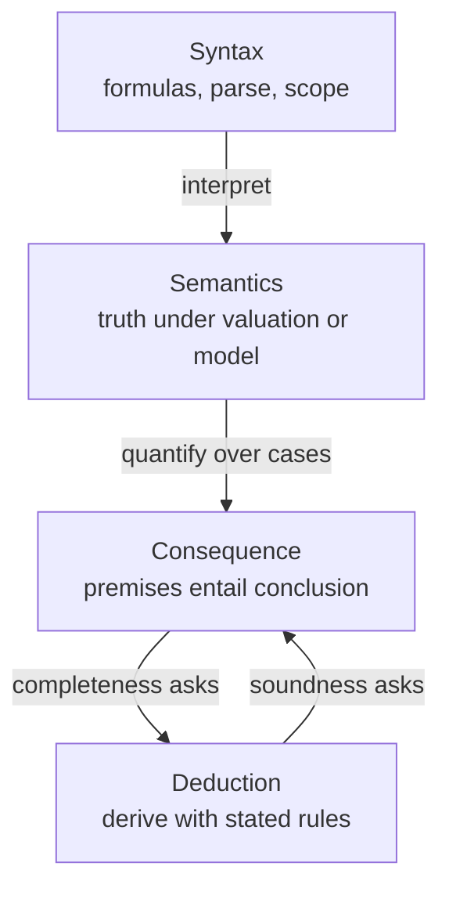
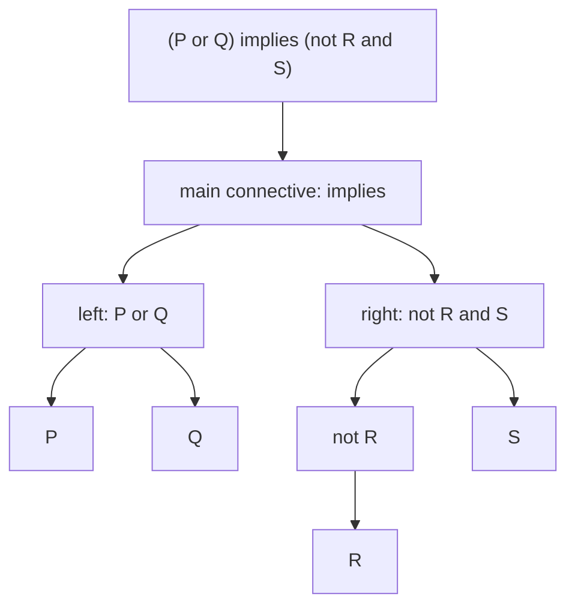
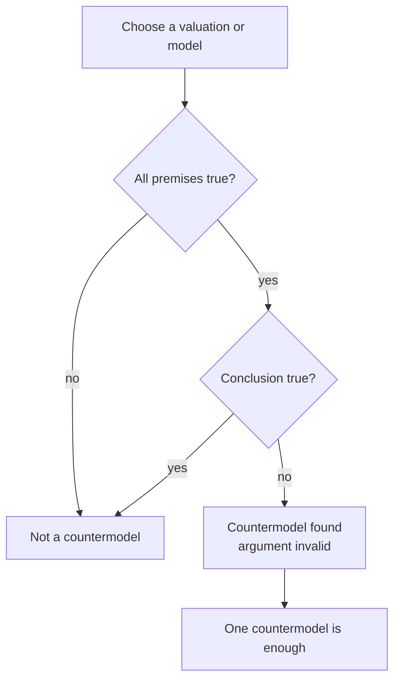
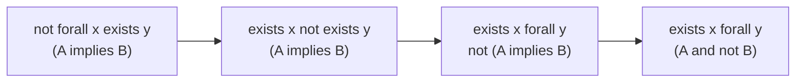

# 0.05 Logic and Quantifiers

[Section home](../README.md) | Previous: [§0.04 Sets, Relations, and Functions](../00.04-sets-relations-functions/README.md) | [Project guides](../../STYLE_GUIDE.md) | [Notation guide](../../NOTATION.md)

## Why this matters

Logic lets us separate three questions that ordinary language often mixes together:

1. **Syntax:** Is this a well-formed formula, and how is it parsed?
2. **Semantics:** Under a valuation or interpretation, is the formula true?
3. **Consequence:** Is it possible for all the premises to be true while the conclusion is false?


> **Figure 1. Syntax, semantics, and consequence answer different questions.** A formula receives truth only after a valuation or interpretation is supplied; an argument is valid only when every premise-satisfying case also satisfies its conclusion. Original figure.

This separation prevents several common errors. A true conclusion does not make an argument valid. A valid argument may have false premises. A satisfiable formula need not be a tautology. A proof rule can look plausible while failing to preserve truth.



> **Figure 2. The module's three layers and the proof-system preview.** Syntax builds expressions, semantics evaluates them, and consequence compares all relevant evaluations. Soundness and completeness connect derivability to semantic consequence, but their proofs belong later. Original diagram.

This structure matters in computing. Boolean conditions control tests and programs. SAT, constraint satisfaction, and model checking search for assignments or states satisfying formulas. Database queries express universal and existential conditions. Specifications and invariants say what every permitted execution must preserve. Rule systems and verification tools distinguish facts from consequences. Quantifier order appears in robust optimization, minimax reasoning, privacy requirements, and fairness specifications.

None of that means neural networks perform classical deduction. A learned model may approximate patterns that resemble reasoning, call a symbolic tool, or be trained on proofs. Those facts do not identify its internal computation with the formal consequence relation taught here.

The Stanford Encyclopedia of Philosophy's 2026 revision presents classical logic through formal language, deduction, model-theoretic semantics, and metatheory, then explicitly discusses alternatives [1]. We use the same separation at an introductory scale.

### Scope and non-goals

This module uses **classical two-valued logic**: each proposition under a fixed evaluation is true or false, and the connectives have the truth tables given below. Other logics exist. We note that boundary without deciding which logic is philosophically best.

We will cover:

- propositions, predicates, formulas, parsing, and scope;
- classical propositional connectives and truth tables;
- implication language, contraposition, and common fallacies;
- equivalence, satisfiability, tautologies, contradictions, CNF, and DNF;
- semantic validity, countermodels, and basic inference rules;
- first-order domains, interpretations, assignments, and quantifiers;
- English translation, quantifier order, negation, and unique existence;
- a finite propositional evaluator and finite-domain quantifier experiments;
- exact connections to computing, specifications, and AI.

This module is explicitly **not**:

- a debate about one uniquely correct logic;
- a full natural-deduction or proof-calculus course;
- a proof of soundness, completeness, compactness, or other metatheorems;
- modal, temporal, fuzzy, intuitionistic, relevant, or paraconsistent logic;
- automated theorem proving or SAT-solver algorithms;
- type theory;
- an account of how neural networks internally reason.

§0.06 develops proof techniques. §0.15 later studies SAT as a computational problem. Formal verification, rule systems, and automated reasoning return in later modules.

## Learning objectives

After completing this module, you should be able to:

- parse propositional and quantified formulas and identify the scope of each operator;
- compute truth tables and classify formulas and finite sets of formulas semantically;
- translate implication language and distinguish converse, inverse, and contrapositive;
- construct practical CNF and DNF forms and verify logical equivalence;
- test argument validity by searching for a countervaluation or countermodel;
- distinguish truth, satisfiability, validity, argument soundness, and deductive-system soundness;
- translate restricted English statements into first-order logic with correct quantifier order;
- negate nested quantified statements mechanically and expand unique existence;
- apply basic propositional and quantifier inference rules with their side conditions;
- implement and audit finite propositional and quantified evaluations without `eval`.

The [exercise set](exercises/README.md) assesses every objective. Full [worked solutions](solutions/README.md) are separate, and the [resource guide](resources/README.md) provides deeper treatments.

## Prerequisite check

Required: [§0.01 Mathematical Notation](../00.01-mathematical-notation/README.md) and [§0.04 Sets, Relations, and Functions](../00.04-sets-relations-functions/README.md).

Try these before starting:

1. Can you distinguish $x\in A$ from $A\subseteq B$?
2. Can you read $f:A\to B$ and $R\subseteq A\times B$?
3. Can you explain what an arbitrary element and a counterexample are?
4. Can you enumerate all pairs in $\{0,1\}\times\{0,1\}$?
5. Can you distinguish a function rule from the values it takes on a chosen domain?

Review §0.01 for notation and §0.04 for sets, relations, functions, and Cartesian products. §0.06 is recommended after this module, not required before it.

## Historical context

Modern classical logic was assembled through many developments rather than invented in one step. Nineteenth-century work by Boole, Frege, Peirce, and others helped turn patterns of reasoning into formal objects. Twentieth-century proof theory and model theory then made syntax, derivation, interpretation, validity, soundness, and completeness mathematically precise. The SEP treatment is a careful guide to these distinctions and to the fact that classical first-order logic is influential without being the only logic studied [1].

The practical lesson is not a priority story. Formal languages remove structural ambiguity, model-theoretic semantics says when formulas are satisfied, and deductive systems specify permitted inference steps. Keeping those jobs separate is what lets us ask whether a proof system is sound or complete.

*Mathematics in Lean* shows another useful perspective: implication and quantifiers are not punctuation around mathematics but structures that determine what evidence a proof must supply. Its logic chapter develops implication, universal and existential quantification, negation, conjunction, biconditionals, and disjunction in executable formal proofs [2].

## Intuition

### Propositions and predicates are different kinds of expression

A **proposition** is a declarative claim with a truth value in the intended context:

- $P$: "The test passed."
- $Q$: "$7$ is prime."

A **predicate** expresses a property or relation with open places:

- $E(x)$: "$x$ is even."
- $L(x,y)$: "$x$ is less than $y$."

The open formula $E(x)$ does not have a standalone truth value until an assignment supplies a value for $x$, or a quantifier binds $x$. By contrast, $E(4)$ and $\forall x\,E(x)$ are sentences whose truth can be evaluated under an interpretation.

An **atomic formula** has no logical connective as a proper part. Propositional letters such as $P$ and predicate applications such as $E(x)$ are atomic. Compound formulas are built from atoms with connectives and quantifiers.

### Form, truth, and consequence

Consider:

1. Every cached item is fresh.
2. Record $r$ is cached.
3. Therefore record $r$ is fresh.

Its form is

$$
\forall x\,(C(x)\implies F(x)),
\qquad
C(r),
\qquad
\therefore F(r).
$$

The argument is valid: no interpretation makes both premises true and the conclusion false. Whether the premises are actually true of a deployed cache is a separate factual question. If they are, the ordinary argument is **sound**. If the cache policy is false, the argument remains valid but is not sound in that ordinary sense.

### A counterexample defeats a universal claim

A universal statement promises that every relevant object works. One violating object is enough to refute it. An existential statement promises at least one witness. To establish it, one suitable object is enough.

This asymmetry drives both proof and testing:

| Claim | To support it | To refute it |
|---|---|---|
| $\forall x\,P(x)$ | show $P$ for arbitrary $x$ | find $a$ with $\neg P(a)$ |
| $\exists x\,P(x)$ | exhibit $a$ with $P(a)$ | show $\neg P$ for every $x$ |
| $\Gamma\models\varphi$ | rule out every countermodel | find one countermodel |

### Quantifier order controls witness dependency

Compare:

$$
\forall x\,\exists y\,R(x,y)
$$

with

$$
\exists y\,\forall x\,R(x,y).
$$

In the first, $y$ may depend on $x$. In the second, one fixed $y$ must work for every $x$.


> **Figure 3. Quantifier order changes who may depend on whom.** The left panel permits a different witness for each input. The right panel demands one shared witness. Arrow pattern and labels carry the distinction without relying on color. Original figure.

This is the logical core of many specifications. "Every request has some authorized handler" is weaker than "one handler is authorized for every request." In robust optimization, "$\forall$ perturbation, $\exists$ response" permits adaptation; "$\exists$ response, $\forall$ perturbation" demands one robust choice.

## Mathematics

### Local notation

| Symbol | Reading | Layer |
|---|---|---|
| $\neg P$ | not $P$ | syntax, then semantics |
| $P\land Q$ | $P$ and $Q$ | syntax, then semantics |
| $P\lor Q$ | inclusive $P$ or $Q$ | syntax, then semantics |
| $P\oplus Q$ | exactly one of $P,Q$ | syntax, then semantics |
| $P\implies Q$ | if $P$, then $Q$ | syntax, then semantics |
| $P\iff Q$ | $P$ if and only if $Q$ | syntax, then semantics |
| $v\models\varphi$ | valuation $v$ satisfies $\varphi$ | semantics |
| $\mathcal{M},s\models\varphi$ | model $\mathcal{M}$ under assignment $s$ satisfies $\varphi$ | semantics |
| $\Gamma\models\varphi$ | $\varphi$ is a semantic consequence of $\Gamma$ | consequence |
| $\Gamma\vdash_D\varphi$ | $\varphi$ is derivable from $\Gamma$ in system $D$ | deduction |
| $\forall x$ | for every $x$ | quantification |
| $\exists x$ | there exists an $x$ | quantification |
| $\exists!x$ | there exists exactly one $x$ | abbreviation |

The turnstile $\vdash$ always names a deductive system, at least implicitly. The double turnstile $\models$ is semantic. Do not swap them merely because a sound and complete proof system later connects them.

### Parsing, scope, and precedence

A well-formed formula has a unique parse once the grammar and abbreviation rules are fixed. Fully parenthesized notation makes structure explicit:

$$
(P\land Q)\implies R
$$

is not the same formula as

$$
P\land(Q\implies R).
$$

A common local precedence convention is:

1. $\neg$ and quantifiers bind most tightly;
2. $\land$;
3. $\lor$ and $\oplus$;
4. $\implies$;
5. $\iff$.

Conventions differ, especially for XOR and chains of implication. Parenthesize whenever the grouping carries real work. This module treats $P\implies Q\implies R$ as unsafe shorthand rather than silently choosing an association.



> **Figure 4. A parse tree identifies the main connective and each operator's scope.** The root operation is evaluated after its subformulas. Original diagram.

The **scope** of an operator is the subformula it governs. In

$$
\forall x\,(A(x)\implies\exists y\,R(x,y)),
$$

$\forall x$ governs the whole parenthesized formula, while $\exists y$ governs only $R(x,y)$.

### Classical truth values and connectives

A **valuation** $v$ assigns each propositional atom either true ($T$) or false ($F$). The valuation extends recursively to compound formulas.

Negation reverses truth:

| $P$ | $\neg P$ |
|---:|---:|
| T | F |
| F | T |

The binary connectives are exact functions of two truth values:

| $P$ | $Q$ | $P\land Q$ | $P\lor Q$ | $P\oplus Q$ | $P\implies Q$ | $P\iff Q$ |
|---:|---:|---:|---:|---:|---:|---:|
| T | T | T | T | F | T | T |
| T | F | F | T | T | F | F |
| F | T | F | T | T | T | F |
| F | F | F | F | F | T | T |

Here $\lor$ is **inclusive disjunction**: it is true when one or both inputs are true. XOR, written $\oplus$, is true when exactly one input is true.

### Material implication

In $P\implies Q$:

- $P$ is the **antecedent** or hypothesis;
- $Q$ is the **consequent** or conclusion.

Material implication is false in exactly one case: $P$ true and $Q$ false. Equivalently,

$$
P\implies Q
\equiv
\neg P\lor Q.
$$

When $P$ is false, the implication is true regardless of $Q$. This is **vacuous truth**. It does not establish $Q$ and does not claim a causal connection.

For a declared domain $D$,

$$
\forall x\in D\,(A(x)\implies B(x))
$$

says there is no $A$ in $D$ that fails to be a $B$. If no object in $D$ is an $A$, the statement is true.

### Necessary and sufficient conditions

$P\implies Q$ says:

- $P$ is **sufficient** for $Q$;
- $Q$ is **necessary** for $P$;
- "$P$ only if $Q$";
- "$Q$ if $P$."

The phrase "$P$ if $Q$" reverses the order:

$$
Q\implies P.
$$

"$P$ if and only if $Q$" means both directions:

$$
P\iff Q
\equiv
(P\implies Q)\land(Q\implies P).
$$

### Converse, inverse, and contrapositive

Starting from $P\implies Q$:

| Name | Formula | Equivalent to original? |
|---|---|---:|
| original | $P\implies Q$ | yes |
| converse | $Q\implies P$ | not generally |
| inverse | $\neg P\implies\neg Q$ | not generally |
| contrapositive | $\neg Q\implies\neg P$ | yes |


> **Figure 5. Contraposition crosses the implication square.** Opposite corners are equivalent; horizontal reflection forms the converse, and vertical negation forms the inverse. Line style and labels encode each relation. Original figure.

The converse and inverse are equivalent to each other, but neither is generally equivalent to the original. The contrapositive is always equivalent to the original in classical logic.

### Equivalence and semantic classification

Formulas $\varphi$ and $\psi$ are **logically equivalent**, written

$$
\varphi\equiv\psi,
$$

when every valuation gives them the same truth value. Equivalently, $\varphi\iff\psi$ is a tautology.

A propositional formula is:

- a **tautology** if true under every valuation;
- a **contradiction** or **unsatisfiable** if false under every valuation;
- **contingent** if true under some valuations and false under others;
- **satisfiable** if true under at least one valuation.

Every tautology is satisfiable. A satisfiable formula need not be a tautology.

A set of formulas $\Gamma$ is satisfiable when **one shared valuation** makes every formula in $\Gamma$ true. It is not enough for each formula to be satisfiable under a different valuation. For example,

$$
\{P,\neg P\}
$$

contains two individually satisfiable formulas but is jointly unsatisfiable.

### Core logical equivalences

The following equivalences are classical:

$$
\neg\neg P\equiv P,
$$

$$
\neg(P\land Q)\equiv\neg P\lor\neg Q,
$$

$$
\neg(P\lor Q)\equiv\neg P\land\neg Q,
$$

$$
P\implies Q\equiv\neg P\lor Q,
$$

$$
P\iff Q
\equiv
(P\implies Q)\land(Q\implies P),
$$

$$
P\iff Q
\equiv
(P\land Q)\lor(\neg P\land\neg Q).
$$

The negation of an implication deserves its own line:

$$
\neg(P\implies Q)
\equiv
\neg(\neg P\lor Q)
\equiv
P\land\neg Q.
$$

It says the promised sufficient condition occurred and the necessary result failed.

### Literals, clauses, terms, CNF, and DNF

A **literal** is an atom or its negation. A **clause** is a disjunction of literals. A **term** is a conjunction of literals.

A formula is in **conjunctive normal form** (CNF) when it is a conjunction of clauses:

$$
(P\lor\neg Q)\land(R\lor S\lor\neg T).
$$

A formula is in **disjunctive normal form** (DNF) when it is a disjunction of terms:

$$
(P\land Q)\lor(\neg P\land R).
$$

For a finite propositional formula, truth tables give canonical constructions:

- For each true row, form a term that selects exactly that row. OR the terms to get DNF.
- For each false row, form a clause that excludes exactly that row. AND the clauses to get CNF.

For a row where $P=T,Q=F$, the selecting DNF term is $P\land\neg Q$. The excluding CNF clause is $\neg P\lor Q$.

These canonical forms can be much larger than the original formula. Practical SAT systems exploit structure rather than blindly expanding every formula. Their algorithms are beyond this module.

### Arguments and semantic validity

Let $\Gamma$ be a set of premises and $\varphi$ a conclusion. We write

$$
\Gamma\models\varphi
$$

when every valuation or model satisfying all premises also satisfies the conclusion. Equivalently, there is no **countermodel** in which every premise is true and the conclusion is false.



> **Figure 6. Semantic validity is a countermodel search.** Cases with a false premise do not challenge validity; the decisive case makes all premises true and the conclusion false. Original diagram.

For finite propositional arguments,

$$
\Gamma\models\varphi
$$

exactly when

$$
\left(\bigwedge_{\gamma\in\Gamma}\gamma\right)\implies\varphi
$$

is a tautology, or equivalently when

$$
\Gamma\cup\{\neg\varphi\}
$$

is unsatisfiable.

Validity is independent of the premises' actual truth. Compare:

- **true statement:** true in a selected intended interpretation;
- **valid formula:** true in every interpretation of the relevant kind;
- **valid argument:** no model makes premises true and conclusion false;
- **sound ordinary argument:** valid, with premises actually true in the intended setting;
- **sound deductive system:** every derivable consequence is semantically valid.

The last two uses of "sound" concern different objects. Do not infer that an argument with true premises is valid, or that a valid argument has true premises.

### Propositional inference rules and fallacies

These valid patterns preserve truth:

| Rule | Premises | Conclusion |
|---|---|---|
| modus ponens | $P\implies Q$, $P$ | $Q$ |
| modus tollens | $P\implies Q$, $\neg Q$ | $\neg P$ |
| hypothetical syllogism | $P\implies Q$, $Q\implies R$ | $P\implies R$ |
| disjunctive syllogism | $P\lor Q$, $\neg P$ | $Q$ |

Two tempting patterns are invalid:

| Fallacy | Premises | Invalid conclusion |
|---|---|---|
| affirming the consequent | $P\implies Q$, $Q$ | $P$ |
| denying the antecedent | $P\implies Q$, $\neg P$ | $\neg Q$ |

Each fallacy confuses an implication with its converse or inverse.

### First-order language

Propositional logic treats each atom as indivisible. First-order logic exposes objects, properties, and relations.

A basic first-order language contains:

- variables such as $x,y,z$;
- constants naming objects, when needed;
- predicate symbols such as $A(x)$ and $R(x,y)$;
- equality, when included;
- connectives and quantifiers;
- function symbols and complex terms in fuller languages, though we use them only when an example needs them.

An **interpretation** $\mathcal{M}$ supplies:

1. a nonempty domain $D$;
2. an object in $D$ for each constant;
3. a subset of $D^n$ for each $n$-place predicate;
4. a function $D^n\to D$ for each $n$-place function symbol.

A variable assignment $s$ maps free variables to domain objects. An atomic formula $R(t_1,\ldots,t_n)$ is true when the denoted tuple belongs to the relation assigned to $R$.

The standard first-order convention used here requires a **nonempty domain**. If empty domains were allowed, every universal sentence would be vacuously true and every existential sentence false there. Some systems study empty domains explicitly, but that is not our convention.

The Open Logic Project build index exposes separate current components for propositional syntax and semantics, first-order formulas, assignments, satisfaction, semantic notions, proof systems, soundness, and completeness [3]. Its component PDFs are available, but this module makes no page-specific claim from an unextracted PDF.

### Free and bound variables

In

$$
P(x)\land\exists y\,R(x,y),
$$

$x$ is free and $y$ is bound. The formula is open because $x$ remains free.

In

$$
\forall x\,(P(x)\land\exists y\,R(x,y)),
$$

both variables are bound, so the formula is a **sentence**.

A sentence has truth in an interpretation independently of an external variable assignment. An open formula generally needs an assignment before it has a truth value.

Avoid variable shadowing such as

$$
\forall x\,(P(x)\lor\exists x\,Q(x)).
$$

The inner $\exists x$ binds a new occurrence unrelated to the outer one. Rename it:

$$
\forall x\,(P(x)\lor\exists y\,Q(y)).
$$

### Restricted English translation

Suppose the domain is all objects, with predicates $A(x)$ and $B(x)$.

| English | Formula |
|---|---|
| all $A$ are $B$ | $\forall x\,(A(x)\implies B(x))$ |
| some $A$ are $B$ | $\exists x\,(A(x)\land B(x))$ |
| no $A$ are $B$ | $\forall x\,(A(x)\implies\neg B(x))$ |
| no $A$ are $B$ | $\neg\exists x\,(A(x)\land B(x))$ |
| some $A$ are not $B$ | $\exists x\,(A(x)\land\neg B(x))$ |

Universal restriction uses implication. Existential restriction uses conjunction.

The incorrect translation

$$
\forall x\,(A(x)\land B(x))
$$

says every object in the entire domain is both an $A$ and a $B$.

The incorrect translation

$$
\exists x\,(A(x)\implies B(x))
$$

can be satisfied by any object that is not an $A$, because the implication is then vacuously true.

If the domain is already the set of all $A$ objects, the restrictions may be omitted:

$$
\forall x\,B(x)
$$

then means all $A$ are $B$. Translation is domain-sensitive.

MIT's *Mathematics for Computer Science* places definitions, proofs, sets, functions, and relations in its fundamental-concepts block and develops them for computer science [4]. Stanford CS103 likewise treats logic, proofs, and discrete structures as foundations for computability and complexity [5].

Stanford CS103 provides a public truth-table generator for independently checking propositional columns [6]. Oscar Levin's open discrete-mathematics text develops the same connective tables, equivalences, deduction patterns, and quantifier-order warning at an introductory level [7]. Compute small tables by hand first, then use a tool to audit the result.

One implementation caution matters here. Python's `and` and `or` are not themselves a formal two-valued semantics. They short-circuit and return one of their operands, which may be a non-Boolean object [8]. We use explicit Boolean results in the implementation below.

### Quantifier order

Adjacent quantifiers of the same type commute:

$$
\forall x\,\forall y\,P(x,y)
\equiv
\forall y\,\forall x\,P(x,y),
$$

$$
\exists x\,\exists y\,P(x,y)
\equiv
\exists y\,\exists x\,P(x,y).
$$

Mixed quantifiers generally do not:

$$
\forall x\,\exists y\,P(x,y)
\not\equiv
\exists y\,\forall x\,P(x,y).
$$

The second implies the first in ordinary nonempty-domain first-order semantics, because a shared witness can be reused. The reverse fails when witnesses must depend on inputs.

For students $D=\{a,b,c\}$ and resources $R=\{1,2,3\}$, let access be

$$
\{(a,1),(b,2),(c,3)\}.
$$

Every student can access some resource, but there is no one resource accessible to every student.

### Negating quantified statements mechanically

Push negation inward one operator at a time:

$$
\neg\forall x\,P(x)
\equiv
\exists x\,\neg P(x),
$$

$$
\neg\exists x\,P(x)
\equiv
\forall x\,\neg P(x).
$$

For connectives:

$$
\neg(P\land Q)\equiv\neg P\lor\neg Q,
$$

$$
\neg(P\lor Q)\equiv\neg P\land\neg Q,
$$

$$
\neg(P\implies Q)\equiv P\land\neg Q.
$$



> **Figure 7. Negation moves inward mechanically.** Crossing a quantifier flips it; crossing implication replaces it with antecedent and negated consequent. Original diagram.

The result says there is an $x$ such that every $y$ makes $A(x,y)$ true and $B(x,y)$ false. Do not negate the English paraphrase by intuition alone. Transform the formula, then translate back.

The same classical transformations appear in *Mathematics in Lean*, including the fact that $\neg\forall x\,P(x)\implies\exists x\,\neg P(x)$ uses classical reasoning [2].

### Unique existence

The abbreviation

$$
\exists!x\,P(x)
$$

means there is exactly one object satisfying $P$. One expansion is

$$
\exists x\left(P(x)\land\forall y\,(P(y)\implies y=x)\right).
$$

Other equivalent formulations are common, such as

$$
\left(\exists x\,P(x)\right)
\land
\forall y\,\forall z\,((P(y)\land P(z))\implies y=z).
$$

Both separate existence from uniqueness. A sentence proving at most one witness does not prove that a witness exists.

### Quantifier inference rules and side conditions

The following names vary across textbooks. The side conditions do not.

**Universal instantiation (UI).** From

$$
\forall x\,P(x)
$$

infer $P(t)$ for an admissible term $t$.

**Universal generalization (UG).** After proving $P(a)$ for an **arbitrary** object $a$, infer

$$
\forall x\,P(x).
$$

You may not generalize from a specially chosen object or from an assumption that depends on it.

**Existential generalization (EG).** From $P(t)$ infer

$$
\exists x\,P(x).
$$

The known object supplies the witness.

**Existential instantiation or elimination (EI/EE).** From

$$
\exists x\,P(x),
$$

reason temporarily with a **fresh** name $c$ satisfying $P(c)$. A final conclusion may not depend on which witness $c$ was chosen, and $c$ must not leak into that conclusion.

The SEP deductive system states freshness conditions for universal introduction and existential elimination precisely because otherwise an apparently general conclusion can depend on a special object [1].

### Semantic truth, satisfiability, validity, and consequence

For first-order logic:

- $\mathcal{M},s\models\varphi$ means $\varphi$ is true in model $\mathcal{M}$ under assignment $s$;
- $\mathcal{M}\models\varphi$ for a sentence means $\mathcal{M}$ is a model of $\varphi$;
- $\varphi$ is satisfiable if some model satisfies it;
- $\varphi$ is logically valid if every model satisfies it;
- $\Gamma\models\varphi$ if every model of all formulas in $\Gamma$ satisfies $\varphi$.

These semantic definitions quantify over interpretations. A finite model checker examines only the declared finite structures it generates or receives. It can find a genuine countermodel to a universal semantic claim. Passing a bounded search does not prove general first-order validity.

If we also choose a proof system $D$, then

$$
\Gamma\vdash_D\varphi
$$

means a derivation exists under its formal rules. **Soundness** of $D$ means

$$
\Gamma\vdash_D\varphi
\implies
\Gamma\models\varphi.
$$

**Completeness** means the converse. Classical first-order systems can be designed to be both sound and complete [1]. That is a metatheoretic preview, not a proof and not a license to blur $\vdash$ with $\models$.

## Derivation

### Deriving implication elimination

Starting with the truth condition,

$$
P\implies Q\equiv\neg P\lor Q.
$$

If $P$ is true and $P\implies Q$ is true, then $\neg P$ is false. The disjunction $\neg P\lor Q$ can remain true only if $Q$ is true. This is modus ponens.

### Deriving contraposition

Eliminate implication and apply commutativity:

$$
\begin{aligned}
P\implies Q
&\equiv \neg P\lor Q\\
&\equiv Q\lor\neg P\\
&\equiv \neg Q\implies\neg P.
\end{aligned}
$$

The second line uses commutativity of inclusive OR. No corresponding derivation turns $P\implies Q$ into $Q\implies P$.

### Deriving De Morgan with a truth condition

$\neg(P\land Q)$ is true exactly when it is not the case that both $P$ and $Q$ are true. That occurs exactly when at least one is false:

$$
\neg(P\land Q)
\equiv
\neg P\lor\neg Q.
$$

The OR is inclusive. If both are false, the negated conjunction is still true.

### Constructing canonical DNF and CNF

Let

$$
\varphi=(P\oplus Q)\implies R.
$$

It is false exactly when $P\oplus Q$ is true and $R$ is false, which happens on rows

$$
(P,Q,R)=(T,F,F)
\quad\text{or}\quad
(F,T,F).
$$

Canonical CNF excludes each false row. The excluding clauses are

$$
\neg P\lor Q\lor R
$$

and

$$
P\lor\neg Q\lor R.
$$

Therefore

$$
\varphi
\equiv
(\neg P\lor Q\lor R)
\land
(P\lor\neg Q\lor R).
$$

Canonical DNF would use one selecting term for each of the six true rows. It is valid but less compact. Normal form is not synonymous with shortest form.

### Validity through unsatisfiability

Consider premises $P\implies Q$, $Q\implies R$, and conclusion $P\implies R$. A countermodel would satisfy

$$
(P\implies Q)
\land
(Q\implies R)
\land
\neg(P\implies R).
$$

The final conjunct becomes $P\land\neg R$. Then the first premise and $P$ force $Q$, while the second premise and $Q$ force $R$, contradicting $\neg R$. No countermodel exists, so the argument is valid.

### Negating a specification

Suppose the domain contains requests and handlers, and

$$
\forall r\,(Request(r)\implies\exists h\,(Handler(h)\land CanServe(h,r)))
$$

says every request has a handler that can serve it. Negate mechanically:

$$
\begin{aligned}
&\neg\forall r\,(Request(r)\implies\exists h\,(Handler(h)\land CanServe(h,r)))\\
&\equiv
\exists r\,\neg(Request(r)\implies\exists h\,(Handler(h)\land CanServe(h,r)))\\
&\equiv
\exists r\,(Request(r)\land\neg\exists h\,(Handler(h)\land CanServe(h,r)))\\
&\equiv
\exists r\,(Request(r)\land\forall h\,\neg(Handler(h)\land CanServe(h,r)))\\
&\equiv
\exists r\,(Request(r)\land\forall h\,(\neg Handler(h)\lor\neg CanServe(h,r))).
\end{aligned}
$$

The negation asks for one failing request and says every object is either not a handler or cannot serve it.

## Implementation

We can represent formulas as a small abstract syntax tree (AST) made of tuples. No call to `eval` is needed. Each node has an explicit tag, so syntax and semantics remain visible.

```python
from itertools import product


def Not(formula):
    return ("not", formula)


def And(left, right):
    return ("and", left, right)


def Or(left, right):
    return ("or", left, right)


def Xor(left, right):
    return ("xor", left, right)


def Implies(left, right):
    return ("implies", left, right)


def Iff(left, right):
    return ("iff", left, right)


def atoms(formula):
    if isinstance(formula, str):
        return {formula}
    if formula[0] == "not":
        return atoms(formula[1])
    return atoms(formula[1]) | atoms(formula[2])


def evaluate(formula, valuation):
    if isinstance(formula, str):
        return bool(valuation[formula])

    operator = formula[0]
    if operator == "not":
        return not evaluate(formula[1], valuation)

    left = evaluate(formula[1], valuation)
    right = evaluate(formula[2], valuation)
    operations = {
        "and": left and right,
        "or": left or right,
        "xor": left != right,
        "implies": (not left) or right,
        "iff": left == right,
    }
    if operator not in operations:
        raise ValueError(f"unknown operator: {operator}")
    return bool(operations[operator])


def valuations(formulas):
    names = sorted(set().union(*(atoms(formula) for formula in formulas)))
    for values in product((False, True), repeat=len(names)):
        yield dict(zip(names, values))


def truth_rows(formula):
    return [
        (valuation, evaluate(formula, valuation))
        for valuation in valuations([formula])
    ]


def classify(formula):
    results = [result for _, result in truth_rows(formula)]
    if all(results):
        return "tautology"
    if not any(results):
        return "contradiction"
    return "contingent"


def satisfiable(formulas):
    return next(
        (
            valuation
            for valuation in valuations(formulas)
            if all(evaluate(formula, valuation) for formula in formulas)
        ),
        None,
    )


def equivalent(left, right):
    return all(
        evaluate(left, valuation) == evaluate(right, valuation)
        for valuation in valuations([left, right])
    )


def countermodel(premises, conclusion):
    return next(
        (
            valuation
            for valuation in valuations([*premises, conclusion])
            if all(evaluate(premise, valuation) for premise in premises)
            and not evaluate(conclusion, valuation)
        ),
        None,
    )


def valid(premises, conclusion):
    return countermodel(premises, conclusion) is None


P, Q, R = "P", "Q", "R"
assert classify(Or(P, Not(P))) == "tautology"
assert classify(And(P, Not(P))) == "contradiction"
assert classify(Implies(P, Q)) == "contingent"
assert equivalent(Implies(P, Q), Or(Not(P), Q))
assert equivalent(Not(Implies(P, Q)), And(P, Not(Q)))
assert satisfiable([P, Not(P)]) is None
assert valid([Implies(P, Q), P], Q)
assert valid([Implies(P, Q), Not(Q)], Not(P))
assert valid([Implies(P, Q), Implies(Q, R)], Implies(P, R))
assert countermodel([Implies(P, Q), Q], P) == {"P": False, "Q": True}
```

Python documents `itertools.product` as a Cartesian-product iterator equivalent to nested loops, with `repeat` for repeated factors [8]. That is exactly the finite valuation space $\{F,T\}^n$.

The evaluator proves its classifications only for the finite propositional formulas it exhaustively evaluates. Because every valuation of the listed atoms is visited, its propositional results are exact. It is not a general first-order validity procedure.

### Finite quantifier helpers

Python's built-in `all` and `any` mirror universal and existential quantification over an explicitly finite iterable:

```python
def forall(domain, predicate):
    return all(predicate(value) for value in domain)


def exists(domain, predicate):
    return any(predicate(value) for value in domain)


students = ("Ada", "Bo", "Cy")
resources = (1, 2, 3)
access = {("Ada", 1), ("Bo", 2), ("Cy", 3)}

per_student_witness = forall(
    students,
    lambda student: exists(
        resources,
        lambda resource: (student, resource) in access,
    ),
)
shared_witness = exists(
    resources,
    lambda resource: forall(
        students,
        lambda student: (student, resource) in access,
    ),
)

assert per_student_witness
assert not shared_witness
assert forall((), lambda value: False)
assert not exists((), lambda value: True)
```

The last two assertions display vacuous behavior over an empty Python iterable. Standard first-order models in this module still require a nonempty domain.

## Experimentation

### Experiment 1: Formula census and CNF comparison

**Question.** How do different formulas over three atoms distribute across tautology, contradiction, and contingency, and when does canonical CNF expand sharply?

**Hypothesis.** Most small nondegenerate formulas will be contingent. Canonical CNF will use one clause per false row, so formulas true on few rows will have large CNF descriptions.

**Method.** Build a controlled collection from $P,Q,R$ using each connective. For every formula, enumerate all eight valuations, count true rows, classify it, and construct canonical CNF from false rows. Compare the evaluator's column with the CNF column under every valuation.

**Controls.** Deduplicate formulas by their complete truth columns rather than by printed syntax. Include a tautology, contradiction, implication, XOR, and at least two syntactically different equivalent formulas. Record formula size and clause count separately.

**Interpretation.** Equal truth columns establish propositional equivalence. They do not establish that the formulas have the same syntax, explanation, or computational cost in another representation.

### Experiment 2: Quantifier-order finite relation lab

**Question.** When does $\forall x\exists y\,R(x,y)$ hold while $\exists y\forall x\,R(x,y)$ fails?

**Hypothesis.** A relation with at least one outgoing edge from every left object but no right object connected from every left object separates the formulas.

**Method.** Enumerate every relation $R\subseteq X\times Y$ for $X=\{0,1,2\}$ and $Y=\{a,b\}$. Classify each relation under both quantifier orders. For separating relations, record a witness function choosing a suitable $y$ for each $x$, then show why no shared $y$ works.

**Controls.** Include the empty relation, universal relation, a relation with one shared right neighbor, and a diagonal-like relation. Keep domains fixed and nonempty.

**Limitation.** Exhausting all relations on these finite domains proves the comparison only for those domains. The displayed counterexample is enough to disprove general equivalence, but agreement on a finite sample would not prove equivalence in all first-order models.

### Experiment 3: Translation ambiguity audit

**Question.** Which English phrases produce multiple plausible formulas when domain, scope, or grouping is unstated?

Audit at least these sentences:

1. "Every reviewer checked a submission."
2. "A reviewer checked every submission."
3. "No approved request is delayed or rejected."
4. "The service starts only if the database and cache are ready."
5. "Every model has one owner."

For each, record:

- the declared domain and predicates;
- at least two possible parses when ambiguity exists;
- a tiny interpretation separating those parses;
- the intended formula after clarification;
- the clarification question you would ask the author.

This is a semantics audit, not a grammar contest. Natural language often leaves scope, uniqueness, and inclusive versus exclusive OR unresolved.

## Worked examples

### Example 1: Parse an ambiguous formula

Without a convention, $P\lor Q\land R$ may be misread. Under the local precedence table it means

$$
P\lor(Q\land R),
$$

but $(P\lor Q)\land R$ differs when $P=T,Q=F,R=F$: the first is true and the second false. Write parentheses.

### Example 2: Compute a compound truth table

For $(P\lor Q)\land\neg P$:

| $P$ | $Q$ | $P\lor Q$ | $\neg P$ | result |
|---:|---:|---:|---:|---:|
| T | T | T | F | F |
| T | F | T | F | F |
| F | T | T | T | T |
| F | F | F | T | F |

The formula selects exactly $P=F,Q=T$, so it is contingent and satisfiable.

### Example 3: Vacuous implication

Over integers,

$$
\forall x\,(x^2=2\implies x>100)
$$

is true because no integer satisfies $x^2=2$. It does not show that any integer exceeds $100$. Over the real numbers, the same formula is false because $x=\sqrt{2}$ makes the antecedent true and the consequent false. The predicates remain meaningful in both domains; what changes is whether a counterexample exists.

### Example 4: Necessary and sufficient language

"Authentication is required for access" means access only if authenticated:

$$
Access\implies Authenticated.
$$

Authentication is necessary for access. The sentence does not say authentication is sufficient; authorization may also be required.

### Example 5: A converse counterexample

"If an integer is divisible by $4$, then it is even" is true. Its converse says every even integer is divisible by $4$, refuted by $2$. The contrapositive, "if an integer is not even, then it is not divisible by $4$," is equivalent to the original.

### Example 6: Verify a tautology and an equivalence

The formula

$$
(P\implies Q)\iff(\neg Q\implies\neg P)
$$

is a tautology because both implications have truth condition $\neg P\lor Q$. This is stronger than observing that both happen to be true in one case.

### Example 7: Satisfiable is not tautological

$P\land Q$ is satisfiable under $P=T,Q=T$. It is false under three other valuations, so it is not a tautology. Meanwhile $P\lor\neg P$ is both satisfiable and tautological.

### Example 8: Convert to CNF and DNF

For

$$
P\iff Q,
$$

one DNF is

$$
(P\land Q)\lor(\neg P\land\neg Q),
$$

and one CNF is

$$
(\neg P\lor Q)\land(P\lor\neg Q).
$$

A four-row truth table verifies both forms have column $T,F,F,T$.

### Example 9: Refute validity with a countervaluation

The argument

$$
P\implies Q,
\qquad
Q,
\qquad
\therefore P
$$

is affirming the consequent. Set $P=F,Q=T$. Both premises are true and the conclusion false, so the argument is invalid.

### Example 10: Valid argument with false premises versus sound argument

This argument is valid:

1. If $10$ is prime, then $10$ is odd.
2. $10$ is prime.
3. Therefore $10$ is odd.

It has modus ponens form, but both premises are false, so it is not sound in ordinary argument evaluation.

This argument is sound:

1. If an integer is divisible by $4$, then it is even.
2. $12$ is divisible by $4$.
3. Therefore $12$ is even.

The form is valid and the premises are true.

### Example 11: A true conclusion does not rescue an argument

"Paris is in France; therefore Rome is in Italy" has a true premise and conclusion, but the premise does not semantically force the conclusion when those claims are formalized as independent atoms. Set the premise atom true and conclusion atom false to obtain a countervaluation. Actual truth and validity are different properties.

### Example 12: Domain changes predicate truth

Let $P(x)$ mean $x^2=2$.

$$
\exists x\,P(x)
$$

is false over $\mathbb{Q}$ and true over $\mathbb{R}$. The formula is unchanged; the domain and interpretation changed.

### Example 13: Free and bound scope

In

$$
\forall x\,(R(x,y)\implies\exists z\,S(x,z)),
$$

$x$ and $z$ are bound, while $y$ is free. The expression is open and its truth depends on the assignment to $y$. Quantifying $y$ would make it a sentence.

### Example 14: Translate all, some, and no

With domain all people, $S(x)$ for student and $C(x)$ for coder:

$$
\text{all students are coders}
\quad\rightsquigarrow\quad
\forall x\,(S(x)\implies C(x)),
$$

$$
\text{some student is a coder}
\quad\rightsquigarrow\quad
\exists x\,(S(x)\land C(x)),
$$

$$
\text{no student is a coder}
\quad\rightsquigarrow\quad
\neg\exists x\,(S(x)\land C(x)).
$$

Using conjunction in the universal would claim everyone is a student. Using implication in the existential could be witnessed by a nonstudent.

### Example 15: Separate quantifier orders

Let $D=\mathbb{Z}$ and $R(x,y)$ mean $y>x$. Then

$$
\forall x\,\exists y\,R(x,y)
$$

is true by choosing $y=x+1$. But

$$
\exists y\,\forall x\,R(x,y)
$$

is false because no integer exceeds every integer. The first witness depends on $x$.

### Example 16: Negate a nested formula

Negate

$$
\forall x\,\exists y\,(P(x)\implies Q(x,y)).
$$

Mechanically:

$$
\exists x\,\forall y\,\neg(P(x)\implies Q(x,y))
\equiv
\exists x\,\forall y\,(P(x)\land\neg Q(x,y)).
$$

The quantifiers flip, and implication negation becomes conjunction.

### Example 17: Expand unique existence

"There is a unique empty set" can be written

$$
\exists x\left(E(x)\land\forall y\,(E(y)\implies y=x)\right),
$$

where $E(x)$ means $x$ has no members. The first conjunct supplies existence. The universal clause supplies uniqueness.

### Example 18: Universal generalization side condition

From "$a$ is an even integer" and therefore "$a^2$ is even," you may not conclude every integer has an even square, because $a$ was selected with a special assumption. You may conclude

$$
\forall x\,(Even(x)\implies Even(x^2))
$$

if $x$ was arbitrary and evenness was introduced only as the hypothesis of the implication.

### Example 19: An existential witness must not leak

From $\exists x\,Owner(x)$, choose a fresh temporary name $c$ with $Owner(c)$. You may infer $\exists y\,Owner(y)$. You may not conclude $Owner(Ada)$ or publish "$c$ is the owner" as though the existential premise identified a particular person.

### Example 20: A database quantifier pattern

"Every active user has some verified email" is

$$
\forall u\,(Active(u)\implies\exists e\,(EmailOf(e,u)\land Verified(e))).
$$

A database implementation often uses a double absence test: there does not exist an active user for whom no verified email exists. This is the mechanically negated counterexample condition, not a different requirement.

## Common mistakes

| Mistake | Why it fails | Repair |
|---|---|---|
| Treating $\lor$ as XOR | inclusive OR permits both inputs | use $\oplus$ for exactly one |
| Reading $P\implies Q$ backward | that forms the converse | name antecedent and consequent |
| Rejecting vacuous truth | universal implication bans counterexamples | search for $P\land\neg Q$ |
| Calling a satisfiable formula a tautology | one model is not every model | quantify over all valuations |
| Testing premises one at a time | a set needs one shared model | satisfy the premises jointly |
| Calling a true conclusion valid | validity concerns preservation | seek premises true, conclusion false |
| Calling every valid argument sound | premises may be actually false | check premise truth separately |
| Using argument soundness for a calculus | the objects differ | say deductive-system soundness |
| Translating all $A$ are $B$ with $\land$ | it makes everything an $A$ | use $A(x)\implies B(x)$ |
| Translating some $A$ are $B$ with $\implies$ | a non-$A$ vacuously witnesses it | use $A(x)\land B(x)$ |
| Assigning truth to an open formula alone | free variables need values | supply an assignment or bind them |
| Swapping $\forall\exists$ to $\exists\forall$ | witness dependency changes | draw dependency arrows |
| Negating $\forall$ without flipping it | counterexample becomes lost | use $\neg\forall=\exists\neg$ |
| Negating implication as implication | wrong truth condition | use $\neg(P\implies Q)=P\land\neg Q$ |
| Generalizing from a special object | the result is not universal | require an arbitrary object |
| Reusing an existential name globally | witness identity was not given | use a fresh local name |
| Equating `and`/`or` with formal connectives | Python may return operands | coerce and return Booleans explicitly |
| Treating finite checks as FOL proofs | unexamined models remain | state the finite-model boundary |

## Exercises

Complete the [twelve exercises](exercises/README.md), then compare your work with the [full solutions](solutions/README.md). The set includes parsing, truth tables, translation, countermodels, normal forms, implementation, finite-model experiments, and source critique. The [resources](resources/README.md) provide additional reading and tools.

## What you should now be able to do

You can keep formulas, their truth under interpretations, and consequence from premises in separate layers. You can parse and evaluate propositional formulas, translate implication language, construct normal forms, find countermodels, and distinguish validity from truth and both senses of soundness. You can also translate and negate quantified statements while tracking domains, scope, free variables, witness dependency, and inference-rule side conditions.

As a final check, explain why these three claims differ:

$$
\mathcal{M}\models\varphi,
\qquad
\models\varphi,
\qquad
\Gamma\models\varphi.
$$

Then give one example where the first holds and the second fails, and one valid argument whose premises are false in the intended interpretation.

## Where this leads

§0.06 Proof Techniques is the next module in the reasoning cluster, but it is not yet published. It will turn the semantic patterns here into methods for constructing and communicating proofs. §0.07 adds induction and invariants. §0.15 returns to SAT as a computational problem. Later modules use quantifiers in convergence definitions, probability, optimization, specifications, fairness constraints, privacy guarantees, and minimax formulations.

## References

[1] S. Shapiro and T. Kouri Kissel, "Classical Logic," *Stanford Encyclopedia of Philosophy*, substantive revision June 17, 2026. https://plato.stanford.edu/entries/logic-classical/ Accessed 2026-09-01.

[2] J. Avigad and P. Massot, *Mathematics in Lean*, ch. 3, "Logic." Lean community, 2020-2025. Text licensed CC BY 4.0. https://leanprover-community.github.io/mathematics_in_lean/C03_Logic.html Accessed 2026-09-01.

[3] Open Logic Project, "Open Logic Project Builds," revision `9620cc7`, July 12, 2026. https://builds.openlogicproject.org/ Accessed 2026-09-01.

[4] E. Lehman, F. T. Leighton, and A. R. Meyer, *Mathematics for Computer Science*, with MIT 6.042J course materials, Spring 2015. MIT OpenCourseWare. https://ocw.mit.edu/courses/6-042j-mathematics-for-computer-science-spring-2015/ Accessed 2026-09-01.

[5] Stanford University, "CS103: Mathematical Foundations of Computing," Summer 2026, R. Reiss. https://web.stanford.edu/class/cs103/ Accessed 2026-09-01.

[6] Stanford University, "CS103 Truth Table Generator." https://web.stanford.edu/class/cs103/tools/truth-table-tool/ Accessed 2026-09-01.

[7] O. Levin, *Discrete Mathematics: An Open Introduction*, 3rd ed., sec. 3.1, "Propositional Logic." Open Math Books. Licensed CC BY-SA 4.0. https://discrete.openmathbooks.org/dmoi3/sec_propositional.html Accessed 2026-09-01.

[8] Python Software Foundation, "`itertools` - Functions creating iterators for efficient looping" and "Boolean operations," Python 3.14 documentation. https://docs.python.org/3/library/itertools.html#itertools.product and https://docs.python.org/3/reference/expressions.html#boolean-operations Accessed 2026-09-01.

---

Previous: [§0.04 Sets, Relations, and Functions](../00.04-sets-relations-functions/README.md) | [Section home](../README.md) | Next: [§0.06 Proof Techniques](../00.06-proof-techniques/README.md)
