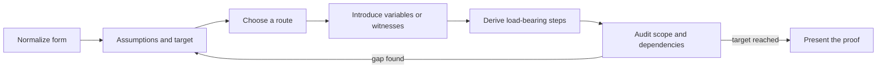
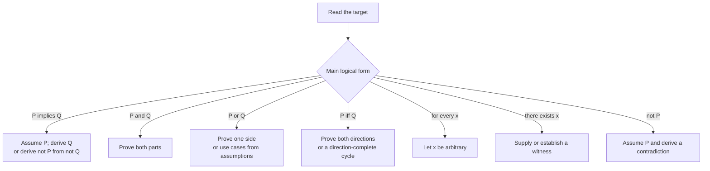
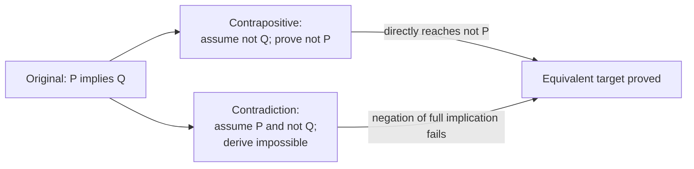
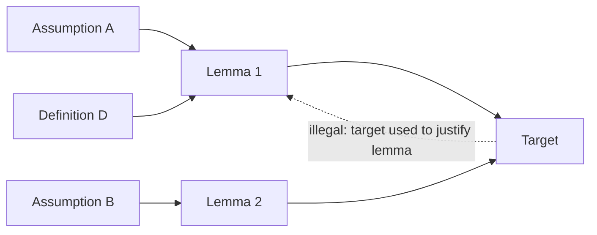
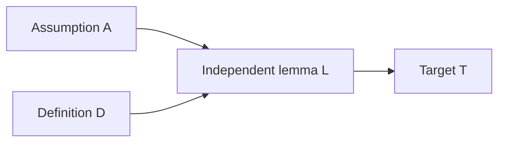

# 0.06 Proof Techniques

[Section home](../README.md) | Previous: [§0.05 Logic and Quantifiers](../00.05-logic-quantifiers/README.md) | [Project guides](../../CONTRIBUTING.md#module-file-structure) | [Notation guide](../../NOTATION.md)

Plan proofs from logical form, choose and justify a route, then audit assumptions, witnesses, operations, and dependencies. Develop direct, indirect, existence, equality, counting, and diagonal arguments while separating finite computational evidence from general proof.

Start with [§0.05 Logic and Quantifiers](../00.05-logic-quantifiers/README.md). [§0.04 Sets, Relations, and Functions](../00.04-sets-relations-functions/README.md) supports the examples; §§0.07-0.08 continue into induction, invariants, and counting.

## In this module

- [Proofs as goal transformations](#proofs-as-goal-transformations)
- [From discovery to proof obligations](#from-discovery-to-proof-obligations)
- [Planning and choosing a proof route](#planning-and-choosing-a-proof-route)
- [Existence, disproof, and equality](#existence-disproof-and-equality)
- [Counting and diagonal proof patterns](#counting-and-diagonal-proof-patterns)
- [Auditing proof dependencies](#auditing-proof-dependencies)
- [Deriving counting and correctness obligations](#deriving-counting-and-correctness-obligations)
- [Implementation](#implementation)
- [Conjecture, repair, and finite evidence](#conjecture-repair-and-finite-evidence)
- [Worked examples](#worked-examples)
- [Common mistakes](#common-mistakes)
- [Practice](#practice)
- [Where this leads](#where-this-leads)
- [References](#references)

**Topic shortcuts:** [Planning ledger](#a-proof-planning-ledger) · [WLOG](#without-loss-of-generality) · [Contradiction](#contradiction) · [Unique existence](#unique-existence) · [Pigeonhole](#the-pigeonhole-principle) · [Dependency audit](#a-dependency-audit)

## Proofs as goal transformations

A proof is a truth-preserving argument from stated assumptions to a stated conclusion. It is also communication: another reader should be able to identify every object, check every inference, and see that the final sentence is the promised target.

Those two jobs cannot be separated. A correct idea hidden behind ambiguous variables is not yet a checkable proof. A polished paragraph built around an invalid inference is not rescued by its style. Stanford CS103's current proof-writing checklist makes this connection explicit through assumptions and targets, variable provenance, load-bearing sentences, definition use, complete prose, and the warning against a needless "contradiction sandwich" [1]. Its course materials are copyrighted, so this module links to that checklist but does not adapt its exercises or examples.

The organizing idea here is to treat proof techniques as **goal transformations**:

1. normalize the logical form;
2. write the assumptions and exact target;
3. choose a route that exposes usable structure;
4. introduce arbitrary objects or witnesses with correct scope;
5. derive the load-bearing steps;
6. audit dependencies, domains, and the reached target.



> **Figure 1. Proof construction is an auditable transformation process.** Discovery may loop, but the presented argument must expose a checkable path from assumptions to target. Original diagram.


> **Figure 2. Logical form suggests candidate routes without prescribing one perfect method.** Several routes may work, and a direct route is not always shortest. Shape, labels, and line patterns carry the distinctions without relying on color. Original figure.

This matters throughout computer science and AI. A correctness proof connects a program and a specification under explicit assumptions. Case analysis follows branches in an algorithm. Counterexamples become adversarial tests. Invariants, developed in §0.07, explain what a loop or state transition preserves. Diagonalization proves impossibility results. Property tests search finite spaces for failures, while proofs establish claims over the declared mathematical domain.

An empirical model result is not a theorem without assumptions and an argument. A benchmark can support an empirical claim about tested conditions. It cannot by itself establish universal correctness, fairness, robustness, or safety.

## Prerequisite check

Try these before starting:

1. Can you rewrite $`P\iff Q`$ as two implications?
2. Can you negate $`\forall x\,\exists y\,R(x,y)`$ mechanically?
3. Can you distinguish a universal claim from an existential claim?
4. Can you explain why one countermodel refutes semantic validity?
5. Can you identify the converse and contrapositive of $`P\implies Q`$?
6. Can you track whether a variable is free, bound, arbitrary, or a witness?

Review §0.05 if implication direction, quantifier order, or witness scope is uncertain. [§0.04 Sets, Relations, and Functions](../00.04-sets-relations-functions/README.md) is recommended because many examples use set equality, functions, relations, and diagonalization.

## Historical context

Proof practices long predate modern symbolic logic. What counts as enough detail has always depended on audience, available definitions, accepted prior results, and the purpose of the argument. A proof in an introductory course may expand divisibility from its definition; a later paper may cite that fact as routine. Rigor is not maximal length. It is enough explicit structure for the intended audience to verify the claim without supplying a missing argument.

MIT's *Mathematics for Computer Science* organizes its first unit around proofs before moving to structures and counting [2]. Oscar Levin's open discrete-mathematics text introduces proof methods within a broader logic and discrete-mathematics course and is licensed CC BY-SA 4.0 [3]. Richard Hammack's *Book of Proof*, third edition with the 3.4 correction release, separates direct, contrapositive, contradiction, set, disproof, and induction chapters [4]. It is licensed CC BY-NC-ND 4.0, so we link to it without adapting its text or exercises.

Formalization makes hidden assumptions unusually visible. *Mathematics in Lean* develops irrational-root arguments by naming coprimality, divisibility, primality, and nonzero assumptions, and it shows how proof obligations change across number systems [5]. We use an informal proof here, but the same audit discipline applies.

The semantic distinction from §0.05 remains in force. A valid argument has no interpretation with true premises and false conclusion; a derivation is a finite object in a chosen deductive system [6]. This module teaches ordinary mathematical proof construction without pretending that one informal style is itself a complete formal calculus.

The current Open Logic Project build index keeps proof methods and induction in separate components, matching this module's boundary with §0.07 [7]. Its methods PDF exists, but direct extraction did not produce usable text, so we make no page-specific claim from it.

## From discovery to proof obligations

### What a proof establishes

Suppose assumptions $`A_1,\ldots,A_m`$ describe the setting and $`T`$ is the target. A proof establishes that the assumptions are sufficient for the target:

$$
A_1,\ldots,A_m\models T
$$

at the semantic level, or that $`T`$ is derivable from them in a chosen sound proof system at the syntactic level. Ordinary mathematical prose usually leaves the formal system implicit. It must not leave the logical dependencies mysterious.

A valid argument can start from false premises. That does not make the conclusion established about the intended problem. To apply a theorem, we also need its premises to hold in the current setting.

| Item | Role | Truth status before resolution |
|---|---|---|
| definition | fixes the meaning of a term or symbol | adopted convention |
| theorem | proved mathematical claim | established |
| lemma | supporting theorem used in a larger argument | established |
| corollary | theorem following quickly from earlier results | established |
| conjecture | claim proposed but not proved or refuted | open |
| example | one object illustrating a definition or phenomenon | local fact |
| witness | one object establishing an existential claim | proof component |
| counterexample | one object violating a universal claim | disproof component |

Names such as `lemma` and `theorem` usually describe a result's role, not its logical strength. A corollary still requires a valid derivation. A definition is not proved true; it sets a meaning that later claims use.

### Discovery and presentation are different

Discovery is allowed to be untidy. You may compute small cases, draw a diagram, search for a counterexample, inspect a program trace, or try a stronger claim and watch it fail. These activities can reveal the structure a proof should use.

Presentation answers a different question: what argument establishes the final claim? A polished proof normally omits abandoned paths and keeps only steps that carry dependency weight.

Experiments can do several legitimate jobs:

- refute a universal claim by finding one genuine counterexample;
- prove a claim over a finite domain by checking every member;
- suggest a pattern worth proving;
- test a proof's implementation or arithmetic;
- identify a missing assumption.

They cannot establish an infinite universal merely because many cases passed. Exhaustive verification is a proof only for the finite domain actually exhausted.

### Start from logical form

The main connective and quantifiers tell you what evidence the target asks for.



> **Figure 3. Logical form supplies candidate proof obligations.** The diagram suggests openings, not a mechanical guarantee that one route will be elegant. Original diagram.

A direct route is often clearest, but it is not always shortest. If the conclusion is negative, a contrapositive may expose a positive definition. If a claim concerns all assignments into a few categories, a capacity contradiction may reveal pigeonhole structure. If every candidate is indexed, a diagonal construction may create one object that escapes them all.

## Planning and choosing a proof route

### A proof-planning ledger

Before proving anything, write a ledger.

| Question | What to record |
|---|---|
| exact statement | quantifiers, connectives, domain, and conclusion |
| object provenance | arbitrary input, existential witness, chosen definition, or cited result |
| assumptions | every condition currently available |
| target | the exact formula or property still required |
| useful definitions | expansions that expose algebra, membership, or witnesses |
| candidate routes | direct, cases, contrapositive, contradiction, equality, counting, diagonal |
| edge cases | empty sets, zero divisors, boundary values, degenerate structures |
| legal operations | domain closure, nonzero divisors, finite sums, defined expressions |

For

$$
\forall n\in\mathbb{Z},
\quad
6\mid n\implies3\mid n,
$$

the ledger says:

- $`n`$ is an arbitrary integer;
- assumption: $`6\mid n`$;
- target: $`3\mid n`$;
- definition: $`6\mid n`$ means $`n=6k`$ for some integer $`k`$;
- candidate route: direct;
- useful rewrite: $`n=3(2k)`$;
- closure fact: $`2k\in\mathbb{Z}`$.

That is nearly the complete proof because the logical form and definition expose the witness the target needs.

### Direct proof

To prove

$$
\forall x\in D,
\quad
P(x)\implies Q(x),
$$

let $`x`$ be an arbitrary element of $`D`$, assume $`P(x)`$, and derive $`Q(x)`$. The word **arbitrary** matters. The proof may use only facts available for every permitted $`x`$, not a convenient special value.

Direct proof often follows definitions forward:

$$
P(x)
\Longrightarrow
\text{definition of }P
\Longrightarrow
\text{algebra or cited lemma}
\Longrightarrow
\text{definition of }Q
\Longrightarrow
Q(x).
$$

A definition supplies usable structure. If $`n`$ is even, write $`n=2k`$ for an integer $`k`$. The $`k`$ is not arbitrary. Its existence comes from the definition applied to the already chosen $`n`$.

### Proof by cases

A proof by cases partitions the possibilities into subproblems. If

$$
C_1\lor\cdots\lor C_r
$$

covers every permitted object, and each $`C_i`$ implies target $`T`$, then $`T`$ follows.

Cases need not be disjoint. Overlap may repeat work, but it does not invalidate the proof. Missing coverage is fatal: an uncovered object receives no argument.

For real $`x`$, the cases $`x\le0`$ and $`x\ge0`$ overlap at zero and still cover all reals. The cases $`x<0`$ and $`x>0`$ are disjoint but miss zero.

A finite exhaustion proof is case analysis in which the declared domain itself is finite. Checking all sixteen bit strings of length four can prove a statement about those sixteen strings. It does not prove the analogous statement for all finite bit strings unless an additional argument reduces every length to those cases.

### Without loss of generality

"Without loss of generality," abbreviated WLOG, is a reduction claim. It is valid only when every omitted case can be transformed into a treated case while preserving the assumptions and target.

For a statement symmetric in $`x`$ and $`y`$, we may sometimes assume $`x\le y`$ because a case with $`x>y`$ becomes a treated case after swapping the names. A complete WLOG justification names:

1. the transformation, such as $`(x,y)\mapsto(y,x)`$;
2. why the transformed object remains in the domain;
3. why assumptions are preserved;
4. why the target is preserved or transfers back.

WLOG is invalid when order or labels matter. A claim about the first coordinate cannot be reduced by swapping coordinates unless the claim itself is invariant under that swap.

### Contraposition

To prove

$$
P\implies Q,
$$

it is logically equivalent in classical logic to prove

$$
\neg Q\implies\neg P.
$$

This is a proof of the contrapositive. State the transformed target before starting. Contraposition is useful when $`\neg Q`$ unfolds into positive structure that directly blocks $`P`$.

Example: to prove "if $`n^2`$ is even, then $`n`$ is even," prove its contrapositive: if $`n`$ is odd, then $`n^2`$ is odd. The oddness definition produces $`n=2k+1`$, and squaring preserves the required form.

Do not call this contradiction. No temporary assumption of the full target's negation is needed; we directly prove an equivalent implication.

### Contradiction

To prove a target $`T`$ by contradiction, assume the negation of the **full target**:

$$
\neg T,
$$

and derive an impossibility such as $`R\land\neg R`$, $`0=1`$, or violation of an established assumption. In classical logic, this establishes $`T`$.



> **Figure 4. Contraposition and contradiction begin from related but different obligations.** Contraposition proves another implication; contradiction assumes the complete failure condition $`P\land\neg Q`$. Original diagram.

For an implication, remember

$$
\neg(P\implies Q)
\equiv
P\land\neg Q.
$$

Assuming only $`\neg Q`$ is contraposition territory, not the negation of the full implication.

A **contradiction sandwich** wraps a direct proof in unnecessary contradiction language:

1. assume $`\neg T`$;
2. derive $`T`$ without using $`\neg T`$;
3. announce $`T\land\neg T`$.

Delete the wrapper and present the direct derivation. Contradiction is valuable when the negated target creates usable structure or when every direct route is materially less clear.

### Biconditionals

To prove

$$
P\iff Q,
$$

prove both

$$
P\implies Q
\qquad\text{and}\qquad
Q\implies P.
$$

Label the directions. One direction may be direct and the other contrapositive. Proving only the easier direction establishes an implication, not an equivalence.

For several equivalent conditions $`A,B,C`$, a direction-complete cycle suffices:

$$
A\implies B,
\qquad
B\implies C,
\qquad
C\implies A.
$$

Every condition reaches every other by following directed paths. For example, $`A\implies C`$ follows through $`B`$, and $`C\implies B`$ follows through $`A`$. A chain

$$
A\implies B\implies C
$$

without a route back proves only one-way consequences.

## Existence, disproof, and equality

### Existence

To prove

$$
\exists x\in D\,P(x),
$$

a **constructive proof** supplies an explicit witness $`w\in D`$ and verifies $`P(w)`$.

A **nonconstructive proof** establishes that a witness exists without identifying one in a directly usable form. Classical case splits, contradiction, compactness, or counting may do this. State when a proof uses a classical principle such as excluded middle.

One example can prove an existential claim because the object is a witness. The same example cannot prove a universal claim.

An existence witness introduced while using an assumption has local scope. From $`\exists x\,P(x)`$, we may temporarily name a fresh $`c`$ with $`P(c)`$. A final conclusion independent of the witness may follow. We may not conclude a formula containing that particular $`c`$ as though the existential premise had named it globally.

### Unique existence

To prove

$$
\exists!x\in D\,P(x),
$$

prove two separate obligations:

1. **existence:** some $`w\in D`$ satisfies $`P(w)`$;
2. **uniqueness:** if $`y,z\in D`$ both satisfy $`P`$, then $`y=z`$.

A proof of uniqueness alone establishes "at most one." It is vacuously true when no witness exists. A proof of existence alone permits several witnesses.

### Disproof and counterexamples

A universal claim

$$
\forall x\in D\,P(x)
$$

is disproved by one $`a\in D`$ with $`\neg P(a)`$. The domain check is part of the counterexample.

An existential claim

$$
\exists x\in D\,P(x)
$$

cannot be disproved by showing that several candidates fail. Its negation is

$$
\forall x\in D\,\neg P(x),
$$

so disproof requires universal reasoning over $`D`$, or an exhaustive check when $`D`$ is explicitly finite.

Keep these roles separate:

| Object | What it establishes |
|---|---|
| example | one local instance, with no automatic general conclusion |
| witness | an existential claim |
| counterexample | failure of a universal claim |

The same object can play different roles relative to different statements. The integer $`2`$ is a witness that an even prime exists and a counterexample to "every prime is odd."

### Set equality

To prove $`A=B`$, use elementwise equivalence:

$$
\forall x,
\quad
x\in A\iff x\in B.
$$

Equivalently, prove both inclusions:

$$
A\subseteq B
\qquad\text{and}\qquad
B\subseteq A.
$$

One inclusion is not equality. Set algebra may shorten a proof, but each identity it uses must already be known under the same ambient-universe convention.

### Function equality

For functions with the same declared domain and codomain,

$$
f=g
$$

is proved pointwise:

$$
\forall x\in D,
\quad
f(x)=g(x).
$$

Matching outputs on a few inputs is evidence, not function equality, unless the domain is exactly those finitely many inputs and all were checked.

### Relation properties as proof templates

Definitions from §0.04 become reusable proof forms.

| Property | Standard opening and target |
|---|---|
| reflexive | let arbitrary $`x\in A`$; prove $`xRx`$ |
| symmetric | assume $`xRy`$; prove $`yRx`$ |
| antisymmetric | assume $`xRy`$ and $`yRx`$; prove $`x=y`$ |
| transitive | assume $`xRy`$ and $`yRz`$; prove $`xRz`$ |

A finite relation checker can verify all tuples for one relation. A symbolic proof establishes the property for the full declared relation, including an infinite domain.

## Counting and diagonal proof patterns

### The pigeonhole principle

The simple principle states:

> If $`N`$ objects are assigned to $`k`$ categories, with $`N>k\ge1`$, then some category receives at least two objects.

The generalized form states:

> If $`N`$ objects are assigned to $`k\ge1`$ categories, then some category receives at least
> $$
> \left\lceil\frac{N}{k}\right\rceil
> $$
> objects.

The assignment must place each counted object into one of the $`k`$ categories. Categories may initially be empty. If objects can be unassigned, or if the value of $`k`$ is wrong, the guarantee does not follow.


> **Figure 5. The generalized capacity contradiction.** If every category held at most $`r`$, total capacity would be at most $`kr`$; a larger total forces some category above $`r`$. Count labels and filled slots encode the argument without color alone. Original figure.

The exact lower bound is $`\lceil N/k\rceil`$. It says **at least**, not exactly. For $`N=25`$ and $`k=6`$, some category has at least $`5`$ objects. Another assignment may put all $`25`$ in one category.

An equivalent capacity form is often easier to use:

> If each of $`k`$ categories has capacity at most $`r`$, then at most $`kr`$ objects can be assigned without overflow.

Thus $`N>kr`$ forces a category with at least $`r+1`$ objects.

### Extremal and worst-case reasoning

An extremal proof chooses an object that is smallest, largest, earliest, latest, or otherwise optimal under a declared finite or well-founded measure. The extreme choice often forces structure that an arbitrary choice does not reveal.

A valid extremal proof must establish:

1. the candidate set is nonempty;
2. the selected extremum exists;
3. the comparison measure is defined;
4. the extremal property is actually used.

Worst-case reasoning is related but asks for the least favorable permitted arrangement. For generalized pigeonhole, the arrangement that delays a category reaching $`r+1`$ spreads objects as evenly as possible, placing at most $`r`$ in each category. Once the $`(kr+1)`$st object arrives, that strategy cannot continue.

Do not say "choose the smallest counterexample" over a set that may be empty or whose order need not have a minimum. §0.07 develops the well-ordering and induction machinery that often justifies minimal-counterexample arguments.

### Double counting

Double counting begins with one explicitly defined finite set $`I`$ of incidences and counts **that same set** in two ways.

Suppose $`R`$ is a finite set of records, $`S`$ is a finite set of shards, and relation $`H\subseteq R\times S`$ records which shard holds which record. Then

$$
I\coloneqq H
$$

can be counted by records or by shards:

$$
|I| =
\sum_{r\in R}|\lbrace s\in S:(r,s)\in H\rbrace| =
\sum_{s\in S}|\lbrace r\in R:(r,s)\in H\rbrace|.
$$


> **Figure 6. Row sums and column sums count the same finite incidence set.** Marks identify incidences; marginal counts and the shared total make both enumerations explicit. Original figure.

Merely writing two expressions and observing that they look equal is not double counting. Define the finite objects being counted, give a correspondence from each count to those objects, and explain why nothing is omitted or repeated incorrectly.

For a finite loop-free undirected graph $`G=(V,E)`$, define incidences

$$
I=\lbrace (v,e)\in V\times E:\text{$v$ is an endpoint of $e$}\rbrace.
$$

Counting by vertices gives $`|I|=\sum_{v\in V}\deg(v)`$. Counting by edges gives $`|I|=2|E|`$ because each edge has two distinct endpoints. Therefore

$$
\sum_{v\in V}\deg(v)=2|E|.
$$

We use loop-free graphs to avoid competing loop-degree conventions. Multigraphs are permitted if edge instances are distinct and every edge still has two endpoint incidences.

A **combinatorial proof** of an identity shows that both sides count the same finite set, perhaps using different classifications. This module uses one example but leaves systematic counting rules to §0.08.

### Diagonalization

Diagonalization starts from an indexed family of candidates and constructs an object that differs from candidate $`i`$ at coordinate $`i`$.

Given binary sequences

$$
s_0,s_1,s_2,\ldots,
$$

define

$$
t(i)=1-s_i(i).
$$

Then $`t`$ differs from $`s_i`$ at coordinate $`i`$, so it is absent from the indexed family. Two obligations carry the proof:

1. $`t`$ is well-defined and belongs to the target space;
2. for every index $`i`$, the coordinate comparison proves $`t\ne s_i`$.

§0.04 gives the full Cantor power-set argument. We do not repeat it here. The reusable technique is indexed disagreement. Later computability arguments encode programs or machines, arrange their behavior by index, and construct an object or behavior that escapes the proposed list.

The SEP set-theory entry provides broader context for Cantor's comparison of infinite cardinalities and the development of the subject [8]. Here we use only the proof pattern already established in §0.04.

Diagonalization and self-reference are not identical. A diagonal construction compares index $`i`$ with coordinate or input $`i`$. Some impossibility proofs then use an encoded object on its own description, adding self-reference. Other diagonal proofs, including simple sequence arguments, require no semantic statement that talks about itself.

## Auditing proof dependencies

### A dependency audit

A proof can be modeled as a directed dependency graph. Assumptions and definitions are sources. Derived claims point forward to later claims. The target should be reachable without using itself as an ancestor.


> **Figure 7. A valid dependency graph is acyclic and reaches the target from permitted sources.** The contrasting dashed back-edge makes the circular dependency visible through both style and label. Original figure.



> **Figure 8. Dependency audit for circular reasoning.** Solid arrows show permitted forward support. The labeled dotted edge is illegal because it makes the target one of its own dependencies. Original diagram.

For every proof, ask:

- Where was each variable introduced?
- Is it arbitrary, existentially obtained, or explicitly chosen?
- Does every operation remain legal in the declared domain?
- Is every denominator or cancelled factor known nonzero?
- Do the cases cover every possibility?
- Are all hypotheses of each cited lemma available?
- Does the last derived claim match the target exactly?
- Was a converse used without proof?
- Was quantifier order preserved?
- Did a local existential witness leak into the conclusion?
- Does any claim depend, directly or indirectly, on itself?

## Deriving counting and correctness obligations

### Deriving the generalized capacity bound

Let $`N`$ objects be assigned to $`k\ge1`$ categories. Define

$$
m\coloneqq\left\lceil\frac{N}{k}\right\rceil.
$$

Suppose for contradiction that every category contains at most $`m-1`$ objects. The total number assigned is then at most

$$
k(m-1).
$$

By the defining property of the ceiling,

$$
m-1<\frac{N}{k}.
$$

Because $`k>0`$, multiplication preserves the inequality:

$$
k(m-1)<N.
$$

Thus the categories could contain fewer than $`N`$ objects in total, contradicting that all $`N`$ objects were assigned. Therefore some category contains at least $`m=\lceil N/k\rceil`$ objects.

Notice every assumption in use: $`N`$ is a nonnegative integer, $`k`$ is a positive integer, each object is assigned, and each object contributes once to one category. If assignments can duplicate objects across categories, sum of category loads no longer equals $`N`$ unless incidences, rather than objects, are being counted.

### Deriving the handshake identity

Let $`G=(V,E)`$ be a finite loop-free undirected graph. Define

$$
I=\lbrace (v,e):v\in V,\ e\in E,\ v\text{ is an endpoint of }e\rbrace.
$$

Fix a vertex $`v`$. Exactly $`\deg(v)`$ incidences in $`I`$ have first coordinate $`v`$. The sets for distinct vertices are disjoint and cover $`I`$, so

$$
|I|=\sum_{v\in V}\deg(v).
$$

Fix an edge $`e`$. Because the graph is loop-free and undirected, $`e`$ has exactly two distinct endpoints, hence exactly two incidences. The edge classes are also disjoint and cover $`I`$, so

$$
|I|=\sum_{e\in E}2=2|E|.
$$

Equating two counts of the same $`I`$ gives

$$
\sum_{v\in V}\deg(v)=2|E|.
$$

As a corollary, the number of odd-degree vertices is even: the degree sum is even, and a sum of integers has odd parity exactly when it contains an odd number of odd summands.

### Deriving a combinatorial identity

For an $`n`$-element set $`U`$, define

$$
I=\lbrace (S,x):S\subseteq U,\ x\in S\rbrace.
$$

Count by the size $`k=|S|`$. There are $`\binom{n}{k}`$ choices for $`S`$ and then $`k`$ choices for $`x\in S`$, so

$$
|I|=\sum_{k=0}^{n}k\binom{n}{k}.
$$

Count by the distinguished element $`x`$. There are $`n`$ choices for $`x`$, and each of the other $`n-1`$ elements may be included or excluded independently from $`S`$. Therefore

$$
|I|=n2^{n-1}.
$$

Hence

$$
\sum_{k=0}^{n}k\binom{n}{k}=n2^{n-1}
$$

for positive integers $`n`$. The case $`n=0`$ needs separate interpretation because $`2^{-1}`$ appears on the right; the incidence set is empty and the left side is $`0`$.

### From specification to correctness obligation

Suppose a function `partition(values, pivot)` returns two lists. A partial specification might be:

1. every returned left value is at most `pivot`;
2. every returned right value is greater than `pivot`;
3. every input occurrence appears exactly once across the outputs.

A proof of only the first two properties does not establish the third. The function could discard every input and return two empty lists. Correctness requires all specified obligations under assumptions such as finite input and a comparison operation defined for every value.

A property test can search many finite lists and discover a violation. A proof must reason about an arbitrary permitted list, often using induction or an invariant. Those methods are deferred to §0.07, but specification completeness belongs in the audit now.

## Implementation

Use Python 3 with the standard library. No package installation or data files are needed. From any working directory, start `python3` and execute the Python blocks in lesson order in one session, or copy them in that order into a scratch `.py` file and run `python3 /path/to/your/script.py`. Run the implementation setup before experiments or solution excerpts that reuse its helpers.

The following standard-library program supports proof discovery and audits over explicit finite inputs. It searches for counterexamples, checks case coverage, verifies two counts of one incidence set, checks generalized capacity bounds, and rejects cyclic proof dependencies.

```python
from collections import Counter, deque
from itertools import product
from math import ceil


def first_counterexample(domain, claim):
    """Return the first value failing claim, or None after full exhaustion."""
    for value in domain:
        if not claim(value):
            return value
    return None


def audit_case_coverage(domain, named_cases):
    """Report uncovered values and values covered by multiple named cases."""
    coverage = {
        value: tuple(
            name for name, predicate in named_cases if predicate(value)
        )
        for value in domain
    }
    missing = tuple(value for value, names in coverage.items() if not names)
    overlap = {
        value: names for value, names in coverage.items() if len(names) > 1
    }
    return missing, overlap


def verify_incidence_count(rows, columns, incidences):
    """Count one finite incidence set by its first and second coordinates."""
    row_set = set(rows)
    column_set = set(columns)
    incidence_set = set(incidences)
    allowed = set(product(row_set, column_set))
    if not incidence_set <= allowed:
        raise ValueError("incidence lies outside rows x columns")

    row_counts = Counter(row for row, _ in incidence_set)
    column_counts = Counter(column for _, column in incidence_set)
    row_total = sum(row_counts[row] for row in row_set)
    column_total = sum(column_counts[column] for column in column_set)
    assert row_total == len(incidence_set) == column_total
    return row_counts, column_counts, len(incidence_set)


def generalized_bucket_bound(assignments, category_count):
    """Verify the ceiling lower bound for one complete finite assignment."""
    if category_count < 1:
        raise ValueError("category_count must be positive")
    if any(not 0 <= category < category_count for category in assignments):
        raise ValueError("every assignment must name an existing category")
    loads = Counter(assignments)
    maximum_load = max((loads[index] for index in range(category_count)), default=0)
    guaranteed = ceil(len(assignments) / category_count)
    assert maximum_load >= guaranteed
    return guaranteed, maximum_load


def audit_dependency_dag(nodes, edges, assumptions, target):
    """Check names, acyclicity, and whether assumptions can reach target."""
    node_set = set(nodes)
    assumption_set = set(assumptions)
    if target not in node_set or not assumption_set <= node_set:
        raise ValueError("target and assumptions must be declared nodes")
    if any(left not in node_set or right not in node_set for left, right in edges):
        raise ValueError("edge contains an undeclared node")

    outgoing = {node: set() for node in node_set}
    indegree = {node: 0 for node in node_set}
    for left, right in set(edges):
        if right not in outgoing[left]:
            outgoing[left].add(right)
            indegree[right] += 1

    queue = deque(sorted(node for node in node_set if indegree[node] == 0))
    ordered = []
    while queue:
        node = queue.popleft()
        ordered.append(node)
        for successor in sorted(outgoing[node]):
            indegree[successor] -= 1
            if indegree[successor] == 0:
                queue.append(successor)

    acyclic = len(ordered) == len(node_set)
    reachable = set(assumption_set)
    changed = True
    while changed:
        changed = False
        for left, right in edges:
            if left in reachable and right not in reachable:
                reachable.add(right)
                changed = True
    return {
        "acyclic": acyclic,
        "target_reachable": target in reachable,
        "topological_order": tuple(ordered) if acyclic else None,
    }


assert first_counterexample(range(100), lambda n: n * n + n + 41 > 0) is None
assert first_counterexample(range(100), lambda n: n * n + n + 41 < 1600) == 39

missing, overlap = audit_case_coverage(
    range(-3, 4),
    (("nonpositive", lambda x: x <= 0), ("nonnegative", lambda x: x >= 0)),
)
assert missing == ()
assert overlap == {0: ("nonpositive", "nonnegative")}

missing, overlap = audit_case_coverage(
    range(-3, 4),
    (("negative", lambda x: x < 0), ("positive", lambda x: x > 0)),
)
assert missing == (0,)
assert overlap == {}

records = ("r0", "r1", "r2", "r3")
shards = ("s0", "s1", "s2")
holds = {
    ("r0", "s0"),
    ("r0", "s2"),
    ("r1", "s0"),
    ("r2", "s1"),
    ("r3", "s1"),
    ("r3", "s2"),
}
row_counts, column_counts, total = verify_incidence_count(
    records, shards, holds
)
assert total == 6
assert sum(row_counts.values()) == sum(column_counts.values()) == 6

assert generalized_bucket_bound((0, 1, 2, 0, 1, 2, 0), 3) == (3, 3)
assert generalized_bucket_bound((0,) * 7, 3) == (3, 7)

valid_graph = audit_dependency_dag(
    nodes=("A", "D", "L1", "L2", "T"),
    edges=(("A", "L1"), ("D", "L1"), ("L1", "L2"), ("L2", "T")),
    assumptions=("A", "D"),
    target="T",
)
assert valid_graph["acyclic"] and valid_graph["target_reachable"]

circular_graph = audit_dependency_dag(
    nodes=("A", "L", "T"),
    edges=(("A", "L"), ("L", "T"), ("T", "L")),
    assumptions=("A",),
    target="T",
)
assert not circular_graph["acyclic"]
```

Python documents `itertools.product` as a Cartesian-product iterator and `math.ceil` as the least integer greater than or equal to its input [9]. The code keeps all domains finite and explicit.

The assertions prove facts about the exact inputs they exhaust. They do not prove the generalized pigeonhole theorem, an infinite divisibility theorem, or correctness of arbitrary dependency graphs beyond those passed to the functions. The symbolic arguments in this lesson provide the general proofs.

## Conjecture, repair, and finite evidence

### Experiment 1: conjecture, test, repair

Consider the conjecture:

$$
\text{For every nonnegative integer }n,
\quad
n^2+n+41\text{ is prime.}
$$

Small values support it, but support is not proof. Search in increasing order:

```python
def is_prime(number):
    if number < 2:
        return False
    divisor = 2
    while divisor * divisor <= number:
        if number % divisor == 0:
            return False
        divisor += 1
    return True


def quadratic(number):
    return number * number + number + 41


counterexample = first_counterexample(
    range(10_000), lambda number: is_prime(quadratic(number))
)
assert counterexample == 40
assert quadratic(counterexample) == 41 * 41
assert all(is_prime(quadratic(number)) for number in range(40))
```

The minimum searched counterexample is $`n=40`$. One honest repair is the finite statement

$$
0\le n<40\implies n^2+n+41\text{ is prime},
$$

which exhaustive computation proves for exactly forty integers. It does not reveal a simple infinite prime-producing theorem. A stronger repair would require new mathematics, not a larger search limit.

### Experiment 2: mutate a proof obligation

The cancellation statement

$$
ab=ac\implies b=c
$$

is false over integers without $`a\ne0`$. Search a finite box:

```python
domain = tuple(product(range(-3, 4), repeat=3))
mutation_failure = first_counterexample(
    domain,
    lambda triple: (
        triple[0] * triple[1] != triple[0] * triple[2]
        or triple[1] == triple[2]
    ),
)
assert mutation_failure is not None
assert mutation_failure[0] == 0

repaired_failure = first_counterexample(
    domain,
    lambda triple: (
        triple[0] == 0
        or triple[0] * triple[1] != triple[0] * triple[2]
        or triple[1] == triple[2]
    ),
)
assert repaired_failure is None
```

The first result is a genuine counterexample to the unrestricted universal claim. The second result verifies the repaired implication only on the finite box. The general repaired theorem follows symbolically from legal cancellation in the integers when $`a\ne0`$.

Proof mutation is useful in specification work. Remove an assumption, reverse an implication, weaken a postcondition, or leak a local witness, then search for a countermodel. A found countermodel diagnoses the dependency. No countermodel in a bounded search is only bounded evidence.

### Experiment 3: finite capacity boundary

For fixed $`N`$ and $`k`$, enumerate every assignment of $`N`$ labeled jobs to $`k`$ queues and measure the smallest possible maximum load:

```python
def minimum_possible_maximum_load(object_count, category_count):
    maxima = []
    for assignment in product(range(category_count), repeat=object_count):
        _, maximum_load = generalized_bucket_bound(
            assignment, category_count
        )
        maxima.append(maximum_load)
    return min(maxima, default=0)


for category_count in range(1, 5):
    for object_count in range(0, 8):
        observed = minimum_possible_maximum_load(
            object_count, category_count
        )
        assert observed == ceil(object_count / category_count)
```

This exhaustive experiment establishes the exact optimum for the tested pairs $`1\le k\le4`$ and $`0\le N\le7`$. The capacity derivation proves the general lower bound. Balanced assignments show the bound is attainable for every finite $`N`$ and positive $`k`$.

### Experiment 4: incidence counting

Use the `holds` relation from the implementation. Row counts are $`(2,1,1,2)`$ and column counts are $`(2,2,2)`$. Both sum to six because both enumerate the same six ordered pairs.

Mutate one representation without mutating the incidence set, for example by claiming that `r2` has two incidences. The row total becomes seven while the column total remains six. The mismatch does not refute double counting; it identifies an inconsistent derived count.

## Worked examples

### Worked example 1: direct parity proof

**Claim.** If $`m`$ is even and $`n`$ is odd, then $`m+n`$ is odd.

Let $`m,n\in\mathbb{Z}`$ be arbitrary with $`m`$ even and $`n`$ odd. By definition, there are integers $`a,b`$ such that

$$
m=2a,
\qquad
n=2b+1.
$$

Therefore

$$
m+n=2a+2b+1=2(a+b)+1.
$$

Because $`a+b\in\mathbb{Z}`$, the final expression has the definition of an odd integer. Thus $`m+n`$ is odd.

The proof uses arbitrary $`m,n`$, existentially obtained $`a,b`$, integer closure, and the exact target definition.

### Worked example 2: direct divisibility proof

**Claim.** For integers $`a,b,c`$, if $`a\mid b`$ and $`b\mid c`$, then $`a\mid c`$.

Assume $`a\mid b`$ and $`b\mid c`$. There are integers $`r,s`$ with

$$
b=ar,
\qquad
c=bs.
$$

Substitution gives

$$
c=(ar)s=a(rs).
$$

Since $`rs\in\mathbb{Z}`$, the definition of divisibility gives $`a\mid c`$. No division by $`a`$ is needed, so the argument remains valid when $`a=0`$ under the usual definition $`a\mid b\iff\exists k\in\mathbb{Z}, b=ak`$.

### Worked example 3: exhaustive cases

**Claim.** For every integer $`n`$, the product $`n(n+1)`$ is even.

Every integer is even or odd. If $`n=2k`$, then

$$
n(n+1)=2k(n+1),
$$

which is even. If $`n=2k+1`$, then $`n+1=2(k+1)`$ and

$$
n(n+1)=n\,2(k+1),
$$

which is even. The cases are exhaustive, so the claim holds for every integer.

The proof does not need the cases to be represented by every possible remainder formula at once. It needs coverage and a valid derivation in each branch.

### Worked example 4: valid WLOG

**Claim.** For all real $`x,y`$,

$$
|x-y|=\max(x,y)-\min(x,y).
$$

The statement is preserved when $`x`$ and $`y`$ are swapped: both $`|x-y|`$ and the unordered pair of maximum and minimum remain unchanged. Therefore it is enough to treat $`x\le y`$. In that case,

$$
|x-y|=y-x,
\qquad
\max(x,y)=y,
\qquad
\min(x,y)=x,
$$

so the identity follows. If $`x>y`$, swapping the names reduces it to the treated case and preserves both sides. This final symmetry sentence is the WLOG justification.

### Worked example 5: invalid WLOG

**False reduction.** "For every ordered pair $`(x,y)`$ of distinct reals, WLOG assume $`x<y`$ and conclude that the first coordinate is smaller."

Swapping $`(x,y)`$ changes which value is the first coordinate. The target $`x<y`$ is not preserved by the transformation. The pair $`(3,1)`$ is not covered by a proof about the original first coordinate under $`x<y`$. The omitted case is exactly where the claimed universal fails.

WLOG can reduce a symmetric theorem about the unordered values. It cannot erase an asymmetric target.

### Worked example 6: contrapositive

**Claim.** If $`n^2`$ is even for an integer $`n`$, then $`n`$ is even.

We prove the contrapositive. Assume $`n`$ is odd, so $`n=2k+1`$ for an integer $`k`$. Then

$$
n^2=(2k+1)^2=4k^2+4k+1=2(2k^2+2k)+1.
$$

Thus $`n^2`$ is odd and therefore not even. The contrapositive is proved, so the original implication follows.

### Worked example 7: contradiction and irrationality

**Claim.** $`\sqrt2`$ is irrational.

Assume for contradiction that $`\sqrt2=p/q`$ for integers $`p,q`$ with $`q\ne0`$. Choose the representation in lowest terms, so $`\gcd(|p|,|q|)=1`$, and replace both signs if needed so $`q>0`$. Squaring gives

$$
p^2=2q^2.
$$

Hence $`p^2`$ is even. By Worked example 6, $`p`$ is even, so $`p=2r`$ for some integer $`r`$. Substitute:

$$
4r^2=2q^2,
$$

and cancel the nonzero integer factor $`2`$ to obtain

$$
q^2=2r^2.
$$

Therefore $`q^2`$ and then $`q`$ are even. Both $`p`$ and $`q`$ are divisible by $`2`$, contradicting that they are coprime. The rationality assumption is false, so $`\sqrt2`$ is irrational.

The proof needs $`q\ne0`$, a lowest-terms representation, the parity lemma, and legal cancellation. *Mathematics in Lean* makes the same kinds of assumptions explicit in its formalized irrational-root development [5].

### Worked example 8: biconditional

**Claim.** An integer $`n`$ is odd if and only if $`n^2`$ is odd.

Forward direction: if $`n=2k+1`$, the expansion in Worked example 6 shows

$$
n^2=2(2k^2+2k)+1,
$$

so $`n^2`$ is odd.

Reverse direction: prove the contrapositive. If $`n`$ is even, write $`n=2k`$. Then

$$
n^2=4k^2=2(2k^2),
$$

so $`n^2`$ is even and therefore not odd. Both directions are established.

### Worked example 9: equivalence cycle

For an integer $`n`$, consider:

- $`A`$: $`n`$ is even;
- $`B`$: $`n^2`$ is even;
- $`C`$: $`n^2+2n`$ is even.

$`A\implies B`$ follows by writing $`n=2k`$. For $`B\implies C`$, add the even integer $`2n`$ to even $`n^2`$. For $`C\implies A`$, use contraposition: if $`n`$ is odd, then $`n^2`$ is odd while $`2n`$ is even, so $`n^2+2n`$ is odd. The cycle has a directed path between every pair, so all three statements are equivalent.

### Worked example 10: constructive existence

**Claim.** Every integer is the midpoint of two distinct integers.

Let arbitrary $`n\in\mathbb{Z}`$. Choose

$$
a=n-1,
\qquad
b=n+1.
$$

Then $`a,b\in\mathbb{Z}`$, $`a\ne b`$, and

$$
\frac{a+b}{2} =
\frac{(n-1)+(n+1)}{2}
=n.
$$

The formulas give usable witnesses for each input $`n`$.

### Worked example 11: classical nonconstructive existence

**Claim.** There exist irrational positive real numbers $`a,b`$ such that $`a^b`$ is rational.

Let

$$
x=(\sqrt2)^{\sqrt2}.
$$

By classical excluded middle, either $`x`$ is rational or $`x`$ is irrational.

- If $`x`$ is rational, choose $`a=b=\sqrt2`$.
- If $`x`$ is irrational, choose $`a=x`$ and $`b=\sqrt2`$. Then
  $$
  a^b
  =
  \left((\sqrt2)^{\sqrt2}\right)^{\sqrt2}
  =
  (\sqrt2)^2
  =2.
  $$

In either case irrational positive $`a,b`$ exist with rational $`a^b`$. The argument is nonconstructive in the narrow sense that it does not decide which branch $`x`$ occupies. It explicitly uses classical case reasoning.

### Worked example 12: unique existence

**Claim.** There is exactly one real $`x`$ satisfying $`x+3=7`$.

Existence: $`x=4`$ satisfies $`4+3=7`$.

Uniqueness: if real $`y`$ satisfies $`y+3=7`$, subtracting $`3`$ from both sides gives $`y=4`$. Therefore every solution equals the exhibited witness, so exactly one exists.

### Worked example 13: one counterexample

**Claim to refute.** Every prime integer is odd.

The integer $`2`$ is prime, lies in the declared domain, and is even. Therefore it violates the universal predicate. One counterexample refutes the claim.

Checking $`4,6,8`$ would not help because they are outside the restricted class of primes. A counterexample must satisfy the claim's assumptions and fail its conclusion.

### Worked example 14: set equality

**Claim.** For sets $`A,B,C`$,

$$
A\setminus(B\cup C) =
(A\setminus B)\cap(A\setminus C).
$$

Let $`x`$ be arbitrary. Then

$$
\begin{aligned}
x\in A\setminus(B\cup C)
&\iff x\in A\text{ and }x\notin B\cup C\\\\
&\iff x\in A\text{ and }x\notin B\text{ and }x\notin C\\\\
&\iff x\in(A\setminus B)\cap(A\setminus C).
\end{aligned}
$$

The membership conditions agree for arbitrary $`x`$, so extensionality gives equality. The chain proves both directions at once through biconditionals.

### Worked example 15: function equality

Define $`f,g:\mathbb{R}\to\mathbb{R}`$ by

$$
f(x)=x^2+2x+1,
\qquad
g(x)=(x+1)^2.
$$

For arbitrary $`x\in\mathbb{R}`$,

$$
g(x)=(x+1)^2=x^2+2x+1=f(x).
$$

Thus $`f(x)=g(x)`$ for every domain input, so $`f=g`$. Their formulas looking different is irrelevant; pointwise values and declared function types determine equality.

### Worked example 16: simple pigeonhole

Thirteen jobs are assigned to twelve monthly queues. Because every job enters one of the twelve queues and $`13>12`$, at least one queue contains at least two jobs.

The conclusion does not identify which queue and does not say only one queue has two jobs.

### Worked example 17: generalized pigeonhole

Twenty-five records are assigned to six shards. Then some shard stores at least

$$
\left\lceil\frac{25}{6}\right\rceil=5
$$

records. If every shard held at most four, total capacity would be at most $`6\cdot4=24`$, less than the twenty-five assigned records.

### Worked example 18: handshake double count

A loop-free undirected graph has vertex degrees $`3,3,2,2,2`$. Their sum is $`12`$, so the handshake identity gives

$$
2|E|=12
\quad\Longrightarrow\quad
|E|=6.
$$

The arithmetic is valid only after the graph assumptions justify the identity. A directed graph would need in-degree and out-degree counts instead.

### Worked example 19: incidence double count

Suppose records $`r_0,r_1,r_2,r_3`$ have shard-copy counts $`2,1,1,2`$. Counting by records gives six incidences. Suppose shards $`s_0,s_1,s_2`$ each hold two records. Counting by shards also gives six.

The conclusion is not based on matching totals by coincidence. Both lists count the same relation

$$
H\subseteq\lbrace r_0,r_1,r_2,r_3\rbrace\times\lbrace s_0,s_1,s_2\rbrace.
$$

### Worked example 20: combinatorial identity

For $`n=4`$,

$$
\sum_{k=0}^{4}k\binom{4}{k}
=0+4+12+12+4=32.
$$

The other count gives

$$
4\cdot2^3=32.
$$

Both count pairs $`(S,x)`$ where $`S\subseteq\lbrace 1,2,3,4\rbrace`$ and $`x\in S`$. The numerical check illustrates the general double-counting proof derived earlier.

### Worked example 21: diagonalization pattern

Suppose $`s_0,s_1,s_2,\ldots`$ is claimed to list every infinite binary sequence. Define $`t(i)=1-s_i(i)`$. The sequence $`t`$ is binary because each value is either zero or one. For arbitrary index $`j`$,

$$
t(j)=1-s_j(j)\ne s_j(j).
$$

Thus $`t\ne s_j`$. Since $`j`$ was arbitrary, $`t`$ is absent from every row. This is the reusable pattern from §0.04, stated without repeating the full Cantor power-set proof.

### Worked example 22: audit a broken cancellation proof

**Broken proof.** Assume $`ab=ac`$. Divide both sides by $`a`$ to get $`b=c`$.

The operation is illegal when $`a=0`$. Indeed,

$$
0\cdot1=0\cdot2
$$

but $`1\ne2`$. The repaired theorem adds $`a\ne0`$. Over the integers or reals, legal cancellation then yields $`b=c`$.

The counterexample identifies the missing assumption. It does not merely say the proof is poorly written; it refutes the original statement.

### Worked example 23: audit a hidden converse

Assume a specification says:

$$
Approved(x)\implies Reviewed(x).
$$

A proof that starts from $`Reviewed(r)`$ and concludes $`Approved(r)`$ uses the converse. A countermodel has one reviewed but unapproved record. The original implication remains true because every approved record is reviewed, while the converse fails.

### Worked example 24: audit witness leakage

From

$$
\exists x\,Passed(x),
$$

let fresh $`c`$ satisfy $`Passed(c)`$. It is valid to conclude

$$
\exists y\,Passed(y)
$$

or any witness-independent consequence derived from $`Passed(c)`$. It is not valid to finish with "therefore $`Passed(c)`$ for this globally named record $`c`$" after closing the existential subargument. The premise guaranteed some witness, not a persistent public identifier.

## Common mistakes

### Circular reasoning

The proof assumes the target directly or cites a lemma whose proof depends on the target. Draw the dependency graph. Any directed cycle involving the target requires repair.

### Assuming the conclusion

Beginning a direct proof of $`P\implies Q`$ with both $`P`$ and $`Q`$ proves nothing. In contradiction, assuming $`\neg(P\implies Q)`$ is permitted because it is the target's negation, but the contradiction must use that assumption.

### Proving the converse

A proof of $`Q\implies P`$ does not establish $`P\implies Q`$. Rewrite both directions before starting and label the direction being proved.

### Swapping quantifiers

A witness chosen after an arbitrary input may depend on that input. Moving $`\exists y`$ before $`\forall x`$ demands one shared witness. Preserve order and record dependencies.

### Treating examples as universal proof

Examples can refute a universal or prove an existential. They do not prove a universal over an infinite domain.

### Illegal cancellation or division

Before dividing by $`a`$ or cancelling it from $`ab=ac`$, establish $`a\ne0`$. Before applying an operation, check closure and definition in the current domain.

### WLOG without symmetry

Name the transformation and prove that it preserves assumptions and target. Familiar-looking variables are not a symmetry argument.

### Missing cases

Case labels must cover the domain. Overlap is acceptable; omission is not. Test boundary values where strict inequalities meet.

### Existential witness leakage

A fresh witness from an existential premise is local. Final conclusions must not depend on its accidental name unless the witness was explicitly constructed and remains in scope.

### Contradiction sandwich

If the central derivation proves the target without using its negation, present it directly. Extra contradiction syntax hides the actual route.

### Broken induction preview

Checking a base case without an inductive step proves one case. Giving an inductive step without a valid base may prove no case at all. §0.07 develops the full method.

### Stronger or weaker theorem mismatch

Proving a weaker conclusion than requested leaves the target open. Attempting a stronger claim may fail even when the original is true. Compare the final sentence symbol for symbol with the target.

### Overclaiming computer checks

A program that checks $`0\le n<10^6`$ proves a finite statement if it is correct and exhaustive over that range. It does not prove a claim for every integer. A property test is a counterexample search, not a universal theorem generator.

### Confusing validity with true premises

A valid argument may have false premises. To apply it to the intended problem, verify that the assumptions actually hold. A theorem invocation is only as strong as its premise check.

### Hiding specification assumptions

Correctness claims depend on an input model, preconditions, arithmetic semantics, termination requirements, and postconditions. State them. A result about exact integers may fail under fixed-width overflow; a deterministic guarantee may not describe a randomized or learned system.

## Practice

Attempt each problem before opening its worked solution. Hints become progressively more specific. A correct proof may choose a different route, witness, counterexample order, or finite test domain, but it must preserve the stated assumptions, quantifier order, scope, and evidence boundary.

Python excerpts below reuse the helper functions from the module's [Implementation](#implementation) section. Run that block first when executing a solution excerpt in isolation.

### E0.06.01 Plan proofs from logical form

- **Allowed tools:** Pencil and paper; §0.05 logic tables.
- **Assumptions:** Use classical logic. Do not prove the statements yet.

For each target below, produce a proof-planning ledger with columns `Logical form`, `Arbitrary objects`, `Assumptions`, `Target`, `Candidate route`, `Useful definitions`, `Edge cases`, and `Variable provenance`.

1. For every integer $`n`$, if $`12\mid n`$, then $`4\mid n`$.
2. For all sets $`A,B,C`$, if $`A\subseteq B`$ and $`B\subseteq C`$, then $`A\subseteq C`$.
3. For every integer $`n`$, $`n`$ is even if and only if $`n^2`$ is even.
4. There exists an integer $`m`$ such that $`m^2-m=20`$.
5. There is exactly one real $`x`$ such that $`5x-7=18`$.
6. No integer has square congruent to $`2`$ modulo $`4`$.
7. For every function $`f:A\to B`$ and sets $`S,T\subseteq A`$,
   $$
   f(S\cap T)\subseteq f(S)\cap f(T).
   $$
8. Every assignment of $`31`$ jobs to $`6`$ queues places at least $`6`$ jobs in one queue.

Then answer:

9. Which targets naturally expose a witness?
10. Which target has two direction obligations?
11. Which target is negative, and what is the negation of the full target?
12. Which candidate routes are alternatives rather than mandatory choices?
13. For item 8, list every finite-assignment assumption needed before invoking a capacity argument.
14. State why selecting a route is not itself a proof.

**Deliverable:** Eight complete ledgers and a short route-selection commentary.

<details>
<summary>Hint 1</summary>

Expand divisibility, subset, biconditional, unique existence, and finite assignment before choosing a route.
</details>

<details>
<summary>Hint 2</summary>

For a universal implication, the ordinary opening chooses an arbitrary object and assumes the antecedent. For a biconditional, write both arrows before planning either proof.
</details>

<details><summary>Worked solution</summary>

#### Solution E0.06.01

**Key idea**

Planning converts the statement into obligations before algebra or prose begins. A route is useful only when it exposes definitions or assumptions that can reach the exact target.

**Reasoning**

A compact ledger is:

| Item | Logical form | Objects and assumptions | Target | Candidate route and useful structure |
|---:|---|---|---|---|
| 1 | $`\forall n\in\mathbb Z(12\mid n\implies4\mid n)`$ | arbitrary $`n`$; $`12\mid n`$ | $`4\mid n`$ | direct; $`n=12k=4(3k)`$ |
| 2 | universal implication | arbitrary sets $`A,B,C`$; two inclusions | $`A\subseteq C`$ | direct; arbitrary $`x\in A`$ |
| 3 | universal biconditional | arbitrary integer $`n`$ | both parity directions | forward direct; reverse contrapositive |
| 4 | existential | no arbitrary object | exhibit $`m\in\mathbb Z`$ | constructive; factor $`m^2-m-20`$ or try integer roots |
| 5 | unique existence | no arbitrary object initially | existence plus at most one | solve for a witness; compare arbitrary solutions |
| 6 | universal negation | arbitrary integer $`n`$ | $`n^2\not\equiv2\pmod4`$ | parity cases or contradiction; squares have residues $`0,1`$ |
| 7 | universal inclusion | arbitrary $`f,S,T`$; then arbitrary output $`y`$ | $`y\in f(S)\cap f(T)`$ | direct; unpack one image witness from $`S\cap T`$ |
| 8 | finite assignment implication | $`31`$ jobs, $`6`$ queues, one queue per job | one load at least $`6`$ | generalized pigeonhole; $`\lceil31/6\rceil=6`$ |

The provenance details are:

1. $`n`$ is reader-chosen and arbitrary. The integer $`k`$ is existentially obtained from $`12\mid n`$. The witness $`3k`$ is explicitly selected for $`4\mid n`$.
2. $`A,B,C`$ and then $`x`$ are arbitrary. No existential witness is needed.
3. $`n`$ is arbitrary. Each parity expansion introduces an existential integer determined by the definition.
4. The proof writer explicitly chooses a witness, for example $`m=5`$.
5. The proof writer chooses $`x=5`$ for existence. Arbitrary candidate solutions $`y,z`$ belong to the uniqueness subproof.
6. $`n`$ is arbitrary. A parity split introduces the appropriate integer witness in each branch.
7. $`y`$ is an arbitrary member of the left image. Membership provides an existential source witness $`x\in S\cap T`$.
8. The assignment is arbitrary among all complete assignments. Queue loads are determined by it.

Edge cases include zero in items 1, 3, and 6; empty sets in item 2; potentially empty $`S\cap T`$ in item 7; and the requirement that the queue count be positive in item 8. None requires a separate proof branch once the definitions are used correctly.

Items 4 and 5 expose witnesses. Item 3 has two directions. Item 6 is negative; the negation of the full claim is

$$
\exists n\in\mathbb Z\text{ such that }n^2\equiv2\pmod4.
$$

Direct and contrapositive routes are alternatives in several items. Case analysis and contradiction are alternatives for item 6. Route selection is not a proof because it creates obligations but does not derive them.

For item 8, all $`31`$ jobs must be counted, each must be assigned to one of exactly six queues, and queue load must count assigned jobs once. The finite counts are nonnegative integers and $`6>0`$.

**Verification**

Each ledger follows the main connective and quantifier order. Every proposed route names a definition or finite bound that can reach the target.

**Common wrong turn**

Do not write "use contradiction" as the whole plan. State the negation to assume and identify what structure it exposes.

</details>

### E0.06.02 Prove directly from definitions

- **Allowed tools:** Pencil and paper; no theorem prover.
- **Assumptions:** Use $`a\mid b\iff\exists k\in\mathbb{Z}, b=ak`$. An odd integer has form $`2k+1`$.

Write complete direct proofs of all four claims.

1. If integers $`a,b,c`$ satisfy $`a\mid b`$ and $`a\mid c`$, then $`a\mid(5b-2c)`$.
2. The sum of two odd integers is even.
3. If $`A\subseteq B`$ and $`B\subseteq C`$, then $`A\subseteq C`$.
4. If $`R`$ and $`S`$ are transitive relations on $`A`$, their intersection $`R\cap S`$ is transitive.

For each proof:

5. label every variable as arbitrary, existentially obtained, or explicitly chosen;
6. identify the line that first uses each assumption;
7. identify the line that reaches the exact target definition;
8. state whether zero or an empty set requires a separate case;
9. remove any sentence that does not introduce an object, set a subgoal, or derive a needed claim.

**Deliverable:** Four proofs and a variable/dependency ledger for each.

<details>
<summary>Hint 1</summary>

For item 1, introduce separate divisibility witnesses for $`b`$ and $`c`$. For item 4, begin with arbitrary $`x,y,z\in A`$ satisfying both relations at the two needed pairs.
</details>

<details>
<summary>Hint 2</summary>

In item 1, factor $`a`$ from $`5b-2c`$. In item 4, use transitivity once in $`R`$ and once in $`S`$, then rebuild membership in the intersection.
</details>

<details><summary>Worked solution</summary>

#### Solution E0.06.02

**Key idea**

Choose arbitrary inputs once, apply assumptions to those inputs, and finish by rebuilding the target definition.

**Reasoning**

**1. Divisibility.** Let $`a,b,c\in\mathbb Z`$ and assume $`a\mid b`$ and $`a\mid c`$. There are integers $`r,s`$ such that $`b=ar`$ and $`c=as`$. Then

$$
5b-2c=5ar-2as=a(5r-2s).
$$

Because $`5r-2s\in\mathbb Z`$, the definition gives $`a\mid(5b-2c)`$.

Here $`a,b,c`$ are arbitrary, $`r,s`$ are existentially obtained, and $`5r-2s`$ is the explicit target witness. The two assumptions are first used when $`r,s`$ are introduced. Zero needs no separate case.

**2. Odd sum.** Let $`m,n`$ be arbitrary odd integers. There are integers $`r,s`$ with $`m=2r+1`$ and $`n=2s+1`$. Therefore

$$
m+n=2r+2s+2=2(r+s+1).
$$

Since $`r+s+1\in\mathbb Z`$, the sum is even. The final factorization reaches the exact evenness definition.

**3. Subset transitivity.** Let $`A\subseteq B`$ and $`B\subseteq C`$. To prove $`A\subseteq C`$, let $`x\in A`$ be arbitrary. The first inclusion gives $`x\in B`$, and the second gives $`x\in C`$. Thus every member of $`A`$ belongs to $`C`$, so $`A\subseteq C`$.

If $`A`$ is empty, the arbitrary-member argument has no counterexample and remains valid.

**4. Intersection of transitive relations.** Let $`x,y,z\in A`$ be arbitrary and suppose

$$
x(R\cap S)y
\qquad\text{and}\qquad
y(R\cap S)z.
$$

Then $`xRy`$, $`yRz`$, $`xSy`$, and $`ySz`$. Transitivity of $`R`$ gives $`xRz`$, while transitivity of $`S`$ gives $`xSz`$. Hence $`x(R\cap S)z`$. Therefore $`R\cap S`$ is transitive.

The proof uses each transitivity assumption exactly once and rebuilds intersection membership at the end.

**Verification**

Each proof starts with arbitrary objects from the declared domain, introduces witnesses only from definitions, and ends with the target definition. No division or unsupported converse occurs.

**Common wrong turn**

Do not use one shared divisibility witness for unrelated assumptions. From $`a\mid b`$ and $`a\mid c`$, the witnesses may differ.

</details>

### E0.06.03 Audit cases and WLOG

- **Allowed tools:** Pencil and paper; the module's finite case-coverage checker for verification.
- **Assumptions:** Real numbers satisfy trichotomy. Integers are even or odd.

1. Prove by cases that $`|x|\ge0`$ for every real $`x`$ using cases $`x\ge0`$ and $`x\le0`$. Explain why overlap at zero is harmless.
2. Audit the alternative cases $`x>0`$ and $`x<0`$. Give the uncovered value and repair the proof.
3. Prove that $`n^2+n`$ is even for every integer $`n`$ by parity cases.
4. For real $`x,y`$, prove
   $$
   \max(x,y)+\min(x,y)=x+y
   $$
   using a justified WLOG reduction.
5. State the swap transformation and prove it preserves the domain, assumptions, and target in item 4.
6. Diagnose this argument: "For every ordered pair of distinct reals, WLOG $`x<y`$, so the first coordinate is smaller."
7. Diagnose this argument: "For every integer $`n`$, either $`n<0`$ or $`n>0`$, and the result follows in both cases."
8. Use `audit_case_coverage` on the finite domain $`\lbrace -5,\ldots,5\rbrace`$ for the case families in items 1, 2, and 7. Explain what the code verifies and why the symbolic coverage argument remains necessary over $`\mathbb{R}`$ or $`\mathbb{Z}`$.

**Deliverable:** Three complete proofs, two WLOG/coverage audits, executable assertions, and limitations.

<details>
<summary>Hint 1</summary>

Overlapping cases are acceptable when their union is the domain. A WLOG swap is valid only if the conclusion can be transferred back after swapping.
</details>

<details>
<summary>Hint 2</summary>

For item 4, after assuming $`x\le y`$, identify the maximum and minimum explicitly. Then explain what happens to an input with $`x>y`$ under $`(x,y)\mapsto(y,x)`$.
</details>

<details><summary>Worked solution</summary>

#### Solution E0.06.03

Run the [Implementation](#implementation) setup block first in the same Python session; then run the excerpts below in order.

**Key idea**

Case validity requires coverage. WLOG additionally requires a transformation that sends every omitted case to a treated case while preserving the theorem.

**Reasoning**

**1. Nonnegativity of absolute value.** Let $`x\in\mathbb R`$. If $`x\ge0`$, then $`|x|=x\ge0`$. If $`x\le0`$, then $`|x|=-x\ge0`$. Every real satisfies at least one case, and zero satisfies both. Repeating a valid conclusion at zero is harmless.

**2. Strict-sign audit.** The cases $`x>0`$ and $`x<0`$ omit $`x=0`$. Add the case $`x=0`$, where $`|x|=0`$, or use the overlapping non-strict cases above.

**3. Consecutive product.** Let $`n\in\mathbb Z`$. If $`n=2k`$, then

$$
n^2+n=2k(2k+1),
$$

which is even. If $`n=2k+1`$, then

$$
n^2+n=(2k+1)(2k+2)=2(2k+1)(k+1),
$$

which is even. Every integer is even or odd, so the claim follows.

**4. Maximum plus minimum.** The statement and real-pair domain are invariant under swapping $`x`$ and $`y`$. Thus assume WLOG that $`x\le y`$. Then

$$
\max(x,y)=y,
\qquad
\min(x,y)=x,
$$

and their sum is $`x+y`$. If the original pair has $`x>y`$, the transformation $`(x,y)\mapsto(y,x)`$ produces the treated order. Swapping preserves real membership and both sides of the equality, so the conclusion transfers back.

The argument "WLOG $`x<y`$, so the first coordinate is smaller" is invalid because swapping changes which value occupies the first coordinate and changes the asymmetric target. The claim is also false for $`(3,1)`$.

The cases $`n<0`$ and $`n>0`$ miss $`n=0`$. A conclusion in both branches says nothing about that input.

One finite audit is:

```python
domain = range(-5, 6)

assert audit_case_coverage(
    domain,
    (("nonnegative", lambda x: x >= 0),
     ("nonpositive", lambda x: x <= 0)),
) == ((), {0: ("nonnegative", "nonpositive")})

assert audit_case_coverage(
    domain,
    (("positive", lambda x: x > 0),
     ("negative", lambda x: x < 0)),
) == ((0,), {})
```

The program proves coverage facts only for the eleven listed integers. Trichotomy and the order definitions prove the corresponding general statements.

**Verification**

The successful case families have a union equal to the declared domain. The WLOG transformation is an involution and preserves the equality.

**Common wrong turn**

Do not reject overlapping cases. Search for uncovered objects, not duplicate coverage.

</details>

### E0.06.04 Compare contraposition and contradiction

- **Allowed tools:** Pencil and paper; §0.05 logical equivalences.
- **Assumptions:** Use classical logic and ordinary integer parity.

1. Prove by contraposition: if $`n^2`$ is odd, then $`n`$ is odd.
2. Prove by contradiction: there are no integers $`m,n`$ with $`m`$ even, $`n`$ odd, and $`m=n`$.
3. For each proof, write the original target, transformed target or negated full target, opening assumptions, and closing inference.
4. Explain why assuming $`\neg Q`$ while proving $`P\implies Q`$ is not yet a contradiction proof.
5. Audit this proof:

   > Assume for contradiction that two even integers have an odd sum. Write them as $`2a`$ and $`2b`$. Their sum is $`2(a+b)`$, so it is even. This contradicts the assumption, so two even integers have an even sum.

6. Rewrite item 5 using the shortest appropriate route.
7. A proof of $`P\implies Q`$ assumes $`P\land\neg Q`$, derives $`R\land\neg R`$, and closes. Explain why this is contradiction rather than contraposition.
8. Give one theorem for which the contrapositive exposes a useful positive definition and one for which a direct proof is shorter.

**Deliverable:** Two proofs, route-comparison table, and repaired contradiction sandwich.

<details>
<summary>Hint 1</summary>

The contrapositive of $`P\implies Q`$ is $`\neg Q\implies\neg P`$. The negation of the full implication is $`P\land\neg Q`$.
</details>

<details>
<summary>Hint 2</summary>

In item 5, inspect whether the central algebra used the assumption that the sum was odd. If not, remove the wrapper.
</details>

<details><summary>Worked solution</summary>

#### Solution E0.06.04

**Key idea**

Contraposition proves an equivalent implication. Contradiction assumes the negation of the complete target and derives an impossibility.

**Reasoning**

**1. Contrapositive.** The contrapositive of

$$
n^2\text{ odd}\implies n\text{ odd}
$$

is

$$
n\text{ not odd}\implies n^2\text{ not odd}.
$$

For integers, not odd means even. Let $`n=2k`$. Then

$$
n^2=4k^2=2(2k^2),
$$

so $`n^2`$ is even and therefore not odd. The contrapositive and original implication are equivalent.

**2. Contradiction.** The target says no integers satisfy $`Even(m)\land Odd(n)\land m=n`$. Assume its negation: suppose such $`m,n`$ exist. Write $`m=2a`$ and $`n=2b+1`$. Since $`m=n`$,

$$
2a=2b+1,
$$

so $`2(a-b)=1`$. The left side is even and cannot equal the odd integer $`1`$. This contradiction shows no such integers exist.

The route comparison is:

| Feature | Contraposition | Contradiction |
|---|---|---|
| original target | $`P\implies Q`$ | arbitrary $`T`$ |
| opening | assume $`\neg Q`$ | assume $`\neg T`$ |
| goal | derive $`\neg P`$ | derive an impossibility |
| close | equivalent implication proved | negated target rejected classically |

Assuming $`\neg Q`$ alone does not negate $`P\implies Q`$; the full negation is $`P\land\neg Q`$. If the proof assumes that pair and derives $`R\land\neg R`$, it is contradiction.

The submitted even-sum proof is a contradiction sandwich. Its algebra derives the target without using the assumed oddness. The direct repair is:

> Let $`m,n`$ be even integers. Write $`m=2a`$ and $`n=2b`$. Then $`m+n=2(a+b)`$, and $`a+b`$ is an integer. Therefore $`m+n`$ is even.

A useful contrapositive theorem is "if $`n^2`$ is even, then $`n`$ is even," because negating the conclusion exposes odd form. A shorter direct theorem is "if $`6\mid n`$, then $`3\mid n`$."

**Verification**

The two openings match their formal transformations. The repaired direct proof contains no unused negated target.

**Common wrong turn**

Do not label every proof containing the word `not` as contradiction. Inspect the actual assumed formula and closing rule.

</details>

### E0.06.05 Prove biconditionals and equivalence cycles

- **Allowed tools:** Pencil and paper.
- **Assumptions:** $`n\in\mathbb{Z}`$. You may use elementary parity and divisibility definitions.

1. Prove
   $$
   6\mid n\iff(2\mid n\text{ and }3\mid n).
   $$
   Show both directions and construct every divisibility witness you use.
2. Consider conditions:
   - $`A`$: $`n`$ is even;
   - $`B`$: $`n+1`$ is odd;
   - $`C`$: $`n^2`$ is even.
3. Prove $`A\implies B`$, $`B\implies C`$, and $`C\implies A`$.
4. List directed paths proving all six ordered implications among $`A,B,C`$.
5. Explain why the cycle proves pairwise equivalence.
6. Explain why $`A\implies B\implies C`$ alone does not prove equivalence.
7. Audit a draft that proves only $`6\mid n\implies2\mid n`$ and labels the theorem "if and only if."
8. State whether a four-condition cycle $`A\implies B\implies C\implies D\implies A`$ also suffices, and justify your answer using reachability.

**Deliverable:** One biconditional proof, one equivalence cycle, a reachability table, and one failure diagnosis.

<details>
<summary>Hint 1</summary>

For the reverse direction of item 1, if $`n=2a=3b`$, use parity or divisibility to show that the needed witness exists without dividing illegally.
</details>

<details>
<summary>Hint 2</summary>

From $`2\mid n`$ and $`3\mid n`$, write $`n=3b`$. Since $`n`$ is even and $`3`$ is odd, determine the parity of $`b`$, then substitute.
</details>

<details><summary>Worked solution</summary>

#### Solution E0.06.05

**Key idea**

A biconditional needs paths in both directions. A directed cycle supplies a path from every condition to every other condition.

**Reasoning**

**Forward direction.** Assume $`6\mid n`$. Then $`n=6k`$ for some integer $`k`$. Since

$$
n=2(3k)=3(2k),
$$

we have $`2\mid n`$ and $`3\mid n`$.

**Reverse direction.** Assume $`2\mid n`$ and $`3\mid n`$. Write $`n=3b`$. Since $`n`$ is even, $`3b`$ is even. If $`b`$ were odd, then the product of odd integers $`3`$ and $`b`$ would be odd, a contradiction. Thus $`b`$ is even, so $`b=2k`$ for an integer $`k`$. Therefore

$$
n=3(2k)=6k,
$$

and $`6\mid n`$.

Hence

$$
6\mid n\iff(2\mid n\text{ and }3\mid n).
$$

For the cycle:

- If $`A`$, write $`n=2k`$. Then $`n+1=2k+1`$, so $`B`$.
- If $`B`$, write $`n+1=2k+1`$. Then $`n=2k`$, so $`n^2`$ is even and $`C`$.
- If $`C`$, Worked example 6 from the module gives $`A`$.

The reachability paths are:

| From | To | Path |
|---|---|---|
| $`A`$ | $`B`$ | $`A\to B`$ |
| $`A`$ | $`C`$ | $`A\to B\to C`$ |
| $`B`$ | $`C`$ | $`B\to C`$ |
| $`B`$ | $`A`$ | $`B\to C\to A`$ |
| $`C`$ | $`A`$ | $`C\to A`$ |
| $`C`$ | $`B`$ | $`C\to A\to B`$ |

A chain $`A\to B\to C`$ lacks paths from $`C`$ back to $`A`$ or $`B`$. A four-condition directed cycle also suffices because following arrows eventually reaches every vertex from every starting vertex.

A draft proving only $`6\mid n\implies2\mid n`$ establishes one component of the forward direction and neither the full forward conjunction nor the reverse direction. Its `iff` label is unsupported.

**Verification**

Every ordered pair of cycle conditions has a directed path. The divisibility proof provides integer witnesses in both directions.

**Common wrong turn**

Do not infer $`6\mid n`$ merely from two unrelated equations $`n=2a`$ and $`n=3b`$ by multiplying them. The proof needs a common factorization of $`n`$.

</details>

### E0.06.06 Prove existence and uniqueness

- **Allowed tools:** Pencil and paper; module references for the classical/nonconstructive distinction.
- **Assumptions:** Use classical excluded middle only where explicitly identified.

1. Constructively prove that every integer $`n`$ is the difference of two perfect squares if and only if $`n`$ is odd or divisible by $`4`$.
2. Identify explicit witnesses in both constructive directions.
3. Reproduce the classical case proof that irrational positive reals $`a,b`$ exist with rational $`a^b`$. Mark the exact use of excluded middle and state why the proof does not decide a branch.
4. Prove there exists exactly one real $`x`$ satisfying $`3x+4=19`$.
5. Split item 4 into existence and at-most-one obligations.
6. Show by example that at-most-one does not imply existence.
7. From $`\exists x\,P(x)`$ and $`\forall x(P(x)\implies Q)`$, derive $`Q`$ without leaking the temporary witness into the conclusion.
8. Explain why one example can prove an existential but cannot prove a universal.
9. Classify each proof above as constructive, classically nonconstructive, or uniqueness reasoning. State any domain or nonzero assumptions.

**Deliverable:** Three proof packages, one scoped existential derivation, and a classification table.

<details>
<summary>Hint 1</summary>

For odd $`n`$, compare consecutive squares. For $`n=4k`$, compare two squares centered around a convenient integer expression.
</details>

<details>
<summary>Hint 2</summary>

Use $`(k+1)^2-k^2=2k+1`$ and $`(k+1)^2-(k-1)^2=4k`$. For the reverse direction, analyze the parity of the two square bases.
</details>

<details><summary>Worked solution</summary>

#### Solution E0.06.06

**Key idea**

Constructive existence provides witnesses. Unique existence adds an at-most-one proof. A classical case argument may establish existence without deciding which branch supplies the witness.

**Reasoning**

We prove the difference-of-squares classification.

If $`n=2k+1`$ is odd, then

$$
n=(k+1)^2-k^2.
$$

If $`n=4k`$, then

$$
n=(k+1)^2-(k-1)^2.
$$

These formulas work for every integer $`k`$, including negative values, and explicitly construct integer square bases.

Conversely, suppose $`n=a^2-b^2`$. Every integer square is congruent to $`0`$ or $`1`$ modulo $`4`$. Therefore the difference is congruent to $`0`$, $`1`$, or $`3`$ modulo $`4`$, never $`2`$. If the residue is $`1`$ or $`3`$, $`n`$ is odd; if it is $`0`$, $`n`$ is divisible by $`4`$. Thus an integer is a difference of two integer squares exactly when it is odd or divisible by $`4`$.

For the classical nonconstructive proof, set

$$
x=(\sqrt2)^{\sqrt2}.
$$

Excluded middle says $`x`$ is rational or irrational. In the first case, $`a=b=\sqrt2`$ works. In the second, $`a=x`$ and $`b=\sqrt2`$ work because

$$
a^b=((\sqrt2)^{\sqrt2})^{\sqrt2}=2.
$$

The proof does not determine which branch holds, so it does not select one definite pair from its own argument.

For $`3x+4=19`$, existence is witnessed by $`x=5`$. For uniqueness, let $`y`$ be any real solution. Then

$$
3y+4=19,
$$

so $`3y=15`$ and $`y=5`$. Division by $`3`$ is legal because $`3\ne0`$. Hence exactly one solution exists.

At-most-one need not imply existence. The equation $`x^2=-1`$ has at most one nonnegative real solution but has no real solution.

For scoped existential elimination, assume $`\exists xP(x)`$ and $`\forall x(P(x)\implies Q)`$. Introduce a fresh local $`c`$ with $`P(c)`$. Universal instantiation gives $`P(c)\implies Q`$, so $`Q`$. The conclusion contains no $`c`$, so it is independent of which witness supplied the existential premise.

One example proves an existential by serving as its witness. A universal demands a derivation for an arbitrary member or exhaustive coverage of an explicitly finite domain.

**Verification**

The square formulas expand exactly. The reverse direction excludes only residue $`2`$. Existence and uniqueness for the linear equation are separate and both complete.

**Common wrong turn**

Do not call the classical power example constructive merely because it names an expression $`x`$. The proof does not decide which resulting pair has the required irrational bases.

</details>

### E0.06.07 Find counterexamples and repair conjectures

- **Allowed tools:** Python 3 standard library only; symbolic reasoning for the final repair.
- **Assumptions:** Search domains and tie-breaking orders must be explicit.

Investigate these conjectures:

1. Every integer $`n\ge2`$ satisfies $`n^2-n+41`$ prime.
2. For all integers $`a,b,c`$, $`ab=ac`$ implies $`b=c`$.
3. Every relation that is symmetric and transitive is reflexive.
4. Every nonempty finite list of integers has an element at least as large as its average.
5. If $`x^2=y^2`$ for reals $`x,y`$, then $`x=y`$.

For each conjecture:

6. specify a deterministic finite search domain;
7. use `first_counterexample` or a small equivalent to find the first failure, if one exists;
8. verify the failure by hand;
9. identify whether one counterexample settles the original claim;
10. repair the statement by adding a necessary assumption, weakening the conclusion, or restricting the domain honestly;
11. prove the repaired statement symbolically when it remains an infinite claim;
12. distinguish "no counterexample found" from "proved over the exhausted finite domain" and from "proved generally";
13. for the existential statement "there exists an integer solution to $`x^2=2`$," explain why checking many candidates does not disprove it over every possible domain and why a universal argument is needed over $`\mathbb{Z}`$.

**Deliverable:** Executable search, counterexample table, five repaired claims, symbolic proofs, and limitations.

<details>
<summary>Hint 1</summary>

Include $`a=0`$ for cancellation, the empty relation on a nonempty base set, opposite real values for equal squares, and the earliest values of the quadratic.
</details>

<details>
<summary>Hint 2</summary>

Symmetric plus transitive implies reflexivity only on elements that occur in the relation's field. Equal squares imply equality up to sign.
</details>

<details><summary>Worked solution</summary>

#### Solution E0.06.07

Run the [Implementation](#implementation) setup block first in the same Python session; then run the excerpts below in order.

**Key idea**

One valid counterexample settles a universal claim. A passing finite search settles only the exhausted domain unless paired with a symbolic proof.

**Reasoning**

A deterministic search can use increasing integers, lexicographic tuples, and relation bit masks. Representative results are:

| Item | First or small counterexample | Diagnosis | Repair |
|---:|---|---|---|
| 1 | $`n=41`$ | $`41^2-41+41=41^2`$ | finite claim $`2\le n\le40`$, or exclude unsupported primality claim |
| 2 | $`(a,b,c)=(0,0,1)`$ | cancellation by zero | add $`a\ne0`$ |
| 3 | empty relation on $`\lbrace 0\rbrace`$ | symmetric and transitive vacuously, not reflexive | require reflexive separately, or conclude reflexive on the relation's field |
| 4 | none | theorem is true | retain and prove symbolically |
| 5 | $`(x,y)=(-1,1)`$ | equal squares permit opposite signs | conclude $`x=y`$ or $`x=-y`$, or assume $`x,y\ge0`$ |

One implementation is:

```python
from itertools import product


def is_prime(number):
    if number < 2:
        return False
    divisor = 2
    while divisor * divisor <= number:
        if number % divisor == 0:
            return False
        divisor += 1
    return True


assert first_counterexample(
    range(2, 500), lambda n: is_prime(n * n - n + 41)
) == 41

assert first_counterexample(
    product(range(-2, 3), repeat=3),
    lambda t: t[0] * t[1] != t[0] * t[2] or t[1] == t[2],
)[0] == 0

assert first_counterexample(
    product(range(-3, 4), repeat=2),
    lambda t: t[0] * t[0] != t[1] * t[1]
    or t[0] == t[1],
) == (-3, 3)
```

For item 3, on base $`A=\lbrace 0\rbrace`$, $`R=\varnothing`$ has no pair violating symmetry or transitivity, but $`(0,0)\notin R`$, so it is not reflexive.

For item 4, let a nonempty finite list have entries $`x_1,\ldots,x_n`$ and average

$$
\bar x=\frac{1}{n}\sum_{i=1}^{n}x_i.
$$

If every entry were less than $`\bar x`$, summing the strict inequalities would give

$$
\sum_{i=1}^{n}x_i<n\bar x=\sum_{i=1}^{n}x_i,
$$

an impossibility. Therefore some entry is at least the average. Finiteness, nonemptiness, and an ordered arithmetic domain are required.

For item 5,

$$
x^2-y^2=(x-y)(x+y)=0,
$$

so over the reals $`x=y`$ or $`x=-y`$. If both are nonnegative, equal squares imply $`x=y`$.

To disprove the integer existential $`x^2=2`$, observe that every integer is even or odd. Even squares are divisible by $`4`$, while odd squares are congruent to $`1`$ modulo $`4`$. Neither equals $`2`$, which has residue $`2`$. This universal parity argument covers all integers. Searching many integers would not address rationals, reals, or an unbounded integer domain by itself.

**Verification**

Each listed counterexample satisfies the original assumptions and fails the conclusion. Each infinite repaired claim has a symbolic argument.

**Common wrong turn**

Do not replace a false infinite conjecture with "it passed up to the search limit" and call that a repaired theorem. State the finite interval in the claim.

</details>

### E0.06.08 Prove set and function equality

- **Allowed tools:** Pencil and paper; finite Python checks only after the proofs.
- **Assumptions:** Complements are relative to a declared universe $`U`$. Functions in an equality have the same domain and codomain.

1. Prove by elementwise biconditional:
   $$
   A\setminus(B\cap C)=(A\setminus B)\cup(A\setminus C).
   $$
2. Prove by two inclusions:
   $$
   A\mathbin{\triangle}B=(A\cup B)\setminus(A\cap B).
   $$
3. Explain why one inclusion does not prove equality.
4. Define $`f,g:\mathbb{R}\to\mathbb{R}`$ by
   $$
   f(x)=x^3-3x^2+3x-1,
   \qquad
   g(x)=(x-1)^3.
   $$
   Prove $`f=g`$ pointwise.
5. Define $`p,q:\mathbb{R}\to\mathbb{R}`$ by $`p(x)=x^2`$ and $`q(x)=|x|^2`$. Prove $`p=q`$ without checking only sample inputs.
6. Explain why two functions with the same formula but different codomains need not be the same declared function.
7. Prove that equality modulo $`m\ge1`$ is an equivalence relation on $`\mathbb{Z}`$ by expanding reflexivity, symmetry, and transitivity.
8. Create a finite checker for items 1, 2, 4, 5, and 7 on declared finite samples. State why those checks audit arithmetic and implementation but do not replace the general proofs.

**Deliverable:** Two set proofs, two function proofs, one relation proof, executable checks, and limitations.

<details>
<summary>Hint 1</summary>

For set equality, begin with one arbitrary $`x`$. For function equality, begin with one arbitrary domain input and compare output values.
</details>

<details>
<summary>Hint 2</summary>

Translate difference to conjunction with negated membership. For congruence, write divisibility witnesses for differences and combine them.
</details>

<details><summary>Worked solution</summary>

#### Solution E0.06.08

**Key idea**

Set equality is a membership biconditional. Function equality is pointwise equality over the complete declared domain.

**Reasoning**

For the first identity, let $`x`$ be arbitrary. Then

$$
\begin{aligned}
x\in A\setminus(B\cap C)
&\iff x\in A\text{ and }x\notin B\cap C\\\\
&\iff x\in A\text{ and }(x\notin B\text{ or }x\notin C)\\\\
&\iff (x\in A\text{ and }x\notin B)
   \text{ or }(x\in A\text{ and }x\notin C)\\\\
&\iff x\in(A\setminus B)\cup(A\setminus C).
\end{aligned}
$$

For symmetric difference, first suppose $`x\in A\mathbin{\triangle}B`$. Then $`x`$ lies in exactly one of $`A,B`$, so it lies in their union but not their intersection. Thus

$$
A\mathbin{\triangle}B\subseteq(A\cup B)\setminus(A\cap B).
$$

Conversely, if $`x`$ lies in the right side, it lies in at least one of $`A,B`$ but not both, so it lies in exactly one and hence in the symmetric difference. Both inclusions give equality. One inclusion alone allows the right set to have extra members.

For arbitrary $`x\in\mathbb R`$,

$$
g(x)=(x-1)^3=x^3-3x^2+3x-1=f(x),
$$

so $`f=g`$.

Also, for every real $`x`$,

$$
|x|^2=x^2,
$$

because $`|x|=x`$ when $`x\ge0`$ and $`|x|=-x`$ when $`x<0`$, and both squares equal $`x^2`$. Thus $`p=q`$.

The same formula with different codomains produces different declared mappings. For example, the identity rule on integers can define $`f:\mathbb Z\to\mathbb Z`$ and $`g:\mathbb Z\to\mathbb R`$. Their graphs have matching ordered pairs under a common encoding, but their function triples include different codomains.

For congruence modulo $`m\ge1`$, define $`aRb`$ when $`m\mid(a-b)`$.

- Reflexive: $`a-a=0=m\cdot0`$.
- Symmetric: if $`a-b=mk`$, then $`b-a=m(-k)`$.
- Transitive: if $`a-b=mk`$ and $`b-c=m\ell`$, then $`a-c=m(k+\ell)`$.

Hence $`R`$ is an equivalence relation.

Finite checks may enumerate subsets of a small universe, inputs such as `range(-20, 21)`, and all pairs or triples for modular congruence. They can detect implementation or algebra mistakes. They do not quantify over every set or real input.

**Verification**

Every set proof has both membership directions, both function proofs use arbitrary real input, and all three relation obligations are proved from one definition.

**Common wrong turn**

Do not compare function outputs only at roots or a few convenient values. Pointwise equality quantifies over the whole domain.

</details>

### E0.06.09 Apply generalized pigeonhole

- **Allowed tools:** Pencil and paper; Python 3 standard library only for exhaustive finite verification.
- **Assumptions:** Each counted object is assigned to exactly one of $`k\ge1`$ categories unless an incidence interpretation is explicitly substituted.

1. Prove that assigning $`73`$ tasks to $`8`$ workers gives one worker at least $`10`$ tasks.
2. Prove that among $`41`$ integers, at least $`5`$ have the same remainder modulo $`9`$.
3. A storage system has $`7`$ shards, each with capacity $`12`$. Prove that $`85`$ records cannot be stored when every record occupies exactly one shard.
4. Explain why the conclusion in item 1 says at least $`10`$, not exactly $`10`$.
5. State how item 3 changes if each record is replicated to two shards and the counted objects become storage incidences.
6. Derive the generalized bound $`\lceil N/k\rceil`$ from a capacity contradiction, including the ceiling inequality and the condition $`k>0`$.
7. For $`1\le k\le5`$ and $`0\le N\le8`$, enumerate every assignment in `product(range(k), repeat=N)` and verify that the minimum possible maximum load equals $`\lceil N/k\rceil`$.
8. Construct a balanced assignment attaining the bound for arbitrary finite $`N,k`$ using quotient and remainder.
9. Audit a proof that uses $`\lfloor N/k\rfloor`$ as the guaranteed lower bound and calls it sharp.
10. State exactly what the exhaustive program proves.

**Deliverable:** Three applications, general derivation, attaining construction, executable boundary test, and claim audit.

<details>
<summary>Hint 1</summary>

To force at least $`r+1`$ in one category, suppose every category holds at most $`r`$ and compare total capacity $`kr`$ with $`N`$.
</details>

<details>
<summary>Hint 2</summary>

Write $`N=qk+s`$ with $`0\le s<k`$. Use $`s`$ categories of load $`q+1`$ and the rest of load $`q`$.
</details>

<details><summary>Worked solution</summary>

#### Solution E0.06.09

Run the [Implementation](#implementation) setup block first in the same Python session; then run the excerpts below in order.

**Key idea**

If every one of $`k`$ categories held at most $`r`$, total capacity would be at most $`kr`$. Choose $`r`$ just below the claimed ceiling.

**Reasoning**

For $`73`$ tasks and $`8`$ workers,

$$
\left\lceil\frac{73}{8}\right\rceil=10.
$$

If every worker had at most nine tasks, at most $`72`$ could be assigned. Therefore one worker has at least ten.

There are nine possible remainders modulo $`9`$. Assign each of $`41`$ integers to its unique remainder. Since

$$
\left\lceil\frac{41}{9}\right\rceil=5,
$$

at least five have the same remainder.

Seven shards of capacity twelve hold at most

$$
7\cdot12=84
$$

single-shard records. Therefore $`85`$ cannot be stored without exceeding a shard's capacity.

The first conclusion says at least ten because the principle gives a lower bound on the maximum load. It permits a worker to receive more.

With two replicas per record, count storage incidences. There are $`2\cdot85=170`$ incidences if each replica occupies one shard and the two placements are both counted. Total incidence capacity remains $`84`$ under the original shard capacities, so storage is even more impossible. If the system's unit of capacity differs, the model must be changed before applying the count.

For general $`N\ge0`$ and $`k\ge1`$, let $`m=\lceil N/k\rceil`$. If every category had at most $`m-1`$, total load would be at most $`k(m-1)`$. Since

$$
m-1<\frac Nk
$$

and $`k>0`$, we have $`k(m-1)<N`$, contradicting complete assignment of all $`N`$ objects.

Write $`N=qk+s`$ with $`0\le s<k`$. Give $`s`$ categories load $`q+1`$ and the rest load $`q`$. The maximum is $`q`$ when $`s=0`$ and $`q+1`$ otherwise, exactly $`\lceil N/k\rceil`$. Thus the bound is sharp.

An exhaustive check is:

```python
from itertools import product
from math import ceil

for category_count in range(1, 6):
    for object_count in range(0, 9):
        maxima = []
        for assignment in product(
            range(category_count), repeat=object_count
        ):
            bound, maximum = generalized_bucket_bound(
                assignment, category_count
            )
            assert maximum >= bound
            maxima.append(maximum)
        observed = min(maxima, default=0)
        assert observed == ceil(object_count / category_count)
```

The floor $`\lfloor N/k\rfloor`$ is a valid but often weaker guaranteed lower bound. It is not sharp when $`k`$ does not divide $`N`$ because every complete assignment has maximum at least one larger.

**Verification**

The capacity totals are recomputed exactly. The quotient-remainder construction matches the ceiling in both remainder cases.

**Common wrong turn**

Do not omit the complete-assignment premise. Unassigned objects contribute to $`N`$ but to no category load, breaking the total-count equation.

</details>

### E0.06.10 Double count one incidence set

- **Allowed tools:** Pencil and paper; Python 3 standard library for incidence verification.
- **Assumptions:** Graphs are finite, undirected, and loop-free. Edge instances are distinct.

1. Define the vertex-edge incidence set of a graph and prove
   $$
   \sum_{v\in V}\deg(v)=2|E|.
   $$
2. Deduce that the number of odd-degree vertices is even.
3. For a finite $`m\times n`$ zero-one matrix, define the set of positions containing one and prove that the sum of row sums equals the sum of column sums.
4. Define one set counted by both sides of
   $$
   \sum_{k=0}^{n}k\binom{n}{k}=n2^{n-1}
   $$
   for $`n\ge1`$, and prove the identity.
5. Explain why the $`n=0`$ case should be stated separately.
6. Build a record-shard incidence relation with at least five records, four shards, unequal row counts, and unequal column counts. Verify both totals with `verify_incidence_count`.
7. Mutate one row count manually and show that the inconsistent summaries disagree even though the underlying incidence relation has not changed.
8. Audit this sentence: "Both formulas equal $`24`$, so this is a double-counting proof." State what definition and bijective accounting are missing.
9. Explain what changes in the handshake argument if loops are permitted under a convention that counts each loop twice toward degree.
10. State which fuller counting topics are deferred to §0.08.

**Deliverable:** Three double-counting proofs, one implementation audit, conventions, and scope note.

<details>
<summary>Hint 1</summary>

The common object is an ordered incidence, not an edge alone or a degree alone. Partition that one set by first coordinate and then by second coordinate.
</details>

<details>
<summary>Hint 2</summary>

For the binomial identity, count pairs $`(S,x)`$ with $`S\subseteq U`$ and $`x\in S`$. First fix $`|S|`$; then fix $`x`$.
</details>

<details><summary>Worked solution</summary>

#### Solution E0.06.10

Run the [Implementation](#implementation) setup block first in the same Python session; then run the excerpts below in order.

**Key idea**

Define one finite set before writing either sum. Each counting method must partition that same set without omission or duplicate counting.

**Reasoning**

For finite loop-free undirected $`G=(V,E)`$, define

$$
I=\lbrace (v,e):v\text{ is an endpoint of }e\rbrace.
$$

Partitioning $`I`$ by vertex gives $`|I|=\sum_v\deg(v)`$. Partitioning by edge gives $`|I|=2|E|`$ because every edge has two distinct endpoints. Therefore

$$
\sum_v\deg(v)=2|E|.
$$

Reduce the degree sum modulo $`2`$. Even degrees contribute zero. Each odd degree contributes one, and the total is even. Therefore the number of odd-degree vertices is even.

For a finite zero-one matrix $`A`$, define

$$
I=\lbrace (i,j):A_{ij}=1\rbrace.
$$

Partition by rows to obtain the sum of row sums. Partition by columns to obtain the sum of column sums. Both equal $`|I|`$.

For an $`n`$-element set $`U`$, let

$$
I=\lbrace (S,x):S\subseteq U,\ x\in S\rbrace.
$$

Fixing $`|S|=k`$ gives $`k\binom nk`$ pairs, so

$$
|I|=\sum_{k=0}^{n}k\binom nk.
$$

Fixing $`x`$ gives $`n`$ choices for $`x`$ and $`2^{n-1}`$ choices for the membership of the remaining elements, so

$$
|I|=n2^{n-1}.
$$

For $`n=0`$, the incidence set and left sum are empty, but the displayed right expression contains $`2^{-1}`$. State the zero case separately rather than relying on cancellation in $`0\cdot2^{-1}`$.

One data example is:

```python
records = tuple(f"r{index}" for index in range(5))
shards = tuple(f"s{index}" for index in range(4))
incidences = {
    ("r0", "s0"), ("r0", "s1"), ("r0", "s3"),
    ("r1", "s0"),
    ("r2", "s1"), ("r2", "s2"),
    ("r3", "s2"),
    ("r4", "s0"), ("r4", "s2"),
}
row_counts, column_counts, total = verify_incidence_count(
    records, shards, incidences
)
assert [row_counts[row] for row in records] == [3, 1, 2, 1, 2]
assert [column_counts[column] for column in shards] == [3, 2, 3, 1]
assert total == 9

mutated_rows = [3, 1, 3, 1, 2]
assert sum(mutated_rows) == 10
assert sum(column_counts.values()) == 9
```

The manual mutation makes the summaries inconsistent; it does not change the relation or the theorem.

If loops are allowed and each loop contributes two to degree, define two endpoint incidences for a loop, often by tagging the two ends. Then each edge instance still contributes two incidences and the identity remains valid.

The statement "both formulas equal $`24`$" lacks the finite set, both classifications, and proofs that each expression counts each member exactly once. Numerical agreement alone is not a combinatorial proof.

§0.08 develops permutations, combinations, binomial coefficients, inclusion-exclusion, generating functions, and broader counting rules.

**Verification**

All three arguments name one incidence set and two exhaustive partitions. The code's row and column totals equal the set cardinality.

**Common wrong turn**

Do not count records on one side and shard capacity slots on the other unless you give a bijection between those different sets.

</details>

### E0.06.11 Build a diagonal impossibility argument

- **Allowed tools:** Pencil and paper; a finite prefix program for illustration only.
- **Assumptions:** Binary sequences are functions $`\mathbb{N}\to\lbrace 0,1\rbrace`$. Do not repeat the full Cantor power-set proof from §0.04.

1. Suppose $`s_0,s_1,s_2,\ldots`$ is claimed to enumerate every infinite binary sequence. Define a diagonal sequence $`t`$.
2. Prove $`t`$ is a well-defined binary sequence.
3. For arbitrary $`j`$, identify one coordinate proving $`t\ne s_j`$.
4. Explain why changing only coordinate zero would not escape every row.
5. Generalize the construction to sequences over a finite alphabet with at least two symbols by declaring a fixed no-match operation.
6. Explain why the argument needs an indexed coordinate corresponding to each candidate.
7. Describe, without proving a full undecidability theorem, how later computability arguments may index programs and compare program $`i`$ on input $`i`$.
8. Distinguish diagonalization from self-reference. Give one diagonal construction with no self-referential sentence and one later-style scenario where encoding an object as its own input adds self-reference.
9. Implement a deterministic $`8\times8`$ finite prefix illustration and assert that the constructed prefix differs from row $`j`$ at coordinate $`j`$.
10. Explain why an $`8\times8`$ illustration is not an uncountability or impossibility proof.
11. Audit a proposed diagonal object whose coordinate rule can produce the value $`2`$ even though the target space is binary.
12. Cite §0.04 rather than duplicating its complete Cantor theorem argument.

**Deliverable:** General proof, alphabet extension, computability preview, finite illustration, and scope audit.

<details>
<summary>Hint 1</summary>

Use $`t(i)=1-s_i(i)`$ in the binary case. Compare $`t`$ with row $`j`$ at coordinate $`j`$.
</details>

<details>
<summary>Hint 2</summary>

Well-definedness and disagreement are separate obligations. A rule that leaves the target alphabet does not construct a valid candidate.
</details>

<details><summary>Worked solution</summary>

#### Solution E0.06.11

Run the [Implementation](#implementation) setup block first in the same Python session; then run the excerpts below in order.

**Key idea**

Coordinate $`j`$ is reserved to force disagreement with candidate $`j`$. The constructed object must still belong to the same target space.

**Reasoning**

Define

$$
t(i)=1-s_i(i).
$$

Since every $`s_i(i)\in\lbrace 0,1\rbrace`$, every $`t(i)`$ also lies in $`\lbrace 0,1\rbrace`$, so $`t`$ is a well-defined binary sequence. For arbitrary $`j`$,

$$
t(j)=1-s_j(j)\ne s_j(j),
$$

so $`t\ne s_j`$. Hence $`t`$ is absent from the proposed enumeration.

Changing only coordinate zero guarantees disagreement only with rows whose zero coordinate has the opposite value. Another row may match the resulting sequence completely.

For a finite alphabet $`\Sigma`$ with at least two symbols, choose a function $`d:\Sigma\to\Sigma`$ satisfying $`d(a)\ne a`$ for every $`a`$. For example, choose two symbols and cycle all symbols in a fixed ordering. Define

$$
t(i)=d(s_i(i)).
$$

The same coordinate proof works.

The indexed correspondence matters because each candidate needs its own guaranteed disagreement coordinate. Without an injection from candidates to available coordinates, this particular construction has no assigned place to defeat every candidate.

Later computability proofs may enumerate program descriptions $`M_0,M_1,\ldots`$ and examine $`M_i`$ on input $`i`$. A new behavior can be defined to disagree on that diagonal. If the new construction is then applied to its own encoded description, self-reference enters. The binary-sequence proof is diagonal without a sentence or program referring to itself.

A finite illustration is:

```python
rows = (
    (0, 0, 1, 1, 0, 1, 0, 1),
    (1, 0, 1, 0, 1, 0, 1, 0),
    (1, 1, 0, 0, 0, 1, 1, 0),
    (0, 1, 0, 1, 1, 1, 0, 0),
    (1, 0, 0, 1, 0, 0, 1, 1),
    (0, 1, 1, 0, 1, 1, 0, 1),
    (1, 1, 0, 1, 0, 0, 1, 0),
    (0, 0, 1, 0, 1, 0, 1, 1),
)
diagonal = tuple(1 - rows[index][index] for index in range(8))
assert all(
    diagonal[index] != rows[index][index] for index in range(8)
)
```

This proves only that the eight-bit prefix differs from each of eight listed rows at its assigned coordinate. Finite binary strings of length eight form a finite set and can be fully enumerated; the code does not prove uncountability.

A proposed rule producing `2` fails well-definedness because `2` is outside the binary codomain. There is then no valid binary object to compare.

The complete Cantor power-set theorem remains in §0.04. This exercise isolates its method rather than duplicating that proof.

**Verification**

Well-definedness and arbitrary-row disagreement are proved separately. The finite assertion checks every listed diagonal coordinate.

**Common wrong turn**

Do not claim the diagonal object differs from row $`j`$ at every coordinate. One certified coordinate per row is sufficient.

</details>

### E0.06.12 Audit proof, code, and sources

- **Allowed tools:** Module references, directly opened authoritative sources, and Python 3 standard library. No generated summary counts as evidence.
- **Assumptions:** Treat mathematical, software, empirical, and licensing claims as different evidence types.

Audit this paragraph:

> A proof is any convincing sequence of examples. Valid arguments must have true premises, so testing a claim on a million inputs proves it universally. To prove $`P\implies Q`$, assume $`Q`$ and derive $`P`$. For cases, overlap is fatal but missing a boundary is harmless. WLOG permits any convenient order. Contraposition and contradiction are the same because both mention negation. An iff needs only its easier direction. At-most-one proves unique existence, and one failed candidate disproves an existential. Set equality needs one inclusion. If each of $`k`$ buckets has fewer than $`N/k`$ items, one has exactly $`\lceil N/k\rceil`$. Double counting means obtaining the same number from unrelated expressions. A diagonal object need not belong to the target space. Dividing $`ab=ac`$ by $`a`$ is always legal. A local existential witness becomes a global name. A proof may cite a lemma that depends on the theorem being proved. Property tests prove algorithm correctness, and benchmark success proves an AI system is robust without assumptions. Stanford's checklist is CC licensed, Hammack allows adaptations, and an AI summary is enough to verify both.

1. Identify at least twenty errors, ambiguities, or unsupported claims.
2. Create a table with columns `Claim`, `Proof obligation`, `Diagnosis`, `Repair`, and `Evidence`.
3. Give a counterexample or dependency graph for every false universal, converse, cancellation, equality, or circularity claim.
4. Use `audit_dependency_dag` to reject a graph where target $`T`$ supports lemma $`L`$ and $`L`$ supports $`T`$.
5. Mutate a correct implication by reversing it and find a finite countermodel.
6. Explain exactly what a property test can establish and what a proof of algorithm correctness additionally needs.
7. State assumptions required before making a theorem about an ML system, and separate those from empirical benchmark evidence.
8. Open the Summer 2026 Stanford checklist and Hammack edition 3.4 landing page. Record the copyright or license boundaries and confirm that no exercise was adapted.
9. Open *Mathematics in Lean* Chapter 5 and identify two assumptions made explicit in its irrational-root development.
10. Rewrite the paragraph accurately in at most 260 words.
11. Submit a source ledger with each opened URL, access date, exact supported claim, and reuse limitation.
12. Draw an acyclic proof dependency graph from assumptions and definitions to a target, then contrast it with the rejected cycle.

**Deliverable:** Audit table, counterexamples, executable mutation and DAG checks, corrected paragraph, dependency diagrams, and source ledger.

<details>
<summary>Hint 1</summary>

Sort claims into logic, quantifiers, cases, route selection, existence, equality, counting, operations, dependencies, software testing, empirical AI, and licensing before repairing them.
</details>

<details>
<summary>Hint 2</summary>

Stanford states copyright for its course materials. Hammack's CC BY-NC-ND license permits sharing with attribution but not adaptation. Match every evidence source to the kind of claim it can support.
</details>

<details><summary>Worked solution</summary>

#### Solution E0.06.12

Run the [Implementation](#implementation) setup block first in the same Python session; then run the excerpts below in order.

**Key idea**

The paragraph mixes logical errors, scope failures, unsupported computation claims, incomplete specifications, and false licensing claims. Each needs evidence of the appropriate type.

**Reasoning**

A diagnosis table can include:

| Claim | Obligation | Diagnosis | Repair | Evidence |
|---|---|---|---|---|
| examples constitute proof | universal support | false | examples suggest; arbitrary or exhaustive reasoning proves | logic |
| validity needs true premises | validity definition | false | validity is conditional truth preservation | SEP |
| million tests prove universal | domain coverage | false | proves at most exhausted finite cases | code scope |
| assume $`Q`$, derive $`P`$ | implication direction | converse | assume $`P`$, derive $`Q`$ | countermodel |
| overlap is fatal | case coverage | false | overlap is allowed | set union |
| missing boundary harmless | case coverage | false | every domain value needs a branch | counterexample |
| WLOG means convenient order | symmetry reduction | unsupported | prove preserving transformation | reduction proof |
| contrapositive equals contradiction | transformed target | conflation | distinguish $`\neg Q\to\neg P`$ from assuming $`\neg T`$ | §0.05 |
| iff needs one direction | two implications | false | prove both or a complete cycle | definition |
| at-most-one is unique | existence plus uniqueness | false | add existence | empty predicate |
| one failure refutes existential | universal negation | false | prove every candidate fails | quantifier negation |
| one inclusion gives equality | extensionality | false | prove both inclusions | §0.04 |
| pigeonhole gives exactly ceiling | lower bound | false | guarantees at least ceiling | capacity proof |
| unrelated equal totals double count | common finite set | false | define one incidence set | combinatorial proof |
| diagonal output may leave space | well-definedness | false | construct an object in target space | type check |
| cancellation always legal | nonzero condition | false | require $`a\ne0`$ | $`(0,1,2)`$ |
| witness becomes global | scope | false | fresh witness stays local | SEP quantifier rule |
| lemma may depend on target | acyclicity | circular | remove cycle or prove lemma independently | dependency graph |
| property tests prove correctness | specification coverage | overclaim | tests search cases; proof handles arbitrary permitted input | evidence boundary |
| benchmark proves robustness | assumptions and quantifiers | unsupported | state threat model, distribution, metric, and tested scope | empirical study |
| Stanford checklist is CC | permission | false | materials state Stanford copyright | inspected page |
| Hammack permits adaptation | license | false | CC BY-NC-ND permits sharing, not derivatives | landing page |
| AI summary verifies sources | direct inspection | false | open and inspect each source | source policy |

A circular graph fails:

```python
result = audit_dependency_dag(
    nodes=("A", "L", "T"),
    edges=(("A", "L"), ("L", "T"), ("T", "L")),
    assumptions=("A",),
    target="T",
)
assert not result["acyclic"]
```

A reversed implication countermodel can use $`P=`$ "divisible by four" and $`Q=`$ "even." The original $`P\implies Q`$ is true for integers. The converse fails at $`2`$, which is even but not divisible by four.

A property test establishes that no tested input violated the encoded property, or supplies a genuine counterexample when one is found. A correctness proof additionally needs a complete specification, declared input domain, preconditions, arbitrary-input reasoning, termination if required, and alignment between mathematical operations and implementation semantics.

A theorem about an ML system needs a formal system model and assumptions such as data-generating conditions, adversary capabilities, loss or robustness definition, optimization behavior, and probability level. Benchmark results support empirical performance on the tested protocol. They do not silently quantify over all deployments, inputs, or adversaries.

The Stanford Summer 2026 course page states that all course materials are copyright Stanford University 2025; its checklist was last updated April 1, 2026. Hammack's edition 3.4 landing page states CC BY-NC-ND 4.0 and explicitly forbids altered redistribution. Neither source supplied an adapted exercise here.

*Mathematics in Lean* Chapter 5 makes coprimality of numerator and denominator and nonzero denominator or factor assumptions explicit in irrational-root arguments. It also distinguishes natural, integer, rational, and real domains.

An accurate rewrite is:

> A proof gives a checkable argument from stated assumptions to an exact target. Examples can suggest a universal claim, prove an existential when one is a witness, or refute a universal when one is a counterexample. Exhaustive computation proves only the finite domain actually checked. To prove $`P\implies Q`$ directly, assume $`P`$ and derive $`Q`$; contraposition instead proves $`\neg Q\implies\neg P`$, while contradiction assumes the negation of the full target. Cases must cover the domain, though overlap is harmless. WLOG requires a transformation preserving assumptions and conclusion. Biconditionals need both directions or a direction-complete cycle. Unique existence needs existence and at-most-one. Set equality needs both membership directions. Generalized pigeonhole guarantees at least $`\lceil N/k\rceil`$ under a complete assignment to $`k>0`$ categories. Double counting counts one finite incidence set in two ways. A diagonal object must belong to the target space and differ from each indexed candidate. Cancellation requires a nonzero factor, local witnesses must not leak, and proof dependencies must be acyclic. Property tests search for failures; correctness proofs also require complete specifications and arbitrary-input reasoning. Empirical AI claims need explicit conditions and evidence. Stanford's materials are copyrighted, Hammack's license forbids adaptations, and every source must be inspected directly.

A valid dependency graph is



The rejected graph adds $`T\to L`$, creating a directed cycle.

A source ledger is:

| URL | Accessed | Supported claim | Reuse boundary |
|---|---|---|---|
| `https://web.stanford.edu/class/cs103/` | 2026-09-01 | Summer 2026 course and copyright notice | link only |
| `https://web.stanford.edu/class/archive/cs/cs103/cs103.1268/proofwriting_checklist` | 2026-09-01 | checklist topics and update date | no adapted exercises |
| `https://richardhammack.github.io/BookOfProof/` | 2026-09-01 | edition 3.4 and CC BY-NC-ND | no derivatives |
| `https://leanprover-community.github.io/mathematics_in_lean/C05_Elementary_Number_Theory.html` | 2026-09-01 | explicit irrational-root assumptions | CC BY 4.0; prose here original |
| `https://plato.stanford.edu/entries/logic-classical/` | 2026-09-01 | deduction, validity, soundness, quantifier rules | scholarly citation, no adaptation |

**Verification**

The audit exceeds twenty distinct findings, provides counterexamples or formal repairs, rejects the dependency cycle computationally, and matches each licensing claim to an inspected source.

**Common wrong turn**

Do not use mathematical correctness to infer permission to reuse material, or a license statement to infer mathematical correctness. Those are independent audits.

</details>

### Completion check

Before comparing your work with the solutions above, confirm that it includes:

- exact assumptions and targets before route selection;
- provenance for every arbitrary object, witness, and chosen value;
- exhaustive case coverage, with overlap treated correctly;
- an explicit symmetry or reduction behind every WLOG step;
- contraposition separated from contradiction;
- both directions of every biconditional and full reachability for cycles;
- existence separated from uniqueness and local witnesses kept in scope;
- one valid counterexample for every universal disproof;
- both membership directions for set equality and pointwise function equality;
- the ceiling bound and capacity contradiction with $`k>0`$;
- one named finite incidence set behind every double count;
- a well-defined diagonal object that differs from every indexed candidate;
- no circular dependency, hidden converse, or illegal cancellation;
- finite computation claims limited to exhausted domains;
- source licenses and empirical AI claims audited independently.


## What you should now be able to do

You should now be able to:

- parse a theorem into arbitrary objects, assumptions, target, and witness dependencies;
- use logical form to generate candidate proof routes without treating the choice as mechanical;
- write direct, case, contrapositive, contradiction, biconditional, existence, and uniqueness proofs;
- justify WLOG through an explicit symmetry or reduction;
- disprove universals with counterexamples and disprove existentials with universal reasoning;
- prove set and function equalities through their defining pointwise obligations;
- apply finite capacity, extremal, double-counting, and diagonal arguments;
- use code to discover failures and verify finite domains while preserving the evidence boundary;
- audit variables, operations, cases, dependencies, quantifiers, and the final target;
- state CS and AI guarantees only under the assumptions their proofs actually use.

## Where this leads

Proof planning becomes more powerful when a claim is indexed by natural numbers, recursively defined structures, or program states. [§0.07 Induction, Recursion, and Invariants](../00.07-induction-recursion-invariants/README.md) develops those methods next.

§0.08 will develop counting rules beyond the small double-counting preview here. Later modules use these proof habits for probability bounds, algorithm correctness, optimization guarantees, computability, verification, learning theory, and careful interpretation of empirical AI results.

### Scope and non-goals

We will cover:

- what proofs, definitions, theorems, lemmas, corollaries, conjectures, and counterexamples do;
- proof planning from connectives, quantifiers, definitions, and object provenance;
- direct proof, cases, exhaustive coverage, and valid uses of symmetry;
- contraposition and contradiction as distinct transformations;
- biconditionals and equivalence cycles;
- constructive, nonconstructive, and unique existence;
- disproof, set equality, function equality, and relation-property proofs;
- the simple and generalized pigeonhole principle;
- extremal reasoning, double counting, and a small combinatorial proof;
- diagonalization as a reusable construction pattern;
- finite proof-support code and experiments with explicit limits;
- proof audits and common failure modes;
- exact links to correctness, verification, algorithms, and AI claims.

This module is explicitly **not**:

- induction, recursion, or invariant proofs, which belong to §0.07;
- a full combinatorics course, which belongs to §0.08;
- a formal natural-deduction or sequent-calculus course;
- axiomatic foundations;
- automated theorem proving;
- a deep comparison of constructive and classical philosophies;
- research-level proof complexity.

Induction receives only a failure-mode preview here: both a valid base case and a valid inductive step are necessary. The method itself comes next.

## References

### Stanford CS103 Proofwriting Checklist

[1] Stanford University, "Proofwriting Checklist," *CS103: Mathematical Foundations of Computing*, Summer 2026. Course page last updated 2026-06-22; checklist last updated 2026-04-01. https://web.stanford.edu/class/archive/cs/cs103/cs103.1268/proofwriting_checklist. Accessed 2026-09-01.

- **What it covers:** Explicit assumptions and targets, load-bearing sentences, variable provenance and scope, specific claims, using definitions, complete prose, symbolic-density guidance, and contradiction sandwiches.
- **Why it is included:** This is the closest source to the module's proof-audit emphasis. Read it after writing a proof draft, then inspect whether every variable has a source and every sentence advances the argument.
- **Assumed level:** Introductory undergraduate discrete mathematics.
- **Access:** Public web page. The course page was last updated June 22, 2026, and the checklist April 1, 2026. All course materials state copyright Stanford University 2025. Link for study only.

No exercise, solution, example, table, diagram, or figure in this module is adapted from the Stanford material.

### Mathematics for Computer Science

[2] E. Lehman, F. T. Leighton, and A. R. Meyer, *Mathematics for Computer Science*, with MIT 6.042J OpenCourseWare, Spring 2015, Unit 1: Proofs and Unit 3: Counting. MIT OCW license: CC BY-NC-SA 4.0. https://ocw.mit.edu/courses/6-042j-mathematics-for-computer-science-spring-2015/pages/readings/. Accessed 2026-09-01.

- **What it covers:** Definitions, proofs, sets, functions, relations, graphs, state machines, counting, and probability for computer science. The inspected reading map assigns Chapters 1 through 7 to Unit 1: Proofs and Chapters 13 through 14 to Unit 3: Counting.
- **Why it is included:** Use it for a broad computer-science continuation, especially proof methods, invariants, graph arguments, and counting. It connects this module to §§0.07, 0.08, 0.11, and 0.15.
- **Assumed level:** Introductory undergraduate, proof-oriented.
- **Access:** Free course page, readings, open textbook, lectures, problem sets, and exams. MIT OpenCourseWare states a CC BY-NC-SA 4.0 site license.

The reading page and course landing page were inspectable. The direct textbook resource was blocked by the client, so this module makes no page-specific claim from the textbook PDF.

### Discrete Mathematics: An Open Introduction

[3] O. Levin, *Discrete Mathematics: An Open Introduction*, 3rd ed., 2023, §3.2 and related proof sections. License: CC BY-SA 4.0. https://discrete.openmathbooks.org/dmoi3.html. Accessed 2026-09-01.

- **What it covers:** Mathematical statements, sets, functions, logic, proof methods, counting, sequences, graph theory, number theory, induction, and combinatorial proofs.
- **Why it is included:** This is the most approachable source for additional hand practice. Its inquiry-based style is useful when proof discovery feels less natural than proof checking.
- **Assumed level:** First or second year undergraduate mathematics or computer science.
- **Access:** Free online and PDF editions. Licensed CC BY-SA 4.0. The third-edition landing page remains available, while a fourth edition is now offered.

The landing page identifies proof by contradiction, induction, and combinatorial proof among the text's methods. The module's prose and exercises are original rather than adapted.

### Book of Proof

[4] R. Hammack, *Book of Proof*, 3rd ed., revision 3.4, 2025, Parts II-III. License: CC BY-NC-ND 4.0. https://richardhammack.github.io/BookOfProof/. Accessed 2026-09-01.

- **What it covers:** Direct proof, contrapositive proof, contradiction, nonconditional statements, set proofs, disproof, induction, relations, functions, and cardinality.
- **Why it is included:** Use Parts II and III for a sustained second treatment of conditional proof methods, equality, and disproof. Its chapter separation makes it easy to revisit one route at a time.
- **Assumed level:** Introductory undergraduate proof course.
- **Access:** Free PDF and print editions. The inspected landing page records the edition 3.4 correction release on February 5, 2025. Licensed CC BY-NC-ND 4.0.

The no-derivatives license permits sharing under its terms but not adapting the content for redistribution. This module links to the book and does not adapt its prose, examples, or exercises.

### Mathematics in Lean, Chapter 5

[5] J. Avigad and P. Massot, *Mathematics in Lean*, Chapter 5, "Elementary Number Theory," 2020-2025. License: CC BY 4.0. https://leanprover-community.github.io/mathematics_in_lean/C05_Elementary_Number_Theory.html. Accessed 2026-09-01.

- **What it covers:** Formalized irrational-root arguments, coprimality, divisibility, prime-factor reasoning, nonzero side conditions, induction, recursion, finite sets, and infinitely many primes.
- **Why it is included:** Formalization exposes assumptions informal proofs often suppress. Compare its coprimality and nonzero hypotheses with the irrationality and cancellation audits in this module.
- **Assumed level:** Undergraduate mathematics plus willingness to read Lean syntax.
- **Access:** Free web text and source. Text licensed CC BY 4.0.

### Classical Logic

[6] S. Shapiro and T. Kouri Kissel, "Classical Logic," *Stanford Encyclopedia of Philosophy*, substantive revision June 17, 2026, §§3-5. https://plato.stanford.edu/entries/logic-classical/. Accessed 2026-09-01.

- **What it covers:** Formal language, a deductive system, model-theoretic semantics, validity, satisfiability, soundness, completeness, quantifier rules, and alternatives to classical logic.
- **Why it is included:** Use Sections 3 through 5 when proof, derivation, semantic consequence, validity, and soundness begin to blur. The quantifier-rule side conditions are especially useful for witness-scope audits.
- **Assumed level:** The opening sections are accessible after §§0.05-0.06; the metatheory is more advanced.
- **Access:** Free scholarly encyclopedia entry, substantively revised June 17, 2026.

### Open Logic Project Methods: Proofs

[7] Open Logic Project, "Methods: Proofs" and generated build index, Git revision `9620cc7`, July 12, 2026. https://builds.openlogicproject.org/ and https://builds.openlogicproject.org/content/methods/proofs/proofs.pdf. Accessed 2026-09-01.

- **What it covers:** Starting proofs, using definitions, inference patterns, proof by contradiction, reading proofs, and proof limitations. The index also separates methods of proof from induction.
- **Why it is included:** The component map reinforces this module's boundary: ordinary proof construction here, induction next. Use the index to select a narrow component rather than opening the complete text.
- **Assumed level:** Introductory undergraduate logic.
- **Access:** Free generated PDFs and source. The inspected build index records Git revision `9620cc7` from July 12, 2026.

The build index and its component labels were inspectable. PDF text extraction failed, so this module makes no page-specific claim from the methods PDF.

### Set Theory

[8] J. Bagaria, "Set Theory," *Stanford Encyclopedia of Philosophy*, substantive revision January 31, 2023, §§1-2. https://plato.stanford.edu/entries/set-theory/. Accessed 2026-09-01.

- **What it covers:** Cantor's cardinal comparison, uncountability, power sets, early paradoxes, and the axioms and later development of set theory.
- **Why it is included:** Use the opening sections for historical and mathematical context around Cantor's diagonal method. Return to §0.04 for this curriculum's complete elementary power-set proof.
- **Assumed level:** Introductory sections are accessible after §0.04; later sections are advanced.
- **Access:** Free scholarly encyclopedia entry, substantively revised January 31, 2023.

For pigeonhole, double counting, and combinatorial proof, use the MIT and Levin resources above. This module intentionally stops before §0.08's full counting scope.

### Python `itertools` and `math`

[9] Python Software Foundation, "`itertools` - Functions creating iterators for efficient looping" and "`math` - Mathematical functions," Python 3.14 documentation. PSF License Version 2. https://docs.python.org/3/library/itertools.html and https://docs.python.org/3/library/math.html#math.ceil. Accessed 2026-09-01.

- **What it covers:** Finite Cartesian-product iteration, repeated factors, deterministic iteration order, and the ceiling function.
- **Why it is included:** The module uses these operations to exhaust finite assignments and compute the generalized pigeonhole lower bound. Official documentation is the source of truth for software behavior.
- **Assumed level:** Basic Python.
- **Access:** Free Python 3.14 documentation under the PSF License Version 2.

`itertools.product` consumes its input pools and is appropriate here only because every experiment declares finite inputs. The code examples remain responsible for their own mathematical interpretation.

### Suggested sequence

1. Read the module and complete E0.06.01 before writing a long proof.
2. Use the Stanford checklist to audit assumptions, targets, variables, and prose.
3. Use Levin or Hammack for more direct, contrapositive, contradiction, and disproof practice.
4. Compare the irrationality example with *Mathematics in Lean* to see hidden hypotheses become explicit.
5. Use MIT 6.042J for the broader route into induction, invariants, graphs, and counting.
6. Use the SEP logic entry when semantic consequence and derivability need to be separated.
7. Return to §0.04 and the SEP set-theory entry for Cantor's theorem rather than duplicating it here.
8. Keep the Python pages open while implementing E0.06.07, E0.06.09, and E0.06.10.

### Access and originality notes

- Every landing page and documentation URL above was opened and substantively inspected on 2026-09-01.
- Stanford course materials are copyrighted and linked for study only. No material was adapted.
- Levin's text is CC BY-SA 4.0, but this module's prose, examples, exercises, solutions, Mermaid diagrams, and SVG figures are original.
- Hammack's book is CC BY-NC-ND 4.0 and was used only as a linked structural reference. No derivative material was created.
- MIT OpenCourseWare states a CC BY-NC-SA 4.0 site license. The inspected reading map supports the unit and chapter-range claims; the blocked textbook file supports no page-specific claim here.
- *Mathematics in Lean* is CC BY 4.0. Its formalization was inspected for assumptions, not copied.
- The Open Logic build index records revision `9620cc7`; the methods PDF exists, but extraction failed, so only index-visible labels are reported.
- SEP entries were cited for scholarly definitions and context, not adapted.
- Python documentation was inspected for exact library behavior. Passing code remains evidence only for declared finite inputs.
- All module prose, formulas selected as examples, exercises, solutions, diagrams, and figures are original.

[Section home](../README.md) | Previous: [§0.05 Logic and Quantifiers](../00.05-logic-quantifiers/README.md) | Next: [§0.07 Induction, Recursion, and Invariants](../00.07-induction-recursion-invariants/README.md)
