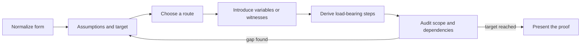
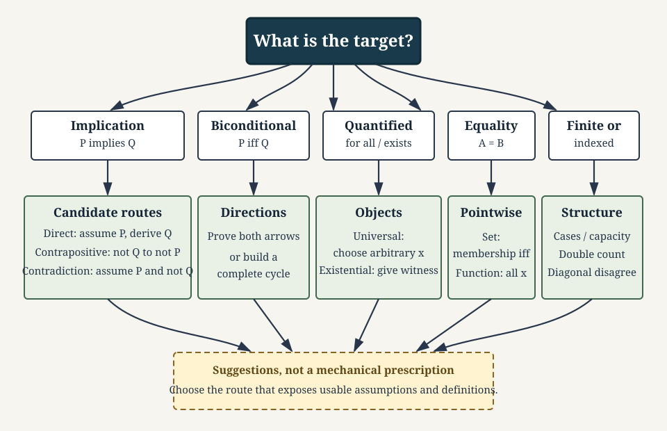
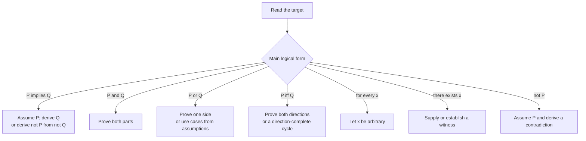
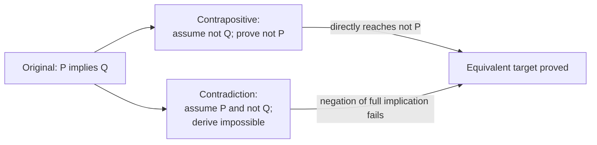
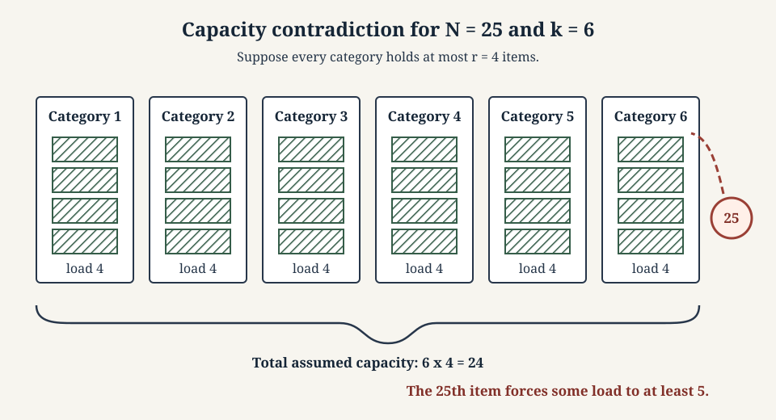
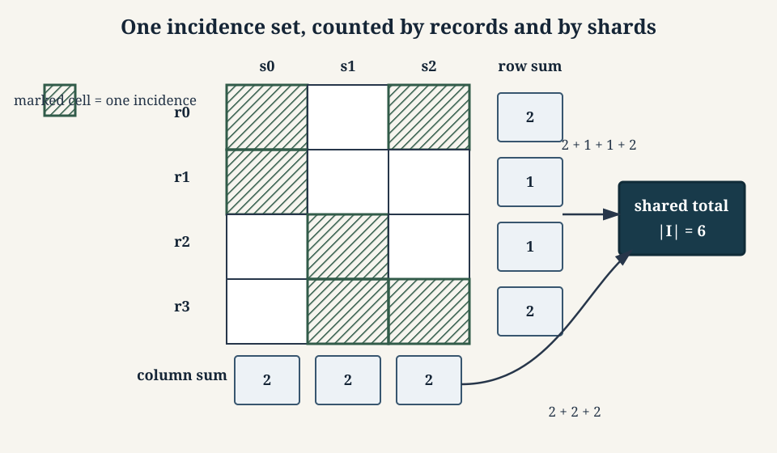
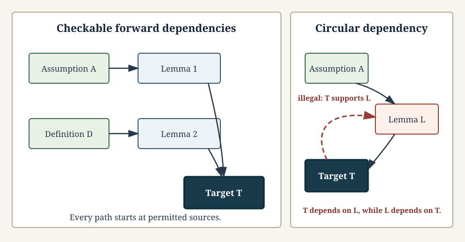
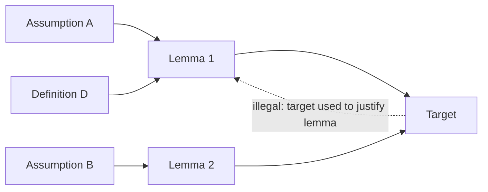

# 0.06 Proof Techniques

[Section home](../README.md) | Previous: [§0.05 Logic and Quantifiers](../00.05-logic-quantifiers/README.md) | [Project guides](../../STYLE_GUIDE.md) | [Notation guide](../../NOTATION.md)

## Why this matters

A proof is a truth-preserving argument from stated assumptions to a stated conclusion. It is also communication: another reader should be able to identify every object, check every inference, and see that the final sentence is the promised target.

Those two jobs cannot be separated. A correct idea hidden behind ambiguous variables is not yet a checkable proof. A polished paragraph built around an invalid inference is not rescued by its style. Stanford CS103's current proof-writing checklist makes this connection explicit through assumptions and targets, variable provenance, load-bearing sentences, definition use, complete prose, and the warning against a needless "contradiction sandwich" [1]. Its course materials are copyrighted, so this module links to that checklist but does not adapt its exercises or examples.

The organizing idea here is to treat proof techniques as **goal transformations**:

1. normalize the logical form;
2. write the assumptions and exact target;
3. choose a route that exposes usable structure;
4. introduce arbitrary objects or witnesses with correct scope;
5. derive the load-bearing steps;
6. audit dependencies, domains, and the reached target.



> **Figure 1. Proof construction is an auditable transformation process.** Discovery may loop, but the presented argument must expose a checkable path from assumptions to target. Original diagram.



> **Figure 2. Logical form suggests candidate routes without prescribing one perfect method.** Several routes may work, and a direct route is not always shortest. Shape, labels, and line patterns carry the distinctions without relying on color. Original figure.

This matters throughout computer science and AI. A correctness proof connects a program and a specification under explicit assumptions. Case analysis follows branches in an algorithm. Counterexamples become adversarial tests. Invariants, developed in §0.07, explain what a loop or state transition preserves. Diagonalization proves impossibility results. Property tests search finite spaces for failures, while proofs establish claims over the declared mathematical domain.

An empirical model result is not a theorem without assumptions and an argument. A benchmark can support an empirical claim about tested conditions. It cannot by itself establish universal correctness, fairness, robustness, or safety.

### Scope and non-goals

We will cover:

- what proofs, definitions, theorems, lemmas, corollaries, conjectures, and counterexamples do;
- proof planning from connectives, quantifiers, definitions, and object provenance;
- direct proof, cases, exhaustive coverage, and valid uses of symmetry;
- contraposition and contradiction as distinct transformations;
- biconditionals and equivalence cycles;
- constructive, nonconstructive, and unique existence;
- disproof, set equality, function equality, and relation-property proofs;
- the simple and generalized pigeonhole principle;
- extremal reasoning, double counting, and a small combinatorial proof;
- diagonalization as a reusable construction pattern;
- finite proof-support code and experiments with explicit limits;
- proof audits and common failure modes;
- exact links to correctness, verification, algorithms, and AI claims.

This module is explicitly **not**:

- induction, recursion, or invariant proofs, which belong to §0.07;
- a full combinatorics course, which belongs to §0.08;
- a formal natural-deduction or sequent-calculus course;
- axiomatic foundations;
- automated theorem proving;
- a deep comparison of constructive and classical philosophies;
- research-level proof complexity.

Induction receives only a failure-mode preview here: both a valid base case and a valid inductive step are necessary. The method itself comes next.

## Learning objectives

After completing this module, you should be able to:

- transform a quantified logical target into explicit assumptions, objects, witnesses, and subgoals;
- choose and justify direct, case-based, contrapositive, contradiction, existence, equality, counting, or diagonal routes;
- write proofs with correct variable provenance, scope, domain restrictions, and dependency structure;
- prove biconditionals, unique existence, set equality, and function equality using their defining obligations;
- apply generalized pigeonhole and double-counting arguments with precise finite assumptions;
- construct counterexamples and use finite search without overclaiming an infinite theorem;
- audit a proof for circularity, hidden converses, missing cases, illegal operations, leaked witnesses, and mismatched targets;
- distinguish theorem-backed guarantees from tests, simulations, and empirical AI evidence.

The [exercise set](exercises/README.md) assesses every objective. Full [worked solutions](solutions/README.md) are separate, and the [resource guide](resources/README.md) provides deeper treatments.

## Prerequisite check

Required: [§0.05 Logic and Quantifiers](../00.05-logic-quantifiers/README.md).

Try these before starting:

1. Can you rewrite $P\iff Q$ as two implications?
2. Can you negate $\forall x\,\exists y\,R(x,y)$ mechanically?
3. Can you distinguish a universal claim from an existential claim?
4. Can you explain why one countermodel refutes semantic validity?
5. Can you identify the converse and contrapositive of $P\implies Q$?
6. Can you track whether a variable is free, bound, arbitrary, or a witness?

Review §0.05 if implication direction, quantifier order, or witness scope is uncertain. [§0.04 Sets, Relations, and Functions](../00.04-sets-relations-functions/README.md) is recommended because many examples use set equality, functions, relations, and diagonalization.

## Historical context

Proof practices long predate modern symbolic logic. What counts as enough detail has always depended on audience, available definitions, accepted prior results, and the purpose of the argument. A proof in an introductory course may expand divisibility from its definition; a later paper may cite that fact as routine. Rigor is not maximal length. It is enough explicit structure for the intended audience to verify the claim without supplying a missing argument.

MIT's *Mathematics for Computer Science* organizes its first unit around proofs before moving to structures and counting [2]. Oscar Levin's open discrete-mathematics text introduces proof methods within a broader logic and discrete-mathematics course and is licensed CC BY-SA 4.0 [3]. Richard Hammack's *Book of Proof*, third edition with the 3.4 correction release, separates direct, contrapositive, contradiction, set, disproof, and induction chapters [4]. It is licensed CC BY-NC-ND 4.0, so we link to it without adapting its text or exercises.

Formalization makes hidden assumptions unusually visible. *Mathematics in Lean* develops irrational-root arguments by naming coprimality, divisibility, primality, and nonzero assumptions, and it shows how proof obligations change across number systems [5]. We use an informal proof here, but the same audit discipline applies.

The semantic distinction from §0.05 remains in force. A valid argument has no interpretation with true premises and false conclusion; a derivation is a finite object in a chosen deductive system [6]. This module teaches ordinary mathematical proof construction without pretending that one informal style is itself a complete formal calculus.

The current Open Logic Project build index keeps proof methods and induction in separate components, matching this module's boundary with §0.07 [7]. Its methods PDF exists, but direct extraction did not produce usable text, so we make no page-specific claim from it.

## Intuition

### What a proof establishes

Suppose assumptions $A_1,\ldots,A_m$ describe the setting and $T$ is the target. A proof establishes that the assumptions are sufficient for the target:

$$
A_1,\ldots,A_m\models T
$$

at the semantic level, or that $T$ is derivable from them in a chosen sound proof system at the syntactic level. Ordinary mathematical prose usually leaves the formal system implicit. It must not leave the logical dependencies mysterious.

A valid argument can start from false premises. That does not make the conclusion established about the intended problem. To apply a theorem, we also need its premises to hold in the current setting.

| Item | Role | Truth status before resolution |
|---|---|---|
| definition | fixes the meaning of a term or symbol | adopted convention |
| theorem | proved mathematical claim | established |
| lemma | supporting theorem used in a larger argument | established |
| corollary | theorem following quickly from earlier results | established |
| conjecture | claim proposed but not proved or refuted | open |
| example | one object illustrating a definition or phenomenon | local fact |
| witness | one object establishing an existential claim | proof component |
| counterexample | one object violating a universal claim | disproof component |

Names such as `lemma` and `theorem` usually describe a result's role, not its logical strength. A corollary still requires a valid derivation. A definition is not proved true; it sets a meaning that later claims use.

### Discovery and presentation are different

Discovery is allowed to be untidy. You may compute small cases, draw a diagram, search for a counterexample, inspect a program trace, or try a stronger claim and watch it fail. These activities can reveal the structure a proof should use.

Presentation answers a different question: what argument establishes the final claim? A polished proof normally omits abandoned paths and keeps only steps that carry dependency weight.

Experiments can do several legitimate jobs:

- refute a universal claim by finding one genuine counterexample;
- prove a claim over a finite domain by checking every member;
- suggest a pattern worth proving;
- test a proof's implementation or arithmetic;
- identify a missing assumption.

They cannot establish an infinite universal merely because many cases passed. Exhaustive verification is a proof only for the finite domain actually exhausted.

### Start from logical form

The main connective and quantifiers tell you what evidence the target asks for.



> **Figure 3. Logical form supplies candidate proof obligations.** The diagram suggests openings, not a mechanical guarantee that one route will be elegant. Original diagram.

A direct route is often clearest, but it is not always shortest. If the conclusion is negative, a contrapositive may expose a positive definition. If a claim concerns all assignments into a few categories, a capacity contradiction may reveal pigeonhole structure. If every candidate is indexed, a diagonal construction may create one object that escapes them all.

## Mathematics

### A proof-planning ledger

Before proving anything, write a ledger.

| Question | What to record |
|---|---|
| exact statement | quantifiers, connectives, domain, and conclusion |
| object provenance | arbitrary input, existential witness, chosen definition, or cited result |
| assumptions | every condition currently available |
| target | the exact formula or property still required |
| useful definitions | expansions that expose algebra, membership, or witnesses |
| candidate routes | direct, cases, contrapositive, contradiction, equality, counting, diagonal |
| edge cases | empty sets, zero divisors, boundary values, degenerate structures |
| legal operations | domain closure, nonzero divisors, finite sums, defined expressions |

For

$$
\forall n\in\mathbb{Z},
\quad
6\mid n\implies3\mid n,
$$

the ledger says:

- $n$ is an arbitrary integer;
- assumption: $6\mid n$;
- target: $3\mid n$;
- definition: $6\mid n$ means $n=6k$ for some integer $k$;
- candidate route: direct;
- useful rewrite: $n=3(2k)$;
- closure fact: $2k\in\mathbb{Z}$.

That is nearly the complete proof because the logical form and definition expose the witness the target needs.

### Direct proof

To prove

$$
\forall x\in D,
\quad
P(x)\implies Q(x),
$$

let $x$ be an arbitrary element of $D$, assume $P(x)$, and derive $Q(x)$. The word **arbitrary** matters. The proof may use only facts available for every permitted $x$, not a convenient special value.

Direct proof often follows definitions forward:

$$
P(x)
\Longrightarrow
\text{definition of }P
\Longrightarrow
\text{algebra or cited lemma}
\Longrightarrow
\text{definition of }Q
\Longrightarrow
Q(x).
$$

A definition supplies usable structure. If $n$ is even, write $n=2k$ for an integer $k$. The $k$ is not arbitrary. Its existence comes from the definition applied to the already chosen $n$.

### Proof by cases

A proof by cases partitions the possibilities into subproblems. If

$$
C_1\lor\cdots\lor C_r
$$

covers every permitted object, and each $C_i$ implies target $T$, then $T$ follows.

Cases need not be disjoint. Overlap may repeat work, but it does not invalidate the proof. Missing coverage is fatal: an uncovered object receives no argument.

For real $x$, the cases $x\le0$ and $x\ge0$ overlap at zero and still cover all reals. The cases $x<0$ and $x>0$ are disjoint but miss zero.

A finite exhaustion proof is case analysis in which the declared domain itself is finite. Checking all sixteen bit strings of length four can prove a statement about those sixteen strings. It does not prove the analogous statement for all finite bit strings unless an additional argument reduces every length to those cases.

### Without loss of generality

"Without loss of generality," abbreviated WLOG, is a reduction claim. It is valid only when every omitted case can be transformed into a treated case while preserving the assumptions and target.

For a statement symmetric in $x$ and $y$, we may sometimes assume $x\le y$ because a case with $x>y$ becomes a treated case after swapping the names. A complete WLOG justification names:

1. the transformation, such as $(x,y)\mapsto(y,x)$;
2. why the transformed object remains in the domain;
3. why assumptions are preserved;
4. why the target is preserved or transfers back.

WLOG is invalid when order or labels matter. A claim about the first coordinate cannot be reduced by swapping coordinates unless the claim itself is invariant under that swap.

### Contraposition

To prove

$$
P\implies Q,
$$

it is logically equivalent in classical logic to prove

$$
\neg Q\implies\neg P.
$$

This is a proof of the contrapositive. State the transformed target before starting. Contraposition is useful when $\neg Q$ unfolds into positive structure that directly blocks $P$.

Example: to prove "if $n^2$ is even, then $n$ is even," prove its contrapositive: if $n$ is odd, then $n^2$ is odd. The oddness definition produces $n=2k+1$, and squaring preserves the required form.

Do not call this contradiction. No temporary assumption of the full target's negation is needed; we directly prove an equivalent implication.

### Contradiction

To prove a target $T$ by contradiction, assume the negation of the **full target**:

$$
\neg T,
$$

and derive an impossibility such as $R\land\neg R$, $0=1$, or violation of an established assumption. In classical logic, this establishes $T$.



> **Figure 4. Contraposition and contradiction begin from related but different obligations.** Contraposition proves another implication; contradiction assumes the complete failure condition $P\land\neg Q$. Original diagram.

For an implication, remember

$$
\neg(P\implies Q)
\equiv
P\land\neg Q.
$$

Assuming only $\neg Q$ is contraposition territory, not the negation of the full implication.

A **contradiction sandwich** wraps a direct proof in unnecessary contradiction language:

1. assume $\neg T$;
2. derive $T$ without using $\neg T$;
3. announce $T\land\neg T$.

Delete the wrapper and present the direct derivation. Contradiction is valuable when the negated target creates usable structure or when every direct route is materially less clear.

### Biconditionals

To prove

$$
P\iff Q,
$$

prove both

$$
P\implies Q
\qquad\text{and}\qquad
Q\implies P.
$$

Label the directions. One direction may be direct and the other contrapositive. Proving only the easier direction establishes an implication, not an equivalence.

For several equivalent conditions $A,B,C$, a direction-complete cycle suffices:

$$
A\implies B,
\qquad
B\implies C,
\qquad
C\implies A.
$$

Every condition reaches every other by following directed paths. For example, $A\implies C$ follows through $B$, and $C\implies B$ follows through $A$. A chain

$$
A\implies B\implies C
$$

without a route back proves only one-way consequences.

### Existence

To prove

$$
\exists x\in D\,P(x),
$$

a **constructive proof** supplies an explicit witness $w\in D$ and verifies $P(w)$.

A **nonconstructive proof** establishes that a witness exists without identifying one in a directly usable form. Classical case splits, contradiction, compactness, or counting may do this. State when a proof uses a classical principle such as excluded middle.

One example can prove an existential claim because the object is a witness. The same example cannot prove a universal claim.

An existence witness introduced while using an assumption has local scope. From $\exists x\,P(x)$, we may temporarily name a fresh $c$ with $P(c)$. A final conclusion independent of the witness may follow. We may not conclude a formula containing that particular $c$ as though the existential premise had named it globally.

### Unique existence

To prove

$$
\exists!x\in D\,P(x),
$$

prove two separate obligations:

1. **existence:** some $w\in D$ satisfies $P(w)$;
2. **uniqueness:** if $y,z\in D$ both satisfy $P$, then $y=z$.

A proof of uniqueness alone establishes "at most one." It is vacuously true when no witness exists. A proof of existence alone permits several witnesses.

### Disproof and counterexamples

A universal claim

$$
\forall x\in D\,P(x)
$$

is disproved by one $a\in D$ with $\neg P(a)$. The domain check is part of the counterexample.

An existential claim

$$
\exists x\in D\,P(x)
$$

cannot be disproved by showing that several candidates fail. Its negation is

$$
\forall x\in D\,\neg P(x),
$$

so disproof requires universal reasoning over $D$, or an exhaustive check when $D$ is explicitly finite.

Keep these roles separate:

| Object | What it establishes |
|---|---|
| example | one local instance, with no automatic general conclusion |
| witness | an existential claim |
| counterexample | failure of a universal claim |

The same object can play different roles relative to different statements. The integer $2$ is a witness that an even prime exists and a counterexample to "every prime is odd."

### Set equality

To prove $A=B$, use elementwise equivalence:

$$
\forall x,
\quad
x\in A\iff x\in B.
$$

Equivalently, prove both inclusions:

$$
A\subseteq B
\qquad\text{and}\qquad
B\subseteq A.
$$

One inclusion is not equality. Set algebra may shorten a proof, but each identity it uses must already be known under the same ambient-universe convention.

### Function equality

For functions with the same declared domain and codomain,

$$
f=g
$$

is proved pointwise:

$$
\forall x\in D,
\quad
f(x)=g(x).
$$

Matching outputs on a few inputs is evidence, not function equality, unless the domain is exactly those finitely many inputs and all were checked.

### Relation properties as proof templates

Definitions from §0.04 become reusable proof forms.

| Property | Standard opening and target |
|---|---|
| reflexive | let arbitrary $x\in A$; prove $xRx$ |
| symmetric | assume $xRy$; prove $yRx$ |
| antisymmetric | assume $xRy$ and $yRx$; prove $x=y$ |
| transitive | assume $xRy$ and $yRz$; prove $xRz$ |

A finite relation checker can verify all tuples for one relation. A symbolic proof establishes the property for the full declared relation, including an infinite domain.

### The pigeonhole principle

The simple principle states:

> If $N$ objects are assigned to $k$ categories, with $N>k\ge1$, then some category receives at least two objects.

The generalized form states:

> If $N$ objects are assigned to $k\ge1$ categories, then some category receives at least
> $$
> \left\lceil\frac{N}{k}\right\rceil
> $$
> objects.

The assignment must place each counted object into one of the $k$ categories. Categories may initially be empty. If objects can be unassigned, or if the value of $k$ is wrong, the guarantee does not follow.



> **Figure 5. The generalized capacity contradiction.** If every category held at most $r$, total capacity would be at most $kr$; a larger total forces some category above $r$. Count labels and filled slots encode the argument without color alone. Original figure.

The exact lower bound is $\lceil N/k\rceil$. It says **at least**, not exactly. For $N=25$ and $k=6$, some category has at least $5$ objects. Another assignment may put all $25$ in one category.

An equivalent capacity form is often easier to use:

> If each of $k$ categories has capacity at most $r$, then at most $kr$ objects can be assigned without overflow.

Thus $N>kr$ forces a category with at least $r+1$ objects.

### Extremal and worst-case reasoning

An extremal proof chooses an object that is smallest, largest, earliest, latest, or otherwise optimal under a declared finite or well-founded measure. The extreme choice often forces structure that an arbitrary choice does not reveal.

A valid extremal proof must establish:

1. the candidate set is nonempty;
2. the selected extremum exists;
3. the comparison measure is defined;
4. the extremal property is actually used.

Worst-case reasoning is related but asks for the least favorable permitted arrangement. For generalized pigeonhole, the arrangement that delays a category reaching $r+1$ spreads objects as evenly as possible, placing at most $r$ in each category. Once the $(kr+1)$st object arrives, that strategy cannot continue.

Do not say "choose the smallest counterexample" over a set that may be empty or whose order need not have a minimum. §0.07 develops the well-ordering and induction machinery that often justifies minimal-counterexample arguments.

### Double counting

Double counting begins with one explicitly defined finite set $I$ of incidences and counts **that same set** in two ways.

Suppose $R$ is a finite set of records, $S$ is a finite set of shards, and relation $H\subseteq R\times S$ records which shard holds which record. Then

$$
I\coloneqq H
$$

can be counted by records or by shards:

$$
|I|
=
\sum_{r\in R}|\{s\in S:(r,s)\in H\}|
=
\sum_{s\in S}|\{r\in R:(r,s)\in H\}|.
$$



> **Figure 6. Row sums and column sums count the same finite incidence set.** Marks identify incidences; marginal counts and the shared total make both enumerations explicit. Original figure.

Merely writing two expressions and observing that they look equal is not double counting. Define the finite objects being counted, give a correspondence from each count to those objects, and explain why nothing is omitted or repeated incorrectly.

For a finite loop-free undirected graph $G=(V,E)$, define incidences

$$
I=\{(v,e)\in V\times E:\text{$v$ is an endpoint of $e$}\}.
$$

Counting by vertices gives $|I|=\sum_{v\in V}\deg(v)$. Counting by edges gives $|I|=2|E|$ because each edge has two distinct endpoints. Therefore

$$
\sum_{v\in V}\deg(v)=2|E|.
$$

We use loop-free graphs to avoid competing loop-degree conventions. Multigraphs are permitted if edge instances are distinct and every edge still has two endpoint incidences.

A **combinatorial proof** of an identity shows that both sides count the same finite set, perhaps using different classifications. This module uses one example but leaves systematic counting rules to §0.08.

### Diagonalization

Diagonalization starts from an indexed family of candidates and constructs an object that differs from candidate $i$ at coordinate $i$.

Given binary sequences

$$
s_0,s_1,s_2,\ldots,
$$

define

$$
t(i)=1-s_i(i).
$$

Then $t$ differs from $s_i$ at coordinate $i$, so it is absent from the indexed family. Two obligations carry the proof:

1. $t$ is well-defined and belongs to the target space;
2. for every index $i$, the coordinate comparison proves $t\ne s_i$.

§0.04 gives the full Cantor power-set argument. We do not repeat it here. The reusable technique is indexed disagreement. Later computability arguments encode programs or machines, arrange their behavior by index, and construct an object or behavior that escapes the proposed list.

The SEP set-theory entry provides broader context for Cantor's comparison of infinite cardinalities and the development of the subject [8]. Here we use only the proof pattern already established in §0.04.

Diagonalization and self-reference are not identical. A diagonal construction compares index $i$ with coordinate or input $i$. Some impossibility proofs then use an encoded object on its own description, adding self-reference. Other diagonal proofs, including simple sequence arguments, require no semantic statement that talks about itself.

### A dependency audit

A proof can be modeled as a directed dependency graph. Assumptions and definitions are sources. Derived claims point forward to later claims. The target should be reachable without using itself as an ancestor.



> **Figure 7. A valid dependency graph is acyclic and reaches the target from permitted sources.** The contrasting dashed back-edge makes the circular dependency visible through both style and label. Original figure.



> **Figure 8. Dependency audit for circular reasoning.** Solid arrows show permitted forward support. The labeled dotted edge is illegal because it makes the target one of its own dependencies. Original diagram.

For every proof, ask:

- Where was each variable introduced?
- Is it arbitrary, existentially obtained, or explicitly chosen?
- Does every operation remain legal in the declared domain?
- Is every denominator or cancelled factor known nonzero?
- Do the cases cover every possibility?
- Are all hypotheses of each cited lemma available?
- Does the last derived claim match the target exactly?
- Was a converse used without proof?
- Was quantifier order preserved?
- Did a local existential witness leak into the conclusion?
- Does any claim depend, directly or indirectly, on itself?

## Derivation

### Deriving the generalized capacity bound

Let $N$ objects be assigned to $k\ge1$ categories. Define

$$
m\coloneqq\left\lceil\frac{N}{k}\right\rceil.
$$

Suppose for contradiction that every category contains at most $m-1$ objects. The total number assigned is then at most

$$
k(m-1).
$$

By the defining property of the ceiling,

$$
m-1<\frac{N}{k}.
$$

Because $k>0$, multiplication preserves the inequality:

$$
k(m-1)<N.
$$

Thus the categories could contain fewer than $N$ objects in total, contradicting that all $N$ objects were assigned. Therefore some category contains at least $m=\lceil N/k\rceil$ objects.

Notice every assumption in use: $N$ is a nonnegative integer, $k$ is a positive integer, each object is assigned, and each object contributes once to one category. If assignments can duplicate objects across categories, sum of category loads no longer equals $N$ unless incidences, rather than objects, are being counted.

### Deriving the handshake identity

Let $G=(V,E)$ be a finite loop-free undirected graph. Define

$$
I=\{(v,e):v\in V,\ e\in E,\ v\text{ is an endpoint of }e\}.
$$

Fix a vertex $v$. Exactly $\deg(v)$ incidences in $I$ have first coordinate $v$. The sets for distinct vertices are disjoint and cover $I$, so

$$
|I|=\sum_{v\in V}\deg(v).
$$

Fix an edge $e$. Because the graph is loop-free and undirected, $e$ has exactly two distinct endpoints, hence exactly two incidences. The edge classes are also disjoint and cover $I$, so

$$
|I|=\sum_{e\in E}2=2|E|.
$$

Equating two counts of the same $I$ gives

$$
\sum_{v\in V}\deg(v)=2|E|.
$$

As a corollary, the number of odd-degree vertices is even: the degree sum is even, and a sum of integers has odd parity exactly when it contains an odd number of odd summands.

### Deriving a combinatorial identity

For an $n$-element set $U$, define

$$
I=\{(S,x):S\subseteq U,\ x\in S\}.
$$

Count by the size $k=|S|$. There are $\binom{n}{k}$ choices for $S$ and then $k$ choices for $x\in S$, so

$$
|I|=\sum_{k=0}^{n}k\binom{n}{k}.
$$

Count by the distinguished element $x$. There are $n$ choices for $x$, and each of the other $n-1$ elements may be included or excluded independently from $S$. Therefore

$$
|I|=n2^{n-1}.
$$

Hence

$$
\sum_{k=0}^{n}k\binom{n}{k}=n2^{n-1}
$$

for positive integers $n$. The case $n=0$ needs separate interpretation because $2^{-1}$ appears on the right; the incidence set is empty and the left side is $0$.

### From specification to correctness obligation

Suppose a function `partition(values, pivot)` returns two lists. A partial specification might be:

1. every returned left value is at most `pivot`;
2. every returned right value is greater than `pivot`;
3. every input occurrence appears exactly once across the outputs.

A proof of only the first two properties does not establish the third. The function could discard every input and return two empty lists. Correctness requires all specified obligations under assumptions such as finite input and a comparison operation defined for every value.

A property test can search many finite lists and discover a violation. A proof must reason about an arbitrary permitted list, often using induction or an invariant. Those methods are deferred to §0.07, but specification completeness belongs in the audit now.

## Implementation

The following standard-library program supports proof discovery and audits over explicit finite inputs. It searches for counterexamples, checks case coverage, verifies two counts of one incidence set, checks generalized capacity bounds, and rejects cyclic proof dependencies.

```python
from collections import Counter, deque
from itertools import product
from math import ceil


def first_counterexample(domain, claim):
    """Return the first value failing claim, or None after full exhaustion."""
    for value in domain:
        if not claim(value):
            return value
    return None


def audit_case_coverage(domain, named_cases):
    """Report uncovered values and values covered by multiple named cases."""
    coverage = {
        value: tuple(
            name for name, predicate in named_cases if predicate(value)
        )
        for value in domain
    }
    missing = tuple(value for value, names in coverage.items() if not names)
    overlap = {
        value: names for value, names in coverage.items() if len(names) > 1
    }
    return missing, overlap


def verify_incidence_count(rows, columns, incidences):
    """Count one finite incidence set by its first and second coordinates."""
    row_set = set(rows)
    column_set = set(columns)
    incidence_set = set(incidences)
    allowed = set(product(row_set, column_set))
    if not incidence_set <= allowed:
        raise ValueError("incidence lies outside rows x columns")

    row_counts = Counter(row for row, _ in incidence_set)
    column_counts = Counter(column for _, column in incidence_set)
    row_total = sum(row_counts[row] for row in row_set)
    column_total = sum(column_counts[column] for column in column_set)
    assert row_total == len(incidence_set) == column_total
    return row_counts, column_counts, len(incidence_set)


def generalized_bucket_bound(assignments, category_count):
    """Verify the ceiling lower bound for one complete finite assignment."""
    if category_count < 1:
        raise ValueError("category_count must be positive")
    if any(not 0 <= category < category_count for category in assignments):
        raise ValueError("every assignment must name an existing category")
    loads = Counter(assignments)
    maximum_load = max((loads[index] for index in range(category_count)), default=0)
    guaranteed = ceil(len(assignments) / category_count)
    assert maximum_load >= guaranteed
    return guaranteed, maximum_load


def audit_dependency_dag(nodes, edges, assumptions, target):
    """Check names, acyclicity, and whether assumptions can reach target."""
    node_set = set(nodes)
    assumption_set = set(assumptions)
    if target not in node_set or not assumption_set <= node_set:
        raise ValueError("target and assumptions must be declared nodes")
    if any(left not in node_set or right not in node_set for left, right in edges):
        raise ValueError("edge contains an undeclared node")

    outgoing = {node: set() for node in node_set}
    indegree = {node: 0 for node in node_set}
    for left, right in set(edges):
        if right not in outgoing[left]:
            outgoing[left].add(right)
            indegree[right] += 1

    queue = deque(sorted(node for node in node_set if indegree[node] == 0))
    ordered = []
    while queue:
        node = queue.popleft()
        ordered.append(node)
        for successor in sorted(outgoing[node]):
            indegree[successor] -= 1
            if indegree[successor] == 0:
                queue.append(successor)

    acyclic = len(ordered) == len(node_set)
    reachable = set(assumption_set)
    changed = True
    while changed:
        changed = False
        for left, right in edges:
            if left in reachable and right not in reachable:
                reachable.add(right)
                changed = True
    return {
        "acyclic": acyclic,
        "target_reachable": target in reachable,
        "topological_order": tuple(ordered) if acyclic else None,
    }


assert first_counterexample(range(100), lambda n: n * n + n + 41 > 0) is None
assert first_counterexample(range(100), lambda n: n * n + n + 41 < 1600) == 39

missing, overlap = audit_case_coverage(
    range(-3, 4),
    (("nonpositive", lambda x: x <= 0), ("nonnegative", lambda x: x >= 0)),
)
assert missing == ()
assert overlap == {0: ("nonpositive", "nonnegative")}

missing, overlap = audit_case_coverage(
    range(-3, 4),
    (("negative", lambda x: x < 0), ("positive", lambda x: x > 0)),
)
assert missing == (0,)
assert overlap == {}

records = ("r0", "r1", "r2", "r3")
shards = ("s0", "s1", "s2")
holds = {
    ("r0", "s0"),
    ("r0", "s2"),
    ("r1", "s0"),
    ("r2", "s1"),
    ("r3", "s1"),
    ("r3", "s2"),
}
row_counts, column_counts, total = verify_incidence_count(
    records, shards, holds
)
assert total == 6
assert sum(row_counts.values()) == sum(column_counts.values()) == 6

assert generalized_bucket_bound((0, 1, 2, 0, 1, 2, 0), 3) == (3, 3)
assert generalized_bucket_bound((0,) * 7, 3) == (3, 7)

valid_graph = audit_dependency_dag(
    nodes=("A", "D", "L1", "L2", "T"),
    edges=(("A", "L1"), ("D", "L1"), ("L1", "L2"), ("L2", "T")),
    assumptions=("A", "D"),
    target="T",
)
assert valid_graph["acyclic"] and valid_graph["target_reachable"]

circular_graph = audit_dependency_dag(
    nodes=("A", "L", "T"),
    edges=(("A", "L"), ("L", "T"), ("T", "L")),
    assumptions=("A",),
    target="T",
)
assert not circular_graph["acyclic"]
```

Python documents `itertools.product` as a Cartesian-product iterator and `math.ceil` as the least integer greater than or equal to its input [9]. The code keeps all domains finite and explicit.

The assertions prove facts about the exact inputs they exhaust. They do not prove the generalized pigeonhole theorem, an infinite divisibility theorem, or correctness of arbitrary dependency graphs beyond those passed to the functions. The symbolic arguments in this lesson provide the general proofs.

## Experimentation

### Experiment 1: conjecture, test, repair

Consider the conjecture:

$$
\text{For every nonnegative integer }n,
\quad
n^2+n+41\text{ is prime.}
$$

Small values support it, but support is not proof. Search in increasing order:

```python
def is_prime(number):
    if number < 2:
        return False
    divisor = 2
    while divisor * divisor <= number:
        if number % divisor == 0:
            return False
        divisor += 1
    return True


def quadratic(number):
    return number * number + number + 41


counterexample = first_counterexample(
    range(10_000), lambda number: is_prime(quadratic(number))
)
assert counterexample == 40
assert quadratic(counterexample) == 41 * 41
assert all(is_prime(quadratic(number)) for number in range(40))
```

The minimum searched counterexample is $n=40$. One honest repair is the finite statement

$$
0\le n<40\implies n^2+n+41\text{ is prime},
$$

which exhaustive computation proves for exactly forty integers. It does not reveal a simple infinite prime-producing theorem. A stronger repair would require new mathematics, not a larger search limit.

### Experiment 2: mutate a proof obligation

The cancellation statement

$$
ab=ac\implies b=c
$$

is false over integers without $a\ne0$. Search a finite box:

```python
domain = tuple(product(range(-3, 4), repeat=3))
mutation_failure = first_counterexample(
    domain,
    lambda triple: (
        triple[0] * triple[1] != triple[0] * triple[2]
        or triple[1] == triple[2]
    ),
)
assert mutation_failure is not None
assert mutation_failure[0] == 0

repaired_failure = first_counterexample(
    domain,
    lambda triple: (
        triple[0] == 0
        or triple[0] * triple[1] != triple[0] * triple[2]
        or triple[1] == triple[2]
    ),
)
assert repaired_failure is None
```

The first result is a genuine counterexample to the unrestricted universal claim. The second result verifies the repaired implication only on the finite box. The general repaired theorem follows symbolically from legal cancellation in the integers when $a\ne0$.

Proof mutation is useful in specification work. Remove an assumption, reverse an implication, weaken a postcondition, or leak a local witness, then search for a countermodel. A found countermodel diagnoses the dependency. No countermodel in a bounded search is only bounded evidence.

### Experiment 3: finite capacity boundary

For fixed $N$ and $k$, enumerate every assignment of $N$ labeled jobs to $k$ queues and measure the smallest possible maximum load:

```python
def minimum_possible_maximum_load(object_count, category_count):
    maxima = []
    for assignment in product(range(category_count), repeat=object_count):
        _, maximum_load = generalized_bucket_bound(
            assignment, category_count
        )
        maxima.append(maximum_load)
    return min(maxima, default=0)


for category_count in range(1, 5):
    for object_count in range(0, 8):
        observed = minimum_possible_maximum_load(
            object_count, category_count
        )
        assert observed == ceil(object_count / category_count)
```

This exhaustive experiment establishes the exact optimum for the tested pairs $1\le k\le4$ and $0\le N\le7$. The capacity derivation proves the general lower bound. Balanced assignments show the bound is attainable for every finite $N$ and positive $k$.

### Experiment 4: incidence counting

Use the `holds` relation from the implementation. Row counts are $(2,1,1,2)$ and column counts are $(2,2,2)$. Both sum to six because both enumerate the same six ordered pairs.

Mutate one representation without mutating the incidence set, for example by claiming that `r2` has two incidences. The row total becomes seven while the column total remains six. The mismatch does not refute double counting; it identifies an inconsistent derived count.

## Worked examples

### Worked example 1: direct parity proof

**Claim.** If $m$ is even and $n$ is odd, then $m+n$ is odd.

Let $m,n\in\mathbb{Z}$ be arbitrary with $m$ even and $n$ odd. By definition, there are integers $a,b$ such that

$$
m=2a,
\qquad
n=2b+1.
$$

Therefore

$$
m+n=2a+2b+1=2(a+b)+1.
$$

Because $a+b\in\mathbb{Z}$, the final expression has the definition of an odd integer. Thus $m+n$ is odd.

The proof uses arbitrary $m,n$, existentially obtained $a,b$, integer closure, and the exact target definition.

### Worked example 2: direct divisibility proof

**Claim.** For integers $a,b,c$, if $a\mid b$ and $b\mid c$, then $a\mid c$.

Assume $a\mid b$ and $b\mid c$. There are integers $r,s$ with

$$
b=ar,
\qquad
c=bs.
$$

Substitution gives

$$
c=(ar)s=a(rs).
$$

Since $rs\in\mathbb{Z}$, the definition of divisibility gives $a\mid c$. No division by $a$ is needed, so the argument remains valid when $a=0$ under the usual definition $a\mid b\iff\exists k\in\mathbb{Z}, b=ak$.

### Worked example 3: exhaustive cases

**Claim.** For every integer $n$, the product $n(n+1)$ is even.

Every integer is even or odd. If $n=2k$, then

$$
n(n+1)=2k(n+1),
$$

which is even. If $n=2k+1$, then $n+1=2(k+1)$ and

$$
n(n+1)=n\,2(k+1),
$$

which is even. The cases are exhaustive, so the claim holds for every integer.

The proof does not need the cases to be represented by every possible remainder formula at once. It needs coverage and a valid derivation in each branch.

### Worked example 4: valid WLOG

**Claim.** For all real $x,y$,

$$
|x-y|=\max(x,y)-\min(x,y).
$$

The statement is preserved when $x$ and $y$ are swapped: both $|x-y|$ and the unordered pair of maximum and minimum remain unchanged. Therefore it is enough to treat $x\le y$. In that case,

$$
|x-y|=y-x,
\qquad
\max(x,y)=y,
\qquad
\min(x,y)=x,
$$

so the identity follows. If $x>y$, swapping the names reduces it to the treated case and preserves both sides. This final symmetry sentence is the WLOG justification.

### Worked example 5: invalid WLOG

**False reduction.** "For every ordered pair $(x,y)$ of distinct reals, WLOG assume $x<y$ and conclude that the first coordinate is smaller."

Swapping $(x,y)$ changes which value is the first coordinate. The target $x<y$ is not preserved by the transformation. The pair $(3,1)$ is not covered by a proof about the original first coordinate under $x<y$. The omitted case is exactly where the claimed universal fails.

WLOG can reduce a symmetric theorem about the unordered values. It cannot erase an asymmetric target.

### Worked example 6: contrapositive

**Claim.** If $n^2$ is even for an integer $n$, then $n$ is even.

We prove the contrapositive. Assume $n$ is odd, so $n=2k+1$ for an integer $k$. Then

$$
n^2=(2k+1)^2=4k^2+4k+1=2(2k^2+2k)+1.
$$

Thus $n^2$ is odd and therefore not even. The contrapositive is proved, so the original implication follows.

### Worked example 7: contradiction and irrationality

**Claim.** $\sqrt2$ is irrational.

Assume for contradiction that $\sqrt2=p/q$ for integers $p,q$ with $q\ne0$. Choose the representation in lowest terms, so $\gcd(|p|,|q|)=1$, and replace both signs if needed so $q>0$. Squaring gives

$$
p^2=2q^2.
$$

Hence $p^2$ is even. By Worked example 6, $p$ is even, so $p=2r$ for some integer $r$. Substitute:

$$
4r^2=2q^2,
$$

and cancel the nonzero integer factor $2$ to obtain

$$
q^2=2r^2.
$$

Therefore $q^2$ and then $q$ are even. Both $p$ and $q$ are divisible by $2$, contradicting that they are coprime. The rationality assumption is false, so $\sqrt2$ is irrational.

The proof needs $q\ne0$, a lowest-terms representation, the parity lemma, and legal cancellation. *Mathematics in Lean* makes the same kinds of assumptions explicit in its formalized irrational-root development [5].

### Worked example 8: biconditional

**Claim.** An integer $n$ is odd if and only if $n^2$ is odd.

Forward direction: if $n=2k+1$, the expansion in Worked example 6 shows

$$
n^2=2(2k^2+2k)+1,
$$

so $n^2$ is odd.

Reverse direction: prove the contrapositive. If $n$ is even, write $n=2k$. Then

$$
n^2=4k^2=2(2k^2),
$$

so $n^2$ is even and therefore not odd. Both directions are established.

### Worked example 9: equivalence cycle

For an integer $n$, consider:

- $A$: $n$ is even;
- $B$: $n^2$ is even;
- $C$: $n^2+2n$ is even.

$A\implies B$ follows by writing $n=2k$. For $B\implies C$, add the even integer $2n$ to even $n^2$. For $C\implies A$, use contraposition: if $n$ is odd, then $n^2$ is odd while $2n$ is even, so $n^2+2n$ is odd. The cycle has a directed path between every pair, so all three statements are equivalent.

### Worked example 10: constructive existence

**Claim.** Every integer is the midpoint of two distinct integers.

Let arbitrary $n\in\mathbb{Z}$. Choose

$$
a=n-1,
\qquad
b=n+1.
$$

Then $a,b\in\mathbb{Z}$, $a\ne b$, and

$$
\frac{a+b}{2}
=
\frac{(n-1)+(n+1)}{2}
=n.
$$

The formulas give usable witnesses for each input $n$.

### Worked example 11: classical nonconstructive existence

**Claim.** There exist irrational positive real numbers $a,b$ such that $a^b$ is rational.

Let

$$
x=(\sqrt2)^{\sqrt2}.
$$

By classical excluded middle, either $x$ is rational or $x$ is irrational.

- If $x$ is rational, choose $a=b=\sqrt2$.
- If $x$ is irrational, choose $a=x$ and $b=\sqrt2$. Then
  $$
  a^b
  =
  \left((\sqrt2)^{\sqrt2}\right)^{\sqrt2}
  =
  (\sqrt2)^2
  =2.
  $$

In either case irrational positive $a,b$ exist with rational $a^b$. The argument is nonconstructive in the narrow sense that it does not decide which branch $x$ occupies. It explicitly uses classical case reasoning.

### Worked example 12: unique existence

**Claim.** There is exactly one real $x$ satisfying $x+3=7$.

Existence: $x=4$ satisfies $4+3=7$.

Uniqueness: if real $y$ satisfies $y+3=7$, subtracting $3$ from both sides gives $y=4$. Therefore every solution equals the exhibited witness, so exactly one exists.

### Worked example 13: one counterexample

**Claim to refute.** Every prime integer is odd.

The integer $2$ is prime, lies in the declared domain, and is even. Therefore it violates the universal predicate. One counterexample refutes the claim.

Checking $4,6,8$ would not help because they are outside the restricted class of primes. A counterexample must satisfy the claim's assumptions and fail its conclusion.

### Worked example 14: set equality

**Claim.** For sets $A,B,C$,

$$
A\setminus(B\cup C)
=
(A\setminus B)\cap(A\setminus C).
$$

Let $x$ be arbitrary. Then

$$
\begin{aligned}
x\in A\setminus(B\cup C)
&\iff x\in A\text{ and }x\notin B\cup C\\
&\iff x\in A\text{ and }x\notin B\text{ and }x\notin C\\
&\iff x\in(A\setminus B)\cap(A\setminus C).
\end{aligned}
$$

The membership conditions agree for arbitrary $x$, so extensionality gives equality. The chain proves both directions at once through biconditionals.

### Worked example 15: function equality

Define $f,g:\mathbb{R}\to\mathbb{R}$ by

$$
f(x)=x^2+2x+1,
\qquad
g(x)=(x+1)^2.
$$

For arbitrary $x\in\mathbb{R}$,

$$
g(x)=(x+1)^2=x^2+2x+1=f(x).
$$

Thus $f(x)=g(x)$ for every domain input, so $f=g$. Their formulas looking different is irrelevant; pointwise values and declared function types determine equality.

### Worked example 16: simple pigeonhole

Thirteen jobs are assigned to twelve monthly queues. Because every job enters one of the twelve queues and $13>12$, at least one queue contains at least two jobs.

The conclusion does not identify which queue and does not say only one queue has two jobs.

### Worked example 17: generalized pigeonhole

Twenty-five records are assigned to six shards. Then some shard stores at least

$$
\left\lceil\frac{25}{6}\right\rceil=5
$$

records. If every shard held at most four, total capacity would be at most $6\cdot4=24$, less than the twenty-five assigned records.

### Worked example 18: handshake double count

A loop-free undirected graph has vertex degrees $3,3,2,2,2$. Their sum is $12$, so the handshake identity gives

$$
2|E|=12
\quad\Longrightarrow\quad
|E|=6.
$$

The arithmetic is valid only after the graph assumptions justify the identity. A directed graph would need in-degree and out-degree counts instead.

### Worked example 19: incidence double count

Suppose records $r_0,r_1,r_2,r_3$ have shard-copy counts $2,1,1,2$. Counting by records gives six incidences. Suppose shards $s_0,s_1,s_2$ each hold two records. Counting by shards also gives six.

The conclusion is not based on matching totals by coincidence. Both lists count the same relation

$$
H\subseteq\{r_0,r_1,r_2,r_3\}\times\{s_0,s_1,s_2\}.
$$

### Worked example 20: combinatorial identity

For $n=4$,

$$
\sum_{k=0}^{4}k\binom{4}{k}
=0+4+12+12+4=32.
$$

The other count gives

$$
4\cdot2^3=32.
$$

Both count pairs $(S,x)$ where $S\subseteq\{1,2,3,4\}$ and $x\in S$. The numerical check illustrates the general double-counting proof derived earlier.

### Worked example 21: diagonalization pattern

Suppose $s_0,s_1,s_2,\ldots$ is claimed to list every infinite binary sequence. Define $t(i)=1-s_i(i)$. The sequence $t$ is binary because each value is either zero or one. For arbitrary index $j$,

$$
t(j)=1-s_j(j)\ne s_j(j).
$$

Thus $t\ne s_j$. Since $j$ was arbitrary, $t$ is absent from every row. This is the reusable pattern from §0.04, stated without repeating the full Cantor power-set proof.

### Worked example 22: audit a broken cancellation proof

**Broken proof.** Assume $ab=ac$. Divide both sides by $a$ to get $b=c$.

The operation is illegal when $a=0$. Indeed,

$$
0\cdot1=0\cdot2
$$

but $1\ne2$. The repaired theorem adds $a\ne0$. Over the integers or reals, legal cancellation then yields $b=c$.

The counterexample identifies the missing assumption. It does not merely say the proof is poorly written; it refutes the original statement.

### Worked example 23: audit a hidden converse

Assume a specification says:

$$
Approved(x)\implies Reviewed(x).
$$

A proof that starts from $Reviewed(r)$ and concludes $Approved(r)$ uses the converse. A countermodel has one reviewed but unapproved record. The original implication remains true because every approved record is reviewed, while the converse fails.

### Worked example 24: audit witness leakage

From

$$
\exists x\,Passed(x),
$$

let fresh $c$ satisfy $Passed(c)$. It is valid to conclude

$$
\exists y\,Passed(y)
$$

or any witness-independent consequence derived from $Passed(c)$. It is not valid to finish with "therefore $Passed(c)$ for this globally named record $c$" after closing the existential subargument. The premise guaranteed some witness, not a persistent public identifier.

## Common mistakes

### Circular reasoning

The proof assumes the target directly or cites a lemma whose proof depends on the target. Draw the dependency graph. Any directed cycle involving the target requires repair.

### Assuming the conclusion

Beginning a direct proof of $P\implies Q$ with both $P$ and $Q$ proves nothing. In contradiction, assuming $\neg(P\implies Q)$ is permitted because it is the target's negation, but the contradiction must use that assumption.

### Proving the converse

A proof of $Q\implies P$ does not establish $P\implies Q$. Rewrite both directions before starting and label the direction being proved.

### Swapping quantifiers

A witness chosen after an arbitrary input may depend on that input. Moving $\exists y$ before $\forall x$ demands one shared witness. Preserve order and record dependencies.

### Treating examples as universal proof

Examples can refute a universal or prove an existential. They do not prove a universal over an infinite domain.

### Illegal cancellation or division

Before dividing by $a$ or cancelling it from $ab=ac$, establish $a\ne0$. Before applying an operation, check closure and definition in the current domain.

### WLOG without symmetry

Name the transformation and prove that it preserves assumptions and target. Familiar-looking variables are not a symmetry argument.

### Missing cases

Case labels must cover the domain. Overlap is acceptable; omission is not. Test boundary values where strict inequalities meet.

### Existential witness leakage

A fresh witness from an existential premise is local. Final conclusions must not depend on its accidental name unless the witness was explicitly constructed and remains in scope.

### Contradiction sandwich

If the central derivation proves the target without using its negation, present it directly. Extra contradiction syntax hides the actual route.

### Broken induction preview

Checking a base case without an inductive step proves one case. Giving an inductive step without a valid base may prove no case at all. §0.07 develops the full method.

### Stronger or weaker theorem mismatch

Proving a weaker conclusion than requested leaves the target open. Attempting a stronger claim may fail even when the original is true. Compare the final sentence symbol for symbol with the target.

### Overclaiming computer checks

A program that checks $0\le n<10^6$ proves a finite statement if it is correct and exhaustive over that range. It does not prove a claim for every integer. A property test is a counterexample search, not a universal theorem generator.

### Confusing validity with true premises

A valid argument may have false premises. To apply it to the intended problem, verify that the assumptions actually hold. A theorem invocation is only as strong as its premise check.

### Hiding specification assumptions

Correctness claims depend on an input model, preconditions, arithmetic semantics, termination requirements, and postconditions. State them. A result about exact integers may fail under fixed-width overflow; a deterministic guarantee may not describe a randomized or learned system.

## Exercises

Complete [E0.06.01 through E0.06.12](exercises/README.md), then compare your work with the [full solutions](solutions/README.md). Use the [resources](resources/README.md) for a second treatment and source guidance.

## What you should now be able to do

You should now be able to:

- parse a theorem into arbitrary objects, assumptions, target, and witness dependencies;
- use logical form to generate candidate proof routes without treating the choice as mechanical;
- write direct, case, contrapositive, contradiction, biconditional, existence, and uniqueness proofs;
- justify WLOG through an explicit symmetry or reduction;
- disprove universals with counterexamples and disprove existentials with universal reasoning;
- prove set and function equalities through their defining pointwise obligations;
- apply finite capacity, extremal, double-counting, and diagonal arguments;
- use code to discover failures and verify finite domains while preserving the evidence boundary;
- audit variables, operations, cases, dependencies, quantifiers, and the final target;
- state CS and AI guarantees only under the assumptions their proofs actually use.

## Where this leads

Proof planning becomes more powerful when a claim is indexed by natural numbers, recursively defined structures, or program states. [§0.07 Induction, Recursion, and Invariants](../00.07-induction-recursion-invariants/README.md) develops those methods next.

§0.08 will develop counting rules beyond the small double-counting preview here. Later modules use these proof habits for probability bounds, algorithm correctness, optimization guarantees, computability, verification, learning theory, and careful interpretation of empirical AI results.

## References

[1] Stanford University, "Proofwriting Checklist," *CS103: Mathematical Foundations of Computing*, Summer 2026. Course page last updated 2026-06-22; checklist last updated 2026-04-01. https://web.stanford.edu/class/archive/cs/cs103/cs103.1268/proofwriting_checklist. Accessed 2026-09-01.

[2] E. Lehman, F. T. Leighton, and A. R. Meyer, *Mathematics for Computer Science*, with MIT 6.042J OpenCourseWare, Spring 2015, Unit 1: Proofs and Unit 3: Counting. MIT OCW license: CC BY-NC-SA 4.0. https://ocw.mit.edu/courses/6-042j-mathematics-for-computer-science-spring-2015/pages/readings/. Accessed 2026-09-01.

[3] O. Levin, *Discrete Mathematics: An Open Introduction*, 3rd ed., 2023, §3.2 and related proof sections. License: CC BY-SA 4.0. https://discrete.openmathbooks.org/dmoi3.html. Accessed 2026-09-01.

[4] R. Hammack, *Book of Proof*, 3rd ed., revision 3.4, 2025, Parts II-III. License: CC BY-NC-ND 4.0. https://richardhammack.github.io/BookOfProof/. Accessed 2026-09-01.

[5] J. Avigad and P. Massot, *Mathematics in Lean*, Chapter 5, "Elementary Number Theory," 2020-2025. License: CC BY 4.0. https://leanprover-community.github.io/mathematics_in_lean/C05_Elementary_Number_Theory.html. Accessed 2026-09-01.

[6] S. Shapiro and T. Kouri Kissel, "Classical Logic," *Stanford Encyclopedia of Philosophy*, substantive revision June 17, 2026, §§3-5. https://plato.stanford.edu/entries/logic-classical/. Accessed 2026-09-01.

[7] Open Logic Project, "Methods: Proofs" and generated build index, Git revision `9620cc7`, July 12, 2026. https://builds.openlogicproject.org/ and https://builds.openlogicproject.org/content/methods/proofs/proofs.pdf. Accessed 2026-09-01.

[8] J. Bagaria, "Set Theory," *Stanford Encyclopedia of Philosophy*, substantive revision January 31, 2023, §§1-2. https://plato.stanford.edu/entries/set-theory/. Accessed 2026-09-01.

[9] Python Software Foundation, "`itertools` - Functions creating iterators for efficient looping" and "`math` - Mathematical functions," Python 3.14 documentation. PSF License Version 2. https://docs.python.org/3/library/itertools.html and https://docs.python.org/3/library/math.html#math.ceil. Accessed 2026-09-01.

[Section home](../README.md) | Previous: [§0.05 Logic and Quantifiers](../00.05-logic-quantifiers/README.md) | Next: [§0.07 Induction, Recursion, and Invariants](../00.07-induction-recursion-invariants/README.md)
