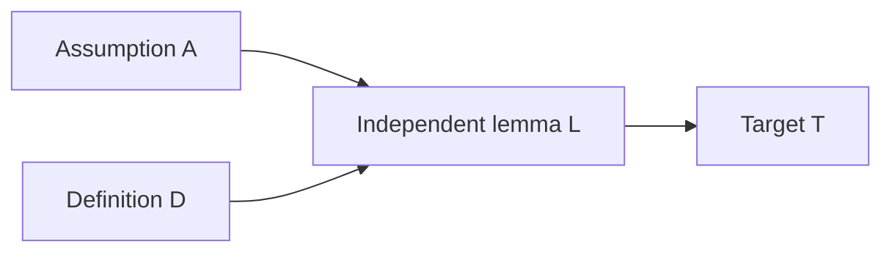

# Solutions for §0.06 Proof Techniques

[Back to module](../README.md) | [Exercise set](../exercises/README.md) | [Resources](../resources/README.md)

These are full worked solutions. A correct proof may choose a different route, witness, counterexample order, or finite test domain, but it must preserve the stated assumptions, quantifier order, scope, and evidence boundary.

Python excerpts below reuse the tested helper functions from the module's [Implementation](../README.md#implementation) section. Run that block first when executing a solution excerpt in isolation.

## E0.06.01 Plan proofs from logical form

### Key idea

Planning converts the statement into obligations before algebra or prose begins. A route is useful only when it exposes definitions or assumptions that can reach the exact target.

### Reasoning

A compact ledger is:

| Item | Logical form | Objects and assumptions | Target | Candidate route and useful structure |
|---:|---|---|---|---|
| 1 | $\forall n\in\mathbb Z(12\mid n\implies4\mid n)$ | arbitrary $n$; $12\mid n$ | $4\mid n$ | direct; $n=12k=4(3k)$ |
| 2 | universal implication | arbitrary sets $A,B,C$; two inclusions | $A\subseteq C$ | direct; arbitrary $x\in A$ |
| 3 | universal biconditional | arbitrary integer $n$ | both parity directions | forward direct; reverse contrapositive |
| 4 | existential | no arbitrary object | exhibit $m\in\mathbb Z$ | constructive; factor $m^2-m-20$ or try integer roots |
| 5 | unique existence | no arbitrary object initially | existence plus at most one | solve for a witness; compare arbitrary solutions |
| 6 | universal negation | arbitrary integer $n$ | $n^2\not\equiv2\pmod4$ | parity cases or contradiction; squares have residues $0,1$ |
| 7 | universal inclusion | arbitrary $f,S,T$; then arbitrary output $y$ | $y\in f(S)\cap f(T)$ | direct; unpack one image witness from $S\cap T$ |
| 8 | finite assignment implication | $31$ jobs, $6$ queues, one queue per job | one load at least $6$ | generalized pigeonhole; $\lceil31/6\rceil=6$ |

The provenance details are:

1. $n$ is reader-chosen and arbitrary. The integer $k$ is existentially obtained from $12\mid n$. The witness $3k$ is explicitly selected for $4\mid n$.
2. $A,B,C$ and then $x$ are arbitrary. No existential witness is needed.
3. $n$ is arbitrary. Each parity expansion introduces an existential integer determined by the definition.
4. The proof writer explicitly chooses a witness, for example $m=5$.
5. The proof writer chooses $x=5$ for existence. Arbitrary candidate solutions $y,z$ belong to the uniqueness subproof.
6. $n$ is arbitrary. A parity split introduces the appropriate integer witness in each branch.
7. $y$ is an arbitrary member of the left image. Membership provides an existential source witness $x\in S\cap T$.
8. The assignment is arbitrary among all complete assignments. Queue loads are determined by it.

Edge cases include zero in items 1, 3, and 6; empty sets in item 2; potentially empty $S\cap T$ in item 7; and the requirement that the queue count be positive in item 8. None requires a separate proof branch once the definitions are used correctly.

Items 4 and 5 expose witnesses. Item 3 has two directions. Item 6 is negative; the negation of the full claim is

$$
\exists n\in\mathbb Z\text{ such that }n^2\equiv2\pmod4.
$$

Direct and contrapositive routes are alternatives in several items. Case analysis and contradiction are alternatives for item 6. Route selection is not a proof because it creates obligations but does not derive them.

For item 8, all $31$ jobs must be counted, each must be assigned to one of exactly six queues, and queue load must count assigned jobs once. The finite counts are nonnegative integers and $6>0$.

### Verification

Each ledger follows the main connective and quantifier order. Every proposed route names a definition or finite bound that can reach the target.

### Common wrong turn

Do not write "use contradiction" as the whole plan. State the negation to assume and identify what structure it exposes.

## E0.06.02 Prove directly from definitions

### Key idea

Choose arbitrary inputs once, apply assumptions to those inputs, and finish by rebuilding the target definition.

### Reasoning

**1. Divisibility.** Let $a,b,c\in\mathbb Z$ and assume $a\mid b$ and $a\mid c$. There are integers $r,s$ such that $b=ar$ and $c=as$. Then

$$
5b-2c=5ar-2as=a(5r-2s).
$$

Because $5r-2s\in\mathbb Z$, the definition gives $a\mid(5b-2c)$.

Here $a,b,c$ are arbitrary, $r,s$ are existentially obtained, and $5r-2s$ is the explicit target witness. The two assumptions are first used when $r,s$ are introduced. Zero needs no separate case.

**2. Odd sum.** Let $m,n$ be arbitrary odd integers. There are integers $r,s$ with $m=2r+1$ and $n=2s+1$. Therefore

$$
m+n=2r+2s+2=2(r+s+1).
$$

Since $r+s+1\in\mathbb Z$, the sum is even. The final factorization reaches the exact evenness definition.

**3. Subset transitivity.** Let $A\subseteq B$ and $B\subseteq C$. To prove $A\subseteq C$, let $x\in A$ be arbitrary. The first inclusion gives $x\in B$, and the second gives $x\in C$. Thus every member of $A$ belongs to $C$, so $A\subseteq C$.

If $A$ is empty, the arbitrary-member argument has no counterexample and remains valid.

**4. Intersection of transitive relations.** Let $x,y,z\in A$ be arbitrary and suppose

$$
x(R\cap S)y
\qquad\text{and}\qquad
y(R\cap S)z.
$$

Then $xRy$, $yRz$, $xSy$, and $ySz$. Transitivity of $R$ gives $xRz$, while transitivity of $S$ gives $xSz$. Hence $x(R\cap S)z$. Therefore $R\cap S$ is transitive.

The proof uses each transitivity assumption exactly once and rebuilds intersection membership at the end.

### Verification

Each proof starts with arbitrary objects from the declared domain, introduces witnesses only from definitions, and ends with the target definition. No division or unsupported converse occurs.

### Common wrong turn

Do not use one shared divisibility witness for unrelated assumptions. From $a\mid b$ and $a\mid c$, the witnesses may differ.

## E0.06.03 Audit cases and WLOG

### Key idea

Case validity requires coverage. WLOG additionally requires a transformation that sends every omitted case to a treated case while preserving the theorem.

### Reasoning

**1. Nonnegativity of absolute value.** Let $x\in\mathbb R$. If $x\ge0$, then $|x|=x\ge0$. If $x\le0$, then $|x|=-x\ge0$. Every real satisfies at least one case, and zero satisfies both. Repeating a valid conclusion at zero is harmless.

**2. Strict-sign audit.** The cases $x>0$ and $x<0$ omit $x=0$. Add the case $x=0$, where $|x|=0$, or use the overlapping non-strict cases above.

**3. Consecutive product.** Let $n\in\mathbb Z$. If $n=2k$, then

$$
n^2+n=2k(2k+1),
$$

which is even. If $n=2k+1$, then

$$
n^2+n=(2k+1)(2k+2)=2(2k+1)(k+1),
$$

which is even. Every integer is even or odd, so the claim follows.

**4. Maximum plus minimum.** The statement and real-pair domain are invariant under swapping $x$ and $y$. Thus assume WLOG that $x\le y$. Then

$$
\max(x,y)=y,
\qquad
\min(x,y)=x,
$$

and their sum is $x+y$. If the original pair has $x>y$, the transformation $(x,y)\mapsto(y,x)$ produces the treated order. Swapping preserves real membership and both sides of the equality, so the conclusion transfers back.

The argument "WLOG $x<y$, so the first coordinate is smaller" is invalid because swapping changes which value occupies the first coordinate and changes the asymmetric target. The claim is also false for $(3,1)$.

The cases $n<0$ and $n>0$ miss $n=0$. A conclusion in both branches says nothing about that input.

One finite audit is:

```python
domain = range(-5, 6)

assert audit_case_coverage(
    domain,
    (("nonnegative", lambda x: x >= 0),
     ("nonpositive", lambda x: x <= 0)),
) == ((), {0: ("nonnegative", "nonpositive")})

assert audit_case_coverage(
    domain,
    (("positive", lambda x: x > 0),
     ("negative", lambda x: x < 0)),
) == ((0,), {})
```

The program proves coverage facts only for the eleven listed integers. Trichotomy and the order definitions prove the corresponding general statements.

### Verification

The successful case families have a union equal to the declared domain. The WLOG transformation is an involution and preserves the equality.

### Common wrong turn

Do not reject overlapping cases. Search for uncovered objects, not duplicate coverage.

## E0.06.04 Compare contraposition and contradiction

### Key idea

Contraposition proves an equivalent implication. Contradiction assumes the negation of the complete target and derives an impossibility.

### Reasoning

**1. Contrapositive.** The contrapositive of

$$
n^2\text{ odd}\implies n\text{ odd}
$$

is

$$
n\text{ not odd}\implies n^2\text{ not odd}.
$$

For integers, not odd means even. Let $n=2k$. Then

$$
n^2=4k^2=2(2k^2),
$$

so $n^2$ is even and therefore not odd. The contrapositive and original implication are equivalent.

**2. Contradiction.** The target says no integers satisfy $Even(m)\land Odd(n)\land m=n$. Assume its negation: suppose such $m,n$ exist. Write $m=2a$ and $n=2b+1$. Since $m=n$,

$$
2a=2b+1,
$$

so $2(a-b)=1$. The left side is even and cannot equal the odd integer $1$. This contradiction shows no such integers exist.

The route comparison is:

| Feature | Contraposition | Contradiction |
|---|---|---|
| original target | $P\implies Q$ | arbitrary $T$ |
| opening | assume $\neg Q$ | assume $\neg T$ |
| goal | derive $\neg P$ | derive an impossibility |
| close | equivalent implication proved | negated target rejected classically |

Assuming $\neg Q$ alone does not negate $P\implies Q$; the full negation is $P\land\neg Q$. If the proof assumes that pair and derives $R\land\neg R$, it is contradiction.

The submitted even-sum proof is a contradiction sandwich. Its algebra derives the target without using the assumed oddness. The direct repair is:

> Let $m,n$ be even integers. Write $m=2a$ and $n=2b$. Then $m+n=2(a+b)$, and $a+b$ is an integer. Therefore $m+n$ is even.

A useful contrapositive theorem is "if $n^2$ is even, then $n$ is even," because negating the conclusion exposes odd form. A shorter direct theorem is "if $6\mid n$, then $3\mid n$."

### Verification

The two openings match their formal transformations. The repaired direct proof contains no unused negated target.

### Common wrong turn

Do not label every proof containing the word `not` as contradiction. Inspect the actual assumed formula and closing rule.

## E0.06.05 Prove biconditionals and equivalence cycles

### Key idea

A biconditional needs paths in both directions. A directed cycle supplies a path from every condition to every other condition.

### Reasoning

**Forward direction.** Assume $6\mid n$. Then $n=6k$ for some integer $k$. Since

$$
n=2(3k)=3(2k),
$$

we have $2\mid n$ and $3\mid n$.

**Reverse direction.** Assume $2\mid n$ and $3\mid n$. Write $n=3b$. Since $n$ is even, $3b$ is even. If $b$ were odd, then the product of odd integers $3$ and $b$ would be odd, a contradiction. Thus $b$ is even, so $b=2k$ for an integer $k$. Therefore

$$
n=3(2k)=6k,
$$

and $6\mid n$.

Hence

$$
6\mid n\iff(2\mid n\text{ and }3\mid n).
$$

For the cycle:

- If $A$, write $n=2k$. Then $n+1=2k+1$, so $B$.
- If $B$, write $n+1=2k+1$. Then $n=2k$, so $n^2$ is even and $C$.
- If $C$, Worked example 6 from the module gives $A$.

The reachability paths are:

| From | To | Path |
|---|---|---|
| $A$ | $B$ | $A\to B$ |
| $A$ | $C$ | $A\to B\to C$ |
| $B$ | $C$ | $B\to C$ |
| $B$ | $A$ | $B\to C\to A$ |
| $C$ | $A$ | $C\to A$ |
| $C$ | $B$ | $C\to A\to B$ |

A chain $A\to B\to C$ lacks paths from $C$ back to $A$ or $B$. A four-condition directed cycle also suffices because following arrows eventually reaches every vertex from every starting vertex.

A draft proving only $6\mid n\implies2\mid n$ establishes one component of the forward direction and neither the full forward conjunction nor the reverse direction. Its `iff` label is unsupported.

### Verification

Every ordered pair of cycle conditions has a directed path. The divisibility proof provides integer witnesses in both directions.

### Common wrong turn

Do not infer $6\mid n$ merely from two unrelated equations $n=2a$ and $n=3b$ by multiplying them. The proof needs a common factorization of $n$.

## E0.06.06 Prove existence and uniqueness

### Key idea

Constructive existence provides witnesses. Unique existence adds an at-most-one proof. A classical case argument may establish existence without deciding which branch supplies the witness.

### Reasoning

We prove the difference-of-squares classification.

If $n=2k+1$ is odd, then

$$
n=(k+1)^2-k^2.
$$

If $n=4k$, then

$$
n=(k+1)^2-(k-1)^2.
$$

These formulas work for every integer $k$, including negative values, and explicitly construct integer square bases.

Conversely, suppose $n=a^2-b^2$. Every integer square is congruent to $0$ or $1$ modulo $4$. Therefore the difference is congruent to $0$, $1$, or $3$ modulo $4$, never $2$. If the residue is $1$ or $3$, $n$ is odd; if it is $0$, $n$ is divisible by $4$. Thus an integer is a difference of two integer squares exactly when it is odd or divisible by $4$.

For the classical nonconstructive proof, set

$$
x=(\sqrt2)^{\sqrt2}.
$$

Excluded middle says $x$ is rational or irrational. In the first case, $a=b=\sqrt2$ works. In the second, $a=x$ and $b=\sqrt2$ work because

$$
a^b=((\sqrt2)^{\sqrt2})^{\sqrt2}=2.
$$

The proof does not determine which branch holds, so it does not select one definite pair from its own argument.

For $3x+4=19$, existence is witnessed by $x=5$. For uniqueness, let $y$ be any real solution. Then

$$
3y+4=19,
$$

so $3y=15$ and $y=5$. Division by $3$ is legal because $3\ne0$. Hence exactly one solution exists.

At-most-one need not imply existence. The equation $x^2=-1$ has at most one nonnegative real solution but has no real solution.

For scoped existential elimination, assume $\exists xP(x)$ and $\forall x(P(x)\implies Q)$. Introduce a fresh local $c$ with $P(c)$. Universal instantiation gives $P(c)\implies Q$, so $Q$. The conclusion contains no $c$, so it is independent of which witness supplied the existential premise.

One example proves an existential by serving as its witness. A universal demands a derivation for an arbitrary member or exhaustive coverage of an explicitly finite domain.

### Verification

The square formulas expand exactly. The reverse direction excludes only residue $2$. Existence and uniqueness for the linear equation are separate and both complete.

### Common wrong turn

Do not call the classical power example constructive merely because it names an expression $x$. The proof does not decide which resulting pair has the required irrational bases.

## E0.06.07 Find counterexamples and repair conjectures

### Key idea

One valid counterexample settles a universal claim. A passing finite search settles only the exhausted domain unless paired with a symbolic proof.

### Reasoning

A deterministic search can use increasing integers, lexicographic tuples, and relation bit masks. Representative results are:

| Item | First or small counterexample | Diagnosis | Repair |
|---:|---|---|---|
| 1 | $n=41$ | $41^2-41+41=41^2$ | finite claim $2\le n\le40$, or exclude unsupported primality claim |
| 2 | $(a,b,c)=(0,0,1)$ | cancellation by zero | add $a\ne0$ |
| 3 | empty relation on $\{0\}$ | symmetric and transitive vacuously, not reflexive | require reflexive separately, or conclude reflexive on the relation's field |
| 4 | none | theorem is true | retain and prove symbolically |
| 5 | $(x,y)=(-1,1)$ | equal squares permit opposite signs | conclude $x=y$ or $x=-y$, or assume $x,y\ge0$ |

One implementation is:

```python
from itertools import product


def is_prime(number):
    if number < 2:
        return False
    divisor = 2
    while divisor * divisor <= number:
        if number % divisor == 0:
            return False
        divisor += 1
    return True


assert first_counterexample(
    range(2, 500), lambda n: is_prime(n * n - n + 41)
) == 41

assert first_counterexample(
    product(range(-2, 3), repeat=3),
    lambda t: t[0] * t[1] != t[0] * t[2] or t[1] == t[2],
)[0] == 0

assert first_counterexample(
    product(range(-3, 4), repeat=2),
    lambda t: t[0] * t[0] != t[1] * t[1]
    or t[0] == t[1],
) == (-3, 3)
```

For item 3, on base $A=\{0\}$, $R=\varnothing$ has no pair violating symmetry or transitivity, but $(0,0)\notin R$, so it is not reflexive.

For item 4, let a nonempty finite list have entries $x_1,\ldots,x_n$ and average

$$
\bar x=\frac{1}{n}\sum_{i=1}^{n}x_i.
$$

If every entry were less than $\bar x$, summing the strict inequalities would give

$$
\sum_{i=1}^{n}x_i<n\bar x=\sum_{i=1}^{n}x_i,
$$

an impossibility. Therefore some entry is at least the average. Finiteness, nonemptiness, and an ordered arithmetic domain are required.

For item 5,

$$
x^2-y^2=(x-y)(x+y)=0,
$$

so over the reals $x=y$ or $x=-y$. If both are nonnegative, equal squares imply $x=y$.

To disprove the integer existential $x^2=2$, observe that every integer is even or odd. Even squares are divisible by $4$, while odd squares are congruent to $1$ modulo $4$. Neither equals $2$, which has residue $2$. This universal parity argument covers all integers. Searching many integers would not address rationals, reals, or an unbounded integer domain by itself.

### Verification

Each listed counterexample satisfies the original assumptions and fails the conclusion. Each infinite repaired claim has a symbolic argument.

### Common wrong turn

Do not replace a false infinite conjecture with "it passed up to the search limit" and call that a repaired theorem. State the finite interval in the claim.

## E0.06.08 Prove set and function equality

### Key idea

Set equality is a membership biconditional. Function equality is pointwise equality over the complete declared domain.

### Reasoning

For the first identity, let $x$ be arbitrary. Then

$$
\begin{aligned}
x\in A\setminus(B\cap C)
&\iff x\in A\text{ and }x\notin B\cap C\\\\
&\iff x\in A\text{ and }(x\notin B\text{ or }x\notin C)\\\\
&\iff (x\in A\text{ and }x\notin B)
   \text{ or }(x\in A\text{ and }x\notin C)\\\\
&\iff x\in(A\setminus B)\cup(A\setminus C).
\end{aligned}
$$

For symmetric difference, first suppose $x\in A\mathbin{\triangle}B$. Then $x$ lies in exactly one of $A,B$, so it lies in their union but not their intersection. Thus

$$
A\mathbin{\triangle}B\subseteq(A\cup B)\setminus(A\cap B).
$$

Conversely, if $x$ lies in the right side, it lies in at least one of $A,B$ but not both, so it lies in exactly one and hence in the symmetric difference. Both inclusions give equality. One inclusion alone allows the right set to have extra members.

For arbitrary $x\in\mathbb R$,

$$
g(x)=(x-1)^3=x^3-3x^2+3x-1=f(x),
$$

so $f=g$.

Also, for every real $x$,

$$
|x|^2=x^2,
$$

because $|x|=x$ when $x\ge0$ and $|x|=-x$ when $x<0$, and both squares equal $x^2$. Thus $p=q$.

The same formula with different codomains produces different declared mappings. For example, the identity rule on integers can define $f:\mathbb Z\to\mathbb Z$ and $g:\mathbb Z\to\mathbb R$. Their graphs have matching ordered pairs under a common encoding, but their function triples include different codomains.

For congruence modulo $m\ge1$, define $aRb$ when $m\mid(a-b)$.

- Reflexive: $a-a=0=m\cdot0$.
- Symmetric: if $a-b=mk$, then $b-a=m(-k)$.
- Transitive: if $a-b=mk$ and $b-c=m\ell$, then $a-c=m(k+\ell)$.

Hence $R$ is an equivalence relation.

Finite checks may enumerate subsets of a small universe, inputs such as `range(-20, 21)`, and all pairs or triples for modular congruence. They can detect implementation or algebra mistakes. They do not quantify over every set or real input.

### Verification

Every set proof has both membership directions, both function proofs use arbitrary real input, and all three relation obligations are proved from one definition.

### Common wrong turn

Do not compare function outputs only at roots or a few convenient values. Pointwise equality quantifies over the whole domain.

## E0.06.09 Apply generalized pigeonhole

### Key idea

If every one of $k$ categories held at most $r$, total capacity would be at most $kr$. Choose $r$ just below the claimed ceiling.

### Reasoning

For $73$ tasks and $8$ workers,

$$
\left\lceil\frac{73}{8}\right\rceil=10.
$$

If every worker had at most nine tasks, at most $72$ could be assigned. Therefore one worker has at least ten.

There are nine possible remainders modulo $9$. Assign each of $41$ integers to its unique remainder. Since

$$
\left\lceil\frac{41}{9}\right\rceil=5,
$$

at least five have the same remainder.

Seven shards of capacity twelve hold at most

$$
7\cdot12=84
$$

single-shard records. Therefore $85$ cannot be stored without exceeding a shard's capacity.

The first conclusion says at least ten because the principle gives a lower bound on the maximum load. It permits a worker to receive more.

With two replicas per record, count storage incidences. There are $2\cdot85=170$ incidences if each replica occupies one shard and the two placements are both counted. Total incidence capacity remains $84$ under the original shard capacities, so storage is even more impossible. If the system's unit of capacity differs, the model must be changed before applying the count.

For general $N\ge0$ and $k\ge1$, let $m=\lceil N/k\rceil$. If every category had at most $m-1$, total load would be at most $k(m-1)$. Since

$$
m-1<\frac Nk
$$

and $k>0$, we have $k(m-1)<N$, contradicting complete assignment of all $N$ objects.

Write $N=qk+s$ with $0\le s<k$. Give $s$ categories load $q+1$ and the rest load $q$. The maximum is $q$ when $s=0$ and $q+1$ otherwise, exactly $\lceil N/k\rceil$. Thus the bound is sharp.

An exhaustive check is:

```python
from itertools import product
from math import ceil

for category_count in range(1, 6):
    for object_count in range(0, 9):
        maxima = []
        for assignment in product(
            range(category_count), repeat=object_count
        ):
            bound, maximum = generalized_bucket_bound(
                assignment, category_count
            )
            assert maximum >= bound
            maxima.append(maximum)
        observed = min(maxima, default=0)
        assert observed == ceil(object_count / category_count)
```

The floor $\lfloor N/k\rfloor$ is a valid but often weaker guaranteed lower bound. It is not sharp when $k$ does not divide $N$ because every complete assignment has maximum at least one larger.

### Verification

The capacity totals are recomputed exactly. The quotient-remainder construction matches the ceiling in both remainder cases.

### Common wrong turn

Do not omit the complete-assignment premise. Unassigned objects contribute to $N$ but to no category load, breaking the total-count equation.

## E0.06.10 Double count one incidence set

### Key idea

Define one finite set before writing either sum. Each counting method must partition that same set without omission or duplicate counting.

### Reasoning

For finite loop-free undirected $G=(V,E)$, define

$$
I=\{(v,e):v\text{ is an endpoint of }e\}.
$$

Partitioning $I$ by vertex gives $|I|=\sum_v\deg(v)$. Partitioning by edge gives $|I|=2|E|$ because every edge has two distinct endpoints. Therefore

$$
\sum_v\deg(v)=2|E|.
$$

Reduce the degree sum modulo $2$. Even degrees contribute zero. Each odd degree contributes one, and the total is even. Therefore the number of odd-degree vertices is even.

For a finite zero-one matrix $A$, define

$$
I=\{(i,j):A_{ij}=1\}.
$$

Partition by rows to obtain the sum of row sums. Partition by columns to obtain the sum of column sums. Both equal $|I|$.

For an $n$-element set $U$, let

$$
I=\{(S,x):S\subseteq U,\ x\in S\}.
$$

Fixing $|S|=k$ gives $k\binom nk$ pairs, so

$$
|I|=\sum_{k=0}^{n}k\binom nk.
$$

Fixing $x$ gives $n$ choices for $x$ and $2^{n-1}$ choices for the membership of the remaining elements, so

$$
|I|=n2^{n-1}.
$$

For $n=0$, the incidence set and left sum are empty, but the displayed right expression contains $2^{-1}$. State the zero case separately rather than relying on cancellation in $0\cdot2^{-1}$.

One data example is:

```python
records = tuple(f"r{index}" for index in range(5))
shards = tuple(f"s{index}" for index in range(4))
incidences = {
    ("r0", "s0"), ("r0", "s1"), ("r0", "s3"),
    ("r1", "s0"),
    ("r2", "s1"), ("r2", "s2"),
    ("r3", "s2"),
    ("r4", "s0"), ("r4", "s2"),
}
row_counts, column_counts, total = verify_incidence_count(
    records, shards, incidences
)
assert [row_counts[row] for row in records] == [3, 1, 2, 1, 2]
assert [column_counts[column] for column in shards] == [3, 2, 3, 1]
assert total == 9

mutated_rows = [3, 1, 3, 1, 2]
assert sum(mutated_rows) == 10
assert sum(column_counts.values()) == 9
```

The manual mutation makes the summaries inconsistent; it does not change the relation or the theorem.

If loops are allowed and each loop contributes two to degree, define two endpoint incidences for a loop, often by tagging the two ends. Then each edge instance still contributes two incidences and the identity remains valid.

The statement "both formulas equal $24$" lacks the finite set, both classifications, and proofs that each expression counts each member exactly once. Numerical agreement alone is not a combinatorial proof.

§0.08 develops permutations, combinations, binomial coefficients, inclusion-exclusion, generating functions, and broader counting rules.

### Verification

All three arguments name one incidence set and two exhaustive partitions. The code's row and column totals equal the set cardinality.

### Common wrong turn

Do not count records on one side and shard capacity slots on the other unless you give a bijection between those different sets.

## E0.06.11 Build a diagonal impossibility argument

### Key idea

Coordinate $j$ is reserved to force disagreement with candidate $j$. The constructed object must still belong to the same target space.

### Reasoning

Define

$$
t(i)=1-s_i(i).
$$

Since every $s_i(i)\in\{0,1\}$, every $t(i)$ also lies in $\{0,1\}$, so $t$ is a well-defined binary sequence. For arbitrary $j$,

$$
t(j)=1-s_j(j)\ne s_j(j),
$$

so $t\ne s_j$. Hence $t$ is absent from the proposed enumeration.

Changing only coordinate zero guarantees disagreement only with rows whose zero coordinate has the opposite value. Another row may match the resulting sequence completely.

For a finite alphabet $\Sigma$ with at least two symbols, choose a function $d:\Sigma\to\Sigma$ satisfying $d(a)\ne a$ for every $a$. For example, choose two symbols and cycle all symbols in a fixed ordering. Define

$$
t(i)=d(s_i(i)).
$$

The same coordinate proof works.

The indexed correspondence matters because each candidate needs its own guaranteed disagreement coordinate. Without an injection from candidates to available coordinates, this particular construction has no assigned place to defeat every candidate.

Later computability proofs may enumerate program descriptions $M_0,M_1,\ldots$ and examine $M_i$ on input $i$. A new behavior can be defined to disagree on that diagonal. If the new construction is then applied to its own encoded description, self-reference enters. The binary-sequence proof is diagonal without a sentence or program referring to itself.

A finite illustration is:

```python
rows = (
    (0, 0, 1, 1, 0, 1, 0, 1),
    (1, 0, 1, 0, 1, 0, 1, 0),
    (1, 1, 0, 0, 0, 1, 1, 0),
    (0, 1, 0, 1, 1, 1, 0, 0),
    (1, 0, 0, 1, 0, 0, 1, 1),
    (0, 1, 1, 0, 1, 1, 0, 1),
    (1, 1, 0, 1, 0, 0, 1, 0),
    (0, 0, 1, 0, 1, 0, 1, 1),
)
diagonal = tuple(1 - rows[index][index] for index in range(8))
assert all(
    diagonal[index] != rows[index][index] for index in range(8)
)
```

This proves only that the eight-bit prefix differs from each of eight listed rows at its assigned coordinate. Finite binary strings of length eight form a finite set and can be fully enumerated; the code does not prove uncountability.

A proposed rule producing `2` fails well-definedness because `2` is outside the binary codomain. There is then no valid binary object to compare.

The complete Cantor power-set theorem remains in §0.04. This exercise isolates its method rather than duplicating that proof.

### Verification

Well-definedness and arbitrary-row disagreement are proved separately. The finite assertion checks every listed diagonal coordinate.

### Common wrong turn

Do not claim the diagonal object differs from row $j$ at every coordinate. One certified coordinate per row is sufficient.

## E0.06.12 Audit proof, code, and sources

### Key idea

The paragraph mixes logical errors, scope failures, unsupported computation claims, incomplete specifications, and false licensing claims. Each needs evidence of the appropriate type.

### Reasoning

A diagnosis table can include:

| Claim | Obligation | Diagnosis | Repair | Evidence |
|---|---|---|---|---|
| examples constitute proof | universal support | false | examples suggest; arbitrary or exhaustive reasoning proves | logic |
| validity needs true premises | validity definition | false | validity is conditional truth preservation | SEP |
| million tests prove universal | domain coverage | false | proves at most exhausted finite cases | code scope |
| assume $Q$, derive $P$ | implication direction | converse | assume $P$, derive $Q$ | countermodel |
| overlap is fatal | case coverage | false | overlap is allowed | set union |
| missing boundary harmless | case coverage | false | every domain value needs a branch | counterexample |
| WLOG means convenient order | symmetry reduction | unsupported | prove preserving transformation | reduction proof |
| contrapositive equals contradiction | transformed target | conflation | distinguish $\neg Q\to\neg P$ from assuming $\neg T$ | §0.05 |
| iff needs one direction | two implications | false | prove both or a complete cycle | definition |
| at-most-one is unique | existence plus uniqueness | false | add existence | empty predicate |
| one failure refutes existential | universal negation | false | prove every candidate fails | quantifier negation |
| one inclusion gives equality | extensionality | false | prove both inclusions | §0.04 |
| pigeonhole gives exactly ceiling | lower bound | false | guarantees at least ceiling | capacity proof |
| unrelated equal totals double count | common finite set | false | define one incidence set | combinatorial proof |
| diagonal output may leave space | well-definedness | false | construct an object in target space | type check |
| cancellation always legal | nonzero condition | false | require $a\ne0$ | $(0,1,2)$ |
| witness becomes global | scope | false | fresh witness stays local | SEP quantifier rule |
| lemma may depend on target | acyclicity | circular | remove cycle or prove lemma independently | dependency graph |
| property tests prove correctness | specification coverage | overclaim | tests search cases; proof handles arbitrary permitted input | evidence boundary |
| benchmark proves robustness | assumptions and quantifiers | unsupported | state threat model, distribution, metric, and tested scope | empirical study |
| Stanford checklist is CC | permission | false | materials state Stanford copyright | inspected page |
| Hammack permits adaptation | license | false | CC BY-NC-ND permits sharing, not derivatives | landing page |
| AI summary verifies sources | direct inspection | false | open and inspect each source | source policy |

A circular graph fails:

```python
result = audit_dependency_dag(
    nodes=("A", "L", "T"),
    edges=(("A", "L"), ("L", "T"), ("T", "L")),
    assumptions=("A",),
    target="T",
)
assert not result["acyclic"]
```

A reversed implication countermodel can use $P=$ "divisible by four" and $Q=$ "even." The original $P\implies Q$ is true for integers. The converse fails at $2$, which is even but not divisible by four.

A property test establishes that no tested input violated the encoded property, or supplies a genuine counterexample when one is found. A correctness proof additionally needs a complete specification, declared input domain, preconditions, arbitrary-input reasoning, termination if required, and alignment between mathematical operations and implementation semantics.

A theorem about an ML system needs a formal system model and assumptions such as data-generating conditions, adversary capabilities, loss or robustness definition, optimization behavior, and probability level. Benchmark results support empirical performance on the tested protocol. They do not silently quantify over all deployments, inputs, or adversaries.

The Stanford Summer 2026 course page states that all course materials are copyright Stanford University 2025; its checklist was last updated April 1, 2026. Hammack's edition 3.4 landing page states CC BY-NC-ND 4.0 and explicitly forbids altered redistribution. Neither source supplied an adapted exercise here.

*Mathematics in Lean* Chapter 5 makes coprimality of numerator and denominator and nonzero denominator or factor assumptions explicit in irrational-root arguments. It also distinguishes natural, integer, rational, and real domains.

An accurate rewrite is:

> A proof gives a checkable argument from stated assumptions to an exact target. Examples can suggest a universal claim, prove an existential when one is a witness, or refute a universal when one is a counterexample. Exhaustive computation proves only the finite domain actually checked. To prove $P\implies Q$ directly, assume $P$ and derive $Q$; contraposition instead proves $\neg Q\implies\neg P$, while contradiction assumes the negation of the full target. Cases must cover the domain, though overlap is harmless. WLOG requires a transformation preserving assumptions and conclusion. Biconditionals need both directions or a direction-complete cycle. Unique existence needs existence and at-most-one. Set equality needs both membership directions. Generalized pigeonhole guarantees at least $\lceil N/k\rceil$ under a complete assignment to $k>0$ categories. Double counting counts one finite incidence set in two ways. A diagonal object must belong to the target space and differ from each indexed candidate. Cancellation requires a nonzero factor, local witnesses must not leak, and proof dependencies must be acyclic. Property tests search for failures; correctness proofs also require complete specifications and arbitrary-input reasoning. Empirical AI claims need explicit conditions and evidence. Stanford's materials are copyrighted, Hammack's license forbids adaptations, and every source must be inspected directly.

A valid dependency graph is



The rejected graph adds $T\to L$, creating a directed cycle.

A source ledger is:

| URL | Accessed | Supported claim | Reuse boundary |
|---|---|---|---|
| `https://web.stanford.edu/class/cs103/` | 2026-09-01 | Summer 2026 course and copyright notice | link only |
| `https://web.stanford.edu/class/archive/cs/cs103/cs103.1268/proofwriting_checklist` | 2026-09-01 | checklist topics and update date | no adapted exercises |
| `https://richardhammack.github.io/BookOfProof/` | 2026-09-01 | edition 3.4 and CC BY-NC-ND | no derivatives |
| `https://leanprover-community.github.io/mathematics_in_lean/C05_Elementary_Number_Theory.html` | 2026-09-01 | explicit irrational-root assumptions | CC BY 4.0; prose here original |
| `https://plato.stanford.edu/entries/logic-classical/` | 2026-09-01 | deduction, validity, soundness, quantifier rules | scholarly citation, no adaptation |

### Verification

The audit exceeds twenty distinct findings, provides counterexamples or formal repairs, rejects the dependency cycle computationally, and matches each licensing claim to an inspected source.

### Common wrong turn

Do not use mathematical correctness to infer permission to reuse material, or a license statement to infer mathematical correctness. Those are independent audits.

## Solution-set check

All exercise IDs and titles mirror the [exercise index](../exercises/README.md):

- E0.06.01 Plan proofs from logical form
- E0.06.02 Prove directly from definitions
- E0.06.03 Audit cases and WLOG
- E0.06.04 Compare contraposition and contradiction
- E0.06.05 Prove biconditionals and equivalence cycles
- E0.06.06 Prove existence and uniqueness
- E0.06.07 Find counterexamples and repair conjectures
- E0.06.08 Prove set and function equality
- E0.06.09 Apply generalized pigeonhole
- E0.06.10 Double count one incidence set
- E0.06.11 Build a diagonal impossibility argument
- E0.06.12 Audit proof, code, and sources

[Back to module](../README.md) | [Exercise set](../exercises/README.md)
