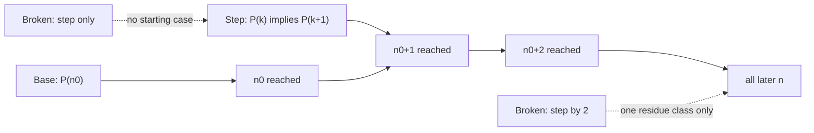
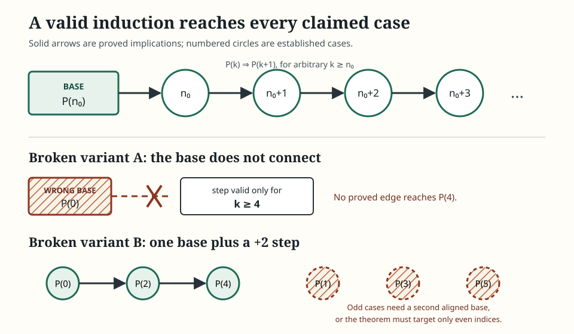
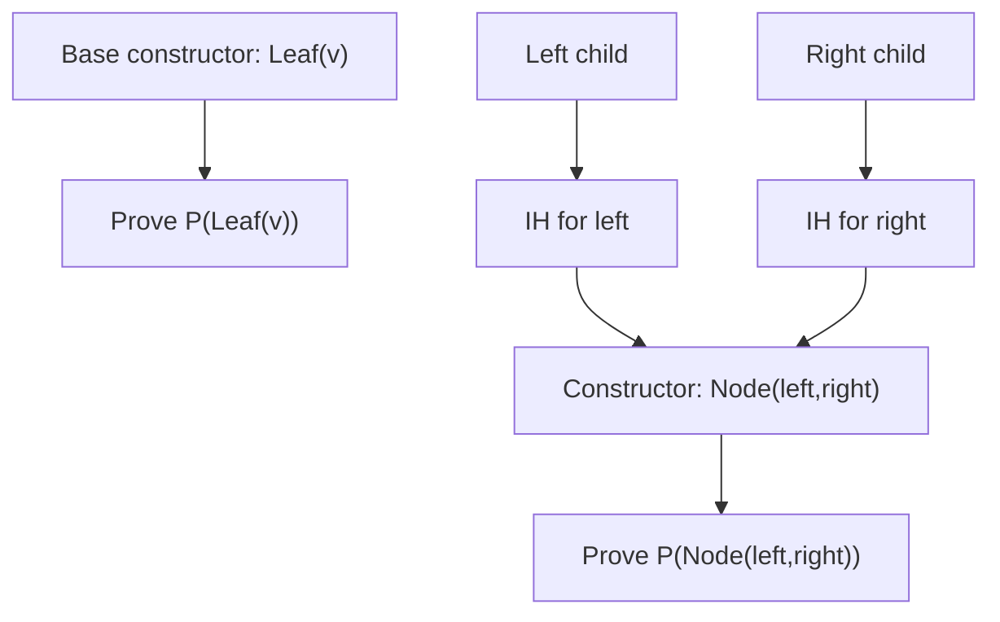
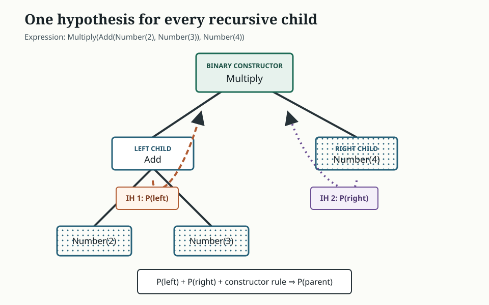
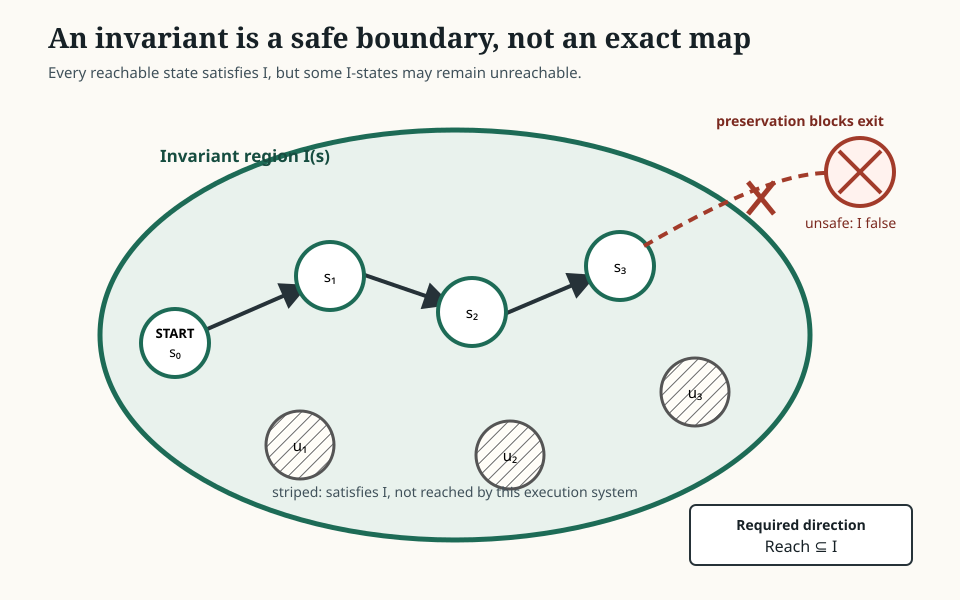
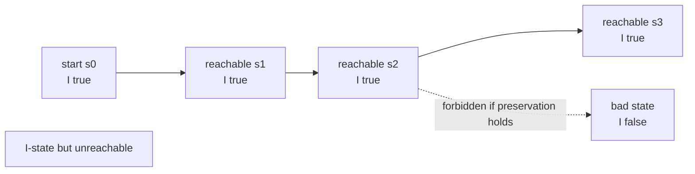
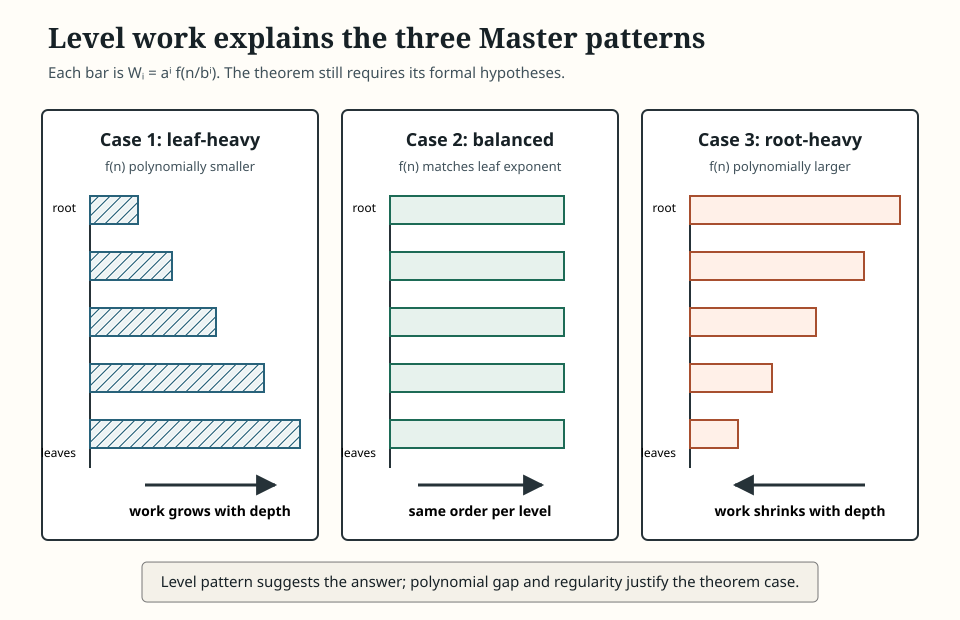
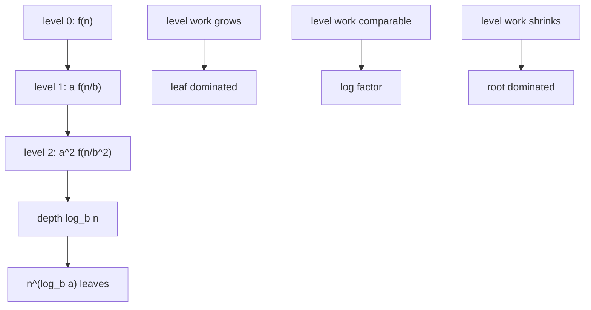

# 0.07 Induction, Recursion, and Invariants

[Section home](../README.md) | Previous: [§0.06 Proof Techniques](../00.06-proof-techniques/README.md) | [Project guides](../../STYLE_GUIDE.md) | [Notation guide](../../NOTATION.md)

## Why this matters

Induction, recursion, and invariants often arrive as three unrelated techniques.
They are better understood as preservation viewed from three directions:

- **induction** proves that a property advances through every constructor or step;
- **recursion** defines an object from values already defined on smaller objects;
- **an invariant** states that every permitted transition preserves a property of state.

The common question is simple: what survives one legal move?
The obligations are not interchangeable.
An induction proof needs a base and an implication.
A recursive definition needs coverage, unambiguity, and a decreasing measure.
An invariant proof needs initialization and preservation, then a separate link from the invariant to the desired safety claim.
A terminating program needs an additional progress argument.



> **Figure 1. Base and step form a reachability chain.** A step with no established start reaches nothing; a step of size two needs enough bases to enter every intended residue class. Original diagram.



> **Figure 2. Induction is an obligation graph, not a slogan.** Solid numbered links show a valid chain from the declared lower bound. Dashed blocked links show a wrong base and an uncovered parity class. Original figure.

These ideas sit underneath recursive data structures, abstract syntax trees (ASTs), tree models, search, decoders, dynamic programming, and loop correctness.
They also discipline later optimization arguments.
If an iterative method preserves feasibility or makes a stated quantity monotone, that fact is useful only under the assumptions that make the transition proof valid.
It does not by itself prove convergence, identify a limit, or establish good machine-learning performance.

MIT's *Mathematics for Computer Science* places induction, recursive structures, and state machines inside one proof-oriented computer-science course [1].
*Mathematics in Lean* makes the connection unusually concrete: an inductive type supplies both a recursion principle for definitions and an induction principle for proofs [2].

### Scope and non-goals

We will cover:

- weak induction from an arbitrary lower bound;
- multiple base cases, larger step sizes, and base-alignment failures;
- the conditional status of the inductive hypothesis;
- strong induction and its equivalence to weak induction on natural numbers;
- the well-ordering principle and least-counterexample proofs;
- structural induction on lists, syntax trees, and binary trees;
- recursive definitions and decreasing termination measures;
- recurrences, initial conditions, and generated sequences;
- second-order linear homogeneous constant-coefficient recurrences;
- characteristic roots, repeated roots, and the Fibonacci closed form;
- state machines, reachability, invariants, and safety;
- loop invariants and recursive-program correctness;
- recursion trees and the basic three-case Master Theorem;
- standard-library Python implementations and bounded experiments.

This module is explicitly **not**:

- transfinite induction;
- a theorem-prover tactics tutorial;
- a full recurrence taxonomy;
- generating functions, which appear in §0.08;
- rigorous asymptotic analysis, which belongs to §0.09;
- an algorithms catalog or full dynamic-programming treatment, which belongs to §0.14;
- program logics or model checking;
- a proof that an observed monotone machine-learning metric must converge to a useful solution.

## Learning objectives

After completing this module, you should be able to:

- construct weak, strong, least-counterexample, and structural induction proofs with correctly scoped hypotheses;
- diagnose missing, misaligned, or insufficient base cases;
- design recursive definitions with complete clauses, unambiguous cases, and a decreasing nonnegative measure;
- generate and solve basic recurrences from sufficient initial conditions;
- derive distinct-root and repeated-root solutions of second-order linear recurrences;
- prove state and loop invariants while separating safety, postconditions, and termination;
- align recursive-program correctness proofs with recursive calls and termination measures;
- apply the basic Master Theorem only after checking all of its hypotheses;
- implement and audit recursive, iterative, invariant, and recurrence experiments with the Python standard library.

The [exercise set](exercises/README.md) assesses every objective.
Full [worked solutions](solutions/README.md) are separate.
The [resource guide](resources/README.md) provides second treatments and source boundaries.

## Prerequisite check

Required: [§0.05 Logic and Quantifiers](../00.05-logic-quantifiers/README.md) and [§0.06 Proof Techniques](../00.06-proof-techniques/README.md).

Try these before starting:

1. Can you distinguish $P(k)\implies P(k+1)$ from $P(k+1)\implies P(k)$?
2. Can you explain why an arbitrary $k$ differs from an existential witness?
3. Can you negate $\forall n\ge n_0\,P(n)$?
4. Can you prove an implication directly from its hypothesis?
5. Can you identify a circular dependency in a proof?
6. Can you distinguish evidence from a finite test from proof over every natural number?

Review §0.05 if quantifier scope or implication direction is uncertain.
Review §0.06 if contradiction, least-element selection, or proof dependency is uncertain.
[§0.04 Sets, Relations, and Functions](../00.04-sets-relations-functions/README.md) is recommended for relations, functions, sequences, and tree-like structures.

## Historical context

Inductive reasoning and recursive calculation developed across arithmetic, logic, and computation rather than appearing as one isolated invention.
For this module, the useful history is structural rather than biographical: natural numbers can be generated from a base and successor; recursively defined data are generated from constructors; state machines generate executions from a start state and transitions.
Each generative description suggests a corresponding proof principle.

The Open Logic Project's current build index separates ordinary proof methods from a dedicated induction unit containing induction on $\mathbb{N}$, strong induction, inductive definitions, and structural induction [3].
Oscar Levin's open discrete-mathematics text treats sequences and recurrence relations before mathematical induction and is licensed CC BY-SA 4.0 [4].
Our examples and exercises are original rather than adapted from either source.

Recurrence analysis became central to algorithm design because recursive programs produce equations for their own cost.
The Master method packages one common balanced divide-and-conquer pattern.
Cornell's CS3110 notes state the three polynomial-gap cases, the case-three regularity condition, and the warning that the method does not solve all recurrences [5].
We use that basic textbook form and suppress floor and ceiling details under explicit assumptions.

MIT 6.046J's official index places divide and conquer in Lecture 2; its resource and attached PDF were verified, but no PDF wording is attributed here because text extraction was unavailable [6].
MIT 6.006's inspected lecture index identifies a four-lecture dynamic-programming unit that includes Fibonacci and shortest paths, which supports the later-learning route rather than the Master statement [7].
Python's official documentation supplies the software semantics used below for unbounded caching and the interpreter recursion limit [8,9].

## Intuition

### Preservation has a carrier

Every preservation argument acts on some carrier:

| View | Carrier | One legal move | Main obligation |
|---|---|---|---|
| weak induction | natural-number index | $k\mapsto k+1$ | $P(k)\implies P(k+1)$ |
| strong induction | natural-number index | smaller values $\to n$ | $(\forall j<n\,P(j))\implies P(n)$ |
| structural induction | recursively generated object | apply a constructor | child properties imply parent property |
| recursion | arguments or subobjects | call on smaller data | every call is defined and decreases |
| state invariant | machine state | apply a transition | $I(s)\land s\to s'\implies I(s')$ |
| loop invariant | program store | run one iteration | invariant before implies invariant after |

The table is a map, not an equivalence of proof obligations.
For example, initialization is enough to put a state inside an invariant region once.
Only preservation keeps later states there.
Termination needs a quantity that cannot decrease forever, not merely a predicate that remains true.

### The inductive hypothesis is conditional

In a weak induction step, we write:

> Let $k\ge n_0$ be arbitrary. Assume $P(k)$. Prove $P(k+1)$.

The assumption $P(k)$ is local to the implication being proved.
We are not asserting it without support.
The base case and the already proved implication later supply support along the chain.
This is no more circular than proving $A\implies B$ by temporarily assuming $A$ and deriving $B$.

Circular reasoning would assume $P(k+1)$ while trying to prove $P(k+1)$, or use the universal conclusion $\forall n\,P(n)$ as a premise of its own proof.

### Recursion builds while induction checks

A recursive definition says how to construct a value.
An induction proof says how to establish a property for every constructed value.
They often mirror each other:



> **Figure 3. Structural induction follows constructors.** A binary constructor creates two recursive children, so its proof case receives two inductive hypotheses. Original diagram.



> **Figure 4. Every recursive child contributes an inductive hypothesis.** Shape and numbered labels show two independent child obligations feeding the parent proof. Original figure.

### Invariants describe a fence, not a route map

A state invariant defines a region that legal executions cannot leave.
It need not identify exactly which states can actually be reached.

Suppose a machine starts at $0$ and repeatedly adds $2$.
The predicate $s\ge0$ is invariant.
It includes unreachable odd states, so it is not an exact characterization of reachability.
The stronger predicate "$s$ is a nonnegative even integer" happens to characterize this simple machine, but exactness is not required for safety proofs.



> **Figure 5. An invariant can over-approximate reachable states.** Solid states are reachable, striped states satisfy the invariant but are unreachable, and crossed states lie outside the safety boundary. Labels and patterns carry the meaning without color alone. Original figure.

## Mathematics

### Local notation

| Symbol | Type | Meaning |
|---|---|---|
| $\mathbb{N}$ | set | $\{0,1,2,\ldots\}$ in this curriculum |
| $P(n)$ | proposition | property indexed by $n$ |
| $n_0$ | natural number | first index covered by an induction |
| $a_n$ | scalar or object | term $n$ of a sequence |
| $\mathcal{S}$ | set | state space |
| $s_0$ | state | start state |
| $\to$ | relation | one permitted transition |
| $Reach$ | subset of $\mathcal{S}$ | states reachable from $s_0$ |
| $I(s)$ | proposition | proposed invariant predicate |
| $T(n)$ | nonnegative function | cost on input size $n$ |
| $a,b$ | constants | subproblem count and shrink factor in Master form |
| $f(n)$ | nonnegative function | nonrecursive work in Master form |

Natural-number mathematics is one-indexed or zero-indexed as declared locally.
Python sequences remain zero-indexed.

### Weak induction from an arbitrary base

Let $P(n)$ be a predicate for natural numbers $n\ge n_0$.
The weak induction principle says that if

1. **base case:** $P(n_0)$ is true; and
2. **inductive step:** for every $k\ge n_0$, $P(k)\implies P(k+1)$,

then

$$
\forall n\ge n_0,\quad P(n).
$$

A complete proof should visibly contain:

1. the predicate $P(n)$;
2. the declared lower bound $n_0$;
3. the base calculation at exactly $n_0$;
4. an arbitrary $k\ge n_0$;
5. the labeled inductive hypothesis $P(k)$;
6. a derivation of $P(k+1)$;
7. the quantified conclusion.

The step is an implication.
It does not establish $P(k)$ from nothing.
The base starts the chain, and repeated application advances it.

### Base alignment

If the theorem begins at $n=4$, proving $P(0)$ is not automatically useful.
You need a valid route from an established case to every claimed case.

Three failures recur:

- **wrong base:** prove $P(0)$ but only establish the step for $k\ge4$;
- **late base:** prove $P(5)$ while claiming $P(4)$ onward;
- **gap in step:** prove $P(k)\implies P(k+2)$ from one base while claiming both parities.

A step of size $d$ preserves residue modulo $d$.
To prove every integer from $n_0$ onward using $P(k)\implies P(k+d)$, establish enough consecutive bases to enter every residue class that occurs in the target domain:

$$
P(n_0),P(n_0+1),\ldots,P(n_0+d-1).
$$

Sometimes fewer bases suffice because the target domain itself contains only one residue class.
For a theorem only about even $n$, base $P(0)$ and step $P(k)\implies P(k+2)$ may be exactly aligned.

### Worked example 1: sum of the first natural numbers

**Claim.** For every $n\ge0$,

$$
\sum_{i=0}^{n}i=\frac{n(n+1)}{2}.
$$

Let $P(n)$ be the displayed equality.
For $n=0$, both sides are $0$.
Now let $k\ge0$ and assume

$$
\sum_{i=0}^{k}i=\frac{k(k+1)}{2}.
$$

Then

$$
\begin{aligned}
\sum_{i=0}^{k+1}i
&=\left(\sum_{i=0}^{k}i\right)+(k+1)\\\\
&=\frac{k(k+1)}{2}+(k+1)\\\\
&=\frac{(k+1)(k+2)}{2}.
\end{aligned}
$$

This is $P(k+1)$.
Therefore the formula holds for every $n\ge0$.
The second line is where the inductive hypothesis is used.

### Worked example 2: a geometric divisibility identity

**Claim.** For every $n\ge1$, $7$ divides $8^n-1$.

Base: $8^1-1=7$.
Assume $8^k-1=7q$ for some integer $q$.
Then

$$
8^{k+1}-1
=8(8^k-1)+7
=8(7q)+7
=7(8q+1).
$$

Thus $7\mid(8^{k+1}-1)$.
Notice that the hypothesis is used through its divisibility witness, not by replacing the target with the target.

### Worked example 3: shifted base

**Claim.** For every integer $n\ge4$, $2^n\ge n^2$.

Base: $2^4=16=4^2$.
Assume $2^k\ge k^2$ for arbitrary $k\ge4$.
Then

$$
2^{k+1}=2\cdot2^k\ge2k^2.
$$

For $k\ge4$,

$$
2k^2-(k+1)^2=k^2-2k-1>0.
$$

Therefore $2^{k+1}\ge(k+1)^2$.
Starting at $n=0$ would fail because the claim itself fails at $n=3$.
The lower bound is part of the theorem.

### Worked example 4: multiple bases and a step of two

Define $F_0=0$, $F_1=1$, and $F_{n+2}=F_{n+1}+F_n$.
To prove $F_n<2^n$ for every $n\ge1$ with a two-step argument, verify $n=1$ and $n=2$.
Assume the result at $k$ and $k+1$.
Then

$$
F_{k+2}=F_{k+1}+F_k<2^{k+1}+2^k<2^{k+2}.
$$

Two previous terms enter the recurrence, so the proof needs two hypotheses and aligned base values.
One base would leave the other branch unsupported.

### Strong induction

Strong induction permits all smaller established cases in the step.
For a predicate on $n\ge n_0$, prove

$$
\forall n\ge n_0,
\quad
\left(\forall j,\ n_0\le j<n\implies P(j)\right)
\implies P(n).
$$

The assumption inside parentheses is the strong inductive hypothesis.
It is still conditional and local.
It is useful when an object of size $n$ decomposes into a smaller object whose size is not predictably $n-1$.
Factors, halves, and several unequal subproblems are common signals.

Strong induction is not "more true" than weak induction.
Over $\mathbb{N}$, the principles are logically equivalent.

### Weak and strong induction are equivalent

Strong induction immediately proves every theorem provable by weak induction because the collection of all smaller cases includes $P(n-1)$ when $n>n_0$.

For the other direction, suppose the strong step is available.
Define a cumulative predicate

$$
Q(n)\coloneqq\forall j,\ n_0\le j\le n\implies P(j).
$$

Prove $Q(n)$ by weak induction.
The base $Q(n_0)$ follows from the strong step with an empty set of earlier required cases.
For the weak step, assume $Q(k)$.
It supplies every $P(j)$ for $n_0\le j\le k$, so the strong step gives $P(k+1)$.
Together with $Q(k)$, this gives $Q(k+1)$.
Hence every $P(n)$ follows.

This is an introductory proof sketch.
A formal treatment must spell out the lower-bound and empty-range details.

### Worked example 5: strong induction and factorization

**Claim.** Every integer $n\ge2$ is a product of primes.

Assume for strong induction that every integer $j$ with $2\le j<n$ is a product of primes.
If $n$ is prime, it is already a one-factor product.
If $n$ is composite, then

$$
n=ab
$$

for integers $a,b$ with $2\le a,b<n$.
The strong hypothesis applies to both $a$ and $b$.
Concatenating their prime factorizations gives one for $n$.

Weak induction on $n-1$ would be awkward because a factor need not equal $n-1$.
The equivalence theorem says weak induction could still prove the result after strengthening the predicate, but strong induction matches the decomposition directly.

### The well-ordering principle

The well-ordering principle for natural numbers states:

> Every nonempty subset of $\mathbb{N}$ has a least element.

This is not the claim that every subset of every ordered set has a least element.
For example, the positive real interval $(0,1)$ is nonempty and has no least real number.
The carrier $\mathbb{N}$ matters.

A least-counterexample proof of

$$
\forall n\ge n_0,\ P(n)
$$

must proceed in this order:

1. suppose the universal claim is false;
2. define the counterexample set
   $$
   C=\{n\in\mathbb{N}:n\ge n_0\text{ and }\neg P(n)\};
   $$
3. state why $C$ is nonempty from the negated universal;
4. invoke well-ordering to choose $m=\min C$;
5. use minimality to establish needed smaller cases;
6. derive $P(m)$ and contradict $m\in C$.

Saying "choose the least counterexample" before proving that any counterexample exists skips the premise required by well-ordering.

### Worked example 6: least counterexample for a postage system

**Claim.** Every integer amount $n\ge12$ can be formed using stamps worth $4$ and $5$.

Suppose not, and define

$$
C=\{n\in\mathbb{N}:n\ge12\text{ and }n\ne4a+5b
\text{ for all }a,b\in\mathbb{N}\}.
$$

The denial of the claim makes $C$ nonempty.
Let $m$ be its least member.
The amounts $12,13,14,15$ are

$$
12=3\cdot4,
\quad13=2\cdot4+5,
\quad14=4+2\cdot5,
\quad15=3\cdot5.
$$

Thus $m\ge16$.
Then $m-4\ge12$ and $m-4<m$.
Minimality says $m-4=4a+5b$ for some natural $a,b$.
Adding one $4$-stamp gives

$$
m=4(a+1)+5b,
$$

contradicting $m\in C$.

The four consecutive initial amounts cover the residues needed after repeated subtraction by four.

### Equivalence of well-ordering and induction

Well-ordering implies induction through the least-counterexample argument.
If base and step hold but some case fails, the nonempty counterexample set has a least member $m$.
The base rules out $m=n_0$.
Then $m-1$ is an earlier noncounterexample, so $P(m-1)$ holds, and the step gives $P(m)$, contradiction.

Conversely, ordinary induction can establish well-ordering on $\mathbb{N}$.
If a nonempty $S\subseteq\mathbb{N}$ had no least element, use induction to show that no natural number belongs to $S$.
At $0$, membership would make $0$ least.
If no value at most $k$ belongs to $S$, then membership of $k+1$ would make $k+1$ least.
Thus no value belongs to $S$, contradicting nonemptiness.

These proof sketches show equivalence over the natural numbers.
They do not introduce general well-founded orders or transfinite induction.

### Structural induction

A recursive specification defines a class of objects through **constructors**.
For example, expressions may be generated by:

1. `Number(v)` is an expression for each number $v$;
2. if $x$ and $y$ are expressions, then `Add(x, y)` is an expression;
3. if $x$ and $y$ are expressions, then `Multiply(x, y)` is an expression;
4. nothing else is an expression.

The final coverage clause matters.
It says every expression has a finite construction from the listed constructors.

To prove property $P(e)$ for every expression:

- prove $P(Number(v))$ for the base constructor;
- assume $P(x)$ and $P(y)$ separately, then prove $P(Add(x,y))$;
- assume $P(x)$ and $P(y)$ separately, then prove $P(Multiply(x,y))$.

A binary constructor has two recursive children and therefore two inductive hypotheses.
Using only the left-child hypothesis omits an obligation.
Omitting a constructor leaves an entire family of objects untreated.

### Structural induction versus induction on size

Structural induction follows the immediate construction of the object.
Induction on size maps each object to a natural number and proves the claim for all objects of a given size.

The methods are related but not identical in presentation:

- structural induction gives one case per constructor and one hypothesis per recursive child;
- size induction may give hypotheses for all smaller objects, often using strong induction;
- structural induction usually exposes exactly the data consumed by a recursive function;
- size induction can be useful when the transformation does not follow immediate children.

Do not write "by structural induction on size" without saying which principle supplies the hypotheses.

### Worked example 7: list length and append

Lists over a set $A$ are generated by:

- the empty list $[]$;
- `cons(x, xs)` when $x\in A$ and `xs` is a list.

Fix a list `ys`.
We prove by structural induction on `xs` that

$$
length(xs\mathbin{+\!+}ys)=length(xs)+length(ys).
$$

Base:

$$
length([]\mathbin{+\!+}ys)=length(ys)=0+length(ys).
$$

Step: assume the result for `xs`.
Then

$$
\begin{aligned}
length(cons(x,xs)\mathbin{+\!+}ys)
&=length(cons(x,xs\mathbin{+\!+}ys))\\\\
&=1+length(xs\mathbin{+\!+}ys)\\\\
&=1+length(xs)+length(ys)\\\\
&=length(cons(x,xs))+length(ys).
\end{aligned}
$$

The third line uses the one hypothesis supplied by the one recursive child.

### Worked example 8: leaves and internal nodes

A full binary tree is either a leaf or an internal node with exactly two children.
Let $L(t)$ count leaves and $N(t)$ count internal nodes.
We prove

$$
L(t)=N(t)+1.
$$

For a leaf, $L=1$ and $N=0$.
For `Node(left,right)`, assume

$$
L(left)=N(left)+1,
\qquad
L(right)=N(right)+1.
$$

Then

$$
\begin{aligned}
L(t)
&=L(left)+L(right)\\\\
&=N(left)+N(right)+2\\\\
&=(1+N(left)+N(right))+1\\\\
&=N(t)+1.
\end{aligned}
$$

Both child hypotheses are load-bearing.

### Recursive definitions

A recursive definition is valid only when it determines one value for every intended input.
Audit five obligations:

1. **base clauses:** values are given for smallest inputs;
2. **recursive clauses:** larger values are expressed through previously defined values;
3. **coverage:** every intended input matches a clause;
4. **unambiguity:** overlapping clauses agree, or clauses are disjoint;
5. **termination:** every chain of recursive calls reaches a base.

A decreasing measure is a function

$$
\mu:D\to\mathbb{N}
$$

such that every recursive call from $x$ to $y$ satisfies

$$
\mu(y)<\mu(x).
$$

Because $\mathbb{N}$ has no infinite strictly decreasing chain, recursion terminates.
This is where well-ordering supports computation.

A definition such as

$$
f(n)=f(n+1)+1
$$

with no independent base is circular, not recursive in a well-founded direction.
A clause $f(n)=f(n)$ is equally uninformative.

### Worked example 9: factorial definition and termination

Define

$$
0!=1,
\qquad
n!=n(n-1)!\quad(n\ge1).
$$

Coverage separates $0$ from positive naturals.
The clauses do not conflict.
For the recursive call, use measure $\mu(n)=n$:

$$
\mu(n-1)=n-1<n.
$$

Thus every call reaches $0$ after finitely many decrements.
The equation is not circular because it refers to a strictly smaller argument whose value is already determined by the same scheme.

### Worked example 10: Euclidean gcd and a decreasing measure

For integers $a\ge0$ and $b>0$, define

$$
\gcd(a,0)=a,
$$

$$
\gcd(a,b)=\gcd(b,a\bmod b)\quad(b>0).
$$

The remainder satisfies

$$
0\le a\bmod b<b.
$$

Using the second argument as measure, the recursive call decreases from $b$ to $a\bmod b$.
Correctness also needs the invariant

$$
\gcd(a,b)=\gcd(b,a\bmod b),
$$

which follows because common divisors of $a,b$ are exactly common divisors of $b,a-qb$.
Termination and value preservation are distinct obligations.

### Binary tree size and evaluation

For a full binary expression tree:

$$
size(Number(v))=1,
$$

$$
size(Op(left,right))=1+size(left)+size(right).
$$

Evaluation follows the same constructors:

$$
eval(Number(v))=v,
$$

$$
eval(Add(left,right))=eval(left)+eval(right),
$$

$$
eval(Multiply(left,right))=eval(left)eval(right).
$$

Coverage requires an evaluation clause for every syntax constructor.
If a `Negate(child)` constructor is added later, both the recursive definition and every structural proof must add a case.

### Recurrence relations and initial conditions

A recurrence relation constrains terms of a sequence through earlier terms.
For example,

$$
a_n=3a_{n-1}-2a_{n-2}
\quad(n\ge2)
$$

is second order because it depends on the preceding two positions.
It does not determine a unique sequence without two initial values such as $a_0$ and $a_1$.

For an order-$d$ recurrence of the form

$$
a_n=F(n,a_{n-1},\ldots,a_{n-d}),
$$

$d$ consecutive initial values normally provide existence and uniqueness:

- the initial values define the first $d$ terms;
- the recurrence then defines each later term from already unique earlier terms;
- induction proves that every index receives exactly one value.

Fewer initial conditions can leave free parameters.
Conflicting initial conditions can make the specification inconsistent.

### Worked example 11: generate a recurrence

Let

$$
a_0=2,
\qquad
a_1=5,
\qquad
a_n=3a_{n-1}-2a_{n-2}.
$$

Then

$$
a_2=3\cdot5-2\cdot2=11,
$$

$$
a_3=3\cdot11-2\cdot5=23,
$$

$$
a_4=3\cdot23-2\cdot11=47.
$$

The pattern suggests $a_n=3\cdot2^n-1$.
Substitution verifies the recurrence and the two initial values.
Pattern recognition proposes the formula; verification proves it for the generated sequence.

### Unrolling and telescoping preview

Repeated substitution can expose a recurrence's accumulated work.
For

$$
a_n=a_{n-1}+2n,
\qquad a_0=0,
$$

unroll:

$$
\begin{aligned}
a_n
&=a_{n-1}+2n\\\\
&=a_{n-2}+2(n-1)+2n\\\\
&=\cdots\\\\
&=2\sum_{j=1}^{n}j\\\\
&=n(n+1).
\end{aligned}
$$

This previews telescoping and finite sums.
Systematic asymptotic bounds and convergence of series remain in §0.09.

### Linear homogeneous constant-coefficient recurrences

Consider

$$
a_n=c_1a_{n-1}+c_2a_{n-2}.
$$

Try the exponential ansatz

$$
a_n=r^n.
$$

Substitution gives

$$
r^n=c_1r^{n-1}+c_2r^{n-2}.
$$

For nonzero $r$, divide by $r^{n-2}$:

$$
r^2-c_1r-c_2=0.
$$

This is the characteristic polynomial.
Watch the signs: moving every term to the left changes the recurrence coefficients accordingly.

If the roots $r_1,r_2$ are distinct, the general solution is

$$
a_n=Ar_1^n+Br_2^n.
$$

Two initial conditions determine $A$ and $B$.

If one root $r$ has multiplicity two, two copies of $r^n$ are not linearly independent.
The second solution gains a factor of $n$:

$$
a_n=(A+Bn)r^n.
$$

Complex roots may be combined into real sine-cosine forms when coefficients and initial values are real.
That connection uses polar form from §0.02 and receives only this brief mention here.

### Worked example 12: distinct characteristic roots

Solve

$$
a_n=5a_{n-1}-6a_{n-2},
\qquad a_0=1,
\qquad a_1=4.
$$

The characteristic polynomial is

$$
r^2-5r+6=(r-2)(r-3).
$$

Thus

$$
a_n=A2^n+B3^n.
$$

Initial conditions give

$$
A+B=1,
\qquad2A+3B=4.
$$

Hence $B=2$ and $A=-1$:

$$
a_n=-2^n+2\cdot3^n.
$$

Substituting $n=0,1$ and the recurrence verifies the result.

### Worked example 13: repeated characteristic root

Solve

$$
a_n=6a_{n-1}-9a_{n-2},
\qquad a_0=2,
\qquad a_1=9.
$$

The characteristic polynomial is

$$
r^2-6r+9=(r-3)^2.
$$

Therefore

$$
a_n=(A+Bn)3^n.
$$

From $a_0=2$, $A=2$.
From $a_1=9$,

$$
3(2+B)=9,
$$

so $B=1$.
Thus

$$
a_n=(n+2)3^n.
$$

Writing only $A3^n+B3^n$ would collapse to one free constant and could not fit two independent initial values.

### Worked example 14: Fibonacci and Binet's formula

For

$$
F_0=0,
\qquad F_1=1,
\qquad F_n=F_{n-1}+F_{n-2},
$$

we obtain

$$
r^2-r-1=0.
$$

Its roots are

$$
\varphi=\frac{1+\sqrt5}{2},
\qquad
\psi=\frac{1-\sqrt5}{2}.
$$

The initial conditions give

$$
F_n=\frac{\varphi^n-\psi^n}{\sqrt5}.
$$

Each term is an integer even though the expression contains irrational numbers.
The two irrational contributions cancel exactly because the formula is the unique sequence satisfying the integer recurrence and initial conditions.
Floating-point evaluation only approximates that cancellation, so rounding a computed value is an implementation technique, not the proof of integrality.

### State machines

A state machine consists of:

- a state space $\mathcal{S}$;
- a start state $s_0\in\mathcal{S}$;
- a transition relation $\to\ \subseteq\mathcal{S}\times\mathcal{S}$.

A state $s$ is **reachable** when there is a finite path

$$
s_0\to s_1\to\cdots\to s.
$$

The start state is reachable by the length-zero path.

A predicate $I$ is an invariant if every reachable state satisfies it.
A standard proof establishes the stronger local obligations:

1. **initialization:** $I(s_0)$;
2. **preservation:** for every permitted transition $s\to s'$, if $I(s)$, then $I(s')$.

Induction on path length then proves $I$ for every reachable state.



> **Figure 6. Initialization and preservation keep executions inside the invariant.** The isolated state shows why satisfying the invariant does not imply reachability. Original diagram.

If the desired safety property is $Safe(s)$, also prove

$$
I(s)\implies Safe(s).
$$

The invariant is often stronger than the final safety claim because stronger information is easier to preserve compositionally.

The converse trap is:

$$
I(s)\not\implies s\text{ is reachable}.
$$

An invariant may include unreachable states.
This over-approximation is normal.

### Worked example 15: parity invariant

A machine starts at $(0,0)$ and may apply either transition

$$
(x,y)\to(x+1,y+1)
$$

or

$$
(x,y)\to(x+2,y).
$$

Claim that $x+y$ is even.
Initially $x+y=0$.
The first transition changes the sum by $2$; the second also changes it by $2$.
Thus parity is preserved.
Every reachable state has even $x+y$.

The predicate does not characterize reachability.
For example, $(-1,1)$ has even sum but is unreachable because both coordinates never decrease from the start.

### Safety versus termination

An invariant proves that nothing bad happens along any finite execution covered by the model.
It does not prove that an execution ends.
A machine can remain safe forever.

To prove termination, find a **variant** or ranking measure

$$
\mu(s)\in\mathbb{N}
$$

that strictly decreases on every nonterminal transition.
Initialization and preservation support partial correctness.
A decreasing well-founded measure supplies termination.
Together they can establish total correctness.

### Loop invariants

For a loop, separate three obligations:

1. **initialization:** the invariant holds before the first test;
2. **maintenance:** one iteration preserves it;
3. **termination use:** when the loop condition is false, invariant plus exit condition implies the postcondition.

Termination use is not termination proof.
You may additionally need a decreasing measure to show the loop reaches its exit.

### Worked example 16: summing a prefix

Consider a loop that computes $0+1+\cdots+(n-1)$.
Before each iteration with index $i$, use invariant

$$
0\le i\le n
\quad\text{and}\quad
total=\sum_{j=0}^{i-1}j.
$$

Initialization at $i=0$ gives an empty sum, so $total=0$.
Maintenance adds $i$ and increments the index:

$$
total'=
\sum_{j=0}^{i-1}j+i
=\sum_{j=0}^{i}j.
$$

At exit, $i=n$, so

$$
total=\sum_{j=0}^{n-1}j.
$$

The variant $n-i$ is a nonnegative integer that decreases by one, proving termination.

### Worked example 17: linear search

Search left to right for `target` in a finite list `values`.
Before inspecting index $i$, use invariant:

$$
target\notin values[0:i].
$$

It is true at $i=0$ because the prefix is empty.
If `values[i]` is not the target, advancing to $i+1$ preserves the claim for the enlarged prefix.
If the loop exits with $i=len(values)$, the invariant says the target is absent from the entire list.
If it returns $i$, the branch condition gives `values[i] == target` and the invariant shows it is the first occurrence.

The remaining length $len(values)-i$ proves termination.

### Recursive-program correctness

A correctness proof for a recursive function should align with its calls.
For input $x$:

1. prove each base clause meets the specification;
2. assume recursive calls on smaller arguments return correct results;
3. prove the current clause combines those results correctly;
4. prove every recursive argument is in the domain;
5. prove a nonnegative measure decreases.

The hypotheses in step 2 come from strong or structural induction.
The measure in step 5 proves termination.
Without step 5, the argument may establish only partial correctness: if the function returns, the result is correct.

### Worked example 18: correctness of recursive tree size

Specification: `tree_size(t)` returns the number of constructor nodes in full binary tree $t$.

For a leaf, the function returns $1$, matching the one constructor.
For a node, assume recursive calls correctly count the left and right subtrees.
The current function returns

$$
1+tree\_size(left)+tree\_size(right),
$$

which counts the root plus every node in both disjoint subtrees.
Structural recursion terminates because each child has smaller node count than the parent.

The correctness hypotheses and termination measure both use subtrees, but they prove different claims.

### Divide-and-conquer recurrences

A balanced divide-and-conquer algorithm often yields

$$
T(n)=aT(n/b)+f(n),
$$

where:

- $a\ge1$ is a constant number of recursive subproblems;
- $b>1$ is a constant shrink factor;
- each subproblem has size $n/b$;
- $f(n)$ is nonnegative nonrecursive work;
- $T(n)=\Theta(1)$ at a fixed base size.

For intuition, first suppose $n$ is a power of $b$ and ignore rounding.
At level $i$:

- there are $a^i$ nodes;
- each node has size $n/b^i$;
- level work is
  $$
  W_i=a^if(n/b^i).
  $$

The depth is $\log_b n$.
The leaf count is

$$
a^{\log_b n}=n^{\log_b a}.
$$



> **Figure 7. Master cases compare work across recursion-tree levels.** Bar length, slope arrows, and labels distinguish root-heavy, level-balanced, and leaf-heavy behavior without relying on color. Original figure.



> **Figure 8. Recursion-tree anatomy.** The three qualitative trends motivate the Master cases but do not replace checking the theorem's hypotheses. Original diagram.

### The basic Master Theorem

Assume

$$
T(n)=aT(n/b)+f(n),
$$

with constants $a\ge1$ and $b>1$, nonnegative $f$, a $\Theta(1)$ base case, and powers of $b$ so floors and ceilings can be suppressed.
Let

$$
p=\log_b a.
$$

The basic CLRS-style theorem has three polynomial-separation cases [5]:

1. If for some $\varepsilon>0$,
   $$
   f(n)=O(n^{p-\varepsilon}),
   $$
   then
   $$
   T(n)=\Theta(n^p).
   $$

2. If
   $$
   f(n)=\Theta(n^p),
   $$
   then
   $$
   T(n)=\Theta(n^p\log n).
   $$
   Extensions cover factors such as $\log^k n$, but this module uses the simple $k=0$ form to keep the boundary unambiguous.

3. If for some $\varepsilon>0$,
   $$
   f(n)=\Omega(n^{p+\varepsilon}),
   $$
   and there is a constant $c<1$ such that for all sufficiently large $n$,
   $$
   af(n/b)\le cf(n),
   $$
   then
   $$
   T(n)=\Theta(f(n)).
   $$

The regularity condition in case 3 prevents pathological oscillation from moving too much work into lower levels.
The theorem does not solve every recurrence.
A recurrence that misses all three cases is not unsolvable; this theorem is simply not the applicable tool.

### Worked example 19: Master case 1

For

$$
T(n)=8T(n/2)+n^2,
$$

we have

$$
p=\log_2 8=3.
$$

Because $n^2=O(n^{3-1})$, case 1 applies:

$$
T(n)=\Theta(n^3).
$$

The recursion tree's level work is

$$
8^i(n/2^i)^2=n^2\cdot2^i,
$$

so work grows toward the leaves.

### Worked example 20: Master case 2

For

$$
T(n)=2T(n/2)+n,
$$

we have $p=1$ and $f(n)=\Theta(n)$.
Case 2 gives

$$
T(n)=\Theta(n\log n).
$$

Every internal level contributes

$$
2^i(n/2^i)=n,
$$

and there are $\log_2n$ such levels.

### Worked example 21: Master case 3

For

$$
T(n)=2T(n/2)+n^2,
$$

$p=1$ and $n^2=\Omega(n^{1+1})$.
Check regularity:

$$
2f(n/2)=2(n/2)^2=\frac12n^2.
$$

Choose $c=1/2<1$.
Case 3 applies:

$$
T(n)=\Theta(n^2).
$$

Here level work halves as depth increases, so the root-scale work dominates the geometric sum.

### Worked example 22: unequal subproblem sizes

The recurrence

$$
T(n)=T(n/3)+T(2n/3)+n
$$

has unequal subproblem sizes.
It cannot be written as $aT(n/b)+f(n)$ with one common subproblem size and constant multiplicity.
The basic Master Theorem does not apply.
A recursion tree may suggest $\Theta(n\log n)$, but that suggestion needs proof by another method.

### Worked example 23: parameter and gap failures

Neither recurrence is covered by the basic theorem:

$$
T(n)=nT(n/2)+n
$$

because $a=n$ is not constant, and

$$
T(n)=2T(n/2)+\frac{n}{\log n}
$$

because $f(n)$ is smaller than $n^p=n$ only by a logarithmic factor, not by $n^\varepsilon$.
It fits neither case 1 nor the simple case 2, and it is not case 3.

A negative "work" term such as

$$
T(n)=2T(n/2)-n
$$

also violates the nonnegative cost model used by this theorem.

### Worked example 24: regularity failure

On powers of two, define

$$
f(n)=
\begin{cases}
n^2,&\log_2n\text{ even},\\\\
n^3,&\log_2n\text{ odd}.
\end{cases}
$$

For $T(n)=2T(n/2)+f(n)$, we have $p=1$, and $f(n)=\Omega(n^2)$ supplies polynomial separation.
But when $\log_2n$ is even,

$$
\frac{2f(n/2)}{f(n)}
=\frac{2(n/2)^3}{n^2}
=\frac n4,
$$

which is not bounded by any constant $c<1$ for large $n$.
Case 3's regularity condition fails.
The basic theorem gives no conclusion.

## Derivation

### Why induction follows reachability

Define a simple machine whose states are natural numbers at least $n_0$.
Its start state is $n_0$, and its only transition is $k\to k+1$.
Every state $n\ge n_0$ is reachable after $n-n_0$ transitions.

If $P(n_0)$ and every transition preserves $P$, then path-length induction proves $P$ at every reachable state.
Ordinary weak induction is exactly this invariant argument on the successor machine.

This connection explains the organizing hypothesis without collapsing obligations:

- the induction theorem tells us every index is reached;
- the base proves initialization;
- the inductive step proves preservation.

### Why recursive calls need a well-founded measure

Suppose a recursive call sequence were infinite:

$$
x_0,x_1,x_2,\ldots
$$

and every call strictly decreased natural measure $\mu$.
Then

$$
\mu(x_0)>\mu(x_1)>\mu(x_2)>\cdots
$$

would be an infinite descending chain in $\mathbb{N}$.
The set of attained measures would be nonempty, so well-ordering gives a least one.
The next call would produce a still smaller attained measure, contradiction.

This proves termination only if every recursive branch decreases and the measure is always a natural number.
A quantity that sometimes increases, becomes negative, or is undefined is not a valid ranking measure.

### Characteristic roots from shift preservation

The recurrence operator

$$
L(a)_n=a_n-c_1a_{n-1}-c_2a_{n-2}
$$

is linear and has constant coefficients.
Exponential sequences preserve their form under index shifts:

$$
r^{n-1}=r^{-1}r^n,
\qquad
r^{n-2}=r^{-2}r^n.
$$

That is why the ansatz $r^n$ converts the recurrence into an algebraic polynomial.
Distinct roots yield independent exponential modes.
A repeated root needs the generalized mode $nr^n$ to supply a second independent solution.

Initial conditions select one member from the family of recurrence solutions.
They are not optional decorations.

### Invariants as inductive sets

Let

$$
Inv=\{s\in\mathcal{S}:I(s)\}.
$$

Initialization states $s_0\in Inv$.
Preservation states that $Inv$ is closed under the transition relation:

$$
s\in Inv\land s\to s'\implies s'\in Inv.
$$

Reachability is the smallest transition-closed set containing $s_0$.
Therefore

$$
Reach\subseteq Inv.
$$

The reverse inclusion need not hold.
That one subset direction is the exact form of invariant over-approximation.

## Implementation

Run the following Python 3 standard-library fences in document order.
Later fences reuse names from earlier ones.
All assertions are part of the examples.

### Recursive and iterative arithmetic

```python
from dataclasses import dataclass
from functools import cache
from math import isclose, log2, sqrt


def factorial_recursive(number, calls):
    if number < 0:
        raise ValueError("factorial requires a nonnegative integer")
    calls[0] += 1
    if number == 0:
        return 1
    return number * factorial_recursive(number - 1, calls)


def factorial_iterative(number):
    if number < 0:
        raise ValueError("factorial requires a nonnegative integer")
    result = 1
    for factor in range(2, number + 1):
        result *= factor
    return result


naive_fibonacci_calls = 0


def fibonacci_naive(number):
    global naive_fibonacci_calls
    if number < 0:
        raise ValueError("Fibonacci requires a nonnegative integer")
    naive_fibonacci_calls += 1
    if number < 2:
        return number
    return fibonacci_naive(number - 1) + fibonacci_naive(number - 2)


memoized_fibonacci_misses = 0


@cache
def fibonacci_cached(number):
    global memoized_fibonacci_misses
    if number < 0:
        raise ValueError("Fibonacci requires a nonnegative integer")
    memoized_fibonacci_misses += 1
    if number < 2:
        return number
    return fibonacci_cached(number - 1) + fibonacci_cached(number - 2)


def fibonacci_iterative(number):
    if number < 0:
        raise ValueError("Fibonacci requires a nonnegative integer")
    previous, current = 0, 1
    for _ in range(number):
        previous, current = current, previous + current
    return previous


for number in range(11):
    calls = [0]
    assert factorial_recursive(number, calls) == factorial_iterative(number)
    assert calls[0] == number + 1
    assert fibonacci_iterative(number) == fibonacci_cached(number)

naive_fibonacci_calls = 0
assert fibonacci_naive(10) == 55
assert naive_fibonacci_calls == 177
assert memoized_fibonacci_misses == 11
assert fibonacci_cached.cache_info().currsize == 11
```

The recursive factorial has call depth $n+1$ under this implementation.
The iterative version uses a constant number of scalar accumulators.

The naive Fibonacci counter records every function-body entry.
The cached counter records cache misses because the wrapper returns cached values before entering the wrapped body.
`functools.cache` is an unbounded argument-result cache equivalent to `lru_cache(maxsize=None)` [8].
Its arguments must be hashable, and retained keys and values consume memory.
Caching pure Fibonacci calls changes repeated evaluation, not the mathematical recurrence.

Python also enforces a practical interpreter recursion limit to protect its stack [9].
Hitting `RecursionError` is not proof that a mathematical recursion is nonterminating.
Conversely, raising the limit does not repair a recursive definition with no decreasing measure.

### GCD and structural tree checks

```python

def gcd_with_trace(left, right):
    if left < 0 or right < 0:
        raise ValueError("this trace uses nonnegative integers")
    trace = []
    while right != 0:
        remainder = left % right
        assert 0 <= remainder < right
        trace.append((left, right, remainder))
        left, right = right, remainder
    return left, tuple(trace)


@dataclass(frozen=True)
class Number:
    value: int


@dataclass(frozen=True)
class Add:
    left: object
    right: object


@dataclass(frozen=True)
class Multiply:
    left: object
    right: object


def evaluate(expression):
    if isinstance(expression, Number):
        return expression.value
    if isinstance(expression, Add):
        return evaluate(expression.left) + evaluate(expression.right)
    if isinstance(expression, Multiply):
        return evaluate(expression.left) * evaluate(expression.right)
    raise TypeError(f"unknown expression: {type(expression).__name__}")


def tree_counts(expression):
    if isinstance(expression, Number):
        return (1, 0, 1)
    if isinstance(expression, (Add, Multiply)):
        left_leaves, left_internal, left_size = tree_counts(expression.left)
        right_leaves, right_internal, right_size = tree_counts(expression.right)
        leaves = left_leaves + right_leaves
        internal = 1 + left_internal + right_internal
        size = 1 + left_size + right_size
        assert leaves == internal + 1
        assert size == leaves + internal
        return (leaves, internal, size)
    raise TypeError(f"unknown expression: {type(expression).__name__}")


def expressions(depth):
    leaves = (Number(-1), Number(0), Number(2))
    if depth == 0:
        return leaves
    smaller = expressions(depth - 1)
    combined = tuple(
        constructor(left, right)
        for constructor in (Add, Multiply)
        for left in smaller
        for right in smaller
    )
    return leaves + combined


gcd_value, gcd_trace = gcd_with_trace(1071, 462)
assert gcd_value == 21
assert [step[1] for step in gcd_trace] == [462, 147, 21]

sample = Multiply(Add(Number(2), Number(3)), Number(4))
assert evaluate(sample) == 20
assert tree_counts(sample) == (3, 2, 5)

for expression in expressions(2):
    leaves, internal, size = tree_counts(expression)
    assert leaves == internal + 1
    assert size == 2 * leaves - 1
```

The finite generated tests exercise every constructor on many small trees.
They can expose a missing branch or arithmetic defect.
The structural proof establishes the property for every finite tree generated by the constructors.

### State machines and loop invariants

```python
from collections import deque


def reachable_states(start, successors):
    reached = {start}
    frontier = deque([start])
    while frontier:
        state = frontier.popleft()
        for next_state in successors(state):
            if next_state not in reached:
                reached.add(next_state)
                frontier.append(next_state)
    return reached


def check_invariant(start, successors, invariant):
    reached = reachable_states(start, successors)
    failures = tuple(state for state in reached if not invariant(state))
    return reached, failures


def bounded_parity_successors(state):
    left, right = state
    candidates = ((left + 1, right + 1), (left + 2, right))
    return tuple(
        candidate
        for candidate in candidates
        if candidate[0] <= 8 and candidate[1] <= 8
    )


def sum_prefix(length):
    if length < 0:
        raise ValueError("length must be nonnegative")
    index = 0
    total = 0
    while index < length:
        assert total == sum(range(index))
        assert 0 <= index <= length
        total += index
        index += 1
    assert index == length
    assert total == sum(range(length))
    return total


def first_index(values, target):
    index = 0
    while index < len(values):
        assert target not in values[:index]
        if values[index] == target:
            assert target not in values[:index]
            return index
        index += 1
    assert target not in values[:index]
    return None


reachable, failures = check_invariant(
    (0, 0),
    bounded_parity_successors,
    lambda state: (state[0] + state[1]) % 2 == 0,
)
assert not failures
assert all(left >= 0 and right >= 0 for left, right in reachable)
assert (-1, 1) not in reachable

assert sum_prefix(100) == 4950
values = (4, 8, 4, 2)
assert first_index(values, 4) == 0
assert first_index(values, 2) == 3
assert first_index(values, 9) is None
```

The checker computes reachability only because the example state space is explicitly bounded.
On an unbounded or infinite machine, exhaustive search may not terminate.
The symbolic initialization and preservation proof remains the general argument.

The loop assertions are executable versions of the proposed invariants.
They test this implementation on called inputs.
The proof obligations explain why every iteration preserves them.

### Recurrence generation and residual checks

```python

def generate_second_order(initial_0, initial_1, coefficient_1,
                          coefficient_2, count):
    if count < 0:
        raise ValueError("count must be nonnegative")
    if count == 0:
        return []
    if count == 1:
        return [initial_0]
    terms = [initial_0, initial_1]
    while len(terms) < count:
        terms.append(
            coefficient_1 * terms[-1] + coefficient_2 * terms[-2]
        )
    return terms


def recurrence_residuals(terms, coefficient_1, coefficient_2):
    return tuple(
        terms[index]
        - coefficient_1 * terms[index - 1]
        - coefficient_2 * terms[index - 2]
        for index in range(2, len(terms))
    )


distinct = generate_second_order(1, 4, 5, -6, 12)
assert distinct == [-2 ** n + 2 * 3 ** n for n in range(12)]
assert recurrence_residuals(distinct, 5, -6) == (0,) * 10

repeated = generate_second_order(2, 9, 6, -9, 12)
assert repeated == [(n + 2) * 3 ** n for n in range(12)]
assert recurrence_residuals(repeated, 6, -9) == (0,) * 10

fibonacci = generate_second_order(0, 1, 1, 1, 30)
for n, exact in enumerate(fibonacci):
    phi = (1 + sqrt(5)) / 2
    psi = (1 - sqrt(5)) / 2
    approximate = (phi ** n - psi ** n) / sqrt(5)
    assert isclose(approximate, exact, rel_tol=1e-9, abs_tol=1e-9)
```

Zero residuals verify that the candidate terms satisfy the encoded recurrence at the checked indices.
The initial-value assertions are equally necessary.
Floating-point Binet checks become less reliable at large indices because intermediate irrational approximations and cancellation are rounded.
The integer recurrence remains exact in Python because Python integers have arbitrary precision subject to available memory.

### Recursion-tree level work

```python

def recursion_tree_levels(input_size, subproblems, shrink, work):
    if input_size < 1 or subproblems < 1 or shrink <= 1:
        raise ValueError("invalid balanced recursion-tree parameters")
    levels = []
    depth = 0
    size = input_size
    while size >= 1:
        nodes = subproblems ** depth
        levels.append((depth, nodes, size, nodes * work(size)))
        if size == 1:
            break
        if size % shrink != 0:
            raise ValueError("example suppresses rounding; use powers of shrink")
        size //= shrink
        depth += 1
    return tuple(levels)


case_1 = recursion_tree_levels(2 ** 8, 8, 2, lambda size: size ** 2)
case_2 = recursion_tree_levels(2 ** 8, 2, 2, lambda size: size)
case_3 = recursion_tree_levels(2 ** 8, 2, 2, lambda size: size ** 2)

assert [level[3] for level in case_1[:4]] == [2 ** 16, 2 ** 17, 2 ** 18, 2 ** 19]
assert len({level[3] for level in case_2}) == 1
assert [level[3] for level in case_3[:4]] == [2 ** 16, 2 ** 15, 2 ** 14, 2 ** 13]
assert case_2[-1][1] == 2 ** 8
assert int(log2(2 ** 8)) == len(case_2) - 1
```

The level totals demonstrate the geometric trends for three exact powers-of-two examples.
They do not prove the Master Theorem or a $\Theta$ bound.
A theorem proof must bound all sufficiently large inputs and handle rounding or restrict the recurrence domain.

## Experimentation

### Experiment 1: naive versus memoized Fibonacci calls

**Question.** How does reuse change the number of function-body evaluations?

Reset both counters and caches for each input $n$.
Measure:

- naive body entries;
- cached misses;
- cached hits from `cache_info()`;
- iterative loop updates.

Use $0\le n\le30$ so the naive experiment remains quick.
Predict that naive entries satisfy their own Fibonacci-like recurrence, while cached misses are $n+1$ when starting from an empty cache and evaluating one $F_n$.

Do not report timing ratios as a proof of asymptotic complexity.
Machine load, interpreter effects, and cache warmth affect measurements.
The call recurrence and its proof support the growth claim; the experiment illustrates it.

### Experiment 2: invariant strength and counterexample search

Use the bounded parity machine from the implementation.
Compare predicates:

1. $I_1(x,y)$: $x+y$ is even;
2. $I_2(x,y)$: $x,y\ge0$;
3. $I_3(x,y)$: $x=y$;
4. $I_4(x,y)$: $x+y$ is divisible by $4$.

Search the reachable bounded states for the first failure of each predicate under deterministic tuple order.
Then audit initialization and each transition symbolically.

Expected interpretation:

- $I_1$ and $I_2$ are invariants;
- $I_3$ is broken by the $(+2,0)$ transition;
- $I_4$ fails after one $(+1,+1)$ transition.

Now search for an unreachable state satisfying each successful invariant.
Finding one demonstrates that an invariant need not characterize reachability.
Not finding one in a bounded search would not prove the converse.

### Experiment 3: closed-form residuals

For each derived recurrence formula:

1. verify all required initial values;
2. generate at least fifty exact recurrence terms;
3. compute the candidate closed form;
4. compute recurrence residuals;
5. report exact integer agreement or a justified floating tolerance.

Deliberately introduce these faults:

- change the sign of one characteristic coefficient;
- omit the $n$ factor for a repeated root;
- provide only one initial value for a second-order recurrence;
- round Binet's formula before subtracting its two modes.

The first two should create nonzero residuals or initial-condition failure.
The third is underdetermined, not numerically wrong.
The fourth illustrates finite-precision semantics, not a failure of the exact formula.

### Experiment 4: empirical recursion-tree level work

For powers $n=2^m$ with $4\le m\le16$, record level work for the three Master examples.
Normalize each level by root work and compare with the predicted geometric ratios:

- case 1 example: ratio $2^i$;
- case 2 example: ratio $1$;
- case 3 example: ratio $2^{-i}$.

Sum internal level work and leaf work separately.
The resulting tables explain why leaves, all levels, or the root dominate.
They are finite exact calculations for the encoded trees.
They are not proof that every recurrence satisfying the theorem has that bound.

## Worked examples

The numbered worked examples are integrated beside the ideas they use:

1. sum formula by weak induction;
2. geometric divisibility identity;
3. shifted base at $n=4$;
4. multiple bases for a second-order step;
5. strong induction for prime products;
6. least counterexample for $4$- and $5$-stamps;
7. list append by structural induction;
8. leaf and internal-node relation;
9. factorial definition and termination;
10. Euclidean gcd measure and preservation;
11. recurrence generation and verification;
12. distinct characteristic roots;
13. a repeated characteristic root;
14. Fibonacci and irrational cancellation;
15. a parity state invariant;
16. a loop sum invariant;
17. a linear-search invariant;
18. recursive tree-size correctness;
19. Master case 1;
20. Master case 2;
21. Master case 3 with regularity;
22. an unequal-subproblem non-example;
23. nonconstant and nonmatching-gap non-examples;
24. a case-three regularity failure.

Use the list as an audit trail, not as a substitute for the derivations above.

## Common mistakes

### Missing or wrong base

A valid step with no established starting point proves no instances.
A base outside the step's permitted range may not connect to the chain.
State the theorem's lower bound and use it in both obligations.

### Advancing only one residue class

A step $P(k)\implies P(k+2)$ preserves parity.
One base reaches only one parity class.
Add aligned bases or narrow the theorem's domain.

### Using the inductive hypothesis outside its scope

The hypothesis is available only in the inductive case and only for the indices named by the induction principle.
Do not use it in the base case or after closing the implication.

### Assuming the next case

Assuming $P(k+1)$ to prove $P(k+1)$ is circular.
The weak hypothesis is $P(k)$.
A strong hypothesis covers indices strictly smaller than the current one, not the current one itself.

### Calling strong induction stronger in truth

Strong induction is often more convenient, but it is equivalent to weak induction on natural numbers.
Choose the form that matches the decomposition.

### Choosing a least counterexample without one

First define the counterexample set and establish that it is nonempty.
Only then may well-ordering supply a minimum.

### Omitting a constructor

Structural induction must cover every constructor in the recursive specification.
If syntax gains a new node form, proofs and recursive functions need a corresponding case.

### Dropping a child hypothesis

A constructor with two recursive children supplies two hypotheses.
A proof that handles only one child has not established the parent property in general.

### Confusing structural induction with size induction

Name the induction principle.
Structural induction follows constructors; size induction quantifies over objects grouped by a natural measure.

### Writing a circular recursive definition

Recursive calls must target already determined smaller cases under a well-founded measure.
Self-reference alone does not define a value.

### Missing coverage or ambiguous clauses

Every intended input needs a clause.
If two clauses overlap, prove they agree or make their domains disjoint.
Pattern order in one programming language may hide a mathematically ambiguous definition.

### Forgetting initial conditions

An order-$d$ recurrence usually needs $d$ initial values.
The recurrence relation describes evolution; the initial values select the sequence.

### Characteristic-polynomial sign errors

Move all terms to one side before reading coefficients.
Substitute the candidate formula back into the recurrence and initial conditions.

### Omitting the repeated-root factor

A double root requires $(A+Bn)r^n$.
Two scalar multiples of $r^n$ are not two independent solutions.

### Conflating invariant obligations

Initialization does not imply preservation.
Preservation does not imply initialization.
Invariant plus loop exit must still imply the postcondition.
Keep the three arguments separate.

### Treating an invariant as exact reachability

Every reachable state satisfies an invariant.
A state satisfying the invariant need not be reachable.
The implication usually goes one way.

### Proving safety but claiming termination

A preserved safety predicate allows an infinite safe execution.
Use a separate decreasing nonnegative measure for termination.

### Misapplying the Master Theorem

Check constant $a$, constant $b>1$, equal subproblem sizes, nonnegative $f$, a proper base case, polynomial separation, and case-three regularity.
Do not force a recurrence into the closest-looking case.

### Treating empirical ratios as asymptotic proof

Finite tables can refute an exact claim or audit arithmetic.
They do not establish a $\Theta$ bound over all sufficiently large inputs.

### Confusing recursion depth with mathematical termination

A definition can terminate mathematically while exceeding Python's stack limit.
An implementation can also loop forever without reaching the interpreter recursion limit if it uses iteration.
Analyze the measure and the runtime separately.

## Exercises

Complete [E0.07.01 through E0.07.12](exercises/README.md), then compare your work with the [full solutions](solutions/README.md).
Use the [resources](resources/README.md) for another treatment and source guidance.

## What you should now be able to do

You should now be able to:

- state a predicate, lower bound, base, hypothesis, step, and quantified conclusion;
- choose enough bases for the recurrence or step size;
- explain why an inductive hypothesis is conditional rather than circular;
- switch among weak induction, strong induction, and least-counterexample reasoning;
- prove properties along every constructor of a recursive object;
- audit recursive definitions for total coverage, unique meaning, and termination;
- solve and verify basic second-order linear recurrences;
- prove initialization, preservation, safety consequence, and termination as separate claims;
- align loop and recursive correctness arguments with the program's control structure;
- read recursion-tree levels and apply the basic Master Theorem only within its hypotheses;
- state the limits of finite tests, memoization, stack depth, and empirical growth measurements.

## Where this leads

[§0.08 Counting and Combinatorics](../00.08-counting-combinatorics/README.md) is next.
It uses recursive decompositions, recurrence thinking, and proof by induction while adding systematic counting rules and generating functions.

§0.09 develops sums, series, and asymptotic notation rigorously.
§0.14 returns to recursive algorithms, memoization, dynamic programming, and data structures at algorithmic depth [7].
Later modules use structural induction for ASTs and tree models, invariants for search and decoding state, and monotone or preserved quantities in optimization under explicit assumptions.
None of those later uses removes the need to check initialization, preservation, progress, and model assumptions separately.

## References

[1] E. Lehman, F. T. Leighton, and A. R. Meyer, *Mathematics for Computer Science*, with MIT 6.042J OpenCourseWare, Spring 2015, Units 1-2. MIT OpenCourseWare license: CC BY-NC-SA 4.0. https://ocw.mit.edu/courses/6-042j-mathematics-for-computer-science-spring-2015/pages/readings/ Accessed 2026-09-01.

[2] J. Avigad and P. Massot, *Mathematics in Lean*, Chapter 5, "Elementary Number Theory," especially §§5.2-5.4. Text licensed CC BY 4.0. https://leanprover-community.github.io/mathematics_in_lean/C05_Elementary_Number_Theory.html Accessed 2026-09-01.

[3] Open Logic Project, "Methods: Induction" and generated build index, Git revision `9620cc7`, July 12, 2026. https://builds.openlogicproject.org/ and https://builds.openlogicproject.org/content/methods/induction/induction.pdf Accessed 2026-09-01.

[4] O. Levin, *Discrete Mathematics: An Open Introduction*, 3rd ed., 2023, Chapter 2 sequence, recurrence, and induction sections. License: CC BY-SA 4.0. https://discrete.openmathbooks.org/dmoi3.html Accessed 2026-09-01.

[5] Cornell University, "Lecture 20: Recursion Trees and the Master Method," *CS3110: Data Structures and Functional Programming*, Spring 2012. https://www.cs.cornell.edu/courses/cs3110/2012sp/lectures/lec20-master/lec20.html Accessed 2026-09-01.

[6] MIT OpenCourseWare, "6.046J Design and Analysis of Algorithms: Lecture 2, Divide and Conquer," Spring 2015. MIT OpenCourseWare license: CC BY-NC-SA 4.0. https://ocw.mit.edu/courses/6-046j-design-and-analysis-of-algorithms-spring-2015/resources/lecture-2-notes/ Accessed 2026-09-01. The resource page and PDF link were verified; local PDF text extraction was unavailable, so no theorem wording is attributed to this source.

[7] MIT OpenCourseWare, "6.006 Introduction to Algorithms: Lecture Notes," Fall 2011, including the dynamic-programming unit. MIT OpenCourseWare license: CC BY-NC-SA 4.0. https://ocw.mit.edu/courses/6-006-introduction-to-algorithms-fall-2011/pages/lecture-notes/ Accessed 2026-09-01.

[8] Python Software Foundation, "`functools` - Higher-order functions and operations on callable objects," Python 3.14 documentation, `cache` and `lru_cache`. PSF License Version 2. https://docs.python.org/3/library/functools.html#functools.cache Accessed 2026-09-01.

[9] Python Software Foundation, "`sys.getrecursionlimit` and `sys.setrecursionlimit`," Python 3.14 documentation. PSF License Version 2. https://docs.python.org/3/library/sys.html#sys.getrecursionlimit Accessed 2026-09-01.

---

[Section home](../README.md) | Previous: [§0.06 Proof Techniques](../00.06-proof-techniques/README.md) | Next: [§0.08 Counting and Combinatorics](../00.08-counting-combinatorics/README.md)
