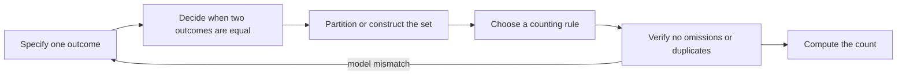
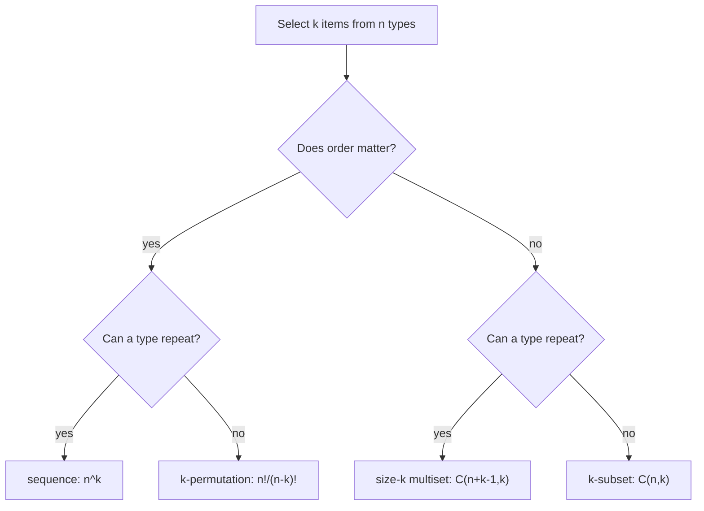
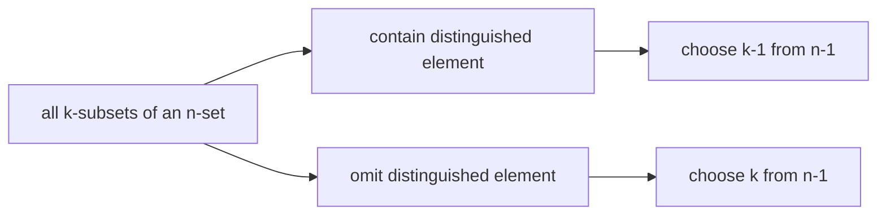

# 0.08 Counting and Combinatorics

[Section home](../README.md) | Previous: [§0.07 Induction, Recursion, and Invariants](../00.07-induction-recursion-invariants/README.md) | [Project guides](../../STYLE_GUIDE.md) | [Notation guide](../../NOTATION.md)

## Why this matters

Counting is not mainly about large arithmetic. It is about building the right finite set and proving that each object enters the count exactly once.

That skill sits underneath discrete probability, randomized algorithms, search spaces, model architectures, dataset splits, categorical assignments, and state enumeration. Before you can say that an outcome has probability $1/N$, you need to know what the $N$ outcomes are and why they are equally weighted. Before you can compare two search procedures, you need to know whether they traverse sequences, subsets, multisets, trees, or equivalence classes.

MIT's *Mathematics for Computer Science* gives counting its own unit before probability [1]. That order matters. Probability adds weights to outcomes. Counting first teaches you how to specify and enumerate the outcomes themselves.

The central workflow is:



> **Figure 1. Counting starts with an outcome model.** Arithmetic comes after the set, equality rule, and decomposition are fixed. Original diagram.


> **Figure 2. Two binary choices create four sampling spaces.** Rows record whether order matters; columns record whether replacement is allowed. Shape, formulas, and examples carry the distinction without relying on color. Original figure.

### Scope and non-goals

We will cover:

- sum, product, bijection, and division rules;
- permutations, $k$-permutations, combinations, and multinomial coefficients;
- multisets, weak and positive compositions, and stars and bars;
- the binomial and multinomial theorems;
- Pascal's, Vandermonde's, symmetry, and row-sum identities;
- inclusion-exclusion for finite families;
- pigeonhole arguments viewed through capacity and function counting;
- ordered and unordered sampling, with and without replacement;
- finite generating polynomials and formal coefficient bookkeeping;
- Fibonacci and Catalan objects as recursive counting families;
- standard-library implementations, exhaustive small checks, and exact assertions.

This module is explicitly **not**:

- probability axioms, conditional probability, random variables, or distributions, which belong to §3;
- a claim that all listed outcomes are equally likely;
- infinite-series convergence or analytic manipulation of power series;
- Stirling's approximation or asymptotic comparison, which belongs to §0.09;
- advanced generating-function methods such as singularity analysis;
- graph enumeration, Polya counting, or species;
- a replacement for proving that an enumeration has neither duplicates nor omissions.

Generating functions appear because the roadmap explicitly assigns them here. We use finite polynomials and formal power series as coefficient ledgers. Every identity is valid coefficient by coefficient. No argument depends on evaluating an infinite series or proving convergence.

## Learning objectives

After completing this module, you should be able to:

- define a finite outcome space precisely and choose among the sum, product, bijection, and division rules;
- derive permutation, combination, multiset, composition, and multinomial formulas from explicit models;
- identify and compute all four ordered/unordered and with/without-replacement sampling counts;
- prove binomial identities by algebraic coefficient extraction and by counting one set in two ways;
- apply finite inclusion-exclusion and diagnose overcounting at each intersection order;
- use generating polynomials to encode independent finite choices and extract constrained counts;
- derive the Fibonacci and Catalan recurrences from unique decompositions;
- implement and test exact finite counts without presenting bounded enumeration as a universal proof.

The [exercise set](exercises/README.md) assesses every objective. Full [worked solutions](solutions/README.md), tested [standard-library code](code/README.md), and an annotated [resource guide](resources/README.md) are separate.

## Prerequisite check

Required: [§0.04 Sets, Relations, and Functions](../00.04-sets-relations-functions/README.md) and [§0.06 Proof Techniques](../00.06-proof-techniques/README.md).

Try these before starting:

1. Can you distinguish a sequence from a set containing the same entries?
2. Can you state when a function is injective, surjective, or bijective?
3. Can you partition a finite set into disjoint cases?
4. Can you prove two finite sets have the same size by giving a bijection?
5. Can you explain why a uniform fiber size permits division?
6. Can you distinguish a finite exhaustive check from a proof for arbitrary $n$?

Review §0.04 if Cartesian products, functions, fibers, or finite cardinality are uncertain. Review §0.06 if bijective proofs, double counting, inclusion arguments, or pigeonhole reasoning are uncertain. [§0.07](../00.07-induction-recursion-invariants/README.md) is recommended for recursive families and recurrence verification.

## Historical context

Combinatorics grew through many practical and mathematical problems: arrangements, games, coefficients, partitions, designs, and discrete structures. It is more useful here to track methods than to assign the subject to one inventor.

David Guichard's open *Combinatorics and Graph Theory* develops the exact route used in this module: basic rules, permutations and combinations, choice with repetition, multinomial coefficients, inclusion-exclusion, generating functions, recurrences, and Catalan numbers [2]. The text is licensed CC BY-NC-SA 3.0. Our prose, examples, exercises, code, and figures are original rather than adapted.

Oscar Levin's *Discrete Mathematics: An Open Introduction*, third edition, gives an independent undergraduate treatment of additive and multiplicative rules, combinations, permutations, combinatorial proofs, sequences, and generating functions [3]. It is licensed CC BY-SA 4.0 and is especially useful as a second explanation when a formula feels memorized rather than derived.

Python's official documentation names `math.comb` as unordered selection without repetition and `math.perm` as ordered selection without repetition [4]. Its `itertools` documentation separately specifies Cartesian products, permutations, combinations, and combinations with replacement, including the fact that elements are unique by input position rather than value [5]. Those semantics matter when an input iterable contains duplicates.

## Intuition

### The hardest question is "same in what sense?"

Suppose three labels are drawn from $\{A,B,C,D,E\}$.

- `A, C, E` as a sequence differs from `E, C, A`.
- $\{A,C,E\}$ as a subset does not.
- `A, A, C` is allowed only with replacement or with repeated physical copies.
- A multiset remembers multiplicity but not order.

All four interpretations are reasonable. They are different sets.



> **Figure 3. The sampling decision tree.** Ask about order and repetition before choosing a formula. Original diagram.

### Four foundational rules

**Sum rule.** If a finite set is partitioned into disjoint pieces, add their sizes.

**Product rule.** If an object is built through successive choices, multiply the number of choices available at each stage. The available options may depend on earlier choices, as long as the count used at each branch is justified.

**Bijection rule.** If every object in one finite set corresponds to exactly one object in another and vice versa, the sets have equal size.

**Division rule.** If a surjection maps exactly $d$ source objects to every target object, divide the source count by $d$.

The division rule is where many factorial denominators come from. It is not permission to divide by a plausible symmetry factor. Every target must have the same fiber size.

### Count descriptions, not arithmetic shadows

An expression such as

$$
\binom{n}{k}k!
$$

has a story: choose a $k$-element subset, then line up its members. That story proves

$$
\binom{n}{k}k!=\frac{n!}{(n-k)!}.
$$

Without the story, the equality is only algebra. With it, both sides count the same set of length-$k$ sequences with distinct entries.

## Mathematics

### Local notation

| Symbol | Type | Meaning |
|---|---|---|
| $[n]$ | finite set | $\{1,2,\ldots,n\}$ for $n\ge0$ |
| $\lvert A\rvert$ | nonnegative integer | cardinality of finite set $A$ |
| $n!$ | positive integer | factorial, with $0!=1$ |
| $(n)_k$ | nonnegative integer | falling factorial $n(n-1)\cdots(n-k+1)$ |
| $\binom{n}{k}$ | nonnegative integer | number of $k$-subsets of an $n$-set |
| $\binom{n}{k_1,\ldots,k_m}$ | nonnegative integer | multinomial coefficient, where $\sum_i k_i=n$ |
| $[x^r]P(x)$ | scalar | coefficient of $x^r$ in $P(x)$ |
| $F_n$ | nonnegative integer | Fibonacci number, $F_0=0,F_1=1$ |
| $C_n$ | nonnegative integer | Catalan number, $C_0=1$ |

We use

$$
\binom{n}{k}=0
$$

when $k<0$ or $k>n$ for nonnegative $n$. This convention makes identities valid at their boundaries without extra cases.

### Sum rule

If finite sets $A_1,\ldots,A_m$ are pairwise disjoint, then

$$
\left|\bigcup_{i=1}^{m}A_i\right|
=
\sum_{i=1}^{m}|A_i|.
$$

Pairwise disjointness is load-bearing. If pieces overlap, addition counts shared objects more than once. Inclusion-exclusion repairs that failure later.

### Product rule

For finite sets $A_1,\ldots,A_m$,

$$
|A_1\times\cdots\times A_m|
=
\prod_{i=1}^{m}|A_i|.
$$

More generally, if stage $i$ has exactly $c_i$ legal continuations after every legal prefix, the number of complete objects is $\prod_i c_i$.

The empty product is $1$. There is one empty sequence and one way to make zero choices. This convention explains $0!=1$, $n^0=1$, and the count of a zero-draw sample.

### Bijection and division

If $f:A\to B$ is a bijection between finite sets, then $|A|=|B|$.

If $f:A\to B$ is surjective and every fiber has size $d>0$,

$$
|f^{-1}(\{b\})|=d
\quad\text{for every }b\in B,
$$

then

$$
|B|=\frac{|A|}{d}.
$$

This follows because the fibers partition $A$ into $|B|$ disjoint blocks of size $d$.

### Permutations and combinations

The number of permutations of $n$ distinct objects is

$$
n!=n(n-1)\cdots2\cdot1.
$$

The number of ordered selections of $k$ distinct objects from $n$ is the falling factorial

$$
(n)_k
=n(n-1)\cdots(n-k+1)
=\frac{n!}{(n-k)!}.
$$

The number of unordered $k$-subsets is

$$
\binom{n}{k}
=\frac{(n)_k}{k!}
=\frac{n!}{k!(n-k)!}.
$$

The division by $k!$ is valid because each $k$-subset has exactly $k!$ linear orders.

Boundary checks:

$$
\binom{n}{0}=\binom{n}{n}=1,
\qquad
\binom{n}{k}=0\text{ for }k>n.
$$

### The four sampling models

Let $n$ be the number of distinct types and $k$ the number of draws.

| | With replacement | Without replacement |
|---|---:|---:|
| **Ordered** | $n^k$ | $(n)_k=\dfrac{n!}{(n-k)!}$ |
| **Unordered** | $\binom{n+k-1}{k}$ | $\binom{n}{k}$ |

The table counts sample spaces. It says nothing about the probability of each outcome. Physical sampling can also differ from type-level sampling. If a box contains three physically distinct copies of each label, drawing without replacement from physical objects is not identical to drawing labels with replacement once enough copies might be exhausted.

### Multisets and multinomial coefficients

A multiset records a nonnegative multiplicity for each type. Suppose a word has $k_i$ copies of type $i$, with

$$
k_1+\cdots+k_m=n.
$$

If every physical copy were distinguishable, there would be $n!$ orders. Permuting the $k_i$ copies of one type changes no visible word, so every visible word has $\prod_i k_i!$ labeled preimages. Therefore

$$
\binom{n}{k_1,\ldots,k_m}
\coloneqq
\frac{n!}{k_1!\cdots k_m!}.
$$

Equivalently, choose positions successively:

$$
\binom{n}{k_1}
\binom{n-k_1}{k_2}
\cdots
=
\binom{n}{k_1,\ldots,k_m}.
$$

### Stars and bars

The number of weak compositions

$$
x_1+\cdots+x_m=r,
\qquad x_i\in\mathbb{N},
$$

is

$$
\binom{r+m-1}{m-1}
=
\binom{r+m-1}{r}.
$$

Represent $r$ identical stars and insert $m-1$ bars. Stars before the first bar give $x_1$, stars between bars give intermediate parts, and stars after the final bar give $x_m$.


> **Figure 4. A stars-and-bars string is a weak composition.** Consecutive bars encode zero parts, so this model counts nonnegative rather than positive solutions. Original figure.

For positive compositions $x_i\ge1$, give one unit to every part first. Set $y_i=x_i-1\ge0$. Then

$$
y_1+\cdots+y_m=r-m,
$$

so the count is

$$
\binom{r-1}{m-1}
$$

when $r\ge m$, and zero otherwise.

### The binomial theorem

For nonnegative integer $n$,

$$
(a+b)^n
=
\sum_{k=0}^{n}\binom{n}{k}a^{n-k}b^k.
$$

To form a term in the product of $n$ factors $(a+b)$, choose which $k$ factors contribute $b$. The remaining $n-k$ contribute $a$. There are $\binom{n}{k}$ such choices.

Useful substitutions give counting identities:

$$
\sum_{k=0}^{n}\binom{n}{k}=2^n
$$

by setting $a=b=1$, and for $n\ge1$,

$$
\sum_{k=0}^{n}(-1)^k\binom{n}{k}=0
$$

by setting $a=1,b=-1$.

### Pascal's identity and symmetry

Fix one distinguished element of an $n$-set. Every $k$-subset either contains it or does not, so

$$
\binom{n}{k}
=
\binom{n-1}{k-1}
+
\binom{n-1}{k}.
$$

Taking complements gives a bijection between $k$-subsets and $(n-k)$-subsets:

$$
\binom{n}{k}=\binom{n}{n-k}.
$$



> **Figure 5. Pascal's identity is a disjoint case split.** The two branches are exhaustive and cannot overlap. Original diagram.

### Vandermonde's identity

Let disjoint sets $A$ and $B$ have sizes $m$ and $n$. Count the $r$-subsets of $A\cup B$ by the number $k$ chosen from $A$:

$$
\sum_{k=0}^{r}
\binom{m}{k}\binom{n}{r-k}
=
\binom{m+n}{r}.
$$

Our zero convention handles impossible terms automatically. Algebraically, the same identity follows by comparing the coefficient of $x^r$ in

$$
(1+x)^m(1+x)^n=(1+x)^{m+n}.
$$

One identity, two proofs: partitioning subsets and extracting coefficients.

### The multinomial theorem

For nonnegative integer $n$,

$$
(x_1+\cdots+x_m)^n
=
\sum_{k_1+\cdots+k_m=n}
\binom{n}{k_1,\ldots,k_m}
\prod_{i=1}^{m}x_i^{k_i},
$$

where the sum is over nonnegative integer tuples. A term with exponents $(k_1,\ldots,k_m)$ arises by assigning each of the $n$ factors to one of $m$ choices with those multiplicities.

Setting every $x_i=1$ gives

$$
\sum_{k_1+\cdots+k_m=n}
\binom{n}{k_1,\ldots,k_m}
=m^n.
$$

Both sides count length-$n$ words over an $m$-symbol alphabet.

### Inclusion-exclusion

For finite sets $A_1,\ldots,A_m$,

$$
\left|\bigcup_{i=1}^{m}A_i\right|
=
\sum_{\varnothing\ne J\subseteq[m]}
(-1)^{|J|+1}
\left|\bigcap_{j\in J}A_j\right|.
$$

For three sets this is

$$
\begin{aligned}
|A\cup B\cup C|
={}&|A|+|B|+|C|\\
&-|A\cap B|-|A\cap C|-|B\cap C|\\
&+|A\cap B\cap C|.
\end{aligned}
$$

An object lying in exactly $t$ sets contributes

$$
\binom{t}{1}-\binom{t}{2}+\cdots+(-1)^{t+1}\binom{t}{t}=1.
$$

An object in no set contributes zero. That object-by-object ledger proves the formula.


> **Figure 6. Inclusion-exclusion repairs multiplicity one layer at a time.** A point in three sets contributes $3-3+1=1$; a point in two contributes $2-1=1$. Original figure.

To count objects avoiding every bad property $A_i$ inside universe $U$, use

$$
\left|U\setminus\bigcup_i A_i\right|
=|U|-\left|\bigcup_i A_i\right|.
$$

### Pigeonhole through counting maps

For a function $f:A\to B$ between finite sets:

- if $|A|>|B|$, then $f$ cannot be injective;
- if $|A|<|B|$, then $f$ cannot be surjective;
- if $|A|=|B|$, injective and surjective are equivalent.

The generalized capacity form says that if $|A|$ objects are assigned to $|B|>0$ boxes, some fiber has size at least

$$
\left\lceil\frac{|A|}{|B|}\right\rceil.
$$

§0.06 introduced the proof technique. Here the emphasis is structural: a pigeonhole argument often appears after you count a domain and codomain and discover that injectivity is impossible.

### Generating polynomials

A finite sequence $a_0,\ldots,a_d$ can be stored as

$$
A(x)=\sum_{i=0}^{d}a_ix^i.
$$

The notation

$$
[x^r]A(x)=a_r
$$

asks for the coefficient of $x^r$.

Suppose one choice contributes sizes encoded by $A(x)$ and an independent choice contributes sizes encoded by $B(x)$. Then

$$
[x^r]A(x)B(x)
=
\sum_{i=0}^{r}a_i b_{r-i}.
$$

This is convolution. It counts all pairs whose sizes add to $r$.

For a variable constrained by $0\le x_i\le M_i$, use factor

$$
1+x+x^2+\cdots+x^{M_i}.
$$

Therefore the number of solutions to

$$
x_1+\cdots+x_m=r,
\qquad0\le x_i\le M_i,
$$

is

$$
[x^r]\prod_{i=1}^{m}(1+x+\cdots+x^{M_i}).
$$

This is finite polynomial multiplication. There is no convergence question.

### Formal generating functions

For a sequence $(a_n)_{n\ge0}$, write the ordinary generating function formally as

$$
A(x)=\sum_{n\ge0}a_nx^n.
$$

"Formally" means we manipulate coefficients. We do not assume that substituting a numerical $x$ produces a convergent series.

For Fibonacci numbers,

$$
F_0=0,
\quad F_1=1,
\quad F_n=F_{n-1}+F_{n-2},
$$

coefficient alignment gives

$$
F(x)=x+xF(x)+x^2F(x),
$$

so

$$
F(x)=\frac{x}{1-x-x^2}
$$

as a formal power-series identity. §0.07 already solved the recurrence by characteristic roots. Here the point is that shifts become multiplication by $x$.

### Fibonacci as a count

Let $T_n$ count tilings of a length-$n$ strip by squares of length one and dominoes of length two. The final tile is uniquely either:

- a square following a tiling of length $n-1$; or
- a domino following a tiling of length $n-2$.

Thus

$$
T_n=T_{n-1}+T_{n-2},
\qquad T_0=1,
\quad T_1=1.
$$

Therefore $T_n=F_{n+1}$. The recurrence is valid because the last-tile split is exhaustive, disjoint, and reversible.

### Catalan numbers

Let $C_n$ count balanced parenthesis words with $n$ pairs. Every nonempty balanced word has a unique decomposition

$$
(u)v,
$$

where $u$ and $v$ are balanced. If $u$ has $i$ pairs, $v$ has $n-1-i$. Therefore

$$
C_0=1,
\qquad
C_n=\sum_{i=0}^{n-1}C_iC_{n-1-i}.
$$

The closed form is

$$
C_n
=
\frac{1}{n+1}\binom{2n}{n}
=
\binom{2n}{n}-\binom{2n}{n+1}.
$$

Interpret `(` as an up-step and `)` as a down-step. There are $\binom{2n}{n}$ paths with $n$ of each step. A reflection bijection maps paths that ever cross below height zero to paths with $n-1$ up-steps and $n+1$ down-steps, counted by $\binom{2n}{n+1}$. Subtraction leaves the balanced paths.


> **Figure 7. Catalan counting imposes a prefix boundary.** The solid path never falls below zero; the dashed path crosses the boundary and is paired with a reflected unrestricted path. Original figure.

Catalan numbers count many families because those families share the same unique binary decomposition or boundary-path bijection. Matching initial values alone is not enough. You must prove the recurrence or give a bijection.

## Derivation

### Deriving the division rule

Let $f:A\to B$ be onto with every fiber of size $d$. Distinct fibers are disjoint, and their union is $A$. By the sum rule,

$$
|A|
=
\sum_{b\in B}|f^{-1}(\{b\})|
=
\sum_{b\in B}d
=d|B|.
$$

Since $d>0$, divide to obtain $|B|=|A|/d$.

This derivation explains exactly why $\binom{n}{k}=(n)_k/k!$. The forget-order map is onto, and every subset has $k!$ sequence preimages.

### Deriving stars and bars as a bijection

Map a weak composition $(x_1,\ldots,x_m)$ of $r$ to the string

$$
\underbrace{**\cdots*}_{x_1}|\underbrace{**\cdots*}_{x_2}|\cdots|
\underbrace{**\cdots*}_{x_m}.
$$

The inverse reads the number of stars in each compartment. The string contains $r+m-1$ positions, and choosing the $m-1$ bar positions determines it. Hence the count $\binom{r+m-1}{m-1}$.

Consecutive bars are necessary. Removing them would forbid zero parts and change the target set.

### Deriving Vandermonde two ways

**Combinatorial route.** Partition all $r$-subsets of $A\cup B$ by $k=|S\cap A|$. The class for $k$ has size $\binom{m}{k}\binom{n}{r-k}$. Summing disjoint classes gives the left side; direct selection from $m+n$ objects gives the right side.

**Algebraic route.** Expand

$$
(1+x)^m(1+x)^n.
$$

Its $x^r$ coefficient is the convolution on the left. Since the product equals $(1+x)^{m+n}$, the coefficient is also $\binom{m+n}{r}$.

The two proofs reveal the same mechanism: degrees add exactly as selected counts add.

### Deriving inclusion-exclusion elementwise

Fix one object $u$ that lies in exactly $t$ of the sets. It appears in $\binom{t}{j}$ intersections of size $j$. Its total signed contribution is

$$
\sum_{j=1}^{t}(-1)^{j+1}\binom{t}{j}.
$$

From

$$
0=(1-1)^t
=1+\sum_{j=1}^{t}(-1)^j\binom{t}{j},
$$

the contribution equals one. Objects outside the union appear in no term. Summing contributions over the universe proves the formula.

### Deriving coefficient convolution

Multiply finite polynomials:

$$
\left(\sum_i a_ix^i\right)
\left(\sum_j b_jx^j\right)
=
\sum_i\sum_j a_ib_jx^{i+j}.
$$

Collect terms with $i+j=r$:

$$
[x^r]A(x)B(x)
=
\sum_{i=0}^{r}a_i b_{r-i}.
$$

Each product $a_i b_{r-i}$ counts one disjoint size split. Polynomial multiplication is the product rule followed by the sum rule.

## Implementation

The tested implementation lives in [`code/counting.py`](code/counting.py), with its execution guide and evidence boundary in [`code/README.md`](code/README.md).

Python integers keep these finite counts exact. The implementation uses `math.comb` and `math.perm` only after the outcome model has selected the formula.

### Enumerate the four models

```python
from itertools import combinations, combinations_with_replacement, permutations, product
from math import comb, perm

population = tuple("ABCDE")
draws = 3

ordered_with = tuple(product(population, repeat=draws))
ordered_without = tuple(permutations(population, draws))
unordered_with = tuple(combinations_with_replacement(population, draws))
unordered_without = tuple(combinations(population, draws))

assert len(ordered_with) == len(population) ** draws == 125
assert len(ordered_without) == perm(len(population), draws) == 60
assert len(unordered_with) == comb(len(population) + draws - 1, draws) == 35
assert len(unordered_without) == comb(len(population), draws) == 10
```

### Multiply generating polynomials

```python
def convolve(left, right):
    if not left or not right:
        return []
    result = [0] * (len(left) + len(right) - 1)
    for left_degree, left_coefficient in enumerate(left):
        for right_degree, right_coefficient in enumerate(right):
            result[left_degree + right_degree] += left_coefficient * right_coefficient
    return result


coefficients = [1]
for maximum in (2, 3, 1):
    coefficients = convolve(coefficients, [1] * (maximum + 1))

assert coefficients == [1, 3, 5, 6, 5, 3, 1]
assert coefficients[4] == 5
```

The coefficient at index four counts solutions to $x_1+x_2+x_3=4$ with maxima $(2,3,1)$.

### Verify Catalan two ways

```python
from math import comb

catalan_values = [1]
for number in range(1, 10):
    recurrence_value = sum(
        catalan_values[left] * catalan_values[number - 1 - left]
        for left in range(number)
    )
    closed_value = comb(2 * number, number) // (number + 1)
    assert recurrence_value == closed_value
    catalan_values.append(recurrence_value)

assert catalan_values[:7] == [1, 1, 2, 5, 14, 42, 132]
```

Agreement through nine is a strong regression test. It is not the proof that the formulas agree for every $n$.

## Experimentation

### Experiment 1: mutate the outcome model

Start with five types and three draws. Change exactly one assumption at a time:

1. ordered with replacement: $5^3=125$;
2. forbid repeated types: $(5)_3=60$;
3. then forget order: $\binom{5}{3}=10$;
4. restore repetition while keeping order irrelevant: $\binom{7}{3}=35$.

List a witness pair that merges when order is forgotten, and a witness that disappears when replacement is forbidden. The formulas become easier to remember when you can name the changed set.

### Experiment 2: coefficient distributions

Multiply

$$
(1+x+x^2)(1+x+x^2+x^3)(1+x).
$$

The coefficients are

$$
1,3,5,6,5,3,1.
$$

Exhaustively enumerate the $3\cdot4\cdot2=24$ bounded triples and group them by sum. The histogram must match the coefficients and sum back to $24$.

### Experiment 3: inclusion-exclusion depth

For a finite family of sets, compare:

- the direct union size;
- singleton terms only;
- singleton minus pair terms;
- the complete alternating sum.

Track one object in three sets. It moves from multiplicity $3$ to $0$ to $1$. Stopping after pair subtraction is therefore wrong for triple overlaps.

### Experiment 4: recurrence families

Generate tilings and balanced parenthesis words for small $n$. Group tilings by final tile and parenthesis words by their unique `(u)v` split. The observed groups should match the Fibonacci and Catalan recurrences exactly.

Every experiment has a finite declared domain. Enumeration proves a count only for the fully exhausted finite instance, not for arbitrary parameters.

## Worked examples

### Worked example 1: passwords by cases

How many length-four strings over ten digits either start with `0` or end with `0`, but not both?

The cases are disjoint:

- starts with zero and ends nonzero: $1\cdot10^2\cdot9=900$;
- starts nonzero and ends with zero: $9\cdot10^2\cdot1=900$.

Total: $1800$.

### Worked example 2: injective assignments

Assign four distinct tasks to four different workers selected from seven. Order here means task identity: the first slot is task one, not time order.

$$
(7)_4=7\cdot6\cdot5\cdot4=840.
$$

### Worked example 3: choose then arrange

Select four of seven features and assign them to four labeled positions:

$$
\binom{7}{4}4!=35\cdot24=840.
$$

This matches Worked example 2 because both describe injective functions from four labeled positions to seven features.

### Worked example 4: repeated symbols

How many distinct words use two `A`s, two `B`s, and one `C`?

$$
\binom{5}{2,2,1}=\frac{5!}{2!2!1!}=30.
$$

The denominator removes permutations of copies that do not change the visible word.

### Worked example 5: distribute identical units

Distribute seven identical accelerator slots among three labeled jobs, allowing zero:

$$
x_1+x_2+x_3=7,
\qquad x_i\ge0.
$$

The count is

$$
\binom{7+3-1}{3-1}=\binom{9}{2}=36.
$$

If every job needs at least one slot, the count becomes $\binom{6}{2}=15$.

### Worked example 6: a bounded allocation

Count $x_1+x_2+x_3=4$ with $0\le(x_1,x_2,x_3)\le(2,3,1)$ coordinatewise.

The generating polynomial is

$$
(1+x+x^2)(1+x+x^2+x^3)(1+x).
$$

Its $x^4$ coefficient is $5$. Direct solutions are

$$
(0,3,1),(1,2,1),(1,3,0),(2,1,1),(2,2,0).
$$

### Worked example 7: Pascal at a boundary

For $k=0$,

$$
\binom{n}{0}
=
\binom{n-1}{-1}+\binom{n-1}{0}
=0+1=1.
$$

The zero convention removes a distracting special case while preserving the subset proof.

### Worked example 8: Vandermonde numerically

Choose four objects from groups of sizes three and five:

$$
\sum_{k=0}^{4}\binom{3}{k}\binom{5}{4-k}
=5+30+30+5
=70
=\binom{8}{4}.
$$

The four nonzero terms correspond to choosing $0,1,2,3$ objects from the first group.

### Worked example 9: three-set inclusion-exclusion

Suppose

$$
|A|=18,\ |B|=15,\ |C|=12,
$$

$$
|A\cap B|=7,\ |A\cap C|=5,\ |B\cap C|=4,
\quad |A\cap B\cap C|=2.
$$

Then

$$
|A\cup B\cup C|
=18+15+12-7-5-4+2=31.
$$

The triple intersection is added back because singleton terms count its objects three times and pair terms subtract them three times.

### Worked example 10: derangements of four labels

Let $A_i$ be permutations fixing position $i$. Inclusion-exclusion gives

$$
4!-\binom41 3!+\binom42 2!-\binom43 1!+\binom44 0!
=24-24+12-4+1=9.
$$

This counts permutations with no fixed position. The formula comes from choosing fixed positions, then permuting the rest.

### Worked example 11: Fibonacci tilings

For a strip of length five,

$$
T_5=T_4+T_3=5+3=8=F_6.
$$

The classes are determined by the final square or final domino. No tiling belongs to both.

### Worked example 12: Catalan parentheses

For three pairs,

$$
C_3=C_0C_2+C_1C_1+C_2C_0=2+1+2=5.
$$

The five words are `((()))`, `(()())`, `(())()`, `()(())`, and `()()()`.

## Common mistakes

### Choosing a formula before defining an outcome

Ask whether order, repetition, labels, and physical identity matter. A formula cannot repair an ambiguous sample space.

### Applying the sum rule to overlapping cases

Either refine the cases into a partition or use inclusion-exclusion.

### Multiplying branch counts that are not uniform

The product $c_1\cdots c_m$ requires the stated number of continuations at each relevant branch. If branch sizes vary, sum over prefixes or find another decomposition.

### Dividing by a nonuniform symmetry factor

Division requires equal fiber sizes. Symmetric-looking objects can have different stabilizers, so advanced orbit counting needs more care than "divide by the number of symmetries."

### Confusing identical types with distinct physical copies

Three balls labeled `A` may be distinct physical objects but one visible type. State which equality relation defines outcomes.

### Using stars and bars with upper bounds

Plain stars and bars handles lower bounds after shifting. Finite upper bounds need inclusion-exclusion, generating polynomials, or another constrained count.

### Forgetting empty structures

There is one empty sequence, one empty subset, one empty product, one zero-part composition of zero, and one empty balanced-parenthesis word. These base objects make recurrences and identities work.

### Treating formal series as convergent numerical series

Coefficient identities do not require numerical convergence. Do not substitute a real number into an infinite generating function unless an analytic argument permits it.

### Claiming "both sides look similar"

A combinatorial identity needs one common counted set, a partition, and a bijection or count for each part.

### Promoting enumeration to a universal proof

Exhausting all cases for fixed $n$ proves that instance. It can reveal a formula and catch mistakes, but arbitrary $n$ still needs an argument.

## Exercises

The [exercise set](exercises/README.md) contains 12 progressive problems spanning model selection, derivation, proof, implementation, experimentation, and source audit. Exact mirrored [worked solutions](solutions/README.md) are committed separately.

The final exercise uses the tested [`code/`](code/README.md) package. No exercise requires third-party software.

## What you should now be able to do

You should now be able to:

- define what one outcome is before counting it;
- derive the four sampling formulas instead of recalling an unlabeled table;
- explain each factorial denominator through a uniform fiber;
- convert multiset and allocation questions into integer solutions;
- prove core binomial identities by disjoint cases, bijections, or coefficients;
- track inclusion-exclusion multiplicities through all intersection depths;
- read finite generating polynomials as choice ledgers;
- derive Fibonacci and Catalan recurrences from unique decompositions;
- use exact code to test formulas while keeping the proof boundary visible.

## Where this leads

Section 3 adds probability measures to the finite outcome spaces built here. Binomial, multinomial, and categorical models reuse these counts but also require probability assumptions that this module deliberately does not introduce.

[§0.09 Sums, Series, and Asymptotics](../00.09-sums-series-asymptotics/README.md) develops infinite-series convergence, harmonic and Stirling estimates, and asymptotic notation. Its analytic treatment starts where this module's finite and formal generating-function treatment stops.

Later algorithms use these ideas to count states, paths, trees, assignments, and candidate models. Information theory uses multinomial counts to connect sequence classes with entropy. Machine learning uses combinations in resampling, subset selection, ensemble construction, and exact finite tests.

## References

[1] E. Lehman, F. T. Leighton, and A. R. Meyer, *Mathematics for Computer Science*, with MIT 6.042J OpenCourseWare, Spring 2015, Unit 3: Counting, Chapters 13-14. MIT OpenCourseWare license: CC BY-NC-SA 4.0. https://ocw.mit.edu/courses/6-042j-mathematics-for-computer-science-spring-2015/pages/readings/ Accessed 2026-09-01.

[2] D. Guichard, *Combinatorics and Graph Theory*, Whitman College, Chapters 1-3. License: CC BY-NC-SA 3.0. https://www.whitman.edu/mathematics/cgt_online/book/ Accessed 2026-09-01.

[3] O. Levin, *Discrete Mathematics: An Open Introduction*, 3rd ed., 2023, Chapter 1 and generating-functions material. License: CC BY-SA 4.0. https://discrete.openmathbooks.org/dmoi3.html Accessed 2026-09-01.

[4] Python Software Foundation, "`math` - Mathematical functions," Python 3.14 documentation, `comb` and `perm`. PSF License Version 2. https://docs.python.org/3/library/math.html#math.comb Accessed 2026-09-01.

[5] Python Software Foundation, "`itertools` - Functions creating iterators for efficient looping," Python 3.14 documentation, combinatoric iterators. PSF License Version 2; documentation examples additionally licensed 0BSD. https://docs.python.org/3/library/itertools.html#itertools.product Accessed 2026-09-01.

[Section home](../README.md) | Previous: [§0.07 Induction, Recursion, and Invariants](../00.07-induction-recursion-invariants/README.md) | Next: [§0.09 Sums, Series, and Asymptotics](../00.09-sums-series-asymptotics/README.md) | [Exercises](exercises/README.md) | [Worked solutions](solutions/README.md) | [Resources](resources/README.md) | [Code](code/README.md)