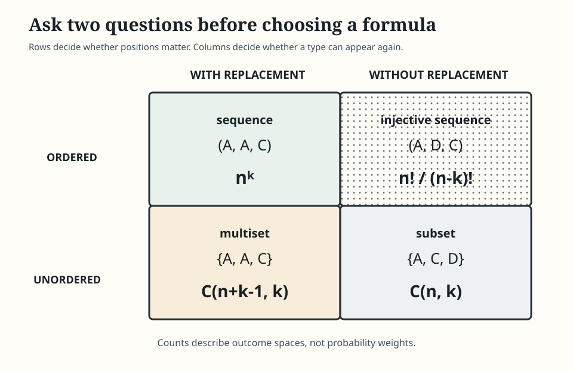
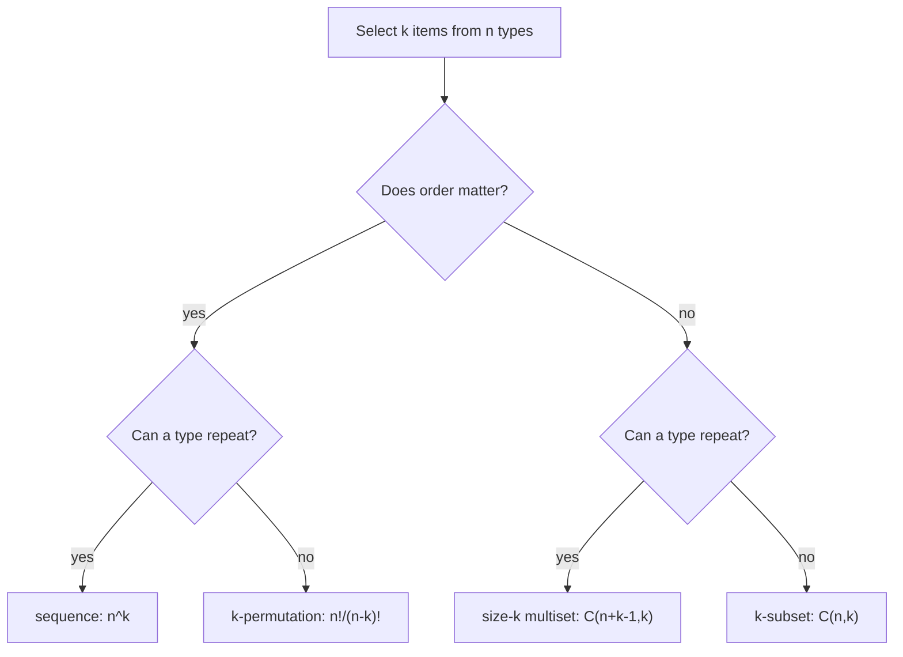
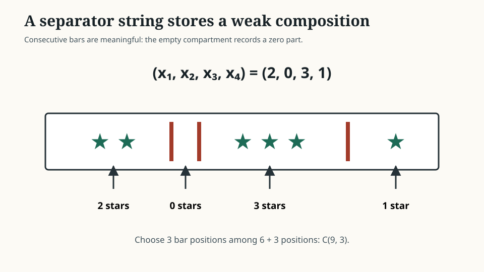
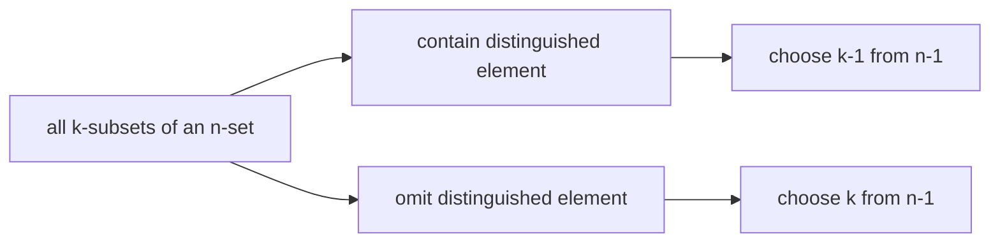
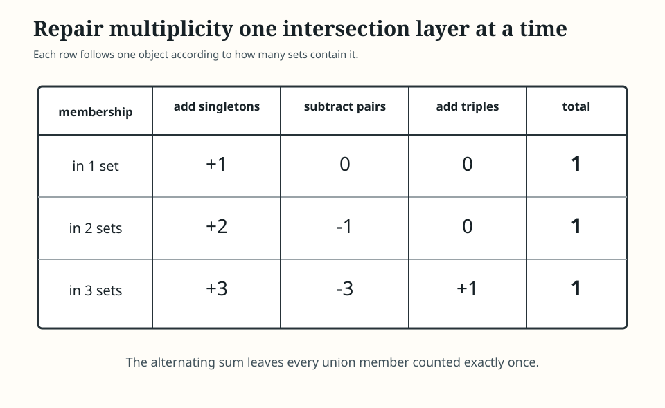
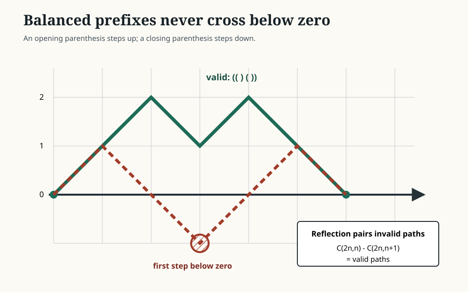

# 0.08 Counting and Combinatorics

[Section home](../README.md) | Previous: [§0.07 Induction, Recursion, and Invariants](../00.07-induction-recursion-invariants/README.md) | [Project guides](../../CONTRIBUTING.md#module-file-structure) | [Notation guide](../../NOTATION.md)

Count finite outcomes by specifying their equality rule and proving a decomposition. You will derive sampling and allocation formulas, binomial identities, inclusion-exclusion, and Fibonacci and Catalan counts using exact arithmetic and finite or formal coefficient methods, not analytic convergence.

[Readiness](#readiness-check) | [Concepts](#finite-counting-and-coefficient-methods) | [Proofs](#counting-proofs) | [Implementation](#implementation) | [Experiments](#experimentation) | [Worked examples](#worked-examples) | [Practice](#practice) | [References](#references)

## Specify the outcome before counting

Counting is not mainly about large arithmetic. It is about building the right finite set and proving that each object enters the count exactly once.

That skill sits underneath discrete probability, randomized algorithms, search spaces, model architectures, dataset splits, categorical assignments, and state enumeration. Before you can say that an outcome has probability $`1/N`$, you need to know what the $`N`$ outcomes are and why they are equally weighted. Before you can compare two search procedures, you need to know whether they traverse sequences, subsets, multisets, trees, or equivalence classes.

MIT's *Mathematics for Computer Science* gives counting its own unit before probability [1]. That order matters. Probability adds weights to outcomes. Counting first teaches you how to specify and enumerate the outcomes themselves.

The central workflow is:


> **Figure 1. Counting starts with an outcome model.** Arithmetic comes after the set, equality rule, and decomposition are fixed. Original diagram.



> **Figure 2. Two binary choices create four sampling spaces.** Rows record whether order matters; columns record whether replacement is allowed. Shape, formulas, and examples carry the distinction without relying on color. Original figure.

### Scope and non-goals

We will cover:

- sum, product, bijection, and division rules;
- permutations, $`k`$-permutations, combinations, and multinomial coefficients;
- multisets, weak and positive compositions, and stars and bars;
- the binomial and multinomial theorems;
- Pascal's, Vandermonde's, symmetry, and row-sum identities;
- inclusion-exclusion for finite families;
- pigeonhole arguments viewed through capacity and function counting;
- ordered and unordered sampling, with and without replacement;
- finite generating polynomials and formal coefficient bookkeeping;
- Fibonacci and Catalan objects as recursive counting families;
- standard-library implementations, exhaustive small checks, and exact assertions.

This module is explicitly **not**:

- probability axioms, conditional probability, random variables, or distributions, which belong to §3;
- a claim that all listed outcomes are equally likely;
- infinite-series convergence or analytic manipulation of power series;
- Stirling's approximation or asymptotic comparison, which belongs to §0.09;
- advanced generating-function methods such as singularity analysis;
- graph enumeration, Polya counting, or species;
- a replacement for proving that an enumeration has neither duplicates nor omissions.

Generating functions appear because the roadmap explicitly assigns them here. We use finite polynomials and formal power series as coefficient ledgers. Every identity is valid coefficient by coefficient. No argument depends on evaluating an infinite series or proving convergence.

## Readiness check

You will need [§0.04 Sets, Relations, and Functions](../00.04-sets-relations-functions/README.md) and [§0.06 Proof Techniques](../00.06-proof-techniques/README.md).

Try these before starting:

1. Can you distinguish a sequence from a set containing the same entries?
2. Can you state when a function is injective, surjective, or bijective?
3. Can you partition a finite set into disjoint cases?
4. Can you prove two finite sets have the same size by giving a bijection?
5. Can you explain why a uniform fiber size permits division?
6. Can you distinguish a finite exhaustive check from a proof for arbitrary $`n`$?

Review §0.04 if Cartesian products, functions, fibers, or finite cardinality are uncertain. Review §0.06 if bijective proofs, double counting, inclusion arguments, or pigeonhole reasoning are uncertain. [§0.07](../00.07-induction-recursion-invariants/README.md) is recommended for recursive families and recurrence verification.

## Historical context

Combinatorics grew through many practical and mathematical problems: arrangements, games, coefficients, partitions, designs, and discrete structures. It is more useful here to track methods than to assign the subject to one inventor.

David Guichard's open *Combinatorics and Graph Theory* develops the exact route used in this module: basic rules, permutations and combinations, choice with repetition, multinomial coefficients, inclusion-exclusion, generating functions, recurrences, and Catalan numbers [2]. The text is licensed CC BY-NC-SA 3.0. Our prose, examples, exercises, code, and figures are original rather than adapted.

Oscar Levin's *Discrete Mathematics: An Open Introduction*, third edition, gives an independent undergraduate treatment of additive and multiplicative rules, combinations, permutations, combinatorial proofs, sequences, and generating functions [3]. It is licensed CC BY-SA 4.0 and is especially useful as a second explanation when a formula feels memorized rather than derived.

Python's official documentation names `math.comb` as unordered selection without repetition and `math.perm` as ordered selection without repetition [4]. Its `itertools` documentation separately specifies Cartesian products, permutations, combinations, and combinations with replacement, including the fact that elements are unique by input position rather than value [5]. Those semantics matter when an input iterable contains duplicates.

## Outcome models and counting rules

### The hardest question is "same in what sense?"

Suppose three labels are drawn from $`\lbrace A,B,C,D,E\rbrace`$.

- `A, C, E` as a sequence differs from `E, C, A`.
- $`\lbrace A,C,E\rbrace`$ as a subset does not.
- `A, A, C` is allowed only with replacement or with repeated physical copies.
- A multiset remembers multiplicity but not order.

All four interpretations are reasonable. They are different sets.



> **Figure 3. The sampling decision tree.** Ask about order and repetition before choosing a formula. Original diagram.

### Four foundational rules

**Sum rule.** If a finite set is partitioned into disjoint pieces, add their sizes.

**Product rule.** If an object is built through successive choices, multiply the number of choices available at each stage. The available options may depend on earlier choices, as long as the count used at each branch is justified.

**Bijection rule.** If every object in one finite set corresponds to exactly one object in another and vice versa, the sets have equal size.

**Division rule.** If a surjection maps exactly $`d`$ source objects to every target object, divide the source count by $`d`$.

The division rule is where many factorial denominators come from. It is not permission to divide by a plausible symmetry factor. Every target must have the same fiber size.

### Count descriptions, not arithmetic shadows

An expression such as

$$
\binom{n}{k}k!
$$

has a story: choose a $`k`$-element subset, then line up its members. That story proves

$$
\binom{n}{k}k!=\frac{n!}{(n-k)!}.
$$

Without the story, the equality is only algebra. With it, both sides count the same set of length-$`k`$ sequences with distinct entries.

## Finite counting and coefficient methods

### Local notation

| Symbol | Type | Meaning |
|---|---|---|
| $`[n]`$ | finite set | $`\lbrace 1,2,\ldots,n\rbrace`$ for $`n\ge0`$ |
| $`\lvert A\rvert`$ | nonnegative integer | cardinality of finite set $`A`$ |
| $`n!`$ | positive integer | factorial, with $`0!=1`$ |
| $`(n)_k`$ | nonnegative integer | falling factorial $`n(n-1)\cdots(n-k+1)`$ |
| $`\binom{n}{k}`$ | nonnegative integer | number of $`k`$-subsets of an $`n`$-set |
| $`\binom{n}{k_1,\ldots,k_m}`$ | nonnegative integer | multinomial coefficient, where $`\sum_i k_i=n`$ |
| $`[x^r]P(x)`$ | scalar | coefficient of $`x^r`$ in $`P(x)`$ |
| $`F_n`$ | nonnegative integer | Fibonacci number, $`F_0=0,F_1=1`$ |
| $`C_n`$ | nonnegative integer | Catalan number, $`C_0=1`$ |

We use

$$
\binom{n}{k}=0
$$

when $`k<0`$ or $`k>n`$ for nonnegative $`n`$. This convention makes identities valid at their boundaries without extra cases.

### Sum rule

If finite sets $`A_1,\ldots,A_m`$ are pairwise disjoint, then

$$
\left|\bigcup_{i=1}^{m}A_i\right| =
\sum_{i=1}^{m}|A_i|.
$$

Pairwise disjointness is load-bearing. If pieces overlap, addition counts shared objects more than once. Inclusion-exclusion repairs that failure later.

### Product rule

For finite sets $`A_1,\ldots,A_m`$,

$$
|A_1\times\cdots\times A_m| =
\prod_{i=1}^{m}|A_i|.
$$

More generally, if stage $`i`$ has exactly $`c_i`$ legal continuations after every legal prefix, the number of complete objects is $`\prod_i c_i`$.

The empty product is $`1`$. There is one empty sequence and one way to make zero choices. This convention explains $`0!=1`$, $`n^0=1`$, and the count of a zero-draw sample.

### Bijection and division

If $`f:A\to B`$ is a bijection between finite sets, then $`|A|=|B|`$.

If $`f:A\to B`$ is surjective and every fiber has size $`d>0`$,

$$
|f^{-1}(\lbrace b\rbrace)|=d
\quad\text{for every }b\in B,
$$

then

$$
|B|=\frac{|A|}{d}.
$$

This follows because the fibers partition $`A`$ into $`|B|`$ disjoint blocks of size $`d`$.

### Permutations and combinations

The number of permutations of $`n`$ distinct objects is

$$
n!=n(n-1)\cdots2\cdot1.
$$

The number of ordered selections of $`k`$ distinct objects from $`n`$ is the falling factorial

$$
(n)_k
=n(n-1)\cdots(n-k+1)
=\frac{n!}{(n-k)!}.
$$

The number of unordered $`k`$-subsets is

$$
\binom{n}{k}
=\frac{(n)_k}{k!}
=\frac{n!}{k!(n-k)!}.
$$

The division by $`k!`$ is valid because each $`k`$-subset has exactly $`k!`$ linear orders.

Boundary checks:

$$
\binom{n}{0}=\binom{n}{n}=1,
\qquad
\binom{n}{k}=0\text{ for }k>n.
$$

### The four sampling models

Let $`n`$ be the number of distinct types and $`k`$ the number of draws.

| | With replacement | Without replacement |
|---|---:|---:|
| **Ordered** | $`n^k`$ | $`(n)_k=\dfrac{n!}{(n-k)!}`$ |
| **Unordered** | $`\binom{n+k-1}{k}`$ | $`\binom{n}{k}`$ |

The table counts sample spaces. It says nothing about the probability of each outcome. Physical sampling can also differ from type-level sampling. If a box contains three physically distinct copies of each label, drawing without replacement from physical objects is not identical to drawing labels with replacement once enough copies might be exhausted.

### Multisets and multinomial coefficients

A multiset records a nonnegative multiplicity for each type. Suppose a word has $`k_i`$ copies of type $`i`$, with

$$
k_1+\cdots+k_m=n.
$$

If every physical copy were distinguishable, there would be $`n!`$ orders. Permuting the $`k_i`$ copies of one type changes no visible word, so every visible word has $`\prod_i k_i!`$ labeled preimages. Therefore

$$
\binom{n}{k_1,\ldots,k_m}
\coloneqq
\frac{n!}{k_1!\cdots k_m!}.
$$

Equivalently, choose positions successively:

$$
\binom{n}{k_1}
\binom{n-k_1}{k_2}
\cdots =
\binom{n}{k_1,\ldots,k_m}.
$$

### Stars and bars

The number of weak compositions

$$
x_1+\cdots+x_m=r,
\qquad x_i\in\mathbb{N},
$$

is

$$
\binom{r+m-1}{m-1} =
\binom{r+m-1}{r}.
$$

Represent $`r`$ identical stars and insert $`m-1`$ bars. Stars before the first bar give $`x_1`$, stars between bars give intermediate parts, and stars after the final bar give $`x_m`$.



> **Figure 4. A stars-and-bars string is a weak composition.** Consecutive bars encode zero parts, so this model counts nonnegative rather than positive solutions. Original figure.

For positive compositions $`x_i\ge1`$, give one unit to every part first. Set $`y_i=x_i-1\ge0`$. Then

$$
y_1+\cdots+y_m=r-m,
$$

so the count is

$$
\binom{r-1}{m-1}
$$

when $`r\ge m`$, and zero otherwise.

### The binomial theorem

For nonnegative integer $`n`$,

$$
(a+b)^n =
\sum_{k=0}^{n}\binom{n}{k}a^{n-k}b^k.
$$

To form a term in the product of $`n`$ factors $`(a+b)`$, choose which $`k`$ factors contribute $`b`$. The remaining $`n-k`$ contribute $`a`$. There are $`\binom{n}{k}`$ such choices.

Useful substitutions give counting identities:

$$
\sum_{k=0}^{n}\binom{n}{k}=2^n
$$

by setting $`a=b=1`$, and for $`n\ge1`$,

$$
\sum_{k=0}^{n}(-1)^k\binom{n}{k}=0
$$

by setting $`a=1,b=-1`$.

### Pascal's identity and symmetry

Fix one distinguished element of an $`n`$-set. Every $`k`$-subset either contains it or does not, so

$$
\binom{n}{k} =
\binom{n-1}{k-1}
+
\binom{n-1}{k}.
$$

Taking complements gives a bijection between $`k`$-subsets and $`(n-k)`$-subsets:

$$
\binom{n}{k}=\binom{n}{n-k}.
$$



> **Figure 5. Pascal's identity is a disjoint case split.** The two branches are exhaustive and cannot overlap. Original diagram.

### Vandermonde's identity

Let disjoint sets $`A`$ and $`B`$ have sizes $`m`$ and $`n`$. Count the $`r`$-subsets of $`A\cup B`$ by the number $`k`$ chosen from $`A`$:

$$
\sum_{k=0}^{r}
\binom{m}{k}\binom{n}{r-k} =
\binom{m+n}{r}.
$$

Our zero convention handles impossible terms automatically. Algebraically, the same identity follows by comparing the coefficient of $`x^r`$ in

$$
(1+x)^m(1+x)^n=(1+x)^{m+n}.
$$

One identity, two proofs: partitioning subsets and extracting coefficients.

### The multinomial theorem

For nonnegative integer $`n`$,

$$
(x_1+\cdots+x_m)^n =
\sum_{k_1+\cdots+k_m=n}
\binom{n}{k_1,\ldots,k_m}
\prod_{i=1}^{m}x_i^{k_i},
$$

where the sum is over nonnegative integer tuples. A term with exponents $`(k_1,\ldots,k_m)`$ arises by assigning each of the $`n`$ factors to one of $`m`$ choices with those multiplicities.

Setting every $`x_i=1`$ gives

$$
\sum_{k_1+\cdots+k_m=n}
\binom{n}{k_1,\ldots,k_m}
=m^n.
$$

Both sides count length-$`n`$ words over an $`m`$-symbol alphabet.

### Inclusion-exclusion

For finite sets $`A_1,\ldots,A_m`$,

$$
\left|\bigcup_{i=1}^{m}A_i\right| =
\sum_{\varnothing\ne J\subseteq[m]}
(-1)^{|J|+1}
\left|\bigcap_{j\in J}A_j\right|.
$$

For three sets this is

$$
\begin{aligned}
|A\cup B\cup C|
={}&|A|+|B|+|C|\\\\
&-|A\cap B|-|A\cap C|-|B\cap C|\\\\
&+|A\cap B\cap C|.
\end{aligned}
$$

An object lying in exactly $`t`$ sets contributes

$$
\binom{t}{1}-\binom{t}{2}+\cdots+(-1)^{t+1}\binom{t}{t}=1.
$$

An object in no set contributes zero. That object-by-object ledger proves the formula.



> **Figure 6. Inclusion-exclusion repairs multiplicity one layer at a time.** A point in three sets contributes $`3-3+1=1`$; a point in two contributes $`2-1=1`$. Original figure.

To count objects avoiding every bad property $`A_i`$ inside universe $`U`$, use

$$
\left|U\setminus\bigcup_i A_i\right|
=|U|-\left|\bigcup_i A_i\right|.
$$

### Pigeonhole through counting maps

For a function $`f:A\to B`$ between finite sets:

- if $`|A|>|B|`$, then $`f`$ cannot be injective;
- if $`|A|<|B|`$, then $`f`$ cannot be surjective;
- if $`|A|=|B|`$, injective and surjective are equivalent.

The generalized capacity form says that if $`|A|`$ objects are assigned to $`|B|>0`$ boxes, some fiber has size at least

$$
\left\lceil\frac{|A|}{|B|}\right\rceil.
$$

§0.06 introduced the proof technique. Here the emphasis is structural: a pigeonhole argument often appears after you count a domain and codomain and discover that injectivity is impossible.

### Generating polynomials

A finite sequence $`a_0,\ldots,a_d`$ can be stored as

$$
A(x)=\sum_{i=0}^{d}a_ix^i.
$$

The notation

$$
[x^r]A(x)=a_r
$$

asks for the coefficient of $`x^r`$.

Suppose one choice contributes sizes encoded by $`A(x)`$ and an independent choice contributes sizes encoded by $`B(x)`$. Then

$$
[x^r]A(x)B(x) =
\sum_{i=0}^{r}a_i b_{r-i}.
$$

This is convolution. It counts all pairs whose sizes add to $`r`$.

For a variable constrained by $`0\le x_i\le M_i`$, use factor

$$
1+x+x^2+\cdots+x^{M_i}.
$$

Therefore the number of solutions to

$$
x_1+\cdots+x_m=r,
\qquad0\le x_i\le M_i,
$$

is

$$
[x^r]\prod_{i=1}^{m}(1+x+\cdots+x^{M_i}).
$$

This is finite polynomial multiplication. There is no convergence question.

### Formal generating functions

For a sequence $`(a_n)_{n\ge0}`$, write the ordinary generating function formally as

$$
A(x)=\sum_{n\ge0}a_nx^n.
$$

"Formally" means we manipulate coefficients. We do not assume that substituting a numerical $`x`$ produces a convergent series.

For Fibonacci numbers,

$$
F_0=0,
\quad F_1=1,
\quad F_n=F_{n-1}+F_{n-2},
$$

coefficient alignment gives

$$
F(x)=x+xF(x)+x^2F(x),
$$

so

$$
F(x)=\frac{x}{1-x-x^2}
$$

as a formal power-series identity. §0.07 already solved the recurrence by characteristic roots. Here the point is that shifts become multiplication by $`x`$.

### Fibonacci as a count

Let $`T_n`$ count tilings of a length-$`n`$ strip by squares of length one and dominoes of length two. The final tile is uniquely either:

- a square following a tiling of length $`n-1`$; or
- a domino following a tiling of length $`n-2`$.

Thus

$$
T_n=T_{n-1}+T_{n-2},
\qquad T_0=1,
\quad T_1=1.
$$

Therefore $`T_n=F_{n+1}`$. The recurrence is valid because the last-tile split is exhaustive, disjoint, and reversible.

### Catalan numbers

Let $`C_n`$ count balanced parenthesis words with $`n`$ pairs. Every nonempty balanced word has a unique decomposition

$$
(u)v,
$$

where $`u`$ and $`v`$ are balanced. If $`u`$ has $`i`$ pairs, $`v`$ has $`n-1-i`$. Therefore

$$
C_0=1,
\qquad
C_n=\sum_{i=0}^{n-1}C_iC_{n-1-i}.
$$

The closed form is

$$
C_n =
\frac{1}{n+1}\binom{2n}{n} =
\binom{2n}{n}-\binom{2n}{n+1}.
$$

Interpret `(` as an up-step and `)` as a down-step. There are $`\binom{2n}{n}`$ paths with $`n`$ of each step. A reflection bijection maps paths that ever cross below height zero to paths with $`n-1`$ up-steps and $`n+1`$ down-steps, counted by $`\binom{2n}{n+1}`$. Subtraction leaves the balanced paths.



> **Figure 7. Catalan counting imposes a prefix boundary.** The solid path never falls below zero; the dashed path crosses the boundary and is paired with a reflected unrestricted path. Original figure.

Catalan numbers count many families because those families share the same unique binary decomposition or boundary-path bijection. Matching initial values alone is not enough. You must prove the recurrence or give a bijection.

## Counting proofs

### Deriving the division rule

Let $`f:A\to B`$ be onto with every fiber of size $`d`$. Distinct fibers are disjoint, and their union is $`A`$. By the sum rule,

$$
|A| =
\sum_{b\in B}|f^{-1}(\lbrace b\rbrace)| =
\sum_{b\in B}d
=d|B|.
$$

Since $`d>0`$, divide to obtain $`|B|=|A|/d`$.

This derivation explains exactly why $`\binom{n}{k}=(n)_k/k!`$. The forget-order map is onto, and every subset has $`k!`$ sequence preimages.

### Deriving stars and bars as a bijection

Map a weak composition $`(x_1,\ldots,x_m)`$ of $`r`$ to the string

$$
\underbrace{**\cdots*}_{x_1}|\underbrace{**\cdots*}_{x_2}|\cdots|
\underbrace{**\cdots*}_{x_m}.
$$

The inverse reads the number of stars in each compartment. The string contains $`r+m-1`$ positions, and choosing the $`m-1`$ bar positions determines it. Hence the count $`\binom{r+m-1}{m-1}`$.

Consecutive bars are necessary. Removing them would forbid zero parts and change the target set.

### Deriving Vandermonde two ways

**Combinatorial route.** Partition all $`r`$-subsets of $`A\cup B`$ by $`k=|S\cap A|`$. The class for $`k`$ has size $`\binom{m}{k}\binom{n}{r-k}`$. Summing disjoint classes gives the left side; direct selection from $`m+n`$ objects gives the right side.

**Algebraic route.** Expand

$$
(1+x)^m(1+x)^n.
$$

Its $`x^r`$ coefficient is the convolution on the left. Since the product equals $`(1+x)^{m+n}`$, the coefficient is also $`\binom{m+n}{r}`$.

The two proofs reveal the same mechanism: degrees add exactly as selected counts add.

### Deriving inclusion-exclusion elementwise

Fix one object $`u`$ that lies in exactly $`t`$ of the sets. It appears in $`\binom{t}{j}`$ intersections of size $`j`$. Its total signed contribution is

$$
\sum_{j=1}^{t}(-1)^{j+1}\binom{t}{j}.
$$

From

$$
0=(1-1)^t
=1+\sum_{j=1}^{t}(-1)^j\binom{t}{j},
$$

the contribution equals one. Objects outside the union appear in no term. Summing contributions over the universe proves the formula.

### Deriving coefficient convolution

Multiply finite polynomials:

$$
\left(\sum_i a_ix^i\right)
\left(\sum_j b_jx^j\right) =
\sum_i\sum_j a_ib_jx^{i+j}.
$$

Collect terms with $`i+j=r`$:

$$
[x^r]A(x)B(x) =
\sum_{i=0}^{r}a_i b_{r-i}.
$$

Each product $`a_i b_{r-i}`$ counts one disjoint size split. Polynomial multiplication is the product rule followed by the sum rule.

## Implementation

[`counting.py`](code/counting.py) implements the module's finite counting mechanisms with Python's standard library and exact integer arithmetic:

- falling factorials and multinomial coefficients;
- weak and positive composition counts;
- all four ordered/unordered and with/without-replacement sampling counts;
- full finite inclusion-exclusion;
- finite generating-polynomial convolution;
- bounded integer-sum coefficient extraction;
- iterative Fibonacci values and exact Catalan numbers.

The implementation is intentionally small. It exposes the formulas and coefficient operations instead of hiding them behind a symbolic algebra system.

### Running the code

From the repository root, change to `00-mathematical-foundations/00.08-counting-combinatorics/code/`, then run:

```bash
python3 -m unittest -v
```

No third-party packages, network access, randomness, or data files are required. On the configured project environment, the suite should complete in under one second on ordinary hardware.

The lesson and solution excerpts that import local helpers use this same `code/` working directory. Execute excerpts in document order in a shared Python namespace when they reuse definitions.

### Evidence boundary

The tests compare formulas with exhaustive enumeration on small finite domains and verify identities over declared ranges. That is strong evidence for the implementation on those inputs. The general theorems still require the bijective, algebraic, or inclusion-exclusion arguments in the lesson.

Python's `math.comb`, `math.perm`, and `itertools` behavior is sourced from the official documentation cited by the module. The surrounding helpers, tests, examples, and assertions are original.

Python integers keep these finite counts exact. The implementation uses `math.comb` and `math.perm` only after the outcome model has selected the formula.

### Enumerate the four models

```python
from itertools import combinations, combinations_with_replacement, permutations, product
from math import comb, perm

population = tuple("ABCDE")
draws = 3

ordered_with = tuple(product(population, repeat=draws))
ordered_without = tuple(permutations(population, draws))
unordered_with = tuple(combinations_with_replacement(population, draws))
unordered_without = tuple(combinations(population, draws))

assert len(ordered_with) == len(population) ** draws == 125
assert len(ordered_without) == perm(len(population), draws) == 60
assert len(unordered_with) == comb(len(population) + draws - 1, draws) == 35
assert len(unordered_without) == comb(len(population), draws) == 10
```

### Multiply generating polynomials

```python
def convolve(left, right):
    if not left or not right:
        return []
    result = [0] * (len(left) + len(right) - 1)
    for left_degree, left_coefficient in enumerate(left):
        for right_degree, right_coefficient in enumerate(right):
            result[left_degree + right_degree] += left_coefficient * right_coefficient
    return result


coefficients = [1]
for maximum in (2, 3, 1):
    coefficients = convolve(coefficients, [1] * (maximum + 1))

assert coefficients == [1, 3, 5, 6, 5, 3, 1]
assert coefficients[4] == 5
```

The coefficient at index four counts solutions to $`x_1+x_2+x_3=4`$ with maxima $`(2,3,1)`$.

### Verify Catalan two ways

```python
from math import comb

catalan_values = [1]
for number in range(1, 10):
    recurrence_value = sum(
        catalan_values[left] * catalan_values[number - 1 - left]
        for left in range(number)
    )
    closed_value = comb(2 * number, number) // (number + 1)
    assert recurrence_value == closed_value
    catalan_values.append(recurrence_value)

assert catalan_values[:7] == [1, 1, 2, 5, 14, 42, 132]
```

Agreement through nine is a strong regression test. It is not the proof that the formulas agree for every $`n`$.

## Experimentation

### Experiment 1: mutate the outcome model

Start with five types and three draws. Change exactly one assumption at a time:

1. ordered with replacement: $`5^3=125`$;
2. forbid repeated types: $`(5)_3=60`$;
3. then forget order: $`\binom{5}{3}=10`$;
4. restore repetition while keeping order irrelevant: $`\binom{7}{3}=35`$.

List a witness pair that merges when order is forgotten, and a witness that disappears when replacement is forbidden. The formulas become easier to remember when you can name the changed set.

### Experiment 2: coefficient distributions

Multiply

$$
(1+x+x^2)(1+x+x^2+x^3)(1+x).
$$

The coefficients are

$$
1,3,5,6,5,3,1.
$$

Exhaustively enumerate the $`3\cdot4\cdot2=24`$ bounded triples and group them by sum. The histogram must match the coefficients and sum back to $`24`$.

### Experiment 3: inclusion-exclusion depth

For a finite family of sets, compare:

- the direct union size;
- singleton terms only;
- singleton minus pair terms;
- the complete alternating sum.

Track one object in three sets. It moves from multiplicity $`3`$ to $`0`$ to $`1`$. Stopping after pair subtraction is therefore wrong for triple overlaps.

### Experiment 4: recurrence families

Generate tilings and balanced parenthesis words for small $`n`$. Group tilings by final tile and parenthesis words by their unique `(u)v` split. The observed groups should match the Fibonacci and Catalan recurrences exactly.

Every experiment has a finite declared domain. Enumeration proves a count only for the fully exhausted finite instance, not for arbitrary parameters.

## Worked examples

### Worked example 1: passwords by cases

How many length-four strings over ten digits either start with `0` or end with `0`, but not both?

The cases are disjoint:

- starts with zero and ends nonzero: $`1\cdot10^2\cdot9=900`$;
- starts nonzero and ends with zero: $`9\cdot10^2\cdot1=900`$.

Total: $`1800`$.

### Worked example 2: injective assignments

Assign four distinct tasks to four different workers selected from seven. Order here means task identity: the first slot is task one, not time order.

$$
(7)_4=7\cdot6\cdot5\cdot4=840.
$$

### Worked example 3: choose then arrange

Select four of seven features and assign them to four labeled positions:

$$
\binom{7}{4}4!=35\cdot24=840.
$$

This matches Worked example 2 because both describe injective functions from four labeled positions to seven features.

### Worked example 4: repeated symbols

How many distinct words use two `A`s, two `B`s, and one `C`?

$$
\binom{5}{2,2,1}=\frac{5!}{2!2!1!}=30.
$$

The denominator removes permutations of copies that do not change the visible word.

### Worked example 5: distribute identical units

Distribute seven identical accelerator slots among three labeled jobs, allowing zero:

$$
x_1+x_2+x_3=7,
\qquad x_i\ge0.
$$

The count is

$$
\binom{7+3-1}{3-1}=\binom{9}{2}=36.
$$

If every job needs at least one slot, the count becomes $`\binom{6}{2}=15`$.

### Worked example 6: a bounded allocation

Count $`x_1+x_2+x_3=4`$ with $`0\le(x_1,x_2,x_3)\le(2,3,1)`$ coordinatewise.

The generating polynomial is

$$
(1+x+x^2)(1+x+x^2+x^3)(1+x).
$$

Its $`x^4`$ coefficient is $`5`$. Direct solutions are

$$
(0,3,1),(1,2,1),(1,3,0),(2,1,1),(2,2,0).
$$

### Worked example 7: Pascal at a boundary

For $`k=0`$,

$$
\binom{n}{0} =
\binom{n-1}{-1}+\binom{n-1}{0}
=0+1=1.
$$

The zero convention removes a distracting special case while preserving the subset proof.

### Worked example 8: Vandermonde numerically

Choose four objects from groups of sizes three and five:

$$
\sum_{k=0}^{4}\binom{3}{k}\binom{5}{4-k}
=5+30+30+5
=70
=\binom{8}{4}.
$$

The four nonzero terms correspond to choosing $`0,1,2,3`$ objects from the first group.

### Worked example 9: three-set inclusion-exclusion

Suppose

$$
|A|=18,\ |B|=15,\ |C|=12,
$$

$$
|A\cap B|=7,\ |A\cap C|=5,\ |B\cap C|=4,
\quad |A\cap B\cap C|=2.
$$

Then

$$
|A\cup B\cup C|
=18+15+12-7-5-4+2=31.
$$

The triple intersection is added back because singleton terms count its objects three times and pair terms subtract them three times.

### Worked example 10: derangements of four labels

Let $`A_i`$ be permutations fixing position $`i`$. Inclusion-exclusion gives

$$
4!-\binom41 3!+\binom42 2!-\binom43 1!+\binom44 0!
=24-24+12-4+1=9.
$$

This counts permutations with no fixed position. The formula comes from choosing fixed positions, then permuting the rest.

### Worked example 11: Fibonacci tilings

For a strip of length five,

$$
T_5=T_4+T_3=5+3=8=F_6.
$$

The classes are determined by the final square or final domino. No tiling belongs to both.

### Worked example 12: Catalan parentheses

For three pairs,

$$
C_3=C_0C_2+C_1C_1+C_2C_0=2+1+2=5.
$$

The five words are `((()))`, `(()())`, `(())()`, `()(())`, and `()()()`.

## Common mistakes

### Choosing a formula before defining an outcome

Ask whether order, repetition, labels, and physical identity matter. A formula cannot repair an ambiguous sample space.

### Applying the sum rule to overlapping cases

Either refine the cases into a partition or use inclusion-exclusion.

### Multiplying branch counts that are not uniform

The product $`c_1\cdots c_m`$ requires the stated number of continuations at each relevant branch. If branch sizes vary, sum over prefixes or find another decomposition.

### Dividing by a nonuniform symmetry factor

Division requires equal fiber sizes. Symmetric-looking objects can have different stabilizers, so advanced orbit counting needs more care than "divide by the number of symmetries."

### Confusing identical types with distinct physical copies

Three balls labeled `A` may be distinct physical objects but one visible type. State which equality relation defines outcomes.

### Using stars and bars with upper bounds

Plain stars and bars handles lower bounds after shifting. Finite upper bounds need inclusion-exclusion, generating polynomials, or another constrained count.

### Forgetting empty structures

There is one empty sequence, one empty subset, one empty product, one zero-part composition of zero, and one empty balanced-parenthesis word. These base objects make recurrences and identities work.

### Treating formal series as convergent numerical series

Coefficient identities do not require numerical convergence. Do not substitute a real number into an infinite generating function unless an analytic argument permits it.

### Claiming "both sides look similar"

A combinatorial identity needs one common counted set, a partition, and a bijection or count for each part.

### Promoting enumeration to a universal proof

Exhausting all cases for fixed $`n`$ proves that instance. It can reveal a formula and catch mistakes, but arbitrary $`n`$ still needs an argument.

## Practice

Attempt each problem before expanding its worked solution. Hints are optional and do not replace the proof. All implementation work uses the Python standard library.

Equivalent models and proofs are valid when they preserve the declared outcomes, equality relation, and evidence boundary.

### E0.08.01 Specify the outcome before counting

- **Allowed tools:** Pencil and paper.

For three draws from labels $`\lbrace A,B,C,D,E\rbrace`$, define one outcome and compute the count under each model:

1. ordered with replacement;
2. ordered without replacement;
3. unordered with replacement;
4. unordered without replacement.

Then:

5. give two sequences merged by forgetting order;
6. give one outcome removed by forbidding replacement;
7. explain why three physically distinct balls labeled `A` may change a physical-object count but not a visible-label count;
8. critique: "There are $`\binom53`$ samples because drawing means choosing."

**Deliverable:** Four set descriptions, four counts, two witnesses, and a repaired statement.

<details><summary>Hint 1</summary>

Write outcomes as tuples, subsets, or multiplicity vectors before writing a formula.
</details>

<details><summary>Worked solution</summary>

#### Solution E0.08.01

**Key idea.** Order and replacement define four different carriers.

**Reasoning.** With three draws from five labels:

| Model | One outcome | Count |
|---|---|---:|
| ordered, replacement | tuple $`(a_1,a_2,a_3)\in[5]^3`$ | $`5^3=125`$ |
| ordered, no replacement | injective tuple | $`(5)_3=60`$ |
| unordered, replacement | multiplicities summing to three | $`\binom73=35`$ |
| unordered, no replacement | three-element subset | $`\binom53=10`$ |

`(A,C,E)` and `(E,C,A)` merge when order is forgotten. `(A,A,C)` disappears when repetition is forbidden.

If three physical balls carry label `A`, physical outcomes distinguish those balls unless the equality rule forgets identity. Visible-label outcomes merge them. The statement "drawing means choosing" is incomplete. It becomes correct only after adding "three distinct labels, without replacement, with order ignored."

**Verification.** The four counts match the rows and columns of the sampling table.

**Common wrong turn.** Do not use braces for an ordered sample. Set notation silently removes both order and duplicate occurrences.

</details>

### E0.08.02 Apply and audit the four counting rules

- **Allowed tools:** Pencil and paper; exact arithmetic.

1. Count length-five binary strings with exactly one or exactly four ones. Name the disjoint cases.
2. Count length-five strings over $`\lbrace 0,1,2\rbrace`$ with no equal adjacent symbols. Explain why continuation counts are uniform.
3. Give a bijection between subsets of $`[n]`$ and length-$`n`$ binary strings.
4. Use it to prove $`|\mathcal{P}([n])|=2^n`$.
5. Let $`A`$ be all ordered triples of distinct elements from $`[7]`$, and let $`B`$ be all three-element subsets. Define the forget-order map $`A\to B`$.
6. Prove every fiber has size $`3!`$, then compute $`|B|`$.
7. Give a surjection with nonuniform fibers and explain why one global division factor fails.

**Deliverable:** Four counts or proofs and one division-rule counterexample.

<details><summary>Hint 1</summary>

For item 2, the first symbol has three choices and each later position has two.
</details>

<details><summary>Worked solution</summary>

#### Solution E0.08.02

**Key idea.** Every arithmetic operation must correspond to a partition, sequence of choices, bijection, or uniform fiber.

**Reasoning.** Exactly one one gives $`\binom51=5`$ strings; exactly four ones gives $`\binom54=5`$. The Hamming-weight classes are disjoint, so the total is $`10`$.

For ternary strings, choose the first symbol in $`3`$ ways. Each later symbol has exactly $`2`$ choices different from its predecessor, giving

$$
3\cdot2^4=48.
$$

Map subset $`S\subseteq[n]`$ to indicator string $`(b_1,\ldots,b_n)`$ where $`b_i=1`$ iff $`i\in S`$. Reading the one positions is the inverse, so this is a bijection with $`\lbrace 0,1\rbrace^n`$. Hence $`|\mathcal P([n])|=2^n`$.

The forget-order map sends an injective triple to its underlying set. Every three-subset has $`3!=6`$ orders, so

$$
|B|=\frac{(7)_3}{3!}=\frac{210}{6}=35.
$$

For a nonuniform example, map $`f:\lbrace 1,2,3\rbrace\to\lbrace 0,1\rbrace`$ by $`f(1)=0`$ and $`f(2)=f(3)=1`$. Fiber sizes are one and two, so no single divisor recovers $`|\lbrace 0,1\rbrace|`$ from three.

**Verification.** The binary-string cases total ten distinct strings, and $`35=\binom73`$.

**Common wrong turn.** Surjectivity alone does not justify division. Uniform fiber size is essential.

</details>

### E0.08.03 Build the sampling model matrix

- **Allowed tools:** Python standard library.

1. Derive each cell for population size $`n`$ and sample size $`k`$.
2. State boundary values for $`k=0`$, $`n=0`$, and $`k>n`$ without replacement.
3. For $`n=4,k=2`$, list every outcome in all four models.
4. Verify list lengths with `itertools.product`, `permutations`, `combinations`, and `combinations_with_replacement`.
5. Explain why `combinations("AAB", 2)` treats the two `A` positions as distinct inputs even when output values match.
6. State why none of the four counts assigns probabilities.

**Deliverable:** A formula table, boundary ledger, executable enumeration, and semantics note.

<details><summary>Hint 1</summary>

The unordered-with-replacement cell is a weak composition of $`k`$ across $`n`$ types.
</details>

<details><summary>Worked solution</summary>

#### Solution E0.08.03

**Key idea.** Ordered choices are tuples; unordered choices are subsets or multiplicity vectors.

**Reasoning.** The formulas are $`n^k`$, $`(n)_k`$, $`\binom{n+k-1}{k}`$, and $`\binom nk`$ in the usual table. Zero draws have one empty outcome. From an empty population, every positive draw count is zero. Without replacement, $`k>n`$ gives zero.

For $`n=4,k=2`$, the counts are $`16,12,10,6`$. A direct audit is:

```python
from itertools import combinations, combinations_with_replacement, permutations, product

pool = "ABCD"
assert len(tuple(product(pool, repeat=2))) == 16
assert len(tuple(permutations(pool, 2))) == 12
assert len(tuple(combinations_with_replacement(pool, 2))) == 10
assert len(tuple(combinations(pool, 2))) == 6
assert list(combinations("AAB", 2)) == [("A", "A"), ("A", "B"), ("A", "B")]
```

The duplicate visible pair occurs because positions zero and one are distinct input elements. None of these counts supplies outcome weights, so none by itself defines a probability model.

**Verification.** The iterators exhaust each fixed finite carrier and agree with the formulas.

**Common wrong turn.** Do not interpret `itertools` value equality as its selection identity. The combinatoric iterators select positions.

</details>

### E0.08.04 Count permutations, combinations, and multisets

- **Allowed tools:** Pencil and paper; `math` for verification.

1. Count injective functions from a four-element set to a nine-element set.
2. Count six-element subsets of a fourteen-element set.
3. Count distinct words with multiplicities $`(4,3,2)`$.
4. Derive the multinomial formula by temporarily labeling identical copies.
5. Derive it again by choosing positions successively.
6. Prove $`\sum_{k_1+\cdots+k_m=n}\binom{n}{k_1,\ldots,k_m}=m^n`$ combinatorially.
7. Check the cases $`(4,3,2)`$ and $`m=3,n\le7`$ with exact code.

**Deliverable:** Three counts, three derivations, and executable assertions.

<details><summary>Hint 1</summary>

Every visible word with multiplicities $`(k_i)`$ has exactly $`\prod_i k_i!`$ labeled preimages.
</details>

<details><summary>Worked solution</summary>

#### Solution E0.08.04

**Key idea.** Factorial denominators remove labeled arrangements that collapse to one visible object.

**Reasoning.** The requested counts are

$$
(9)_4=9\cdot8\cdot7\cdot6=3024,
$$

$$
\binom{14}{6}=3003,
$$

and

$$
\binom{9}{4,3,2}=\frac{9!}{4!3!2!}=1260.
$$

Labeling identical copies gives $`9!`$ orders. Every visible word has $`4!3!2!`$ labeled preimages. Alternatively choose four positions, then three of the remaining five; the last two are forced:

$$
\binom94\binom53\binom22=1260.
$$

For the identity, both sides count length-$`n`$ words over $`m`$ symbols. The right side chooses one of $`m`$ symbols at each position. The left partitions words by multiplicity vector.

```python
from itertools import product
from math import comb, factorial

assert factorial(9) // (factorial(4) * factorial(3) * factorial(2)) == 1260
for n in range(8):
    counts = {}
    for word in product(range(3), repeat=n):
        key = tuple(word.count(symbol) for symbol in range(3))
        counts[key] = counts.get(key, 0) + 1
    assert sum(counts.values()) == 3 ** n
```

**Verification.** Both multinomial derivations agree, and finite word partitions sum to $`3^n`$.

**Common wrong turn.** Divide only for copies that become indistinguishable under the declared visible-word equality.

</details>

### E0.08.05 Derive binomial and multinomial expansions

- **Allowed tools:** Algebra and finite sums.

1. Derive the binomial theorem by choosing the factors that contribute $`b`$.
2. Expand $`(2+x)^5`$ and identify the coefficient of $`x^3`$ before arithmetic simplification.
3. Derive $`\sum_k\binom nk=2^n`$ algebraically and combinatorially.
4. Derive the alternating row sum for $`n\ge1`$.
5. Derive the multinomial theorem.
6. Find the coefficient of $`x^2y^3z`$ in $`(x+y+z)^6`$.
7. Explain why an exponent tuple must sum to the number of factors.

**Deliverable:** Two theorem derivations, four coefficient identities, and one scope explanation.

<details><summary>Hint 1</summary>

For each monomial, record how many factors supplied each variable.
</details>

<details><summary>Worked solution</summary>

#### Solution E0.08.05

**Key idea.** Exponents record how many labeled factors supplied each term.

**Reasoning.** Choosing $`k`$ of $`n`$ factors to supply $`b`$ gives

$$
(a+b)^n=\sum_{k=0}^n\binom nka^{n-k}b^k.
$$

In $`(2+x)^5`$, the $`x^3`$ coefficient is $`\binom{5}{3}2^{2}=10\cdot4=40`$.

Setting $`(a,b)=(1,1)`$ gives $`\sum_k\binom nk=2^n`$, which also counts all subsets by size. Setting $`(1,-1)`$ gives zero for $`n\ge1`$.

Assigning each of $`n`$ factors to one of $`m`$ variables gives the multinomial theorem. For $`x^2y^3z`$ in degree six, the coefficient is

$$
\binom{6}{2,3,1}=\frac{6!}{2!3!}=60.
$$

Every factor contributes exactly one degree-one variable, so exponents must sum to six.

**Verification.** Direct multiplication confirms the selected coefficient, while the factor-choice model proves the general statement.

**Common wrong turn.** Do not multiply by variable values when the question asks only for a coefficient.

</details>

### E0.08.06 Prove Pascal and Vandermonde two ways

- **Allowed tools:** Proof methods from §0.06; binomial theorem.

1. Prove Pascal's identity by whether a distinguished element is selected.
2. Verify its $`k=0`$ and $`k=n`$ boundaries under the zero convention.
3. Prove $`\binom nk=\binom n{n-k}`$ with a bijection.
4. Prove Vandermonde's identity combinatorially for disjoint groups of sizes $`m,n`$.
5. Prove it algebraically by extracting $`[x^r]`$.
6. Evaluate $`\sum_k\binom7k\binom5{6-k}`$ without summing term by term.
7. State the common set counted in each combinatorial proof.

**Deliverable:** Four proofs, boundary checks, and one numerical evaluation.

<details><summary>Hint 1</summary>

For Vandermonde, partition $`r`$-subsets by how many elements come from the first group.
</details>

<details><summary>Worked solution</summary>

#### Solution E0.08.06

**Key idea.** Partition one common set by a statistic, then count each class.

**Reasoning.** For Pascal, the common set is all $`k`$-subsets of an $`n`$-set. Those containing a distinguished element correspond to $`(k-1)`$-subsets of the other $`n-1`$ elements; those omitting it are $`k`$-subsets of those elements. This proves

$$
\binom nk=\binom{n-1}{k-1}+\binom{n-1}k.
$$

At $`k=0`$ the first term is zero; at $`k=n`$ the second is zero. Complementation proves symmetry.

For Vandermonde, count $`r`$-subsets of disjoint $`A\cup B`$ by $`k=|S\cap A|`$. This gives

$$
\sum_k\binom mk\binom n{r-k}=\binom{m+n}r.
$$

Algebraically, compare $`[x^r]`$ in $`(1+x)^m(1+x)^n=(1+x)^{m+n}`$.

Thus

$$
\sum_k\binom7k\binom5{6-k}=\binom{12}{6}=924.
$$

**Verification.** Each partition statistic has one value for every target subset, so the classes are disjoint and exhaustive.

**Common wrong turn.** Do not state that both sides "choose things" without naming the same target set and the partition statistic.

</details>

### E0.08.07 Translate compositions with stars and bars

- **Allowed tools:** Pencil and paper; exact enumeration for checks.

1. Prove the weak-composition formula with an explicit inverse map.
2. List the strings for $`x_1+x_2+x_3=3`$ and confirm the count.
3. Derive the positive-composition formula.
4. Count solutions to $`x_1+x_2+x_3+x_4=20`$ with $`x_1\ge2,x_2\ge1,x_3\ge0,x_4\ge4`$.
5. Handle the boundary cases of zero parts and zero total.
6. Explain why plain stars and bars does not enforce $`x_i\le M_i`$.
7. Verify items 2 and 4 by exhaustive finite code.

**Deliverable:** Two bijections, two counts, a boundary ledger, and assertions.

<details><summary>Hint 1</summary>

Subtract each lower bound before counting the remaining nonnegative total.
</details>

<details><summary>Worked solution</summary>

#### Solution E0.08.07

**Key idea.** Stars record units and bars record labeled compartments; counting bar positions gives a bijection.

**Reasoning.** The forward map writes $`x_i`$ stars in compartment $`i`$; the inverse counts stars between consecutive bars. Thus weak compositions of $`r`$ into $`m`$ parts are counted by $`\binom{r+m-1}{m-1}`$.

For total three and three parts, the ten strings are all placements of two bars among five positions, so the count is $`\binom52=10`$.

Positive parts use $`y_i=x_i-1`$, giving $`\binom{r-1}{m-1}`$ when $`r\ge m`$.

For the shifted problem, subtract lower bounds totaling seven. The remaining nonnegative total is thirteen across four variables:

$$
\binom{13+4-1}{3}=\binom{16}{3}=560.
$$

There is one zero-part composition of total zero and none of positive total. With positive parts, zero parts similarly represent only total zero. Plain bars impose no upper bounds because any compartment may contain all stars.

**Verification.** Exhaustive tuples over `range(21)` produce 560 shifted solutions.

**Common wrong turn.** Shift the total by the sum of lower bounds, not by the number of variables unless every lower bound is one.

</details>

### E0.08.08 Repair overcounting with inclusion-exclusion

- **Allowed tools:** Pencil and paper; Python standard library for finite checks.

1. Derive the three-set formula by tracking an object in zero, one, two, or three sets.
2. Extend the contribution argument to $`m`$ sets.
3. Count integers in $`[120]`$ divisible by $`2`$, $`3`$, or $`5`$.
4. Count permutations of five objects with no fixed point.
5. Count nonnegative solutions to $`x_1+x_2+x_3=9`$ with every $`x_i\le4`$.
6. For each application, name the universe and bad sets.
7. Verify all three counts by exhaustive enumeration.

**Deliverable:** A general proof, three applications, exact checks, and model declarations.

<details><summary>Hint 1</summary>

For bounded variables, bad event $`A_i`$ is $`x_i\ge5`$; shift that coordinate by five.
</details>

<details><summary>Worked solution</summary>

#### Solution E0.08.08

**Key idea.** An object in $`t`$ bad sets must receive total multiplicity one in a union and zero in a complement.

**Reasoning.** For three sets, membership multiplicities become $`1`$, $`2-1=1`$, and $`3-3+1=1`$. In general an object in $`t\ge1`$ sets contributes $`\sum_{j=1}^t(-1)^{j+1}\binom tj=1`$.

For divisibility in $`[120]`$:

$$
60+40+24-20-12-8+4=88.
$$

For derangements of five:

$$
5!-\binom514!+\binom523!-\binom532!+\binom541!-\binom550!=44.
$$

For bounded solutions, unrestricted stars and bars gives $`\binom{11}{2}=55`$. Each event $`x_i\ge5`$ contributes $`\binom62=15`$ after shifting. Pair intersections are impossible because $`10>9`$. The result is

$$
55-3\cdot15=10.
$$

```python
from itertools import permutations, product

assert sum(any(value % divisor == 0 for divisor in (2, 3, 5)) for value in range(1, 121)) == 88
assert sum(all(index != value for index, value in enumerate(order)) for order in permutations(range(5))) == 44
assert sum(sum(values) == 9 and max(values) <= 4 for values in product(range(10), repeat=3)) == 10
```

**Verification.** Direct finite enumeration agrees with all three inclusion-exclusion counts.

**Common wrong turn.** Do not add pair intersections that are empty, but do state why they are empty.

</details>

### E0.08.09 Use pigeonhole and double counting

- **Allowed tools:** Proof techniques from §0.06.

1. Prove that among 101 length-ten binary strings, two are equal.
2. Prove that assigning 73 jobs to 8 queues puts at least 10 jobs in one queue.
3. Show that a function between finite sets of equal size is injective iff surjective.
4. Double count pairs $`(S,s)`$ where $`S\subseteq[n]`$, $`|S|=k`$, and $`s\in S`$.
5. Deduce $`k\binom nk=n\binom{n-1}{k-1}`$.
6. Double count all subset-element incidences to prove $`\sum_k k\binom nk=n2^{n-1}`$.
7. State every finite and positivity assumption used.

**Deliverable:** Three pigeonhole proofs and two incidence proofs with assumptions.

<details><summary>Hint 1</summary>

Count $`(S,s)`$ first by choosing $`S`$, then by choosing $`s`$.
</details>

<details><summary>Worked solution</summary>

#### Solution E0.08.09

**Key idea.** Count the domain and codomain for collisions; count incidences from each coordinate for identities.

**Reasoning.** There are $`2^{10}=1024`$, not fewer than 101, binary strings of length ten, so item 1 as written does **not** force equality. A counterexample is any 101 distinct strings. The smallest repaired claim uses 1025 strings.

For jobs,

$$
\left\lceil\frac{73}{8}\right\rceil=10,
$$

so one queue has at least ten jobs.

For equal finite sizes, an injection has image of full size and is surjective; a surjection has fibers whose positive sizes sum to the domain size, so each fiber has size one and the map is injective.

Count pairs $`(S,s)`$ with $`|S|=k`$ and $`s\in S`$. Choosing $`S`$ then $`s`$ gives $`k\binom nk`$. Choosing $`s`$ then the other $`k-1`$ elements gives $`n\binom{n-1}{k-1}`$.

Summing over all subset sizes counts all incidences. For each of $`n`$ elements, exactly $`2^{n-1}`$ subsets contain it, so

$$
\sum_{k=0}^n k\binom nk=n2^{n-1}.
$$

Assume $`n\ge1`$ for the final exponent expression and eight positive queues for the ceiling bound.

**Verification.** The first prompt is intentionally false; cardinality audit catches it before an invalid pigeonhole proof begins.

**Common wrong turn.** Pigeonhole applies only when the domain is larger than the codomain. Similar-looking large numbers are not enough.

</details>

### E0.08.10 Extract coefficients from finite choices

- **Allowed tools:** Python standard library; module code.

1. Prove the coefficient convolution formula for two finite polynomials.
2. Derive the generating polynomial for $`x_1+x_2+x_3=8`$ with maxima $`(2,4,5)`$.
3. Compute $`[x^8]`$ by hand or staged convolution.
4. Implement convolution without symbolic algebra.
5. Compare the coefficient with exhaustive enumeration.
6. Prove the sum of all coefficients equals the total number of unconstrained independent choices.
7. Explain why no convergence statement is needed.
8. Explain why truncating after degree eight is safe if only $`[x^8]`$ is requested.

**Deliverable:** Derivation, coefficient, implementation, assertions, and formal-series boundary note.

<details><summary>Hint 1</summary>

Use $`(1+x+x^2)(1+x+\cdots+x^4)(1+x+\cdots+x^5)`$.
</details>

<details><summary>Worked solution</summary>

#### Solution E0.08.10

**Key idea.** Polynomial multiplication applies product counting to choice pairs and sum counting to equal total degrees.

**Reasoning.** The product is

$$
(1+x+x^2)(1+x+\cdots+x^4)(1+x+\cdots+x^5).
$$

For each $`x_1\in\lbrace 0,1,2\rbrace`$, count $`x_2+x_3=8-x_1`$ within bounds. The counts are $`2,3,4`$, so $`[x^8]=9`$.

```python
from itertools import product

def convolve(left, right):
    result = [0] * (len(left) + len(right) - 1)
    for i, a_i in enumerate(left):
        for j, b_j in enumerate(right):
            result[i + j] += a_i * b_j
    return result

coefficients = [1]
for maximum in (2, 4, 5):
    coefficients = convolve(coefficients, [1] * (maximum + 1))

assert coefficients[8] == 9
assert coefficients[8] == sum(sum(values) == 8 for values in product(range(3), range(5), range(6)))
assert sum(coefficients) == 3 * 5 * 6
```

Evaluating the product at $`x=1`$ proves the coefficient sum equals the total independent choices. Terms above degree eight cannot contribute back to degree eight under multiplication by nonnegative-degree polynomials, so truncation is safe for that target. Everything is finite coefficient algebra, so convergence is irrelevant.

**Verification.** Convolution, direct enumeration, and the hand split all give nine.

**Common wrong turn.** Do not discard high degrees before they have been formed if later factors could have negative degrees. This module uses ordinary nonnegative-degree polynomials.

</details>

### E0.08.11 Derive Fibonacci and Catalan counts

- **Allowed tools:** Induction from §0.07; Python standard library.

1. Derive the square-domino tiling recurrence and prove $`T_n=F_{n+1}`$.
2. Derive the formal Fibonacci identity $`F(x)=x/(1-x-x^2)`$ coefficientwise.
3. Prove the unique `(u)v` decomposition for nonempty balanced parenthesis words.
4. Derive the Catalan recurrence.
5. Explain the reflection subtraction $`\binom{2n}{n}-\binom{2n}{n+1}`$.
6. Generate all parenthesis words for $`n\le5`$ and filter by prefix balance.
7. Compare enumeration, recurrence, and closed form.
8. State why agreement on $`n\le5`$ is not the general proof.

**Deliverable:** Two decomposition proofs, two generating identities, executable checks, and limitations.

<details><summary>Hint 1</summary>

The first return to height zero determines where `u` ends in `(u)v`.
</details>

<details><summary>Worked solution</summary>

#### Solution E0.08.11

**Key idea.** Both recurrences come from unique first or last decompositions.

**Reasoning.** Tilings end uniquely in a square or domino, so $`T_n=T_{n-1}+T_{n-2}`$ with $`T_0=T_1=1`$. The same recurrence and bases as $`F_{n+1}`$ prove equality by induction.

For $`F(x)=\sum_{n\ge0}F_nx^n`$, coefficient shifts yield $`F(x)=x+xF(x)+x^2F(x)`$, hence $`F(x)=x/(1-x-x^2)`$ formally.

In a nonempty balanced word, match the first `(` with the first position where height returns to zero. The inside is uniquely $`u`$ and the remaining suffix is $`v`$. Splitting by the pair count of $`u`$ gives

$$
C_n=\sum_{i=0}^{n-1}C_iC_{n-1-i}.
$$

Among all paths with $`n`$ up and $`n`$ down steps, reflect the prefix through the first step below zero. This bijects invalid paths with paths having $`n-1`$ up and $`n+1`$ down steps. Therefore

$$
C_n=\binom{2n}{n}-\binom{2n}{n+1}=\frac1{n+1}\binom{2n}{n}.
$$

```python
from itertools import product
from math import comb

def balanced(word):
    height = 0
    for symbol in word:
        height += 1 if symbol == "(" else -1
        if height < 0:
            return False
    return height == 0

for n in range(6):
    observed = sum(balanced(word) for word in product("()", repeat=2 * n))
    assert observed == comb(2 * n, n) // (n + 1)
```

**Verification.** Enumeration confirms fixed cases; unique decomposition and reflection prove the arbitrary-$`n`$ formulas.

**Common wrong turn.** Equal initial values do not identify sequences unless the same recurrence is also proved.

</details>

### E0.08.12 Implement and audit a counting argument

- **Allowed tools:** Python standard library and directly opened module sources.

Build one executable report that:

1. tests all four sampling formulas for $`0\le n\le6`$ and $`0\le k\le6`$ against `itertools`;
2. tests multinomial counts by successive combinations;
3. tests weak and positive compositions by exhaustive tuples;
4. tests inclusion-exclusion against direct unions for at least 20 deterministic finite families;
5. tests bounded-sum coefficients against enumeration;
6. verifies Pascal, Vandermonde, row-sum, and alternating-row identities;
7. verifies Fibonacci and Catalan recurrences through at least index 12;
8. includes invalid-input and empty-structure cases;
9. audits: "The formula is right because Python returned it, all samples are equally likely, and a generating function converges wherever we use it";
10. identifies at least six distinct errors or missing assumptions in that claim;
11. records a source ledger for MIT 6.042J, Guichard, Levin, Python `math`, and Python `itertools` with access date, supported claim, and reuse boundary;
12. confirms that no source exercise, solution, prose, code, table, or figure was copied.

**Deliverable:** Executable report, results table, six-part critique, source ledger, and limitations.

<details><summary>Hint 1</summary>

Keep mathematical proof, exhaustive fixed-instance checking, API documentation, probability modeling, and licensing in separate evidence rows.
</details>

<details><summary>Worked solution</summary>

#### Solution E0.08.12

**Key idea.** Separate theorem, implementation, finite execution, API specification, probability assumption, and source license.

**Reasoning.** The repository's [`test_counting.py`](code/test_counting.py) supplies a compact valid implementation of items 1 through 8. Extend its ranges and deterministic families as requested. A passing report should include rows such as:

| Claim | Evidence | Limit |
|---|---|---|
| sampling helper matches model | exhaustive tuples for $`n,k\le6`$ | fixed finite parameter range |
| Vandermonde holds generally | common-set partition proof | assumes finite disjoint source groups |
| `itertools` selects positions | official Python documentation | current documented version |
| outcomes are equally likely | not established by counts | requires a probability model |
| coefficient identity is valid | finite/formal algebra | does not imply numerical convergence |

At least six flaws in the proposed claim are:

1. Python output is execution evidence, not a mathematical proof.
2. A library call may be used with the wrong outcome model.
3. Passing examples do not prove arbitrary parameters.
4. A count does not assign probability weights.
5. Physical mechanisms may make outcomes nonuniform.
6. Formal coefficient manipulation does not assert analytic convergence.
7. Numerical series evaluation would require a domain and convergence argument.
8. Correct API behavior does not verify source licensing or originality.

The source ledger should record MIT for curricular unit placement, Guichard for directly inspected counting and generating-function treatments, Levin for a second open undergraduate treatment, Python `math` for `comb` and `perm`, and Python `itertools` for iterator semantics. Record 2026-09-01 as the access date and state that all submitted examples and exercises are original.

**Verification.** Run `python -m unittest -v` from `code/`; all tests must pass. Then inspect each source directly rather than relying on this summary.

**Common wrong turn.** Do not merge "the program passed" and "the theorem is proved" into one evidence claim.

</details>

### Completion check

Before expanding the worked solutions, confirm that every count names:

- the finite set being counted;
- when two outcomes are equal;
- whether order and repetition matter;
- why cases are disjoint or how overlaps are repaired;
- why every division fiber is uniform;
- which boundaries and empty structures are included;
- whether code exhausts a fixed instance or supports a general proof;
- which source supports each external claim.

## What you should now be able to do

You should now be able to:

- define what one outcome is before counting it;
- derive the four sampling formulas instead of recalling an unlabeled table;
- explain each factorial denominator through a uniform fiber;
- convert multiset and allocation questions into integer solutions;
- prove core binomial identities by disjoint cases, bijections, or coefficients;
- track inclusion-exclusion multiplicities through all intersection depths;
- read finite generating polynomials as choice ledgers;
- derive Fibonacci and Catalan recurrences from unique decompositions;
- use exact code to test formulas while keeping the proof boundary visible.

## Where this leads

Section 3 adds probability measures to the finite outcome spaces built here. Binomial, multinomial, and categorical models reuse these counts but also require probability assumptions that this module deliberately does not introduce.

[§0.09 Sums, Series, and Asymptotics](../00.09-sums-series-asymptotics/README.md) develops infinite-series convergence, harmonic and Stirling estimates, and asymptotic notation. Its analytic treatment starts where this module's finite and formal generating-function treatment stops.

Later algorithms use these ideas to count states, paths, trees, assignments, and candidate models. Information theory uses multinomial counts to connect sequence classes with entropy. Machine learning uses combinations in resampling, subset selection, ensemble construction, and exact finite tests.

## References

Numbered sources, reading guidance, and inspected-source boundaries are collected here. Source licenses remain distinct from this module's original material.

### MIT 6.042J Mathematics for Computer Science

[1] E. Lehman, F. T. Leighton, and A. R. Meyer, *Mathematics for Computer Science*, with MIT 6.042J OpenCourseWare, Spring 2015, Unit 3: Counting, Chapters 13-14. MIT OpenCourseWare license: CC BY-NC-SA 4.0. https://ocw.mit.edu/courses/6-042j-mathematics-for-computer-science-spring-2015/pages/readings/ Accessed 2026-09-01.

- **What was inspected:** The official reading index identifies Unit 3 as Counting, with sessions 23 through 27 assigned to Chapters 13 and 14, followed by Unit 4 Probability.
- **Why it is included:** It supports the module's placement of finite counting before probability and provides the broad computer-science continuation.
- **Assumed level:** Introductory undergraduate, proof-oriented.
- **Access:** Free course page, readings, textbook resource, lectures, problems, and exams. MIT OpenCourseWare site license: CC BY-NC-SA 4.0. https://ocw.mit.edu/courses/6-042j-mathematics-for-computer-science-spring-2015/pages/readings/

The reading index was directly inspectable on 2026-09-01. The textbook resource itself was blocked by the client, so this module makes no page-specific theorem claim from the PDF.

### Combinatorics and Graph Theory

[2] D. Guichard, *Combinatorics and Graph Theory*, Whitman College, Chapters 1-3. License: CC BY-NC-SA 3.0. https://www.whitman.edu/mathematics/cgt_online/book/ Accessed 2026-09-01.

- **What was inspected:** HTML sections 1.2, 1.3, 1.5, 2.1, 3.4, and 3.5. They visibly cover sum and product principles, permutations and combinations, Pascal and binomial identities, sampling with and without replacement, multisets, multinomials, stars and bars, inclusion-exclusion, generating functions for recurrences, Fibonacci, and Catalan numbers.
- **Why it is included:** This is the strongest directly inspectable source for the module's complete mathematical route. Its formulas were checked against independent derivations and exact code.
- **Assumed level:** Undergraduate combinatorics after basic proof methods.
- **Access:** Free HTML and PDF. License: CC BY-NC-SA 3.0. https://www.whitman.edu/mathematics/cgt_online/book/

The source's exercises, solutions, prose, examples, tables, and figures were not adapted. The module's treatment and artifacts are original.

### Discrete Mathematics: An Open Introduction

[3] O. Levin, *Discrete Mathematics: An Open Introduction*, 3rd ed., 2023, Chapter 1 and generating-functions material. License: CC BY-SA 4.0. https://discrete.openmathbooks.org/dmoi3.html Accessed 2026-09-01.

- **What was inspected:** The landing page, license, book scope, and HTML Section 1.3 on combinations and permutations. The text covers counting, sequences, logic, graph theory, combinatorial proof, and generating functions.
- **Why it is included:** Use this as a friendlier second explanation and for additional independent practice. Its function-counting examples connect well to §0.04.
- **Assumed level:** First or second year undergraduate mathematics or computer science.
- **Access:** Free HTML, PDF, and source. License: CC BY-SA 4.0. https://discrete.openmathbooks.org/dmoi3.html

### Python `math`

[4] Python Software Foundation, "`math` - Mathematical functions," Python 3.14 documentation, `comb` and `perm`. PSF License Version 2. https://docs.python.org/3/library/math.html#math.comb Accessed 2026-09-01.

- **What was inspected:** `math.comb` counts unordered selections without repetition; `math.perm` counts ordered selections without repetition. Both return zero when $`k>n`$ and reject negative arguments.
- **Why it is included:** It is the software source of truth for the exact reference operations used in tests.
- **Access:** Free official documentation under PSF License Version 2. https://docs.python.org/3/library/math.html#math.comb

### Python `itertools`

[5] Python Software Foundation, "`itertools` - Functions creating iterators for efficient looping," Python 3.14 documentation, combinatoric iterators. PSF License Version 2; documentation examples additionally licensed 0BSD. https://docs.python.org/3/library/itertools.html#itertools.product Accessed 2026-09-01.

- **What was inspected:** `product`, `permutations`, `combinations`, and `combinations_with_replacement`; output ordering; positional identity; finite-input consumption for `product`; and the formulas for iterator lengths.
- **Why it is included:** These iterators exhaust small finite model instances independently of the module's formula helpers.
- **Access:** Free official documentation under PSF License Version 2. Documentation examples and recipes are additionally 0BSD. https://docs.python.org/3/library/itertools.html#itertools.product

### For sampling models and multisets

Read Guichard §1.5 after the module's sampling table. It explicitly distinguishes ordered and unordered selections with and without replacement, then derives multiset permutations and nonnegative integer solutions.

Keep the model boundary visible: type-level replacement is not always the same physical experiment as drawing from several identical-looking copies without replacement.

### For binomial identities

Read Guichard §§1.2-1.3 or Levin §1.3. For each identity, name the common finite set before reading the algebraic proof. Compare Pascal's identity with a distinguished-element split and Vandermonde with a two-group split.

### For inclusion-exclusion

Read Guichard §2.1. Track one object through the alternating sum before applying the formula to bounded integer solutions or derangements. This prevents memorized signs from hiding an omitted intersection depth.

### For generating functions

Read Guichard Chapter 3 only after finite generating polynomials feel natural. Sections 3.4 and 3.5 move from recurrence coefficients to Fibonacci and Catalan examples. This module uses formal coefficient identities only. Defer convergence and infinite-series analysis to §0.09.

### Suggested sequence

1. Complete E0.08.01 before opening a formula reference.
2. Use Levin §1.3 for a second pass on permutations and combinations.
3. Read Guichard §1.5 beside E0.08.03 and E0.08.07.
4. Read Guichard §2.1 beside E0.08.08.
5. Use MIT's Unit 3 for broader proof-oriented practice.
6. Read Guichard Chapter 3 beside E0.08.10 and E0.08.11.
7. Keep official Python pages open while extending the module tests.
8. Stop before analytic convergence or asymptotic coefficient estimates and continue with [§0.09](../00.09-sums-series-asymptotics/README.md).

### Provenance and originality ledger

| Source | Accessed | Exact support used | Reuse boundary |
|---|---|---|---|
| MIT 6.042J readings | 2026-09-01 | dedicated counting unit precedes probability | index facts only; blocked textbook supports no page-level claim |
| Guichard HTML text | 2026-09-01 | formulas and topic sequence listed above | cited and checked; no exercise, prose, code, or visual adapted |
| Levin landing and §1.3 | 2026-09-01 | edition, license, scope, permutation and combination treatment | linked as second treatment; no material adapted |
| Python `math` | 2026-09-01 | `comb` and `perm` behavior | API semantics only; module helpers and tests original |
| Python `itertools` | 2026-09-01 | iterator carriers, lengths, and positional identity | API semantics only; examples in this module independently written |

One candidate open-combinatorics URL served a default nginx page during research and was excluded. Wilf's *generatingfunctionology* PDF URL was reachable but not text-extractable through the inspection client, so no claim here relies on its contents.

Every source above was opened directly. AI-generated summaries were not treated as evidence. All lesson prose, selected examples, exercises, worked solutions, Python implementation, tests, Mermaid diagrams, and SVG figures in this module are original.

[Section home](../README.md) | Previous: [§0.07 Induction, Recursion, and Invariants](../00.07-induction-recursion-invariants/README.md) | Next: [§0.09 Sums, Series, and Asymptotics](../00.09-sums-series-asymptotics/README.md) | [Practice](#practice) | [References](#references)
