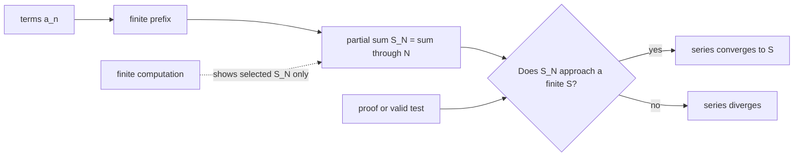
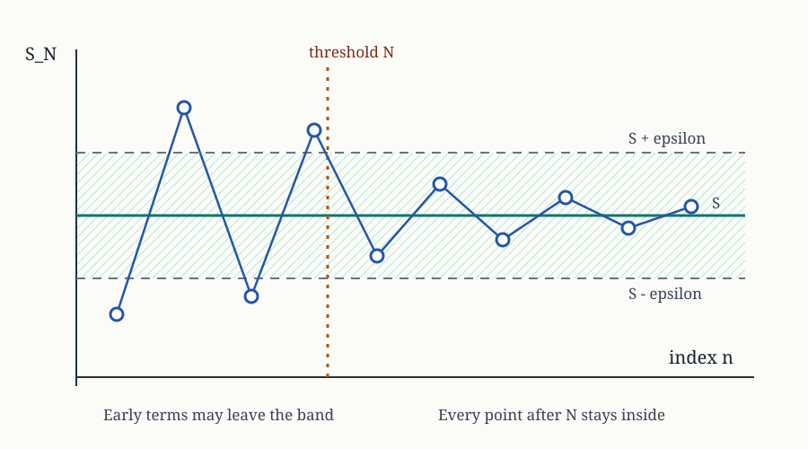
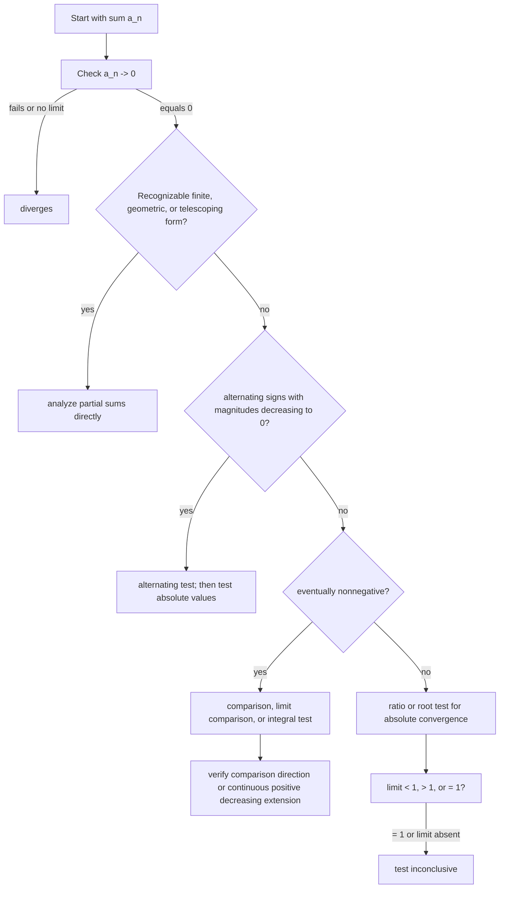
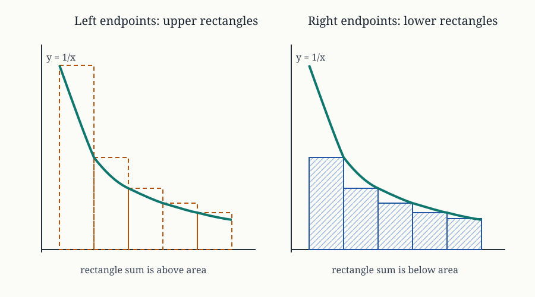
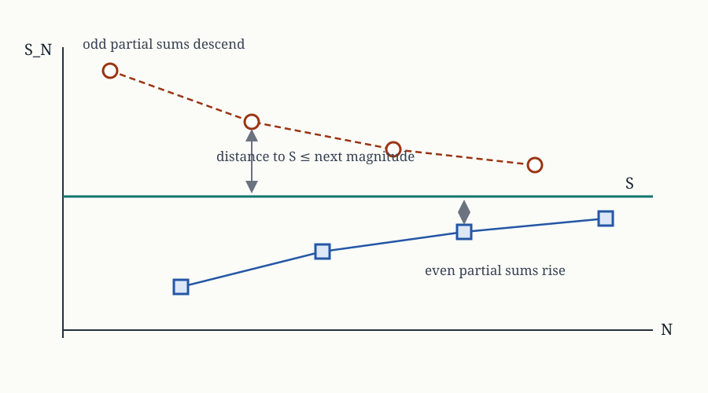
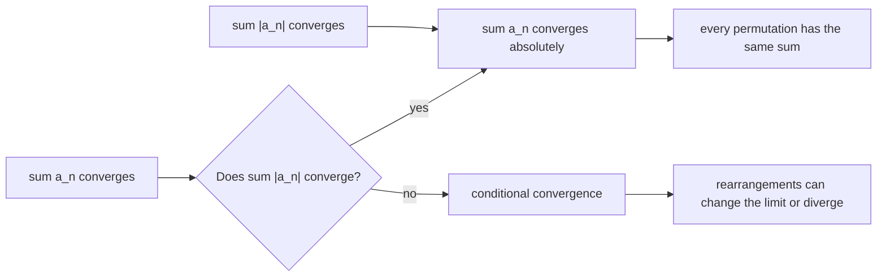
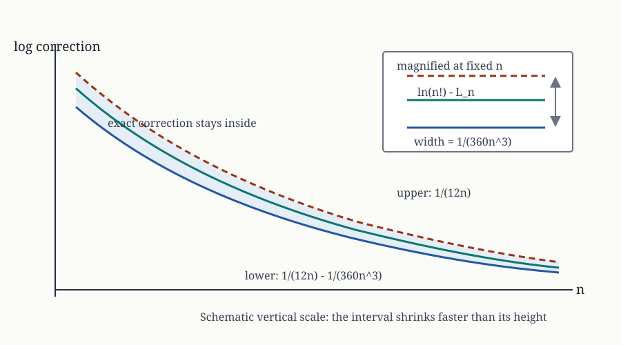
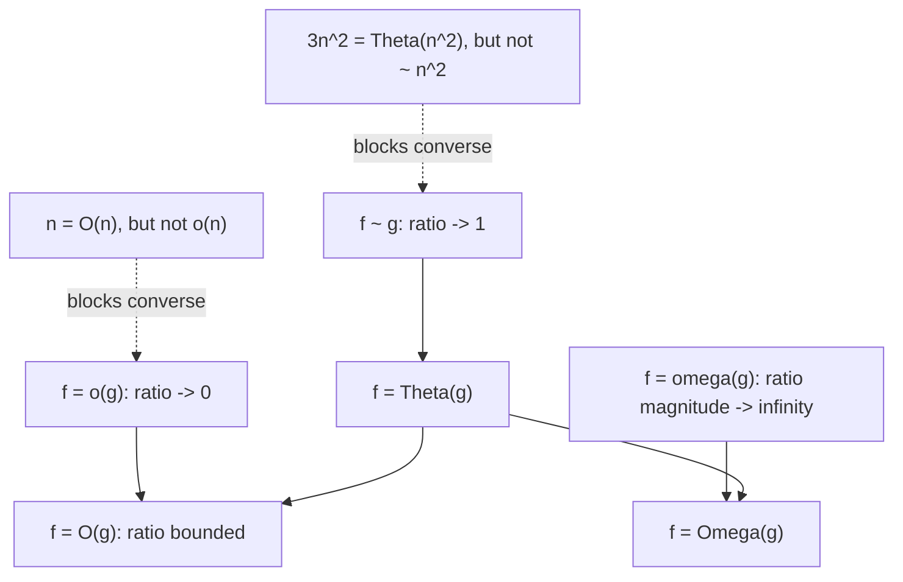

# 0.09 Sums, Series, and Asymptotics

[Section home](../README.md) | Previous: [§0.08 Counting and Combinatorics](../00.08-counting-combinatorics/README.md) | [Project guides](../../STYLE_GUIDE.md) | [Notation guide](../../NOTATION.md)

## Why this matters

A finite sum combines finitely many quantities. An infinite series asks whether its finite partial sums settle toward one number. Asymptotic notation asks a different question: when an input approaches a limit point, which features of a quantity control its scale?

Those questions meet everywhere in computing and AI:

- a loop cost is a finite sum of per-step costs;
- a recursive algorithm creates sums across levels;
- an iterative method produces a sequence of states or losses;
- an approximation needs both a leading term and an error statement;
- a convergence test is valid only when its hypotheses match the terms;
- a complexity class hides constants while an asymptotic equivalence preserves the leading constant.

OpenStax develops sequences, partial sums, convergence tests, error estimates, and rearrangement in one inspectable chapter [1]. MIT 18.01SC places improper-integral comparison, infinite series, and series comparison together in its unit on exploring the infinite [2]. We will use the same central object throughout: the sequence of partial sums.



> **Figure 1. An infinite series is defined through finite partial sums.** Computation can inspect selected prefixes; a proof or applicable theorem controls all sufficiently large prefixes. Original diagram.



> **Figure 2. Convergence is an eventual statement.** Early partial sums may wander. For every positive band width, all terms after some threshold must stay inside the band. Original figure.

### Scope and non-goals

We will cover:

- arithmetic, geometric, and telescoping finite sums;
- infinite series as limits of partial sums;
- sequence convergence, boundedness, monotonicity, and the monotone convergence theorem;
- the nth-term, comparison, limit comparison, ratio, root, integral, and alternating tests;
- every hypothesis and the principal inconclusive boundary for each test;
- absolute and conditional convergence plus rearrangement;
- harmonic-number bounds and asymptotic expansion;
- Stirling's approximation with explicit finite log-error bounds;
- $O$, $\Omega$, $\Theta$, $o$, $\omega$, and asymptotic equivalence;
- limit directions such as $n\to\infty$ and $h\to0$;
- standard-library numerical checks with declared evidence limits.

This module is explicitly **not**:

- power-series intervals or radii of convergence;
- Taylor, Maclaurin, or Fourier series;
- measure theory or probability;
- a full derivation of Stirling's formula;
- advanced convergence tests such as condensation, Dirichlet, or Abel tests;
- uniform convergence of function sequences;
- permission to treat a finite plot, ratio table, or benchmark as proof.

## Learning objectives

After completing this module, you should be able to:

- derive and compute arithmetic, geometric, and telescoping sums from partial sums;
- prove sequence or series convergence using monotone and bounded reasoning;
- select a convergence test only after checking all of its hypotheses and boundary cases;
- distinguish absolute convergence, conditional convergence, and divergence, then explain what rearrangement can change;
- derive harmonic integral bounds and use a finite error statement with harmonic and Stirling asymptotics;
- translate among $O$, $\Omega$, $\Theta$, $o$, $\omega$, and $\sim$ without discarding constants or limit directions;
- use finite computation to audit formulas while stating exactly what remains unproved.

The [exercise set](exercises/README.md) assesses every objective. Full [worked solutions](solutions/README.md), tested [standard-library code](code/README.md), and an annotated [resource guide](resources/README.md) are separate.

## Prerequisite check

Required: [§0.02 Algebra, Functions, and Precalculus Backfill](../00.02-algebra-functions-precalculus/README.md), [§0.03 Exponents and Logarithms](../00.03-exponents-logarithms/README.md), and [§0.06 Proof Techniques](../00.06-proof-techniques/README.md).

Try these before starting:

1. Can you expand and factor rational expressions and use partial fractions?
2. Can you manipulate powers, roots, logarithms, and limits of simple functions?
3. Can you negate an eventual statement of the form $\exists N\,\forall n\ge N$?
4. Can you prove an inequality by comparison or induction?
5. Can you distinguish a theorem's conclusion from its converse?
6. Can you explain why checking one million cases is still a finite claim?

Review §0.02 for algebra and partial fractions, §0.03 for logarithms and growth, and §0.06 for proof direction. [§0.07](../00.07-induction-recursion-invariants/README.md) is recommended for recursive sequences and invariants. [§0.08](../00.08-counting-combinatorics/README.md) is recommended for factorial meaning and finite generating-polynomial context.

The integral test uses definite and improper integrals. You can follow its geometric argument now, but [§1 Calculus](../../ROADMAP.md#1-calculus) supplies the full calculus treatment.

## Historical context

Series and asymptotic formulas grew from attempts to calculate, approximate, and compare quantities that resist closed forms. The useful lesson is not a single-inventor story. It is the separation of three questions:

1. Does a limiting value exist?
2. What is the dominant scale?
3. How large can the finite error be?

The NIST Digital Library of Mathematical Functions (DLMF) makes this separation explicit. It defines asymptotic equivalence, little-o, and big-O by ratio behavior, then treats an asymptotic expansion as a sequence of finite remainder statements [3]. Its gamma-function chapter identifies Stirling's formula and separately gives error bounds for truncations. This distinction matters: the symbol $\sim$ is a limit claim, not an error tolerance for a particular $n$.

For algorithm analysis, Sedgewick and Wayne's directly inspectable Princeton material separates observations, a mathematical cost model, tilde approximations, and order-of-growth classes [4]. A benchmark can motivate a model and test predictions. It cannot establish the quantified eventual bound by itself.

Python's official documentation specifies `math.fsum` as an accurate floating-point summation method that tracks multiple partial sums and `math.lgamma(x)` as the logarithm of the absolute gamma function [5]. We use both as implementation references, not as proofs of the mathematics.

## Intuition

### Finite first, infinite second

The expression

$$
\sum_{n=1}^{\infty}a_n
$$

does not mean that a computer or a person performs infinitely many additions. It names a limit. First define

$$
S_N\coloneqq\sum_{n=1}^{N}a_n.
$$

Then ask whether the sequence $(S_N)$ converges as $N\to\infty$.

This order prevents several mistakes:

- cancellation in a telescoping series must be shown in $S_N$ before taking a limit;
- algebra on a divergent series is not licensed by familiar finite-sum rules;
- terms approaching zero are necessary but not sufficient for their partial sums to converge;
- rearranging infinitely many terms changes the path taken by the partial sums.

### Positive terms turn convergence into boundedness

If $a_n\ge0$, then

$$
S_{N+1}=S_N+a_{N+1}\ge S_N.
$$

The partial sums are monotone increasing. They converge exactly when they are bounded above. Comparison and integral tests exploit this fact. They do not need to find the sum.

### A convergence test is a contract

Every test has an input contract. You should be able to point to each hypothesis in the series before using the conclusion.



> **Figure 3. Choose a test by structure, then verify its contract.** This is a routing aid, not a theorem and not an exhaustive catalog. Original diagram.

### Approximation needs a remainder

The statement

$$
n!\sim\sqrt{2\pi n}\left(\frac ne\right)^n
$$

says that the ratio of the two sides approaches one. It does not tell you the error at $n=10$. A finite inequality does:

$$
L_n+\frac{1}{12n}-\frac{1}{360n^3}
<\ln(n!)<
L_n+\frac{1}{12n},
$$

where

$$
L_n=\left(n+\frac12\right)\ln n-n+\frac12\ln(2\pi).
$$

Asymptotics explain scale. Remainder bounds control finite use.

## Mathematics

### Local notation

| Symbol | Type | Meaning |
|---|---|---|
| $(a_n)$ | real sequence | ordered values indexed by positive integers unless stated otherwise |
| $S_N$ | real number | $N$th partial sum $\sum_{n=1}^{N}a_n$ |
| $S$ | real number | limit of $(S_N)$ when the series converges |
| $R_N$ | real number | remainder $S-S_N$ for a convergent series |
| $H_n$ | real number | harmonic number $\sum_{k=1}^{n}1/k$ |
| $\gamma$ | real constant | Euler's constant $\lim_{n\to\infty}(H_n-\ln n)$ |
| $f,g$ | real-valued functions | quantities compared near a stated limit point |
| $x\to c$ | limiting process | includes finite $c$ or $c=\infty$ when stated |
| $N,n_0$ | positive integers | eventual thresholds |

### Arithmetic sums

An arithmetic sequence with first term $a$, common difference $d$, and $N$ terms is

$$
a,a+d,a+2d,\ldots,a+(N-1)d.
$$

Write the sum forward and backward:

$$
S_N=a+(a+d)+\cdots+(a+(N-1)d),
$$

$$
S_N=(a+(N-1)d)+(a+(N-2)d)+\cdots+a.
$$

Adding columnwise gives $N$ copies of $2a+(N-1)d$, so

$$
S_N=\frac N2\left(2a+(N-1)d\right).
$$

In particular,

$$
\sum_{k=1}^{N}k=\frac{N(N+1)}2.
$$

This is a finite identity. An infinite arithmetic series with nonzero terms cannot converge because its terms do not approach zero.

### Geometric sums

For first term $a$, ratio $r$, and $N$ terms,

$$
S_N=a+ar+\cdots+ar^{N-1}.
$$

If $r\ne1$, subtract $rS_N$ from $S_N$:

$$
(1-r)S_N=a(1-r^N),
$$

so

$$
S_N=a\frac{1-r^N}{1-r}.
$$

If $r=1$, then $S_N=Na$.

For $a\ne0$, the infinite geometric series converges exactly when $|r|<1$:

$$
\sum_{n=0}^{\infty}ar^n=\frac{a}{1-r},
\qquad |r|<1.
$$

If $a=0$, every term is zero and the series converges for any $r$. For $a\ne0$, partial sums grow linearly at $r=1$, oscillate at $r=-1$, and the terms fail to approach zero when $|r|>1$. The boundary $|r|=1$ belongs in the statement.

### Telescoping sums

If $a_n=b_n-b_{n+1}$, then

$$
\begin{aligned}
S_N
&=\sum_{n=1}^{N}(b_n-b_{n+1})\\
&=(b_1-b_2)+(b_2-b_3)+\cdots+(b_N-b_{N+1})\\
&=b_1-b_{N+1}.
\end{aligned}
$$

The infinite series converges when $(b_{N+1})$ has a finite limit $B$, and then its sum is $b_1-B$. Cancellation is a finite partial-sum fact first.

For example,

$$
\frac{1}{n(n+1)}=\frac1n-\frac1{n+1},
$$

so

$$
\sum_{n=1}^{N}\frac{1}{n(n+1)}=1-\frac{1}{N+1}\to1.
$$

### Sequence convergence

A sequence $(a_n)$ converges to $L\in\mathbb{R}$ if

$$
\forall\varepsilon>0\ \exists N\in\mathbb{N}\ \forall n\ge N,
\qquad |a_n-L|<\varepsilon.
$$

The order of quantifiers matters. The threshold $N$ may depend on $\varepsilon$, but once chosen it must work for every later $n$.

A convergent sequence is bounded. The converse is false: $(-1)^n$ is bounded and divergent.

A sequence is eventually increasing if there exists $n_0$ such that $a_{n+1}\ge a_n$ for every $n\ge n_0$. Define eventual decrease similarly.

**Monotone convergence theorem.** An eventually increasing sequence bounded above converges. An eventually decreasing sequence bounded below converges [1]. The theorem proves existence of a finite limit. It does not identify that limit without additional reasoning.

For a positive-term series, this yields a central equivalence:

$$
\sum_{n=1}^{\infty}a_n\text{ converges}
\iff
(S_N)\text{ is bounded above},
\qquad a_n\ge0.
$$

### Infinite series and tails

The series $\sum a_n$ converges to $S$ when

$$
S_N=\sum_{n=1}^{N}a_n\to S.
$$

Changing, adding, or removing finitely many terms cannot change convergence, though it can change the sum. Convergence is determined by the tail.

If the series converges, then

$$
a_N=S_N-S_{N-1}\to S-S=0.
$$

This gives the first test.

### Nth-term test for divergence

**Hypothesis:** none beyond having a series.

**Conclusion:** if $a_n$ does not approach zero, then $\sum a_n$ diverges.

This includes a nonzero finite limit, unbounded terms, or a limit that does not exist.

**Inconclusive boundary:** if $a_n\to0$, the test says nothing. Both

$$
\sum_{n=1}^{\infty}\frac1n
\quad\text{and}\quad
\sum_{n=1}^{\infty}\frac1{n^2}
$$

have terms approaching zero, but the first diverges and the second converges.

### Direct comparison test

Assume eventual nonnegativity.

**Convergence direction.** If there exists $N$ such that

$$
0\le a_n\le b_n
\qquad(n\ge N)
$$

and $\sum b_n$ converges, then $\sum a_n$ converges.

**Divergence direction.** If there exists $N$ such that

$$
a_n\ge b_n\ge0
\qquad(n\ge N)
$$

and $\sum b_n$ diverges, then $\sum a_n$ diverges.

**Inconclusive directions:** being smaller than a divergent series or larger than a convergent series gives no conclusion. The comparison need only hold eventually. A finite prefix does not affect convergence.

### Limit comparison test

Assume $a_n,b_n>0$ eventually and that $\sum b_n$ has known behavior. Let

$$
L=\lim_{n\to\infty}\frac{a_n}{b_n},
$$

when this limit exists.

- If $0<L<\infty$, then $\sum a_n$ and $\sum b_n$ either both converge or both diverge.
- If $L=0$ and $\sum b_n$ converges, then $\sum a_n$ converges.
- If $L=\infty$ and $\sum b_n$ diverges, then $\sum a_n$ diverges.

**Inconclusive boundaries:** $L=0$ with divergent $\sum b_n$, $L=\infty$ with convergent $\sum b_n$, or a ratio limit that does not exist. Choose another comparison or another test.

### Integral test

Suppose $a_n=f(n)$ eventually, where for some threshold $N$ the function $f$ is:

1. continuous on $[N,\infty)$;
2. positive there;
3. decreasing there.

Then

$$
\sum_{n=N}^{\infty}a_n
\quad\text{and}\quad
\int_N^{\infty}f(x)\,dx
$$

either both converge or both diverge [1]. The series and integral generally do not have the same value.

If the series converges and the hypotheses hold, the tail after $N$ terms satisfies

$$
\int_{N+1}^{\infty}f(x)\,dx
\le R_N
\le\int_N^{\infty}f(x)\,dx.
$$

**Unavailable boundary:** if positivity, continuity, eventual decrease, or the matching condition fails, this theorem gives no conclusion. A different theorem may still settle the series.



> **Figure 4. Decreasing functions turn sums into area bounds.** Left and right endpoint rectangles trap a finite sum or tail between neighboring integrals. Original figure.

The $p$-series classification follows:

$$
\sum_{n=1}^{\infty}\frac1{n^p}
\begin{cases}
\text{converges},&p>1,\\
\text{diverges},&p\le1.
\end{cases}
$$

### Ratio test

Assume $a_n\ne0$ eventually and that

$$
L=\lim_{n\to\infty}\left|\frac{a_{n+1}}{a_n}\right|
$$

exists as an extended real number.

- If $L<1$, then $\sum a_n$ converges absolutely.
- If $L>1$ or $L=\infty$, then $\sum a_n$ diverges.
- If $L=1$, the test is inconclusive.
- If the limit does not exist, this version of the test is unavailable.

The boundary is genuinely undecided: every $p$-series has ratio limit one, while its convergence depends on $p$.

### Root test

Assume

$$
L=\lim_{n\to\infty}\sqrt[n]{|a_n|}
$$

exists as an extended real number.

- If $L<1$, then $\sum a_n$ converges absolutely.
- If $L>1$ or $L=\infty$, then $\sum a_n$ diverges.
- If $L=1$, the test is inconclusive.
- If the limit does not exist, this version is unavailable.

The ratio test is often convenient for factorials. The root test is often convenient when the entire term is raised to the $n$th power. Neither test should be forced when its limit equals one.

### Alternating series test

Suppose

$$
\sum_{n=1}^{\infty}(-1)^{n-1}b_n,
\qquad b_n\ge0.
$$

If, eventually,

$$
b_{n+1}\le b_n
$$

and

$$
b_n\to0,
$$

then the series converges. Once the monotone regime has begun, the error after a partial sum satisfies

$$
|R_N|\le b_{N+1}.
$$

**Failure boundaries:** if $b_n\not\to0$, the nth-term test proves divergence. If magnitudes approach zero but are not eventually nonincreasing, the alternating test is inconclusive. The series may converge or diverge by another argument.



> **Figure 5. Alternating partial sums approach from opposite sides.** Decreasing magnitudes make the odd subsequence descend and the even subsequence rise, while the next term bounds the gap. Original figure.

### A hypothesis ledger

| Test | Required structure | Converges when | Diverges when | Inconclusive or unavailable |
|---|---|---|---|---|
| nth term | any series | never proves convergence | $a_n\not\to0$ | $a_n\to0$ |
| comparison | eventual nonnegative inequality | below known convergent series | above known divergent series | reverse inequality directions |
| limit comparison | eventual positive terms; ratio limit | $0<L<\infty$ with convergent reference; or $L=0$ with convergent reference | $0<L<\infty$ with divergent reference; or $L=\infty$ with divergent reference | opposite zero/infinity pairings; no ratio limit |
| integral | continuous, positive, decreasing extension eventually | improper integral converges | improper integral diverges | any missing hypothesis |
| alternating | alternating sign; magnitudes decrease eventually to zero | both hypotheses hold | term limit fails | decrease fails while term limit holds |
| ratio | eventually nonzero; ratio limit exists | $L<1$, absolutely | $L>1$ | $L=1$ or no limit |
| root | root limit exists | $L<1$, absolutely | $L>1$ | $L=1$ or no limit |

### Absolute and conditional convergence

The series $\sum a_n$ converges **absolutely** if

$$
\sum |a_n|
$$

converges. Absolute convergence implies convergence.

It converges **conditionally** if $\sum a_n$ converges but $\sum|a_n|$ diverges. The alternating harmonic series

$$
\sum_{n=1}^{\infty}\frac{(-1)^{n-1}}n
$$

is the standard example.

Rearrangement means choosing a permutation $\pi$ of the positive integers and considering

$$
\sum_{k=1}^{\infty}a_{\pi(k)}.
$$

For an absolutely convergent real series, every rearrangement converges to the same sum. A conditionally convergent real series can be rearranged to converge to a different prescribed real number or made to diverge [1]. Finite commutativity does not automatically extend to an infinite limiting process.



> **Figure 6. Rearrangement stability separates absolute from conditional convergence.** Original diagram.

### Harmonic bounds and asymptotics

The harmonic number is

$$
H_n=\sum_{k=1}^{n}\frac1k.
$$

Since $1/x$ is positive and decreasing,

$$
\ln(n+1)\le H_n\le1+\ln n.
$$

The lower bound tends to infinity, proving that the harmonic series diverges. At the same time, the bounds show that its partial sums grow only logarithmically:

$$
H_n=\Theta(\ln n)
\quad\text{and}\quad
H_n\sim\ln n.
$$

The difference has a finite limit:

$$
\gamma=\lim_{n\to\infty}(H_n-\ln n).
$$

OpenStax gives the useful finite estimate

$$
0<H_n-\ln n-\gamma\le\frac1n.
$$

DLMF equations 5.4.14, 5.5.2, and 5.11.2 sharpen the picture [3]:

$$
H_n
=\ln n+\gamma+\frac{1}{2n}-\frac{1}{12n^2}+\rho_n,
$$

with, for positive integers $n$,

$$
0<\rho_n<\frac{1}{120n^4}.
$$

That finite bound licenses the displayed approximation at a chosen $n$. The asymptotic expansion alone would not.

### Stirling's approximation

Factorial counts permutations:

$$
n!=1\cdot2\cdots n.
$$

It grows faster than every fixed power $n^k$ but slower than $n^n$ by an exponential factor. Stirling's formula identifies the leading scale:

$$
n!\sim\sqrt{2\pi n}\left(\frac ne\right)^n.
$$

Taking logarithms turns products into sums and prevents overflow. Define

$$
L_n=\left(n+\frac12\right)\ln n-n+\frac12\ln(2\pi).
$$

The DLMF log-gamma expansion and its real-positive remainder rule give, for every integer $n\ge1$ [3],

$$
L_n+\frac{1}{12n}-\frac{1}{360n^3}
<\ln(n!)<
L_n+\frac{1}{12n}.
$$

Exponentiating gives a finite multiplicative enclosure:

$$
\sqrt{2\pi n}\left(\frac ne\right)^n
\exp\left(\frac{1}{12n}-\frac{1}{360n^3}\right)
<n!
$$

and

$$
n!<
\sqrt{2\pi n}\left(\frac ne\right)^n
\exp\left(\frac{1}{12n}\right).
$$



> **Figure 7. A finite correction interval strengthens the leading equivalence.** The interval width is $1/(360n^3)$ in log space and shrinks rapidly, but floating-point display may not resolve it for large $n$. Original figure.

This is the discipline to keep:

- $\sim$ gives the limiting ratio;
- the correction terms improve an approximation;
- the remainder inequality certifies a finite interval;
- floating-point evaluation adds a separate rounding question.

### Asymptotic notation needs a limit direction

Let $f$ and $g$ be real-valued functions, with $g(x)>0$ eventually, and state a limiting process such as $x\to\infty$ or $x\to c$.

We write

$$
f(x)=O(g(x))
$$

if there exist constants $C>0$ and a threshold neighborhood such that

$$
|f(x)|\le Cg(x)
$$

eventually.

We write

$$
f(x)=\Omega(g(x))
$$

if there exist $c>0$ and a threshold neighborhood such that

$$
|f(x)|\ge c g(x)
$$

eventually.

We write

$$
f(x)=\Theta(g(x))
$$

when both bounds hold.

Little-o is stricter:

$$
f(x)=o(g(x))
\iff
\frac{f(x)}{g(x)}\to0.
$$

Little-omega reverses strict dominance:

$$
f(x)=\omega(g(x))
\iff
\left|\frac{f(x)}{g(x)}\right|\to\infty.
$$

Asymptotic equivalence preserves the leading constant:

$$
f(x)\sim g(x)
\iff
\frac{f(x)}{g(x)}\to1.
$$

The ratio definitions agree with DLMF §2.1 [3]. Computer-science presentations commonly emphasize eventually nonnegative cost functions. This module uses absolute values in the bound definitions so sign does not silently reverse an inequality.

### Big-O and little-o are related, not interchangeable

Both notations compare scale near a stated limit point. They make different claims:

$$
f=o(g)\implies f=O(g),
$$

but the converse fails. For example, as $n\to\infty$,

$$
n=O(n)
\quad\text{but}\quad
n\ne o(n).
$$

The limit direction can change without changing the definitions. As $h\to0$,

$$
h^2=o(h)
$$

because $h^2/h=h\to0$. As $n\to\infty$,

$$
n=o(n^2)
$$

because $n/n^2=1/n\to0$.

So analysis often uses $h\to0$ while algorithms often use $n\to\infty$. That is a difference in the limiting process, not a license to swap big-O with little-o. Big-O means bounded relative magnitude. Little-o means vanishing relative magnitude.

### The implication map

Under the eventual positivity assumptions already stated:

$$
\Theta(g)=O(g)\cap\Omega(g),
$$

$$
f=o(g)\implies f=O(g),
$$

$$
f=\omega(g)\implies f=\Omega(g),
$$

and

$$
f\sim g\implies f=\Theta(g).
$$

None of those implications generally reverses.



> **Figure 8. Asymptotic relations form implications, not synonyms.** Counterexamples block the tempting reverse arrows. Original diagram.

### Worked asymptotic examples

As $n\to\infty$,

$$
3n^2+4n+7=\Theta(n^2)
$$

and

$$
3n^2+4n+7\sim3n^2,
$$

but it is not asymptotic to $n^2$ because the ratio tends to $3$, not $1$.

Also,

$$
\ln n=o(n^\alpha)
$$

for every fixed $\alpha>0$, and

$$
n^k=o(c^n)
$$

for every fixed positive integer $k$ and fixed $c>1$. These are strict relative-growth statements, stronger than big-O.

For the arithmetic sum,

$$
\sum_{k=1}^{n}k=\frac{n^2+n}{2}\sim\frac{n^2}{2}.
$$

The leading constant $1/2$ matters for $\sim$ but not for $\Theta(n^2)$.

## Derivation

### Comparison comes from bounded partial sums

Suppose $0\le a_n\le b_n$ eventually and $\sum b_n$ converges. For $M\ge N$,

$$
\sum_{n=N}^{M}a_n\le\sum_{n=N}^{M}b_n\le\sum_{n=N}^{\infty}b_n.
$$

The partial sums of the $a_n$ tail are increasing and bounded above, so they converge. Adding the finite prefix preserves convergence.

The divergence direction is the same mechanism in reverse: if the smaller nonnegative partial sums are unbounded, the larger ones are unbounded too.

### Ratio less than one creates a geometric tail

Suppose the ratio limit is $L<1$. Choose $r$ with

$$
L<r<1.
$$

Eventually,

$$
\left|\frac{a_{n+1}}{a_n}\right|\le r.
$$

Repeatedly applying this inequality gives

$$
|a_{N+k}|\le |a_N|r^k.
$$

The absolute-value tail is bounded by a convergent geometric series. This is why the conclusion is absolute convergence.

At $L=1$, no $r<1$ eventually bounds the ratio. The proof mechanism stops, and the test reports no conclusion.

### Alternation creates two monotone subsequences

For

$$
S_N=b_1-b_2+b_3-\cdots+(-1)^{N-1}b_N,
$$

decreasing $b_n$ gives

$$
S_{2k+2}-S_{2k}=b_{2k+1}-b_{2k+2}\ge0,
$$

so the even partial sums increase. Similarly, odd partial sums decrease. Each even sum lies below the neighboring odd sum, and their gap is $b_{2k+1}\to0$. The two subsequences therefore meet at one limit.

### Harmonic bounds from rectangles

Because $1/x$ decreases, on each interval $[k,k+1]$,

$$
\frac{1}{k+1}\le\int_k^{k+1}\frac{dx}{x}\le\frac1k.
$$

Summing appropriate intervals gives

$$
\ln(n+1)\le H_n\le1+\ln n.
$$

This one argument proves divergence, establishes $\Theta(\ln n)$, and supplies finite bounds.

### Stirling meaning without a full derivation

Taking logs of factorial gives

$$
\ln(n!)=\sum_{k=1}^{n}\ln k.
$$

An integral comparison suggests the dominant $n\ln n-n$ behavior. Boundary and curvature corrections account for the $\tfrac12\ln(2\pi n)$ term and the inverse powers of $n$. A full derivation requires tools beyond this module, so we use DLMF's stated expansion and remainder result rather than disguising a heuristic as proof.

## Implementation

The tested implementation lives in [`code/series_tools.py`](code/series_tools.py), with execution instructions and numerical limitations in [`code/README.md`](code/README.md).

### Exact finite formulas

```python
from fractions import Fraction

from series_tools import arithmetic_sum, geometric_sum

assert arithmetic_sum(1, 1, 100) == 5050
assert geometric_sum(1, Fraction(1, 2), 10) == Fraction(1023, 512)
assert geometric_sum(3, 1, 7) == 21
```

`Fraction` keeps the finite identities exact. It does not make an infinite sum executable.

### Partial sums and an error theorem

```python
from math import log

from series_tools import alternating_harmonic_partial_sum

for count in (10, 100, 1000):
    approximation = alternating_harmonic_partial_sum(count)
    assert abs(approximation - log(2)) <= 1 / (count + 1)
```

The assertion depends on the proved alternating-series remainder theorem and the known sum $\ln2$. Observed agreement alone would not establish either.

### Log-Stirling bounds

```python
from math import lgamma

from series_tools import stirling_log_bounds

for number in (1, 10, 100, 1000):
    lower, upper = stirling_log_bounds(number)
    assert lower <= lgamma(number + 1) <= upper
```

The code also exposes exact rational correction bounds. The displayed float endpoints are padded diagnostics because binary64 cannot always resolve the much narrower analytic interval.

## Experimentation

### Experiment 1: slow harmonic divergence

Compute $H_n$ at $n=10^k$ for several $k$. Compare $H_n$ with $\ln n$ and with $\ln n+\gamma$. You should see:

- $H_n$ keeps growing;
- $H_n/\ln n$ moves toward one;
- $H_n-\ln n$ moves toward $\gamma$;
- a plot over a small range can look almost flat despite divergence.

The finite table is evidence about those selected indices. The integral lower bound proves unbounded growth.

### Experiment 2: tests at their boundary

For $p\in\{1/2,1,2,3\}$, compute ratio and root diagnostics for $a_n=1/n^p$. Both limits move toward one for every $p$, yet the series changes behavior at $p=1$. This is a deliberate demonstration of an inconclusive boundary.

### Experiment 3: rearrange a conditional series

Take positive terms from the alternating harmonic series until a partial sum exceeds a target, then take negative terms until it drops below the target. Repeat. The finite process illustrates the mechanism behind rearrangement.

It does not prove convergence to the target until you also show that both sign pools remain available and the overshoots shrink to zero.

### Experiment 4: Stirling in value space and log space

Compare `factorial(n)` with the leading Stirling expression for moderate $n$, then compare `lgamma(n + 1)` with $L_n$ for larger $n$. Record relative error and the correction interval width.

Value-space factorials become unwieldy. Log space preserves the scale. Eventually the analytic interval becomes narrower than one floating-point unit, which demonstrates why a mathematical error bound and a floating representation are separate layers.

## Worked examples

### Worked example 1: arithmetic cost

A nested process performs $k$ operations in round $k$ for $1\le k\le n$. Its total is

$$
\sum_{k=1}^{n}k=\frac{n(n+1)}2
=\frac12n^2+\frac12n.
$$

Therefore the exact count is $n(n+1)/2$, it is $\Theta(n^2)$, and it is asymptotic to $n^2/2$.

### Worked example 2: finite geometric decay

An error starts at $8$ and halves each step. The first six errors sum to

$$
8\frac{1-(1/2)^6}{1-1/2}=\frac{63}{4}=15.75.
$$

The infinite total is $16$. The omitted tail after six terms is exactly $1/4$.

### Worked example 3: telescoping rational terms

Since

$$
\frac{2}{n(n+2)}=\frac1n-\frac1{n+2},
$$

the partial sum leaves two terms at each boundary:

$$
\sum_{n=1}^{N}\frac{2}{n(n+2)}
=1+\frac12-\frac1{N+1}-\frac1{N+2}.
$$

The infinite sum is $3/2$. Writing only one surviving boundary term would be an indexing error.

### Worked example 4: monotone bounded recursion

Let $a_1=1$ and

$$
a_{n+1}=\frac12\left(a_n+2\right).
$$

If $a_n<2$, then $a_{n+1}<2$. Also

$$
a_{n+1}-a_n=\frac{2-a_n}{2}>0.
$$

Induction gives an increasing sequence bounded above by $2$, so it converges. If its limit is $L$, continuity of the recurrence gives

$$
L=\frac12(L+2),
$$

so $L=2$.

### Worked example 5: nth-term refusal

For

$$
\sum_{n=1}^{\infty}\frac{n}{n+1},
$$

the terms approach one, so the series diverges. For $\sum1/n$, the terms approach zero, so the nth-term test is inconclusive, not convergent.

### Worked example 6: direct comparison

For $n\ge1$,

$$
0\le\frac{1}{n^2+4}\le\frac1{n^2}.
$$

Since $\sum1/n^2$ converges, so does $\sum1/(n^2+4)$.

### Worked example 7: limit comparison

Let

$$
a_n=\frac{3n+2}{n^2+1},
\qquad b_n=\frac1n.
$$

Then

$$
\frac{a_n}{b_n}=\frac{3n^2+2n}{n^2+1}\to3.
$$

The finite positive limit says both series share behavior. Since the harmonic series diverges, $\sum a_n$ diverges.

### Worked example 8: integral test and remainder

For $p=3$,

$$
\sum_{n=1}^{\infty}\frac1{n^3}
$$

converges. After $N$ terms,

$$
R_N\le\int_N^{\infty}x^{-3}\,dx=\frac{1}{2N^2}.
$$

Thus $N=23$ guarantees $R_N<0.001$ because $1/(2\cdot23^2)<0.001$.

### Worked example 9: ratio and root boundary

For $a_n=3^n/n!$,

$$
\left|\frac{a_{n+1}}{a_n}\right|=\frac3{n+1}\to0,
$$

so the series converges absolutely.

For $a_n=1/n^2$, the ratio tends to one. The ratio test is inconclusive even though comparison or the integral test proves convergence.

### Worked example 10: conditional convergence

The alternating harmonic series has $b_n=1/n$, which decreases to zero, so it converges. Its absolute series is harmonic and diverges. Therefore it converges conditionally and is rearrangement-sensitive.

### Worked example 11: harmonic approximation

At $n=10$, the coarse estimate gives

$$
\ln11\le H_{10}\le1+\ln10.
$$

The DLMF-based approximation

$$
\ln10+\gamma+\frac1{20}-\frac1{1200}
$$

has a certified omitted term smaller than $1/(120\cdot10^4)$.

### Worked example 12: notation diagnosis

As $n\to\infty$,

$$
5n^2+n=\Theta(n^2)
$$

and

$$
5n^2+n\sim5n^2.
$$

It is not asymptotic to $n^2$. As $h\to0$, $h^2=o(h)$ but $h=O(h)$ and $h\ne o(h)$. Each claim names its direction and keeps big-O distinct from little-o.

## Common mistakes

### Treating terms as partial sums

$a_n\to0$ concerns individual terms. Series convergence concerns $S_N=\sum_{n=1}^{N}a_n$.

### Using the nth-term test backward

Terms tending to zero are necessary, not sufficient.

### Reversing a comparison

Smaller than divergent and larger than convergent are inconclusive directions.

### Dropping positivity

Direct comparison and the integral test use monotone partial sums of nonnegative terms. For signed series, apply them to absolute values only when testing absolute convergence.

### Forgetting eventual hypotheses

Most convergence behavior ignores finite prefixes. State the threshold rather than demanding a property from the first term when only the tail matters.

### Calling ratio or root limit one divergent

One is the inconclusive boundary. It is not a divergence result.

### Assuming alternation is enough

Magnitudes must approach zero and eventually decrease for the alternating test as stated here.

### Rearranging a conditional series like a finite sum

The order of a conditionally convergent series helps determine its limit.

### Reporting only a leading approximation

For finite use, add a remainder theorem or label the result as an uncontrolled approximation.

### Writing asymptotic notation without a direction

$O(g)$ as $n\to\infty$ and $O(g)$ as $h\to0$ are different claims.

### Treating $O$, $o$, and $\sim$ as synonyms

They respectively mean bounded ratio, ratio tending to zero, and ratio tending to one.

### Promoting experiments to proof

A million partial sums, ratios, or timing points remain finite evidence.

## Exercises

The [exercise set](exercises/README.md) contains 12 progressive problems spanning exact sums, sequence proofs, every convergence test, rearrangement, harmonic and Stirling error bounds, asymptotic notation, implementation, and source audit. Exact mirrored [worked solutions](solutions/README.md) are committed separately.

No exercise requires third-party software. The final audit uses the tested [`code/`](code/README.md) package.

## What you should now be able to do

You should now be able to:

- turn an infinite-series question into a partial-sum question;
- derive finite arithmetic, geometric, and telescoping formulas;
- use monotone and bounded reasoning without assuming the limit value;
- state every convergence-test hypothesis before its conclusion;
- recognize every major inconclusive boundary in this module;
- classify signed series and explain rearrangement sensitivity;
- pair harmonic and Stirling asymptotics with explicit finite error bounds;
- distinguish upper, lower, tight, strict, and equivalent asymptotic comparisons;
- state whether the limit is $n\to\infty$, $h\to0$, or something else;
- keep numerical evidence inside its finite domain.

## Where this leads

[§0.10 Inequalities](../00.10-inequalities/README.md) deepens the bounding tools used throughout this module and adds assumption and equality-case audits.

Calculus develops improper integrals and approximation methods in full. Algorithms use finite sums and $O/\Omega/\Theta$ bounds to analyze time and space. Probability uses convergent sums to normalize discrete distributions and harmonic asymptotics in occupancy and collection problems. Optimization and learning theory use sequences, limits, and little-o notation to state local and asymptotic guarantees.

## References

[1] G. Strang and E. Herman, *Calculus Volume 2*, OpenStax, 2016, Chapter 5, §§5.1-5.6. Web version updated 2026-07-15. License: CC BY-NC-SA 4.0. https://openstax.org/books/calculus-volume-2/pages/5-introduction Accessed 2026-09-01.

[2] Massachusetts Institute of Technology, "18.01SC Single Variable Calculus," Fall 2010, Prof. David Jerison, Unit 5: Exploring the Infinite, especially Sessions 92, 94, and 95. MIT OpenCourseWare license: CC BY-NC-SA 4.0. https://ocw.mit.edu/courses/18-01sc-single-variable-calculus-fall-2010/pages/unit-5-exploring-the-infinite/ Accessed 2026-09-01.

[3] NIST Digital Library of Mathematical Functions, Version 1.2.7, §§2.1, 5.4, 5.5, and 5.11, release 2026-06-15. https://dlmf.nist.gov/2.1 and https://dlmf.nist.gov/5.11 Accessed 2026-09-01.

[4] R. Sedgewick and K. Wayne, "1.4 Analysis of Algorithms," *Algorithms*, 4th ed. Princeton University booksite, last modified 2020-03-18. https://algs4.cs.princeton.edu/14analysis/ Accessed 2026-09-01.

[5] Python Software Foundation, "`math` - Mathematical functions," Python 3.14 documentation, `fsum`, `factorial`, and `lgamma`. PSF License Version 2. https://docs.python.org/3/library/math.html Accessed 2026-09-01.

[Section home](../README.md) | Previous: [§0.08 Counting and Combinatorics](../00.08-counting-combinatorics/README.md) | Next: [§0.10 Inequalities](../00.10-inequalities/README.md) | [Exercises](exercises/README.md) | [Worked solutions](solutions/README.md) | [Resources](resources/README.md) | [Code](code/README.md)