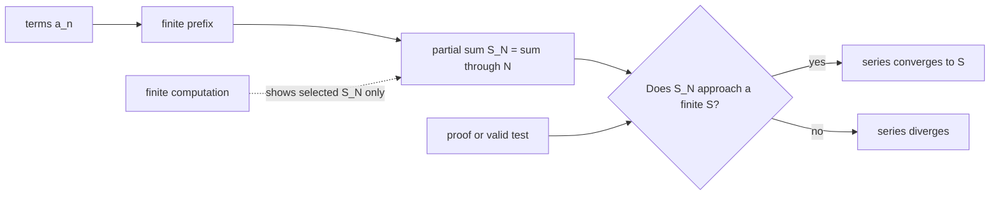
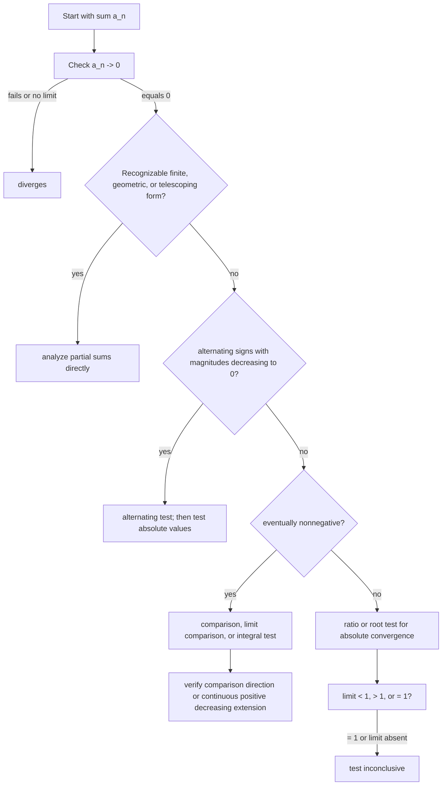
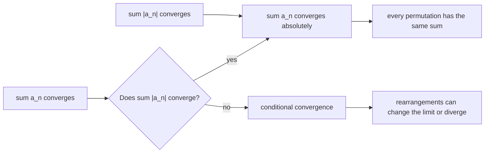
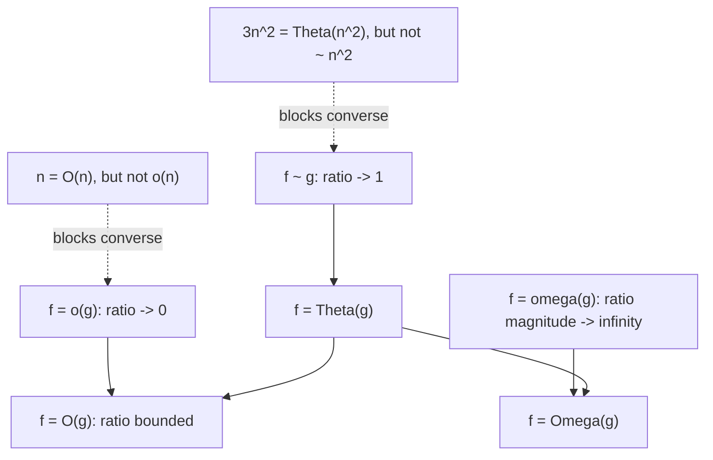

# 0.09 Sums, Series, and Asymptotics

[Section home](../README.md) | Previous: [§0.08 Counting and Combinatorics](../00.08-counting-combinatorics/README.md) | [Project guides](../../CONTRIBUTING.md#module-file-structure) | [Notation guide](../../NOTATION.md)

Move from exact finite sums to sequence and series convergence, then to asymptotic comparison. You will choose tests with their hypotheses and inconclusive cases intact, distinguish exact values from leading approximations, and use finite harmonic and Stirling error bounds.

[Readiness](#readiness-check) | [Concepts](#sequences-convergence-tests-and-asymptotic-bounds) | [Proofs](#deriving-convergence-and-error-bounds) | [Implementation](#implementation) | [Experiments](#experimentation) | [Worked examples](#worked-examples) | [Practice](#practice) | [References](#references)

## Finite sums, limits, and scale

A finite sum combines finitely many quantities. An infinite series asks whether its finite partial sums settle toward one number. Asymptotic notation asks a different question: when an input approaches a limit point, which features of a quantity control its scale?

Those questions meet everywhere in computing and AI:

- a loop cost is a finite sum of per-step costs;
- a recursive algorithm creates sums across levels;
- an iterative method produces a sequence of states or losses;
- an approximation needs both a leading term and an error statement;
- a convergence test is valid only when its hypotheses match the terms;
- a complexity class hides constants while an asymptotic equivalence preserves the leading constant.

OpenStax develops sequences, partial sums, convergence tests, error estimates, and rearrangement in one inspectable chapter [1]. MIT 18.01SC places improper-integral comparison, infinite series, and series comparison together in its unit on exploring the infinite [2]. We will use the same central object throughout: the sequence of partial sums.



> **Figure 1. An infinite series is defined through finite partial sums.** Computation can inspect selected prefixes; a proof or applicable theorem controls all sufficiently large prefixes. Original diagram.


> **Figure 2. Convergence is an eventual statement.** Early partial sums may wander. For every positive band width, all terms after some threshold must stay inside the band. Original figure.

### Scope and non-goals

We will cover:

- arithmetic, geometric, and telescoping finite sums;
- infinite series as limits of partial sums;
- sequence convergence, boundedness, monotonicity, and the monotone convergence theorem;
- the nth-term, comparison, limit comparison, ratio, root, integral, and alternating tests;
- every hypothesis and the principal inconclusive boundary for each test;
- absolute and conditional convergence plus rearrangement;
- harmonic-number bounds and asymptotic expansion;
- Stirling's approximation with explicit finite log-error bounds;
- $`O`$, $`\Omega`$, $`\Theta`$, $`o`$, $`\omega`$, and asymptotic equivalence;
- limit directions such as $`n\to\infty`$ and $`h\to0`$;
- standard-library numerical checks with declared evidence limits.

This module is explicitly **not**:

- power-series intervals or radii of convergence;
- Taylor, Maclaurin, or Fourier series;
- measure theory or probability;
- a full derivation of Stirling's formula;
- advanced convergence tests such as condensation, Dirichlet, or Abel tests;
- uniform convergence of function sequences;
- permission to treat a finite plot, ratio table, or benchmark as proof.

## Readiness check

You will need [§0.02 Algebra, Functions, and Precalculus Backfill](../00.02-algebra-functions-precalculus/README.md), [§0.03 Exponents and Logarithms](../00.03-exponents-logarithms/README.md), and [§0.06 Proof Techniques](../00.06-proof-techniques/README.md).

Try these before starting:

1. Can you expand and factor rational expressions and use partial fractions?
2. Can you manipulate powers, roots, logarithms, and limits of simple functions?
3. Can you negate an eventual statement of the form $`\exists N\,\forall n\ge N`$?
4. Can you prove an inequality by comparison or induction?
5. Can you distinguish a theorem's conclusion from its converse?
6. Can you explain why checking one million cases is still a finite claim?

Review §0.02 for algebra and partial fractions, §0.03 for logarithms and growth, and §0.06 for proof direction. [§0.07](../00.07-induction-recursion-invariants/README.md) is recommended for recursive sequences and invariants. [§0.08](../00.08-counting-combinatorics/README.md) is recommended for factorial meaning and finite generating-polynomial context.

The integral test uses definite and improper integrals. You can follow its geometric argument now, but [§1 Calculus](../../ROADMAP.md#1-calculus), especially §1.05 Integration, supplies the full calculus treatment.

## Historical context

Series and asymptotic formulas grew from attempts to calculate, approximate, and compare quantities that resist closed forms. The useful lesson is not a single-inventor story. It is the separation of three questions:

1. Does a limiting value exist?
2. What is the dominant scale?
3. How large can the finite error be?

The NIST Digital Library of Mathematical Functions (DLMF) makes this separation explicit. It defines asymptotic equivalence, little-o, and big-O by ratio behavior, then treats an asymptotic expansion as a sequence of finite remainder statements [3]. Its gamma-function chapter identifies Stirling's formula and separately gives error bounds for truncations. This distinction matters: the symbol $`\sim`$ is a limit claim, not an error tolerance for a particular $`n`$.

For algorithm analysis, Sedgewick and Wayne's directly inspectable Princeton material separates observations, a mathematical cost model, tilde approximations, and order-of-growth classes [4]. A benchmark can motivate a model and test predictions. It cannot establish the quantified eventual bound by itself.

Python's official documentation specifies `math.fsum` as an accurate floating-point summation method that tracks multiple partial sums and `math.lgamma(x)` as the logarithm of the absolute gamma function [5]. We use both as implementation references, not as proofs of the mathematics.

## Partial sums and theorem contracts

### Finite first, infinite second

The expression

$$
\sum_{n=1}^{\infty}a_n
$$

does not mean that a computer or a person performs infinitely many additions. It names a limit. First define

$$
S_N\coloneqq\sum_{n=1}^{N}a_n.
$$

Then ask whether the sequence $`(S_N)`$ converges as $`N\to\infty`$.

This order prevents several mistakes:

- cancellation in a telescoping series must be shown in $`S_N`$ before taking a limit;
- algebra on a divergent series is not licensed by familiar finite-sum rules;
- terms approaching zero are necessary but not sufficient for their partial sums to converge;
- rearranging infinitely many terms changes the path taken by the partial sums.

### Positive terms turn convergence into boundedness

If $`a_n\ge0`$, then

$$
S_{N+1}=S_N+a_{N+1}\ge S_N.
$$

The partial sums are monotone increasing. They converge exactly when they are bounded above. Comparison and integral tests exploit this fact. They do not need to find the sum.

### A convergence test is a contract

Every test has an input contract. You should be able to point to each hypothesis in the series before using the conclusion.



> **Figure 3. Choose a test by structure, then verify its contract.** This is a routing aid, not a theorem and not an exhaustive catalog. Original diagram.

### Approximation needs a remainder

The statement

$$
n!\sim\sqrt{2\pi n}\left(\frac ne\right)^n
$$

says that the ratio of the two sides approaches one. It does not tell you the error at $`n=10`$. A finite inequality does:

$$
L_n+\frac{1}{12n}-\frac{1}{360n^3}
<\ln(n!)<
L_n+\frac{1}{12n},
$$

where

$$
L_n=\left(n+\frac12\right)\ln n-n+\frac12\ln(2\pi).
$$

Asymptotics explain scale. Remainder bounds control finite use.

## Sequences, convergence tests, and asymptotic bounds

### Local notation

| Symbol | Type | Meaning |
|---|---|---|
| $`(a_n)`$ | real sequence | ordered values indexed by positive integers unless stated otherwise |
| $`S_N`$ | real number | $`N`$th partial sum $`\sum_{n=1}^{N}a_n`$ |
| $`S`$ | real number | limit of $`(S_N)`$ when the series converges |
| $`R_N`$ | real number | remainder $`S-S_N`$ for a convergent series |
| $`H_n`$ | real number | harmonic number $`\sum_{k=1}^{n}1/k`$ |
| $`\gamma`$ | real constant | Euler's constant $`\lim_{n\to\infty}(H_n-\ln n)`$ |
| $`f,g`$ | real-valued functions | quantities compared near a stated limit point |
| $`x\to c`$ | limiting process | includes finite $`c`$ or $`c=\infty`$ when stated |
| $`N,n_0`$ | positive integers | eventual thresholds |

### Arithmetic sums

An arithmetic sequence with first term $`a`$, common difference $`d`$, and $`N`$ terms is

$$
a,a+d,a+2d,\ldots,a+(N-1)d.
$$

Write the sum forward and backward:

$$
S_N=a+(a+d)+\cdots+(a+(N-1)d),
$$

$$
S_N=(a+(N-1)d)+(a+(N-2)d)+\cdots+a.
$$

Adding columnwise gives $`N`$ copies of $`2a+(N-1)d`$, so

$$
S_N=\frac N2\left(2a+(N-1)d\right).
$$

In particular,

$$
\sum_{k=1}^{N}k=\frac{N(N+1)}2.
$$

This is a finite identity. An infinite arithmetic series with nonzero terms cannot converge because its terms do not approach zero.

### Geometric sums

For first term $`a`$, ratio $`r`$, and $`N`$ terms,

$$
S_N=a+ar+\cdots+ar^{N-1}.
$$

If $`r\ne1`$, subtract $`rS_N`$ from $`S_N`$:

$$
(1-r)S_N=a(1-r^N),
$$

so

$$
S_N=a\frac{1-r^N}{1-r}.
$$

If $`r=1`$, then $`S_N=Na`$.

For $`a\ne0`$, the infinite geometric series converges exactly when $`|r|<1`$:

$$
\sum_{n=0}^{\infty}ar^n=\frac{a}{1-r},
\qquad |r|<1.
$$

If $`a=0`$, every term is zero and the series converges for any $`r`$. For $`a\ne0`$, partial sums grow linearly at $`r=1`$, oscillate at $`r=-1`$, and the terms fail to approach zero when $`|r|>1`$. The boundary $`|r|=1`$ belongs in the statement.

### Telescoping sums

If $`a_n=b_n-b_{n+1}`$, then

$$
\begin{aligned}
S_N
&=\sum_{n=1}^{N}(b_n-b_{n+1})\\\\
&=(b_1-b_2)+(b_2-b_3)+\cdots+(b_N-b_{N+1})\\\\
&=b_1-b_{N+1}.
\end{aligned}
$$

The infinite series converges when $`(b_{N+1})`$ has a finite limit $`B`$, and then its sum is $`b_1-B`$. Cancellation is a finite partial-sum fact first.

For example,

$$
\frac{1}{n(n+1)}=\frac1n-\frac1{n+1},
$$

so

$$
\sum_{n=1}^{N}\frac{1}{n(n+1)}=1-\frac{1}{N+1}\to1.
$$

### Sequence convergence

A sequence $`(a_n)`$ converges to $`L\in\mathbb{R}`$ if

$$
\forall\varepsilon>0\ \exists N\in\mathbb{N}\ \forall n\ge N,
\qquad |a_n-L|<\varepsilon.
$$

The order of quantifiers matters. The threshold $`N`$ may depend on $`\varepsilon`$, but once chosen it must work for every later $`n`$.

A convergent sequence is bounded. The converse is false: $`(-1)^n`$ is bounded and divergent.

A sequence is eventually increasing if there exists $`n_0`$ such that $`a_{n+1}\ge a_n`$ for every $`n\ge n_0`$. Define eventual decrease similarly.

**Monotone convergence theorem.** An eventually increasing sequence bounded above converges. An eventually decreasing sequence bounded below converges [1]. The theorem proves existence of a finite limit. It does not identify that limit without additional reasoning.

For a positive-term series, this yields a central equivalence:

$$
\sum_{n=1}^{\infty}a_n\text{ converges}
\iff
(S_N)\text{ is bounded above},
\qquad a_n\ge0.
$$

### Infinite series and tails

The series $`\sum a_n`$ converges to $`S`$ when

$$
S_N=\sum_{n=1}^{N}a_n\to S.
$$

Changing, adding, or removing finitely many terms cannot change convergence, though it can change the sum. Convergence is determined by the tail.

If the series converges, then

$$
a_N=S_N-S_{N-1}\to S-S=0.
$$

This gives the first test.

### Nth-term test for divergence

**Hypothesis:** none beyond having a series.

**Conclusion:** if $`a_n`$ does not approach zero, then $`\sum a_n`$ diverges.

This includes a nonzero finite limit, unbounded terms, or a limit that does not exist.

**Inconclusive boundary:** if $`a_n\to0`$, the test says nothing. Both

$$
\sum_{n=1}^{\infty}\frac1n
\quad\text{and}\quad
\sum_{n=1}^{\infty}\frac1{n^2}
$$

have terms approaching zero, but the first diverges and the second converges.

### Direct comparison test

Assume eventual nonnegativity.

**Convergence direction.** If there exists $`N`$ such that

$$
0\le a_n\le b_n
\qquad(n\ge N)
$$

and $`\sum b_n`$ converges, then $`\sum a_n`$ converges.

**Divergence direction.** If there exists $`N`$ such that

$$
a_n\ge b_n\ge0
\qquad(n\ge N)
$$

and $`\sum b_n`$ diverges, then $`\sum a_n`$ diverges.

**Inconclusive directions:** being smaller than a divergent series or larger than a convergent series gives no conclusion. The comparison need only hold eventually. A finite prefix does not affect convergence.

### Limit comparison test

Assume $`a_n,b_n>0`$ eventually and that $`\sum b_n`$ has known behavior. Let

$$
L=\lim_{n\to\infty}\frac{a_n}{b_n},
$$

when this limit exists.

- If $`0<L<\infty`$, then $`\sum a_n`$ and $`\sum b_n`$ either both converge or both diverge.
- If $`L=0`$ and $`\sum b_n`$ converges, then $`\sum a_n`$ converges.
- If $`L=\infty`$ and $`\sum b_n`$ diverges, then $`\sum a_n`$ diverges.

**Inconclusive boundaries:** $`L=0`$ with divergent $`\sum b_n`$, $`L=\infty`$ with convergent $`\sum b_n`$, or a ratio limit that does not exist. Choose another comparison or another test.

### Integral test

Suppose $`a_n=f(n)`$ eventually, where for some threshold $`N`$ the function $`f`$ is:

1. continuous on $`[N,\infty)`$;
2. positive there;
3. decreasing there.

Then

$$
\sum_{n=N}^{\infty}a_n
\quad\text{and}\quad
\int_N^{\infty}f(x)\,dx
$$

either both converge or both diverge [1]. The series and integral generally do not have the same value.

If the series converges and the hypotheses hold, the tail after $`N`$ terms satisfies

$$
\int_{N+1}^{\infty}f(x)\,dx
\le R_N
\le\int_N^{\infty}f(x)\,dx.
$$

**Unavailable boundary:** if positivity, continuity, eventual decrease, or the matching condition fails, this theorem gives no conclusion. A different theorem may still settle the series.


> **Figure 4. Decreasing functions turn sums into area bounds.** Left and right endpoint rectangles trap a finite sum or tail between neighboring integrals. Original figure.

The $`p`$-series classification follows:

$$
\sum_{n=1}^{\infty}\frac1{n^p}
\begin{cases}
\text{converges},&p>1,\\\\
\text{diverges},&p\le1.
\end{cases}
$$

### Ratio test

Assume $`a_n\ne0`$ eventually and that

$$
L=\lim_{n\to\infty}\left|\frac{a_{n+1}}{a_n}\right|
$$

exists as an extended real number.

- If $`L<1`$, then $`\sum a_n`$ converges absolutely.
- If $`L>1`$ or $`L=\infty`$, then $`\sum a_n`$ diverges.
- If $`L=1`$, the test is inconclusive.
- If the limit does not exist, this version of the test is unavailable.

The boundary is genuinely undecided: every $`p`$-series has ratio limit one, while its convergence depends on $`p`$.

### Root test

Assume

$$
L=\lim_{n\to\infty}\sqrt[n]{|a_n|}
$$

exists as an extended real number.

- If $`L<1`$, then $`\sum a_n`$ converges absolutely.
- If $`L>1`$ or $`L=\infty`$, then $`\sum a_n`$ diverges.
- If $`L=1`$, the test is inconclusive.
- If the limit does not exist, this version is unavailable.

The ratio test is often convenient for factorials. The root test is often convenient when the entire term is raised to the $`n`$th power. Neither test should be forced when its limit equals one.

### Alternating series test

Suppose

$$
\sum_{n=1}^{\infty}(-1)^{n-1}b_n,
\qquad b_n\ge0.
$$

If, eventually,

$$
b_{n+1}\le b_n
$$

and

$$
b_n\to0,
$$

then the series converges. Once the monotone regime has begun, the error after a partial sum satisfies

$$
|R_N|\le b_{N+1}.
$$

**Failure boundaries:** if $`b_n\not\to0`$, the nth-term test proves divergence. If magnitudes approach zero but are not eventually nonincreasing, the alternating test is inconclusive. The series may converge or diverge by another argument.


> **Figure 5. Alternating partial sums approach from opposite sides.** Decreasing magnitudes make the odd subsequence descend and the even subsequence rise, while the next term bounds the gap. Original figure.

### A hypothesis ledger

| Test | Required structure | Converges when | Diverges when | Inconclusive or unavailable |
|---|---|---|---|---|
| nth term | any series | never proves convergence | $`a_n\not\to0`$ | $`a_n\to0`$ |
| comparison | eventual nonnegative inequality | below known convergent series | above known divergent series | reverse inequality directions |
| limit comparison | eventual positive terms; ratio limit | $`0<L<\infty`$ with convergent reference; or $`L=0`$ with convergent reference | $`0<L<\infty`$ with divergent reference; or $`L=\infty`$ with divergent reference | opposite zero/infinity pairings; no ratio limit |
| integral | continuous, positive, decreasing extension eventually | improper integral converges | improper integral diverges | any missing hypothesis |
| alternating | alternating sign; magnitudes decrease eventually to zero | both hypotheses hold | term limit fails | decrease fails while term limit holds |
| ratio | eventually nonzero; ratio limit exists | $`L<1`$, absolutely | $`L>1`$ | $`L=1`$ or no limit |
| root | root limit exists | $`L<1`$, absolutely | $`L>1`$ | $`L=1`$ or no limit |

### Absolute and conditional convergence

The series $`\sum a_n`$ converges **absolutely** if

$$
\sum |a_n|
$$

converges. Absolute convergence implies convergence.

It converges **conditionally** if $`\sum a_n`$ converges but $`\sum|a_n|`$ diverges. The alternating harmonic series

$$
\sum_{n=1}^{\infty}\frac{(-1)^{n-1}}n
$$

is the standard example.

Rearrangement means choosing a permutation $`\pi`$ of the positive integers and considering

$$
\sum_{k=1}^{\infty}a_{\pi(k)}.
$$

For an absolutely convergent real series, every rearrangement converges to the same sum. A conditionally convergent real series can be rearranged to converge to a different prescribed real number or made to diverge [1]. Finite commutativity does not automatically extend to an infinite limiting process.



> **Figure 6. Rearrangement stability separates absolute from conditional convergence.** Original diagram.

### Harmonic bounds and asymptotics

The harmonic number is

$$
H_n=\sum_{k=1}^{n}\frac1k.
$$

Since $`1/x`$ is positive and decreasing,

$$
\ln(n+1)\le H_n\le1+\ln n.
$$

The lower bound tends to infinity, proving that the harmonic series diverges. At the same time, the bounds show that its partial sums grow only logarithmically:

$$
H_n=\Theta(\ln n)
\quad\text{and}\quad
H_n\sim\ln n.
$$

The difference has a finite limit:

$$
\gamma=\lim_{n\to\infty}(H_n-\ln n).
$$

OpenStax gives the useful finite estimate

$$
0<H_n-\ln n-\gamma\le\frac1n.
$$

DLMF equations 5.4.14, 5.5.2, and 5.11.2 sharpen the picture [3]:

$$
H_n
=\ln n+\gamma+\frac{1}{2n}-\frac{1}{12n^2}+\rho_n,
$$

with, for positive integers $`n`$,

$$
0<\rho_n<\frac{1}{120n^4}.
$$

That finite bound licenses the displayed approximation at a chosen $`n`$. The asymptotic expansion alone would not.

### Stirling's approximation

Factorial counts permutations:

$$
n!=1\cdot2\cdots n.
$$

It grows faster than every fixed power $`n^k`$ but slower than $`n^n`$ by an exponential factor. Stirling's formula identifies the leading scale:

$$
n!\sim\sqrt{2\pi n}\left(\frac ne\right)^n.
$$

Taking logarithms turns products into sums and prevents overflow. Define

$$
L_n=\left(n+\frac12\right)\ln n-n+\frac12\ln(2\pi).
$$

The DLMF log-gamma expansion and its real-positive remainder rule give, for every integer $`n\ge1`$ [3],

$$
L_n+\frac{1}{12n}-\frac{1}{360n^3}
<\ln(n!)<
L_n+\frac{1}{12n}.
$$

Exponentiating gives a finite multiplicative enclosure:

$$
\sqrt{2\pi n}\left(\frac ne\right)^n
\exp\left(\frac{1}{12n}-\frac{1}{360n^3}\right)
<n!
$$

and

$$
n!<
\sqrt{2\pi n}\left(\frac ne\right)^n
\exp\left(\frac{1}{12n}\right).
$$


> **Figure 7. A finite correction interval strengthens the leading equivalence.** The interval width is $`1/(360n^3)`$ in log space and shrinks rapidly, but floating-point display may not resolve it for large $`n`$. Original figure.

This is the discipline to keep:

- $`\sim`$ gives the limiting ratio;
- the correction terms improve an approximation;
- the remainder inequality certifies a finite interval;
- floating-point evaluation adds a separate rounding question.

### Asymptotic notation needs a limit direction

Let $`f`$ and $`g`$ be real-valued functions, with $`g(x)>0`$ eventually, and state a limiting process such as $`x\to\infty`$ or $`x\to c`$.

We write

$$
f(x)=O(g(x))
$$

if there exist constants $`C>0`$ and a threshold neighborhood such that

$$
|f(x)|\le Cg(x)
$$

eventually.

We write

$$
f(x)=\Omega(g(x))
$$

if there exist $`c>0`$ and a threshold neighborhood such that

$$
|f(x)|\ge c g(x)
$$

eventually.

We write

$$
f(x)=\Theta(g(x))
$$

when both bounds hold.

Little-o is stricter:

$$
f(x)=o(g(x))
\iff
\frac{f(x)}{g(x)}\to0.
$$

Little-omega reverses strict dominance:

$$
f(x)=\omega(g(x))
\iff
\left|\frac{f(x)}{g(x)}\right|\to\infty.
$$

Asymptotic equivalence preserves the leading constant:

$$
f(x)\sim g(x)
\iff
\frac{f(x)}{g(x)}\to1.
$$

The ratio definitions agree with DLMF §2.1 [3]. Computer-science presentations commonly emphasize eventually nonnegative cost functions. This module uses absolute values in the bound definitions so sign does not silently reverse an inequality.

### Big-O and little-o are related, not interchangeable

Both notations compare scale near a stated limit point. They make different claims:

$$
f=o(g)\implies f=O(g),
$$

but the converse fails. For example, as $`n\to\infty`$,

$$
n=O(n)
\quad\text{but}\quad
n\ne o(n).
$$

The limit direction can change without changing the definitions. As $`h\to0`$,

$$
h^2=o(h)
$$

because $`h^2/h=h\to0`$. As $`n\to\infty`$,

$$
n=o(n^2)
$$

because $`n/n^2=1/n\to0`$.

So analysis often uses $`h\to0`$ while algorithms often use $`n\to\infty`$. That is a difference in the limiting process, not a license to swap big-O with little-o. Big-O means bounded relative magnitude. Little-o means vanishing relative magnitude.

### The implication map

Under the eventual positivity assumptions already stated:

$$
\Theta(g)=O(g)\cap\Omega(g),
$$

$$
f=o(g)\implies f=O(g),
$$

$$
f=\omega(g)\implies f=\Omega(g),
$$

and

$$
f\sim g\implies f=\Theta(g).
$$

None of those implications generally reverses.



> **Figure 8. Asymptotic relations form implications, not synonyms.** Counterexamples block the tempting reverse arrows. Original diagram.

### Worked asymptotic examples

As $`n\to\infty`$,

$$
3n^2+4n+7=\Theta(n^2)
$$

and

$$
3n^2+4n+7\sim3n^2,
$$

but it is not asymptotic to $`n^2`$ because the ratio tends to $`3`$, not $`1`$.

Also,

$$
\ln n=o(n^\alpha)
$$

for every fixed $`\alpha>0`$, and

$$
n^k=o(c^n)
$$

for every fixed positive integer $`k`$ and fixed $`c>1`$. These are strict relative-growth statements, stronger than big-O.

For the arithmetic sum,

$$
\sum_{k=1}^{n}k=\frac{n^2+n}{2}\sim\frac{n^2}{2}.
$$

The leading constant $`1/2`$ matters for $`\sim`$ but not for $`\Theta(n^2)`$.

## Deriving convergence and error bounds

### Comparison comes from bounded partial sums

Suppose $`0\le a_n\le b_n`$ eventually and $`\sum b_n`$ converges. For $`M\ge N`$,

$$
\sum_{n=N}^{M}a_n\le\sum_{n=N}^{M}b_n\le\sum_{n=N}^{\infty}b_n.
$$

The partial sums of the $`a_n`$ tail are increasing and bounded above, so they converge. Adding the finite prefix preserves convergence.

The divergence direction is the same mechanism in reverse: if the smaller nonnegative partial sums are unbounded, the larger ones are unbounded too.

### Ratio less than one creates a geometric tail

Suppose the ratio limit is $`L<1`$. Choose $`r`$ with

$$
L<r<1.
$$

Eventually,

$$
\left|\frac{a_{n+1}}{a_n}\right|\le r.
$$

Repeatedly applying this inequality gives

$$
|a_{N+k}|\le |a_N|r^k.
$$

The absolute-value tail is bounded by a convergent geometric series. This is why the conclusion is absolute convergence.

At $`L=1`$, no $`r<1`$ eventually bounds the ratio. The proof mechanism stops, and the test reports no conclusion.

### Alternation creates two monotone subsequences

For

$$
S_N=b_1-b_2+b_3-\cdots+(-1)^{N-1}b_N,
$$

decreasing $`b_n`$ gives

$$
S_{2k+2}-S_{2k}=b_{2k+1}-b_{2k+2}\ge0,
$$

so the even partial sums increase. Similarly, odd partial sums decrease. Each even sum lies below the neighboring odd sum, and their gap is $`b_{2k+1}\to0`$. The two subsequences therefore meet at one limit.

### Harmonic bounds from rectangles

Because $`1/x`$ decreases, on each interval $`[k,k+1]`$,

$$
\frac{1}{k+1}\le\int_k^{k+1}\frac{dx}{x}\le\frac1k.
$$

Summing appropriate intervals gives

$$
\ln(n+1)\le H_n\le1+\ln n.
$$

This one argument proves divergence, establishes $`\Theta(\ln n)`$, and supplies finite bounds.

### Stirling meaning without a full derivation

Taking logs of factorial gives

$$
\ln(n!)=\sum_{k=1}^{n}\ln k.
$$

An integral comparison suggests the dominant $`n\ln n-n`$ behavior. Boundary and curvature corrections account for the $`\tfrac12\ln(2\pi n)`$ term and the inverse powers of $`n`$. A full derivation requires tools beyond this module, so we use DLMF's stated expansion and remainder result rather than disguising a heuristic as proof.

## Implementation

[`series_tools.py`](code/series_tools.py) implements a small set of standard-library tools that map directly to the module's derivations:

- exact arithmetic and geometric finite sums using `fractions.Fraction`;
- finite partial sums and harmonic numbers using `math.fsum`;
- integral bounds for harmonic numbers;
- alternating harmonic partial sums;
- the leading log-Stirling approximation, exact rational correction bounds, and outward-rounded floating endpoints.

The Stirling helpers stay in the logarithmic domain. This avoids factorial overflow and makes the correction term visible. For large inputs, the analytic interval can be narrower than one binary64 unit, so the exact rational correction interval is the authoritative result. The float endpoints are padded by several representable steps for diagnostics, not offered as formal interval arithmetic.

### Running the code

From the repository root, change to `00-mathematical-foundations/00.09-sums-series-asymptotics/code/`, then run:

```bash
python3 -m unittest -v
```

No third-party packages, network access, randomness, or data files are required.

The lesson and solution excerpts that import local helpers use this same `code/` working directory. Execute excerpts in document order in a shared Python namespace when they reuse definitions.

### Evidence boundary

The tests compare finite-sum formulas with direct exact sums and check harmonic, alternating-series, and Stirling inequalities over declared finite ranges. Those checks can catch implementation and transcription errors. They do not prove convergence or an asymptotic statement.

The symbolic proofs and source-supported hypotheses live in the module lesson. Python's `math.fsum` and `math.lgamma` behavior is tied to the official documentation cited there.

### Exact finite formulas

```python
from fractions import Fraction

from series_tools import arithmetic_sum, geometric_sum

assert arithmetic_sum(1, 1, 100) == 5050
assert geometric_sum(1, Fraction(1, 2), 10) == Fraction(1023, 512)
assert geometric_sum(3, 1, 7) == 21
```

`Fraction` keeps the finite identities exact. It does not make an infinite sum executable.

### Partial sums and an error theorem

```python
from math import log

from series_tools import alternating_harmonic_partial_sum

for count in (10, 100, 1000):
    approximation = alternating_harmonic_partial_sum(count)
    assert abs(approximation - log(2)) <= 1 / (count + 1)
```

The assertion depends on the proved alternating-series remainder theorem and the known sum $`\ln2`$. Observed agreement alone would not establish either.

### Log-Stirling bounds

```python
from math import lgamma

from series_tools import stirling_log_bounds

for number in (1, 10, 100, 1000):
    lower, upper = stirling_log_bounds(number)
    assert lower <= lgamma(number + 1) <= upper
```

The code also exposes exact rational correction bounds. The displayed float endpoints are padded diagnostics because binary64 cannot always resolve the much narrower analytic interval.

## Experimentation

### Experiment 1: slow harmonic divergence

Compute $`H_n`$ at $`n=10^k`$ for several $`k`$. Compare $`H_n`$ with $`\ln n`$ and with $`\ln n+\gamma`$. You should see:

- $`H_n`$ keeps growing;
- $`H_n/\ln n`$ moves toward one;
- $`H_n-\ln n`$ moves toward $`\gamma`$;
- a plot over a small range can look almost flat despite divergence.

The finite table is evidence about those selected indices. The integral lower bound proves unbounded growth.

### Experiment 2: tests at their boundary

For $`p\in\lbrace 1/2,1,2,3\rbrace`$, compute ratio and root diagnostics for $`a_n=1/n^p`$. Both limits move toward one for every $`p`$, yet the series changes behavior at $`p=1`$. This is a deliberate demonstration of an inconclusive boundary.

### Experiment 3: rearrange a conditional series

Take positive terms from the alternating harmonic series until a partial sum exceeds a target, then take negative terms until it drops below the target. Repeat. The finite process illustrates the mechanism behind rearrangement.

It does not prove convergence to the target until you also show that both sign pools remain available and the overshoots shrink to zero.

### Experiment 4: Stirling in value space and log space

Compare `factorial(n)` with the leading Stirling expression for moderate $`n`$, then compare `lgamma(n + 1)` with $`L_n`$ for larger $`n`$. Record relative error and the correction interval width.

Value-space factorials become unwieldy. Log space preserves the scale. Eventually the analytic interval becomes narrower than one floating-point unit, which demonstrates why a mathematical error bound and a floating representation are separate layers.

## Worked examples

### Worked example 1: arithmetic cost

A nested process performs $`k`$ operations in round $`k`$ for $`1\le k\le n`$. Its total is

$$
\sum_{k=1}^{n}k=\frac{n(n+1)}2
=\frac12n^2+\frac12n.
$$

Therefore the exact count is $`n(n+1)/2`$, it is $`\Theta(n^2)`$, and it is asymptotic to $`n^2/2`$.

### Worked example 2: finite geometric decay

An error starts at $`8`$ and halves each step. The first six errors sum to

$$
8\frac{1-(1/2)^6}{1-1/2}=\frac{63}{4}=15.75.
$$

The infinite total is $`16`$. The omitted tail after six terms is exactly $`1/4`$.

### Worked example 3: telescoping rational terms

Since

$$
\frac{2}{n(n+2)}=\frac1n-\frac1{n+2},
$$

the partial sum leaves two terms at each boundary:

$$
\sum_{n=1}^{N}\frac{2}{n(n+2)}
=1+\frac12-\frac1{N+1}-\frac1{N+2}.
$$

The infinite sum is $`3/2`$. Writing only one surviving boundary term would be an indexing error.

### Worked example 4: monotone bounded recursion

Let $`a_1=1`$ and

$$
a_{n+1}=\frac12\left(a_n+2\right).
$$

If $`a_n<2`$, then $`a_{n+1}<2`$. Also

$$
a_{n+1}-a_n=\frac{2-a_n}{2}>0.
$$

Induction gives an increasing sequence bounded above by $`2`$, so it converges. If its limit is $`L`$, continuity of the recurrence gives

$$
L=\frac12(L+2),
$$

so $`L=2`$.

### Worked example 5: nth-term refusal

For

$$
\sum_{n=1}^{\infty}\frac{n}{n+1},
$$

the terms approach one, so the series diverges. For $`\sum1/n`$, the terms approach zero, so the nth-term test is inconclusive, not convergent.

### Worked example 6: direct comparison

For $`n\ge1`$,

$$
0\le\frac{1}{n^2+4}\le\frac1{n^2}.
$$

Since $`\sum1/n^2`$ converges, so does $`\sum1/(n^2+4)`$.

### Worked example 7: limit comparison

Let

$$
a_n=\frac{3n+2}{n^2+1},
\qquad b_n=\frac1n.
$$

Then

$$
\frac{a_n}{b_n}=\frac{3n^2+2n}{n^2+1}\to3.
$$

The finite positive limit says both series share behavior. Since the harmonic series diverges, $`\sum a_n`$ diverges.

### Worked example 8: integral test and remainder

For $`p=3`$,

$$
\sum_{n=1}^{\infty}\frac1{n^3}
$$

converges. After $`N`$ terms,

$$
R_N\le\int_N^{\infty}x^{-3}\,dx=\frac{1}{2N^2}.
$$

Thus $`N=23`$ guarantees $`R_N<0.001`$ because $`1/(2\cdot23^2)<0.001`$.

### Worked example 9: ratio and root boundary

For $`a_n=3^n/n!`$,

$$
\left|\frac{a_{n+1}}{a_n}\right|=\frac3{n+1}\to0,
$$

so the series converges absolutely.

For $`a_n=1/n^2`$, the ratio tends to one. The ratio test is inconclusive even though comparison or the integral test proves convergence.

### Worked example 10: conditional convergence

The alternating harmonic series has $`b_n=1/n`$, which decreases to zero, so it converges. Its absolute series is harmonic and diverges. Therefore it converges conditionally and is rearrangement-sensitive.

### Worked example 11: harmonic approximation

At $`n=10`$, the coarse estimate gives

$$
\ln11\le H_{10}\le1+\ln10.
$$

The DLMF-based approximation

$$
\ln10+\gamma+\frac1{20}-\frac1{1200}
$$

has a certified omitted term smaller than $`1/(120\cdot10^4)`$.

### Worked example 12: notation diagnosis

As $`n\to\infty`$,

$$
5n^2+n=\Theta(n^2)
$$

and

$$
5n^2+n\sim5n^2.
$$

It is not asymptotic to $`n^2`$. As $`h\to0`$, $`h^2=o(h)`$ but $`h=O(h)`$ and $`h\ne o(h)`$. Each claim names its direction and keeps big-O distinct from little-o.

## Common mistakes

### Treating terms as partial sums

$`a_n\to0`$ concerns individual terms. Series convergence concerns $`S_N=\sum_{n=1}^{N}a_n`$.

### Using the nth-term test backward

Terms tending to zero are necessary, not sufficient.

### Reversing a comparison

Smaller than divergent and larger than convergent are inconclusive directions.

### Dropping positivity

Direct comparison and the integral test use monotone partial sums of nonnegative terms. For signed series, apply them to absolute values only when testing absolute convergence.

### Forgetting eventual hypotheses

Most convergence behavior ignores finite prefixes. State the threshold rather than demanding a property from the first term when only the tail matters.

### Calling ratio or root limit one divergent

One is the inconclusive boundary. It is not a divergence result.

### Assuming alternation is enough

Magnitudes must approach zero and eventually decrease for the alternating test as stated here.

### Rearranging a conditional series like a finite sum

The order of a conditionally convergent series helps determine its limit.

### Reporting only a leading approximation

For finite use, add a remainder theorem or label the result as an uncontrolled approximation.

### Writing asymptotic notation without a direction

$`O(g)`$ as $`n\to\infty`$ and $`O(g)`$ as $`h\to0`$ are different claims.

### Treating $`O`$, $`o`$, and $`\sim`$ as synonyms

They respectively mean bounded ratio, ratio tending to zero, and ratio tending to one.

### Promoting experiments to proof

A million partial sums, ratios, or timing points remain finite evidence.

## Practice

Attempt each problem before expanding its worked solution. Hints are optional and do not replace the proof. All implementation work uses the Python standard library.

Equivalent bounds, comparison series, or implementations are valid when they preserve every hypothesis and state the same evidence limits.

Python excerpts that import `series_tools` run from the module's `code/` directory.

### E0.09.01 Derive three finite sums

- **Allowed tools:** Pencil and paper; exact Python arithmetic after deriving.
- **Assumptions:** $`N`$ is a nonnegative integer. Empty sums equal zero.

1. Derive the sum of $`N`$ terms of an arithmetic sequence with first term $`a`$ and difference $`d`$ by pairing a forward and reversed copy.
2. Evaluate $`7+12+17+\cdots+202`$ after proving that $`202`$ is a term and finding the term count.
3. Derive the finite geometric formula for ratio $`r\ne1`$ by subtracting $`rS_N`$ from $`S_N`$.
4. State and justify the separate case $`r=1`$.
5. Evaluate $`\sum_{k=0}^{9}3(2/3)^k`$ exactly.
6. Find a closed form for $`\sum_{n=1}^{N}2/[n(n+2)]`$ by partial fractions. Keep every surviving boundary term.
7. Take the valid limit of the telescoping expression.
8. Explain why no infinite-series rule was needed for items 1 through 6.
9. Verify all three finite formulas using `Fraction` and direct sums for at least 20 deterministic parameter choices.

**Deliverable:** Three derivations, three evaluated sums, exact assertions, and an evidence-boundary note.

<details><summary>Hint 1</summary>

For the telescoping sum, $`2/[n(n+2)]=1/n-1/(n+2)`$ leaves two terms at each end.
</details>

<details><summary>Worked solution</summary>

#### Solution E0.09.01

**Key idea.** Prove cancellation or pairing inside a finite partial sum. Only then take a limit when one is requested.

**Reasoning.** For an arithmetic sequence,

$$
S_N=a+(a+d)+\cdots+(a+(N-1)d).
$$

Adding the reversed expression gives

$$
2S_N=N(2a+(N-1)d),
$$

so

$$
S_N=\frac N2(2a+(N-1)d).
$$

For the sequence from $`7`$ to $`202`$ with difference $`5`$,

$$
202=7+39\cdot5,
$$

so there are $`40`$ terms and

$$
S_{40}=\frac{40}{2}(7+202)=4180.
$$

For a geometric sum with $`r\ne1`$,

$$
S_N=a+ar+\cdots+ar^{N-1}
$$

and

$$
S_N-rS_N=a-ar^N.
$$

Therefore

$$
S_N=a\frac{1-r^N}{1-r}.
$$

When $`r=1`$, subtraction would divide by zero, while direct addition gives $`S_N=Na`$.

Thus

$$
\sum_{k=0}^{9}3\left(\frac23\right)^k
=9\left(1-\left(\frac23\right)^{10}\right)
=\frac{58025}{6561}.
$$

Partial fractions give

$$
\frac{2}{n(n+2)}=\frac1n-\frac1{n+2}.
$$

Hence

$$
\sum_{n=1}^{N}\frac{2}{n(n+2)}
=1+\frac12-\frac1{N+1}-\frac1{N+2}.
$$

Taking $`N\to\infty`$ gives $`3/2`$.

```python
from fractions import Fraction

from series_tools import arithmetic_sum, geometric_sum

assert arithmetic_sum(7, 5, 40) == 4180
assert geometric_sum(3, Fraction(2, 3), 10) == Fraction(58025, 6561)
for count in range(1, 101):
    direct = sum(Fraction(2, n * (n + 2)) for n in range(1, count + 1))
    closed = Fraction(3, 2) - Fraction(1, count + 1) - Fraction(1, count + 2)
    assert direct == closed
```

**Verification.** Every identity is exact for finite $`N`$. The only infinite step is the final limit of the two boundary terms.

**Common wrong turn.** Do not drop $`1/(N+1)`$ and $`1/(N+2)`$ before the finite cancellation is complete.

</details>

### E0.09.02 Prove convergence from monotone bounds

- **Allowed tools:** Algebra, induction, and the monotone convergence theorem.
- **Assumptions:** All sequences are real.

Let $`a_1=1`$ and

$$
a_{n+1}=\sqrt{2+a_n}.
$$

1. Prove by induction that $`1\le a_n<2`$ for every $`n`$.
2. Prove that $`(a_n)`$ is increasing. You may square a nonnegative inequality after stating why this preserves order.
3. Apply the monotone convergence theorem with its exact hypotheses.
4. Let $`L`$ be the limit and derive $`L=\sqrt{2+L}`$.
5. Solve the resulting equation and reject any extraneous root using the established bounds.
6. Explain why solving the fixed-point equation before proving convergence is insufficient.
7. Give a bounded divergent sequence and a monotone divergent sequence.
8. State which missing hypothesis defeats monotone convergence in each counterexample.

**Deliverable:** A complete convergence proof, limit identification, and two counterexamples.

<details><summary>Hint 1</summary>

To compare $`a_{n+1}`$ and $`a_n`$, use $`a_n<2`$ to show $`2+a_n>a_n^2`$.
</details>

<details><summary>Worked solution</summary>

#### Solution E0.09.02

**Key idea.** Invariant bounds and monotonicity establish existence. The recurrence identifies the limit only afterward.

**Reasoning.** At $`n=1`$, $`1\le a_1<2`$. If $`1\le a_n<2`$, then

$$
\sqrt3\le a_{n+1}=\sqrt{2+a_n}<\sqrt4=2,
$$

so the interval is invariant.

All terms are positive. To prove increase, square both sides:

$$
a_{n+1}>a_n
\iff
2+a_n>a_n^2.
$$

The difference factors as

$$
2+a_n-a_n^2=(2-a_n)(a_n+1)>0
$$

because $`1\le a_n<2`$. Thus the sequence is increasing and bounded above by $`2`$. The monotone convergence theorem gives a finite limit $`L`$.

Continuity of the square root gives

$$
L=\sqrt{2+L}.
$$

Squaring yields $`(L-2)(L+1)=0`$. The established interval excludes $`-1`$, so $`L=2`$.

Solving a fixed-point equation first only lists possible limits. It does not show that the sequence has a limit.

The bounded sequence $`(-1)^n`$ is not monotone and diverges. The monotone sequence $`a_n=n`$ is not bounded above and diverges.

**Verification.** The proof supplies induction, monotonicity, an upper bound, convergence, and then unique limit identification in that order.

**Common wrong turn.** A fixed point of the update map need not attract the initial value. Never replace a convergence proof with a fixed-point calculation.

</details>

### E0.09.03 Build partial sums and use the nth-term test

- **Allowed tools:** Pencil and paper; standard-library code for finite tables.
- **Assumptions:** Every series starts at $`n=1`$.

For each series, write $`a_n`$, the first four partial sums, and the nth-term-test conclusion:

1. $`\sum n/(n+1)`$;
2. $`\sum 1/n`$;
3. $`\sum 1/n^2`$;
4. $`\sum (-1)^n`$;
5. $`\sum (-1)^{n-1}/n`$.

Then:

6. identify every case where the test proves divergence;
7. identify every case where it is inconclusive;
8. give one convergent and one divergent series whose terms both approach zero;
9. derive $`a_N=S_N-S_{N-1}`$ and use it to prove the necessary condition;
10. critique: "The millionth term is tiny, so the series converges";
11. explain why changing five initial terms cannot change convergence but can change the sum.

**Deliverable:** Five partial-sum ledgers, a proof of the necessary condition, and two critiques.

<details><summary>Worked solution</summary>

#### Solution E0.09.03

**Key idea.** The nth-term test asks about $`a_n`$. Convergence asks about the different sequence $`S_N`$.

**Reasoning.**

| Series | First four $`a_n`$ | First four $`S_N`$ | Nth-term conclusion |
|---|---|---|---|
| $`\sum n/(n+1)`$ | $`1/2,2/3,3/4,4/5`$ | $`1/2,7/6,23/12,163/60`$ | diverges since $`a_n\to1`$ |
| $`\sum1/n`$ | $`1,1/2,1/3,1/4`$ | $`1,3/2,11/6,25/12`$ | inconclusive since $`a_n\to0`$ |
| $`\sum1/n^2`$ | $`1,1/4,1/9,1/16`$ | $`1,5/4,49/36,205/144`$ | inconclusive since $`a_n\to0`$ |
| $`\sum(-1)^n`$ | $`-1,1,-1,1`$ | $`-1,0,-1,0`$ | diverges since $`a_n`$ has no limit |
| $`\sum(-1)^{n-1}/n`$ | $`1,-1/2,1/3,-1/4`$ | $`1,1/2,5/6,7/12`$ | inconclusive since $`a_n\to0`$ |

The convergent example $`\sum1/n^2`$ and divergent example $`\sum1/n`$ both have terms approaching zero.

If $`S_N\to S`$, then $`S_{N-1}\to S`$ and

$$
a_N=S_N-S_{N-1}\to0.
$$

A tiny millionth term reports one local magnitude. It does not bound the infinite tail or the partial sums. Changing finitely many initial terms adds one finite constant to all later partial sums, so convergence is unchanged while the sum shifts by that constant.

**Verification.** Only the first and fourth rows fail the necessary term-limit condition. The other rows need different tests.

**Common wrong turn.** "Inconclusive" is not a weaker spelling of "convergent."

</details>

### E0.09.04 Apply direct and limit comparison

- **Allowed tools:** Algebra and known geometric or $`p`$-series.
- **Assumptions:** Establish eventual positivity explicitly.

Determine convergence or divergence and justify every comparison:

1. $`\sum 1/(n^2+7)`$ by direct comparison;
2. $`\sum (4n+1)/(n^2+3)`$ by limit comparison;
3. $`\sum 1/(2^n+n)`$ by direct comparison;
4. $`\sum n/(n^3+1)`$ by limit comparison;
5. $`\sum (n^2+1)/(n^3+2)`$ by limit comparison.

Audit these arguments:

6. "$`0\le1/n^2\le1/n`$, and the harmonic series diverges, so $`\sum1/n^2`$ diverges."
7. "$`1/n\ge1/n^2`$, and $`\sum1/n^2`$ converges, so the harmonic series converges."
8. If $`a_n/b_n\to0`$ and $`\sum b_n`$ diverges, construct one convergent and one divergent possible $`\sum a_n`$.
9. If $`a_n/b_n\to\infty`$ and $`\sum b_n`$ converges, construct one convergent and one divergent possible $`\sum a_n`$.
10. State what happens if the ratio limit does not exist.

**Deliverable:** Five classifications, two repaired arguments, four boundary examples, and a hypothesis ledger.

<details><summary>Hint 1</summary>

For zero-limit boundaries, take $`b_n=1/n`$ and choose $`a_n=1/n^2`$ or $`a_n=1/(n\ln n)`$ for $`n\ge2`$.
</details>

<details><summary>Worked solution</summary>

#### Solution E0.09.04

**Key idea.** For nonnegative terms, convergence moves downward from a convergent majorant and divergence moves upward from a divergent minorant.

**Reasoning.**

1. Since $`0\le1/(n^2+7)\le1/n^2`$, the series converges.
2. Compare with $`1/n`$:
   $$
   \frac{(4n+1)/(n^2+3)}{1/n}
   =\frac{4n^2+n}{n^2+3}\to4.
   $$
   It diverges with the harmonic series.
3. Since $`2^n+n\ge2^n`$,
   $$
   0\le\frac1{2^n+n}\le\frac1{2^n},
   $$
   so it converges.
4. Compare with $`1/n^2`$:
   $$
   \frac{n/(n^3+1)}{1/n^2}=\frac{n^3}{n^3+1}\to1,
   $$
   so it converges.
5. Compare with $`1/n`$:
   $$
   \frac{(n^2+1)/(n^3+2)}{1/n}=\frac{n^3+n}{n^3+2}\to1,
   $$
   so it diverges.

Arguments 6 and 7 use the two unlicensed direct-comparison directions. A smaller series may converge while a larger one diverges. They should be replaced by the known $`p`$-series classification.

For $`L=0`$ with divergent $`b_n=1/n`$:

$$
a_n=\frac1{n^2}
$$

converges, while

$$
a_n=\frac1{n\ln n},\quad n\ge2,
$$

diverges. Both satisfy $`a_n/b_n\to0`$.

For $`L=\infty`$ with convergent $`b_n=1/n^2`$, the choice $`a_n=1/n^{3/2}`$ converges and $`a_n=1/n`$ diverges. Both ratios tend to infinity.

If the ratio limit does not exist, this version of limit comparison gives no conclusion.

**Verification.** Every accepted comparison includes eventual positivity, a known reference series, and the correct direction.

**Common wrong turn.** The size relation alone is not enough. The known behavior must point in the useful direction.

</details>

### E0.09.05 Use integrals to bound sums and tails

- **Allowed tools:** Single-variable integration; module rectangle figure.
- **Assumptions:** You may use $`\int x^{-p}\,dx`$.

1. Prove $`\ln(n+1)\le H_n\le1+\ln n`$ from rectangles or interval inequalities.
2. Use the lower bound to prove harmonic divergence.
3. Use both bounds to prove $`H_n=\Theta(\ln n)`$ and $`H_n\sim\ln n`$.
4. State every integral-test hypothesis for $`\sum_{n=2}^{\infty}1/[n(\ln n)^2]`$ and determine convergence.
5. Determine the behavior of $`\sum_{n=2}^{\infty}1/(n\ln n)`$.
6. For $`p>1`$, derive the two-sided remainder bound for $`\sum1/n^p`$ after $`N`$ terms.
7. Find the smallest integer $`N`$ for which the integral upper bound guarantees the tail of $`\sum1/n^3`$ is below $`10^{-4}`$.
8. Explain why the corresponding integral is not usually the series sum.
9. Give a positive sequence for which the obvious continuous extension is not decreasing, so the integral test as stated is unavailable.

**Deliverable:** Harmonic proof, two logarithmic-series classifications, a general tail bound, and one refusal.

<details><summary>Worked solution</summary>

#### Solution E0.09.05

**Key idea.** A positive decreasing function traps unit-width rectangles between neighboring integrals.

**Reasoning.** For decreasing $`1/x`$,

$$
\frac1{k+1}\le\int_k^{k+1}\frac{dx}{x}\le\frac1k.
$$

Summing gives

$$
\ln(n+1)\le H_n\le1+\ln n.
$$

The lower bound tends to infinity, so the harmonic partial sums are unbounded. Dividing by $`\ln n`$ gives

$$
\frac{\ln(n+1)}{\ln n}\le\frac{H_n}{\ln n}\le1+\frac1{\ln n}.
$$

Both outer expressions tend to one, so $`H_n\sim\ln n`$. The same bounds give $`H_n=\Theta(\ln n)`$.

For $`n\ge2`$, $`f(x)=1/[x(\ln x)^2]`$ is continuous, positive, and decreasing. With $`u=\ln x`$,

$$
\int_2^\infty\frac{dx}{x(\ln x)^2}
=\int_{\ln2}^\infty u^{-2}\,du<\infty.
$$

The series converges. Replacing $`(\ln x)^2`$ by $`\ln x`$ produces $`\int du/u`$, which diverges, so $`\sum1/(n\ln n)`$ diverges.

For $`p>1`$,

$$
\frac{(N+1)^{1-p}}{p-1}
\le R_N\le
\frac{N^{1-p}}{p-1}.
$$

For $`p=3`$, require

$$
\frac1{2N^2}<10^{-4}.
$$

This is $`N^2>5000`$, so the smallest integer is $`N=71`$.

The integral and series share convergence behavior under the theorem, not value. For an unavailable example, $`a_n=2+(-1)^n`$ has positive terms but the natural extension $`f(x)=2+\cos(\pi x)`$ is not decreasing. The nth-term test settles divergence anyway.

**Verification.** $`70^2=4900`$ fails the requested bound and $`71^2=5041`$ passes.

**Common wrong turn.** Do not quote an integral remainder estimate before proving that the series converges and that the extension is eventually positive, continuous, and decreasing.

</details>

### E0.09.06 Apply and refuse ratio and root tests

- **Allowed tools:** Algebra, logarithms, and known $`p`$-series.
- **Assumptions:** Check eventual nonzero terms for ratios.

Use the named test or refuse it with a precise reason:

1. $`\sum 5^n/n!`$ by ratio;
2. $`\sum n!/4^n`$ by ratio;
3. $`\sum [(2n+1)/(5n+3)]^n`$ by root;
4. $`\sum (1+1/n)^{-n^2}`$ by root;
5. $`\sum1/n^3`$ by both ratio and root;
6. $`\sum(-1)^n/n`$ by ratio;
7. a series with ratio limit one that converges;
8. a series with ratio limit one that diverges;
9. a series whose root diagnostic has no limit but which converges absolutely;
10. explain why $`L>1`$ implies divergence rather than merely failure of absolute convergence.

**Deliverable:** Six test calculations, four boundary examples or explanations, and explicit conclusions.

<details><summary>Hint 1</summary>

For item 9, alternate terms shaped like $`(1/2)^n`$ and $`(1/3)^n`$.
</details>

<details><summary>Worked solution</summary>

#### Solution E0.09.06

**Key idea.** Limits below one create geometric domination. One is the exact boundary where that proof stops.

**Reasoning.**

1. For $`a_n=5^n/n!`$,
   $$
   \left|\frac{a_{n+1}}{a_n}\right|=\frac5{n+1}\to0,
   $$
   so the series converges absolutely.
2. For $`a_n=n!/4^n`$, the ratio is $`(n+1)/4\to\infty`$, so the series diverges.
3. The root limit is
   $$
   \frac{2n+1}{5n+3}\to\frac25<1,
   $$
   so the series converges absolutely.
4. The root is $`(1+1/n)^{-n}\to e^{-1}<1`$, so the series converges.
5. For $`1/n^3`$, both ratio and root limits equal one. Both tests are inconclusive, although the $`p`$-series converges.
6. For $`(-1)^n/n`$, the absolute ratio tends to one. Ratio is inconclusive; the alternating test gives conditional convergence.

The convergent $`p`$-series $`\sum1/n^2`$ and divergent harmonic series both have ratio limit one.

For a convergent series with no root limit, define

$$
a_n=
\begin{cases}
2^{-n},&n\text{ even},\\\\
3^{-n},&n\text{ odd}.
\end{cases}
$$

Its root diagnostic alternates between $`1/2`$ and $`1/3`$, but comparison with $`2^{-n}`$ proves absolute convergence.

If $`L>1`$, then $`|a_n|`$ eventually fails to approach zero because successive magnitudes grow by a factor bounded above one. The nth-term condition therefore proves ordinary divergence.

**Verification.** Every conclusion below one is absolute. Every case at one or without a limit uses another theorem or remains unresolved by the named test.

**Common wrong turn.** The test does not say "converges for $`L\le1`$." The strict inequality is load-bearing.

</details>

### E0.09.07 Classify alternating and signed series

- **Allowed tools:** Alternating, comparison, ratio, and nth-term tests.
- **Assumptions:** A finite nonmonotone prefix is allowed when the tail is monotone.

Classify each as absolutely convergent, conditionally convergent, divergent, or not settled by the requested test:

1. $`\sum(-1)^{n-1}/n`$;
2. $`\sum(-1)^{n-1}/n^2`$;
3. $`\sum(-1)^{n-1}n/(n+1)`$;
4. $`\sum(-1)^{n-1}/\sqrt n`$;
5. $`\sum(-1)^{n-1}(n+2)/2^n`$;
6. $`\sum(-1)^{n-1}b_n`$ where $`b_n=1/n`$ for even $`n`$ and $`b_n=1/n^2`$ for odd $`n`$.

Then:

7. for every applicable alternating series, state both hypotheses;
8. for item 1, find an $`N`$ guaranteeing error at most $`10^{-3}`$;
9. explain why the next-term bound requires the alternating-test hypotheses;
10. prove that absolute convergence implies convergence by splitting into positive and negative parts or by comparison.

**Deliverable:** Six classifications, one finite error guarantee, and one proof.

<details><summary>Worked solution</summary>

#### Solution E0.09.07

**Key idea.** Test ordinary convergence and absolute convergence as separate questions.

**Reasoning.**

1. $`\sum(-1)^{n-1}/n`$ converges by the alternating test, while its absolute series is harmonic. It is conditional.
2. $`\sum(-1)^{n-1}/n^2`$ converges absolutely by the $`p`$-series test.
3. The magnitude $`n/(n+1)\to1`$, so the terms do not approach zero. It diverges.
4. Magnitudes $`1/\sqrt n`$ decrease to zero, so the series converges. Its absolute $`p`$-series has $`p=1/2`$ and diverges, so convergence is conditional.
5. The absolute series $`\sum(n+2)/2^n`$ converges by the ratio test with limit $`1/2`$. It is absolute.
6. The magnitudes are not eventually decreasing because each even term jumps above the preceding odd term. More strongly, positive odd terms $`1/n^2`$ have a finite sum while negative even magnitudes contain one half of the harmonic series, so partial sums diverge to $`-\infty`$.

For item 1, the alternating error satisfies

$$
|R_N|\le\frac1{N+1}.
$$

The smallest $`N`$ guaranteeing at most $`10^{-3}`$ is $`N=999`$.

The next-term bound comes from the bracketing of monotone alternating partial sums. Without decreasing magnitudes and a zero limit, that geometry need not hold.

For absolute convergence, write

$$
0\le |a_n|+a_n\le2|a_n|.
$$

Comparison shows $`\sum(|a_n|+a_n)`$ converges. Subtracting the convergent $`\sum|a_n|`$ gives convergence of $`\sum a_n`$.

**Verification.** The six classifications are conditional, absolute, divergent, conditional, absolute, and divergent.

**Common wrong turn.** Alternating signs do not rescue terms whose magnitudes fail to approach zero.

</details>

### E0.09.08 Rearrange a conditional series carefully

- **Allowed tools:** Pencil and paper; Python standard library for a finite experiment.
- **Assumptions:** Use the positive terms $`1/(2k-1)`$ and negative terms $`-1/(2k)`$ of the alternating harmonic series.

Fix target $`T=1`$.

1. Add unused positive terms until the running sum exceeds $`T`$.
2. Add unused negative terms until it falls below $`T`$.
3. Repeat for at least 10,000 selected terms and record the last 20 crossings.
4. Prove that the positive subseries diverges to $`+\infty`$ and the negative magnitudes diverge to $`+\infty`$.
5. Prove that each crossing overshoots by at most the last selected term's magnitude.
6. Use term magnitudes tending to zero to prove that the crossing subsequences approach $`T`$.
7. Explain why every original term is eventually selected.
8. Conclude that the complete rearranged series converges to $`T`$.
9. Contrast this with absolute convergence.
10. State exactly what the finite experiment contributes.

**Deliverable:** Rearrangement algorithm, convergence proof, finite trace, and limitation statement.

<details><summary>Worked solution</summary>

#### Solution E0.09.08

**Key idea.** Both sign pools are unbounded in total magnitude, while individual terms shrink. Those facts let partial sums cross any finite target with shrinking overshoot.

**Reasoning.** The positive odd subseries satisfies

$$
\sum_{k=1}^{m}\frac1{2k-1}
\ge\frac12H_m,
$$

so it diverges. The negative magnitudes satisfy

$$
\sum_{k=1}^{m}\frac1{2k}=\frac12H_m,
$$

so they also diverge.

Therefore a positive phase always crosses $`T=1`$, and a negative phase always crosses back. At an upward crossing, the overshoot is no larger than the last added positive term. At a downward crossing, the undershoot is no larger than the last negative magnitude. Those terms approach zero, so both crossing subsequences approach one.

No term is skipped forever. If a positive term were the first never selected, later positive phases could not proceed past it. The same argument holds for negative terms. Thus the construction is a permutation of all original terms, not a selected subseries.

```python
target = 1.0
total = 0.0
positive_index = 1
negative_index = 1
crossings = []

while positive_index + negative_index <= 10_000:
    while total <= target:
        total += 1 / (2 * positive_index - 1)
        positive_index += 1
    crossings.append(("above", total))
    while total >= target:
        total -= 1 / (2 * negative_index)
        negative_index += 1
    crossings.append(("below", total))

assert all(side == "above" and value > target or side == "below" and value < target
           for side, value in crossings)
assert max(abs(value - target) for _, value in crossings[-20:]) < 0.001
```

An absolutely convergent series has a finite total absolute tail, so every permutation has the same limit. Conditional convergence lacks that protection.

**Verification.** The proof uses divergence of both sign pools, shrinking terms, and exhaustion of every term. The code illustrates only a finite prefix.

**Common wrong turn.** Crossing the target many times does not alone prove convergence. The overshoot must shrink, and the construction must use every original term exactly once.

</details>

### E0.09.09 Certify harmonic approximations

- **Allowed tools:** Module bounds; Python standard library including `fsum` and `Decimal`.
- **Assumptions:** Use $`\gamma=0.5772156649015328606\ldots`$.

For

$$
A_n=\ln n+\gamma+\frac1{2n}-\frac1{12n^2},
$$

use the bound $`0<H_n-A_n<1/(120n^4)`$.

1. Compute $`H_n`$ with `fsum` for $`n=1,10,100,1000,10000`$.
2. Verify the coarse integral bounds.
3. Verify $`0<H_n-\ln n-\gamma\le1/n`$.
4. Verify the sharper interval around $`A_n`$.
5. Find the smallest $`n`$ for which the certified sharp remainder is below $`10^{-12}`$.
6. Compare this guarantee with the observed binary64 error.
7. Explain why an observed smaller error is not a stronger theorem.
8. Derive $`H_n\sim\ln n`$ from the coarse bounds without using decimal data.
9. State which parts are proof, sourced theorem, and finite computation.

**Deliverable:** Derivation, executable table, certified threshold, and evidence ledger.

<details><summary>Worked solution</summary>

#### Solution E0.09.09

**Key idea.** The approximation is useful at a finite $`n`$ because the omitted remainder is bounded, not because the displayed decimals look stable.

**Reasoning.** The coarse bounds and Euler bound follow directly from the module. For the sharp approximation,

$$
0<H_n-A_n<\frac1{120n^4}.
$$

To make the right side smaller than $`10^{-12}`$, require

$$
n^4>\frac{10^{12}}{120}=8{,}333{,}333{,}333.\overline3.
$$

Since

$$
302^4=8{,}318{,}169{,}616
$$

and

$$
303^4=8{,}428{,}892{,}481,
$$

the smallest integer is $`n=303`$.

```python
from math import fsum, log

gamma = 0.5772156649015328606
for number in (1, 10, 100, 1000, 10_000):
    harmonic = fsum(1 / index for index in range(1, number + 1))
    coarse_lower = log(number + 1)
    coarse_upper = 1 + log(number)
    approximation = log(number) + gamma + 1 / (2 * number) - 1 / (12 * number**2)
    assert coarse_lower <= harmonic <= coarse_upper
    assert 0 < harmonic - log(number) - gamma <= 1 / number
    assert harmonic - approximation < 1 / (120 * number**4) + 2e-15

assert 1 / (120 * 302**4) > 1e-12
assert 1 / (120 * 303**4) < 1e-12
```

The small tolerance in the binary64 assertion belongs to rounding, not to the analytic theorem. A high-precision check should remove that representational ambiguity.

The coarse squeeze proof divides $`\ln(n+1)\le H_n\le1+\ln n`$ by $`\ln n`$ and takes limits. Decimal data is unnecessary.

**Verification.** The integral and squeeze arguments are proofs, the sharp remainder is a directly inspected DLMF consequence, and the table is finite computational evidence.

**Common wrong turn.** Observed error can be smaller than the certified bound. That does not improve the theorem for untested inputs.

</details>

### E0.09.10 Use Stirling with finite error discipline

- **Allowed tools:** Module inequalities; Python `factorial`, `lgamma`, `Decimal`, and `Fraction`.
- **Assumptions:** $`n\ge1`$ is an integer.

Define

$$
L_n=\left(n+\frac12\right)\ln n-n+\frac12\ln(2\pi).
$$

1. Explain what $`n!`$ counts in §0.08 terms.
2. State what $`n!\sim e^{L_n}`$ does and does not say.
3. Use the module inequality to give a certified interval for $`\ln(n!)`$.
4. Exponentiate it to bound $`n!`$ multiplicatively.
5. Compute exact $`n!`$ and compare with the leading approximation for $`n=1,2,5,10,50,100`$.
6. Verify the log interval with at least 60 decimal digits, not only `lgamma`.
7. Prove that the correction interval has width $`1/(360n^3)`$.
8. Find the smallest $`n`$ for which that log-width is below $`10^{-12}`$.
9. Explain why binary64 endpoints may coincide even when the mathematical interval has positive width.
10. Critique: "Stirling is exact for large $`n`$."

**Deliverable:** Meaning statement, finite bounds, high-precision check, threshold, and critique.

<details><summary>Worked solution</summary>

#### Solution E0.09.10

**Key idea.** Stirling describes the scale of the permutation count. The remainder interval controls a chosen finite input.

**Reasoning.** $`n!`$ counts linear orders of $`n`$ distinct objects. The relation

$$
n!\sim e^{L_n}
$$

means $`n!/e^{L_n}\to1`$. It does not mean equality after a threshold or supply a requested finite tolerance.

The certified log interval is

$$
L_n+\frac1{12n}-\frac1{360n^3}<\ln(n!)<L_n+\frac1{12n}.
$$

Exponentiation preserves order and gives

$$
e^{L_n}e^{1/(12n)-1/(360n^3)}<n!<e^{L_n}e^{1/(12n)}.
$$

The log-width is exactly

$$
\frac1{12n}-\left(\frac1{12n}-\frac1{360n^3}\right)
=\frac1{360n^3}.
$$

For width below $`10^{-12}`$, require $`n^3>10^{12}/360`$. Since

$$
1405^3=2{,}773{,}505{,}125
$$

and

$$
1406^3=2{,}779{,}431{,}416,
$$

the smallest integer is $`1406`$.

The repository test uses `Decimal(factorial(n)).ln()` at 70-digit precision to validate selected correction intervals independently of `lgamma`. It also retains the correction endpoints as exact `Fraction` values.

Binary64 spacing grows with magnitude. Once the correction width is smaller than one representable gap near $`\ln(n!)`$, two distinct mathematical endpoints can round to the same float. "Exact for large $`n`$" is false. The relative error tends to zero but is generally nonzero at every finite $`n`$.

**Verification.** Run `python -m unittest -v` in `code/`. The high-precision test checks $`n=1,2,10,100,1000`$ and the exact width identity is symbolic.

**Common wrong turn.** More correct decimal digits do not turn an asymptotic equivalence into an equality.

</details>

### E0.09.11 Prove asymptotic relations and separations

- **Allowed tools:** Definitions in the module; elementary limits.
- **Assumptions:** Comparison functions are eventually positive.

As $`n\to\infty`$ unless another direction is stated:

1. prove $`7n^3-2n+4=\Theta(n^3)`$ with explicit constants and threshold;
2. prove $`7n^3-2n+4\sim7n^3`$;
3. show it is not asymptotic to $`n^3`$;
4. prove $`\ln n=o(n^{1/2})`$;
5. prove $`n^5=o(2^n)`$ using a ratio argument or a cited elementary growth result;
6. prove $`f=o(g)\implies f=O(g)`$;
7. give a counterexample to the converse;
8. prove $`f\sim g\implies f=\Theta(g)`$;
9. give a counterexample to the converse;
10. as $`h\to0`$, classify $`h^3`$ relative to $`h^2`$ using $`O`$ and $`o`$;
11. explain why the direction change does not make big-O and little-o interchangeable;
12. determine which of $`n^2=O(n^3)`$, $`n^2=\Omega(n)`$, $`n^2=\omega(n)`$, and $`3n^2\sim n^2`$ are true.

**Deliverable:** Eight proofs or classifications, explicit witnesses, and two counterexamples.

<details><summary>Worked solution</summary>

#### Solution E0.09.11

**Key idea.** Use constants for big notation and ratios for little notation or equivalence. Always name the limit direction.

**Reasoning.** For $`n\ge1`$,

$$
5n^3\le7n^3-2n+4\le11n^3.
$$

Thus $`f(n)=\Theta(n^3)`$ with $`c=5`$, $`C=11`$, and $`N=1`$. Also,

$$
\frac{7n^3-2n+4}{7n^3}
=1-\frac{2}{7n^2}+\frac{4}{7n^3}\to1,
$$

so $`f\sim7n^3`$. Its ratio to $`n^3`$ tends to $`7`$, so $`f\not\sim n^3`$.

Write $`t=\sqrt n`$. Then

$$
\frac{\ln n}{\sqrt n}=\frac{2\ln t}{t}\to0,
$$

using logarithmic growth from §0.03. Hence $`\ln n=o(\sqrt n)`$.

For $`b_n=n^5/2^n`$,

$$
\frac{b_{n+1}}{b_n}=\frac{(1+1/n)^5}{2}\to\frac12<1.
$$

Therefore $`b_n\to0`$, which is $`n^5=o(2^n)`$.

If $`f/g\to0`$, then eventually $`|f/g|\le1`$, so $`|f|\le|g|`$ eventually. Thus $`f=o(g)`$ implies $`f=O(g)`$. The converse fails for $`f=g=n`$.

If $`f/g\to1`$, then eventually $`1/2\le|f/g|\le3/2`$, so $`f=\Theta(g)`$. The converse fails for $`f=3g`$ with positive $`g`$.

As $`h\to0`$,

$$
\frac{h^3}{h^2}=h\to0,
$$

so $`h^3=o(h^2)`$ and therefore $`h^3=O(h^2)`$. The direction changed, but the distinction did not: bounded ratio is still big-O, while zero ratio is still little-o.

Finally:

- $`n^2=O(n^3)`$ is true;
- $`n^2=\Omega(n)`$ is true;
- $`n^2=\omega(n)`$ is true because the ratio is $`n\to\infty`$;
- $`3n^2\sim n^2`$ is false because the ratio tends to three.

**Verification.** Every relation has a direction, and each failed converse has an explicit counterexample.

**Common wrong turn.** Theta ignores a positive constant factor. Asymptotic equivalence does not.

</details>

### E0.09.12 Implement and audit an asymptotic claim

- **Allowed tools:** Python standard library and sources opened directly from the references and reading guidance.
- **Assumptions:** Run the repository's §0.09 tests before extending them.

Build one executable report that:

1. tests arithmetic and geometric formulas against exact direct sums for at least 200 deterministic cases;
2. tests telescoping boundary terms for at least 100 values of $`N`$;
3. verifies harmonic integral and Euler-constant bounds through $`n=10,000`$;
4. verifies the sharp harmonic remainder at 60 or more decimal digits for selected $`n`$;
5. tests the alternating next-term error through at least 5,000 terms;
6. verifies Stirling correction inequalities with high-precision decimal arithmetic;
7. demonstrates ratio/root inconclusiveness on at least one convergent and one divergent $`p`$-series;
8. checks explicit witnesses for four $`O/\Omega/\Theta`$ claims over finite ranges while labeling them finite checks;
9. audits: "The ratio looks like one, so the series converges; $`f=O(g)`$ means $`f/g\to0`$; Stirling is exact after a large threshold; and 10,000 passing cases prove all of this";
10. identify at least eight distinct errors or missing assumptions in that claim;
11. directly inspect OpenStax Chapter 5, MIT 18.01SC Unit 5, NIST DLMF §§2.1 and 5.11, Princeton's §1.4 algorithms page, and Python `math` documentation;
12. record URL, access date, exact supported claim, extraction limit, and reuse boundary for each source;
13. confirm that no source exercise, solution, prose, table, code, or figure was copied;
14. remove any generated `__pycache__` directories after running.

**Deliverable:** Executable report, results table, eight-part critique, source ledger, and limitations.

<details><summary>Hint 1</summary>

Keep mathematical proof, cited theorem, exact finite arithmetic, floating-point experiment, API behavior, and licensing in separate evidence rows.
</details>

<details><summary>Worked solution</summary>

#### Solution E0.09.12

**Key idea.** Different evidence answers different questions. The report should never let one passing loop stand in for theorem hypotheses, source inspection, or a universal proof.

**Reasoning.** A complete report can extend [`test_series_tools.py`](code/test_series_tools.py). Its evidence table should distinguish:

| Claim | Evidence | Limit |
|---|---|---|
| finite sum helper matches direct sum | exact `Fraction` checks | tested finite parameter grid |
| harmonic series diverges | integral lower-bound proof | universal positive integers |
| sharp harmonic interval | DLMF expansion and remainder rule | stated positive-real conditions |
| Stirling implementation matches selected values | 70-digit decimal checks | selected finite inputs |
| ratio test at $`L=1`$ is inconclusive | theorem plus convergent and divergent $`p`$-series | requires ratio limit |
| timing or ratio trend | reproducible experiment | observed machine and input range |

At least eight defects in the proposed claim are:

1. A ratio that merely looks near one does not establish a limit.
2. A ratio limit of one makes the ratio test inconclusive.
3. The series may converge or diverge at that boundary.
4. Big-O means eventual bounded relative magnitude, not ratio zero.
5. Little-o is the ratio-zero statement.
6. Every asymptotic statement needs a limit direction.
7. Stirling's leading expression is generally not exactly $`n!`$ at any finite threshold.
8. An asymptotic equivalence alone gives no requested finite error.
9. Ten thousand cases remain finite and cannot prove an all-input claim.
10. Tests can share an implementation or transcription error with the code under test.
11. Floating-point agreement includes rounding behavior and is not exact arithmetic.
12. Source authority and reuse permission require direct inspection, not execution.

The source ledger should record that OpenStax HTML exposed theorem statements and exercises directly; MIT's Unit 5 index exposed session placement but the guessed session URL and some linked artifact extraction failed; DLMF exposed numbered equations and remainder conditions; Princeton exposed tilde models, cost models, and empirical-method limits; and Python exposed current API semantics. No source material should be copied into the report.

**Verification.** Run the unit tests, all Python fences, high-precision recomputation, link and citation checks, then remove `__pycache__`. Record actual output and finite ranges.

**Common wrong turn.** Do not label a source "verified" when only a search result, generated summary, or inaccessible PDF was seen.

</details>

### Completion check

Before expanding the worked solutions, confirm that your work includes:

- a finite partial sum before every infinite limit;
- all theorem hypotheses, including eventual thresholds;
- every named inconclusive boundary;
- the direction of every comparison inequality;
- separate tests for ordinary and absolute convergence;
- a finite error bound beside every numerical use of harmonic or Stirling asymptotics;
- a stated limit direction for every asymptotic relation;
- no claim that big-O and little-o are interchangeable;
- explicit limits on every computational experiment;
- directly inspected sources tied to exact claims.

## What you should now be able to do

You should now be able to:

- turn an infinite-series question into a partial-sum question;
- derive finite arithmetic, geometric, and telescoping formulas;
- use monotone and bounded reasoning without assuming the limit value;
- state every convergence-test hypothesis before its conclusion;
- recognize every major inconclusive boundary in this module;
- classify signed series and explain rearrangement sensitivity;
- pair harmonic and Stirling asymptotics with explicit finite error bounds;
- distinguish upper, lower, tight, strict, and equivalent asymptotic comparisons;
- state whether the limit is $`n\to\infty`$, $`h\to0`$, or something else;
- keep numerical evidence inside its finite domain.

## Where this leads

[§0.10 Inequalities](../00.10-inequalities/README.md) deepens the bounding tools used throughout this module and adds assumption and equality-case audits.

Calculus develops improper integrals and approximation methods in full. Algorithms use finite sums and $`O/\Omega/\Theta`$ bounds to analyze time and space. Probability uses convergent sums to normalize discrete distributions and harmonic asymptotics in occupancy and collection problems. Optimization and learning theory use sequences, limits, and little-o notation to state local and asymptotic guarantees.

## References

Numbered sources, reading guidance, and inspected-source boundaries are collected here. Source licenses remain distinct from this module's original material.

### OpenStax Calculus Volume 2, Chapter 5

[1] G. Strang and E. Herman, *Calculus Volume 2*, OpenStax, 2016, Chapter 5, §§5.1-5.6. Web version updated 2026-07-15. License: CC BY-NC-SA 4.0. https://openstax.org/books/calculus-volume-2/pages/5-introduction Accessed 2026-09-01.

- **What was directly inspected:** The book details page and all six HTML chapter sections. The inspected theorem statements cover the epsilon definition for sequences; bounded and monotone convergence; partial sums; geometric and telescoping series; nth-term divergence; integral and remainder tests; direct and limit comparison; alternating convergence and its next-term error; absolute and conditional convergence; rearrangement; and ratio and root tests.
- **Why it is included:** This is the primary inspectable undergraduate source for the complete convergence-test route. Keep its hypotheses visible while doing E0.09.03 through E0.09.08.
- **Assumed level:** Second-semester undergraduate calculus. The integral sections assume improper integrals.
- **Access:** Free HTML and PDF. Published 2016; web version updated 2026-07-15. License: CC BY-NC-SA 4.0. https://openstax.org/books/calculus-volume-2/pages/5-introduction

The site HTML exposed theorem text and mathematical expressions directly on 2026-09-01. Page extraction included many exercises and site controls, so inspection was filtered by theorem names and hypotheses. No OpenStax exercise, solution, prose, table, or figure was adapted.

### MIT 18.01SC Exploring the Infinite

[2] Massachusetts Institute of Technology, "18.01SC Single Variable Calculus," Fall 2010, Prof. David Jerison, Unit 5: Exploring the Infinite, especially Sessions 92, 94, and 95. MIT OpenCourseWare license: CC BY-NC-SA 4.0. https://ocw.mit.edu/courses/18-01sc-single-variable-calculus-fall-2010/pages/unit-5-exploring-the-infinite/ Accessed 2026-09-01.

- **What was directly inspected:** The Unit 5 index plus Session 92 "Integral Comparison," Session 94 "Infinite Series," and Session 95 "Series Comparison." Session 94's overview explicitly connects infinite regions, Riemann sums, infinite sums, and the geometric series. Session 95 lists comparison tests, ratio testing, the integral test, and integral estimation.
- **Why it is included:** Use it as a university-course second route for the geometric and area-comparison intuition.
- **Assumed level:** Undergraduate single-variable calculus.
- **Access:** Free course pages, videos, notes, problems, and solutions. MIT OpenCourseWare license: CC BY-NC-SA 4.0. https://ocw.mit.edu/courses/18-01sc-single-variable-calculus-fall-2010/pages/unit-5-exploring-the-infinite/

The session HTML overviews and resource titles were inspectable on 2026-09-01. Linked PDF text and video transcripts were not extracted, so no exact theorem wording in the module is attributed to those artifacts. An initially guessed Session 77 URL returned 404 and was excluded.

### NIST Digital Library of Mathematical Functions

[3] NIST Digital Library of Mathematical Functions, Version 1.2.7, §§2.1, 5.4, 5.5, and 5.11, release 2026-06-15. https://dlmf.nist.gov/2.1 and https://dlmf.nist.gov/5.11 Accessed 2026-09-01.

- **What was directly inspected:** Equations 2.1.1-2.1.3 for $`\sim`$, $`o`$, and $`O`$; the finite-limit and infinite-limit framing; equation 5.4.14 relating harmonic numbers to the psi function; equation 5.5.2 for the psi recurrence; equations 5.11.1-5.11.4 for log-gamma and Stirling expansions; and §5.11(ii)'s real-positive first-neglected-term remainder rule.
- **Why it is included:** This is the authoritative source for the harmonic expansion, Stirling coefficients, and finite remainder discipline. Read the expansion and error-bound subsections together.
- **Assumed level:** Advanced undergraduate analysis. Complex-sector details can be skipped for this real-positive module.
- **Access:** Free HTML with numbered equations. Version 1.2.7 released 2026-06-15. https://dlmf.nist.gov/2.1 and https://dlmf.nist.gov/5.11

The HTML and equation text were directly inspectable on 2026-09-01. The module specializes the source's complex statements to positive integers and derives the displayed harmonic and factorial forms. It does not claim a full derivation of the DLMF expansions.

### Princeton Algorithms, §1.4

[4] R. Sedgewick and K. Wayne, "1.4 Analysis of Algorithms," *Algorithms*, 4th ed. Princeton University booksite, last modified 2020-03-18. https://algs4.cs.princeton.edu/14analysis/ Accessed 2026-09-01.

- **What was directly inspected:** The HTML sections on scientific method, timing observations, doubling tests, mathematical models, tilde approximations, order-of-growth classifications, cost models, input dependence, worst-case guarantees, and amortized analysis.
- **Why it is included:** It connects asymptotic mathematics to an explicit basic-operation model and keeps reproducible timing evidence separate from a proved cost count.
- **Assumed level:** Introductory undergraduate algorithms and basic programming.
- **Access:** Free inspectable HTML. Last modified 2020-03-18. Copyright retained by the authors. https://algs4.cs.princeton.edu/14analysis/

The page directly defines tilde approximation by a ratio tending to one and shows how empirical doubling informs a model. It does not supply the module's full formal $`O/\Omega/\Theta/o/\omega`$ definition set, so those definitions are grounded in DLMF and independently stated. No code, exercise, or figure was reused.

### Python `math`

[5] Python Software Foundation, "`math` - Mathematical functions," Python 3.14 documentation, `fsum`, `factorial`, and `lgamma`. PSF License Version 2. https://docs.python.org/3/library/math.html Accessed 2026-09-01.

- **What was directly inspected:** `factorial`, `fsum`, `lgamma`, `isclose`, `log`, and floating-point behavior notes. `fsum` tracks multiple intermediate partial sums, and `lgamma(x)` returns the natural logarithm of the absolute gamma function.
- **Why it is included:** This is the software source of truth for the module's exact factorial reference and floating log/summation tools.
- **Assumed level:** Basic Python and floating-point awareness.
- **Access:** Free official documentation under PSF License Version 2. Documentation examples are additionally 0BSD. https://docs.python.org/3/library/math.html

The API text was directly inspected on 2026-09-01. Python results are implementation evidence for finite inputs. They do not establish a convergence theorem or a source license for surrounding curriculum material.

### Reading the finite remainder correctly

DLMF's statement that a real-positive truncated log-gamma or psi expansion has a remainder with the sign and magnitude of the first neglected term supports two different module bounds:

1. the harmonic correction after $`-1/(12n^2)`$ is positive and smaller than $`1/(120n^4)`$;
2. the log-factorial correction lies between $`1/(12n)-1/(360n^3)`$ and $`1/(12n)`$.

These are finite inequalities. The infinite displayed asymptotic series is not treated as a convergent numerical series.

### MIT 6.006 extraction limit

MIT 6.006 Lecture 2 was considered for a directly inspectable algorithms source. The course resource page was blocked by the inspection client, and the linked PDF did not yield meaningful text. It is therefore not a numbered source and supports no module claim. This is an extraction limit, not evidence that the course lacks the material.

### Suggested sequence

1. Read the module through partial sums and complete E0.09.01-E0.09.03.
2. Keep OpenStax §§5.3-5.6 beside the convergence-test exercises.
3. Use MIT Sessions 92, 94, and 95 when rectangle or geometric intuition needs another presentation.
4. Read DLMF §2.1 beside E0.09.11.
5. Read DLMF §5.11(i) and §5.11(ii) together beside E0.09.09-E0.09.10.
6. Use Princeton §1.4 before interpreting benchmarks as asymptotic evidence.
7. Keep Python's `math` page open while extending the tests.
8. Stop before power-series convergence, Taylor series, or Fourier series.

### Provenance and originality ledger

| Source | Accessed | Exact support used | Extraction limit | Reuse boundary |
|---|---|---|---|---|
| OpenStax Chapter 5 HTML | 2026-09-01 | sequence and series definitions; every listed convergence test; remainder and rearrangement statements | long pages required targeted theorem extraction | cited and checked; no content adapted |
| MIT 18.01SC Unit 5 and Sessions 92, 94, 95 | 2026-09-01 | course placement, page overviews, and named resource coverage | linked PDF and video content not extracted | page facts only; no problem or media reused |
| NIST DLMF §§2.1, 5.4, 5.5, 5.11 | 2026-09-01 | ratio definitions, harmonic identities, Stirling expansion, and real-positive remainder rule | specialized from complex notation to positive integers | equations cited; derivations and examples independently written |
| Princeton Algorithms §1.4 | 2026-09-01 | tilde meaning, cost models, reproducible observation, and model limits | not used for the full formal notation family | no code, exercise, or figure reused |
| Python 3.14 `math` | 2026-09-01 | `fsum`, `factorial`, and `lgamma` behavior | platform rounding remains implementation-dependent where documented | API semantics only; helpers and tests original |
| MIT 6.006 Lecture 2 candidate | 2026-09-01 | none | page blocked and PDF text extraction failed | excluded from references |

Wikipedia and MathWorld were not used as numbered references. AI-generated summaries were not treated as evidence. All lesson prose, worked examples, exercises, solutions, code, tests, Mermaid diagrams, and SVG figures in this module are original.

[Section home](../README.md) | Previous: [§0.08 Counting and Combinatorics](../00.08-counting-combinatorics/README.md) | Next: [§0.10 Inequalities](../00.10-inequalities/README.md) | [Practice](#practice) | [References](#references)
