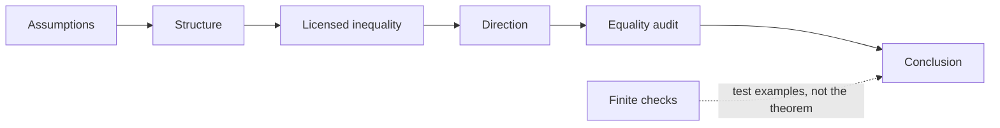
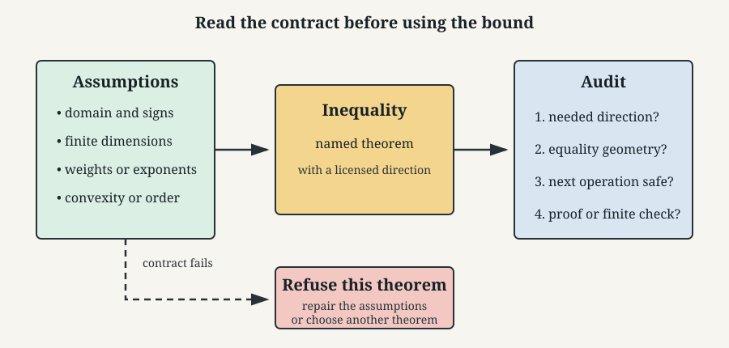
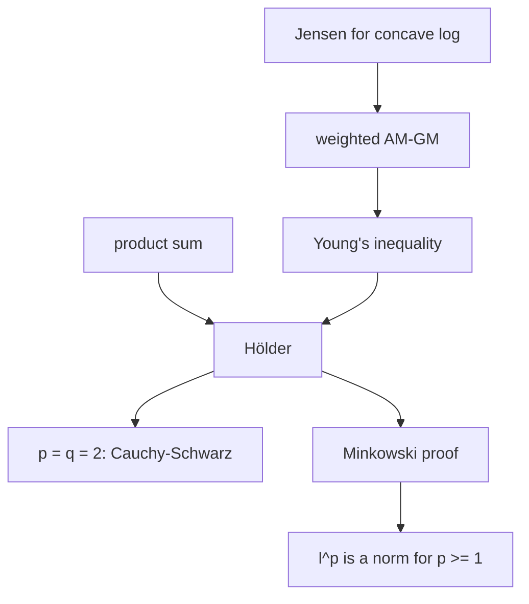
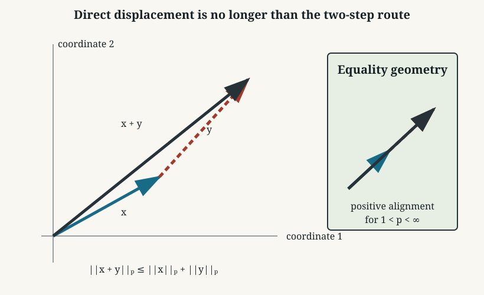
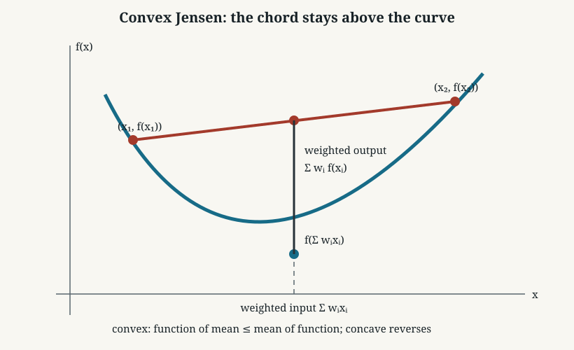
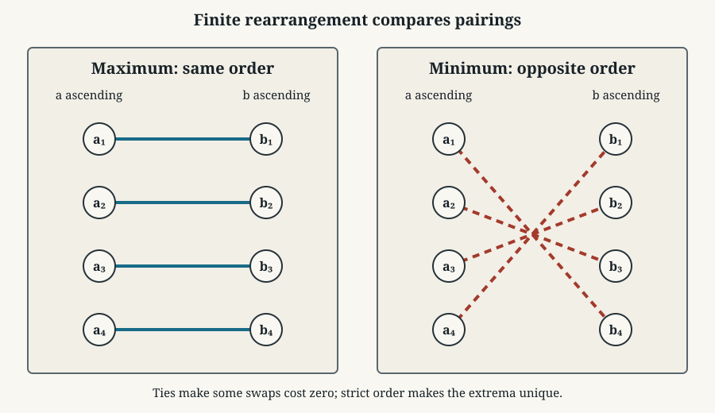
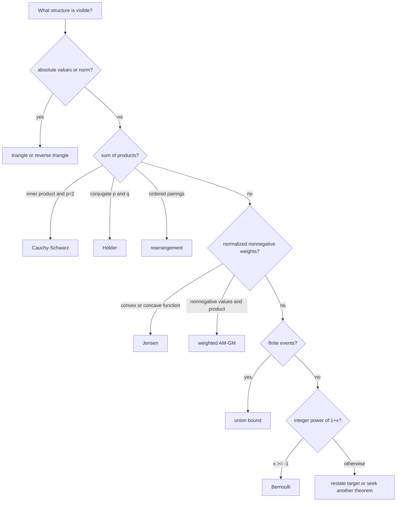

# 0.10 Inequalities

[Section home](../README.md) | Previous: [§0.09 Sums, Series, and Asymptotics](../00.09-sums-series-asymptotics/README.md) | [Project guides](../../STYLE_GUIDE.md) | [Notation guide](../../NOTATION.md)

## Why this matters

An equality tells you an exact value. An inequality tells you what is possible.
That weaker-looking statement is often more useful. You may not know a sum,
distance, error, or probability exactly, but a bound can still certify safety,
convergence, feasibility, or scale.

The difficulty is rarely remembering a theorem's name. It is recognizing the
contract that makes the theorem legal:

- Are the quantities real, nonnegative, or positive?
- Are weights nonnegative and normalized?
- Are two exponents conjugate?
- Is the function convex or concave on a domain containing every input?
- Does an operation preserve or reverse order?
- What must happen for equality?

Boyd and Vandenberghe present Jensen's inequality as the defining convexity
inequality extended from two points to finite convex combinations [1]. Their
linear-algebra text treats the triangle inequality as one of the properties that
makes a norm a norm [2]. MIT's open discrete-mathematics text derives the union
bound from finite event inclusion and nonnegative probability [3]. The common
lesson is that assumptions are not decoration. They are the route from a known
structure to a valid bound.



> **Figure 1. An inequality is a contract.** A valid application records the
> input assumptions, bound direction, and equality case. Computation can audit
> selected inputs but cannot prove a universal statement. Original diagram.



> **Figure 2. Read assumptions before the formula.** The same algebraic shape
> can be valid, reversed, or meaningless when signs, domains, or exponents
> change. Original figure.

### Scope and non-goals

This module covers exactly:

- order-preserving and order-reversing operations;
- the absolute-value and finite $\ell^p$ triangle inequalities;
- unweighted and weighted arithmetic mean-geometric mean inequality (AM-GM);
- finite-dimensional Cauchy-Schwarz;
- finite-dimensional Hölder and Minkowski inequalities;
- finite weighted Jensen for convex and concave functions;
- the finite union bound;
- Bernoulli's inequality for integer exponents;
- the finite rearrangement inequality;
- a workflow for choosing and auditing an inequality from assumptions.

This module is explicitly **not**:

- probability foundations or construction of probability spaces;
- countably infinite union bounds;
- measure-theoretic Hölder, Minkowski, or Jensen inequalities;
- normed-space completeness or functional analysis;
- convex optimization algorithms or duality;
- concentration inequalities;
- ELBO, expectation-maximization (EM), or information-theory instruction;
- the rearrangement of conditionally convergent series from §0.09.

Jensen receives one carefully bounded preview of a later use: concavity of the
logarithm turns a log of a weighted average into a lower bound involving a
weighted average of logs. Later modules will supply the probabilistic objects
and algorithms. This module supplies only the inequality mechanism.

## Learning objectives

After completing this module, you should be able to:

- predict whether an algebraic operation preserves, reverses, or destroys an
  inequality from the operands' domains and signs;
- state and prove the finite triangle, AM-GM, Cauchy-Schwarz, Hölder,
  Minkowski, Jensen, union-bound, Bernoulli, and rearrangement inequalities with
  their assumptions, directions, and equality conditions;
- derive Cauchy-Schwarz from a nonnegative quadratic, Hölder from Young's
  inequality, and Minkowski from Hölder;
- use convexity or concavity to choose Jensen's direction and audit its domain;
- distinguish finite rearrangement of paired sequences from infinite series
  rearrangement;
- select an inequality by matching assumptions to structure instead of matching
  surface notation;
- use finite Python checks to catch transcription errors without reporting them
  as proofs.

The [exercise set](exercises/README.md) assesses every objective. Full [worked
solutions](solutions/README.md), tested [standard-library code](code/README.md),
and an annotated [resource guide](resources/README.md) are separate.

## Prerequisite check

Required: [§0.02 Algebra, Functions, and Precalculus Backfill](../00.02-algebra-functions-precalculus/README.md)
and [§0.06 Proof Techniques](../00.06-proof-techniques/README.md).

Try these before starting:

1. If $a<b$, what happens after adding the same real $c$ to both sides?
2. Why can multiplying by a negative number reverse an inequality?
3. Can you expand a square and identify when it equals zero?
4. Can you prove a claim by induction and state its base case?
5. Can you distinguish a finite checked table from a proof for all real inputs?
6. Can you read $\sum_{i=1}^n x_i y_i$ as an inner product of two real vectors?

Review §0.02 for domains, powers, roots, and algebra. Review §0.06 for proof
direction, counterexamples, and assumption audits. [§0.08](../00.08-counting-combinatorics/README.md)
is recommended for finite unions and indexed sums. [§0.09](../00.09-sums-series-asymptotics/README.md)
is recommended because it demonstrates how a true theorem fails when its input
contract is omitted.

## Historical context

Many inequalities are named after people, but the mathematical ideas usually
developed through several equivalent forms and applications. The useful history
for this module is structural.

The Cauchy-Schwarz inequality connects an inner product to the norm it induces.
Hölder generalizes its product estimate from exponent $2$ to conjugate
exponents, and Minkowski turns that product estimate into the triangle inequality
for $\ell^p$. Jensen's 1906 paper is listed in Boyd and Vandenberghe's historical
notes, which also point to Hardy, Littlewood, and Pólya for a systematic
inequality treatment [1]. We use those names for communication, not as claims
that one person invented every form now carrying the name.

The union bound is also called Boole's inequality. MIT's text presents the
finite statement as an immediate consequence of inclusion-exclusion and
nonnegativity [3]. No independence assumption appears.

## Intuition

### A bound spends assumptions

Think of each theorem as exchanging structure for control.

| Available structure | Bound it unlocks |
|---|---|
| absolute values or a norm | triangle inequality |
| nonnegative values | AM-GM |
| an inner product | Cauchy-Schwarz |
| conjugate exponents | Hölder |
| an $\ell^p$ norm with $p\ge1$ | Minkowski |
| convex or concave function plus convex weights | Jensen |
| finitely many events | union bound |
| $x\ge-1$ and integer $n\ge0$ | Bernoulli |
| two finite real sequences with controlled ordering | rearrangement |

If the structure is missing, the theorem is unavailable. That does not prove
the desired conclusion false. It means you need another route.

### Equality is a diagnostic

Equality conditions reveal what information the inequality discarded.

- Triangle equality means there was no cancellation in the extremal direction.
- AM-GM equality means all positively weighted values agree.
- Cauchy-Schwarz equality means the vectors lie on one line.
- Strict Jensen equality means all positively weighted inputs coincide.
- Union-bound equality means no positive probability mass was counted twice.
- Rearrangement equality often comes from ties that make swaps cost nothing.

An equality audit can expose a poor bound. If your application is far from the
equality geometry, a sharper inequality may be available.

### Normalize before comparing

Hölder and Jensen become easier to see after normalization. Hölder divides each
vector by its norm. Jensen requires weights whose sum is one. AM-GM compares two
ways of aggregating values on the same scale. Normalization is not cosmetic. It
creates the theorem's input shape.



> **Figure 3. Several inequalities form a proof family.** Arrows show one route
> of derivation used here, not historical priority. Original diagram.

## Mathematics

### Local notation

| Symbol | Type | Meaning |
|---|---|---|
| $n$ | positive integer | finite sequence length |
| $\boldsymbol{x},\boldsymbol{y}$ | $\mathbb{R}^n$ | real vectors |
| $w_i$ | nonnegative real | normalized weight, with $\sum_i w_i=1$ |
| $p,q$ | real exponents | conjugate when $1/p+1/q=1$ |
| $\lVert\boldsymbol{x}\rVert_p$ | nonnegative real | finite $\ell^p$ norm |
| $f$ | real-valued function | convex or concave on a stated interval or convex domain |
| $A_i$ | event | object whose probability is already defined |
| $\mathbf{1}_{A_i}$ | $\{0,1\}$ | event indicator |

All sums in this module are finite.

### Order-preserving operations

Let $a,b,c\in\mathbb{R}$ and suppose $a\le b$.

- Addition preserves order: $a+c\le b+c$.
- Multiplication by $c>0$ preserves order: $ac\le bc$.
- Multiplication by $c<0$ reverses order: $ac\ge bc$.
- Multiplication by $c=0$ collapses both sides to equality.
- If $0<a\le b$, reciprocals reverse order: $1/a\ge1/b$.
- If $0\le a\le b$, then $a^r\le b^r$ for $r>0$.
- Squaring is not increasing on all of $\mathbb{R}$. For example, $-3<-2$ but
  $9>4$.
- Applying an increasing function preserves order; applying a decreasing
  function reverses it, provided both inputs lie in the function's domain.

Never write "square both sides" without checking signs or using an equivalent
form that makes the operation legal.

### Absolute-value triangle inequality

For real $a,b$,

$$
|a+b|\le|a|+|b|.
$$

Equality holds exactly when $ab\ge0$, including a zero operand. The two real
numbers point in the same direction, so addition causes no cancellation.

The reverse triangle inequality follows:

$$
\bigl||a|-|b|\bigr|\le|a-b|.
$$

It bounds how much magnitude can change under a perturbation.

### Finite $\ell^p$ norms and Minkowski

For $\boldsymbol{x}\in\mathbb{R}^n$ and $1\le p<\infty$,

$$
\lVert\boldsymbol{x}\rVert_p
\coloneqq
\left(\sum_{i=1}^n|x_i|^p\right)^{1/p}.
$$

For $p=\infty$,

$$
\lVert\boldsymbol{x}\rVert_\infty
\coloneqq\max_{1\le i\le n}|x_i|.
$$

**Minkowski's inequality.** For $1\le p\le\infty$ and real vectors of the
same finite length,

$$
\lVert\boldsymbol{x}+\boldsymbol{y}\rVert_p
\le
\lVert\boldsymbol{x}\rVert_p+\lVert\boldsymbol{y}\rVert_p.
$$

This is the triangle inequality for $\ell^p$. The condition $p\ge1$ is
load-bearing. For $0<p<1$, the displayed formula defines a useful quantity in
some settings but not a norm, and its triangle inequality can fail.

Equality conditions depend on $p$:

- for $1<p<\infty$, equality holds when one vector is zero or the vectors are
  nonnegative scalar multiples of one another;
- for $p=1$, equality holds exactly when $x_i y_i\ge0$ for every coordinate;
- for $p=\infty$, equality holds when there is an index $i$ such that
  $|x_i|=\lVert\boldsymbol{x}\rVert_\infty$ and
  $|y_i|=\lVert\boldsymbol{y}\rVert_\infty$, with $x_i y_i\ge0$; this
  includes the zero-vector cases.



> **Figure 4. Triangle and Minkowski compare a direct displacement with a
> two-step path.** Equality means the steps align in an extremal direction.
> Original figure.

### AM-GM

For nonnegative real numbers $x_1,\ldots,x_n$ with $n\ge1$,

$$
\left(\prod_{i=1}^n x_i\right)^{1/n}
\le
\frac1n\sum_{i=1}^n x_i.
$$

The geometric mean is on the left and the arithmetic mean is on the right.
Equality holds exactly when

$$
x_1=x_2=\cdots=x_n.
$$

The weighted form assumes $x_i\ge0$, $w_i\ge0$, and $\sum_iw_i=1$:

$$
\prod_{i=1}^n x_i^{w_i}
\le
\sum_{i=1}^n w_i x_i.
$$

Use the convention that a zero value with positive weight makes the product
zero; a zero weight contributes no factor. Equality holds when all values with
positive weight are equal. Positivity $x_i>0$ is required for a proof that takes
logarithms, then nonnegative boundary values follow by continuity or direct
inspection.

### Cauchy-Schwarz

For $\boldsymbol{x},\boldsymbol{y}\in\mathbb{R}^n$,

$$
\left|\langle\boldsymbol{x},\boldsymbol{y}\rangle\right|
\le
\lVert\boldsymbol{x}\rVert_2\lVert\boldsymbol{y}\rVert_2,
$$

where

$$
\langle\boldsymbol{x},\boldsymbol{y}\rangle
=\sum_{i=1}^n x_i y_i.
$$

Squaring gives the equivalent form

$$
\left(\sum_{i=1}^n x_i y_i\right)^2
\le
\left(\sum_{i=1}^n x_i^2\right)
\left(\sum_{i=1}^n y_i^2\right).
$$

Equality holds exactly when the vectors are linearly dependent, including when
one is zero. For nonzero vectors, there is a real $\lambda$ such that
$\boldsymbol{x}=\lambda\boldsymbol{y}$. OpenStax develops the dot product and
its norm and angle relationships in directly inspectable HTML [4].

### Hölder

Let $1<p,q<\infty$ satisfy

$$
\frac1p+\frac1q=1.
$$

For $\boldsymbol{x},\boldsymbol{y}\in\mathbb{R}^n$,

$$
\sum_{i=1}^n|x_i y_i|
\le
\lVert\boldsymbol{x}\rVert_p
\lVert\boldsymbol{y}\rVert_q.
$$

Cauchy-Schwarz is $p=q=2$. The endpoint form is also valid:

$$
\sum_i|x_i y_i|\le\lVert\boldsymbol{x}\rVert_1
\lVert\boldsymbol{y}\rVert_\infty,
$$

and symmetrically with $p=\infty,q=1$.

For $p=1,q=\infty$, equality holds exactly when every coordinate with
$x_i\ne0$ satisfies $|y_i|=\lVert\boldsymbol{y}\rVert_\infty$. The symmetric
condition applies when $p=\infty,q=1$. Zero vectors are included.

For finite $p,q$ and nonzero vectors, equality holds exactly when there is a
constant $c>0$ such that

$$
|x_i|^p=c|y_i|^q
\qquad\text{for every }i.
$$

This statement uses $\sum|x_i y_i|$. If you instead bound
$|\sum x_i y_i|$, equality also requires the nonzero products $x_i y_i$ to
have one common sign so the first absolute-value triangle step loses nothing.

### Jensen

Let $C$ be a convex subset of a real vector space, let
$x_1,\ldots,x_n\in C$, and let $w_i\ge0$ with $\sum_iw_i=1$. If
$f:C\to\mathbb{R}$ is convex, then

$$
f\left(\sum_{i=1}^n w_i x_i\right)
\le
\sum_{i=1}^n w_i f(x_i).
$$

The direction reverses when $f$ is concave. If $f$ is strictly convex, equality
holds exactly when all $x_i$ with positive weight are equal. For a merely convex
function, equality can also occur when $f$ is affine on the convex hull of the
positively weighted inputs.

The domain condition matters twice: every $x_i$ must lie in $C$, and convexity
ensures their weighted mean lies there too. Boyd and Vandenberghe state this
finite form and its expectation extension, with existence conditions, in
§3.1.8 [1]. This module stops at the finite form.

For the concave function $\log$ on $(0,\infty)$,

$$
\log\left(\sum_iw_i r_i\right)
\ge
\sum_iw_i\log r_i,
\qquad r_i>0.
$$

Later latent-variable and information-theory derivations repeatedly use this
pattern to move a logarithm across an average and obtain a lower bound. We are
not defining those downstream objectives here. The transferable skill is to
identify positive inputs, normalized weights, log's concavity, and the reversed
direction.



> **Figure 5. Jensen is the chord test for convexity.** The function value at a
> weighted input lies below the matching weighted output. Concave functions
> reverse the picture. Original figure.

### Finite union bound

For events $A_1,\ldots,A_n$ in a probability model,

$$
\Pr\left(\bigcup_{i=1}^n A_i\right)
\le
\sum_{i=1}^n\Pr(A_i).
$$

No independence assumption is required. The right side may exceed one; the
slightly sharper reported bound is

$$
\Pr\left(\bigcup_iA_i\right)
\le
\min\left\{1,\sum_i\Pr(A_i)\right\}.
$$

Equality in the uncapped sum occurs when no positive probability mass is counted
in more than one event. Pairwise disjoint events are a simple sufficient case.
In a model that permits zero-probability overlaps, equality can still hold when
the events overlap only on total probability zero.

This is the module's only probability result. It assumes events and their
probabilities are already defined. Section 3 owns probability spaces,
independence, random variables, and countable extensions.

### Bernoulli's inequality

For $x\ge-1$ and integer $n\ge0$,

$$
(1+x)^n\ge1+nx.
$$

The direction is lower-bounding. The domain $x\ge-1$ keeps the base
nonnegative for the induction proof. Equality holds when:

- $n=0$ or $n=1$, for every allowed $x$;
- $x=0$, for every allowed $n$.

For $n\ge2$, equality occurs only at $x=0$.

There are real-exponent variants with different domains and directions. They
are not this theorem. Here $n$ is a nonnegative integer.

### Finite rearrangement inequality

Let

$$
a_1\le a_2\le\cdots\le a_n,
\qquad
b_1\le b_2\le\cdots\le b_n
$$

be finite real sequences. For every permutation $\pi$ of
$\{1,\ldots,n\}$,

$$
\sum_{i=1}^n a_i b_{n+1-i}
\le
\sum_{i=1}^n a_i b_{\pi(i)}
\le
\sum_{i=1}^n a_i b_i.
$$

Same-order pairing maximizes the sum of products. Opposite-order pairing
minimizes it. Nonnegativity is not required; ordering is.

If both sequences are strictly increasing, the maximizing and minimizing
permutations are unique. With ties, swapping equal values leaves a sum unchanged,
so equality can occur for several permutations. The exact audit is local: a swap
has zero cost when at least one of the two compared differences is zero.

This theorem rearranges a **finite pairing**. Section 0.09 rearranges the order
of terms in an **infinite series** and asks whether partial sums keep the same
limit. The shared word does not make the theorems interchangeable.



> **Figure 6. Pair large with large to maximize and large with small to
> minimize.** Solid and dashed connections encode the pairing order, so the
> figure does not rely on color alone. Original figure.

### Assumption and equality ledger

| Inequality | Inputs | Direction | Equality |
|---|---|---|---|
| absolute triangle | real $a,b$ | $\lvert a+b\rvert\le\lvert a\rvert+\lvert b\rvert$ | $ab\ge0$ |
| weighted AM-GM | $x_i\ge0$, $w_i\ge0$, $\sum w_i=1$ | geometric $\le$ arithmetic | positive-weight values equal |
| Cauchy-Schwarz | real vectors, same finite length | inner product magnitude $\le$ norm product | linear dependence |
| Hölder | same length, conjugate $p,q$ | product sum $\le$ norm product | normalized powers proportional; endpoint support lies on maximum coordinates |
| Minkowski | same length, $1\le p\le\infty$ | norm of sum $\le$ sum of norms | aligned, with endpoint details above |
| Jensen | convex domain, convex $f$, convex weights | function of mean $\le$ mean of function | strict case: positive-weight inputs equal |
| union bound | finitely many events | union probability $\le$ sum | no positive-mass overcount |
| Bernoulli | $x\ge-1$, integer $n\ge0$ | power $\ge$ tangent line | $n\in\{0,1\}$ or $x=0$ |
| rearrangement | two sorted finite real sequences | reverse $\le$ any $\le$ same | strict order gives unique extrema |

## Derivation

### Triangle inequality from two scalar bounds

For every real $t$,

$$
-|t|\le t\le|t|.
$$

Adding the lower bounds and upper bounds gives

$$
-(|a|+|b|)\le a+b\le|a|+|b|.
$$

Therefore $|a+b|\le|a|+|b|$. Applying this to
$a=(a-b)+b$ gives $|a|-|b|\le|a-b|$; swapping $a,b$ gives the reverse
triangle inequality.

### Two-variable AM-GM from a square

For $a,b\ge0$,

$$
(\sqrt a-\sqrt b)^2\ge0.
$$

Expanding and rearranging gives

$$
\sqrt{ab}\le\frac{a+b}{2}.
$$

Equality holds exactly when $\sqrt a=\sqrt b$, hence $a=b$. The general
weighted form follows from Jensen applied to concave $\log$ for positive inputs,
then extends to the nonnegative boundary.

### Cauchy-Schwarz from a nonnegative quadratic

If $\boldsymbol{y}=\mathbf0$, both sides are zero. Otherwise, for every real
$t$,

$$
0\le\lVert\boldsymbol{x}-t\boldsymbol{y}\rVert_2^2
=\lVert\boldsymbol{x}\rVert_2^2
-2t\langle\boldsymbol{x},\boldsymbol{y}\rangle
+t^2\lVert\boldsymbol{y}\rVert_2^2.
$$

Choose

$$
t=\frac{\langle\boldsymbol{x},\boldsymbol{y}\rangle}
{\lVert\boldsymbol{y}\rVert_2^2}.
$$

Substitution yields

$$
0\le\lVert\boldsymbol{x}\rVert_2^2
-\frac{\langle\boldsymbol{x},\boldsymbol{y}\rangle^2}
{\lVert\boldsymbol{y}\rVert_2^2},
$$

which rearranges to Cauchy-Schwarz. Equality means
$\boldsymbol{x}-t\boldsymbol{y}=\mathbf0$, exactly linear dependence.

### Young, then Hölder

For $u,v\ge0$ and conjugate $p,q\in(1,\infty)$, weighted AM-GM with
weights $1/p$ and $1/q$ gives Young's inequality:

$$
uv\le\frac{u^p}{p}+\frac{v^q}{q}.
$$

Assume both vectors in Hölder are nonzero and normalize

$$
u_i=\frac{|x_i|}{\lVert\boldsymbol{x}\rVert_p},
\qquad
v_i=\frac{|y_i|}{\lVert\boldsymbol{y}\rVert_q}.
$$

Summing Young's inequality gives

$$
\sum_i u_i v_i
\le
\frac1p\sum_i u_i^p+\frac1q\sum_i v_i^q
=\frac1p+\frac1q=1.
$$

Multiplying back by the two norms proves Hölder. Equality in Young requires
$u_i^p=v_i^q$, which produces the proportional-power condition.

### Minkowski from Hölder

Let $1<p<\infty$ and $q=p/(p-1)$. Set
$z_i=|x_i+y_i|$. Then

$$
\sum_i z_i^p
\le
\sum_i|x_i|z_i^{p-1}
+\sum_i|y_i|z_i^{p-1}.
$$

Apply Hölder to each sum. Since $(p-1)q=p$,

$$
\lVert\boldsymbol{z}^{p-1}\rVert_q
=\left(\sum_i z_i^p\right)^{1/q}
=\lVert\boldsymbol{x}+\boldsymbol{y}\rVert_p^{p-1}.
$$

Therefore

$$
\lVert\boldsymbol{x}+\boldsymbol{y}\rVert_p^p
\le
\left(\lVert\boldsymbol{x}\rVert_p+\lVert\boldsymbol{y}\rVert_p\right)
\lVert\boldsymbol{x}+\boldsymbol{y}\rVert_p^{p-1}.
$$

The zero case is immediate; otherwise divide by the final positive factor. The
$p=1$ and $p=\infty$ cases follow directly from scalar triangle inequalities.

### Finite Jensen by induction

Convexity gives the two-point case. Suppose Jensen holds for $n-1$ points and
let $s=\sum_{i=1}^{n-1}w_i$. The cases $s=0$ or $s=1$ reduce immediately.
Otherwise define normalized weights $\widetilde w_i=w_i/s$. Then

$$
\sum_{i=1}^n w_i x_i
=s\left(\sum_{i=1}^{n-1}\widetilde w_i x_i\right)+(1-s)x_n.
$$

Apply two-point convexity, then the induction hypothesis to the first group.
The result is $\sum_iw_if(x_i)$. This proof uses only finite convex
combinations.

### Union bound from indicators

For each outcome,

$$
\mathbf1_{\bigcup_iA_i}
\le
\sum_i\mathbf1_{A_i}.
$$

The left side records whether at least one event occurred. The right side counts
how many occurred. Averaging this pointwise inequality over the finite
probability model gives the union bound. Independence never enters.

### Bernoulli by induction

We use the standard base-case and inductive-step structure reviewed by Levin [5].
The theorem and derivation here are independently written.

The $n=0$ case is equality. Assume

$$
(1+x)^n\ge1+nx
$$

for $x\ge-1$. Because $1+x\ge0$, multiplication preserves order:

$$
(1+x)^{n+1}\ge(1+nx)(1+x)
=1+(n+1)x+nx^2
\ge1+(n+1)x.
$$

The term $nx^2$ is nonnegative. This proof shows exactly why the sign condition
on $1+x$ matters.

### Rearrangement by adjacent swaps

Suppose $a_i\le a_j$ and two paired values satisfy $b_r\le b_s$. Compare
crossed and aligned pairings:

$$
(a_i b_r+a_j b_s)-(a_i b_s+a_j b_r)
=(a_j-a_i)(b_s-b_r)\ge0.
$$

Any inversion can be removed by such a swap without decreasing the product sum.
Repeated swaps produce same-order pairing, the maximum. Reversing one sequence
gives the minimum. A swap is costless exactly when one displayed difference is
zero, which explains tie-based equality.

## Implementation

The tested implementation lives in [`code/inequality_tools.py`](code/inequality_tools.py),
with execution instructions in [`code/README.md`](code/README.md). Its use of
`math.fsum`, `math.isfinite`, and ordinary finite products follows Python's
official standard-library behavior [6].

### Expose both sides

```python
from inequality_tools import cauchy_schwarz_sides, holder_sides

left, right = cauchy_schwarz_sides((1, 2, 3), (4, -5, 6))
assert left <= right

left, right = holder_sides((1, -2, 4), (-3, 5, 2), 3)
assert left <= right + 1e-12
```

Returning both sides keeps the direction visible. The tolerance belongs to
floating-point representation, not to the mathematical theorem.

### Reject invalid contracts

```python
from inequality_tools import lp_norm, weighted_am_gm_sides

try:
    lp_norm((1, 2), 0.5)
except ValueError:
    pass
else:
    raise AssertionError("p < 1 must be rejected as an l^p norm")

try:
    weighted_am_gm_sides((1, 2), (0.4, 0.4))
except ValueError:
    pass
else:
    raise AssertionError("weights must sum to one")
```

Invalid-input tests are part of mathematical correctness.

### Audit finite rearrangements

```python
from itertools import permutations
from math import fsum

from inequality_tools import rearrangement_extremes

left = (3, -1, 2, 2)
right = (4, 0, -2, 5)
minimum, maximum = rearrangement_extremes(left, right)
all_products = [
    fsum(a * b for a, b in zip(left, ordering))
    for ordering in permutations(right)
]
assert minimum == min(all_products)
assert maximum == max(all_products)
```

This exhaustive check covers $4!=24$ pairings for one input. The adjacent-swap
proof covers every finite pair of real sequences.

## Experimentation

### Experiment 1: find near-equality geometry

Start with a vector $\boldsymbol{x}$ and set
$\boldsymbol{y}=c\boldsymbol{x}+\boldsymbol{\varepsilon}$. Track the
Cauchy-Schwarz ratio

$$
\frac{|\langle\boldsymbol{x},\boldsymbol{y}\rangle|}
{\lVert\boldsymbol{x}\rVert_2\lVert\boldsymbol{y}\rVert_2}
$$

as the perturbation shrinks. The ratio approaches one as the vectors approach
linear dependence. That is finite geometric evidence, not a proof of the
equality theorem.

### Experiment 2: break the exponent contract

For $p=1/2$, compare $\lVert(1,1)\rVert_p$ with
$\lVert(1,0)\rVert_p+\lVert(0,1)\rVert_p$. The supposed triangle
inequality points the wrong way. One counterexample disproves a universal claim;
many passing cases could not prove it.

### Experiment 3: convex, affine, and concave

Use the same inputs and weights with $f(x)=x^2$, $f(x)=3x+1$, and
$f(x)=\log x$ on positive inputs. The Jensen gap

$$
\sum_iw_if(x_i)-f\left(\sum_iw_ix_i\right)
$$

is positive, zero, and negative respectively. The sign reflects a proved shape
property of each function.

### Experiment 4: union-bound looseness

Construct three events in a small finite outcome table. Compare disjoint events,
identical events, and partial overlaps. The bound is exact for disjoint events
and can be loose when overlap is heavy. Independence is a different property
and is not required.

## Worked examples

### Worked example 1: order audit

From $2<5$, subtracting $7$ gives $-5<-2$. Multiplying by $-3$ then gives
$15>6$. Taking reciprocals of the positive original values gives
$1/2>1/5$. Each direction follows from a named sign or domain fact.

### Worked example 2: reverse triangle

If a computed value changes from $a$ to $b$, then

$$
\bigl||a|-|b|\bigr|\le|a-b|.
$$

A perturbation of size at most $\varepsilon$ can change the magnitude by at
most $\varepsilon$.

### Worked example 3: AM-GM product bound

If $x,y\ge0$ and $x+y=10$, then

$$
\sqrt{xy}\le5,
\qquad xy\le25.
$$

Equality requires $x=y=5$.

### Worked example 4: weighted AM-GM

For values $1,4$ and weights $1/4,3/4$,

$$
1^{1/4}4^{3/4}\le\frac14(1)+\frac34(4)=\frac{13}{4}.
$$

The inequality is strict because both weights are positive and the values differ.

### Worked example 5: Cauchy-Schwarz sum bound

For any real $x_1,\ldots,x_n$,

$$
\left(\sum_i x_i\right)^2
\le n\sum_i x_i^2
$$

by pairing $\boldsymbol{x}$ with the all-ones vector. Equality holds when
all $x_i$ are equal.

### Worked example 6: Hölder choice

To bound $\sum_i|x_i y_i|$ when a cubic norm of $\boldsymbol{x}$ is
available, choose $p=3$ and $q=3/2$. Choosing $q=3$ would violate
$1/p+1/q=1$.

### Worked example 7: Minkowski and alignment

For $\boldsymbol{x}=(1,2)$ and $\boldsymbol{y}=(2,4)$,

$$
\lVert\boldsymbol{x}+\boldsymbol{y}\rVert_3
=3\lVert\boldsymbol{x}\rVert_3
=\lVert\boldsymbol{x}\rVert_3+\lVert\boldsymbol{y}\rVert_3.
$$

Equality matches positive proportionality.

### Worked example 8: Jensen direction

For convex $f(x)=x^2$, equal weights, and values $1,3$,

$$
f(2)=4\le\frac{f(1)+f(3)}2=5.
$$

For concave $\log$ on the same positive inputs, the direction reverses.

### Worked example 9: log lower-bound pattern

For positive $r_1,r_2$ and $w\in[0,1]$,

$$
\log(wr_1+(1-w)r_2)
\ge w\log r_1+(1-w)\log r_2.
$$

This is concave Jensen, not a special logarithm trick.

### Worked example 10: union without independence

If three failure events have probabilities $0.02$, $0.03$, and $0.01$, then

$$
\Pr(A_1\cup A_2\cup A_3)\le0.06.
$$

The statement remains valid whether the failures are independent, dependent,
or identical. Heavy overlap makes the bound loose.

### Worked example 11: Bernoulli lower bound

For $x=0.05$ and $n=20$,

$$
1.05^{20}\ge1+20(0.05)=2.
$$

The theorem gives a quick lower bound, not an approximation error guarantee.

### Worked example 12: rearrangement

For $a=(1,2,4)$ and $b=(-1,3,5)$, same-order pairing gives
$-1+6+20=25$. Opposite-order pairing gives $5+6-4=7$. Every other pairing has
product sum between $7$ and $25$.

## Choosing an inequality from assumptions



> **Figure 7. Select by structure, then verify the full contract.** This routing
> aid is not exhaustive and does not replace a proof. Original diagram.

Use this audit before writing a theorem name:

1. **Target:** What exact quantity needs an upper or lower bound?
2. **Domain:** Are all values real, nonnegative, positive, or in a convex domain?
3. **Structure:** Is this a norm, product sum, weighted average, union, power, or
   ordered pairing?
4. **Parameters:** Do weights normalize? Are exponents conjugate? Is $p\ge1$?
5. **Direction:** Does the theorem give the needed upper or lower bound?
6. **Equality:** What geometry makes the bound tight? Is the application near it?
7. **Composition:** Will the next operation preserve the direction?
8. **Evidence:** Which step is proved, which is sourced, and which is only checked
   on finite examples?

## Common mistakes

### Multiplying without checking sign

An unknown-sign multiplier does not license one fixed direction.

### Squaring arbitrary real inequalities

Squaring is not increasing on all real numbers. Establish nonnegativity first.

### Using AM-GM on negative values

The real geometric mean may be undefined, and the theorem's contract is broken.

### Forgetting normalized Jensen weights

Nonnegative coefficients that do not sum to one do not form the stated convex
combination. Normalize only when the target expression permits it.

### Reversing Jensen from memory

Convex means function of average is at most average of function. Concave reverses.

### Calling every product bound Cauchy-Schwarz

If the available norms have exponents other than two, Hölder may be the actual
tool. Check conjugacy.

### Using Minkowski for $p<1$

The $\ell^p$ triangle inequality requires $p\ge1$.

### Adding independence to the union bound

Independence is unnecessary. It may support other calculations, but not this
finite upper bound.

### Extending Bernoulli silently to real exponents

This module's theorem has integer $n\ge0$. Other variants need new contracts.

### Confusing two rearrangement theorems

Finite product pairings and infinite series order answer different questions.

### Ignoring equality

A correct but very loose bound may be useless. Equality geometry helps diagnose
tightness.

### Treating sampled checks as proof

Random or exhaustive finite tests can find counterexamples inside their search
domain. Passing tests do not quantify over all real inputs or all lengths.

## Exercises

The [exercise set](exercises/README.md) contains 12 progressive problems covering
order operations, triangle bounds, AM-GM, Cauchy-Schwarz, Hölder, Minkowski,
Jensen, the finite union bound, Bernoulli, finite rearrangement, implementation,
and a final selection audit. Exact mirrored [worked solutions](solutions/README.md)
are committed separately.

No exercise requires third-party software. Run the tested [`code/`](code/README.md)
package before the implementation audit.

## What you should now be able to do

You should now be able to:

- treat assumptions as a theorem contract;
- preserve or reverse inequality direction deliberately;
- recognize the triangle, mean, product, norm, convexity, union, power, and
  ordering structures covered here;
- derive the main family relationships rather than memorize an isolated list;
- state equality conditions and use them to judge tightness;
- explain why concave log Jensen later creates useful lower bounds;
- keep finite rearrangement separate from §0.09 series rearrangement;
- reject a theorem cleanly when its domain, signs, weights, or exponents fail;
- report computation as finite audit evidence rather than proof.

## Where this leads

Probability uses the union bound and expectation forms of Jensen after Section 3
defines the required objects. Linear algebra develops inner products, geometry,
and norms in greater depth. Optimization builds on convex functions and Jensen
but owns algorithms, duality, and optimality. Information theory repeatedly uses
logarithmic inequalities. Later latent-variable methods use concave-log Jensen
inside ELBO and EM derivations.

Those downstream modules should link back to this contract and then add their
own structures. [§0.11 Graph Theory](../00.11-graph-theory/README.md) follows by
turning relationships into discrete structures with explicit model contracts.

## References

[1] S. Boyd and L. Vandenberghe, *Convex Optimization*. Cambridge University
Press, 2004, §§2.2, 3.1.8, and Appendix A. Freely available author-hosted PDF;
copyright retained by Cambridge University Press. https://web.stanford.edu/~boyd/cvxbook/
Accessed 2026-09-01.

[2] S. Boyd and L. Vandenberghe, *Introduction to Applied Linear Algebra:
Vectors, Matrices, and Least Squares*. Cambridge University Press, 2018, Chapter
3. Freely available author-hosted PDF; copyright retained by Cambridge University
Press. https://web.stanford.edu/~boyd/vmls/ Accessed 2026-09-01.

[3] A. R. Meyer and A. Chlipala, *Mathematics for Computer Science*, revised
Wednesday 6th June, 2018, §16.5, Rule 16.5.4. MIT OpenCourseWare, Spring 2015.
License: CC BY-NC-SA 4.0. https://ocw.mit.edu/courses/6-042j-mathematics-for-computer-science-spring-2015/pages/readings/
Accessed 2026-09-01.

[4] G. Strang and E. Herman, *Calculus Volume 3*, OpenStax, 2016, §2.3, "The Dot
Product." Web version updated 2026-07-15. License: CC BY-NC-SA 4.0.
https://openstax.org/books/calculus-volume-3/pages/2-3-the-dot-product Accessed
2026-09-01.

[5] O. Levin, *Discrete Mathematics: An Open Introduction*, 4th ed., 2025,
§4.5, "Proof by Induction." License: CC BY-NC-SA 4.0.
https://discrete.openmathbooks.org/dmoi4/sec_seq-induction.html Accessed
2026-09-01.

[6] Python Software Foundation, "`math` and `fractions` standard-library
documentation," Python 3.14. PSF License Version 2; documentation code examples
additionally 0BSD. https://docs.python.org/3/library/math.html and
https://docs.python.org/3/library/fractions.html Accessed 2026-09-01.

[Section home](../README.md) | Previous: [§0.09 Sums, Series, and Asymptotics](../00.09-sums-series-asymptotics/README.md) | Next: [§0.11 Graph Theory](../00.11-graph-theory/README.md) | [Exercises](exercises/README.md) | [Worked solutions](solutions/README.md) | [Resources](resources/README.md) | [Code](code/README.md)