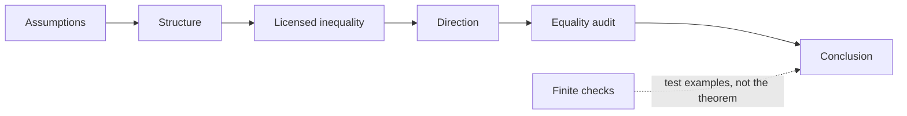
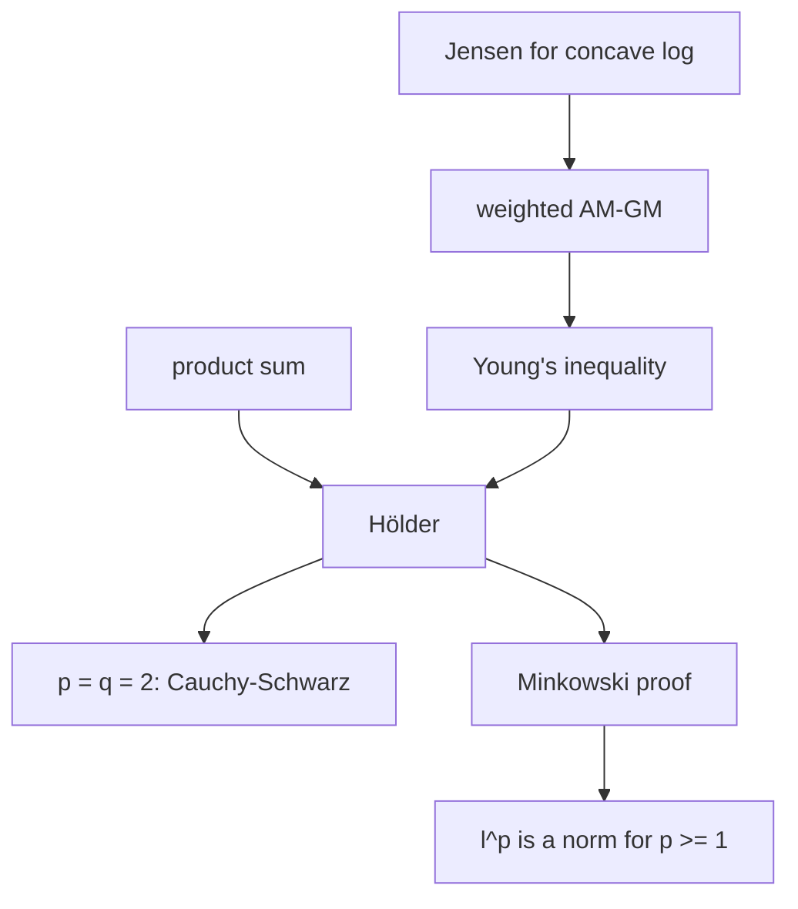
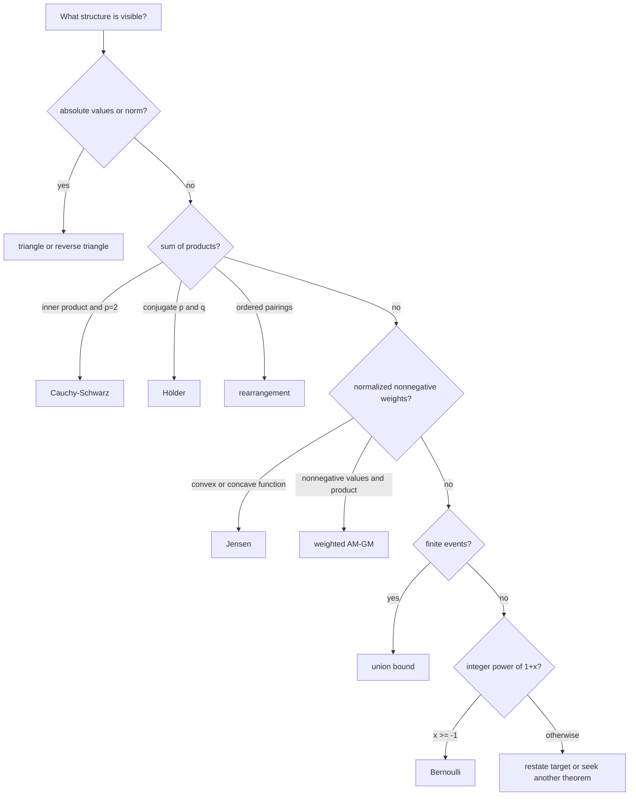

# 0.10 Inequalities

[Section home](../README.md) | Previous: [§0.09 Sums, Series, and Asymptotics](../00.09-sums-series-asymptotics/README.md) | [Module guide](../../CONTRIBUTING.md#module-file-structure) | [Notation guide](../../NOTATION.md)

Learn to choose, prove, and audit finite inequalities from their sign, domain, weight, exponent, and equality conditions. The route connects triangle and AM-GM bounds to Cauchy-Schwarz, Hölder, Minkowski, Jensen, the union bound, Bernoulli, and finite rearrangement, with Python checks kept distinct from proofs.

Background: [§0.02 Algebra, Functions, and Precalculus Backfill](../00.02-algebra-functions-precalculus/README.md)
and [§0.06 Proof Techniques](../00.06-proof-techniques/README.md).

Review §0.02 for domains, powers, roots, and algebra. Review §0.06 for proof
direction, counterexamples, and assumption audits. [§0.08](../00.08-counting-combinatorics/README.md)
is recommended for finite unions and indexed sums. [§0.09](../00.09-sums-series-asymptotics/README.md)
is recommended because it demonstrates how a true theorem fails when its input
contract is omitted.

**Contents:** [Bounds as contracts](#bounds-as-contracts) · [Finite inequality contracts](#finite-inequality-contracts) · [Proofs connecting the inequality families](#proofs-connecting-the-inequality-families) · [Implementation](#implementation) · [Worked examples](#worked-examples) · [Practice](#practice) · [References](#references)

## Bounds as contracts

An equality tells you an exact value. An inequality tells you what is possible.
That weaker-looking statement is often more useful. You may not know a sum,
distance, error, or probability exactly, but a bound can still certify safety,
convergence, feasibility, or scale.

The difficulty is rarely remembering a theorem's name. It is recognizing the
contract that makes the theorem legal:

- Are the quantities real, nonnegative, or positive?
- Are weights nonnegative and normalized?
- Are two exponents conjugate?
- Is the function convex or concave on a domain containing every input?
- Does an operation preserve or reverse order?
- What must happen for equality?

Boyd and Vandenberghe present Jensen's inequality as the defining convexity
inequality extended from two points to finite convex combinations [1]. Their
linear-algebra text treats the triangle inequality as one of the properties that
makes a norm a norm [2]. MIT's open discrete-mathematics text derives the union
bound from finite event inclusion and nonnegative probability [3]. The common
lesson is that assumptions are not decoration. They are the route from a known
structure to a valid bound.



> **Figure 1. An inequality is a contract.** A valid application records the
> input assumptions, bound direction, and equality case. Computation can audit
> selected inputs but cannot prove a universal statement. Original diagram.


> **Figure 2. Read assumptions before the formula.** The same algebraic shape
> can be valid, reversed, or meaningless when signs, domains, or exponents
> change. Original figure.

### Scope and non-goals

This module is explicitly **not**:

- probability foundations or construction of probability spaces;
- countably infinite union bounds;
- measure-theoretic Hölder, Minkowski, or Jensen inequalities;
- normed-space completeness or functional analysis;
- convex optimization algorithms or duality;
- concentration inequalities;
- ELBO, expectation-maximization (EM), or information-theory instruction;
- the rearrangement of conditionally convergent series from §0.09.

Jensen receives one carefully bounded preview of a later use: concavity of the
logarithm turns a log of a weighted average into a lower bound involving a
weighted average of logs. Later modules will supply the probabilistic objects
and algorithms. This module supplies only the inequality mechanism.


## Historical context

Many inequalities are named after people, but the mathematical ideas usually
developed through several equivalent forms and applications. The useful history
for this module is structural.

The Cauchy-Schwarz inequality connects an inner product to the norm it induces.
Hölder generalizes its product estimate from exponent $`2`$ to conjugate
exponents, and Minkowski turns that product estimate into the triangle inequality
for $`\ell^p`$. Jensen's 1906 paper is listed in Boyd and Vandenberghe's historical
notes, which also point to Hardy, Littlewood, and Pólya for a systematic
inequality treatment [1]. We use those names for communication, not as claims
that one person invented every form now carrying the name.

The union bound is also called Boole's inequality. MIT's text presents the
finite statement as an immediate consequence of inclusion-exclusion and
nonnegativity [3]. No independence assumption appears.

## What a bound keeps and discards

### A bound spends assumptions

Think of each theorem as exchanging structure for control.

| Available structure | Bound it unlocks |
|---|---|
| absolute values or a norm | triangle inequality |
| nonnegative values | AM-GM |
| an inner product | Cauchy-Schwarz |
| conjugate exponents | Hölder |
| an $`\ell^p`$ norm with $`p\ge1`$ | Minkowski |
| convex or concave function plus convex weights | Jensen |
| finitely many events | union bound |
| $`x\ge-1`$ and integer $`n\ge0`$ | Bernoulli |
| two finite real sequences with controlled ordering | rearrangement |

If the structure is missing, the theorem is unavailable. That does not prove
the desired conclusion false. It means you need another route.

### Equality is a diagnostic

Equality conditions reveal what information the inequality discarded.

- Triangle equality means there was no cancellation in the extremal direction.
- AM-GM equality means all positively weighted values agree.
- Cauchy-Schwarz equality means the vectors lie on one line.
- Strict Jensen equality means all positively weighted inputs coincide.
- Union-bound equality means no positive probability mass was counted twice.
- Rearrangement equality often comes from ties that make swaps cost nothing.

An equality audit can expose a poor bound. If your application is far from the
equality geometry, a sharper inequality may be available.

### Normalize before comparing

Hölder and Jensen become easier to see after normalization. Hölder divides each
vector by its norm. Jensen requires weights whose sum is one. AM-GM compares two
ways of aggregating values on the same scale. Normalization is not cosmetic. It
creates the theorem's input shape.



> **Figure 3. Several inequalities form a proof family.** Arrows show one route
> of derivation used here, not historical priority. Original diagram.

## Finite inequality contracts

### Local notation

| Symbol | Type | Meaning |
|---|---|---|
| $`n`$ | positive integer | finite sequence length |
| $`\boldsymbol{x},\boldsymbol{y}`$ | $`\mathbb{R}^n`$ | real vectors |
| $`w_i`$ | nonnegative real | normalized weight, with $`\sum_i w_i=1`$ |
| $`p,q`$ | real exponents | conjugate when $`1/p+1/q=1`$ |
| $`\lVert\boldsymbol{x}\rVert_p`$ | nonnegative real | finite $`\ell^p`$ norm |
| $`f`$ | real-valued function | convex or concave on a stated interval or convex domain |
| $`A_i`$ | event | object whose probability is already defined |
| $`\mathbf{1}_{A_i}`$ | $`\lbrace 0,1\rbrace`$ | event indicator |

All sums in this module are finite.

### Order-preserving operations

Let $`a,b,c\in\mathbb{R}`$ and suppose $`a\le b`$.

- Addition preserves order: $`a+c\le b+c`$.
- Multiplication by $`c>0`$ preserves order: $`ac\le bc`$.
- Multiplication by $`c<0`$ reverses order: $`ac\ge bc`$.
- Multiplication by $`c=0`$ collapses both sides to equality.
- If $`0<a\le b`$, reciprocals reverse order: $`1/a\ge1/b`$.
- If $`0\le a\le b`$, then $`a^r\le b^r`$ for $`r>0`$.
- Squaring is not increasing on all of $`\mathbb{R}`$. For example, $`-3<-2`$ but
  $`9>4`$.
- Applying an increasing function preserves order; applying a decreasing
  function reverses it, provided both inputs lie in the function's domain.

Never write "square both sides" without checking signs or using an equivalent
form that makes the operation legal.

### Absolute-value triangle inequality

For real $`a,b`$,

$$
|a+b|\le|a|+|b|.
$$

Equality holds exactly when $`ab\ge0`$, including a zero operand. The two real
numbers point in the same direction, so addition causes no cancellation.

The reverse triangle inequality follows:

$$
\bigl||a|-|b|\bigr|\le|a-b|.
$$

It bounds how much magnitude can change under a perturbation.

### Finite $`\ell^p`$ norms and Minkowski

For $`\boldsymbol{x}\in\mathbb{R}^n`$ and $`1\le p<\infty`$,

$$
\lVert\boldsymbol{x}\rVert_p
\coloneqq
\left(\sum_{i=1}^n|x_i|^p\right)^{1/p}.
$$

For $`p=\infty`$,

$$
\lVert\boldsymbol{x}\rVert_\infty
\coloneqq\max_{1\le i\le n}|x_i|.
$$

**Minkowski's inequality.** For $`1\le p\le\infty`$ and real vectors of the
same finite length,

$$
\lVert\boldsymbol{x}+\boldsymbol{y}\rVert_p
\le
\lVert\boldsymbol{x}\rVert_p+\lVert\boldsymbol{y}\rVert_p.
$$

This is the triangle inequality for $`\ell^p`$. The condition $`p\ge1`$ is
load-bearing. For $`0<p<1`$, the displayed formula defines a useful quantity in
some settings but not a norm, and its triangle inequality can fail.

Equality conditions depend on $`p`$:

- for $`1<p<\infty`$, equality holds when one vector is zero or the vectors are
  nonnegative scalar multiples of one another;
- for $`p=1`$, equality holds exactly when $`x_i y_i\ge0`$ for every coordinate;
- for $`p=\infty`$, equality holds when there is an index $`i`$ such that
  $`|x_i|=\lVert\boldsymbol{x}\rVert_\infty`$ and
  $`|y_i|=\lVert\boldsymbol{y}\rVert_\infty`$, with $`x_i y_i\ge0`$; this
  includes the zero-vector cases.


> **Figure 4. Triangle and Minkowski compare a direct displacement with a
> two-step path.** Equality means the steps align in an extremal direction.
> Original figure.

### AM-GM

For nonnegative real numbers $`x_1,\ldots,x_n`$ with $`n\ge1`$,

$$
\left(\prod_{i=1}^n x_i\right)^{1/n}
\le
\frac1n\sum_{i=1}^n x_i.
$$

The geometric mean is on the left and the arithmetic mean is on the right.
Equality holds exactly when

$$
x_1=x_2=\cdots=x_n.
$$

The weighted form assumes $`x_i\ge0`$, $`w_i\ge0`$, and $`\sum_iw_i=1`$:

$$
\prod_{i=1}^n x_i^{w_i}
\le
\sum_{i=1}^n w_i x_i.
$$

Use the convention that a zero value with positive weight makes the product
zero; a zero weight contributes no factor. Equality holds when all values with
positive weight are equal. Positivity $`x_i>0`$ is required for a proof that takes
logarithms, then nonnegative boundary values follow by continuity or direct
inspection.

### Cauchy-Schwarz

For $`\boldsymbol{x},\boldsymbol{y}\in\mathbb{R}^n`$,

$$
\left|\langle\boldsymbol{x},\boldsymbol{y}\rangle\right|
\le
\lVert\boldsymbol{x}\rVert_2\lVert\boldsymbol{y}\rVert_2,
$$

where

$$
\langle\boldsymbol{x},\boldsymbol{y}\rangle
=\sum_{i=1}^n x_i y_i.
$$

Squaring gives the equivalent form

$$
\left(\sum_{i=1}^n x_i y_i\right)^2
\le
\left(\sum_{i=1}^n x_i^2\right)
\left(\sum_{i=1}^n y_i^2\right).
$$

Equality holds exactly when the vectors are linearly dependent, including when
one is zero. For nonzero vectors, there is a real $`\lambda`$ such that
$`\boldsymbol{x}=\lambda\boldsymbol{y}`$. OpenStax develops the dot product and
its norm and angle relationships in directly inspectable HTML [4].

### Hölder

Let $`1<p,q<\infty`$ satisfy

$$
\frac1p+\frac1q=1.
$$

For $`\boldsymbol{x},\boldsymbol{y}\in\mathbb{R}^n`$,

$$
\sum_{i=1}^n|x_i y_i|
\le
\lVert\boldsymbol{x}\rVert_p
\lVert\boldsymbol{y}\rVert_q.
$$

Cauchy-Schwarz is $`p=q=2`$. The endpoint form is also valid:

$$
\sum_i|x_i y_i|\le\lVert\boldsymbol{x}\rVert_1
\lVert\boldsymbol{y}\rVert_\infty,
$$

and symmetrically with $`p=\infty,q=1`$.

For $`p=1,q=\infty`$, equality holds exactly when every coordinate with
$`x_i\ne0`$ satisfies $`|y_i|=\lVert\boldsymbol{y}\rVert_\infty`$. The symmetric
condition applies when $`p=\infty,q=1`$. Zero vectors are included.

For finite $`p,q`$ and nonzero vectors, equality holds exactly when there is a
constant $`c>0`$ such that

$$
|x_i|^p=c|y_i|^q
\qquad\text{for every }i.
$$

This statement uses $`\sum|x_i y_i|`$. If you instead bound
$`|\sum x_i y_i|`$, equality also requires the nonzero products $`x_i y_i`$ to
have one common sign so the first absolute-value triangle step loses nothing.

### Jensen

Let $`C`$ be a convex subset of a real vector space, let
$`x_1,\ldots,x_n\in C`$, and let $`w_i\ge0`$ with $`\sum_iw_i=1`$. If
$`f:C\to\mathbb{R}`$ is convex, then

$$
f\left(\sum_{i=1}^n w_i x_i\right)
\le
\sum_{i=1}^n w_i f(x_i).
$$

The direction reverses when $`f`$ is concave. If $`f`$ is strictly convex, equality
holds exactly when all $`x_i`$ with positive weight are equal. For a merely convex
function, equality can also occur when $`f`$ is affine on the convex hull of the
positively weighted inputs.

The domain condition matters twice: every $`x_i`$ must lie in $`C`$, and convexity
ensures their weighted mean lies there too. Boyd and Vandenberghe state this
finite form and its expectation extension, with existence conditions, in
§3.1.8 [1]. This module stops at the finite form.

For the concave function $`\log`$ on $`(0,\infty)`$,

$$
\log\left(\sum_iw_i r_i\right)
\ge
\sum_iw_i\log r_i,
\qquad r_i>0.
$$

Later latent-variable and information-theory derivations repeatedly use this
pattern to move a logarithm across an average and obtain a lower bound. We are
not defining those downstream objectives here. The transferable skill is to
identify positive inputs, normalized weights, log's concavity, and the reversed
direction.


> **Figure 5. Jensen is the chord test for convexity.** The function value at a
> weighted input lies below the matching weighted output. Concave functions
> reverse the picture. Original figure.

### Finite union bound

For events $`A_1,\ldots,A_n`$ in a probability model,

$$
\Pr\left(\bigcup_{i=1}^n A_i\right)
\le
\sum_{i=1}^n\Pr(A_i).
$$

No independence assumption is required. The right side may exceed one; the
slightly sharper reported bound is

$$
\Pr\left(\bigcup_iA_i\right)
\le
\min\left\lbrace 1,\sum_i\Pr(A_i)\right\rbrace.
$$

Equality in the uncapped sum occurs when no positive probability mass is counted
in more than one event. Pairwise disjoint events are a simple sufficient case.
In a model that permits zero-probability overlaps, equality can still hold when
the events overlap only on total probability zero.

This is the module's only probability result. It assumes events and their
probabilities are already defined. Section 3 owns probability spaces,
independence, random variables, and countable extensions.

### Bernoulli's inequality

For $`x\ge-1`$ and integer $`n\ge0`$,

$$
(1+x)^n\ge1+nx.
$$

The direction is lower-bounding. The domain $`x\ge-1`$ keeps the base
nonnegative for the induction proof. Equality holds when:

- $`n=0`$ or $`n=1`$, for every allowed $`x`$;
- $`x=0`$, for every allowed $`n`$.

For $`n\ge2`$, equality occurs only at $`x=0`$.

There are real-exponent variants with different domains and directions. They
are not this theorem. Here $`n`$ is a nonnegative integer.

### Finite rearrangement inequality

Let

$$
a_1\le a_2\le\cdots\le a_n,
\qquad
b_1\le b_2\le\cdots\le b_n
$$

be finite real sequences. For every permutation $`\pi`$ of
$`\lbrace 1,\ldots,n\rbrace`$,

$$
\sum_{i=1}^n a_i b_{n+1-i}
\le
\sum_{i=1}^n a_i b_{\pi(i)}
\le
\sum_{i=1}^n a_i b_i.
$$

Same-order pairing maximizes the sum of products. Opposite-order pairing
minimizes it. Nonnegativity is not required; ordering is.

If both sequences are strictly increasing, the maximizing and minimizing
permutations are unique. With ties, swapping equal values leaves a sum unchanged,
so equality can occur for several permutations. The exact audit is local: a swap
has zero cost when at least one of the two compared differences is zero.

This theorem rearranges a **finite pairing**. Section 0.09 rearranges the order
of terms in an **infinite series** and asks whether partial sums keep the same
limit. The shared word does not make the theorems interchangeable.


> **Figure 6. Pair large with large to maximize and large with small to
> minimize.** Solid and dashed connections encode the pairing order, so the
> figure does not rely on color alone. Original figure.

### Assumption and equality ledger

| Inequality | Inputs | Direction | Equality |
|---|---|---|---|
| absolute triangle | real $`a,b`$ | $`\lvert a+b\rvert\le\lvert a\rvert+\lvert b\rvert`$ | $`ab\ge0`$ |
| weighted AM-GM | $`x_i\ge0`$, $`w_i\ge0`$, $`\sum w_i=1`$ | geometric $`\le`$ arithmetic | positive-weight values equal |
| Cauchy-Schwarz | real vectors, same finite length | inner product magnitude $`\le`$ norm product | linear dependence |
| Hölder | same length, conjugate $`p,q`$ | product sum $`\le`$ norm product | normalized powers proportional; endpoint support lies on maximum coordinates |
| Minkowski | same length, $`1\le p\le\infty`$ | norm of sum $`\le`$ sum of norms | aligned, with endpoint details above |
| Jensen | convex domain, convex $`f`$, convex weights | function of mean $`\le`$ mean of function | strict case: positive-weight inputs equal |
| union bound | finitely many events | union probability $`\le`$ sum | no positive-mass overcount |
| Bernoulli | $`x\ge-1`$, integer $`n\ge0`$ | power $`\ge`$ tangent line | $`n\in\lbrace 0,1\rbrace`$ or $`x=0`$ |
| rearrangement | two sorted finite real sequences | reverse $`\le`$ any $`\le`$ same | strict order gives unique extrema |

## Proofs connecting the inequality families

### Triangle inequality from two scalar bounds

For every real $`t`$,

$$
-|t|\le t\le|t|.
$$

Adding the lower bounds and upper bounds gives

$$
-(|a|+|b|)\le a+b\le|a|+|b|.
$$

Therefore $`|a+b|\le|a|+|b|`$. Applying this to
$`a=(a-b)+b`$ gives $`|a|-|b|\le|a-b|`$; swapping $`a,b`$ gives the reverse
triangle inequality.

### Two-variable AM-GM from a square

For $`a,b\ge0`$,

$$
(\sqrt a-\sqrt b)^2\ge0.
$$

Expanding and rearranging gives

$$
\sqrt{ab}\le\frac{a+b}{2}.
$$

Equality holds exactly when $`\sqrt a=\sqrt b`$, hence $`a=b`$. The general
weighted form follows from Jensen applied to concave $`\log`$ for positive inputs,
then extends to the nonnegative boundary.

### Cauchy-Schwarz from a nonnegative quadratic

If $`\boldsymbol{y}=\mathbf0`$, both sides are zero. Otherwise, for every real
$`t`$,

$$
0\le\lVert\boldsymbol{x}-t\boldsymbol{y}\rVert_2^2
=\lVert\boldsymbol{x}\rVert_2^2
-2t\langle\boldsymbol{x},\boldsymbol{y}\rangle
+t^2\lVert\boldsymbol{y}\rVert_2^2.
$$

Choose

$$
t=\frac{\langle\boldsymbol{x},\boldsymbol{y}\rangle}
{\lVert\boldsymbol{y}\rVert_2^2}.
$$

Substitution yields

$$
0\le\lVert\boldsymbol{x}\rVert_2^2
-\frac{\langle\boldsymbol{x},\boldsymbol{y}\rangle^2}
{\lVert\boldsymbol{y}\rVert_2^2},
$$

which rearranges to Cauchy-Schwarz. Equality means
$`\boldsymbol{x}-t\boldsymbol{y}=\mathbf0`$, exactly linear dependence.

### Young, then Hölder

For $`u,v\ge0`$ and conjugate $`p,q\in(1,\infty)`$, weighted AM-GM with
weights $`1/p`$ and $`1/q`$ gives Young's inequality:

$$
uv\le\frac{u^p}{p}+\frac{v^q}{q}.
$$

Assume both vectors in Hölder are nonzero and normalize

$$
u_i=\frac{|x_i|}{\lVert\boldsymbol{x}\rVert_p},
\qquad
v_i=\frac{|y_i|}{\lVert\boldsymbol{y}\rVert_q}.
$$

Summing Young's inequality gives

$$
\sum_i u_i v_i
\le
\frac1p\sum_i u_i^p+\frac1q\sum_i v_i^q
=\frac1p+\frac1q=1.
$$

Multiplying back by the two norms proves Hölder. Equality in Young requires
$`u_i^p=v_i^q`$, which produces the proportional-power condition.

### Minkowski from Hölder

Let $`1<p<\infty`$ and $`q=p/(p-1)`$. Set
$`z_i=|x_i+y_i|`$. Then

$$
\sum_i z_i^p
\le
\sum_i|x_i|z_i^{p-1}
+\sum_i|y_i|z_i^{p-1}.
$$

Apply Hölder to each sum. Since $`(p-1)q=p`$,

$$
\lVert\boldsymbol{z}^{p-1}\rVert_q
=\left(\sum_i z_i^p\right)^{1/q}
=\lVert\boldsymbol{x}+\boldsymbol{y}\rVert_p^{p-1}.
$$

Therefore

$$
\lVert\boldsymbol{x}+\boldsymbol{y}\rVert_p^p
\le
\left(\lVert\boldsymbol{x}\rVert_p+\lVert\boldsymbol{y}\rVert_p\right)
\lVert\boldsymbol{x}+\boldsymbol{y}\rVert_p^{p-1}.
$$

The zero case is immediate; otherwise divide by the final positive factor. The
$`p=1`$ and $`p=\infty`$ cases follow directly from scalar triangle inequalities.

### Finite Jensen by induction

Convexity gives the two-point case. Suppose Jensen holds for $`n-1`$ points and
let $`s=\sum_{i=1}^{n-1}w_i`$. The cases $`s=0`$ or $`s=1`$ reduce immediately.
Otherwise define normalized weights $`\widetilde w_i=w_i/s`$. Then

$$
\sum_{i=1}^n w_i x_i
=s\left(\sum_{i=1}^{n-1}\widetilde w_i x_i\right)+(1-s)x_n.
$$

Apply two-point convexity, then the induction hypothesis to the first group.
The result is $`\sum_iw_if(x_i)`$. This proof uses only finite convex
combinations.

### Union bound from indicators

For each outcome,

$$
\mathbf1_{\bigcup_iA_i}
\le
\sum_i\mathbf1_{A_i}.
$$

The left side records whether at least one event occurred. The right side counts
how many occurred. Averaging this pointwise inequality over the finite
probability model gives the union bound. Independence never enters.

### Bernoulli by induction

We use the standard base-case and inductive-step structure reviewed by Levin [5].
The theorem and derivation here are independently written.

The $`n=0`$ case is equality. Assume

$$
(1+x)^n\ge1+nx
$$

for $`x\ge-1`$. Because $`1+x\ge0`$, multiplication preserves order:

$$
(1+x)^{n+1}\ge(1+nx)(1+x)
=1+(n+1)x+nx^2
\ge1+(n+1)x.
$$

The term $`nx^2`$ is nonnegative. This proof shows exactly why the sign condition
on $`1+x`$ matters.

### Rearrangement by adjacent swaps

Suppose $`a_i\le a_j`$ and two paired values satisfy $`b_r\le b_s`$. Compare
crossed and aligned pairings:

$$
(a_i b_r+a_j b_s)-(a_i b_s+a_j b_r)
=(a_j-a_i)(b_s-b_r)\ge0.
$$

Any inversion can be removed by such a swap without decreasing the product sum.
Repeated swaps produce same-order pairing, the maximum. Reversing one sequence
gives the minimum. A swap is costless exactly when one displayed difference is
zero, which explains tie-based equality.

## Implementation

### Implementation coverage

[`inequality_tools.py`](code/inequality_tools.py) implements finite, standard-library
audit helpers that map directly to the lesson:

- finite $`\ell^p`$ norms for $`1\le p\le\infty`$;
- weighted AM-GM sides with validated values and weights;
- Cauchy-Schwarz, Hölder, and Minkowski sides;
- a finite weighted Jensen gap for a caller-supplied function;
- the capped sum used to report a finite union bound;
- Bernoulli's two sides for its integer-exponent contract;
- finite rearrangement extrema.

The functions reject empty vectors, unequal lengths, invalid exponents,
unnormalized or negative weights, nonfinite values, invalid probabilities, and
Bernoulli inputs outside the stated domain.

### Run

From the repository root, enter this module's code directory and run:

```bash
cd 00-mathematical-foundations/00.10-inequalities/code
PYTHONDONTWRITEBYTECODE=1 python -m unittest -v
```

Run the lesson and worked-solution Python excerpts from this same `code/` working directory.

No third-party packages, network access, randomness, or data files are required.

### Design limits

The helpers use binary floating-point arithmetic. `math.fsum` reduces summation
error but does not provide formal interval arithmetic. Equality cases involving
roots, logarithms, or noninteger powers therefore use justified tolerances in
tests.

`jensen_gap` evaluates a function but cannot prove that the function is convex,
concave, or defined on an entire interval. The caller owns that mathematical
proof. `union_bound` receives marginal probabilities, not event sets, so it
cannot measure overlap or compute the actual union probability.

### Evidence boundary

The 9 tests cover hand-computed values, equality cases, invalid contracts,
several exponents, and all $`4!`$ pairings of one rearrangement example. These
checks can catch implementation and transcription errors. They do not prove any
theorem for all real vectors, functions, probabilities, lengths, or exponents.

The tested implementation lives in [`code/inequality_tools.py`](code/inequality_tools.py),
with execution instructions above. Its use of
`math.fsum`, `math.isfinite`, and ordinary finite products follows Python's
official standard-library behavior [6].

### Expose both sides

```python
from inequality_tools import cauchy_schwarz_sides, holder_sides

left, right = cauchy_schwarz_sides((1, 2, 3), (4, -5, 6))
assert left <= right

left, right = holder_sides((1, -2, 4), (-3, 5, 2), 3)
assert left <= right + 1e-12
```

Returning both sides keeps the direction visible. The tolerance belongs to
floating-point representation, not to the mathematical theorem.

### Reject invalid contracts

```python
from inequality_tools import lp_norm, weighted_am_gm_sides

try:
    lp_norm((1, 2), 0.5)
except ValueError:
    pass
else:
    raise AssertionError("p < 1 must be rejected as an l^p norm")

try:
    weighted_am_gm_sides((1, 2), (0.4, 0.4))
except ValueError:
    pass
else:
    raise AssertionError("weights must sum to one")
```

Invalid-input tests are part of mathematical correctness.

### Audit finite rearrangements

```python
from itertools import permutations
from math import fsum

from inequality_tools import rearrangement_extremes

left = (3, -1, 2, 2)
right = (4, 0, -2, 5)
minimum, maximum = rearrangement_extremes(left, right)
all_products = [
    fsum(a * b for a, b in zip(left, ordering))
    for ordering in permutations(right)
]
assert minimum == min(all_products)
assert maximum == max(all_products)
```

This exhaustive check covers $`4!=24`$ pairings for one input. The adjacent-swap
proof covers every finite pair of real sequences.

## Experiments in tightness and failed assumptions

### Experiment 1: find near-equality geometry

Start with a vector $`\boldsymbol{x}`$ and set
$`\boldsymbol{y}=c\boldsymbol{x}+\boldsymbol{\varepsilon}`$. Track the
Cauchy-Schwarz ratio

$$
\frac{|\langle\boldsymbol{x},\boldsymbol{y}\rangle|}
{\lVert\boldsymbol{x}\rVert_2\lVert\boldsymbol{y}\rVert_2}
$$

as the perturbation shrinks. The ratio approaches one as the vectors approach
linear dependence. That is finite geometric evidence, not a proof of the
equality theorem.

### Experiment 2: break the exponent contract

For $`p=1/2`$, compare $`\lVert(1,1)\rVert_p`$ with
$`\lVert(1,0)\rVert_p+\lVert(0,1)\rVert_p`$. The supposed triangle
inequality points the wrong way. One counterexample disproves a universal claim;
many passing cases could not prove it.

### Experiment 3: convex, affine, and concave

Use the same inputs and weights with $`f(x)=x^2`$, $`f(x)=3x+1`$, and
$`f(x)=\log x`$ on positive inputs. The Jensen gap

$$
\sum_iw_if(x_i)-f\left(\sum_iw_ix_i\right)
$$

is positive, zero, and negative respectively. The sign reflects a proved shape
property of each function.

### Experiment 4: union-bound looseness

Construct three events in a small finite outcome table. Compare disjoint events,
identical events, and partial overlaps. The bound is exact for disjoint events
and can be loose when overlap is heavy. Independence is a different property
and is not required.

## Worked examples

### Worked example 1: order audit

From $`2<5`$, subtracting $`7`$ gives $`-5<-2`$. Multiplying by $`-3`$ then gives
$`15>6`$. Taking reciprocals of the positive original values gives
$`1/2>1/5`$. Each direction follows from a named sign or domain fact.

### Worked example 2: reverse triangle

If a computed value changes from $`a`$ to $`b`$, then

$$
\bigl||a|-|b|\bigr|\le|a-b|.
$$

A perturbation of size at most $`\varepsilon`$ can change the magnitude by at
most $`\varepsilon`$.

### Worked example 3: AM-GM product bound

If $`x,y\ge0`$ and $`x+y=10`$, then

$$
\sqrt{xy}\le5,
\qquad xy\le25.
$$

Equality requires $`x=y=5`$.

### Worked example 4: weighted AM-GM

For values $`1,4`$ and weights $`1/4,3/4`$,

$$
1^{1/4}4^{3/4}\le\frac14(1)+\frac34(4)=\frac{13}{4}.
$$

The inequality is strict because both weights are positive and the values differ.

### Worked example 5: Cauchy-Schwarz sum bound

For any real $`x_1,\ldots,x_n`$,

$$
\left(\sum_i x_i\right)^2
\le n\sum_i x_i^2
$$

by pairing $`\boldsymbol{x}`$ with the all-ones vector. Equality holds when
all $`x_i`$ are equal.

### Worked example 6: Hölder choice

To bound $`\sum_i|x_i y_i|`$ when a cubic norm of $`\boldsymbol{x}`$ is
available, choose $`p=3`$ and $`q=3/2`$. Choosing $`q=3`$ would violate
$`1/p+1/q=1`$.

### Worked example 7: Minkowski and alignment

For $`\boldsymbol{x}=(1,2)`$ and $`\boldsymbol{y}=(2,4)`$,

$$
\lVert\boldsymbol{x}+\boldsymbol{y}\rVert_3
=3\lVert\boldsymbol{x}\rVert_3
=\lVert\boldsymbol{x}\rVert_3+\lVert\boldsymbol{y}\rVert_3.
$$

Equality matches positive proportionality.

### Worked example 8: Jensen direction

For convex $`f(x)=x^2`$, equal weights, and values $`1,3`$,

$$
f(2)=4\le\frac{f(1)+f(3)}2=5.
$$

For concave $`\log`$ on the same positive inputs, the direction reverses.

### Worked example 9: log lower-bound pattern

For positive $`r_1,r_2`$ and $`w\in[0,1]`$,

$$
\log(wr_1+(1-w)r_2)
\ge w\log r_1+(1-w)\log r_2.
$$

This is concave Jensen, not a special logarithm trick.

### Worked example 10: union without independence

If three failure events have probabilities $`0.02`$, $`0.03`$, and $`0.01`$, then

$$
\Pr(A_1\cup A_2\cup A_3)\le0.06.
$$

The statement remains valid whether the failures are independent, dependent,
or identical. Heavy overlap makes the bound loose.

### Worked example 11: Bernoulli lower bound

For $`x=0.05`$ and $`n=20`$,

$$
1.05^{20}\ge1+20(0.05)=2.
$$

The theorem gives a quick lower bound, not an approximation error guarantee.

### Worked example 12: rearrangement

For $`a=(1,2,4)`$ and $`b=(-1,3,5)`$, same-order pairing gives
$`-1+6+20=25`$. Opposite-order pairing gives $`5+6-4=7`$. Every other pairing has
product sum between $`7`$ and $`25`$.

## Choosing an inequality from assumptions



> **Figure 7. Select by structure, then verify the full contract.** This routing
> aid is not exhaustive and does not replace a proof. Original diagram.

Use this audit before writing a theorem name:

1. **Target:** What exact quantity needs an upper or lower bound?
2. **Domain:** Are all values real, nonnegative, positive, or in a convex domain?
3. **Structure:** Is this a norm, product sum, weighted average, union, power, or
   ordered pairing?
4. **Parameters:** Do weights normalize? Are exponents conjugate? Is $`p\ge1`$?
5. **Direction:** Does the theorem give the needed upper or lower bound?
6. **Equality:** What geometry makes the bound tight? Is the application near it?
7. **Composition:** Will the next operation preserve the direction?
8. **Evidence:** Which step is proved, which is sourced, and which is only checked
   on finite examples?

## Common mistakes

### Multiplying without checking sign

An unknown-sign multiplier does not license one fixed direction.

### Squaring arbitrary real inequalities

Squaring is not increasing on all real numbers. Establish nonnegativity first.

### Using AM-GM on negative values

The real geometric mean may be undefined, and the theorem's contract is broken.

### Forgetting normalized Jensen weights

Nonnegative coefficients that do not sum to one do not form the stated convex
combination. Normalize only when the target expression permits it.

### Reversing Jensen from memory

Convex means function of average is at most average of function. Concave reverses.

### Calling every product bound Cauchy-Schwarz

If the available norms have exponents other than two, Hölder may be the actual
tool. Check conjugacy.

### Using Minkowski for $`p<1`$

The $`\ell^p`$ triangle inequality requires $`p\ge1`$.

### Adding independence to the union bound

Independence is unnecessary. It may support other calculations, but not this
finite upper bound.

### Extending Bernoulli silently to real exponents

This module's theorem has integer $`n\ge0`$. Other variants need new contracts.

### Confusing two rearrangement theorems

Finite product pairings and infinite series order answer different questions.

### Ignoring equality

A correct but very loose bound may be useless. Equality geometry helps diagnose
tightness.

### Treating sampled checks as proof

Random or exhaustive finite tests can find counterexamples inside their search
domain. Passing tests do not quantify over all real inputs or all lengths.

## Practice

Attempt each problem before expanding its worked solution. All programming uses the Python standard library.

Equivalent arguments are valid when they state
the same assumptions, direction, equality conditions, and evidence limits.
Python excerpts importing `inequality_tools` run from the module's `code/`
directory.

### Readiness check

1. If $`a<b`$, what happens after adding the same real $`c`$ to both sides?
2. Why can multiplying by a negative number reverse an inequality?
3. Can you expand a square and identify when it equals zero?
4. Can you prove a claim by induction and state its base case?
5. Can you distinguish a finite checked table from a proof for all real inputs?
6. Can you read $`\sum_{i=1}^n x_i y_i`$ as an inner product of two real vectors?

### E0.10.01 Audit order-preserving operations

- **Allowed tools:** Algebra and counterexamples.
- **Assumptions:** All named scalar variables are real unless restricted.

1. Starting from $`a\le b`$, state what follows after adding $`c`$.
2. State separate conclusions after multiplying by $`c>0`$, $`c=0`$, and $`c<0`$.
3. Prove that $`0<a\le b`$ implies $`1/a\ge1/b`$ without assuming the result.
4. Explain why $`a\le b`$ does not generally imply $`a^2\le b^2`$.
5. Give the weakest sign condition in this module under which squaring both sides
   preserves order.
6. For each function, give a domain on which it is increasing or decreasing and
   state the resulting direction: $`x^2`$, $`1/x`$, and $`\log x`$.
7. Audit: "Since $`x\le y`$, multiplying by $`z`$ gives $`xz\le yz`$."
8. Audit: "Since $`x^2\le y^2`$, taking square roots gives $`x\le y`$."
9. Repair each argument with sufficient assumptions or provide a counterexample.

**Deliverable:** A direction ledger, two counterexamples, and two repaired claims.

<details><summary>Worked solution</summary>

#### Solution E0.10.01

**Key idea.** An operation's monotonicity and the operands' domains determine direction.

**Reasoning.** From $`a\le b`$ we always obtain $`a+c\le b+c`$. Multiplication gives

$$
ac\le bc\quad(c>0),\qquad ac=bc\quad(c=0),\qquad ac\ge bc\quad(c<0).
$$

If $`0<a\le b`$, then $`ab>0`$. Multiplying $`a\le b`$ by $`1/(ab)>0`$ gives
$`1/b\le1/a`$.

Squaring needs nonnegative operands. The counterexample $`-3<-2`$ but $`9>4`$
shows that squaring is not increasing on all reals. A sufficient condition is
$`0\le a\le b`$, which gives $`a^2\le ab\le b^2`$.

The function $`x^2`$ increases on $`[0,\infty)`$ and decreases on
$`(-\infty,0]`$. The reciprocal decreases on $`(0,\infty)`$ and also on
$`(-\infty,0)`$, but an interval cannot cross zero. The logarithm increases on
$`(0,\infty)`$.

The multiplication claim needs $`z\ge0`$ for the displayed direction, with
equality collapse at $`z=0`$; it reverses for $`z<0`$. The square-root claim becomes
valid as $`|x|\le|y|`$ from $`x^2\le y^2`$. It gives $`x\le y`$ only with additional
conditions such as $`0\le x,y`$.

**Verification.** Each repaired statement names the multiplier sign or function domain before the
direction.

**Common wrong turn.** Do not infer monotonicity from familiar notation. State the interval on which
the function is monotone.

</details>

### E0.10.02 Prove triangle and reverse triangle bounds

- **Allowed tools:** Absolute-value definition and norm axioms.
- **Assumptions:** Scalars are real; vectors have the same finite dimension.

1. Prove $`|a+b|\le|a|+|b|`$ from $`-|t|\le t\le|t|`$.
2. Prove $`||a|-|b||\le|a-b|`$ by applying triangle twice.
3. Determine exactly when equality holds in the scalar triangle inequality.
4. Use the norm triangle inequality to prove
   $`|\lVert\boldsymbol{x}\rVert-\lVert\boldsymbol{y}\rVert|
   \le\lVert\boldsymbol{x}-\boldsymbol{y}\rVert`$ for any norm.
5. If an approximation satisfies
   $`\lVert\widehat{\boldsymbol{x}}-\boldsymbol{x}\rVert_2\le0.01`$,
   bound the error in its Euclidean norm.
6. Give one strict and one equality example for both scalar and Euclidean triangle
   inequalities.
7. Explain why sampled vector checks do not prove the norm theorem.

**Deliverable:** Three proofs, four equality or strict examples, and one finite
evidence statement.

<details><summary>Worked solution</summary>

#### Solution E0.10.02

**Key idea.** Trap a scalar between its positive and negative magnitudes, then apply triangle
in both directions.

**Reasoning.** Since $`-|a|\le a\le|a|`$ and $`-|b|\le b\le|b|`$, addition gives

$$
-(|a|+|b|)\le a+b\le|a|+|b|.
$$

Therefore $`|a+b|\le|a|+|b|`$. Also,

$$
|a|=|(a-b)+b|\le|a-b|+|b|,
$$

so $`|a|-|b|\le|a-b|`$. Swapping $`a,b`$ proves
$`||a|-|b||\le|a-b|`$.

For any norm,

$$
\lVert\boldsymbol{x}\rVert
\le\lVert\boldsymbol{x}-\boldsymbol{y}\rVert+
\lVert\boldsymbol{y}\rVert.
$$

Subtract and swap the vectors to obtain

$$
|\lVert\boldsymbol{x}\rVert-\lVert\boldsymbol{y}\rVert|
\le\lVert\boldsymbol{x}-\boldsymbol{y}\rVert.
$$

Hence the approximation's norm error is at most $`0.01`$.

Scalar equality occurs exactly when $`ab\ge0`$. For example, $`|2+3|=2+3`$;
$`|2-3|<2+3`$. Euclidean equality examples are $`(1,2)+(2,4)`$, whose vectors
align positively, and the strict example $`(1,0)+(0,1)`$.

**Verification.** The reverse bound follows from the norm axioms alone and therefore applies to
every norm, not only $`\ell^2`$.

**Common wrong turn.** Opposite proportional vectors do not give equality in the norm of a sum unless
one is zero; they create cancellation.

</details>

### E0.10.03 Optimize with AM-GM and audit equality

- **Allowed tools:** Algebra, two-variable AM-GM, and finite Jensen if desired.
- **Assumptions:** Every use must state nonnegativity or positivity and weights.

1. Derive two-variable AM-GM from a nonnegative square.
2. For $`x,y\ge0`$ with $`x+y=18`$, find the largest possible $`xy`$ and prove the
   equality case is attainable.
3. For $`a,b,c>0`$ with $`abc=64`$, find the smallest possible $`a+b+c`$.
4. Apply weighted AM-GM to $`x_1=1`$, $`x_2=9`$, $`w_1=1/3`$, $`w_2=2/3`$.
5. State whether equality holds and why.
6. Explain how zero values are handled when their weights are positive or zero.
7. Disprove unrestricted real AM-GM with one domain failure.
8. Prove that for $`u,v>0`$ and $`\theta\in[0,1]`$,
   $`u^\theta v^{1-\theta}\le\theta u+(1-\theta)v`$.
9. Use [`weighted_am_gm_sides`](code/inequality_tools.py) to check at least 50
   deterministic valid cases and at least three invalid contracts.

**Deliverable:** Two optimization proofs, weighted calculation, equality audit,
and a bounded computational check.

<details><summary>Worked solution</summary>

#### Solution E0.10.03

**Key idea.** Convert a fixed sum or product into the side controlled by AM-GM, then solve the
equality requirements together with the constraint.

**Reasoning.** For $`a,b\ge0`$,

$$
0\le(\sqrt a-\sqrt b)^2=a+b-2\sqrt{ab},
$$

so $`\sqrt{ab}\le(a+b)/2`$, with equality exactly at $`a=b`$.

If $`x+y=18`$, then $`\sqrt{xy}\le9`$, so $`xy\le81`$. Equality requires and is
attained by $`x=y=9`$.

If $`abc=64`$ and all values are positive,

$$
4=(abc)^{1/3}\le\frac{a+b+c}{3}.
$$

Thus $`a+b+c\ge12`$, attained exactly at $`a=b=c=4`$.

For the weighted example,

$$
1^{1/3}9^{2/3}=\sqrt[3]{81}
\le\frac13+\frac23(9)=\frac{19}{3}.
$$

The inequality is strict because both weights are positive and $`1\ne9`$.

A zero value with positive weight makes the weighted geometric product zero. A
zero-weight coordinate is omitted, including from the equality audit. Negative
inputs break this real AM-GM contract; for example, the real square root in the
geometric mean of $`-1`$ and $`2`$ is not defined.

Weighted two-value AM-GM is exactly

$$
u^\theta v^{1-\theta}\le\theta u+(1-\theta)v
$$

for $`u,v>0`$ and $`\theta\in[0,1]`$.

```python
from inequality_tools import weighted_am_gm_sides

for first in range(1, 11):
    for second in range(1, 11):
        geometric, arithmetic = weighted_am_gm_sides(
            (first, second), (0.25, 0.75)
        )
        assert geometric <= arithmetic + 1e-12

for values, weights in [((-1, 2), (0.5, 0.5)), ((1, 2), (0.4, 0.4)), ((1,), (-1,))]:
    try:
        weighted_am_gm_sides(values, weights)
    except ValueError:
        pass
    else:
        raise AssertionError("invalid contract was accepted")
```

**Verification.** The code checks 100 valid pairs and three invalid inputs. The square and Jensen
arguments prove the stated forms.

**Common wrong turn.** Finding the equality candidate is not enough. Verify that it satisfies the
original sum or product constraint.

</details>

### E0.10.04 Derive Cauchy-Schwarz from a quadratic

- **Allowed tools:** Algebra, finite sums, and Euclidean norms.
- **Assumptions:** $`\boldsymbol{x},\boldsymbol{y}\in\mathbb{R}^n`$.

1. Handle the case $`\boldsymbol{y}=\mathbf{0}`$ separately.
2. Expand $`\lVert\boldsymbol{x}-t\boldsymbol{y}\rVert_2^2\ge0`$.
3. Choose the minimizing $`t`$ and derive Cauchy-Schwarz.
4. Prove that equality holds exactly for linearly dependent vectors.
5. Derive $`(\sum_i x_i)^2\le n\sum_i x_i^2`$ and its equality condition.
6. Bound $`|2x_1-x_2+3x_3|`$ using $`\lVert\boldsymbol{x}\rVert_2`$.
7. Compute both sides for $`\boldsymbol{x}=(1,2,3)`$ and
   $`\boldsymbol{y}=(4,-5,6)`$.
8. Give a nonzero equality example with a negative proportionality constant.
9. Explain why Cauchy-Schwarz gives a two-norm bound rather than an arbitrary
   pair of exponents.

**Deliverable:** Full derivation, equality proof, two applications, and one
interpretation.

<details><summary>Worked solution</summary>

#### Solution E0.10.04

**Key idea.** The squared distance from one vector to the line through another cannot be
negative.

**Reasoning.** If $`\boldsymbol{y}=\mathbf0`$, both sides are zero. Otherwise,

$$
0\le\lVert\boldsymbol{x}-t\boldsymbol{y}\rVert_2^2
=\lVert\boldsymbol{x}\rVert_2^2
-2t\langle\boldsymbol{x},\boldsymbol{y}\rangle
+t^2\lVert\boldsymbol{y}\rVert_2^2.
$$

At

$$
t=\frac{\langle\boldsymbol{x},\boldsymbol{y}\rangle}
{\lVert\boldsymbol{y}\rVert_2^2},
$$

nonnegativity rearranges to

$$
|\langle\boldsymbol{x},\boldsymbol{y}\rangle|^2
\le\lVert\boldsymbol{x}\rVert_2^2\lVert\boldsymbol{y}\rVert_2^2.
$$

Taking nonnegative square roots proves the theorem. Equality occurs exactly when
the minimized squared norm is zero, meaning
$`\boldsymbol{x}=t\boldsymbol{y}`$. Together with the zero case, this is linear
dependence.

Pairing $`\boldsymbol{x}`$ with $`\boldsymbol{1}_n`$ gives

$$
\left(\sum_i x_i\right)^2\le n\sum_i x_i^2,
$$

with equality exactly when all $`x_i`$ are equal. Pairing with $`(2,-1,3)`$ gives

$$
|2x_1-x_2+3x_3|\le\sqrt{14}\lVert\boldsymbol{x}\rVert_2.
$$

For $`(1,2,3)`$ and $`(4,-5,6)`$, the left side is $`|4-10+18|=12`$ and the right
side is $`\sqrt{14}\sqrt{77}=\sqrt{1078}`$. A negative-proportional equality
example is $`(1,2)`$ and $`(-3,-6)`$.

**Verification.** $`144\le1078`$. Cauchy-Schwarz is the $`p=q=2`$ case; other exponent pairs require
Hölder's conjugacy contract.

**Common wrong turn.** The equality constant can be negative because the theorem bounds the magnitude
of the inner product.

</details>

### E0.10.05 Match conjugate exponents in Hölder

- **Allowed tools:** Weighted AM-GM, finite sums, and module code.
- **Assumptions:** Use $`1<p,q<\infty`$ unless explicitly treating an endpoint.

1. Given $`p=3`$, solve $`1/p+1/q=1`$ for $`q`$.
2. Derive Young's inequality $`uv\le u^p/p+v^q/q`$ for $`u,v\ge0`$.
3. Normalize two nonzero vectors and derive Hölder.
4. Handle a zero-vector case.
5. State the finite-exponent equality condition.
6. Compute both sides for $`\boldsymbol{x}=(1,-2,4)`$,
   $`\boldsymbol{y}=(-3,5,2)`$, and $`p=3`$.
7. Construct a nonzero equality example for $`p=3`$, $`q=3/2`$.
8. State and prove the $`p=1,q=\infty`$ endpoint directly.
9. Audit: "Use Hölder with $`p=q=3`$."
10. Explain the extra sign condition needed when bounding
    $`|\sum_i x_i y_i|`$ rather than $`\sum_i|x_i y_i|`$.

**Deliverable:** Young and Hölder derivations, endpoint proof, calculation, and
equality audit.

<details><summary>Worked solution</summary>

#### Solution E0.10.05

**Key idea.** Normalize each vector in its own norm, then use Young's inequality coordinate by
coordinate.

**Reasoning.** For $`p=3`$, conjugacy gives $`1/q=2/3`$, hence $`q=3/2`$. Weighted AM-GM with
weights $`1/p,1/q`$ applied to $`u^p,v^q`$ gives

$$
uv\le\frac{u^p}{p}+\frac{v^q}{q}.
$$

For nonzero vectors, set

$$
u_i=\frac{|x_i|}{\lVert\boldsymbol{x}\rVert_p},\qquad
v_i=\frac{|y_i|}{\lVert\boldsymbol{y}\rVert_q}.
$$

Summing Young gives $`\sum_i u_iv_i\le1`$, which proves Hölder after multiplying
by the norm product. A zero vector makes both sides zero.

For finite exponents and nonzero vectors, equality requires
$`|x_i|^p=c|y_i|^q`$ for one $`c>0`$ and every $`i`$.

In the numerical example,

$$
\sum_i|x_i y_i|=3+10+8=21
$$

and

$$
21\le73^{1/3}
\left(3^{3/2}+5^{3/2}+2^{3/2}\right)^{2/3}.
$$

For equality with $`p=3,q=3/2`$, take
$`\boldsymbol{x}=(1,2,3)`$ and $`\boldsymbol{y}=(1,4,9)`$ because
$`|x_i|^3=|y_i|^{3/2}`$.

At the endpoint,

$$
\sum_i|x_i y_i|\le\sum_i|x_i|\lVert\boldsymbol{y}\rVert_\infty
=\lVert\boldsymbol{x}\rVert_1\lVert\boldsymbol{y}\rVert_\infty.
$$

The proposal $`p=q=3`$ fails conjugacy because $`1/3+1/3\ne1`$. For
$`|\sum_i x_iy_i|`$, equality also requires all nonzero products to have one sign,
so the absolute-value triangle step is exact.

**Verification.** Every exponent pair is conjugate and every zero case is handled before division
by a norm.

**Common wrong turn.** Do not choose the second exponent by symmetry unless the first exponent is two.

</details>

### E0.10.06 Derive Minkowski and break the p contract

- **Allowed tools:** Hölder, scalar triangle inequality, and standard-library code.
- **Assumptions:** Vectors are real and have the same finite length.

1. For $`1<p<\infty`$, set $`z_i=|x_i+y_i|`$ and derive
   $`\sum_i z_i^p\le\sum_i|x_i|z_i^{p-1}+\sum_i|y_i|z_i^{p-1}`$.
2. Apply Hölder to both sums and use $`(p-1)q=p`$.
3. Complete the Minkowski proof, including the zero-norm case.
4. Prove the $`p=1`$ and $`p=\infty`$ cases directly.
5. State equality conditions for $`1<p<\infty`$, $`p=1`$, and $`p=\infty`$.
6. For $`p=1/2`$, compute the formula on $`(1,1)`$, $`(1,0)`$, and $`(0,1)`$ and show
   the norm triangle direction fails.
7. Explain why this single counterexample is logically stronger than a million
   passing sampled cases against the universal $`p<1`$ claim.
8. Run the code tests for exponents $`1,3/2,2,4,\infty`$ and record the finite
   evidence boundary.

**Deliverable:** Family derivation, endpoint proofs, equality ledger, and one
contract-breaking counterexample.

<details><summary>Worked solution</summary>

#### Solution E0.10.06

**Key idea.** Use scalar triangle first and Hölder on the resulting product sums.

**Reasoning.** For $`z_i=|x_i+y_i|`$,

$$
z_i^p\le(|x_i|+|y_i|)z_i^{p-1}.
$$

Summing and applying Hölder with $`q=p/(p-1)`$ gives

$$
\sum_i z_i^p
\le(\lVert\boldsymbol{x}\rVert_p+\lVert\boldsymbol{y}\rVert_p)
(\sum_i z_i^{(p-1)q})^{1/q}.
$$

Since $`(p-1)q=p`$, the last factor is
$`\lVert\boldsymbol{x}+\boldsymbol{y}\rVert_p^{p-1}`$. If that norm is zero,
Minkowski is immediate. Otherwise divide to obtain the theorem.

For $`p=1`$, sum the coordinatewise scalar triangle inequalities. For
$`p=\infty`$,

$$
\max_i|x_i+y_i|\le\max_i(|x_i|+|y_i|)
\le\max_i|x_i|+\max_i|y_i|.
$$

For $`1<p<\infty`$, equality means zero or positive proportionality. For $`p=1`$,
each coordinate must avoid cancellation: $`x_iy_i\ge0`$. For $`p=\infty`$, one
coordinate must attain both sup norms with matching sign.

When $`p=1/2`$,

$$
\lVert(1,1)\rVert_{1/2}=(1+1)^2=4,
$$

but

$$
\lVert(1,0)\rVert_{1/2}+\lVert(0,1)\rVert_{1/2}=1+1=2.
$$

Thus $`4\le2`$ is false. One counterexample refutes a universal claim, while any
finite collection of passing cases leaves untested inputs.

```python
from math import inf

from inequality_tools import minkowski_sides

for exponent in (1, 1.5, 2, 4, inf):
    left, right = minkowski_sides((1, -2, 3), (-4, 5, 1), exponent)
    assert left <= right + 1e-12
```

**Verification.** The loop checks one vector pair at five valid exponents. The proof covers all
finite real vector pairs under the theorem's exponent contract.

**Common wrong turn.** Calling the $`p<1`$ formula a norm quietly assumes the property the counterexample
disproves.

</details>

### E0.10.07 Choose Jensen's direction and domain

- **Allowed tools:** Definition of convexity and finite induction.
- **Assumptions:** All combinations are finite.

For each item, state the domain, weights, function shape, direction, and equality
condition.

1. Use convex $`f(x)=x^2`$ with values $`-2,1,4`$ and weights $`1/4,1/2,1/4`$.
2. Use concave $`f(x)=\log x`$ with positive values $`1,4`$ and equal weights.
3. Use affine $`f(x)=3x-7`$ with arbitrary normalized nonnegative weights.
4. Explain why $`\log`$ cannot be applied to an input value $`0`$ in this theorem.
5. Explain why weights $`2,1`$ do not satisfy this finite Jensen statement.
6. Normalize those weights and state what expression has changed.
7. Prove finite Jensen for $`n`$ points by induction from two-point convexity.
8. State strict-convex equality and the broader affine-on-the-hull possibility.
9. Give a function that is convex on one interval but not on all of $`\mathbb{R}`$,
   and explain why the declared domain matters.
10. Use `jensen_gap` on one convex, one affine, and one concave example. Explain
    why the helper cannot verify convexity.

**Deliverable:** Three complete applications, induction proof, two refusals, and
a computational evidence statement.

<details><summary>Worked solution</summary>

#### Solution E0.10.07

**Key idea.** Convexity determines direction only after the inputs and normalized weights form
a valid convex combination inside the function's domain.

**Reasoning.** For $`f(x)=x^2`$ on $`\mathbb{R}`$, the weighted input is
$`(-2)/4+1/2+4/4=1`$. Jensen gives

$$
1=f(1)\le\frac14f(-2)+\frac12f(1)+\frac14f(4)=\frac{11}{2}.
$$

Strictness follows because positive-weight inputs differ.

For concave $`\log`$ on $`(0,\infty)`$,

$$
\log(5/2)\ge\frac12\log1+\frac12\log4=\log2.
$$

For affine $`f(x)=3x-7`$, Jensen is equality for every valid input and weight set.
Logarithm is undefined at zero. Weights $`2,1`$ do not sum to one; normalizing
produces $`2/3,1/3`$ and changes $`2x_1+x_2`$ into $`(2x_1+x_2)/3`$.

For the induction proof, group the first $`n-1`$ weights into total $`s`$, normalize
inside that group, apply two-point convexity to the group mean and final point,
then apply the induction hypothesis inside the group. Zero-total endpoint groups
reduce to fewer points.

Strict convexity gives equality only when all positive-weight inputs coincide.
A merely convex function can be affine on their convex hull and also give
equality. For a domain example, $`f(x)=1/x`$ is convex on $`(0,\infty)`$ but not on
a domain crossing zero, where it is not even defined.

```python
from math import log

from inequality_tools import jensen_gap

assert jensen_gap((1, 3), (0.5, 0.5), lambda value: value**2) > 0
assert abs(jensen_gap((1, 3), (0.5, 0.5), lambda value: 3 * value + 1)) < 1e-12
assert jensen_gap((1, 4), (0.5, 0.5), log) < 0
```

**Verification.** The helper evaluates selected points. It does not inspect every point on a domain
and therefore cannot prove convexity or concavity.

**Common wrong turn.** Weights summing to one is not a formatting convention. It keeps the weighted
input inside the convex hull.

</details>

### E0.10.08 Build a finite log-Jensen lower bound

and information-theory derivations without teaching those topics.
- **Allowed tools:** Concavity of $`\log`$ and algebra.
- **Assumptions:** $`r_i>0`$, $`w_i\ge0`$, and $`\sum_iw_i=1`$.

1. Derive
   $`\log(\sum_iw_ir_i)\ge\sum_iw_i\log r_i`$.
2. State why every $`r_i`$ with positive weight must be positive.
3. State the equality condition.
4. Evaluate both sides for $`r=(1,4,16)`$ and $`w=(1/2,1/4,1/4)`$.
5. Rewrite weighted AM-GM by exponentiating the inequality and justify why
   exponentiation preserves direction.
6. Let positive $`q_i`$ and $`a_i`$ satisfy $`\sum_iq_i=1`$. Substitute
   $`r_i=a_i/q_i`$ and derive
   $`\log(\sum_i a_i)\ge\sum_iq_i\log(a_i/q_i)`$.
7. State all assumptions introduced by that substitution.
8. Explain, in no more than three sentences, why the pattern is useful later
   without defining an ELBO, EM update, entropy, or divergence.
9. Audit: "Jensen always moves a logarithm inside an average and gives a lower
   bound."

**Deliverable:** Two derivations, numerical check, complete assumption ledger,
and repaired audit statement.

<details><summary>Worked solution</summary>

#### Solution E0.10.08

**Key idea.** Log is concave, so Jensen reverses the convex direction.

**Reasoning.** For $`r_i>0`$, $`w_i\ge0`$, and $`\sum_iw_i=1`$,

$$
\log\left(\sum_iw_ir_i\right)\ge\sum_iw_i\log r_i.
$$

Every positive-weight $`r_i`$ must be positive so its logarithm exists. Strict
concavity gives equality exactly when all positive-weight $`r_i`$ are equal.

For the stated values,

$$
\sum_iw_ir_i=\frac12+1+4=\frac{11}{2},
$$

while

$$
\sum_iw_i\log r_i=\frac14\log4+\frac14\log16
=\frac32\log2.
$$

Thus $`\log(11/2)\ge(3/2)\log2`$. Exponentiation is increasing on
$`\mathbb{R}`$, so

$$
\sum_iw_ir_i\ge\prod_i r_i^{w_i},
$$

which is weighted AM-GM.

If $`q_i>0`$, $`a_i>0`$, and $`\sum_iq_i=1`$, set $`r_i=a_i/q_i`$. Then

$$
\log\left(\sum_i a_i\right)
=\log\left(\sum_iq_i\frac{a_i}{q_i}\right)
\ge\sum_iq_i\log\frac{a_i}{q_i}.
$$

The substitution requires finite indexing, positive $`q_i`$ and $`a_i`$, and
normalized $`q_i`$. Later derivations choose adjustable weights to make a difficult
logarithm lower-bounded by a weighted sum of simpler logs. Their probabilistic
meaning and optimization belong in later modules.

The audit claim is too broad. The repaired statement is: concave Jensen moves
log across a finite convex combination of positive inputs and gives the displayed
lower bound.

**Verification.** All logarithm inputs are positive and exponentiation preserves direction.

**Common wrong turn.** Do not write $`a_i/q_i`$ when a weight can be zero. A separate limiting argument
would be required.

</details>

### E0.10.09 Measure union-bound overlap

- **Allowed tools:** Finite sets, counting, and standard-library Python.
- **Assumptions:** Use the uniform sample space $`\Omega=\lbrace 1,2,\ldots,12\rbrace`$.

Let $`A`$ be the multiples of $`2`$, $`B`$ the multiples of $`3`$, and $`C`$ the values
at least $`10`$.

1. List $`A,B,C`$ and their union.
2. Compute each probability and the exact union probability.
3. Compute the uncapped and capped union bounds.
4. Identify every overlap responsible for looseness.
5. Construct three pairwise disjoint events on the same sample space and verify
   equality.
6. Construct three identical nonempty events and compare the true union with the
   sum bound.
7. Explain why independence was unnecessary in all cases.
8. Prove the finite union bound pointwise with indicators.
9. Write a finite enumerator that computes actual union probability and bound
   for these examples.
10. State why [`union_bound`](code/inequality_tools.py) cannot recover the
    actual union from marginal probabilities alone.

**Deliverable:** Three event tables, indicator proof, executable enumerator, and
evidence boundary.

<details><summary>Worked solution</summary>

#### Solution E0.10.09

**Key idea.** The union indicator records at least one occurrence, while the sum of indicators
counts occurrences and therefore overcounts overlaps.

**Reasoning.** The events are

$$
A=\lbrace 2,4,6,8,10,12\rbrace,\quad
B=\lbrace 3,6,9,12\rbrace,\quad
C=\lbrace 10,11,12\rbrace.
$$

Their union is $`\lbrace 2,3,4,6,8,9,10,11,12\rbrace`$, so its probability is $`9/12=3/4`$.
The marginal sum is $`(6+4+3)/12=13/12`$ and the capped bound is $`1`$.

The overlaps are $`A\cap B=\lbrace 6,12\rbrace`$, $`A\cap C=\lbrace 10,12\rbrace`$,
$`B\cap C=\lbrace 12\rbrace`$, with triple overlap $`\lbrace 12\rbrace`$. For equality, choose
$`\lbrace 1\rbrace,\lbrace 2,3\rbrace,\lbrace 4,5,6\rbrace`$. If all three events are $`\lbrace 1,2\rbrace`$, the true union
probability is $`1/6`$ while the sum is $`1/2`$.

Pointwise,

$$
\mathbf1_{A\cup B\cup C}\le\mathbf1_A+\mathbf1_B+\mathbf1_C.
$$

Averaging over the 12 equally weighted outcomes proves the bound. No step uses
independence.

```python
outcomes = set(range(1, 13))
events = (
    {value for value in outcomes if value % 2 == 0},
    {value for value in outcomes if value % 3 == 0},
    {value for value in outcomes if value >= 10},
)
actual = len(set().union(*events)) / len(outcomes)
bound = min(1, sum(len(event) / len(outcomes) for event in events))
assert actual == 3 / 4
assert actual <= bound == 1
```

**Verification.** Marginal probabilities do not encode overlap, so `union_bound` cannot recover
the actual union probability.

**Common wrong turn.** The cap at one improves reporting but does not use overlap information.

</details>

### E0.10.10 Prove Bernoulli and locate equality

- **Allowed tools:** Algebra and mathematical induction.
- **Assumptions:** $`x\ge-1`$ and integer $`n\ge0`$.

1. Prove $`(1+x)^n\ge1+nx`$ by induction on $`n`$.
2. Identify where $`x\ge-1`$ is used.
3. Identify where $`n\ge0`$ is used.
4. Determine every equality case under the stated contract.
5. Evaluate both sides for $`(x,n)=(0.1,10)`$ and $`(-0.5,4)`$.
6. Give a counterexample if the condition $`x\ge-1`$ is dropped while integer
   $`n\ge0`$ is retained.
7. Explain why this theorem does not automatically cover noninteger exponents.
8. Audit: "$`(1+x)^n\approx1+nx`$, so the error is small."
9. Use `bernoulli_sides` over a declared finite grid and include invalid-input
   checks.

**Deliverable:** Complete induction, equality proof, boundary counterexample,
and finite audit.

<details><summary>Worked solution</summary>

#### Solution E0.10.10

**Key idea.** The induction multiplies by the nonnegative quantity $`1+x`$ and leaves a
nonnegative remainder $`nx^2`$.

**Reasoning.** At $`n=0`$, both sides equal one. Assume $`(1+x)^n\ge1+nx`$. Since $`x\ge-1`$,
$`1+x\ge0`$, so multiplication preserves direction:

$$
(1+x)^{n+1}\ge(1+nx)(1+x)
=1+(n+1)x+nx^2\ge1+(n+1)x.
$$

The condition $`n\ge0`$ makes $`nx^2\ge0`$ and defines the induction sequence. The
condition $`x\ge-1`$ licenses multiplication by $`1+x`$.

For $`n=0`$ or $`n=1`$, equality holds for every allowed $`x`$. For any $`n`$, $`x=0`$
gives equality. For $`n\ge2`$ and nonzero allowed $`x`$, the induction or factorized
difference is strict, so these are all equality cases.

Numerically,

$$
1.1^{10}=2.5937424601\ge2
$$

and

$$
(1-0.5)^4=0.0625\ge-1.
$$

Dropping the domain gives the counterexample $`x=-4,n=3`$:
$`(-3)^3=-27<-11=1+3(-4)`$. Noninteger powers need separately stated domains and
convexity directions.

The approximation claim has no error bound. Bernoulli supplies a lower bound,
not a guarantee that the linear term is close.

```python
from inequality_tools import bernoulli_sides

for exponent in range(21):
    for increment in (-1, -0.75, -0.1, 0, 0.1, 1, 5):
        left, right = bernoulli_sides(increment, exponent)
        assert left + 1e-12 >= right

for increment, exponent in [(-1.1, 2), (0.2, -1), (0.2, True)]:
    try:
        bernoulli_sides(increment, exponent)
    except ValueError:
        pass
    else:
        raise AssertionError("invalid contract was accepted")
```

**Verification.** The loop checks 147 valid pairs and three invalid inputs. Induction proves every
pair in the stated infinite domain.

**Common wrong turn.** A lower bound can be numerically far from the powered expression.

</details>

### E0.10.11 Prove finite rearrangement by swaps

- **Allowed tools:** Algebra, permutations, and standard-library Python.
- **Assumptions:** Two finite real sequences have equal length.

1. For $`a_i\le a_j`$ and $`b_r\le b_s`$, derive the product-sum change between
   aligned and crossed pairing.
2. Use adjacent inversion removal to prove same-order pairing maximizes the sum.
3. Deduce that opposite-order pairing minimizes it.
4. State uniqueness when both sorted sequences are strict.
5. Explain how ties create additional equality permutations.
6. Compute minimum and maximum for $`a=(-2,1,1,5)`$ and $`b=(-3,0,4,7)`$.
7. Enumerate every permutation of $`b`$ and confirm the extrema.
8. Give one maximizing permutation different from the sorted order if ties allow it.
9. Explain in a short comparison table why this theorem is not the conditional
   series rearrangement theorem from §0.09.
10. State what exhaustive checking proves for this one finite input and what the
    swap proof proves universally.

**Deliverable:** Swap proof, equality audit, exhaustive finite check, and theorem
distinction table.

<details><summary>Worked solution</summary>

#### Solution E0.10.11

**Key idea.** Removing an inversion changes the product sum by a product of two nonnegative
differences.

**Reasoning.** For $`a_i\le a_j`$ and $`b_r\le b_s`$,

$$
(a_ib_r+a_jb_s)-(a_ib_s+a_jb_r)
=(a_j-a_i)(b_s-b_r)\ge0.
$$

Thus replacing a crossed pair with an aligned pair never decreases the sum.
Repeated adjacent inversion removal reaches sorted order, proving the maximum.
Applying the maximum result after reversing one sequence proves the minimum.

If both sequences are strictly increasing, every nontrivial inversion removal is
strict, so the extrema are unique. A tied difference makes the swap cost zero.

For $`a=(-2,1,1,5)`$ and $`b=(-3,0,4,7)`$, the maximum is

$$
(-2)(-3)+1(0)+1(4)+5(7)=45,
$$

and the minimum is

$$
(-2)(7)+1(4)+1(0)+5(-3)=-25.
$$

Swapping the $`b`$ values paired with the two equal entries of $`a`$ gives another
maximizing permutation.

```python
import itertools
from math import fsum

from inequality_tools import rearrangement_extremes

left = (-2, 1, 1, 5)
right = (-3, 0, 4, 7)
minimum, maximum = rearrangement_extremes(left, right)
products = [
    fsum(a * b for a, b in zip(left, permutation))
    for permutation in itertools.permutations(right)
]
assert (minimum, maximum) == (-25, 45)
assert minimum == min(products)
assert maximum == max(products)
```

| Feature | Finite rearrangement here | Series rearrangement in §0.09 |
|---|---|---|
| Object | two finite sequences and pairings | one infinite series and term order |
| Question | extrema of a finite product sum | convergence and value of partial sums |
| Main condition | sorted order | absolute versus conditional convergence |
| Proof mechanism | adjacent swaps | tail control or positive/negative term pools |

**Verification.** Enumeration proves the extrema for these 24 indexed permutations. The swap proof
covers arbitrary finite real sequences of equal length.

**Common wrong turn.** Nonnegativity is not required. Sorted order, equal finite length, and a product
sum are the controlling structure.

</details>

### E0.10.12 Select, implement, and audit an inequality

- **Allowed tools:** Python standard library and sources opened directly from the
  resource guide.
- **Assumptions:** Run the repository's §0.10 tests before extending them.

Build an inequality audit report that:

1. classifies 20 prompts by target structure before naming a theorem;
2. includes at least two valid uses each of triangle, AM-GM, Cauchy-Schwarz,
   Hölder, Minkowski, Jensen, union bound, Bernoulli, and rearrangement;
3. includes at least one refusal for each theorem due to a failed domain, sign,
   weight, exponent, finiteness, or ordering contract;
4. states direction and equality conditions for every accepted use;
5. runs all helpers in [`inequality_tools.py`](code/inequality_tools.py) on
   hand-computed examples;
6. adds deterministic tests for at least 200 valid finite inputs and 20 invalid
   contracts;
7. includes the $`p=1/2`$ Minkowski counterexample and one reversed-Jensen mistake;
8. distinguishes exact arithmetic, floating-point checks, symbolic proof, cited
   theorem, and source metadata in an evidence table;
9. directly inspects the Boyd and Vandenberghe book pages and extracted theorem
   passages, OpenStax §2.3, MIT 6.042J §16.5, Levin §4.5, and Python 3.14 docs;
10. records URL, access date, exact support, extraction limit, and reuse boundary
    for each source;
11. confirms that no source exercise, solution, prose, table, code, or figure was
    copied;
12. critiques: "All tests passed, so the inequality is proved; equality cases do
    not matter; Jensen needs no domain check; and the union bound assumes
    independence" by identifying at least eight distinct defects;
13. runs with `PYTHONDONTWRITEBYTECODE=1` and removes any generated
    `__pycache__` directories.

**Deliverable:** Executable report, theorem-selection ledger, equality audit,
eight-part critique, provenance table, and limitations.

<details><summary>Hint 1</summary>

For each prompt, write target, domain, structure, parameters, direction, equality,
and evidence before the theorem name.
</details>

<details><summary>Worked solution</summary>

#### Solution E0.10.12

**Key idea.** Select from structure only after recording the target, contract, direction, and
equality geometry. Keep proof, source evidence, and finite execution separate.

**Reasoning.** A valid classification ledger can use these rows as templates:

| Target structure | Contract cue | Candidate | Equality cue |
|---|---|---|---|
| magnitude of sum | absolute value or norm | triangle | no cancellation or aligned vectors |
| product under fixed sum | nonnegative values | AM-GM | equal values |
| Euclidean inner product | two-norms | Cauchy-Schwarz | linear dependence |
| product sum with different norms | conjugate exponents | Hölder | proportional powers |
| norm of vector sum | $`p\ge1`$ | Minkowski | aligned vectors, endpoint details |
| function of weighted mean | convex domain and weights | Jensen | equal inputs or affine region |
| any of finitely many events | probabilities already defined | union bound | no positive-mass overlap |
| integer power of $`1+x`$ | $`x\ge-1`$, $`n\ge0`$ | Bernoulli | $`n\in\lbrace 0,1\rbrace`$ or $`x=0`$ |
| extrema over finite pairings | sorted equal-length sequences | rearrangement | ties or sorted extrema |

Refusal examples include negative AM-GM inputs, $`p<1`$ for Minkowski, weights
not summing to one for Jensen, nonconjugate Hölder exponents, a noninteger
Bernoulli exponent, and an infinite sequence passed to finite rearrangement.

At least eight defects in the proposed audit claim are:

1. Passing tests quantify only over tested inputs.
2. Floating-point comparisons include representation error.
3. Tests can repeat the implementation's own mistake.
4. Equality conditions reveal tightness and cannot be discarded.
5. Jensen requires a convex domain containing all inputs and their mean.
6. Jensen requires nonnegative weights summing to one.
7. Jensen's direction depends on convexity versus concavity.
8. The union bound does not require independence.
9. Marginal event probabilities do not reveal overlap.
10. A theorem can be correctly implemented but selected for the wrong target
    direction.
11. Source metadata does not itself verify a theorem passage.
12. A source license and a citation answer different reuse questions.

The source report should match the module's provenance ledger: Stanford book
pages were inspected and linked PDFs were locally extracted with PDF.js after the
web extractor failed; OpenStax exposed direct HTML; MIT's resource endpoint was
blocked but its official PDF downloaded and extracted; Levin supplied induction
structure but not Bernoulli's inequality; Python docs supplied API behavior.

An evidence table should distinguish:

| Evidence | What it supports | What it does not support |
|---|---|---|
| symbolic derivation | all inputs under stated hypotheses | source priority or software behavior |
| one counterexample | falsity of one universal claim | behavior of unrelated inputs |
| finite test grid | selected implementation behavior | universal theorem |
| directly inspected theorem text | exact sourced statement | independent proof or reuse permission |
| license statement | reuse boundary | mathematical correctness |

From this module's `code/` directory, run its suite with:

```bash
PYTHONDONTWRITEBYTECODE=1 python -m unittest -v
```

Then run every added deterministic case under the same environment and remove
any cache directory created by another command.

**Verification.** A complete report contains at least 20 prompt classifications, 18 accepted uses,
9 theorem refusals, 200 valid checks, 20 invalid checks, the two required
counterexamples, five evidence categories, six directly inspected source groups,
and explicit no-copy confirmation.

**Common wrong turn.** Do not choose a theorem because its formula resembles the target. Choose it
because every assumption is available and its direction advances the proof.

</details>

### Completion check

Before expanding the worked solutions, confirm that your work includes:

- every theorem's domain, sign, weight, exponent, and finiteness assumptions;
- the direction of every bound;
- equality conditions for every accepted application;
- an explicit refusal when a contract fails;
- no silent extension from finite sums to integrals or expectations;
- no claim that the union bound requires independence;
- no use of Minkowski as a norm triangle for $`p<1`$;
- a distinction between finite pairing and infinite series rearrangement;
- explicit limits on every computational check;
- directly inspected sources tied to exact claims.

## What you should now be able to do

You should now be able to:

- treat assumptions as a theorem contract;
- preserve or reverse inequality direction deliberately;
- recognize the triangle, mean, product, norm, convexity, union, power, and
  ordering structures covered here;
- derive the main family relationships rather than memorize an isolated list;
- state equality conditions and use them to judge tightness;
- explain why concave log Jensen later creates useful lower bounds;
- keep finite rearrangement separate from §0.09 series rearrangement;
- reject a theorem cleanly when its domain, signs, weights, or exponents fail;
- report computation as finite audit evidence rather than proof.

## Where this leads

Probability uses the union bound and expectation forms of Jensen after Section 3
defines the required objects. Linear algebra develops inner products, geometry,
and norms in greater depth. Optimization builds on convex functions and Jensen
but owns algorithms, duality, and optimality. Information theory repeatedly uses
logarithmic inequalities. Later latent-variable methods use concave-log Jensen
inside ELBO and EM derivations.

Those downstream modules should link back to this contract and then add their
own structures. [§0.11 Graph Theory](../00.11-graph-theory/README.md) follows by
turning relationships into discrete structures with explicit model contracts.

## References

[1] S. Boyd and L. Vandenberghe, *Convex Optimization*. Cambridge University
Press, 2004, §§2.2, 3.1.8, and Appendix A. Freely available author-hosted PDF;
copyright retained by Cambridge University Press. https://web.stanford.edu/~boyd/cvxbook/
Accessed 2026-09-01.

[2] S. Boyd and L. Vandenberghe, *Introduction to Applied Linear Algebra:
Vectors, Matrices, and Least Squares*. Cambridge University Press, 2018, Chapter
3. Freely available author-hosted PDF; copyright retained by Cambridge University
Press. https://web.stanford.edu/~boyd/vmls/ Accessed 2026-09-01.

[3] A. R. Meyer and A. Chlipala, *Mathematics for Computer Science*, revised
Wednesday 6th June, 2018, §16.5, Rule 16.5.4. MIT OpenCourseWare, Spring 2015.
License: CC BY-NC-SA 4.0. https://ocw.mit.edu/courses/6-042j-mathematics-for-computer-science-spring-2015/pages/readings/
Accessed 2026-09-01.

[4] G. Strang and E. Herman, *Calculus Volume 3*, OpenStax, 2016, §2.3, "The Dot
Product." Web version updated 2026-07-15. License: CC BY-NC-SA 4.0.
https://openstax.org/books/calculus-volume-3/pages/2-3-the-dot-product Accessed
2026-09-01.

[5] O. Levin, *Discrete Mathematics: An Open Introduction*, 4th ed., 2025,
§4.5, "Proof by Induction." License: CC BY-NC-SA 4.0.
https://discrete.openmathbooks.org/dmoi4/sec_seq-induction.html Accessed
2026-09-01.

[6] Python Software Foundation, "`math` and `fractions` standard-library
documentation," Python 3.14. PSF License Version 2; documentation code examples
additionally 0BSD. https://docs.python.org/3/library/math.html and
https://docs.python.org/3/library/fractions.html Accessed 2026-09-01.

### Core route

#### Boyd and Vandenberghe, Convex Optimization

- **Resource:** Stephen Boyd and Lieven Vandenberghe, *Convex Optimization*,
  especially §§2.2, 3.1.8, and Appendix A.
- **What was directly inspected:** The official Stanford book page, the
  author-hosted PDF downloaded from that page, and PDF.js text extracted locally.
  The inspected text states finite Jensen for points in a convex-function domain
  and nonnegative weights summing to one; gives expectation and integral
  extensions with existence conditions; states the arithmetic-geometric mean
  inequality on nonnegative vectors; and gives the finite dual-norm product
  bound and conjugate $`\ell^p/\ell^q`$ relation.
- **Why it is included:** This is the primary source for convex-combination
  contracts, Jensen, AM-GM context, and the norm-family connection.
- **Assumed level:** Advanced undergraduate mathematics. Read only the cited
  sections here; optimization models and duality belong later.
- **Access and rights:** Free author-hosted PDF. Cambridge University Press
  retains copyright and permits the web download. No book prose, exercise,
  solution, table, code, or figure was adapted.

The official HTML page was inspectable on 2026-09-01. Its linked PDF did not
yield meaningful text through the web-page extractor, so the file was downloaded
to a temporary directory and read with Mozilla PDF.js. The PDF's broader
probability and infinite-dimensional extensions are outside this module.

#### Boyd and Vandenberghe, Introduction to Applied Linear Algebra

- **Resource:** Stephen Boyd and Lieven Vandenberghe, *Introduction to Applied
  Linear Algebra: Vectors, Matrices, and Least Squares*, Chapter 3.
- **What was directly inspected:** The official book page and locally extracted
  author-hosted PDF. Chapter 3 states Euclidean norm properties, including
  homogeneity, triangle inequality, nonnegativity, and definiteness, and derives
  the triangle inequality from the inner-product bound.
- **Why it is included:** It gives a concise finite-dimensional route from dot
  products to Cauchy-Schwarz and triangle geometry.
- **Assumed level:** Introductory undergraduate linear algebra.
- **Access and rights:** Free author-hosted PDF. Cambridge University Press
  retains copyright. The posted slides request acknowledgment if used; no slides,
  examples, exercises, or figures were reused here.

#### OpenStax Calculus Volume 3, §2.3

- **Resource:** Gilbert Strang and Edwin "Jed" Herman, *Calculus Volume 3*, §2.3.
- **What was directly inspected:** The HTML definition of the dot product, its
  algebraic and norm properties, the angle formula, orthogonality theorem,
  projections, examples, and licensing footer.
- **Why it is included:** Use this as the gentler route into inner products and
  the geometric meaning behind Cauchy-Schwarz equality.
- **Assumed level:** Undergraduate precalculus and vectors.
- **Access and rights:** Free HTML and PDF under CC BY-NC-SA 4.0.

The HTML page exposed substantial theorem, example, exercise, and site text.
Inspection was limited to definitions and theorem-bearing passages. No OpenStax
exercise, solution, prose, or figure was adapted.

### Discrete route

#### MIT Mathematics for Computer Science

- **Resource:** Albert R. Meyer and Adam Chlipala, *Mathematics for Computer
  Science*, §16.5.
- **What was directly inspected:** The MIT OpenCourseWare reading index, the
  linked full textbook downloaded from the course, and locally extracted text
  around Rule 16.5.4. The text derives Boole's inequality from finite
  inclusion-exclusion and nonnegative probabilities, then states the finite union
  bound and a component-failure example.
- **Why it is included:** It supports the exact finite union-bound contract and
  confirms that independence is not required.
- **Assumed level:** Undergraduate discrete mathematics. Probability spaces are
  supplied by Section 3 in this curriculum.
- **Access and rights:** Free MIT OpenCourseWare material under CC BY-NC-SA 4.0.

The OpenCourseWare textbook resource endpoint was blocked in the web inspector,
while direct official download succeeded. PDF.js extraction was used only for
inspection. The countably infinite extension visible nearby was deliberately not
included in this module.

#### Levin, proof by induction

- **Resource:** Oscar Levin, *Discrete Mathematics: An Open Introduction*, 4th
  ed., §4.5.
- **What was directly inspected:** The complete interactive HTML section,
  including its induction objectives, recursive motivation, base and inductive
  cases, examples, warnings, exercises, book metadata, and license.
- **Why it is included:** It is a directly inspectable refresher for the proof
  structure used to derive Bernoulli's inequality. It is not cited as a source of
  Bernoulli's theorem itself.
- **Assumed level:** First-year undergraduate discrete mathematics.
- **Access and rights:** Free interactive text and PDF under CC BY-NC-SA 4.0.

The page did not contain Bernoulli's inequality. The module's Bernoulli proof,
examples, and exercises are independently written from the theorem statement.

### Implementation reference

#### Python `math` and `fractions`

- **Resource:** Python Software Foundation, Python 3.14 documentation.
- **What was directly inspected:** `math.fsum`, `math.prod`, `math.hypot`,
  `math.sumprod`, `math.isclose`, floating-point limitations, and exact rational
  construction with `fractions.Fraction`.
- **Why it is included:** This is the software source of truth for the module's
  standard-library accumulation, products, norms, tolerances, and rational-value
  behavior.
- **Assumed level:** Basic Python and floating-point awareness.
- **Access and rights:** Free official documentation under PSF License Version 2;
  code examples are additionally 0BSD.

The API text was directly inspected on 2026-09-01. Documentation links to
Wikipedia for some background topics were not used as evidence. The module code
is original and does not copy documentation examples.

### Suggested sequence

1. Read the module through Cauchy-Schwarz and complete E0.10.01-E0.10.04.
2. Use Boyd and Vandenberghe's Appendix A beside Hölder and Minkowski.
3. Read *Convex Optimization* §3.1.8 beside Jensen and weighted AM-GM.
4. Use OpenStax when the dot-product geometry needs another presentation.
5. Read MIT §16.5 only after events and finite probability tables are meaningful.
6. Review Levin §4.5 before writing the Bernoulli induction proof.
7. Keep Python's `math` page open during the implementation audit.
8. Stop before expectation Jensen, measure theory, convex optimization, or
   concentration bounds.

### Provenance and originality ledger

| Source | Accessed | Exact support used | Extraction limit | Reuse boundary |
|---|---|---|---|---|
| Boyd and Vandenberghe, *Convex Optimization* | 2026-09-01 | finite Jensen contract; AM-GM statement; dual and conjugate norm relations | web extractor could not parse PDF; temporary PDF.js extraction succeeded | cited and checked; no content adapted |
| Boyd and Vandenberghe, *Introduction to Applied Linear Algebra* | 2026-09-01 | norm axioms; Euclidean triangle route | same PDF extraction limit and fallback | no examples, exercises, slides, or figures reused |
| OpenStax §2.3 HTML | 2026-09-01 | dot product, norm relation, angle, orthogonality | long page required targeted theorem inspection | cited and checked; no content adapted |
| MIT 6.042J text §16.5 | 2026-09-01 | finite union bound, derivation, no independence premise | resource endpoint blocked; official download and local extraction succeeded | no problem, prose, table, or figure reused |
| Levin §4.5 HTML | 2026-09-01 | induction proof structure only | does not contain Bernoulli's inequality | no exercise or wording reused |
| Python 3.14 documentation | 2026-09-01 | summation, products, norms, closeness, rational construction | platform floating behavior remains as documented | API semantics only; code and tests original |

The finite rearrangement theorem, Bernoulli derivation, equality audits, worked
examples, exercises, solutions, code, tests, Mermaid diagrams, and SVG figures
were independently written for this module. No generated summary, Wikipedia, or
MathWorld page was used as numbered evidence.

[Section home](../README.md) | Previous: [§0.09 Sums, Series, and Asymptotics](../00.09-sums-series-asymptotics/README.md) | Next: [§0.11 Graph Theory](../00.11-graph-theory/README.md) | [Practice](#practice) | [References](#references) | [Code](#implementation)