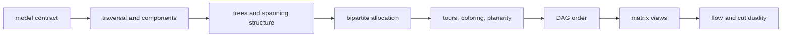
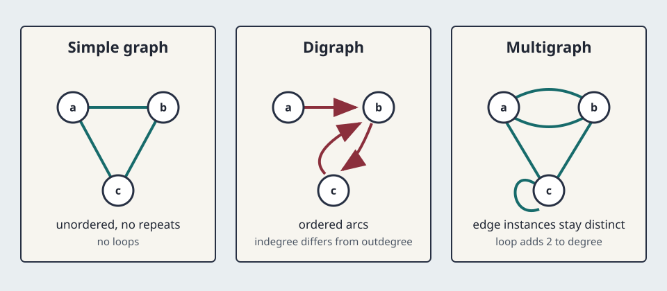
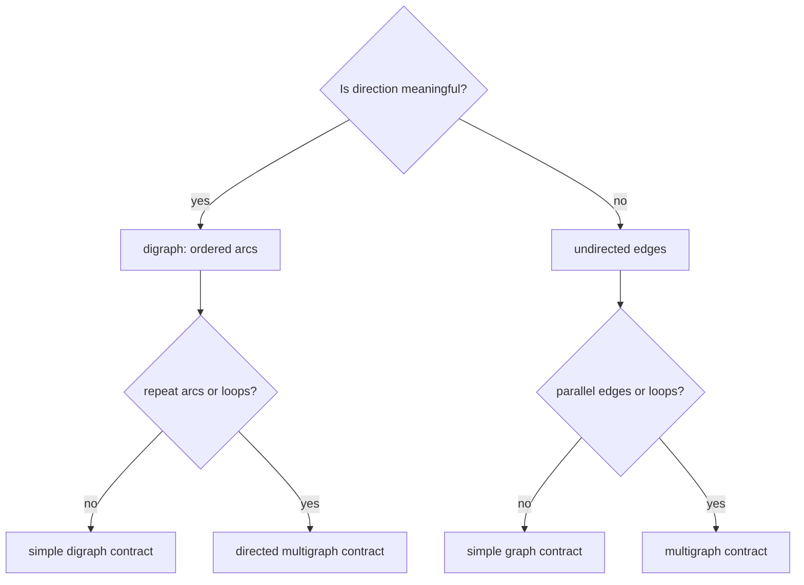
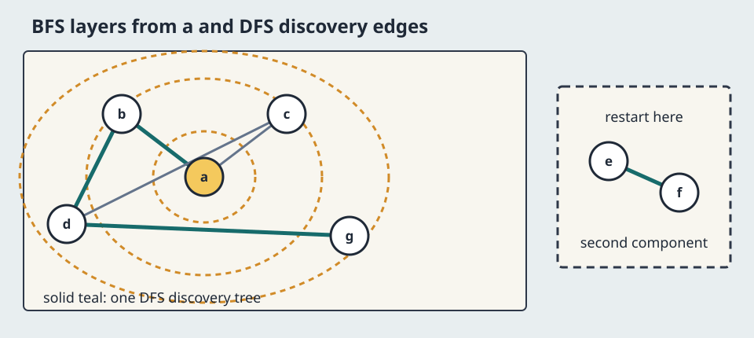
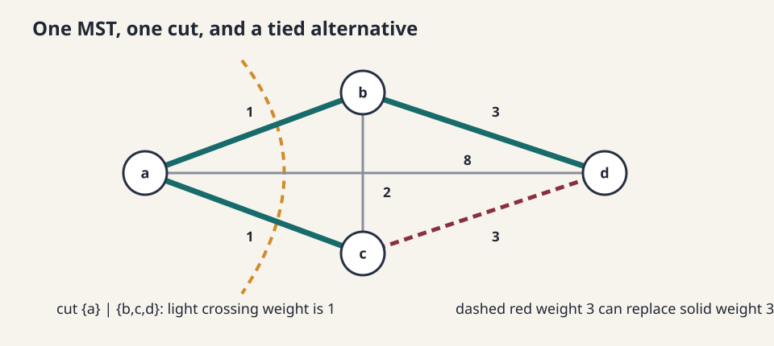
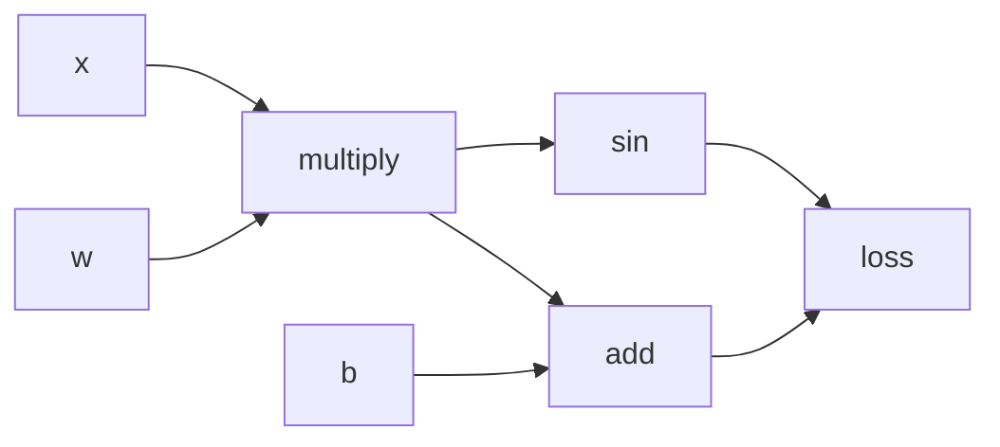
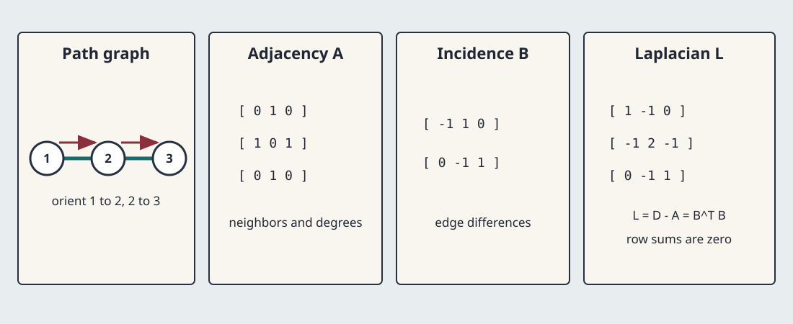
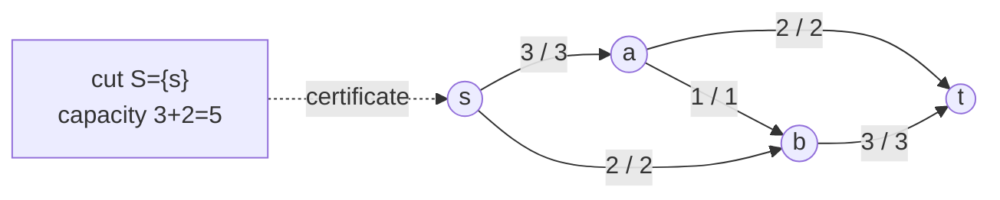

# 0.11 Graph Theory

[Section home](../README.md) | Previous: [§0.10 Inequalities](../00.10-inequalities/README.md) | Next: [§0.12 Elementary Number Theory](../00.12-elementary-number-theory/README.md) | [Project guides](../../STYLE_GUIDE.md) | [Notation guide](../../NOTATION.md)

## Why this matters

A graph keeps objects and relationships while discarding geometry that does not
matter. A road map, dependency system, matching market, electrical network, and
computation trace can all become vertices joined by edges. Once the model is
fixed, the same small collection of ideas answers different questions:

- Which objects can reach one another?
- Which connections are redundant?
- Can every task receive an acceptable resource?
- Can dependencies be evaluated in a legal order?
- How much material can a network carry?

That phrase "once the model is fixed" carries the lesson. A simple graph, a
digraph, and a multigraph are different objects. A theorem about one does not
automatically transfer to another. Levin's open text develops the simple
undirected theory, including degree, trees, planarity, tours, coloring, and
Hall's theorem, in directly inspectable HTML [1]. We will use that theory as a
base, then state every extension separately.



> **Figure 1. The module spine.** Each stage adds a question while preserving
> the graph model's assumptions. Original diagram.



> **Figure 2. A drawing is not yet a model contract.** Arrowheads encode
> direction, doubled curves encode parallel edges, and a loop is incident twice
> to its endpoint for undirected degree. Original figure.

### Scope and non-goals

This module covers the roadmap's finite graph-theory foundation:

- graphs, digraphs, and multigraphs;
- degree, walks, paths, cycles, connectivity, and components;
- trees, spanning trees, and minimum spanning trees (MSTs);
- bipartite matchings, Hall's theorem, and stable matching;
- vertex coloring, Euler tours, Hamiltonian cycles, and elementary planarity;
- directed acyclic graphs (DAGs) and topological ordering;
- adjacency, incidence, and Laplacian matrix views;
- finite capacitated flows and max-flow min-cut;
- one clear standard-library implementation per algorithm family.

This module does **not** absorb:

- full data-structure engineering or complexity analysis from §0.14;
- computability, NP-completeness proofs, or approximation complexity from §0.15;
- weighted shortest paths;
- linear-algebra proofs and the four fundamental subspaces from §2;
- spectral graph theory, graph neural networks, or §10.17;
- advanced planarity algorithms, graph minors, embeddings on other surfaces, or
  the proof of the four-color theorem;
- minimum-cost flow, circulation with demands, or infinite networks.

## Learning objectives

After completing this module, you should be able to:

- declare a graph model and translate correctly among edge lists, adjacency
  lists, and finite matrices;
- prove degree, connectivity, tree, topological-order, planar, and flow claims
  with their assumptions visible;
- distinguish matching existence, maximum cardinality, and preference stability;
- select and hand-trace BFS, DFS, Kruskal, deferred acceptance, topological sort,
  and Edmonds-Karp on small inputs;
- interpret incidence and Laplacian identities without making spectral claims;
- diagnose when a familiar theorem fails because direction, multiplicity,
  connectedness, ties, or conservation has changed.

The [exercise set](exercises/README.md) assesses every objective. Full [worked
solutions](solutions/README.md), tested [standard-library code](code/README.md),
and annotated [resources](resources/README.md) are separate.

## Prerequisite check

Required: [§0.04 Sets, Relations, and Functions](../00.04-sets-relations-functions/README.md)
and [§0.06 Proof Techniques](../00.06-proof-techniques/README.md).

Try these before starting:

1. Can you distinguish an ordered pair from a two-element set?
2. Can you read a relation as a subset of a Cartesian product?
3. Can you prove an if-and-only-if statement in both directions?
4. Can you use induction or a minimal-counterexample argument?
5. Can you explain why one counterexample refutes a universal claim?
6. Can you read a finite sum and multiply small matrices by hand?

Review §0.04 for relations and functions, and §0.06 for proof contracts.
[§0.07](../00.07-induction-recursion-invariants/README.md) and
[§0.08](../00.08-counting-combinatorics/README.md) are useful but not blocking.

## Historical context

The Seven Bridges of Königsberg problem asked for a route using each bridge
exactly once. Euler's abstraction retained land masses and bridges while
discarding distances and shapes. The open treatment by Levin uses the same
problem to distinguish a graph drawing from the underlying multigraph [1].

Stable matching arose from a different allocation question. Gale and Shapley's
1962 paper, "College Admissions and the Stability of Marriage," introduced the
deferred-acceptance formulation and proved the existence of stable outcomes for
its finite preference model [2]. The names reflect the paper's historical
language. The mathematics applies to two-sided preference allocation much more
broadly.

## Intuition

### Model first, theorem second

Use this checklist before computing anything:

| Question | Choices that change the mathematics |
|---|---|
| Are relationships symmetric? | undirected edge or directed arc |
| Can the same endpoints be related more than once? | simple or parallel edges |
| Can an object relate to itself? | loops forbidden or allowed |
| Do edges carry labels? | weight, capacity, preference, or no label |
| What must be covered? | vertices, edges, one bipartition, or flow demand |
| Is the graph connected? | one object or several components |



> **Figure 3. Choose the object before choosing the theorem.** This diagram
> names common contracts; applications may add weights or capacities. Original
> diagram.

### Traversal creates evidence

Breadth-first search (BFS) expands in layers. Depth-first search (DFS) follows
one branch until it must backtrack. Both can identify the vertices reachable
from a start vertex. Restarting from an unvisited vertex reveals another
component. The traversal order depends on neighbor order, but the reached set
does not.



> **Figure 4. Traversal order and connectivity are different outputs.** BFS
> rings show distance in number of edges from $a$; the isolated component
> requires a restart. Line style, not color alone, marks discovery edges.
> Original figure.

### Three optimization questions that sound alike

- A **maximum matching** uses as many disjoint edges as possible.
- A **perfect matching** covers every vertex, or every vertex on the declared
  side in Hall's theorem.
- A **stable matching** has no mutually preferred blocking pair.

Maximum is about cardinality. Stable is about preferences. Neither word implies
the other without additional assumptions.

### Cuts turn global questions into boundaries

Removing one tree edge creates a cut. MST algorithms ask for a cheapest safe
edge crossing a cut. Flow duality asks how much capacity crosses a source-sink
cut. In both cases a global optimum can be certified at a boundary.

## Mathematics

### Local notation

| Symbol | Type | Meaning |
|---|---|---|
| $G=(V,E)$ | finite graph | vertices and undirected edges |
| $D=(V,A)$ | finite digraph | vertices and directed arcs |
| $n,m$ | nonnegative integers | $\lvert V\rvert$ and number of edge instances |
| $d(v)$ | nonnegative integer | undirected degree, counting a loop twice |
| $d^+(v),d^-(v)$ | nonnegative integers | outdegree and indegree |
| $N(S)$ | subset of opposite part | neighbors of a vertex subset $S$ |
| $w(e)$ | finite real | edge weight |
| $c(u,v)$ | nonnegative real | arc capacity |
| $f(u,v)$ | nonnegative real | flow on an original arc |
| $\mathbf{A}$ | $\mathbb{R}^{n\times n}$ | adjacency matrix |
| $\mathbf{B}$ | $\mathbb{R}^{m\times n}$ | oriented incidence matrix |
| $\mathbf{L}$ | $\mathbb{R}^{n\times n}$ | combinatorial Laplacian |

All graphs, preference sets, and networks in this module are finite.

### Graphs, digraphs, and multigraphs

A **simple undirected graph** is $G=(V,E)$ where $V$ is a finite set and

$$
E\subseteq\bigl\{\{u,v\}:u,v\in V,\ u\ne v\bigr\}.
$$

An edge is an unordered two-element set. Loops and parallel edges are excluded.

A **digraph** is $D=(V,A)$ with $A\subseteq V\times V$. An arc $(u,v)$ points
from $u$ to $v$. Whether loops are allowed must be stated. A directed
multigraph also distinguishes repeated arc instances.

An undirected **multigraph** has edge instances with endpoints in $V$.
Different instances may share endpoints, and our local multigraph convention
allows loops. Parallel edges remain distinct even when their endpoint sets are
equal.

For an undirected multigraph, degree counts incident edge ends. A non-loop edge
contributes one at each endpoint. A loop contributes two at its single endpoint.
For a digraph, a loop contributes one to both indegree and outdegree.

### Handshake identities

For every finite undirected multigraph under that loop convention,

$$
\sum_{v\in V}d(v)=2m.
$$

**Proof.** Count pairs consisting of an edge end and its incident vertex. Every
edge instance has two ends, including a loop. Counting by edges gives $2m$;
counting by vertices gives the degree sum.

For every finite digraph,

$$
\sum_{v\in V}d^+(v)=|A|=\sum_{v\in V}d^-(v).
$$

Each arc contributes one departure and one arrival. A consequence of the
undirected identity is that the number of odd-degree vertices is even.

### Walks, trails, paths, and cycles

In an undirected graph:

- a **walk** is a vertex sequence whose consecutive vertices are adjacent;
- a **trail** repeats no edge instance;
- a **path** repeats no vertex;
- a **cycle** is a closed path with no repeated vertex except its endpoints.

For a digraph, every step must follow arc direction. In a multigraph, a trail
must identify edge instances because parallel edges have the same endpoints.

Vertices $u,v$ are connected when a path joins them. This is an equivalence
relation in an undirected graph. Its equivalence classes are the **connected
components**. A digraph has distinct notions: weak connectivity ignores arc
direction, while strong connectivity requires directed paths both ways.

### BFS and DFS

An adjacency list maps each vertex to its neighbors. BFS uses a queue and visits
vertices by edge distance from a start. DFS uses recursion or a stack and
finishes one branch before another. On an undirected graph, either search from
$s$ returns exactly the component containing $s$.

This module emphasizes the invariant, not full complexity engineering:

- discovered vertices enter the worklist at most once;
- every removed worklist vertex is reachable from the start;
- every reachable undiscovered neighbor is eventually added.

Section §0.14 owns detailed representation and runtime analysis.

### Trees and spanning trees

A **tree** is a nonempty connected simple undirected graph with no cycle. A
**forest** is acyclic and may have several components. For a nonempty finite
simple graph $T$, these conditions are equivalent:

1. $T$ is a tree.
2. Every pair of vertices has exactly one path between them.
3. $T$ is connected and has $n-1$ edges.
4. $T$ is acyclic and has $n-1$ edges.
5. Removing any edge disconnects $T$.
6. Adding any missing edge creates exactly one cycle.

One proof route removes a leaf and uses induction. The connectedness assumption
in item 3 cannot be dropped: a triangle plus an isolated vertex has four
vertices and three edges but is not a tree.

A **spanning tree** of connected $G$ is a subgraph that contains every vertex
and is a tree. A disconnected graph has no spanning tree, though each component
has one and together they form a spanning forest.

### Minimum spanning trees

Let $G$ be a finite connected undirected graph with finite real edge weights.
An MST is a spanning tree minimizing

$$
w(T)=\sum_{e\in E(T)}w(e).
$$

Weights may be zero or negative. Parallel edges are meaningful; loops can never
belong to a tree. Princeton's treatment makes the connectedness and weight
assumptions explicit and notes that ties can produce several MSTs [3]. Every MST
has the same minimum total weight, but not necessarily the same edges.

**Cut property.** Partition $V$ into nonempty $S$ and $V\setminus S$. A
minimum-weight edge crossing that cut is safe: it belongs to some MST compatible
with the already chosen forest. If it is the unique lightest crossing edge, it
belongs to every MST.

**Kruskal's algorithm.** Sort edge instances by nondecreasing weight. Add an
edge exactly when it joins two current forest components. Stop after $n-1$
edges. Union-find records components. Our implementation preserves input order
among tied weights and returns one deterministic MST, not a claim of uniqueness.



> **Figure 5. Kruskal grows a forest through safe cut edges.** Two weight-2
> edges tie, so different edge sets can achieve the same total weight. Original
> figure.

### Bipartite graphs and matchings

A simple graph is **bipartite** when $V=X\mathbin{\dot\cup}Y$ and every edge
has one endpoint in each part. A finite simple graph is bipartite if and only if
it has no odd cycle. BFS can attempt a two-coloring and expose an odd-cycle
conflict.

A **matching** is a set of edges sharing no endpoints. It is maximal when no
edge can be added, maximum when its cardinality is largest, and perfect when it
covers every vertex. Maximal does not imply maximum.

For $S\subseteq X$, define

$$
N(S)\coloneqq\{y\in Y:\exists x\in S,\ \{x,y\}\in E\}.
$$

**Hall's theorem.** A finite bipartite graph has a matching that covers every
vertex of $X$ if and only if

$$
\forall S\subseteq X,\qquad |N(S)|\ge |S|.
$$

The quantifier includes $S=\varnothing$, singleton sets, $X$, and every subset
between. Checking only individual degrees or only $S=X$ is insufficient.

**Necessity proof.** If a matching covers $X$, the distinct partners of
vertices in $S$ all lie in $N(S)$. Therefore $N(S)$ contains at least $|S|$
vertices. Sufficiency is deeper; an augmenting-path or induction proof shows
that Hall's condition prevents every possible shortage. Levin states both
directions with the full subset quantifier [1].

### Stable matching

Let $P$ and $R$ be equally sized finite sets. Every participant has a complete,
strict ranking of the opposite set. A perfect matching is **stable** when there
is no unmatched pair $(p,r)$ such that $p$ prefers $r$ to its assigned partner
and $r$ prefers $p$ to its assigned partner. Such a pair is a blocking pair.

In proposer-side deferred acceptance:

1. each free proposer applies to the highest-ranked receiver not yet tried;
2. each receiver tentatively keeps the most preferred proposal seen and rejects
   the rest;
3. rejected proposers continue until nobody is free.

The process terminates because no ordered pair is proposed twice. It is stable:
if $(p,r)$ blocked the result, then $p$ must have proposed to $r$ before the
less-preferred final partner; $r$ rejected $p$ only while holding or later
receiving someone ranked higher, a contradiction. Under this exact contract the
result is proposer-optimal among stable matchings. Reversing the proposing side
can change the outcome.

Stable does not mean maximum weight, minimum regret, or maximum cardinality in a
general graph. Under complete equal-side preferences the algorithm happens to
return a perfect matching, so all outputs have cardinality $|P|$. Incomplete
lists, ties, quotas, or unequal sides require a revised model and theorem.

### Coloring and chromatic number

A proper vertex coloring is a function

$$
\kappa:V\to\{1,\ldots,k\}
$$

such that adjacent vertices receive different colors. The chromatic number
$\chi(G)$ is the least feasible $k$. Colors are labels, not physical pigments.

For nonempty simple graphs:

- $\chi(K_n)=n$;
- an edgeless graph has chromatic number $1$;
- a graph with at least one edge is bipartite exactly when $\chi(G)=2$;
- an even cycle has chromatic number $2$, and an odd cycle has $3$.

A displayed coloring proves an upper bound. A clique or odd-cycle argument can
prove a lower bound. Greedy coloring gives a coloring, not automatically the
chromatic number. Exact algorithmic complexity belongs to §0.15.

### Euler versus Hamilton

An **Euler tour** uses every edge instance exactly once and returns to its start.
For a finite connected undirected multigraph, an Euler tour exists if and only
if every vertex has even degree. More generally, an Euler trail, which may be
open or closed, exists if and only if exactly zero or two vertices have odd
degree. An open Euler trail with distinct endpoints exists exactly when those
two endpoints are the odd-degree vertices. For graphs with isolated vertices,
require all vertices of positive degree to lie in one component.

A **Hamiltonian cycle** visits every vertex exactly once before returning. It may
leave many graph edges unused. Euler asks to cover edges; Hamilton asks to cover
vertices. Degree parity completely characterizes the Euler case under its
connectedness contract. There is no analogous parity criterion for Hamiltonian
cycles. The two questions must not be substituted for one another [1].

### Planar graphs and Euler's formula

A graph is **planar** if it has some crossing-free drawing in the plane. A
particular drawing with crossings does not prove nonplanarity. A crossing-free
drawing partitions the plane into faces, including the unbounded exterior face.

For a finite connected planar graph with $n$ vertices, $m$ edges, and $f$ faces,

$$
n-m+f=2.
$$

For a planar graph with $c\ge1$ connected components, where the drawing has one
shared exterior face,

$$
n-m+f=1+c.
$$

To derive the adjustment, connect the $c$ components with $c-1$ new
noncrossing edges. The face count stays fixed and the connected formula gives
$n-(m+c-1)+f=2$.

Euler's formula is necessary for a planar embedding, not sufficient for
planarity. This module uses it to audit a given embedding and derive elementary
edge bounds. It does not teach planarity testing or forbidden-minor theory.

### DAGs and topological ordering

A DAG is a finite digraph with no directed cycle. A **topological order** is a
linear ordering of vertices in which every arc points from an earlier vertex to
a later one.

**Theorem.** A finite digraph is acyclic if and only if it has a topological
order.

**Proof.** If a topological order exists, a directed cycle would require its
last vertex to point to an earlier vertex, impossible. Conversely, every finite
DAG has a vertex of indegree zero. Otherwise, repeatedly follow an incoming arc;
finiteness would force a repeated vertex and hence a directed cycle. Remove an
indegree-zero vertex, order the remaining DAG inductively, and place the removed
vertex first.

Kahn's algorithm implements that proof by repeatedly removing indegree-zero
vertices. If fewer than $n$ vertices are removed, it refuses the cycle.

Automatic differentiation traces primitive operations and data dependencies as
a computation graph. JAX's official Autodidax tutorial explicitly constructs a
bipartite DAG of values and operation recipes, then converts it to program order
with a topological sort [4]. A forward pass follows dependency order. A reverse
pass processes the order backward so every downstream contribution is available
before an adjoint is propagated. Full autodiff belongs to §2.13.



> **Figure 6. A computation DAG permits several valid topological orders.**
> Dependencies constrain order; the drawing's left-to-right placement does not
> define the only legal schedule. Original diagram.

### Adjacency and incidence matrices

Fix an order $v_1,\ldots,v_n$. For a simple undirected graph, the adjacency
matrix has

$$
A_{ij}=\begin{cases}
1,&\{v_i,v_j\}\in E,\\
0,&\text{otherwise}.
\end{cases}
$$

It is symmetric with zero diagonal, and row sums are degrees. For a digraph we
use $A_{ij}=1$ when $v_i\to v_j$, so row sums are outdegrees and column sums are
indegrees. A multigraph adjacency matrix may store multiplicities instead of
bits. Its loop diagonal convention must be stated because degree recovery can
otherwise differ by a factor of two.

Orient each non-loop undirected edge arbitrarily and let
$\mathbf{B}\in\mathbb{R}^{m\times n}$ have one row per edge instance:

$$
B_{e,i}=\begin{cases}
-1,&v_i\text{ is the chosen tail of }e,\\
+1,&v_i\text{ is the chosen head of }e,\\
0,&\text{otherwise}.
\end{cases}
$$

Changing an edge orientation negates one row and changes no undirected fact.
Parallel edges create repeated rows up to orientation. A loop creates a zero
row under this signed convention, so signed incidence does not encode loop
degree. State that limitation instead of silently mixing conventions.

MIT 18.06 uses graphs, networks, and incidence matrices to connect graph
structure with linear algebra [5]. Here we stop at finite identities.

### The graph Laplacian as a preview

For a loopless simple undirected graph, let $\mathbf{D}$ be the diagonal degree
matrix. The combinatorial Laplacian is

$$
\mathbf{L}\coloneqq\mathbf{D}-\mathbf{A}=\mathbf{B}^{\top}\mathbf{B}.
$$

Consequently:

$$
\mathbf{L}^{\top}=\mathbf{L},\qquad
\mathbf{L}\boldsymbol{1}_n=\mathbf{0},
$$

and for every $\boldsymbol{x}\in\mathbb{R}^n$,

$$
\boldsymbol{x}^{\top}\mathbf{L}\boldsymbol{x}
=\lVert\mathbf{B}\boldsymbol{x}\rVert_2^2
=\sum_{\{u,v\}\in E}(x_u-x_v)^2\ge0.
$$

Thus $\mathbf{L}$ is symmetric positive semidefinite. Its nullspace consists of
vectors constant on each connected component, so its nullity equals the number
of components. These are finite previews. Eigenvalue methods, spectral
clustering, and graph neural networks belong later.



> **Figure 7. Three matrix views preserve different graph facts.** Adjacency
> records neighbors, incidence records oriented edge differences, and the
> Laplacian combines those differences without depending on orientation.
> Original figure.

### Network flows and cuts

A finite flow network is a digraph with distinct source $s$, sink $t$, and
capacity $c(u,v)\ge0$ on each arc. A feasible flow satisfies:

**Capacity:**

$$
0\le f(u,v)\le c(u,v).
$$

**Conservation:** for every $v\notin\{s,t\}$,

$$
\sum_{u:(u,v)\in A}f(u,v)
=\sum_{w:(v,w)\in A}f(v,w).
$$

The flow value is net flow leaving $s$, equal by conservation to net flow
entering $t$.

An $s$-$t$ cut is a partition $(S,T)$ with $s\in S$ and $t\in T$. Its
capacity counts only original arcs directed from $S$ to $T$:

$$
c(S,T)=\sum_{u\in S,\ v\in T}c(u,v).
$$

Every feasible flow has value at most every cut capacity. This is weak duality:
flow crossing forward cannot exceed forward capacity, while backward flow only
reduces net crossing.

**Max-flow min-cut theorem.** In every finite directed capacitated network, the
maximum feasible flow value equals the minimum $s$-$t$ cut capacity. Erickson's
open algorithms text provides dedicated chapters on maximum flows, minimum
cuts, and applications [6].

Ford-Fulkerson repeatedly augments along a positive-residual $s$-$t$ path.
Edmonds-Karp chooses that path by BFS [7]. When no augmenting path remains, the
vertices reachable from $s$ in the residual graph form $S$. Every original arc
from $S$ to $T$ is saturated and every reverse contribution is zero, so the
flow value equals the cut capacity. That equality certifies both optima.



> **Figure 8. Flow value and cut capacity meet at five.** Labels are
> flow/capacity. The cut certificate proves that no larger feasible flow exists.
> Original diagram.

## Derivation

### Components from traversal

Start a search at $s$. Every discovered vertex is reachable because it was
found across an edge from a reachable vertex. Conversely, take any path
$s=v_0,v_1,\ldots,v_k$. Induct on $i$: once $v_i$ is processed, $v_{i+1}$ is
already discovered or is added. Therefore every path-reachable vertex is found.
The discovered set is exactly one component.

### Tree edge count by leaf removal

The one-vertex tree has zero edges. Every finite tree with at least two vertices
has a leaf. Remove that leaf and its unique incident edge. The remaining graph
is a tree with $n-1$ vertices, so by induction it has $n-2$ edges. Restoring the
leaf gives $n-1$ edges.

### Kruskal exchange argument

Suppose Kruskal selects edge $e$ between two current components. Let $T$ be an
MST consistent with earlier selections. If $e\in T$, continue. Otherwise add
$e$ to $T$, creating one cycle. That cycle contains another edge $g$ crossing
the same component cut. Kruskal's order gives $w(e)\le w(g)$. Replacing $g$
by $e$ yields a spanning tree no heavier than $T$, hence another MST consistent
with the new selection.

### Laplacian energy

Row $e=(u,v)$ of $\mathbf{B}$ turns $\boldsymbol{x}$ into $x_v-x_u$.
Therefore

$$
\lVert\mathbf{B}\boldsymbol{x}\rVert_2^2
=\sum_{e=(u,v)}(x_v-x_u)^2.
$$

Since $\lVert\mathbf{B}\boldsymbol{x}\rVert_2^2
=\boldsymbol{x}^{\top}\mathbf{B}^{\top}\mathbf{B}\boldsymbol{x}$,
the identity $\mathbf{L}=\mathbf{B}^{\top}\mathbf{B}$ explains positive
semidefiniteness without using spectral theory.

### Flow-cut weak duality

Sum conservation over internal vertices in $S$. Internal arc contributions
cancel. Net flow leaving $S$ equals the flow value:

$$
|f|=\sum_{u\in S,v\in T}f(u,v)-
\sum_{u\in T,v\in S}f(u,v)
\le\sum_{u\in S,v\in T}c(u,v)=c(S,T).
$$

This inequality explains why a cut is a certificate. The augmenting-path
argument supplies a feasible flow and a cut where equality holds.

## Implementation

The tested implementation lives in [`code/graph_tools.py`](code/graph_tools.py).
It provides graph validation, BFS, DFS, topological sorting with cycle refusal,
Kruskal with union-find, proposer-side deferred acceptance, and Edmonds-Karp.
Python's `deque` supports efficient append and pop operations at both ends and
serves as the FIFO queue in BFS [8].

### Validate the graph model

```python
from graph_tools import undirected_adjacency

multi = undirected_adjacency(
    ("a", "b"),
    (("a", "a"), ("a", "b"), ("a", "b")),
    allow_loops=True,
    allow_parallel=True,
)
assert tuple(map(len, multi.values())) == (4, 2)
assert sum(map(len, multi.values())) == 2 * 3
```

The loop appears twice in `multi["a"]`, so adjacency length equals degree.

### Traverse a component

```python
from graph_tools import breadth_first_order, depth_first_order

graph = {"a": ("b", "c"), "b": ("d",), "c": (), "d": (), "x": ()}
assert breadth_first_order(graph, "a") == ("a", "b", "c", "d")
assert depth_first_order(graph, "a") == ("a", "b", "d", "c")
assert breadth_first_order(graph, "x") == ("x",)
```

### Refuse a cyclic dependency graph

```python
from graph_tools import topological_order

order = topological_order(
    ("x", "w", "multiply", "loss"),
    (("x", "multiply"), ("w", "multiply"), ("multiply", "loss")),
)
position = {vertex: index for index, vertex in enumerate(order)}
assert position["x"] < position["multiply"] < position["loss"]

try:
    topological_order((1, 2, 3), ((1, 2), (2, 3), (3, 1)))
except ValueError:
    pass
else:
    raise AssertionError("a directed cycle must be refused")
```

### Build one MST under ties

```python
from graph_tools import kruskal_mst

tree = kruskal_mst(
    ("a", "b", "c", "d"),
    (("a", "b", 1), ("a", "c", 1), ("b", "c", 2),
     ("b", "d", 3), ("c", "d", 3)),
)
assert len(tree) == 3
assert sum(weight for _, _, weight in tree) == 5
```

### Separate stability from cardinality

```python
from graph_tools import stable_matching

matching = stable_matching(
    {"a": ("x", "y"), "b": ("y", "x")},
    {"x": ("b", "a"), "y": ("a", "b")},
)
assert matching == {"a": "x", "b": "y"}
```

This checks one complete strict preference instance. It does not solve maximum
bipartite matching.

### Return a flow and a cut certificate

```python
from graph_tools import edmonds_karp

result = edmonds_karp(
    {("s", "a"): 3, ("s", "b"): 2, ("a", "b"): 1,
     ("a", "t"): 2, ("b", "t"): 3},
    "s",
    "t",
)
assert result.value == 5
assert result.source_side == frozenset({"s"})
assert sum((3 if edge == ("s", "a") else 2)
           for edge in (("s", "a"), ("s", "b"))) == result.value
```

The implementation refuses antiparallel original arcs to keep residual-flow
reconstruction visible. The theorem itself permits them when the representation
distinguishes original arcs from residual reverse arcs.

## Experimentation

### Experiment 1: representation audit

Encode the same simple graph as an edge list, adjacency list, and adjacency
matrix. Verify degree sums and reachable sets. Then add a parallel edge and a
loop. Record exactly which representations need a changed contract.

### Experiment 2: traversal order

Permute neighbor order while keeping the graph fixed. BFS and DFS orders may
change; the reached component must not. This separates an algorithm's
deterministic presentation choice from its mathematical output.

### Experiment 3: tied MSTs

Enumerate all three-edge subsets of a small four-vertex weighted graph. Keep the
spanning trees and compare weights. Confirm that Kruskal returns one minimum tree
while another edge set can have the same weight.

### Experiment 4: residual certificates

For a small integral network, record each Edmonds-Karp augmentation. At the end,
sum flow out of $s$, capacity into the final unreachable side, and conservation
at each internal vertex. All three audits should agree where required.

## Worked examples

### Worked example 1: loop-aware handshake

Take vertices $a,b$ with one loop at $a$ and two parallel $a$-$b$ edges. Then
$d(a)=4$, $d(b)=2$, and the degree sum $6$ equals twice the three edge
instances.

### Worked example 2: directed degrees

For arcs $a\to b$, $a\to c$, $c\to a$, the outdegrees are $(2,0,1)$ and the
indegrees are $(1,1,1)$. Both sums equal three.

### Worked example 3: one component

If BFS from $a$ reaches $a,b,c,d$ but not $x$, then no path from $a$ to $x$
exists in that graph. Restarting at $x$ identifies another component.

### Worked example 4: edge count does not certify a tree

A triangle plus an isolated vertex has $n=4$ and $m=3=n-1$. It is disconnected
and cyclic. The equation needs connectedness or acyclicity as a companion
assumption.

### Worked example 5: negative MST weights

Kruskal needs only weight order. A negative edge is considered early and is
accepted if it joins components. Positivity is not part of the MST contract.

### Worked example 6: Hall shortage

If $S=\{x_1,x_2,x_3\}$ has only $N(S)=\{y_1,y_2\}$, no matching can cover
$S$. Three distinct vertices cannot receive distinct partners from two choices.

### Worked example 7: blocking pair

Suppose $p$ is assigned to $r_2$ and $r$ to $p_2$. If $p$ ranks $r$ above
$r_2$ and $r$ ranks $p$ above $p_2$, then $(p,r)$ blocks the matching. A
perfect matching can therefore be unstable.

### Worked example 8: coloring bounds

A triangle requires at least three colors because its three vertices are
pairwise adjacent. Displaying three different colors proves at most three, so
$\chi(K_3)=3$.

### Worked example 9: Euler but not Hamilton

Two triangles sharing one vertex have all degrees even and are connected, so an
Euler tour exists. Any Hamiltonian cycle would have to enter and leave both
triangles through the shared cut vertex, repeating it, so none exists.

### Worked example 10: component-adjusted Euler formula

Two disjoint triangles have $n=6$, $m=6$, and $f=3$: two bounded interiors and
one shared exterior. Thus $n-m+f=3=1+c$ with $c=2$.

### Worked example 11: topological non-uniqueness

If both $x$ and $w$ point to `multiply`, either input may appear first. Both
`x,w,multiply` and `w,x,multiply` respect the arcs.

### Worked example 12: Laplacian energy

For one edge $1$-$2$ and $\boldsymbol{x}=(3,8)^{\top}$, the quadratic form is
$(8-3)^2=25$. It is zero exactly when the endpoint values agree.

### Worked example 13: flow bottleneck

If all $s$-$t$ routes cross a cut of capacity $7$, no feasible flow can exceed
$7$. Finding a feasible flow of value $7$ proves both maximum flow and minimum
cut at once.

## Common mistakes

### Treating a drawing as the graph

Vertex positions, edge lengths, and crossings are not graph data unless the
model explicitly includes them.

### Applying simple-graph degree to a multigraph

Parallel edges count separately and an undirected loop contributes two.

### Saying connected without naming the directed notion

Weak and strong connectivity differ in digraphs.

### Confusing a traversal order with the only order

Neighbor order can change BFS, DFS, and topological outputs without changing
reachability or validity.

### Calling every $n-1$ edge graph a tree

Add connectedness or acyclicity.

### Claiming a unique MST under ties

Tied weights may produce several MST edge sets with one common optimum weight.

### Checking Hall only on singletons

The theorem quantifies over every subset of the chosen side.

### Calling stable matching maximum matching

Stability forbids blocking pairs. Maximum matching optimizes cardinality.

### Using Euler criteria for Hamiltonian cycles

Euler covers edges; Hamilton covers vertices.

### Counting faces in a crossing drawing

Euler's formula uses a planar embedding and includes the exterior face.

### Reporting $n-m+f=2$ for disconnected planar graphs

Use $n-m+f=1+c$.

### Orienting incidence without stating the convention

Transposing $\mathbf{B}$ changes dimensions, and signed loop rows vanish.

### Forgetting flow conservation

Capacity constraints alone allow internal vertices to create or destroy flow.

### Treating tests as universal proofs

Finite tests validate code and examples. The theorem contracts require proofs.

## Exercises

The [exercise set](exercises/README.md) contains 12 progressive problems from
model validation through flow-cut certification. Exact mirrored [worked
solutions](solutions/README.md) are committed separately. The final exercises
integrate proof, representation, and implementation audits without requiring
third-party software.

## What you should now be able to do

You should now be able to:

- specify direction, loops, multiplicity, labels, and connectedness before using
  a graph theorem;
- prove the handshake identity and the central tree and DAG equivalences;
- find components, one MST, and one stable matching on small inputs;
- state Hall's full quantified contract;
- distinguish vertex coverage, edge coverage, proper coloring, and flow value;
- adjust Euler's planar formula for components;
- translate a loopless undirected graph into adjacency, incidence, and Laplacian
  views with dimensions and orientation stated;
- verify capacity, conservation, and a cut certificate for a finite maximum flow.

## Where this leads

Section §0.14 revisits traversal, union-find, heaps, shortest paths, and runtime
engineering. Section §0.15 owns graph problem complexity. Linear algebra in §2
develops nullspaces, positive semidefiniteness, and matrix factorizations.
Automatic differentiation in §2.13 turns DAG order into forward and reverse
derivative propagation. Later modules use graphs for computation, graphical
models, search, planning, neural architectures, and networks.

[§0.12 Elementary Number Theory](../00.12-elementary-number-theory/README.md)
continues with divisibility, modular arithmetic, finite fields, and the theorem
chain behind textbook RSA correctness.

## References

[1] O. Levin, *Discrete Mathematics: An Open Introduction*, 4th ed., 2025,
Chapter 2, "Graph Theory," especially §§2.1-2.5 and §2.7. License: CC
BY-NC-SA 4.0. https://discrete.openmathbooks.org/dmoi4/ch_graphtheory.html
Accessed 2026-09-01.

[2] D. Gale and L. S. Shapley, "College Admissions and the Stability of
Marriage," *The American Mathematical Monthly*, vol. 69, no. 1, pp. 9-15,
1962. https://doi.org/10.1080/00029890.1962.11989827

[3] R. Sedgewick and K. Wayne, "4.3 Minimum Spanning Trees," *Algorithms, 4th
Edition* booksite, Princeton University. Copyright retained by the authors.
https://algs4.cs.princeton.edu/43mst/ Accessed 2026-09-01.

[4] JAX authors, "Autodidax: JAX core from scratch," JAX documentation,
sections on partial evaluation, the tracer-recipe DAG, and topological sorting.
Apache 2.0 project documentation. https://docs.jax.dev/en/latest/autodidax.html
Accessed 2026-09-01.

[5] G. Strang, "Lecture 12: Graphs, networks, incidence matrices," MIT 18.06
Linear Algebra, Spring 2010 course page; lecture recorded Fall 1999. MIT
OpenCourseWare, CC BY-NC-SA 4.0.
https://ocw.mit.edu/courses/18-06-linear-algebra-spring-2010/resources/lecture-12-graphs-networks-incidence-matrices/
Accessed 2026-09-01.

[6] J. Erickson, *Algorithms*, 1st ed., 2019, Chapters 5-7 and 10-11.
License: CC BY 4.0. https://jeffe.cs.illinois.edu/teaching/algorithms/
Accessed 2026-09-01.

[7] R. Sedgewick and K. Wayne, "6.4 Maximum Flow," *Algorithms, 4th Edition*
booksite, Princeton University. The page identifies Edmonds-Karp as the
shortest-augmenting-path implementation and returns a minimum cut. Copyright
retained by the authors. https://algs4.cs.princeton.edu/64maxflow/ Accessed
2026-09-01.

[8] Python Software Foundation, "`collections` and `heapq` standard-library
documentation," Python 3.14. PSF License Version 2; documentation examples are
additionally 0BSD. https://docs.python.org/3/library/collections.html and
https://docs.python.org/3/library/heapq.html Accessed 2026-09-01.

[Section home](../README.md) | Previous: [§0.10 Inequalities](../00.10-inequalities/README.md) | Next: [§0.12 Elementary Number Theory](../00.12-elementary-number-theory/README.md) | [Exercises](exercises/README.md) | [Worked solutions](solutions/README.md) | [Resources](resources/README.md) | [Code](code/README.md)