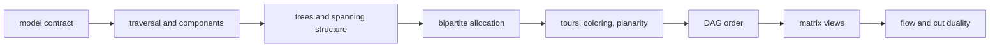
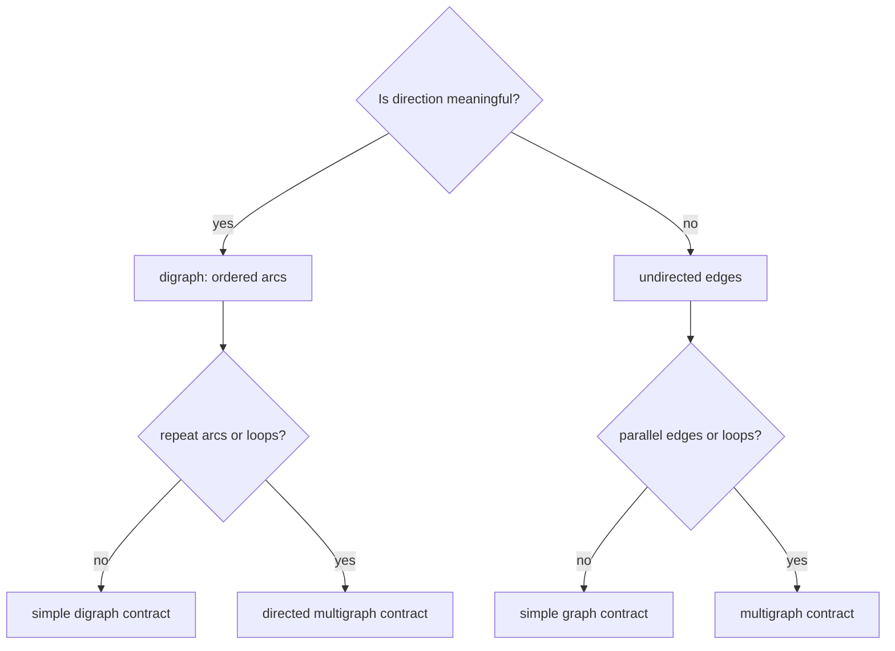
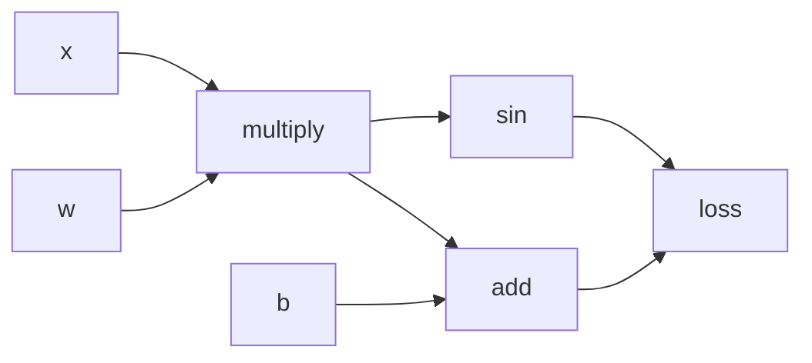
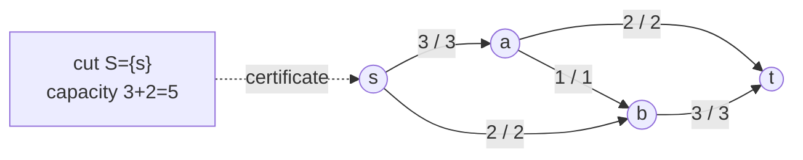

# 0.11 Graph Theory

[Section home](../README.md) | Previous: [§0.10 Inequalities](../00.10-inequalities/README.md) | Next: [§0.12 Elementary Number Theory](../00.12-elementary-number-theory/README.md) | [Module guide](../../CONTRIBUTING.md#module-file-structure) | [Notation guide](../../NOTATION.md)

Learn to fix a finite graph model before proving structural claims or choosing an algorithm. Work from degree, traversal, and trees through matching, coloring, tours, planarity, DAGs, matrix views, and flow-cut certificates, with explicit limits on each representation and implementation.

Background: [§0.04 Sets, Relations, and Functions](../00.04-sets-relations-functions/README.md)
and [§0.06 Proof Techniques](../00.06-proof-techniques/README.md).

Review §0.04 for relations and functions, and §0.06 for proof contracts.
[§0.07](../00.07-induction-recursion-invariants/README.md) and
[§0.08](../00.08-counting-combinatorics/README.md) are useful but not blocking.

**Contents:** [Graphs as models](#graphs-as-models) · [Finite graph structures and contracts](#finite-graph-structures-and-contracts) · [Traversal, tree, matching, and flow proofs](#traversal-tree-matching-and-flow-proofs) · [Implementation](#implementation) · [Worked examples](#worked-examples) · [Practice](#practice) · [References](#references)

## Graphs as models

A graph keeps objects and relationships while discarding geometry that does not
matter. A road map, dependency system, matching market, electrical network, and
computation trace can all become vertices joined by edges. Once the model is
fixed, the same small collection of ideas answers different questions:

- Which objects can reach one another?
- Which connections are redundant?
- Can every task receive an acceptable resource?
- Can dependencies be evaluated in a legal order?
- How much material can a network carry?

That phrase "once the model is fixed" carries the lesson. A simple graph, a
digraph, and a multigraph are different objects. A theorem about one does not
automatically transfer to another. Levin's open text develops the simple
undirected theory, including degree, trees, planarity, tours, coloring, and
Hall's theorem, in directly inspectable HTML [1]. We will use that theory as a
base, then state every extension separately.



> **Figure 1. The module spine.** Each stage adds a question while preserving
> the graph model's assumptions. Original diagram.


> **Figure 2. A drawing is not yet a model contract.** Arrowheads encode
> direction, doubled curves encode parallel edges, and a loop is incident twice
> to its endpoint for undirected degree. Original figure.

### Scope and non-goals

This module does **not** absorb:

- full data-structure engineering or complexity analysis from §0.14;
- computability, NP-completeness proofs, or approximation complexity from §0.15;
- weighted shortest paths;
- linear-algebra proofs and the four fundamental subspaces from §2;
- spectral graph theory, graph neural networks, or §10.17;
- advanced planarity algorithms, graph minors, embeddings on other surfaces, or
  the proof of the four-color theorem;
- minimum-cost flow, circulation with demands, or infinite networks.


## Historical context

The Seven Bridges of Königsberg problem asked for a route using each bridge
exactly once. Euler's abstraction retained land masses and bridges while
discarding distances and shapes. The open treatment by Levin uses the same
problem to distinguish a graph drawing from the underlying multigraph [1].

Stable matching arose from a different allocation question. Gale and Shapley's
1962 paper, "College Admissions and the Stability of Marriage," introduced the
deferred-acceptance formulation and proved the existence of stable outcomes for
its finite preference model [2]. The names reflect the paper's historical
language. The mathematics applies to two-sided preference allocation much more
broadly.

## From graph models to certificates

### Model first, theorem second

Use this checklist before computing anything:

| Question | Choices that change the mathematics |
|---|---|
| Are relationships symmetric? | undirected edge or directed arc |
| Can the same endpoints be related more than once? | simple or parallel edges |
| Can an object relate to itself? | loops forbidden or allowed |
| Do edges carry labels? | weight, capacity, preference, or no label |
| What must be covered? | vertices, edges, one bipartition, or flow demand |
| Is the graph connected? | one object or several components |



> **Figure 3. Choose the object before choosing the theorem.** This diagram
> names common contracts; applications may add weights or capacities. Original
> diagram.

### Traversal creates evidence

Breadth-first search (BFS) expands in layers. Depth-first search (DFS) follows
one branch until it must backtrack. Both can identify the vertices reachable
from a start vertex. Restarting from an unvisited vertex reveals another
component. The traversal order depends on neighbor order, but the reached set
does not.


> **Figure 4. Traversal order and connectivity are different outputs.** BFS
> rings show distance in number of edges from $`a`$; the isolated component
> requires a restart. Line style, not color alone, marks discovery edges.
> Original figure.

### Three optimization questions that sound alike

- A **maximum matching** uses as many disjoint edges as possible.
- A **perfect matching** covers every vertex, or every vertex on the declared
  side in Hall's theorem.
- A **stable matching** has no mutually preferred blocking pair.

Maximum is about cardinality. Stable is about preferences. Neither word implies
the other without additional assumptions.

### Cuts turn global questions into boundaries

Removing one tree edge creates a cut. MST algorithms ask for a cheapest safe
edge crossing a cut. Flow duality asks how much capacity crosses a source-sink
cut. In both cases a global optimum can be certified at a boundary.

## Finite graph structures and contracts

### Local notation

| Symbol | Type | Meaning |
|---|---|---|
| $`G=(V,E)`$ | finite graph | vertices and undirected edges |
| $`D=(V,A)`$ | finite digraph | vertices and directed arcs |
| $`n,m`$ | nonnegative integers | $`\lvert V\rvert`$ and number of edge instances |
| $`d(v)`$ | nonnegative integer | undirected degree, counting a loop twice |
| $`d^+(v),d^-(v)`$ | nonnegative integers | outdegree and indegree |
| $`N(S)`$ | subset of opposite part | neighbors of a vertex subset $`S`$ |
| $`w(e)`$ | finite real | edge weight |
| $`c(u,v)`$ | nonnegative real | arc capacity |
| $`f(u,v)`$ | nonnegative real | flow on an original arc |
| $`\mathbf{A}`$ | $`\mathbb{R}^{n\times n}`$ | adjacency matrix |
| $`\mathbf{B}`$ | $`\mathbb{R}^{m\times n}`$ | oriented incidence matrix |
| $`\mathbf{L}`$ | $`\mathbb{R}^{n\times n}`$ | combinatorial Laplacian |

All graphs, preference sets, and networks in this module are finite.

### Graphs, digraphs, and multigraphs

A **simple undirected graph** is $`G=(V,E)`$ where $`V`$ is a finite set and

$$
E\subseteq\bigl\lbrace \lbrace u,v\rbrace:u,v\in V,\ u\ne v\bigr\rbrace.
$$

An edge is an unordered two-element set. Loops and parallel edges are excluded.

A **digraph** is $`D=(V,A)`$ with $`A\subseteq V\times V`$. An arc $`(u,v)`$ points
from $`u`$ to $`v`$. Whether loops are allowed must be stated. A directed
multigraph also distinguishes repeated arc instances.

An undirected **multigraph** has edge instances with endpoints in $`V`$.
Different instances may share endpoints, and our local multigraph convention
allows loops. Parallel edges remain distinct even when their endpoint sets are
equal.

For an undirected multigraph, degree counts incident edge ends. A non-loop edge
contributes one at each endpoint. A loop contributes two at its single endpoint.
For a digraph, a loop contributes one to both indegree and outdegree.

### Handshake identities

For every finite undirected multigraph under that loop convention,

$$
\sum_{v\in V}d(v)=2m.
$$

**Proof.** Count pairs consisting of an edge end and its incident vertex. Every
edge instance has two ends, including a loop. Counting by edges gives $`2m`$;
counting by vertices gives the degree sum.

For every finite digraph,

$$
\sum_{v\in V}d^+(v)=|A|=\sum_{v\in V}d^-(v).
$$

Each arc contributes one departure and one arrival. A consequence of the
undirected identity is that the number of odd-degree vertices is even.

### Walks, trails, paths, and cycles

In an undirected graph:

- a **walk** is a vertex sequence whose consecutive vertices are adjacent;
- a **trail** repeats no edge instance;
- a **path** repeats no vertex;
- a **cycle** is a closed path with no repeated vertex except its endpoints.

For a digraph, every step must follow arc direction. In a multigraph, a trail
must identify edge instances because parallel edges have the same endpoints.

Vertices $`u,v`$ are connected when a path joins them. This is an equivalence
relation in an undirected graph. Its equivalence classes are the **connected
components**. A digraph has distinct notions: weak connectivity ignores arc
direction, while strong connectivity requires directed paths both ways.

### BFS and DFS

An adjacency list maps each vertex to its neighbors. BFS uses a queue and visits
vertices by edge distance from a start. DFS uses recursion or a stack and
finishes one branch before another. On an undirected graph, either search from
$`s`$ returns exactly the component containing $`s`$.

This module emphasizes the invariant, not full complexity engineering:

- discovered vertices enter the worklist at most once;
- every removed worklist vertex is reachable from the start;
- every reachable undiscovered neighbor is eventually added.

Section §0.14 owns detailed representation and runtime analysis.

### Trees and spanning trees

A **tree** is a nonempty connected simple undirected graph with no cycle. A
**forest** is acyclic and may have several components. For a nonempty finite
simple graph $`T`$, these conditions are equivalent:

1. $`T`$ is a tree.
2. Every pair of vertices has exactly one path between them.
3. $`T`$ is connected and has $`n-1`$ edges.
4. $`T`$ is acyclic and has $`n-1`$ edges.
5. Removing any edge disconnects $`T`$.
6. Adding any missing edge creates exactly one cycle.

One proof route removes a leaf and uses induction. The connectedness assumption
in item 3 cannot be dropped: a triangle plus an isolated vertex has four
vertices and three edges but is not a tree.

A **spanning tree** of connected $`G`$ is a subgraph that contains every vertex
and is a tree. A disconnected graph has no spanning tree, though each component
has one and together they form a spanning forest.

### Minimum spanning trees

Let $`G`$ be a finite connected undirected graph with finite real edge weights.
An MST is a spanning tree minimizing

$$
w(T)=\sum_{e\in E(T)}w(e).
$$

Weights may be zero or negative. Parallel edges are meaningful; loops can never
belong to a tree. Princeton's treatment makes the connectedness and weight
assumptions explicit and notes that ties can produce several MSTs [3]. Every MST
has the same minimum total weight, but not necessarily the same edges.

**Cut property.** Partition $`V`$ into nonempty $`S`$ and $`V\setminus S`$. A
minimum-weight edge crossing that cut is safe: it belongs to some MST compatible
with the already chosen forest. If it is the unique lightest crossing edge, it
belongs to every MST.

**Kruskal's algorithm.** Sort edge instances by nondecreasing weight. Add an
edge exactly when it joins two current forest components. Stop after $`n-1`$
edges. Union-find records components. Our implementation preserves input order
among tied weights and returns one deterministic MST, not a claim of uniqueness.


> **Figure 5. Kruskal grows a forest through safe cut edges.** Two weight-2
> edges tie, so different edge sets can achieve the same total weight. Original
> figure.

### Bipartite graphs and matchings

A simple graph is **bipartite** when $`V=X\mathbin{\dot\cup}Y`$ and every edge
has one endpoint in each part. A finite simple graph is bipartite if and only if
it has no odd cycle. BFS can attempt a two-coloring and expose an odd-cycle
conflict.

A **matching** is a set of edges sharing no endpoints. It is maximal when no
edge can be added, maximum when its cardinality is largest, and perfect when it
covers every vertex. Maximal does not imply maximum.

For $`S\subseteq X`$, define

$$
N(S)\coloneqq\lbrace y\in Y:\exists x\in S,\ \lbrace x,y\rbrace\in E\rbrace.
$$

**Hall's theorem.** A finite bipartite graph has a matching that covers every
vertex of $`X`$ if and only if

$$
\forall S\subseteq X,\qquad |N(S)|\ge |S|.
$$

The quantifier includes $`S=\varnothing`$, singleton sets, $`X`$, and every subset
between. Checking only individual degrees or only $`S=X`$ is insufficient.

**Necessity proof.** If a matching covers $`X`$, the distinct partners of
vertices in $`S`$ all lie in $`N(S)`$. Therefore $`N(S)`$ contains at least $`|S|`$
vertices. Sufficiency is deeper; an augmenting-path or induction proof shows
that Hall's condition prevents every possible shortage. Levin states both
directions with the full subset quantifier [1].

### Stable matching

Let $`P`$ and $`R`$ be equally sized finite sets. Every participant has a complete,
strict ranking of the opposite set. A perfect matching is **stable** when there
is no unmatched pair $`(p,r)`$ such that $`p`$ prefers $`r`$ to its assigned partner
and $`r`$ prefers $`p`$ to its assigned partner. Such a pair is a blocking pair.

In proposer-side deferred acceptance:

1. each free proposer applies to the highest-ranked receiver not yet tried;
2. each receiver tentatively keeps the most preferred proposal seen and rejects
   the rest;
3. rejected proposers continue until nobody is free.

The process terminates because no ordered pair is proposed twice. It is stable:
if $`(p,r)`$ blocked the result, then $`p`$ must have proposed to $`r`$ before the
less-preferred final partner; $`r`$ rejected $`p`$ only while holding or later
receiving someone ranked higher, a contradiction. Under this exact contract the
result is proposer-optimal among stable matchings. Reversing the proposing side
can change the outcome.

Stable does not mean maximum weight, minimum regret, or maximum cardinality in a
general graph. Under complete equal-side preferences the algorithm happens to
return a perfect matching, so all outputs have cardinality $`|P|`$. Incomplete
lists, ties, quotas, or unequal sides require a revised model and theorem.

### Coloring and chromatic number

A proper vertex coloring is a function

$$
\kappa:V\to\lbrace 1,\ldots,k\rbrace
$$

such that adjacent vertices receive different colors. The chromatic number
$`\chi(G)`$ is the least feasible $`k`$. Colors are labels, not physical pigments.

For nonempty simple graphs:

- $`\chi(K_n)=n`$;
- an edgeless graph has chromatic number $`1`$;
- a graph with at least one edge is bipartite exactly when $`\chi(G)=2`$;
- an even cycle has chromatic number $`2`$, and an odd cycle has $`3`$.

A displayed coloring proves an upper bound. A clique or odd-cycle argument can
prove a lower bound. Greedy coloring gives a coloring, not automatically the
chromatic number. Exact algorithmic complexity belongs to §0.15.

### Euler versus Hamilton

An **Euler tour** uses every edge instance exactly once and returns to its start.
For a finite connected undirected multigraph, an Euler tour exists if and only
if every vertex has even degree. More generally, an Euler trail, which may be
open or closed, exists if and only if exactly zero or two vertices have odd
degree. An open Euler trail with distinct endpoints exists exactly when those
two endpoints are the odd-degree vertices. For graphs with isolated vertices,
require all vertices of positive degree to lie in one component.

A **Hamiltonian cycle** visits every vertex exactly once before returning. It may
leave many graph edges unused. Euler asks to cover edges; Hamilton asks to cover
vertices. Degree parity completely characterizes the Euler case under its
connectedness contract. There is no analogous parity criterion for Hamiltonian
cycles. The two questions must not be substituted for one another [1].

### Planar graphs and Euler's formula

A graph is **planar** if it has some crossing-free drawing in the plane. A
particular drawing with crossings does not prove nonplanarity. A crossing-free
drawing partitions the plane into faces, including the unbounded exterior face.

For a finite connected planar graph with $`n`$ vertices, $`m`$ edges, and $`f`$ faces,

$$
n-m+f=2.
$$

For a planar graph with $`c\ge1`$ connected components, where the drawing has one
shared exterior face,

$$
n-m+f=1+c.
$$

To derive the adjustment, connect the $`c`$ components with $`c-1`$ new
noncrossing edges. The face count stays fixed and the connected formula gives
$`n-(m+c-1)+f=2`$.

Euler's formula is necessary for a planar embedding, not sufficient for
planarity. This module uses it to audit a given embedding and derive elementary
edge bounds. It does not teach planarity testing or forbidden-minor theory.

### DAGs and topological ordering

A DAG is a finite digraph with no directed cycle. A **topological order** is a
linear ordering of vertices in which every arc points from an earlier vertex to
a later one.

**Theorem.** A finite digraph is acyclic if and only if it has a topological
order.

**Proof.** If a topological order exists, a directed cycle would require its
last vertex to point to an earlier vertex, impossible. Conversely, every finite
DAG has a vertex of indegree zero. Otherwise, repeatedly follow an incoming arc;
finiteness would force a repeated vertex and hence a directed cycle. Remove an
indegree-zero vertex, order the remaining DAG inductively, and place the removed
vertex first.

Kahn's algorithm implements that proof by repeatedly removing indegree-zero
vertices. If fewer than $`n`$ vertices are removed, it refuses the cycle.

Automatic differentiation traces primitive operations and data dependencies as
a computation graph. JAX's official Autodidax tutorial explicitly constructs a
bipartite DAG of values and operation recipes, then converts it to program order
with a topological sort [4]. A forward pass follows dependency order. A reverse
pass processes the order backward so every downstream contribution is available
before an adjoint is propagated. Full autodiff belongs to §2.13.



> **Figure 6. A computation DAG permits several valid topological orders.**
> Dependencies constrain order; the drawing's left-to-right placement does not
> define the only legal schedule. Original diagram.

### Adjacency and incidence matrices

Fix an order $`v_1,\ldots,v_n`$. For a simple undirected graph, the adjacency
matrix has

$$
A_{ij}=\begin{cases}
1,&\lbrace v_i,v_j\rbrace\in E,\\\\
0,&\text{otherwise}.
\end{cases}
$$

It is symmetric with zero diagonal, and row sums are degrees. For a digraph we
use $`A_{ij}=1`$ when $`v_i\to v_j`$, so row sums are outdegrees and column sums are
indegrees. A multigraph adjacency matrix may store multiplicities instead of
bits. Its loop diagonal convention must be stated because degree recovery can
otherwise differ by a factor of two.

Orient each non-loop undirected edge arbitrarily and let
$`\mathbf{B}\in\mathbb{R}^{m\times n}`$ have one row per edge instance:

$$
B_{e,i}=\begin{cases}
-1,&v_i\text{ is the chosen tail of }e,\\\\
+1,&v_i\text{ is the chosen head of }e,\\\\
0,&\text{otherwise}.
\end{cases}
$$

Changing an edge orientation negates one row and changes no undirected fact.
Parallel edges create repeated rows up to orientation. A loop creates a zero
row under this signed convention, so signed incidence does not encode loop
degree. State that limitation instead of silently mixing conventions.

MIT 18.06 uses graphs, networks, and incidence matrices to connect graph
structure with linear algebra [5]. Here we stop at finite identities.

### The graph Laplacian as a preview

For a loopless simple undirected graph, let $`\mathbf{D}`$ be the diagonal degree
matrix. The combinatorial Laplacian is

$$
\mathbf{L}\coloneqq\mathbf{D}-\mathbf{A}=\mathbf{B}^{\top}\mathbf{B}.
$$

Consequently:

$$
\mathbf{L}^{\top}=\mathbf{L},\qquad
\mathbf{L}\boldsymbol{1}_n=\mathbf{0},
$$

and for every $`\boldsymbol{x}\in\mathbb{R}^n`$,

$$
\boldsymbol{x}^{\top}\mathbf{L}\boldsymbol{x}
=\lVert\mathbf{B}\boldsymbol{x}\rVert_2^2
=\sum_{\lbrace u,v\rbrace\in E}(x_u-x_v)^2\ge0.
$$

Thus $`\mathbf{L}`$ is symmetric positive semidefinite. Its nullspace consists of
vectors constant on each connected component, so its nullity equals the number
of components. These are finite previews. Eigenvalue methods, spectral
clustering, and graph neural networks belong later.


> **Figure 7. Three matrix views preserve different graph facts.** Adjacency
> records neighbors, incidence records oriented edge differences, and the
> Laplacian combines those differences without depending on orientation.
> Original figure.

### Network flows and cuts

A finite flow network is a digraph with distinct source $`s`$, sink $`t`$, and
capacity $`c(u,v)\ge0`$ on each arc. A feasible flow satisfies:

**Capacity:**

$$
0\le f(u,v)\le c(u,v).
$$

**Conservation:** for every $`v\notin\lbrace s,t\rbrace`$,

$$
\sum_{u:(u,v)\in A}f(u,v)
=\sum_{w:(v,w)\in A}f(v,w).
$$

The flow value is net flow leaving $`s`$, equal by conservation to net flow
entering $`t`$.

An $`s`$-$`t`$ cut is a partition $`(S,T)`$ with $`s\in S`$ and $`t\in T`$. Its
capacity counts only original arcs directed from $`S`$ to $`T`$:

$$
c(S,T)=\sum_{u\in S,\ v\in T}c(u,v).
$$

Every feasible flow has value at most every cut capacity. This is weak duality:
flow crossing forward cannot exceed forward capacity, while backward flow only
reduces net crossing.

**Max-flow min-cut theorem.** In every finite directed capacitated network, the
maximum feasible flow value equals the minimum $`s`$-$`t`$ cut capacity. Erickson's
open algorithms text provides dedicated chapters on maximum flows, minimum
cuts, and applications [6].

Ford-Fulkerson repeatedly augments along a positive-residual $`s`$-$`t`$ path.
Edmonds-Karp chooses that path by BFS [7]. When no augmenting path remains, the
vertices reachable from $`s`$ in the residual graph form $`S`$. Every original arc
from $`S`$ to $`T`$ is saturated and every reverse contribution is zero, so the
flow value equals the cut capacity. That equality certifies both optima.



> **Figure 8. Flow value and cut capacity meet at five.** Labels are
> flow/capacity. The cut certificate proves that no larger feasible flow exists.
> Original diagram.

## Traversal, tree, matching, and flow proofs

### Components from traversal

Start a search at $`s`$. Every discovered vertex is reachable because it was
found across an edge from a reachable vertex. Conversely, take any path
$`s=v_0,v_1,\ldots,v_k`$. Induct on $`i`$: once $`v_i`$ is processed, $`v_{i+1}`$ is
already discovered or is added. Therefore every path-reachable vertex is found.
The discovered set is exactly one component.

### Tree edge count by leaf removal

The one-vertex tree has zero edges. Every finite tree with at least two vertices
has a leaf. Remove that leaf and its unique incident edge. The remaining graph
is a tree with $`n-1`$ vertices, so by induction it has $`n-2`$ edges. Restoring the
leaf gives $`n-1`$ edges.

### Kruskal exchange argument

Suppose Kruskal selects edge $`e`$ between two current components. Let $`T`$ be an
MST consistent with earlier selections. If $`e\in T`$, continue. Otherwise add
$`e`$ to $`T`$, creating one cycle. That cycle contains another edge $`g`$ crossing
the same component cut. Kruskal's order gives $`w(e)\le w(g)`$. Replacing $`g`$
by $`e`$ yields a spanning tree no heavier than $`T`$, hence another MST consistent
with the new selection.

### Laplacian energy

Row $`e=(u,v)`$ of $`\mathbf{B}`$ turns $`\boldsymbol{x}`$ into $`x_v-x_u`$.
Therefore

$$
\lVert\mathbf{B}\boldsymbol{x}\rVert_2^2
=\sum_{e=(u,v)}(x_v-x_u)^2.
$$

Since $`\lVert\mathbf{B}\boldsymbol{x}\rVert_2^2
=\boldsymbol{x}^{\top}\mathbf{B}^{\top}\mathbf{B}\boldsymbol{x}`$,
the identity $`\mathbf{L}=\mathbf{B}^{\top}\mathbf{B}`$ explains positive
semidefiniteness without using spectral theory.

### Flow-cut weak duality

Sum conservation over internal vertices in $`S`$. Internal arc contributions
cancel. Net flow leaving $`S`$ equals the flow value:

$$
|f|=\sum_{u\in S,v\in T}f(u,v)-
\sum_{u\in T,v\in S}f(u,v)
\le\sum_{u\in S,v\in T}c(u,v)=c(S,T).
$$

This inequality explains why a cut is a certificate. The augmenting-path
argument supplies a feasible flow and a cut where equality holds.

## Implementation

### Implementation coverage

[`graph_tools.py`](code/graph_tools.py) contains one compact implementation for each
algorithm family emphasized by the lesson:

- validated, multiplicity-aware undirected adjacency;
- BFS and iterative DFS;
- Kahn topological ordering with cycle refusal;
- Kruskal MST with union-find;
- proposer-side deferred acceptance;
- Edmonds-Karp maximum flow with a residual minimum-cut certificate.

### Run

From the repository root, enter this module's code directory and run:

```bash
cd 00-mathematical-foundations/00.11-graph-theory/code
PYTHONDONTWRITEBYTECODE=1 python -m unittest -v
```

Run the lesson and worked-solution Python excerpts from this same `code/` working directory.

No third-party packages, randomness, network access, or data files are needed.

### Contracts and limits

- Vertices must be unique and hashable.
- Traversal and topological tie order follow input order.
- Undirected validation rejects loops and parallel edges unless enabled. A loop
  is stored twice so adjacency length equals degree.
- Kruskal requires a connected underlying graph, permits finite negative and
  tied weights, ignores loops, and permits parallel edges. Ties preserve input
  order and produce one valid MST.
- Stable matching requires equal sides and complete strict rankings. It computes
  the proposer-optimal stable matching, not maximum bipartite matching.
- Edmonds-Karp requires finite nonnegative capacities and distinct source and
  sink. This teaching implementation refuses loops and antiparallel original
  arcs so residual reverse arcs remain unambiguous.

Residual traversal and reported flow use strict positivity (`> 0`), not an arbitrary
cutoff. A representable positive capacity such as `1e-15` remains available for
augmentation and cut reachability rather than being rounded away as zero.

The theorem families can support broader representations. The narrower code
contract keeps each mechanism inspectable.

### Evidence boundary

The 14 tests cover hand-computed results, graph-model refusals, loop degree,
parallel edges, disconnected inputs, tied weights, cyclic DAG input, invalid
preferences, zero flow, capacity errors, and a flow-cut certificate. Passing
tests establish the implementation behavior on those cases. The theorem proofs
in the lesson establish the universal finite claims.

The tested implementation lives in [`code/graph_tools.py`](code/graph_tools.py).
It provides graph validation, BFS, DFS, topological sorting with cycle refusal,
Kruskal with union-find, proposer-side deferred acceptance, and Edmonds-Karp.
Python's `deque` supports efficient append and pop operations at both ends and
serves as the FIFO queue in BFS [8].

### Validate the graph model

```python
from graph_tools import undirected_adjacency

multi = undirected_adjacency(
    ("a", "b"),
    (("a", "a"), ("a", "b"), ("a", "b")),
    allow_loops=True,
    allow_parallel=True,
)
assert tuple(map(len, multi.values())) == (4, 2)
assert sum(map(len, multi.values())) == 2 * 3
```

The loop appears twice in `multi["a"]`, so adjacency length equals degree.

### Traverse a component

```python
from graph_tools import breadth_first_order, depth_first_order

graph = {"a": ("b", "c"), "b": ("d",), "c": (), "d": (), "x": ()}
assert breadth_first_order(graph, "a") == ("a", "b", "c", "d")
assert depth_first_order(graph, "a") == ("a", "b", "d", "c")
assert breadth_first_order(graph, "x") == ("x",)
```

### Refuse a cyclic dependency graph

```python
from graph_tools import topological_order

order = topological_order(
    ("x", "w", "multiply", "loss"),
    (("x", "multiply"), ("w", "multiply"), ("multiply", "loss")),
)
position = {vertex: index for index, vertex in enumerate(order)}
assert position["x"] < position["multiply"] < position["loss"]

try:
    topological_order((1, 2, 3), ((1, 2), (2, 3), (3, 1)))
except ValueError:
    pass
else:
    raise AssertionError("a directed cycle must be refused")
```

### Build one MST under ties

```python
from graph_tools import kruskal_mst

tree = kruskal_mst(
    ("a", "b", "c", "d"),
    (("a", "b", 1), ("a", "c", 1), ("b", "c", 2),
     ("b", "d", 3), ("c", "d", 3)),
)
assert len(tree) == 3
assert sum(weight for _, _, weight in tree) == 5
```

### Separate stability from cardinality

```python
from graph_tools import stable_matching

matching = stable_matching(
    {"a": ("x", "y"), "b": ("y", "x")},
    {"x": ("b", "a"), "y": ("a", "b")},
)
assert matching == {"a": "x", "b": "y"}
```

This checks one complete strict preference instance. It does not solve maximum
bipartite matching.

### Return a flow and a cut certificate

```python
from graph_tools import edmonds_karp

result = edmonds_karp(
    {("s", "a"): 3, ("s", "b"): 2, ("a", "b"): 1,
     ("a", "t"): 2, ("b", "t"): 3},
    "s",
    "t",
)
assert result.value == 5
assert result.source_side == frozenset({"s"})
assert sum((3 if edge == ("s", "a") else 2)
           for edge in (("s", "a"), ("s", "b"))) == result.value
```

The implementation refuses antiparallel original arcs to keep residual-flow
reconstruction visible. The theorem itself permits them when the representation
distinguishes original arcs from residual reverse arcs.

## Experiments with graph representations

### Experiment 1: representation audit

Encode the same simple graph as an edge list, adjacency list, and adjacency
matrix. Verify degree sums and reachable sets. Then add a parallel edge and a
loop. Record exactly which representations need a changed contract.

### Experiment 2: traversal order

Permute neighbor order while keeping the graph fixed. BFS and DFS orders may
change; the reached component must not. This separates an algorithm's
deterministic presentation choice from its mathematical output.

### Experiment 3: tied MSTs

Enumerate all three-edge subsets of a small four-vertex weighted graph. Keep the
spanning trees and compare weights. Confirm that Kruskal returns one minimum tree
while another edge set can have the same weight.

### Experiment 4: residual certificates

For a small integral network, record each Edmonds-Karp augmentation. At the end,
sum flow out of $`s`$, capacity into the final unreachable side, and conservation
at each internal vertex. All three audits should agree where required.

## Worked examples

### Worked example 1: loop-aware handshake

Take vertices $`a,b`$ with one loop at $`a`$ and two parallel $`a`$-$`b`$ edges. Then
$`d(a)=4`$, $`d(b)=2`$, and the degree sum $`6`$ equals twice the three edge
instances.

### Worked example 2: directed degrees

For arcs $`a\to b`$, $`a\to c`$, $`c\to a`$, the outdegrees are $`(2,0,1)`$ and the
indegrees are $`(1,1,1)`$. Both sums equal three.

### Worked example 3: one component

If BFS from $`a`$ reaches $`a,b,c,d`$ but not $`x`$, then no path from $`a`$ to $`x`$
exists in that graph. Restarting at $`x`$ identifies another component.

### Worked example 4: edge count does not certify a tree

A triangle plus an isolated vertex has $`n=4`$ and $`m=3=n-1`$. It is disconnected
and cyclic. The equation needs connectedness or acyclicity as a companion
assumption.

### Worked example 5: negative MST weights

Kruskal needs only weight order. A negative edge is considered early and is
accepted if it joins components. Positivity is not part of the MST contract.

### Worked example 6: Hall shortage

If $`S=\lbrace x_1,x_2,x_3\rbrace`$ has only $`N(S)=\lbrace y_1,y_2\rbrace`$, no matching can cover
$`S`$. Three distinct vertices cannot receive distinct partners from two choices.

### Worked example 7: blocking pair

Suppose $`p`$ is assigned to $`r_2`$ and $`r`$ to $`p_2`$. If $`p`$ ranks $`r`$ above
$`r_2`$ and $`r`$ ranks $`p`$ above $`p_2`$, then $`(p,r)`$ blocks the matching. A
perfect matching can therefore be unstable.

### Worked example 8: coloring bounds

A triangle requires at least three colors because its three vertices are
pairwise adjacent. Displaying three different colors proves at most three, so
$`\chi(K_3)=3`$.

### Worked example 9: Euler but not Hamilton

Two triangles sharing one vertex have all degrees even and are connected, so an
Euler tour exists. Any Hamiltonian cycle would have to enter and leave both
triangles through the shared cut vertex, repeating it, so none exists.

### Worked example 10: component-adjusted Euler formula

Two disjoint triangles have $`n=6`$, $`m=6`$, and $`f=3`$: two bounded interiors and
one shared exterior. Thus $`n-m+f=3=1+c`$ with $`c=2`$.

### Worked example 11: topological non-uniqueness

If both $`x`$ and $`w`$ point to `multiply`, either input may appear first. Both
`x,w,multiply` and `w,x,multiply` respect the arcs.

### Worked example 12: Laplacian energy

For one edge $`1`$-$`2`$ and $`\boldsymbol{x}=(3,8)^{\top}`$, the quadratic form is
$`(8-3)^2=25`$. It is zero exactly when the endpoint values agree.

### Worked example 13: flow bottleneck

If all $`s`$-$`t`$ routes cross a cut of capacity $`7`$, no feasible flow can exceed
$`7`$. Finding a feasible flow of value $`7`$ proves both maximum flow and minimum
cut at once.

## Common mistakes

### Treating a drawing as the graph

Vertex positions, edge lengths, and crossings are not graph data unless the
model explicitly includes them.

### Applying simple-graph degree to a multigraph

Parallel edges count separately and an undirected loop contributes two.

### Saying connected without naming the directed notion

Weak and strong connectivity differ in digraphs.

### Confusing a traversal order with the only order

Neighbor order can change BFS, DFS, and topological outputs without changing
reachability or validity.

### Calling every $`n-1`$ edge graph a tree

Add connectedness or acyclicity.

### Claiming a unique MST under ties

Tied weights may produce several MST edge sets with one common optimum weight.

### Checking Hall only on singletons

The theorem quantifies over every subset of the chosen side.

### Calling stable matching maximum matching

Stability forbids blocking pairs. Maximum matching optimizes cardinality.

### Using Euler criteria for Hamiltonian cycles

Euler covers edges; Hamilton covers vertices.

### Counting faces in a crossing drawing

Euler's formula uses a planar embedding and includes the exterior face.

### Reporting $`n-m+f=2`$ for disconnected planar graphs

Use $`n-m+f=1+c`$.

### Orienting incidence without stating the convention

Transposing $`\mathbf{B}`$ changes dimensions, and signed loop rows vanish.

### Forgetting flow conservation

Capacity constraints alone allow internal vertices to create or destroy flow.

### Treating tests as universal proofs

Finite tests validate code and examples. The theorem contracts require proofs.

## Practice

Attempt each problem before expanding its worked solution. All programming uses the Python standard library.

Equivalent arguments are valid when they state
the same graph model, assumptions, and evidence limits. Run Python excerpts from
the module's `code/` directory.

### Readiness check

1. Can you distinguish an ordered pair from a two-element set?
2. Can you read a relation as a subset of a Cartesian product?
3. Can you prove an if-and-only-if statement in both directions?
4. Can you use induction or a minimal-counterexample argument?
5. Can you explain why one counterexample refutes a universal claim?
6. Can you read a finite sum and multiply small matrices by hand?

### E0.11.01 Declare a graph model and audit degree

- **Allowed tools:** Definitions and hand calculation.
- **Assumptions:** Every graph is finite. State any additional convention.

Let $`V=\lbrace a,b,c\rbrace`$. Consider edge instances $`e_1=ab`$, $`e_2=ab`$,
$`e_3=bc`$, and $`e_4=cc`$.

1. Explain why these data do not define a simple undirected graph.
2. Treat them as an undirected multigraph. Compute every degree, counting a loop
   twice, and verify the handshake identity.
3. Orient the instances as $`a\to b`$, $`b\to a`$, $`b\to c`$, $`c\to c`$.
   Compute indegree and outdegree and verify both directed sums.
4. State what information is lost if an adjacency **set** is used for the
   multigraph.
5. State a representation that preserves edge-instance identity.
6. Use `undirected_adjacency` to encode the multigraph and explain why the loop
   appears twice.

**Deliverable:** A model contract, two degree ledgers, both handshake audits,
and a representation diagnosis.

<details><summary>Worked solution</summary>

#### Solution E0.11.01

**Key idea.** Degree belongs to a graph model, not to a picture.

**Reasoning.** The two $`ab`$ instances are parallel and $`cc`$ is a loop, both forbidden in a
simple graph. As an undirected multigraph,

$$
d(a)=2,\qquad d(b)=3,\qquad d(c)=3.
$$

The loop contributes two to $`d(c)`$. Thus $`2+3+3=8=2(4)`$.

For the directed instances, the degree pairs $`(d^-,d^+)`$ are

$$
a:(1,1),\qquad b:(1,2),\qquad c:(2,1).
$$

Both indegrees and outdegrees sum to four. An adjacency set collapses the two
$`ab`$ instances and cannot preserve edge identity for trails, capacities, or
weights. An edge list with unique edge IDs, or adjacency lists containing edge
records, preserves multiplicity.

```python
from graph_tools import undirected_adjacency

graph = undirected_adjacency(
    ("a", "b", "c"),
    (("a", "b"), ("a", "b"), ("b", "c"), ("c", "c")),
    allow_loops=True,
    allow_parallel=True,
)
assert tuple(map(len, graph.values())) == (2, 3, 3)
```

**Verification.** The undirected degree sum and both directed degree sums count all four edge
instances exactly twice overall.

**Common wrong turn.** Do not count a loop once in undirected degree merely because it is one edge.

</details>

### E0.11.02 Traverse components with BFS and DFS

- **Allowed tools:** Hand tracing and module code.
- **Assumptions:** Neighbor order is exactly the order displayed.

Use

```text
a: b, c
b: a, d
c: a, d
d: b, c
e: f
f: e
```

1. Trace BFS from $`a`$, recording queue contents after each removal.
2. Trace iterative DFS from $`a`$ using the module's reverse-push convention.
3. Give the reached set and identify all connected components.
4. Give one different neighbor ordering that changes DFS order without changing
   the reached set.
5. Prove that every vertex discovered by either traversal is reachable from the
   start.
6. Run both module functions and compare with your traces.
7. Explain why one traversal from $`a`$ cannot certify that the entire graph is
   connected unless it reaches all declared vertices.

**Deliverable:** Two traces, the component partition, a short invariant proof,
and executable checks.

<details><summary>Worked solution</summary>

#### Solution E0.11.02

**Key idea.** Order is representation-dependent; the reached set is a connectivity fact.

**Reasoning.** BFS queue states after each removal are

| Removed | Queue after neighbor processing |
|---|---|
| $`a`$ | $`[b,c]`$ |
| $`b`$ | $`[c,d]`$ |
| $`c`$ | $`[d]`$ |
| $`d`$ | $`[]`$ |

So BFS order is $`(a,b,c,d)`$. Reverse-push DFS visits $`(a,b,d,c)`$.
Restarting after that component gives $`(e,f)`$, so the component partition is
$`\lbrace a,b,c,d\rbrace`$ and $`\lbrace e,f\rbrace`$.

Changing $`a`$'s neighbors to $`(c,b)`$ changes the DFS order, but not the reached
set. For the invariant proof, the start is reachable by a length-zero path.
Whenever a traversal discovers $`v`$ from already reachable $`u`$, appending edge
$`uv`$ to a path to $`u`$ gives a path to $`v`$.

```python
from graph_tools import breadth_first_order, depth_first_order

graph = {
    "a": ("b", "c"), "b": ("a", "d"), "c": ("a", "d"),
    "d": ("b", "c"), "e": ("f",), "f": ("e",),
}
assert breadth_first_order(graph, "a") == ("a", "b", "c", "d")
assert depth_first_order(graph, "a") == ("a", "b", "d", "c")
```

**Verification.** The first search reaches four of six declared vertices, so it certifies one
component but refutes connectedness of the whole graph.

**Common wrong turn.** Do not infer a unique DFS order without specifying neighbor order and stack
convention.

</details>

### E0.11.03 Prove equivalent tree contracts

- **Allowed tools:** Graph definitions, induction, and contradiction.
- **Assumptions:** Simple finite undirected graphs.

1. Prove that a connected acyclic graph has a unique path between every pair of
   vertices.
2. Prove the converse.
3. Prove by leaf removal that a tree on $`n\ge1`$ vertices has $`n-1`$ edges.
4. Give a graph with $`n-1`$ edges that is not a tree.
5. Prove that a connected graph with $`n-1`$ edges is a tree.
6. For a forest with $`n`$ vertices and $`c`$ components, derive $`m=n-c`$.
7. Audit the claim: "Removing any edge of an acyclic graph disconnects it."

**Deliverable:** Four proof directions, two counterexamples or repairs, and the
forest edge formula.

<details><summary>Worked solution</summary>

#### Solution E0.11.03

**Key idea.** Connectivity supplies path existence; acyclicity supplies path uniqueness.

**Reasoning.** In a connected acyclic graph, a path exists between every pair. If two distinct
simple paths joined $`u`$ and $`v`$, follow them to their first divergence and next
reunion. The two subpaths form a cycle, contradiction.

Conversely, unique paths imply connectedness. If a cycle existed, two vertices
on it would be joined by the two directions around the cycle, contradicting
uniqueness.

For edge count, the one-vertex tree has zero edges. A tree with $`n\ge2`$ has a
leaf. Remove the leaf and its unique edge; the remaining tree has $`n-1`$
vertices and, inductively, $`n-2`$ edges. Restore the edge to obtain $`n-1`$.

A triangle plus an isolated vertex has $`n=4,m=3`$ but is not a tree. Now let a
connected graph have $`n-1`$ edges. It has a spanning tree, which already uses
$`n-1`$ edges. Therefore the graph has no edges outside that tree and is itself a
tree.

Each forest component is a tree. If component $`i`$ has $`n_i`$ vertices, it has
$`n_i-1`$ edges, so

$$
m=\sum_{i=1}^c(n_i-1)=n-c.
$$

The final claim is false for a disconnected forest: removing an edge from one
nontrivial component does not increase separation between vertices in another
already separate component in the colloquial sense, though it does increase the
number of components. The precise repair is: every edge of a forest is a bridge,
so removing it increases the component count by one.

**Verification.** Every equivalence uses both existence and uniqueness; the $`n-1`$ counterexample
shows why one scalar equation is insufficient.

**Common wrong turn.** Do not use "acyclic" as a synonym for "tree" when the graph may be disconnected.

</details>

### E0.11.04 Build an MST and audit ties

- **Allowed tools:** Hand tracing, exchange arguments, and module code.
- **Assumptions:** Connected undirected weighted multigraph; loops may occur.

Use vertices $`a,b,c,d`$ and weighted edge instances

$$
ab:1,\quad ac:1,\quad bc:2,\quad bd:3,\quad cd:3,\quad ad:8,
\quad aa:-5.
$$

1. Trace Kruskal in the listed tie order.
2. Explain why the negative loop is rejected from the tree.
3. Give the returned edge set and total weight.
4. Give a different MST with the same total weight.
5. Prove that selecting $`ab`$ is safe using a cut.
6. Explain why neither weight-3 edge belongs to every MST.
7. State what the function must do if vertex $`e`$ is added with no incident edge.
8. Run `kruskal_mst`, including its disconnected refusal.

**Deliverable:** A full trace, two MSTs, one cut proof, and boundary tests.

<details><summary>Worked solution</summary>

#### Solution E0.11.04

**Key idea.** Kruskal accepts light edges that join components; loops and cycle-closing edges
cannot help connectivity.

**Reasoning.** The loop $`aa:-5`$ is considered first but rejected because it joins no distinct
components. Kruskal then accepts $`ab:1`$, $`ac:1`$, rejects $`bc:2`$ because it
closes the $`abc`$ cycle, and accepts $`bd:3`$. The returned tree is
$`\lbrace ab,ac,bd\rbrace`$ with weight $`5`$. Replacing $`bd`$ by tied edge $`cd`$ gives another
MST of weight $`5`$.

For cut $`\lbrace a\rbrace\mid\lbrace b,c,d\rbrace`$, the crossing weights are $`1,1,8`$.
Thus $`ab`$ is a minimum crossing edge and is safe for some MST. It is tied with
$`ac`$, so the cut does not prove either one belongs to every MST. Likewise the
two weight-3 edges can substitute for one another.

Adding isolated $`e`$ makes the graph disconnected, so no spanning tree exists
and the function must raise `ValueError`.

```python
from graph_tools import kruskal_mst

edges = (("a", "b", 1), ("a", "c", 1), ("b", "c", 2),
         ("b", "d", 3), ("c", "d", 3), ("a", "d", 8),
         ("a", "a", -5))
tree = kruskal_mst(("a", "b", "c", "d"), edges)
assert tree == (("a", "b", 1.0), ("a", "c", 1.0), ("b", "d", 3.0))
try:
    kruskal_mst(("a", "b", "c", "d", "e"), edges)
except ValueError:
    pass
else:
    raise AssertionError("disconnected input must be refused")
```

**Verification.** Both proposed trees connect four vertices with three edges and weight five.

**Common wrong turn.** Negative weight does not force a loop into an MST. A spanning tree cannot
contain any loop.

</details>

### E0.11.05 Quantify Hall's condition

- **Allowed tools:** Sets and proof.
- **Assumptions:** Finite simple bipartite graph with left part $`X`$.

Let $`X=\lbrace 1,2,3\rbrace`$, $`Y=\lbrace p,q,r\rbrace`$, with

$$
N(1)=\lbrace p,q\rbrace,\qquad N(2)=\lbrace p,q\rbrace,\qquad N(3)=\lbrace q,r\rbrace.
$$

1. List $`N(S)`$ for all eight subsets $`S\subseteq X`$.
2. Verify Hall's condition and exhibit a matching covering $`X`$.
3. Delete edge $`3r`$. Find a subset that now violates Hall and prove no matching
   covers $`X`$.
4. Prove the necessary direction of Hall's theorem in general.
5. Give a maximal matching in the original graph that is not maximum.
6. Explain the difference among maximal, maximum, and perfect.
7. Explain why checking only $`S=X`$ and singleton sets can miss a violation.

**Deliverable:** A complete subset table, two matching audits, Hall necessity,
and terminology distinctions.

<details><summary>Worked solution</summary>

#### Solution E0.11.05

**Key idea.** Hall tests collective shortages, so every subset matters.

**Reasoning.** The neighborhood table is

| $`S`$ | $`N(S)`$ |
|---|---|
| $`\varnothing`$ | $`\varnothing`$ |
| $`\lbrace 1\rbrace`$ | $`\lbrace p,q\rbrace`$ |
| $`\lbrace 2\rbrace`$ | $`\lbrace p,q\rbrace`$ |
| $`\lbrace 3\rbrace`$ | $`\lbrace q,r\rbrace`$ |
| $`\lbrace 1,2\rbrace`$ | $`\lbrace p,q\rbrace`$ |
| $`\lbrace 1,3\rbrace`$ | $`\lbrace p,q,r\rbrace`$ |
| $`\lbrace 2,3\rbrace`$ | $`\lbrace p,q,r\rbrace`$ |
| $`X`$ | $`\lbrace p,q,r\rbrace`$ |

Every row has $`|N(S)|\ge|S|`$. One covering matching is
$`\lbrace 1p,2q,3r\rbrace`$. After deleting $`3r`$, all three left vertices have collective
neighborhood $`\lbrace p,q\rbrace`$, so $`S=X`$ violates Hall.

For necessity, a matching covering $`X`$ assigns distinct partners to the
vertices of every $`S\subseteq X`$. Those partners all lie in $`N(S)`$, so
$`|N(S)|\ge|S|`$.

The one-edge matching $`\lbrace 1p\rbrace`$ is not maximal because another edge can be
added. A genuine maximal but nonmaximum example in the same graph is
$`\lbrace 1q,3r\rbrace`$: every unused edge touches $`1`$, $`q`$, $`3`$, or $`r`$ except $`2p`$,
which can actually be added, so this attempt is maximum. Instead use
$`\lbrace 1p,3q\rbrace`$: every edge touches a matched endpoint, making it maximal of size
two, while the displayed perfect matching has size three.

Maximal means inclusion cannot be extended, maximum means largest cardinality,
and perfect means every vertex is covered. A graph can have singleton and whole-
side checks pass while an intermediate group of three vertices has only two
neighbors, so those partial checks do not establish Hall.

**Verification.** The violating set supplies a direct pigeonhole obstruction, while the original
matching explicitly witnesses sufficiency for this instance.

**Common wrong turn.** Do not use "maximal" and "maximum" interchangeably.

</details>

### E0.11.06 Separate stable and maximum matching

- **Allowed tools:** Preference tables and module code.
- **Assumptions:** Equal sides with complete strict rankings.

Use proposers

$$
a:x\succ y\succ z,\quad b:y\succ x\succ z,\quad c:x\succ y\succ z
$$

and receivers

$$
x:b\succ a\succ c,\quad y:a\succ c\succ b,\quad z:c\succ b\succ a.
$$

1. Trace proposer-side deferred acceptance round by round.
2. Report the final matching.
3. Check every unmatched pair for blocking.
4. Run `stable_matching` and compare.
5. Reverse the proposing side, recompute, and compare the stable outcome.
6. Explain why both outcomes have maximum cardinality under this contract but
   that cardinality does not establish stability.
7. Give a perfect matching for these participants that is unstable and identify
   a blocking pair.
8. State which assumptions fail with ties or incomplete lists.

**Deliverable:** Two traces, blocking-pair audits, and a precise stable-versus-
maximum explanation.

<details><summary>Worked solution</summary>

#### Solution E0.11.06

**Key idea.** Deferred acceptance changes tentative partners until no blocking pair can
survive.

**Reasoning.** First proposals are $`a\to x`$, $`b\to y`$, $`c\to x`$. Receiver $`x`$ keeps $`a`$
over $`c`$; $`y`$ keeps $`b`$. Rejected $`c`$ proposes to $`y`$, which prefers $`c`$ to
$`b`$, so $`b`$ becomes free. Then $`b`$ proposes to $`x`$, which prefers $`b`$ to $`a`$.
Finally $`a`$ proposes to $`y`$, which prefers $`a`$ to $`c`$, and $`c`$ proposes to
$`z`$. The result is

$$
\lbrace a\mathbin{-}y,b\mathbin{-}x,c\mathbin{-}z\rbrace.
$$

Every proposer who prefers another receiver was rejected there in favor of a
partner that receiver ranks higher, so no unmatched pair blocks. Directly:
$`a`$ prefers $`x`$ but $`x`$ prefers $`b`$; $`b`$ prefers $`y`$ but $`y`$ prefers $`a`$;
$`c`$ prefers $`x,y`$ but each prefers its current partner.

```python
from graph_tools import stable_matching

result = stable_matching(
    {"a": ("x", "y", "z"), "b": ("y", "x", "z"),
     "c": ("x", "y", "z")},
    {"x": ("b", "a", "c"), "y": ("a", "c", "b"),
     "z": ("c", "b", "a")},
)
assert result == {"a": "y", "b": "x", "c": "z"}
```

With receivers proposing, first choices are $`x\to b`$, $`y\to a`$, $`z\to c`$;
all are accepted, giving the same matching in this instance. Equality of the
two outcomes is possible but not guaranteed generally.

The perfect matching $`\lbrace a z,b y,c x\rbrace`$ is unstable because $`a`$ and $`y`$
prefer each other to their assigned partners. Every perfect matching has maximum
cardinality three, but only a blocking-pair audit establishes stability.
Ties remove strict comparison, and incomplete lists remove the guarantee that
everyone ranks and accepts every opposite-side participant.

**Verification.** The result covers all six participants and every unmatched pair fails at least
one side of the blocking condition.

**Common wrong turn.** Do not claim reversing proposers must change the result; it can, but this input
has a common proposer- and receiver-optimal stable outcome.

</details>

### E0.11.07 Certify a chromatic number

- **Allowed tools:** Hand coloring and graph arguments.
- **Assumptions:** Nonempty simple undirected graphs.

1. Prove that a proper $`k`$-coloring is an upper-bound certificate for $`\chi(G)`$.
2. Prove that a clique of size $`r`$ is a lower-bound certificate.
3. Determine $`\chi(C_6)`$ and $`\chi(C_7)`$, proving both bounds.
4. Determine the chromatic number of a nontrivial tree.
5. Add one universal vertex to $`C_5`$ and determine the new chromatic number.
6. Give a greedy ordering of a path that uses more colors than necessary, or
   explain why ordinary first-fit on a path cannot exceed three.
7. Explain why a displayed three-coloring alone does not prove $`\chi(G)=3`$.

**Deliverable:** Five paired upper/lower certificates and one algorithmic
critique.

<details><summary>Worked solution</summary>

#### Solution E0.11.07

**Key idea.** Exact chromatic claims need a feasible coloring and an impossibility argument
for fewer colors.

**Reasoning.** A proper $`k`$-coloring witnesses $`\chi(G)\le k`$. A clique of size $`r`$ has every
pair adjacent, so all $`r`$ vertices need distinct colors and $`\chi(G)\ge r`$.

Alternating two colors around $`C_6`$ works, and an edge requires at least two, so
$`\chi(C_6)=2`$. Alternation around $`C_7`$ returns to a conflict, so two colors
fail; three colors work, hence $`\chi(C_7)=3`$.

Every nontrivial tree is bipartite by parity of distance from a root and has an
edge, so its chromatic number is two. A universal vertex added to $`C_5`$ needs a
new color beyond the three required by the odd cycle, while four colors suffice;
the result is four.

First-fit on any vertex ordering of a path can use at most three because a
vertex has at most two previously colored neighbors. It can use three: for path
$`1-2-3-4`$, order $`(1,4,2,3)`$. Vertices $`1,4`$ get color 1, vertex $`2`$ gets 2,
and vertex $`3`$, adjacent to colors 2 and 1, gets 3. The path is nevertheless
2-colorable.

**Verification.** Each exact value has both an upper and lower certificate.

**Common wrong turn.** A three-coloring proves only $`\chi(G)\le3`$ until a lower bound is supplied.

</details>

### E0.11.08 Separate Euler and Hamilton coverage

- **Allowed tools:** Degree arguments and explicit tours.
- **Assumptions:** Finite undirected multigraphs; isolate handling must be stated.

1. State the connectedness and parity contract for an Euler tour.
2. Prove why a closed Euler trail has zero odd-degree vertices and an open Euler
   trail has exactly two odd-degree endpoints.
3. Analyze two triangles sharing exactly one vertex: find an Euler tour and
   prove there is no Hamiltonian cycle.
4. Analyze $`K_4`$: prove it has a Hamiltonian cycle and no Euler tour.
5. Explain how parallel edges and loops affect the Euler degree test.
6. Explain why isolated vertices need special wording in the Euler theorem.
7. Audit: "Every graph with all even degrees has an Euler tour."
8. Audit: "A Hamiltonian cycle uses every edge exactly once."

**Deliverable:** Two contrasting examples, one parity proof, and two repaired
claims.

<details><summary>Worked solution</summary>

#### Solution E0.11.08

**Key idea.** Euler pairs arrivals and departures at vertices; Hamilton controls vertex
repetition instead.

**Reasoning.** All positive-degree vertices must lie in one component. Then an Euler tour
exists exactly when every degree is even. In any trail, each internal visit uses
one edge to arrive and one to depart. Thus odd incident edges can remain only at
the two distinct endpoints of an open trail. A closed trail has none. The
handshake lemma rules out exactly one odd vertex.

For two triangles $`vabv`$ and $`vcdv`$, an Euler tour is
$`v,a,b,v,c,d,v`$. All degrees are even. A Hamiltonian cycle would have to visit
vertices in both sides of cut vertex $`v`$. Moving between the two triangles
requires visiting $`v`$ twice, impossible.

$`K_4`$ has Hamiltonian cycle $`1,2,3,4,1`$. Every vertex has degree three, so it
has no Euler tour. Parallel edges count separately and a loop contributes two,
so the parity theorem still applies to multigraphs.

Isolated vertices do not matter to edge coverage, which is why the precise
connectedness condition refers to positive-degree vertices. The claim "all even
degrees" needs that condition. A Hamiltonian cycle visits every vertex once and
may leave many edges unused.

**Verification.** The shared-vertex example has Euler but not Hamilton; $`K_4`$ has Hamilton but not
Euler. Neither property implies the other.

**Common wrong turn.** Do not apply the Euler parity theorem to vertex coverage.

</details>

### E0.11.09 Adjust Euler's planar formula

- **Allowed tools:** Connected Euler formula and double counting.
- **Assumptions:** Finite planar embeddings; exterior face counted once.

1. Verify $`n-m+f=2`$ for a planar drawing of $`K_4`$.
2. Compute $`n,m,f,c`$ for two disjoint triangles and verify $`n-m+f=1+c`$.
3. Derive the component-adjusted formula by adding $`c-1`$ noncrossing bridges.
4. Prove that a connected simple planar graph with $`n\ge3`$ satisfies
   $`m\le3n-6`$.
5. Use the bound to prove $`K_5`$ is nonplanar.
6. Explain why satisfying Euler's equation does not prove planarity.
7. Explain why counting regions in a drawing with crossings is invalid.
8. State which part is outside scope if asked for a general planarity-testing
   algorithm.

**Deliverable:** Two audits, two derivations, one nonplanarity proof, and scope
language.

<details><summary>Worked solution</summary>

#### Solution E0.11.09

**Key idea.** Components share one exterior face, which changes the constant.

**Reasoning.** A planar $`K_4`$ drawing has $`n=4,m=6,f=4`$, so $`4-6+4=2`$. Two disjoint
triangles have $`n=6,m=6,c=2`$ and three faces: two interiors plus one shared
exterior. Therefore $`6-6+3=3=1+c`$.

Connect $`c`$ components with $`c-1`$ noncrossing bridge edges drawn through the
exterior face. Vertices and faces do not change, while edges become
$`m+c-1`$. Connected Euler gives

$$
n-(m+c-1)+f=2,
$$

so $`n-m+f=1+c`$.

In a connected simple planar graph with $`n\ge3`$, every face boundary has at
least three edge appearances and every edge borders two face sides. Hence
$`3f\le2m`$. Euler gives $`f=2-n+m`$, so

$$
3(2-n+m)\le2m\implies m\le3n-6.
$$

$`K_5`$ has $`n=5,m=10`$, but $`10>9`$, so it is nonplanar. Euler's equation is
only necessary: a nonplanar graph can have numbers satisfying the equation for
some integer labeled $`f`$, but that number is not a face count from a planar
embedding. Crossings also subdivide drawn regions without becoming graph
vertices, invalidating a face audit. General planarity testing belongs outside
this module.

**Verification.** Both examples use the exterior face exactly once, and the edge bound contradicts
$`K_5`$ numerically.

**Common wrong turn.** Do not count regions in an arbitrary crossing drawing as planar faces.

</details>

### E0.11.10 Order a computation DAG

- **Allowed tools:** Induction and module code.
- **Assumptions:** Finite digraphs.

For arcs

$$
x\to m,\quad w\to m,\quad m\to s,\quad b\to a,\quad m\to a,
\quad s\to L,\quad a\to L,
$$

1. Give two distinct topological orders.
2. Verify every arc against one order.
3. Prove that a topological order forbids a directed cycle.
4. Prove every finite DAG has an indegree-zero vertex.
5. Complete the converse proof by induction.
6. Run `topological_order` and validate its result by an arc-position map.
7. Add $`L\to m`$ and verify cycle refusal.
8. Explain why a reverse-mode autodiff pass uses reverse topological order and
   why this does not make the computation graph cyclic.

**Deliverable:** Two orders, the iff proof, executable validation, and the
autodiff interpretation.

<details><summary>Worked solution</summary>

#### Solution E0.11.10

**Key idea.** A topological order linearizes dependencies without adding edges.

**Reasoning.** Two valid orders are

$$
(x,w,b,m,s,a,L)
\quad\text{and}\quad
(b,w,x,m,a,s,L).
$$

In the first, each of $`x,w`$ precedes $`m`$; $`b,m`$ precede $`a`$; $`m`$ precedes
$`s`$; and $`s,a`$ precede $`L`$.

If a directed cycle existed, choose its vertex appearing last in a topological
order. Its outgoing cycle arc points to an earlier vertex, contradiction.

If every vertex of a finite digraph had positive indegree, start anywhere and
repeatedly follow an incoming arc. Finiteness forces a repeated vertex, creating
a directed cycle. Therefore a DAG has an indegree-zero vertex. Remove it; the
remainder is a DAG and has a topological order by induction. Prefix the removed
vertex.

```python
from graph_tools import topological_order

vertices = ("x", "w", "m", "s", "b", "a", "L")
arcs = (("x", "m"), ("w", "m"), ("m", "s"), ("b", "a"),
        ("m", "a"), ("s", "L"), ("a", "L"))
order = topological_order(vertices, arcs)
position = {vertex: index for index, vertex in enumerate(order)}
assert all(position[left] < position[right] for left, right in arcs)
try:
    topological_order(vertices, arcs + (("L", "m"),))
except ValueError:
    pass
else:
    raise AssertionError("cycle must be refused")
```

Reverse-mode processes operations in reverse topological order so all child
contributions are accumulated before their parents. Reversing an evaluation
schedule does not add reverse arcs to the original computation graph.

**Verification.** The position-map assertion checks every arc, not only visually adjacent items.

**Common wrong turn.** Do not confuse reverse traversal of a DAG with turning the computation into a
cycle.

</details>

### E0.11.11 Translate graph matrix views

- **Allowed tools:** Hand matrix arithmetic.
- **Assumptions:** Loopless simple undirected graph unless stated otherwise.

Use the path $`1`$-$`2`$-$`3`$, order vertices as $`(1,2,3)`$, and orient edges
$`1\to2`$, $`2\to3`$.

1. Write the adjacency matrix $`\mathbf{A}`$ and degree matrix $`\mathbf{D}`$.
2. Write the edge-by-vertex incidence matrix $`\mathbf{B}`$.
3. Compute $`\mathbf{B}^{\top}\mathbf{B}`$ and verify
   $`\mathbf{L}=\mathbf{D}-\mathbf{A}`$.
4. Verify $`\mathbf{L}\boldsymbol{1}_3=\mathbf{0}`$.
5. For $`\boldsymbol{x}=(1,4,9)^{\top}`$, compute
   $`\boldsymbol{x}^{\top}\mathbf{L}\boldsymbol{x}`$ two ways.
6. Reverse one edge orientation and prove $`\mathbf{L}`$ is unchanged.
7. State how a directed adjacency matrix changes degree recovery.
8. State how parallel edges and a loop interact with adjacency and signed
   incidence conventions.
9. Explain why these identities do not constitute spectral graph theory.

**Deliverable:** Four matrices, two energy calculations, and three convention
audits.

<details><summary>Worked solution</summary>

#### Solution E0.11.11

**Key idea.** The incidence matrix records differences; the Laplacian records their squared
energy independent of arbitrary orientation.

**Reasoning.** The matrices are

$$
\mathbf{A}=\begin{bmatrix}0&1&0\\\\1&0&1\\\\0&1&0\end{bmatrix},
\quad
\mathbf{D}=\begin{bmatrix}1&0&0\\\\0&2&0\\\\0&0&1\end{bmatrix},
$$

$$
\mathbf{B}=\begin{bmatrix}-1&1&0\\\\0&-1&1\end{bmatrix}.
$$

Multiplication gives

$$
\mathbf{B}^{\top}\mathbf{B}
=\begin{bmatrix}1&-1&0\\\\-1&2&-1\\\\0&-1&1\end{bmatrix}
=\mathbf{D}-\mathbf{A}=\mathbf{L}.
$$

Every row sum of $`\mathbf{L}`$ is zero, so
$`\mathbf{L}\boldsymbol{1}_3=\mathbf0`$. For
$`\boldsymbol{x}=(1,4,9)^{\top}`$,

$$
\boldsymbol{x}^{\top}\mathbf{L}\boldsymbol{x}
=(4-1)^2+(9-4)^2=9+25=34.
$$

Direct multiplication gives
$`\mathbf{L}\boldsymbol{x}=(-3,-2,5)^{\top}`$ and dotting with
$`\boldsymbol{x}`$ gives $`-3-8+45=34`$.

Reversing one orientation negates one row of $`\mathbf{B}`$. Its outer product
with itself is unchanged, so $`\mathbf{B}^{\top}\mathbf{B}`$ is unchanged. In
a directed adjacency matrix, row sums are outdegrees and column sums are
indegrees under the lesson convention. Parallel edges can be encoded by
multiplicity entries and repeated incidence rows. A signed loop incidence row
is zero, so it cannot recover the loop's degree contribution; that limitation
must be stated. No eigenvalue analysis or spectral algorithm has been used.

**Verification.** The two energy calculations agree and are nonnegative.

**Common wrong turn.** Do not transpose the incidence convention silently: edge-by-vertex
$`\mathbf{B}`$ makes $`\mathbf{B}^{\top}\mathbf{B}`$ vertex-by-vertex.

</details>

### E0.11.12 Certify max flow with a minimum cut

- **Allowed tools:** Hand calculation and module code.
- **Assumptions:** Finite directed network with nonnegative capacities.

Use capacities

$$
c(s,a)=3,\quad c(s,b)=2,\quad c(a,b)=1,\quad
c(a,t)=2,\quad c(b,t)=3.
$$

1. Give a feasible flow of value $`5`$.
2. Verify every capacity constraint and conservation at $`a,b`$.
3. Give an $`s`$-$`t`$ cut of capacity $`5`$.
4. Use weak duality to prove your flow is maximum and cut is minimum.
5. Trace at least one sequence of BFS augmenting paths and bottlenecks.
6. Run `edmonds_karp`; verify its value, flow, and returned partition.
7. Compute the returned cut capacity from original arcs.
8. Test a network with no $`s`$-$`t`$ path and a negative-capacity refusal.
9. Explain the role of residual reverse arcs.
10. Explain why passing finite tests does not prove max-flow min-cut.
11. State the implementation's antiparallel-arc limitation and distinguish it
    from the theorem's scope.

**Deliverable:** A primal flow, dual cut, equality certificate, augmentation
trace, boundary tests, and evidence statement.

<details><summary>Worked solution</summary>

#### Solution E0.11.12

**Key idea.** A feasible flow and equal-capacity cut form matching primal and dual
certificates.

**Reasoning.** One feasible flow is

$$
f(s,a)=3,\quad f(s,b)=2,\quad f(a,b)=1,
\quad f(a,t)=2,\quad f(b,t)=3.
$$

Every value is between zero and capacity. At $`a`$, inflow $`3`$ equals outflow
$`1+2`$. At $`b`$, inflow $`2+1`$ equals outflow $`3`$. The value is five.

Cut $`S=\lbrace s\rbrace`$, $`T=\lbrace a,b,t\rbrace`$ has capacity $`3+2=5`$. Weak duality gives

$$
5=|f|\le\text{maximum flow}\le\text{minimum cut}\le5,
$$

so both certificates are optimal.

One Edmonds-Karp trace augments $`s-a-t`$ by $`2`$, then $`s-b-t`$ by $`2`$, then
$`s-a-b-t`$ by $`1`$. The total is five. Residual reverse arcs permit a later path
to cancel and reroute earlier flow rather than making greedy choices permanent.

```python
from graph_tools import edmonds_karp

capacities = {
    ("s", "a"): 3, ("s", "b"): 2, ("a", "b"): 1,
    ("a", "t"): 2, ("b", "t"): 3,
}
result = edmonds_karp(capacities, "s", "t")
assert result.value == 5
assert result.source_side == frozenset({"s"})
cut_capacity = sum(
    capacity
    for (left, right), capacity in capacities.items()
    if left in result.source_side and right in result.sink_side
)
assert cut_capacity == result.value

zero = edmonds_karp({("s", "a"): 2}, "s", "t")
assert zero.value == 0
try:
    edmonds_karp({("s", "t"): -1}, "s", "t")
except ValueError:
    pass
else:
    raise AssertionError("negative capacity must be refused")
```

Finite tests establish behavior on these networks. Max-flow min-cut for every
finite directed capacitated network requires the proof. This implementation
refuses antiparallel original arcs so original and residual reverse arcs remain
easy to distinguish. The theorem permits antiparallel arcs under a richer edge-
identity representation.

**Verification.** Capacity, conservation, flow value, and cut capacity all agree. Residual
reachability returns the same cut used in the certificate.

**Common wrong turn.** Do not sum capacities of arcs from $`T`$ back to $`S`$ into the directed cut
capacity.

</details>

## What you should now be able to do

You should now be able to:

- specify direction, loops, multiplicity, labels, and connectedness before using
  a graph theorem;
- prove the handshake identity and the central tree and DAG equivalences;
- find components, one MST, and one stable matching on small inputs;
- state Hall's full quantified contract;
- distinguish vertex coverage, edge coverage, proper coloring, and flow value;
- adjust Euler's planar formula for components;
- translate a loopless undirected graph into adjacency, incidence, and Laplacian
  views with dimensions and orientation stated;
- verify capacity, conservation, and a cut certificate for a finite maximum flow.

## Where this leads

Section §0.14 revisits traversal, union-find, heaps, shortest paths, and runtime
engineering. Section §0.15 owns graph problem complexity. Linear algebra in §2
develops nullspaces, positive semidefiniteness, and matrix factorizations.
Automatic differentiation in §2.13 turns DAG order into forward and reverse
derivative propagation. Later modules use graphs for computation, graphical
models, search, planning, neural architectures, and networks.

[§0.12 Elementary Number Theory](../00.12-elementary-number-theory/README.md)
continues with divisibility, modular arithmetic, finite fields, and the theorem
chain behind textbook RSA correctness.

## References

[1] O. Levin, *Discrete Mathematics: An Open Introduction*, 4th ed., 2025,
Chapter 2, "Graph Theory," especially §§2.1-2.5 and §2.7. License: CC
BY-NC-SA 4.0. https://discrete.openmathbooks.org/dmoi4/ch_graphtheory.html
Accessed 2026-09-01.

[2] D. Gale and L. S. Shapley, "College Admissions and the Stability of
Marriage," *The American Mathematical Monthly*, vol. 69, no. 1, pp. 9-15,
1962. https://doi.org/10.1080/00029890.1962.11989827

[3] R. Sedgewick and K. Wayne, "4.3 Minimum Spanning Trees," *Algorithms, 4th
Edition* booksite, Princeton University. Copyright retained by the authors.
https://algs4.cs.princeton.edu/43mst/ Accessed 2026-09-01.

[4] JAX authors, "Autodidax: JAX core from scratch," JAX documentation,
sections on partial evaluation, the tracer-recipe DAG, and topological sorting.
Apache 2.0 project documentation. https://docs.jax.dev/en/latest/autodidax.html
Accessed 2026-09-01.

[5] G. Strang, "Lecture 12: Graphs, networks, incidence matrices," MIT 18.06
Linear Algebra, Spring 2010 course page; lecture recorded Fall 1999. MIT
OpenCourseWare, CC BY-NC-SA 4.0.
https://ocw.mit.edu/courses/18-06-linear-algebra-spring-2010/resources/lecture-12-graphs-networks-incidence-matrices/
Accessed 2026-09-01.

[6] J. Erickson, *Algorithms*, 1st ed., 2019, Chapters 5-7 and 10-11.
License: CC BY 4.0. https://jeffe.cs.illinois.edu/teaching/algorithms/
Accessed 2026-09-01.

[7] R. Sedgewick and K. Wayne, "6.4 Maximum Flow," *Algorithms, 4th Edition*
booksite, Princeton University. The page identifies Edmonds-Karp as the
shortest-augmenting-path implementation and returns a minimum cut. Copyright
retained by the authors. https://algs4.cs.princeton.edu/64maxflow/ Accessed
2026-09-01.

[8] Python Software Foundation, "`collections` and `heapq` standard-library
documentation," Python 3.14. PSF License Version 2; documentation examples are
additionally 0BSD. https://docs.python.org/3/library/collections.html and
https://docs.python.org/3/library/heapq.html Accessed 2026-09-01.

### Core route

#### Levin, Discrete Mathematics: An Open Introduction

- **What was directly inspected:** The complete HTML graph chapter, especially
  definitions and representations, handshake lemma, trees and spanning trees,
  connected planar Euler formula, Euler versus Hamilton paths, vertex coloring,
  bipartite matching, augmenting paths, and Hall's theorem.
- **Why it is included:** It is the most accessible single route through the
  simple undirected core and exposes theorem statements and assumptions in HTML.
- **Assumed level:** Introductory undergraduate discrete mathematics.
- **Access and rights:** Free HTML and PDF, CC BY-NC-SA 4.0. No prose, exercise,
  solution, or figure was adapted.

The source mainly uses "graph" for a simple undirected graph. This module marks
every extension to digraphs and multigraphs explicitly. The disconnected planar
formula is developed as an exercise in the source and independently derived in
the lesson.

#### MIT Mathematics for Computer Science

- **What was directly inspected:** The official Spring 2015 reading index,
  course metadata, instructor names, textbook link, chapter sequence, and OCW
  license. The downloadable textbook endpoint was verified, but neither the web
  extractor nor local PDF tools exposed reliable text in this environment.
- **Why it is included:** Use it as a second broad discrete-mathematics route,
  especially for proof practice and structures.
- **Assumed level:** Undergraduate computer science mathematics.
- **Access and rights:** MIT OpenCourseWare, CC BY-NC-SA 4.0.

Because theorem-bearing PDF text was not directly extractable here, MIT 6.042J
is annotated guidance but is not a numbered source for a claim unique to it.

### Algorithms route

#### Sedgewick and Wayne, MST

- **What was directly inspected:** The official Princeton HTML page's MST
  definition, connectedness assumption, arbitrary and possibly negative
  weights, tie behavior, cut property, Kruskal description, and treatment of
  parallel edges and loops.
- **Why it is included:** It makes the MST input contract unusually explicit.
- **Assumed level:** Undergraduate algorithms.
- **Access and rights:** Freely readable author booksite; copyright retained. No
  code, exercise, solution, or figure was reused.

#### Erickson, Algorithms

- **What was directly inspected:** The official Illinois book page, chapter
  inventory for basic graphs, DFS, MST, maximum flow/minimum cut, and flow
  applications; publication metadata; prerequisite warning; and license.
- **Why it is included:** Chapters 5-7 and 10-11 are the deeper path after this
  module. Their algorithm analysis belongs mainly to §0.14.
- **Assumed level:** Advanced undergraduate algorithms with prior data structures.
- **Access and rights:** Free first-edition PDF, CC BY 4.0.

#### Sedgewick and Wayne, maximum flow

- **What was directly inspected:** The official Princeton HTML page identifying
  maximum flow, minimum $`s`$-$`t`$ cut, Edmonds-Karp shortest augmenting paths, and
  bipartite-matching applications.
- **Why it is included:** It supports the named implementation family and its
  returned cut certificate.
- **Assumed level:** Undergraduate algorithms.
- **Access and rights:** Freely readable author booksite; copyright retained.

The page labels itself under major construction, so Erickson is the preferred
deeper theorem treatment. Princeton is used for the exact implementation name.

### Matching route

#### Gale and Shapley, 1962

- **What was directly inspected:** Crossref's DOI metadata for title, authors,
  journal, year, volume, issue, and pages. The publisher landing page presented
  a CAPTCHA, so no inaccessible text was treated as inspected evidence.
- **Why it is included:** It is the primary historical record for deferred
  acceptance and stable two-sided allocation.
- **Assumed level:** Undergraduate discrete mathematics or market design.
- **Access and rights:** Publisher-controlled article; no text, example, or
  notation was copied.

#### Roughgarden, Stanford CS364A Lecture 10

- **What was directly inspected:** The official course page, instructor and term,
  Lecture 10's "Kidney Exchange, Stable Matching" title, linked notes/video, and
  assigned readings.
- **Why it is included:** It shows where stable matching leads in market design
  after the finite deferred-acceptance foundation.
- **Assumed level:** Advanced algorithms and basic game theory.
- **Access and rights:** Public Stanford course material. No note text or
  exercises were adapted.

### Matrix and autodiff route

#### MIT 18.06 Lecture 12

- **What was directly inspected:** The official page title, instructor, course
  term, lecture-recording note, and description connecting graphs, electrical
  networks, the Internet, and incidence matrices.
- **Why it is included:** This is the roadmap's requested bridge from graph
  structure to later linear algebra.
- **Assumed level:** Introductory linear algebra.
- **Access and rights:** MIT OpenCourseWare, CC BY-NC-SA 4.0.

#### JAX Autodidax

- **What was directly inspected:** The official executable tutorial's primitive
  tracing, Jaxpr representation, partial-evaluation tracer-recipe bipartite DAG,
  topological sort, and reverse interpreter.
- **Why it is included:** It gives a concrete official example of DAG order
  inside an automatic-differentiation system.
- **Assumed level:** Strong Python and introductory autodiff.
- **Access and rights:** JAX project documentation and source, Apache 2.0. No
  tutorial code was copied.

### Implementation reference

#### Python 3.14 documentation

- **What was directly inspected:** `collections.deque` endpoint operations and
  guarantees, dictionary insertion ordering, and `heapq` tie-handling guidance.
- **Why it is included:** These are the software contracts behind deterministic
  queue and ordering choices in the module code.
- **Assumed level:** Basic Python.
- **Access and rights:** PSF License Version 2; documentation examples also 0BSD.

### Suggested sequence

1. Read Levin §§2.1-2.2 beside models, traversal, and trees.
2. Read Princeton 4.3 beside the Kruskal implementation.
3. Read Levin §2.7 and the stable-matching section as two distinct allocation
   questions.
4. Read Levin §§2.3-2.5 beside planarity, tours, and coloring.
5. Watch MIT 18.06 Lecture 12 after the incidence derivation.
6. Read the selected JAX Autodidax passages before §2.13.
7. Use Erickson for the deeper algorithms route, especially flow and cut.
8. Stop before spectral methods, shortest paths, advanced planarity, and full
   algorithm analysis.

### Provenance and originality ledger

| Source | Accessed | Exact support used | Inspection limit | Reuse boundary |
|---|---|---|---|---|
| Levin Chapter 2 HTML | 2026-09-01 | simple graph core, trees, Hall, tours, coloring, planar Euler | broad page required targeted theorem inspection | no prose, exercise, solution, or figure adapted |
| MIT 6.042J readings | 2026-09-01 | course metadata and open-text route | PDF text extraction unavailable | not numbered for unique theorem claims |
| Princeton MST | 2026-09-01 | MST assumptions, ties, cut property, Kruskal | author page retains copyright | no code or visual reused |
| Gale-Shapley DOI record | 2026-09-01 | primary paper metadata and historical scope | publisher CAPTCHA blocked article text | no article text reused |
| Stanford CS364A | 2026-09-01 | stable-matching course placement and further route | linked PDF not extracted | no note content reused |
| MIT 18.06 Lecture 12 | 2026-09-01 | incidence-matrix bridge | page summarizes rather than transcribes lecture | derivations are original |
| JAX Autodidax | 2026-09-01 | tracer-recipe DAG, topological sort, reverse pass | work-in-progress tutorial | no source code copied |
| Erickson Algorithms | 2026-09-01 | graph and flow chapter route, license | PDF text not extracted | no exercise or figure reused |
| Princeton maximum flow | 2026-09-01 | Edmonds-Karp and min-cut output | page marked under construction | implementation independently written |
| Python 3.14 docs | 2026-09-01 | deque and ordering semantics | platform performance remains implementation-dependent | API semantics only |

The lesson's examples, proofs, exercise set, solutions, Python code, tests,
Mermaid diagrams, and four SVG figures are original. No generated summary,
Wikipedia page, or MathWorld page was used as numbered evidence.

[Section home](../README.md) | Previous: [§0.10 Inequalities](../00.10-inequalities/README.md) | Next: [§0.12 Elementary Number Theory](../00.12-elementary-number-theory/README.md) | [Practice](#practice) | [References](#references) | [Code](#implementation)