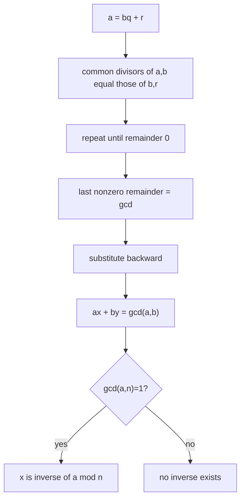
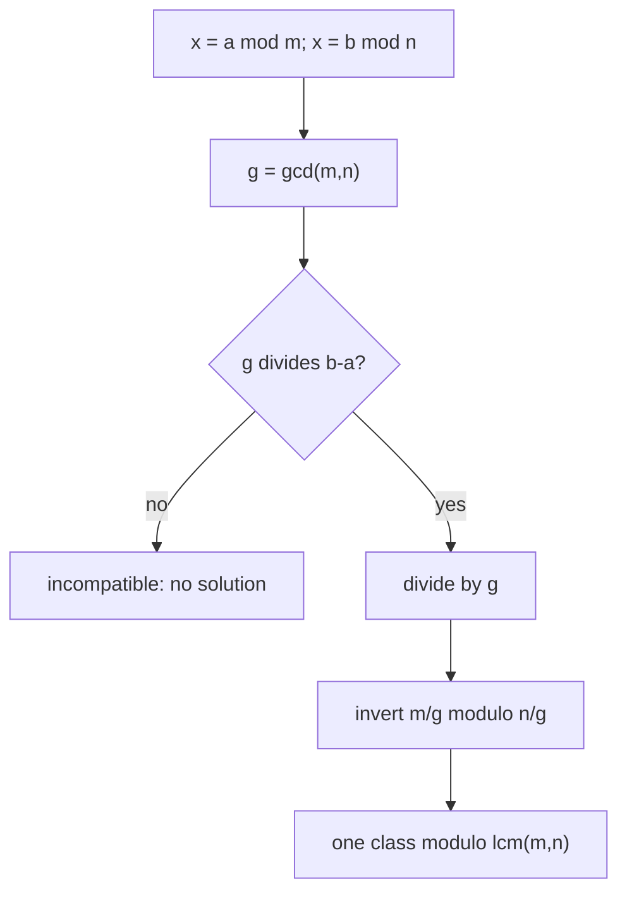
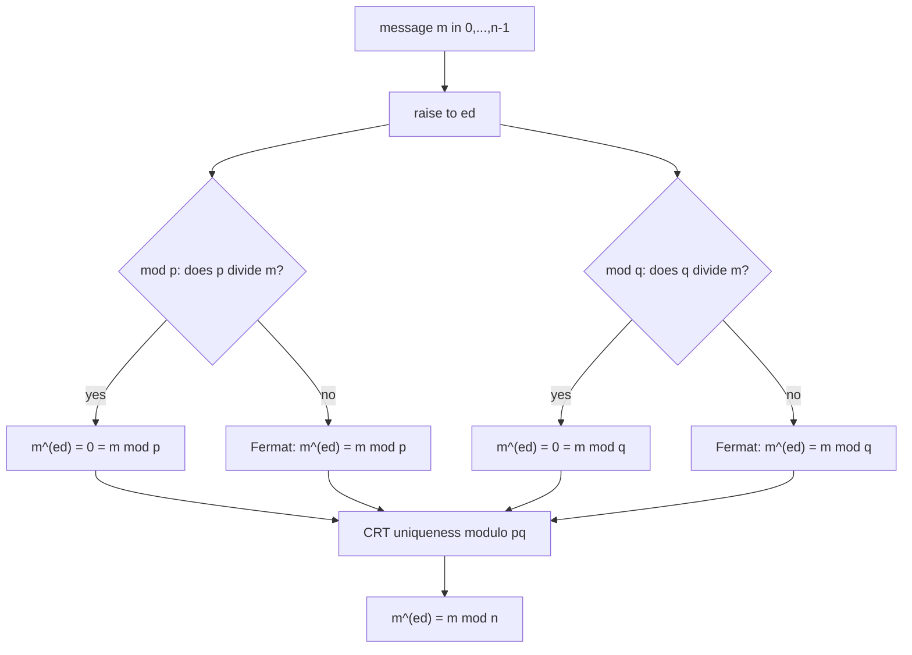

# 0.12 Elementary Number Theory

[Section home](../README.md) | Previous: [§0.11 Graph Theory](../00.11-graph-theory/README.md) | [Module guide](../../CONTRIBUTING.md#module-file-structure) | [Notation guide](../../NOTATION.md)

Build the proof chain from divisibility and prime factorization through Euclid, Bézout, congruences, CRT, prime fields, Fermat, and Euler to textbook RSA correctness for every residue class. Implement the arithmetic with exact integers while keeping gcd, primality, and security contracts explicit.

Background: [§0.04 Sets, Relations, and Functions](../00.04-sets-relations-functions/README.md)
and [§0.06 Proof Techniques](../00.06-proof-techniques/README.md).

Review §0.04 for equivalence classes and §0.06 for proof structure.
[§0.07](../00.07-induction-recursion-invariants/README.md) helps with algorithm
invariants, and [§0.08](../00.08-counting-combinatorics/README.md) helps with
counting units, but neither is blocking.

**Contents:** [The arithmetic proof chain](#the-arithmetic-proof-chain) · [Integer and modular arithmetic contracts](#integer-and-modular-arithmetic-contracts) · [From Euclid to RSA correctness](#from-euclid-to-rsa-correctness) · [Implementation](#implementation) · [Worked examples](#worked-examples) · [Practice](#practice) · [References](#references)

## The arithmetic proof chain

Elementary number theory studies integers through division and remainder. Its
objects are familiar, but its arguments are unusually good training: a short
definition about divisibility grows into the Euclidean algorithm, Bézout's
identity, modular inverses, the Chinese remainder theorem (CRT), finite fields,
and finally a proof that textbook RSA arithmetic reverses itself.

That chain is more important here than any isolated trick.


> **Figure 1. The proof chain.** Each arrow carries a theorem and its input
> contract. Skipping a contract is how legal cancellation, inverse, and RSA
> arguments break. Original diagram.


> **Figure 2. Factorization turns divisibility into exponent bookkeeping.**
> The prime factorization $`360=2^3 3^2 5`$ determines every positive divisor.
> Shape and labels carry the structure without relying on color. Original
> figure.

Direct machine-learning relevance is low. The indirect computing relevance is
real: modular reduction appears in hash families, recurrences over finite state
spaces appear in pseudorandom generation, and finite-field arithmetic supports
error-correcting codes. Those subjects have their own contracts. Number theory
is a foundation for them, not an excuse to claim that every modular formula is
an ML method.

### Scope and non-goals

This module defers:

- serious primality testing and prime generation;
- cryptographic security definitions, reductions, and attack analysis;
- production key generation, serialization, padding, side-channel resistance,
  and protocol design;
- abstract algebra beyond residue classes, units, and the field property needed
  here;
- elliptic curves, coding theory, and number-theoretic transforms;
- locality-sensitive hashing details and pseudorandom-generator design.


## Historical context

The Euclidean algorithm is ancient, but its modern value is not historical
decoration. It computes gcds and also exposes the linear combination needed for
modular inversion. Open undergraduate treatments by Crisman and MIT develop
this route from integer division through congruences and cryptography [1], [2].

Rivest, Shamir, and Adleman published the RSA public-key construction in 1978
[3]. Modern specifications place its bare exponentiation inside larger encoded
schemes. RFC 8017 says directly that the primitive is not intended to provide
security apart from a scheme, and specifies OAEP for encryption and PSS for
signatures [4]. We will prove the primitive's arithmetic correctness. We will
not mistake that proof for a security proof.

## Divisibility, residues, and invertibility

### Divisibility asks for an exact integer scale

Writing $`a\mid b`$ means that multiplying $`a`$ by some integer lands exactly on
$`b`$. Remainders measure the failure of exact divisibility. Prime factorization
then gives every positive integer a coordinate system: one exponent per prime.

### The gcd is the information Euclid preserves

If $`a=bq+r`$, any common divisor of $`a`$ and $`b`$ also divides $`r=a-bq`$.
Conversely, any common divisor of $`b`$ and $`r`$ divides $`a=bq+r`$. Replacing
$`(a,b)`$ by $`(b,r)`$ discards size but preserves the full set of common divisors.


> **Figure 3. Euclid preserves common divisors while shrinking the remainder.**
> The final nonzero remainder is $`21`$. Reading substitutions backward produces
> $`21=5(105)-2(252)`$. Original figure.

### Congruence forgets the quotient and keeps the remainder class

Modulo $`n`$, integers that differ by a multiple of $`n`$ are treated as the same.
A clock is the standard picture, but an equivalence class is the actual object.
The integer $`17`$ is not literally $`2`$; their classes satisfy
$`[17]_5=[2]_5`$.


> **Figure 4. Residue classes partition the integers.** Each row is one class
> modulo $`5`$. The CRT later finds where partitions from different moduli
> intersect. Position and repeated labels distinguish classes. Original figure.

### An inverse is permission to divide

Ordinary algebra cancels a nonzero factor because every nonzero real number has
an inverse. In $`\mathbb{Z}/n\mathbb{Z}`$, only some classes do. Bézout tells us
exactly which: $`[a]_n`$ is invertible if and only if $`\gcd(a,n)=1`$.

### CRT splits one problem into compatible views

A residue modulo $`mn`$ determines residues modulo $`m`$ and $`n`$. When $`m,n`$ are
coprime, every pair of smaller views recombines uniquely modulo $`mn`$. With
noncoprime moduli, the views must agree where their cycles overlap.

## Integer and modular arithmetic contracts

### Local notation

| Symbol | Domain | Meaning |
|---|---|---|
| $`a,b,c,q,r`$ | integers | values, quotient, and remainder |
| $`n,m`$ | integers at least $`2`$ when used as moduli | moduli |
| $`p,q`$ | primes, hence at least $`2`$ | prime factors |
| $`a\mid b`$ | proposition | $`a`$ divides $`b`$ |
| $`\gcd(a,b)`$ | nonnegative integer | normalized greatest common divisor |
| $`\mathrm{lcm}(a,b)`$ | nonnegative integer | normalized least common multiple |
| $`a\equiv b\pmod n`$ | proposition | $`n\mid(a-b)`$ |
| $`[a]_n`$ | set | residue class of $`a`$ modulo $`n`$ |
| $`\mathbb{Z}/n\mathbb{Z}`$ | set of $`n`$ classes | integers modulo $`n`$ |
| $`U(n)`$ | subset of $`\mathbb{Z}/n\mathbb{Z}`$ | multiplicative units modulo $`n`$ |
| $`\varphi(n)`$ | positive integer | $`\lvert U(n)\rvert`$ |
| $`\mathbb{F}_p`$ | field | $`\mathbb{Z}/p\mathbb{Z}`$ when $`p`$ is prime |

The glyphs $`\mathbb{Z}/n\mathbb{Z}`$ and $`\mathbb{F}_p`$ name algebraic objects.
In code, we store their canonical representatives $`0,\ldots,n-1`$.

### Divisibility, signs, and zero

For integers $`a,b`$,

$$
a\mid b
\quad\Longleftrightarrow\quad
\exists k\in\mathbb{Z}\text{ such that }b=ak.
$$

The definition settles the edge cases:

- every nonzero integer divides $`0`$ because $`0=a\cdot0`$;
- $`0\mid b`$ holds exactly when $`b=0`$;
- therefore $`0\mid0`$ is true under this definition;
- $`a\mid b`$ if and only if $`-a\mid b`$;
- divisors occur in sign pairs, while positive divisors are often counted alone.

For a **positive** divisor $`d`$, the notation $`d\mid n`$ never means $`d/n`$ is an
integer. Direction matters.

### The division algorithm

For every integer $`a`$ and every positive integer $`n`$, there are unique integers
$`q,r`$ such that

$$
a=qn+r,
\qquad 0\le r<n.
$$

For a negative divisor, normalize to $`|n|`$ before using this remainder
contract. For example,

$$
-17=(-4)(5)+3.
$$

Python follows this nonnegative-remainder convention when the modulus is
positive. The theorem excludes divisor zero.

### Primes and unique factorization

A **prime** is a positive integer $`p\ge2`$ whose only positive divisors are
$`1`$ and $`p`$. An integer $`n\ge2`$ that is not prime is composite. Thus $`0`$, $`1`$,
and negative integers are neither prime nor composite under this module's
contract.

**Fundamental theorem of arithmetic.** Every integer $`n\ge2`$ can be written

$$
n=p_1^{e_1}\cdots p_k^{e_k},
$$

where the $`p_i`$ are distinct primes and the $`e_i`$ are positive integers. This
factorization is unique up to the order of the prime factors. For a negative
integer, factor $`|n|`$ and record a separate sign $`-1`$. Zero has no prime
factorization, and the empty product represents $`1`$, not a prime factorization
of the theorem's domain.

Euclid's lemma is the load-bearing uniqueness step:

$$
p\text{ prime and }p\mid ab
\quad\Longrightarrow\quad
p\mid a\text{ or }p\mid b.
$$

### Normalized gcd and lcm

The greatest common divisor $`\gcd(a,b)`$ is the greatest **nonnegative** common
divisor, with conventions

$$
\gcd(0,0)=0,
\qquad
\gcd(a,0)=|a|.
$$

The least common multiple $`\mathrm{lcm}(a,b)`$ is nonnegative, with
$`\mathrm{lcm}(a,0)=0`$. For nonzero $`a,b`$,

$$
\gcd(a,b)\mathrm{lcm}(a,b)=|ab|.
$$

If prime exponents in $`|a|`$ and $`|b|`$ are $`\alpha_p`$ and $`\beta_p`$, then gcd
takes $`\min(\alpha_p,\beta_p)`$ and lcm takes
$`\max(\alpha_p,\beta_p)`$ coordinatewise.

### Euclid's invariant and termination

Given nonnegative $`a`$ and positive $`b`$, divide:

$$
a=bq+r,
\qquad 0\le r<b.
$$

Then

$$
\gcd(a,b)=\gcd(b,r).
$$

This is stronger than saying the gcd value happens to agree. The pairs have
exactly the same common divisors. Repeating the replacement strictly decreases
the positive second component, so the algorithm terminates. The last nonzero
remainder is the normalized gcd. If the initial second input is zero, the
algorithm returns the absolute first input without a division step.



> **Figure 5. Euclid becomes an inverse algorithm.** Forward division computes
> the gcd; backward coefficient updates prove Bézout and decide invertibility.
> Original diagram.

### Bézout's identity and the extended algorithm

For integers $`a,b`$, not both zero, there exist $`x,y\in\mathbb{Z}`$ such that

$$
ax+by=\gcd(a,b).
$$

Our convention also permits $`(a,b)=(0,0)`$ with coefficients such as $`(1,0)`$,
giving $`0=0`$. Bézout coefficients are generally not unique. If $`g=\gcd(a,b)`$
and $`(x_0,y_0)`$ is one pair, all pairs for nonzero $`a,b`$ have the form

$$
x=x_0+k\frac{b}{g},
\qquad
y=y_0-k\frac{a}{g},
\qquad k\in\mathbb{Z}.
$$

The extended Euclidean algorithm tracks each remainder as a linear combination
of the original inputs. It therefore returns the gcd and one coefficient pair
in the same asymptotic number of divisions as ordinary Euclid.

### Congruence and residue classes

For modulus $`n\ge2`$,

$$
a\equiv b\pmod n
\quad\Longleftrightarrow\quad
n\mid(a-b).
$$

Congruence is an equivalence relation on $`\mathbb{Z}`$. The class of $`a`$ is

$$
[a]_n=\lbrace a+kn:k\in\mathbb{Z}\rbrace.
$$

The quotient set

$$
\mathbb{Z}/n\mathbb{Z}=\lbrace [0]_n,[1]_n,\ldots,[n-1]_n\rbrace
$$

has exactly $`n`$ classes. Addition and multiplication are well-defined by

$$
[a]_n+[b]_n=[a+b]_n,
\qquad
[a]_n[b]_n=[ab]_n.
$$

You may add, subtract, multiply, and raise congruent values to nonnegative
integer powers. Division is not automatically legal.

### Legal cancellation

From

$$
ac\equiv bc\pmod n,
$$

we know $`n\mid c(a-b)`$. If $`\gcd(c,n)=1`$, Euclid's lemma generalized through
Bézout gives $`n\mid(a-b)`$, so $`a\equiv b\pmod n`$.

Without coprimality, full cancellation can fail:

$$
2\cdot1\equiv2\cdot4\pmod6,
\qquad
1\not\equiv4\pmod6.
$$

The precise weakened result is

$$
ac\equiv bc\pmod n
\quad\Longrightarrow\quad
a\equiv b\pmod{n/\gcd(c,n)}.
$$

### Modular inverses exist exactly for units

A class $`[a]_n`$ has a multiplicative inverse when some $`x`$ satisfies

$$
ax\equiv1\pmod n.
$$

**Inverse criterion.** For $`n\ge2`$, $`[a]_n`$ is invertible if and only if
$`\gcd(a,n)=1`$.

**Proof.** If $`\gcd(a,n)=1`$, Bézout gives $`ax+ny=1`$, hence
$`ax\equiv1\pmod n`$. Conversely, if $`ax\equiv1\pmod n`$, then
$`ax-1=kn`$, so $`ax-kn=1`$. Every common divisor of $`a`$ and $`n`$ divides $`1`$;
therefore the normalized gcd is $`1`$.

The invertible classes form the set of **units** $`U(n)`$. This limited language
is all the group theory we need here.

### Chinese remainder theorem

For two congruences

$$
x\equiv a\pmod m,
\qquad
x\equiv b\pmod n,
$$

let $`g=\gcd(m,n)`$. A solution exists if and only if

$$
a\equiv b\pmod g.
$$

When it exists, the solution is unique modulo $`\mathrm{lcm}(m,n)=mn/g`$.
This is the
**general compatibility form**. Pairwise coprime moduli make $`g=1`$, so every
residue pair is compatible and the solution is unique modulo $`mn`$.

To merge a compatible pair, write $`x=a+mk`$. Substitution gives

$$
mk\equiv b-a\pmod n.
$$

Divide the equation and modulus by $`g`$. Now $`m/g`$ is invertible modulo $`n/g`$,
which determines $`k`$ modulo $`n/g`$.



> **Figure 6. General CRT is a compatibility theorem first.** Pairwise
> coprimality makes the compatibility branch automatic, but it is sufficient,
> not necessary. Original diagram.

For pairwise-coprime $`n_1,\ldots,n_k`$, let $`N=\prod_i n_i`$,
$`N_i=N/n_i`$, and choose $`M_i`$ with $`N_iM_i\equiv1\pmod{n_i}`$. Then

$$
x\equiv\sum_{i=1}^k a_iN_iM_i\pmod N.
$$

Each term is $`a_i`$ in its own modulus and $`0`$ in every other modulus.

### Finite fields

A **field** is a number system where addition, subtraction, multiplication, and
division by every nonzero element are available and obey the usual algebraic
laws. For a prime $`p`$,

$$
\mathbb{F}_p\coloneqq\mathbb{Z}/p\mathbb{Z}
$$

is a field because every nonzero class $`[a]_p`$ has $`\gcd(a,p)=1`$ and hence an
inverse [1]. If $`n`$ is composite, choose a proper factorization $`n=ab`$ with
$`1<a,b<n`$. Then $`[a]_n`$ and $`[b]_n`$ are nonzero but

$$
[a]_n[b]_n=[0]_n.
$$

These zero divisors cannot occur in a field. Therefore
$`\mathbb{Z}/n\mathbb{Z}`$ is a field
exactly when $`n`$ is prime. We use only prime fields here. Extension fields and
their coding-theory applications are deferred.

### Euler's phi counts units

Euler's totient function is

$$
\varphi(n)\coloneqq|U(n)|
=|\lbrace a\in\lbrace 0,\ldots,n-1\rbrace:\gcd(a,n)=1\rbrace|.
$$

Thus $`\varphi(n)`$ counts invertible residue classes, not primes below $`n`$. For a
prime power,

$$
\varphi(p^e)=p^e-p^{e-1}=p^{e-1}(p-1).
$$

If $`\gcd(m,n)=1`$, then $`\varphi(mn)=\varphi(m)\varphi(n)`$. CRT explains the product:
a unit modulo $`mn`$ corresponds to an independent pair of units modulo $`m`$ and
$`n`$. Consequently, if $`n=\prod_i p_i^{e_i}`$,

$$
\varphi(n)=n\prod_{p\mid n}\left(1-\frac1p\right)
=\prod_i p_i^{e_i-1}(p_i-1).
$$

### Fermat's little theorem

If $`p`$ is prime and $`p\nmid a`$, equivalently $`[a]_p\ne[0]_p`$, then

$$
a^{p-1}\equiv1\pmod p.
$$

The nonzero condition is required in this form. Multiplication by nonzero
$`[a]_p`$ permutes the $`p-1`$ nonzero classes; comparing their products and
cancelling $`(p-1)!`$ proves the result.

An equivalent form valid for every integer $`a`$ is

$$
a^p\equiv a\pmod p.
$$

When $`p\mid a`$, both sides are $`0`$ modulo $`p`$; otherwise multiply the first
form by $`a`$.

The converse is false as a primality test. For example, the composite Carmichael
number $`561=3\cdot11\cdot17`$ satisfies $`a^{560}\equiv1\pmod{561}`$ for every
$`a`$ coprime to $`561`$. This module does not develop primality testing.

### Euler's theorem

For $`n\ge2`$ and $`\gcd(a,n)=1`$,

$$
a^{\varphi(n)}\equiv1\pmod n.
$$

The coprimality condition is required. Multiplication by the unit $`[a]_n`$
permutes $`U(n)`$, so the same product-and-cancel argument used for Fermat works
over all units. Fermat's theorem is the prime case because $`\varphi(p)=p-1`$.

### Textbook RSA construction

For the two-prime teaching version:

1. choose distinct primes $`p,q`$;
2. set $`n=pq`$ and $`\varphi(n)=(p-1)(q-1)`$;
3. choose $`e`$ with $`1<e<\varphi(n)`$ and
  $`\gcd(e,\varphi(n))=1`$;
4. compute $`d`$ with $`ed\equiv1\pmod{\varphi(n)}`$;
5. restrict message representatives to $`0\le m<n`$;
6. compute $`c\equiv m^e\pmod n`$ and recover $`m'\equiv c^d\pmod n`$.

RFC 8017 uses the Carmichael exponent
$`\lambda(n)=\mathrm{lcm}(p-1,q-1)`$ in its key
validity condition and allows more than two distinct odd primes [4]. Using
$`\varphi(n)`$ here is a simpler sufficient teaching contract. It may produce a
different valid private exponent.


> **Figure 7. RSA correctness is proved prime by prime.** Each branch handles
> both unit and zero cases; CRT then identifies one residue modulo $`pq`$.
> Original figure.



> **Figure 8. The all-messages proof needs four branches.** Euler's theorem
> alone covers only messages coprime to $`n`$. The zero branches cover messages
> divisible by $`p`$ or $`q`$. Original diagram.

#### Correctness for every residue class

Because $`ed=1+k(p-1)(q-1)`$, we have $`ed=1+k_p(p-1)`$ for some $`k_p`$.
Modulo $`p`$:

- if $`p\mid m`$, then $`m^{ed}\equiv0\equiv m`$;
- if $`p\nmid m`$, Fermat gives
  $`m^{ed}=m(m^{p-1})^{k_p}\equiv m`$.

The same two-case argument works modulo $`q`$. Therefore
$`m^{ed}\equiv m`$ modulo both distinct primes. CRT says those two congruences
identify one class modulo $`pq=n`$, so

$$
(m^e)^d\equiv m\pmod n
$$

for **every** message representative, including $`0`$, multiples of $`p`$,
multiples of $`q`$, and units.

> **Security boundary:** Raw textbook RSA is deterministic and is not secure
> encryption or a secure signature scheme. The toy code generates no secure
> primes, performs no approved encoding or padding, protects no private key,
> resists no timing or fault attack, and proves no security property. Use a
> maintained cryptographic library and a current protocol profile. RFC 8017
> requires a scheme around the primitive and specifies RSAES-OAEP and
> RSASSA-PSS for modern constructions [4]. NIST separately specifies approved
> RSA signature and key-establishment requirements [5].

## From Euclid to RSA correctness

### From divisibility to gcd

The equation $`a=bq+r`$ makes the Euclid invariant reversible:

$$
d\mid a\land d\mid b
\iff d\mid b\land d\mid(a-bq)
\iff d\mid b\land d\mid r.
$$

This proves equality of common-divisor sets, not only equality of their maxima.

### From gcd to inverses

Extended Euclid gives $`ax+ny=g`$. Setting $`g=1`$ and reducing modulo $`n`$
removes the $`ny`$ term:

$$
ax+ny=1
\implies ax\equiv1\pmod n.
$$

The reverse direction converts an inverse congruence back into a linear
combination of $`a`$ and $`n`$, forcing the gcd to divide $`1`$.

### From inverses to CRT

Substituting $`x=a+mk`$ transforms simultaneous congruences into one linear
congruence. The inverse criterion solves it exactly when the residues agree
modulo $`\gcd(m,n)`$. This derivation explains both the constructive algorithm and
the refusal case.

### From finite fields to Fermat and Euler

Multiplication by a unit is injective: $`au=av`$ permits cancellation by
$`a^{-1}`$. On a finite set, injective means bijective, so multiplication
permutes the units. Products before and after permutation agree; cancelling the
product of all units yields the power theorem.

### From Fermat and CRT to RSA

Fermat handles nonzero residues in each prime field. Direct zero arithmetic
handles residues divisible by a key prime. CRT recombines the two conclusions.
This is why the RSA proof works for all classes even though Fermat's
multiplicative form does not include zero.

## Implementation

### Implementation coverage

[`number_theory.py`](code/number_theory.py) implements the lesson's central
mechanisms with exact integer arithmetic:

- normalized gcd, lcm, and a Euclidean trace;
- extended Euclid and modular inverses;
- pairwise-coprime and general compatible CRT merging;
- trial factorization and $`\varphi`$ from prime factors;
- repeated-squaring modular exponentiation;
- small prime-field addition, multiplication, inversion, and division;
- explicitly toy-only RSA key construction, encryption, and decryption.

### Run

From the repository root, enter this module's code directory and run:

```bash
cd 00-mathematical-foundations/00.12-elementary-number-theory/code
PYTHONDONTWRITEBYTECODE=1 python -m unittest -v
```

Run the lesson and worked-solution Python excerpts from this same `code/` working directory.

No third-party packages, randomness, network access, or data files are needed.

### Contracts and limits

- Integer APIs reject Boolean values even though `bool` subclasses `int` in
  Python.
- `gcd(a, b)` is nonnegative and returns zero only for `(0, 0)`.
- `lcm(a, b)` is nonnegative and returns zero when either input is zero.
- Euclidean traces use absolute operands, positive divisors, and nonnegative
  remainders.
- Modular APIs require a modulus of at least two.
- `modular_inverse` succeeds exactly when the gcd is one.
- `chinese_remainder` requires at least one congruence, accepts noncoprime
  moduli when compatible, and returns the normalized class modulo their lcm.
- Trial factorization requires $`n\ge2`$ and is intended only for small inputs.
- `phi_from_factors` requires a complete list of distinct primes with positive
  exponents.
- Prime-field helpers validate a small prime modulus and refuse zero division.
- Toy RSA requires distinct small primes, a valid public exponent, and integer
  representatives in $`[0,n)`$. It performs raw deterministic exponentiation.

### Security warning

The RSA functions are deliberately named `toy_rsa_*`. They do not generate
secure primes, choose production key sizes, encode byte strings, apply OAEP or
PSS, protect private material, run in constant time, blind exponents, resist
faults, or provide protocol-level security. They must not be used to protect
data. A maintained cryptographic library and current protocol profile own those
responsibilities.

### Trusted comparisons

The tests compare from-scratch results with `math.gcd`, built-in three-argument
`pow`, and `pow(value, -1, modulus)` after the lesson mechanisms have been
implemented. These comparisons detect implementation disagreement. They do not
replace theorem proofs.

### Evidence boundary

The tests cover sign and zero normalization, every Euclidean step, Bézout
identities, nonunits, pairwise and noncoprime CRT cases, invalid factors,
Carmichael behavior, composite field refusal, invalid RSA keys, out-of-range
representatives, and RSA messages sharing factors with $`n`$. Passing them
establishes behavior on those finite cases. The lesson's proofs establish the
general claims.

The tested implementation lives in [`code/number_theory.py`](code/number_theory.py).
It uses exact integer arithmetic and the standard library only. Python's
three-argument `pow` computes modular powers efficiently and, with exponent
$`-1`$, computes an inverse only when the base and modulus are coprime [6]. We use
it as a reference comparison after implementing the mechanisms ourselves.

The same boundary applies to nearby computing topics. NIST's deterministic
random-bit mechanisms are based on hash functions or block ciphers, not a toy
linear congruential recurrence [7]. Its Secure Hash Standard specifies
cryptographic message digests, a different contract from a modular hash family
used to place keys in a table [8].

### Trace Euclid and verify Bézout

```python
from number_theory import extended_gcd, gcd_trace

common, steps = gcd_trace(-252, 105)
assert common == 21
assert all(a == q * b + r and 0 <= r < b for a, b, q, r in steps)

result = extended_gcd(-252, 105)
assert result.gcd == 21
assert -252 * result.x + 105 * result.y == 21
```

### Refuse a nonunit inverse

```python
from number_theory import modular_inverse

assert modular_inverse(38, 97) == 23 == pow(38, -1, 97)
try:
    modular_inverse(6, 15)
except ValueError:
    pass
else:
    raise AssertionError("a nonunit must not receive an inverse")
```

### Solve both CRT forms

```python
from number_theory import chinese_remainder

assert chinese_remainder(((2, 3), (3, 5), (2, 7))) == (23, 105)
assert chinese_remainder(((2, 6), (8, 9))) == (8, 18)

try:
    chinese_remainder(((1, 4), (2, 6)))
except ValueError:
    pass
else:
    raise AssertionError("incompatible congruences must be refused")
```

### Factor only small teaching inputs

```python
from number_theory import phi, trial_factorization

assert trial_factorization(360) == ((2, 3), (3, 2), (5, 1))
assert phi(360) == 96
```

Trial division is transparent but not suitable for large inputs. The function
requires $`n\ge2`$ and makes no cryptographic performance claim.

### Audit a prime field

```python
from number_theory import fp_divide, fp_inverse

assert fp_inverse(3, 7) == 5
assert fp_divide(4, 3, 7) == 6

try:
    fp_inverse(3, 8)
except ValueError:
    pass
else:
    raise AssertionError("a composite modulus is not F_p")
```

### Demonstrate toy RSA, including nonunits

```python
from number_theory import make_toy_rsa_key, toy_rsa_decrypt, toy_rsa_encrypt

key = make_toy_rsa_key(11, 17, 7)
assert (key.n, key.phi, key.d) == (187, 160, 23)

for message in (0, 11, 17, 22, 42, 186):
    ciphertext = toy_rsa_encrypt(message, key)
    assert toy_rsa_decrypt(ciphertext, key) == message
```

The names include `toy` because the code is an arithmetic exhibit, not a
cryptographic API.

## Experiments with exact arithmetic

### Experiment 1: Euclid's preserved set

For several signed pairs, enumerate all positive common divisors before and
after each Euclidean step. Verify that the sets agree, not only their maxima.
State why the finite experiment supports the trace but does not prove the
invariant for every integer pair.

### Experiment 2: inverse density

For $`2\le n\le30`$, count residues coprime to $`n`$ and compare with
`phi(n)`. Plotting is optional; a table already reveals that primes have
$`n-1`$ units while composite moduli have zero divisors.

### Experiment 3: CRT compatibility

Enumerate residue pairs for moduli $`6`$ and $`9`$. For each pair, compare brute
force over $`0,\ldots,17`$ with the condition $`a\equiv b\pmod3`$. Every compatible
pair should have one solution modulo $`18`$.

### Experiment 4: Fermat witnesses and liars

Compare $`a^{n-1}\bmod n`$ for small primes, ordinary composites, and $`561`$.
Record bases that expose compositeness and bases that do not. Do not infer a
general primality test from this bounded table.

### Experiment 5: every toy RSA message

For $`p=11,q=17,e=7`$, test all $`187`$ representatives. Partition them into
units, nonzero multiples of $`p`$, nonzero multiples of $`q`$, and zero. Confirm
round-trip correctness in every group and explain which proof branch covers
each.

## Worked examples

### Worked example 1: zero divisibility

$`7\mid0`$ because $`0=7\cdot0`$. Also $`0\mid0`$. But $`0\nmid7`$ because no integer
$`k`$ satisfies $`7=0k`$.

### Worked example 2: negative division

The division algorithm with positive modulus gives
$`-23=(-5)5+2`$. The canonical residue is $`2`$, not $`-3`$.

### Worked example 3: factorization and divisor count

$`360=2^3 3^2 5`$. A positive divisor chooses exponents
$`0\le i\le3`$, $`0\le j\le2`$, $`0\le k\le1`$, so there are
$`(3+1)(2+1)(1+1)=24`$ positive divisors.

### Worked example 4: gcd and lcm

$`84=2^2\cdot3\cdot7`$ and $`126=2\cdot3^2\cdot7`$. Thus
$`\gcd(84,126)=2\cdot3\cdot7=42`$ and
$`\mathrm{lcm}(84,126)=2^2\cdot3^2\cdot7=252`$.

### Worked example 5: Euclid and Bézout

$$
252=2(105)+42,
\quad105=2(42)+21,
\quad42=2(21).
$$

Back-substitution gives
$`21=105-2(252-2(105))=5(105)-2(252)`$.

### Worked example 6: inverse

From $`1=23(38)-9(97)`$, reduce modulo $`97`$ to obtain
$`38\cdot23\equiv1\pmod{97}`$. Therefore $`38^{-1}\equiv23`$.

### Worked example 7: illegal cancellation

$`2x\equiv2\pmod6`$ simplifies only to $`x\equiv1\pmod3`$. Both $`x=1`$ and
$`x=4`$ satisfy the original congruence modulo $`6`$.

### Worked example 8: pairwise-coprime CRT

The system $`x\equiv2\pmod3`$, $`x\equiv3\pmod5`$, and
$`x\equiv2\pmod7`$ has solution $`x\equiv23\pmod{105}`$.

### Worked example 9: compatible noncoprime CRT

$`x\equiv2\pmod6`$ and $`x\equiv8\pmod9`$ are compatible because
$`2\equiv8\pmod3`$. Their common solutions are $`x\equiv8\pmod{18}`$.

### Worked example 10: field versus ring

In $`\mathbb{F}_7`$, $`3^{-1}=5`$ because $`3\cdot5\equiv1`$. In
$`\mathbb{Z}/8\mathbb{Z}`$, $`[2][4]=[0]`$ with both factors nonzero, so
$`\mathbb{Z}/8\mathbb{Z}`$ is not a field.

### Worked example 11: Euler reduction

$`\varphi(20)=8`$ and $`\gcd(3,20)=1`$. Since $`100=12(8)+4`$,

$$
3^{100}\equiv(3^8)^{12}3^4\equiv1^{12}\cdot81\equiv1\pmod{20}.
$$

### Worked example 12: RSA nonunit

For $`p=11,q=17,e=7,d=23`$, message $`m=22`$ shares factor $`11`$ with
$`n=187`$. Euler's theorem modulo $`187`$ is unavailable. Modulo $`11`$, both the
message and its decrypted power are zero. Modulo $`17`$, Fermat handles the
nonzero class. CRT recombines the two equalities to recover $`22`$ modulo $`187`$.

## Common mistakes

### Treating zero like an ordinary divisor

Zero divides only zero, while every nonzero integer divides zero.

### Calling one prime

The prime domain begins at $`2`$. Unique factorization uses $`1`$ as the empty
product, not as another prime.

### Forgetting gcd normalization

The gcd is nonnegative even when inputs or Bézout coefficients are negative.

### Using a negative or zero modulus silently

This module requires $`n\ge2`$ for congruence classes. Normalize a negative
divisor and reject modulus zero.

### Cancelling a nonunit

You may cancel $`c`$ modulo $`n`$ without weakening the modulus only when
$`\gcd(c,n)=1`$.

### Claiming every nonzero class has an inverse

That is true in $`\mathbb{F}_p`$, not in $`\mathbb{Z}/n\mathbb{Z}`$ for composite $`n`$.

### Stating CRT only for coprime moduli

Pairwise coprimality guarantees compatibility. General systems exist exactly
when residues agree modulo every relevant gcd.

### Saying phi counts primes

$`\varphi(n)`$ counts units modulo $`n`$.

### Dropping Fermat's nonzero condition

$`a^{p-1}\equiv1`$ requires $`p\nmid a`$. Use $`a^p\equiv a`$ for the all-integer
form.

### Applying Euler without coprimality

Euler's theorem acts on units. A shared factor can invalidate the conclusion.

### Proving RSA only for units

An all-message proof must branch on divisibility by $`p`$ and $`q`$, then use CRT.

### Calling raw RSA secure

Arithmetic reversibility is not confidentiality, authenticity, randomized
encoding, key safety, or side-channel resistance.

### Treating tests as universal proof

Finite tests validate examples and implementation behavior. The theorem proofs
establish the universal integer claims.

## Practice

Attempt each problem before expanding its worked solution. All programming uses the Python standard library.

Equivalent arguments are valid when they state
the same domains, normalizations, theorem conditions, and evidence limits. Run
Python excerpts from the module's `code/` directory.

### Readiness check

1. Can you distinguish an integer from an equivalence class of integers?
2. Can you prove both directions of an if-and-only-if statement?
3. Can you use induction or well-ordering to justify termination?
4. Can you explain why one counterexample refutes a universal claim?
5. Can you follow a loop invariant and substitute equal expressions?

### E0.12.01 Audit divisibility, signs, and zero

- **Allowed tools:** Definitions and hand calculation.
- **Assumptions:** All variables are integers.

1. Decide each statement and justify it from $`a\mid b\iff b=ak`$:
   $`6\mid-42`$, $`-6\mid42`$, $`7\mid0`$, $`0\mid0`$, $`0\mid7`$, and $`1\mid n`$.
2. Prove $`a\mid b`$ if and only if $`-a\mid b`$.
3. For $`a=-37`$ and positive divisor $`n=8`$, find the unique $`q,r`$ with
   $`a=qn+r`$ and $`0\le r<n`$.
4. Explain why the division algorithm excludes divisor zero.
5. Audit: "If $`a\mid b`$, then $`|a|\le|b|`$."

**Deliverable:** Six decisions, two short proofs or repairs, and one division.

<details><summary>Worked solution</summary>

#### Solution E0.12.01

**Key idea.** Use the integer multiplier definition before relying on intuition about division.

**Reasoning.** $`6\mid-42`$ because $`-42=6(-7)`$, and $`-6\mid42`$ because $`42=(-6)(-7)`$.
$`7\mid0`$ because $`0=7(0)`$. Also $`0\mid0`$ because $`0=0k`$ for every integer
$`k`$. But $`0\nmid7`$ because $`0k`$ is never $`7`$. Finally $`1\mid n`$ because
$`n=1\cdot n`$.

If $`b=ak`$, then $`b=(-a)(-k)`$, so $`a\mid b`$ implies $`-a\mid b`$. Applying the
same argument to $`-a`$ proves the reverse direction.

For division, $`-37=(-5)8+3`$, and $`0\le3<8`$. Uniqueness follows from the
division algorithm. Divisor zero cannot give a bounded remainder interval
$`0\le r<0`$, and $`a=0q+r`$ cannot determine a unique quotient.

The audited claim is false when $`b=0`$: $`7\mid0`$ but $`7\nleq0`$. A repair is:
if $`a\mid b`$ and $`b\ne0`$, then $`a\ne0`$ and $`|a|\le|b|`$.

**Verification.** Each true divisibility statement has an explicit integer witness; each false
one shows why no witness exists.

**Common wrong turn.** Do not declare $`0\nmid0`$ by importing a rule against division by zero. The
divisibility relation is defined by multiplication.

</details>

### E0.12.02 Recover arithmetic from prime exponents

- **Allowed tools:** Hand factorization.
- **Assumptions:** Prime means a positive integer at least $`2`$.

Let $`a=-2^4 3^2 7`$ and $`b=2^2 3^5 5`$.

1. Compute $`\gcd(a,b)`$ and $`\mathrm{lcm}(a,b)`$ from exponents.
2. Verify their product is $`|ab|`$.
3. Count the positive divisors of $`|a|`$.
4. State the fundamental theorem of arithmetic with its exact domain and
   uniqueness clause.
5. Explain how to factor a negative integer and why $`0`$ has no prime
   factorization.
6. Prove Euclid's lemma implies that a prime dividing a finite product divides
   at least one factor.

**Deliverable:** Two factorizations, two numerical audits, and two proof notes.

<details><summary>Worked solution</summary>

#### Solution E0.12.02

**Key idea.** Gcd takes minimum exponents, lcm takes maximum exponents, and sign is separate.

**Reasoning.**

$$
\gcd(a,b)=2^2 3^2=36,
$$

$$
\mathrm{lcm}(a,b)=2^4 3^5 5\cdot7=136080.
$$

Their product is $`36\cdot136080=4,898,880=|ab|`$. The positive divisor count
of $`|a|=2^4 3^2 7`$ is $`(4+1)(2+1)(1+1)=30`$.

The fundamental theorem states that every integer $`n\ge2`$ is a product of
primes, uniquely up to factor order. A negative integer is $`-1`$ times the prime
factorization of its absolute value. Zero cannot be a finite prime product
because every such product is nonzero.

For Euclid's lemma on $`a_1\cdots a_k`$, use induction. The case $`k=2`$ is the
lemma. If $`p\mid(a_1\cdots a_{k-1})a_k`$, then either $`p\mid a_k`$ or
$`p\mid a_1\cdots a_{k-1}`$; apply the inductive hypothesis in the latter case.

**Verification.** Minimum plus maximum equals the sum of the two exponents prime by prime, which
proves the product identity in this example and generally for nonzero inputs.

**Common wrong turn.** Do not put $`-1`$ or $`1`$ into the list of primes.

</details>

### E0.12.03 Trace Euclid's invariant

- **Allowed tools:** Hand calculation and module code.
- **Assumptions:** The gcd is normalized to be nonnegative.

1. Trace Euclid on $`1071`$ and $`462`$, recording every quotient and remainder.
2. Prove that if $`a=bq+r`$, then $`(a,b)`$ and $`(b,r)`$ have exactly the same
   common divisors.
3. Explain why the algorithm terminates.
4. Run `gcd_trace(1071, 462)` and compare every row.
5. Test all sign choices and the boundaries $`(0,0)`$, $`(a,0)`$, and $`(0,b)`$.
6. Compare only final gcd values with `math.gcd` and state why this is a
   reference comparison rather than the implementation.

**Deliverable:** A trace, invariant proof, termination argument, and tests.

<details><summary>Worked solution</summary>

#### Solution E0.12.03

**Key idea.** Each division preserves the complete set of common divisors and decreases the
remainder.

**Reasoning.**

$$
1071=2(462)+147,
$$

$$
462=3(147)+21,
$$

$$
147=7(21)+0.
$$

Thus the gcd is $`21`$. If $`d\mid a`$ and $`d\mid b`$, then
$`d\mid(a-bq)=r`$. Conversely, if $`d\mid b`$ and $`d\mid r`$, then
$`d\mid(bq+r)=a`$. The common-divisor sets are equal.

Every nonterminal remainder satisfies $`0\le r<b`$. Positive divisors therefore
form a strictly decreasing sequence of nonnegative integers, which must reach
zero.

```python
import math
from number_theory import gcd, gcd_trace

common, steps = gcd_trace(1071, 462)
assert common == 21
assert steps == ((1071, 462, 2, 147), (462, 147, 3, 21), (147, 21, 7, 0))

for left, right in ((1071, 462), (-1071, 462), (1071, -462),
                    (-1071, -462), (0, 0), (19, 0), (0, -19)):
    assert gcd(left, right) == math.gcd(left, right)
```

**Verification.** Every row satisfies dividend = quotient times divisor + remainder and the
remainder bound. `math.gcd` independently confirms the normalized final value.

**Common wrong turn.** Comparing with `math.gcd` tests results; it does not prove the invariant or
termination.

</details>

### E0.12.04 Produce Bézout coefficients and inverses

- **Allowed tools:** Back-substitution and module code.
- **Assumptions:** Moduli are at least $`2`$.

1. Back-substitute your Euclid trace to find $`x,y`$ with
   $`1071x+462y=\gcd(1071,462)`$.
2. Use extended Euclid to find $`17^{-1}\pmod{43}`$.
3. Prove $`[a]_n`$ has an inverse if and only if $`\gcd(a,n)=1`$.
4. Explain why Bézout coefficients are not unique.
5. Determine whether $`14`$ has an inverse modulo $`35`$ and justify refusal.
6. Compare `modular_inverse(17, 43)` with `pow(17, -1, 43)` only after the
   derivation.

**Deliverable:** Two coefficient calculations, the iff proof, and one refusal.

<details><summary>Worked solution</summary>

#### Solution E0.12.04

**Key idea.** Back-substitution turns the final gcd into a linear combination, and gcd one
turns that combination into an inverse.

**Reasoning.** From the trace,

$$
21=462-3(147)=462-3(1071-2(462))=7(462)-3(1071).
$$

Thus $`(x,y)=(-3,7)`$. For $`17`$ and $`43`$,

$$
43=2(17)+9,
\quad17=1(9)+8,
\quad9=1(8)+1,
$$

so $`1=2(43)-5(17)`$. Therefore $`17^{-1}\equiv-5\equiv38\pmod{43}`$.

If $`\gcd(a,n)=1`$, Bézout gives $`ax+ny=1`$, so $`ax\equiv1\pmod n`$.
If $`ax\equiv1\pmod n`$, then $`ax-kn=1`$ for some $`k`$, so every common divisor
of $`a,n`$ divides $`1`$ and the gcd is $`1`$. If $`(x_0,y_0)`$ is one coefficient
pair, adding $`(kn/g,-ka/g)`$ gives infinitely many others.

$`14`$ has no inverse modulo $`35`$ because $`\gcd(14,35)=7\ne1`$.

```python
from number_theory import extended_gcd, modular_inverse

assert extended_gcd(1071, 462) == (21, -3, 7)
assert modular_inverse(17, 43) == 38 == pow(17, -1, 43)
```

**Verification.** $`17\cdot38=646=15(43)+1`$.

**Common wrong turn.** Do not reduce a Bézout coefficient modulo the wrong modulus.

</details>

### E0.12.05 Reason with classes and legal cancellation

- **Allowed tools:** Definitions and proof.
- **Assumptions:** $`n\ge2`$.

1. Prove congruence modulo $`n`$ is reflexive, symmetric, and transitive.
2. List $`[3]_5`$ using a set-builder description and five representatives.
3. Prove addition and multiplication of classes are well-defined.
4. Solve $`7x\equiv4\pmod{15}`$ by legal cancellation or inversion.
5. Solve $`6x\equiv9\pmod{15}`$, stating the weakened modulus and all classes
   modulo $`15`$.
6. Give a counterexample to unrestricted cancellation.
7. Repair: "Congruence means two integers have the same remainder" when
   negative divisors or unstated remainder conventions are allowed.

**Deliverable:** Three relation proofs, two solutions, and two critiques.

<details><summary>Worked solution</summary>

#### Solution E0.12.05

**Key idea.** Congruence is equality of classes, and cancellation requires an invertible
factor or a weakened modulus.

**Reasoning.** Reflexivity follows from $`n\mid a-a=0`$. Symmetry follows because
$`n\mid(a-b)`$ implies $`n\mid-(a-b)=b-a`$. Transitivity follows by adding
multiples: if $`n\mid(a-b)`$ and $`n\mid(b-c)`$, then $`n\mid(a-c)`$.

$$
[3]_5=\lbrace 3+5k:k\in\mathbb{Z}\rbrace,
$$

with representatives $`-7,-2,3,8,13`$. If $`a\equiv a'`$ and $`b\equiv b'`$,
then $`n`$ divides $`(a+b)-(a'+b')`$. It also divides
$`ab-a'b'=a(b-b')+b'(a-a')`$. Therefore class addition and multiplication do
not depend on representatives.

$`7^{-1}\equiv13\pmod{15}`$, so $`x\equiv13(4)\equiv7\pmod{15}`$.
For $`6x\equiv9\pmod{15}`$, divide coefficient, right side, and modulus by
$`3`$: $`2x\equiv3\pmod5`$, hence $`x\equiv4\pmod5`$. The classes modulo $`15`$
are $`x\equiv4,9,14`$.

Unrestricted cancellation fails because $`2(1)\equiv2(4)\pmod6`$ but
$`1\not\equiv4\pmod6`$. The remainder statement is safe when the modulus is
positive and canonical remainders are fixed. The definition
$`n\mid(a-b)`$ is convention-independent.

**Verification.** Substitution gives $`7(7)=49\equiv4\pmod{15}`$ and
$`6(4),6(9),6(14)\equiv9\pmod{15}`$.

**Common wrong turn.** Do not divide a congruence as if every nonzero class were a unit.

</details>

### E0.12.06 Construct a coprime CRT solution

- **Allowed tools:** Extended Euclid and hand arithmetic.
- **Assumptions:** Moduli are pairwise coprime.

Solve

$$
x\equiv1\pmod4,
\qquad x\equiv4\pmod5,
\qquad x\equiv6\pmod7.
$$

1. Construct $`N`$, each $`N_i`$, and each inverse $`M_i`$.
2. Build the CRT sum and normalize it.
3. Verify all three congruences.
4. Prove uniqueness modulo $`N`$.
5. Compare with `chinese_remainder`.
6. Explain why pairwise coprimality is stronger than merely having a common gcd
   of $`1`$ across all three moduli.

**Deliverable:** A constructive solution, verification, and uniqueness proof.

<details><summary>Worked solution</summary>

#### Solution E0.12.06

**Key idea.** Build selectors that are one in one modulus and zero in the others.

**Reasoning.** $`N=4\cdot5\cdot7=140`$. The partial products are $`35,28,20`$. Their required
inverses are

$$
35^{-1}\equiv3\pmod4,
\quad28^{-1}\equiv2\pmod5,
\quad20^{-1}\equiv6\pmod7.
$$

Thus

$$
x\equiv1(35)(3)+4(28)(2)+6(20)(6)=1049\equiv69\pmod{140}.
$$

Indeed $`69\bmod4=1`$, $`69\bmod5=4`$, and $`69\bmod7=6`$.
If $`x,y`$ satisfy all three congruences, each pairwise-coprime modulus divides
$`x-y`$, so their product $`140`$ divides $`x-y`$. This proves uniqueness modulo
$`140`$.

```python
from number_theory import chinese_remainder

assert chinese_remainder(((1, 4), (4, 5), (6, 7))) == (69, 140)
```

Having overall gcd one is weaker than pairwise coprimality: $`6,10,15`$ have
collective gcd one, but every pair shares a factor.

**Verification.** Both the selector sum and direct substitution produce the same normalized class.

**Common wrong turn.** Do not replace pairwise coprimality with $`\gcd(n_1,n_2,n_3)=1`$.

</details>

### E0.12.07 Diagnose general CRT compatibility

- **Allowed tools:** Gcd, extended Euclid, brute force, and module code.
- **Assumptions:** Every modulus is at least $`2`$.

1. Prove $`x\equiv a\pmod m`$ and $`x\equiv b\pmod n`$ is solvable exactly
   when $`a\equiv b\pmod{\gcd(m,n)}`$.
2. Solve $`x\equiv4\pmod6`$ and $`x\equiv10\pmod{15}`$.
3. State the uniqueness modulus.
4. Refuse $`x\equiv3\pmod6`$ and $`x\equiv4\pmod{15}`$ with a compatibility
   witness.
5. Extend the compatible system with $`x\equiv1\pmod7`$ and solve it.
6. Verify both outcomes with `chinese_remainder` and bounded brute force.

**Deliverable:** The iff proof, two solved systems, and one exact refusal.

<details><summary>Worked solution</summary>

#### Solution E0.12.07

**Key idea.** The shared gcd is exactly the overlap on which two residue views must agree.

**Reasoning.** If $`x=a+um=b+vn`$, then $`b-a=um-vn`$, so $`g=\gcd(m,n)`$ divides $`b-a`$.
Conversely, if $`g\mid(b-a)`$, divide
$`mk\equiv b-a\pmod n`$ by $`g`$. Since $`m/g`$ and $`n/g`$ are coprime,
$`m/g`$ has an inverse modulo $`n/g`$, which gives $`k`$ and hence $`x=a+mk`$.

For $`x\equiv4\pmod6`$ and $`x\equiv10\pmod{15}`$, the residues agree modulo
$`3`$. Values $`4,10,16,22,28,34`$ modulo $`6`$ show $`x=10`$ works, so
$`x\equiv10\pmod{30}`$. The system $`3\pmod6`$ and $`4\pmod{15}`$ is impossible
because $`3\not\equiv4\pmod3`$.

Adding $`x\equiv1\pmod7`$, merge $`x=10+30k`$. Then
$`10+30k\equiv3+2k\equiv1\pmod7`$, so $`2k\equiv5`$, $`k\equiv6`$, and
$`x\equiv190\pmod{210}`$.

```python
from number_theory import chinese_remainder

assert chinese_remainder(((4, 6), (10, 15))) == (10, 30)
assert chinese_remainder(((4, 6), (10, 15), (1, 7))) == (190, 210)
try:
    chinese_remainder(((3, 6), (4, 15)))
except ValueError:
    pass
else:
    raise AssertionError("incompatible system must be refused")
```

**Verification.** $`190`$ has residues $`4,10,1`$ in moduli $`6,15,7`$.

**Common wrong turn.** Noncoprime does not mean impossible. It means compatibility must be checked.

</details>

### E0.12.08 Distinguish rings, units, and prime fields

- **Allowed tools:** Class arithmetic and Bézout.
- **Assumptions:** Only the limited field definition in the lesson is needed.

1. List every unit in $`\mathbb{Z}/12\mathbb{Z}`$ and its inverse.
2. Build the nonzero multiplication table for $`\mathbb{F}_5`$.
3. Prove every nonzero class modulo a prime has an inverse.
4. Prove a composite modulus has nonzero zero divisors.
5. Conclude $`\mathbb{Z}/n\mathbb{Z}`$ is a field exactly when $`n`$ is prime.
6. Compute $`4/3`$ in $`\mathbb{F}_7`$.
7. Use the module code to refuse division by zero and a composite "field"
   modulus.

**Deliverable:** Two finite audits, the field iff proof, and refusal tests.

<details><summary>Worked solution</summary>

#### Solution E0.12.08

**Key idea.** Units are exactly coprime classes. Prime moduli make every nonzero class a unit.

**Reasoning.** The units modulo $`12`$ are $`1,5,7,11`$, and each is self-inverse. The nonzero
multiplication table modulo $`5`$ is

| $`\times`$ | 1 | 2 | 3 | 4 |
|---|---:|---:|---:|---:|
| 1 | 1 | 2 | 3 | 4 |
| 2 | 2 | 4 | 1 | 3 |
| 3 | 3 | 1 | 4 | 2 |
| 4 | 4 | 3 | 2 | 1 |

If $`p`$ is prime and $`[a]_p\ne[0]_p`$, then $`p\nmid a`$, so
$`\gcd(a,p)=1`$ and Bézout supplies an inverse. If $`n=ab`$ is composite with
$`1<a,b<n`$, then $`[a]_n,[b]_n`$ are nonzero but their product is zero. A field
cannot contain nonzero zero divisors. Therefore the quotient is a field exactly
for prime modulus.

In $`\mathbb{F}_7`$, $`3^{-1}=5`$, so $`4/3=4(5)=20\equiv6`$.

```python
from number_theory import fp_divide, fp_inverse

assert fp_divide(4, 3, 7) == 6
for value, modulus in ((0, 7), (3, 8)):
    try:
        fp_inverse(value, modulus)
    except ValueError:
        pass
    else:
        raise AssertionError("invalid field division must be refused")
```

**Verification.** Every nonzero row of the $`\mathbb{F}_5`$ table contains $`1`$ exactly once.

**Common wrong turn.** Do not call $`\mathbb{Z}/n\mathbb{Z}`$ a field merely because addition and
multiplication are defined.

</details>

### E0.12.09 Count units and apply Euler's theorem

- **Allowed tools:** Inclusion-exclusion, CRT, and module code.
- **Assumptions:** Euler's theorem requires coprimality.

1. Derive $`\varphi(p^e)=p^e-p^{e-1}`$.
2. Use CRT to explain why $`\varphi(mn)=\varphi(m)\varphi(n)`$ for coprime
   $`m,n`$.
3. Compute $`\varphi(360)`$ from its factorization.
4. Compute $`7^{222}\bmod40`$ using Euler's theorem.
5. Explain why the same theorem cannot be invoked for $`10^{222}\bmod40`$,
   then compute that residue another way.
6. Compare with `phi` and `modular_power`.

**Deliverable:** Two derivations, three exact values, and one refusal rationale.

<details><summary>Worked solution</summary>

#### Solution E0.12.09

**Key idea.** Phi counts classes not divisible by any prime factor, and Euler reduces powers
only for units.

**Reasoning.** Among $`0,\ldots,p^e-1`$, exactly the $`p^{e-1}`$ multiples of $`p`$ are nonunits.
Thus $`\varphi(p^e)=p^e-p^{e-1}`$. For coprime $`m,n`$, CRT bijects classes
modulo $`mn`$ with pairs modulo $`m,n`$, and a class is a unit exactly when both
coordinates are units. Counting gives multiplicativity.

$`360=2^3 3^2 5`$, so

$$
\varphi(360)=360(1-1/2)(1-1/3)(1-1/5)=96.
$$

$`\varphi(40)=16`$ and $`222\equiv14\pmod{16}`$, so

$$
7^{222}\equiv7^{14}\equiv9\pmod{40}.
$$

Euler cannot be invoked for base $`10`$ because $`\gcd(10,40)=10`$. Directly,
$`10^2=100\equiv20\pmod{40}`$ and multiplying by $`10`$ preserves residue $`0`$
for exponents at least $`3`$, so $`10^{222}\equiv0`$.

```python
from number_theory import modular_power, phi

assert phi(360) == 96
assert modular_power(7, 222, 40) == 9
assert modular_power(10, 222, 40) == 0
```

**Verification.** Built-in `pow(7, 222, 40)` and `pow(10, 222, 40)` return $`9`$ and $`0`$.

**Common wrong turn.** Do not reduce exponents modulo $`\varphi(n)`$ when the base is not a unit.

</details>

### E0.12.10 Separate Fermat evidence from primality proof

- **Allowed tools:** Proof, module code, and bounded enumeration.
- **Assumptions:** No primality-testing theorem beyond the lesson.

1. State both forms of Fermat's little theorem and reconcile their domains.
2. Prove the nonzero form by permuting nonzero residue classes.
3. For $`n=15`$, find a base coprime to $`15`$ that exposes compositeness through
   $`a^{14}\not\equiv1\pmod{15}`$.
4. Verify $`2^{560}\equiv1\pmod{561}`$ even though $`561`$ is composite.
5. Verify a base sharing a factor with $`561`$ need not satisfy that equation.
6. Explain precisely why passing several Fermat checks is evidence, not a proof
   of primality.

**Deliverable:** A theorem proof, three computations, and an evidence boundary.

<details><summary>Worked solution</summary>

#### Solution E0.12.10

**Key idea.** Fermat gives a necessary property of primes, not a sufficient test result for
one or many bases.

**Reasoning.** If $`p`$ is prime and $`p\nmid a`$, then $`a^{p-1}\equiv1\pmod p`$. For every
integer $`a`$, $`a^p\equiv a\pmod p`$. The second includes $`p\mid a`$, where both
sides are zero; otherwise it follows by multiplying the first by $`a`$.

Multiplication by nonzero $`a`$ permutes $`1,\ldots,p-1`$. Their products satisfy

$$
a^{p-1}(p-1)!\equiv(p-1)!\pmod p.
$$

The factorial is nonzero modulo $`p`$ and can be cancelled, proving the theorem.

For $`n=15`$, base $`2`$ exposes compositeness because $`2^{14}\equiv4\not\equiv1`$.
Yet

```python
from number_theory import modular_power

assert modular_power(2, 14, 15) == 4
assert modular_power(2, 560, 561) == 1
assert modular_power(3, 560, 561) != 1
```

$`561`$ is composite, so the base-$`2`$ pass proves no converse. Base $`3`$ shares a
factor with $`561`$, so the unit-form theorem does not apply and the result need
not be one.

**Verification.** $`561=3\cdot11\cdot17`$ is an explicit nontrivial factorization.

**Common wrong turn.** Do not call a probable-prime check a proof without a theorem that supplies a
valid converse under stated conditions.

</details>

### E0.12.11 Audit the implementation contracts

- **Allowed tools:** Standard library and module code.
- **Assumptions:** Exhaustive ranges must be stated.

Write additional `unittest` cases that:

1. compare `gcd(a, b)` with `math.gcd(a, b)` for every
   $`-30\le a,b\le30`$;
2. verify every returned Bézout identity on the same range;
3. compare `modular_power` with `pow` for bases $`-10`$ through $`10`$,
   exponents $`0`$ through $`12`$, and moduli $`2`$ through $`20`$;
4. compare every existing modular inverse with `pow(a, -1, n)` and verify
   refusal for nonunits over $`2\le n\le25`$;
5. brute-force every pair of congruences with moduli $`2`$ through $`10`$ and
   compare existence and the normalized CRT class;
6. explain why these exhaustive finite ranges still do not prove the algorithms.

**Deliverable:** Passing tests, exact ranges, and an evidence statement.

<details><summary>Worked solution</summary>

#### Solution E0.12.11

**Key idea.** Exhaustive bounded comparisons are strong implementation evidence with an
explicit finite boundary.

**Reasoning.** One compact test is:

```python
import math

from number_theory import chinese_remainder, extended_gcd, gcd
from number_theory import modular_inverse, modular_power

for a in range(-30, 31):
    for b in range(-30, 31):
        result = extended_gcd(a, b)
        assert gcd(a, b) == math.gcd(a, b) == result.gcd
        assert a * result.x + b * result.y == result.gcd

for base in range(-10, 11):
    for exponent in range(13):
        for modulus in range(2, 21):
            assert modular_power(base, exponent, modulus) == pow(base, exponent, modulus)

for modulus in range(2, 26):
    for value in range(modulus):
        if math.gcd(value, modulus) == 1:
            assert modular_inverse(value, modulus) == pow(value, -1, modulus)
        else:
            try:
                modular_inverse(value, modulus)
            except ValueError:
                pass
            else:
                raise AssertionError("nonunit accepted")

for left_modulus in range(2, 11):
    for right_modulus in range(2, 11):
        period = math.lcm(left_modulus, right_modulus)
        for left in range(left_modulus):
            for right in range(right_modulus):
                brute = [x for x in range(period)
                         if x % left_modulus == left and x % right_modulus == right]
                try:
                    result = chinese_remainder(((left, left_modulus),
                                                (right, right_modulus)))
                except ValueError:
                    assert not brute
                else:
                    assert brute == [result.residue]
                    assert result.modulus == period
```

**Verification.** The ranges are finite and complete as stated. Reference functions are used only
after the from-scratch implementations exist.

**Common wrong turn.** Even millions of finite cases do not quantify over all integers. Proof supplies
the universal conclusion.

</details>

### E0.12.12 Prove and delimit textbook RSA

- **Allowed tools:** Lesson theorems and module code.
- **Assumptions:** Use distinct primes $`p=11,q=17`$ and $`e=7`$.

1. Compute $`n`$, $`\varphi(n)`$, and the private exponent $`d`$.
2. State every key and message-representative condition.
3. Encrypt and decrypt $`m=42`$.
4. Repeat for $`m=0`$, $`11`$, $`17`$, and $`22`$.
5. Prove $`m^{ed}\equiv m\pmod p`$ by splitting into $`p\mid m`$ and
   $`p\nmid m`$; repeat modulo $`q`$.
6. Use CRT uniqueness to complete correctness for every $`0\le m<n`$.
7. Explain why an Euler-only proof modulo $`n`$ misses some messages.
8. Exhaustively test all representatives with the toy implementation.
9. List at least six security features or responsibilities absent from the toy
   code.
10. Explain the distinction among raw RSA exponentiation, RSAES-OAEP, and
    RSASSA-PSS without implementing any of them.

**Deliverable:** Key arithmetic, five traces, the all-residue proof, exhaustive
finite evidence, and a security-boundary audit.

<details><summary>Worked solution</summary>

#### Solution E0.12.12

**Key idea.** Correctness is prime-by-prime arithmetic plus CRT. Security is a separate
scheme-level claim that the toy code does not make.

**Reasoning.** $`n=11\cdot17=187`$ and $`\varphi(n)=10\cdot16=160`$. Extended Euclid gives
$`7^{-1}\equiv23\pmod{160}`$, so $`d=23`$ and $`ed=161=1+160`$.

The teaching key requires distinct primes $`p,q`$, $`n=pq`$,
$`1<e<\varphi(n)`$, $`\gcd(e,\varphi(n))=1`$, and
$`ed\equiv1\pmod{\varphi(n)}`$. Representatives satisfy $`0\le m<n`$.

For $`m=42`$, $`c=42^7\bmod187=15`$ and $`15^{23}\bmod187=42`$. The same process
returns $`0,11,17,22`$ for those four messages. The latter three are not all
units modulo $`187`$.

For any $`m`$, modulo $`p`$ there are two cases. If $`p\mid m`$, then
$`m^{ed}\equiv0\equiv m`$. Otherwise, since $`ed=1+k_p(p-1)`$,

$$
m^{ed}=m(m^{p-1})^{k_p}\equiv m.
$$

Repeat modulo $`q`$. Therefore $`m^{ed}`$ and $`m`$ agree modulo both coprime primes,
so CRT uniqueness gives agreement modulo $`pq`$. Euler modulo $`n`$ alone covers
only $`\gcd(m,n)=1`$ and misses nonzero multiples of $`p`$ or $`q`$.

```python
from number_theory import make_toy_rsa_key, toy_rsa_decrypt, toy_rsa_encrypt

key = make_toy_rsa_key(11, 17, 7)
assert (key.n, key.phi, key.d) == (187, 160, 23)
assert toy_rsa_encrypt(42, key) == 15
for message in range(key.n):
    assert toy_rsa_decrypt(toy_rsa_encrypt(message, key), key) == message
```

Absent security responsibilities include secure prime generation and testing,
approved key sizes, entropy handling, OAEP or PSS encoding, message-to-integer
conversion, private-key storage, key validation, constant-time operations,
blinding, fault resistance, protocol binding, and uniform error handling.

Raw RSA exponentiation is a deterministic mathematical primitive.
RSAES-OAEP combines the encryption/decryption primitive with randomized
encoding for an encryption scheme. RSASSA-PSS combines signing/verification
primitives with probabilistic encoding for a signature scheme. The toy code
implements none of those secure schemes.

**Verification.** Exhaustive testing covers all $`187`$ representatives for this one tiny key. The
symbolic two-case proof covers every valid two-prime teaching key.

**Common wrong turn.** Do not report round-trip correctness, large integers, or a public/private
exponent pair as evidence that raw RSA is secure.

</details>

## What you should now be able to do

You should now be able to:

- move from divisibility definitions to prime-exponent calculations;
- normalize gcd and lcm across signs and zero;
- prove and trace Euclid's invariant and produce Bézout coefficients;
- interpret congruence as equivalence, not approximate equality;
- decide cancellation, inverse, and linear-congruence legality with a gcd;
- solve or refuse general CRT systems;
- explain why prime modulus gives a field and composite modulus does not;
- state Fermat and Euler with their exact input conditions;
- prove textbook RSA correctness for every message class;
- explain why the teaching implementation must not be used for security.

## Where this leads

Section §0.13 develops Python and scientific-computing practice, §0.14 develops
algorithm analysis and hashing, and §0.15 places efficient computation in a
complexity framework. Later information-theory and coding modules revisit
finite fields. Cryptographic protocols, secure key generation, primality
testing, elliptic curves, and number-theoretic transforms require dedicated
treatments beyond this foundation.

Continue to [§0.13 Programming and Scientific Computing](../00.13-programming-scientific-computing/README.md).

## References

[1] K.-D. Crisman, *Number Theory: In Context and Interactive*, 2024/6 ed.,
Chapters 2, 4-9, and 11. CC BY-ND 4.0 text; no prose, exercise, solution, or
figure adapted. https://math.gordon.edu/ntic/ntic/ntic.html Accessed
2026-09-01.

[2] E. Lehman, F. T. Leighton, and A. R. Meyer, *Mathematics for Computer
Science*, MIT OpenCourseWare 6.042J, Spring 2015, Chapter 8. CC BY-NC-SA 4.0.
https://ocw.mit.edu/courses/6-042j-mathematics-for-computer-science-spring-2015/pages/readings/
Accessed 2026-09-01.

[3] R. L. Rivest, A. Shamir, and L. Adleman, "A Method for Obtaining Digital
Signatures and Public-Key Cryptosystems," *Communications of the ACM*, vol. 21,
no. 2, pp. 120-126, 1978. https://doi.org/10.1145/359340.359342

[4] K. Moriarty, B. Kaliski, J. Jonsson, and A. Rusch, "PKCS #1: RSA
Cryptography Specifications Version 2.2," RFC 8017, 2016, especially §§3,
5-8, and 10. https://www.rfc-editor.org/rfc/rfc8017 Accessed 2026-09-01.

[5] National Institute of Standards and Technology, *Digital Signature
Standard (DSS)*, FIPS 186-5, 2023; and *Recommendation for Pair-Wise Key
Establishment Using Integer Factorization Cryptography*, SP 800-56B Rev. 2,
2019, reaffirmed 2026. https://doi.org/10.6028/NIST.FIPS.186-5 and
https://doi.org/10.6028/NIST.SP.800-56Br2 Accessed 2026-09-01.

[6] Python Software Foundation, "Built-in Functions: `pow`" and "`math`:
Number-theoretic functions," Python 3.14 documentation. PSF License Version 2;
documentation examples additionally 0BSD.
https://docs.python.org/3/library/functions.html#pow and
https://docs.python.org/3/library/math.html#number-theoretic-functions Accessed
2026-09-01.

[7] National Institute of Standards and Technology, *Recommendation for Random
Number Generation Using Deterministic Random Bit Generators*, SP 800-90A Rev.
1, 2015. The approved mechanisms are based on hash functions or block ciphers,
not the toy modular recurrences sometimes used to introduce PRNGs.
https://doi.org/10.6028/NIST.SP.800-90Ar1 Accessed 2026-09-01.

[8] National Institute of Standards and Technology, *Secure Hash Standard*,
FIPS 180-4, 2015. It specifies cryptographic message-digest algorithms; this is
distinct from using a modular hash family in a hash table.
https://doi.org/10.6028/NIST.FIPS.180-4 Accessed 2026-09-01.

### Core route

#### Crisman, Number Theory: In Context and Interactive

- **What was directly inspected:** The 2024/6 front matter, table of contents,
  student prerequisites, colophon, integers-modulo-$`n`$ section, unit group,
  Euler phi definition and theorem, Euler applications, CRT route, finite-field
  statement for prime modulus, and cryptography chapter placement.
- **Why it is included:** It provides directly inspectable HTML from integer
  arithmetic through the limited algebraic language used here.
- **Assumed level:** Undergraduate students with an introduction to proof.
- **Access and rights:** Free HTML. The text is CC BY-ND 4.0, and some images
  have additional noncommercial restrictions. Nothing was adapted, copied, or
  translated from it.

The source writes $`\mathbb{Z}_n`$ where this project writes
$`\mathbb{Z}/n\mathbb{Z}`$. It develops more group language than this module
requires. Primitive roots, quadratic congruences, elliptic curves, and deeper
analytic number theory remain outside §0.12.

#### MIT 6.042J, Mathematics for Computer Science

- **What was directly inspected:** The official Spring 2015 course page,
  instructor and undergraduate metadata, course description, reading index,
  open textbook route, Chapter 8 reading assignments, and OCW license.
- **Why it is included:** It is an independent computer-science-oriented route
  through modular arithmetic and related discrete structures.
- **Assumed level:** Undergraduate computer science and engineering.
- **Access and rights:** MIT OpenCourseWare, CC BY-NC-SA 4.0.

The textbook resource endpoint was blocked by the web client in this session,
so no unextracted PDF passage is treated as unique theorem evidence. The
official reading index and course metadata were inspectable. Crisman is the
primary directly inspectable theorem route.

### RSA route

#### Rivest, Shamir, and Adleman, 1978

- **What was directly inspected:** DOI and bibliographic metadata as reproduced
  in RFC 8017's authoritative reference list, including title, authors, venue,
  volume, issue, pages, month, and year.
- **Why it is included:** It is the primary historical citation for the RSA
  construction.
- **Assumed level:** Advanced algorithms, number theory, and cryptography.
- **Access and rights:** ACM publication. No prose, notation, code, or example
  was copied.

The publisher text was not needed for the module's correctness proof, which is
derived independently. RFC 8017 is the directly inspectable source for current
primitive and scheme contracts.

#### RFC 8017, PKCS #1 v2.2

- **What was directly inspected:** The complete RFC HTML, especially notation,
  public and private key validity, message-representative ranges, RSAEP and
  RSADP, CRT private operations, the statement that primitives do not provide
  security apart from a scheme, RSAES-OAEP, RSASSA-PSS, and security
  considerations.
- **Why it is included:** It gives the exact boundary between modular
  exponentiation and a cryptographic scheme.
- **Assumed level:** Cryptographic implementation standards.
- **Access and rights:** Public RFC with IETF Trust terms; no code component or
  specification prose was reused.

RFC 8017 supports multi-prime RSA and uses $`\lambda(n)`$ for key validity. The
module intentionally teaches a narrower two-prime, $`\varphi(n)`$-based
construction because it is enough for the requested proof chain. This narrowing
is not represented as the full standard.

#### NIST FIPS 186-5 and SP 800-56B Rev. 2

- **What was directly inspected:** Official CSRC titles, authorship, dates,
  abstracts, DOI and PDF links, supersession notes, and the 2026 reaffirmation
  of SP 800-56B Rev. 2.
- **Why they are included:** They show that approved digital signatures and RSA
  key establishment are specification-level subjects beyond bare arithmetic.
- **Assumed level:** Security engineering and compliance.
- **Access and rights:** Public United States government publications.

The HTML landing pages do not expose every PDF requirement. They are cited only
for their documented scope and current status, not for an uninspected parameter
or security claim.

### Computing connections

#### Python 3.14 documentation

- **What was directly inspected:** Built-in `pow` with three integer arguments,
  negative-exponent modular inversion and its coprimality condition,
  `math.gcd`, `math.lcm`, and `math.isqrt` contracts.
- **Why it is included:** These APIs provide trusted reference comparisons and
  exact arithmetic support after the mechanisms are implemented from scratch.
- **Assumed level:** Basic Python.
- **Access and rights:** PSF License Version 2; documentation examples also
  0BSD.

#### NIST SP 800-90A Rev. 1 and SP 800-90B

- **What was directly inspected:** Official titles, authors, dates, abstracts,
  DOI links, and the separation between deterministic random-bit mechanisms
  based on hashes or block ciphers and the entropy sources that seed them.
- **Why they are included:** They prevent a classroom modular recurrence from
  being presented as modern secure random generation.
- **Assumed level:** Cryptographic random-bit generation.
- **Access and rights:** Public United States government publications.

Number theory still provides useful language for periods, residues, and finite
state. The standards show that secure randomness needs much more than a long
modular cycle.

#### NIST FIPS 180-4

- **What was directly inspected:** Official title, date, abstract, DOI, and the
  scope of message-digest algorithms for detecting message changes.
- **Why it is included:** It distinguishes cryptographic hashing from the
  modular hash families encountered in data structures and algorithms.
- **Assumed level:** Security engineering.
- **Access and rights:** Public United States government publication.

### Error-correcting-code route

Prime-field arithmetic in this module is enough to recognize why symbols can be
added, multiplied, and divided during coding constructions. Actual code design,
distance, decoding, extension fields, and performance claims are deliberately
deferred. No coding theorem is stated here, so no external coding result is
used as numbered evidence.

### Suggested sequence

1. Use Crisman Chapters 2 and 4-6 beside divisibility, gcd, and congruence.
2. Read Chapters 8-9 beside residue classes, fields, units, phi, Euler, and CRT.
3. Use MIT 6.042J Chapter 8 as a second discrete-mathematics route.
4. Read RFC 8017 §§3 and 5 for key and primitive contracts.
5. Read RFC 8017 §§6-10 before making any claim about secure RSA practice.
6. Use Python documentation only after hand derivations and from-scratch code.
7. Stop before primality testing, cryptographic proof, elliptic curves, coding
   theory, or number-theoretic transforms.

### Provenance and originality ledger

| Source | Accessed | Exact support used | Inspection limit | Reuse boundary |
|---|---|---|---|---|
| Crisman 2024/6 HTML | 2026-09-01 | residue classes, units, phi, Euler, CRT, prime field, route metadata | several initially guessed deep links were wrong; only resolved TOC links were used | CC BY-ND; no adaptation |
| MIT 6.042J | 2026-09-01 | official undergraduate route, Chapter 8 placement, license | textbook resource endpoint blocked by client | no unique uninspected theorem claim |
| RSA DOI metadata | 2026-09-01 | historical paper identity | article text not used | no text or example reused |
| RFC 8017 | 2026-09-01 | RSA key, primitive, range, CRT, scheme, and security boundary | informational RFC, not a complete application profile | no specification prose or code reused |
| NIST FIPS 186-5 | 2026-09-01 | digital-signature standard scope and current metadata | PDF details not extracted | scope citation only |
| NIST SP 800-56B Rev. 2 | 2026-09-01 | RSA key-establishment scope and 2026 reaffirmation | PDF details not extracted | scope citation only |
| Python 3.14 docs | 2026-09-01 | `pow`, gcd, lcm, isqrt behavior | implementation performance not inferred | API semantics only |
| NIST SP 800-90A/B | 2026-09-01 | DRBG and entropy-source separation | full PDF mechanisms not extracted | scope citation only |
| NIST FIPS 180-4 | 2026-09-01 | cryptographic hash standard scope | revision is planned | scope citation only |

Failed fetches and generated search summaries are not numbered evidence. No
Wikipedia or MathWorld page was used. The lesson's proofs, examples, exercises,
solutions, Python code, tests, Mermaid diagrams, and four SVG figures are
original.

[Section home](../README.md) | Previous: [§0.11 Graph Theory](../00.11-graph-theory/README.md) | Next: [§0.13 Programming and Scientific Computing](../00.13-programming-scientific-computing/README.md) | [Practice](#practice) | [References](#references) | [Code](#implementation)