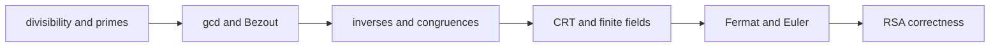
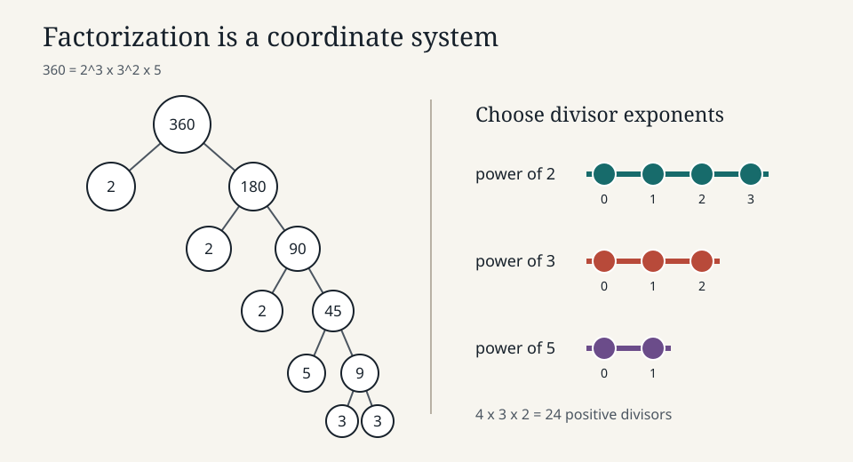
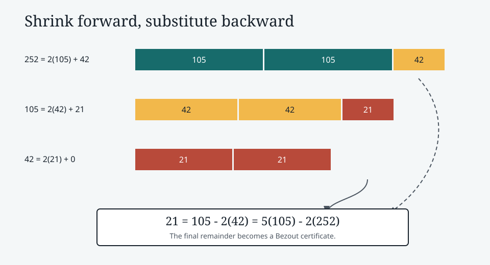
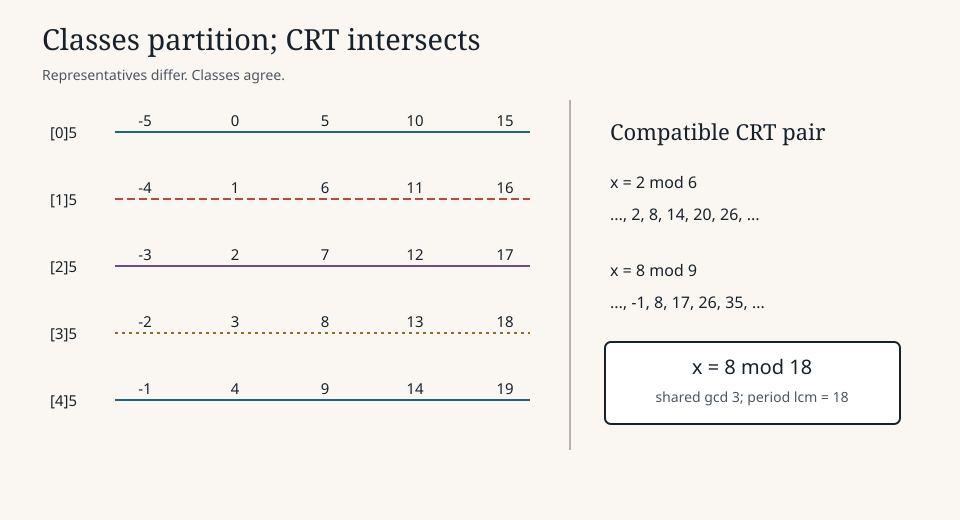
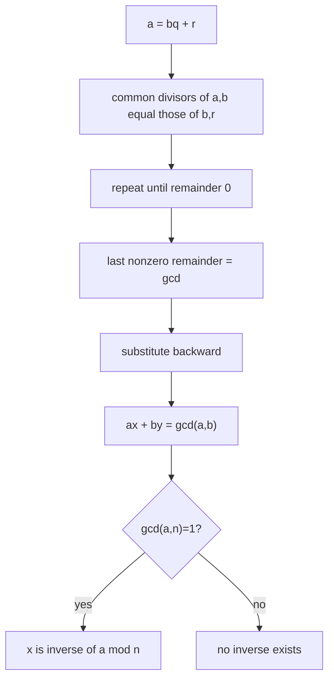
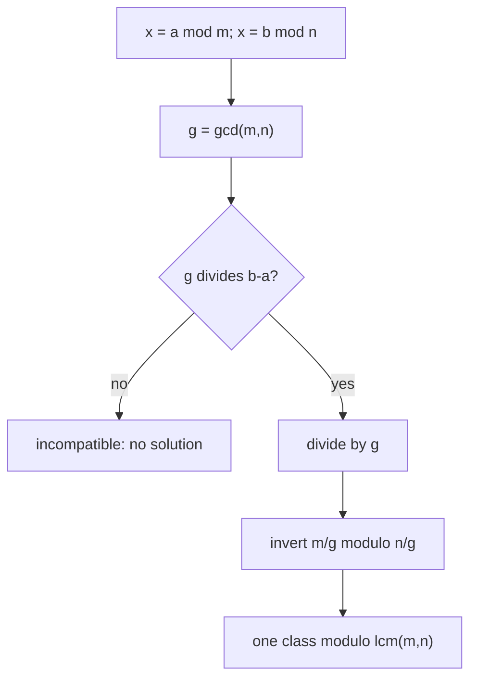
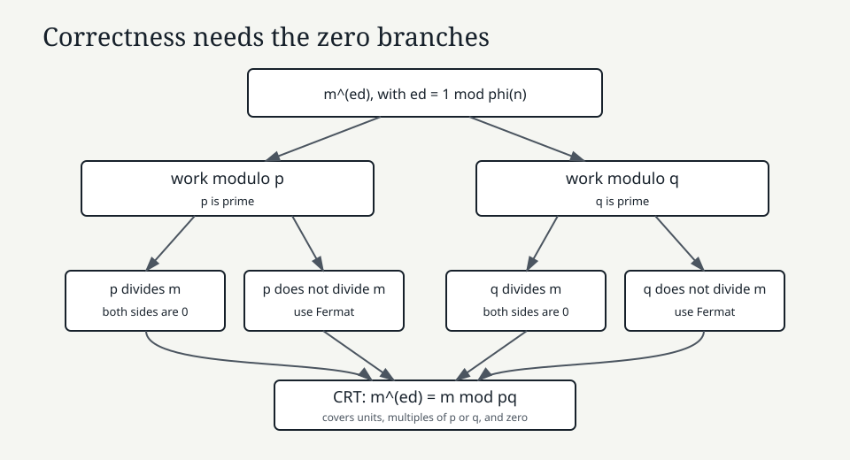
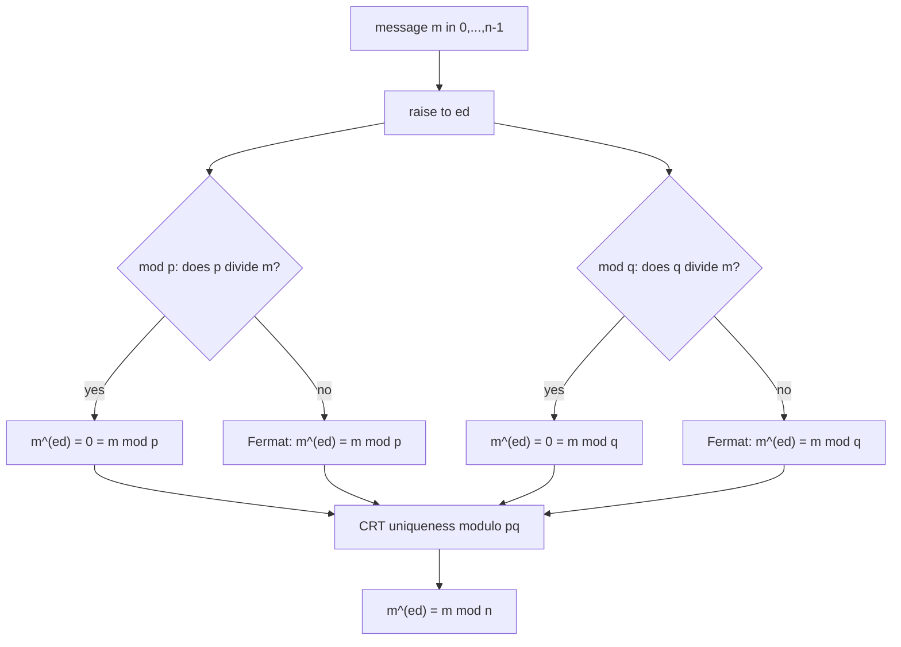

# 0.12 Elementary Number Theory

[Section home](../README.md) | Previous: [§0.11 Graph Theory](../00.11-graph-theory/README.md) | [Project guides](../../STYLE_GUIDE.md) | [Notation guide](../../NOTATION.md)

## Why this matters

Elementary number theory studies integers through division and remainder. Its
objects are familiar, but its arguments are unusually good training: a short
definition about divisibility grows into the Euclidean algorithm, Bézout's
identity, modular inverses, the Chinese remainder theorem (CRT), finite fields,
and finally a proof that textbook RSA arithmetic reverses itself.

That chain is more important here than any isolated trick.



> **Figure 1. The proof chain.** Each arrow carries a theorem and its input
> contract. Skipping a contract is how legal cancellation, inverse, and RSA
> arguments break. Original diagram.



> **Figure 2. Factorization turns divisibility into exponent bookkeeping.**
> The prime factorization $360=2^3 3^2 5$ determines every positive divisor.
> Shape and labels carry the structure without relying on color. Original
> figure.

Direct machine-learning relevance is low. The indirect computing relevance is
real: modular reduction appears in hash families, recurrences over finite state
spaces appear in pseudorandom generation, and finite-field arithmetic supports
error-correcting codes. Those subjects have their own contracts. Number theory
is a foundation for them, not an excuse to claim that every modular formula is
an ML method.

### Scope and non-goals

This module covers:

- divisibility, primes, and the fundamental theorem of arithmetic;
- normalized gcd and lcm;
- the division, Euclidean, and extended Euclidean algorithms;
- Bézout's identity;
- congruences, residue classes, and $\mathbb{Z}/n\mathbb{Z}$;
- exact conditions for cancellation and modular inverses;
- pairwise-coprime and general compatible CRT systems;
- finite fields $\mathbb{F}_p$ for prime $p$;
- Fermat's little theorem, Euler's theorem, and Euler's $\varphi$ function;
- textbook RSA construction and correctness for every residue class;
- small, exact, standard-library implementations.

This module defers:

- serious primality testing and prime generation;
- cryptographic security definitions, reductions, and attack analysis;
- production key generation, serialization, padding, side-channel resistance,
  and protocol design;
- abstract algebra beyond residue classes, units, and the field property needed
  here;
- elliptic curves, coding theory, and number-theoretic transforms;
- locality-sensitive hashing details and pseudorandom-generator design.

## Learning objectives

After completing this module, you should be able to:

- state divisibility, prime, factorization, gcd, lcm, and division contracts,
  including signs and zero;
- trace Euclid's algorithm, prove its invariant, and recover Bézout
  coefficients with the extended algorithm;
- reason with congruence classes, cancel legally, and prove that a modular
  inverse exists exactly for a unit;
- solve pairwise-coprime and compatible noncoprime CRT systems and refuse
  incompatible ones;
- distinguish $\mathbb{Z}/n\mathbb{Z}$ from the field $\mathbb{F}_p$ and apply Fermat or Euler only
  under the correct assumptions;
- construct and audit toy RSA arithmetic, including correctness for messages
  sharing a factor with the modulus and the boundary between an RSA primitive
  and secure practice.

The [exercise set](exercises/README.md) assesses every objective. Full [worked
solutions](solutions/README.md), tested [standard-library code](code/README.md),
and annotated [resources](resources/README.md) are separate.

## Prerequisite check

Required: [§0.04 Sets, Relations, and Functions](../00.04-sets-relations-functions/README.md)
and [§0.06 Proof Techniques](../00.06-proof-techniques/README.md).

Try these before starting:

1. Can you distinguish an integer from an equivalence class of integers?
2. Can you prove both directions of an if-and-only-if statement?
3. Can you use induction or well-ordering to justify termination?
4. Can you explain why one counterexample refutes a universal claim?
5. Can you follow a loop invariant and substitute equal expressions?

Review §0.04 for equivalence classes and §0.06 for proof structure.
[§0.07](../00.07-induction-recursion-invariants/README.md) helps with algorithm
invariants, and [§0.08](../00.08-counting-combinatorics/README.md) helps with
counting units, but neither is blocking.

## Historical context

The Euclidean algorithm is ancient, but its modern value is not historical
decoration. It computes gcds and also exposes the linear combination needed for
modular inversion. Open undergraduate treatments by Crisman and MIT develop
this route from integer division through congruences and cryptography [1], [2].

Rivest, Shamir, and Adleman published the RSA public-key construction in 1978
[3]. Modern specifications place its bare exponentiation inside larger encoded
schemes. RFC 8017 says directly that the primitive is not intended to provide
security apart from a scheme, and specifies OAEP for encryption and PSS for
signatures [4]. We will prove the primitive's arithmetic correctness. We will
not mistake that proof for a security proof.

## Intuition

### Divisibility asks for an exact integer scale

Writing $a\mid b$ means that multiplying $a$ by some integer lands exactly on
$b$. Remainders measure the failure of exact divisibility. Prime factorization
then gives every positive integer a coordinate system: one exponent per prime.

### The gcd is the information Euclid preserves

If $a=bq+r$, any common divisor of $a$ and $b$ also divides $r=a-bq$.
Conversely, any common divisor of $b$ and $r$ divides $a=bq+r$. Replacing
$(a,b)$ by $(b,r)$ discards size but preserves the full set of common divisors.



> **Figure 3. Euclid preserves common divisors while shrinking the remainder.**
> The final nonzero remainder is $21$. Reading substitutions backward produces
> $21=5(105)-2(252)$. Original figure.

### Congruence forgets the quotient and keeps the remainder class

Modulo $n$, integers that differ by a multiple of $n$ are treated as the same.
A clock is the standard picture, but an equivalence class is the actual object.
The integer $17$ is not literally $2$; their classes satisfy
$[17]_5=[2]_5$.



> **Figure 4. Residue classes partition the integers.** Each row is one class
> modulo $5$. The CRT later finds where partitions from different moduli
> intersect. Position and repeated labels distinguish classes. Original figure.

### An inverse is permission to divide

Ordinary algebra cancels a nonzero factor because every nonzero real number has
an inverse. In $\mathbb{Z}/n\mathbb{Z}$, only some classes do. Bézout tells us
exactly which: $[a]_n$ is invertible if and only if $\gcd(a,n)=1$.

### CRT splits one problem into compatible views

A residue modulo $mn$ determines residues modulo $m$ and $n$. When $m,n$ are
coprime, every pair of smaller views recombines uniquely modulo $mn$. With
noncoprime moduli, the views must agree where their cycles overlap.

## Mathematics

### Local notation

| Symbol | Domain | Meaning |
|---|---|---|
| $a,b,c,q,r$ | integers | values, quotient, and remainder |
| $n,m$ | integers at least $2$ when used as moduli | moduli |
| $p,q$ | primes, hence at least $2$ | prime factors |
| $a\mid b$ | proposition | $a$ divides $b$ |
| $\gcd(a,b)$ | nonnegative integer | normalized greatest common divisor |
| $\operatorname{lcm}(a,b)$ | nonnegative integer | normalized least common multiple |
| $a\equiv b\pmod n$ | proposition | $n\mid(a-b)$ |
| $[a]_n$ | set | residue class of $a$ modulo $n$ |
| $\mathbb{Z}/n\mathbb{Z}$ | set of $n$ classes | integers modulo $n$ |
| $U(n)$ | subset of $\mathbb{Z}/n\mathbb{Z}$ | multiplicative units modulo $n$ |
| $\varphi(n)$ | positive integer | $\lvert U(n)\rvert$ |
| $\mathbb{F}_p$ | field | $\mathbb{Z}/p\mathbb{Z}$ when $p$ is prime |

The glyphs $\mathbb{Z}/n\mathbb{Z}$ and $\mathbb{F}_p$ name algebraic objects.
In code, we store their canonical representatives $0,\ldots,n-1$.

### Divisibility, signs, and zero

For integers $a,b$,

$$
a\mid b
\quad\Longleftrightarrow\quad
\exists k\in\mathbb{Z}\text{ such that }b=ak.
$$

The definition settles the edge cases:

- every nonzero integer divides $0$ because $0=a\cdot0$;
- $0\mid b$ holds exactly when $b=0$;
- therefore $0\mid0$ is true under this definition;
- $a\mid b$ if and only if $-a\mid b$;
- divisors occur in sign pairs, while positive divisors are often counted alone.

For a **positive** divisor $d$, the notation $d\mid n$ never means $d/n$ is an
integer. Direction matters.

### The division algorithm

For every integer $a$ and every positive integer $n$, there are unique integers
$q,r$ such that

$$
a=qn+r,
\qquad 0\le r<n.
$$

For a negative divisor, normalize to $|n|$ before using this remainder
contract. For example,

$$
-17=(-4)(5)+3.
$$

Python follows this nonnegative-remainder convention when the modulus is
positive. The theorem excludes divisor zero.

### Primes and unique factorization

A **prime** is a positive integer $p\ge2$ whose only positive divisors are
$1$ and $p$. An integer $n\ge2$ that is not prime is composite. Thus $0$, $1$,
and negative integers are neither prime nor composite under this module's
contract.

**Fundamental theorem of arithmetic.** Every integer $n\ge2$ can be written

$$
n=p_1^{e_1}\cdots p_k^{e_k},
$$

where the $p_i$ are distinct primes and the $e_i$ are positive integers. This
factorization is unique up to the order of the prime factors. For a negative
integer, factor $|n|$ and record a separate sign $-1$. Zero has no prime
factorization, and the empty product represents $1$, not a prime factorization
of the theorem's domain.

Euclid's lemma is the load-bearing uniqueness step:

$$
p\text{ prime and }p\mid ab
\quad\Longrightarrow\quad
p\mid a\text{ or }p\mid b.
$$

### Normalized gcd and lcm

The greatest common divisor $\gcd(a,b)$ is the greatest **nonnegative** common
divisor, with conventions

$$
\gcd(0,0)=0,
\qquad
\gcd(a,0)=|a|.
$$

The least common multiple $\operatorname{lcm}(a,b)$ is nonnegative, with
$\operatorname{lcm}(a,0)=0$. For nonzero $a,b$,

$$
\gcd(a,b)\operatorname{lcm}(a,b)=|ab|.
$$

If prime exponents in $|a|$ and $|b|$ are $\alpha_p$ and $\beta_p$, then gcd
takes $\min(\alpha_p,\beta_p)$ and lcm takes
$\max(\alpha_p,\beta_p)$ coordinatewise.

### Euclid's invariant and termination

Given nonnegative $a$ and positive $b$, divide:

$$
a=bq+r,
\qquad 0\le r<b.
$$

Then

$$
\gcd(a,b)=\gcd(b,r).
$$

This is stronger than saying the gcd value happens to agree. The pairs have
exactly the same common divisors. Repeating the replacement strictly decreases
the positive second component, so the algorithm terminates. The last nonzero
remainder is the normalized gcd. If the initial second input is zero, the
algorithm returns the absolute first input without a division step.



> **Figure 5. Euclid becomes an inverse algorithm.** Forward division computes
> the gcd; backward coefficient updates prove Bézout and decide invertibility.
> Original diagram.

### Bézout's identity and the extended algorithm

For integers $a,b$, not both zero, there exist $x,y\in\mathbb{Z}$ such that

$$
ax+by=\gcd(a,b).
$$

Our convention also permits $(a,b)=(0,0)$ with coefficients such as $(1,0)$,
giving $0=0$. Bézout coefficients are generally not unique. If $g=\gcd(a,b)$
and $(x_0,y_0)$ is one pair, all pairs for nonzero $a,b$ have the form

$$
x=x_0+k\frac{b}{g},
\qquad
y=y_0-k\frac{a}{g},
\qquad k\in\mathbb{Z}.
$$

The extended Euclidean algorithm tracks each remainder as a linear combination
of the original inputs. It therefore returns the gcd and one coefficient pair
in the same asymptotic number of divisions as ordinary Euclid.

### Congruence and residue classes

For modulus $n\ge2$,

$$
a\equiv b\pmod n
\quad\Longleftrightarrow\quad
n\mid(a-b).
$$

Congruence is an equivalence relation on $\mathbb{Z}$. The class of $a$ is

$$
[a]_n=\{a+kn:k\in\mathbb{Z}\}.
$$

The quotient set

$$
\mathbb{Z}/n\mathbb{Z}=\{[0]_n,[1]_n,\ldots,[n-1]_n\}
$$

has exactly $n$ classes. Addition and multiplication are well-defined by

$$
[a]_n+[b]_n=[a+b]_n,
\qquad
[a]_n[b]_n=[ab]_n.
$$

You may add, subtract, multiply, and raise congruent values to nonnegative
integer powers. Division is not automatically legal.

### Legal cancellation

From

$$
ac\equiv bc\pmod n,
$$

we know $n\mid c(a-b)$. If $\gcd(c,n)=1$, Euclid's lemma generalized through
Bézout gives $n\mid(a-b)$, so $a\equiv b\pmod n$.

Without coprimality, full cancellation can fail:

$$
2\cdot1\equiv2\cdot4\pmod6,
\qquad
1\not\equiv4\pmod6.
$$

The precise weakened result is

$$
ac\equiv bc\pmod n
\quad\Longrightarrow\quad
a\equiv b\pmod{n/\gcd(c,n)}.
$$

### Modular inverses exist exactly for units

A class $[a]_n$ has a multiplicative inverse when some $x$ satisfies

$$
ax\equiv1\pmod n.
$$

**Inverse criterion.** For $n\ge2$, $[a]_n$ is invertible if and only if
$\gcd(a,n)=1$.

**Proof.** If $\gcd(a,n)=1$, Bézout gives $ax+ny=1$, hence
$ax\equiv1\pmod n$. Conversely, if $ax\equiv1\pmod n$, then
$ax-1=kn$, so $ax-kn=1$. Every common divisor of $a$ and $n$ divides $1$;
therefore the normalized gcd is $1$.

The invertible classes form the set of **units** $U(n)$. This limited language
is all the group theory we need here.

### Chinese remainder theorem

For two congruences

$$
x\equiv a\pmod m,
\qquad
x\equiv b\pmod n,
$$

let $g=\gcd(m,n)$. A solution exists if and only if

$$
a\equiv b\pmod g.
$$

When it exists, the solution is unique modulo $\operatorname{lcm}(m,n)=mn/g$.
This is the
**general compatibility form**. Pairwise coprime moduli make $g=1$, so every
residue pair is compatible and the solution is unique modulo $mn$.

To merge a compatible pair, write $x=a+mk$. Substitution gives

$$
mk\equiv b-a\pmod n.
$$

Divide the equation and modulus by $g$. Now $m/g$ is invertible modulo $n/g$,
which determines $k$ modulo $n/g$.



> **Figure 6. General CRT is a compatibility theorem first.** Pairwise
> coprimality makes the compatibility branch automatic, but it is sufficient,
> not necessary. Original diagram.

For pairwise-coprime $n_1,\ldots,n_k$, let $N=\prod_i n_i$,
$N_i=N/n_i$, and choose $M_i$ with $N_iM_i\equiv1\pmod{n_i}$. Then

$$
x\equiv\sum_{i=1}^k a_iN_iM_i\pmod N.
$$

Each term is $a_i$ in its own modulus and $0$ in every other modulus.

### Finite fields

A **field** is a number system where addition, subtraction, multiplication, and
division by every nonzero element are available and obey the usual algebraic
laws. For a prime $p$,

$$
\mathbb{F}_p\coloneqq\mathbb{Z}/p\mathbb{Z}
$$

is a field because every nonzero class $[a]_p$ has $\gcd(a,p)=1$ and hence an
inverse [1]. If $n$ is composite, choose a proper factorization $n=ab$ with
$1<a,b<n$. Then $[a]_n$ and $[b]_n$ are nonzero but

$$
[a]_n[b]_n=[0]_n.
$$

These zero divisors cannot occur in a field. Therefore
$\mathbb{Z}/n\mathbb{Z}$ is a field
exactly when $n$ is prime. We use only prime fields here. Extension fields and
their coding-theory applications are deferred.

### Euler's phi counts units

Euler's totient function is

$$
\varphi(n)\coloneqq|U(n)|
=|\{a\in\{0,\ldots,n-1\}:\gcd(a,n)=1\}|.
$$

Thus $\varphi(n)$ counts invertible residue classes, not primes below $n$. For a
prime power,

$$
\varphi(p^e)=p^e-p^{e-1}=p^{e-1}(p-1).
$$

If $\gcd(m,n)=1$, then $\varphi(mn)=\varphi(m)\varphi(n)$. CRT explains the product:
a unit modulo $mn$ corresponds to an independent pair of units modulo $m$ and
$n$. Consequently, if $n=\prod_i p_i^{e_i}$,

$$
\varphi(n)=n\prod_{p\mid n}\left(1-\frac1p\right)
=\prod_i p_i^{e_i-1}(p_i-1).
$$

### Fermat's little theorem

If $p$ is prime and $p\nmid a$, equivalently $[a]_p\ne[0]_p$, then

$$
a^{p-1}\equiv1\pmod p.
$$

The nonzero condition is required in this form. Multiplication by nonzero
$[a]_p$ permutes the $p-1$ nonzero classes; comparing their products and
cancelling $(p-1)!$ proves the result.

An equivalent form valid for every integer $a$ is

$$
a^p\equiv a\pmod p.
$$

When $p\mid a$, both sides are $0$ modulo $p$; otherwise multiply the first
form by $a$.

The converse is false as a primality test. For example, the composite Carmichael
number $561=3\cdot11\cdot17$ satisfies $a^{560}\equiv1\pmod{561}$ for every
$a$ coprime to $561$. This module does not develop primality testing.

### Euler's theorem

For $n\ge2$ and $\gcd(a,n)=1$,

$$
a^{\varphi(n)}\equiv1\pmod n.
$$

The coprimality condition is required. Multiplication by the unit $[a]_n$
permutes $U(n)$, so the same product-and-cancel argument used for Fermat works
over all units. Fermat's theorem is the prime case because $\varphi(p)=p-1$.

### Textbook RSA construction

For the two-prime teaching version:

1. choose distinct primes $p,q$;
2. set $n=pq$ and $\varphi(n)=(p-1)(q-1)$;
3. choose $e$ with $1<e<\varphi(n)$ and
  $\gcd(e,\varphi(n))=1$;
4. compute $d$ with $ed\equiv1\pmod{\varphi(n)}$;
5. restrict message representatives to $0\le m<n$;
6. compute $c\equiv m^e\pmod n$ and recover $m'\equiv c^d\pmod n$.

RFC 8017 uses the Carmichael exponent
$\lambda(n)=\operatorname{lcm}(p-1,q-1)$ in its key
validity condition and allows more than two distinct odd primes [4]. Using
$\varphi(n)$ here is a simpler sufficient teaching contract. It may produce a
different valid private exponent.



> **Figure 7. RSA correctness is proved prime by prime.** Each branch handles
> both unit and zero cases; CRT then identifies one residue modulo $pq$.
> Original figure.



> **Figure 8. The all-messages proof needs four branches.** Euler's theorem
> alone covers only messages coprime to $n$. The zero branches cover messages
> divisible by $p$ or $q$. Original diagram.

#### Correctness for every residue class

Because $ed=1+k(p-1)(q-1)$, we have $ed=1+k_p(p-1)$ for some $k_p$.
Modulo $p$:

- if $p\mid m$, then $m^{ed}\equiv0\equiv m$;
- if $p\nmid m$, Fermat gives
  $m^{ed}=m(m^{p-1})^{k_p}\equiv m$.

The same two-case argument works modulo $q$. Therefore
$m^{ed}\equiv m$ modulo both distinct primes. CRT says those two congruences
identify one class modulo $pq=n$, so

$$
(m^e)^d\equiv m\pmod n
$$

for **every** message representative, including $0$, multiples of $p$,
multiples of $q$, and units.

> **Security boundary:** Raw textbook RSA is deterministic and is not secure
> encryption or a secure signature scheme. The toy code generates no secure
> primes, performs no approved encoding or padding, protects no private key,
> resists no timing or fault attack, and proves no security property. Use a
> maintained cryptographic library and a current protocol profile. RFC 8017
> requires a scheme around the primitive and specifies RSAES-OAEP and
> RSASSA-PSS for modern constructions [4]. NIST separately specifies approved
> RSA signature and key-establishment requirements [5].

## Derivation

### From divisibility to gcd

The equation $a=bq+r$ makes the Euclid invariant reversible:

$$
d\mid a\land d\mid b
\iff d\mid b\land d\mid(a-bq)
\iff d\mid b\land d\mid r.
$$

This proves equality of common-divisor sets, not only equality of their maxima.

### From gcd to inverses

Extended Euclid gives $ax+ny=g$. Setting $g=1$ and reducing modulo $n$
removes the $ny$ term:

$$
ax+ny=1
\implies ax\equiv1\pmod n.
$$

The reverse direction converts an inverse congruence back into a linear
combination of $a$ and $n$, forcing the gcd to divide $1$.

### From inverses to CRT

Substituting $x=a+mk$ transforms simultaneous congruences into one linear
congruence. The inverse criterion solves it exactly when the residues agree
modulo $\gcd(m,n)$. This derivation explains both the constructive algorithm and
the refusal case.

### From finite fields to Fermat and Euler

Multiplication by a unit is injective: $au=av$ permits cancellation by
$a^{-1}$. On a finite set, injective means bijective, so multiplication
permutes the units. Products before and after permutation agree; cancelling the
product of all units yields the power theorem.

### From Fermat and CRT to RSA

Fermat handles nonzero residues in each prime field. Direct zero arithmetic
handles residues divisible by a key prime. CRT recombines the two conclusions.
This is why the RSA proof works for all classes even though Fermat's
multiplicative form does not include zero.

## Implementation

The tested implementation lives in [`code/number_theory.py`](code/number_theory.py).
It uses exact integer arithmetic and the standard library only. Python's
three-argument `pow` computes modular powers efficiently and, with exponent
$-1$, computes an inverse only when the base and modulus are coprime [6]. We use
it as a reference comparison after implementing the mechanisms ourselves.

The same boundary applies to nearby computing topics. NIST's deterministic
random-bit mechanisms are based on hash functions or block ciphers, not a toy
linear congruential recurrence [7]. Its Secure Hash Standard specifies
cryptographic message digests, a different contract from a modular hash family
used to place keys in a table [8].

### Trace Euclid and verify Bézout

```python
from number_theory import extended_gcd, gcd_trace

common, steps = gcd_trace(-252, 105)
assert common == 21
assert all(a == q * b + r and 0 <= r < b for a, b, q, r in steps)

result = extended_gcd(-252, 105)
assert result.gcd == 21
assert -252 * result.x + 105 * result.y == 21
```

### Refuse a nonunit inverse

```python
from number_theory import modular_inverse

assert modular_inverse(38, 97) == 23 == pow(38, -1, 97)
try:
    modular_inverse(6, 15)
except ValueError:
    pass
else:
    raise AssertionError("a nonunit must not receive an inverse")
```

### Solve both CRT forms

```python
from number_theory import chinese_remainder

assert chinese_remainder(((2, 3), (3, 5), (2, 7))) == (23, 105)
assert chinese_remainder(((2, 6), (8, 9))) == (8, 18)

try:
    chinese_remainder(((1, 4), (2, 6)))
except ValueError:
    pass
else:
    raise AssertionError("incompatible congruences must be refused")
```

### Factor only small teaching inputs

```python
from number_theory import phi, trial_factorization

assert trial_factorization(360) == ((2, 3), (3, 2), (5, 1))
assert phi(360) == 96
```

Trial division is transparent but not suitable for large inputs. The function
requires $n\ge2$ and makes no cryptographic performance claim.

### Audit a prime field

```python
from number_theory import fp_divide, fp_inverse

assert fp_inverse(3, 7) == 5
assert fp_divide(4, 3, 7) == 6

try:
    fp_inverse(3, 8)
except ValueError:
    pass
else:
    raise AssertionError("a composite modulus is not F_p")
```

### Demonstrate toy RSA, including nonunits

```python
from number_theory import make_toy_rsa_key, toy_rsa_decrypt, toy_rsa_encrypt

key = make_toy_rsa_key(11, 17, 7)
assert (key.n, key.phi, key.d) == (187, 160, 23)

for message in (0, 11, 17, 22, 42, 186):
    ciphertext = toy_rsa_encrypt(message, key)
    assert toy_rsa_decrypt(ciphertext, key) == message
```

The names include `toy` because the code is an arithmetic exhibit, not a
cryptographic API.

## Experimentation

### Experiment 1: Euclid's preserved set

For several signed pairs, enumerate all positive common divisors before and
after each Euclidean step. Verify that the sets agree, not only their maxima.
State why the finite experiment supports the trace but does not prove the
invariant for every integer pair.

### Experiment 2: inverse density

For $2\le n\le30$, count residues coprime to $n$ and compare with
`phi(n)`. Plotting is optional; a table already reveals that primes have
$n-1$ units while composite moduli have zero divisors.

### Experiment 3: CRT compatibility

Enumerate residue pairs for moduli $6$ and $9$. For each pair, compare brute
force over $0,\ldots,17$ with the condition $a\equiv b\pmod3$. Every compatible
pair should have one solution modulo $18$.

### Experiment 4: Fermat witnesses and liars

Compare $a^{n-1}\bmod n$ for small primes, ordinary composites, and $561$.
Record bases that expose compositeness and bases that do not. Do not infer a
general primality test from this bounded table.

### Experiment 5: every toy RSA message

For $p=11,q=17,e=7$, test all $187$ representatives. Partition them into
units, nonzero multiples of $p$, nonzero multiples of $q$, and zero. Confirm
round-trip correctness in every group and explain which proof branch covers
each.

## Worked examples

### Worked example 1: zero divisibility

$7\mid0$ because $0=7\cdot0$. Also $0\mid0$. But $0\nmid7$ because no integer
$k$ satisfies $7=0k$.

### Worked example 2: negative division

The division algorithm with positive modulus gives
$-23=(-5)5+2$. The canonical residue is $2$, not $-3$.

### Worked example 3: factorization and divisor count

$360=2^3 3^2 5$. A positive divisor chooses exponents
$0\le i\le3$, $0\le j\le2$, $0\le k\le1$, so there are
$(3+1)(2+1)(1+1)=24$ positive divisors.

### Worked example 4: gcd and lcm

$84=2^2\cdot3\cdot7$ and $126=2\cdot3^2\cdot7$. Thus
$\gcd(84,126)=2\cdot3\cdot7=42$ and
$\operatorname{lcm}(84,126)=2^2\cdot3^2\cdot7=252$.

### Worked example 5: Euclid and Bézout

$$
252=2(105)+42,
\quad105=2(42)+21,
\quad42=2(21).
$$

Back-substitution gives
$21=105-2(252-2(105))=5(105)-2(252)$.

### Worked example 6: inverse

From $1=23(38)-9(97)$, reduce modulo $97$ to obtain
$38\cdot23\equiv1\pmod{97}$. Therefore $38^{-1}\equiv23$.

### Worked example 7: illegal cancellation

$2x\equiv2\pmod6$ simplifies only to $x\equiv1\pmod3$. Both $x=1$ and
$x=4$ satisfy the original congruence modulo $6$.

### Worked example 8: pairwise-coprime CRT

The system $x\equiv2\pmod3$, $x\equiv3\pmod5$, and
$x\equiv2\pmod7$ has solution $x\equiv23\pmod{105}$.

### Worked example 9: compatible noncoprime CRT

$x\equiv2\pmod6$ and $x\equiv8\pmod9$ are compatible because
$2\equiv8\pmod3$. Their common solutions are $x\equiv8\pmod{18}$.

### Worked example 10: field versus ring

In $\mathbb{F}_7$, $3^{-1}=5$ because $3\cdot5\equiv1$. In
$\mathbb{Z}/8\mathbb{Z}$, $[2][4]=[0]$ with both factors nonzero, so
$\mathbb{Z}/8\mathbb{Z}$ is not a field.

### Worked example 11: Euler reduction

$\varphi(20)=8$ and $\gcd(3,20)=1$. Since $100=12(8)+4$,

$$
3^{100}\equiv(3^8)^{12}3^4\equiv1^{12}\cdot81\equiv1\pmod{20}.
$$

### Worked example 12: RSA nonunit

For $p=11,q=17,e=7,d=23$, message $m=22$ shares factor $11$ with
$n=187$. Euler's theorem modulo $187$ is unavailable. Modulo $11$, both the
message and its decrypted power are zero. Modulo $17$, Fermat handles the
nonzero class. CRT recombines the two equalities to recover $22$ modulo $187$.

## Common mistakes

### Treating zero like an ordinary divisor

Zero divides only zero, while every nonzero integer divides zero.

### Calling one prime

The prime domain begins at $2$. Unique factorization uses $1$ as the empty
product, not as another prime.

### Forgetting gcd normalization

The gcd is nonnegative even when inputs or Bézout coefficients are negative.

### Using a negative or zero modulus silently

This module requires $n\ge2$ for congruence classes. Normalize a negative
divisor and reject modulus zero.

### Cancelling a nonunit

You may cancel $c$ modulo $n$ without weakening the modulus only when
$\gcd(c,n)=1$.

### Claiming every nonzero class has an inverse

That is true in $\mathbb{F}_p$, not in $\mathbb{Z}/n\mathbb{Z}$ for composite $n$.

### Stating CRT only for coprime moduli

Pairwise coprimality guarantees compatibility. General systems exist exactly
when residues agree modulo every relevant gcd.

### Saying phi counts primes

$\varphi(n)$ counts units modulo $n$.

### Dropping Fermat's nonzero condition

$a^{p-1}\equiv1$ requires $p\nmid a$. Use $a^p\equiv a$ for the all-integer
form.

### Applying Euler without coprimality

Euler's theorem acts on units. A shared factor can invalidate the conclusion.

### Proving RSA only for units

An all-message proof must branch on divisibility by $p$ and $q$, then use CRT.

### Calling raw RSA secure

Arithmetic reversibility is not confidentiality, authenticity, randomized
encoding, key safety, or side-channel resistance.

### Treating tests as universal proof

Finite tests validate examples and implementation behavior. The theorem proofs
establish the universal integer claims.

## Exercises

The [exercise set](exercises/README.md) contains 12 progressive problems from
divisibility contracts through an all-residue RSA proof and security audit.
Exact mirrored [worked solutions](solutions/README.md) are committed separately.
All programming uses the standard library.

## What you should now be able to do

You should now be able to:

- move from divisibility definitions to prime-exponent calculations;
- normalize gcd and lcm across signs and zero;
- prove and trace Euclid's invariant and produce Bézout coefficients;
- interpret congruence as equivalence, not approximate equality;
- decide cancellation, inverse, and linear-congruence legality with a gcd;
- solve or refuse general CRT systems;
- explain why prime modulus gives a field and composite modulus does not;
- state Fermat and Euler with their exact input conditions;
- prove textbook RSA correctness for every message class;
- explain why the teaching implementation must not be used for security.

## Where this leads

Section §0.13 develops Python and scientific-computing practice, §0.14 develops
algorithm analysis and hashing, and §0.15 places efficient computation in a
complexity framework. Later information-theory and coding modules revisit
finite fields. Cryptographic protocols, secure key generation, primality
testing, elliptic curves, and number-theoretic transforms require dedicated
treatments beyond this foundation.

Continue to [§0.13 Programming and Scientific Computing](../00.13-programming-scientific-computing/README.md).

## References

[1] K.-D. Crisman, *Number Theory: In Context and Interactive*, 2024/6 ed.,
Chapters 2, 4-9, and 11. CC BY-ND 4.0 text; no prose, exercise, solution, or
figure adapted. https://math.gordon.edu/ntic/ntic/ntic.html Accessed
2026-09-01.

[2] E. Lehman, F. T. Leighton, and A. R. Meyer, *Mathematics for Computer
Science*, MIT OpenCourseWare 6.042J, Spring 2015, Chapter 8. CC BY-NC-SA 4.0.
https://ocw.mit.edu/courses/6-042j-mathematics-for-computer-science-spring-2015/pages/readings/
Accessed 2026-09-01.

[3] R. L. Rivest, A. Shamir, and L. Adleman, "A Method for Obtaining Digital
Signatures and Public-Key Cryptosystems," *Communications of the ACM*, vol. 21,
no. 2, pp. 120-126, 1978. https://doi.org/10.1145/359340.359342

[4] K. Moriarty, B. Kaliski, J. Jonsson, and A. Rusch, "PKCS #1: RSA
Cryptography Specifications Version 2.2," RFC 8017, 2016, especially §§3,
5-8, and 10. https://www.rfc-editor.org/rfc/rfc8017 Accessed 2026-09-01.

[5] National Institute of Standards and Technology, *Digital Signature
Standard (DSS)*, FIPS 186-5, 2023; and *Recommendation for Pair-Wise Key
Establishment Using Integer Factorization Cryptography*, SP 800-56B Rev. 2,
2019, reaffirmed 2026. https://doi.org/10.6028/NIST.FIPS.186-5 and
https://doi.org/10.6028/NIST.SP.800-56Br2 Accessed 2026-09-01.

[6] Python Software Foundation, "Built-in Functions: `pow`" and "`math`:
Number-theoretic functions," Python 3.14 documentation. PSF License Version 2;
documentation examples additionally 0BSD.
https://docs.python.org/3/library/functions.html#pow and
https://docs.python.org/3/library/math.html#number-theoretic-functions Accessed
2026-09-01.

[7] National Institute of Standards and Technology, *Recommendation for Random
Number Generation Using Deterministic Random Bit Generators*, SP 800-90A Rev.
1, 2015. The approved mechanisms are based on hash functions or block ciphers,
not the toy modular recurrences sometimes used to introduce PRNGs.
https://doi.org/10.6028/NIST.SP.800-90Ar1 Accessed 2026-09-01.

[8] National Institute of Standards and Technology, *Secure Hash Standard*,
FIPS 180-4, 2015. It specifies cryptographic message-digest algorithms; this is
distinct from using a modular hash family in a hash table.
https://doi.org/10.6028/NIST.FIPS.180-4 Accessed 2026-09-01.

[Section home](../README.md) | Previous: [§0.11 Graph Theory](../00.11-graph-theory/README.md) | Next: [§0.13 Programming and Scientific Computing](../00.13-programming-scientific-computing/README.md) | [Exercises](exercises/README.md) | [Worked solutions](solutions/README.md) | [Resources](resources/README.md) | [Code](code/README.md)