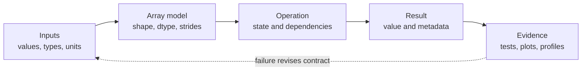
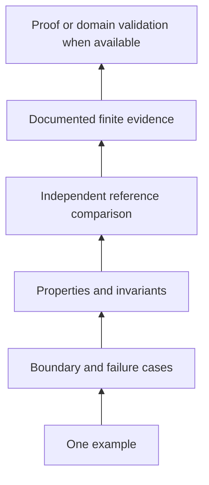
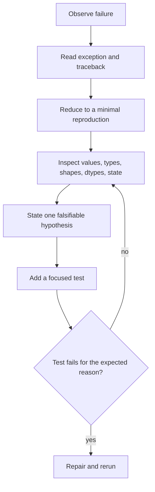
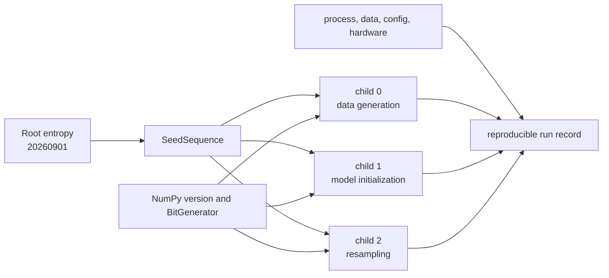

# 0.13 Programming and Scientific Computing

## Why this matters

A numerical result is not only a number. It is a claim produced by a process.
To evaluate the claim, we need to know what entered the process, which
operations ran, which assumptions were enforced, and what evidence checks the
result.

Consider a later machine-learning line:

```text
logits = features @ weights.T + bias
```

The line is meaningful only after we answer questions such as these:

- Are the inputs numeric arrays?
- Which axis holds examples and which holds features?
- Does the dtype have enough range and precision?
- Are `bias` values measured in compatible units?
- Is any input a mutable view into other data?
- Which library versions implement `@` and broadcasting?
- Did tests check a reference calculation and failure cases?
- Can another process reconstruct the environment and input data?

This module treats those questions as **computational contracts**. Python is the
working language, NumPy is the array model, Matplotlib supports exploratory
plots, and the standard library supplies testing, debugging, profiling, and
process inspection. The goal is not to teach all Python syntax. It is to make
the computational assumptions of every later implementation visible.

## Learning objectives

By the end of this module, you should be able to:

1. design a Python function or small class whose input, output, state, and
   exception contracts are explicit;
2. predict NumPy shape, dtype, memory sharing, broadcasting, and `*` versus `@`
   behavior before running an operation;
3. test numerical code with examples, properties, invariants, failure cases,
   tolerances, and trusted reference comparisons;
4. debug from a traceback to a minimal reproduction and inspect state at a
   breakpoint;
5. measure time and Python-tracked memory without turning observations into
   universal performance claims;
6. construct reproducible independent random streams and record enough process,
   environment, data, and hardware context to reproduce a run.

## Prerequisite check

There are no formal prerequisites. Basic programming exposure helps. Check that
you can answer or are ready to investigate these questions:

- What does a function promise about accepted inputs and returned outputs?
- Why can iterating over the same generator twice produce different results?
- For an array with shape `(8, 3)`, what do `size` and `ndim` report?
- Why might changing a slice also change its source array?
- What evidence would make you trust a computed answer?

Review [§0.01](../00.01-mathematical-notation/README.md) for shape notation,
[§0.03](../00.03-exponents-logarithms/README.md) for floating-point stability,
or [§0.07](../00.07-induction-recursion-invariants/README.md) for invariants.

## Historical context

Python grew into a common scientific language by combining a readable general
language and standard library with specialized array and plotting libraries.
The official Python tutorial defines the function, module, class, iterator, and
exception mechanisms used here [1]. NumPy supplies homogeneous multidimensional
arrays and vectorized operations [2]. Matplotlib separates plotting commands
from interactive or file-writing backends [3].

That combination matters more than a language popularity story. A pure Python
loop, a NumPy operation, a test runner, and a plotting backend have different
contracts and different evidence. Scientific work becomes more reliable when
we stop treating them as interchangeable black boxes.

## Intuition

### A result is a contract chain



An implementation is trustworthy only relative to a stated contract. The
contract does not guarantee that our scientific model is appropriate. It makes
the program's claim inspectable.

Use this ledger for important computations:

| Contract field | Question |
|---|---|
| values | Which ranges, missing values, or special values are legal? |
| types | Which Python objects are accepted and returned? |
| shapes | What does each axis mean, and which lengths must agree? |
| dtypes | What range, precision, signedness, and byte width are used? |
| units | Are values seconds, meters, dollars, pixels, or unitless? |
| state | What can mutate, advance, cache, or be consumed? |
| dependencies | Which language, packages, operating tools, and data are needed? |
| versions | Which exact implementations were observed? |
| provenance | Where did code, parameters, and data originate? |
| hardware | Which architecture, accelerator, thread count, or memory limit mattered? |
| evidence | Which tests, references, diagnostics, plots, and profiles support trust? |

### Materialized collections and one-shot streams

A list stores references to all of its elements and can normally be traversed
again. An iterator represents a position in a stream. Calling `next()` advances
that state, and exhaustion raises `StopIteration` [1]. A generator is an
iterator whose execution state is suspended at `yield`.

```python
values = [2, 4, 9]
stream = (value for value in values)

assert sum(values) == 15
assert sum(values) == 15
assert sum(stream) == 15
assert sum(stream) == 0
```

This is not a memory trivia question. A function accepting `Iterable[float]`
must not silently assume that it can make two passes. Materialize with `list()`
only when repeated traversal is part of the contract and the memory cost is
acceptable.

### Exceptions name contract violations

An exception is a structured report that normal execution cannot satisfy its
contract. Use `TypeError` when the kind of object is unsupported, `ValueError`
when the type is acceptable but the value is not, and a focused custom
exception when callers need to distinguish a domain failure. Catch only errors
you can handle. Unexpected exceptions should retain their traceback.

The traceback is evidence. Read it from the final exception upward through the
call stack. The final line names the failure; earlier frames show how execution
arrived there.

## Mathematics

### Shape, size, and dimensionality

Let an array $\boldsymbol{a}$ have shape

$$
(d_0,d_1,\ldots,d_{k-1}).
$$

Then:

$$
\operatorname{ndim}(\boldsymbol{a})=k,
\qquad
\operatorname{size}(\boldsymbol{a})=\prod_{j=0}^{k-1}d_j.
$$

`shape` is the tuple of axis lengths, `ndim` is the number of axes, and `size`
is the total number of elements [2]. None of these identifies axis meaning. A
shape `(32, 128)` might mean examples by features, time by sensors, or height by
width. Names and units belong beside the shape.

### Dtype is arithmetic policy

NumPy arrays are homogeneous. Their `dtype` determines representation and
therefore range, precision, signedness, and operation behavior. Python integers
can grow, but fixed-width NumPy integers cannot. For signed $b$-bit integers,

$$
-2^{b-1}\le x\le 2^{b-1}-1.
$$

Overflow may wrap during array arithmetic. Floating-point values trade exactness
for a wide dynamic range. A 32-bit float generally stores fewer significant
bits than a 64-bit float. Conversion is not free evidence that values remain
meaningful.

```python
import numpy as np

values = np.array([120, 120], dtype=np.int8)
wrapped = values + np.array([10, 20], dtype=np.int8)
assert wrapped.tolist() == [-126, -116]

rounded = np.float32(16_777_216) + np.float32(1)
assert rounded == np.float32(16_777_216)
```

For floating results, exact equality is usually the wrong contract. A common
test is

$$
|a-b|\le \text{atol}+\text{rtol}|b|.
$$

The absolute tolerance controls behavior near zero. The relative tolerance
scales with a reference magnitude. Choose both from the problem's units and
error budget, not from habit.

### Strides are byte steps

For an index $(i_0,\ldots,i_{k-1})$ and strides
$(s_0,\ldots,s_{k-1})$, NumPy computes a byte offset

$$
\operatorname{offset}=\sum_{j=0}^{k-1}i_js_j.
$$

In ordinary C-contiguous, row-major storage, the last axis changes fastest. A
`float64` array with shape `(2, 3)` typically has strides `(24, 8)`: move 24
bytes to the next row and 8 bytes to the next column [2]. A transpose can change
strides without moving data.


*Figure 1. Shape describes logical axes while strides map indices to byte
offsets. Basic slicing can share the buffer; advanced indexing allocates a new
one. Original figure.*

### Views, copies, and aliasing

A view has separate array metadata but shares data memory. A copy owns a
duplicated data buffer. Under NumPy's indexing rules:

- basic slicing with slices, ellipsis, and `None` returns views, while selecting
  one element with integer indices returns an array scalar;
- advanced indexing with integer or Boolean arrays returns copies;
- `reshape` returns a view when strides can express the layout, otherwise a
  copy may be required;
- assignment through an index writes to the original selection.

Use `np.shares_memory` for an exact sharing check. `np.may_share_memory` is a
conservative, cheaper check that can report possible sharing without proving
it. The `.base` attribute is useful context, but chains of views mean it should
not be treated as an identity test for the immediate parent.

### Broadcasting aligns trailing dimensions

Two axis lengths are compatible if they are equal or either is $1$. Compare
shapes from right to left, treating missing leading axes as length $1$ [2].


*Figure 2. `(5, 1, 4)` and `(3, 4)` broadcast to `(5, 3, 4)`. `(2, 3)` and
`(2,)` fail at the trailing axis. Original figure.*

```python
import numpy as np

left = np.ones((5, 1, 4))
right = np.arange(12).reshape(3, 4)
assert (left + right).shape == (5, 3, 4)

try:
    np.ones((2, 3)) + np.ones((2,))
except ValueError:
    pass
else:
    raise AssertionError("incompatible trailing dimensions must fail")
```

Broadcasting does not necessarily materialize repeated input data, but the
result or intermediate arrays can still be large. Short vectorized syntax can
increase memory use.

### Elementwise multiplication and matrix multiplication

For arrays with the same broadcast shape, `left * right` multiplies
corresponding elements. For matrices
$\mathbf{A}\in\mathbb{R}^{m\times n}$ and
$\mathbf{B}\in\mathbb{R}^{n\times p}$, `A @ B` contracts the shared dimension:

$$
(\mathbf{A}\mathbf{B})_{ij}=\sum_{k=1}^{n}A_{ik}B_{kj},
\qquad
\mathbf{A}\mathbf{B}\in\mathbb{R}^{m\times p}.
$$

```python
import numpy as np

left = np.array([[1, 2], [3, 4]])
right = np.array([[5, 6], [7, 8]])
assert (left * right).tolist() == [[5, 12], [21, 32]]
assert (left @ right).tolist() == [[19, 22], [43, 50]]
```

### Vectorization is semantics first

Vectorization means expressing work as array operations instead of a Python
loop over scalar elements. NumPy universal functions apply typed inner loops,
broadcasting, and casting rules [2]. This often moves iteration into compiled
code, but it is not a guarantee of speed. Temporary arrays, memory traffic,
noncontiguous layouts, tiny inputs, unsupported dtypes, or a poor algorithm can
erase the advantage. Semantically equivalent code is a hypothesis to benchmark,
not a performance theorem.

## Derivation

### Derive a batch affine contract

Suppose examples are rows:

$$
\mathbf{X}\in\mathbb{R}^{b\times d},
\quad
\mathbf{W}\in\mathbb{R}^{o\times d},
\quad
\boldsymbol{c}\in\mathbb{R}^{o}.
$$

We want one output row per example and one column per output feature:

$$
\mathbf{Y}=\mathbf{X}\mathbf{W}^{\top}+\boldsymbol{c}
\in\mathbb{R}^{b\times o}.
$$

The matrix product shape follows from

$$
(b,d)@(d,o)\to(b,o).
$$

The bias aligns as `(o,)`, so trailing-axis broadcasting gives

$$
(b,o)+(o,)\to(b,o).
$$

That derivation produces executable checks: rank two, equal feature lengths,
rank-one bias of length $o$, numeric finite values, and a documented output
dtype. [`affine_batch`](code/scientific_computing.py) enforces those checks.

### Derive stable log-sum-exp

Direct evaluation of

$$
\log\sum_i e^{x_i}
$$

can overflow even when the final logarithm is representable. Let
$m=\max_i x_i$. Then

$$
\log\sum_i e^{x_i}
=m+\log\sum_i e^{x_i-m}.
$$

Every shifted exponent is at most $e^0=1$. The operation is algebraically
equivalent in exact arithmetic and safer in floating arithmetic. A test should
compare it against a higher-precision reference over values that make the naive
form fail.

### Derive an evidence ladder



Tests establish observed behavior on their tested domain. They do not validate
unstated units, biased data, an inappropriate model, or every possible input.

## Implementation

The module code is in [`code/scientific_computing.py`](code/scientific_computing.py),
with contracts and commands documented in the [code guide](code/README.md).
Run examples from the `code/` directory so imports resolve consistently.

### Functions, classes, modules, and state

Use a function when a transformation can be explained by explicit arguments and
a return value. Use a small class when state and operations belong together.
`RunningMean` is a class because `count` and `total` persist across updates and
must preserve an invariant:

$$
\text{mean}=\frac{\text{total}}{\text{count}}
\quad\text{when count}>0.
$$

The source file is a module. Importing it creates a namespace and makes its
definitions reusable [1]. This module is intentionally not turned into a
repository-wide package. Full packaging belongs to projects that need
distribution, not to every teaching example.

### Tests before trust

Python's `unittest` discovers methods beginning with `test`, isolates test-case
instances, and provides specific assertions for values and exceptions [4]. A
numerical test suite should combine:

- hand-computed examples;
- shape and dtype assertions;
- invalid-input and boundary cases;
- properties such as translation invariance or conservation;
- state invariants;
- comparisons against a trusted implementation;
- tolerances justified by scale and dtype.

Property-based testing is a strategy, not necessarily a library: quantify a
property over a stated generated or enumerated domain. Third-party generators
can help later, but a plain loop is enough to learn the evidence boundary.

```python
import numpy as np
from scientific_computing import stable_logsumexp

rng = np.random.default_rng(314)
for _ in range(25):
    values = rng.normal(size=(4, 7))
    shift = rng.normal()
    observed = stable_logsumexp(values + shift, axis=1)
    expected = stable_logsumexp(values, axis=1) + shift
    np.testing.assert_allclose(observed, expected, rtol=1e-13, atol=1e-13)
```

### Debugging as contract localization

Use this route:



When static inspection is insufficient, `breakpoint()` enters Python's debugger.
`where`, `up`, `down`, `next`, `step`, `p expression`, and `continue` expose
stack and state [5]. A breakpoint is useful after you know which question to
ask. Random stepping is not a substitute for a minimal reproduction.

### Plotting as evidence, not decoration

A plot should name axes and units, expose transformations, and preserve the
data-to-mark mapping. Matplotlib's noninteractive `Agg` backend writes raster
files without opening a window [3]. The module's plotting helper creates a
`Figure`, labels both axes, writes only to a caller-provided path, and is tested
inside a temporary directory.

### Validation environment

On 2026-09-01, the module code and fences were validated with:

- CPython `3.14.4` at `/home/mschladt/projects/Intelligence-Assembled/.venv/bin/python`;
- NumPy `2.5.2`;
- Matplotlib `3.11.1`;
- `PYTHONDONTWRITEBYTECODE=1`;
- `MPLBACKEND=Agg`.

Those versions are validation provenance, not timeless minimum requirements.
No repository-level dependency declaration existed, so this module does not
invent packaging architecture.

## Experimentation

### Benchmark observations, not folklore

`timeit` separates setup from timed execution, repeats measurements, and
temporarily disables garbage collection by default. `cProfile` records call
counts and function times but is for finding where execution time goes, not for
benchmark comparison. `tracemalloc` traces memory blocks handled by Python's
allocators [6]. It does not promise a complete view of native allocations made
inside NumPy or another extension.

A defensible microbenchmark records:

1. the exact operation and inputs;
2. setup excluded from timing;
3. warmup policy;
4. calls per repeat and all repeat observations;
5. Python, NumPy, platform, and relevant hardware context;
6. the absence of universal conclusions.

Do not assert that one implementation must finish under a fixed threshold in a
unit test. Machines and workloads differ. A timing can refute "always faster"
with one counterexample, but no finite benchmark proves universal speed.

### Environments, dependencies, Git, and data

A virtual environment isolates a project's installed packages. PyPA recommends
virtual environments for third-party dependencies and documents requirements
files and `pip freeze` as environment-capture tools [7]. Exact freezing can
reconstruct installed versions more closely, but it does not capture the
operating system, native libraries, CPU, environment variables, data, or command.

Git records file history. `git status` distinguishes tracked changes and
untracked paths, `git diff` compares states, and `git log` shows commit history
[8]. A commit identifies code, not the entire experiment.

For a reproducible run, capture at least:

- command and working directory;
- source commit plus whether the tree was dirty;
- Python executable and exact package versions;
- input data identifier, checksum, license, and preprocessing;
- configuration and units;
- PRNG algorithm, root entropy, and stream identity;
- relevant hardware and parallelism;
- outputs, logs, tests, and known limitations.

### PRNG state and independent streams

A pseudorandom number generator is deterministic state transition plus output.
A seed initializes state. Reusing one global stream couples results to call
order. Calling `seed(0)` records only one integer and often hides which code
consumed the stream, which generator algorithm ran, which library version was
used, and whether process forks duplicated state.

NumPy's `Generator` owns a `BitGenerator`; `default_rng` constructs a new
instance rather than managing one global generator. NumPy explicitly gives
`Generator` no cross-version bitstream compatibility guarantee [9].
`SeedSequence.spawn` mixes root entropy with child positions to create
reproducible, very-probably independent child streams [9].



```python
from scientific_computing import spawn_generators

first = spawn_generators(20260901, 3)
second = spawn_generators(20260901, 3)

first_draws = [stream.integers(0, 1000, size=6) for stream in first]
second_draws = [stream.integers(0, 1000, size=6) for stream in second]
assert all((left == right).all() for left, right in zip(first_draws, second_draws))
assert not (first_draws[0] == first_draws[1]).all()
```


*Figure 3. A seed is one input to a reproducible run, not a complete run
record. Original figure.*

## Worked examples

### Example 1: inspect an array before operating

```python
import numpy as np

array = np.arange(12, dtype=np.float64).reshape(3, 4)
assert array.shape == (3, 4)
assert array.size == 12
assert array.ndim == 2
assert array.itemsize == 8
assert array.strides == (32, 8)
```

The assertions are about this C-contiguous construction. A transpose has the
same size and dtype but different shape and strides.

### Example 2: detect an aliasing bug

```python
import numpy as np

source = np.arange(8)
view = source[2:5]
copy = source[[2, 3, 4]]
assert np.shares_memory(source, view)
assert not np.shares_memory(source, copy)

view[0] = 99
copy[1] = 88
assert source.tolist() == [0, 1, 99, 3, 4, 5, 6, 7]
```

### Example 3: preserve units in a plot contract

`save_exploration_plot` requires axis-unit strings and a `.png` path. Its test
checks the PNG signature and uses `TemporaryDirectory`, so validation leaves no
plot artifact in the repository.

### Example 4: distinguish evidence types


*Figure 4. Tests, plots, and profiles answer different questions. None repairs
missing provenance or an invalid scientific model. Original figure.*

## Common mistakes

### Treating annotations as runtime enforcement

Python annotations document and support tools, but they do not automatically
validate arguments. Enforce load-bearing runtime contracts explicitly.

### Confusing a list with an iterator

A list can be traversed repeatedly. An iterator advances and may be one-shot.
Do not make an undocumented second pass.

### Catching every exception

`except Exception` can erase the failure signal. Catch the specific error you
can resolve, otherwise preserve the traceback.

### Confusing shape, size, and ndim

`(2, 3, 4)`, `24`, and `3` answer different questions.

### Ignoring dtype overflow or precision

An array operation can return the expected shape and the wrong numeric value.
Inspect dtype and test range boundaries.

### Calling strides element counts

NumPy strides are byte steps. Divide by `itemsize` only when you deliberately
want steps measured in elements.

### Assuming every index is a view

Basic slicing returns a view; advanced integer and Boolean indexing returns a
copy. Mutation tests should make the distinction visible.

### Broadcasting from the left

Align trailing dimensions. Equal lengths or a length of one are compatible.

### Using `*` for a matrix product

`*` is elementwise. `@` is matrix multiplication with contracted core axes.

### Equating vectorization with guaranteed speed

Vectorization changes expression and execution semantics. Benchmark the actual
workload and record setup, repeats, warmup, versions, and hardware.

### Comparing floats exactly

Use a tolerance tied to units, scale, dtype, and the expected error source.

### Treating a benchmark as a theorem

A benchmark is an observation from a specified environment. There is no
universal timing proof from finite runs.

### Treating tracemalloc as total process memory

It traces Python allocator domains. Native extension buffers may require other
measurement tools.

### Calling `seed(0)` reproducibility

Record generator construction, stream derivation, versions, process structure,
code, environment, data, configuration, hardware, and evidence.

## Exercises

The [exercise set](exercises/README.md) contains 12 progressive problems. It
moves from Python contracts and one-shot iterators through array memory,
broadcasting, numerical testing, debugging, profiling, plotting, environments,
and independent streams. Exact mirrored [worked solutions](solutions/README.md)
are committed separately.

## What you should now be able to do

You should now be able to:

- turn a numerical expression into explicit value, type, shape, dtype, unit,
  state, dependency, and evidence contracts;
- choose functions, small classes, modules, iterators, and exceptions for their
  semantics rather than syntax alone;
- predict array layout, indexing, broadcasting, and multiplication behavior;
- design numerical tests that separate examples, properties, references, and
  proofs;
- localize failures with tracebacks, minimal reproductions, and breakpoints;
- interpret timing, deterministic profiling, and Python allocation tracing
  within their limits;
- construct and record independent reproducible random streams;
- capture a run well enough that another process can investigate it.

## Where this leads

Later modules assume this computational baseline. Algorithms need explicit
representation and complexity contracts. Data analysis needs provenance and
plots that preserve units. Machine learning needs shape-safe batch operations,
stable arithmetic, testable randomness, and reproducible evaluation.

Continue with [§0.14 Algorithms and Data Structures](../00.14-algorithms-data-structures/README.md)
to turn computational contracts into representation, correctness, and cost
decisions.

## References

[1] Python Software Foundation, "The Python Tutorial: More Control Flow Tools,
Modules, Errors and Exceptions, Classes, and Brief Tour of the Standard
Library," Python 3.14 documentation. PSF License Version 2; documentation code
examples additionally 0BSD. https://docs.python.org/3.14/tutorial/ Accessed
2026-09-01.

[2] NumPy Developers, "NumPy fundamentals: array creation, data types,
broadcasting, copies and views, indexing, universal functions, and ndarray
attributes," NumPy 2.5 manual. https://numpy.org/doc/stable/user/basics.html
and https://numpy.org/doc/stable/reference/arrays.ndarray.html Accessed
2026-09-01.

[3] Matplotlib Development Team, "Backends," "matplotlib.pyplot.subplots," and
"matplotlib.figure.Figure.savefig," Matplotlib 3.11.1 documentation.
https://matplotlib.org/stable/users/explain/figure/backends.html Accessed
2026-09-01.

[4] Python Software Foundation, "unittest: Unit testing framework," Python 3.14
documentation. https://docs.python.org/3.14/library/unittest.html Accessed
2026-09-01.

[5] Python Software Foundation, "pdb: The Python Debugger," Python 3.14
documentation. https://docs.python.org/3.14/library/pdb.html Accessed
2026-09-01.

[6] Python Software Foundation, "timeit: Measure execution time of small code
snippets," "The Python Profilers," and "tracemalloc: Trace memory allocations,"
Python 3.14 documentation. https://docs.python.org/3.14/library/timeit.html,
https://docs.python.org/3.14/library/profile.html, and
https://docs.python.org/3.14/library/tracemalloc.html Accessed 2026-09-01.

[7] Python Packaging Authority, "Install packages in a virtual environment using
pip and venv" and "Writing your pyproject.toml," Python Packaging User Guide.
https://packaging.python.org/en/latest/guides/installing-using-pip-and-virtual-environments/
Accessed 2026-09-01.

[8] Git Project, "git-status," "git-diff," "git-log," and "About Version
Control," official Git documentation and *Pro Git*, 2nd ed.
https://git-scm.com/docs and
https://git-scm.com/book/en/v2/Getting-Started-About-Version-Control Accessed
2026-09-01.

[9] NumPy Developers, "Random Generator," "SeedSequence," and "Parallel random
number generation," NumPy 2.5 manual.
https://numpy.org/doc/stable/reference/random/generator.html and
https://numpy.org/doc/stable/reference/random/parallel.html Accessed 2026-09-01.

[Section home](../README.md) | Previous: [§0.12 Elementary Number Theory](../00.12-elementary-number-theory/README.md) | Next: [§0.14 Algorithms and Data Structures](../00.14-algorithms-data-structures/README.md) | [Exercises](exercises/README.md) | [Worked solutions](solutions/README.md) | [Resources](resources/README.md) | [Code](code/README.md)