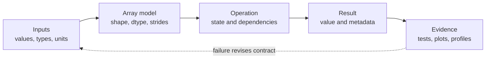
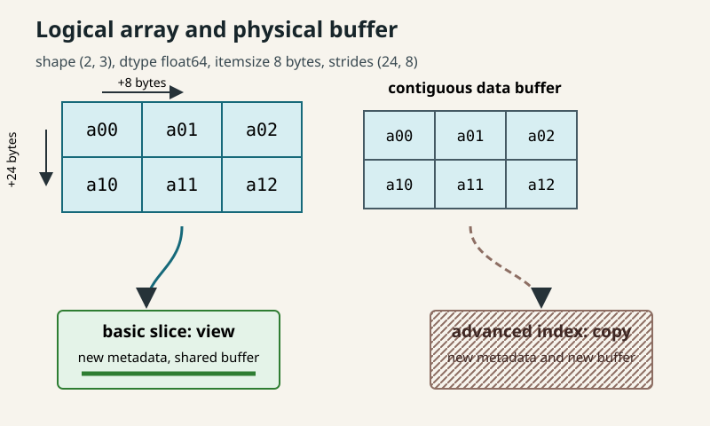
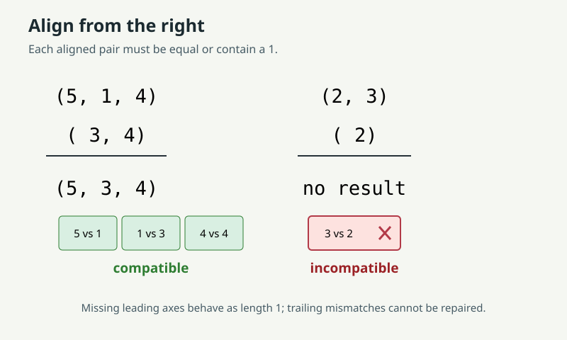
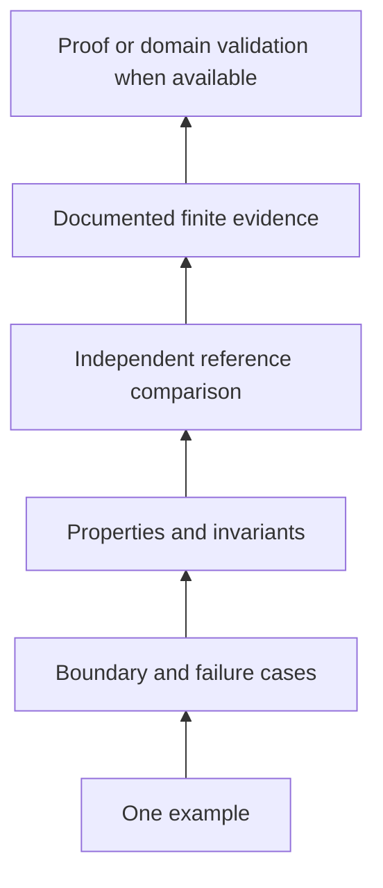
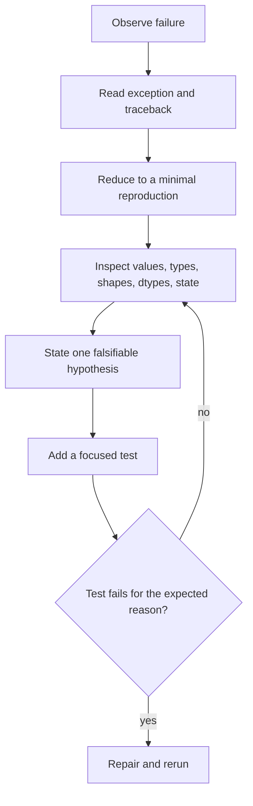
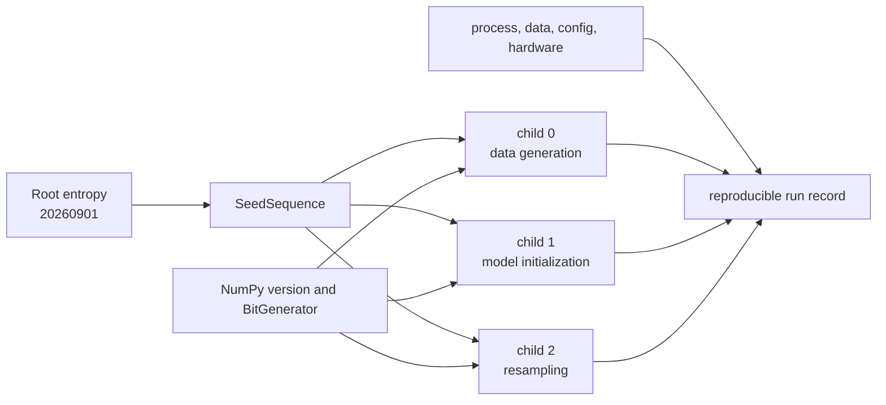
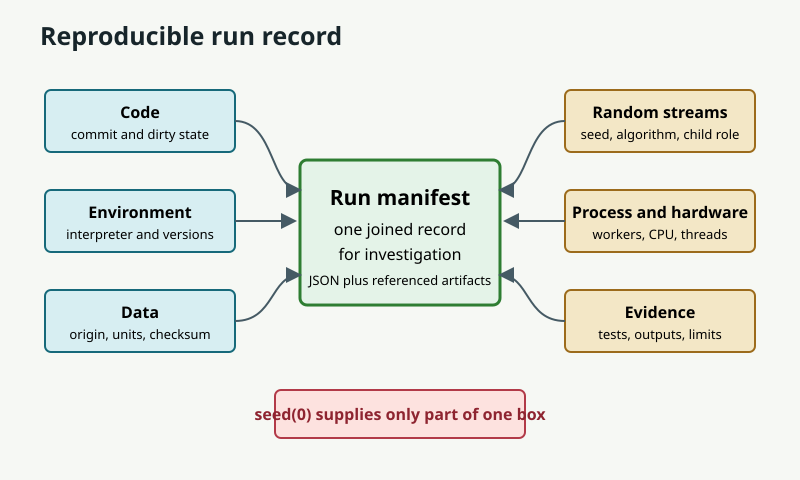
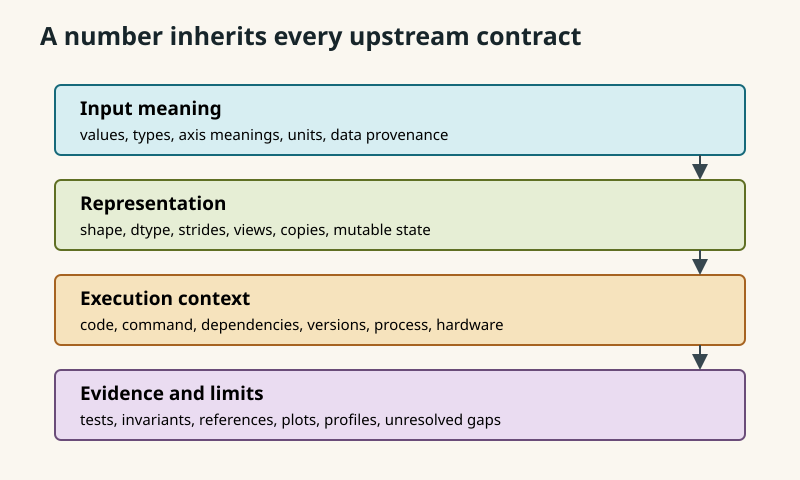

# 0.13 Programming and Scientific Computing

Make numerical results inspectable: specify Python state and exception contracts, predict NumPy array behavior, and use tests, debugging, plotting, profiling, and reproducible random streams without overstating their evidence.

No formal prerequisites are required; basic programming exposure helps. Review [§0.01](../00.01-mathematical-notation/README.md) for shape notation, [§0.03](../00.03-exponents-logarithms/README.md) for floating-point stability, and [§0.07](../00.07-induction-recursion-invariants/README.md) for invariants.

**In this module:** [Computational assumptions behind a result](#computational-assumptions-behind-a-result) · [Array shape, arithmetic, and memory](#array-shape-arithmetic-and-memory) · [Deriving operations and evidence](#deriving-operations-and-evidence) · [Implementation](#implementation) · [Experimentation](#experimentation) · [Worked examples](#worked-examples) · [Practice](#practice) · [References](#references)

## Computational assumptions behind a result

A numerical result is not only a number. It is a claim produced by a process.
To evaluate the claim, we need to know what entered the process, which
operations ran, which assumptions were enforced, and what evidence checks the
result.

Consider a later machine-learning line:

```text
logits = features @ weights.T + bias
```

The line is meaningful only after we answer questions such as these:

- Are the inputs numeric arrays?
- Which axis holds examples and which holds features?
- Does the dtype have enough range and precision?
- Are `bias` values measured in compatible units?
- Is any input a mutable view into other data?
- Which library versions implement `@` and broadcasting?
- Did tests check a reference calculation and failure cases?
- Can another process reconstruct the environment and input data?

This module treats those questions as **computational contracts**. Python is the
working language, NumPy is the array model, Matplotlib supports exploratory
plots, and the standard library supplies testing, debugging, profiling, and
process inspection. The goal is not to teach all Python syntax. It is to make
the computational assumptions of every later implementation visible.

**Check your starting point.**

- What does a function promise about accepted inputs and returned outputs?
- Why can iterating over the same generator twice produce different results?
- For an array with shape `(8, 3)`, what do `size` and `ndim` report?
- Why might changing a slice also change its source array?
- What evidence would make you trust a computed answer?

## Historical context

Python grew into a common scientific language by combining a readable general
language and standard library with specialized array and plotting libraries.
The official Python tutorial defines the function, module, class, iterator, and
exception mechanisms used here [1]. NumPy supplies homogeneous multidimensional
arrays and vectorized operations [2]. Matplotlib separates plotting commands
from interactive or file-writing backends [3].

That combination matters more than a language popularity story. A pure Python
loop, a NumPy operation, a test runner, and a plotting backend have different
contracts and different evidence. Scientific work becomes more reliable when
we stop treating them as interchangeable black boxes.

## Python values, state, and contracts

### A result is a contract chain



An implementation is trustworthy only relative to a stated contract. The
contract does not guarantee that our scientific model is appropriate. It makes
the program's claim inspectable.

Use this ledger for important computations:

| Contract field | Question |
|---|---|
| values | Which ranges, missing values, or special values are legal? |
| types | Which Python objects are accepted and returned? |
| shapes | What does each axis mean, and which lengths must agree? |
| dtypes | What range, precision, signedness, and byte width are used? |
| units | Are values seconds, meters, dollars, pixels, or unitless? |
| state | What can mutate, advance, cache, or be consumed? |
| dependencies | Which language, packages, operating tools, and data are needed? |
| versions | Which exact implementations were observed? |
| provenance | Where did code, parameters, and data originate? |
| hardware | Which architecture, accelerator, thread count, or memory limit mattered? |
| evidence | Which tests, references, diagnostics, plots, and profiles support trust? |

### Materialized collections and one-shot streams

A list stores references to all of its elements and can normally be traversed
again. An iterator represents a position in a stream. Calling `next()` advances
that state, and exhaustion raises `StopIteration` [1]. A generator is an
iterator whose execution state is suspended at `yield`.

```python
values = [2, 4, 9]
stream = (value for value in values)

assert sum(values) == 15
assert sum(values) == 15
assert sum(stream) == 15
assert sum(stream) == 0
```

This is not a memory trivia question. A function accepting `Iterable[float]`
must not silently assume that it can make two passes. Materialize with `list()`
only when repeated traversal is part of the contract and the memory cost is
acceptable.

### Exceptions name contract violations

An exception is a structured report that normal execution cannot satisfy its
contract. Use `TypeError` when the kind of object is unsupported, `ValueError`
when the type is acceptable but the value is not, and a focused custom
exception when callers need to distinguish a domain failure. Catch only errors
you can handle. Unexpected exceptions should retain their traceback.

The traceback is evidence. Read it from the final exception upward through the
call stack. The final line names the failure; earlier frames show how execution
arrived there.

## Array shape, arithmetic, and memory

### Shape, size, and dimensionality

Let an array $`\boldsymbol{a}`$ have shape

$$
(d_0,d_1,\ldots,d_{k-1}).
$$

Then:

$$
\mathrm{ndim}(\boldsymbol{a})=k,
\qquad
\mathrm{size}(\boldsymbol{a})=\prod_{j=0}^{k-1}d_j.
$$

`shape` is the tuple of axis lengths, `ndim` is the number of axes, and `size`
is the total number of elements [2]. None of these identifies axis meaning. A
shape `(32, 128)` might mean examples by features, time by sensors, or height by
width. Names and units belong beside the shape.

### Dtype is arithmetic policy

NumPy arrays are homogeneous. Their `dtype` determines representation and
therefore range, precision, signedness, and operation behavior. Python integers
can grow, but fixed-width NumPy integers cannot. For signed $`b`$-bit integers,

$$
-2^{b-1}\le x\le 2^{b-1}-1.
$$

Overflow may wrap during array arithmetic. Floating-point values trade exactness
for a wide dynamic range. A 32-bit float generally stores fewer significant
bits than a 64-bit float. Conversion is not free evidence that values remain
meaningful.

```python
import numpy as np

values = np.array([120, 120], dtype=np.int8)
wrapped = values + np.array([10, 20], dtype=np.int8)
assert wrapped.tolist() == [-126, -116]

rounded = np.float32(16_777_216) + np.float32(1)
assert rounded == np.float32(16_777_216)
```

For floating results, exact equality is usually the wrong contract. A common
test is

$$
|a-b|\le \text{atol}+\text{rtol}|b|.
$$

The absolute tolerance controls behavior near zero. The relative tolerance
scales with a reference magnitude. Choose both from the problem's units and
error budget, not from habit.

### Strides are byte steps

For an index $`(i_0,\ldots,i_{k-1})`$ and strides
$`(s_0,\ldots,s_{k-1})`$, NumPy computes a byte offset

$$
\mathrm{offset}=\sum_{j=0}^{k-1}i_js_j.
$$

In ordinary C-contiguous, row-major storage, the last axis changes fastest. A
`float64` array with shape `(2, 3)` typically has strides `(24, 8)`: move 24
bytes to the next row and 8 bytes to the next column [2]. A transpose can change
strides without moving data.



*Figure 1. Shape describes logical axes while strides map indices to byte
offsets. Basic slicing can share the buffer; advanced indexing allocates a new
one. Original figure.*

### Views, copies, and aliasing

A view has separate array metadata but shares data memory. A copy owns a
duplicated data buffer. Under NumPy's indexing rules:

- basic slicing with slices, ellipsis, and `None` returns views, while selecting
  one element with integer indices returns an array scalar;
- advanced indexing with integer or Boolean arrays returns copies;
- `reshape` returns a view when strides can express the layout, otherwise a
  copy may be required;
- assignment through an index writes to the original selection.

Use `np.shares_memory` for an exact sharing check. `np.may_share_memory` is a
conservative, cheaper check that can report possible sharing without proving
it. The `.base` attribute is useful context, but chains of views mean it should
not be treated as an identity test for the immediate parent.

### Broadcasting aligns trailing dimensions

Two axis lengths are compatible if they are equal or either is $`1`$. Compare
shapes from right to left, treating missing leading axes as length $`1`$ [2].



*Figure 2. `(5, 1, 4)` and `(3, 4)` broadcast to `(5, 3, 4)`. `(2, 3)` and
`(2,)` fail at the trailing axis. Original figure.*

```python
import numpy as np

left = np.ones((5, 1, 4))
right = np.arange(12).reshape(3, 4)
assert (left + right).shape == (5, 3, 4)

try:
    np.ones((2, 3)) + np.ones((2,))
except ValueError:
    pass
else:
    raise AssertionError("incompatible trailing dimensions must fail")
```

Broadcasting does not necessarily materialize repeated input data, but the
result or intermediate arrays can still be large. Short vectorized syntax can
increase memory use.

### Elementwise multiplication and matrix multiplication

For arrays with the same broadcast shape, `left * right` multiplies
corresponding elements. For matrices
$`\mathbf{A}\in\mathbb{R}^{m\times n}`$ and
$`\mathbf{B}\in\mathbb{R}^{n\times p}`$, `A @ B` contracts the shared dimension:

$$
(\mathbf{A}\mathbf{B})_{ij}=\sum_{k=1}^{n}A_{ik}B_{kj},
\qquad
\mathbf{A}\mathbf{B}\in\mathbb{R}^{m\times p}.
$$

```python
import numpy as np

left = np.array([[1, 2], [3, 4]])
right = np.array([[5, 6], [7, 8]])
assert (left * right).tolist() == [[5, 12], [21, 32]]
assert (left @ right).tolist() == [[19, 22], [43, 50]]
```

### Vectorization is semantics first

Vectorization means expressing work as array operations instead of a Python
loop over scalar elements. NumPy universal functions apply typed inner loops,
broadcasting, and casting rules [2]. This often moves iteration into compiled
code, but it is not a guarantee of speed. Temporary arrays, memory traffic,
noncontiguous layouts, tiny inputs, unsupported dtypes, or a poor algorithm can
erase the advantage. Semantically equivalent code is a hypothesis to benchmark,
not a performance theorem.

## Deriving operations and evidence

### Derive a batch affine contract

Suppose examples are rows:

$$
\mathbf{X}\in\mathbb{R}^{b\times d},
\quad
\mathbf{W}\in\mathbb{R}^{o\times d},
\quad
\boldsymbol{c}\in\mathbb{R}^{o}.
$$

We want one output row per example and one column per output feature:

$$
\mathbf{Y}=\mathbf{X}\mathbf{W}^{\top}+\boldsymbol{c}
\in\mathbb{R}^{b\times o}.
$$

The matrix product shape follows from

$$
(b,d)@(d,o)\to(b,o).
$$

The bias aligns as `(o,)`, so trailing-axis broadcasting gives

$$
(b,o)+(o,)\to(b,o).
$$

That derivation produces executable checks: rank two, equal feature lengths,
rank-one bias of length $`o`$, numeric finite values, and a documented output
dtype. [`affine_batch`](code/scientific_computing.py) enforces those checks.

### Derive stable log-sum-exp

Direct evaluation of

$$
\log\sum_i e^{x_i}
$$

can overflow even when the final logarithm is representable. Let
$`m=\max_i x_i`$. Then

$$
\log\sum_i e^{x_i}
=m+\log\sum_i e^{x_i-m}.
$$

Every shifted exponent is at most $`e^0=1`$. The operation is algebraically
equivalent in exact arithmetic and safer in floating arithmetic. A test should
compare it against a higher-precision reference over values that make the naive
form fail.

### Derive an evidence ladder



Tests establish observed behavior on their tested domain. They do not validate
unstated units, biased data, an inappropriate model, or every possible input.

## Implementation

### Running the code

Use a Python environment containing NumPy and Matplotlib. From the repository root, create and activate an environment if needed, then install the dependencies:

```bash
python3 -m venv .venv
source .venv/bin/activate
python -m pip install numpy matplotlib
```

The original 2026-09-01 validation used CPython `3.14.4`, NumPy `2.5.2`, and Matplotlib `3.11.1`, with `PYTHONDONTWRITEBYTECODE=1` and `MPLBACKEND=Agg`. These are observed versions, not minimum or maximum support bounds. To reconstruct those package versions, install `numpy==2.5.2` and `matplotlib==3.11.1` in the selected environment and record its interpreter separately. A virtual environment is recreated on each machine, not copied. No repository-wide dependency manifest is assumed.

From the repository root, enter this module's `code/` directory before running examples or the existing test suite:

```bash
cd 00-mathematical-foundations/00.13-programming-scientific-computing/code
PYTHONDONTWRITEBYTECODE=1 MPLBACKEND=Agg python -m unittest -v test_scientific_computing.py
```

Keep that working directory for the Python fences. For a script stored outside `code/`, expose the same helpers with `PYTHONPATH="$PWD" python /path/to/your_script.py` while still in `code/`; substituting only `PYTHONPATH` does not change a script's working directory. On other shells, activate the same environment and set these environment variables with the shell's equivalent syntax.

Tests create plots only in `TemporaryDirectory`. No data, network access, interactive backend, committed output, or persistent random state is used. Git must be installed and the checkout must be a Git repository for `environment_snapshot(repo)` and the run-record solution. E0.13.11 uses `Path.cwd().parents[2]` to locate the repository root, so keep the stated code-directory working directory. The `normalize_rows` implementation is defined in its worked solution, not exported by `scientific_computing.py`.

[`scientific_computing.py`](code/scientific_computing.py) implements the lesson's
contract-first mechanisms:

- shape, dtype-family, and finite-value validation;
- batch affine computation using `@` and trailing-axis broadcasting;
- stable log-sum-exp;
- broadcasting validation and memory-sharing diagnostics;
- a stateful running mean that consumes iterables once;
- independent reproducible generators through `SeedSequence.spawn`;
- a benchmark harness that records setup and all repeat observations;
- a JSON-compatible process and environment snapshot;
- labeled PNG output through Matplotlib's noninteractive Agg canvas.

### Contract map

| API | Inputs | Output or state | Main refusals |
|---|---|---|---|
| `ArrayContract.validate` | array-like, shape pattern, dtype kinds | validated ndarray | rank, axis, dtype, or finiteness mismatch |
| `affine_batch` | `(batch, features)`, `(outputs, features)`, `(outputs,)` | float64 `(batch, outputs)` | nonfloating, nonfinite, or mismatched axes |
| `stable_logsumexp` | nonempty finite array and valid axis | float64 reduction | scalar, empty, nonfinite, or invalid axis |
| `broadcast_result_shape` | nonnegative integer shape tuples | common shape | noninteger lengths or incompatible trailing axes |
| `memory_relation` | two array-like objects | exact sharing, conservative possible sharing, and base presence | none beyond conversion failure |
| `RunningMean.update` | one-pass finite iterable | updated count and total | nonfinite value; empty mean access |
| `spawn_generators` | nonnegative root entropy, positive count | child `Generator` tuple | invalid entropy or count |
| `benchmark` | no-argument callable and repeat policy | observations plus metadata | invalid callable or counts |
| `environment_snapshot` | optional Git repository path | JSON-compatible dictionary | invalid Git repository or unavailable Git |
| `save_exploration_plot` | equal-length 1-D numeric arrays, units, PNG path | written path | shape, finiteness, or suffix mismatch |

### Evidence boundary

The tests check hand-computed array operations, contract failures, a
long-double log-sum-exp reference, trailing-axis broadcasting, actual memory
sharing, one-shot iterator consumption, independent stream reconstruction,
benchmark metadata, environment versions, and temporary PNG output. They avoid
timing thresholds and random-distribution claims.

Passing the suite establishes behavior for those cases in the recorded
environment. It does not prove universal numerical accuracy, performance,
cross-version random bitstreams, total process-memory accounting, or scientific
validity of a future dataset or model.

### Functions, classes, modules, and state

Use a function when a transformation can be explained by explicit arguments and
a return value. Use a small class when state and operations belong together.
`RunningMean` is a class because `count` and `total` persist across updates and
must preserve an invariant:

$$
\text{mean}=\frac{\text{total}}{\text{count}}
\quad\text{when count}>0.
$$

The source file is a module. Importing it creates a namespace and makes its
definitions reusable [1]. This module is intentionally not turned into a
repository-wide package. Full packaging belongs to projects that need
distribution, not to every teaching example.

### Tests before trust

Python's `unittest` discovers methods beginning with `test`, isolates test-case
instances, and provides specific assertions for values and exceptions [4]. A
numerical test suite should combine:

- hand-computed examples;
- shape and dtype assertions;
- invalid-input and boundary cases;
- properties such as translation invariance or conservation;
- state invariants;
- comparisons against a trusted implementation;
- tolerances justified by scale and dtype.

Property-based testing is a strategy, not necessarily a library: quantify a
property over a stated generated or enumerated domain. Third-party generators
can help later, but a plain loop is enough to learn the evidence boundary.

```python
import numpy as np
from scientific_computing import stable_logsumexp

rng = np.random.default_rng(314)
for _ in range(25):
    values = rng.normal(size=(4, 7))
    shift = rng.normal()
    observed = stable_logsumexp(values + shift, axis=1)
    expected = stable_logsumexp(values, axis=1) + shift
    np.testing.assert_allclose(observed, expected, rtol=1e-13, atol=1e-13)
```

### Debugging as contract localization

Use this route:



When static inspection is insufficient, `breakpoint()` enters Python's debugger.
`where`, `up`, `down`, `next`, `step`, `p expression`, and `continue` expose
stack and state [5]. A breakpoint is useful after you know which question to
ask. Random stepping is not a substitute for a minimal reproduction.

### Plotting as evidence, not decoration

A plot should name axes and units, expose transformations, and preserve the
data-to-mark mapping. Matplotlib's noninteractive `Agg` backend writes raster
files without opening a window [3]. The module's plotting helper creates a
`Figure`, labels both axes, writes only to a caller-provided path, and is tested
inside a temporary directory.

## Experimentation

### Benchmark observations, not folklore

`timeit` separates setup from timed execution, repeats measurements, and
temporarily disables garbage collection by default. `cProfile` records call
counts and function times but is for finding where execution time goes, not for
benchmark comparison. `tracemalloc` traces memory blocks handled by Python's
allocators [6]. It does not promise a complete view of native allocations made
inside NumPy or another extension.

A defensible microbenchmark records:

1. the exact operation and inputs;
2. setup excluded from timing;
3. warmup policy;
4. calls per repeat and all repeat observations;
5. Python, NumPy, platform, and relevant hardware context;
6. the absence of universal conclusions.

Do not assert that one implementation must finish under a fixed threshold in a
unit test. Machines and workloads differ. A timing can refute "always faster"
with one counterexample, but no finite benchmark proves universal speed.

### Environments, dependencies, Git, and data

A virtual environment isolates a project's installed packages. PyPA recommends
virtual environments for third-party dependencies and documents requirements
files and `pip freeze` as environment-capture tools [7]. Exact freezing can
reconstruct installed versions more closely, but it does not capture the
operating system, native libraries, CPU, environment variables, data, or command.

Git records file history. `git status` distinguishes tracked changes and
untracked paths, `git diff` compares states, and `git log` shows commit history
[8]. A commit identifies code, not the entire experiment.

For a reproducible run, capture at least:

- command and working directory;
- source commit plus whether the tree was dirty;
- Python executable and exact package versions;
- input data identifier, checksum, license, and preprocessing;
- configuration and units;
- PRNG algorithm, root entropy, and stream identity;
- relevant hardware and parallelism;
- outputs, logs, tests, and known limitations.

### PRNG state and independent streams

A pseudorandom number generator is deterministic state transition plus output.
A seed initializes state. Reusing one global stream couples results to call
order. Calling `seed(0)` records only one integer and often hides which code
consumed the stream, which generator algorithm ran, which library version was
used, and whether process forks duplicated state.

NumPy's `Generator` owns a `BitGenerator`; `default_rng` constructs a new
instance rather than managing one global generator. NumPy explicitly gives
`Generator` no cross-version bitstream compatibility guarantee [9].
`SeedSequence.spawn` mixes root entropy with child positions to create
reproducible, very-probably independent child streams [9].



```python
from scientific_computing import spawn_generators

first = spawn_generators(20260901, 3)
second = spawn_generators(20260901, 3)

first_draws = [stream.integers(0, 1000, size=6) for stream in first]
second_draws = [stream.integers(0, 1000, size=6) for stream in second]
assert all((left == right).all() for left, right in zip(first_draws, second_draws))
assert not (first_draws[0] == first_draws[1]).all()
```



*Figure 3. A seed is one input to a reproducible run, not a complete run
record. Original figure.*

## Worked examples

### Example 1: inspect an array before operating

```python
import numpy as np

array = np.arange(12, dtype=np.float64).reshape(3, 4)
assert array.shape == (3, 4)
assert array.size == 12
assert array.ndim == 2
assert array.itemsize == 8
assert array.strides == (32, 8)
```

The assertions are about this C-contiguous construction. A transpose has the
same size and dtype but different shape and strides.

### Example 2: detect an aliasing bug

```python
import numpy as np

source = np.arange(8)
view = source[2:5]
copy = source[[2, 3, 4]]
assert np.shares_memory(source, view)
assert not np.shares_memory(source, copy)

view[0] = 99
copy[1] = 88
assert source.tolist() == [0, 1, 99, 3, 4, 5, 6, 7]
```

### Example 3: preserve units in a plot contract

`save_exploration_plot` requires axis-unit strings and a `.png` path. Its test
checks the PNG signature and uses `TemporaryDirectory`, so validation leaves no
plot artifact in the repository.

### Example 4: distinguish evidence types



*Figure 4. Tests, plots, and profiles answer different questions. None repairs
missing provenance or an invalid scientific model. Original figure.*

## Common mistakes

### Treating annotations as runtime enforcement

Python annotations document and support tools, but they do not automatically
validate arguments. Enforce load-bearing runtime contracts explicitly.

### Confusing a list with an iterator

A list can be traversed repeatedly. An iterator advances and may be one-shot.
Do not make an undocumented second pass.

### Catching every exception

`except Exception` can erase the failure signal. Catch the specific error you
can resolve, otherwise preserve the traceback.

### Confusing shape, size, and ndim

`(2, 3, 4)`, `24`, and `3` answer different questions.

### Ignoring dtype overflow or precision

An array operation can return the expected shape and the wrong numeric value.
Inspect dtype and test range boundaries.

### Calling strides element counts

NumPy strides are byte steps. Divide by `itemsize` only when you deliberately
want steps measured in elements.

### Assuming every index is a view

Basic slicing returns a view; advanced integer and Boolean indexing returns a
copy. Mutation tests should make the distinction visible.

### Broadcasting from the left

Align trailing dimensions. Equal lengths or a length of one are compatible.

### Using `*` for a matrix product

`*` is elementwise. `@` is matrix multiplication with contracted core axes.

### Equating vectorization with guaranteed speed

Vectorization changes expression and execution semantics. Benchmark the actual
workload and record setup, repeats, warmup, versions, and hardware.

### Comparing floats exactly

Use a tolerance tied to units, scale, dtype, and the expected error source.

### Treating a benchmark as a theorem

A benchmark is an observation from a specified environment. There is no
universal timing proof from finite runs.

### Treating tracemalloc as total process memory

It traces Python allocator domains. Native extension buffers may require other
measurement tools.

### Calling `seed(0)` reproducibility

Record generator construction, stream derivation, versions, process structure,
code, environment, data, configuration, hardware, and evidence.

## Practice

Attempt each problem before expanding its worked solution. Use the Python environment and code-directory working directory described in [Implementation](#implementation); NumPy and Matplotlib are required. Equivalent work is valid when it preserves the same contracts and evidence limits.

### E0.13.01 Write an executable function contract

- **Allowed tools:** Python standard library and NumPy.

Design `normalize_rows(matrix)` for a finite floating array of shape
`(rows, features)`. Each row must have a nonzero Euclidean norm. It returns a
new `float64` array of the same shape whose row norms are one.

1. State contracts for values, type, shape, dtype, units, mutation, and output.
2. Implement the function without a Python loop over rows.
3. Raise `ContractError` for wrong rank, nonfloating dtype, nonfinite values, or
   a zero row.
4. Explain why an annotation alone does not enforce the contract.
5. Give one hand-computed example and one failure case.

**Deliverable:** Contract ledger, implementation, and two tests.

<details><summary>Worked solution</summary>

#### Solution E0.13.01

**Key idea.**

The function contract includes runtime facts that annotations cannot enforce.

**Reasoning.**

Accepted values are finite, floating, rank-two arrays with no zero-norm row.
Rows are examples, columns are features, and units must be consistent within a
row norm. The function does not mutate the input. It returns a newly allocated
`float64` array with the same shape and unitless rows of norm one.

```python
import numpy as np
from scientific_computing import ArrayContract, ContractError

def normalize_rows(matrix):
    array = ArrayContract((None, None), "f").validate(matrix, name="matrix")
    array = array.astype(np.float64, copy=False)
    norms = np.sqrt(np.sum(array * array, axis=1, keepdims=True))
    if np.any(norms == 0.0):
        raise ContractError("every row must have nonzero norm")
    return array / norms

source = np.array([[3.0, 4.0], [0.0, -2.0]], dtype=np.float32)
result = normalize_rows(source)
np.testing.assert_allclose(result, [[0.6, 0.8], [0.0, -1.0]])
assert result.dtype == np.float64
assert not np.shares_memory(source, result)
try:
    normalize_rows([[0.0, 0.0]])
except ContractError:
    pass
else:
    raise AssertionError("zero row accepted")
```

Annotations support readers and static tools. They do not automatically inspect
rank, dtype, finiteness, or norm.

**Verification.**

Both output row norms are one within floating tolerance, and the source remains
unchanged.

**Common wrong turn.**

Do not divide first and hope NumPy warnings enforce a domain contract.

</details>

### E0.13.02 Audit a one-shot iterator and state invariant

- **Allowed tools:** Standard library and module code.

1. Create a list `[2.0, 4.0, 9.0]` and a generator over the same values.
2. Demonstrate two traversals of each.
3. Pass the generator to `RunningMean.update`, then prove by inspection that it
   is exhausted.
4. State and verify the `RunningMean` invariant after two separate updates.
5. Diagnose a function that computes `sum(values) / len(list(values))` for an
   arbitrary iterable.
6. Repair it while stating the memory tradeoff.

**Deliverable:** Executable audit, invariant, diagnosis, and repair.

<details><summary>Worked solution</summary>

#### Solution E0.13.02

**Key idea.**

An iterable may produce an iterator, while an iterator itself advances and can
be exhausted.

**Reasoning.**

```python
from scientific_computing import RunningMean

values = [2.0, 4.0, 9.0]
stream = (value for value in values)
assert list(values) == list(values) == [2.0, 4.0, 9.0]

running = RunningMean()
running.update(stream)
assert list(stream) == []
assert (running.count, running.total, running.mean) == (3, 15.0, 5.0)
running.update(iter([5.0, 10.0]))
assert (running.count, running.total, running.mean) == (5, 30.0, 6.0)
```

The invariant is that `count` equals the number consumed, `total` equals their
sum, and `mean == total / count` when count is positive.

The broken expression consumes `values` in `sum` before `list(values)` can count
it. A one-pass repair tracks count and total together, as `RunningMean` does. A
different repair is `materialized = list(values)` followed by `sum` and `len`.
That permits repeated passes but stores every reference.

**Verification.**

Two updates preserve all three invariant clauses.

**Common wrong turn.**

`Iterable` does not promise `len` or a second traversal.

</details>

### E0.13.03 Separate shape, size, ndim, and dtype

- **Allowed tools:** NumPy and hand calculation.

For `a = np.arange(24, dtype=np.int16).reshape(2, 3, 4)`:

1. Predict `shape`, `size`, `ndim`, `itemsize`, `nbytes`, and C-order strides.
2. Verify each prediction.
3. Predict the shape and dtype of `a.sum(axis=1)`.
4. Construct an `int8` overflow example and explain why Python `int` differs.
5. Construct a `float32` precision example where adding one changes nothing.
6. Explain why correct shape is insufficient evidence of a correct result.

**Deliverable:** Metadata table, two failure demonstrations, and interpretation.

<details><summary>Worked solution</summary>

#### Solution E0.13.03

**Key idea.**

Logical structure and arithmetic representation are separate contracts.

**Reasoning.**

The metadata is `(2, 3, 4)`, `24`, `3`, `2` bytes, `48` bytes, and strides
`(24, 8, 2)`. Reducing axis one removes its length-three axis, yielding shape
`(2, 4)`. NumPy promotes this small signed integer reduction to the platform
integer dtype in the validated environment.

```python
import numpy as np

array = np.arange(24, dtype=np.int16).reshape(2, 3, 4)
assert (array.shape, array.size, array.ndim) == ((2, 3, 4), 24, 3)
assert (array.itemsize, array.nbytes, array.strides) == (2, 48, (24, 8, 2))
reduced = array.sum(axis=1)
assert reduced.shape == (2, 4)
assert reduced.dtype == np.dtype(np.int_)

overflow = np.array([120], dtype=np.int8) + np.array([20], dtype=np.int8)
assert overflow.item() == -116
assert 120 + 20 == 140
assert np.float32(16_777_216) + np.float32(1) == np.float32(16_777_216)
```

Python integers expand. NumPy `int8` arithmetic is fixed-width. `float32`
cannot distinguish every consecutive integer at that magnitude.

**Verification.**

Stride products match row-major movement: 12, 4, and 1 elements per step.

**Common wrong turn.**

Shape correctness does not detect overflow, rounding, wrong units, or wrong
axis meaning.

</details>

### E0.13.04 Trace strides, views, and copies

- **Allowed tools:** NumPy and module code.

Let `source = np.arange(20, dtype=np.float64).reshape(4, 5)`.

1. Compute the byte offset of `source[2, 3]` from strides.
2. Predict shape and strides for `source.T` and `source[:, ::2]`.
3. Compare `source[1:3, 1:4]` and `source[[1, 2], 1:4]`.
4. Use `memory_relation` and a mutation test to classify each result.
5. Explain why `.base is source` is not a complete immediate-parent test.
6. State when an explicit copy of a small slice can reduce retained memory.

**Deliverable:** Offset derivation, metadata, and aliasing experiment.

<details><summary>Worked solution</summary>

#### Solution E0.13.04

**Key idea.**

Strides map indices to bytes; indexing policy determines sharing.

**Reasoning.**

The offset of `(2, 3)` is $`2(40)+3(8)=104`$ bytes. Transpose shape and strides
are `(5, 4)` and `(8, 40)`. The step-two slice has shape `(4, 3)` and strides
`(40, 16)`.

```python
import numpy as np
from scientific_computing import memory_relation

source = np.arange(20, dtype=np.float64).reshape(4, 5)
assert sum(index * stride for index, stride in zip((2, 3), source.strides)) == 104
assert (source.T.shape, source.T.strides) == ((5, 4), (8, 40))
assert (source[:, ::2].shape, source[:, ::2].strides) == ((4, 3), (40, 16))

view = source[1:3, 1:4]
copy = source[[1, 2], 1:4]
assert memory_relation(source, view)["shares_memory"]
assert not memory_relation(source, copy)["shares_memory"]
view[0, 0] = 99
copy[0, 1] = -1
assert source[1, 1] == 99
assert source[1, 2] != -1
```

A reshaped array can already be a view of the original one-dimensional buffer,
so another view's `.base` may refer to an earlier owner rather than the name
`source`. `np.shares_memory` answers the sharing question directly. Copy a small
slice when retaining it would otherwise retain a much larger buffer whose other
data is no longer needed.

**Verification.**

Mutation changes only the basic-slice source region.

**Common wrong turn.**

Do not describe strides as element counts without dividing by `itemsize`.

</details>

### E0.13.05 Derive broadcasting and multiplication contracts

- **Allowed tools:** Hand shape analysis and NumPy.

1. Determine the result shape, or exact incompatibility, for `(7, 1, 5)` with
   `(3, 5)`, `(4, 3, 1)` with `(3, 6)`, `()` with `(2, 4)`, and `(2, 3)` with
   `(2,)`.
2. Verify with `broadcast_result_shape`.
3. For two explicit $`2\times2`$ arrays, compute `A * B` and `A @ B` by hand.
4. Derive the shapes in `features @ weights.T + bias` for `(8, 3)`, `(5, 3)`,
   and `(5,)`.
5. Give one same-shaped pair for which `*` and `@` both run but differ.

**Deliverable:** Four broadcast audits and two operation derivations.

<details><summary>Worked solution</summary>

#### Solution E0.13.05

**Key idea.**

Broadcast from the trailing side, and distinguish elementwise from contracted
axes.

**Reasoning.**

The outcomes are `(7, 3, 5)`, `(4, 3, 6)`, `(2, 4)`, and incompatible. In the
second pair, trailing `1` versus `6` and `3` versus `3` are compatible, while
the missing leading axis behaves as `1` against `4`. In the final pair, trailing
`3` versus `2` fails.

```python
import numpy as np
from scientific_computing import affine_batch, broadcast_result_shape

assert broadcast_result_shape((7, 1, 5), (3, 5)) == (7, 3, 5)
assert broadcast_result_shape((4, 3, 1), (3, 6)) == (4, 3, 6)
assert broadcast_result_shape((), (2, 4)) == (2, 4)
try:
    broadcast_result_shape((2, 3), (2,))
except ValueError:
    pass
else:
    raise AssertionError("incompatible shapes accepted")

left = np.array([[1, 2], [3, 4]])
right = np.array([[5, 6], [7, 8]])
assert (left * right).tolist() == [[5, 12], [21, 32]]
assert (left @ right).tolist() == [[19, 22], [43, 50]]

output = affine_batch(np.ones((8, 3)), np.ones((5, 3)), np.zeros(5))
assert output.shape == (8, 5)
```

For the affine operation, `(8,3) @ (3,5) -> (8,5)`, then `(5,)` broadcasts
over rows. The explicit two-by-two pair shows both operators run and differ.

**Verification.**

Each aligned trailing axis is either equal or one.

**Common wrong turn.**

Do not call a shape incompatible before checking missing leading axes as ones.

</details>

### E0.13.06 Stabilize and compare two computations

- **Allowed tools:** NumPy and module code.

1. Derive maximum-shift log-sum-exp.
2. Show that direct evaluation overflows for `[1000, 1001, 999]`.
3. Compare `stable_logsumexp` with a `longdouble` reference.
4. Implement the same stable formula with an outer Python loop over rows.
5. Test equality of semantics with justified tolerances.
6. Explain why the array expression is vectorized but not guaranteed faster.

**Deliverable:** Derivation, two implementations, comparison, and limitation.

<details><summary>Worked solution</summary>

#### Solution E0.13.06

**Key idea.**

Subtracting the maximum preserves exact algebra while bounding every exponent by
one.

**Reasoning.**

For $`m=\max_i x_i`$, factor $`e^m`$ from the sum and move it outside the log.

```python
import numpy as np
from scientific_computing import stable_logsumexp

values = np.array([[1000.0, 1001.0, 999.0], [-1000.0, -999.0, -1001.0]])
with np.errstate(over="ignore"):
    assert np.isinf(np.log(np.sum(np.exp(values[0]))))

def loop_logsumexp(rows):
    outputs = []
    for row in rows:
        maximum = np.max(row)
        outputs.append(maximum + np.log(np.sum(np.exp(row - maximum))))
    return np.array(outputs)

observed = stable_logsumexp(values, axis=1)
looped = loop_logsumexp(values)
extended = values.astype(np.longdouble)
maximum = extended.max(axis=1)
reference = maximum + np.log(np.exp(extended - maximum[:, None]).sum(axis=1))
np.testing.assert_allclose(observed, looped, rtol=1e-14, atol=0.0)
np.testing.assert_allclose(observed, reference, rtol=1e-14, atol=0.0)
```

The array form removes the outer Python loop, but speed still depends on input
size, memory layout, temporary allocation, NumPy build, hardware, and competing
work.

**Verification.**

The direct form overflows while both shifted forms agree with extended
precision for the stated cases.

**Common wrong turn.**

Numerical agreement and vectorized syntax do not prove a universal timing rank.

</details>

### E0.13.07 Build an evidence ladder before trust

- **Allowed tools:** `unittest`, NumPy, and module code.

Write tests for `affine_batch` and `stable_logsumexp` that include:

1. one hand-computed result each;
2. shape, dtype, empty, nonfinite, and mismatch failures;
3. the property $`\mathrm{LSE}(\boldsymbol{x}+c)=
   \mathrm{LSE}(\boldsymbol{x})+c`$ over 100 generated finite cases;
4. a reference comparison for affine output using explicit scalar loops;
5. a stated random-stream construction and tolerance policy;
6. an explanation of what the finite test domain does not prove.

**Deliverable:** Passing tests and an evidence-boundary paragraph.

<details><summary>Worked solution</summary>

#### Solution E0.13.07

**Key idea.**

Different tests target different failure modes, and their finite domain must be
recorded.

**Reasoning.**

Use `Generator` local to the test and record root entropy. For affine reference
output, loop over batch and output coordinates, accumulating feature products.
For log-sum-exp, include the hand case `log(exp(0)+exp(0)) = log(2)`, empty and
nonfinite refusals, then 100 translation cases. A defensible tolerance for
random `float64` values near unit scale is `rtol=1e-13, atol=1e-13`; this is an
exercise policy, not a universal default.

```python
import numpy as np
from scientific_computing import affine_batch, stable_logsumexp

rng = np.random.default_rng(713)
np.testing.assert_allclose(stable_logsumexp([0.0, 0.0]), np.log(2.0))
for _ in range(100):
    values = rng.normal(size=(4, 7))
    shift = rng.normal()
    np.testing.assert_allclose(
        stable_logsumexp(values + shift, axis=1),
        stable_logsumexp(values, axis=1) + shift,
        rtol=1e-13, atol=1e-13,
    )

features = rng.normal(size=(3, 4))
weights = rng.normal(size=(2, 4))
bias = rng.normal(size=2)
reference = np.empty((3, 2))
for row in range(3):
    for output in range(2):
        reference[row, output] = sum(
            features[row, feature] * weights[output, feature]
            for feature in range(4)
        ) + bias[output]
np.testing.assert_allclose(affine_batch(features, weights, bias), reference)
```

Add focused `assertRaises` tests for each documented refusal. These tests do not
prove all values, all dtypes, all shapes, numerical optimality, or model validity.

**Verification.**

Hand values, randomized properties, and an independently expressed reference
all agree.

**Common wrong turn.**

Using the same vectorized expression in implementation and reference can repeat
the same mistake.

</details>

### E0.13.08 Localize a failure with a minimal reproduction

- **Allowed tools:** Python traceback, `breakpoint()`, and NumPy.

Given a pipeline whose final line fails inside `affine_batch`:

1. read the traceback from exception to callers;
2. reduce the original dataset to the smallest arrays preserving the failure;
3. record values, types, shapes, dtypes, finiteness, and mutation state;
4. use a breakpoint immediately before the call to inspect those facts;
5. state one falsifiable hypothesis;
6. add a regression test before repairing the input transformation;
7. explain why swallowing the exception would make diagnosis worse.

Use a mismatch where features have shape `(2, 3)` and weights have shape
`(4, 2)`.

**Deliverable:** Minimal reproduction, debugger checklist, test, and repair.

<details><summary>Worked solution</summary>

#### Solution E0.13.08

**Key idea.**

Reduce the failure while preserving it, then test the violated axis contract.

**Reasoning.**

The minimal reproduction is:

```text
features = np.ones((2, 3))
weights = np.ones((4, 2))
bias = np.zeros(4)
affine_batch(features, weights, bias)
```

The traceback ends at the contract error for weights axis one. At a breakpoint
before the call, inspect `type`, `shape`, `dtype`, `np.isfinite(...).all()`, and
whether preprocessing mutated or transposed either input. The falsifiable
hypothesis is: the weight loader produced `(outputs, 2)` but the feature contract
requires three columns. A regression test expects refusal for `(4,2)`.

The repair depends on provenance. If the loader accidentally dropped one weight
column, restore it and produce `(4,3)`. Do not transpose blindly: `(2,4)` still
does not match three features. Catching and discarding the exception would erase
the exact axis evidence and permit missing output downstream.

**Verification.**

The test fails before repair and `affine_batch(np.ones((2,3)),
np.ones((4,3)), np.zeros(4))` returns shape `(2,4)` afterward.

**Common wrong turn.**

Do not repair a shape mismatch without checking what each axis means.

</details>

### E0.13.09 Make an exploratory plot reproducible

- **Allowed tools:** NumPy, Matplotlib Agg, temporary files, and module code.

1. Generate $`x=0,1,\ldots,10`$ seconds and $`y=x^2`$ meters.
2. Save a plot using `save_exploration_plot` inside `TemporaryDirectory`.
3. Verify the PNG signature, nonzero size, labels, units, and cleanup.
4. State the synthetic-data provenance and transformation.
5. Explain what the plot suggests and what it cannot prove.
6. Refuse mismatched vector lengths and a non-PNG output path.

**Deliverable:** Temporary plot test and evidence statement.

<details><summary>Worked solution</summary>

#### Solution E0.13.09

**Key idea.**

The plot contract includes data origin, units, output path, backend, and cleanup.

**Reasoning.**

```python
from pathlib import Path
import tempfile
import numpy as np
from scientific_computing import ContractError, save_exploration_plot

x_values = np.arange(11.0)
y_values = x_values ** 2
with tempfile.TemporaryDirectory() as directory:
    path = Path(directory) / "squared-distance.png"
    save_exploration_plot(x_values, y_values, path, x_unit="s", y_unit="m")
    assert path.read_bytes()[:8] == b"\x89PNG\r\n\x1a\n"
    assert path.stat().st_size > 1_000
assert not path.exists()

for bad_x, bad_y, bad_path in (([0, 1], [0], "plot.png"), ([0], [0], "plot.pdf")):
    try:
        save_exploration_plot(bad_x, bad_y, Path(bad_path), x_unit="s", y_unit="m")
    except ContractError:
        pass
    else:
        raise AssertionError("invalid plot contract accepted")
```

The data is original synthetic data with transformation $`y=x^2`$. The line
suggests the sampled output grows nonlinearly. It does not establish a physical
law, causal relation, or behavior between and beyond samples.

**Verification.**

The test checks file identity, content size, refusal, and cleanup. Labels and
units are set by the helper and covered by source inspection.

**Common wrong turn.**

A visually smooth curve is not proof of the generating mechanism.

</details>

### E0.13.10 Profile time and memory within their limits

- **Allowed tools:** `benchmark`, `timeit`, `cProfile`, `tracemalloc`, NumPy.

Compare a scalar Python square loop with `array * array` on one stated input.

1. Keep data creation outside timed functions.
2. Use explicit warmup, calls per repeat, and at least five repeats.
3. Record all observations and environment metadata.
4. Use `cProfile` to identify call locations, not to rank Python versus C time.
5. Use `tracemalloc` on a Python-list workload and explain why its result does
   not measure every native NumPy allocation.
6. Make no fragile threshold assertion or universal speed claim.

**Deliverable:** Timing records, profile interpretation, memory limitation.

<details><summary>Worked solution</summary>

#### Solution E0.13.10

**Key idea.**

Timing, call profiling, and Python allocation tracing answer different questions.

**Reasoning.**

```python
import tracemalloc
import numpy as np
from scientific_computing import benchmark

array = np.arange(10_000.0)
values = array.tolist()

def python_squares():
    return [value * value for value in values]

def array_squares():
    return array * array

python_result = benchmark(python_squares, label="python list", number=10, repeat=5, warmup=2)
array_result = benchmark(array_squares, label="numpy array", number=10, repeat=5, warmup=2)
assert len(python_result.seconds) == len(array_result.seconds) == 5

tracemalloc.start()
python_squares()
current, peak = tracemalloc.get_traced_memory()
tracemalloc.stop()
assert current >= 0 and peak >= current
```

Report both JSON records, all repeats, setup, and hardware. `cProfile` can show
that `python_squares` executes Python-level calls and where cumulative time is
attributed. It adds overhead and does not provide a fair Python-versus-native
benchmark. `tracemalloc` measures traced Python allocator blocks. The native
buffer behind a NumPy result may not appear as a corresponding Python allocation.

**Verification.**

Only metadata and nonnegative observations are asserted. No speed ratio or time
threshold is a correctness condition.

**Common wrong turn.**

Do not report the fastest local observation as a universal property.

</details>

### E0.13.11 Design a reproducible run record

- **Allowed tools:** Standard library, Git, NumPy, and module code.

Design a JSON run record for a synthetic array experiment. Include:

1. command, working directory, timestamp with timezone, and process ID;
2. Git commit and dirty status;
3. Python executable, implementation, package versions, platform, and machine;
4. data origin, license, shape, dtype, units, transformation, and checksum;
5. configuration, root entropy, stream role, and generator identity;
6. tests run, output paths or checksums, hardware limitations, and known gaps.

Explain why `pip freeze`, a Git commit, or a seed alone is insufficient.

**Deliverable:** JSON-compatible schema, sample record, and three limitations.

<details><summary>Worked solution</summary>

#### Solution E0.13.11

**Key idea.**

Reproduction needs a joined record of code, process, environment, data, state,
hardware, and evidence.

**Reasoning.**

```python
from datetime import datetime, timezone
from hashlib import sha256
import json
from pathlib import Path
import numpy as np
from scientific_computing import environment_snapshot

data = np.arange(12, dtype=np.float64).reshape(3, 4)
record = {
    "run": {
        "command": "python experiment.py --root-entropy 20260901",
        "working_directory": str(Path.cwd()),
        "timestamp": datetime.now(timezone.utc).isoformat(),
    },
    "environment": environment_snapshot(Path.cwd().parents[2]),
    "data": {
        "origin": "original synthetic sequence",
        "license": "project MIT license",
        "shape": data.shape,
        "dtype": str(data.dtype),
        "units": "unitless",
        "transformation": "arange(12).reshape(3, 4)",
        "sha256": sha256(data.tobytes()).hexdigest(),
    },
    "random": {"root_entropy": 20260901, "stream_role": "data"},
    "evidence": {"tests": ["test_scientific_computing.py"], "gaps": []},
}
assert len(json.dumps(record)) > 100
```

Add BitGenerator identity, output checksums, thread settings, CPU or accelerator
details, and limitations relevant to the real run. `pip freeze` omits code,
data, command, system, and hardware. A commit omits dirty changes and all
external state. A seed omits generator version, stream role, call order, and
everything outside randomness.

**Verification.**

The record serializes, includes an exact data checksum, and captures Git dirty
state rather than pretending the commit alone identifies source.

**Common wrong turn.**

Do not record sensitive environment values or credentials in a run manifest.

</details>

### E0.13.12 Construct independent random streams

- **Allowed tools:** NumPy random Generator, SeedSequence, and module code.

For one experiment needing data generation, parameter initialization, and
resampling:

1. create three child generators from one recorded root entropy;
2. rerun construction and verify stream-by-position reproduction;
3. show that child outputs are not identical on a finite sample without claiming
   this proves independence;
4. demonstrate how sharing one global generator couples output to call order;
5. explain why `root_seed + worker_id` is an unsafe general stream policy;
6. record NumPy version, BitGenerator class, child role, and spawn identity;
7. state the no-cross-version-bitstream guarantee;
8. list process, environment, code, data, hardware, and evidence needed beyond
   `seed(0)`.

**Deliverable:** Stream factory, reproducibility tests, coupling demonstration,
and complete audit.

<details><summary>Worked solution</summary>

#### Solution E0.13.12

**Key idea.**

Spawn named streams from one root and reconstruct them by the same child
position, while recording version and generator identity.

**Reasoning.**

```python
import numpy as np
from scientific_computing import spawn_generators

roles = ("data", "parameters", "resampling")
first = dict(zip(roles, spawn_generators(20260901, len(roles))))
second = dict(zip(roles, spawn_generators(20260901, len(roles))))

first_draws = {role: generator.integers(0, 2**31, size=12)
               for role, generator in first.items()}
second_draws = {role: generator.integers(0, 2**31, size=12)
                for role, generator in second.items()}
for role in roles:
    np.testing.assert_array_equal(first_draws[role], second_draws[role])
assert not np.array_equal(first_draws["data"], first_draws["parameters"])

shared_a = np.random.default_rng(7)
data_then_model = (shared_a.integers(10, size=3), shared_a.integers(10, size=3))
shared_b = np.random.default_rng(7)
model_only = shared_b.integers(10, size=3)
np.testing.assert_array_equal(data_then_model[0], model_only)
assert not np.array_equal(data_then_model[1], model_only)
```

The finite nonidentity check detects an accidental clone in this sample. It
does not prove statistical independence. `root_seed + worker_id` can overlap
across runs when both roots and worker IDs change by small increments, and it
does not encode a spawn tree. `SeedSequence.spawn` mixes child position into
state construction.

Record NumPy `2.5.2` for this validation, the `PCG64` BitGenerator observed in
each stream, root entropy, child index, and role. NumPy does not guarantee the
`Generator` bitstream across versions, so reproduction includes version and
algorithm identity.

Beyond `seed(0)`, record source commit and dirty state, command, interpreter,
packages, process and worker topology, environment, data checksum and
preprocessing, configuration, hardware and threads, stream roles, outputs,
tests, and limitations.

**Verification.**

Each role reproduces by position; the roles are not finite clones; and the
global-stream example exposes call-order coupling.

**Common wrong turn.**

Changing the integer seed for each worker is not the same contract as spawning
independent child streams.

</details>

## What you should now be able to do

You should now be able to:

- turn a numerical expression into explicit value, type, shape, dtype, unit,
  state, dependency, and evidence contracts;
- choose functions, small classes, modules, iterators, and exceptions for their
  semantics rather than syntax alone;
- predict array layout, indexing, broadcasting, and multiplication behavior;
- design numerical tests that separate examples, properties, references, and
  proofs;
- localize failures with tracebacks, minimal reproductions, and breakpoints;
- interpret timing, deterministic profiling, and Python allocation tracing
  within their limits;
- construct and record independent reproducible random streams;
- capture a run well enough that another process can investigate it.

## Where this leads

Later modules assume this computational baseline. Algorithms need explicit
representation and complexity contracts. Data analysis needs provenance and
plots that preserve units. Machine learning needs shape-safe batch operations,
stable arithmetic, testable randomness, and reproducible evaluation.

Continue with [§0.14 Algorithms and Data Structures](../00.14-algorithms-data-structures/README.md)
to turn computational contracts into representation, correctness, and cost
decisions.

## References

### Python 3.14 tutorial and library reference

[1] Python Software Foundation, "The Python Tutorial: More Control Flow Tools,
Modules, Errors and Exceptions, Classes, and Brief Tour of the Standard
Library," Python 3.14 documentation. PSF License Version 2; documentation code
examples additionally 0BSD. https://docs.python.org/3.14/tutorial/ Accessed
2026-09-01.

- **Directly inspected:** function definitions and annotations; modules and
  import behavior; aliasing and classes; iterator protocol, generators, and
  `StopIteration`; exception types, propagation, chaining, and cleanup; standard
  library quality-control and performance sections.
- **Why included:** These pages define the working language mechanisms without
  turning the module into a syntax survey.
- **Level:** Readers with basic programming exposure.
- **Access and rights:** Public official documentation under the PSF License
  Version 2; documentation examples additionally use 0BSD. No prose or example
  was adapted.

Use the tutorial as a reference when a Python mechanism blocks the computation.
Do not read it as a prerequisite cover to cover.

### NumPy 2.5 manual

[2] NumPy Developers, "NumPy fundamentals: array creation, data types,
broadcasting, copies and views, indexing, universal functions, and ndarray
attributes," NumPy 2.5 manual. https://numpy.org/doc/stable/user/basics.html
and https://numpy.org/doc/stable/reference/arrays.ndarray.html Accessed
2026-09-01.

- **Directly inspected:** array creation; `shape`, `size`, `ndim`, `itemsize`,
  and byte `strides`; fixed-width dtypes, overflow, and precision; basic and
  advanced indexing; copies and views; trailing-axis broadcasting; ufuncs;
  elementwise `multiply`; `matmul` and `@`.
- **Why included:** This is the authoritative behavioral contract for the
  module's central array distinctions.
- **Level:** Basic Python plus the shape notation introduced in the lesson.
- **Access and rights:** Free official documentation. No text, figure, or code
  was adapted.

The stable docs reported NumPy v2.5 during inspection. Exact local validation
used NumPy `2.5.2`.

### Matplotlib 3.11.1 documentation

[3] Matplotlib Development Team, "Backends," "matplotlib.pyplot.subplots," and
"matplotlib.figure.Figure.savefig," Matplotlib 3.11.1 documentation.
https://matplotlib.org/stable/users/explain/figure/backends.html Accessed
2026-09-01.

- **Directly inspected:** backend definition and selection, Agg as a
  noninteractive file-writing backend, `subplots`, and `Figure.savefig`.
- **Why included:** It supports deterministic file-based plot tests while
  keeping plotting subordinate to evidence and units.
- **Level:** Basic array manipulation.
- **Access and rights:** Free official documentation. The module plot and SVGs
  are original.

### unittest

[4] Python Software Foundation, "unittest: Unit testing framework," Python 3.14
documentation. https://docs.python.org/3.14/library/unittest.html Accessed
2026-09-01.

- **Directly inspected:** `TestCase`, discovery naming, fixtures, subtests,
  specific assertions, exception assertions, command-line execution, and test
  independence.
- **Why included:** It is sufficient for the module tests and avoids adding a
  testing dependency.
- **Boundary:** The lesson discusses property-based testing as an evidence
  strategy but does not add a third-party generation framework.

### Tracebacks and pdb

[5] Python Software Foundation, "pdb: The Python Debugger," Python 3.14
documentation. https://docs.python.org/3.14/library/pdb.html Accessed
2026-09-01.

- **Directly inspected:** traceback role; `breakpoint()`; command-line and
  post-mortem debugging; breakpoints; stack movement; `next`, `step`, expression
  inspection, and continuation.
- **Why included:** These tools connect a failing contract to inspectable runtime
  state.
- **Boundary:** No IDE-specific debugging workflow is taught.

### timeit, cProfile, and tracemalloc

[6] Python Software Foundation, "timeit: Measure execution time of small code
snippets," "The Python Profilers," and "tracemalloc: Trace memory allocations,"
Python 3.14 documentation. https://docs.python.org/3.14/library/timeit.html,
https://docs.python.org/3.14/library/profile.html, and
https://docs.python.org/3.14/library/tracemalloc.html Accessed 2026-09-01.

- **Directly inspected:** setup exclusion; repeats; default garbage-collection
  handling; external process interference; cProfile call, internal, and
  cumulative time; the explicit distinction between profiling and benchmarking;
  Python memory-block tracing, snapshots, domains, and overhead.
- **Why included:** They establish measurement limits before optimization claims.
- **Boundary:** `tracemalloc` is not presented as complete native-memory or
  resident-set measurement. No timing observation is treated as universal proof.

### Python Packaging User Guide

[7] Python Packaging Authority, "Install packages in a virtual environment using
pip and venv" and "Writing your pyproject.toml," Python Packaging User Guide.
https://packaging.python.org/en/latest/guides/installing-using-pip-and-virtual-environments/
Accessed 2026-09-01.

- **Directly inspected:** isolated `venv` environments; activation and
  interpreter checks; requirements files; `pip freeze`; `pyproject.toml`
  dependency fields and build-system ownership.
- **Why included:** It separates environment capture from full package
  distribution.
- **Boundary:** The repository has no dependency-file convention, so §0.13
  documents local requirements and does not create packaging architecture.

### Official Git documentation and Pro Git

[8] Git Project, "git-status," "git-diff," "git-log," and "About Version
Control," official Git documentation and *Pro Git*, 2nd ed.
https://git-scm.com/docs and
https://git-scm.com/book/en/v2/Getting-Started-About-Version-Control Accessed
2026-09-01.

- **Directly inspected:** version control as recorded file history; `git status`
  worktree and index distinctions; `git diff` endpoint comparisons; `git log`
  commit history.
- **Why included:** A source commit is a necessary part of run provenance.
- **Boundary:** Git does not capture uncommitted content, external data,
  environment, hardware, or random state unless the run record does.

### NumPy Generator, SeedSequence, and parallel random generation

[9] NumPy Developers, "Random Generator," "SeedSequence," and "Parallel random
number generation," NumPy 2.5 manual.
https://numpy.org/doc/stable/reference/random/generator.html and
https://numpy.org/doc/stable/reference/random/parallel.html Accessed 2026-09-01.

- **Directly inspected:** `default_rng`; separate `Generator` and `BitGenerator`
  state; no `Generator` cross-version compatibility guarantee;
  `SeedSequence.entropy`; `spawn`; child-tree position mixing; warnings against
  ad hoc neighboring worker seeds.
- **Why included:** It supports independent reproducible streams without global
  call-order coupling.
- **Boundary:** Statistical quality and cryptographic randomness are not taught
  here. "Very probably independent" is retained rather than upgraded to proof.

### Suggested sequence

1. Read the Python tutorial sections only as each language contract appears.
2. Keep NumPy array attributes, indexing, copies, and broadcasting pages open
   while doing E0.13.03 through E0.13.06.
3. Read `unittest` before E0.13.07 and `pdb` before E0.13.08.
4. Read all three measurement pages before E0.13.10.
5. Read PyPA, Git, and NumPy random sources together before E0.13.11-12.

### Provenance and originality ledger

| Source | Accessed | Exact support used | Inspection limit | Reuse boundary |
|---|---|---|---|---|
| Python 3.14 docs | 2026-09-01 | functions, classes, iterators, exceptions, modules, stdlib, tests, debugger, profilers | documentation behavior only | no adaptation |
| NumPy 2.5 docs | 2026-09-01 | arrays, dtype, shape, strides, indexing, views/copies, broadcasting, operations, RNG | no performance generalization | no adaptation |
| Matplotlib 3.11.1 docs | 2026-09-01 | backends, figure creation, file output | no GUI workflow | original plot code |
| PyPA guide | 2026-09-01 | venv, dependency declaration and capture | no tool mandated for this repo | no copied configuration |
| Git docs and Pro Git | 2026-09-01 | status, diff, log, history purpose | Git is only one provenance layer | no adaptation |

No Wikipedia, MathWorld, generated summary, uninspected search result, or raw
notebook transcript is evidence. All prose, exercises, solutions, Python code,
tests, Mermaid diagrams, and four SVG figures are original.

[Section home](../README.md) | Previous: [§0.12 Elementary Number Theory](../00.12-elementary-number-theory/README.md) | Next: [§0.14 Algorithms and Data Structures](../00.14-algorithms-data-structures/README.md) | [Practice](#practice) | [Resources](#references) | [Code](#implementation)