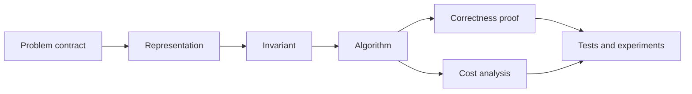
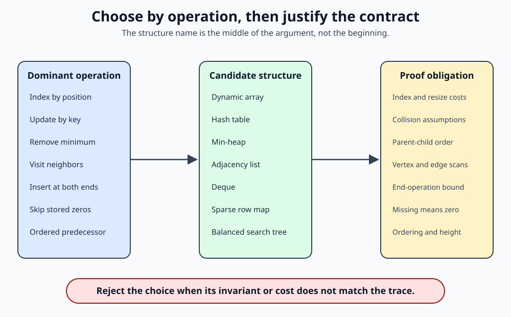
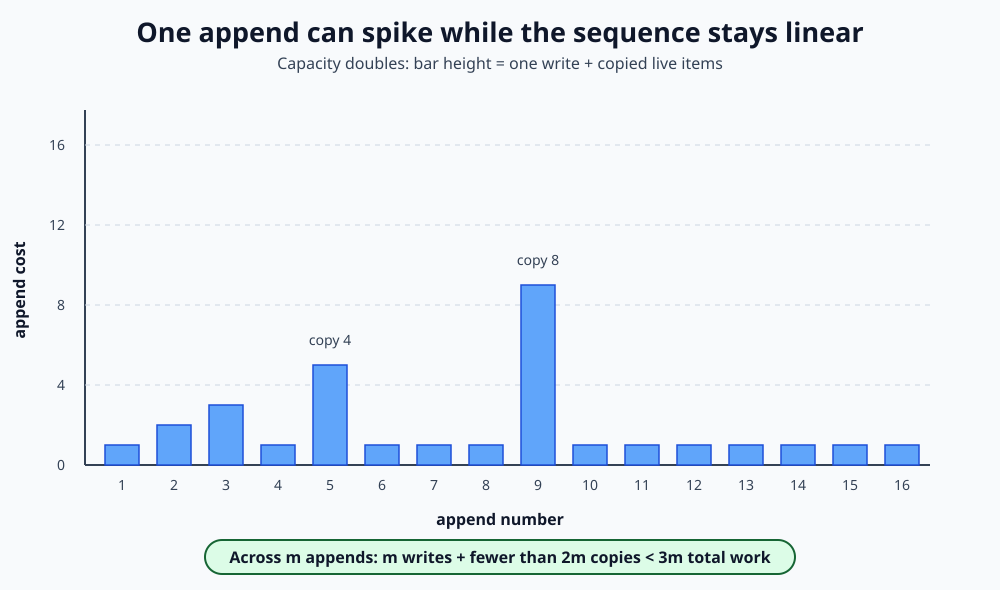
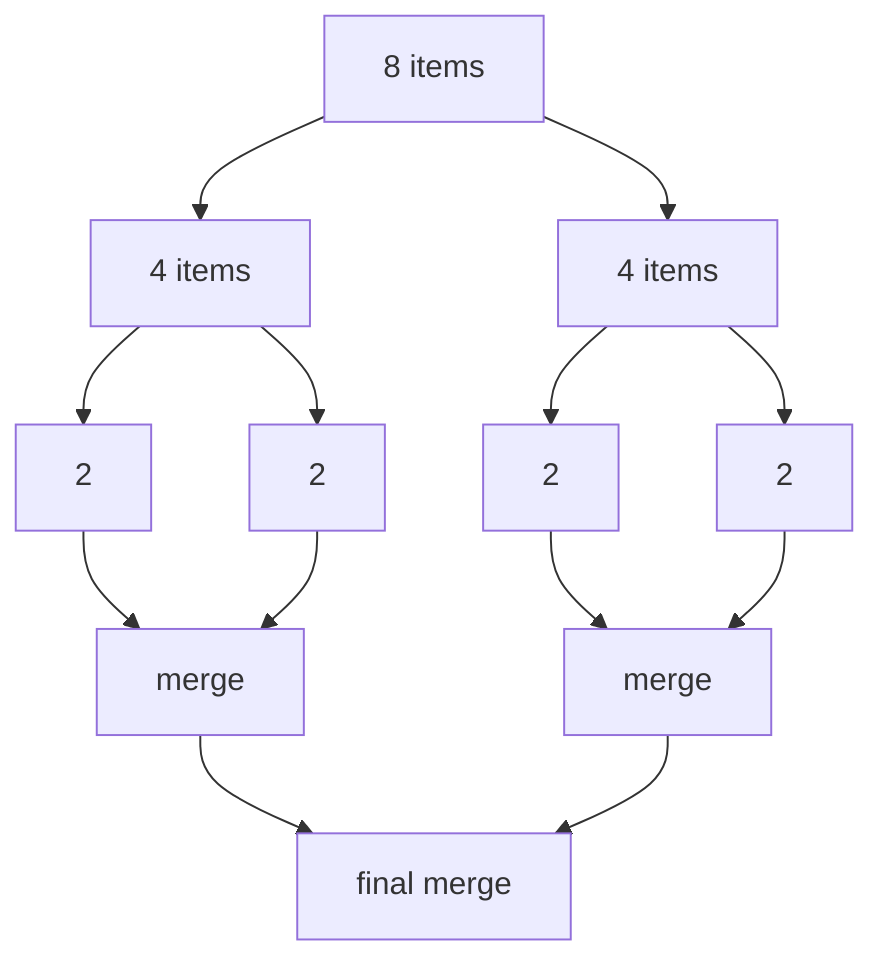
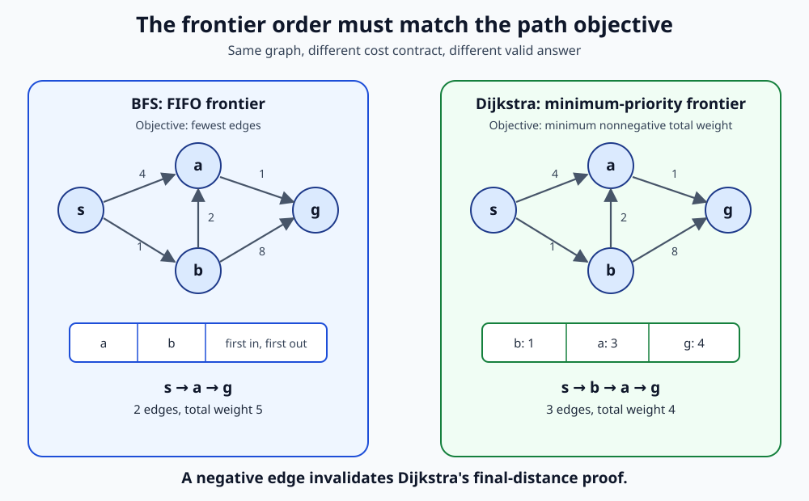
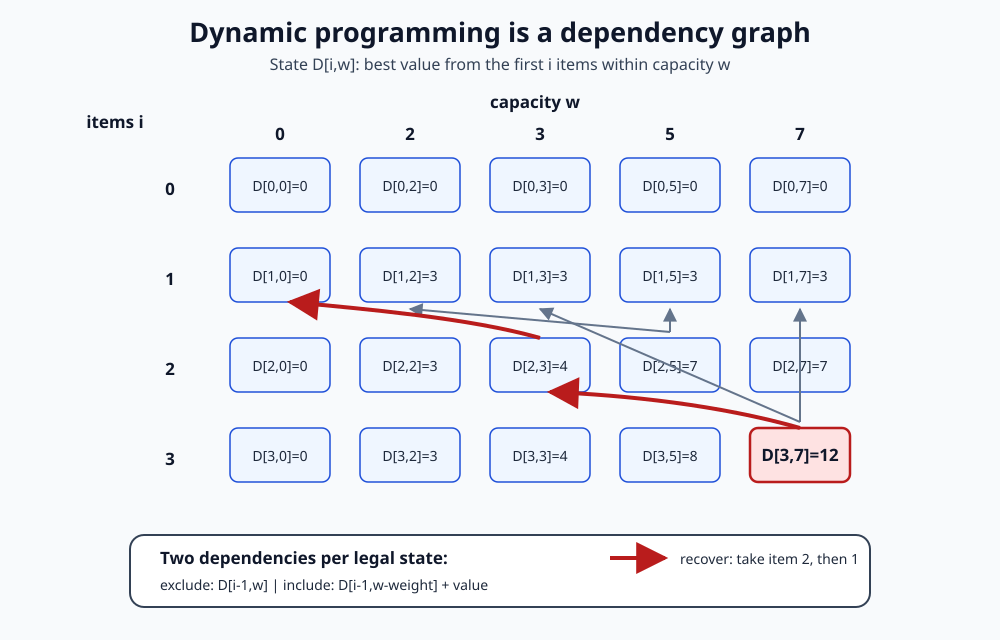
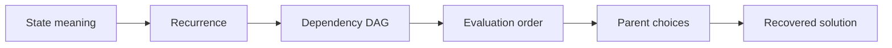
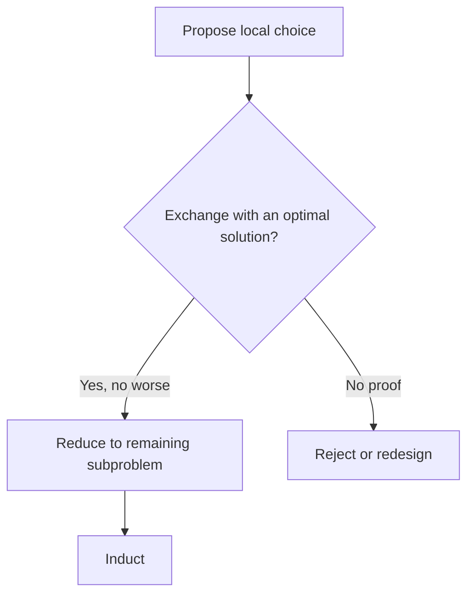

# 0.14 Algorithms and Data Structures

## Why this matters

An algorithm is not merely code that returns the right answer on one input. It
is a claim that a specified procedure returns the right answer for every input
in its contract, together with a claim about the resources it uses.

A data structure is not merely a container. It is a representation chosen to
make some operations cheap while accepting costs elsewhere. A Python list,
linked list, hash table, heap, search tree, adjacency list, and sparse matrix
can hold related information, but they expose different operations, invariants,
and failure modes.

Later AI systems repeatedly make these choices:

- search uses frontiers, priority queues, visited sets, and parent pointers;
- tokenization uses tries, hash tables, and dynamic programming;
- nearest-neighbor methods organize points to avoid scanning every candidate;
- graphical-model inference exploits sparse graph structure;
- decoding recovers a best sequence through dynamic-programming states;
- reinforcement learning stores transitions, priorities, and visitation data;
- training systems schedule work and move sparse parameters under strict memory
  budgets.

The central habit of this module is therefore:

> Choose a representation and an algorithm together, state their contracts,
> prove the invariant that connects them, and measure only after the analysis is
> clear.

MIT's introductory algorithms course describes the subject as mathematical
modeling of computational problems, common algorithmic paradigms and data
structures, and the relationship between algorithms, programming, and
performance analysis [1]. This module follows that boundary. It does not try to
catalog every structure or clever trick.

## Learning objectives

By the end of this module, you should be able to:

1. translate a problem statement into input, output, correctness, representation,
   and resource contracts;
2. select arrays, linked structures, stacks, queues, deques, hash tables, heaps,
   trees, graphs, or sparse representations from the operations the problem
   requires;
3. analyze time and auxiliary space in best, worst, average, expected, and
   amortized senses without conflating them;
4. prove iterative and recursive algorithms using loop invariants, induction,
   exchange arguments, and optimal-substructure arguments;
5. implement and test sorting, binary search, graph traversal, shortest paths,
   disjoint sets, and sparse matrix-vector multiplication;
6. derive dynamic-programming states, recurrences, evaluation order, and parent
   information that reconstructs an optimal solution;
7. justify a greedy algorithm with an exchange argument or reject the greedy
   choice when that proof obligation fails;
8. design randomized experiments that separate correctness from observed and
   expected running time.

## Prerequisite check

You should be ready to use induction, recursion, loop invariants, functions,
classes, exceptions, tests, and explicit computational contracts. Check that
you can answer these questions:

1. What must be true before and after one loop iteration for an invariant to
   prove correctness?
2. Why can a recursive implementation be correct yet exceed the language's
   recursion limit?
3. What distinction does $O(n)$ make that a stopwatch measurement does not?
4. Why might a passing test fail to prove a claim over every valid input?
5. Which graph-model choices must be fixed before running a traversal?

Review [§0.07](../00.07-induction-recursion-invariants/README.md) for induction
and invariants and [§0.13](../00.13-programming-scientific-computing/README.md)
for Python contracts, tests, profiling, and reproducible experiments. The
counting tools in [§0.08](../00.08-counting-combinatorics/README.md), asymptotic
notation in [§0.09](../00.09-sums-series-asymptotics/README.md), and graph models
in [§0.11](../00.11-graph-theory/README.md) are useful preparation.

## Historical context

The subject grew from two inseparable questions: how should information be
represented, and which finite procedure should operate on it? Modern courses
still pair them. MIT 6.006 moves through cost models, sorting, trees, hashing,
graph traversal, shortest paths, and dynamic programming [1]. Pat Morin's
*Open Data Structures* organizes arrays, linked lists, hash tables, trees,
heaps, sorting, and graphs around interfaces and proved running times [2].
Erickson develops dynamic programming and greedy exchange arguments as proof
patterns [3]. The Princeton *Algorithms* booksite connects sorting, searching,
priority queues, and graphs to implementations and visual material [4].

That pairing corrects a common misconception. Big-O notation does not rank
source-code snippets independently of a machine model and representation. A
binary search needs indexed, sorted data. Dijkstra's algorithm needs
nonnegative edge weights and a frontier that can return a minimum tentative
distance. Hash-table expectations need an explicit assumption about hashing or
inputs. The proof belongs to the complete contract, not to the algorithm's name.

Python deliberately hides many storage details, but not their consequences.
Its standard library documents `deque` as supporting approximately $O(1)$
appends and pops at both ends, while middle indexing slows toward $O(n)$ [5].
`heapq` exposes an array-backed min-heap invariant [6], and `bisect` separates a
logarithmic search from the linear insertion that follows in a list [7]. These
are representation contracts in practical form.

## Intuition

### The five ledgers

For every algorithmic solution, keep five short ledgers:

1. **Problem ledger:** accepted inputs, required output, and invalid cases.
2. **Representation ledger:** stored fields, ownership, and legal states.
3. **Invariant ledger:** facts preserved by every operation.
4. **Cost ledger:** counted primitive operations, input-size variables, and
   space ownership.
5. **Evidence ledger:** proofs, reference comparisons, tests, and measurements.



A fast implementation with no correctness argument is unfinished. A proof with
no representation contract can be inapplicable. A benchmark with no cost model
is only an observation.

### Operations choose the structure

Ask which operations dominate before naming a structure.

| Need | Natural starting point | Main tradeoff |
|---|---|---|
| Index by position | contiguous array | middle insertion moves elements |
| Insert around a known node | linked structure | no constant-time random access |
| Last-in, first-out | stack | only one end is exposed |
| First-in, first-out | queue or deque | arbitrary middle access is not the goal |
| Lookup by key | hash table | order is not the contract; collisions matter |
| Repeated minimum removal | min-heap | arbitrary search is not cheap |
| Ordered predecessor or range query | search tree | height controls cost |
| Traverse relationships | adjacency list or matrix | sparse and dense graphs favor different layouts |
| Store mostly zero entries | sparse map of nonzeros | updates and iteration depend on format |



The figure is a decision aid, not a universal ranking. Cache behavior, language
objects, concurrency, persistence, and external memory can reverse a choice.
Those systems concerns are outside this module's core contract.

### An invariant turns motion into proof

An algorithm changes state. The invariant is the statement that survives that
motion and connects the initial state to the requested result.

Examples:

- binary search keeps the target, if present, inside a half-open candidate
  interval;
- a min-heap keeps every parent key no greater than either child key;
- breadth-first search discovers vertices in nondecreasing edge count;
- union-find keeps each element on a parent path ending at a representative;
- dynamic programming evaluates a state only after the states in its recurrence
  are available.

If you cannot state the invariant, the implementation is probably being guided
by syntax instead of reasoning.

## Mathematics

### Fix the input-size variables

Let $n$ usually denote the number of stored items. Graph algorithms need at
least two variables: $|V|$ vertices and $|E|$ edges. A knapsack table uses both
$n$ items and capacity $W$. A sparse matrix may need row count $m$, column count
$n$, and number of stored nonzeros $z$.

Writing $O(n)$ for Dijkstra's algorithm or knapsack hides the structure that
controls the work. State the variables before the bound.

### Fix the cost model

A unit-cost random-access machine model treats operations such as indexing,
comparison, arithmetic on bounded-size words, assignment, and pointer access as
constant time. This is a useful abstraction, not a law of hardware.

A cost claim must say what it counts. For example:

- comparison sorting counts key comparisons and moves;
- a hash-table analysis counts hash evaluation and probe or chain steps;
- graph traversal counts vertex and edge examinations under a stated
  representation;
- sparse multiplication counts stored nonzeros visited;
- Python measurements include interpreter, allocator, object, and cache costs
  that the abstract model omits.

### Upper, lower, and tight bounds

For nonnegative functions $T$ and $g$:

$$
T(n) \in O(g(n))
$$

means that constants $c>0$ and $n_0$ exist such that
$T(n)\le c g(n)$ for all $n\ge n_0$. The corresponding lower and tight bounds
are $\Omega(g(n))$ and $\Theta(g(n))$.

The statement $T(n)\in O(n^2)$ can be true and uninformative when
$T(n)\in\Theta(n\log n)$. Prefer a tight bound when the analysis supports one.

### Best, worst, average, expected, and amortized

These labels answer different questions.

- **Best case:** minimum cost over inputs of size $n$.
- **Worst case:** maximum cost over inputs of size $n$.
- **Average case:** mean cost under a specified input distribution.
- **Expected cost:** mean over stated randomness, which may come from the input,
  the algorithm, or both.
- **Amortized cost:** a deterministic bound on the total cost of an operation
  sequence, divided across operations. It does not require probability.

Never replace "expected" with "amortized" or "average" without changing the
claim.

### Auxiliary space and retained space

Report what the algorithm allocates beyond its input and output. Merge sort on
arrays commonly uses $\Theta(n)$ auxiliary storage. An in-place heap sort can
use $O(1)$ auxiliary storage. A recursive call stack counts even when the
language allocates it implicitly.

For a data structure, also report retained capacity. A dynamic array with
$n$ live items and capacity $c$ owns space proportional to $c$, not only $n$.

### Core operation table

The following bounds use standard RAM-model representations and omit language-
specific constants. Hash-table expectations assume controlled hashing. Tree
bounds assume balanced height unless stated otherwise.

| Structure | Access/search | Insert | Remove | Boundary |
|---|---:|---:|---:|---|
| Dynamic array | $O(1)$ index | amortized $O(1)$ append; $O(n)$ middle | $O(n)$ middle | resize copies occur |
| Singly linked list | $O(n)$ by index | $O(1)$ after known node | $O(1)$ after known predecessor | finding position still costs |
| Stack | $O(1)$ top | $O(1)$ push | $O(1)$ pop | LIFO only |
| Deque | $O(1)$ ends | $O(1)$ ends | $O(1)$ ends | middle is not the contract |
| Hash table | expected $O(1)$ | expected $O(1)$ | expected $O(1)$ | worst case $O(n)$ |
| Binary min-heap | $O(1)$ minimum | $O(\log n)$ | $O(\log n)$ minimum | arbitrary lookup $O(n)$ |
| Balanced search tree | $O(\log n)$ | $O(\log n)$ | $O(\log n)$ | balance invariant required |
| Adjacency list | scan neighbors $O(\deg(v))$ | representation-dependent | representation-dependent | space $\Theta(\lvert V\rvert+\lvert E\rvert)$ |
| Adjacency matrix | edge test $O(1)$ | edge $O(1)$ | edge $O(1)$ | space $\Theta(\lvert V\rvert^2)$ |

Morin derives these kinds of bounds from concrete representations, including the
$O(1)$ amortized resize cost over a sequence of dynamic-array operations [2].

### Linear interfaces constrain legal access

A stack exposes one end and enforces last-in, first-out order. It fits recursive
simulation, backtracking, expression evaluation, and depth-first traversal. A
queue exposes insertion at one end and removal at the other, giving first-in,
first-out order for breadth-first layers and arrival processing. A deque makes
both ends available without promising cheap arbitrary middle operations.

Linked structures make local insertion cheap only after the relevant node or
predecessor is already known. Searching for the $i$th node remains $O(i)$. An
array makes the $i$th location directly addressable but must shift a suffix for
middle insertion. The word "insert" has no useful cost until the location and
representation are fixed.

### Recursion and iteration store pending work differently

Recursive code places pending calls and local state on the call stack. Iterative
code places state in loop variables or an explicit stack, queue, or table. Both
can implement the same state transition and have the same asymptotic time while
differing in traversal order, auxiliary storage, constant factors, and failure
boundaries.

Use induction to prove a recursive call contract and a loop invariant to prove
an iterative contract. Memoized recursion follows demanded dependencies;
bottom-up dynamic programming chooses an explicit dependency order. Python also
has a finite recursion limit, so a correct depth-$n$ recursive traversal can
fail on an input that an explicit stack handles.

### Sparse representations

A matrix $A\in\mathbb{R}^{m\times n}$ with $z$ stored nonzeros can be represented
as row dictionaries or compressed rows. A row-map matrix-vector product is

$$
y_i = \sum_{(j,a_{ij})\text{ stored in row }i} a_{ij}x_j.
$$

It performs $\Theta(z)$ multiplications and additions rather than scanning all
$mn$ positions. That advantage depends on $z\ll mn$ and on an operation that
can consume the chosen sparse format.

## Derivation

### Dynamic-array append is amortized constant time

Suppose capacity doubles whenever an append finds the backing array full. The
ordinary write costs one unit. A resize from capacity $2^k$ copies $2^k$
existing items.

For $m\ge2$ appends, resize copies total less than

$$
1+2+4+\cdots+2^{\lceil\log_2 m\rceil-1} < 2m.
$$
For $m=1$, the copy cost is zero.

The $m$ ordinary writes plus fewer than $2m$ copies cost less than $3m$ units.
Therefore the average charge over this entire sequence is below three units per
append, so append is amortized $O(1)$. One append can still cost $\Theta(n)$.



Shrinking needs a gap between grow and shrink thresholds. Growing at full
capacity and shrinking immediately below full capacity can thrash between two
sizes.

### Binary search needs a half-open interval

For sorted values $a_0\le\cdots\le a_{n-1}$, maintain indices
$0\le lo\le hi\le n$ and search the half-open interval $[lo,hi)$.

Invariant:

> If the target occurs in the array, at least one occurrence lies in
> $[lo,hi)$.

At each step set $mid=lo+\lfloor(hi-lo)/2\rfloor$.

- If $a_{mid}<x$, no index at or below $mid$ can hold $x$, so set
  $lo=mid+1$.
- Otherwise set $hi=mid$.

The interval length strictly decreases. At termination $lo=hi$. The index `lo`
is the first position whose value is not less than $x$; checking equality
separates presence from insertion position. The loop performs
$\Theta(\log n)$ comparisons in the worst case.

### Merge sort exposes divide, solve, combine

Split $n$ items into two halves, recursively sort each half, and merge the two
sorted sequences in linear time. The recurrence is

$$
T(n)=2T(n/2)+\Theta(n),
$$

for powers of two. At every recursion depth, merges process $\Theta(n)$ total
items, and there are $\log_2 n$ nontrivial depths. Therefore

$$
T(n)\in\Theta(n\log n).
$$

A merge that takes from the left half when keys tie is stable. Stability is part
of the output contract, not an automatic property of "sorting."



Sorting algorithms expose different contracts:

| Algorithm | Time contract | Auxiliary space | Stable by standard form? | Main boundary |
|---|---|---:|---|---|
| Insertion sort | best $\Theta(n)$, worst $\Theta(n^2)$ | $O(1)$ | yes | useful for small or nearly sorted inputs |
| Merge sort | $\Theta(n\log n)$ | $\Theta(n)$ for arrays | yes | allocates merge storage |
| Heap sort | $\Theta(n\log n)$ | $O(1)$ | no | weaker locality; heap is not a sorted array |
| Randomized quicksort | expected $\Theta(n\log n)$, worst $\Theta(n^2)$ | expected $O(\log n)$ stack | no | pivot model is load-bearing |
| Counting sort | $\Theta(n+k)$ | $\Theta(n+k)$ | can be | integer key range $k$ must be controlled |

Comparison, stability, mutation, key domain, and memory are parts of the sorting
contract. No single row dominates every workload.

### Hashing trades deterministic order for controlled lookup

A hash table maps a key $k$ to an initial location $h(k)$. Distinct keys can
collide, so correctness requires a collision policy such as chaining or open
addressing. Expected constant-time lookup is conditional on keeping load under
control and avoiding systematically bad collision patterns. It is not a
worst-case theorem for arbitrary keys and arbitrary hashing [2].

For separate chaining with $n$ keys and $m$ buckets, the load factor is
$\alpha=n/m$. Under simple uniform hashing, expected chain length is $\alpha$,
so expected lookup is $O(1+\alpha)$. Resizing keeps $\alpha$ bounded but adds an
amortized rebuilding cost.

### A heap stores a partial order in an array

For zero-based index $i$, children lie at $2i+1$ and $2i+2$. A min-heap keeps

$$
a_{\lfloor(i-1)/2\rfloor}\le a_i
$$

for every nonroot index $i$. This partial order guarantees only that the root is
a minimum. Siblings and cousins need not be ordered.

Insertion appends a leaf and repairs the root path upward. Removing the minimum
moves the final leaf to the root and repairs one downward path. Heap height is
$\lfloor\log_2 n\rfloor$, giving $O(\log n)$ repair time. Python's `heapq`
exposes exactly this array-based min-heap model [6].

### Search-tree cost is a height claim

A binary search tree keeps every key in a left subtree below its node key and
every key in a right subtree above it, under a stated duplicate policy. Search,
insertion, and removal follow one root-to-leaf path and therefore cost $O(h)$
for height $h$.

Inserting already sorted keys into an unbalanced tree can produce $h=n-1$ and
linear operations. Calling tree operations $O(\log n)$ requires a balance
invariant, random-shape expectation, or another explicit height argument.

### BFS and Dijkstra use different frontier contracts

Breadth-first search uses a FIFO queue. In an unweighted graph, every edge adds
one to path length, so first discovery fixes the minimum edge count.

Dijkstra uses a minimum-priority queue keyed by tentative distance. With
nonnegative edge weights, extracting a vertex with minimum tentative distance
makes that distance final. A negative edge breaks the proof: a later route can
reduce a supposedly final distance.

For adjacency lists:

- BFS runs in $\Theta(|V|+|E|)$;
- Dijkstra with a binary heap and stale-entry skipping runs in
  $O((|V|+|E|)\log |V|)$, commonly written $O(|E|\log |V|)$ when the reachable
  graph is connected enough that $|E|\ge |V|-1$.



### Union-find makes connectivity incremental

A disjoint-set union structure stores a forest of parent pointers. `find(x)`
returns a root representative. `union(a,b)` links two roots. Union by size keeps
small trees under large ones, and path compression rewrites a find path toward
the root.

The invariant is partition equivalence:

$$
\mathrm{find}(a)=\mathrm{find}(b)
\quad\Longleftrightarrow\quad
\text{$a$ and $b$ belong to the same maintained block}.
$$

A sequence of $m$ operations on $n$ elements costs
$O(m\,\alpha(n))$ with both heuristics, where $\alpha$ is the inverse Ackermann
function. This is not literally constant, but it grows so slowly that bounded
practical inputs see a very small value.

### Dynamic programming is a dependency graph

Dynamic programming applies when states repeat and an optimal or counted result
can be assembled from smaller state results. Use this workflow:

1. define a state with one precise meaning;
2. write the recurrence and base cases;
3. identify the dependency graph;
4. choose memoized recursion or a valid bottom-up order;
5. store parent choices when the solution itself must be recovered;
6. prove that the recurrence considers every legal final choice and only legal
   choices.

For 0/1 knapsack, let $D[i,w]$ be the maximum value using the first $i$ items
within capacity $w$. For weight $s_i$ and value $v_i$:

$$
D[i,w]=
\begin{cases}
D[i-1,w], & s_i>w,\\\\
\max\{D[i-1,w],\ D[i-1,w-s_i]+v_i\}, & s_i\le w.
\end{cases}
$$

The table has $(n+1)(W+1)$ states and $O(1)$ work per state, so time is
$\Theta(nW)$. This is pseudopolynomial: $W$ is a numeric value, while its binary
encoding uses only $\Theta(\log W)$ bits. §0.15 owns the formal complexity
consequence.



Erickson treats dynamic programming as explicit subproblem design and evaluation
of dependencies, including reconstruction, rather than as "add a cache" [3].



### Greedy choices need exchange arguments

A greedy algorithm commits to a locally preferred choice and does not reconsider
it. That is a strategy, not a proof.

For maximum-cardinality interval scheduling, sort intervals by nondecreasing
finish time and repeatedly choose the first interval compatible with those
already chosen. Let $g$ be the first greedy interval and $o$ the first interval
of an optimal schedule. Since $g$ finishes no later than $o$, replacing $o$ with
$g$ cannot invalidate the rest of the schedule. Thus some optimal schedule
starts with $g$. Induction applies the same exchange to the remaining compatible
intervals [3].

The argument does not prove that earliest finish solves weighted interval
scheduling. Changing the objective changes the exchange obligation, and the
weighted problem generally needs dynamic programming.



### Randomization moves a cost claim into probability

Randomized quickselect chooses a pivot, partitions around it, and recurses only
into the side containing the requested rank. Correctness holds for every pivot
sequence if partitioning is correct. Running time depends on pivot quality.

A deliberately chosen extreme pivot can produce

$$
T(n)=T(n-1)+\Theta(n)=\Theta(n^2).
$$

A pivot selected uniformly from the current candidates gives expected linear
time, while the worst case remains quadratic. Reproducible experiments should
inject a random generator, record seeds and versions, and report the distribution
of observed comparisons instead of presenting one timing as the expectation.

## Implementation

The [module code](code/README.md) provides tested, standard-library
implementations chosen to expose the central mechanisms:

| Implementation | Contract emphasized |
|---|---|
| `binary_search_left` | half-open interval and duplicate boundary |
| `merge_sort` | stable divide-and-conquer sorting |
| `MinHeap` | parent-child heap invariant |
| `bfs_shortest_paths` | FIFO frontier and parent recovery |
| `dijkstra` | nonnegative weights and priority frontier |
| `DisjointSet` | representative forest, union by size, path compression |
| `sparse_matvec` | explicit shape and stored-nonzero contract |
| `knapsack_01` | state table and recovered item choices |
| `interval_schedule` | earliest-finish greedy contract |
| `quickselect` | injected randomness and rank contract |

The implementations reject malformed inputs rather than silently changing the
problem. They are teaching implementations, not replacements for specialized
libraries.

### Example: inspect the contract, not only the result

```python
from algorithms import binary_search_left

values = [2, 4, 4, 4, 9]
assert binary_search_left(values, 4) == 1
assert binary_search_left(values, 5) == 4
```

The same function returns an insertion position whether or not the target is
present. The caller checks `index < len(values) and values[index] == target`
when presence is required.

### Example: recover a shortest path

```python
from algorithms import bfs_shortest_paths, recover_path

graph = {
    "start": ["a", "b"],
    "a": ["goal"],
    "b": ["c"],
    "c": ["goal"],
    "goal": [],
}
distance, parent = bfs_shortest_paths(graph, "start")
assert distance["goal"] == 2
assert recover_path(parent, "start", "goal") == ["start", "a", "goal"]
```

Distance alone answers the value question. Parent pointers answer the witness
question.

### Example: distinguish sparse work from dense shape

```python
from algorithms import sparse_matvec

rows = [
    {0: 2.0, 3: -1.0},
    {},
    {1: 4.0},
]
assert sparse_matvec(rows, [3.0, 5.0, 0.0, 7.0]) == [-1.0, 0.0, 20.0]
```

The matrix shape is $3\times4$, but multiplication visits only three stored
entries.

## Experimentation

### Experiment 1: see amortization without averaging inputs

Append items to a doubling array model. Record ordinary writes and resize
copies separately. Plot cumulative work divided by append count. Individual
spikes remain, while the cumulative charge stays bounded. This demonstrates a
sequence bound, not a probability claim.

### Experiment 2: compare representations under one operation trace

Replay the same operation trace against candidate structures. Record operation
counts before wall time. If a queue workload repeatedly removes from the front,
compare `list.pop(0)` with `collections.deque.popleft()`. The language docs state
the end-operation contract for `deque` [5]; timing shows only how that contract
appears on the tested machine.

### Experiment 3: test randomized cost as a distribution

For several input sizes, run quickselect over many independently spawned random
streams. Record partitioned elements or comparisons rather than time alone.
Report median, upper quantiles, maximum observed work, seed derivation, and the
fact that finite trials do not prove the expectation or exclude the worst case.

### Experiment 4: measure sparse crossover honestly

Generate matrices with controlled shape and nonzero count. Compare a dense
nested-loop product with row-map sparse multiplication. Record construction
cost separately from repeated multiplication. A sparse representation can lose
when the matrix is dense or when object overhead dominates.

## Worked examples

### Example 1: choose a frontier

A social-network query asks for the fewest friendship hops. Every edge counts
one, so BFS and a FIFO queue match the objective. A road query asks for minimum
travel time with nonnegative durations, so Dijkstra and a minimum-priority queue
match the objective. The graph can look identical while the cost model changes
the algorithm.

### Example 2: reject binary search on an unsorted list

Binary search's interval update discards one side using sorted order. Without
that invariant, the discarded side can contain the target. The fix is not a
special case inside binary search. Sort first if repeated queries justify the
cost, maintain an ordered structure, use a hash table for equality lookup, or
scan linearly.

### Example 3: explain a dynamic-array spike

Appending the ninth item to capacity eight allocates capacity sixteen and copies
eight items before writing the new item. That append is $\Theta(n)$. Across the
first nine appends, copies occurred at capacities 1, 2, 4, and 8, totaling 15.
Both facts coexist with amortized $O(1)$ append.

### Example 4: keep heap claims partial

The array `[1, 4, 2, 9, 7, 8]` satisfies the min-heap invariant. It is not sorted:
`4 > 2` across siblings. The minimum is available at index zero; finding `7`
still may require a scan.

### Example 5: preserve sort stability

Records `(priority, arrival)` with equal priorities must retain arrival order in
a stable sort. During merge, choose the left record on equal keys. Choosing from
the right first produces a correctly key-sorted but unstable result.

### Example 6: separate search from insertion

`bisect_left` can find an insertion index in $O(\log n)$ comparisons, but
inserting into a Python list still shifts later references and costs $O(n)$ [7].
Calling the complete operation logarithmic drops the representation cost.

### Example 7: reject Dijkstra on a negative edge

Suppose edges are $s\to a$ of weight 2, $s\to b$ of weight 5, and
$b\to a$ of weight -10. Dijkstra can finalize `a` at distance 2 before processing
`b`, but the later route has cost -5. The nonnegative-weight contract is
load-bearing.

### Example 8: recover a knapsack witness

Weights `[2, 3, 4]`, values `[4, 5, 7]`, and capacity 5 have optimal value 9.
The value alone does not identify the solution. Parent decisions recover items
0 and 1, whose total weight is 5 and total value is 9.

### Example 9: reject the wrong greedy rule

For intervals `(0, 100)`, `(1, 2)`, `(2, 3)`, and `(3, 4)`, choosing the earliest
start selects only the long interval. Choosing earliest finish selects the three
short intervals. A plausible local rule is not enough.

### Example 10: read a pseudopolynomial bound

Knapsack time $O(nW)$ is polynomial in the numeric capacity $W$ but exponential
in the worst case as a function of the bit length $\log W$. The bound is useful
and the distinction matters. Formal problem-class consequences remain in
§0.15.

### Example 11: distinguish recursion from dynamic programming

Naive recursive Fibonacci branches into repeated calls and takes exponential
time. Memoization evaluates each integer state once. The speedup comes from
identifying repeated state, not from recursion syntax.

### Example 12: qualify a benchmark

If heap operations are faster than a sorted-list implementation for one trace,
the observation supports that trace, interpreter, machine, and versions. The
structural explanation is that a heap repairs a root-to-leaf path, while list
insertion shifts elements. Neither fact licenses a universal timing ratio.

## Common mistakes

### Naming a structure before listing operations

Start from required operations, sizes, update patterns, ordering, and memory
constraints. Familiarity is not a cost argument.

### Reporting one variable for a multivariable problem

Graph, table, and sparse problems need the dimensions that control work:
$|V|$, $|E|$, $n$, $W$, $m$, and $z$ as applicable.

### Calling average-case cost amortized

Average and expected claims require a probability model. Amortized analysis
bounds a complete operation sequence without probability.

### Dropping the hash-table assumptions

Expected constant lookup does not imply worst-case constant lookup. State load,
collision policy, resizing, and randomness assumptions.

### Assuming a heap is sorted

A heap orders parents against children. It does not order arbitrary pairs.

### Returning an optimum value without a witness

Store parent choices or enough state to reconstruct the requested solution.
Recomputation may be possible, but it must be designed.

### Using a greedy example as a greedy proof

State the exchange. If the local choice cannot replace an optimal choice without
harm, the strategy needs a different proof or a different algorithm.

### Benchmarking before checking complexity and correctness

A fast wrong answer is wrong. A tiny benchmark can also hide the asymptotic
regime, setup cost, caching, or a representation mismatch.

### Treating a library operation as an abstract primitive

`bisect` searches in logarithmic time but list insertion is linear. A heap
operation is logarithmic because of its representation invariant. Read the
complete operation contract.

### Hiding mutation and ownership

An in-place algorithm changes caller-visible state. State whether inputs are
copied, mutated, consumed, or retained.

## Exercises

The [exercise set](exercises/README.md) contains 12 progressive problems. It
moves from representation and amortized analysis through heaps, sorting, search,
graph algorithms, disjoint sets, dynamic programming, greedy proofs,
randomization, and evidence critique. Exact mirrored [worked
solutions](solutions/README.md) are committed separately.

Use the tested [code package](code/README.md) for implementation work and the
[annotated resources](resources/README.md) for additional depth.

## What you should now be able to do

You should now be able to:

- turn a computational problem into explicit correctness, representation,
  invariant, cost, and evidence ledgers;
- choose a structure from its required operations rather than its familiarity;
- distinguish worst, average, expected, and amortized claims;
- analyze time and auxiliary space with the correct input-size variables;
- prove binary search, heap repair, traversal, dynamic programming, and greedy
  choices using the proof form each requires;
- implement and test foundational algorithms without hiding invalid inputs;
- recover witnesses, not only optimum values or distances;
- interpret randomized and benchmark evidence within its finite domain.

## Where this leads

§0.15 Computability and Complexity asks which problems are
computable and which appear to resist efficient exact algorithms. Later
sections reuse this module's contracts in optimization, data analysis, machine
learning, evolutionary computation, neural networks, decoding, search,
planning, graphical models, and reinforcement learning.

Continue with [§0.15 Computability and Complexity](../00.15-computability-complexity/README.md)
for decision languages, undecidability, reductions, NP-completeness, and
structured responses to worst-case hardness.

## References

[1] Massachusetts Institute of Technology, "6.006 Introduction to Algorithms:
Syllabus and Calendar," Fall 2011. Course scope, cost models, sorting, trees,
hashing, graph traversal, shortest paths, and dynamic programming were directly
inspected. CC BY-NC-SA 4.0. https://ocw.mit.edu/courses/6-006-introduction-to-algorithms-fall-2011/ Accessed 2026-09-01.

[2] Pat Morin, *Open Data Structures*, pseudocode edition. Chapters on
array-based lists, linked lists, hash tables, binary trees, heaps, sorting, and
graph representations were directly inspected. CC BY 2.5 Canada.
https://opendatastructures.org/ods-python/ Accessed 2026-09-01.

[3] Jeff Erickson, *Algorithms*, 1st ed., 2019. Chapters on dynamic programming,
greedy algorithms, graphs, and shortest paths were directly inspected. CC BY
4.0. https://jeffe.cs.illinois.edu/teaching/algorithms/ Accessed 2026-09-01.

[4] Robert Sedgewick and Kevin Wayne, *Algorithms, 4th Edition* booksite.
Sorting, priority queues, symbol tables, graphs, and algorithm-analysis indexes
were directly inspected. https://algs4.cs.princeton.edu/home/ Accessed
2026-09-01.

[5] Python Software Foundation, "collections - Container datatypes," Python 3.14
documentation. `deque` end operations, rotation, indexing boundary, and recipes
were directly inspected. PSF License Version 2.
https://docs.python.org/3.14/library/collections.html#collections.deque Accessed
2026-09-01.

[6] Python Software Foundation, "heapq - Heap queue algorithm," Python 3.14
documentation. Min-heap invariant, zero-based child indexing, push, pop,
replacement, merge, and selection operations were directly inspected. PSF
License Version 2. https://docs.python.org/3.14/library/heapq.html Accessed
2026-09-01.

[7] Python Software Foundation, "bisect - Array bisection algorithm," Python
3.14 documentation. Left and right insertion points, key handling, thread-safety
boundary, logarithmic search, and linear list insertion were directly
inspected. PSF License Version 2.
https://docs.python.org/3.14/library/bisect.html Accessed 2026-09-01.

---

[Section home](../README.md) | Previous: [§0.13 Programming and Scientific Computing](../00.13-programming-scientific-computing/README.md) | Next: [§0.15 Computability and Complexity](../00.15-computability-complexity/README.md) | [Exercises](exercises/README.md) | [Worked solutions](solutions/README.md) | [Resources](resources/README.md) | [Code](code/README.md)
