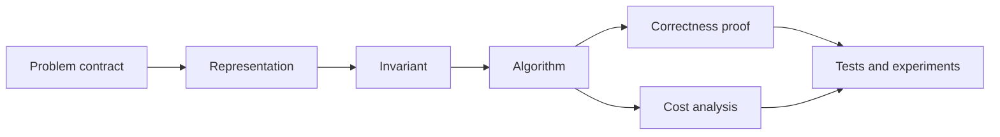
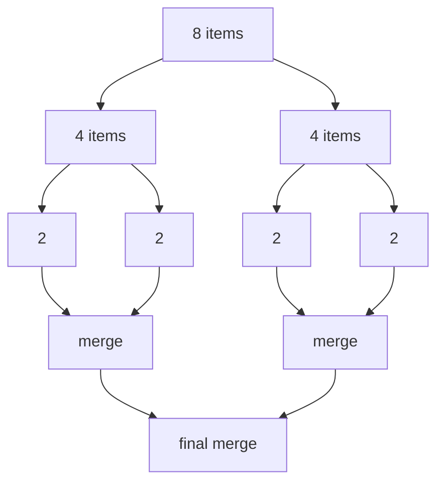
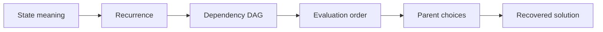
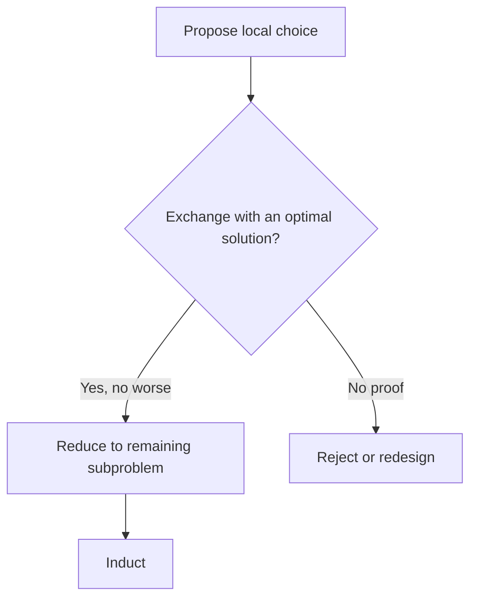

# 0.14 Algorithms and Data Structures

Choose representations and algorithms together, prove their invariants, and analyze time and space under explicit cost models. Implement search, sorting, graph algorithms, dynamic programming, greedy choices, and randomized selection while separating proofs from measurements.

Be comfortable with induction, recursion, and invariants from [§0.07](../00.07-induction-recursion-invariants/README.md), and Python functions, classes, exceptions, tests, and computational contracts from [§0.13](../00.13-programming-scientific-computing/README.md). Counting in [§0.08](../00.08-counting-combinatorics/README.md), asymptotic notation in [§0.09](../00.09-sums-series-asymptotics/README.md), and graph models in [§0.11](../00.11-graph-theory/README.md) are useful preparation.

**In this module:** [Choosing representations and algorithms together](#choosing-representations-and-algorithms-together) · [Cost models and data structures](#cost-models-and-data-structures) · [Correctness and resource arguments](#correctness-and-resource-arguments) · [Implementation](#implementation) · [Experimentation](#experimentation) · [Worked examples](#worked-examples) · [Practice](#practice) · [References](#references)

## Choosing representations and algorithms together

An algorithm is not merely code that returns the right answer on one input. It
is a claim that a specified procedure returns the right answer for every input
in its contract, together with a claim about the resources it uses.

A data structure is not merely a container. It is a representation chosen to
make some operations cheap while accepting costs elsewhere. A Python list,
linked list, hash table, heap, search tree, adjacency list, and sparse matrix
can hold related information, but they expose different operations, invariants,
and failure modes.

Later AI systems repeatedly make these choices:

- search uses frontiers, priority queues, visited sets, and parent pointers;
- tokenization uses tries, hash tables, and dynamic programming;
- nearest-neighbor methods organize points to avoid scanning every candidate;
- graphical-model inference exploits sparse graph structure;
- decoding recovers a best sequence through dynamic-programming states;
- reinforcement learning stores transitions, priorities, and visitation data;
- training systems schedule work and move sparse parameters under strict memory
  budgets.

The central habit of this module is therefore:

> Choose a representation and an algorithm together, state their contracts,
> prove the invariant that connects them, and measure only after the analysis is
> clear.

MIT's introductory algorithms course describes the subject as mathematical
modeling of computational problems, common algorithmic paradigms and data
structures, and the relationship between algorithms, programming, and
performance analysis [1]. This module follows that boundary. It does not try to
catalog every structure or clever trick.

**Check your starting point.**

1. What must be true before and after one loop iteration for an invariant to
   prove correctness?
2. Why can a recursive implementation be correct yet exceed the language's
   recursion limit?
3. What distinction does $`O(n)`$ make that a stopwatch measurement does not?
4. Why might a passing test fail to prove a claim over every valid input?
5. Which graph-model choices must be fixed before running a traversal?

## Historical context

The subject grew from two inseparable questions: how should information be
represented, and which finite procedure should operate on it? Modern courses
still pair them. MIT 6.006 moves through cost models, sorting, trees, hashing,
graph traversal, shortest paths, and dynamic programming [1]. Pat Morin's
*Open Data Structures* organizes arrays, linked lists, hash tables, trees,
heaps, sorting, and graphs around interfaces and proved running times [2].
Erickson develops dynamic programming and greedy exchange arguments as proof
patterns [3]. The Princeton *Algorithms* booksite connects sorting, searching,
priority queues, and graphs to implementations and visual material [4].

That pairing corrects a common misconception. Big-O notation does not rank
source-code snippets independently of a machine model and representation. A
binary search needs indexed, sorted data. Dijkstra's algorithm needs
nonnegative edge weights and a frontier that can return a minimum tentative
distance. Hash-table expectations need an explicit assumption about hashing or
inputs. The proof belongs to the complete contract, not to the algorithm's name.

Python deliberately hides many storage details, but not their consequences.
Its standard library documents `deque` as supporting approximately $`O(1)`$
appends and pops at both ends, while middle indexing slows toward $`O(n)`$ [5].
`heapq` exposes an array-backed min-heap invariant [6], and `bisect` separates a
logarithmic search from the linear insertion that follows in a list [7]. These
are representation contracts in practical form.

## Operations, representations, and invariants

### The five ledgers

For every algorithmic solution, keep five short ledgers:

1. **Problem ledger:** accepted inputs, required output, and invalid cases.
2. **Representation ledger:** stored fields, ownership, and legal states.
3. **Invariant ledger:** facts preserved by every operation.
4. **Cost ledger:** counted primitive operations, input-size variables, and
   space ownership.
5. **Evidence ledger:** proofs, reference comparisons, tests, and measurements.



A fast implementation with no correctness argument is unfinished. A proof with
no representation contract can be inapplicable. A benchmark with no cost model
is only an observation.

### Operations choose the structure

Ask which operations dominate before naming a structure.

| Need | Natural starting point | Main tradeoff |
|---|---|---|
| Index by position | contiguous array | middle insertion moves elements |
| Insert around a known node | linked structure | no constant-time random access |
| Last-in, first-out | stack | only one end is exposed |
| First-in, first-out | queue or deque | arbitrary middle access is not the goal |
| Lookup by key | hash table | order is not the contract; collisions matter |
| Repeated minimum removal | min-heap | arbitrary search is not cheap |
| Ordered predecessor or range query | search tree | height controls cost |
| Traverse relationships | adjacency list or matrix | sparse and dense graphs favor different layouts |
| Store mostly zero entries | sparse map of nonzeros | updates and iteration depend on format |


The figure is a decision aid, not a universal ranking. Cache behavior, language
objects, concurrency, persistence, and external memory can reverse a choice.
Those systems concerns are outside this module's core contract.

### An invariant turns motion into proof

An algorithm changes state. The invariant is the statement that survives that
motion and connects the initial state to the requested result.

Examples:

- binary search keeps the target, if present, inside a half-open candidate
  interval;
- a min-heap keeps every parent key no greater than either child key;
- breadth-first search discovers vertices in nondecreasing edge count;
- union-find keeps each element on a parent path ending at a representative;
- dynamic programming evaluates a state only after the states in its recurrence
  are available.

If you cannot state the invariant, the implementation is probably being guided
by syntax instead of reasoning.

## Cost models and data structures

### Fix the input-size variables

Let $`n`$ usually denote the number of stored items. Graph algorithms need at
least two variables: $`|V|`$ vertices and $`|E|`$ edges. A knapsack table uses both
$`n`$ items and capacity $`W`$. A sparse matrix may need row count $`m`$, column count
$`n`$, and number of stored nonzeros $`z`$.

Writing $`O(n)`$ for Dijkstra's algorithm or knapsack hides the structure that
controls the work. State the variables before the bound.

### Fix the cost model

A unit-cost random-access machine model treats operations such as indexing,
comparison, arithmetic on bounded-size words, assignment, and pointer access as
constant time. This is a useful abstraction, not a law of hardware.

A cost claim must say what it counts. For example:

- comparison sorting counts key comparisons and moves;
- a hash-table analysis counts hash evaluation and probe or chain steps;
- graph traversal counts vertex and edge examinations under a stated
  representation;
- sparse multiplication counts stored nonzeros visited;
- Python measurements include interpreter, allocator, object, and cache costs
  that the abstract model omits.

### Upper, lower, and tight bounds

For nonnegative functions $`T`$ and $`g`$:

$$
T(n) \in O(g(n))
$$

means that constants $`c>0`$ and $`n_0`$ exist such that
$`T(n)\le c g(n)`$ for all $`n\ge n_0`$. The corresponding lower and tight bounds
are $`\Omega(g(n))`$ and $`\Theta(g(n))`$.

The statement $`T(n)\in O(n^2)`$ can be true and uninformative when
$`T(n)\in\Theta(n\log n)`$. Prefer a tight bound when the analysis supports one.

### Best, worst, average, expected, and amortized

These labels answer different questions.

- **Best case:** minimum cost over inputs of size $`n`$.
- **Worst case:** maximum cost over inputs of size $`n`$.
- **Average case:** mean cost under a specified input distribution.
- **Expected cost:** mean over stated randomness, which may come from the input,
  the algorithm, or both.
- **Amortized cost:** a deterministic bound on the total cost of an operation
  sequence, divided across operations. It does not require probability.

Never replace "expected" with "amortized" or "average" without changing the
claim.

### Auxiliary space and retained space

Report what the algorithm allocates beyond its input and output. Merge sort on
arrays commonly uses $`\Theta(n)`$ auxiliary storage. An in-place heap sort can
use $`O(1)`$ auxiliary storage. A recursive call stack counts even when the
language allocates it implicitly.

For a data structure, also report retained capacity. A dynamic array with
$`n`$ live items and capacity $`c`$ owns space proportional to $`c`$, not only $`n`$.

### Core operation table

The following bounds use standard RAM-model representations and omit language-
specific constants. Hash-table expectations assume controlled hashing. Tree
bounds assume balanced height unless stated otherwise.

| Structure | Access/search | Insert | Remove | Boundary |
|---|---:|---:|---:|---|
| Dynamic array | $`O(1)`$ index | amortized $`O(1)`$ append; $`O(n)`$ middle | $`O(n)`$ middle | resize copies occur |
| Singly linked list | $`O(n)`$ by index | $`O(1)`$ after known node | $`O(1)`$ after known predecessor | finding position still costs |
| Stack | $`O(1)`$ top | $`O(1)`$ push | $`O(1)`$ pop | LIFO only |
| Deque | $`O(1)`$ ends | $`O(1)`$ ends | $`O(1)`$ ends | middle is not the contract |
| Hash table | expected $`O(1)`$ | expected $`O(1)`$ | expected $`O(1)`$ | worst case $`O(n)`$ |
| Binary min-heap | $`O(1)`$ minimum | $`O(\log n)`$ | $`O(\log n)`$ minimum | arbitrary lookup $`O(n)`$ |
| Balanced search tree | $`O(\log n)`$ | $`O(\log n)`$ | $`O(\log n)`$ | balance invariant required |
| Adjacency list | scan neighbors $`O(\deg(v))`$ | representation-dependent | representation-dependent | space $`\Theta(\lvert V\rvert+\lvert E\rvert)`$ |
| Adjacency matrix | edge test $`O(1)`$ | edge $`O(1)`$ | edge $`O(1)`$ | space $`\Theta(\lvert V\rvert^2)`$ |

Morin derives these kinds of bounds from concrete representations, including the
$`O(1)`$ amortized resize cost over a sequence of dynamic-array operations [2].

### Linear interfaces constrain legal access

A stack exposes one end and enforces last-in, first-out order. It fits recursive
simulation, backtracking, expression evaluation, and depth-first traversal. A
queue exposes insertion at one end and removal at the other, giving first-in,
first-out order for breadth-first layers and arrival processing. A deque makes
both ends available without promising cheap arbitrary middle operations.

Linked structures make local insertion cheap only after the relevant node or
predecessor is already known. Searching for the $`i`$th node remains $`O(i)`$. An
array makes the $`i`$th location directly addressable but must shift a suffix for
middle insertion. The word "insert" has no useful cost until the location and
representation are fixed.

### Recursion and iteration store pending work differently

Recursive code places pending calls and local state on the call stack. Iterative
code places state in loop variables or an explicit stack, queue, or table. Both
can implement the same state transition and have the same asymptotic time while
differing in traversal order, auxiliary storage, constant factors, and failure
boundaries.

Use induction to prove a recursive call contract and a loop invariant to prove
an iterative contract. Memoized recursion follows demanded dependencies;
bottom-up dynamic programming chooses an explicit dependency order. Python also
has a finite recursion limit, so a correct depth-$`n`$ recursive traversal can
fail on an input that an explicit stack handles.

### Sparse representations

A matrix $`A\in\mathbb{R}^{m\times n}`$ with $`z`$ stored nonzeros can be represented
as row dictionaries or compressed rows. A row-map matrix-vector product is

$$
y_i = \sum_{(j,a_{ij})\text{ stored in row }i} a_{ij}x_j.
$$

It performs $`\Theta(z)`$ multiplications and additions rather than scanning all
$`mn`$ positions. That advantage depends on $`z\ll mn`$ and on an operation that
can consume the chosen sparse format.

## Correctness and resource arguments

### Dynamic-array append is amortized constant time

Suppose capacity doubles whenever an append finds the backing array full. The
ordinary write costs one unit. A resize from capacity $`2^k`$ copies $`2^k`$
existing items.

For $`m\ge2`$ appends, resize copies total less than

$$
1+2+4+\cdots+2^{\lceil\log_2 m\rceil-1} < 2m.
$$
For $`m=1`$, the copy cost is zero.

The $`m`$ ordinary writes plus fewer than $`2m`$ copies cost less than $`3m`$ units.
Therefore the average charge over this entire sequence is below three units per
append, so append is amortized $`O(1)`$. One append can still cost $`\Theta(n)`$.


Shrinking needs a gap between grow and shrink thresholds. Growing at full
capacity and shrinking immediately below full capacity can thrash between two
sizes.

### Binary search needs a half-open interval

For sorted values $`a_0\le\cdots\le a_{n-1}`$, maintain indices
$`0\le lo\le hi\le n`$ and search the half-open interval $`[lo,hi)`$.

Invariant:

> If the target occurs in the array, at least one occurrence lies in
> $`[lo,hi)`$.

At each step set $`mid=lo+\lfloor(hi-lo)/2\rfloor`$.

- If $`a_{mid}<x`$, no index at or below $`mid`$ can hold $`x`$, so set
  $`lo=mid+1`$.
- Otherwise set $`hi=mid`$.

The interval length strictly decreases. At termination $`lo=hi`$. The index `lo`
is the first position whose value is not less than $`x`$; checking equality
separates presence from insertion position. The loop performs
$`\Theta(\log n)`$ comparisons in the worst case.

### Merge sort exposes divide, solve, combine

Split $`n`$ items into two halves, recursively sort each half, and merge the two
sorted sequences in linear time. The recurrence is

$$
T(n)=2T(n/2)+\Theta(n),
$$

for powers of two. At every recursion depth, merges process $`\Theta(n)`$ total
items, and there are $`\log_2 n`$ nontrivial depths. Therefore

$$
T(n)\in\Theta(n\log n).
$$

A merge that takes from the left half when keys tie is stable. Stability is part
of the output contract, not an automatic property of "sorting."



Sorting algorithms expose different contracts:

| Algorithm | Time contract | Auxiliary space | Stable by standard form? | Main boundary |
|---|---|---:|---|---|
| Insertion sort | best $`\Theta(n)`$, worst $`\Theta(n^2)`$ | $`O(1)`$ | yes | useful for small or nearly sorted inputs |
| Merge sort | $`\Theta(n\log n)`$ | $`\Theta(n)`$ for arrays | yes | allocates merge storage |
| Heap sort | $`\Theta(n\log n)`$ | $`O(1)`$ | no | weaker locality; heap is not a sorted array |
| Randomized quicksort | expected $`\Theta(n\log n)`$, worst $`\Theta(n^2)`$ | expected $`O(\log n)`$ stack | no | pivot model is load-bearing |
| Counting sort | $`\Theta(n+k)`$ | $`\Theta(n+k)`$ | can be | integer key range $`k`$ must be controlled |

Comparison, stability, mutation, key domain, and memory are parts of the sorting
contract. No single row dominates every workload.

### Hashing trades deterministic order for controlled lookup

A hash table maps a key $`k`$ to an initial location $`h(k)`$. Distinct keys can
collide, so correctness requires a collision policy such as chaining or open
addressing. Expected constant-time lookup is conditional on keeping load under
control and avoiding systematically bad collision patterns. It is not a
worst-case theorem for arbitrary keys and arbitrary hashing [2].

For separate chaining with $`n`$ keys and $`m`$ buckets, the load factor is
$`\alpha=n/m`$. Under simple uniform hashing, expected chain length is $`\alpha`$,
so expected lookup is $`O(1+\alpha)`$. Resizing keeps $`\alpha`$ bounded but adds an
amortized rebuilding cost.

### A heap stores a partial order in an array

For zero-based index $`i`$, children lie at $`2i+1`$ and $`2i+2`$. A min-heap keeps

$$
a_{\lfloor(i-1)/2\rfloor}\le a_i
$$

for every nonroot index $`i`$. This partial order guarantees only that the root is
a minimum. Siblings and cousins need not be ordered.

Insertion appends a leaf and repairs the root path upward. Removing the minimum
moves the final leaf to the root and repairs one downward path. Heap height is
$`\lfloor\log_2 n\rfloor`$, giving $`O(\log n)`$ repair time. Python's `heapq`
exposes exactly this array-based min-heap model [6].

### Search-tree cost is a height claim

A binary search tree keeps every key in a left subtree below its node key and
every key in a right subtree above it, under a stated duplicate policy. Search,
insertion, and removal follow one root-to-leaf path and therefore cost $`O(h)`$
for height $`h`$.

Inserting already sorted keys into an unbalanced tree can produce $`h=n-1`$ and
linear operations. Calling tree operations $`O(\log n)`$ requires a balance
invariant, random-shape expectation, or another explicit height argument.

### BFS and Dijkstra use different frontier contracts

Breadth-first search uses a FIFO queue. In an unweighted graph, every edge adds
one to path length, so first discovery fixes the minimum edge count.

Dijkstra uses a minimum-priority queue keyed by tentative distance. With
nonnegative edge weights, extracting a vertex with minimum tentative distance
makes that distance final. A negative edge breaks the proof: a later route can
reduce a supposedly final distance.

For adjacency lists:

- BFS runs in $`\Theta(|V|+|E|)`$;
- Dijkstra with a binary heap and stale-entry skipping runs in
  $`O((|V|+|E|)\log |V|)`$, commonly written $`O(|E|\log |V|)`$ when the reachable
  graph is connected enough that $`|E|\ge |V|-1`$.


### Union-find makes connectivity incremental

A disjoint-set union structure stores a forest of parent pointers. `find(x)`
returns a root representative. `union(a,b)` links two roots. Union by size keeps
small trees under large ones, and path compression rewrites a find path toward
the root.

The invariant is partition equivalence:

$$
\mathrm{find}(a)=\mathrm{find}(b)
\quad\Longleftrightarrow\quad
\text{$a$ and $b$ belong to the same maintained block}.
$$

A sequence of $`m`$ operations on $`n`$ elements costs
$`O(m\,\alpha(n))`$ with both heuristics, where $`\alpha`$ is the inverse Ackermann
function. This is not literally constant, but it grows so slowly that bounded
practical inputs see a very small value.

### Dynamic programming is a dependency graph

Dynamic programming applies when states repeat and an optimal or counted result
can be assembled from smaller state results. Use this workflow:

1. define a state with one precise meaning;
2. write the recurrence and base cases;
3. identify the dependency graph;
4. choose memoized recursion or a valid bottom-up order;
5. store parent choices when the solution itself must be recovered;
6. prove that the recurrence considers every legal final choice and only legal
   choices.

For 0/1 knapsack, let $`D[i,w]`$ be the maximum value using the first $`i`$ items
within capacity $`w`$. For weight $`s_i`$ and value $`v_i`$:

$$
D[i,w]=
\begin{cases}
D[i-1,w], & s_i>w,\\\\
\max\lbrace D[i-1,w],\ D[i-1,w-s_i]+v_i\rbrace, & s_i\le w.
\end{cases}
$$

The table has $`(n+1)(W+1)`$ states and $`O(1)`$ work per state, so time is
$`\Theta(nW)`$. This is pseudopolynomial: $`W`$ is a numeric value, while its binary
encoding uses only $`\Theta(\log W)`$ bits. §0.15 owns the formal complexity
consequence.


Erickson treats dynamic programming as explicit subproblem design and evaluation
of dependencies, including reconstruction, rather than as "add a cache" [3].



### Greedy choices need exchange arguments

A greedy algorithm commits to a locally preferred choice and does not reconsider
it. That is a strategy, not a proof.

For maximum-cardinality interval scheduling, sort intervals by nondecreasing
finish time and repeatedly choose the first interval compatible with those
already chosen. Let $`g`$ be the first greedy interval and $`o`$ the first interval
of an optimal schedule. Since $`g`$ finishes no later than $`o`$, replacing $`o`$ with
$`g`$ cannot invalidate the rest of the schedule. Thus some optimal schedule
starts with $`g`$. Induction applies the same exchange to the remaining compatible
intervals [3].

The argument does not prove that earliest finish solves weighted interval
scheduling. Changing the objective changes the exchange obligation, and the
weighted problem generally needs dynamic programming.



### Randomization moves a cost claim into probability

Randomized quickselect chooses a pivot, partitions around it, and recurses only
into the side containing the requested rank. Correctness holds for every pivot
sequence if partitioning is correct. Running time depends on pivot quality.

A deliberately chosen extreme pivot can produce

$$
T(n)=T(n-1)+\Theta(n)=\Theta(n^2).
$$

A pivot selected uniformly from the current candidates gives expected linear
time, while the worst case remains quadratic. Reproducible experiments should
inject a random generator, record seeds and versions, and report the distribution
of observed comparisons instead of presenting one timing as the expectation.

## Implementation

### Running the code

Use a Python environment with the Python 3.14 standard library; no third-party packages are needed. The documented Python version describes the original execution context, not a claimed compatibility range. In the commands below, `python` means the selected interpreter, for example after activating `.venv` from the repository root with `source .venv/bin/activate`.

From the repository root, enter this module's `code/` directory before running examples or the existing test suite:

```bash
cd 00-mathematical-foundations/00.14-algorithms-data-structures/code
PYTHONDONTWRITEBYTECODE=1 python -m unittest -v test_algorithms.py
```

Keep that working directory for the Python fences. For a script stored outside `code/`, expose the same helpers with `PYTHONPATH="$PWD" python /path/to/your_script.py` while still in `code/`; substituting only `PYTHONPATH` does not change a script's working directory. On other shells, activate the same environment and set these environment variables with the shell's equivalent syntax.

Run each example with its displayed imports and setup. These are module-local teaching files, not an installed package.

[`algorithms.py`](code/algorithms.py) contains compact reference implementations that expose the
module's invariants and refusal cases. [`test_algorithms.py`](code/test_algorithms.py) checks observable
correctness, mutation boundaries, recovered witnesses, invalid inputs, and
small-domain reference comparisons.

The package uses only the Python 3.14 standard library. It is instructional code,
not a production container or graph library.

### Contents

| Symbol | Teaching purpose | Main bound |
|---|---|---|
| `binary_search_left` | half-open search boundary | $`O(\log n)`$ comparisons |
| `merge_sort` | stable divide, solve, merge | $`\Theta(n\log n)`$ time, $`\Theta(n)`$ auxiliary space |
| `MinHeap` | array-backed parent-child invariant | $`O(\log n)`$ push and pop |
| `bfs_shortest_paths` | FIFO frontier and parent recovery | $`\Theta(\lvert V\rvert+\lvert E\rvert)`$ |
| `dijkstra` | nonnegative weighted frontier | $`O((\lvert V\rvert+\lvert E\rvert)\log\lvert V\rvert)`$ |
| `DisjointSet` | union by size and path compression | $`O(m\alpha(n))`$ per sequence |
| `sparse_matvec` | visit stored nonzeros only | $`\Theta(z)`$ |
| `knapsack_01` | recurrence table and witness recovery | $`\Theta(nW)`$ time and space |
| `interval_schedule` | earliest-finish exchange rule | $`O(n\log n)`$ |
| `quickselect` | caller-owned random pivot stream | expected $`\Theta(n)`$, worst $`\Theta(n^2)`$ |

Bounds assume the representations and cost model stated in the primary lesson.
They are not measured Python timing guarantees.

### Import the helpers

With the working directory above, these imports resolve to the module-local source:

```python
import random

from algorithms import MinHeap, quickselect

heap = MinHeap([5, 2, 7, 1])
assert [heap.pop() for _ in range(len(heap))] == [1, 2, 5, 7]

values = [9, 2, 5, 1, 7]
assert quickselect(values, 2, rng=random.Random(14)) == 5
```

### Contract boundaries

- Binary search assumes the input is already sorted by the same key.
- Search, sort, heap, and selection values must provide a consistent total
  ordering for the comparisons the algorithm performs.
- Graphs must explicitly contain every neighbor as a vertex key.
- Dijkstra rejects negative, infinite, NaN, Boolean, and nonnumeric weights
  before search begins.
- Sparse multiplication treats missing entries as zero and rejects invalid
  columns or nonfinite values.
- Knapsack uses positive integer weights and nonnegative integer capacity. Values
  may be any finite real numbers.
- Intervals are finite, real, half-open boundaries with `start < finish`.
- Quickselect requires a caller-owned `random.Random` instance so stream state is
  explicit.

### Evidence boundary

The tests establish the documented behavior on selected examples, failures, and
small exhaustive references. They do not prove asymptotic bounds. The lesson's
invariants and derivations provide those arguments.

### Example: inspect the contract, not only the result

```python
from algorithms import binary_search_left

values = [2, 4, 4, 4, 9]
assert binary_search_left(values, 4) == 1
assert binary_search_left(values, 5) == 4
```

The same function returns an insertion position whether or not the target is
present. The caller checks `index < len(values) and values[index] == target`
when presence is required.

### Example: recover a shortest path

```python
from algorithms import bfs_shortest_paths, recover_path

graph = {
    "start": ["a", "b"],
    "a": ["goal"],
    "b": ["c"],
    "c": ["goal"],
    "goal": [],
}
distance, parent = bfs_shortest_paths(graph, "start")
assert distance["goal"] == 2
assert recover_path(parent, "start", "goal") == ["start", "a", "goal"]
```

Distance alone answers the value question. Parent pointers answer the witness
question.

### Example: distinguish sparse work from dense shape

```python
from algorithms import sparse_matvec

rows = [
    {0: 2.0, 3: -1.0},
    {},
    {1: 4.0},
]
assert sparse_matvec(rows, [3.0, 5.0, 0.0, 7.0]) == [-1.0, 0.0, 20.0]
```

The matrix shape is $`3\times4`$, but multiplication visits only three stored
entries.

## Experimentation

### Experiment 1: see amortization without averaging inputs

Append items to a doubling array model. Record ordinary writes and resize
copies separately. Plot cumulative work divided by append count. Individual
spikes remain, while the cumulative charge stays bounded. This demonstrates a
sequence bound, not a probability claim.

### Experiment 2: compare representations under one operation trace

Replay the same operation trace against candidate structures. Record operation
counts before wall time. If a queue workload repeatedly removes from the front,
compare `list.pop(0)` with `collections.deque.popleft()`. The language docs state
the end-operation contract for `deque` [5]; timing shows only how that contract
appears on the tested machine.

### Experiment 3: test randomized cost as a distribution

For several input sizes, run quickselect over many independently spawned random
streams. Record partitioned elements or comparisons rather than time alone.
Report median, upper quantiles, maximum observed work, seed derivation, and the
fact that finite trials do not prove the expectation or exclude the worst case.

### Experiment 4: measure sparse crossover honestly

Generate matrices with controlled shape and nonzero count. Compare a dense
nested-loop product with row-map sparse multiplication. Record construction
cost separately from repeated multiplication. A sparse representation can lose
when the matrix is dense or when object overhead dominates.

## Worked examples

### Example 1: choose a frontier

A social-network query asks for the fewest friendship hops. Every edge counts
one, so BFS and a FIFO queue match the objective. A road query asks for minimum
travel time with nonnegative durations, so Dijkstra and a minimum-priority queue
match the objective. The graph can look identical while the cost model changes
the algorithm.

### Example 2: reject binary search on an unsorted list

Binary search's interval update discards one side using sorted order. Without
that invariant, the discarded side can contain the target. The fix is not a
special case inside binary search. Sort first if repeated queries justify the
cost, maintain an ordered structure, use a hash table for equality lookup, or
scan linearly.

### Example 3: explain a dynamic-array spike

Appending the ninth item to capacity eight allocates capacity sixteen and copies
eight items before writing the new item. That append is $`\Theta(n)`$. Across the
first nine appends, copies occurred at capacities 1, 2, 4, and 8, totaling 15.
Both facts coexist with amortized $`O(1)`$ append.

### Example 4: keep heap claims partial

The array `[1, 4, 2, 9, 7, 8]` satisfies the min-heap invariant. It is not sorted:
`4 > 2` across siblings. The minimum is available at index zero; finding `7`
still may require a scan.

### Example 5: preserve sort stability

Records `(priority, arrival)` with equal priorities must retain arrival order in
a stable sort. During merge, choose the left record on equal keys. Choosing from
the right first produces a correctly key-sorted but unstable result.

### Example 6: separate search from insertion

`bisect_left` can find an insertion index in $`O(\log n)`$ comparisons, but
inserting into a Python list still shifts later references and costs $`O(n)`$ [7].
Calling the complete operation logarithmic drops the representation cost.

### Example 7: reject Dijkstra on a negative edge

Suppose edges are $`s\to a`$ of weight 2, $`s\to b`$ of weight 5, and
$`b\to a`$ of weight -10. Dijkstra can finalize `a` at distance 2 before processing
`b`, but the later route has cost -5. The nonnegative-weight contract is
load-bearing.

### Example 8: recover a knapsack witness

Weights `[2, 3, 4]`, values `[4, 5, 7]`, and capacity 5 have optimal value 9.
The value alone does not identify the solution. Parent decisions recover items
0 and 1, whose total weight is 5 and total value is 9.

### Example 9: reject the wrong greedy rule

For intervals `(0, 100)`, `(1, 2)`, `(2, 3)`, and `(3, 4)`, choosing the earliest
start selects only the long interval. Choosing earliest finish selects the three
short intervals. A plausible local rule is not enough.

### Example 10: read a pseudopolynomial bound

Knapsack time $`O(nW)`$ is polynomial in the numeric capacity $`W`$ but exponential
in the worst case as a function of the bit length $`\log W`$. The bound is useful
and the distinction matters. Formal problem-class consequences remain in
§0.15.

### Example 11: distinguish recursion from dynamic programming

Naive recursive Fibonacci branches into repeated calls and takes exponential
time. Memoization evaluates each integer state once. The speedup comes from
identifying repeated state, not from recursion syntax.

### Example 12: qualify a benchmark

If heap operations are faster than a sorted-list implementation for one trace,
the observation supports that trace, interpreter, machine, and versions. The
structural explanation is that a heap repairs a root-to-leaf path, while list
insertion shifts elements. Neither fact licenses a universal timing ratio.

## Common mistakes

### Naming a structure before listing operations

Start from required operations, sizes, update patterns, ordering, and memory
constraints. Familiarity is not a cost argument.

### Reporting one variable for a multivariable problem

Graph, table, and sparse problems need the dimensions that control work:
$`|V|`$, $`|E|`$, $`n`$, $`W`$, $`m`$, and $`z`$ as applicable.

### Calling average-case cost amortized

Average and expected claims require a probability model. Amortized analysis
bounds a complete operation sequence without probability.

### Dropping the hash-table assumptions

Expected constant lookup does not imply worst-case constant lookup. State load,
collision policy, resizing, and randomness assumptions.

### Assuming a heap is sorted

A heap orders parents against children. It does not order arbitrary pairs.

### Returning an optimum value without a witness

Store parent choices or enough state to reconstruct the requested solution.
Recomputation may be possible, but it must be designed.

### Using a greedy example as a greedy proof

State the exchange. If the local choice cannot replace an optimal choice without
harm, the strategy needs a different proof or a different algorithm.

### Benchmarking before checking complexity and correctness

A fast wrong answer is wrong. A tiny benchmark can also hide the asymptotic
regime, setup cost, caching, or a representation mismatch.

### Treating a library operation as an abstract primitive

`bisect` searches in logarithmic time but list insertion is linear. A heap
operation is logarithmic because of its representation invariant. Read the
complete operation contract.

### Hiding mutation and ownership

An in-place algorithm changes caller-visible state. State whether inputs are
copied, mutated, consumed, or retained.

## Practice

Attempt each problem before expanding its worked solution. State contracts and cost-model assumptions with every algorithm. Code exercises use the standard-library implementation in this module unless the problem says otherwise; see [Implementation](#implementation) for the working directory. Different representations or proofs are valid when their contracts and cost claims are equally explicit.

### E0.14.01 Choose representations from operation traces

For each workload, choose a primary representation and justify the choice from
its dominant operations. State one rejected alternative and the cost that makes
it worse under the stated trace.

1. Process tasks in arrival order, appending at one end and removing at the
   other, with no middle access.
2. Maintain one million `(token, count)` pairs with frequent exact-token lookup
   and no sorted-range query.
3. Repeatedly remove the smallest tentative distance and insert revised
   candidates.
4. Store a $`10^6\times10^6`$ matrix with about eight nonzeros per row and perform
   matrix-vector products.
5. Keep values ordered while frequently asking for predecessor and successor.

For each answer, write the representation invariant and expected or worst-case
qualifier that the cost claim requires.

**Hint**

Start from queue, dictionary, priority-queue, sparse-row, and ordered-set
interfaces. Do not begin with Python class names.

<details><summary>Worked solution</summary>

#### Solution E0.14.01

**Key idea.**

The operation trace selects the interface; the interface selects candidate
representations.

**Reasoning.**

1. Use a FIFO queue backed by a deque. Invariant: stored order matches arrival
   order. Append right and remove left are $`O(1)`$ under the deque contract. A
   dynamic array with front deletion is rejected because each deletion shifts
   the remaining references and costs $`O(n)`$.
2. Use a hash table from token to count. Invariant: each stored key appears once
   and maps to its current count. Lookup and update are expected $`O(1)`$ under a
   controlled load and hashing assumption, with $`O(n)`$ worst case. A sorted
   array is rejected because frequent insertions or new-token updates can need
   shifts even though lookup is logarithmic.
3. Use a min-priority queue backed by a binary heap. Invariant: every parent
   priority is no greater than either child's. Minimum removal and insertion are
   $`O(\log n)`$; the minimum is $`O(1)`$. A sorted list makes minimum access cheap
   but insertion $`O(n)`$.
4. Use a sparse row representation containing only nonzeros. Invariant: missing
   entries are zero and each stored column is valid. Matrix-vector work is
   $`\Theta(z)`$ for $`z`$ stored entries. A dense array is rejected because it owns
   $`10^{12}`$ positions and scans mostly zeros.
5. Use a balanced ordered search tree. Invariant: in-order traversal is sorted
   and height remains $`O(\log n)`$. Search, update, predecessor, and successor
   are $`O(\log n)`$. A hash table is rejected because it does not expose ordered
   neighbors as part of its contract.

**Verification.**

Each choice follows from a named dominant operation and includes the qualifier
needed by its cost claim.

**Common wrong turn.**

Do not say "dictionary is fast" or "tree is sorted" without specifying expected
versus worst case, balance, and the operation being analyzed.

</details>

### E0.14.02 Prove the dynamic-array append bound

A dynamic array starts with capacity 1. Appending to a full array allocates twice
the old capacity and copies every live item. Count one unit for each ordinary
write and one unit for each copied item.

1. List the capacity and cost of each of the first 10 appends.
2. For arbitrary $`m\ge1`$, prove that total copy cost is less than $`2m`$.
3. Derive a constant upper bound on amortized append cost.
4. Explain why this result neither says every append is $`O(1)`$ worst case nor
   uses an average input distribution.
5. Give a grow-and-shrink policy that avoids immediate resize thrashing.

**Hint**

Resize capacities form a geometric sequence. For shrinking, leave a gap between
the grow and shrink thresholds.

<details><summary>Worked solution</summary>

#### Solution E0.14.02

**Key idea.**

Expensive resizes occur at geometrically separated capacities.

**Reasoning.**

For the first 10 appends, counting ordinary write plus copied items:

| Append | Capacity after append | Copies | Total append cost |
|---:|---:|---:|---:|
| 1 | 1 | 0 | 1 |
| 2 | 2 | 1 | 2 |
| 3 | 4 | 2 | 3 |
| 4 | 4 | 0 | 1 |
| 5 | 8 | 4 | 5 |
| 6 | 8 | 0 | 1 |
| 7 | 8 | 0 | 1 |
| 8 | 8 | 0 | 1 |
| 9 | 16 | 8 | 9 |
| 10 | 16 | 0 | 1 |

Let $`2^r`$ be the largest copied capacity before or during the first $`m`$
appends. Then $`2^r<m`$ unless $`m=1`$, and total copies are

$$
1+2+\cdots+2^r=2^{r+1}-1<2m.
$$

Ordinary writes cost exactly $`m`$, so total cost is less than $`3m`$. The amortized
charge is therefore below 3 units per append and belongs to $`O(1)`$.

A valid policy grows at load 1 and shrinks when load falls to at most $`1/4`$,
perhaps halving capacity while retaining a minimum capacity. After growth the
load is about $`1/2`$; after shrink it is at most $`1/2`$. A long gap of updates is
needed before the opposite resize.

**Verification.**

The first 10 appends cost 25 total units: 10 writes and 15 copies. The bound
$`25<3(10)`$ holds.

**Common wrong turn.**

Amortized cost is not the cost of every operation and is not an expectation over
random inputs.

</details>

### E0.14.03 Audit hashing contracts and collisions

A separate-chaining table has $`m=8`$ buckets and uses $`h(k)=k\bmod8`$. Insert keys
`0, 8, 16, 1, 9, 2, 10, 18`.

1. Draw the resulting chains and compute load factor $`\alpha`$.
2. Count equality checks for successful lookup of `18` and unsuccessful lookup
   of `26`, assuming insertion appends to each chain.
3. Explain why this deterministic family refutes an unconditional worst-case
   $`O(1)`$ lookup claim.
4. State assumptions under which expected $`O(1+\alpha)`$ lookup is defensible.
5. Propose two tests for collision handling and one test for resize behavior.

**Hint**

`26 % 8` is not an empty bucket. Separate correctness from the distributional
assumption used for expected cost.

<details><summary>Worked solution</summary>

#### Solution E0.14.03

**Key idea.**

Correct collision handling is unconditional; expected constant cost is
conditional.

**Reasoning.**

The chains, in insertion order, are:

```text
0: [0, 8, 16]
1: [1, 9]
2: [2, 10, 18]
3: []
4: []
5: []
6: []
7: []
```

There are 8 keys and 8 buckets, so $`\alpha=1`$. Lookup of `18` checks `2`, `10`,
and `18`: three equality checks. Unsuccessful lookup of `26` also checks all
three entries because `26 % 8 == 2`.

The key family $`0,8,16,\ldots`$ can place all $`n`$ keys in one chain, making lookup
$`\Theta(n)`$. Expected $`O(1+\alpha)`$ is defensible only after stating a model such
as simple uniform hashing, controlled load through resizing, and keys or hash
randomness that do not force systematic collisions.

Tests:

1. insert colliding keys, then retrieve and update each distinct key;
2. delete a key from the head, middle, and tail of a collision chain without
   losing the others;
3. cross a resize threshold and verify every preexisting mapping afterward.

**Verification.**

The bucket counts sum to 8, and every inserted key appears exactly once.

**Common wrong turn.**

Load factor one does not imply every chain has length one.

</details>

### E0.14.04 Repair and test a min-heap

Start with array `[2, 7, 4, 9, 8, 6]`.

1. Verify the zero-based min-heap invariant at every nonroot index.
2. Insert `1` by appending it and tracing every upward swap.
3. Remove the minimum by moving the final item to the root and tracing every
   downward swap.
4. Repeat the operations with `MinHeap` from the module code and assert the
   exact popped sequence after inserting `5`, `1`, and `5` into an empty heap.
5. Prove that upward and downward repair each inspect at most one root-to-leaf
   path and therefore take $`O(\log n)`$ time.
6. Give a heap array that is valid but not globally sorted.

**Hint**

Children of index $`i`$ are $`2i+1`$ and $`2i+2`$. The smaller child is the only legal
candidate for a downward swap in a min-heap.

<details><summary>Worked solution</summary>

#### Solution E0.14.04

**Key idea.**

Insertion repairs upward; minimum removal repairs downward.

**Reasoning.**

The initial array satisfies all parent-child comparisons:

```text
2 <= 7,4
7 <= 9,8
4 <= 6
```

Insert `1`:

```text
[2, 7, 4, 9, 8, 6, 1]  append
[2, 7, 1, 9, 8, 6, 4]  swap with parent 4
[1, 7, 2, 9, 8, 6, 4]  swap with parent 2
```

Remove the minimum and move final `4` to the root:

```text
[4, 7, 2, 9, 8, 6]
[2, 7, 4, 9, 8, 6]     swap with smaller child 2
```

Code check:

```python
from algorithms import MinHeap

heap = MinHeap()
for value in (5, 1, 5):
    heap.push(value)
assert [heap.pop(), heap.pop(), heap.pop()] == [1, 5, 5]
```

A complete binary tree with $`n`$ nodes has height $`\lfloor\log_2 n\rfloor`$.
Each repair changes the current index to its parent or one child, so it examines
at most one path and takes $`O(\log n)`$ time.

`[1, 4, 2, 9, 7, 8]` is a valid min-heap and is not sorted because `4 > 2`.

**Verification.**

Every final parent-child comparison holds, and repeated pop returns
nondecreasing values.

**Common wrong turn.**

Swapping downward with the left child without comparing the right child can
leave the smaller right child below a larger parent.

</details>

### E0.14.05 Preserve stability through merge sort

Sort records

```text
[(2, "a"), (1, "b"), (2, "c"), (1, "d"), (2, "e")]
```

by the integer key.

1. Trace the recursive split and merge performed by `merge_sort`.
2. State the merge-loop invariant.
3. Explain why choosing the left item when keys tie preserves stability.
4. Change that tie rule conceptually to choose the right item and give the first
   pair whose original order can reverse.
5. Verify with code that output keys are sorted, input is unchanged, and equal
   keys preserve label order.
6. Derive $`\Theta(n\log n)`$ time and $`\Theta(n)`$ auxiliary-space bounds for the
   array implementation.

**Hint**

At each merge step, the output prefix must be the stable sorted merge of the
consumed prefixes.

<details><summary>Worked solution</summary>

#### Solution E0.14.05

**Key idea.**

A stable merge takes from the left run when keys tie.

**Reasoning.**

The recursive leaves are the original records. Merging singleton and larger
runs yields final output

```text
[(1, "b"), (1, "d"), (2, "a"), (2, "c"), (2, "e")]
```

Merge invariant:

> Before each iteration, the output is the stable sorted merge of exactly the
> consumed prefixes, and the unconsumed suffixes remain sorted.

If the next keys tie, every left-run record preceded every right-run record in
the original sequence. Taking left first preserves that relation. Taking right
first can reverse `a` and `c`, or `b` and `d`, at the first merge where equal
keys meet across halves.

```python
from algorithms import merge_sort

records = [(2, "a"), (1, "b"), (2, "c"), (1, "d"), (2, "e")]
result = merge_sort(records, key=lambda item: item[0])
assert result == [(1, "b"), (1, "d"), (2, "a"), (2, "c"), (2, "e")]
assert records == [(2, "a"), (1, "b"), (2, "c"), (1, "d"), (2, "e")]
```

There are $`\Theta(\log n)`$ merge levels and $`\Theta(n)`$ work per level, giving
$`\Theta(n\log n)`$ time. The array implementation owns $`\Theta(n)`$ merged output
space, in addition to recursion metadata.

**Verification.**

Keys are nondecreasing, labels for key 1 remain `b,d`, labels for key 2 remain
`a,c,e`, and the input is unchanged.

**Common wrong turn.**

Sorted by key does not imply stable. Stability constrains equal-key records.

</details>

### E0.14.06 Prove a duplicate-aware binary search

For `values = [1, 3, 3, 3, 7, 9]`, use `binary_search_left`.

1. Trace `(lo, mid, hi)` while searching for `3`, `4`, `0`, and `10`.
2. State initialization, preservation, termination, and postcondition for the
   half-open interval invariant.
3. Prove the return value is the first index whose value is not less than the
   target.
4. Explain how the caller distinguishes presence from insertion position.
5. Test empty, singleton, all-equal, absent-below, absent-between, and
   absent-above cases.
6. Explain why inserting at the returned index in an array remains $`O(n)`$.

**Hint**

The postcondition is stronger and more useful than "find any equal item."

<details><summary>Worked solution</summary>

#### Solution E0.14.06

**Key idea.**

Maintain a half-open interval and return a boundary, not an arbitrary match.

**Reasoning.**

Traces for `[1, 3, 3, 3, 7, 9]` are:

```text
target 3:  (0,3,6) -> (0,1,3) -> (0,0,1) -> return 1
target 4:  (0,3,6) -> (4,5,6) -> (4,4,5) -> return 4
target 0:  (0,3,6) -> (0,1,3) -> (0,0,1) -> return 0
target 10: (0,3,6) -> (4,5,6) -> return 6
```

The trace tuple is `(lo, mid, hi)` before the update.

- Initialization: every candidate position lies in `[0,n)`.
- Preservation: when `values[mid] < target`, indices through `mid` are too
  small; otherwise `mid` and everything after it remain possible boundary
  positions.
- Termination: interval length decreases and reaches zero.
- Postcondition: every index below `lo` has value less than target, and every
  index at or above `lo` has value at least target.

Presence is

```python
from algorithms import binary_search_left

values = [1, 3, 3, 3, 7, 9]
target = 3
index = binary_search_left(values, target)
assert index < len(values) and values[index] == target
```

Boundary tests:

```python
from algorithms import binary_search_left

assert binary_search_left([], 4) == 0
assert binary_search_left([4], 4) == 0
assert binary_search_left([4], 5) == 1
assert binary_search_left([3, 3, 3], 3) == 0
assert binary_search_left([3, 3, 3], 2) == 0
assert binary_search_left([1, 3, 7], 4) == 2
assert binary_search_left([1, 3, 7], 8) == 3
```

Array insertion still shifts the suffix, so the complete insertion is $`O(n)`$.

**Verification.**

The postcondition can be checked directly for every returned boundary in the
examples.

**Common wrong turn.**

Using inclusive `hi` with half-open update rules causes skipped candidates or
nontermination.

</details>

### E0.14.07 Match graph frontiers to path contracts

Consider this directed graph:

```text
s -> a (4), s -> b (1), b -> a (2), a -> g (1), b -> g (8)
```

1. Ignore weights and use `bfs_shortest_paths` to recover a path from `s` to
   `g`. State what its distance means.
2. Use `dijkstra` with the weights and recover a minimum-weight path. State what
   its distance means.
3. Explain why the paths can differ without either algorithm being wrong.
4. Add edge `g -> a (-3)` and show that the implementation rejects the graph
   before making a shortest-path claim.
5. Derive the adjacency-list bounds for both algorithms.
6. Give a graph representation under which scanning every possible neighbor
   would change the traversal bound.

**Hint**

BFS minimizes edge count. Dijkstra minimizes summed nonnegative weight.

<details><summary>Worked solution</summary>

#### Solution E0.14.07

**Key idea.**

The frontier order must match the path objective.

**Reasoning.**

Ignoring weights, an adjacency order such as

```python
graph = {"s": ["a", "b"], "a": ["g"], "b": ["a", "g"], "g": []}
```

lets BFS recover `s -> a -> g`, distance 2 edges. Dijkstra sees weighted edges
and recovers `s -> b -> a -> g`, total weight $`1+2+1=4`$, which beats direct
`b -> g` continuation and `s -> a -> g` cost 5.

```python
from algorithms import bfs_shortest_paths, dijkstra, recover_path

unweighted = {"s": ["a", "b"], "a": ["g"], "b": ["a", "g"], "g": []}
distance, parent = bfs_shortest_paths(unweighted, "s")
assert distance["g"] == 2
assert recover_path(parent, "s", "g") == ["s", "a", "g"]

weighted = {
    "s": [("a", 4.0), ("b", 1.0)],
    "a": [("g", 1.0)],
    "b": [("a", 2.0), ("g", 8.0)],
    "g": [],
}
distance, parent = dijkstra(weighted, "s")
assert distance["g"] == 4.0
assert recover_path(parent, "s", "g") == ["s", "b", "a", "g"]
```

Adding `("a", -3.0)` to `g` violates the function's global nonnegative-weight
contract and raises `ValueError`.

With adjacency lists, BFS examines each reachable vertex and outgoing edge once:
$`\Theta(|V|+|E|)`$. Binary-heap Dijkstra performs heap work for relaxations,
giving $`O((|V|+|E|)\log|V|)`$. An adjacency matrix scans $`|V|`$ possible neighbors
per removed vertex, making traversal $`\Theta(|V|^2)`$ even for a sparse graph.

**Verification.**

Each returned path begins at `s`, ends at `g`, follows graph edges, and matches
its algorithm's stated objective.

**Common wrong turn.**

BFS is not a weighted shortest-path algorithm merely because it returns a path
with few edges.

</details>

### E0.14.08 Maintain incremental connectivity

Create `DisjointSet(8)` and apply unions

```text
(0,1), (2,3), (4,5), (6,7), (0,2), (4,6), (0,4)
```

1. Record the components after each union without relying on representative
   numbers as semantic labels.
2. State the parent-forest and size invariants.
3. Trigger `find` on every element and explain what path compression may change
   and what it cannot change.
4. Assert that all elements are connected and that repeating `union(0,7)`
   reports no merge.
5. Explain why union by size alone gives logarithmic tree height.
6. State the qualified sequence bound when path compression is added.

**Hint**

Representatives are implementation artifacts. The partition is the abstract
value.

<details><summary>Worked solution</summary>

#### Solution E0.14.08

**Key idea.**

The abstract value is a partition; roots are replaceable implementation labels.

**Reasoning.**

The component partitions are:

```text
{01}{2}{3}{4}{5}{6}{7}
{01}{23}{4}{5}{6}{7}
{01}{23}{45}{6}{7}
{01}{23}{45}{67}
{0123}{45}{67}
{0123}{4567}
{01234567}
```

The parent forest invariant says every parent index is valid and every parent
path terminates at a self-parent root. The size stored at a root equals the
number of elements in that root's component. Path compression can change
internal parent pointers and tree shape, but it cannot change which root is
reached or which pairs are connected.

```python
from algorithms import DisjointSet

sets = DisjointSet(8)
for pair in ((0, 1), (2, 3), (4, 5), (6, 7), (0, 2), (4, 6), (0, 4)):
    assert sets.union(*pair)
roots = {sets.find(item) for item in range(8)}
assert len(roots) == 1
assert not sets.union(0, 7)
```

Union by size at least doubles the component size whenever a node's depth
increases, so depth is at most $`\lfloor\log_2 n\rfloor`$ without compression.
With both union by size and path compression, a sequence of $`m`$ operations costs
$`O(m\alpha(n))`$.

**Verification.**

Every union reduces component count by one until only one component remains;
the repeated union leaves the partition unchanged.

**Common wrong turn.**

Do not require a particular representative after union. That is not part of the
abstract connectivity contract.

</details>

### E0.14.09 Derive and recover a knapsack solution

Items have weights `[2, 3, 4, 5]`, values `[3, 4, 8, 8]`, and capacity `7`.

1. Define $`D[i,w]`$ precisely and write base cases.
2. Fill the complete value table for $`0\le i\le4`$ and $`0\le w\le7`$.
3. State why every recurrence dependency is available in row-major order.
4. Recover one optimal item set and verify its weight and value.
5. Compare the result with exhaustive subset enumeration.
6. Explain why $`\Theta(nW)`$ is pseudopolynomial rather than polynomial in the
   binary input length.
7. Give one state-compression optimization and explain what reconstruction data
   it risks losing.

**Hint**

At state $`(i,w)`$, the final decision is either to exclude item $`i-1`$ or include
it when legal.

<details><summary>Worked solution</summary>

#### Solution E0.14.09

**Key idea.**

The final decision for each state is exclude or legally include the final item.

**Reasoning.**

Let $`D[i,w]`$ be maximum value using item indices below $`i`$ with total weight at
most $`w`$. Base cases are $`D[0,w]=0`$ and $`D[i,0]=0`$.

Rows for capacities 0 through 7 are:

```text
i=0: 0 0 0 0 0 0  0  0
i=1: 0 0 3 3 3 3  3  3
i=2: 0 0 3 4 4 7  7  7
i=3: 0 0 3 4 8 8 11 12
i=4: 0 0 3 4 8 8 11 12
```

Each row depends only on the previous row, so row-major order is valid. At
`D[4,7]`, item 3 is not chosen because the value equals `D[3,7]`. At `D[3,7]`,
item 2 is chosen; remaining capacity is 3. At `D[2,3]`, item 1 is chosen. The
recovered indices are `(1, 2)`, with weight $`3+4=7`$ and value $`4+8=12`$.

```python
from algorithms import knapsack_01

value, chosen = knapsack_01([2, 3, 4, 5], [3, 4, 8, 8], 7)
assert value == 12
assert chosen == (1, 2)
```

Exhausting all $`2^4`$ subsets confirms no legal subset exceeds 12. Time is
$`\Theta(nW)`$ and table space is $`\Theta(nW)`$. Since binary capacity $`W`$ uses
only $`\Theta(\log W)`$ bits, this is pseudopolynomial. A one-row value table can
reduce space to $`\Theta(W)`$ by iterating capacity downward, but it discards the
full parent history unless extra reconstruction information is retained.

**Verification.**

Chosen indices are unique and valid, their total weight is within capacity, and
their total value equals the returned optimum.

**Common wrong turn.**

Iterating a one-row 0/1 knapsack table upward allows the same item to be reused,
turning the problem into unbounded knapsack.

</details>

### E0.14.10 Prove or reject a greedy schedule

Intervals are half-open:

```text
A=(0,3), B=(1,2), C=(2,4), D=(3,5), E=(4,7), F=(5,6)
```

1. Run `interval_schedule` and state the compatibility boundary.
2. Prove earliest-finish selection is maximum-cardinality using an exchange
   argument and induction.
3. Show that earliest-start can fail using a separate counterexample.
4. Assign weights `A=100` and every other interval weight `1`. Explain why the
   cardinality proof does not establish maximum total weight.
5. Propose a dynamic-programming state for weighted interval scheduling.
6. Identify the exact sentence in your exchange proof that fails for the
   weighted objective.

**Hint**

The exchange preserves the number of scheduled intervals, not arbitrary total
weight.

<details><summary>Worked solution</summary>

#### Solution E0.14.10

**Key idea.**

Earliest finish is safe for cardinality because it leaves at least as much
remaining time as the first choice of an optimum.

**Reasoning.**

Treating intervals as half-open makes `start >= previous_end` compatible.
Sorting by finish and applying the rule selects `B=(1,2)`, `C=(2,4)`, and
`F=(5,6)`.

Let $`g`$ be the compatible interval with earliest finish and let $`o`$ be the first
interval in an optimal remaining schedule. Since $`g`$ finishes no later than
$`o`$, replacing $`o`$ by $`g`$ preserves compatibility with every later interval and
preserves schedule cardinality. Therefore some optimum begins with $`g`$. Remove
intervals conflicting with $`g`$ and apply the same argument inductively. The
greedy schedule is maximum-cardinality.

Earliest start fails on `(0,100), (1,2), (2,3), (3,4)`: it chooses one interval
instead of three.

With `A` weight 100 and all others weight 1, schedule `A,D,F` has weight 102,
while the cardinality-greedy schedule `B,C,F` has weight 3. The exchange
sentence "replacing $`o`$ by $`g`$ preserves the objective" fails: it preserves the
number of intervals but can destroy total weight.

For weighted scheduling, sort by finish, let $`p(i)`$ be the final interval ending
no later than interval $`i`$ starts, and define

$$
D[i]=\max\lbrace D[i-1],\ w_i+D[p(i)]\rbrace.
$$

**Verification.**

```python
from algorithms import interval_schedule

intervals = [(0, 3, "A"), (1, 2, "B"), (2, 4, "C"),
             (3, 5, "D"), (4, 7, "E"), (5, 6, "F")]
assert interval_schedule(intervals) == ((1, 2, "B"), (2, 4, "C"), (5, 6, "F"))
```

**Common wrong turn.**

A maximal schedule, to which no interval can be added, need not have maximum
cardinality.

</details>

### E0.14.11 Measure randomized quickselect honestly

Use `quickselect` to select the median of shuffled ranges of sizes 101, 501, and
1001.

1. Spawn at least 30 independent `random.Random` instances from recorded seeds
   per size.
2. Instrument or wrap the implementation to record the total number of elements
   partitioned in each run.
3. Report median, 90th percentile, maximum, and normalized work divided by $`n`$.
4. Verify every result against `sorted(values)[k]`.
5. Construct a deterministic extreme-pivot recurrence and derive its
   $`\Theta(n^2)`$ cost.
6. Explain why the experiment proves neither expected linear time nor absence of
   quadratic runs.

**Hint**

Correctness is checked per run. The expected-time theorem is a separate
mathematical claim about the random pivot distribution.

<details><summary>Worked solution</summary>

#### Solution E0.14.11

**Key idea.**

Verify every output deterministically and summarize randomized work as a
distribution.

**Reasoning.**

One valid instrumented experiment copies the partition loop while incrementing
`work` by the current candidate length:

```python
import random
import statistics


def measured_select(values, rank, rng):
    candidates = list(values)
    work = 0
    while True:
        if len(candidates) == 1:
            return candidates[0], work
        work += len(candidates)
        pivot = candidates[rng.randrange(len(candidates))]
        lower = [value for value in candidates if value < pivot]
        equal = [value for value in candidates if value == pivot]
        higher = [value for value in candidates if value > pivot]
        if rank < len(lower):
            candidates = lower
        elif rank < len(lower) + len(equal):
            return pivot, work
        else:
            rank -= len(lower) + len(equal)
            candidates = higher


for size in (101, 501, 1001):
    observations = []
    for seed in range(30):
        values = list(range(size))
        random.Random(10_000 + seed).shuffle(values)
        result, work = measured_select(values, size // 2, random.Random(20_000 + seed))
        assert result == sorted(values)[size // 2]
        observations.append(work)
    ordered = sorted(observations)
    report = {
        "size": size,
        "median": statistics.median(observations),
        "p90": ordered[(9 * len(ordered) - 1) // 10],
        "maximum": max(observations),
        "median_per_n": statistics.median(observations) / size,
    }
    print(report)
```

Always choosing the smallest pivot while requesting the maximum gives

$$
T(n)=T(n-1)+\Theta(n)=\Theta(n^2).
$$

The finite trials verify selected outputs and describe observed work for the
recorded streams. They do not prove the expected-time theorem, sample every
pivot sequence, or exclude a quadratic run.

**Verification.**

Every selected result is compared with a trusted sorted reference before its
work count enters the report.

**Common wrong turn.**

A roughly constant observed `work / n` ratio is evidence from the tested range,
not a proof of expected linear time.

</details>

### E0.14.12 Design an evidence-backed algorithm

Design a route planner for a directed network with nonnegative travel times.
The planner receives repeated source-target queries, the graph is sparse, and
occasional edge-weight updates occur between queries.

Deliver:

1. a problem contract covering vertices, edge direction, weight domain,
   unreachable targets, and tie behavior;
2. a representation ledger and comparison with one rejected representation;
3. an algorithm and frontier choice;
4. correctness invariants and a proof outline;
5. time and auxiliary-space analysis using $`|V|`$, $`|E|`$, and query count $`q`$;
6. a cache or preprocessing proposal, including invalidation after updates;
7. at least six tests covering normal, boundary, invalid, and adversarial cases;
8. an experiment plan that records environment and graph provenance without
   claiming benchmark results are universal;
9. one plausible change in requirements that would invalidate the chosen
   algorithm.

**Hint**

A good answer may use Dijkstra per source and cache results, but the update
contract determines whether cached trees remain valid.

<details><summary>Worked solution</summary>

#### Solution E0.14.12

**Key idea.**

Repeated queries and updates make cache validity part of the algorithm contract.

**Reasoning.**

One complete design follows.

**Problem contract.** Vertices are hashable IDs. Each directed edge has finite,
nonnegative travel time. Parallel edges are allowed and each is considered.
Missing source or target is invalid. An unreachable target returns no path and
infinite distance. Equal-distance ties are resolved by stable adjacency order,
which is documented but not semantically important.

**Representation.** Use an adjacency list from each vertex to `(neighbor,
weight)` entries because the graph is sparse. Space is $`\Theta(|V|+|E|)`$ and
outgoing scans cost $`\Theta(\deg^+(v))`$. Reject an adjacency matrix because it
owns $`\Theta(|V|^2)`$ space and makes sparse neighbor scans quadratic overall.

**Algorithm.** Run Dijkstra from a source with a binary min-heap of tentative
`(distance, sequence, vertex)` entries, stale-entry skipping, a distance map,
and parent pointers. The sequence field makes heap ties deterministic without
requiring vertex ordering.

**Correctness.** The path-relaxation invariant says each finite tentative
value is the length of a discovered source path. The settled-set invariant says
every removed nonstale minimum has its true shortest distance. Nonnegative
weights make an unsettled detour unable to lower that minimum. Parent pointers
record the final improving edge and recover a legal path.

**Cost.** One source run costs
$`O((|V|+|E|)\log|V|)`$ with $`O(|V|+|E|)`$ graph storage and $`O(|V|+|E|)`$
worst-case frontier entries under duplicate pushes. Without caching, $`q`$ queries
multiply the run cost by $`q`$.

**Cache.** Cache complete distance and parent maps by source when sources repeat.
Any edge insertion, deletion, or weight change invalidates all cached
single-source results in the conservative design. More selective dynamic
shortest-path maintenance is outside the contract.

**Tests.** Include a single vertex; unreachable target; two equal paths; parallel
edges; zero-weight edge; negative, infinite, or NaN weight rejection; sparse
chain; dense adversarial graph; repeated source cache hit; and update
invalidation followed by changed result.

**Experiment.** Record graph generator or dataset provenance, graph checksum,
$`|V|`$, $`|E|`$, weight range, query distribution, update frequency, cache state,
Python and package versions, hardware, warmup, repeats, wall-clock observations,
heap pushes, relaxations, and limitations. Report preprocessing and update costs
separately.

**Invalidating change.** Allowing negative edges invalidates Dijkstra's settled-
minimum proof. A Bellman-Ford-family algorithm or a stronger graph restriction
would be required.

**Verification.**

The design states every requested ledger, uses all controlling size variables,
and names cache invalidation as a correctness obligation rather than a
performance detail.

**Common wrong turn.**

Caching by source without invalidating after edge updates returns plausible but
stale paths.

</details>

## What you should now be able to do

You should now be able to:

- turn a computational problem into explicit correctness, representation,
  invariant, cost, and evidence ledgers;
- choose a structure from its required operations rather than its familiarity;
- distinguish worst, average, expected, and amortized claims;
- analyze time and auxiliary space with the correct input-size variables;
- prove binary search, heap repair, traversal, dynamic programming, and greedy
  choices using the proof form each requires;
- implement and test foundational algorithms without hiding invalid inputs;
- recover witnesses, not only optimum values or distances;
- interpret randomized and benchmark evidence within its finite domain.

## Where this leads

§0.15 Computability and Complexity asks which problems are
computable and which appear to resist efficient exact algorithms. Later
sections reuse this module's contracts in optimization, data analysis, machine
learning, evolutionary computation, neural networks, decoding, search,
planning, graphical models, and reinforcement learning.

Continue with [§0.15 Computability and Complexity](../00.15-computability-complexity/README.md)
for decision languages, undecidability, reductions, NP-completeness, and
structured responses to worst-case hardness.

## References

### MIT 6.006 Introduction to Algorithms

[1] Massachusetts Institute of Technology, "6.006 Introduction to Algorithms:
Syllabus and Calendar," Fall 2011. Course scope, cost models, sorting, trees,
hashing, graph traversal, shortest paths, and dynamic programming were directly
inspected. CC BY-NC-SA 4.0. https://ocw.mit.edu/courses/6-006-introduction-to-algorithms-fall-2011/ Accessed 2026-09-01.

- **Use for:** a coherent undergraduate sequence and the contract for a complete
  algorithmic answer.
- **Directly inspected:** syllabus, prerequisites, course description, coding
  and theory expectations, and the calendar sequence covering cost models,
  sorting, heaps, trees, hashing, BFS, DFS, shortest paths, Dijkstra,
  Bellman-Ford, dynamic programming, reconstruction, and complexity.
- **Why it helps:** the syllabus explicitly requires description, example,
  correctness argument, and time and space analysis rather than code alone.
- **Boundary:** this module synthesizes the sequence and does not reproduce MIT
  problem sets or solutions.
- **License:** MIT OpenCourseWare CC BY-NC-SA 4.0.

### Open Data Structures

[2] Pat Morin, *Open Data Structures*, pseudocode edition. Chapters on
array-based lists, linked lists, hash tables, binary trees, heaps, sorting, and
graph representations were directly inspected. CC BY 2.5 Canada.
https://opendatastructures.org/ods-python/ Accessed 2026-09-01.

- **Use for:** representation invariants and proved operation costs.
- **Directly inspected:** contents plus chapters on array-based lists, linked
  lists, hash tables, binary trees, heaps, sorting algorithms, and graph
  representations.
- **Why it helps:** each interface is tied to a concrete representation and
  analysis. The array-list chapter explicitly separates expensive resize events
  from $`O(1)`$ amortized sequence cost.
- **Boundary:** the site offers several language editions; the pseudocode edition
  was used for language-independent reasoning. The module's Python code is
  original.
- **License:** CC BY 2.5 Canada for the book and accompanying source code.
- **Other editions:** https://opendatastructures.org/

### Jeff Erickson, Algorithms

[3] Jeff Erickson, *Algorithms*, 1st ed., 2019. Chapters on dynamic programming,
greedy algorithms, graphs, and shortest paths were directly inspected. CC BY
4.0. https://jeffe.cs.illinois.edu/teaching/algorithms/ Accessed 2026-09-01.

- **Use for:** recursive design, dynamic programming, greedy exchange arguments,
  graph algorithms, and shortest paths.
- **Directly inspected:** book index and the dynamic-programming and greedy
  chapters, including subproblem design, evaluation order, interval scheduling,
  and the exchange-proof pattern.
- **Why it helps:** the text treats proof structure as part of algorithm design
  and repeatedly distinguishes a plausible heuristic from a proved algorithm.
- **Boundary:** the book assumes prior exposure to basic data structures. Use
  Open Data Structures or this module first when the containers are unfamiliar.
- **License:** the textbook is CC BY 4.0. Additional lecture notes on the same
  page can use CC BY-NC-SA 4.0, so check the specific artifact before reuse.

### Algorithms, 4th Edition booksite

[4] Robert Sedgewick and Kevin Wayne, *Algorithms, 4th Edition* booksite.
Sorting, priority queues, symbol tables, graphs, and algorithm-analysis indexes
were directly inspected. https://algs4.cs.princeton.edu/home/ Accessed
2026-09-01.

- **Use for:** focused visual and implementation references for sorting,
  priority queues, symbol tables, graphs, and analysis.
- **Directly inspected:** the home page and topic indexes for fundamentals,
  sorting, searching, graphs, and context.
- **Why it helps:** the site connects textbook topics to code, exercises,
  visualizations, and datasets.
- **Boundary:** it is a companion site to a commercial textbook. Link to it;
  do not assume its text or code has an open-content license.

### collections.deque

[5] Python Software Foundation, "collections - Container datatypes," Python 3.14
documentation. `deque` end operations, rotation, indexing boundary, and recipes
were directly inspected. PSF License Version 2.
https://docs.python.org/3.14/library/collections.html#collections.deque Accessed
2026-09-01.

- **Directly inspected:** end append and pop operations, bounded deques,
  rotation, indexing behavior, and recipes.
- **Use for:** mapping the abstract deque interface to Python while retaining the
  distinction between end operations and middle access.
- **License:** PSF License Version 2; documentation code examples additionally
  fall under the Python documentation terms.

### heapq

[6] Python Software Foundation, "heapq - Heap queue algorithm," Python 3.14
documentation. Min-heap invariant, zero-based child indexing, push, pop,
replacement, merge, and selection operations were directly inspected. PSF
License Version 2. https://docs.python.org/3.14/library/heapq.html Accessed
2026-09-01.

- **Directly inspected:** zero-based min-heap invariant, child indexes,
  `heappush`, `heappop`, combined operations, merge, and extreme-value helpers.
- **Use for:** comparing the module's explicit `MinHeap` repair operations with
  a trusted standard-library implementation.
- **Boundary:** `heapq` operates on lists and does not wrap them in an ownership-
  enforcing priority-queue class.
- **License:** PSF License Version 2.

### bisect

[7] Python Software Foundation, "bisect - Array bisection algorithm," Python
3.14 documentation. Left and right insertion points, key handling, thread-safety
boundary, logarithmic search, and linear list insertion were directly
inspected. PSF License Version 2.
https://docs.python.org/3.14/library/bisect.html Accessed 2026-09-01.

- **Directly inspected:** left and right boundaries, `key`, insertion helpers,
  performance notes, and thread-safety warning.
- **Use for:** reinforcing that logarithmic boundary search is followed by
  linear insertion when the representation is a Python list.
- **License:** PSF License Version 2.

### Suggested sequence

1. Read the primary module through the operation table and amortized-array
   derivation.
2. Use Open Data Structures to inspect one array structure, one hash table, one
   heap, and both graph representations.
3. Implement and test the module code before replacing any mechanism with a
   library call.
4. Read Erickson's dynamic-programming and greedy chapters while completing
   E0.14.09 and E0.14.10.
5. Compare the teaching implementations with `deque`, `heapq`, and `bisect`.
6. Use the Princeton booksite for additional drills and visualizations, while
   respecting its reuse boundary.

### Provenance and originality ledger

| Source | Accessed | Exact support used | Inspection limit | Reuse boundary |
|---|---|---|---|---|
| MIT 6.006 OCW | 2026-09-01 | course scope, topic order, complete-answer contract | Fall 2011 public materials | summarized; no problem-set reuse |
| Morin, Open Data Structures | 2026-09-01 | interfaces, representations, amortization, hashing, heaps, graphs | public pseudocode HTML | CC BY 2.5 CA; module prose and code are original |
| Erickson, Algorithms | 2026-09-01 | DP workflow, interval scheduling, exchange arguments | public book chapters | textbook CC BY 4.0; no exercise copying |
| Sedgewick and Wayne booksite | 2026-09-01 | topic organization and supporting-material scope | public booksite pages | linked and summarized only |
| Python `collections` | 2026-09-01 | deque contracts and operation boundaries | Python 3.14 docs | PSF terms |
| Python `heapq` | 2026-09-01 | min-heap invariant and API semantics | Python 3.14 docs | PSF terms |
| Python `bisect` | 2026-09-01 | insertion boundaries and performance warning | Python 3.14 docs | PSF terms |

All lesson prose, exercises, worked solutions, diagrams, SVG figures, and module
code are original to this repository. Source material supports definitions,
contracts, and standard results; it is not copied into the teaching package.

---

[Section home](../README.md) | Previous: [§0.13 Programming and Scientific Computing](../00.13-programming-scientific-computing/README.md) | Next: [§0.15 Computability and Complexity](../00.15-computability-complexity/README.md) | [Practice](#practice) | [Resources](#references) | [Code](#implementation)
