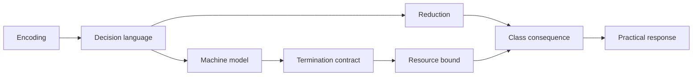

# 0.15 Computability and Complexity

Connect finite encodings and machine models to decidability, reductions, and complexity classes. Learn to distinguish impossibility from resource limits and compare exact, parameterized, approximate, randomized, and heuristic responses without turning timeout or finite evidence into proof.

Use sets and mappings from [§0.04](../00.04-sets-relations-functions/README.md), quantified claims from [§0.05](../00.05-logic-quantifiers/README.md), proof techniques from [§0.06](../00.06-proof-techniques/README.md), induction from [§0.07](../00.07-induction-recursion-invariants/README.md), and algorithms and cost models from [§0.14](../00.14-algorithms-data-structures/README.md). Counting in [§0.08](../00.08-counting-combinatorics/README.md), asymptotics in [§0.09](../00.09-sums-series-asymptotics/README.md), and graphs in [§0.11](../00.11-graph-theory/README.md) provide useful background.

**In this module:** [Three different computational limits](#three-different-computational-limits) · [Languages, reductions, and complexity classes](#languages-reductions-and-complexity-classes) · [Recurrences and proof obligations](#recurrences-and-proof-obligations) · [Implementation](#implementation) · [Experimentation](#experimentation) · [Worked examples](#worked-examples) · [Practice](#practice) · [References](#references)

## Three different computational limits

Some computational problems admit fast exact algorithms. Some are computable but
appear to resist every general efficient method we know. Some cannot be decided
by any algorithm at all. Those are different claims, proved with different tools.

AI work repeatedly meets all three boundaries:

- a parser may need only finite memory, a stack, or unrestricted computation;
- a planner can verify a proposed route quickly while searching for one remains
  combinatorial;
- probabilistic inference can be exact on structured graphs and hard in general;
- a training or decoding problem may support approximation, parameterization,
  relaxation, or randomized search even when its worst-case exact form is hard;
- no amount of faster hardware turns an undecidable specification into a total
  algorithm.

MIT 6.045 organizes this terrain around automata, Turing machines, decidability,
reductions, NP-completeness, and probabilistic computation [1]. The central habit
of this module is:

> State the representation, machine model, decision language, termination
> contract, reduction direction, and resource bound before drawing a practical
> conclusion.

**Check your starting point.**

1. What makes a function total rather than partial?
2. Why does a finite binary encoding of integer $`W`$ use $`\Theta(\log W)`$ bits?
3. What must a loop invariant establish at initialization, preservation, and
   termination?
4. What is the difference between finding a path and checking a supplied path?
5. Why is $`O(nW)`$ not necessarily polynomial in the input length?

## Historical context

Finite automata formalized systems with bounded memory. Context-free grammars
and pushdown automata captured nested syntax. Turing machines then supplied a
minimal model powerful enough to express general algorithms. Critchlow and Eck
present this progression from regular languages through grammars to Turing
machines and computability [2].

The models matter because adding memory changes which languages can be handled,
not merely how quickly. Barak's text connects representation, finite models,
universality, uncomputability, reductions, NP-completeness, and randomized
computation within one modern account [3].

Complexity theory asks a second question after computability: how much time or
space does a computation require as input length grows? The P versus NP question
is still unresolved. The Clay Mathematics Institute describes it through the
gap between checking a proposed solution and finding one [4]. A module about NP
must preserve that uncertainty rather than smuggle in $`P\ne NP`$ as a theorem.

## Encoding, memory, and termination

### The seven ledgers

Keep seven ledgers for every formal claim:

1. **Encoding:** alphabet, legal strings, and bit length.
2. **Problem:** YES instances, NO instances, and any promise.
3. **Model:** finite automaton, pushdown automaton, Turing machine, RAM model, or
   another explicit machine.
4. **Termination:** halt on every input, halt only on accepted inputs, or use a
   bounded probabilistic guarantee.
5. **Reduction:** source, target, transformation cost, and preserved answer.
6. **Resources:** time, space, error, approximation ratio, or parameter.
7. **Evidence:** proof, certificate, counterexample, test, or experiment.



A phrase such as "TSP is hard" drops too many ledgers. The decision version,
optimization version, metric promise, approximation target, and input encoding
support different claims.

### Languages turn decisions into sets

Fix a finite alphabet $`\Sigma`$. A decision problem is represented by a language
$`L\subseteq\Sigma^{\ast}`$:

- encoded YES instances belong to $`L`$;
- encoded NO instances do not;
- malformed strings are rejected or excluded by a stated promise.

Search and optimization remain important, but decision languages give reductions
and complexity classes one stable interface. An optimization problem can often
be paired with a threshold decision problem, yet membership in NP applies to the
decision language, not automatically to the optimization function.


### Memory determines expressive power

A deterministic finite automaton has one of finitely many states. It can track a
finite residue, such as parity, but cannot store an unbounded nesting depth.

A pushdown automaton adds a stack. It can match arbitrary nesting such as balanced
parentheses. Context-free grammars describe the same language family as
nondeterministic pushdown automata, though their operational views differ.

A Turing machine adds an unbounded tape and local read, write, and movement. It
is intentionally austere. Its importance is that it captures the effective
procedures modeled by ordinary programming languages, not that real computers
look like tapes.

### Termination is part of the answer

A **decider** halts on every input and returns YES or NO. A **recognizer** must
accept every member, but it may reject or run forever on a nonmember. Therefore:

$$
\text{decidable languages}\subsetneq\text{recognizable languages}.
$$

A bounded simulator can report `TIMEOUT`, but timeout is not a mathematical NO.
More steps may change the observation. This distinction is load-bearing when
experiments imitate an unbounded machine.


## Languages, reductions, and complexity classes

### Finite automata and regular languages

A DFA is a five-tuple

$$
M=(Q,\Sigma,\delta,q_0,F),
$$

where $`Q`$ is a finite state set, $`\Sigma`$ is an alphabet,
$`\delta:Q\times\Sigma\to Q`$ is a total transition function, $`q_0`$ is the start
state, and $`F\subseteq Q`$ is the accepting set. Extend $`\delta`$ from symbols to
strings recursively. The recognized language is

$$
L(M)=\lbrace w\in\Sigma^{\ast}: \delta^{\ast}(q_0,w)\in F\rbrace.
$$

Regular expressions, DFAs, and NFAs define the regular languages. Their forms
can differ greatly in size, but not in which languages they express [2].

Finite memory cannot recognize $`\lbrace a^n b^n:n\ge0\rbrace`$. Intuitively, arbitrarily
large $`n`$ forces two different prefix counts into the same state. The remaining
suffix then makes the machine treat two strings alike even though only one has
matching counts. A pumping-lemma or distinguishability proof makes this precise.

### Context-free grammars

A context-free grammar is a four-tuple

$$
G=(V,\Sigma,R,S),
$$

with variables $`V`$, terminals $`\Sigma`$, productions $`R`$, and start variable $`S`$.
Each production replaces one variable by a string of variables and terminals.
The grammar

$$
S\to aSb\mid\epsilon
$$

generates $`\lbrace a^n b^n:n\ge0\rbrace`$. A parse tree records one derivation structure.
An ambiguous grammar gives at least one string two distinct parse trees.

Chomsky normal form restricts productions to $`A\to BC`$ or $`A\to a`$, with a
controlled exception for the empty string. The CYK dynamic program decides
membership for a length-$`n`$ token sequence in $`O(n^3|G|)`$ time for a fixed
normalized grammar. The module code omits epsilon rules so its boundary is
visible.

### Turing machines and computable functions

A deterministic one-tape Turing machine has finite control, a finite tape
alphabet containing a blank symbol, and a transition function that reads one
symbol, writes one symbol, changes state, and moves one cell left or right. A
configuration consists of current state, head position, and finite nonblank tape
contents.

A machine decides $`L`$ if it accepts every $`w\in L`$, rejects every $`w\notin L`$,
and halts in both cases. It recognizes $`L`$ if it accepts members and makes no
termination promise for nonmembers. A partial computable function similarly may
be undefined because its machine never halts.

### Countability creates a first limit

Every machine has a finite description, so machines can be encoded as finite
binary strings. The set of machines is countable. The set of all languages over
$`\lbrace 0,1\rbrace`$ is the power set of a countable set and is uncountable. Therefore most
languages are not recognized by any Turing machine.

This cardinality argument proves that unrecognizable languages exist, but it does
not identify a natural one. Diagonalization gives an explicit operational limit.

### The halting problem

Define

$$
HALT=\lbrace \langle M,w\rangle : M\text{ halts on input }w\rbrace.
$$

Assume for contradiction that a decider $`H(M,w)`$ returns YES exactly when $`M`$
halts on $`w`$. Construct program $`D`$:

```text
D(x):
    if H(x, x) says NO:
        halt
    else:
        loop forever
```

Run $`D`$ on its own encoding. If $`H(D,D)`$ says NO, then $`D(D)`$ halts. If it says
YES, then $`D(D)`$ loops. Either answer contradicts the promised behavior of $`H`$.
Thus no such decider exists [3].


This proves undecidability, not merely a large running time. The language $`HALT`$
is recognizable: simulate $`M(w)`$ and accept if it halts. Its complement is not
recognizable, because a language and its complement are both recognizable only
when the language is decidable.

### Mapping reductions

For languages $`A`$ and $`B`$, a computable mapping reduction

$$
A\le_m B
$$

is a total computable function $`f`$ satisfying

$$
x\in A\quad\Longleftrightarrow\quad f(x)\in B.
$$

If $`A\le_m B`$ and $`B`$ is decidable, then $`A`$ is decidable: compute $`f(x)`$ and run
the decider for $`B`$. Contrapositively, if $`A`$ is undecidable and $`A\le_m B`$, then
$`B`$ is undecidable.

The arrow points from the problem being solved to the problem used as a solver.
To prove a new problem $`B`$ hard, reduce a known-hard problem $`A`$ to $`B`$. Reducing
$`B`$ to $`A`$ proves only that $`B`$ is no harder than $`A`$ under that reduction.

### Time complexity and encodings

Let $`|x|`$ be the length of encoded input $`x`$. A deterministic Turing machine runs
in time $`T(n)`$ if every length-$`n`$ input halts within $`T(n)`$ steps. Polynomial
means polynomial in encoding length, not polynomial in the numeric magnitude of
an encoded integer.

For binary $`W`$, input length contains $`\Theta(\log W)`$ bits. An $`O(nW)`$ dynamic
program may therefore take exponential time in the bit length. It is called
**pseudopolynomial**, not polynomial-time in the ordinary encoded-input model.

### P and NP

$`P`$ is the class of decision languages decidable in deterministic polynomial
time.

$`NP`$ can be defined through polynomially checkable certificates. A language
$`L`$ is in NP if a polynomial $`p`$ and polynomial-time verifier $`V`$ exist such that

$$
x\in L
\quad\Longleftrightarrow\quad
\exists c,\ |c|\le p(|x|)\text{ and }V(x,c)=1.
$$

The existential certificate is central. NO instances do not need a short reason
under this definition. Every language in P is in NP because the verifier can
ignore the certificate and solve the instance. Whether $`P=NP`$ remains open [4].

`NP` means nondeterministic polynomial time. It does not mean "non-polynomial,"
and current theory does not prove that every NP-complete problem requires
exponential time.

### Reductions for polynomial-time complexity

A polynomial-time many-one reduction $`A\le_p B`$ computes the mapping $`f`$ in time
polynomial in $`|x|`$. It preserves the YES/NO answer as above.

Two transfer rules drive NP-completeness:

1. if $`A\le_p B`$ and $`B\in P`$, then $`A\in P`$;
2. if $`A`$ is NP-hard and $`A\le_p B`$, then $`B`$ is NP-hard.

A language is **NP-hard** if every language in NP reduces to it. It is
**NP-complete** if it is NP-hard and also belongs to NP. Erickson emphasizes that
an NP-hardness proof is a reduction contract, not a synonym for "looks difficult"
[5].


### Canonical NP-complete decision problems

| Problem | YES instance | Typical certificate | Verification |
|---|---|---|---|
| SAT | a Boolean formula has a satisfying assignment | one truth value per variable | evaluate the formula |
| Subset sum | some indexed subset sums to target $`T`$ | selected indices | check distinctness and sum |
| Graph $`k`$-coloring | adjacent vertices can receive different colors among $`k`$ colors | one color per vertex | inspect every edge |
| TSP decision | a tour has total cost at most bound $`B`$ | vertex permutation | check visits and total cost |

SAT was the first problem proved NP-complete. The Cook-Levin theorem encodes an
accepting polynomial-time nondeterministic computation as a polynomial-size
Boolean formula [3]. This module uses the theorem and studies reduction
contracts; it defers the full tableau construction.

Decision and optimization must stay separate. TSP decision is NP-complete under
standard finite encodings. Finding a minimum tour is an NP-hard optimization
problem. Saying the optimization function "is in NP" mixes interfaces.

### One clean reduction: independent set to vertex cover

For undirected graph $`G=(V,E)`$, a set $`S`$ is independent exactly when its
complement $`V\setminus S`$ is a vertex cover. Every edge has no two endpoints in
$`S`$ exactly when every edge has an endpoint outside $`S`$. Therefore

$$
(G,k)\in INDEPENDENT\text{-}SET
\quad\Longleftrightarrow\quad
(G,|V|-k)\in VERTEX\text{-}COVER.
$$

The transformation preserves $`G`$, changes one integer, and is polynomial-time.
This proves a precise relation. It does not by itself prove either problem
NP-complete; that conclusion also needs a known-hard source and NP membership.

### What NP-completeness implies

If any NP-complete language is in P, every language in NP is in P. Therefore a
polynomial-time exact algorithm for one NP-complete problem would settle $`P=NP`$.

Under the unproved assumption $`P\ne NP`$, no NP-complete language has a general
polynomial-time exact decider. NP-completeness does not imply:

- every instance is difficult;
- every exact algorithm is exponential on every input;
- useful approximation is impossible;
- special graph classes or bounded parameters remain hard;
- heuristics cannot work well on a real distribution;
- small or structured instances should not be solved exactly.

Worst-case classification constrains universal guarantees. It does not replace
instance analysis.

### Approximation algorithms

For a minimization problem with optimum $`OPT(I)`$, an $`\alpha`$-approximation
returns feasible solution $`A(I)`$ in polynomial time and guarantees

$$
A(I)\le\alpha\,OPT(I)
$$

for every valid instance. A maximization ratio is commonly written
$`A(I)\ge OPT(I)/\alpha`$. The guarantee is worst-case and universal, not an
average benchmark result [6].

A maximal matching gives a 2-approximation for minimum vertex cover. Select any
remaining edge, add both endpoints to the cover, and remove every incident edge.
The selected edges form a matching. Every vertex cover must contain at least one
endpoint of each selected edge, while the algorithm selects at most two. Hence
$`|C|\le2|C^{\ast}|`$.

Approximation depends on the problem and promises. Metric TSP, whose distances
obey the triangle inequality, admits constant-factor approximation. Unrestricted
TSP has a different approximability boundary. The phrase "TSP approximation"
is incomplete without its cost contract.

### Randomized complexity

Randomized algorithms make probability part of the contract. Common decision
classes include:

- **RP:** NO instances are always rejected; YES instances are accepted with
  probability at least $`1/2`$;
- **coRP:** YES instances are always accepted; NO instances are rejected with
  probability at least $`1/2`$;
- **BPP:** every instance is answered correctly with probability at least $`2/3`$.

Independent repetition amplifies a bounded gap. Repeating an RP procedure $`r`$
times and accepting if any run accepts reduces false rejection to at most
$`2^{-r}`$. Repeating a BPP procedure and taking a majority gives exponentially
small error by concentration, not by simple "any success" logic. Complexity Zoo
catalogs many distinct randomized and other classes, a useful warning against
flattening them into one label [7].

A randomized algorithm can have deterministic correctness with random running
time, as randomized quicksort does, or bounded error in the answer. Those are
separate ledgers.

### Parameterized complexity

A parameterized problem has instances $`(x,k)`$. It is fixed-parameter tractable
if it can be solved in

$$
f(k)|x|^c
$$

time for a computable $`f`$ and constant $`c`$ independent of $`k`$. The class XP
allows bounds such as $`|x|^{g(k)}`$. Both become polynomial for each fixed $`k`$,
but only FPT isolates the combinatorial explosion from the input exponent [8].

Vertex cover is FPT under solution size $`k`$: choose any uncovered edge
$`\lbrace u,v\rbrace`$. Every cover must contain $`u`$ or $`v`$, so branch on those choices and
decrease $`k`$. The search tree has at most $`2^k`$ leaves, with polynomial work per
node.

A **kernelization** transforms $`(x,k)`$ in polynomial time to equivalent
$`(x',k')`$ whose size is bounded by a function of $`k`$. Parameter choice is a
modeling decision. A small treewidth, number of exceptions, planning horizon, or
edit budget can expose structure that total input size hides.

## Recurrences and proof obligations

### Derive the CYK recurrence

Let $`D[i,\ell]`$ be the set of variables that derive the token substring starting
at $`i`$ with length $`\ell`$. For terminal rule $`A\to a`$:

$$
A\in D[i,1]\quad\text{when token }i\text{ is }a.
$$

For binary rule $`A\to BC`$:

$$
A\in D[i,\ell]
$$

when some split $`1\le s<\ell`$ has $`B\in D[i,s]`$ and
$`C\in D[i+s,\ell-s]`$. Increasing substring length respects dependencies. There
are $`O(n^2)`$ cells and $`O(n)`$ splits per cell, plus grammar-rule work. Accept when
$`S\in D[0,n]`$.

### Derive recognizer complement closure carefully

Suppose $`L`$ and $`\overline L`$ each have recognizers $`R`$ and $`S`$. On input $`x`$,
interleave one step of $`R(x)`$ with one step of $`S(x)`$. Exactly one input relation
holds, so one recognizer eventually accepts. Return YES if $`R`$ accepts and NO if
$`S`$ accepts. This is a decider for $`L`$.

Therefore, if $`L`$ is recognizable but undecidable, its complement cannot also be
recognizable. Running recognizers sequentially would fail because the first can
loop. Dovetailing is the invariant that gives both computations progress.

### Prove reduction composition

If $`A\le_p B`$ through $`f`$ and $`B\le_p C`$ through $`g`$, then

$$
x\in A\Longleftrightarrow f(x)\in B
\Longleftrightarrow g(f(x))\in C.
$$

The composition $`g\circ f`$ is polynomial-time because the first output has
polynomial length and the second computation is polynomial in that length.
Hence $`A\le_p C`$. A chain of reductions preserves direction.

### Derive subset sum's pseudopolynomial boundary

For nonnegative values $`a_1,\dots,a_n`$ and target $`T`$, maintain reachable sums
from $`0`$ through $`T`$. Each item updates at most $`T+1`$ states, so time is $`O(nT)`$.

If $`T=2^b`$, its binary encoding uses $`b+1`$ bits, yet the table has $`2^b+1`$
columns. The algorithm is polynomial in numeric $`T`$ and exponential in the
worst case as a function of $`\log T`$. This does not contradict subset sum's
NP-completeness.

### Prove the vertex-cover branching rule

Let uncovered edge $`\lbrace u,v\rbrace`$ remain. Any valid cover contains $`u`$ or $`v`$.
Branching on those two choices is exhaustive. Each branch spends one unit of
budget and deletes incident edges. At depth greater than $`k`$, no size-$`k`$ cover
can lie on that branch. Thus the recurrence is

$$
T(k)\le2T(k-1)+poly(|V|+|E|),
$$

giving $`O(2^k poly(|V|+|E|))`$. This is FPT, despite exponential dependence on
$`k`$.

## Implementation

### Running the code

Use a Python environment with the Python 3.14 standard library; no third-party packages are needed. The documented Python version describes the original execution context, not a claimed compatibility range. In the commands below, `python` means the selected interpreter, for example after activating `.venv` from the repository root with `source .venv/bin/activate`.

From the repository root, enter this module's `code/` directory before running examples or the existing test suite:

```bash
cd 00-mathematical-foundations/00.15-computability-complexity/code
PYTHONDONTWRITEBYTECODE=1 python -m unittest -v test_complexity.py
```

Keep that working directory for the Python fences. For a script stored outside `code/`, expose the same helpers with `PYTHONPATH="$PWD" python /path/to/your_script.py` while still in `code/`; substituting only `PYTHONPATH` does not change a script's working directory. On other shells, activate the same environment and set these environment variables with the shell's equivalent syntax.

Run each example with its displayed imports and setup. These are module-local teaching files, not an installed package.

[`complexity.py`](code/complexity.py) contains small reference implementations for finite-state
recognition, context-free membership, bounded machine simulation, certificate
verification, pseudopolynomial search, reductions, parameterized search, and
approximation. [`test_complexity.py`](code/test_complexity.py) checks the observable contracts and compares
small exact results with exhaustive references.

The package uses only the Python 3.14 standard library. It illustrates models and
proof obligations. It does not decide nonhalting, prove asymptotic lower bounds,
or replace optimized parsers and solvers.

### Contents

| Symbol | Teaching purpose | Main bound |
|---|---|---|
| `DFA` | total deterministic finite-state recognition | $`O(n)`$ transitions, constant model memory |
| `CNFGrammar.accepts` | CYK context-free membership without epsilon rules | $`O(n^3\lvert G\rvert)`$ in direct analysis |
| `TuringMachine` | explicit tape-machine contract | model definition |
| `run_bounded` | separate accept, reject, and timeout | at most the requested steps |
| `verify_subset_sum` | check an indexed subset certificate | $`O(n+\lvert c\rvert)`$ validation and summation |
| `subset_sum_dp` | recover a nonnegative subset-sum witness | $`O(nT)`$ time, $`O(T)`$ sum states |
| `verify_vertex_cover` | check an undirected cover certificate | $`O(\lvert V\rvert+\lvert E\rvert)`$ |
| `independent_set_to_vertex_cover` | preserve YES answers through complement | $`O(\lvert V\rvert+\lvert E\rvert)`$ materialization |
| `vertex_cover_fpt` | branch on an uncovered edge | $`O(2^k poly(\lvert V\rvert+\lvert E\rvert))`$ |
| `vertex_cover_2approx` | maximal-matching endpoint cover | $`O(\lvert V\rvert+\lvert E\rvert)`$ after validation |

Bounds describe the algorithms under the lesson's model. They are not measured
Python timing guarantees.

### Import the helpers

With the working directory above, these imports resolve to the module-local source:

```python
from complexity import subset_sum_dp, verify_subset_sum

values = [3, 5, 9, 12]
witness = subset_sum_dp(values, 17)
assert witness is not None
assert verify_subset_sum(values, 17, witness)
```

For vertex cover:

```python
from complexity import verify_vertex_cover, vertex_cover_2approx

graph = {
    "a": ("b",),
    "b": ("a", "c"),
    "c": ("b",),
}
cover = vertex_cover_2approx(graph)
assert verify_vertex_cover(graph, cover)
```

### Contract boundaries

- `DFA` requires a nonempty state set and exactly one transition for every
  state-symbol pair.
- `CNFGrammar` accepts only nonempty token sequences and productions of the
  forms $`A\to a`$ and $`A\to BC`$. Epsilon and unit productions are outside its
  interface.
- `TuringMachine` permits partial transition tables, but `run_bounded` raises an
  error if execution reaches an undefined transition. Formal rejection requires
  the explicit reject state.
- `run_bounded` reports `TIMEOUT` when the step budget expires. It never converts
  that status to rejection.
- Subset-sum values and target are nonnegative integers. Certificates contain
  distinct in-range indices.
- Graph inputs explicitly contain every vertex and use symmetric adjacency.
  Self-loops are permitted and force their endpoint into a cover.
- `vertex_cover_fpt` returns one cover within the budget or `None` after the
  branch search proves none exists.
- `vertex_cover_2approx` guarantees feasibility and factor 2 under the minimum
  vertex-cover contract. It does not return an optimum certificate.

### Evidence boundary

The tests establish selected behavior, refusal cases, and small-domain reference
agreement. They do not prove regular-language separations, undecidability,
NP-completeness, running-time classes, or approximation bounds. The lesson's
formal arguments own those claims.

### Example: finite memory

```python
from complexity import DFA

parity = DFA(
    states=frozenset({"even", "odd"}),
    alphabet=frozenset({"0", "1"}),
    transition={
        ("even", "0"): "even", ("even", "1"): "odd",
        ("odd", "0"): "odd", ("odd", "1"): "even",
    },
    start="even",
    accepting=frozenset({"even"}),
)
assert parity.accepts("101")
```

### Example: timeout is evidence, not rejection

The scanner used here and in E0.15.04 has the same transition table as the
module test machine. Run this setup before the bounded-simulation example:

```python
from complexity import HaltStatus, TuringMachine, run_bounded

machine = TuringMachine(
    states=frozenset({"scan", "seen0", "seen1", "accept", "reject"}),
    input_alphabet=frozenset({"0", "1"}),
    tape_alphabet=frozenset({"0", "1", "_"}),
    blank="_",
    transition={
        ("scan", "0"): ("seen0", "0", 1),
        ("scan", "1"): ("seen1", "1", 1),
        ("scan", "_"): ("reject", "_", 1),
        ("seen0", "0"): ("seen0", "0", 1),
        ("seen0", "1"): ("seen1", "1", 1),
        ("seen0", "_"): ("reject", "_", 1),
        ("seen1", "0"): ("seen0", "0", 1),
        ("seen1", "1"): ("seen1", "1", 1),
        ("seen1", "_"): ("accept", "_", 1),
    },
    start="scan",
    accept="accept",
    reject="reject",
)
```

```python
result = run_bounded(machine, "101", max_steps=3)
assert result.status is HaltStatus.TIMEOUT
```

The observation says only that the machine did not halt within three transitions.
It does not decide the input.

### Example: search and verification have different contracts

```python
from complexity import subset_sum_dp, verify_subset_sum

values = [3, 5, 9, 12]
witness = subset_sum_dp(values, 17)
assert witness is not None
assert verify_subset_sum(values, 17, witness)
```

The verifier checks one supplied witness in time polynomial in the encoding. The
solver's $`O(nT)`$ table is pseudopolynomial.

## Experimentation

### Experiment 1: measure state, stack, and table growth

Run the DFA, CYK parser, and bounded Turing machine on growing inputs. Record DFA
transitions, CYK cells and split checks, and tape steps. The experiment illustrates
resource models. It does not prove the language-class separations.

### Experiment 2: expose the pseudopolynomial axis

Hold item count fixed while doubling subset-sum target magnitude. Record target
bit length, table states, and elapsed work separately. Plot against both $`T`$ and
$`\log_2 T`$. The same data look polynomial on one axis and exponential on the
other because the encoding contract changed.

### Experiment 3: compare exact parameterized and approximate cover

Generate small undirected graphs with known optimum from exhaustive search.
Compare `vertex_cover_fpt` across budgets with `vertex_cover_2approx`. Check every
returned cover, exact feasibility threshold, and approximation ratio. Runtime
measurements do not prove the factor 2; the matching argument does.

### Experiment 4: amplify bounded error

Simulate independent Bernoulli trials with success probability $`1/2`$ on YES
instances and no false acceptance on NO instances. For RP-style repetition,
compare observed false-rejection frequency with $`2^{-r}`$. Record seed, number of
experiments, confidence limits, and the fact that empirical agreement is not a
class-membership proof.

## Worked examples

### Example 1: classify a parser model

A protocol field with parity and a fixed set of modes needs finite state. Balanced
parentheses need unbounded stack depth and are context-free. A parser that must
compare two arbitrary copied substrings can exceed context-free power. Choose a
model from the required memory, not from syntax alone.

### Example 2: reject timeout as a NO certificate

A simulator runs machine $`M`$ for one million steps and sees no halt. This proves
only "not within one million steps." If a computable universal timeout bound
correctly separated all halting and nonhalting computations, it would decide
$`HALT`$, contradicting the diagonal result.

### Example 3: point a hardness reduction correctly

To prove scheduling problem $`B`$ NP-hard using known NP-hard problem $`A`$, construct
$`f`$ with $`x\in A`$ exactly when $`f(x)\in B`$. The statement is $`A\le_p B`$.
Constructing $`B\le_p A`$ can yield an algorithm for $`B`$ from one for $`A`$, but does
not establish that $`B`$ inherits $`A`$'s hardness.

### Example 4: separate a verifier from a solver

For subset sum values `[3, 5, 9, 12]`, certificate indices `(1, 3)` prove target
17. Checking bounds, distinctness, and the sum is direct. Finding those indices
without a certificate is the search problem. NP membership asserts the former
polynomial contract, not a known polynomial algorithm for the latter.

### Example 5: keep TSP interfaces straight

Input graph, edge costs, and bound $`B`$ define the decision language "a tour of
cost at most $`B`$ exists." A vertex permutation is a certificate. Returning the
minimum possible cost is optimization. Adding the triangle inequality defines a
promise that changes approximation options without making the exact decision
problem easy in general.

### Example 6: use structure instead of denying hardness

A planning instance may have a small horizon $`k`$, bounded treewidth, or few
conflicts. An FPT or dynamic-programming algorithm can be effective because the
instance has structure. This does not refute worst-case NP-hardness; it makes a
stronger, parameterized statement about the relevant family.

### Example 7: interpret an approximation result

A vertex-cover algorithm returns 18 vertices and proves a factor-2 guarantee.
You may conclude $`OPT\ge9`$ from the guarantee and that the returned cover is
feasible after verification. You may not conclude $`OPT=9`$, or that typical error
is 100 percent. The universal upper bound and empirical quality are different.

### Example 8: distinguish randomized contracts

An RP algorithm that accepts has a definitive YES under the one-sided contract.
A rejection can be a false negative. Repeating and accepting if any run accepts
reduces false negatives. For a two-sided BPP algorithm, that aggregation rule is
wrong; majority vote uses the gap on both answers.

## Common mistakes

1. **Reading NP as non-polynomial.** NP is defined by nondeterministic polynomial
   time or polynomially checkable certificates.
2. **Assuming $`P\ne NP`$.** It is an open problem [4]. Conditional conclusions
   must say so.
3. **Calling every NP-hard object NP-complete.** NP-complete applies to decision
   languages that are both NP-hard and in NP.
4. **Reversing a reduction.** To transfer hardness from $`A`$ to $`B`$, prove
   $`A\le_p B`$.
5. **Ignoring encoding length.** $`O(nT)`$ can be pseudopolynomial when $`T`$ is
   binary encoded.
6. **Treating timeout as rejection.** A bounded run cannot establish nonhalting.
7. **Conflating undecidable and intractable.** Undecidable means no total decider;
   intractable concerns resource bounds for computable problems.
8. **Using one hard instance as an NP-hardness proof.** Complexity classes make
   asymptotic claims about problem families and reductions.
9. **Treating worst-case hardness as practical hopelessness.** Special cases,
   parameters, approximations, relaxations, and distributions matter.
10. **Calling a heuristic an approximation algorithm.** The latter needs a proved
    polynomial-time guarantee for every valid instance.
11. **Mixing randomized correctness and randomized runtime.** State which
    quantity is random and the exact error direction.
12. **Claiming FPT from $`n^k`$.** FPT requires $`f(k)n^c`$ with constant $`c`$
    independent of $`k`$.

## Practice

Attempt each problem before expanding its worked solution. State the encoding, model, termination contract, reduction direction, and resource measure whenever they matter. Equivalent encodings, machines, and proofs are valid when they preserve the stated contracts. See [Implementation](#implementation) for code-directory execution.

### E0.15.01 Specify languages and computational tasks

For each task, identify an encoding, the input-length variable, and whether the
requested output is decision, search, optimization, counting, or recognition.
When possible, give a threshold decision version.

1. Determine whether a Boolean formula is satisfiable.
2. Return one satisfying assignment.
3. Find a minimum-cost tour through weighted cities.
4. Count the proper 3-colorings of a graph.
5. Accept every Python program that eventually prints `done`, with no required
   behavior for programs that never do.

Explain why complexity-class membership for a decision language does not
silently classify every related output interface.

**Hint**

Write the YES set before naming a class. For optimization, add a numeric bound to
form a decision question.

<details><summary>Worked solution</summary>

#### Solution E0.15.01

1. Encode a Boolean formula in a fixed grammar. Its bit length is the serialized
   formula length. SAT decision asks whether the encoding belongs to the set of
   satisfiable formulas.
2. Returning an assignment is search. A corresponding decision language is SAT.
3. Returning a minimum tour is optimization. With binary-encoded edge costs and
   bound $`B`$, TSP decision asks whether a tour of cost at most $`B`$ exists. Input
   length includes graph, costs, and $`\log B`$.
4. Returning the number of proper 3-colorings is counting. The paired decision
   question asks whether at least one proper 3-coloring exists.
5. This is recognition of programs whose execution eventually prints `done`.
   Simulation accepts members but may run forever on nonmembers.

A class such as NP contains decision languages. A related search, optimization,
or counting interface needs its own reduction and resource claim.

</details>

### E0.15.02 Trace and minimize finite-state memory

Over alphabet $`\lbrace 0,1\rbrace`$, let $`L`$ contain exactly the strings whose number of `1`
symbols is divisible by three.

1. Construct a DFA and label each state's invariant.
2. Trace `101101`, including the initial and final states.
3. Implement it with `DFA` and test every binary string of length at most six
   against a direct counter.
4. Prove that three states are necessary by giving three prefixes that require
   distinguishable future behavior.
5. Explain why adding more input length does not add machine memory.

**Hint**

Use the residue of the count modulo three. Distinguish prefixes by appending a
suffix that makes exactly one total divisible by three.

<details><summary>Worked solution</summary>

#### Solution E0.15.02

Use states $`q_0,q_1,q_2`$, where $`q_r`$ means the number of `1` symbols seen is
$`r\pmod3`$. Reading `0` preserves the state; reading `1` advances cyclically.
Start and accept in $`q_0`$.

For `101101`, the state trace is

```text
q0, q1, q1, q2, q0, q0, q1
```

so the string is rejected. A direct exhaustive check is:

```python
from itertools import product
from complexity import DFA

states = frozenset({0, 1, 2})
machine = DFA(
    states=states,
    alphabet=frozenset({"0", "1"}),
    transition={(q, bit): (q + (bit == "1")) % 3 for q in states for bit in "01"},
    start=0,
    accepting=frozenset({0}),
)
for length in range(7):
    for symbols in product("01", repeat=length):
        word = "".join(symbols)
        assert machine.accepts(word) == (word.count("1") % 3 == 0)
```

Prefixes with 0, 1, and 2 ones are pairwise distinguishable. Appending respectively
0, 2, or 1 ones can make exactly one residue class accepting. Therefore no two
can share a DFA state, so at least three states are necessary. Longer input adds
transitions, not states.

</details>

### E0.15.03 Parse a context-free language with CYK

Use the Chomsky-normal-form grammar

$$
S\to AB\mid AC,\qquad C\to SB,\qquad A\to a,\qquad B\to b.
$$

1. Show derivations for `ab` and `aabb`.
2. Fill every nonempty CYK cell for `aaabbb`.
3. State the substring invariant of cell $`D[i,\ell]`$.
4. Use `CNFGrammar.accepts` to check `ab`, `aabb`, `aaabbb`, `abb`, and the empty
   token sequence.
5. Derive the cubic bound and identify where grammar size enters.
6. Explain the implementation's empty-string boundary.

**Hint**

Length-one cells come from terminal rules. Longer cells combine every split and
binary production.

<details><summary>Worked solution</summary>

#### Solution E0.15.03

Derivations include $`S\Rightarrow AB\Rightarrow ab`$ and

$$
S\Rightarrow AC\Rightarrow ASB\Rightarrow AABB\Rightarrow aabb.
$$

For `aaabbb`, length-one cells are `{A}`, `{A}`, `{A}`, `{B}`, `{B}`, `{B}`.
Nonempty longer cells are:

- length 2 at start 2 contains `{S}` for `ab`; all other length-2 cells are
  empty;
- length 3 at start 2 contains `{C}` for `abb`;
- length 4 at start 1 contains `{S}` for `aabb`;
- length 5 at start 1 contains `{C}` for `aabbb`;
- length 6 at start 0 contains `{S}` for `aaabbb`.

Each `C` cell follows from `C -> SB`; each larger `S` cell follows from
`S -> AC`. Those cells expose exactly the dependencies that build the final
parse.

The invariant is: $`A\in D[i,\ell]`$ exactly when variable $`A`$ derives the token
substring beginning at $`i`$ of length $`\ell`$. The code accepts `ab`, `aabb`, and
`aaabbb`, rejects `abb`, and rejects empty input. There are $`O(n^2)`$ cells and
$`O(n)`$ splits per cell. Rule lookup adds a fixed-grammar constant or an explicit
factor depending on representation. The implementation has no epsilon-rule
contract, so empty input is always rejected.

</details>

### E0.15.04 Separate acceptance rejection and timeout

Use the module test machine that scans right and accepts exactly nonempty binary
strings ending in `1`.

1. Trace state, head, scanned symbol, and transition for `101`.
2. Run with bounds 0, 3, and 4. Explain each status.
3. Trace `110` to rejection.
4. Give a partial machine that reaches an undefined transition and explain why
   this is a malformed implementation contract, not a formal rejection.
5. Critique: "Any machine still running after a million steps does not halt."
6. State how a decider differs from a bounded simulator.

**Hint**

The final decision occurs only after the scan reaches the blank symbol.

<details><summary>Worked solution</summary>

#### Solution E0.15.04

For `101`, the scanner successively reads `1`, `0`, `1`, and blank. Its states
record the latest input symbol. At the blank after the third input symbol, the
`seen1` state transitions to accept. Bounds 0 and 3 report timeout; bound 4
reports accept. `110` reaches `seen0` before blank, then reject on the fourth
transition.

A partial machine with start state `q`, input symbol `0`, and no transition for
`(q,0)` violates the reached-configuration contract. The simulator raises an
error because no formal state transition says reject.

One million unfinished steps establish only a finite prefix of execution. A
decider has a proof that every input reaches accept or reject; a bounded simulator
has a third outcome and supplies no general nonhalting proof.

</details>

### E0.15.05 Reconstruct the halting diagonal argument

Assume a total decider $`H(M,w)`$ for $`HALT`$.

1. Define a program $`D(x)`$ that does the opposite of $`H(x,x)`$ with respect to
   halting.
2. Analyze both possible outputs of $`H(D,D)`$.
3. Identify exactly which assumption is contradicted.
4. Explain why simulation recognizes $`HALT`$.
5. Prove that the complement of $`HALT`$ is not recognizable, using dovetailing or
   closure under complement for decidable languages.
6. Explain why the result is stronger than "some programs take a long time."

**Hint**

Your contradiction must use self-input. Keep "returns NO" separate from "does
not return."

<details><summary>Worked solution</summary>

#### Solution E0.15.05

Assume total correct $`H(M,w)`$. Define $`D(x)`$ to loop when $`H(x,x)`$ says that
$`x(x)`$ halts, and halt when $`H(x,x)`$ says it does not.

On $`D(D)`$:

- if $`H(D,D)`$ says halts, $`D(D)`$ loops;
- if $`H(D,D)`$ says does not halt, $`D(D)`$ halts.

Both contradict correctness, while totality ensures $`H(D,D)`$ returns one of the
two answers. Therefore a total correct $`H`$ cannot exist.

Universal simulation recognizes $`HALT`$: simulate $`M(w)`$ and accept when it
halts. Suppose the complement were also recognizable. Dovetail the two
recognizers one step at a time. One must eventually accept, giving a total YES or
NO procedure for $`HALT`$, a contradiction. This is an impossibility for every
total algorithm, not a lower bound on a particularly slow one.

</details>

### E0.15.06 Point reductions in the useful direction

Let $`A\le_m B`$ through total computable function $`f`$.

1. Prove that a decider for $`B`$ yields a decider for $`A`$.
2. State and prove the contrapositive used for undecidability.
3. If $`A`$ is known undecidable and you want to prove $`B`$ undecidable, which
   reduction direction is useful?
4. Critique: "I reduced my new problem $`B`$ to $`HALT`$, so $`B`$ is undecidable."
5. Given $`A\le_p B`$ and $`B\le_p C`$, prove $`A\le_p C`$, including an output-length
   argument.
6. Draw separate arrows for solver reuse and hardness transfer.

**Hint**

The same arrow supports two readings. A solver travels backward; hardness travels
forward.

<details><summary>Worked solution</summary>

#### Solution E0.15.06

Given input $`x`$ for $`A`$, compute $`f(x)`$ and run the decider for $`B`$. Because $`f`$
is total and answer-preserving, the composite halts and decides $`A`$. Thus, if
$`A`$ is undecidable and $`A\le_m B`$, then $`B`$ cannot be decidable.

To prove $`B`$ undecidable from known-undecidable $`A`$, use $`A\le_m B`$. A reduction
$`B\le_m HALT`$ merely makes a hypothetical HALT decider useful for $`B`$. Since no
such decider exists, that implication gives no contradiction and proves no
hardness.

For composition, use $`h(x)=g(f(x))`$. If $`f`$ runs in polynomial time, its output
length is polynomially bounded because a machine cannot write more symbols than
its running time. The polynomial running time of $`g`$ in that polynomial length
remains polynomial in $`|x|`$. Solver reuse reads the arrow backward from a solver
for the target; hardness transfers forward from source to target.

</details>

### E0.15.07 Classify P NP hardness and completeness

For each claim, mark it true, false, or unknown, then justify it.

1. $`P\subseteq NP`$.
2. NP means problems that require non-polynomial time.
3. Every NP-hard problem is a decision problem in NP.
4. If one NP-complete language is in P, then $`P=NP`$.
5. No NP-complete problem has a polynomial-time algorithm.
6. SAT, subset sum decision, graph 3-colorability, and TSP decision have
   polynomially checkable certificates.
7. An optimization problem can be NP-hard without being a language in NP.
8. A problem with a fast verifier must have a known fast solver.

For item 6, state each certificate and a polynomial verification bound.

**Hint**

Separate definitions, proved inclusions, conditional statements, and the open
$`P`$ versus $`NP`$ question.

<details><summary>Worked solution</summary>

#### Solution E0.15.07

1. True. A deterministic polynomial decider is a verifier that ignores its
   certificate.
2. False. NP means nondeterministic polynomial time, equivalently polynomial
   certificate verification.
3. False. NP-hard functions and undecidable languages can lie outside NP.
4. True. Every NP language reduces to the NP-complete language and can use its
   polynomial solver.
5. Unknown without qualification. It is false if $`P=NP`$ and is believed true
   only conditionally on $`P\ne NP`$.
6. True. Certificates are an assignment, subset indices, one color per vertex,
   and a tour permutation. Formula evaluation, summation, edge checks, and tour
   checks are polynomial in encoded input plus certificate length.
7. True. Optimization output is not itself a decision language, though an
   associated decision version may be NP-complete.
8. False as a known implication. That implication for all NP languages would
   establish $`P=NP`$.

</details>

### E0.15.08 Compose a canonical hardness argument

Assume `INDEPENDENT-SET` is NP-complete. Reduce it to `VERTEX-COVER`.

1. Define both decision languages with graph and integer encodings.
2. Map $`(G,k)`$ to $`(G,|V|-k)`$.
3. Prove both directions of the YES equivalence using set complements.
4. Bound transformation time and output size.
5. Prove `VERTEX-COVER` is in NP by specifying a certificate and verifier.
6. Conclude NP-completeness, naming both required obligations.
7. Use `independent_set_to_vertex_cover` and `verify_vertex_cover` on the graph
   from the code tests.
8. Explain why a reduction from vertex cover to independent set would not prove
   the requested hardness result from the given premise.

**Hint**

For each edge, "not both endpoints are independent" is equivalent to "at least
one endpoint lies in the complement."

<details><summary>Worked solution</summary>

#### Solution E0.15.08

Define `INDEPENDENT-SET` as encodings $`(G,k)`$ for which $`G`$ has at least $`k`$
pairwise nonadjacent vertices. Define `VERTEX-COVER` as encodings $`(G,b)`$ for
which at most $`b`$ vertices touch every edge.

Map $`(G,k)`$ to $`(G,|V|-k)`$. If $`S`$ is independent, no edge has both endpoints in
$`S`$, so every edge has an endpoint in $`V\setminus S`$. The complement is a cover
of size at most $`|V|-k`$. Conversely, if $`C`$ is a cover of size at most $`|V|-k`$,
then $`V\setminus C`$ has size at least $`k`$ and cannot contain both endpoints of an
edge, so it is independent.

Counting vertices and rewriting the bound takes polynomial time and output size.
A vertex-cover certificate lists at most $`b`$ vertices; verify membership and scan
every edge. Thus vertex cover is in NP. The reduction from NP-complete independent
set establishes NP-hardness, and the verifier establishes membership, so vertex
cover is NP-complete.

For the test graph, independent set `{a, d, isolated}` maps to complementary
cover `{b, c}` with budget 2. Reversing the reduction would not transfer the
assumed hardness to vertex cover.

</details>

### E0.15.09 Diagnose pseudopolynomial subset sum

For values `[3, 5, 9, 12]` and target 17:

1. List reachable sums after each item, keeping only sums at most 17.
2. Recover one witness and verify it with `verify_subset_sum`.
3. Derive the $`O(nT)`$ time and $`O(T)`$ retained-state bounds of the dictionary or
   Boolean-table method.
4. Compare targets $`T=2^{10}`$ and $`T=2^{40}`$ by numeric magnitude and binary
   encoding length.
5. Explain why $`O(nT)`$ does not place binary-encoded subset sum in P.
6. Test target zero, duplicate values, unreachable targets, and malformed
   certificates.
7. State why fast certificate verification is consistent with NP-completeness.

**Hint**

Each item may be used once. Update from a snapshot or descending sum order so it
cannot be reused in the same round.

<details><summary>Worked solution</summary>

#### Solution E0.15.09

Reachable sums at most 17 are:

```text
start: {0}
after 3: {0, 3}
after 5: {0, 3, 5, 8}
after 9: {0, 3, 5, 8, 9, 12, 14, 17}
after 12: {0, 3, 5, 8, 9, 12, 14, 15, 17}
```

One witness is indices `(1, 3)`, values 5 and 12. There are $`n`$ rounds and at most
$`T+1`$ retained sums, giving $`O(nT)`$ time and $`O(T)`$ state, apart from witness
storage.

Targets $`2^{10}`$ and $`2^{40}`$ differ by a factor of $`2^{30}`$ in table width but
need about 11 and 41 binary bits. Thus the bound is exponential in the target's
bit length in the worst case. Target zero has empty witness. Duplicate values
remain distinct by index. An unreachable target returns `None`; repeated or
out-of-range certificate indices fail verification. Fast verification and hard
search are exactly the distinction encoded by NP.

</details>

### E0.15.10 Prove a vertex-cover approximation guarantee

The algorithm repeatedly selects an uncovered edge and adds both endpoints to
its cover.

1. Prove the selected edges form a matching.
2. Prove every vertex cover contains at least one endpoint from each selected
   edge.
3. Derive the factor-2 guarantee.
4. Run `vertex_cover_2approx` on a path, a cycle, a star, a clique of four
   vertices, an isolated vertex, and a self-loop.
5. Use `vertex_cover_fpt` or exhaustive search to find each small optimum and
   check the ratio.
6. Give an instance on which the algorithm can return twice optimum under an
   unfavorable edge order.
7. Explain why observed ratios below 2 do not strengthen the theorem.

**Hint**

The matching is a lower-bound certificate for optimum cover size.

<details><summary>Worked solution</summary>

#### Solution E0.15.10

After selecting edge $`e`$, the algorithm removes every edge incident to either
endpoint. No later selected edge shares an endpoint with $`e`$, so selected edges
form a matching $`M`$. Any cover must contain at least one endpoint from every
edge in $`M`$. Since matching edges are disjoint, $`OPT\ge|M|`$. The algorithm chooses
at most two vertices per matching edge, so

$$
|C|\le2|M|\le2OPT.
$$

All returned candidates should still be checked with `verify_vertex_cover`.
Exact search on the small requested graphs supplies optima for ratios. A path of
three vertices can expose ratio 2 if the first selected edge has the center and
one leaf: the algorithm returns two vertices while the center alone is optimum.
Observed ratios below 2 describe the sample and edge order; the proof's universal
upper bound remains 2.

</details>

### E0.15.11 Amplify randomized decision procedures

An RP algorithm never accepts a NO instance and accepts a YES instance with
probability at least $`1/2`$ per independent run.

1. If you repeat it $`r`$ times and accept if any run accepts, derive the false-
   rejection bound.
2. Choose the smallest $`r`$ making this bound at most $`10^{-6}`$.
3. Explain why independence matters.
4. State the dual aggregation for coRP.
5. Explain why "accept if any accepts" is not sound amplification for a BPP
   procedure with two-sided error.
6. Design a seeded simulation that compares empirical RP failure with the bound,
   and list what the experiment cannot prove.
7. Contrast random answer error with randomized running time.

**Hint**

All $`r`$ runs miss a YES witness with probability at most $`(1/2)^r`$.

<details><summary>Worked solution</summary>

#### Solution E0.15.11

A YES instance is missed in every independent run with probability at most
$`(1/2)^r=2^{-r}`$. We need

$$
r\ge\lceil\log_2 10^6\rceil=20.
$$

Independence permits multiplying failure probabilities. Correlated repeated
runs may repeat the same mistake. For coRP, repeat and reject if any run rejects.

For BPP, "accept if any" causes false accepts to accumulate on NO instances.
Use an odd number of independent runs and majority vote, then apply a
concentration bound. A seeded simulation should record seed, runs per experiment,
experiment count, and empirical failure intervals. It can test code and illustrate
the bound, but cannot prove independence, the per-run premise, or complexity-class
membership. Randomized quicksort keeps a deterministic answer and random cost;
RP and BPP allow answer error under explicit bounds.

</details>

### E0.15.12 Design a hardness response for AI

An AI planner receives a weighted state-transition graph, start state, goal
condition, hard constraints, and budget $`B`$. The general decision question asks
whether a valid plan of cost at most $`B`$ exists. A proposed plan can be checked
in polynomial time, and a documented reduction establishes NP-completeness.

Prepare an engineering memo that:

1. fixes the encoding, decision, search, and optimization interfaces;
2. states exactly what NP-completeness implies, conditionally on $`P\ne NP`$;
3. identifies at least three structural parameters and how each could support an
   FPT or special-case method;
4. proposes one exact method, one relaxation or approximation strategy, and one
   heuristic, keeping their guarantees separate;
5. decides whether randomization changes correctness, runtime, or both;
6. defines certificate and incumbent checks that every returned plan must pass;
7. designs benchmarks across instance size, parameter values, and distributions;
8. states timeout semantics and what must be returned when no plan is found;
9. names one claim that the evidence cannot support;
10. explains why the hardness result guides architecture without making the
    project pointless.

**Hint**

Use a table with columns for method, scope, guarantee, failure status, parameter,
and evidence. Never translate timeout into infeasibility without a proof bound.

<details><summary>Worked solution</summary>

#### Solution E0.15.12

A sound memo can use this contract table:

| Method | Scope | Guarantee | Failure status | Structural lever |
|---|---|---|---|---|
| branch-and-bound or integer programming | finite encoded instances | exact if completed | timeout with incumbent and lower bound | good bounds, sparse conflicts |
| dynamic programming | bounded horizon or treewidth | exact within stated model | resource exhaustion, not infeasible | horizon, treewidth |
| parameterized branching | parameter $`k`$ | exact in $`f(k)n^c`$ | timeout, unless search exhausts | exceptions or plan length |
| relaxation plus rounding | promised cost structure | stated bound only if proved | feasible candidate or no candidate | metric or convex structure |
| heuristic search | measured distribution | no universal quality claim | timeout with best verified incumbent | learned ordering |

Encode states, transitions, costs, constraints, and $`B`$ explicitly. Decision asks
for existence under $`B`$; search returns one plan; optimization minimizes cost.
A verifier checks start, every transition, constraints, goal, and summed cost.
Under $`P\ne NP`$, NP-completeness rules out a general polynomial-time exact
decider, not efficient special cases or typical performance.

Useful parameters include plan length, treewidth of the interaction graph, number
of violated soft constraints allowed, branching factor, and number of exceptional
operators. Benchmarks should cross total size with parameter values and distinct
instance distributions. Report solved fraction, verified plan quality, lower
bounds, runtime distributions, and seeds. Timeout means unknown unless a complete
proof bound has established infeasibility. The evidence cannot establish a
universal polynomial bound or approximation ratio from benchmarks alone.

Hardness guides modular architecture: always verify incumbents, preserve unknown
as a status, expose parameters, combine exact and heuristic methods, and record
which guarantee each path owns. It does not make useful computation impossible.

</details>

## What you should now be able to do

You should now be able to:

- specify a computational problem as an encoded decision language;
- choose a finite, stack, or Turing-complete model from its memory needs;
- distinguish deciding, recognizing, timing out, and failing to define a
  transition;
- reproduce the halting contradiction and reduction transfer rules;
- classify P, NP, NP-hard, and NP-complete claims by their proof obligations;
- formulate and verify canonical NP-complete decision problems;
- detect pseudopolynomial bounds;
- compare approximation, randomization, parameterization, exact search, and
  heuristics without overstating guarantees;
- explain why worst-case hardness informs AI engineering without ending it.

## Where this leads

Section 0 is now complete through its mathematical and computational foundations.
Later sections can treat search, planning, probabilistic inference, learning,
optimization, and language processing while naming the computation model,
resource claim, and hardness response they rely on.

In particular:

- search and planning reuse reductions, certificates, and parameterized structure;
- probabilistic models reuse exact versus approximate inference boundaries;
- machine learning reuses randomized guarantees and worst-case versus
  distributional distinctions;
- language models reuse formal-language hierarchies while exceeding finite and
  context-free mechanisms in their full computation.

## References

### MIT OpenCourseWare 6.045J

[1] MIT OpenCourseWare, [6.045J Automata, Computability, and Complexity, Spring 2011](https://ocw.mit.edu/courses/6-045j-automata-computability-and-complexity-spring-2011/). Course syllabus and calendar. CC BY-NC-SA 4.0.

- **Best for:** a compact syllabus and lecture sequence spanning automata,
  Turing machines, undecidability, mapping reducibility, P, NP-completeness, and
  probabilistic computation.
- **Use:** compare this module's boundary with a full university theory course.
- **License:** CC BY-NC-SA 4.0. Attribute any reused course material and follow
  the noncommercial share-alike terms.

### Foundations of Computation

[2] Carol Critchlow and David Eck, [*Foundations of Computation*, Version 2.3.2](https://math.hws.edu/FoundationsOfComputation/FoundationsOfComputation_2.3.2_6x9.pdf). CC BY-NC-SA 4.0.

- **Best for:** a readable progression from regular languages and finite
  automata through context-free grammars, pushdown automata, Turing machines, and
  limits of computation.
- **Use:** expand the formal-language portion or practice machine constructions.
- **License:** CC BY-NC-SA 4.0. Link or adapt with attribution under its terms.

### Introduction to Theoretical Computer Science

[3] Boaz Barak, [*Introduction to Theoretical Computer Science*](https://introtcs.org/public/index.html). Online draft, 2023. CC BY-NC-ND 4.0.

- **Best for:** modern treatment of representation, universality,
  uncomputability, polynomial reductions, NP, Cook-Levin, P versus NP, and
  randomized computation.
- **Use:** study the proof architecture behind the lesson's concise statements.
- **License:** CC BY-NC-ND 4.0. Link and quote within applicable limits; do not
  distribute modified versions.

### Clay Mathematics Institute: P versus NP

[4] Clay Mathematics Institute, [P vs NP](https://www.claymath.org/millennium/p-vs-np/). Official Millennium Prize Problem overview.

- **Best for:** authoritative current status and the checking-versus-finding
  framing.
- **Use:** verify that any conclusion depending on $`P\ne NP`$ is labeled
  conditional.
- **Reuse boundary:** link and summarize. Site terms and page-specific rights
  govern reuse.

### Jeff Erickson: NP-Hardness

[5] Jeff Erickson, [*Algorithms*, Chapter 12: NP-Hardness](https://jeffe.cs.illinois.edu/teaching/algorithms/book/12-nphard.pdf). CC BY 4.0.

- **Best for:** precise reductions, NP-hardness proof obligations, canonical
  problems, and the practical interpretation of hardness.
- **Use:** work through additional reductions after mastering arrow direction.
- **License:** the Algorithms text is CC BY 4.0. Attribute adapted material.

### The Design of Approximation Algorithms

[6] David P. Williamson and David B. Shmoys, [*The Design of Approximation Algorithms*](https://www.designofapproxalgs.com/book.pdf). Cambridge University Press, 2011. Link for personal study; publisher manuscript terms apply.

- **Best for:** approximation definitions, proofs, linear-programming methods,
  set cover, metric TSP, and limits of approximation.
- **Use:** continue from the vertex-cover factor-2 proof to systematic design
  techniques.
- **Reuse boundary:** the freely available electronic manuscript is copyrighted
  and provided for personal use. Link and summarize only. Do not repost or adapt
  its text or figures without permission.

### Complexity Zoo

[7] Scott Aaronson et al., [Complexity Zoo](https://complexityzoo.net/Complexity_Zoo). Reference catalog of complexity classes.

- **Best for:** looking up named complexity classes after the core definitions
  are stable.
- **Use:** reference, not linear reading. Check each class's machine, resource,
  and error convention before comparing it with another.
- **Reuse boundary:** link to entries and verify their cited sources rather than
  reproducing the catalog.

### Cornell CS 6810 parameterized complexity notes

[8] Cornell CS 6810, [Parameterized Complexity notes](https://courses.cs.cornell.edu/cs6810/2023fa/Parameterized.pdf), Fall 2023.

- **Best for:** FPT, XP, parameterized reductions, branching, vertex cover, and
  kernelization.
- **Use:** check the exact exponent boundary in an FPT claim and study more
  complete kernel arguments.
- **Reuse boundary:** link and summarize unless the course identifies broader
  reuse permission.

### Reading paths

#### Formal-language path

1. Critchlow and Eck on DFAs, NFAs, and regular expressions.
2. Their context-free grammar and pushdown-automaton chapters.
3. MIT 6.045 calendar topics on nonregular languages and computability.
4. Barak on finite models and equivalent computational models.

#### Undecidability path

1. Barak on universality and uncomputability.
2. Reconstruct the diagonal proof without notes.
3. MIT 6.045 topics on mapping reducibility, Rice's theorem, and self-reference.
4. Critchlow and Eck for additional machine examples.

#### Complexity and practical-response path

1. Erickson on NP-hardness and reductions.
2. Clay on the unresolved P versus NP boundary.
3. Williamson and Shmoys on approximation guarantees.
4. Cornell notes on FPT and kernelization.
5. Complexity Zoo only when a named class needs a precise lookup.

### Source-use checklist

Before reusing an external item:

1. check the exact page or file license;
2. distinguish linking, quotation, adaptation, and redistribution;
3. attribute authors and source;
4. do not copy publisher figures into this repository without compatible
   permission;
5. prefer a fresh derivation or original diagram when teaching the same concept;
6. record whether a claim is a theorem, an open question, a conditional result,
   or an empirical observation.

The four SVGs in this module are original teaching visuals created for this
repository.

---

[Section home](../README.md) | Previous: [§0.14 Algorithms and Data Structures](../00.14-algorithms-data-structures/README.md) | [Practice](#practice) | [Resources](#references) | [Code](#implementation)
