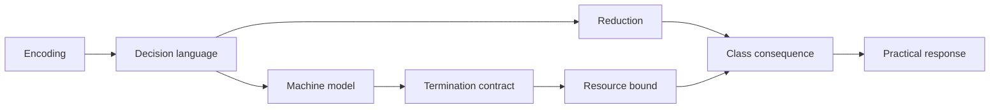
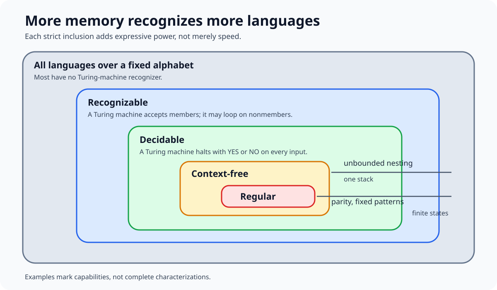
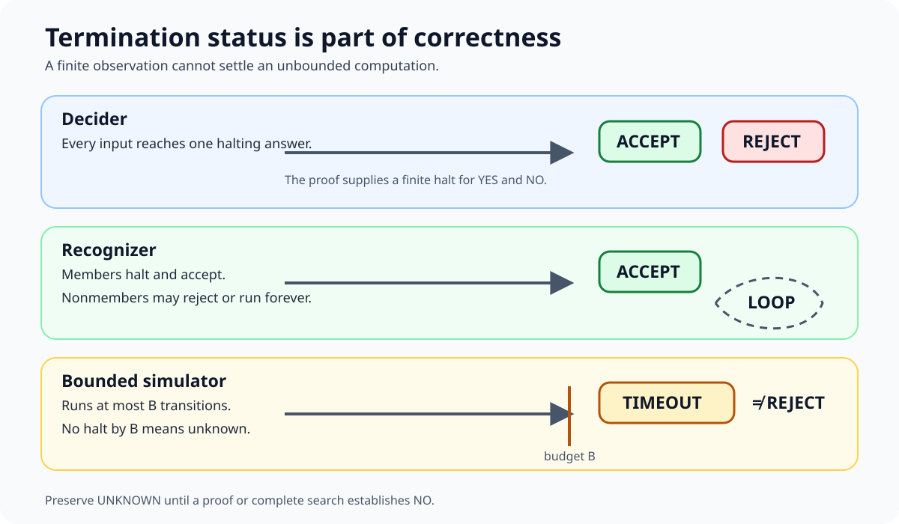
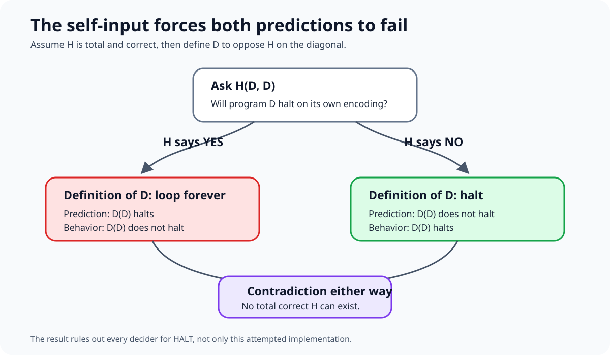
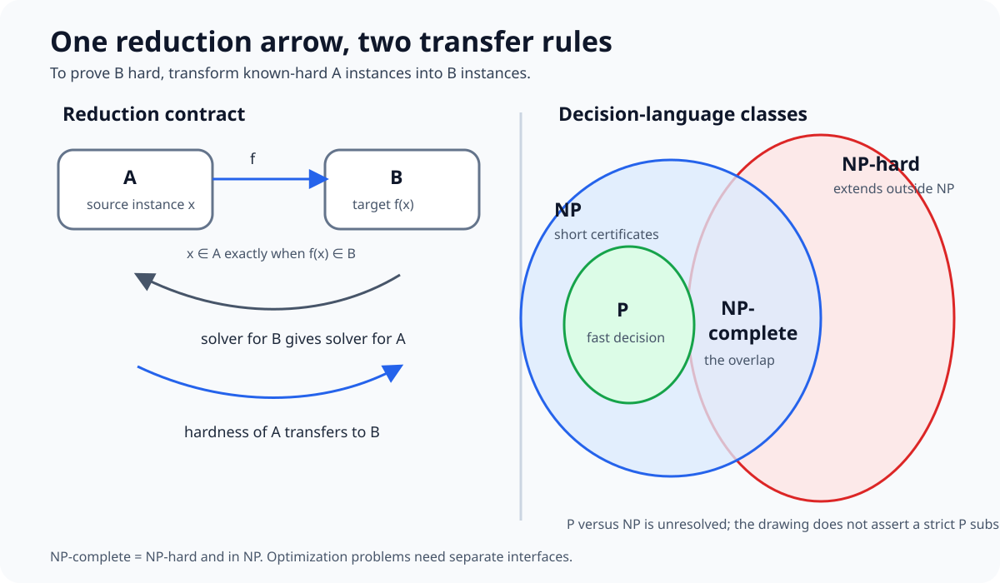

# 0.15 Computability and Complexity

## Why this matters

Some computational problems admit fast exact algorithms. Some are computable but
appear to resist every general efficient method we know. Some cannot be decided
by any algorithm at all. Those are different claims, proved with different tools.

AI work repeatedly meets all three boundaries:

- a parser may need only finite memory, a stack, or unrestricted computation;
- a planner can verify a proposed route quickly while searching for one remains
  combinatorial;
- probabilistic inference can be exact on structured graphs and hard in general;
- a training or decoding problem may support approximation, parameterization,
  relaxation, or randomized search even when its worst-case exact form is hard;
- no amount of faster hardware turns an undecidable specification into a total
  algorithm.

MIT 6.045 organizes this terrain around automata, Turing machines, decidability,
reductions, NP-completeness, and probabilistic computation [1]. The central habit
of this module is:

> State the representation, machine model, decision language, termination
> contract, reduction direction, and resource bound before drawing a practical
> conclusion.

## Learning objectives

By the end of this module, you should be able to:

1. model decision problems as languages over finite encodings;
2. explain the capabilities and limits of finite automata, context-free grammars,
   pushdown automata, and Turing machines;
3. distinguish a decider from a recognizer and reconstruct the halting-problem
   diagonal argument;
4. use mapping reductions with the correct direction to transfer decidability or
   hardness consequences;
5. define P, NP, NP-hardness, and NP-completeness without treating NP as a claim
   of exponential time;
6. state decision versions of SAT, subset sum, traveling salesperson, and graph
   coloring and explain why certificates can be checked efficiently;
7. distinguish input magnitude from encoding length and recognize
   pseudopolynomial algorithms;
8. compare exact, special-case, parameterized, approximation, randomized, and
   heuristic responses to hard problems by their guarantees;
9. explain what NP-completeness does and does not imply for an AI problem.

## Prerequisite check

You should be ready to use sets, functions, relations, proof by contradiction,
induction, graphs, asymptotic notation, and basic algorithms. Check that you can
answer:

1. What makes a function total rather than partial?
2. Why does a finite binary encoding of integer $W$ use $\Theta(\log W)$ bits?
3. What must a loop invariant establish at initialization, preservation, and
   termination?
4. What is the difference between finding a path and checking a supplied path?
5. Why is $O(nW)$ not necessarily polynomial in the input length?

Review [§0.04](../00.04-sets-relations-functions/README.md) for languages and
mappings, [§0.05](../00.05-logic-quantifiers/README.md) for contradiction and
quantified claims, [§0.06](../00.06-proof-techniques/README.md) for proof
patterns, [§0.07](../00.07-induction-recursion-invariants/README.md) for recursive
proofs, and [§0.14](../00.14-algorithms-data-structures/README.md) for cost models
and pseudopolynomial dynamic programming.

## Historical context

Finite automata formalized systems with bounded memory. Context-free grammars
and pushdown automata captured nested syntax. Turing machines then supplied a
minimal model powerful enough to express general algorithms. Critchlow and Eck
present this progression from regular languages through grammars to Turing
machines and computability [2].

The models matter because adding memory changes which languages can be handled,
not merely how quickly. Barak's text connects representation, finite models,
universality, uncomputability, reductions, NP-completeness, and randomized
computation within one modern account [3].

Complexity theory asks a second question after computability: how much time or
space does a computation require as input length grows? The P versus NP question
is still unresolved. The Clay Mathematics Institute describes it through the
gap between checking a proposed solution and finding one [4]. A module about NP
must preserve that uncertainty rather than smuggle in $P\ne NP$ as a theorem.

## Intuition

### The seven ledgers

Keep seven ledgers for every formal claim:

1. **Encoding:** alphabet, legal strings, and bit length.
2. **Problem:** YES instances, NO instances, and any promise.
3. **Model:** finite automaton, pushdown automaton, Turing machine, RAM model, or
   another explicit machine.
4. **Termination:** halt on every input, halt only on accepted inputs, or use a
   bounded probabilistic guarantee.
5. **Reduction:** source, target, transformation cost, and preserved answer.
6. **Resources:** time, space, error, approximation ratio, or parameter.
7. **Evidence:** proof, certificate, counterexample, test, or experiment.



A phrase such as "TSP is hard" drops too many ledgers. The decision version,
optimization version, metric promise, approximation target, and input encoding
support different claims.

### Languages turn decisions into sets

Fix a finite alphabet $\Sigma$. A decision problem is represented by a language
$L\subseteq\Sigma^*$:

- encoded YES instances belong to $L$;
- encoded NO instances do not;
- malformed strings are rejected or excluded by a stated promise.

Search and optimization remain important, but decision languages give reductions
and complexity classes one stable interface. An optimization problem can often
be paired with a threshold decision problem, yet membership in NP applies to the
decision language, not automatically to the optimization function.



### Memory determines expressive power

A deterministic finite automaton has one of finitely many states. It can track a
finite residue, such as parity, but cannot store an unbounded nesting depth.

A pushdown automaton adds a stack. It can match arbitrary nesting such as balanced
parentheses. Context-free grammars describe the same language family as
nondeterministic pushdown automata, though their operational views differ.

A Turing machine adds an unbounded tape and local read, write, and movement. It
is intentionally austere. Its importance is that it captures the effective
procedures modeled by ordinary programming languages, not that real computers
look like tapes.

### Termination is part of the answer

A **decider** halts on every input and returns YES or NO. A **recognizer** must
accept every member, but it may reject or run forever on a nonmember. Therefore:

$$
\text{decidable languages}\subsetneq\text{recognizable languages}.
$$

A bounded simulator can report `TIMEOUT`, but timeout is not a mathematical NO.
More steps may change the observation. This distinction is load-bearing when
experiments imitate an unbounded machine.



## Mathematics

### Finite automata and regular languages

A DFA is a five-tuple

$$
M=(Q,\Sigma,\delta,q_0,F),
$$

where $Q$ is a finite state set, $\Sigma$ is an alphabet,
$\delta:Q\times\Sigma\to Q$ is a total transition function, $q_0$ is the start
state, and $F\subseteq Q$ is the accepting set. Extend $\delta$ from symbols to
strings recursively. The recognized language is

$$
L(M)=\{w\in\Sigma^*: \delta^*(q_0,w)\in F\}.
$$

Regular expressions, DFAs, and NFAs define the regular languages. Their forms
can differ greatly in size, but not in which languages they express [2].

Finite memory cannot recognize $\{a^n b^n:n\ge0\}$. Intuitively, arbitrarily
large $n$ forces two different prefix counts into the same state. The remaining
suffix then makes the machine treat two strings alike even though only one has
matching counts. A pumping-lemma or distinguishability proof makes this precise.

### Context-free grammars

A context-free grammar is a four-tuple

$$
G=(V,\Sigma,R,S),
$$

with variables $V$, terminals $\Sigma$, productions $R$, and start variable $S$.
Each production replaces one variable by a string of variables and terminals.
The grammar

$$
S\to aSb\mid\epsilon
$$

generates $\{a^n b^n:n\ge0\}$. A parse tree records one derivation structure.
An ambiguous grammar gives at least one string two distinct parse trees.

Chomsky normal form restricts productions to $A\to BC$ or $A\to a$, with a
controlled exception for the empty string. The CYK dynamic program decides
membership for a length-$n$ token sequence in $O(n^3|G|)$ time for a fixed
normalized grammar. The module code omits epsilon rules so its boundary is
visible.

### Turing machines and computable functions

A deterministic one-tape Turing machine has finite control, a finite tape
alphabet containing a blank symbol, and a transition function that reads one
symbol, writes one symbol, changes state, and moves one cell left or right. A
configuration consists of current state, head position, and finite nonblank tape
contents.

A machine decides $L$ if it accepts every $w\in L$, rejects every $w\notin L$,
and halts in both cases. It recognizes $L$ if it accepts members and makes no
termination promise for nonmembers. A partial computable function similarly may
be undefined because its machine never halts.

### Countability creates a first limit

Every machine has a finite description, so machines can be encoded as finite
binary strings. The set of machines is countable. The set of all languages over
$\{0,1\}$ is the power set of a countable set and is uncountable. Therefore most
languages are not recognized by any Turing machine.

This cardinality argument proves that unrecognizable languages exist, but it does
not identify a natural one. Diagonalization gives an explicit operational limit.

### The halting problem

Define

$$
HALT=\{\langle M,w\rangle : M\text{ halts on input }w\}.
$$

Assume for contradiction that a decider $H(M,w)$ returns YES exactly when $M$
halts on $w$. Construct program $D$:

```text
D(x):
    if H(x, x) says NO:
        halt
    else:
        loop forever
```

Run $D$ on its own encoding. If $H(D,D)$ says NO, then $D(D)$ halts. If it says
YES, then $D(D)$ loops. Either answer contradicts the promised behavior of $H$.
Thus no such decider exists [3].



This proves undecidability, not merely a large running time. The language $HALT$
is recognizable: simulate $M(w)$ and accept if it halts. Its complement is not
recognizable, because a language and its complement are both recognizable only
when the language is decidable.

### Mapping reductions

For languages $A$ and $B$, a computable mapping reduction

$$
A\le_m B
$$

is a total computable function $f$ satisfying

$$
x\in A\quad\Longleftrightarrow\quad f(x)\in B.
$$

If $A\le_m B$ and $B$ is decidable, then $A$ is decidable: compute $f(x)$ and run
the decider for $B$. Contrapositively, if $A$ is undecidable and $A\le_m B$, then
$B$ is undecidable.

The arrow points from the problem being solved to the problem used as a solver.
To prove a new problem $B$ hard, reduce a known-hard problem $A$ to $B$. Reducing
$B$ to $A$ proves only that $B$ is no harder than $A$ under that reduction.

### Time complexity and encodings

Let $|x|$ be the length of encoded input $x$. A deterministic Turing machine runs
in time $T(n)$ if every length-$n$ input halts within $T(n)$ steps. Polynomial
means polynomial in encoding length, not polynomial in the numeric magnitude of
an encoded integer.

For binary $W$, input length contains $\Theta(\log W)$ bits. An $O(nW)$ dynamic
program may therefore take exponential time in the bit length. It is called
**pseudopolynomial**, not polynomial-time in the ordinary encoded-input model.

### P and NP

$P$ is the class of decision languages decidable in deterministic polynomial
time.

$NP$ can be defined through polynomially checkable certificates. A language
$L$ is in NP if a polynomial $p$ and polynomial-time verifier $V$ exist such that

$$
x\in L
\quad\Longleftrightarrow\quad
\exists c,\ |c|\le p(|x|)\text{ and }V(x,c)=1.
$$

The existential certificate is central. NO instances do not need a short reason
under this definition. Every language in P is in NP because the verifier can
ignore the certificate and solve the instance. Whether $P=NP$ remains open [4].

`NP` means nondeterministic polynomial time. It does not mean "non-polynomial,"
and current theory does not prove that every NP-complete problem requires
exponential time.

### Reductions for polynomial-time complexity

A polynomial-time many-one reduction $A\le_p B$ computes the mapping $f$ in time
polynomial in $|x|$. It preserves the YES/NO answer as above.

Two transfer rules drive NP-completeness:

1. if $A\le_p B$ and $B\in P$, then $A\in P$;
2. if $A$ is NP-hard and $A\le_p B$, then $B$ is NP-hard.

A language is **NP-hard** if every language in NP reduces to it. It is
**NP-complete** if it is NP-hard and also belongs to NP. Erickson emphasizes that
an NP-hardness proof is a reduction contract, not a synonym for "looks difficult"
[5].



### Canonical NP-complete decision problems

| Problem | YES instance | Typical certificate | Verification |
|---|---|---|---|
| SAT | a Boolean formula has a satisfying assignment | one truth value per variable | evaluate the formula |
| Subset sum | some indexed subset sums to target $T$ | selected indices | check distinctness and sum |
| Graph $k$-coloring | adjacent vertices can receive different colors among $k$ colors | one color per vertex | inspect every edge |
| TSP decision | a tour has total cost at most bound $B$ | vertex permutation | check visits and total cost |

SAT was the first problem proved NP-complete. The Cook-Levin theorem encodes an
accepting polynomial-time nondeterministic computation as a polynomial-size
Boolean formula [3]. This module uses the theorem and studies reduction
contracts; it defers the full tableau construction.

Decision and optimization must stay separate. TSP decision is NP-complete under
standard finite encodings. Finding a minimum tour is an NP-hard optimization
problem. Saying the optimization function "is in NP" mixes interfaces.

### One clean reduction: independent set to vertex cover

For undirected graph $G=(V,E)$, a set $S$ is independent exactly when its
complement $V\setminus S$ is a vertex cover. Every edge has no two endpoints in
$S$ exactly when every edge has an endpoint outside $S$. Therefore

$$
(G,k)\in INDEPENDENT\text{-}SET
\quad\Longleftrightarrow\quad
(G,|V|-k)\in VERTEX\text{-}COVER.
$$

The transformation preserves $G$, changes one integer, and is polynomial-time.
This proves a precise relation. It does not by itself prove either problem
NP-complete; that conclusion also needs a known-hard source and NP membership.

### What NP-completeness implies

If any NP-complete language is in P, every language in NP is in P. Therefore a
polynomial-time exact algorithm for one NP-complete problem would settle $P=NP$.

Under the unproved assumption $P\ne NP$, no NP-complete language has a general
polynomial-time exact decider. NP-completeness does not imply:

- every instance is difficult;
- every exact algorithm is exponential on every input;
- useful approximation is impossible;
- special graph classes or bounded parameters remain hard;
- heuristics cannot work well on a real distribution;
- small or structured instances should not be solved exactly.

Worst-case classification constrains universal guarantees. It does not replace
instance analysis.

### Approximation algorithms

For a minimization problem with optimum $OPT(I)$, an $\alpha$-approximation
returns feasible solution $A(I)$ in polynomial time and guarantees

$$
A(I)\le\alpha\,OPT(I)
$$

for every valid instance. A maximization ratio is commonly written
$A(I)\ge OPT(I)/\alpha$. The guarantee is worst-case and universal, not an
average benchmark result [6].

A maximal matching gives a 2-approximation for minimum vertex cover. Select any
remaining edge, add both endpoints to the cover, and remove every incident edge.
The selected edges form a matching. Every vertex cover must contain at least one
endpoint of each selected edge, while the algorithm selects at most two. Hence
$|C|\le2|C^*|$.

Approximation depends on the problem and promises. Metric TSP, whose distances
obey the triangle inequality, admits constant-factor approximation. Unrestricted
TSP has a different approximability boundary. The phrase "TSP approximation"
is incomplete without its cost contract.

### Randomized complexity

Randomized algorithms make probability part of the contract. Common decision
classes include:

- **RP:** NO instances are always rejected; YES instances are accepted with
  probability at least $1/2$;
- **coRP:** YES instances are always accepted; NO instances are rejected with
  probability at least $1/2$;
- **BPP:** every instance is answered correctly with probability at least $2/3$.

Independent repetition amplifies a bounded gap. Repeating an RP procedure $r$
times and accepting if any run accepts reduces false rejection to at most
$2^{-r}$. Repeating a BPP procedure and taking a majority gives exponentially
small error by concentration, not by simple "any success" logic. Complexity Zoo
catalogs many distinct randomized and other classes, a useful warning against
flattening them into one label [7].

A randomized algorithm can have deterministic correctness with random running
time, as randomized quicksort does, or bounded error in the answer. Those are
separate ledgers.

### Parameterized complexity

A parameterized problem has instances $(x,k)$. It is fixed-parameter tractable
if it can be solved in

$$
f(k)|x|^c
$$

time for a computable $f$ and constant $c$ independent of $k$. The class XP
allows bounds such as $|x|^{g(k)}$. Both become polynomial for each fixed $k$,
but only FPT isolates the combinatorial explosion from the input exponent [8].

Vertex cover is FPT under solution size $k$: choose any uncovered edge
$\{u,v\}$. Every cover must contain $u$ or $v$, so branch on those choices and
decrease $k$. The search tree has at most $2^k$ leaves, with polynomial work per
node.

A **kernelization** transforms $(x,k)$ in polynomial time to equivalent
$(x',k')$ whose size is bounded by a function of $k$. Parameter choice is a
modeling decision. A small treewidth, number of exceptions, planning horizon, or
edit budget can expose structure that total input size hides.

## Derivation

### Derive the CYK recurrence

Let $D[i,\ell]$ be the set of variables that derive the token substring starting
at $i$ with length $\ell$. For terminal rule $A\to a$:

$$
A\in D[i,1]\quad\text{when token }i\text{ is }a.
$$

For binary rule $A\to BC$:

$$
A\in D[i,\ell]
$$

when some split $1\le s<\ell$ has $B\in D[i,s]$ and
$C\in D[i+s,\ell-s]$. Increasing substring length respects dependencies. There
are $O(n^2)$ cells and $O(n)$ splits per cell, plus grammar-rule work. Accept when
$S\in D[0,n]$.

### Derive recognizer complement closure carefully

Suppose $L$ and $\overline L$ each have recognizers $R$ and $S$. On input $x$,
interleave one step of $R(x)$ with one step of $S(x)$. Exactly one input relation
holds, so one recognizer eventually accepts. Return YES if $R$ accepts and NO if
$S$ accepts. This is a decider for $L$.

Therefore, if $L$ is recognizable but undecidable, its complement cannot also be
recognizable. Running recognizers sequentially would fail because the first can
loop. Dovetailing is the invariant that gives both computations progress.

### Prove reduction composition

If $A\le_p B$ through $f$ and $B\le_p C$ through $g$, then

$$
x\in A\Longleftrightarrow f(x)\in B
\Longleftrightarrow g(f(x))\in C.
$$

The composition $g\circ f$ is polynomial-time because the first output has
polynomial length and the second computation is polynomial in that length.
Hence $A\le_p C$. A chain of reductions preserves direction.

### Derive subset sum's pseudopolynomial boundary

For nonnegative values $a_1,\dots,a_n$ and target $T$, maintain reachable sums
from $0$ through $T$. Each item updates at most $T+1$ states, so time is $O(nT)$.

If $T=2^b$, its binary encoding uses $b+1$ bits, yet the table has $2^b+1$
columns. The algorithm is polynomial in numeric $T$ and exponential in the
worst case as a function of $\log T$. This does not contradict subset sum's
NP-completeness.

### Prove the vertex-cover branching rule

Let uncovered edge $\{u,v\}$ remain. Any valid cover contains $u$ or $v$.
Branching on those two choices is exhaustive. Each branch spends one unit of
budget and deletes incident edges. At depth greater than $k$, no size-$k$ cover
can lie on that branch. Thus the recurrence is

$$
T(k)\le2T(k-1)+poly(|V|+|E|),
$$

giving $O(2^k poly(|V|+|E|))$. This is FPT, despite exponential dependence on
$k$.

## Implementation

The [module code](code/README.md) exposes formal boundaries rather than claiming
to automate impossibility proofs.

| Implementation | Contract emphasized |
|---|---|
| `DFA` | total finite transition function |
| `CNFGrammar.accepts` | CYK membership, no epsilon rules |
| `TuringMachine` and `run_bounded` | accept, reject, and timeout are distinct |
| `verify_subset_sum` | polynomial certificate checking |
| `subset_sum_dp` | exact pseudopolynomial search |
| `independent_set_to_vertex_cover` | answer-preserving reduction direction |
| `vertex_cover_fpt` | $2^k$ branching with polynomial instance work |
| `vertex_cover_2approx` | maximal-matching factor-2 guarantee |

### Example: finite memory

```python
from complexity import DFA

parity = DFA(
    states=frozenset({"even", "odd"}),
    alphabet=frozenset({"0", "1"}),
    transition={
        ("even", "0"): "even", ("even", "1"): "odd",
        ("odd", "0"): "odd", ("odd", "1"): "even",
    },
    start="even",
    accepting=frozenset({"even"}),
)
assert parity.accepts("101")
```

### Example: timeout is evidence, not rejection

```python
result = run_bounded(machine, "101", max_steps=3)
assert result.status is HaltStatus.TIMEOUT
```

The observation says only that the machine did not halt within three transitions.
It does not decide the input.

### Example: search and verification have different contracts

```python
values = [3, 5, 9, 12]
witness = subset_sum_dp(values, 17)
assert witness is not None
assert verify_subset_sum(values, 17, witness)
```

The verifier checks one supplied witness in time polynomial in the encoding. The
solver's $O(nT)$ table is pseudopolynomial.

## Experimentation

### Experiment 1: measure state, stack, and table growth

Run the DFA, CYK parser, and bounded Turing machine on growing inputs. Record DFA
transitions, CYK cells and split checks, and tape steps. The experiment illustrates
resource models. It does not prove the language-class separations.

### Experiment 2: expose the pseudopolynomial axis

Hold item count fixed while doubling subset-sum target magnitude. Record target
bit length, table states, and elapsed work separately. Plot against both $T$ and
$\log_2 T$. The same data look polynomial on one axis and exponential on the
other because the encoding contract changed.

### Experiment 3: compare exact parameterized and approximate cover

Generate small undirected graphs with known optimum from exhaustive search.
Compare `vertex_cover_fpt` across budgets with `vertex_cover_2approx`. Check every
returned cover, exact feasibility threshold, and approximation ratio. Runtime
measurements do not prove the factor 2; the matching argument does.

### Experiment 4: amplify bounded error

Simulate independent Bernoulli trials with success probability $1/2$ on YES
instances and no false acceptance on NO instances. For RP-style repetition,
compare observed false-rejection frequency with $2^{-r}$. Record seed, number of
experiments, confidence limits, and the fact that empirical agreement is not a
class-membership proof.

## Worked examples

### Example 1: classify a parser model

A protocol field with parity and a fixed set of modes needs finite state. Balanced
parentheses need unbounded stack depth and are context-free. A parser that must
compare two arbitrary copied substrings can exceed context-free power. Choose a
model from the required memory, not from syntax alone.

### Example 2: reject timeout as a NO certificate

A simulator runs machine $M$ for one million steps and sees no halt. This proves
only "not within one million steps." If a computable universal timeout bound
correctly separated all halting and nonhalting computations, it would decide
$HALT$, contradicting the diagonal result.

### Example 3: point a hardness reduction correctly

To prove scheduling problem $B$ NP-hard using known NP-hard problem $A$, construct
$f$ with $x\in A$ exactly when $f(x)\in B$. The statement is $A\le_p B$.
Constructing $B\le_p A$ can yield an algorithm for $B$ from one for $A$, but does
not establish that $B$ inherits $A$'s hardness.

### Example 4: separate a verifier from a solver

For subset sum values `[3, 5, 9, 12]`, certificate indices `(1, 3)` prove target
17. Checking bounds, distinctness, and the sum is direct. Finding those indices
without a certificate is the search problem. NP membership asserts the former
polynomial contract, not a known polynomial algorithm for the latter.

### Example 5: keep TSP interfaces straight

Input graph, edge costs, and bound $B$ define the decision language "a tour of
cost at most $B$ exists." A vertex permutation is a certificate. Returning the
minimum possible cost is optimization. Adding the triangle inequality defines a
promise that changes approximation options without making the exact decision
problem easy in general.

### Example 6: use structure instead of denying hardness

A planning instance may have a small horizon $k$, bounded treewidth, or few
conflicts. An FPT or dynamic-programming algorithm can be effective because the
instance has structure. This does not refute worst-case NP-hardness; it makes a
stronger, parameterized statement about the relevant family.

### Example 7: interpret an approximation result

A vertex-cover algorithm returns 18 vertices and proves a factor-2 guarantee.
You may conclude $OPT\ge9$ from the guarantee and that the returned cover is
feasible after verification. You may not conclude $OPT=9$, or that typical error
is 100 percent. The universal upper bound and empirical quality are different.

### Example 8: distinguish randomized contracts

An RP algorithm that accepts has a definitive YES under the one-sided contract.
A rejection can be a false negative. Repeating and accepting if any run accepts
reduces false negatives. For a two-sided BPP algorithm, that aggregation rule is
wrong; majority vote uses the gap on both answers.

## Common mistakes

1. **Reading NP as non-polynomial.** NP is defined by nondeterministic polynomial
   time or polynomially checkable certificates.
2. **Assuming $P\ne NP$.** It is an open problem [4]. Conditional conclusions
   must say so.
3. **Calling every NP-hard object NP-complete.** NP-complete applies to decision
   languages that are both NP-hard and in NP.
4. **Reversing a reduction.** To transfer hardness from $A$ to $B$, prove
   $A\le_p B$.
5. **Ignoring encoding length.** $O(nT)$ can be pseudopolynomial when $T$ is
   binary encoded.
6. **Treating timeout as rejection.** A bounded run cannot establish nonhalting.
7. **Conflating undecidable and intractable.** Undecidable means no total decider;
   intractable concerns resource bounds for computable problems.
8. **Using one hard instance as an NP-hardness proof.** Complexity classes make
   asymptotic claims about problem families and reductions.
9. **Treating worst-case hardness as practical hopelessness.** Special cases,
   parameters, approximations, relaxations, and distributions matter.
10. **Calling a heuristic an approximation algorithm.** The latter needs a proved
    polynomial-time guarantee for every valid instance.
11. **Mixing randomized correctness and randomized runtime.** State which
    quantity is random and the exact error direction.
12. **Claiming FPT from $n^k$.** FPT requires $f(k)n^c$ with constant $c$
    independent of $k$.

## Exercises

Complete [the exercises](exercises/README.md) before reading the
[worked solutions](solutions/README.md). The sequence moves from language models
and termination to reductions, NP-completeness, and practical responses to
hardness.

## What you should now be able to do

You should now be able to:

- specify a computational problem as an encoded decision language;
- choose a finite, stack, or Turing-complete model from its memory needs;
- distinguish deciding, recognizing, timing out, and failing to define a
  transition;
- reproduce the halting contradiction and reduction transfer rules;
- classify P, NP, NP-hard, and NP-complete claims by their proof obligations;
- formulate and verify canonical NP-complete decision problems;
- detect pseudopolynomial bounds;
- compare approximation, randomization, parameterization, exact search, and
  heuristics without overstating guarantees;
- explain why worst-case hardness informs AI engineering without ending it.

## Where this leads

Section 0 is now complete through its mathematical and computational foundations.
Later sections can treat search, planning, probabilistic inference, learning,
optimization, and language processing while naming the computation model,
resource claim, and hardness response they rely on.

In particular:

- search and planning reuse reductions, certificates, and parameterized structure;
- probabilistic models reuse exact versus approximate inference boundaries;
- machine learning reuses randomized guarantees and worst-case versus
  distributional distinctions;
- language models reuse formal-language hierarchies while exceeding finite and
  context-free mechanisms in their full computation.

## References

[1] MIT OpenCourseWare, [6.045J Automata, Computability, and Complexity, Spring 2011](https://ocw.mit.edu/courses/6-045j-automata-computability-and-complexity-spring-2011/). Course syllabus and calendar. CC BY-NC-SA 4.0.
[2] Carol Critchlow and David Eck, [*Foundations of Computation*, Version 2.3.2](https://math.hws.edu/FoundationsOfComputation/FoundationsOfComputation_2.3.2_6x9.pdf). CC BY-NC-SA 4.0.
[3] Boaz Barak, [*Introduction to Theoretical Computer Science*](https://introtcs.org/public/index.html). Online draft, 2023. CC BY-NC-ND 4.0.
[4] Clay Mathematics Institute, [P vs NP](https://www.claymath.org/millennium/p-vs-np/). Official Millennium Prize Problem overview.
[5] Jeff Erickson, [*Algorithms*, Chapter 12: NP-Hardness](https://jeffe.cs.illinois.edu/teaching/algorithms/book/12-nphard.pdf). CC BY 4.0.
[6] David P. Williamson and David B. Shmoys, [*The Design of Approximation Algorithms*](https://www.designofapproxalgs.com/book.pdf). Cambridge University Press, 2011. Link for personal study; publisher manuscript terms apply.
[7] Scott Aaronson et al., [Complexity Zoo](https://complexityzoo.net/Complexity_Zoo). Reference catalog of complexity classes.
[8] Cornell CS 6810, [Parameterized Complexity notes](https://courses.cs.cornell.edu/cs6810/2023fa/Parameterized.pdf), Fall 2023.

---

[Section home](../README.md) | Previous: [§0.14 Algorithms and Data Structures](../00.14-algorithms-data-structures/README.md) | [Exercises](exercises/README.md) | [Worked solutions](solutions/README.md) | [Resources](resources/README.md) | [Code](code/README.md)
