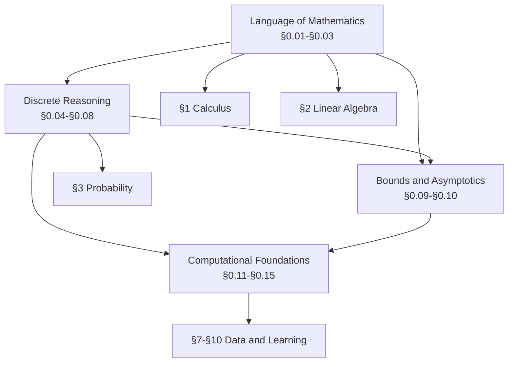

# 00. Mathematical Foundations

> The language everything else is written in.

[Project home](../README.md) | [Roadmap and learning routes](../ROADMAP.md#readiness-and-learning-routes) | Next section: §1 Calculus (not yet published)

## Why This Section Exists

AI is usually taught as though its notation, algebra, proofs, and computational habits arrived fully formed. They did not. A line such as

$$
\widehat{\boldsymbol{\theta}} =
\arg\min_{\boldsymbol{\theta}\in\mathbb{R}^{d}}
\frac{1}{n}\sum_{i=1}^{n}
L\left(f_{\boldsymbol{\theta}}(\boldsymbol{x}_i),y_i\right)
$$

compresses a remarkable amount of prior knowledge. You need to recognize an estimator, a parameter space, an optimization operator, a finite average, a loss, a parameterized function, vectors, examples, labels, and several indexing conventions. None of those ideas is individually impossible. Together, they can make one line feel like a locked door.

This section gives you the keys.

It covers the mathematical language, reasoning patterns, and computational foundations used throughout the project. You do not need to complete all fifteen modules before touching calculus or linear algebra. The first cluster runs alongside those subjects, and later clusters become useful as the curriculum asks more sophisticated questions.

## Prerequisite Check

There are no formal prerequisites.

You are in the right place if any of these questions cause friction:

- What is the difference between the codomain and image of a function?
- How do you reindex a sum without changing what it means?
- Why does $`\log(xy)=\log x+\log y`$ matter to a computer?
- How do you negate a statement containing both $`\forall`$ and $`\exists`$?
- What makes a proof by induction valid?
- How do you choose between a list, hash table, heap, and graph?
- What does NP-complete actually tell you about a problem?

If those questions already feel comfortable, use this section as a reference and take the routes that fit your goals.

## Section Map

The arrows show the dominant flow, not a rigid semester sequence. In particular, programming (§0.13) can begin immediately, and graph theory (§0.11) does not require every analysis topic before it.

## Modules

| ID | Module |
|---|---|
| 0.01 | [Mathematical Notation and How to Read Mathematics](00.01-mathematical-notation/README.md) |
| 0.02 | [Algebra, Functions, and Precalculus Backfill](00.02-algebra-functions-precalculus/README.md) |
| 0.03 | [Exponents and Logarithms](00.03-exponents-logarithms/README.md) |
| 0.04 | [Sets, Relations, and Functions](00.04-sets-relations-functions/README.md) |
| 0.05 | [Logic and Quantifiers](00.05-logic-quantifiers/README.md) |
| 0.06 | [Proof Techniques](00.06-proof-techniques/README.md) |
| 0.07 | [Induction, Recursion, and Invariants](00.07-induction-recursion-invariants/README.md) |
| 0.08 | [Counting and Combinatorics](00.08-counting-combinatorics/README.md) |
| 0.09 | [Sums, Series, and Asymptotics](00.09-sums-series-asymptotics/README.md) |
| 0.10 | [Inequalities](00.10-inequalities/README.md) |
| 0.11 | [Graph Theory](00.11-graph-theory/README.md) |
| 0.12 | [Elementary Number Theory](00.12-elementary-number-theory/README.md) |
| 0.13 | [Programming and Scientific Computing](00.13-programming-scientific-computing/README.md) |
| 0.14 | [Algorithms and Data Structures](00.14-algorithms-data-structures/README.md) |
| 0.15 | [Computability and Complexity](00.15-computability-complexity/README.md) |

## Suggested Routes

### Start Here

For most readers, begin with §0.01-§0.03. These modules establish the language used everywhere else and make later mathematical notation less expensive to parse.

### Mathematics-First Route

Prioritize §0.01-§0.10, then use graph theory, number theory, and computational foundations when downstream work requires them.

### Build-Things Route

Complete §0.01-§0.03 and §0.13-§0.14 early. Return to logic, proofs, counting, and inequalities as the algorithms and guarantees begin to need them.

### Classical AI and Computational Intelligence Route

Prioritize §0.04-§0.08 and §0.11-§0.15. Graphs, combinatorics, algorithms, and complexity carry much of the load in search, planning, evolutionary computation, and reinforcement learning.

## Section Learning Outcomes

After completing the modules relevant to your route, you should be able to:

- read dense mathematical notation without losing the underlying idea;
- move between prose, symbols, diagrams, and code;
- manipulate sums, products, functions, exponents, and logarithms reliably;
- translate English claims into logic and negate them correctly;
- construct and critique direct, indirect, and inductive proofs;
- count structured objects and connect counting to probability;
- use asymptotic notation and inequalities to reason about scale and bounds;
- model problems with graphs and relations;
- write, test, profile, and reproduce numerical code;
- choose data structures and analyze algorithms;
- explain what computability and complexity results do and do not imply.

## How to Use the Materials

Each module is one complete reading document: the lesson, worked examples,
optional practice with full worked solutions, annotated references, and any
setup or run instructions are all in its `README.md`. Use its linked contents
to read in order or return to a particular concept. Practice answers are
expandable so you can attempt a problem before reading its solution.

Code, tests, and figures remain alongside the document as usable artifacts.
The [contribution guide](../CONTRIBUTING.md#module-file-structure) owns the
authoring conventions; the [notation and terminology guide](../NOTATION.md)
owns shared mathematical conventions. A local exception must be explained.

## Availability

All fifteen modules, §0.01-§0.15, are available as complete drafts, not
independently reviewed editions. This section index is the source of truth for
their publication status. The section spans mathematical reading, proof,
discrete structure, scientific programming, algorithms, computability, and
complexity.

This section will keep evolving as new modules test the structure. The point is not to freeze a perfect format before learning begins. The point is to build something worth learning from.
