# Roadmap

### *From first principles to modern AI.*

This document is the full curriculum for **Intelligence, Assembled**: fifteen sections, over 240 topic modules, running from set notation to reasoning models.

It was built by working through what is actually taught at MIT, Stanford, Harvard, CMU, Berkeley, Cornell, Princeton, and NYU, cross-referenced against the standard texts and against every serious open-source attempt at the same thing. Where universities disagree about ordering, I picked the ordering that serves understanding of modern AI, and I say so.

The stack is ordered so each section builds on the ones before it. That does not mean it is strictly linear. See the [dependency graph](#dependency-graph).

---

## How to Read This Document

Each section opens with why it exists and what it depends on, then lists numbered topic modules with their subtopics. Subtopic lists are deliberately granular: not "derivatives" but "limit definition, product rule, quotient rule, chain rule, implicit differentiation, logarithmic differentiation, mean value theorem." The granularity is the point. Vague topic names are how curricula hide the parts they skip.

Every module aims to move through six layers:

**Intuition → Mathematics → Derivation → Implementation → Experimentation → Exercises**

Not every module needs all six. Some are pure derivation. Some are pure code. But that is the direction, and step three is the one almost nobody publishes.

**Programming readiness.** The curriculum assumes basic programming ability, but §0.13 through §0.15 make the computational prerequisites explicit: Python and NumPy, testing and reproducibility, data structures and algorithms, and the limits of efficient computation. Modules whose titles include "On Demand" are optional depth rather than gates on the main path.

**Possible routes.** The roadmap supports several natural paths without pretending they are separate projects: foundations (§0-§6), applied data and classical machine learning (§7-§8), neural networks through LLMs (§10-§13), computational intelligence (§9 and §14.10-§14.12), and classical AI with reinforcement learning (§14.01-§14.09). Their prerequisites overlap, but completing every earlier module is not required unless a local prerequisite says so.

### Conventions

**Module IDs.** Sections are `00` through `14`. Modules within a section are `NN.MM`. Reference them as `§05.06` so links survive renames and reorganization. IDs are never reused and never renumbered. If something needs to be inserted, it gets appended and the reading order is fixed in the section table, not in the filesystem.

**Status labels.** Every module carries one:

| Label | Meaning |
|---|---|
| `stub` | Listed here, nothing written yet |
| `draft` | Content exists, rough |
| `complete` | Notes, derivations, and exercises all present |
| `reviewed` | Been back over it with fresh eyes, or someone else has |

Right now, Section 0 (Mathematical Foundations) is a complete draft and everything after it is still `stub`. That is honest, and a stub is more useful than a dead link.

**Difficulty.** A 1 to 5 scale rendered as ★, plus a level tag (`undergraduate`, `advanced-undergraduate`, `graduate`). But the more useful signal is the prerequisite list, because "hard" is ambiguous and "requires §03.13 (measure theory)" is not.

**Learning objectives.** Written as "you should be able to…" with verifiable verbs: *derive, prove, implement, state the conditions under which, explain why X fails when.* Never *understand*, *know*, or *be familiar with*. Each objective should map to at least one exercise.

**Per-module front matter.** Each topic README carries machine-readable YAML so the master index can be generated rather than hand-maintained:

```yaml
id: "05.06"
title: "Unconstrained First-Order Methods"
prerequisites: ["01.09", "02.08", "05.03"]
difficulty: 3
level: advanced-undergraduate
estimated_hours: [4, 8]
status: stub
objectives:
  - "Derive the gradient descent update from a first-order Taylor expansion"
  - "Prove convergence for L-smooth convex objectives and state the rate"
  - "Show why the condition number of the Hessian governs convergence speed"
  - "Implement GD, momentum, and Adam and compare their trajectories on an ill-conditioned quadratic"
```

---

## Design Principles

These are the choices that make this curriculum different from the twenty or so open-source alternatives I surveyed. Nearly all of them explicitly disclaim the mathematics. This one does not.

**1. Math is the spine, not an appendix.** Sections 0 through 6 are not prerequisites to link out to. They are the product. *Dive into Deep Learning* exiles math to an appendix. fast.ai advertises "just high school math is sufficient" as a feature. Microsoft's AI-For-Beginners lists "deep mathematics behind deep learning" under what it will not cover. Those are all reasonable decisions for their goals. They are not this project's goal.

**2. Derivation before implementation, implementation before framework.** In this ecosystem "from scratch" almost always means *NumPy instead of a library*, not *derived from first principles*. Both matter. Cross-entropy gets derived from maximum likelihood before it gets coded, and coded before `nn.CrossEntropyLoss` gets called.

**3. Linear algebra before multivariable calculus.** MIT makes 18.02 a prerequisite for 18.06, which is a scheduling artifact rather than a logical one. CMU inverts it: 21-241 (linear algebra) precedes 21-266 (Vector Calculus using Matrix Algebra), and 21-266 is the course CMU explicitly recommends for its computer science undergraduates. CMU is right for this purpose. Multivariable calculus taught *through* matrices, foregrounding the Jacobian and Hessian as matrices, is the calculus an AI curriculum needs.

**4. Matrix calculus is a first-class module, not a footnote.** MIT created an entire course (18.S096 / 18.063) because neither 18.02 nor 18.06 covers it. The Jacobian is, in MIT's own words, "typically covered only superficially in 18.02." Layout conventions silently ruin more derivations than any other single thing. This gets §02.12 and §02.13, with real space.

**5. Proofs and notation early, and in parallel.** No university makes proof technique a prerequisite for computational calculus. But being unable to read Σ notation fluently, or to negate a nested quantifier, is what actually stops people from following a derivation. Section 0 runs alongside everything.

**6. Exercises ship with solutions.** This is the single largest gap in the field. *Dive into Deep Learning* has exercises at the end of every section and no answers, which is its most common complaint. Karpathy's exercises live in video descriptions. Solutions here go in a sibling `solutions/` directory so they are skippable, but they get committed.

**7. Consistent notation across all fifteen sections.** A `NOTATION.md` that survives from measure-theoretic probability through to attention is a real contribution, cheap to maintain from day one and expensive to retrofit.

**8. Evolutionary computation and information theory get full sections.** Across every curriculum surveyed, EC appears as at most one lesson. It is a genuinely useful body of ideas and it is my research area.

**9. Every topic answers five questions.** What is it, why does it exist, how does it work, what does it connect to, and why does it matter for computational intelligence. When a rabbit hole is interesting, all bets are off.

---

## Dependency Graph

A linear list of fifteen sections implies a strictness that is not real. The graph below intentionally shows only the **primary route** from foundations to large language models. Section 9 (Evolutionary Computation) and Section 14 (Beyond) are parallel branches, so forcing them into the main path only makes the picture harder to read.

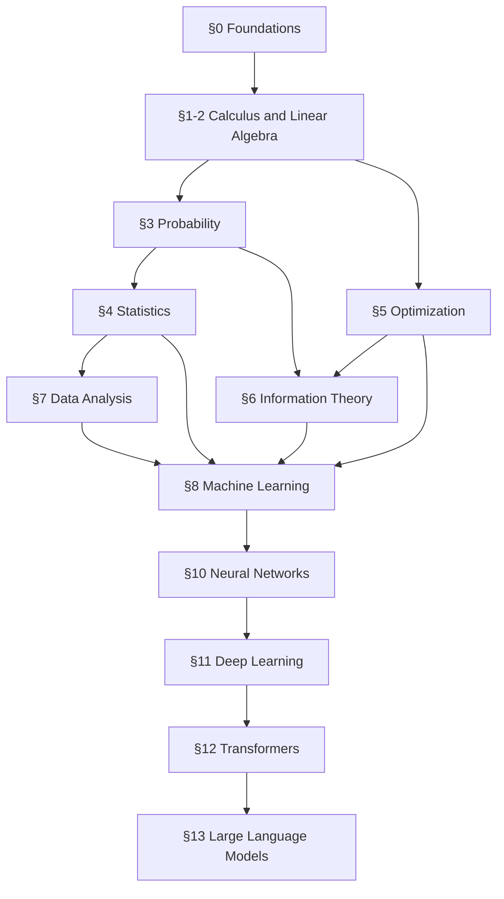

Each section below has its own prerequisite graph. Every graph terminates at the section it belongs to and answers one question: **what should I learn before I start this section?** Solid arrows indicate material needed at entry; dotted arrows indicate material needed later for advanced modules within the section.

**Recommended interleaving.** The one deviation from reading top to bottom: do §1.01 through §1.08 (single-variable calculus), then all of §2.01 through §2.11 (linear algebra), then come back for §1.09 through §1.13 (multivariable), then §2.12 and §2.13 (matrix calculus and autodiff). Section 0 runs in parallel with everything from the start.

---

## 0. Mathematical Foundations

> The language everything else is written in.

This is the section almost every self-study AI curriculum omits, and it is the one that makes everything downstream readable. Stanford's CS103 ships separate handouts on negation, logic translation, and elements-versus-subsets because those are the things that actually stop students. MIT 18.01 claims its only prerequisite is "high school algebra and trigonometry," and then CMU has to run 21-090 and 21-108 to backfill exactly that.

**Prerequisites:** none. Runs in parallel with §1 and §2.
**Anchor references:** MIT 6.042J / 6.1200J (Mathematics for Computer Science) and 6.006 (Introduction to Algorithms), Stanford CS103 and CS106B, Berkeley CS61B and CS70, CMU 21-127/21-128; Velleman *How to Prove It*; Rosen *Discrete Mathematics*; Sedgewick & Wayne *Algorithms*; Sipser *Introduction to the Theory of Computation*; Deisenroth, Faisal & Ong *Mathematics for Machine Learning*.

**Prerequisite graph**


### 0.01 Mathematical Notation and How to Read Mathematics
Standard number sets (ℕ, ℤ, ℚ, ℝ, ℂ); intervals; absolute value; floor and ceiling. Summation and product notation: Σ and Π, index manipulation, reindexing, splitting, swapping order of summation, telescoping, empty sums and products. Function notation: domain, codomain, image, preimage, restriction, composition, identity. Indicator functions, the Kronecker delta, the Iverson bracket. Subscript and superscript conventions, and how to tell an index from an exponent. Reading a paper's notation section without stalling. Index notation and the Einstein summation convention (needed later for tensors).

### 0.02 Algebra, Functions, and Precalculus Backfill
Manipulating algebraic expressions; factoring; completing the square; partial fractions. Polynomials, rational functions, roots, the fundamental theorem of algebra. Trigonometric functions and identities, radians, inverse trig. Hyperbolic functions (tanh matters later). Function transformations, composition, inverses, domain and range reasoning. Graph sketching and asymptotic behavior. Complex numbers: arithmetic, polar form, Euler's identity, roots of unity. CMU 21-241 opens linear algebra with complex numbers before real or complex vectors, and it is right to: eigenvalues of non-symmetric matrices are complex.

### 0.03 Exponentials and Logarithms
All the laws, change of base, e as a limit. Why `log` is the workhorse of machine learning: log-likelihood, cross-entropy, log-sum-exp, numerical stability, converting products into sums. Log probabilities and underflow (Stanford CS109 teaches this explicitly, and it is directly why every ML codebase works in log space). Growth rates: polynomial versus exponential versus logarithmic.

### 0.04 Sets, Relations, and Functions
Membership versus subset (the single most common confusion). Set-builder notation, empty set, singleton. Union, intersection, difference, symmetric difference, complement; De Morgan's laws. Power set, cardinality, Cartesian product, indexed families, disjoint unions, partitions. Russell's paradox and why naive set theory needs care. Ordered pairs, tuples, sequences as functions from ℕ. Relations: reflexive, symmetric, antisymmetric, transitive. Equivalence relations, equivalence classes, partitions, and the correspondence between them. Partial and total orders, Hasse diagrams, chains and antichains. Injective, surjective, bijective; inverse functions. Images and preimages of sets, and how they interact with ∪ and ∩. Cardinality and countability, Cantor's diagonal argument, ℚ countable and ℝ uncountable.

### 0.05 Logic and Quantifiers
Propositions, truth values, truth tables. Connectives: ¬, ∧, ∨, →, ↔, XOR. Implication: hypothesis and conclusion, vacuous truth, converse, inverse, contrapositive. Logical equivalence, tautology, contradiction, satisfiability. De Morgan for propositions and for quantifiers. Normal forms (CNF, DNF). First-order logic: predicates, domains of discourse, quantifiers ∀ ∃ ∃!, scope, bound versus free variables. The ∀∃ versus ∃∀ trap. Translating between English and first-order logic. Negation mechanics, done mechanically and correctly. Inference rules: modus ponens, modus tollens, universal instantiation and generalization. Soundness versus validity versus truth.

### 0.06 Proof Techniques
What a proof is; the standard of rigor; proof as communication. Direct proof. Proof by cases and exhaustion. Contraposition. Contradiction. Biconditionals and "the following are equivalent" cycles. Existence proofs, constructive and non-constructive. Counterexamples and disproof. The pigeonhole principle, simple and generalized. Double counting and combinatorial proofs. Diagonalization. Common failure modes: circular reasoning, accidentally proving the converse, swapping quantifiers, a broken base case.

### 0.07 Induction, Recursion, and Invariants
Weak induction: base case, inductive hypothesis, inductive step. Strong induction. Structural induction on recursively defined objects. The well-ordering principle and its equivalence to induction. Recursive definitions and recurrence relations. Invariants and state machines (the mental model behind loop invariants, and behind convergence arguments later). Linear homogeneous recurrences and characteristic roots. Divide-and-conquer recurrences and the Master Theorem.

### 0.08 Counting and Combinatorics
Sum rule, product rule, bijection rule, division rule. Permutations, k-permutations, combinations, binomial coefficients. The binomial theorem, Pascal's identity, Vandermonde's identity. Multisets, stars and bars, compositions. Multinomial coefficients. Inclusion-exclusion. Sampling with and without replacement, ordered and unordered (the 2×2 table). Generating functions. Catalan numbers, Fibonacci. Counting is the substrate of discrete probability: the binomial, multinomial, and categorical distributions come straight out of here.

### 0.09 Sums, Series, and Asymptotics
Arithmetic and geometric series, finite and infinite. Telescoping. The harmonic sum and its ln n asymptotics. The integral method for bounding sums. Stirling's approximation. Sequences: convergence, monotone convergence, boundedness. Series convergence tests: nth-term, comparison, limit comparison, ratio, root, integral, alternating. Absolute versus conditional convergence and rearrangement. Asymptotic notation: O, Ω, Θ, o, ω, and asymptotic equivalence ~. Worth noticing early: little-o in analysis (as δx → 0) and big-O in computer science (as n → ∞) are the same idea run in opposite directions.

### 0.10 Inequalities
Triangle inequality. AM-GM. Cauchy-Schwarz. Hölder and Minkowski. Jensen's inequality (used constantly: ELBO, EM, concentration, information theory). Union bound. Bernoulli's inequality. Rearrangement. Knowing which inequality is available given which assumptions is a skill in itself.

### 0.11 Graph Theory
Graphs, digraphs, multigraphs; degree; the handshake lemma. Walks, paths, cycles, connectivity, components. Trees, spanning trees, minimum spanning trees. Bipartite graphs, matchings, Hall's theorem, stable matching. Graph coloring and chromatic number. Euler tours and Hamiltonian cycles. Planar graphs and Euler's formula. DAGs and topological ordering (this is the object automatic differentiation runs on). Adjacency and incidence matrices, the graph Laplacian. Network flows, max-flow min-cut. MIT 18.06's "Graphs and networks" lecture connects incidence matrices to the four fundamental subspaces, and that bridge is worth building.

### 0.12 Elementary Number Theory
Divisibility, primes, the fundamental theorem of arithmetic. GCD, LCM, the Euclidean and extended Euclidean algorithms, Bézout's identity. Modular arithmetic, congruences, residue classes, ℤ/nℤ. Modular inverses and when they exist. Fermat's little theorem, Euler's theorem, the totient function. The Chinese remainder theorem. RSA as the payoff. Finite fields 𝔽_p. Direct ML relevance is low; indirect relevance is real (hashing, locality-sensitive hashing, random number generation, error-correcting codes), and this is where most people first learn to sustain a multi-step rigorous argument.

### 0.13 Programming and Scientific Computing
Python as the working language: functions, classes, iterators, exceptions, modules, and the standard library. NumPy arrays, dtypes, shapes, strides, indexing, broadcasting, vectorization, and the difference between a Python loop and an array operation. Plotting and exploratory computation. Writing tests before trusting an implementation; property-based tests, invariants, and comparison against reference implementations. Debugging with tracebacks, breakpoints, and minimal reproductions. Environments, dependency management, Git, and reproducible runs. Profiling time and memory. Pseudorandom number generators, seeds, independent streams, and why reproducibility is more than calling `seed(0)`. The goal is not to turn this into a programming course, but to make the computational assumptions of every later implementation explicit.

### 0.14 Algorithms and Data Structures
Arrays and linked structures; stacks, queues, deques, hash tables, heaps, trees, graphs, and sparse representations. Sorting, binary search, hashing, graph traversal, shortest paths, and union-find. Recursion and iteration. **Dynamic programming**: states, recurrences, memoization, tabulation, and recovering a solution. Greedy algorithms and exchange arguments. Randomized algorithms and expected running time. Time and space complexity, best/average/worst case, amortized analysis, and empirical benchmarking. Choosing a representation and an algorithm together. These are direct prerequisites for search, graphical-model inference, nearest-neighbor indexes, tokenization, decoding, and reinforcement learning.

### 0.15 Computability and Complexity
What can be computed, and what can be computed efficiently. Decision problems and reductions. Finite automata, regular languages, context-free grammars, and Turing machines at the level needed to define computation. Decidability and recognizable languages; the halting problem and diagonalization. The classes P and NP, polynomial-time reductions, NP-completeness, and canonical examples including SAT, subset sum, traveling salesperson, and graph coloring. Approximation algorithms, randomized complexity, parameterized complexity, and fixed-parameter tractability. Why worst-case hardness does not make practical work pointless, but does explain the recurring roles of heuristics, relaxations, search, and problem structure throughout AI.

**You should be able to:** translate an English claim into first-order logic and back; negate a nested-quantifier statement mechanically; reindex, split, and swap Σ expressions without hesitating; prove a statement by each of direct, contrapositive, contradiction, and induction; count the size of a structured set four different ways and get the same answer; state which inequality applies given which assumptions; read the notation section of an arbitrary ML paper; implement and test a numerical algorithm in vectorized Python; choose an appropriate data structure and justify its complexity; explain what NP-completeness does and does not imply for an AI problem.

---

## 1. Calculus

> How things change, and how to measure that change precisely.

The chain rule is the local mathematical rule underlying backpropagation; backpropagation is its efficient reverse-mode evaluation over a computational graph. Second-order Taylor expansion is the quadratic approximation underneath Newton's method, trust regions, BFGS, the Laplace approximation, and many convergence-rate arguments. Integration is how expectations and normalizing constants are computed. Those ideas carry most of the load, and this section is weighted accordingly.

**Prerequisites:** §0.02, §0.03, §0.09. Modules §1.09 onward assume §2.01 through §2.08.
**Anchor references:** MIT 18.01 and 18.02, Harvard Math 21a, CMU 21-266 (Vector Calculus using Matrix Algebra) and 21-268; Stewart; Spivak; Apostol.

**Prerequisite graph**

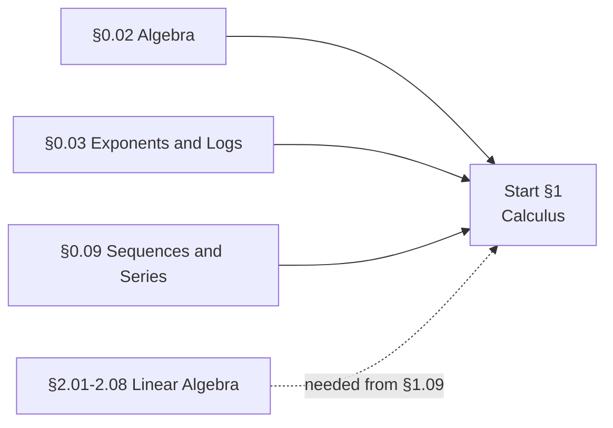

### 1.01 Limits and Continuity
Intuitive limits; one-sided limits; limits at infinity. The ε-δ definition (introduced here, made rigorous in §1.13). Limit laws and the squeeze theorem. Trigonometric limits: sin(x)/x, (1 − cos x)/x. Indeterminate forms: 0/0, ∞/∞, 0·∞, ∞−∞, 1^∞, 0⁰, ∞⁰. Continuity and types of discontinuity. The intermediate value theorem. The extreme value theorem.

### 1.02 The Derivative
The limit definition. Differentiability implies continuity, and why the converse fails. The derivative as slope, as instantaneous rate of change, and as best linear approximation (this third reading is the one that generalizes). Differentials, dy = f′(x)dx. Notation: Leibniz, Lagrange, Newton, operator. Higher-order derivatives.

### 1.03 Differentiation Rules
Power, sum, and constant-multiple rules. Product rule. Quotient rule. **The chain rule**, in every notation, with enough practice that it is automatic. Derivatives of sin, cos, tan, sec, and the inverse trig functions. Derivatives of eˣ, aˣ, ln x, log_a x. Logarithmic differentiation. Hyperbolic functions. Implicit differentiation. Derivatives of inverse functions.

### 1.04 Applications of the Derivative
Linear approximation and the tangent line. **Quadratic approximation** (the seed of the entire Hessian story). Critical points; the first and second derivative tests. Concavity, inflection points, asymptotes, curve sketching. Optimization and max-min problems, including endpoint and boundary reasoning. Related rates. **Newton's method** for root finding, the direct ancestor of multidimensional Newton in §2.12. The mean value theorem and Rolle's theorem; using MVT to prove inequalities. L'Hôpital's rule.

### 1.05 Integration
Riemann sums; the definite integral as a limit of sums; the integral as cumulative accumulation. The fundamental theorem of calculus, part 1 (derivative of an integral) and part 2 (evaluation). Antiderivatives and indefinite integrals. The inverse relationship between integration and differentiation, stated properly.

### 1.06 Techniques and Applications of Integration
Substitution, inverse substitution, trigonometric substitution. Completing the square in integrands. Integration by parts and reduction formulae. Partial fractions. Improper integrals: infinite limits, unbounded integrands, convergence tests (this is what normalizes a density over ℝ). Numerical integration: Riemann, trapezoid, Simpson's rule, and error behavior. Applications: area between curves, volumes, arclength, work, average value, and **probability density and expectation**. Parametric curves and polar coordinates, lightly.

### 1.07 Sequences, Series, and Taylor Expansions
Sequences and convergence. Series and partial sums; geometric and telescoping series. The full battery of convergence tests. Power series, radius and interval of convergence. **Taylor and Maclaurin series**; Taylor's theorem with remainder in Lagrange form. Standard expansions: eˣ, sin, cos, ln(1+x), (1+x)^α, 1/(1−x). Truncated Taylor series for approximation, with error bounds. Geometric series show up again as discounted returns in reinforcement learning and as the Neumann series for (I − A)⁻¹.

### 1.08 Differential Equations, Lightly
Separation of variables. Exponential growth and decay; the logistic equation. Slope fields. Euler's method. Enough to make sense of continuous-time formulations later (neural ODEs, diffusion SDEs, gradient flow).

### 1.09 Multivariable Calculus: Partial Derivatives and the Gradient
*Requires §2.01 through §2.08.* Functions of several variables; level sets, level curves, contour maps. Limits and continuity in ℝⁿ and the path-dependence trap. Partial derivatives; higher-order partials; **Clairaut/Schwarz symmetry of mixed partials**. Differentiability in ℝⁿ, which is strictly stronger than existence of partials (a commonly skipped subtlety). The total differential; **tangent plane approximation and linearization**. **The gradient ∇f**: its definition, its geometric meaning as the direction of steepest ascent, and its orthogonality to level sets. **The directional derivative** D_u f = ∇f · u. **The multivariable chain rule in matrix form**, which is backpropagation. **The Jacobian matrix** and the Jacobian determinant. **The Hessian matrix**, quadratic forms, definiteness. Second-order Taylor expansion in ℝⁿ.

### 1.10 Multivariable Optimization
Critical points; local versus global extrema; saddle points. The second derivative test in 2D via the discriminant, and its general form via Hessian definiteness. Behavior on boundaries and at infinity. **Least squares set up and solved as a multivariable optimization problem** (MIT 18.02 pairs "max-min problems" and "least squares" in one lecture, and it is the most ML-relevant lecture in the course). **Lagrange multipliers**, constraint qualification, multiple constraints. A first look at KKT conditions, developed properly in §5.05. The inverse function theorem and the **implicit function theorem** (needed for implicit differentiation, implicit layers, deep equilibrium models, and bilevel optimization).

### 1.11 Multiple Integrals and Change of Variables
Double integrals; iterated integrals; Fubini's theorem; changing the order of integration. Double integrals in polar coordinates. **Change of variables and the Jacobian determinant.** This is the theorem behind normalizing flows and behind the change-of-variables formula for probability densities, and it deserves to be taught as such. Triple integrals; cylindrical and spherical coordinates. Applications: mass, moments, and **probability over regions**. Surface area and parametrized surfaces.

### 1.12 Vector Calculus and the Integral Theorems
Deliberately deferred, not skipped. Vector fields and flow lines. Line integrals, scalar and vector; work. Conservative fields, path independence, potential functions. The fundamental theorem for line integrals. Green's theorem in tangential and normal form. Divergence and curl; ∇·, ∇×, and the Laplacian ∇². Flux and surface integrals. The divergence theorem. Stokes' theorem. Simply connected regions. The unifying picture: these are all one generalized Stokes' theorem. Payoff for AI: the instantaneous change-of-variables formula in continuous normalizing flows uses tr(∂f/∂z), which is a divergence, and the Fokker-Planck / continuity equation is how score-based diffusion is properly formulated.

### 1.13 Real Analysis, On Demand
Not a full course, a reference module built as needed. Sup and inf, completeness of ℝ. Rigorous ε-δ limits. Metric spaces, open and closed sets, compactness. Uniform versus pointwise convergence. The rigorous statements of the inverse and implicit function theorems. Normed spaces and Banach spaces. The Fréchet derivative, which is the formal name for the "derivative as linear operator" view in §2.12. Contraction mappings and the Banach fixed point theorem (this is why value iteration converges).

**You should be able to:** derive any elementary derivative from the limit definition; apply the chain rule through an arbitrarily deep composition without error; write the second-order Taylor expansion of a scalar function of a vector and identify the Hessian; explain why the gradient is orthogonal to level sets; solve a constrained optimization problem with Lagrange multipliers and interpret the multiplier; derive the density of a transformed random variable using the Jacobian determinant; set up least squares as an optimization problem and solve it by differentiation.

---

## 2. Linear Algebra

> The language of data, transformations, and high-dimensional space. Then the calculus that acts on it.

Modules §2.01 through §2.11 are standard linear algebra with the ML-relevant parts weighted heavily (SVD, projections, definiteness). Modules §2.12 and §2.13 are the ones that do not exist in most curricula and that everything downstream depends on.

**Prerequisites:** §0.01, §0.02, §1.01 through §1.04. §2.12 additionally requires §1.09 through §1.11.
**Anchor references:** MIT 18.06 (Strang) and 18.700 (Axler track), MIT **18.S096 / 18.063 Matrix Calculus for Machine Learning and Beyond** (Edelman & Johnson), Harvard Math 21b, CMU 21-241/21-242/21-266; Strang *Introduction to Linear Algebra*; Axler *Linear Algebra Done Right*; Trefethen & Bau *Numerical Linear Algebra*; Oppenheim & Schafer *Discrete-Time Signal Processing*; Bright, Edelman & Johnson *Matrix Calculus (for Machine Learning and Beyond)*.

**Prerequisite graph**

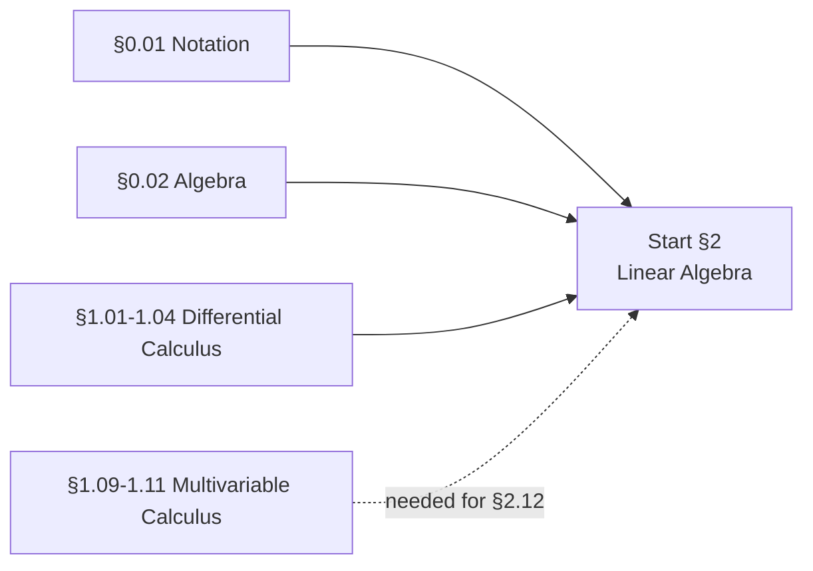

### 2.01 Vectors and Vector Spaces
Scalars, vectors, and geometric intuition in ℝ², ℝ³, ℝⁿ. Vector addition and scalar multiplication. Vector spaces: the axioms, and why the abstraction pays off. Subspaces. Linear combinations, span, linear independence. Basis and dimension. Coordinates relative to a basis, and change of basis. Norms: ℓ₁, ℓ₂, ℓ∞, ℓ_p, and the geometry of their unit balls (which is exactly why lasso produces sparsity). Inner products; angle; the Cauchy-Schwarz inequality. Orthogonality.

### 2.02 Matrices and Linear Transformations
Matrices as arrays and matrices as **linear maps**. Matrix-vector multiplication read four ways: as a linear combination of columns, as a set of row dot products, as a transformation, and blockwise. Matrix-matrix multiplication and its four interpretations. Transpose, trace, and their identities. Special matrices: diagonal, triangular, symmetric, orthogonal, permutation, projection, nilpotent. Block matrices and block operations. The correspondence between linear transformations and matrices, and how it depends on the choice of basis. Matrix inverse; invertibility conditions; the inverse of a product. Computational cost of the basic operations.

### 2.03 Systems of Linear Equations
Gaussian elimination and row reduction. Row echelon and reduced row echelon form. Pivots. **LU factorization**, with and without partial pivoting. Existence and uniqueness of solutions. Homogeneous systems and the null space. Underdetermined and overdetermined systems. The geometry: intersecting hyperplanes, and the column-space picture of solvability.

### 2.04 The Four Fundamental Subspaces
Column space, null space, row space, left null space. **Rank**, and the many equivalent definitions of it. The rank-nullity theorem. The fundamental theorem of linear algebra: the orthogonality relations between the four subspaces. Rank-one matrices and outer products. Low-rank structure, which is what LoRA is exploiting.

### 2.05 Orthogonality, Projections, and Least Squares
Orthogonal and orthonormal sets. **Orthogonal projection onto a subspace**; the projection matrix P = A(AᵀA)⁻¹Aᵀ and its properties. Gram-Schmidt orthogonalization and its numerical instability; modified Gram-Schmidt; Householder reflections. **QR factorization**. **Least squares**: the normal equations, the geometric derivation as a projection, the calculus derivation, and the numerically stable QR-based solution. The pseudoinverse. Minimum-norm solutions to underdetermined systems, which is the object at the center of the modern generalization story.

### 2.06 Determinants
Definition by cofactor expansion, by permutations, and by axioms. Geometric meaning as signed volume scaling. Properties: multiplicativity, effect of row operations, determinant of a transpose. Cramer's rule (mostly of theoretical interest). The determinant as a test for invertibility. Why determinants matter less computationally than they do conceptually, and where they genuinely matter: **change of variables (§1.11) and log-determinants in Gaussian likelihoods and normalizing flows**.

### 2.07 Eigenvalues and Eigenvectors
Definition and geometric meaning. The characteristic polynomial. Algebraic and geometric multiplicity; defective matrices. Diagonalization and its conditions. Similar matrices and invariants. Complex eigenvalues of real matrices. Matrix powers, Aᵏ, and the long-run behavior of linear dynamical systems. The matrix exponential. Spectral radius. Applications: Markov chain stationary distributions, PageRank, and stability analysis.

### 2.08 Symmetric Matrices, Quadratic Forms, and Definiteness
**The spectral theorem** for real symmetric matrices: orthogonal eigenvectors and real eigenvalues. Quadratic forms xᵀAx and their geometry. Positive definite, positive semidefinite, negative definite, indefinite. Tests for definiteness: eigenvalues, leading principal minors, Cholesky. **Cholesky factorization** (which is also how you sample from a multivariate Gaussian). The principal axis theorem. Rayleigh quotients and the variational characterization of eigenvalues. Covariance matrices as the canonical PSD object. This module is doing a lot of downstream work: the second derivative test, PCA, Gaussian densities, and convexity all live here.

### 2.09 The Singular Value Decomposition
A = UΣVᵀ. Existence for every matrix. Geometric interpretation: rotate, scale, rotate. Singular values versus eigenvalues. The relationship between the SVD and the four fundamental subspaces. **The Eckart-Young theorem**: the best low-rank approximation. The condition number and what it says about numerical sensitivity. The pseudoinverse via the SVD. Applications: PCA, low-rank approximation, matrix completion, latent semantic analysis, and understanding what a weight matrix is doing. If one theorem from this section survives, make it this one.

### 2.10 Numerical Linear Algebra
Floating point representation; machine epsilon; overflow and underflow. Catastrophic cancellation. Conditioning versus stability, and why they are different. Condition number of a matrix and of a problem. Backward error analysis. Algorithms and their costs: LU, QR, Cholesky, eigenvalue algorithms (QR algorithm, power iteration, Lanczos), SVD computation. Iterative methods: Jacobi, Gauss-Seidel, **conjugate gradient**, Krylov subspaces. Sparse matrices and their storage. BLAS levels and why memory layout dominates flop counts in practice. The log-sum-exp trick and why every ML codebase works in log space.

### 2.11 Tensors and Index Notation
Tensors as multidimensional arrays and tensors as multilinear maps, and how the two views differ. Shapes, axes, strides, memory layout, contiguity. Broadcasting rules. Reshaping, permuting, and the transposes that break people's code. Tensor contraction and `einsum`. The Einstein summation convention. Kronecker products and their properties (mixed product, transpose, trace, inverse, eigenvalues). Vectorization vec(·) and the identity vec(AXB) = (Bᵀ ⊗ A)vec(X). The commutation matrix.

### 2.12 Matrix Calculus
*The module that does not exist in most curricula.* MIT built an entire course for this because 18.02 and 18.06 both leave it out.

**The reframing that makes it tractable.** A derivative is a **linear operator**: f(x + dx) − f(x) = df = f′(x)[dx], to first order. For scalar f of a vector x, f′(x) is a linear form, and by the Riesz representation theorem it must be an inner product with something. That something is the gradient. This single move makes the row-versus-column confusion evaporate, generalizes cleanly to matrix inputs and function inputs, explains why the chain rule is composition of linear maps (and therefore why order matters), and connects directly to the Fréchet derivative and to little-o asymptotics.

**The shape zoo.** Scalar-by-scalar, scalar-by-vector, vector-by-scalar, vector-by-vector, scalar-by-matrix, matrix-by-scalar. The Jacobian as m×n with rows indexed by outputs. The gradient as the transposed Jacobian when m = 1. Why vector-by-matrix and matrix-by-matrix need rank-3 and rank-4 tensors and do not fit in a matrix at all.

**Layout conventions, which ruin more derivations than anything else.** Numerator layout (Jacobian formulation) versus denominator layout (Hessian formulation) versus mixed layout versus ∂y/∂xᵀ. The choice can be made *independently* for each of the shape cases, and many authors mix and match, sometimes within a single paper. The Matrix Cookbook uses a mixed layout, which means copying formulas out of it into a numerator-layout derivation silently produces wrong transposes. The working policy: identify which layout your source uses and stay consistent with it rather than converting; dimension-check every line as a debugging discipline.

**Rules.** Sum rule. **Product rule with order preservation**: d(FG) = (dF)G + F(dG), because matrix products do not commute. Chain rule as composition of linear maps, and as a product of Jacobians. **Association order**: left-to-right (reverse mode, backpropagation, adjoint) versus right-to-left (forward mode), and the cost analysis. With n inputs and one output, which is the entire ML case, left-to-right is vastly cheaper, and that fact is why large-scale optimization is practical at all. d(A⁻¹) = −A⁻¹(dA)A⁻¹. d(A³) = A²(dA) + A(dA)A + (dA)A², which is emphatically not 3A²dA. Chain rule on computational graphs. Where the chain rule genuinely breaks (matrix-by-scalar and scalar-by-matrix cases) and the differential-form workaround.

**Scalar functions of matrices, the ML workhorses.** The Frobenius inner product ⟨A,B⟩ = tr(AᵀB) = vec(A)ᵀvec(B) and the Frobenius norm. Trace identities and cyclic invariance as the derivation engine. ∇‖Ax − b‖², ∇(xᵀAx), ∇(aᵀXb) = abᵀ. **Jacobi's formula**: ∇det(A) = det(A)(A⁻¹)ᵀ. **∇log det(A) = A⁻ᵀ**, which shows up in Gaussian log-likelihoods, Gaussian process marginal likelihood, normalizing flow objectives, and VAE KL terms.

**Second order.** The second derivative as a symmetric bilinear form, f″(x)[δx, δy], and the Hessian as its matrix representation. Quadratic approximation f(x+δ) ≈ f + ∇fᵀδ + ½δᵀHδ. Definiteness and local minima. **The condition number of H governs the convergence rate of gradient descent**, which is the single most useful fact in this module. Hessian-vector products computed without forming H, as a directional derivative of the gradient. Gauss-Newton and Fisher information approximations.

**Derivatives of things that are not explicit functions.** Implicit differentiation of F(x, y) = 0. Adjoint methods for derivatives of solutions to linear systems, nonlinear root-finding problems, and ODEs (which is the mathematics behind neural ODEs). Adjoint recurrences, which is backpropagation through time. Derivatives of matrix factorizations: eigenvalues via dλ = vᵀ(dA)v, the SVD, and where this fails at eigenvalue crossings. Derivatives with constraints and on manifolds. Stochastic derivatives: Monte Carlo gradient estimation and the **reparameterization trick**.

### 2.13 Automatic Differentiation
Symbolic versus numeric versus automatic differentiation, and why AD is none of the other two. **Forward mode via dual numbers.** **Reverse mode** on a tape or graph. The cost model: reverse mode produces the full gradient for roughly the cost of one function evaluation. The memory model: activation storage, checkpointing, rematerialization. Custom rules: JVP / pushforward / `frule` for forward mode, VJP / pullback / `rrule` for reverse mode. Where AD breaks: control flow, non-differentiable points, in-place mutation, implicit functions, discrete randomness. **Gradient checking** by finite differences: central differences, the truncation-versus-roundoff tradeoff, choosing δ, catastrophic cancellation, Richardson extrapolation, and relative-error thresholds. Building a scalar reverse-mode autodiff engine from nothing is the single best exercise in this entire curriculum, and it belongs here rather than in §10.

### 2.14 Fourier Analysis and Signal Foundations
Complex exponentials as eigenfunctions of linear time-invariant systems. Fourier series and the continuous Fourier transform, then the discrete Fourier transform and the FFT algorithm. Time and frequency domains. Convolution, correlation, and the **convolution theorem**, which explains both fast filtering and part of why convolutional networks are computationally tractable. Sampling, the Nyquist-Shannon theorem, aliasing, leakage, windowing, and spectral resolution. Linear filtering, impulse and frequency responses, low-pass/high-pass/band-pass filters, and power spectral density. Short-time Fourier transforms and spectrograms. Connections forward to time series (§7.17), convolutional networks (§10.12), audio, positional encodings, and state-space models.

**You should be able to:** compute a projection matrix and derive least squares two independent ways; state and prove the spectral theorem for symmetric matrices; explain what the SVD does geometrically and state Eckart-Young; test a matrix for positive definiteness three ways; derive ∇log det(A); derive the gradient of ‖Ax − b‖² using differentials and check it by dimension analysis and finite differences; explain why reverse mode is the right choice for a scalar loss; implement reverse-mode automatic differentiation in under 150 lines and use it to train something; derive the convolution theorem and explain sampling and aliasing in both mathematical and computational terms.

---

## 3. Probability

> Reasoning under uncertainty.

There are two entry points into probability at every university surveyed: a calculus-only entry (MIT 18.05, Stanford CS109) and a calculus-plus-linear-algebra-plus-proofs entry (MIT 18.600, Harvard STAT 110). The ML-relevant path needs the second, because multivariate Gaussians, covariance matrices, and PCA all show up by the midpoint.

Harvard STAT 110's central pedagogical move is worth stealing outright: define each distribution by the **story** that generates it, not by its PMF. You should recognize a distribution from the experiment, not by pattern-matching a formula.

**Prerequisites:** §0.04, §0.08, §0.09, §0.10, and §1.05 through §1.07 support the introductory path through §3.05. Joint and multivariate work in §3.06 and §3.07 additionally uses §2.08; multivariate change of variables in §3.08 uses §1.11. Modules §3.10 through §3.13 assume increasing proof maturity, with §3.13 explicitly optional depth.
**Anchor references:** Harvard STAT 110 (Blitzstein), MIT 18.600 and 6.041, Stanford CS109, Berkeley CS70; Blitzstein & Hwang *Introduction to Probability*; Wasserman *All of Statistics* Ch. 1-5; Murphy *Probabilistic Machine Learning* Ch. 2-3; Durrett *Probability: Theory and Examples*.

**Prerequisite graph**

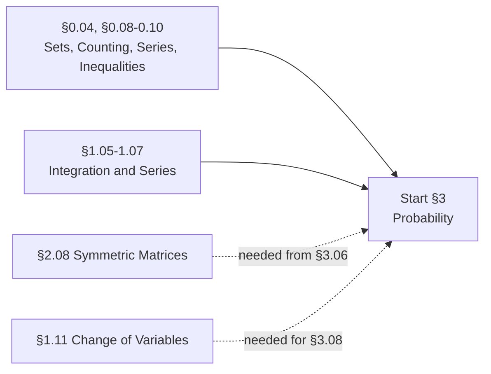

### 3.01 Probability Spaces and Axioms
Sample spaces, outcomes, events; event algebra. Kolmogorov's axioms. Monotonicity, the complement rule, inclusion-exclusion. Countable additivity; continuity of probability from above and below. The naive equally-likely definition and its failure modes. Counting-based probability (this is where §0.08 pays off). Classic problems as calibration: birthday, matching/derangement, Monty Hall, gambler's ruin. **Log probabilities and numerical underflow**, taught here rather than discovered later in a debugger.

### 3.02 Conditional Probability, Bayes, and Independence
Conditional probability. The multiplication/chain rule P(A₁…Aₙ) = ∏P(Aᵢ | A₁…Aᵢ₋₁). The law of total probability. **Bayes' theorem**, including the odds form. Prior, likelihood, posterior, evidence: the vocabulary, used consistently from here on. The base-rate fallacy; sensitivity, specificity, PPV. Independence versus pairwise independence versus mutual independence. **Conditional independence**, which is the entire basis of graphical models. Simpson's paradox. The prosecutor's fallacy. Conditioning as a problem-solving strategy ("condition on the first step").

### 3.03 Discrete Random Variables
A random variable as a function on the sample space. PMF, CDF, support. Functions of a random variable. **Indicator random variables and the fundamental bridge** E[1_A] = P(A). Expectation. **Linearity of expectation, which does not require independence**, and which is the single most reused trick in the subject. LOTUS. Variance and standard deviation; Var(X) = E[X²] − (E[X])²; variance of a sum. Moments, central versus raw; skewness; kurtosis.

### 3.04 Continuous Random Variables
PDF, CDF, quantile function. Why P(X = x) = 0 and what that does and does not mean. Expectation and variance by integration; continuous LOTUS. **Universality of the uniform / the probability integral transform**, which is the fundamental sampling primitive. Inverse-CDF sampling. Rejection sampling. Memorylessness and its characterization of the exponential and geometric. Hazard rate and survival function. Mixed distributions; the Dirac delta as a limiting case.

### 3.05 The Distribution Catalog
Not a reference table to skim, a set of stories to internalize. **Discrete:** Bernoulli, Binomial, Geometric, Negative Binomial, Hypergeometric, Poisson, Discrete Uniform, **Categorical** (softmax outputs, token distributions), Multinomial. **Continuous:** Uniform, Exponential, **Normal**, Gamma, **Beta** (conjugate prior for Bernoulli, and the basis of Thompson sampling), Chi-square, Student-t, F, Cauchy (as a pathology: no mean, a counterexample to LLN), **Laplace** (the ℓ₁ prior behind lasso), Pareto and power laws. **Multivariate:** Multivariate Normal, Dirichlet. **Structural:** the empirical distribution (the object behind the bootstrap and empirical risk minimization), and the **exponential family** in general (natural parameters, sufficient statistics, log-partition function), which unifies GLMs, maximum-entropy derivations, and much of what follows.

For each: the generative story, the PMF or PDF, mean and variance, MGF, relationships to other distributions, conjugacy, and where it shows up in machine learning.

### 3.06 Joint, Marginal, and Conditional Distributions
Joint PMFs and PDFs. **Marginalization (the sum rule)** and **conditioning (the product rule)**. Independence of random variables and the factorization criterion. Covariance, correlation, the covariance matrix and its PSD structure. **Uncorrelated does not imply independent.** Correlation does not imply causation, stated here and cashed out in §14.14. 2D LOTUS. Order statistics; distributions of min and max. Mixture distributions.

### 3.07 The Multivariate Gaussian
Its own module because everything uses it. Definition and the density. Mahalanobis distance. Why marginals and conditionals of a Gaussian are Gaussian, with derivation. Linear transformations of Gaussians. Products of Gaussian densities. Geometry: level sets as ellipsoids, and the role of the covariance eigendecomposition. **Sampling via the Cholesky factor.** The precision matrix and what its zeros mean. Downstream: Gaussian processes, VAEs, Kalman filters, LDA and QDA, the Laplace approximation, and diffusion model noise schedules.

### 3.08 Transformations and Generating Functions
Change of variables in 1D, monotone and non-monotone. **Multivariate change of variables with the Jacobian determinant**, which is the mathematical core of normalizing flows. The convolution formula for sums of independent random variables. Moment generating functions: existence, uniqueness, extracting moments, MGF of a sum. Characteristic functions and the inversion formula (the rigorous route to the CLT). Probability generating functions. Cumulant generating functions and the log-partition function.

### 3.09 Conditional Expectation
E[Y | X = x] versus E[Y | X] as a random variable. **Adam's law / the tower property / iterated expectations**: E[E[Y|X]] = E[Y]. **Eve's law / the law of total variance**: Var(Y) = E[Var(Y|X)] + Var(E[Y|X]). That second one is the probabilistic ancestor of the bias-variance decomposition, and teaching it here makes §8.17 nearly free. Conditional expectation as an L² projection, which gives the ML reading directly: E[Y|X] is the function that minimizes squared error, and is therefore what every regression model is trying to approximate. Wald's identity.

### 3.10 Inequalities and Concentration
Markov's inequality. Chebyshev's inequality. The Chernoff bound and the MGF method. **Hoeffding's inequality**, which is the workhorse of generalization bounds. Bernstein's inequality. McDiarmid / bounded differences. Jensen's inequality applied to random variables. Union bound. Borel-Cantelli. Sub-Gaussian and sub-exponential random variables. Knowing which bound is available given which assumptions is the actual skill.

### 3.11 Limit Theorems
Modes of convergence: in distribution, in probability, almost surely, in L^p, and the implications between them. The **weak law of large numbers**, proved from Chebyshev. The **strong law**. The **central limit theorem**, i.i.d. and Lindeberg forms, with a proof sketch via MGFs or characteristic functions. Berry-Esseen rates. The delta method, first and second order, univariate and multivariate. The continuous mapping theorem; Slutsky's theorem. Poisson convergence and the law of rare events. Large deviations and Cramér's theorem, which is the bridge to §6. Monte Carlo estimation as a direct corollary of the LLN, with CLT-based error bars.

### 3.12 Stochastic Processes and Markov Chains
Bernoulli processes. Poisson processes: interarrival times, superposition, thinning, conditioning. **Markov chains**: transition matrices, the Markov property, Chapman-Kolmogorov. Classification of states: recurrence, transience, periodicity, irreducibility. Stationary distributions and their computation as an eigenvector problem (§2.07 pays off). Convergence to stationarity; mixing time. Detailed balance and reversibility, which is exactly the condition MCMC is engineered to satisfy. Random walks. Martingales and the optional stopping theorem, which underlie SGD convergence proofs and anytime-valid testing. Brownian motion and a first look at SDEs, which is the continuous-time formulation of diffusion models and Langevin dynamics.

### 3.13 Measure-Theoretic Probability, On Demand
Not a full Durrett pass. A reference module covering the four things that actually matter downstream: **conditional expectation as a projection onto a σ-algebra**, which cleans up bias-variance and the Bayes-optimal predictor; **Radon-Nikodym derivatives**, which are what likelihood ratios, importance weights, and KL divergence *are*; **martingales and optional stopping**, for convergence proofs; and **Brownian motion and Itô calculus**, for diffusion and Langevin samplers. Plus the basics needed to state those: σ-algebras, measurable functions, the Lebesgue integral, monotone and dominated convergence, product measures and Fubini.

**You should be able to:** translate a verbal scenario into a probability space, then a random variable model, then code that simulates it; recognize a distribution from its generative story rather than its formula; compute an expectation with linearity and indicators without ever finding the distribution; apply Adam's and Eve's laws to decompose by conditioning; derive the density of a transformed random variable including the multivariate case; state Markov, Chebyshev, Hoeffding, and Jensen and say which applies when; prove the WLLN from Chebyshev and sketch the CLT proof; derive the conditional distribution of a multivariate Gaussian and sample from one using Cholesky; write down a joint factorization, draw the corresponding graphical model, and marginalize.

---

## 4. Statistics

> Learning from data, and knowing how much to believe it.

MIT 18.05 makes an ordering choice worth copying: probability, then **Bayesian inference**, then frequentist NHST and confidence intervals, then an explicit lecture comparing the two. Bayes first, frequentist second, and the comparison made explicit rather than left as a culture war.

**Prerequisites:** §3 and §2.05. Numerical MLE in §4.02 draws on derivative and Newton-method material from §1.04 and §2.12; §5 develops those optimization methods systematically rather than serving as a prerequisite for this section.
**Anchor references:** MIT 18.05 and 18.650, Stanford STATS 200, CMU 36-705 (Wasserman) and 36-401; Wasserman *All of Statistics*; Casella & Berger *Statistical Inference*; Gelman et al. *Bayesian Data Analysis*; Efron & Hastie *Computer Age Statistical Inference*.

**Prerequisite graph**

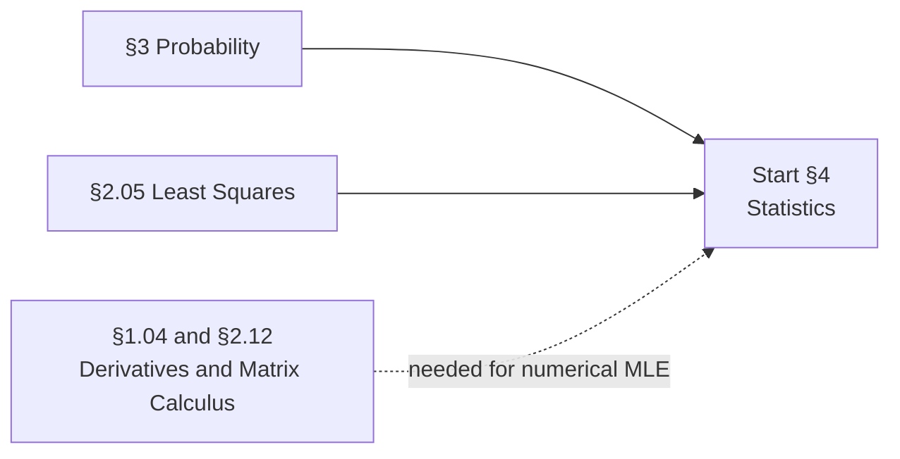

### 4.01 The Statistical Model
Population versus sample. What a statistical model is. Parametric versus nonparametric. Statistic, estimator, estimate; the sampling distribution. The three fundamental problems: point estimation, set estimation, hypothesis testing. The empirical CDF; Glivenko-Cantelli; the DKW inequality. Statistical functionals and the **plug-in principle**. Anscombe's quartet and the limits of summary statistics.

### 4.02 Point Estimation
The method of moments: matching sample and population moments; consistency and asymptotic normality. **Maximum likelihood**: the likelihood function versus a probability, and why the distinction matters; log-likelihood; the score function. MLE worked completely for Bernoulli, categorical, univariate and multivariate Gaussian, and linear regression. Numerical MLE: Newton-Raphson, Fisher scoring, gradient ascent, and **the EM algorithm** (developed fully in §8.14).

### 4.03 Properties of Estimators
Bias, variance, MSE, and the decomposition MSE = bias² + variance. Consistency, weak and strong. Asymptotic normality. Efficiency and asymptotic relative efficiency. Equivariance and invariance of the MLE. **MLE under model misspecification**: the sandwich/robust covariance, and the reading of the MLE as a KL projection onto the nearest model. That last one deserves emphasis, because in machine learning the model is always wrong, and this is the framework that says what you are estimating anyway. Shrinkage, Stein's paradox, the James-Stein estimator, admissibility. Regularized estimation and the MAP-as-penalty equivalence. Online and recursive estimation, which is the bridge to SGD.

### 4.04 Sufficiency, Exponential Families, and Information
Sufficiency and the factorization theorem. Minimal sufficiency. The Rao-Blackwell theorem. Completeness; Lehmann-Scheffé. Ancillarity; Basu's theorem. **Exponential families**: natural parameters, sufficient statistics, the log-partition function, and the duality between mean and natural parameterization. **Fisher information**: the score has mean zero; information is the variance of the score and the negative expected Hessian; observed versus expected information; additivity over i.i.d. samples. **The Cramér-Rao lower bound.** UMVUE. Fisher information reappears later as a Hessian approximation (§5.07) and as the metric in natural gradient methods.

### 4.05 Interval Estimation
The definition of a confidence interval, and its correct interpretation. Coverage. Pivotal quantities. Asymptotic (Wald) intervals, score intervals, likelihood-ratio intervals. Normal-theory intervals for means and variances; t-intervals; proportion intervals (Wald versus Wilson versus Agresti-Coull). Inverting a hypothesis test to get a confidence set. Simultaneous bands; Bonferroni and Scheffé. **Confidence intervals are not credible intervals**, taught explicitly as the misconception it is.

### 4.06 Hypothesis Testing
Null and alternative; simple versus composite; test statistic; rejection region. **Type I and Type II error; size α; power; power functions.** **p-values**: the definition as the smallest α at which you reject, and the fact that a p-value is Uniform(0,1) under the null. The **Neyman-Pearson lemma**. Uniformly most powerful tests; monotone likelihood ratio; Karlin-Rubin. **Likelihood ratio tests** and Wilks' theorem. **Wald and score tests**, and the asymptotic equivalence of the three. The standard battery: z, one- and two-sample t, paired t, F, ANOVA. Chi-square tests: goodness of fit, independence, homogeneity. Nonparametric tests: sign, Wilcoxon signed-rank, Mann-Whitney, Kolmogorov-Smirnov. **Permutation tests**, which are exact, assumption-light, and directly usable for comparing two ML models. And then the critique: p-hacking, the replication crisis, and why "p-values considered harmful" is a defensible position.

### 4.07 Multiple Testing
Family-wise error rate. Bonferroni; Holm; Šidák. **False discovery rate and Benjamini-Hochberg.** Why this matters enormously in ML practice and is almost never taught in ML courses: every hyperparameter sweep, every leaderboard, and every feature-selection pass is a multiple comparisons problem. Sequential and anytime-valid testing; e-values.

### 4.08 Resampling
**The bootstrap**: nonparametric, parametric, and smoothed. Bootstrap variance estimation. Bootstrap confidence intervals: normal, pivotal, percentile, BCa, with the justification for the percentile interval rather than just the recipe. The jackknife. Cross-validation as a resampling estimator of risk (mechanics in §8.18). When the bootstrap fails.

### 4.09 Linear Regression as Statistics
The same object as §8.02, seen from the inference side rather than the prediction side. The Gaussian noise model and why MLE recovers OLS. Sampling distributions of the coefficients. Standard errors, t-tests on coefficients, F-tests for nested models. R² and adjusted R². The hat matrix, leverage, and influence. **Diagnostics**: residual plots, QQ plots, heteroscedasticity, autocorrelation, normality checks. Multicollinearity and the variance inflation factor. Outliers and high-leverage points. Weighted least squares. Polynomial terms and interactions. Prediction intervals versus confidence intervals for the mean. Where "statistical significance of a coefficient" is and is not a causal claim.

### 4.10 Generalized Linear Models
The exponential family form, the canonical link, and deriving mean and variance from the log-partition function. **Deriving OLS, logistic regression, Poisson regression, and softmax regression as special cases of one framework.** Stanford CS229's third lecture is the canonical treatment and it is worth reproducing carefully, because it is the moment a pile of separate algorithms becomes one idea. Link functions, deviance, IRLS. Overdispersion and quasi-likelihood. Ordinal and multinomial models.

### 4.11 Bayesian Statistics
Priors, likelihood, posterior, and the posterior predictive. **Conjugate priors**: Beta-Binomial, Gamma-Poisson, Normal-Normal, Normal-Inverse-Gamma, Dirichlet-Multinomial, with derivations. Non-informative priors, Jeffreys priors, weakly informative priors, and the honest discussion of what "uninformative" can and cannot mean. Credible intervals, and how they differ from confidence intervals. Bayesian model comparison: Bayes factors, marginal likelihood, and its sensitivity to the prior. Hierarchical models and partial pooling. Shrinkage as an emergent property rather than a hack. Empirical Bayes. **The MAP estimate as regularized MLE**, which connects ridge to a Gaussian prior and lasso to a Laplace prior.

### 4.12 Bayesian Computation
Why the posterior is usually intractable: the normalizing constant. **Monte Carlo integration** and importance sampling; effective sample size. **MCMC**: Metropolis-Hastings, the detailed balance condition and why it gives the right stationary distribution, proposal design, acceptance rates. **Gibbs sampling** and collapsed Gibbs. Hamiltonian Monte Carlo and NUTS. Convergence diagnostics: trace plots, R-hat, effective sample size, burn-in, thinning and why thinning is usually a mistake. **Variational inference**: the ELBO derived from Jensen's inequality and from the KL decomposition, mean-field approximation, coordinate ascent VI, stochastic VI, and the forward-versus-reverse KL asymmetry (mode-seeking versus mass-covering). The Laplace approximation. This module is the direct prerequisite for VAEs in §11.04.

### 4.13 Decision Theory
Loss functions and the risk function R(θ, θ̂) = E_θ[L]. Frequentist risk versus Bayes risk. Admissibility and dominance. Minimax rules. **The Bayes decision rule** and Bayes-optimal prediction, which is the reference point every learning algorithm is measured against. Squared loss gives the conditional mean; absolute loss gives the conditional median; 0-1 loss gives the mode. The 0-1 loss Bayes classifier and the Bayes error rate. This is the cleanest bridge from statistics into machine learning, and it belongs here rather than being rediscovered in §8.

### 4.14 Experimental Design
Randomization and why it works. Blocking, stratification, factorial designs. Sample size and power calculations done before the experiment rather than after. A/B testing, sequential testing, and peeking. Confounding, selection bias, survivorship bias, Simpson's paradox revisited. Observational versus experimental data, and a clear statement of what regression coefficients do and do not license you to say, which sets up §14.14.

**You should be able to:** derive the MLE for a distribution you have not seen before; state and prove the Cramér-Rao bound; derive the posterior for a conjugate pair by hand; explain precisely what a 95% confidence interval means and what it does not; construct a permutation test to compare two models; explain why Benjamini-Hochberg applies to your hyperparameter sweep; derive the ELBO two different ways; derive OLS, logistic regression, and Poisson regression as GLMs from one exponential-family template; state the Bayes-optimal predictor under squared, absolute, and 0-1 loss.

---

## 5. Optimization

> Finding the best answer, or at least a better one, and knowing which of those you got.

CMU 10-725's stated objective is the right frame for this whole section: given a problem, **identify its key properties** (convexity, smoothness, sparsity, separability) or reformulate it so it has them; **select an algorithm** understanding the tradeoffs; **implement it** or use existing software correctly. Properties, then algorithm, then implementation.

**Prerequisites:** §1.09, §1.10, §2.08, §2.10, §2.12.
**Anchor references:** Stanford EE364A/B (Boyd), CMU 10-725 (Tibshirani), Berkeley EE227C (Hardt), MIT 6.7220J and 18.335J; Boyd & Vandenberghe *Convex Optimization*; Nocedal & Wright *Numerical Optimization*; Bertsekas *Nonlinear Programming*; Goodfellow et al. Ch. 4 and 8.

**Prerequisite graph**

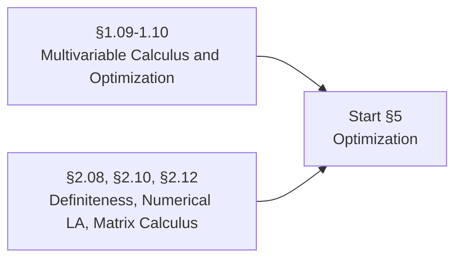

### 5.01 The Optimization Problem
General form: objective, decision variables, constraints, feasible set. Local versus global optima. Weierstrass's theorem (existence of a minimum). Why optimization is the unifying language: every learning algorithm in §8 through §13 is an objective plus a hypothesis class plus a solver. Well-posedness. Computational considerations, and what "solved" means for a nonconvex problem.

### 5.02 Convex Sets
Affine and convex sets. The standard examples: hyperplanes, halfspaces, polyhedra, norm balls, cones, the positive semidefinite cone, simplices. Operations that preserve convexity: intersection, affine images and preimages, perspective, linear-fractional. Generalized inequalities and proper cones. **Separating and supporting hyperplane theorems**, which are the real engine behind duality. Dual cones. Normal cones (MIT 6.7220J organizes its entire theory around normal cones and separation rather than starting from Lagrangians, and that ordering is genuinely clarifying).

### 5.03 Convex Functions
Definition; the first-order and second-order conditions. Epigraph. Standard examples and the ones people get wrong. Operations preserving convexity: nonnegative weighted sums, composition rules, pointwise maximum and supremum, partial minimization, perspective. **Jensen's inequality** as the defining property. The conjugate function and Fenchel duality. Quasiconvexity. Log-concavity and log-convexity. **Strong convexity** and **L-smoothness (Lipschitz gradient)**: the two conditions that everything in §5.06 is stated in terms of. Bregman divergences. Disciplined convex programming, which is the ruleset that makes CVXPY work and the practical bridge between recognizing convexity and solving something.

### 5.04 Convex Problem Classes
Linear programming: standard form, the geometry of the feasible polyhedron, the simplex method, and a note on its complexity. Quadratic programming. Second-order cone programming. Semidefinite programming. Geometric programming. Vector and multicriterion optimization. Recognizing which class your problem falls into is most of the practical skill here. Where common ML problems land: least squares (QP), lasso (QP), SVM (QP), maximum entropy (convex), and matrix completion (SDP relaxation).

### 5.05 Duality and Optimality Conditions
The Lagrangian. The Lagrange dual function and the dual problem. Weak duality, always. Strong duality and **Slater's condition**. The geometric and saddle-point interpretations. **KKT conditions**: stationarity, primal feasibility, dual feasibility, complementary slackness. Constraint qualifications (LICQ, Slater). Sensitivity analysis and the interpretation of dual variables as shadow prices. Farkas' lemma and theorems of alternatives; certificates of infeasibility. Worked derivations that pay off immediately: **the SVM dual** (and where support vectors come from, via complementary slackness), and the dual of the ridge and lasso problems.

### 5.06 Unconstrained First-Order Methods
Descent directions and descent methods. **Gradient descent**, derived from the first-order Taylor expansion. Step sizes: fixed, exact line search, backtracking, **Armijo and Wolfe conditions**. Convergence analysis: the L-smooth convex case (O(1/k)), the strongly convex case (linear rate), and the nonconvex case (convergence to small gradient norm). **The condition number of the Hessian and why it governs everything**; the zig-zag picture. Steepest descent under non-Euclidean norms. **Momentum** (Polyak heavy ball) and **Nesterov acceleration**, with the lower bound that says acceleration is optimal for this class. Subgradients and the subgradient method for nondifferentiable objectives. Mirror descent and Bregman proximal methods. Coordinate descent and when it beats full gradient steps (lasso, notably).

### 5.07 Second-Order and Quasi-Newton Methods
**Newton's method**: derivation from the second-order Taylor expansion, affine invariance, quadratic local convergence, and the reasons it is rarely used directly at scale. Damped Newton and globalization. Self-concordance. **Gauss-Newton** and Levenberg-Marquardt for least squares. **Quasi-Newton**: the secant condition, BFGS, and **L-BFGS** with its limited-memory two-loop recursion. Trust region methods. Conjugate gradient and Krylov subspace methods. **Truncated/Hessian-free Newton** using Hessian-vector products from §2.12 without ever forming the Hessian. Natural gradient and the Fisher information metric; K-FAC. Why second-order methods struggle in stochastic settings.

### 5.08 Constrained and Composite Methods
Projected gradient descent and the projection oracle. **Proximal operators** and proximal gradient descent; the ℓ₁ prox is soft-thresholding, which is where ISTA and FISTA come from. Frank-Wolfe / conditional gradient and its projection-free appeal. Penalty and augmented Lagrangian methods. **ADMM** and operator splitting. Dual decomposition and distributed optimization. Barrier methods, the central path, and **interior point methods**, primal and primal-dual. The ellipsoid method and cutting-plane methods, which matter mostly for the theory.

### 5.09 Stochastic Optimization
The finite-sum structure of empirical risk minimization, and why it changes everything. **Stochastic gradient descent**: unbiased gradient estimates, variance, and the noise-versus-compute tradeoff. Convergence of SGD: the Robbins-Monro conditions, the O(1/√k) rate, and why the rate is worse but the wall-clock time is better. Mini-batching and its interaction with hardware throughput. Variance reduction: SAG, SAGA, SVRG. Averaging (Polyak-Ruppert). **The linear scaling rule and critical batch size.** SGD noise as implicit regularization. Stochastic dual coordinate ascent. Online convex optimization, regret, and online-to-batch conversion.

### 5.10 Adaptive Methods
The family that actually trains neural networks, developed as a lineage rather than a list. **AdaGrad**: per-parameter scaling, and the monotonically shrinking effective learning rate that eventually kills it. **RMSProp**: exponential decay fixes the decay-to-zero. **Adam**: momentum plus RMSProp plus bias correction, with the bias-correction term derived rather than asserted. **AdamW**: why weight decay and ℓ₂ regularization are identical for SGD and different for Adam, and why that difference matters. LARS and LAMB for very large batches. Shampoo and Muon and the second-order-adjacent family. **Learning rate schedules**: step, exponential, cosine annealing, linear warmup, warm restarts, one-cycle, WSD/trapezoidal. **Why warmup is necessary for Adam plus LayerNorm transformers.** Gradient clipping by value and by global norm. Convergence caveats: the known counterexamples to Adam's convergence, and what practitioners do about them.

### 5.11 Nonconvex Optimization
What breaks and what survives. In some overparameterized architectures, many observed local minima are connected or comparably useful, while saddle points, ill-conditioning, plateaus, cliffs, symmetries, and optimizer bias remain important obstacles. The strict saddle property and escaping saddles with noise. Loss landscape geometry: mode connectivity, linear interpolation between minima, sharp versus flat minima and the generalization argument. First-order stationary points and how convergence guarantees are weakened to match. Alternating minimization and the general form of EM. Nonconvex constrained problems; sequential convex programming; convex relaxations (ℓ₁ for cardinality, SDP relaxations, sum-of-squares). Global optimization and branch-and-bound. When to give up on guarantees and just measure.

### 5.12 Numerical Computing and Conditioning
Floating point representation: IEEE 754, mantissa and exponent, machine epsilon, subnormals. Overflow and underflow. Catastrophic cancellation. **The log-sum-exp trick**, derived, and why every softmax implementation subtracts the max. Working in log space. Conditioning of a problem versus stability of an algorithm. Condition numbers. Forward and backward error. Mixed precision: FP32, TF32, FP16, BF16, FP8, and why BF16 mostly won for training. Loss scaling. Deterministic versus nondeterministic reductions, and why your training run is not reproducible.

### 5.13 Derivative-Free and Black-Box Optimization
For when gradients do not exist, are unreliable, or are too expensive. Finite-difference gradient estimation and its limits. Nelder-Mead. Pattern and direct search. Simulated annealing. **Bayesian optimization**: the GP surrogate, acquisition functions (expected improvement, UCB, Thompson sampling, knowledge gradient), and hyperparameter tuning as its flagship use. Random search, and Bergstra and Bengio's argument for why it beats grid search under low effective dimensionality. Successive halving, Hyperband, ASHA. Evolution strategies as black-box optimizers, which hands off directly to §9.

**You should be able to:** prove a function is convex three different ways; write the Lagrangian and KKT conditions for a constrained problem and interpret the multipliers; derive the SVM dual and explain what a support vector is in terms of complementary slackness; derive the gradient descent update from a Taylor expansion and prove the O(1/k) rate for L-smooth convex objectives; explain why the Hessian condition number sets the convergence rate and demonstrate it empirically; derive Adam's bias correction; explain the difference between weight decay and ℓ₂ under Adam; implement GD, momentum, Nesterov, AdaGrad, RMSProp, and Adam and compare trajectories on an ill-conditioned quadratic; derive log-sum-exp and show the naive softmax overflowing.

---

## 6. Information Theory

> Quantifying information, uncertainty, and surprise.

MIT 18.600 teaches entropy inside the probability course rather than deferring it, which is the right instinct: entropy is a property of a distribution before it is anything else. This section then follows it out into coding, channels, and the connections to learning, which is where the payoff is.

**Prerequisites:** §3, §0.03, §0.10, §5.03.
**Anchor references:** MIT 6.441 (Polyanskiy), Stanford EE376A (Weissman); Cover & Thomas *Elements of Information Theory*; MacKay *Information Theory, Inference, and Learning Algorithms*.

**Prerequisite graph**

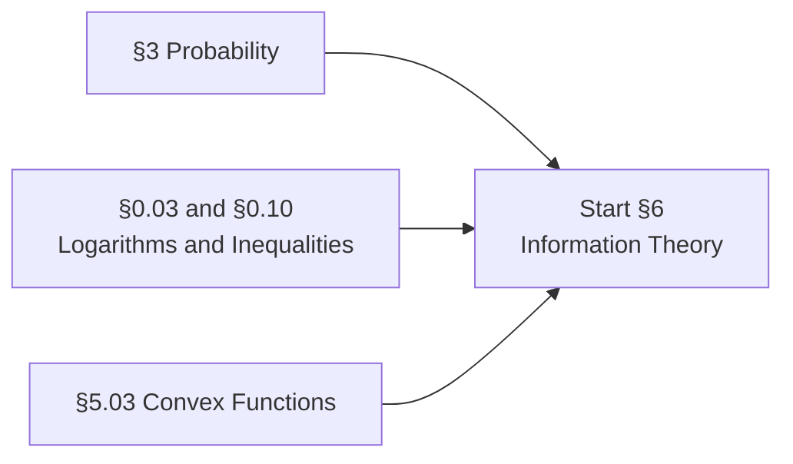

### 6.01 Information and Entropy
Self-information / surprisal −log p(x), and the axiomatic derivation of why it has to be a logarithm. **Shannon entropy** H(X) = −Σ p log p. Units: bits, nats, bans, and converting between them. Properties: nonnegativity, maximum at the uniform distribution, concavity, the effect of deterministic transformations. Entropy of standard distributions: Bernoulli (and the binary entropy function), uniform, geometric. Joint entropy. **Conditional entropy** H(Y|X) and the chain rule for entropy. Entropy as expected code length, previewing §6.06.

### 6.02 Mutual Information
**Mutual information** I(X;Y), and its four equivalent expressions. Symmetry. Nonnegativity, with the proof via Jensen. The Venn-diagram picture and where that picture misleads for three or more variables. Conditional mutual information and the chain rule. Interaction information and the fact that it can be negative. **The data processing inequality**, which is one of the most useful and least-known results in the whole subject: post-processing cannot create information. Sufficient statistics characterized information-theoretically. Fano's inequality, which lower-bounds error probability and is the standard tool for minimax lower bounds. Applications: feature selection by mutual information, the information bottleneck, InfoNCE and why it is a mutual information bound.

### 6.03 Relative Entropy and Cross-Entropy
**KL divergence** D(p‖q). Nonnegativity via Gibbs' inequality or Jensen. Asymmetry, and why it matters concretely: forward KL is mass-covering, reverse KL is mode-seeking, and that choice determines whether your variational posterior spreads or collapses. Not a metric: no symmetry, no triangle inequality. The chain rule for relative entropy. **Cross-entropy** H(p,q) = H(p) + D(p‖q), and therefore **why minimizing cross-entropy loss is exactly minimizing KL to the data distribution, which is exactly maximum likelihood**. This equivalence deserves to be derived once, carefully, and then referenced for the rest of the curriculum. KL between Gaussians in closed form (the VAE regularizer). Conditional KL. Pinsker's inequality, connecting KL to total variation.

### 6.04 Differential Entropy
Entropy for continuous random variables. Why it can be negative and why it is not the limit of discrete entropy. Non-invariance under change of variables, and the correction term (which is the log-determinant of the Jacobian again, from §1.11). Differential entropy of the Gaussian, and the maximum-entropy property: **the Gaussian is the maximum-entropy distribution for a fixed variance**, which is a real answer to "why Gaussians everywhere." Maximum entropy under other constraints, giving the exponential and uniform. The relative entropy is well-behaved under change of variables even when differential entropy is not. Entropy rate of a stochastic process.

### 6.05 The AEP and Typicality
The asymptotic equipartition property. Typical sets: their size, their probability, and the picture of a distribution as "roughly uniform over 2^{nH} sequences." Jointly typical sequences. Why this is the machinery behind both source coding and channel coding theorems. High-dimensional geometry consequences, including why the typical sample from a high-dimensional Gaussian lives on a thin shell and not near the mode, which explains a surprising amount of generative-model behavior.

### 6.06 Source Coding and Compression
Codes: nonsingular, uniquely decodable, prefix-free. **Kraft's inequality.** The relationship between code length and probability. **The source coding theorem**: entropy is the fundamental limit. **Huffman coding** and its optimality. Shannon-Fano-Elias. **Arithmetic coding**, and why it is what actually gets used and what connects most directly to autoregressive language models. Asymptotic optimality. Universal compression: Lempel-Ziv. **Compression and prediction are the same problem**, which is worth stating plainly: a language model is a compressor, and bits-per-byte is the tokenizer-invariant way to say so.

### 6.07 Channel Capacity
The discrete memoryless channel. Channel capacity as max mutual information. Worked channels: binary symmetric, binary erasure, Gaussian. **The noisy channel coding theorem**, statement and proof sketch via random coding and joint typicality, plus the converse. The Gaussian channel and the Shannon-Hartley capacity formula. Feedback capacity. Practical codes at a high level: Hamming, LDPC, turbo, polar. Why this section exists in an AI curriculum: it is the origin of the entire framework, and channel-coding intuitions reappear in noisy-channel formulations of translation and in rate-distortion views of representation learning.

### 6.08 Rate-Distortion Theory
Lossy compression. The distortion measure and the rate-distortion function R(D). The Gaussian case and the reverse water-filling solution. The duality with channel capacity. The **rate-distortion view of representation learning**: an encoder is a lossy compressor, and the β in β-VAE is a Lagrange multiplier on the rate constraint. The information bottleneck principle, and the (contested) claim that it explains deep learning.

### 6.09 Information Theory and Learning
Where all of the above cashes out. **Cross-entropy loss as maximum likelihood as KL minimization**, restated with all three views aligned. **The ELBO as a rate-distortion decomposition**, and the exact accounting of reconstruction versus KL. Mutual information estimation and why it is hard in high dimensions (MINE, InfoNCE, and the known upper-bound limitations). **The minimum description length principle**: model selection as compression, two-part codes, and the connection to Occam's razor and to regularization. Bayesian model selection through an MDL lens. PAC-Bayes bounds. Entropy as an exploration bonus in reinforcement learning; maximum-entropy RL. Entropy regularization in policy optimization. Perplexity as exponentiated cross-entropy, and the reason it does not compare across tokenizers.

### 6.10 Divergences Beyond KL
The f-divergence family, with KL, reverse KL, Jensen-Shannon, total variation, Hellinger, and χ² as members. The variational representation of f-divergences and why that is what makes GAN objectives work (the original GAN minimizes Jensen-Shannon). Integral probability metrics: total variation, **Wasserstein / earth mover distance**, and maximum mean discrepancy. Why Wasserstein behaves better than KL when supports do not overlap, which is precisely the WGAN argument. Optimal transport basics: the Monge and Kantorovich formulations, the dual, entropic regularization and Sinkhorn. Score-based divergences: Fisher divergence and score matching, which is the direct route into diffusion models.

**You should be able to:** derive the form of Shannon entropy from its axioms; prove KL nonnegativity; show cross-entropy minimization equals maximum likelihood equals KL minimization, and say which of the three framings is most useful in which situation; compute the KL between two Gaussians in closed form and use it as the VAE regularizer; state and apply the data processing inequality; prove the Gaussian is maximum-entropy at fixed variance; implement Huffman and arithmetic coding and measure the gap to entropy; explain why perplexity is not comparable across tokenizers; explain the ELBO as a rate-distortion tradeoff.

---

## 7. Data and Intelligent Data Analysis

> Everything that happens before the model, and most of what determines whether the model works.

This section exists because of a gap that is glaring once you look for it: Berkeley's Data 100 is an entire course on the data lifecycle, and essentially none of that material appears in CS189 or CMU 10-601. PhD-level ML courses spend zero time on it. But data leakage, missing-data handling, and encoding choices decide more real outcomes than model architecture does.

**Prerequisites:** §2.09, §3, §4.01, §4.08.
**Anchor references:** Berkeley Data 100 and STAT 153, Stanford CS246 (Mining Massive Data Sets), CMU 36-708; Tukey *Exploratory Data Analysis*; Wickham on tidy data; Hyndman & Athanasopoulos *Forecasting: Principles and Practice*.

**Prerequisite graph**

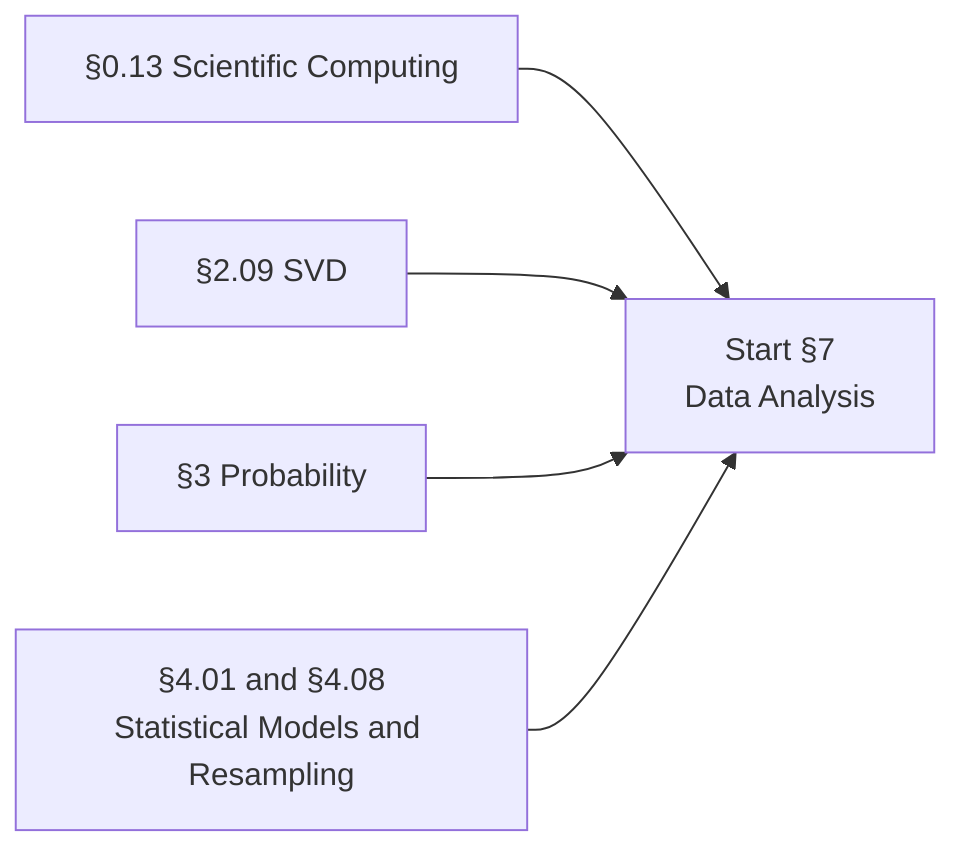

### 7.01 Data Representation and Provenance
Where data came from and what that implies. Granularity, scope, temporality, faithfulness. Formats: CSV, TSV, fixed-width, JSON, Parquet, Arrow, HDF5. Structured, semi-structured, unstructured. Relational thinking: primary and foreign keys, joins, grouping, normalization. **SQL as a first-class data-analysis skill**: SELECT, WHERE, GROUP BY, HAVING, JOIN, window functions. Data types and their traps: floats for money, timezones, integer overflow, string encodings, Unicode normalization. Schemas, contracts, and versioning. Documentation: datasheets for datasets, model cards.

### 7.02 Data Cleaning
Type coercion and validation. Unit consistency. Duplicate detection and deduplication, exact and fuzzy. **Regular expressions** for text extraction and validation, taught properly rather than copied from Stack Overflow. String normalization: case, whitespace, accents, canonical forms. Date and time parsing, and the many ways it goes wrong. Structural problems: ragged records, embedded delimiters, header detection. Validation frameworks and assertion-based data testing. The general discipline: make the cleaning reproducible and inspectable rather than a sequence of manual edits.

### 7.03 Missing Data
**The MCAR / MAR / MNAR taxonomy**, and why the mechanism determines which fix is valid. Deletion: listwise and pairwise, and the bias each introduces. Simple imputation: mean, median, mode, and what it does to variance and correlation. kNN imputation. Iterative and multiple imputation (MICE); model-based imputation via EM. **Missing-indicator features**, which are often the most honest option. Native missing-value handling in tree methods: surrogate splits in CART, default directions in XGBoost. Missingness as signal.

### 7.04 Outliers and Robustness
Detecting outliers: z-score and modified z-score (MAD-based), IQR fences, Mahalanobis distance, Isolation Forest, local outlier factor, one-class SVM. The distinction between an error, a rare event, and a heavy tail. Winsorizing versus removing versus using a robust loss. Robust statistics: median, trimmed mean, MAD, Huber loss, quantile regression. Breakdown point and influence functions. The judgment call of when an outlier is the whole point (fraud, anomaly detection, tail risk).

### 7.05 Scaling and Transformation
Standardization, min-max scaling, robust scaling by median and IQR, unit-norm scaling. **Which models need it (distance-based, regularized, gradient-based) and which do not (trees)**, with the reason in each case rather than a rule of thumb. Log, Box-Cox, and Yeo-Johnson transforms. Quantile and rank transforms. Power transforms for skew. The Tukey-Mosteller bulge diagram for choosing a linearizing transform. Fitting the scaler on training data only, which is the most common source of leakage.

### 7.06 Categorical Encoding
One-hot and dummy encoding, and the dummy-variable trap. Ordinal encoding and when the ordering is real. **Target and mean encoding**, with smoothing and out-of-fold computation, because doing it naively leaks the target. Frequency and count encoding. The hashing trick. Binary and base-N encoding. Learned embeddings for categoricals. High cardinality strategies. Handling unseen categories at inference time.

### 7.07 Feature Engineering
Polynomial and interaction terms. Binning and discretization, uniform, quantile, and supervised. **Basis expansions**: piecewise polynomials, splines, natural cubic splines, B-splines, smoothing splines. Domain-specific features. Date and time features: cyclical encoding, lags, rolling windows, holidays. Aggregation features and group statistics. Text features: bag of words, n-grams, **TF-IDF**, PPMI, character n-grams, hashing. Signal features: Fourier and wavelet coefficients. The general principle that feature engineering is inductive bias made explicit, and its partial obsolescence under representation learning, stated honestly in both directions.

### 7.08 Feature Selection and Extraction
Filter methods: correlation, χ², mutual information, ANOVA F. Wrapper methods: forward stepwise, backward elimination, recursive feature elimination. Embedded methods: lasso paths, tree-based importances (mean decrease in impurity versus permutation importance, and why the first is biased). Stability selection. **Feature selection must happen inside the cross-validation loop**, and the demonstration of how much optimism you get if it does not. Extraction as an alternative: PCA, ICA, NMF, autoencoders, random projections and the Johnson-Lindenstrauss lemma.

### 7.09 Similarity, Distance, and Metric Learning
Metric axioms and what breaks when they fail. Euclidean, Manhattan, Minkowski-p, Chebyshev. **Mahalanobis distance** and its relationship to whitening. Cosine similarity and correlation distance. Hamming and Jaccard. Edit and dynamic time warping distances. Divergences used as distances and the resulting pitfalls. Scale sensitivity of every distance measure. **Metric learning**: LMNN, NCA, contrastive and triplet objectives, which connects forward to §11.10. Kernels as similarity functions, connecting to §8.12.

### 7.10 Dimensionality Reduction
**PCA**, developed three ways: maximum variance, minimum reconstruction error, and via the SVD from §2.09; centering, whitening, explained variance ratio, scree plots, choosing the number of components. Probabilistic PCA and factor analysis. Kernel PCA. **ICA**: non-Gaussianity as the identifying criterion, kurtosis and negentropy, FastICA, the cocktail party problem, and the inherent permutation and scaling ambiguities. NMF and parts-based representation. Random projections. **Manifold learning**: MDS (classical, metric, non-metric), Isomap, LLE, Laplacian eigenmaps, diffusion maps. **t-SNE**: pairwise affinities, perplexity, the heavy-tailed low-dimensional kernel, the crowding problem, and the caveats that cluster sizes and inter-cluster distances are not meaningful. **UMAP** and its better global structure. Autoencoders as nonlinear dimensionality reduction, pointing at §11.03.

### 7.11 Clustering
**k-means**: the objective, Lloyd's algorithm, convergence to local optima, NP-hardness of the global problem, **k-means++ seeding**, choosing k (elbow, silhouette, gap statistic), k-medoids, mini-batch k-means. **Hierarchical clustering**: agglomerative and divisive; single, complete, average, centroid, and Ward linkage; dendrograms and where to cut; the chaining effect. **DBSCAN**: ε and MinPts, core/border/noise points, density reachability, arbitrary shapes, and its sensitivity to varying density; OPTICS and HDBSCAN. **Spectral clustering**: similarity graph construction, the unnormalized and normalized graph Laplacians, the eigengap heuristic, normalized cuts. **Gaussian mixture models** as soft clustering (the EM machinery is in §8.14). Evaluating clusterings: internal indices (silhouette, Davies-Bouldin, Calinski-Harabasz) and external indices (ARI, NMI, purity), plus the honest observation that clustering evaluation is genuinely hard.

### 7.12 Visualization
Distributions: histograms, KDE (and bandwidth choice), box plots, violin plots, ECDFs. Relationships: scatter, hexbin, pair plots. High-dimensional visualization: parallel coordinates, heatmaps, small multiples, projections. Perceptual principles: pre-attentive attributes, the ranking of visual encodings, color for sequential versus diverging versus categorical data, colorblind-safe palettes. Misleading axes, truncated scales, dual axes, and the general catalogue of chart crimes. Visualization as a debugging tool: activation histograms, gradient norms, loss curves, learning curves, confusion matrices, calibration plots, embedding projections.

### 7.13 The Exploratory Data Analysis Workflow
Question formulation before analysis. The Tukey stance: EDA as hypothesis generation, not hypothesis testing. A repeatable checklist: shape and dtypes, missingness map, univariate distributions, bivariate relationships, target relationships, group differences, temporal drift, duplicate and near-duplicate check, leakage audit. Sanity baselines computed before any model. Notebook discipline and reproducibility: seeds, environment capture, execution order.

### 7.14 Evaluation Methodology and Leakage
**Data leakage as its own topic**, because it is the most expensive mistake in applied ML. Target leakage. Train-test contamination from fitting scalers, imputers, or encoders on the full dataset, and why pipelines exist. Temporal leakage and the necessity of forward-chaining splits for time series. Group leakage when records are not independent. Duplicate leakage. Leakage through feature selection or hyperparameter tuning outside the outer loop. **Splitting strategies**: random, stratified, grouped, time-based, and out-of-distribution splits designed to test generalization rather than interpolation. Sampling: probability versus convenience samples, selection bias, non-representative sampling (the *Literary Digest* poll as the canonical case), survivorship bias. Distribution shift: covariate shift, label shift, concept drift, and how to detect each.

### 7.15 Data at Scale
When the data does not fit in memory. Chunked and out-of-core processing. Columnar formats and predicate pushdown. MapReduce and Spark mental models. **Frequent itemsets and association rules**: A-Priori, PCY. **Locality-sensitive hashing**: shingling, minhashing and the Jaccard guarantee, signature matrices, the banding technique and its S-curve, hash families for cosine (SimHash), Euclidean, and Hamming distance. **Streaming algorithms**: reservoir sampling, Bloom filters, Count-Min sketch, DGIM, Flajolet-Martin and HyperLogLog. Nearest neighbor search at scale: k-d trees and their high-dimensional failure, ball trees, HNSW, IVF-PQ. Submodular optimization for subset selection.

### 7.16 Ethics and Human Context
Not a bolt-on. Fairness definitions and their mathematical incompatibility: demographic parity, equalized odds, predictive parity, calibration within groups, and the impossibility results that say you cannot have them all. Disparate impact and disparate treatment. Proxy variables. Feedback loops in deployed systems. Measurement validity: is the label measuring what you think. Privacy: k-anonymity and its failures, **differential privacy**, membership inference. Consent, licensing, and the provenance of training data. Concrete case studies rather than abstractions.

### 7.17 Time Series and Forecasting
Time-indexed data and why random train-test splits fail. Trend, seasonality, cycles, irregular components, and decomposition. Weak stationarity, autocovariance, autocorrelation, and partial autocorrelation. White noise and random walks. Autoregressive, moving-average, ARMA, ARIMA, and seasonal models; differencing and unit-root reasoning. Exponential smoothing and state-space formulations of forecasting methods. Point forecasts, prediction intervals, and probabilistic forecasts. Rolling-origin evaluation and backtesting. Metrics including MAE, RMSE, MASE, pinball loss, and calibration, with the pathologies of MAPE. Multivariate and exogenous-variable models. Spectral analysis using §2.14. Neural forecasting methods only after the classical baselines are understood.

**You should be able to:** build a leakage-free pipeline and demonstrate the optimism you get without one; state which missingness mechanism your fix assumes; implement target encoding with out-of-fold computation and show why the naive version leaks; derive PCA from all three formulations and implement it via SVD; explain why t-SNE cluster distances are not meaningful; choose a splitting strategy from the structure of the data and defend it; implement minhashing and LSH and verify the Jaccard guarantee empirically; state two fairness criteria that cannot both hold and prove it; diagnose the structure of a time series and design a defensible rolling-origin forecasting evaluation.

---

## 8. Machine Learning

> Algorithms that improve with experience, and the theory that says when they can.

The organizing principle here follows Stanford CS229 and MIT 6.390: every method is a **hypothesis class plus an objective plus an optimizer**, and usually the objective comes from a probabilistic assumption. Present it that way and a long list of algorithms becomes a small number of ideas recombined.

**Prerequisites:** The core path uses §0.13 through §0.15; single- and multivariable derivatives from §1; linear algebra through §2.09 plus §2.12; probability through §3.11; statistics through §4.10 and §4.13; and the optimization ideas in §5.01, §5.03, §5.06, and §5.09. Section §7 should be learned alongside the applied modules rather than treated as one large gate. Advanced modules name their additional dependencies locally.
**Anchor references:** Stanford CS229, CMU 10-601/10-701/10-715, MIT 6.390 and 9.520, Berkeley CS189/289A, Cornell CS4780; Hastie, Tibshirani & Friedman *Elements of Statistical Learning*; James et al. *Introduction to Statistical Learning*; Bishop *PRML*; Murphy *Probabilistic Machine Learning*; Shalev-Shwartz & Ben-David *Understanding Machine Learning*.

**Prerequisite graph**

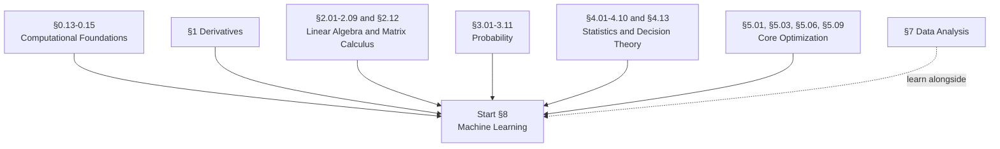

### 8.01 What It Means to Learn
The learning problem stated formally: an unknown distribution, a loss, a hypothesis class, a finite sample. **Empirical risk minimization** and why it is not obviously a good idea. The i.i.d. assumption and every place it breaks. **Inductive bias**, and the claim that learning without it is impossible. The **no free lunch theorem**, stated precisely enough to be useful rather than as a slogan. Bayes-optimal prediction and the Bayes error rate as the reference point (from §4.13). Generalization versus memorization. The taxonomy of paradigms: supervised, unsupervised, semi-supervised, self-supervised, reinforcement, online, active, transfer, multi-task. Approximation error versus estimation error versus optimization error, which is the decomposition that makes the rest of the section legible.

### 8.02 Linear Regression
The model, the squared error objective, and the design matrix. **The normal equations** and their three derivations: calculus, geometry (projection onto the column space, from §2.05), and probability (Gaussian noise plus MLE, from §4.09). Solving it by QR and by SVD rather than by inverting XᵀX, and why. Computational cost. Gradient descent and SGD on the same objective, and when to prefer each. Weighted least squares and heteroscedasticity. **Locally weighted regression / LOESS** as a first nonparametric method. Polynomial regression and basis expansions. Multiple outputs.

### 8.03 Regularization
**Ridge**: the ℓ₂ penalty, the closed form (XᵀX + λI)⁻¹Xᵀy, the derivation as a MAP estimate under a Gaussian prior, shrinkage read in the SVD basis, and effective degrees of freedom. **Lasso**: the ℓ₁ penalty, sparsity explained by the geometry of the ℓ₁ ball, subgradients, soft-thresholding, coordinate descent, LARS, and the regularization path. Model selection consistency and the irrepresentable condition. **Elastic net** and the grouping effect. Structured sparsity: group lasso, fused lasso. **The Bayesian dictionary**: ℓ₂ is a Gaussian prior, ℓ₁ is a Laplace prior, and best-subset is a spike-and-slab. Early stopping as implicit ℓ₂, with the equivalence proved for gradient descent on a quadratic. Choosing λ.

### 8.04 Logistic Regression and Generalized Linear Models
The sigmoid and log-odds. **Cross-entropy loss derived from Bernoulli likelihood** (and again from the KL view in §6.03). Convexity of the objective. The gradient and Hessian; the fact that the gradient is (p − y)ᵀX and why that is so clean. Newton-Raphson and IRLS. Separable data, divergence of the MLE, and why regularization is mandatory rather than optional. **Softmax / multinomial regression**, over-parameterization and identifiability. Generalized linear models as the unifying frame (§4.10), deriving OLS, logistic, softmax, and Poisson regression from one template. Ordinal regression. Calibration of the resulting probabilities.

### 8.05 The Perceptron and Online Learning
The perceptron update rule, and its geometry. **The perceptron mistake bound**: at most (R/γ)² mistakes, stated and proved, because it is the first real generalization-flavored theorem most people meet. Non-separable data. Voted and averaged perceptron. The perceptron as SGD on a hinge-like loss. Online learning more broadly: **regret** as the right notion of success when there is no distribution, online convex optimization, online gradient descent, the weighted majority and Hedge algorithms, and online-to-batch conversion.

### 8.06 Generative Classifiers
The generative-versus-discriminative framing: model p(y|x) directly, or model p(x|y)p(y) and invert. **Naive Bayes**: the conditional independence assumption, Bernoulli, multinomial, and Gaussian variants, **Laplace smoothing**, computation in log space, text classification and the bag-of-words event models. **Gaussian discriminant analysis**: the MLE for the class means, priors, and shared covariance, and the derivation showing that the resulting posterior is *exactly* the logistic sigmoid. That derivation is the cleanest illustration of the tradeoff: GDA makes a stronger assumption, so it is more data-efficient when the assumption holds and worse when it does not. **LDA** (shared covariance, linear boundary) and Fisher's discriminant as a scatter-ratio projection. **QDA** (per-class covariance, quadratic boundary), its O(Kd²) parameter cost, and regularized/shrunken covariance as the fix. Density estimation as its own object: histograms and **kernel density estimation**, bandwidth selection, MISE, and the curse of dimensionality.

### 8.07 Nearest Neighbors
1-NN and k-NN; majority and distance-weighted voting; regression by local averaging. Voronoi decision boundaries. k as a bias-variance dial. **The asymptotic result that 1-NN error is at most twice the Bayes error.** No training and expensive inference, and what that implies about when to use it. **The curse of dimensionality** treated properly: volume concentration, the collapse of relative distance contrast, exponential sample requirements, the empty-space phenomenon. Data structures: k-d trees, ball trees, cover trees, and why they degrade in high dimension; approximate methods (LSH, HNSW) as the practical answer. Nonparametric regression: Nadaraya-Watson kernel regression, local polynomial regression, bandwidth selection.

### 8.08 Decision Trees
Recursive binary partitioning and greedy split search. **Splitting criteria**: Gini impurity, entropy and information gain, classification error, and why the first two are preferred; gain ratio as C4.5's correction for multi-valued-attribute bias; variance reduction for regression trees. **The algorithm lineage**: ID3 (entropy, categorical only, no pruning) → C4.5 (gain ratio, continuous attributes, missing values via fractional instances, error-based pruning) → CART (Gini, binary splits, regression trees, cost-complexity pruning R_α(T) = R(T) + α|T|, surrogate splits). Pre-pruning versus post-pruning. Handling missing values and categorical variables natively. Instability and high variance, which is precisely what motivates §8.09. Interpretability: what a tree does and does not tell you.

### 8.09 Bagging and Random Forests
**Bootstrap aggregating**: the variance-reduction argument, and the formula ρσ² + (1−ρ)σ²/B that shows why decorrelation matters more than count. Out-of-bag error as free validation. **Random forests**: feature subsampling (√d for classification, d/3 for regression) as the decorrelation mechanism. Variable importance: mean decrease in impurity, its bias toward high-cardinality features, and permutation importance as the correction. Proximity matrices. Extremely randomized trees. Why random forests are the default strong baseline on tabular data, and the empirical literature on when they still beat neural networks.

### 8.10 Boosting
Forward stagewise additive modeling as the general frame. **AdaBoost**: the exponential loss, the derivation of the weight update α_t = ½ln((1−ε_t)/ε_t), reweighting, the training-error bound, and the margin-theory explanation for its surprising resistance to overfitting. **Weak learnability implies strong learnability**, which is a genuinely surprising theorem and worth proving. **Gradient boosting**: boosting reinterpreted as gradient descent in function space, pseudo-residuals, shrinkage, subsampling, and tree depth as interaction order. **XGBoost**: the second-order Taylor objective, regularized leaf weights, sparsity-aware split finding, the weighted quantile sketch. **LightGBM**: histogram binning, leaf-wise growth, GOSS, EFB. **CatBoost**: ordered boosting and target statistics. Stacking and blending, with out-of-fold predictions to avoid leakage.

### 8.11 Support Vector Machines
Functional versus geometric margin, and the scale invariance that motivates the normalization. The **hard-margin primal**: minimize ½‖w‖² subject to yᵢ(wᵀxᵢ + b) ≥ 1. **Soft margin**: slack variables, the C parameter, and the equivalence to **hinge loss plus ℓ₂ regularization**, which reframes the SVM as one more regularized empirical risk minimizer. **The dual**, derived using §5.05: the Lagrangian, KKT, complementary slackness, and therefore **what a support vector actually is**. Box constraints; the SMO algorithm. Multi-class strategies: one-versus-rest, one-versus-one, Crammer-Singer. Support vector regression and ε-insensitive loss. The relationship between SVMs and logistic regression, compared on their loss functions.

### 8.12 Kernel Methods
The kernel trick: replacing inner products, and the fact that you never need the feature map. Polynomial, RBF/Gaussian, sigmoid, string, and graph kernels. **Mercer's theorem** and positive semidefinite Gram matrices. Kernel construction rules (sums, products, compositions) so you can build your own. **Reproducing kernel Hilbert spaces**, constructed rather than asserted: the reproducing property, the feature map into function space. **The representer theorem**, proved, because it is what makes the whole approach finite-dimensional and computable. Kernel ridge regression: α = (K + λI)⁻¹y. Kernel PCA, kernel k-means, kernel logistic regression. Scalability: random Fourier features, the Nyström approximation. The connection to infinite-width neural networks (NTK, NNGP) previewed for §11.15.

### 8.13 Gaussian Processes
A prior over functions. Mean and covariance functions; what different kernels imply about smoothness, periodicity, and lengthscale. **The posterior predictive in closed form**, mean and variance, derived from the Gaussian conditioning result in §3.07. The equivalence to kernel ridge regression for the mean. Hyperparameter learning by maximizing the marginal likelihood, and the automatic Occam's razor that produces. The O(n³) cost and the sparse/inducing-point approximations. GP classification and the need for approximate inference. **Bayesian optimization** as the flagship application, tying back to §5.13.

### 8.14 Latent Variable Models and EM
Mixture models: the mixture density, responsibilities, and the identifiability ambiguities. **Gaussian mixture models**: covariance parameterizations (spherical, diagonal, full, tied), the singularity problem when a component collapses onto a point, model selection by BIC. **The EM algorithm**, derived properly: the ELBO via Jensen's inequality, the E-step as computing the posterior over latents, the M-step as weighted MLE, and the proof of monotonic likelihood increase. EM as coordinate ascent on the ELBO, which is the framing that connects it to variational inference in §4.12 and to VAEs in §11.04. Local optima and initialization. EM instances: GMM, Naive Bayes with missing labels, factor analysis, Baum-Welch for HMMs. **Factor analysis**: x = μ + Λz + ε with diagonal noise, EM for FA, the relationship to probabilistic PCA, and rotational indeterminacy. Generalized and variational EM.

### 8.15 Probabilistic Graphical Models
**Bayesian networks**: the DAG factorization, conditional independence, **d-separation**, explaining away, Markov blankets, plate notation. **Markov random fields**: factorization over cliques, potentials, the partition function, the Hammersley-Clifford theorem, Ising and Potts models. **Conditional random fields**, and the HMM-versus-CRF comparison as the canonical generative/discriminative pair for structured output. **Inference**: variable elimination and elimination ordering, treewidth, sum-product belief propagation on trees, the junction tree algorithm, loopy BP, MAP/max-product inference, graph cuts, LP relaxations. **Approximate inference**: sampling (forward, rejection, importance, likelihood weighting, Gibbs, Metropolis-Hastings) and variational methods (mean field, the marginal polytope). **Learning**: MLE with complete data, EM with latent variables, the difficulty of the partition function in undirected models, pseudo-likelihood, contrastive divergence, and structure learning (Chow-Liu, score-based, constraint-based). **HMMs** in full: forward-backward for evaluation, Viterbi for decoding, Baum-Welch for learning; Kalman filters as the continuous analogue. Topic models and LDA. The deeper treatment lives in §14.13.

### 8.16 Statistical Learning Theory
**PAC learning**: realizable and agnostic, the (ε, δ) formulation, sample complexity, proper versus improper learning. The finite hypothesis class bounds, derived from Hoeffding plus a union bound, which is the first honest generalization guarantee and is derivable in half a page. **Uniform convergence** and ε-representative samples. **VC dimension**: shattering, the growth function, the **Sauer-Shelah lemma**, VC dimension of halfspaces, intervals, and axis-aligned rectangles. **The fundamental theorem of statistical learning**: PAC learnability is equivalent to finite VC dimension. The VC generalization bound. **Rademacher complexity**: empirical and expected, Massart's lemma, the contraction lemma, margin bounds, and why it is tighter and data-dependent where VC is not. **Stability**: uniform stability implies generalization; regularization implies stability. **Structural risk minimization**, nonuniform learnability, MDL and Occam bounds (connecting to §6.09). PAC-Bayes. Minimax lower bounds via Le Cam, Fano, and Assouad. Computational hardness of learning: the gap between what is statistically possible and what is efficiently computable.

### 8.17 Bias, Variance, and the Modern Complication
The **bias-variance decomposition** for squared loss, derived in full, and its direct descent from the law of total variance in §3.09. Why the analogue for 0-1 loss is awkward, and what people actually mean when they say it anyway. The classical U-shaped test-error curve, and the classical intuition it encodes. Then the complication: **double descent**, benign overfitting, and interpolating predictors that generalize. Minimum-norm interpolation and the implicit bias of gradient descent toward it. The overparameterized regime and why "more parameters than data" stopped being obviously fatal. What survives from the classical picture and what does not, stated carefully rather than as a claim that the old theory is wrong.

### 8.18 Model Selection and Validation
Train / validation / test, and the discipline of touching test once. **Cross-validation**: hold-out, k-fold, stratified k-fold, leave-one-out (with the closed form for linear models via the hat matrix), leave-p-out, repeated k-fold, grouped/blocked CV, and **time-series CV with forward chaining and no shuffling**. **Nested cross-validation**, and the demonstration of the selection bias you get without it. Hyperparameter search: grid, **random search** and Bergstra-Bengio's low-effective-dimension argument, successive halving, Hyperband, ASHA, Bayesian optimization, population-based training. Information criteria: AIC, BIC, Mallows' Cp, effective degrees of freedom. Learning curves for diagnosing whether you need more data or a different model. Bootstrap-based model assessment, .632 and .632+.

### 8.19 Evaluation Metrics
The confusion matrix and everything derived from it: precision, recall/sensitivity/TPR, specificity/TNR, FPR, F1 and F_β, balanced accuracy, Matthews correlation coefficient, Cohen's κ. **ROC curves and AUC**, with the interpretation as P(score₊ > score₋) and the important property of invariance to class prior. **Precision-recall curves and average precision**, and why they are the right choice under heavy imbalance. Log loss and Brier score, and the Brier decomposition into calibration plus refinement. **Calibration**: reliability diagrams, expected calibration error, Platt scaling, isotonic regression, temperature scaling, and the observation that modern networks are systematically overconfident. Regression metrics: MSE, RMSE, MAE, MAPE and its asymmetry, Huber, R² and adjusted R², residual analysis. Ranking metrics: precision@k, recall@k, MAP, NDCG, MRR. **Class imbalance**: resampling (random over/under, SMOTE, ADASYN, Tomek links), class weighting and cost-sensitive loss, threshold moving, reframing as anomaly detection, and why accuracy is a trap. **Statistical rigor in evaluation**: paired t-tests, McNemar's test, bootstrap confidence intervals on metrics, multiple-comparison correction on leaderboards, and the difference between a real improvement and seed variance.

### 8.20 Practical Machine Learning
Error analysis: looking at the errors, categorizing them, and prioritizing by frequency times cost. Ablative analysis: removing components to find what actually matters. Building the simplest baseline first, and the constant-predictor baseline before that. Diagnosing high bias versus high variance from learning curves and acting accordingly. Ceiling analysis on a pipeline. Debugging a model that trains but does not work. Reproducibility: seeds, environment capture, data versioning, experiment tracking. When not to use machine learning at all. Deployment concerns: training-serving skew, monitoring, drift detection, retraining cadence, shadow deployment, and the fact that the model is the small part of the system.

### 8.21 State-Space and Sequential Models
Latent state, observations, transition models, and emission models as one common language for systems evolving over time. Linear dynamical systems. **The Kalman filter**, derived from Gaussian conditioning, with prediction and correction steps; Kalman smoothing and missing observations. Extended and unscented Kalman filters. Particle filtering and sequential Monte Carlo when Gaussian linearity fails. State estimation versus parameter estimation. **System identification**: learning transition and observation dynamics from data. Switching state-space models. Connections to HMMs in §8.15, classical forecasting in §7.17, control in §14.07, recurrent networks, and modern structured state-space sequence models in §12.12.

### 8.22 Recommender Systems
The recommendation problem as retrieval, ranking, and decision making under selective feedback. Popularity and content-based baselines. User-item matrices, explicit versus implicit feedback, and the meaning of an unobserved interaction. Neighborhood-based collaborative filtering. **Matrix factorization** with biases, regularization, alternating least squares, and Bayesian interpretations. Pairwise and listwise ranking losses, including BPR. Two-tower retrieval, candidate generation, reranking, and hybrid recommenders. Cold start, sparsity, exposure bias, position bias, and feedback loops. Offline metrics (precision@k, recall@k, MAP, NDCG) versus online experiments and long-term outcomes. Exploration and bandit feedback. Fairness, diversity, novelty, serendipity, and the limits of optimizing engagement.

**You should be able to:** derive OLS three ways; derive the lasso solution for orthogonal design and explain sparsity geometrically; derive the logistic regression gradient and Hessian; show that Gaussian discriminant analysis implies a logistic posterior; derive the SVM dual and identify support vectors from complementary slackness; state and prove the representer theorem; derive the EM algorithm and prove monotonic likelihood improvement; derive the GP posterior predictive; prove the finite-hypothesis-class PAC bound; state the Sauer-Shelah lemma and compute the VC dimension of halfspaces; derive the bias-variance decomposition and explain what double descent does to it; implement every core algorithm in this section in NumPy without scikit-learn; design an evaluation for an imbalanced problem and defend every choice; derive and implement a Kalman filter; build and evaluate a matrix-factorization recommender while accounting for exposure bias.

---

## 9. Evolutionary Computation

> Optimization by variation and selection. Search without gradients.

Across every open-source AI curriculum surveyed, evolutionary computation appears as at most one lesson. That is a strange omission for a field that solves problems gradients cannot touch: discrete and combinatorial spaces, non-differentiable objectives, program synthesis, multi-objective tradeoffs, and open-ended search. It is also my research area, so this section goes deeper than the rest of the field usually does.

The organizing frame is Eiben and Smith's component decomposition, which every course reuses: **representation → evaluation → population → parent selection → variation → survivor selection → initialization → termination**. Fix those eight things and you have specified an algorithm.

**Prerequisites:** §3, §5.01, §5.13, §0.08.
**Anchor references:** Eiben & Smith *Introduction to Evolutionary Computing*; Poli, Langdon & McPhee *A Field Guide to Genetic Programming*; Engelbrecht *Computational Intelligence*; Deb *Multi-Objective Optimization using Evolutionary Algorithms*; Koza *Genetic Programming*.

**Prerequisite graph**

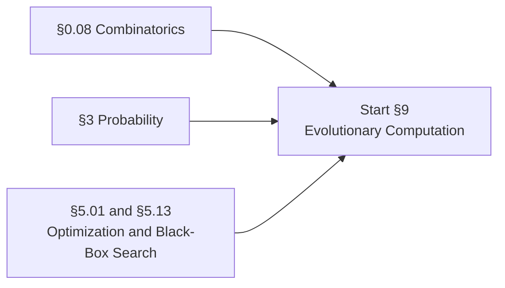

### 9.01 Optimization as Search
The search-space framing: candidate solutions, neighborhoods, objective landscapes. Where gradients are unavailable: discrete spaces, combinatorial structure, non-differentiable and noisy objectives, simulation-based evaluation, program space. Exhaustive search, random search, and hill climbing as baselines. Local search and its local-optimum problem. **Simulated annealing** and tabu search as single-solution metaheuristics, taught here as the comparison baselines the population methods must beat. Why populations help. The exploration-exploitation dilemma stated as the central design tension.

### 9.02 Anatomy of an Evolutionary Algorithm
The generic EA loop. The eight components. **Three distinct spaces**: algorithmic space, genotype space, and phenotype/solution space, and the mappings between them. Generational versus steady-state models; generational gap. Selection pressure and takeover time. Termination criteria. Anytime behavior and the shape of the progress curve. The distinction between the algorithm and the metaphor, which is worth establishing early given how much of this literature is metaphor-first.

### 9.03 Representation
**Binary**: bit strings, cardinality choices, **Gray coding** and Hamming cliffs. **Integer**: ordinal versus cardinal attributes. **Real-valued**: bounds handling, precision versus binary encoding. **Permutation**: order-based versus adjacency-based problems (scheduling versus TSP), and why standard crossover produces invalid offspring. **Tree** (for genetic programming): function set, terminal set, closure, sufficiency, strong typing. **Graph**: Cartesian GP grids, NEAT genomes, architecture encodings. **Variable-length and indirect/developmental encodings**: grammars, L-systems, generative encodings, CPPNs. The genotype-phenotype mapping and what it buys you. The design rule that operators must match the representation.

### 9.04 Fitness and Selection
Objective versus fitness. Fitness scaling: linear, sigma truncation, power law. Ranking transformations. Noisy and stochastic fitness. Surrogate and approximate fitness models for expensive evaluations. **Parent selection**: fitness-proportional (roulette wheel) and its pathologies (premature convergence, loss of selection pressure late, sensitivity to fitness transposition), stochastic universal sampling, linear and exponential ranking, **tournament selection** with tournament size as the selection-pressure knob, uniform selection. **Survivor selection / replacement**: age-based, fitness-based, elitism, delete-worst, round-robin tournament, **(μ+λ) versus (μ,λ)** and what each implies about escaping local optima.

### 9.05 Variation Operators
**Crossover**: one-point, k-point, uniform; positional versus distributional bias; arithmetic, whole-arithmetic, and simple arithmetic recombination; blend crossover (BLX-α); **simulated binary crossover (SBX)**; discrete versus intermediate recombination; multi-parent operators (diagonal crossover, scanning); permutation operators (**PMX, order crossover, cycle crossover, edge recombination**). **Mutation**: bit-flip, random reset, creep, uniform and non-uniform Gaussian, polynomial mutation, Cauchy mutation (and its heavier tail), swap, insert, scramble, inversion. Operator design principles: locality, heritability, respect, and assortment. Mutation rate and crossover rate as the two most consequential parameters.

### 9.06 Population Dynamics and Diversity
Exploration versus exploitation, made concrete. Selection pressure versus population diversity as a tradeoff you tune. Genetic drift. **Premature convergence** and how to detect it: allele frequency, population entropy, pairwise distance statistics. Takeover time analysis. **Diversity maintenance**: island/multi-population models (migration topology, epoch length, migration rate, migrant selection), diffusion and cellular models with spatial neighborhoods, **explicit fitness sharing** with a sharing radius, **crowding** and deterministic crowding, restricted tournament selection, clearing, **NEAT-style speciation** with a compatibility distance. Multimodal optimization and niching.

### 9.07 Genetic Algorithms
The simple GA in full. Historical framing: Holland, and what the field thought it was doing. Variants: steady-state GA, messy GA, CHC, linkage tree GA, gene-pool optimal mixing. Parameter setting: **parameter tuning versus parameter control** (deterministic, adaptive, self-adaptive), and the honest observation that most published parameter values are folklore. Hybridization with local search. Implementation from scratch on a set of standard problems: OneMax, knapsack, TSP, and a real-valued benchmark suite.

### 9.08 Evolution Strategies
(1+1)-ES and the **1/5th success rule**, with its derivation from progress-rate analysis. (μ+λ) and (μ,λ) strategies. **Self-adaptation**: one step size, n step sizes, and correlated mutations with rotation angles, where the strategy parameters evolve alongside the solution. Derandomization. **CMA-ES** in detail: the covariance matrix adaptation, evolution paths, step-size control, and the rank-one and rank-μ updates. Why CMA-ES is the strongest general-purpose black-box optimizer for moderate dimensions and how it relates to natural gradient. Natural evolution strategies. Separable and limited-memory variants for high dimension. Restart strategies (IPOP, BIPOP).

### 9.09 Differential Evolution and Estimation of Distribution Algorithms
**Differential Evolution**: the difference-vector mutation that makes it work, the DE/x/y/z notation, mutation strategies (rand/1, best/1, current-to-best/1, rand/2, best/2), binomial versus exponential crossover, the F and CR parameters, and adaptive variants (jDE, SaDE, JADE, SHADE, L-SHADE). **Estimation of Distribution Algorithms**: replacing variation operators with a learned probabilistic model. UMDA, PBIL, compact GA. Model building with dependencies: MIMIC, BMDA, ECGA, BOA and hBOA. **Linkage learning** and why it is the central problem. PIPE for program trees. The conceptual link between EDAs and variational methods.

### 9.10 Genetic Programming
Evolving programs rather than parameter vectors. Tree-based GP: initialization by **full, grow, and ramped half-and-half**; depth and size limits. Subtree crossover with the 90/10 internal-node bias, subtree mutation, point mutation, hoist, shrink, one-point and uniform crossover, size-fair and homologous crossover. The preparatory steps: terminal set, function set, fitness measure, control parameters, termination. Closure and protected operators; ephemeral random constants. **Symbolic regression** as the flagship task, with modern comparisons to SINDy, PySR, and neural symbolic regression, plus SRBench as the benchmark.

### 9.11 Bloat, Modularity, and Semantics
**Bloat**: what it is, and the competing explanations (removal bias, the nature of program search spaces, crossover bias). Control methods: size and depth limits, parsimony pressure (parametric and lexicographic), the Tarpeian method, double tournament, operator equalisation, treating size as an explicit second objective. **Modularity**: automatically defined functions, architecture-altering operations, module acquisition. **Grammar-based GP**: strongly typed GP, grammar-guided GP, **grammatical evolution** with its genotype-phenotype mapping, wrapping, and degeneracy. **Alternative representations**: linear GP with registers and the intron/effective-code distinction, **Cartesian GP** with its node grid, levels-back parameter, and neutral drift, self-modifying CGP, PushGP and stack-based autoconstruction, graph GP. **Semantic GP**: semantic-aware operators, geometric semantic GP and its cone landscape, semantic backpropagation, behavioural program synthesis.

### 9.12 Multi-Objective Optimization
Multiple conflicting objectives; decision space versus objective space. **Pareto dominance**, weak and strict and ε-dominance; the Pareto-optimal set and the Pareto front; ideal, nadir, and utopian points. Convergence and diversity as the two simultaneous goals. Classical baselines and their failures: the weighted sum (and its inability to reach non-convex parts of the front), ε-constraint, goal programming, Tchebycheff scalarization. **Algorithms**: VEGA as the non-elitist historical baseline; MOGA, NPGA, NSGA; **NSGA-II** with fast non-dominated sorting, crowding distance, and constrained dominance; **SPEA2** with strength fitness and archive truncation; PAES; **MOEA/D** and decomposition into scalar subproblems with neighborhood mating; indicator-based methods (IBEA, SMS-EMOA using hypervolume contribution); **NSGA-III** and reference points for many-objective problems; RVEA. Dominance resistance and the curse of dimensionality in objective space. **Performance assessment**: hypervolume and its reference-point sensitivity, IGD and IGD+, generational distance, spread and spacing, the ε-indicator, attainment surfaces. Benchmarks: ZDT, DTLZ, WFG. Preference articulation: a priori, interactive, and a posteriori. Visualizing many-objective fronts.

### 9.13 Constraint Handling
The distinction between free optimization, constraint satisfaction, and constrained optimization. Penalty functions: static, dynamic, adaptive, and the death penalty. Repair operators. Decoders. Feasibility-preserving operators. **Stochastic ranking.** ε-constrained methods. Treating constraint violation as an additional objective. Deb's feasibility rules. The general lesson that constraint handling is a design decision with real consequences and not an afterthought.

### 9.14 Coevolution
**Cooperative coevolution**: decomposing a problem into species, the credit assignment problem, and pathologies like relative overgeneralization. **Competitive coevolution**: host-parasite dynamics, arms races, Red Queen effects, and the three failure modes (intransitivity/cycling, disengagement, forgetting). Solution concepts and archives: Nash memory, IPCA and LAPCA, Hall of Fame. Fitness sampling. Why coevolutionary fitness is subjective and what that breaks about your usual progress metrics. The connection to GAN training dynamics, which is a competitive coevolutionary system whether or not its literature calls it that.

### 9.15 Neuroevolution
Evolving neural networks: weights, topologies, or both. Fixed-topology weight evolution. **The competing conventions problem** and why naive crossover of networks fails. **NEAT**: historical markings to align genomes, speciation by compatibility distance to protect innovation, and complexification from a minimal starting structure. **HyperNEAT**: CPPN indirect encoding, substrate geometry, and exploiting regularity; ES-HyperNEAT. CoSyNE, SANE, ESP. **Evolution strategies as a scalable alternative to reinforcement learning** (Salimans et al.), including the shared-random-seed trick that makes it parallelize almost perfectly, and the honest comparison to policy gradients. Deep GA on Atari. **Weight agnostic neural networks.** Neural architecture search by evolution (AmoebaNet, regularized evolution). Evolving plastic and Hebbian networks. Direct versus indirect encoding tradeoffs.

### 9.16 Novelty Search and Quality-Diversity
**The deception argument**: objectives can actively mislead search, and the objective function is not always your friend. **Novelty search**: behaviour characterization, behaviour space, the novelty archive, k-NN sparseness as the metric. Novelty search with local competition. **Quality-Diversity**: illumination rather than optimization. **MAP-Elites**: behaviour descriptors, archive discretization, and the elite grid. CVT-MAP-Elites, ME-ES, CMA-ME. QD-score and coverage as metrics. Applications: damage recovery in robots, procedural content generation, design exploration. AURORA and unsupervised descriptor discovery. **Open-endedness**: POET and the co-generation of environments with agents, minimal criterion coevolution, innovation engines, and what it would mean for a search process to never converge on purpose.

### 9.17 Genetic Improvement
Evolving *existing* software rather than growing it from nothing. Patch representation and the search space of edits. **Automated program repair**: GenProg and its descendants, test suites as fitness, and the weak-oracle/overfitting problem that follows from that. Improving non-functional properties: runtime, energy, memory footprint. Code transplantation. Deep parameter optimization. The relationship to modern LLM-based code repair, and what each approach has that the other does not.

### 9.18 Theory and Fitness Landscapes
**Fitness landscapes**: ruggedness, correlation length, neutrality and neutral networks, epistasis (and its measurement), deception, NK and NKC landscapes, Royal Road functions, deceptive trap functions, local optima networks. **The schema theorem**: schema order, defining length, disruption by crossover and mutation, Holland's formulation, and implicit parallelism. **The building block hypothesis** and the serious critiques of it. Walsh analysis. Gene linkage. Dynamical systems and the Vose model. Markov chain analysis of EAs. Statistical mechanics approaches. **Runtime analysis**: drift analysis, the fitness-level method, and rigorous bounds for simple EAs on simple problems. Convergence in continuous spaces: progress rate, and the derivation of the 1/5 success rule. **The no free lunch theorems**, stated precisely, along with a careful account of their actual scope and the ways they are routinely overclaimed.

### 9.19 Experimental Methodology
Routinely undertaught, and given a full chapter by Eiben and Smith for good reason. Deciding what you want the algorithm to do: peak versus average performance, speed versus quality. **Performance measures**: success rate, mean best fitness, average evaluations to solution, run-time distributions, ECDF and anytime behaviour. **Statistical testing**: non-parametric tests, Wilcoxon signed-rank, Friedman with post-hoc, Bonferroni-Holm correction, effect sizes, and multiple-comparison discipline (§4.07 again). **Benchmark suites**: BBOB/COCO, CEC competitions, Nevergrad, IOHprofiler. Automated algorithm configuration: irace, SMAC, SPOT, REVAC. Per-instance algorithm selection. Reproducibility, and a frank survey of bad practice in the published literature.

### 9.20 Related Population Methods
Memetic algorithms: embedding local search, **Lamarckian versus Baldwinian** learning, choosing the depth, frequency, and targets of local search, self-adaptive memes. **Learning classifier systems**: Michigan versus Pittsburgh style, ZCS, **XCS** with accuracy-based fitness, niche GA, covering, and subsumption; credit assignment via bucket brigade or Q-learning-style updates. Cultural algorithms. Artificial immune systems: clonal selection, negative selection, immune networks. Where these sit relative to reinforcement learning, and the historical reasons the fields diverged.

**You should be able to:** specify a complete EA by naming all eight components; implement a GA, an ES with self-adaptation, CMA-ES, and DE from scratch and benchmark them on a standard suite; explain why roulette-wheel selection fails and what replaces it; implement tree-based GP with bloat control and solve a symbolic regression problem; implement NSGA-II and compute hypervolume; explain the competing conventions problem and how NEAT solves it; state the no free lunch theorem precisely and explain what it does not say; design an empirical comparison of two EAs with correct statistics; explain the connection between CMA-ES and natural gradient, and between competitive coevolution and GAN training.

---

## 10. Neural Networks

> Learning representations through composed differentiable transformations.

Every serious deep learning course follows one of three orderings, and the choice matters more than the topic list. Bottom-up (CS231n, CMU 11-785, Michigan EECS 498) goes linear classifier → loss → optimizer → MLP → backprop → everything. Theory-first (MIT 6.7960, NYU) does approximation theory and generalization theory before most architectures. Top-down (fast.ai) trains a working model in week one and peels back layers. This curriculum uses **bottom-up as the spine**, inserts the theory lectures as "why does this work" interludes, and borrows the top-down discipline of building each primitive in code before using the framework version.

**Prerequisites:** §0.13, §1.09, §2.01 through §2.13, §3.01 through §3.07, §5.06, §5.09, §5.10, §6.03, and the learning setup and linear-model material in §8.01 through §8.05. The rest of §8 is useful context, not a gate.
**Anchor references:** Stanford CS231n and CS230, CMU 11-785, MIT 6.S191 and 6.7960, Berkeley CS182/282A, Michigan EECS 498, NYU DS-GA 1008; Goodfellow, Bengio & Courville *Deep Learning*; Zhang et al. *Dive into Deep Learning*; Prince *Understanding Deep Learning*; Karpathy *Neural Networks: Zero to Hero*.

**Prerequisite graph**

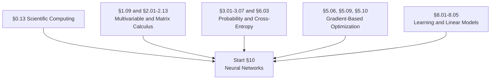

### 10.01 The Perceptron and Its Limits
McCulloch-Pitts neurons, the Rosenblatt perceptron, Hebbian learning, read in the original papers because the history clarifies the ideas. The perceptron learning algorithm and its convergence proof (from §8.05). **The Minsky-Papert XOR limitation**, and constructing by hand the two-hidden-unit network that resolves it. Threshold logic and neural networks as Boolean circuits. Size versus depth complexity of circuits, which is the first hint that depth buys something.

### 10.02 Multilayer Networks and Universal Approximation
The multilayer perceptron: affine layers composed with pointwise nonlinearities. Why the nonlinearity is mandatory (a composition of affine maps is affine). **The universal approximation theorem**: statement, proof sketch by bump-function construction, and the two crucial caveats, that it guarantees existence rather than learnability and says nothing about the required width. **Depth versus width**: exponential gains from depth, and counting the linear regions a shallow versus deep ReLU network can carve. Feature transforms and what a hidden layer is doing geometrically. What you give up in exchange for expressiveness: convexity.

### 10.03 Activation Functions
Not a table to memorize but a sequence of fixes, each responding to a specific failure. Step (non-differentiable, so no gradient learning). **Sigmoid** (smooth, probabilistic, but saturating with |σ′| ≤ 0.25, which means a ten-layer sigmoid network has gradients around 4⁻¹⁰; also not zero-centered, which causes zig-zag updates). **tanh** (zero-centered, still saturating). **ReLU** (no positive saturation, roughly 6× faster convergence in AlexNet, trivially cheap; but dying units and not zero-centered). **Leaky ReLU** and **PReLU** (fixed and learned negative slope). **ELU** and **SELU** (smooth negative saturation, self-normalizing). **GELU** (x·Φ(x), the transformer default). **SiLU/Swish** (found by architecture search, non-monotone). **GLU and SwiGLU** (gated variants that dominate modern transformer feedforward blocks). **Softmax** as a normalized output layer rather than a hidden activation, paired with cross-entropy, with the log-sum-exp stabilization. Maxout. Diagnosing activation problems from histograms.

### 10.04 Loss Functions
**The unifying principle, taught first: many standard predictive losses are negative log-likelihoods under an assumed output distribution.** Gaussian gives MSE. Laplace gives MAE. Bernoulli gives binary cross-entropy. Categorical gives cross-entropy. That probabilistic view is powerful, but it does not naturally account for every objective: hinge, ranking, triplet, Dice, and IoU losses arise from other design principles. MSE and its quadratic outlier penalty. MAE and its constant-magnitude gradient. **Huber / smooth-L1** and why bounding-box regression uses it. Binary cross-entropy with logits, in the numerically stable form. **Categorical cross-entropy**, its equivalence to KL(p_data ‖ p_model) up to a constant, and the beautifully clean gradient (p − y). Label smoothing. **Hinge loss** and the margin-based versus probabilistic contrast. Contrastive and triplet losses; anchor, positive, negative; hard-negative mining. **InfoNCE / NT-Xent** and its temperature. **Focal loss** and the (1−p)^γ down-weighting that makes extreme imbalance trainable. CTC loss for alignment-free sequence learning. Dice and IoU for segmentation. Perceptual loss. Which losses have vanishing-gradient pathologies when paired with which output activations.

### 10.05 Forward Propagation
The layer as a function; the network as a composition. Shapes and shape arithmetic at every step, done explicitly, because shape errors are the dominant bug class. Batching and why it exists (hardware throughput, and gradient variance). Parameters versus activations versus buffers. Counting parameters and counting FLOPs for a given architecture, which is a skill that pays off constantly later.

### 10.06 Backpropagation
The most emphasized topic in every course surveyed, and correctly so. **Computational graphs**: nodes as operations, edges as tensors, the forward pass caching intermediates. **Local gradients and the circuit view**: each gate needs only its local derivative and the upstream gradient. The canonical gradient-flow patterns: the add gate distributes, the max gate routes, the multiply gate switches. **Forward mode versus reverse mode** revisited from §2.13, with the cost argument made concrete: the loss is a scalar, so reverse mode wins, and that is the entire reason backprop looks the way it does. **Matrix and tensor backprop**: deriving ∂L/∂W for a linear layer and getting every transpose right. **Deriving backprop by hand** through a full stack (cross-entropy → linear → tanh → batchnorm → linear → embedding) with no autograd, which is the single best exercise in the section. Vanishing and exploding gradients as a product of Jacobians, with the spectral-radius argument. Gradient checking to a relative error under 1e-7.

### 10.07 Building an Autograd Engine
Implementation module. A scalar reverse-mode engine from nothing: `Value` objects, operation overloading, local backward closures, topological sort, gradient accumulation. Then generalize to tensors: broadcasting in the backward pass, reductions, in-place operations and why they break the tape. Then use it: build and train an MLP with only your own engine. Then compare against PyTorch autograd and read what the framework actually does. This module is where §2.13 becomes something you own rather than something you have read about.

### 10.08 Initialization
Why it matters: symmetry breaking (all-zeros means every unit computes the same thing forever) and variance preservation through depth. **The variance calculation**: Var(out) = n_in · Var(w) · Var(x), so Var(w) = 1/n_in preserves forward variance. **Xavier/Glorot**: 2/(n_in + n_out), derived to preserve both forward activations and backward gradients, assuming a linear or tanh regime. **He/Kaiming**: 2/n_in, where the factor of two compensates for ReLU zeroing half the units, and which is what made very deep ReLU networks trainable at all. Orthogonal initialization for recurrent matrices. LSUV, Fixup, T-Fixup, and the idea of initializing so well you can drop normalization. Bias conventions: zeros generally, LSTM forget-gate bias at 1, final-layer bias set to log-priors for imbalanced classification. Diagnostics: per-layer activation standard deviations and gradient-to-weight ratios.

### 10.09 Normalization
**BatchNorm** (normalizing over N, H, W per channel), **LayerNorm** (over C, H, W per sample), **GroupNorm**, **InstanceNorm**, **RMSNorm** (no mean subtraction, cheaper, and what LLaMA-class models use), **WeightNorm**. Where each dominates and why. Train versus eval mode and the running-statistics bug everyone hits once. Why BatchNorm creates a dependency between examples in a batch, and the consequences. **The internal covariate shift story and its refutation**: the better explanation is that it smooths the loss landscape and decouples weight magnitude from direction. BatchNorm as an implicit regularizer, and its bad interaction with dropout. **Pre-LN versus Post-LN** placement in transformers, and why Pre-LN improves initialization stability and can reduce or eliminate warmup in some regimes without doing so universally.

### 10.10 Regularization
The full catalogue, with the mechanism in each case. Parameter norm penalties and their reading as constrained optimization. **Dropout**: Bernoulli masking, inverted dropout, the ensemble-of-subnetworks interpretation, and why it interacts badly with BatchNorm. **Weight decay versus ℓ₂**, identical for SGD and different for Adam, hence AdamW. Label smoothing and its effect on calibration. **Data augmentation** as the highest-leverage regularizer in vision; RandAugment, AutoAugment. **Mixup and CutMix** as vicinal risk minimization. Stochastic depth. Early stopping and its equivalence to ℓ₂ for quadratic objectives. Noise robustness: input noise, weight noise. Parameter tying and sharing. Adversarial training. **Implicit regularization**: SGD noise itself, and the fact that overparameterized networks trained to zero training error still generalize, which is where §8.17's double descent comes back.

### 10.11 Optimization in Practice
Everything from §5.09 and §5.10, now applied. Neural-network loss surfaces contain symmetries, saddles, flat regions, cliffs, poor conditioning, and many solutions of comparable empirical quality; which obstacle dominates depends on the architecture and regime. Momentum and Nesterov, with the physical analogy and the "why momentum really works" picture. The adaptive family in practice. **Learning rate schedules** and the fact that the schedule often matters more than the optimizer. Warmup, and why it is often useful with Adam and LayerNorm transformers even though some stable configurations can reduce or remove it. Gradient clipping. **Batch size effects**: the linear scaling rule, critical batch size, the large-batch generalization gap, gradient accumulation. Second-order methods and why they are rare here. Hyperparameter tuning strategy: what to tune first, and what almost never matters.

### 10.12 Convolutional Networks
**Convolution as a learned linear layer with structure**: sparse interactions, parameter sharing, and translation equivariance, which is the inductive bias made explicit. Cross-correlation versus true convolution and the naming confusion. Kernels and filters; multi-channel input and output; stride; padding (valid and same); **dilation**; output-size arithmetic. **Receptive field** growth, and the difference between theoretical and effective receptive field. 1×1 convolutions as channel mixing. Grouped and **depthwise separable** convolution and its parameter savings. Transposed convolution and upsampling, plus the checkerboard artifact. Pooling (max, average, global average) and **pooling as an infinitely strong prior**. Implementing convolution directly, then via im2col, then understanding why cuDNN is faster.

### 10.13 CNN Architectures as History
Taught as a sequence of problems and responses, because that is how the ideas make sense. LeNet-5 (1998). **AlexNet** (2012: ReLU, dropout, GPUs, ImageNet). ZFNet (visualization-driven tuning). **VGG** (uniform 3×3 stacks). Network-in-Network (1×1 convolutions, global average pooling). **GoogLeNet/Inception** (multi-branch, bottlenecks, auxiliary heads). **ResNet**: residual connections and identity mappings, solving *degradation* rather than merely vanishing gradients, with all four explanations of why it works (gradient highway, identity is easy to learn, ensemble of shallow paths, shattered gradients). ResNeXt (cardinality). DenseNet (feature reuse). SENet (channel attention). MobileNet and ShuffleNet (efficiency). NAS and EfficientNet (compound scaling). RegNet and ConvNeXt (design spaces, and modernized ResNets that match transformers). **Transfer learning**: feature extraction versus fine-tuning, which layers to freeze, the small/large dataset × similar/different domain decision matrix, discriminative learning rates. **Detection**: bounding boxes, IoU, non-max suppression, mAP, anchor boxes; R-CNN → Fast R-CNN (RoI pooling) → Faster R-CNN (RPN) → Mask R-CNN (RoIAlign); YOLO, SSD, RetinaNet, FCOS; feature pyramid networks; DETR and set prediction with Hungarian matching. **Segmentation**: semantic versus instance versus panoptic; FCN, U-Net, DeepLab with dilated convolution and ASPP.

### 10.14 Recurrent Networks
The recurrence h_t = f(Wh_{t−1} + Ux_t + b). **Unfolding the computational graph** and parameter sharing across time. **Backpropagation through time** and truncated BPTT. **The vanishing and exploding gradient problem**, with the product-of-Jacobians proof, read in the original Bengio and Pascanu papers. Stacked and bidirectional RNNs, and why bidirectional cannot be used causally. Gradient clipping as the practical necessity it is here.

### 10.15 LSTM and GRU
**LSTM at gate-level detail**: forget gate, input gate, candidate cell, cell state, output gate, worked through by hand. **The additive cell update as a constant error carousel**, and exactly why it gives an uninterrupted gradient path where the multiplicative RNN update does not. Peephole variants. **GRU**: update and reset gates, the parameter savings, the empirical parity with LSTM. Implementing both from scratch and verifying against a reference. Why these architectures are historically essential and mostly superseded, which is worth saying plainly.

### 10.16 Sequence to Sequence and the Road to Attention
Encoder-decoder architectures. **The fixed-size context vector bottleneck**, which is the problem that produced attention. Teacher forcing and exposure bias. Greedy decoding and **beam search**, with length normalization. **Attention as a bolt-on to RNNs**: Bahdanau (additive) and Luong (multiplicative) attention as a learned soft alignment that removes the bottleneck, with attention weights visualized as alignments. This is the direct historical bridge to §12, and teaching it in order makes the transformer feel inevitable rather than arbitrary. CTC as the alignment-free alternative.

### 10.17 Embeddings and Representation Learning
The distributional hypothesis. Count-based baselines: co-occurrence matrices, PPMI, truncated SVD / latent semantic analysis. **word2vec**: skip-gram and CBOW objectives, the softmax denominator problem, **negative sampling** (including the U(w)^0.75 noise distribution and why that exponent), hierarchical softmax, subsampling of frequent words. **GloVe**: weighted least squares on log co-occurrence counts, bridging count-based and predictive methods. **fastText** and subword embeddings for out-of-vocabulary and morphologically rich languages. **Embedding geometry**: cosine similarity, analogy arithmetic and its known limitations, anisotropy, dimensionality choice. Intrinsic versus extrinsic evaluation. Bias in embeddings, measurement (WEAT), and debiasing attempts. Contextual embeddings and why static embeddings fail on polysemy, which sets up §12. Representation learning generally: distributed representations, greedy layer-wise pretraining as history, and the reconstruction-based versus similarity-based split.

### 10.18 Debugging Neural Networks
A real module, not an appendix. The systematic recipe: overfit a single batch first, then a tiny dataset, then scale. Verifying the data pipeline before blaming the model. Gradient checking. Monitoring: loss curves, per-layer activation statistics, gradient norms and gradient-to-weight ratios, dead unit fraction, weight update magnitudes. Diagnosing from symptoms: loss not decreasing, loss going to NaN, training loss decreasing while validation does not, sudden loss spikes, the model predicting one class. Common bugs: wrong loss reduction, forgetting `model.eval()`, label misalignment, shuffling the wrong axis, normalization statistics computed on the wrong split, a learning rate off by an order of magnitude. Reproducibility and seeds, and why exact reproducibility is harder than it looks on GPUs.

**You should be able to:** prove the perceptron convergence theorem and construct the XOR network by hand; derive dσ/dx and show why deep sigmoid networks have vanishing gradients; derive the softmax cross-entropy gradient and get (p − y); derive backprop through a full stack including BatchNorm without autograd; implement reverse-mode autodiff and train an MLP with only your own engine; derive the He initialization variance from first principles; explain what BatchNorm actually does, including why the original explanation was wrong; implement convolution, pooling, and their backward passes; implement an LSTM cell from scratch and explain the constant error carousel; implement word2vec with negative sampling; take a network that trains but does not work and systematically find out why.

---

## 11. Deep Learning

> What changes when you go deep, wide, and generative.

**Prerequisites:** §10.
**Anchor references:** Goodfellow et al.; Prince *Understanding Deep Learning*; d2l.ai; MIT 6.7960; Stanford CS231n; Berkeley CS182/282A; fast.ai Part 2.

**Prerequisite graph**

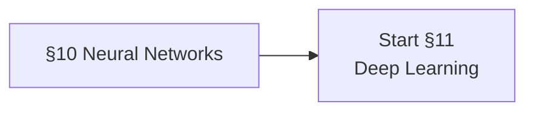

### 11.01 What Makes It Deep
The empirical case for depth, and the theoretical results that partially explain it. Hierarchical feature composition, demonstrated by looking at what layers learn. Approximation theory: depth-separation results, the curse of dimensionality and how structure defeats it. The three-way split that organizes deep learning theory: **approximation** (can the architecture represent it), **optimization** (can SGD find it), **generalization** (does it transfer). Architectures grouped by the symmetry they encode: grids (convolution, translation), sequences (recurrence and attention), sets (permutation invariance, DeepSets), graphs (§11.12). Geometric deep learning as the unifying frame.

### 11.02 Residual Connections and Trainable Depth
Its own module because it is the single architectural idea that unlocked everything after 2015. The degradation problem, which is not the vanishing gradient problem. Identity mappings and pre-activation ResNets. The residual stream as a shared communication bus, which is the reading that matters for §12 and for interpretability in §14.16. Shattered gradients. Highway networks as the predecessor. Why residual connections plus normalization is the pairing that makes 100-plus-layer networks trainable, and what happens when you remove either one.

### 11.03 Autoencoders
Undercomplete autoencoders and the bottleneck; the equivalence to PCA in the linear-plus-MSE case, proved. **Denoising autoencoders**: corrupt and reconstruct, and the interpretation that the model learns a vector field pointing toward the data manifold, which is the direct conceptual ancestor of diffusion. Sparse autoencoders with ℓ₁ or KL sparsity penalties (which return in §14.16 as the main tool of mechanistic interpretability). **Contractive autoencoders** and the Frobenius penalty on the encoder Jacobian. Stochastic encoders and decoders. Learning manifolds. Applications and their limits.

### 11.04 Variational Autoencoders
The latent variable model p(x) = ∫p(x|z)p(z)dz, and why the posterior is intractable. Variational approximation q(z|x). **The ELBO derived two ways**: from Jensen's inequality, and from the KL decomposition log p(x) = ELBO + KL(q‖p), which makes the gap explicit. The reconstruction-minus-KL reading, and the rate-distortion reading from §6.08. **The reparameterization trick** z = μ + σ⊙ε, and precisely why it is necessary (you cannot backpropagate through a sampling node) and why it works. Amortized inference. Posterior collapse and its causes. β-VAE and the disentanglement claim, with the replication caveats. VQ-VAE and discrete latents, which matter for multimodal models later. Deriving the VAE from probabilistic graphical model first principles, as Stanford CS228 does, rather than presenting it as an architecture.

### 11.05 Generative Adversarial Networks
Generator and discriminator; the minimax objective. **The optimal discriminator D* = p_data/(p_data + p_g)** and the derivation showing the resulting objective is Jensen-Shannon divergence, which is the moment GANs connect to §6.10. The non-saturating generator loss and why the original one fails early in training. Training instability, oscillation, and **mode collapse**. DCGAN architectural guidelines. Conditional GANs. **WGAN**: the Earth-mover distance, why it behaves better when supports do not overlap, the Lipschitz constraint, weight clipping and its replacement by the gradient penalty. Progressive GAN. **StyleGAN**: the mapping network, AdaIN, style mixing, and what the latent space looks like. pix2pix and CycleGAN. Evaluation: Inception Score, FID, precision and recall for generative models, and the known problems with all of them. GAN training viewed as competitive coevolution, connecting back to §9.14.

### 11.06 Normalizing Flows
The change-of-variables formula from §1.11 and §3.08, now doing real work. The log-determinant of the Jacobian as the cost you have to pay, and the architectural constraint that follows: invertibility plus a tractable determinant. Coupling layers (NICE, RealNVP). Autoregressive flows: MAF and IAF, and the sampling-versus-density-evaluation asymmetry between them. Planar and radial flows. Invertible 1×1 convolutions (Glow). **Continuous normalizing flows** and neural ODEs, with the instantaneous change-of-variables formula using tr(∂f/∂z), which is where the divergence from §1.12 finally pays off. The exact-likelihood advantage and the expressiveness cost.

### 11.07 Diffusion Models
**The forward process**: a fixed Gaussian Markov chain, and the closed form for q(x_t | x_0) that makes training tractable. **The reverse process** and the parameterization of the denoiser. **The ε-prediction reparameterization** and the resulting simplified loss, derived from the variational bound rather than asserted. DDPM. **DDIM** and deterministic sampling with fewer steps. **The score-based / SDE view**: score matching, denoising score matching, Langevin dynamics, the forward and reverse SDEs, and the probability-flow ODE that connects diffusion to continuous normalizing flows. Classifier guidance and **classifier-free guidance**. Noise schedules and their effect. The U-Net plus time-embedding backbone, and the newer transformer backbones. Latent diffusion. Consistency models and distillation for few-step sampling. The through-line worth stating: denoising autoencoders (§11.03), score matching (§6.10), Langevin dynamics (§3.12), and diffusion are all the same idea approached from four directions.

### 11.08 Energy-Based Models
The NYU organizing framework, which is a genuinely different and useful lens. Energy functions and unnormalized densities. **The partition function problem**, which is the reason this family is hard. Shaping the energy: contrastive methods (push down on data, push up elsewhere) versus architectural/regularized methods. Latent-variable EBMs. Inference as energy minimization. Algorithms: contrastive divergence, persistent CD / stochastic maximum likelihood, pseudolikelihood, **score matching**, denoising score matching, noise-contrastive estimation. Restricted Boltzmann machines, deep belief networks, deep Boltzmann machines, treated as history that explains why the field looks the way it does. The unifying observation that most generative models are special cases of energy shaping.

### 11.09 Autoregressive Generative Models
The chain rule of probability as a modeling strategy: p(x) = ∏p(xᵢ | x_{<i}). Exact likelihood, sequential sampling, and the tradeoff between them. PixelRNN and PixelCNN with masked convolutions. WaveNet and dilated causal convolutions. Why this family scales to text so well and why the GPT line is exactly this idea, which makes §13 a continuation rather than a new topic. Teacher forcing at training time versus sequential generation at inference time, and the exposure bias that creates.

### 11.10 Self-Supervised Learning
**Pretext tasks** as the first generation: rotation prediction, jigsaw puzzles, relative patch position, colorization, inpainting. **Contrastive methods**: InfoNCE (and its status as a mutual information bound, from §6.02); **SimCLR** (augmentation composition, the projection head, large batches, temperature); **MoCo** (momentum encoder plus queue, decoupling negatives from batch size); CPC. **Non-contrastive methods** that avoid negatives entirely: **BYOL** (online and target networks, predictor, stop-gradient), SimSiam, Barlow Twins and VICReg (redundancy reduction, variance-invariance-covariance). Clustering-based: DeepCluster, SwAV, **DINO** and its emergent attention-based segmentation. **Masked modeling**: BERT-style masked language modeling, **MAE** with its high mask ratio and asymmetric encoder-decoder, BEiT, SimMIM. **CLIP** and image-text contrastive learning, with zero-shot classification via prompt engineering. Theory: alignment and uniformity on the hypersphere, why representational collapse happens, and what each method does to prevent it. JEPA and joint-embedding predictive architectures.

### 11.11 Transfer Learning and Adaptation
Pretraining and fine-tuning as the dominant paradigm and why it works. Feature extraction versus full fine-tuning versus partial unfreezing. Catastrophic forgetting and mitigation. Domain adaptation: covariate shift, importance weighting, domain-adversarial training, test-time adaptation. Few-shot and zero-shot learning. Meta-learning: MAML, prototypical networks, and the learning-to-learn framing. Multi-task learning: hard and soft parameter sharing, task weighting, gradient conflict and surgery. Continual learning: replay, regularization-based methods (EWC), architectural methods. Knowledge distillation: the teacher-student setup, temperature, dark knowledge, and why a smaller model trained on soft targets beats one trained on hard labels.

### 11.12 Graph Neural Networks
Graphs as data (from §0.11). Permutation invariance and equivariance as the required inductive bias. **Message passing** as the general framework: aggregate, update, readout. Graph convolutional networks and the spectral derivation via the graph Laplacian. GraphSAGE and neighborhood sampling. Graph attention networks. Expressiveness: the Weisfeiler-Lehman test and what it says GNNs cannot distinguish. Over-smoothing and over-squashing, and why deep GNNs are hard. Pooling and hierarchical representations. Applications: molecules, knowledge graphs, recommendation, physics simulation.

### 11.13 Systems: Hardware, Precision, and Distributed Training
The GPU model that matters for practitioners: SMs, warps, the memory hierarchy (HBM versus SRAM), occupancy, arithmetic intensity, and **roofline analysis** for deciding whether you are compute-bound or bandwidth-bound. **Mixed precision**: FP32, TF32, FP16, BF16, FP8; loss scaling; master weights; why BF16 mostly won. **Memory accounting**: parameters, gradients, optimizer states, activations, and how to compute each for a given model. **Activation checkpointing** and the recompute-versus-store tradeoff. **Distributed training**: data parallelism and gradient all-reduce, DDP; **ZeRO stages 1, 2, and 3** partitioning optimizer states, gradients, and parameters; FSDP; **tensor parallelism** with row and column splits; **pipeline parallelism**, micro-batching, the 1F1B schedule, and bubble fraction; sequence and context parallelism; composing them into 3D parallelism. Collective operations and interconnect topology. Kernel fusion, `torch.compile`, and writing a custom kernel in Triton. Profiling a training step and finding the actual bottleneck.

### 11.14 Scaling
Empirical scaling laws: power-law relationships between loss, parameters, data, and compute. **Kaplan et al.** and its conclusions. **Chinchilla** and the correction to compute-optimal allocation; its roughly 20 training tokens per parameter is a historically influential result under a particular model, data, and compute setup, not a universal constant. IsoFLOP profiles and how to fit a scaling law yourself. Inference-aware scaling: train smaller and longer if you will serve a lot. Data-constrained scaling and epoch repetition. **µP / maximal update parameterization** and hyperparameter transfer across scale, which is what makes tuning at small scale meaningful. Scaling rules for learning rate, batch size, and width. What scaling laws do and do not predict. The full treatment for language models is §13.05.

### 11.15 Deep Learning Theory
The honest state of it: a set of partial explanations, some of which contradict the classical picture. **Approximation**: depth-separation theorems, what architectures can represent efficiently. **Optimization**: the landscape of the empirical risk, why SGD finds good solutions, the strict saddle property, mode connectivity, the lottery ticket hypothesis. **Generalization**: why the classical bounds are vacuous for real networks, "understanding deep learning requires rethinking generalization," **double descent** and benign overfitting (§8.17), implicit regularization and the minimum-norm bias of gradient descent, sharp versus flat minima and the arguments against that framing. **The infinite-width limit**: the neural tangent kernel, neural network Gaussian processes, and both what they explain and what they conspicuously fail to explain (feature learning). Grokking and delayed generalization. Emergence and phase transitions during training. Scaling laws as an empirical regularity in search of a theory.

**You should be able to:** explain the degradation problem and why residual connections solve it; derive the ELBO two ways and implement a VAE including the reparameterization trick; derive the optimal GAN discriminator and show the objective reduces to Jensen-Shannon; explain why WGAN uses Wasserstein distance; derive the DDPM training objective from the variational bound and implement DDPM and DDIM sampling; explain how denoising autoencoders, score matching, Langevin dynamics, and diffusion are the same idea; implement SimCLR and explain what prevents collapse in BYOL; compute the memory footprint of training a given model and choose a parallelism strategy; fit a scaling law from a compute sweep and extrapolate it.

---

## 12. Transformers

> One architecture, arrived at honestly rather than dropped from the sky.

The goal of this section is that by the end, the transformer feels like the obvious thing to have built, given everything in §10 and §11. Attention is derived, not presented. The √d_k scaling gets an argument. Every architectural choice gets a reason.

**Prerequisites:** §10.16, §10.17, §11.
**Anchor references:** Stanford CS224N and CS336 (Language Modeling from Scratch), CS25; Princeton COS 597R; CMU 11-667 and 11-711; Jurafsky & Martin *Speech and Language Processing* 3rd ed.; "The Illustrated Transformer"; "The Annotated Transformer"; Karpathy's nanoGPT.

**Prerequisite graph**

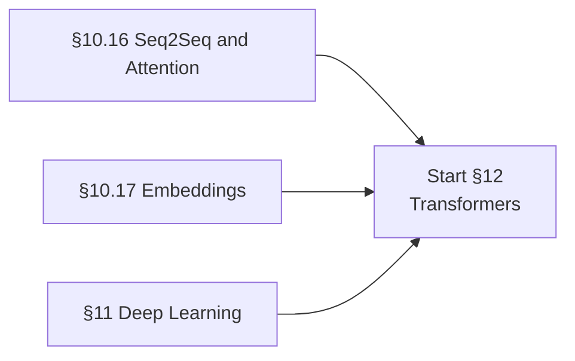

### 12.01 The Road to Attention
Recap of the RNN bottleneck from §10.16. Bahdanau and Luong attention as soft alignment. What removing recurrence buys: parallelism across sequence positions during training, and a path length of one between any two positions instead of O(n). What it costs: quadratic complexity and no built-in notion of order. The 2017 paper read as a response to a specific set of problems rather than as scripture.

### 12.02 Attention from First Principles
**Queries, keys, and values**: Q = XW_Q, K = XW_K, V = XW_V, and the interpretation as a soft, differentiable dictionary lookup with content-based addressing. **Scaled dot-product attention**: softmax(QKᵀ/√d_k)V. **Why √d_k**, derived: for unit-variance independent components, q·k has variance d_k, so without scaling the logits grow with dimension, the softmax saturates, and gradients vanish. This derivation takes ten lines and almost nobody publishes it. Additive versus dot-product attention and why dot-product wins on hardware. **Masks**: the causal/autoregressive mask (upper-triangular −∞) and the equivalence between one masked forward pass and n separate passes, which is why training parallelizes; padding masks; prefix-LM masks. Attention sinks. **Complexity**: O(n²d) time and O(n²) attention-matrix memory, and the crucial distinction that the memory wall (materializing the n×n matrix) usually bites before the FLOP wall, which is exactly what FlashAttention attacks.

### 12.03 Multi-Head Attention
h heads at d/h dimensions each, concatenated and projected. Why multiple subspaces rather than one wide one. Head specialization: induction heads, previous-token heads, positional heads, syntactic heads, which points forward to §14.16. Head redundancy and pruning results. **Cross-attention**: queries from the decoder, keys and values from the encoder, and how that differs from self-attention. Implementing single-head and multi-head attention from raw tensor operations, then visualizing the attention maps.

### 12.04 Positional Information
Why a transformer needs it at all: attention is permutation-equivariant. **Sinusoidal encodings**: the formula, and the rationale that relative offsets are expressible as linear functions of the encoding. **Learned absolute** encodings and their hard length cap. **Relative** position representations (Shaw et al., T5 bucketed biases). **RoPE**: rotating query and key pairs by position-dependent angles so the dot product depends only on relative offset, with the derivation; base-frequency tuning; and how that enables position interpolation and NTK-aware scaling for context extension (§13.15). **ALiBi**: a linear distance penalty on attention logits, no learned parameters, strong length extrapolation. **NoPE** and the finding that decoder-only models learn position implicitly from the causal mask. Length generalization as the criterion that separates these.

### 12.05 The Transformer Block
The full anatomy, with tensor shapes at every step. **Residual connections** and the residual stream as a shared communication bus that every layer reads from and writes to. **Normalization placement**: post-LN (original, needs warmup, unstable at depth) versus **pre-LN** (modern default, stable, but attenuates the residual signal); RMSNorm; QK-norm; sandwich and peri-LN variants. **The feedforward / MLP block**: two linear layers with expansion ratio 4 (or 8/3 for gated variants), where most of the parameters live, and the interpretation of the MLP as key-value memory. **Activation choices**: ReLU → GELU → **SwiGLU**, and why SwiGLU needs three matrices and therefore a width adjustment. Bias terms and why modern models drop them. Weight tying between input embeddings and the output head. Dropout's diminished role at pretraining scale.

### 12.06 The Full Architecture
Embedding → L blocks → final norm → output projection → softmax over vocabulary. **Resource accounting**, made a first-class skill as CS336 does: counting parameters exactly, and the rules of thumb that training costs roughly 6ND FLOPs and inference roughly 2N per token. Memory accounting for training and for inference separately. Implementing a complete decoder-only transformer from scratch and accounting for every parameter and every FLOP. Then training it on something small and watching it work.

### 12.07 Architecture Families
**Encoder-only**: BERT (masked LM plus next-sentence prediction), RoBERTa (drop NSP, dynamic masking, more data), ELECTRA (replaced-token detection), DeBERTa (disentangled attention). Where these still win: classification, retrieval encoders, token labeling. **Decoder-only**: GPT-1/2/3, LLaMA, Mistral, Qwen, OLMo, Gemma. **Why decoder-only won**: a training signal on every token, simpler scaling, and in-context learning. **Encoder-decoder**: T5 and the text-to-text framing with span corruption, BART as a denoising autoencoder, Flan-T5. Still dominant in translation and some seq2seq settings, and worth understanding rather than dismissing.

### 12.08 Mixture of Experts
Sparse activation: total parameters versus active parameters. Top-k routing and the router network. **The load-balancing auxiliary loss** and why it is necessary. Expert capacity and token dropping. Switch Transformer. Expert parallelism and the communication pattern it implies. Shared experts and fine-grained expert designs. The training instabilities specific to MoE. Why MoE is the dominant way to buy capacity without buying inference cost.

### 12.09 Efficient Attention
**FlashAttention** (1, 2, and 3): IO-aware tiling, the online softmax trick, recomputation in the backward pass, and never materializing the n×n matrix; the HBM-versus-SRAM bandwidth reasoning that motivates all of it. Writing a tiled attention kernel yourself is the exercise here. **KV cache**: what is cached, the exact memory formula, prefill versus decode phases, and the observation that decode is memory-bandwidth-bound while prefill is compute-bound. **MQA and GQA**: sharing key and value heads across query heads to shrink the cache, and the quality-versus-memory tradeoff. **PagedAttention and vLLM**: virtual-memory-style KV block management and continuous batching. **Sparse and windowed attention**: Longformer, BigBird, sliding windows, dilated and strided patterns, global tokens, StreamingLLM. **Linear and kernelized attention**: Performer, linear transformers, associative-scan formulations. Multi-head latent attention and cross-layer KV sharing.

### 12.10 Training Transformers
The specific practical knowledge, largely absent from textbooks. Initialization scaled by depth. Learning rate warmup and why it is essential here. **Loss spikes**: what causes them (bad data shards, attention logit growth, numerical issues), how to detect them, and rollback-and-skip as the standard response. Gradient and activation norm monitoring. Attention logit soft-capping and QK normalization as stability measures. Deterministic replay for debugging. Data ordering effects. The full CS336-style exercise: profile a step, identify whether you are bandwidth- or compute-bound, and fix it.

### 12.11 Beyond Text
**Vision Transformers**: patch embedding, the CLS token, the comparison to CNN inductive bias, and the data requirements that follow from having less of it. Hybrid architectures. Swin transformers and hierarchical windows. **Multimodal fusion**: dual-encoder versus fusion-encoder, cross-attention adapters, projector-based approaches. Audio transformers and Whisper. Video and spatiotemporal attention. Transformers for time series, tabular data, and reinforcement learning (Decision Transformer). Perceiver and the general question of what attention is actually for.

### 12.12 Alternatives to Attention
Because knowing what else is on the table is part of understanding what you chose. **State space models**: S4, the HiPPO framing, **Mamba** and selective state spaces, the linear-time recurrence, and the associative scan that makes it parallelizable. The genuine tradeoffs against attention: recall versus efficiency. RWKV. Hybrid attention-SSM stacks and why they are winning in practice. Long convolution models. Retentive networks. The recurring pattern in this literature: everything is trying to recover attention's expressiveness at subquadratic cost, and mostly succeeding partially.

**You should be able to:** derive the √d_k scaling factor; implement multi-head attention from raw tensor operations; prove the causal mask makes one forward pass equivalent to n separate ones; derive why RoPE makes attention scores depend only on relative position; write a complete decoder-only transformer from scratch and account for every parameter and FLOP; compute KV cache memory for a given configuration; explain why FlashAttention is faster without changing the FLOP count; implement a tiled attention kernel; explain the load-balancing loss in MoE; explain what state space models trade away relative to attention.

---

## 13. Large Language Models

> From next-token prediction to systems that reason, retrieve, and act.

Stanford CS336 is explicitly modeled on "build an operating system from scratch," with roughly ten times the code volume of a normal AI course. That is the right model for this section. Every major component gets built: the tokenizer, the architecture, the optimizer, the data pipeline, the training loop, the alignment stage, and the inference stack.

**Prerequisites:** §12.
**Anchor references:** Stanford CS336, CS224N, CS324; Princeton COS 597R; CMU 11-667 and 11-664; Berkeley CS294 LLM Agents; Jurafsky & Martin 3rd ed.; Raschka *Build a Large Language Model (From Scratch)*; Karpathy's nanoGPT and minbpe.

**Prerequisite graph**

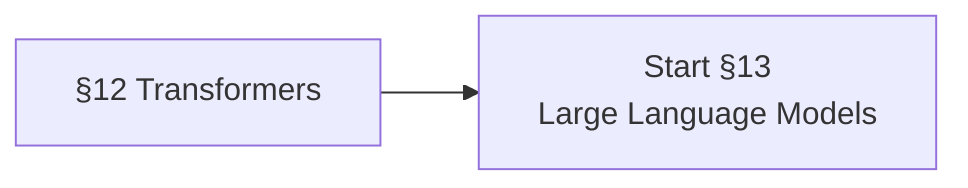

### 13.01 Language Modeling Before Neural Networks
Worth doing properly, because it establishes the objective and the evaluation discipline that everything after inherits. **N-gram language models**: the Markov assumption, MLE from counts, the chain rule factorization, the sparsity and zero-count problem, unknown-word handling, sentence boundary tokens. **Smoothing**: add-one and add-k, backoff (Katz), interpolation, absolute discounting, **Kneser-Ney** with its continuation counts and the "Francisco" intuition, Good-Turing. **Perplexity**: the definition, its relationship to cross-entropy and to branching factor, and the crucial caveat that **it is not comparable across tokenizers or corpora**, with bits-per-byte as the invariant alternative. Classical text representation: bag of words, TF-IDF, PPMI, latent semantic analysis. Classical structure: POS tagging, HMMs and Viterbi, NER with BIO tagging, CFGs and CKY, dependency parsing and transition-based parsing, UAS and LAS. What classical NLP got right (evaluation discipline, linguistic vocabulary, the LM objective itself) and what it got wrong (sparsity, brittle features).

### 13.02 Tokenization
More consequential than its coverage suggests, and Karpathy is right that "a lot of weird behaviors and problems of LLMs actually trace back to tokenization." The granularity spectrum: bytes, characters, subwords, words. The vocabulary-size versus sequence-length tradeoff. **BPE**: training by iteratively merging the most frequent adjacent pair, the merge list as the model, **byte-level BPE** guaranteeing no out-of-vocabulary tokens, and the pre-tokenization regex (GPT-2 versus GPT-4 patterns) and why it matters more than expected. **WordPiece**: the likelihood-maximizing merge criterion, the `##` continuation marker. **Unigram LM / SentencePiece**: starting large and pruning by EM, and subword regularization by sampling segmentations. Whitespace as `▁` and reversibility. **Vocabulary size tradeoffs**: embedding and softmax cost proportional to V·d, sequence length inversely proportional to compression, rare-token undertraining, effect on FLOPs per token. **Pathologies**: digit and arithmetic splitting, reversed strings, spelling and character-counting failures, trailing-whitespace effects, non-English token inflation and the resulting pricing and context-length inequity, code and indentation handling, glitch tokens, Unicode normalization and emoji. Implementing BPE training and encode/decode from scratch, then tracing a real model failure back to its tokenizer.

### 13.03 Pretraining Objectives
**Causal language modeling**: next-token cross-entropy, and the observation that it is the same objective as §11.09 with a different architecture. **Masked language modeling**: 15% masking with the 80/10/10 corruption scheme, and why that scheme exists. **Span corruption** (T5). Prefix LM. Replaced-token detection (ELECTRA) and its sample efficiency argument. Fill-in-the-middle for code. Next-sentence prediction and why it was dropped. The comparison: which objective gives what, and the training-signal-density argument for causal LM.

### 13.04 Pretraining Data
Where most of the actual quality comes from, and where the least is written. Common Crawl: WARC and WET formats, HTML boilerplate removal. Language identification. **Quality filtering**: heuristic rule sets (Gopher, RefinedWeb), classifier-based filtering, perplexity filtering, educational-quality scoring. **Deduplication**: exact hashing, MinHash and LSH for near-duplicates (§7.15 pays off), suffix arrays, and the document-versus-paragraph-level decision. PII removal. Toxicity and NSFW filtering. **Decontamination** against evaluation sets, and the n-gram and canary methods for detecting failure. **Data mixing weights** across domains, and how they are chosen. **Annealing and curriculum**: high-quality data late in training. Named corpora worth knowing: C4, The Pile, RefinedWeb, Dolma, FineWeb and FineWeb-Edu, DataComp-LM, RedPajama. **Synthetic data**: distillation-style generation, textbook-quality data, and the honest state of the "more data or better data" debate. The exercise: turn a raw Common Crawl dump into a usable pretraining corpus.

### 13.05 Scaling Laws
**Kaplan et al.**: power-law relationships in parameters, data, and compute, and the functional form. **Chinchilla**: the correction to Kaplan's parameter bias and the finding that parameters and training tokens should scale together under its assumptions. The often-quoted figure of roughly 20 tokens per parameter is a rule of thumb from that study, not a universal optimum across architectures, data quality, repeated epochs, downstream goals, or inference-aware training. **IsoFLOP profiles** and how to fit a scaling law from a compute sweep. Inference-aware scaling: train smaller and longer if you will serve many tokens. Data-constrained scaling and how many epochs you can repeat before returns vanish. Downstream-task scaling versus loss scaling, and why the two can diverge. What scaling laws predict reliably and where they break. The exercise: run a small compute sweep, fit the law, and project.

### 13.06 Training at Scale
Everything from §11.13, now at the scale where it is not optional. Composing data, tensor, pipeline, sequence, and expert parallelism. ZeRO and FSDP in detail. Memory-efficient optimizers: Adafactor, 8-bit Adam, and the Shampoo/Muon family. Activation checkpointing policy. AdamW hyperparameters at scale and the β choices that matter. **Learning rate schedules at scale**: linear warmup plus cosine, WSD/trapezoidal, and the arguments for each. Batch-size ramping and critical batch size. **µP** for hyperparameter transfer. Instability management as an engineering discipline: monitoring, spike detection, rollback, and skipping data. Checkpointing strategy and fault tolerance. Computing a training budget in GPU-hours from a FLOP estimate, before spending it.

### 13.07 Emergence
The claim: certain capabilities appear discontinuously at scale. **The mirage critique**: apparent discontinuity as an artifact of nonlinear or thresholded metrics, and what happens when you use continuous metrics instead. Skill-Mix and compositional evaluation. Grokking and delayed generalization as a related but distinct phenomenon. Phase transitions during training, including induction-head formation, which is one of the few cases where the mechanism is actually understood. What "emergent" should mean and what it has come to mean. This is a topic where the honest answer is that the debate is live, and presenting it as settled in either direction would be dishonest.

### 13.08 Supervised Fine-Tuning
Instruction tuning: the dataset construction problem. The FLAN collection, Tülu, self-instruct and Alpaca-style generation, and the LIMA "less is more" claim with its caveats. Chat templates, special tokens, and role formatting. **Loss masking on prompts** and why it matters. Multi-turn formatting. Data selection methods. The quality-versus-quantity question. Evaluating an SFT model, and the ways SFT quietly degrades base-model capabilities.

### 13.09 Reward Modeling and RLHF
**Pairwise preference data** and how it is collected. **The Bradley-Terry model** and the derivation of the reward-model loss from it. Reward model training and evaluation (RewardBench). **Reward hacking and overoptimization**: Goodhart's law made concrete, and the empirical curves showing reward going up while quality goes down. **RLHF with PPO**: the four-model setup (policy, value, reference, reward), the KL penalty to the reference policy and exactly what it is doing, advantage estimation with GAE, the clipped surrogate objective, and the per-token KL. InstructGPT as the canonical reference implementation. The practical instability, and the long list of implementation details that turn out to matter.

### 13.10 Preference Optimization Beyond PPO
**DPO**, derived properly: the closed-form optimal policy under KL-regularized reward maximization, the resulting implicit reward β·log(π_θ/π_ref), and the loss that falls out. Why that derivation is the interesting part rather than the algorithm. IPO, KTO, ORPO, SimPO and what each changes. The DPO-versus-PPO debate and the empirical evidence on both sides. **RLAIF and Constitutional AI**: AI-generated critiques and revisions, principle-based feedback, the HHH criteria. **RLVR / reasoning RL**: verifiable rewards on math and code, GRPO, DAPO, the DeepSeek-R1 RL-first recipe, process reward models versus outcome reward models, rejection sampling and STaR-style bootstrapping. Safety tuning: refusal training, red-teaming, jailbreak robustness, and the measured evidence that safety training is shallow.

### 13.11 Parameter-Efficient Fine-Tuning
**LoRA**: the low-rank update ΔW = BA (which is §2.04 doing real work), rank r, the α/r scaling, which modules to target, zero-initialization of B, merging at inference, and multi-adapter serving. Rank selection in practice. **QLoRA**: 4-bit NF4 base weights, double quantization, paged optimizers. **Adapters** (Houlsby bottleneck), **prefix tuning**, **prompt tuning** and the "power of scale" result, P-tuning v2, IA³, BitFit. Quantifying the trainable-parameter and memory savings exactly. When full fine-tuning still wins, said plainly. Related compression: structured pruning, distillation into smaller models, quantization-aware fine-tuning.

### 13.12 Inference and Decoding
**Autoregressive decoding mechanics**: prefill versus decode, KV cache reuse, time-to-first-token versus inter-token latency, and the fact that these are different optimization problems. **Sampling strategies**: greedy; **beam search** and precisely why it fails for open-ended generation (degeneration, length bias, and the length-normalization patch); **temperature** and its effect on the distribution; **top-k**; **top-p / nucleus**; min-p; typical and epsilon sampling; repetition, frequency, and presence penalties; contrastive decoding. **Constrained decoding**: grammar-guided generation, JSON and regex constraints, logit biasing, and the FSM-based implementations. **Speculative decoding**: draft model plus target verification, the acceptance criterion that provably preserves the target distribution, expected speedup analysis, Medusa, EAGLE, and n-gram drafting.

### 13.13 Quantization and Compression
Post-training quantization versus quantization-aware training. Weight-only versus weight-plus-activation. **GPTQ** and its second-order / OBQ derivation. **AWQ** and activation-aware salient-channel scaling. SmoothQuant. **GGUF and llama.cpp k-quants.** bitsandbytes int8 and NF4. **Outlier features** and why they are the central difficulty. KV-cache quantization. Per-channel and per-group scales. Measuring the quality cost honestly rather than by cherry-picked benchmarks. Pruning: unstructured, structured, and 2:4 semi-structured sparsity. Distillation for compression.

### 13.14 Serving
Continuous / in-flight batching. Chunked prefill. Prefix and prompt caching. Disaggregated prefill and decode. Tensor parallelism at serve time. **The latency-throughput-cost frontier** and how to reason about where you want to sit on it. SLO-driven configuration. Load balancing and autoscaling for autoregressive workloads. Streaming responses. The engineering reality that inference cost usually dominates training cost over a model's lifetime, which reframes several earlier decisions.

### 13.15 Long Context
**Position interpolation**, NTK-aware RoPE scaling, YaRN, adjusted base frequency, all of which are §12.04 cashing out. Continued pretraining on long documents, and the data engineering that requires. **Efficiency**: ring attention, sliding window plus attention sinks, StreamingLLM, hierarchical and landmark attention, KV eviction policies (H2O, SnapKV), memory compression. **Evaluation**: needle-in-a-haystack and its well-documented weaknesses, RULER, "lost in the middle" positional degradation, multi-needle and multi-hop tasks. The long-context versus RAG tradeoff, argued from cost and from accuracy rather than from preference.

### 13.16 Prompting and In-Context Learning
Zero-shot versus few-shot. Demonstration selection and the surprisingly large ordering effects. Instruction formatting, delimiters, system prompts, output-format control. **In-context learning**: what actually makes it work (label correctness matters less than format and input distribution, which is a genuinely counterintuitive result), the induction-head mechanism, and the competing hypotheses that ICL is implicit gradient descent or implicit Bayesian inference. In-context versus in-weights generalization and how they differ. **Prompt optimization** as a real discipline: DSPy, MIPRO, automatic instruction and demonstration optimization, and the argument that hand-writing prompts is the wrong abstraction.

### 13.17 Retrieval-Augmented Generation
**Chunking**: fixed, recursive, semantic, and late chunking, and why chunk boundaries matter more than people expect. **Embedding models**: contrastive training, hard negatives, and how retrieval encoders differ from generation models. **Vector indexes**: HNSW, IVF-PQ, and the recall-latency tradeoff (§7.15). **Hybrid search**: BM25 plus dense retrieval, reciprocal rank fusion. **Rerankers**: cross-encoders, ColBERT late interaction. Query rewriting, expansion, and HyDE. **Adaptive retrieval**: Self-RAG and knowing when *not* to retrieve. Architectural retrieval: kNN-LM, RETRO, REALM. Citation and attribution; groundedness evaluation. Evaluating a RAG system end to end, and the fact that retrieval failures and generation failures need separate measurement.

### 13.18 Tool Use and Agents
**Function calling**: schema design, argument validation, error handling and retries. Toolformer-style self-supervised tool learning. **ReAct** and interleaved reasoning and acting. Execution feedback loops. Tool protocols and interoperability. **Agents**: planning and task decomposition (Plan-and-Solve, ADaPT); **memory** (short-term context, episodic and semantic long-term stores, HippoRAG); reflection and self-critique, along with the sobering evidence that LLMs cannot reliably self-correct reasoning without external signal. Environments and agent-computer interfaces: SWE-agent, OpenHands, WebArena, WorkArena. **Multi-agent systems**: collaboration, debate, role specialization, AutoGen and StateFlow, and the question of when multi-agent actually beats a single well-prompted model. Agent evaluation and the difficulty of it. Agent safety: sandboxing, permission models, capability measurement (Cybench).

### 13.19 Reasoning
Chain-of-thought, few-shot and zero-shot. CoT without prompting. **Self-consistency** and majority voting. Least-to-most prompting. **Tree of thoughts** and graph of thoughts. Program-aided LMs and code as a reasoning substrate. **Process supervision versus outcome supervision**: "Let's Verify Step by Step," Math-Shepherd, and why process rewards help. STaR and rejection-sampling bootstrapping. **Test-time compute scaling**: best-of-n, verifier-guided search, MCTS-style search, budget forcing, and the inference scaling laws. o1- and R1-style RL-trained long chain-of-thought models. Distilling reasoning traces into small models. **The theory**: chain-of-thought lets a transformer perform serial computation it cannot do in a single forward pass, which is a real complexity-theoretic result. **The critical findings**, given equal weight: premise-order sensitivity, GSM-Symbolic perturbation fragility, and the "to CoT or not to CoT" meta-analysis showing gains concentrate on math and symbolic tasks.

### 13.20 Evaluation
**Intrinsic**: perplexity and bits-per-byte, and the cross-tokenizer comparability problem again. **Benchmarks** and what each actually measures: MMLU and MMLU-Pro, HellaSwag, ARC, WinoGrande, TruthfulQA, GSM8K, MATH, HumanEval and MBPP, SWE-bench, BIG-bench and BIG-bench Hard, GPQA, IFEval, HELM, LMSYS Chatbot Arena Elo, AlpacaEval, MT-Bench. **Methodology**: prompt-format sensitivity, few-shot count effects, log-likelihood scoring versus generation, answer-length normalization, multiple-choice ordering bias, and reporting confidence intervals across seeds (which §4 says you must and nobody does). **LLM-as-judge**: position bias, verbosity bias, self-preference bias, and calibration against human judgment. **Contamination**: train-test overlap, detection methods, benchmark leakage, held-out and dynamic benchmarks. **Pitfalls**: Goodhart's law, benchmark saturation, construct validity, and the cost of evaluation itself.

### 13.21 Multimodal Models
Vision-language architectures: dual-encoder (CLIP-style), fusion-encoder, and projector-based (LLaVA-style) designs, with the tradeoffs. Q-Former and cross-attention adapters (BLIP-2, Flamingo). **Image tokenization**: ViT patches versus VQ-VAE/VQ-GAN discrete tokens, and what each enables. Any-to-any unified token-space models. Audio-text (Whisper, AudioLM) and video (spatiotemporal patches, temporal attention). Text-to-image conditioning via cross-attention and classifier-free guidance (§11.07). Multimodal instruction tuning and preference tuning. **The modality gap** and alignment. Hallucination and grounding evaluation. Embodied and vision-language-action models. Benchmarks: MMMU, MMBench, and their limitations.

### 13.22 Failure Modes and Risks
**Hallucination**: the taxonomy (intrinsic versus extrinsic, factuality versus faithfulness), the causes (training objective, data, decoding, calibration), detection methods, and mitigation, along with the argument that some of it is irreducible given the objective. **Prompt injection** and indirect prompt injection, which is the central unsolved security problem for agentic systems. **Jailbreaking**: gradient-based attacks, transfer attacks, many-shot and multi-turn attacks, and why safety training is shallow. Training data extraction and memorization. Bias and representational harm. Overconfidence and poor calibration. Sycophancy. Distribution shift at deployment. Denial-of-service through prompt-driven compute amplification. What defenses actually exist versus what is claimed.

**You should be able to:** implement BPE training and encoding from scratch and trace a model failure to the tokenizer; implement a complete decoder-only LM and train it; build a pretraining data pipeline including deduplication and filtering; fit a scaling law and extrapolate it; implement SFT with correct prompt masking; derive the DPO objective from KL-regularized reward maximization and implement it; implement LoRA and account for the memory savings; implement top-p sampling and speculative decoding; build a RAG pipeline and evaluate retrieval and generation separately; design an evaluation with error bars and explain why the standard leaderboard numbers do not have them; explain the mechanism of a prompt injection attack and why input filtering does not solve it.

---

## 14. Beyond

> Everything that does not fit on the main line, plus the parts of AI that predate the current wave and still matter.

Two things are grouped here. First, reinforcement learning and classical AI, which are full fields rather than topics, and which the transformer-centric path skips entirely. Second, the frontier: interpretability, alignment, causality, and open-endedness.

Their placement here is organizational, not a prerequisite claim. Classical AI can begin after §0.14 and the discrete mathematics in §0; tabular reinforcement learning can begin after dynamic programming and probability; deep reinforcement learning adds neural networks. These branches can be studied well before transformers or language models.

**Prerequisites:** varies by module. RL needs §3, §5, and §10. Interpretability needs §12. Causality needs §4.
**Anchor references:** Russell & Norvig *AIMA* 4th ed.; Berkeley CS188; Sutton & Barto *Reinforcement Learning*; Silver's UCL course; Stanford CS234; Berkeley CS285; Koller & Friedman; Pearl *Causality*; Neal *Introduction to Causal Inference*; Anthropic's Transformer Circuits thread; ARENA; AI Safety Fundamentals.

**Prerequisite graph**

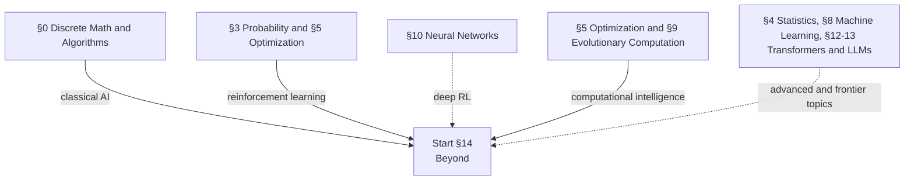

### 14.01 Classical AI, the Part Usually Skipped
Agents and environments; rationality; PEAS task specification; environment properties; agent architectures from simple reflex through utility-based and learning agents. **Search**: problem formulation, BFS, uniform-cost, DFS, depth-limited and **iterative deepening**, bidirectional; greedy best-first, **A\***, admissibility and consistency, IDA\*, RBFS, SMA\*; heuristic quality and effective branching factor; relaxed problems, **pattern databases**, landmarks, learned heuristics. **Local search**: hill climbing and variants, simulated annealing, local beam search, continuous-space local search (and note that AIMA puts evolutionary algorithms right here, which is a defensible placement). **Adversarial search**: minimax, **alpha-beta pruning**, move ordering, evaluation functions, quiescence, the horizon effect, transposition tables, **Monte Carlo tree search and UCT**, expectiminimax. **Constraint satisfaction**: node, arc, and path consistency, AC-3, global constraints, backtracking with MRV and least-constraining-value heuristics, forward checking, MAC, conflict-directed backjumping, no-good learning, min-conflicts, tree-structured CSPs, cutset conditioning, symmetry breaking. **Logic and knowledge representation**: propositional logic, resolution, Horn clauses, forward and backward chaining, DPLL and WalkSAT; first-order logic, unification, Prolog; description logics; default reasoning. **Planning**: PDDL, forward and backward state-space search, planning as SAT, planning graphs and GraphPlan, delete-relaxation heuristics, landmarks, HTN planning, contingent and conformant planning, replanning, scheduling with resources. Why this matters now: agents plan, tool use is a search problem, constraint solving is coming back through LLM-plus-solver pipelines, and most "novel" agent architectures are rediscovering this material.

### 14.02 Reinforcement Learning: Foundations
The agent-environment interface. Rewards, returns, episodic versus continuing tasks, discounting and the unified notation. **Markov decision processes**. Policies and value functions. **The Bellman expectation equations**, derived. Optimal policies, optimal value functions, and **the Bellman optimality equations**. Why value iteration converges: the Bellman operator is a contraction, and the Banach fixed point theorem from §1.13 does the work. Optimality versus approximation. **Multi-armed bandits** as the simplest instance: action-value methods, incremental updates, nonstationarity and constant step sizes, optimistic initialization, **UCB**, gradient bandits, Thompson sampling, regret definitions and bounds, contextual bandits.

### 14.03 Reinforcement Learning: Tabular Methods
**Dynamic programming**: policy evaluation, policy improvement and the policy improvement theorem, **policy iteration**, **value iteration**, asynchronous DP, generalized policy iteration as the organizing idea, and the notion of bootstrapping. **Monte Carlo methods**: prediction, action-value estimation, exploring starts, on-policy ε-soft control, **off-policy prediction via importance sampling** (ordinary versus weighted), incremental implementation. **Temporal-difference learning**: the TD error, why TD beats MC and DP on their respective weaknesses, the optimality of TD(0) and certainty equivalence, **Sarsa**, **Q-learning**, Expected Sarsa, maximization bias and **Double Q-learning**. **n-step methods** and the unification of MC and TD. **Eligibility traces**: the λ-return, forward and backward views, **TD(λ)**, true online TD(λ), Sarsa(λ). **Planning and learning together**: sample versus distribution models, **Dyna-Q**, Dyna-Q+ for changing environments, prioritized sweeping, trajectory sampling, decision-time planning, rollout algorithms, **Monte Carlo tree search**.

### 14.04 Reinforcement Learning: Approximation and Deep RL
Value function approximation and the prediction objective. **Semi-gradient methods** and why they are not true gradient descent. Linear methods and feature construction: polynomials, Fourier bases, coarse coding, **tile coding**, RBFs. LSTD. Nonlinear approximation with neural networks. **The deadly triad**: function approximation plus bootstrapping plus off-policy learning, Baird's counterexample, and the divergence it produces. Gradient-TD and Emphatic-TD as principled fixes. **DQN**: experience replay, target networks, frame stacking, reward clipping, and each component's ablated contribution. **Double DQN**, **Dueling DQN**, **prioritized experience replay** with its importance-sampling correction, multi-step returns, Noisy Nets, **distributional RL** (C51, QR-DQN, IQN), and **Rainbow** as the ablation study that ties them together. R2D2 and recurrent value functions.

### 14.05 Reinforcement Learning: Policy Gradients and Actor-Critic
Why parameterize the policy directly: stochastic optimal policies, continuous actions, smooth policy change. **The policy gradient theorem**, with proof. **REINFORCE** and the high-variance problem. Baselines and why subtracting one does not bias the estimate. **Actor-critic** methods. A2C and A3C, asynchronous workers, the entropy bonus. **Generalized advantage estimation.** **TRPO**: the trust region, the natural gradient, conjugate gradient plus line search, and the performance-difference lemma the whole thing rests on. **PPO**: the clipped surrogate objective, the adaptive KL variant, and the long list of implementation details that turn out to matter more than the algorithm. Continuous control off-policy: **DDPG** (deterministic policy gradient, exploration noise), **TD3** (clipped double-Q, delayed updates, target smoothing), **SAC** (the maximum-entropy objective, automatic temperature tuning, reparameterized sampling). IMPALA and V-trace. Average-reward formulations for continuing tasks.

### 14.06 Reinforcement Learning: Exploration
Why ε-greedy is not enough. Optimism under uncertainty. UCB in the MDP setting. Thompson and posterior sampling; bootstrapped DQN. Count-based exploration and pseudo-counts. **Intrinsic motivation**: curiosity via forward-model error (ICM), random network distillation, information gain (VIME). Go-Explore. Maximum-entropy exploration. Hard-exploration benchmarks and why Montezuma's Revenge became the canonical one. Exploration in continuous and high-dimensional spaces. The connection to novelty search in §9.16, which is the same problem approached from a different field.

### 14.07 Reinforcement Learning: Model-Based and Search
Model learning: one-step, multi-step, and latent dynamics. Compounding model error and why it is the central difficulty. Uncertainty-aware ensembles (PETS). Dyna-style integration. Planning with a learned model: CEM, MPPI, shooting methods, **model predictive control**. **Optimal control**: LQR, iLQR, DDP, and the connection between control and RL. **Dreamer and world models**: latent imagination, recurrent state-space models. **MuZero**: learning dynamics in a value-equivalent latent space and planning with MCTS. **AlphaGo, AlphaGo Zero, and AlphaZero**: policy and value networks, rollouts, self-play, PUCT, and the progression from imitation to pure self-play. Sim-to-real transfer and domain randomization.

### 14.08 Reinforcement Learning: Offline, Imitation, and Inverse
**Offline RL**: distributional shift and extrapolation error as the core problem. Behaviour-constrained methods (BCQ, BEAR, TD3+BC), conservative value estimation (**CQL**), implicit Q-learning, model-based offline methods (MOReL, MOPO). Sequence-modeling approaches: **Decision Transformer** and Trajectory Transformer, which reframe RL as conditional sequence modeling. Off-policy evaluation: importance sampling, doubly robust estimators, fitted Q-evaluation. **Imitation learning**: behaviour cloning, covariate shift, **DAgger**. **Inverse RL**: feature matching, max-margin, **maximum entropy IRL**, guided cost learning, adversarial IRL, **GAIL**. Preference-based RL, which is where this section meets §13.09: preference-based RLHF learns a reward or preference model from comparisons and then optimizes a policy. It is closely related to reward learning and inverse RL, but it is not synonymous with classical IRL.

### 14.09 Reinforcement Learning: Multi-Agent and Hierarchical
**Multi-agent RL**: stochastic and Markov games, Nash and correlated equilibria, the non-stationarity problem for independent learners, centralized training with decentralized execution, MADDPG, value factorization (VDN, QMIX), COMA, self-play, population-based training, league training. Fictitious play. Opponent modeling. Emergent communication. Social dilemmas and cooperation. **Hierarchical RL**: the options framework (initiation set, policy, termination), semi-MDPs, option-critic, feudal networks, goal-conditioned RL and hindsight experience replay, unsupervised skill discovery (DIAYN, VIC). **RL theory**: convergence of tabular Q-learning under Robbins-Monro conditions, PAC-MDP sample complexity, regret bounds, linear MDPs, pessimism in offline RL.

### 14.10 Swarm Intelligence
**Foundations**: self-organization through positive and negative feedback, **stigmergy** (sematectonic and sign-based), emergence, decentralized control, robustness and scalability. Biological case studies: ant foraging, the honeybee waggle dance, termite construction, schooling and flocking. **Boids**: separation, alignment, cohesion; neighborhood radius and field of view; the Vicsek model and order parameters for collective motion. **Particle swarm optimization**: position and velocity updates, cognitive and social components, gbest versus lbest topologies, inertia weight, the constriction factor, velocity clamping, boundary handling, stability analysis and swarm explosion, binary and discrete variants, multi-objective PSO, and honest comparison against DE and CMA-ES. **Ant colony optimization**: the pheromone model, the probabilistic transition rule, evaporation, Ant System → Ant Colony System → **MAX-MIN Ant System** → rank-based AS; the construction graph; applications to TSP, routing, and scheduling; convergence results; hybridization with 2-opt. Artificial bee colony. **The metaphor critique**: the flood of "novel" nature-inspired metaheuristics that are relabeled versions of existing algorithms, and how to evaluate a new metaheuristic skeptically. **Swarm robotics**: aggregation, dispersion, collective transport, task allocation, morphogenesis, embodiment constraints, the sim-to-real gap.

### 14.11 Fuzzy Systems and Rough Sets
**Fuzzy sets**: crisp versus fuzzy membership, membership functions, support, core, α-cuts, height, normality, convexity, fuzzy numbers, linguistic variables and hedges. Membership function shapes and data-driven design (fuzzy c-means). **Operators**: complements, **t-norms** and **t-conorms**, De Morgan triples, aggregation operators (OWA, Choquet integral), fuzzy relations and composition, the extension principle. **Fuzzy logic and reasoning**: fuzzy propositions, implication operators (Mamdani, Larsen, Zadeh, Łukasiewicz, Gödel), generalized modus ponens, the compositional rule of inference, rule-base completeness and consistency. **Inference systems**: **Mamdani** (fuzzification, rule evaluation, aggregation, defuzzification) and **Takagi-Sugeno-Kang** (linear consequents, weighted average output, and its reading as a set of local linear models). **Defuzzification**: centroid, bisector, mean/smallest/largest of maximum, and the tradeoffs. **Fuzzy control**: architecture, scaling factors, the rule surface, stability analysis, and the classic case studies (inverted pendulum, Sendai subway, cement kilns). **Neuro-fuzzy**: **ANFIS** and its five-layer hybrid-learning architecture, NEFCON/NEFCLASS, genetic-fuzzy systems and the interpretability-accuracy tradeoff. Type-2 fuzzy sets and the footprint of uncertainty. **Rough sets**: indiscernibility, lower and upper approximation, boundary regions, reducts and core, decision rules, dependency degree, and the comparison to fuzzy sets. Why this is here: it is the third leg of classical computational intelligence, and the TSK-as-local-linear-models reading connects directly to mixture-of-experts.

### 14.12 Computational Intelligence as a Field
The synthesis: neural networks, evolutionary computation, swarm intelligence, and fuzzy systems as one tradition, defined by biologically and naturally inspired computation, tolerance for imprecision, and adaptation rather than proof. The historical relationship to symbolic AI and to statistical machine learning, including the periods when each was ascendant. Hybrid systems: evolving neural networks (§9.15), genetic-fuzzy systems, neuro-fuzzy control, evolutionary reinforcement learning. What this tradition has that the current mainstream does not: gradient-free search, population-based diversity, multi-objective reasoning, interpretable rule bases, and open-ended search. Where it has been absorbed and where it remains distinct. This module is partly historical and partly a working argument for why the material in §9 and §14.10 and §14.11 still earns its place.

### 14.13 Probabilistic Graphical Models, Advanced
The full Koller and Friedman treatment for anyone who wants it, extending §8.15. **Representation**: local probabilistic models (noisy-or, tree CPDs, context-specific independence), template-based models (plate models, dynamic Bayesian networks, relational models), Gaussian networks, exponential family representations. **Inference**: clique trees, inference as optimization (cluster graphs, propagation-based approximation, structured variational methods), particle-based approximate inference, MAP inference in depth, hybrid networks, temporal models. **Learning**: parameter estimation, structure learning in Bayesian networks, learning with partially observed data, learning undirected models and the partition function problem. **Actions and decisions**: influence diagrams, utility theory, value of information, structured decision problems. Bayesian nonparametrics: Dirichlet processes, stick-breaking, the Chinese restaurant process, hierarchical Dirichlet processes.

### 14.14 Causal Inference
The section that fixes the "correlation is not causation" caveat that §3 and §4 kept deferring. **Potential outcomes**: individual treatment effect, ATE, ATT, CATE, the fundamental problem of causal inference, ignorability and conditional exchangeability, positivity, SUTVA, consistency, no interference. **Graphical models for causality**: causal DAGs, chains, forks, and **colliders**; d-separation; the flow of association versus the flow of causation; the causal edge assumption. **The do-operator**, modularity, truncated factorization, interventions as graph surgery. **The backdoor criterion** and the adjustment formula. Collider bias, M-bias, and conditioning on descendants, which is how well-intentioned "controlling for confounders" makes things worse. **The frontdoor criterion.** **Pearl's do-calculus**, its three rules, its completeness, and the ID algorithm. Structural causal models. **Estimation**: g-computation, inverse probability weighting, **propensity scores** and the propensity score theorem, matching, doubly robust estimators, **double/debiased machine learning**, causal forests, meta-learners (S, T, X). **Unobserved confounding**: no-assumptions bounds, sensitivity analysis, the E-value, omitted-variable-bias frameworks. **Natural experiments**: instrumental variables (relevance, exclusion, independence; the Wald estimator; 2SLS; LATE and compliers; weak instruments), difference-in-differences and parallel trends, regression discontinuity, synthetic control. **Causal discovery**: Markov equivalence classes, constraint-based methods (PC, FCI), score-based (GES), functional causal models (LiNGAM, additive noise), and the faithfulness assumption. Transportability and data fusion; invariant causal prediction. **The ladder of causation**: association, intervention, counterfactuals; counterfactual identification; abduction-action-prediction; mediation analysis and direct versus indirect effects. Causal representation learning. Why this belongs in an AI curriculum: every deployed model makes implicit interventional claims, and almost none of them are licensed by the training procedure.

### 14.15 Neuro-Symbolic AI
The taxonomy (Kautz's six types) as a way to organize a confusing literature. Logic tensor networks. DeepProbLog and probabilistic logic programming. Semantic loss and constraint injection into training. Differentiable theorem proving; logical neural networks. Abductive learning. Neural module networks. **Program synthesis**: DreamCoder, library learning, wake-sleep. Scene graphs and neuro-symbolic visual question answering. Knowledge graph embeddings and reasoning. **LLM plus solver pipelines**: LLM-Modulo, program-aided LMs, SAT/SMT and planner integration, which is where §14.01 comes back. Systematicity and compositional generalization: SCAN, CLEVR, COGS, ARC, and what those benchmarks are actually testing.

### 14.16 Interpretability
**Post-hoc methods and their limits**: saliency maps, gradient × input, integrated gradients, SmoothGrad, Grad-CAM, LIME, SHAP, and the sanity-check literature showing several of them are insensitive to the model. Probing classifiers and their confounds. Feature visualization. **Mechanistic interpretability**, which is where the real progress is: the **residual stream** as a communication channel; QK and OV circuits; attention head composition; path expansion and logit attribution. **Circuits**: induction heads and the in-context learning phase change; previous-token heads; the indirect object identification circuit with its name-mover and S-inhibition heads; modular addition and grokking circuits; curve detectors from the original vision work. **Features and superposition**: polysemanticity, the toy models of superposition, feature dimensionality and phase diagrams, privileged bases, the linear representation hypothesis. **Dictionary learning**: sparse autoencoders (L1, TopK, gated, JumpReLU variants), monosemanticity, feature splitting and absorption, dead features, scaling to production models, feature steering, transcoders, crosscoders and model diffing, automated feature labeling, and the unresolved problem of evaluating SAEs. **Causal interventions**: activation patching and causal tracing, path patching, attribution patching, ablation (zero, mean, resample), attribution graphs and circuit tracing, causal scrubbing. Faithfulness versus plausibility of explanations. Logit lens and tuned lens. Chain-of-thought faithfulness, and the evidence that stated reasoning often is not the actual reasoning. Tooling: TransformerLens, nnsight, Neuronpedia.

### 14.17 AI Safety and Alignment
**The problem statement**: outer versus inner alignment, specification gaming, goal misgeneralization, reward hacking, instrumental convergence, power-seeking, deceptive alignment. Each of these stated precisely enough to argue about rather than as vibes. **Learning from feedback** as the current approach and its known failure modes (§13.09, §13.10). **Scalable oversight**: debate, recursive reward modeling, iterated amplification, weak-to-strong generalization, sandwiching experiments, process versus outcome supervision. **Control**: the assumption-light framing that asks what you can do with a model you do not trust; untrusted monitoring, containment protocols, trusted editing. **Evaluations**: dangerous capability evaluations, elicitation versus existence of capability, sandbagging, responsible scaling policies, safety cases. **Unlearning** and its current inadequacy. Governance-adjacent technical work: compute governance, model reporting, standards, watermarking and provenance. An honest accounting of what is empirical, what is speculative, and what is contested, because this field has more confident assertion than evidence.

### 14.18 Robustness and Adversarial Machine Learning
**Adversarial examples**: FGSM, PGD, Carlini-Wagner; threat models (L_p balls, patches, semantic perturbations); transferability; black-box and query-based attacks. **Defenses**: adversarial training and its cost, gradient masking and why most early defenses were broken, certified defenses (randomized smoothing, interval bound propagation), and the robustness-accuracy tradeoff. **Data poisoning and backdoors**: availability versus integrity attacks, trigger design, detection. **Privacy attacks**: model extraction, model inversion, membership inference, training data extraction from language models. **Defenses**: differential privacy and DP-SGD, and the utility cost. **Distribution shift and OOD detection**: covariate and label shift, OOD scoring methods, calibration under shift, and the general observation that models fail silently rather than loudly. Evaluation-gaming. The security mindset applied to ML systems.

### 14.19 Complexity, Artificial Life, and Open-Endedness
**Cellular automata**: Wolfram classes, Rule 110 universality, Conway's Game of Life, Langton's λ and the edge-of-chaos hypothesis. **Self-replication**: von Neumann's universal constructor, Langton loops. **Digital evolution**: Tierra, Avida, and experimental evolution as an actual scientific instrument. L-systems and morphogenesis. Reaction-diffusion and Turing patterns. Lenia and continuous CA. Neural cellular automata. **Agent-based models**: Sugarscape, Schelling segregation, and emergence from simple local rules. Self-organized criticality: the sandpile model, power laws. Network science: small-world, scale-free, percolation. Information-theoretic complexity measures: Kolmogorov complexity, logical depth, effective complexity, and their relationship to §6. **Open-endedness**: what it would mean for a process to keep producing novelty indefinitely, minimal criterion coevolution, POET, innovation engines, evolvability, and the major evolutionary transitions as the biological reference case. Embodiment, situatedness, autopoiesis. Evolutionary robotics and the reality gap. This module connects §9.16 to §14.10 and is the part of the field most likely to matter in ways nobody currently predicts.

### 14.20 Whatever Comes Next
An intentionally open staging slot. The field moves faster than any curriculum, and pretending otherwise would be dishonest. This is where new material can be tested before it earns a permanent home, and where things that turn out not to matter can be removed without disturbing anything else. Permanent modules added later may have higher IDs, so this slot is conceptually open even when it is not visually last.

### 14.21 Human-AI Interaction
AI systems as participants in human workflows rather than isolated predictors. Human capabilities, limitations, and mental models. **Automation bias**, algorithm aversion, overreliance, deskilling, and complacency. Calibrated trust and the distinction between model confidence, uncertainty, and communicated confidence. Mixed-initiative interaction: deciding when the person acts, when the system acts, and when either should defer. Explanations as interfaces rather than artifacts, with task-specific evaluation. Human-in-the-loop evaluation, inter-rater reliability, preference elicitation, and the limits of convenience samples. Accessibility and inclusive design. Oversight, escalation, contestability, and recovery from errors. Longitudinal effects, feedback loops, and measuring whether a system improves the human outcome it was built to support.

### 14.22 Privacy-Preserving and Federated Learning
Privacy threat models before mechanisms. **Differential privacy**: neighboring datasets, ε-DP and (ε,δ)-DP, global and local sensitivity, the Laplace and Gaussian mechanisms, post-processing, composition, privacy amplification by subsampling, and privacy accounting. **DP-SGD**: per-example gradient clipping, noise addition, accounting, and the privacy-utility tradeoff. Local differential privacy. Secure aggregation and its relationship to cryptographic privacy. **Federated learning**: FedAvg, client sampling, communication constraints, non-IID and unbalanced client data, personalization, stragglers, and poisoning risks. Cross-device versus cross-silo settings. The central warning: federated learning keeps raw data decentralized but does not by itself provide a privacy guarantee.

### 14.23 Game Theory and Strategic Interaction
Decision making when other agents adapt. Normal-form games, best responses, dominated strategies, pure and mixed strategies, and **Nash equilibrium**. Extensive-form games, information sets, subgame-perfect equilibrium, and backward induction. Zero-sum games, minimax, linear programming, and regret minimization. Repeated games, cooperation, punishment, and folk-theorem intuition. Correlated equilibrium and no-regret learning. Bayesian games and incomplete information. Mechanism design, incentive compatibility, revelation principles, auctions, matching markets, and social choice. Evolutionary game theory and replicator dynamics. Connections to multi-agent reinforcement learning, adversarial learning, markets, platform design, and alignment between individually rational behavior and system-level outcomes.

**You should be able to:** implement A\* and prove admissibility implies optimality; implement minimax with alpha-beta and MCTS and compare them; derive the Bellman optimality equations and prove value iteration converges via the contraction property; implement Q-learning, DQN, REINFORCE, A2C, and PPO from scratch; explain the deadly triad and construct a divergence example; implement PSO and ACO and compare against DE on the same benchmarks; build a Mamdani fuzzy controller and defend every design choice; identify a causal effect using the backdoor criterion and estimate it three ways; apply do-calculus to a graph where no simple adjustment set exists; train a sparse autoencoder on a transformer's residual stream and interpret features; run an activation patching experiment to localize a behaviour; construct an adversarial example and explain why gradient masking is not a defense; design a human evaluation that measures calibrated reliance rather than preference alone; compute and compose a differential privacy guarantee; solve a small strategic interaction and explain what its equilibrium predicts.

---

## Non-Goals

Stated explicitly, because scope creep is the failure mode of a project this size, and because knowing what a resource will not do is as useful as knowing what it will.

- **Not a framework tutorial.** PyTorch and JAX are used, not taught for their own sake. There is no chapter on the `transformers` library API.
- **Not exhaustive.** Entire degrees exist for many of these sections. The target is deep enough to understand what a concept is, why it exists, how it works, what it connects to, and why it matters, plus deeper wherever a rabbit hole is interesting.
- **Not a production ML engineering course.** MLOps, feature stores, orchestration, and serving infrastructure appear only where they change what you should understand about the model.
- **Not current-events tracking.** Frontier model releases and API changes date immediately. Papers are cited where they are load-bearing, not to be comprehensive.
- **Not a replacement for the primary sources.** The canonical texts and courses are cited throughout and should be read. This is a path through them with the derivations filled in.
- **Not opinion-free.** Where the literature is contested (emergence, double descent, whether BatchNorm reduces internal covariate shift, whether interpretability findings generalize), the disagreement is presented as disagreement.

---

## Module Structure

The [module file structure, directory responsibilities, metadata, and content layout](STYLE_GUIDE.md#module-file-structure) are defined in the style guide. Keeping that detail in one place avoids drift as the module format evolves.

Repository-level files maintained from the start, because they are cheap now and expensive to retrofit: `NOTATION.md`, `GLOSSARY.md`, `PREREQUISITES.md`, `STYLE_GUIDE.md`, `SOURCES.md`, `CONTRIBUTING.md` with a topic template, and `ERRATA/`.

---

## Current Status

🚧 **Very early development.**

The roadmap above is a direction, not a claim that any of it is written. Nearly every module is a `stub`. Expect incomplete sections, reorganized directories, rewritten explanations, questionable first drafts, exercises without solutions, solutions without elegant explanations, and occasional mathematical crimes.

The project will improve as I work through it. That is the whole idea.
